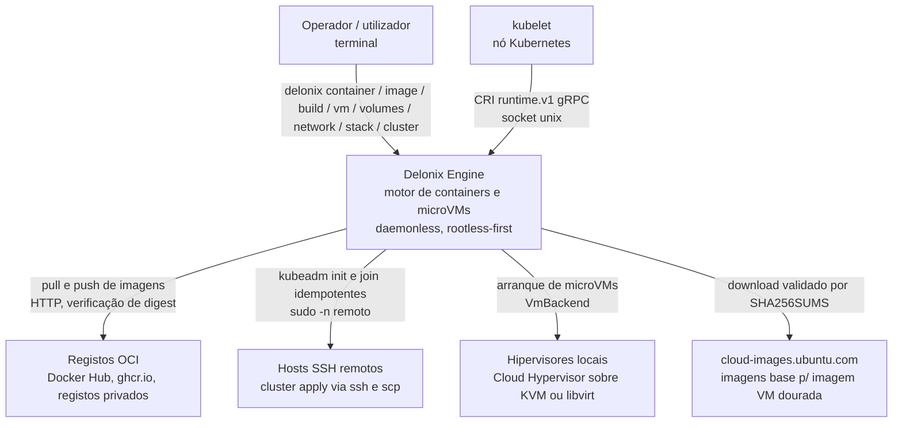
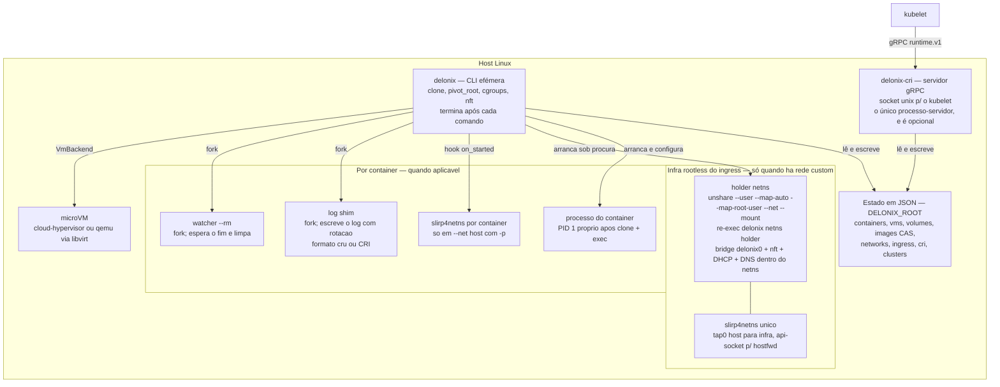
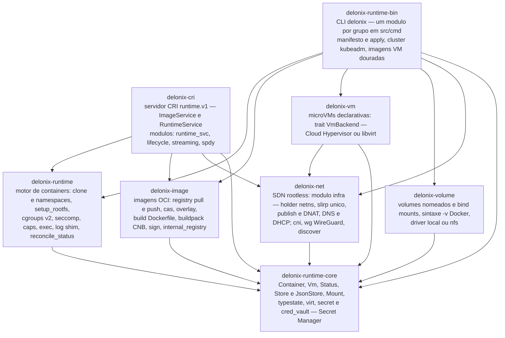
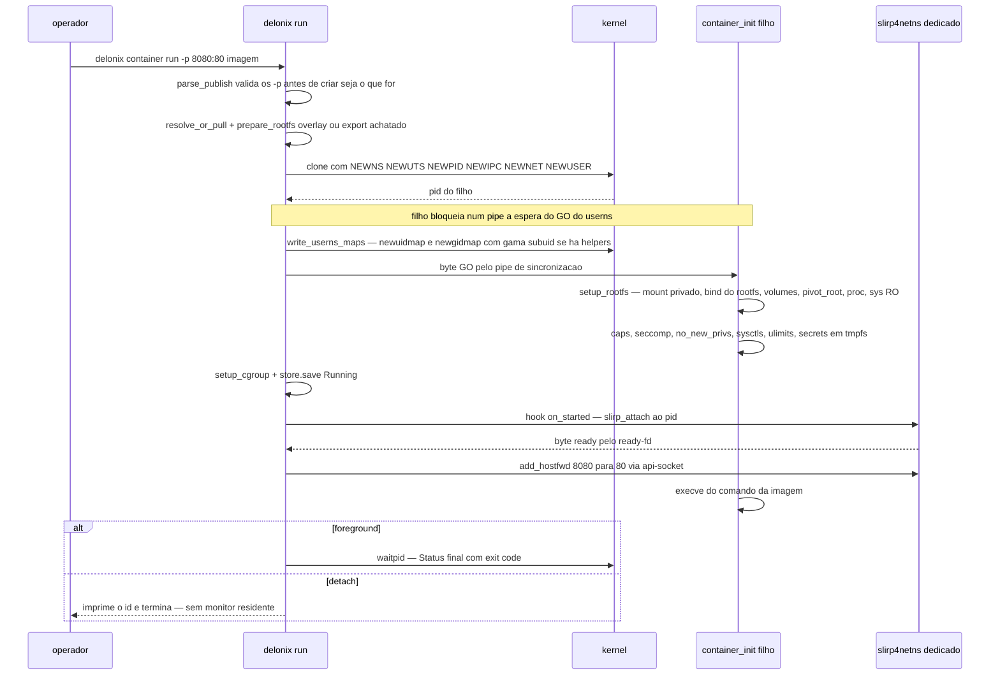
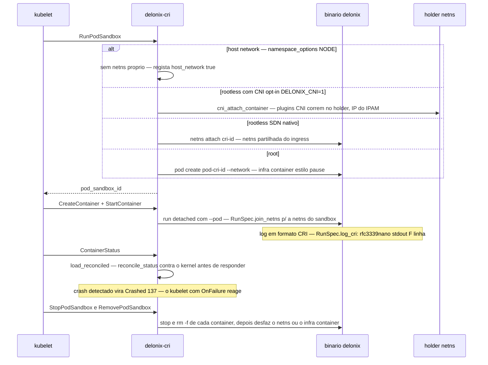

# Arquitectura — Delonix Engine

Modelo C4 (Contexto → Contentores → Componentes) e system design funcional do
**Delonix Engine**: motor de containers e microVMs **daemonless, rootless-first,
kernel-native**, em Rust (8 crates, workspace `crates/`). Este documento é canónico
e mantido contra o código — cada afirmação estrutural tem a referência do
crate/ficheiro onde foi confirmada. Onde há limites, eles aparecem nos diagramas,
não escondidos em rodapés.

Convenção de nomes: `delonix` é o binário CLI (crate `delonix-runtime-bin`);
`delonix-cri` é o binário servidor CRI (crate `delonix-cri`); "holder" é o processo
que detém o network namespace de infra-estrutura do ingress rootless
(`crates/delonix-net/src/infra.rs`).

---

## C4 — Nível 1: Contexto

O Delonix Engine é usado por um **operador humano** (via CLI), por um **kubelet**
(via CRI), e fala com sistemas externos: registos OCI, hosts SSH remotos e os
hipervisores locais.



- CLI: `crates/delonix-runtime-bin/src/main.rs` (grupos `Container`/`Image`/`Build`/
  `Vm`/`Volumes`/`Network`/`Stack`/`Cluster`, um módulo por grupo em `src/cmd/`).
- CRI: `crates/delonix-cri/src/bin/delonix-cri.rs` → `serve_blocking` num socket
  unix (`DELONIX_CRI_ADDR`, default `unix:///run/delonix-cri.sock`), o endpoint do
  `--container-runtime-endpoint` do kubelet.
- Registos OCI: `crates/delonix-image/src/registry.rs` (`pull_from_registry_with_creds`,
  `push_to_registry`, `push_oci_artifact`/`pull_oci_artifact` — este par com
  verificação de digest do blob contra o manifesto).
- Hosts SSH: `crates/delonix-runtime-bin/src/cmd/remote.rs` (shell-out a `ssh`/`scp`
  do sistema, `sudo -n` remoto).
- Hipervisores: `crates/delonix-vm/src/lib.rs` (trait `VmBackend`, implementações
  `CloudHypervisorBackend` e `LibvirtBackend`).
- Fronteira pública: este repositório não conhece tenant, licença, billing nem
  consola — qualquer consumidor desse género é "externo" (ver ADR-7).

---

## C4 — Nível 2: Contentores (unidades executáveis)

**Não há daemon.** Não existe nenhum processo residente obrigatório: a CLI é
efémera, e os processos de longa duração que existem são infra-estrutura *opt-in*
(rede rootless, log shim, watcher `--rm`, VMs) — cada um arranca quando é preciso e
morre com o recurso que serve. O estado partilhado é um directório de ficheiros
JSON, não um socket de daemon.



Confirmação no código, peça a peça:

| Processo | Onde nasce | Tempo de vida |
|---|---|---|
| `delonix` (CLI) | `crates/delonix-runtime-bin/src/main.rs` | um comando; em foreground faz `waitpid` do container e sai |
| `delonix-cri` | `crates/delonix-cri/src/bin/delonix-cri.rs` | serviço (ex.: unit systemd `dist/delonix-cri.service` dentro da imagem VM dourada) |
| holder netns | `infra::start_holder` (`crates/delonix-net/src/infra.rs`): `unshare --user --map-auto --map-root-user --net --mount -- <self> netns holder`; o re-exec é apanhado em `main.rs` antes do parser clap | vida da infra do ingress, gerida por ref-count em ficheiro (`infra::acquire`/`release`) |
| slirp4netns único | `infra::start_slirp` — liga o `tap0` ao netns do holder, com api-socket para `add_hostfwd` | acompanha o holder |
| slirp4netns por container | `delonix_net::slirp_attach` (`crates/delonix-net/src/lib.rs`) — chamado como hook `on_started` do `RunSpec` | vida do container (morre com o netns); órfãos limpos por `reap_orphan_slirp` |
| log shim | `fork` no pai em `spawn` (`crates/delonix-runtime/src/lib.rs`), corre `log_shim` — lê o pipe (ou o master do pty em modo console) e escreve o log com rotação | vida do container; destaca-se do stdio com `setsid` + `/dev/null` |
| watcher `--rm` | `spawn_rm_watcher` (`crates/delonix-runtime-bin/src/cmd/container.rs`) — só em `run -d --rm` | até o container terminar; faz a mesma limpeza do `rm -f` |
| microVM | `delonix_vm::create` — processo `cloud-hypervisor` (dentro do netns de infra, tap via `infra::vm_attach`) ou domínio libvirt | vida da VM |

O estado vive em `$DELONIX_ROOT` (default `/var/lib/delonix` para root,
`~/.local/share/delonix` para rootless — `infra::base_root` e
`ImageStore::default_root`): `Store`/`JsonStore`
(`crates/delonix-runtime-core/src/store.rs`) persistem `Container`/`Vm` como um
JSON por registo; o CRI guarda os seus registos próprios em `<root>/cri/`
(`crates/delonix-cri/src/runtime_svc/lifecycle.rs`).

Consequência directa do daemonless: como não há monitor residente, o estado
`Running` de um registo JSON pode divergir do kernel. A verdade é reconciliada na
leitura — `reconcile_status` (`crates/delonix-runtime/src/lib.rs`) usa
`safe_to_signal` (PID + `starttime` de `/proc`, para fechar a janela de reutilização
de PID) e reclassifica `Running`→`Crashed`/`Paused`. O CRI chama-o em
`load_reconciled` antes de responder ao kubelet.

---

## C4 — Nível 3: Componentes (os 8 crates)

Setas = dependências **reais**, confirmadas nos `Cargo.toml` de `crates/*/` e nos
`use delonix_*` dos `src/`. Não há ciclos; `delonix-runtime-core` é a raiz comum.



Notas de leitura do grafo (todas verificadas):

- **`delonix-runtime-bin` não depende de `delonix-cri`** — são dois binários
  independentes. O CRI, por sua vez, **não** depende de `delonix-vm` nem de
  `delonix-volume` (só `runtime`/`image`/`net`/`core` — `crates/delonix-cri/Cargo.toml`).
- **`delonix-runtime` só depende de `core`** — o motor de containers não conhece
  rede: a integração faz-se por inversão de controlo, com o hook `on_started` do
  `RunSpec` (a CLI passa closures que chamam `delonix-net`).
- **`delonix-vm` → `delonix-net`** existe porque o backend Cloud Hypervisor liga o
  `tap` da VM à bridge do ingress (`infra::vm_attach`, doc-comment de
  `crates/delonix-vm/src/lib.rs`).
- Módulos internos que importam ao desenho:
  - `delonix-net::infra` — todo o plano rootless (holder, slirp único, publish/DNAT,
    DNS/DHCP/RA, firewall por container, egress policy, `attach_container`);
  - `delonix-net::wg` — WireGuard entre nós (cifra o overlay; o holder cria a
    interface no netns de infra);
  - `delonix-net::cni` — compatibilidade com plugins CNI reais (opt-in
    `DELONIX_CNI=1`, `cni::enabled_conf`);
  - `delonix-image::overlay` — `mount_rootfs` (overlayfs) e `export_rootfs`
    (achatamento, o caminho rootless);
  - `delonix-image::registry` — cliente HTTP de registo, com verificação de digest;
  - `delonix-image::buildpack` — Cloud Native Buildpacks (`CnbPlan`);
  - `delonix-runtime-core::{secret,cred_vault}` — Secret Manager do runtime
    (`--secret`/`--secret-files`; os valores decifrados só tocam um tmpfs dentro do
    namespace do container — `write_secret_files` em `crates/delonix-runtime/src/lib.rs`);
  - `delonix-runtime-bin::cmd::{cluster,k8s_recipes,vmimage,remote}` — o plano de
    cluster kubeadm (fluxo d, abaixo).

---

## System design — fluxos principais

### (a) `container run` rootless com `-p`, em `--net host` (default)

Com `-p` e sem rede custom, o container deixa de partilhar a rede do host e ganha um
netns próprio servido por um `slirp4netns` dedicado — o comportamento do
`docker run -p` no modelo rootless do Podman (`cmd_run` em
`crates/delonix-runtime-bin/src/cmd/container.rs`; `spawn` em
`crates/delonix-runtime/src/lib.rs`; `slirp_attach` em `crates/delonix-net/src/lib.rs`).



Pontos estruturais: a ordem userns-GO → console/log é crítica e está documentada em
`spawn` (deadlock caso contrário); o log shim em detach faz `setsid` e larga o stdio
para o `run -d` não pendurar quem lhe capture o stdout; o slirp morre com o netns do
container e há um reaper de órfãos (`reap_orphan_slirp`) porque, sem daemon, um
crash do container não tem quem limpe na hora.

### (b) `run --net <rede> -p` — publicação pelo ingress partilhado

Com rede custom, não há slirp por container: o container junta-se a uma netns criada
pelo holder e a porta publica-se com **um `add_hostfwd` no slirp único + um DNAT na
tabela nft dentro do netns de infra** (`infra::attach_container`,
`infra::publish_port`, `do_publish` — `crates/delonix-net/src/infra.rs`).

```mermaid
sequenceDiagram
    participant CLI as delonix run --net web -p 8080:80
    participant H as holder netns
    participant SL as slirp4netns unico
    participant C as container

    CLI->>H: ensure_up — arranca holder e slirp se nao existirem, refcount
    CLI->>H: attach_container pelo control socket SO_PEERCRED
    H->>H: ip netns add + veth para a bridge da rede + IP deterministico + anti-spoofing
    H-->>CLI: nome da netns e IP do container
    CLI->>SL: publish_port — add_hostfwd 8080 para tap0 8080 via api-socket
    CLI->>H: publish 8080 para IP 80 — DNAT nft na chain pre do netns de infra
    Note over CLI,H: regras criadas ANTES do arranque — o IP ja e conhecido
    CLI->>C: clone com join_netns = /run/netns/nome — setns em vez de NEWNET
    Note over C: LIMITACAO rootless: o setns a netns do holder falha p/ um run normal — ver Limitacoes
    Note over H,SL: publish e unpublish sao estado do dataplane, nao do processo:<br>reconfiguracao a quente sem parar o container
    CLI->>SL: stop ou rm — unpublish_port remove hostfwd
    CLI->>H: unpublish — remove o DNAT; detach_container desfaz o veth
```

O que torna o *hot reconfig* possível: a publicação vive no slirp (hostfwd) e no nft
do holder — nenhum dos dois pertence ao processo do container. `unpublish_ports`
corre no `stop`/`rm` (`cmd/container.rs`), e `reap_orphan_hostfwds` reconcilia o
slirp contra os containers vivos quando algo morreu sem limpar. O mesmo dataplane
suporta `publish_port_allow` (allowlist de CIDRs à frente do DNAT), firewall por
container (`fw_chain_body`), egress policy e rate-limit (`do_netrate`).

### (c) Pod CRI — sandbox e `join_netns`

O CRI (`crates/delonix-cri/src/runtime_svc/lifecycle.rs`) guarda o estado
CRI em JSON próprio e **delega no binário `delonix`** as operações que usam `clone`
— o servidor é multi-thread (tokio) e `clone` só é seguro single-threaded (decisão
documentada no cabeçalho de `lifecycle.rs`).



Os logs no formato CRI são escritos pelo mesmo log shim do fluxo (a) —
`RunSpec.log_cri` (`crates/delonix-runtime/src/lib.rs`) — para o `kubectl logs`/
`crictl logs` lerem directamente o ficheiro. `exec`/`attach`/`port-forward` do
kubectl passam por `streaming.rs`/`spdy.rs` (servidor de streaming próprio, SPDY).

### (d) `cluster kubeadm` — da imagem dourada ao cluster

Duas camadas com a mesma fundação (`crates/delonix-runtime-bin/src/cmd/cluster.rs`):
`cluster apply -f cloud.yaml` faz o bootstrap kubeadm em hosts **já vivos**;
`cluster kubeadm --name N --control-plane 1 --workers M` provisiona primeiro as VMs
(imagem dourada) e depois chama a **mesma** `apply_one` (`provision_and_apply` —
zero duplicação da lógica kubeadm/SSH/validação).

```mermaid
sequenceDiagram
    participant U as operador
    participant CL as delonix cluster kubeadm
    participant VS as VmImageStore
    participant VM as delonix vm create
    participant R as hosts remotos via ssh

    U->>CL: cluster kubeadm --name demo --control-plane 1 --workers 2
    CL->>VS: resolve_vm_image — a explicita, ou a UNICA existente; erro claro com 0 ou N
    Note over VS: imagem dourada = Ubuntu cloud image validada por SHA256SUMS +<br>virt-customize com k8s_customization_steps: kubeadm kubelet kubectl,<br>swap off, modulos e sysctls, delonix-cri + unit systemd — cmd/vmimage.rs
    CL->>CL: gera ou carrega chave SSH ed25519 em root/clusters/nome
    loop cada VM cp1..N w1..M
        CL->>VM: delonix_vm create — disco = imagem dourada + seed ISO cloud-init por instancia
        CL->>R: wait_for_vm_ssh_ready — IP via vm status, depois ssh_check real, timeout
    end
    CL->>CL: constroi ClusterSpec em memoria + validate — whitelists valid_endpoint valid_cidr valid_version
    Note over CL: validate corre ANTES de qualquer interpolacao em comando remoto — anti RCE por manifesto
    loop cada host — sequencial
        CL->>R: prepare_host — k8s_recipes: cada passo tem check e apply, idempotente sem ficheiro de estado
    end
    CL->>R: kubeadm_init no 1.o control-plane — salta se admin.conf ja existe
    R-->>CL: JoinInfo — token e hashes
    loop restantes control-planes e workers
        CL->>R: kubeadm_join — salta se kubelet.conf ja existe
    end
    CL->>R: traz o kubeconfig p/ root/clusters/nome-kubeconfig.yaml — copia p/ ~/.kube/config se nao existir
    Note over CL: LIMITACAO: cluster kubeadm recusa mais de 1 control-plane —<br>HA exige endpoint estavel LB ou VIP, que este comando ainda nao provisiona
```

`k8s_recipes.rs` é deliberadamente o **catálogo partilhado** entre o build da imagem
dourada (`vmimage::build`, offline via `virt-customize`) e a preparação ao vivo por
SSH (`cluster apply`) — um host preparado por qualquer dos caminhos fica idêntico.

---

## Limitações conhecidas

Cada uma confirmada no código na data deste documento; várias já estão anotadas nos
diagramas acima.

1. **`--net <rede>` custom em rootless falha no `setns` para um `run` normal.** A
   netns nomeada é criada pelo holder, dentro do userns mapeado do holder
   (`infra::start_holder`); o processo do container, sem privilégio nesse userns,
   não a consegue abrir. O mecanismo certo já existe no motor — re-exec via
   `nsenter … ip netns exec` + `RunSpec.inherit_userns`
   (`crates/delonix-runtime/src/lib.rs`) — mas hoje só é usado pelo próprio holder;
   não há nenhum caminho em `delonix-runtime`/`delonix-runtime-bin` que o faça para
   um `container run` normal. Fechar isto é trabalho do motor, não da CLI.
2. **`delonix build` é single-stage.** Um Dockerfile/Delonixfile com `FROM … AS x`
   seguido doutro `FROM` é recusado com erro claro (`cmd/build.rs`); multi-stage
   precisa de desenhar a passagem de rootfs entre estágios.
3. **`macvlan`/`ipvlan`/`overlay` não têm attach de containers.** `network create`
   regista-os no `NetworkStore` declarativo (`crates/delonix-net/src/lib.rs`), mas o
   plano físico do holder (`infra::network_create_with`) só é orquestrado para o
   driver `bridge` — o único a que containers se ligam hoje.
4. **`Container.restart_policy` não é consumida.** O campo existe em
   `delonix_runtime_core::Container`, mas nada no motor nem na CLI o lê para
   containers (grep confirmado); sem daemon, não há quem reinicie. Nas **VMs** a
   política é materializada apenas pelo backend libvirt (`on_crash`); no
   Cloud Hypervisor fica não-supervisionada e o código avisa
   (`restart_policy_unsupervised`, `crates/delonix-vm/src/lib.rs`).
5. **`cluster kubeadm` provisiona só 1 control-plane.** `--control-plane > 1` é
   recusado — HA exige um endpoint estável (LB/VIP) que o comando ainda não cria.
   `cluster apply` já suporta HA com `controlPlaneEndpoint` externo; só etcd
   `stacked` (o modo `external` é reconhecido e recusado); execução sequencial entre
   hosts (`cmd/cluster.rs`, cabeçalho).
6. **Exit code real perde-se em detach.** Em foreground o `waitpid` produz
   `Stopped`/`Failed(n)`/`Crashed` (`Status::from_wait`,
   `crates/delonix-runtime-core/src/lib.rs`); em detach não há monitor, e a
   reconciliação posterior só consegue classificar um processo desaparecido como
   `Crashed` (reportado como 137) — o código de saída verdadeiro já não é
   observável. Trade-off directo do daemonless (ver ADR-1).
7. **A delegação interna do `delonix-cri` assume superfícies de CLI que o binário
   `delonix` deste repo não expõe.** `lifecycle.rs`/`streaming.rs` invocam
   `current_exe`/`self_bin` com formas de topo (`run`, `stop`, `rm`,
   `netns attach`, `pod create`, sob `DELONIX_INTERNAL=1`) herdadas do binário do
   monorepo de origem, onde CLI e CRI viviam no mesmo executável; o `delonix`
   opensource só tem os grupos (`container run`, …) e o re-exec oculto
   `netns holder`. Empacotar o CRI standalone (o próximo milestone do README)
   implica fechar este contrato interno.
8. **`--privileged` não arranca imagens systemd-aninhado tipo `kindest/node`** —
   crash cedo na deteção de cgroup do entrypoint, causa-raiz por isolar; existe já
   lógica dedicada de delegação cgroup2 para nodes Kind (`setup_node_cgroup_ns`,
   activada por `--privileged` + label `io.x-k8s.kind.*`), mas não é suficiente.
   Detalhe da investigação no `CLAUDE.md` (secção "Cluster modo Kind sem Docker").

---

## Decisões de arquitectura (mini-ADRs)

### ADR-1 — Daemonless: nenhum processo residente obrigatório

**Decisão.** O runtime não tem daemon: a CLI faz `clone` directo e sai; o estado é
partilhado por ficheiros JSON; processos auxiliares (log shim, watcher `--rm`,
slirp, holder) nascem por necessidade e morrem com o recurso.
**Porquê.** Menos superfície de ataque e de falha (não há um `dockerd` cuja queda
leve os containers); arranque instantâneo; auditabilidade — cada processo tem um
dono e um ciclo de vida óbvios.
**Trade-offs assumidos.** Sem monitor por container: exit codes reais perdem-se em
detach (limitação 6); `restart_policy` de containers não tem executor (limitação 4);
a verdade sobre "está vivo?" é reconstruída na leitura (`reconcile_status` +
`safe_to_signal` contra reutilização de PID) em vez de mantida por eventos; e a
limpeza de órfãos precisa de reapers explícitos (`reap_orphan_slirp`,
`reap_orphan_hostfwds`). Um `delonixd` opcional é uma evolução discutida, não uma
peça existente.

### ADR-2 — Rootless-first com subuid/newuidmap

**Decisão.** O caminho rootless é o desenho principal, não um modo degradado:
`CLONE_NEWUSER` + `write_userns_maps`, que usa a gama subuid/subgid completa via
`newuidmap`/`newgidmap` quando os helpers existem (`have_subid_helpers`,
`crates/delonix-runtime/src/lib.rs`), com fallback para mapa de um só uid.
**Porquê.** Correr imagens reais (nginx faz `chown` para o uid 101; `USER` ≠ 0 via
`RunSpec.run_uid`) exige uma gama de uids, não só o root mapeado. A fronteira
rootless→root foi auditada ofensivamente (holder valida `SO_PEERCRED`; `join_netns`
só recebe caminhos gerados server-side; nenhum caminho de mapeamento atinge o uid 0
real do host).
**Trade-off.** Dois regimes de código em pontos sensíveis (ex.: `setup_dev` antes do
pivot em root vs `setup_dev_userns` depois do setuid) e dependência dos helpers do
sistema.

### ADR-3 — Ingress partilhado (holder + slirp único) vs um slirp por container

**Decisão.** Coexistem dois modelos: `-p` sem rede custom usa um `slirp4netns` por
container (simples, morre com ele); redes custom usam o **ingress partilhado** — um
holder netns com a bridge `delonix0`, UM slirp como ponte host↔infra e DNAT nft lá
dentro (`crates/delonix-net/src/infra.rs`, doc do módulo: "substitui, a prazo, o
modelo 1 slirp por container").
**Porquê.** O ingress dá rede entre containers (bridge comum, DNS/DHCP internos),
firewall/egress/rate-limit por container e — porque publish/unpublish são estado do
dataplane — reconfiguração de portas a quente. Um slirp por container não dá nenhuma
destas.
**Trade-offs.** Dois processos de infra de longa duração (geridos por ref-count, não
por daemon); toda a configuração dentro do netns tem de ser executada pelo próprio
holder (não há `nsenter --user --net` a partir do host — gotcha documentado no
módulo); e a limitação 1 enquanto o re-exec não chegar ao `run` normal.

### ADR-4 — Estado em ficheiros JSON, não numa BD

**Decisão.** Persistência por um-JSON-por-registo (`Store`/`JsonStore`,
`crates/delonix-runtime-core/src/store.rs`) sob `$DELONIX_ROOT`; o CRI e o ingress
seguem o mesmo padrão (ficheiros de pid/refcount/status).
**Porquê.** Sem daemon não há dono natural de uma BD; ficheiros são inspecionáveis
(`cat`), sobrevivem a crashes de qualquer processo e não acrescentam dependências.
A compatibilidade com formatos antigos faz-se no `Deserialize` (ex.: `Status` aceita
o legado `{"Exited": code}`).
**Trade-offs.** Sem transacções nem queries; a coerência com o kernel é eventual
(reconciliação na leitura); concorrência resolvida caso a caso (lockfile no
refcount do ingress).

### ADR-5 — Idempotência sem-estado no `cluster apply` (Terraform sem tfstate)

**Decisão.** Cada passo de preparação de host é um par `check`/`apply`
(`HostRecipe`, `cmd/k8s_recipes.rs`); `kubeadm_init`/`kubeadm_join` verificam
`/etc/kubernetes/{admin,kubelet}.conf` no host antes de agir. Não existe ficheiro de
estado local.
**Porquê.** A condição real no host é a única verdade — nunca dessincroniza de um
`.tfstate` porque não há nenhum; re-correr o `apply` é sempre seguro. O catálogo é
partilhado com o build da imagem dourada para os dois caminhos nunca divergirem.
**Trade-offs.** Cada execução re-verifica tudo (mais lento, hoje sequencial);
`stack apply` local segue a mesma filosofia "garante presente" e é fail-fast sem
rollback — reconciliação contínua é, por decisão, trabalho de um orchestrator
externo, não deste runtime.
**Nota de segurança.** Tudo o que entra num comando remoto é validado por whitelist
antes de qualquer interpolação (`valid_endpoint`/`valid_cidr`/`valid_version`,
`cmd/cluster.rs`) — `shell_quote` protege a fronteira ssh, nunca o conteúdo.

### ADR-6 — CRI como fronteira Kubernetes (e não um kubelet embutido)

**Decisão.** A integração k8s é exclusivamente o servidor `runtime.v1`
(`crates/delonix-cri`): o kubelet manda, o Delonix executa. O servidor delega as
operações com `clone` num processo single-threaded e mantém o estado CRI à parte
(`lifecycle.rs`).
**Porquê.** O CRI é a interface estável e estreita do ecossistema — o Delonix
substitui containerd/CRI-O sem inventar protocolo; scheduling/restart/GC ficam do
lado do kubelet, coerente com o daemonless (o kubelet é o monitor que o runtime não
tem). A imagem VM dourada já embala o `delonix-cri` como serviço systemd, fechando o
ciclo com o fluxo (d).
**Trade-off.** A limitação 7 (contrato interno CRI→CLI herdado da extracção) é o
preço em aberto de ter separado os dois binários.

### ADR-7 — Fronteira público/privado com o PaaS

**Decisão.** Este repositório compila sozinho e não conhece tenant, licença,
billing nem consola. `delonix-runtime-core` é a base que o lado privado reexporta —
nunca o inverso (doc do crate). Ficam **aqui** as peças que são mecanismo genuíno de
runtime/SDN: Secret Manager (`secret`/`cred_vault`), WireGuard do overlay (`wg.rs`).
Ficam **fora** as políticas de plataforma (quem publica o quê, planos, quotas) — os
diagramas param no "consumidor externo".
**Porquê.** Um motor opensource auditável exige uma árvore de dependências fechada
(`cargo tree -e normal` sem crates privados) e uma linha clara entre mecanismo e
política.
**Trade-off.** Alguma duplicação aparente de conceitos entre os dois lados (ex.: um
cofre de secrets do runtime vs um cofre de plataforma) é deliberada, não acidental.
