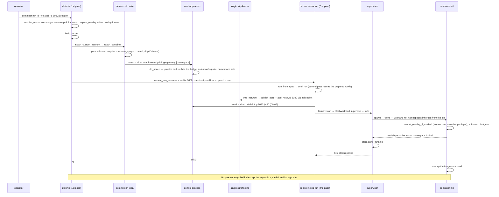
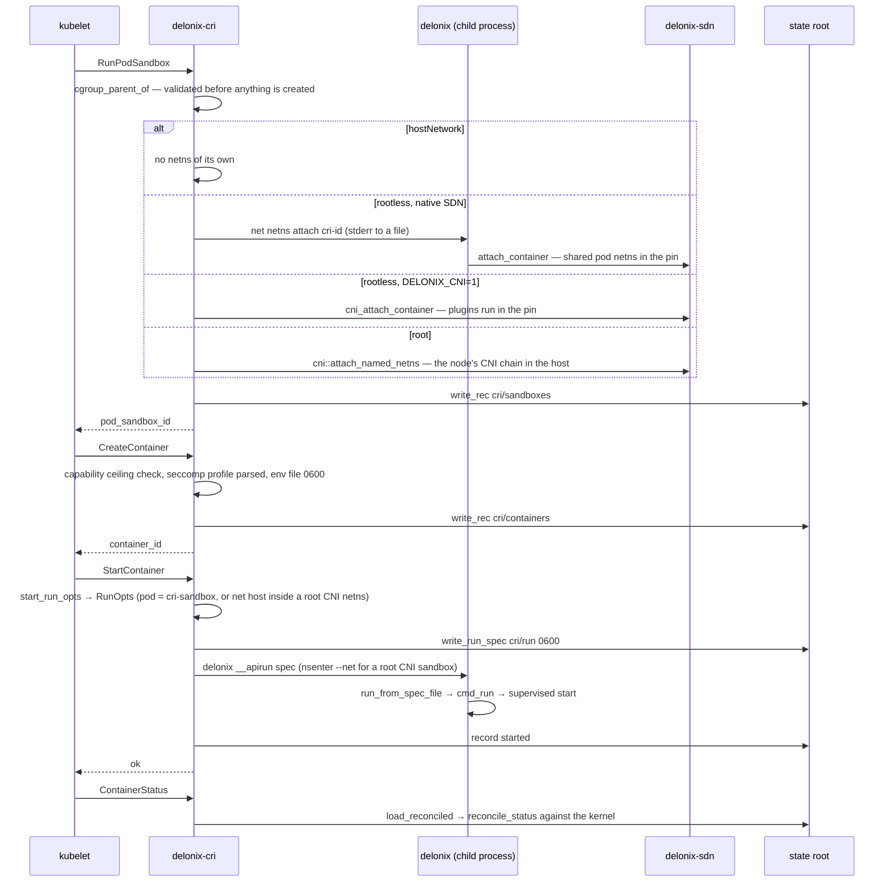

# 5. Architecture

This page is the map a contributor needs before touching the backend: what the engine is, how
the crates are layered, which processes exist at runtime, where state lives on disk, and how the
pieces talk to each other. Every structural claim names the file and symbol it was checked
against. The canonical, longer document is [`ARCHITECTURE.md`](../../ARCHITECTURE.md) at the
repository root; the decisions behind the structure are in [`docs/adr/`](../adr/), above all
[ADR-0040](../adr/0040-engine-restructuring-layers-ports-node-contract.md).

> **Two halves on this page.** The layer table and the crate graph are *generated* by
> `python3 scripts/dev_docs.py` from `Cargo.toml` and `scripts/arch_fitness.py` — do not edit them
> by hand. Everything else is narrative and is reviewed after each release.

## Engine identity and boundaries

The canonical text is the section *«Identidade e fronteira do motor»* at the top of
[`AGENTS.md`](../../AGENTS.md). In short:

- **What it is.** An execution abstraction for **one node**: it runs **containers and microVMs**
  and manages the networking and storage they need. It is declarative, with its **own Kinds**
  grouped by `apiVersion` (`core`, `compute`, `networking`, `gateway`, `storage`, `artifact`,
  `infrastructure` — the table is `crates/contexts/delonix-stack/src/kinds.rs`, and
  `delonix api-resources` prints it).
- **Providers sit behind ports.** The Linux kernel, Cloud Hypervisor and libvirt, Proxmox VE
  and the Kubernetes CRI are reached through a trait, never through `if provider == …` spread
  across the code. Today's ports: `VmBackend` (`crates/adapters/delonix-vm/src/lib.rs`) and the
  compute ports in `crates/contexts/delonix-compute/src/ports.rs` and `launch.rs`
  (`ImageStore`, `StorageProvider`, `DeviceResolver`, `RunHost`, `NetworkProvider`,
  `VmNetwork`, `WorkloadRuntime`). An OpenStack backend is designed
  ([ADR-0039](../adr/0039-openstack-vm-backend.md), *Proposed*) but has no crate yet.
- **Cloud native** — plan / apply / drift, the same operations exposed by several interfaces,
  observability through OpenTelemetry and Prometheus (`crates/adapters/delonix-telemetry`).
- **Daemonless** — no resident process by default. What must persist belongs to systemd or to a
  per-workload process with a clear owner (a container's supervisor, the network pin).
- **Rootless-first** — the normal path runs as an unprivileged user; privilege is an explicit
  opt-in (`--privileged`, `vm bridge`).
- **Knows no consumer.** No platform, control plane, console or agent is named in `crates/`,
  `bins/`, `proto/` or the manifests, and there is no notion of tenant, account, plan or billing.
  The *namespace* you will see everywhere is the engine's own **isolation** namespace, not a
  tenant.

These are not conventions; `scripts/arch_fitness.py` enforces the structural half in CI:

| Check | Where in `arch_fitness.py` |
|---|---|
| A dependency against the layer direction fails, unless it is a declared exception that names the ADR-0040 phase removing it | `LAYERS`, `ALLOWED`, `EXCEPTIONS`, `rule_failures` |
| A foundation or context crate may not take a runtime/server/CLI dependency (`tokio`, `tonic`, `reqwest`, `clap`, …) | `HEAVY` |
| A binary composes **one** interface crate | `rule_failures` (the `roles` check) |
| A crate must live in the directory of its layer | `LAYER_DIR`, `misplaced` |
| A consumer's name anywhere under `crates/`, `bins/`, `proto/` (comments included) fails | `CONSUMER_NAMES`, `consumer_mentions` |
| Dependency versions live only in the root `[workspace.dependencies]` | `inline_versions` |
| Ratchets that may only go down (listed below) — e.g. library crates re-running the engine's own binary, `println!` in libraries, process-environment writes, adapters importing the shared `Error` as their own | the ratchet patterns (`SELF_EXEC`, `PRINTS`, `ENV_WRITES`, `SHARED_ERROR`, …), baseline in `scripts/arch_baseline.json` |

<!-- dev-docs:begin ratchets -->
`scripts/arch_fitness.py` keeps **4 debt ratchets** (baseline in `scripts/arch_baseline.json`):

- `self_exec_sites`
- `library_prints`
- `env_writes`
- `shared_error_imports`
<!-- dev-docs:end ratchets -->

`python3 scripts/arch_fitness.py --list` shows what each ratchet counts today, file by file.

## Layers and the allowed direction

ADR-0040 D1 fixes one dependency direction:

```
interfaces ─► contexts (domain + use cases + ports) ◄─ adapters / providers
     │                                                      ▲
     └──────────────────── composes (bins/) ────────────────┘
```

- **Foundation** (`crates/foundation/`) — shared, pure-ish types every layer may name.
- **Contexts** (`crates/contexts/`) — one crate per bounded context, named after the published
  API groups: use cases and the **ports** they need. No kernel, no HTTP, no provider.
- **Adapters** (`crates/adapters/`) and **providers** (`crates/providers/`) — implement ports:
  kernel, SDN, OCI store, VM backends; providers bring an HTTP client for one remote target.
- **Interfaces** (`crates/interfaces/`) — CRI, management API, MCP: parse a request, call the
  engine, present.
- **Binaries** (`bins/`) — composition roots.

The layer each crate belongs to, and the direction it may depend in:

<!-- dev-docs:begin layers -->
| Layer | May depend on |
|---|---|
| Foundation | foundation |
| Contexts | foundation, contexts |
| Adapters | foundation, contexts |
| Providers | foundation, contexts |
| Interfaces | foundation, contexts, adapters, providers |
| Binaries | foundation, contexts, adapters, providers, interfaces |

Declared exceptions (each one names the ADR-0040 phase that removes it):

- `delonix-mcp` → `delonix-mgmt` — removed in **P5**
- `delonix-proxmox` → `delonix-vm` — removed in **P4**
- `delonix-scanner` → `delonix-oci` — removed in **P4**
<!-- dev-docs:end layers -->

### Where the restructuring stands

ADR-0040 is a strangler plan in phases (P0 rails → P1 contract → P2 contexts → P3 adapters and
binaries → P4 providers → P5 node API → P6 CRI → P7 observability). What the code shows today:

- **P0 is done.** Every crate lives in its layer's directory, versions are workspace-level, and
  the fitness gate runs in CI.
- **P1 is done as a contract, not as a server.** `proto/delonix/node/v1/*.proto` exists, the
  OpenAPI document `docs/api/openapi.yaml` is generated from it, and `scripts/contract_gate.py`
  guards both. **Nothing serves the contract yet** — no crate references `delonix.node.v1`
  ([ADR-0042](../adr/0042-one-engine-api-maturity-and-docs.md) D1 says the same).
- **P2 has started.** `delonix-model` (the shared `Error` and its `DX_*` codes, generated names, exit classes), `delonix-stack` (Kind
  table, 3-way reconciler, revisions) and `delonix-compute` (the one run specification `RunOpts`,
  `resolve_run`, `build_record`, the network and launch use cases) exist. Most application logic
  still lives in `bins/delonix-runtime-bin/src/cmd/`.
- **P3 is under way.** The compute ports are implemented in adapters (`HostImages`,
  `HostVolumes`, `HostDevices`, `HostRuntime`, `HostNetwork`, `HostWorkload`, `HostVmNetwork`),
  telemetry left the foundation for `delonix-telemetry`, `delonix-vm` reaches the SDN only
  through the `VmNetwork` port, and the CRI, management API and MCP servers became their own
  executables. Four adapters carry their ADR-0040 names: `delonix-scanner` (was `delonix-scan`),
  `delonix-oci` (was `delonix-image`), `delonix-sdn` (was `delonix-net`) and `delonix-linux` (was
  `delonix-runtime`, the container engine crate). `delonix-runtime-core` still exists and still
  carries the stores, but the shared `Error` moved down to `delonix-model` and is re-exported.
- **P4–P7 have not started.** The remaining exceptions in the table above name those phases.

The crate graph, as `Cargo.toml` declares it:

```mermaid
graph TB
  subgraph foundation["Foundation"]
    delonix_model["delonix-model"]
    delonix_net_rules["delonix-net-rules"]
    delonix_runtime_core["delonix-runtime-core"]
  end
  subgraph context["Contexts"]
    delonix_compute["delonix-compute"]
    delonix_security_runtime["delonix-security-runtime"]
    delonix_stack["delonix-stack"]
  end
  subgraph adapter["Adapters"]
    delonix_linux["delonix-linux"]
    delonix_oci["delonix-oci"]
    delonix_scanner["delonix-scanner"]
    delonix_sdn["delonix-sdn"]
    delonix_telemetry["delonix-telemetry"]
    delonix_vm["delonix-vm"]
    delonix_volume["delonix-volume"]
  end
  subgraph provider["Providers"]
    delonix_proxmox["delonix-proxmox"]
    delonix_truenas["delonix-truenas"]
  end
  subgraph interface["Interfaces"]
    delonix_cri["delonix-cri"]
    delonix_mcp["delonix-mcp"]
    delonix_mgmt["delonix-mgmt"]
  end
  subgraph bin["Binaries"]
    delonix_mcp_bin["delonix-mcp-bin"]
    delonix_mgmt_bin["delonix-mgmt-bin"]
    delonix_runtime_bin["delonix-runtime-bin"]
  end
  delonix_compute --> delonix_runtime_core
  delonix_cri --> delonix_compute
  delonix_cri --> delonix_linux
  delonix_cri --> delonix_oci
  delonix_cri --> delonix_runtime_core
  delonix_cri --> delonix_sdn
  delonix_cri --> delonix_telemetry
  delonix_linux --> delonix_compute
  delonix_linux --> delonix_runtime_core
  delonix_mcp --> delonix_linux
  delonix_mcp --> delonix_mgmt
  delonix_mcp --> delonix_runtime_core
  delonix_mcp --> delonix_sdn
  delonix_mcp --> delonix_vm
  delonix_mcp --> delonix_volume
  delonix_mcp_bin --> delonix_mcp
  delonix_mcp_bin --> delonix_runtime_core
  delonix_mcp_bin --> delonix_telemetry
  delonix_mgmt --> delonix_linux
  delonix_mgmt --> delonix_oci
  delonix_mgmt --> delonix_runtime_core
  delonix_mgmt --> delonix_scanner
  delonix_mgmt --> delonix_sdn
  delonix_mgmt --> delonix_telemetry
  delonix_mgmt --> delonix_vm
  delonix_mgmt --> delonix_volume
  delonix_mgmt_bin --> delonix_mgmt
  delonix_mgmt_bin --> delonix_runtime_core
  delonix_mgmt_bin --> delonix_telemetry
  delonix_oci --> delonix_compute
  delonix_oci --> delonix_runtime_core
  delonix_proxmox --> delonix_runtime_core
  delonix_proxmox --> delonix_vm
  delonix_runtime_bin --> delonix_compute
  delonix_runtime_bin --> delonix_linux
  delonix_runtime_bin --> delonix_mgmt
  delonix_runtime_bin --> delonix_model
  delonix_runtime_bin --> delonix_oci
  delonix_runtime_bin --> delonix_proxmox
  delonix_runtime_bin --> delonix_runtime_core
  delonix_runtime_bin --> delonix_scanner
  delonix_runtime_bin --> delonix_sdn
  delonix_runtime_bin --> delonix_security_runtime
  delonix_runtime_bin --> delonix_stack
  delonix_runtime_bin --> delonix_telemetry
  delonix_runtime_bin --> delonix_truenas
  delonix_runtime_bin --> delonix_vm
  delonix_runtime_bin --> delonix_volume
  delonix_runtime_core --> delonix_model
  delonix_scanner --> delonix_model
  delonix_scanner --> delonix_oci
  delonix_sdn --> delonix_compute
  delonix_sdn --> delonix_net_rules
  delonix_sdn --> delonix_runtime_core
  delonix_security_runtime --> delonix_runtime_core
  delonix_stack --> delonix_runtime_core
  delonix_truenas --> delonix_runtime_core
  delonix_vm --> delonix_compute
  delonix_vm --> delonix_net_rules
  delonix_vm --> delonix_runtime_core
  delonix_volume --> delonix_compute
  delonix_volume --> delonix_runtime_core
```

<!-- dev-docs:begin crates-graph -->

<!-- dev-docs:end crates-graph -->

## Executables and processes at runtime

This is the C4 *container* level: the things that run. The build ships four executables (see the
generated count in the [handbook README](README.md)); several more **processes** appear per
workload or per node, each with an owner.

```mermaid
graph TB
    OP["operator<br>terminal"]
    KL["kubelet"]
    LC["local client<br>same uid, unix socket"]
    AI["AI client<br>stdio"]
    REG["OCI registries"]

    subgraph NODE["Linux node — one user, one state root"]
        CLI["delonix<br>CLI, one command per process<br>bins/delonix-runtime-bin"]
        CRI["delonix-cri<br>gRPC runtime.v1 on a unix socket<br>crates/interfaces/delonix-cri"]
        MGMT["delonix-mgmt<br>HTTP+JSON on a unix socket<br>bins/delonix-mgmt-bin"]
        MCP["delonix-mcp<br>MCP over stdio<br>bins/delonix-mcp-bin"]
        STATE[("state root<br>DELONIX_ROOT")]

        subgraph WL["per container"]
            SUP["supervisor<br>fork of the CLI, parent of the init"]
            INIT["container init → workload<br>clone with namespaces"]
            SHIM["log shim<br>fork, writes the log file"]
            CSLIRP["slirp4netns<br>only for -p without a custom network"]
        end

        subgraph INFRA["rootless network infra — started on demand"]
            PIN["pin<br>delonix netns pin<br>owns userns + netns + mountns"]
            CTL["control<br>delonix netns control<br>control socket, DNS, DHCP, RA"]
            ISLIRP["slirp4netns<br>single host uplink, api socket"]
            PROXY["L7 proxy<br>delonix ingress-proxy"]
        end

        CH["cloud-hypervisor<br>inside the infra netns"]
        LV["libvirt / QEMU<br>driven through virsh"]
    end

    OP -- argv --> CLI
    KL -- "gRPC, SO_PEERCRED" --> CRI
    LC -- "HTTP, SO_PEERCRED" --> MGMT
    AI -- "JSON-RPC over stdio" --> MCP
    CLI -. "serve cri / serve api / mcp: exec" .-> CRI
    CLI -. exec .-> MGMT
    CLI -. exec .-> MCP
    CRI -- "runs the CLI back:<br>net netns attach, __apirun spec" --> CLI
    MGMT -- "runs the CLI back" --> CLI
    MCP -- "runs the CLI back" --> CLI
    CLI -- "spawn netns pin" --> PIN
    CLI -- "nsenter, netns control" --> CTL
    CLI -- spawn --> ISLIRP
    CLI -- "control socket: attach, publish, firewall" --> CTL
    CLI -- "api socket: add_hostfwd" --> ISLIRP
    CLI -- "fork, run_supervised" --> SUP
    SUP -- clone --> INIT
    SUP -- fork --> SHIM
    CLI -- "slirp_attach hook" --> CSLIRP
    CLI -- "infra_join_argv + setsid, SIGHUP" --> PROXY
    CLI -- "launch_vmm through the infra join argv" --> CH
    CLI -- virsh --> LV
    CLI -- HTTPS --> REG
    CLI --- STATE
    CRI --- STATE
    MGMT --- STATE
```



| Process | Born in | Lives for |
|---|---|---|
| `delonix` | `bins/delonix-runtime-bin/src/main.rs` (`main`, `run`) | one command. `main` intercepts the hidden entry points (`netns pin`, `netns control`, `netns run`, `__rmtree`, `__volsnap`, `__ovlmigrate`, `__ovlhold`, `__duusage`, `__buildtar`, `__apirun`, `__netnsconnect`) **before** clap parses |
| `delonix-cri` | `crates/interfaces/delonix-cri/src/bin/delonix-cri.rs` → `delonix_cri::serve_blocking` | a service (typically a systemd unit). `delonix serve cri` `exec`s it (`cmd/serve.rs::exec_server`) |
| `delonix-mgmt` | `bins/delonix-mgmt-bin/src/main.rs` → `delonix_mgmt::serve_blocking` | a service; `delonix serve api` `exec`s it |
| `delonix-mcp` | `bins/delonix-mcp-bin/src/main.rs` → `delonix_mcp::serve_stdio` | one AI-client session (a child process on stdio); `delonix mcp` `exec`s it |
| Docker API slice | `cmd/serve.rs` → `cmd::dockerapi::run`, **inside** the `delonix` process | while `delonix serve docker-api` runs |
| supervisor | `delonix_linux::supervise::run_supervised`, chosen by `delonix_compute::launch::start` for every detached start the caller can fork for | the container's life; it is the real parent, so it collects the exit status and applies `--restart` |
| container init | `delonix_linux::spawn` → `clone` → `container_init` | the container |
| log shim | `fork` inside `spawn`, running `log_shim` | the container |
| per-container `slirp4netns` | `delonix_sdn::slirp_attach`, called as the `on_started` hook | the container's netns; orphans reaped by `reap_orphan_slirp` |
| pin | `infra::start_pin` spawns `delonix netns pin`; `infra::pin_main` creates the user, net and mount namespaces in-process (`crates/adapters/delonix-sdn/src/pin_userns.rs`) and sleeps | the infra; its pid is `ingress/holder.pid` and it never changes |
| control | `infra::start_control` (`nsenter -t <pin> -U -m -n -- delonix netns control`) → `infra::control_main` | restartable; serves the control socket, DNS (`dns_server_main`), Router Advertisements (`ra_sender_main`) and per-bridge DHCP (`dhcp_serve`) |
| single `slirp4netns` | `infra::start_slirp` (`tap0` into the pin's netns, `--api-socket`) | the infra |
| L7 ingress proxy | `cmd/ingress_proxy.rs::spawn_proxy` through `infra::infra_join_argv` | while an `HTTPRoute`/`Ingress` or an `--expose` route exists; reloads routes on `SIGHUP` |
| `cloud-hypervisor` | `delonix_vm::launch_vmm`, run through the infra join argv | the VM |
| libvirt domain | `LibvirtBackend` driving `virsh` | the VM (the domain lives in libvirt) |

`ensure_up` (`crates/adapters/delonix-sdn/src/infra.rs`) is the only function that brings the
network infra up, under a per-root file lock, and it distinguishes three cases: pin and control
alive (nothing to do); pin alive and control gone (restart **only** the control plane — no wire
moves); pin gone (tear down and rebuild).

## One set of operations, several interfaces

| Interface | Transport | Entry | Status |
|---|---|---|---|
| CLI | argv | `bins/delonix-runtime-bin` | the complete surface |
| CRI (`runtime.v1`) | gRPC on a unix socket, `0600` + `SO_PEERCRED` | `delonix_cri::serve_blocking` | serves the kubelet |
| Management API | HTTP+JSON on a unix socket, same uid only | `delonix_mgmt::serve_blocking` (routes such as `/v1/containers`, `/v1/volumes`, `/metrics`) | local only ([ADR-0010](../adr/0010-remote-management-api.md) rejected a remote API); to be replaced by the node contract |
| MCP | stdio | `delonix_mcp::serve_stdio` | local, no tenant ([ADR-0025](../adr/0025-mcp-local-ai-control-surface.md)) |
| Docker Engine API slice | HTTP on a unix socket | `cmd::dockerapi::run` | a compatibility slice, inside `delonix` |
| **Node contract** `delonix.node.v1` | gRPC **and** HTTP/JSON on one unix socket | `proto/delonix/node/v1/` | **contract only** — no server yet |

The node contract is the intended single API
([ADR-0040](../adr/0040-engine-restructuring-layers-ports-node-contract.md) D4,
[ADR-0042](../adr/0042-one-engine-api-maturity-and-docs.md)). The `.proto` files are the source
of truth; `docs/api/openapi.yaml` is **generated** from them and never edited by hand.
`scripts/contract_gate.py` fails on: `buf format`, `buf lint`, `buf breaking` against the last
tag that carries `proto/`, an RPC without an HTTP mapping (or a bidirectional stream with one),
an OpenAPI document that differs from the generated one, and two paths that are the same URL
under different variable names. Three rules it protects: one request message per RPC, explicit
identity (`namespace`/`name`) in the request, and images addressed by query parameter.

## State on disk

There is no database. State is files under one **state root**:

- `DELONIX_ROOT` when set; otherwise `$XDG_DATA_HOME/delonix` or `~/.local/share/delonix` for an
  unprivileged user and `/var/lib/delonix` for root
  (`bins/delonix-runtime-bin/src/cmd/util.rs::state_root` → `ImageStore::default_root`;
  `infra::base_root` resolves the same rule on the network side).
- **Sockets do not live under the state root.** They are in a short per-user runtime directory
  (`infra::runtime_dir`, overridable with `DELONIX_NET_RUNTIME_DIR`) because `AF_UNIX` paths are
  limited in length; a non-default root gets a hashed suffix (`root_suffix`) so two roots on one
  login never share sockets. **When you run anything in isolation, set both variables.**

| Path under the root | What | Code |
|---|---|---|
| `containers/<id>.json` | one JSON record per container | `delonix_runtime_core::Store` (`store.rs`) |
| `containers/<id>/{upper,work,merged}` + `overlay-lowers` | the container's writable layer and the list of shared image layers it mounts | `ImageStore::prepare_overlay` (`delonix-oci/src/overlay.rs`) |
| `images/<id>.json`, `layers/<hex>/`, `blobs/sha256/<hex>` | image metadata, unpacked layers shared by every container, content-addressed blobs | `ImageStore::open` (`image.rs`), `Cas` (`cas.rs`) |
| `volumes/<name>/_data`, `volumes/.ns/<ns>/` | named volumes, namespace-scoped volumes | `VolumeStore` (`delonix-volume/src/lib.rs`) |
| `vms/` | VM records (`JsonStore`) and per-VM files | `delonix-vm` |
| `vm-images/` | VM images (`.qcow2` + `.json`) | `cmd/vmimage.rs::VmImageStore` |
| `secrets/` | encrypted secrets | `SecretStore` (`delonix-runtime-core/src/secret.rs`) |
| `ingress/` | pidfiles (`holder.pid` is the pin), `refs/` markers, network and route definitions, logs | `delonix-sdn/src/infra.rs` |
| `ipam/` | per-prefix address leases | `delonix-sdn/src/ipam.rs` |
| `cri/{sandboxes,containers}/` | the CRI's own records | `delonix-cri/src/runtime_svc/lifecycle.rs` (`sb_dir`, `ct_dir`) |
| `clusters/` | kubeconfigs, keys and PKI of clusters | `cmd/cluster.rs` |
| `events.jsonl` | append-only event log | `delonix_runtime_core::events` |

Concurrency is handled by the file system, because several processes (the CLI, the CRI server,
a supervisor) mutate the same records: writes are atomic (temporary file + `rename`,
`store.rs::write_atomic`), and read-modify-write goes through `Store::update` /
`JsonStore::update`, which take an exclusive `flock` and **refuse** to proceed without it. The
network infra has its own `FileLock` around `ensure_up`, `teardown`, `acquire`, `release` and the
reapers.

Because nothing resident watches processes, a record saying `Running` can be stale. Readers
reconcile: `delonix_linux::reconcile_status` checks the pid together with its start time
(`delonix_runtime_core::safe_to_signal`) so a recycled pid is never mistaken for the container.

## How the crates communicate

1. **Direct Rust calls, along the layer direction.** The normal case. For example `cmd_run`
   (`cmd/container.rs`) calls `delonix_compute::run::resolve_run` with the adapters
   `delonix_oci::run_images::HostImages`, `delonix_volume::HostVolumes`,
   `delonix_linux::cdi::HostDevices` and `delonix_linux::run_host::HostRuntime`, then
   `delonix_compute::network::{attach_custom_network, wire_network}` with
   `delonix_sdn::run_network::HostNetwork`, then `delonix_compute::launch::start` with
   `delonix_linux::workload::HostWorkload`.
2. **Registration at the composition root.** `run()` in `bins/delonix-runtime-bin/src/main.rs`
   registers configured remote VM backends (`cmd::vmbackends::register_configured` →
   `delonix_vm::register_backend`) and the SDN implementation of the VM network port
   (`delonix_vm::set_network(HostVmNetwork)`) before any command runs.
3. **Re-executing the engine's own binary.** Still common, and counted by the `self_exec_sites`
   ratchet. The reasons are real:
   - `clone` is only safe in a **single-threaded** process, and the CRI, management API and
     Docker API servers are multi-threaded `tokio` runtimes. They hand a typed `RunOpts` in a
     `0600` file to a fresh `delonix __apirun <spec>` (`lifecycle.rs::write_run_spec`,
     `cmd::dockerapi::run_from_spec_file`).
   - A rootless process must **enter** the network pin's user and mount namespaces before a
     container can join a named netns there, so `reexec_into_netns` runs
     `nsenter … ip netns exec <netns> delonix netns run <spec>`.
   - Work on files owned by mapped subuids needs a process inside a mapped user namespace
     (`delonix_linux::reexec_mapped`, `reexec_mapped_hold`, `remove_tree_mapped` → the
     `__rmtree`/`__ovlhold`/… entry points).
   - The servers still build some CLI invocations (`delonix-mgmt`, `delonix-mcp`'s
     `run_cli_blocking`, the CRI's `delonix()` helper), resolving the CLI through
     `delonix_runtime_core::dispatch::cli_bin` (`DELONIX_BIN`, then the sibling `delonix`, then
     the `PATH`) — never their own executable.
   ADR-0040 D2.4/D5 plans a `delonix-launcher` executable receiving a typed spec, so these become
   use-case calls plus one spawn.
4. **The control socket.** Everything inside the rootless infra netns is done by the control
   process: `infra::control_send`/`control_query` write one line (`attach …`, `publish …`,
   `firewall …`) to a `0600` unix socket; `control_loop` accepts only peers with the engine's own
   uid (`SO_PEERCRED`) and serves one connection at a time, so netns/veth/nftables operations
   never interleave.
5. **Subprocesses to host tools**, in adapters: `ip`, `nft`, `nsenter`, `slirp4netns`
   (`delonix-sdn`), `newuidmap`/`newgidmap` (`delonix-linux`, `pin_userns`), `qemu-img`,
   `virsh`, `cloud-localds` (`delonix-vm`), `busctl` for systemd transient scopes
   (`delonix-linux`), `ssh`/`scp` (`cmd/remote.rs`).
6. **HTTP to a remote management system lives only in providers.** `delonix-proxmox` and
   `delonix-truenas` depend on `reqwest` for that. Two adapters also speak HTTP, for other reasons:
   `delonix-oci` has its own OCI registry client (`src/registry.rs`, `reqwest` in its
   `Cargo.toml`), and `delonix-telemetry` exports OTLP over HTTP. No context crate does.

## Two flows, as sequences

### `container run -d --net web -p 8080:80 nginx`, rootless

Every arrow below is a call in `cmd_run` (`bins/delonix-runtime-bin/src/cmd/container.rs`) or in
the functions it reaches.



Without a custom network the flow has no second pass: `spawn` creates its own user namespace, and
the parent writes the id maps (`write_userns_maps`), sets up the cgroup, runs the `on_started`
hook (the per-container `slirp_attach` when there are `-p` ports) and only then sends the "go"
byte to the child.

### CRI: `RunPodSandbox` → `CreateContainer` → `StartContainer`

From `crates/interfaces/delonix-cri/src/runtime_svc/lifecycle.rs`.



## Known limitations

> **Note — the node contract is not served.** `proto/delonix/node/v1` is gated and generates
> OpenAPI, but no process answers it. Integrations today use the CLI, the CRI, the local
> management API or MCP.

> **Note — the servers still run the CLI.** `delonix-cri`, `delonix-mgmt` and `delonix-mcp` start
> workloads by re-executing `delonix`. This keeps `clone` out of multi-threaded processes, at the
> cost of a process per operation and error text crossing a process boundary.

> **Note — `macvlan`/`ipvlan` are declared, not realized.** `network create` records them and
> reports `Realized=False` with reason `DriverNotImplemented`
> (`bins/delonix-runtime-bin/src/cmd/network.rs`): their physical plane needs `CAP_NET_ADMIN` in
> the host's initial network namespace.

> **Note — recovery after the pin dies is by restart.** If the control process dies, `ensure_up`
> restarts only it and no workload moves. If the **pin** dies, the netns is rebuilt and
> `delonix net netns up` restarts the stranded containers and pod members
> (`cmd/netns.rs::reconcile_after_respawn`, which reads the container store only — VMs are not
> recovered this way).

> **Note — IPv6 in the SDN is off by default.** The ingress firewall is `table ip`; the holder
> installs a dropping `table ip6` (`infra::ingress_v6_refusal_ruleset`) and disables IPv6 inside
> container netns unless `DELONIX_ENABLE_IPV6=1` (`ipv6_sdn_enabled`).

> **Note — a caller that cannot fork starts unsupervised.** `launch::should_supervise` requires
> `detach && forkable`; without a supervisor nobody is the process's parent and the real exit
> code cannot be collected.

## Where to start reading

| Area | Start here |
|---|---|
| CLI entry and hidden re-exec entry points | `bins/delonix-runtime-bin/src/main.rs` (`main`, `run`) |
| `container run` end to end | `cmd/container.rs::cmd_run`, then `delonix-compute/src/{run,network,launch}.rs` |
| Process creation, namespaces, rootfs, seccomp, cgroups | `delonix-linux/src/lib.rs` (`spawn`, `container_init`, `setup_rootfs`, `setup_cgroup`), `supervise.rs`, `launch_spec.rs` |
| Rootless networking | `delonix-sdn/src/infra.rs` (`ensure_up`, `control_main`, `attach_container`, `publish_port`, `ingress_table_ruleset`, `fw_chain_body`), `pin_userns.rs`, `ipam.rs` |
| Images | `delonix-oci/src/{registry,cas,image,overlay,build}.rs` |
| VMs | `delonix-vm/src/lib.rs` (`VmBackend`, `builtin_backends`, `register_backend`, `select_backend`), `cloudinit.rs`; `cmd/vm.rs`, `cmd/vmimage.rs` |
| Declarative apply | `delonix-stack/src/{kinds,reconcile}.rs`; `cmd/stack.rs`, `cmd/manifest.rs` |
| CRI | `delonix-cri/src/lib.rs::serve_blocking`, `runtime_svc.rs`, `runtime_svc/lifecycle.rs` |
| Management API / MCP | `delonix-mgmt/src/lib.rs`, `delonix-mcp/src/lib.rs` |
| Node contract | `proto/delonix/node/v1/`, `scripts/contract_gate.py`, `docs/api/openapi.yaml` |
| Architecture rules | `scripts/arch_fitness.py`, ADR-0040 |
