# 5. Architecture

## Layers and the allowed direction

<!-- dev-docs:begin layers -->
| Layer | May depend on |
|---|---|
| Foundation | foundation |
| Contexts | foundation, contexts |
| Adapters | foundation, contexts |
| Providers | foundation, contexts |
| Interfaces | foundation, contexts, adapters, providers |
| Binaries | foundation, contexts, adapters, providers, interfaces |

Declared exceptions (each one names the ADR-0040 phase that removes it):

- `delonix-mcp` → `delonix-mgmt` — removed in **P5**
- `delonix-proxmox` → `delonix-vm` — removed in **P4**
- `delonix-scan` → `delonix-image` — removed in **P4**
<!-- dev-docs:end layers -->

## Crate dependency graph

```mermaid
graph TB
  subgraph foundation["Foundation"]
    delonix_model["delonix-model"]
    delonix_net_rules["delonix-net-rules"]
    delonix_runtime_core["delonix-runtime-core"]
  end
  subgraph context["Contexts"]
    delonix_compute["delonix-compute"]
    delonix_security_runtime["delonix-security-runtime"]
    delonix_stack["delonix-stack"]
  end
  subgraph adapter["Adapters"]
    delonix_image["delonix-image"]
    delonix_net["delonix-net"]
    delonix_runtime["delonix-runtime"]
    delonix_scan["delonix-scan"]
    delonix_telemetry["delonix-telemetry"]
    delonix_vm["delonix-vm"]
    delonix_volume["delonix-volume"]
  end
  subgraph provider["Providers"]
    delonix_proxmox["delonix-proxmox"]
    delonix_truenas["delonix-truenas"]
  end
  subgraph interface["Interfaces"]
    delonix_cri["delonix-cri"]
    delonix_mcp["delonix-mcp"]
    delonix_mgmt["delonix-mgmt"]
  end
  subgraph bin["Binaries"]
    delonix_mcp_bin["delonix-mcp-bin"]
    delonix_mgmt_bin["delonix-mgmt-bin"]
    delonix_runtime_bin["delonix-runtime-bin"]
  end
  delonix_compute --> delonix_runtime_core
  delonix_cri --> delonix_compute
  delonix_cri --> delonix_image
  delonix_cri --> delonix_net
  delonix_cri --> delonix_runtime
  delonix_cri --> delonix_runtime_core
  delonix_cri --> delonix_telemetry
  delonix_image --> delonix_compute
  delonix_image --> delonix_runtime_core
  delonix_mcp --> delonix_mgmt
  delonix_mcp --> delonix_net
  delonix_mcp --> delonix_runtime
  delonix_mcp --> delonix_runtime_core
  delonix_mcp --> delonix_vm
  delonix_mcp --> delonix_volume
  delonix_mcp_bin --> delonix_mcp
  delonix_mcp_bin --> delonix_runtime_core
  delonix_mcp_bin --> delonix_telemetry
  delonix_mgmt --> delonix_image
  delonix_mgmt --> delonix_net
  delonix_mgmt --> delonix_runtime
  delonix_mgmt --> delonix_runtime_core
  delonix_mgmt --> delonix_scan
  delonix_mgmt --> delonix_telemetry
  delonix_mgmt --> delonix_vm
  delonix_mgmt --> delonix_volume
  delonix_mgmt_bin --> delonix_mgmt
  delonix_mgmt_bin --> delonix_runtime_core
  delonix_mgmt_bin --> delonix_telemetry
  delonix_model --> delonix_runtime_core
  delonix_net --> delonix_compute
  delonix_net --> delonix_net_rules
  delonix_net --> delonix_runtime_core
  delonix_proxmox --> delonix_runtime_core
  delonix_proxmox --> delonix_vm
  delonix_runtime --> delonix_compute
  delonix_runtime --> delonix_runtime_core
  delonix_runtime_bin --> delonix_compute
  delonix_runtime_bin --> delonix_image
  delonix_runtime_bin --> delonix_mgmt
  delonix_runtime_bin --> delonix_model
  delonix_runtime_bin --> delonix_net
  delonix_runtime_bin --> delonix_proxmox
  delonix_runtime_bin --> delonix_runtime
  delonix_runtime_bin --> delonix_runtime_core
  delonix_runtime_bin --> delonix_scan
  delonix_runtime_bin --> delonix_security_runtime
  delonix_runtime_bin --> delonix_stack
  delonix_runtime_bin --> delonix_telemetry
  delonix_runtime_bin --> delonix_truenas
  delonix_runtime_bin --> delonix_vm
  delonix_runtime_bin --> delonix_volume
  delonix_scan --> delonix_image
  delonix_scan --> delonix_runtime_core
  delonix_security_runtime --> delonix_runtime_core
  delonix_stack --> delonix_runtime_core
  delonix_truenas --> delonix_runtime_core
  delonix_vm --> delonix_compute
  delonix_vm --> delonix_net_rules
  delonix_vm --> delonix_runtime_core
  delonix_volume --> delonix_compute
  delonix_volume --> delonix_runtime_core
```

<!-- dev-docs:begin crates-graph -->

<!-- dev-docs:end crates-graph -->
