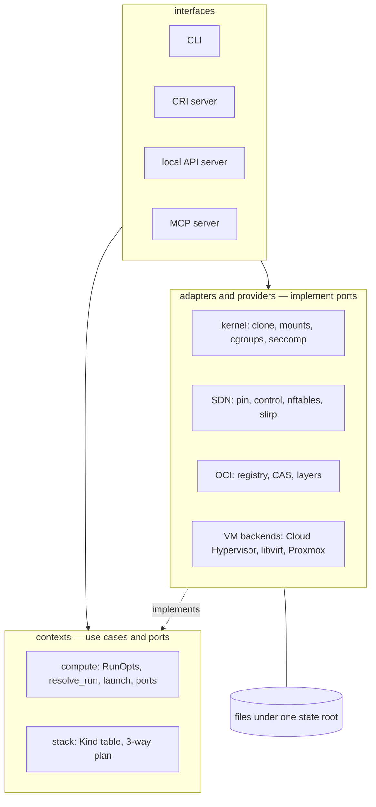
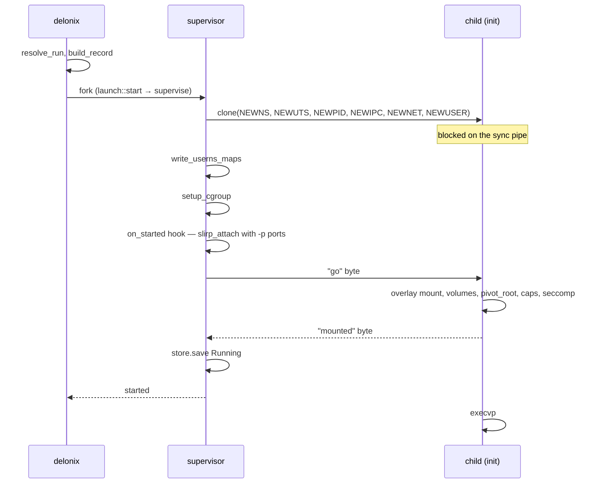
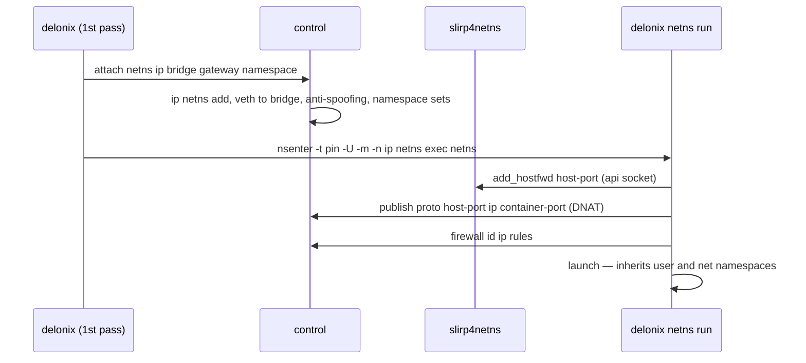
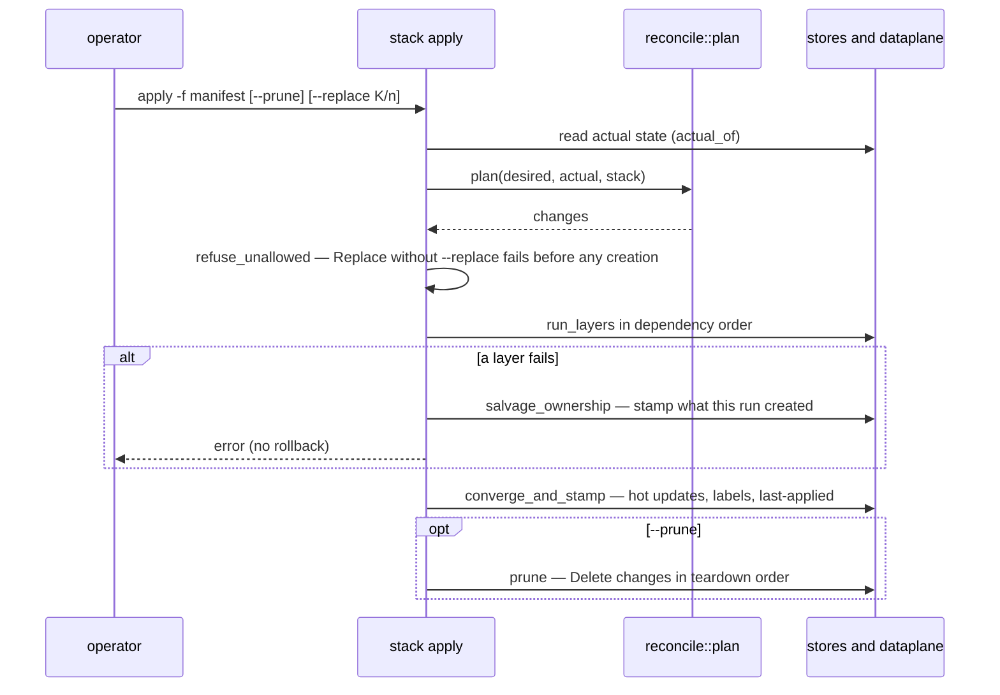

# 7. System Design Interview — the Delonix Engine

> **Interviewer:** Design a container and microVM engine for a single Linux node. It must run
> without root by default, without a resident daemon, and it must not know who is calling it.

This page answers that prompt the way a strong candidate would, and then checks every answer
against what the Delonix Engine actually does. Each deep dive ends with **Where it lives in the
code**, listing files and symbols that were read for this page. For the structural map (layers,
crate graph, processes, state paths) read [5. Architecture](05-architecture.md) first; this page
is about *why* the design is shaped that way.

Numbers quoted below are **measurements recorded in the repository with their date or release**,
not timeless facts. Re-measure before relying on one.

---

## 1. Requirements

> **Candidate:** Before drawing boxes I want to pin down what "done" means.

### Functional

- Run **containers** from OCI images: pull, unpack, create, start, stop, exec, logs, remove.
- Run **microVMs** from disk images, on more than one hypervisor.
- **Networks** between workloads: private bridges, published ports, firewall, DNS names,
  isolation by namespace.
- **Storage**: named volumes, bind mounts, network shares.
- **Declarative** operation: a manifest of Kinds, `plan`, `apply`, drift detection, prune.
- Serve the **kubelet** through the CRI, so the engine can be a Kubernetes node runtime.
- Expose the same operations to **local programs** (an API, an AI tool protocol), not only a shell.

### Non-functional

- **Rootless-first.** The normal path runs as an unprivileged user; privilege is opt-in and said.
- **Daemonless.** No process runs "just in case". Persistence belongs to systemd or to a
  per-workload process with an owner.
- **No consumer knowledge.** No tenant, account, plan or billing; the engine validates its own
  contract instead of trusting a caller to refuse what it cannot do.
- **Observable** through open standards (OpenTelemetry, Prometheus) and an event log.
- **Honest failure.** A refused or half-done operation is reported as such, with a reason and a
  stable exit class — never `0` over a failure.
- **Survives restarts of its own control processes** without disturbing running workloads.

---

## 2. Background constraints: what an unprivileged Linux user may do

> **Candidate:** Rootless changes the design more than any other requirement, so let me list the
> kernel rules I have to live with.

| The kernel lets an unprivileged user… | …but not | Consequence for the design |
|---|---|---|
| create a **user namespace** and be uid 0 inside it (`CLONE_NEWUSER`) | map arbitrary host uids | a single-uid map unless `newuidmap`/`newgidmap` and `/etc/subuid` grant a range; an image that `chown`s to uid 101 needs the range |
| create net, mount, PID, IPC, UTS namespaces **owned by that user namespace**, with `CAP_NET_ADMIN`/`CAP_SYS_ADMIN` inside them | touch the host's initial network namespace | networking is built *inside* a namespace the engine owns; reaching the host needs a user-space bridge (`slirp4netns`) |
| `mount` overlayfs, tmpfs, binds **inside its own mount namespace** | mount in the host's view | the container's own init performs the overlay mount after `clone` |
| write limits into a **delegated** cgroup v2 subtree | write cgroups it was not delegated | limits only apply where systemd delegated them (`systemd-run --user --scope -p Delegate=yes`) |
| `setns` into a namespace owned by its own user namespace | `setns` into a namespace owned by *another* process's user namespace | joining a network created elsewhere means **entering that owner's user namespace first** |
| run `clone` safely in a **single-threaded** process | assume `clone` is safe in a multi-threaded one (`clone` does not run `pthread_atfork` handlers) | servers built on `tokio` must hand process creation to a fresh process |

Two host policies turn up constantly and look like engine bugs: Ubuntu 23.10+ restricts
unprivileged user namespaces through AppArmor (a profile is attached to the *path* of the
executable that creates the namespace), and a plain SSH session is not a delegated cgroup scope.

---

## 3. API

> **Candidate:** One set of operations, several doors — and one of them is the contract the
> others converge on.

| Door | Encoding | Who uses it |
|---|---|---|
| CLI `delonix` | argv, stable exit classes | operators, scripts |
| Node contract `delonix.node.v1` | gRPC **and** HTTP/JSON on the **same** local unix socket | any local client (design; not served yet) |
| CRI `runtime.v1` | gRPC on a unix socket | the kubelet |
| MCP | JSON-RPC over stdio | a local AI client, one session per process |

Design points of the node contract, all written in
[ADR-0040](../adr/0040-engine-restructuring-layers-ports-node-contract.md) D4 and
[ADR-0042](../adr/0042-one-engine-api-maturity-and-docs.md):

- **The `.proto` files are the source of truth**; the REST mapping comes from `google.api.http`
  annotations and the OpenAPI document is generated from them. A CI gate checks format, lint,
  breaking changes against the last release, that every RPC except the bidirectional streams
  (`Exec`, `Console`) has an HTTP mapping, and that the committed OpenAPI is the generated one.
- **Resource-oriented** services (`ContainerService`, `PodService`, `VirtualMachineService`,
  `NetworkService`, `VolumeService`, `ImageService`, `StackService`, `NodeService`,
  `OperationService`), one request message per RPC, identity as explicit `namespace`/`name`.
- **Long work returns an `Operation`** that is persisted before it is acknowledged, so a
  restarted server can say `Interrupted` instead of `RUNNING` forever.
- **Local only.** `SO_PEERCRED`, same uid, no TCP, no TLS, no identity in the engine —
  [ADR-0010](../adr/0010-remote-management-api.md) rejected a remote API. Anything off-node puts
  its own proxy in front.

> **Interviewer:** Why not just a REST server?
>
> **Candidate:** Because gRPC clients and shell tooling both deserve a first-class encoding, and
> generating both from one file keeps them from drifting. The CLI is not a second-class citizen
> either: its exit classes (`delonix-model/src/exitcode.rs`) are the `DX_*` classes ADR-0040 D4
> requires the contract's errors to carry.

**Where it lives in the code:** `proto/delonix/node/v1/{node,compute,infra,operations,common}.proto`;
`scripts/contract_gate.py`; `docs/api/openapi.yaml`; `crates/interfaces/delonix-cri/src/lib.rs`
(`serve_blocking`); `bins/delonix-mcp-bin/src/main.rs`; `crates/foundation/delonix-model/src/exitcode.rs`.
Honest status: no crate references `delonix.node.v1` yet; local programs use the management API
(`crates/interfaces/delonix-mgmt`), which ADR-0042 plans to migrate and remove.

---

## 4. High-level design

> **Candidate:** I will layer it so the rules of the domain never import the kernel, and I will
> make every long-lived process own exactly one thing.



- **Layers** (ADR-0040 D1): foundation → contexts → adapters/providers → interfaces → binaries,
  enforced by `scripts/arch_fitness.py`.
- **State** is JSON records and content-addressed files under one root, with atomic writes and
  `flock` around read-modify-write — no database, because there is no daemon to own one.
- **Processes** exist per workload (a supervisor that is the container's parent, the init, a log
  shim) and per node when networking is used (a *pin* that only holds namespaces, a restartable
  *control* process, one `slirp4netns` uplink). Nothing else stays up.

**Where it lives in the code:** `scripts/arch_fitness.py` (`LAYERS`, `ALLOWED`);
`crates/foundation/delonix-runtime-core/src/store.rs` (`Store::update`, `JsonStore::update`,
`write_atomic`); `crates/contexts/delonix-compute/src/{ports,launch}.rs`;
`crates/adapters/delonix-runtime/src/supervise.rs` (`run_supervised`).

---

## 5. Deep dives

### 5.1 A rootless `container run`

> **Interviewer:** Walk me through `run -d -p 8080:80 nginx` as an unprivileged user.

> **Candidate:** Resolve everything that can fail *before* creating a process; then create the
> process stopped, configure it from outside, and only release it when it is ready.

1. **Resolve.** One run specification (`RunOpts`) comes from every entry — CLI flags, a Pod
   manifest, the Docker API, the CRI. `resolve_run` pulls the image if absent, prepares the root
   filesystem, resolves `--user` against it, resolves volumes and devices, and validates security
   options. Every refusal happens here, and a guard removes the prepared directory on any early
   return.
2. **Record.** `build_record` turns the specification into a `Container` record (pure).
3. **Choose the parent.** For a detached start the CLI forks a **supervisor** that becomes the
   container's parent (`launch::start` → `should_supervise`). Only the real parent can `waitpid`,
   so this is what makes the real exit code and `--restart` possible without a daemon.
4. **Clone.** `spawn` calls `clone` with new mount, UTS, PID and IPC namespaces, plus user and
   network namespaces when the container gets its own. The child blocks on a pipe.
5. **Configure from outside, in a fixed order.** The parent writes the uid/gid maps
   (`write_userns_maps`, through `newuidmap` when a subuid range exists), sets up the cgroup, runs
   the `on_started` hook (here: `slirp_attach` with the `-p` ports, so the network exists before
   the entrypoint runs), and only then writes the "go" byte.
6. **Inside the child.** `container_init` mounts the overlay (`mount_overlay_if_marked`), binds
   volumes, sets up `/dev`, `pivot_root`s, masks `/proc` paths, applies capabilities, seccomp and
   `no_new_privs`, and signals **"mounted"** on a second pipe before `execvp`.
7. **Publish the record last.** The parent waits for the "mounted" byte (`wait_for_mounts`),
   briefly for the exec result, and only then `store.save`s `Running`.



> **Interviewer:** Why wait for "mounted" before saving the record?
>
> **Candidate:** Because the record is what *other* processes read to decide they can enter the
> container. Before `pivot_root`, `setns` into the child's mount namespace lands in the host's
> filesystem. Measured on 2026-08-28 with a probe that could tell the two filesystems apart: before
> the fix, 5 of 54 `exec`s issued straight after `run -d` ran outside the container; after it,
> 0 of 54. The
> wait has three outcomes (`MountWait::{Ready, InitExited, Unknown}`) and a ceiling, so a hung
> mount cannot hang `run`.

**Where it lives in the code:** `crates/contexts/delonix-compute/src/run.rs` (`resolve_run`,
`build_record`); `crates/contexts/delonix-compute/src/launch.rs` (`start`, `should_supervise`,
`WorkloadRuntime`); `crates/adapters/delonix-runtime/src/workload.rs` (`HostWorkload`);
`crates/adapters/delonix-runtime/src/supervise.rs` (`run_supervised`);
`crates/adapters/delonix-runtime/src/lib.rs` (`spawn`, `write_userns_maps`, `setup_cgroup`,
`container_init`, `setup_rootfs`, `wait_for_mounts`, `MountWait`);
`bins/delonix-runtime-bin/src/cmd/container.rs` (`cmd_run`).

### 5.2 Networking: pin, control, slirp, nftables

> **Interviewer:** Containers need to talk to each other, be isolated by namespace, and publish
> ports — without `CAP_NET_ADMIN` on the host.

> **Candidate:** Build a private network world inside one namespace the user owns, bridge it to
> the host in user space, and do all filtering there.

**Split holding from serving.** A single "holder" process that owned the namespaces *and* served
requests would take every workload's network down whenever it restarted. So:

- the **pin** (`delonix netns pin`) creates the user, network and mount namespaces itself and
  then only sleeps (`pin_main`). Its pid is what every `nsenter -t <pin>` targets, and it never
  changes;
- the **control** process (`delonix netns control`, started through `nsenter` into the pin's
  namespaces) serves a `0600` unix socket restricted by `SO_PEERCRED`, and runs DNS, DHCP and
  Router Advertisements. It is restartable: `ensure_up` restarts only it when the pin is alive;
- **one `slirp4netns`** attaches `tap0` to the pin's netns and exposes an API socket for
  `add_hostfwd`.

The pin creates its namespaces **in-process** (the caller writes the id maps through two pipes)
instead of via `unshare(1)`, because an AppArmor profile is attached by the path of the executable
that creates the user namespace, and `/usr/bin/unshare` is not the engine's.

**Joining a custom network.** A container on `--net web` cannot `setns` into a netns owned by the
pin's user namespace. The CLI therefore asks the control process to create the netns and veth
(`attach …`), then **re-executes itself** inside the pin's user and mount namespaces
(`nsenter -t <pin> -U -m -n -- ip netns exec <netns> delonix netns run <spec>`); the second pass
inherits the user and network namespaces instead of creating them.

**Publishing a port** is two steps, both dataplane state rather than process state (which is why
ports can be added and removed on a running container): `add_hostfwd` on the single slirp, and a
DNAT rule inside the pin's netns (`publish …` on the control socket).

**Filtering with a verdict map.** The ingress table (`table ip dlxing`) is built so per-container
policy costs the same no matter how many containers exist:

```text
forward priority -20  fwguard   drop 169.254.0.0/16 and 127.0.0.0/8
forward priority -10  fwdeny    established → accept; bridge pair in @netpair → verdict; bridge↔bridge → drop
forward priority  -5  fwcont    ip daddr vmap @fwmap ; ip saddr vmap @fwmap
forward priority   0  forward   policy drop; established; tap0; same-bridge; @netpair
```

`fwcont` has two rules; each container's rules live in its own chain, reached through the `fwmap`
verdict map keyed by IP. Traffic **between** networks is dropped pairwise unless a `NetworkRoute`
puts the pair in `@netpair` — a route says the packet *may* cross, and the per-container chain
still decides whether it is *allowed*.

**Isolation by namespace** lives in each container's chain: members of `@dlxns<hash>` (same
namespace) are accepted, and **new** connections from any other container address (`@dlxall`) are
dropped; replies still flow because the drop matches only `ct state new`. An explicit ingress
policy replaces that default. IPv6 in the SDN is refused by default (`table ip6` with
`policy drop`), because every rule above is IPv4.



> **Interviewer:** The control process serves one connection at a time. Isn't that a bottleneck?
>
> **Candidate:** It is deliberately the serialization point for netns, veth and nftables changes,
> which must not interleave. The risk is clients giving up in the queue: when v0.47.0 was
> prepared, 30 concurrent attaches with a 5-second read ceiling lost 15; with the reply ceiling
> raised (`CONTROL_REPLY_TIMEOUT`, 30 s) all 30 completed. The per-connection I/O ceiling
> (`CONTROL_IO_TIMEOUT`) exists so one stuck client cannot freeze the node's control plane.

**Where it lives in the code:** `crates/adapters/delonix-net/src/infra.rs` (`ensure_up`,
`start_pin`, `pin_main`, `start_control`, `control_main`, `control_loop`, `start_slirp`,
`attach_container`, `do_attach`, `publish_port`, `join_argv`, `ingress_table_ruleset`,
`fw_chain_body`, `dlxns_set`, `DLXALL_SET`, `ingress_v6_refusal_ruleset`, `CONTROL_IO_TIMEOUT`,
`CONTROL_REPLY_TIMEOUT`); `crates/adapters/delonix-net/src/pin_userns.rs`;
`crates/adapters/delonix-net/src/run_network.rs` (`HostNetwork`);
`crates/contexts/delonix-compute/src/network.rs` (`attach_custom_network`, `wire_network`);
`bins/delonix-runtime-bin/src/cmd/container.rs` (`reexec_into_netns`, `run_from_spec`).

### 5.3 Images: CAS, shared layers, and the many-layer mount

> **Interviewer:** A node runs twenty containers of the same image. What is on disk?

> **Candidate:** Blobs once, unpacked layers once, and one small writable directory per container.

- **CAS.** Blobs are named by their sha256 under `blobs/sha256/<hex>`; writing an existing digest
  is a no-op. A pull verifies each blob against the manifest **and** the manifest against the
  digest the user pinned (`verify_manifest_digest`) — otherwise a pin would be decorative.
- **Resumable downloads.** A blob download retries with `Range:` from the bytes already held
  (`BLOB_ATTEMPTS`), and distinguishes a `206` at the requested offset (resume), a `206` elsewhere
  and a `200` (restart). The digest check at the end makes stitching safe.
- **Shared layers.** `prepare_overlay` creates `upper/`, `work/`, `merged/` for the container and
  writes the ordered list of shared layer directories to `overlay-lowers`. The **container's own
  init** mounts it, inside its mount namespace, where an unprivileged user is allowed to. The
  contract is a file on disk rather than a field in memory because the rootless path re-executes
  the binary and a struct does not cross that boundary.

  Back of the envelope, as recorded for v0.59.0: the previous flat copy cost each container a
  full image tree — on one development host `containers/` held 47 GiB, most of it identical
  copies, and each `run` of a 2.1 GiB image spent about 13 s copying. Sharing layers took that
  directory to 7.2 GiB.
- **Many layers.** The classic `mount(2)` passes `lowerdir=a:b:c…` as one string and the kernel
  copies at most a page of it, **truncating silently**. Measured for
  [ADR-0037](../adr/0037-overlay-mount-new-api.md) (validated 2026-09-06): 20 layers (4084 bytes)
  mounted, 30 (5994 bytes) failed, and a 91-layer builder image needed 9107 bytes. The mount now
  uses `fsopen`/`fsconfig`/`fsmount`/`move_mount` with one `lowerdir+` call per layer, so there is
  no length ceiling.

**Where it lives in the code:** `crates/adapters/delonix-image/src/cas.rs` (`Cas::write`,
`Cas::has`); `crates/adapters/delonix-image/src/registry.rs` (`blob_with_progress_capped`,
`BLOB_ATTEMPTS`, `parse_content_range`, `verify_manifest_digest`);
`crates/adapters/delonix-image/src/overlay.rs` (`prepare_overlay`, `LOWERS_FILE`);
`crates/adapters/delonix-image/src/run_images.rs` (`HostImages`);
`crates/adapters/delonix-runtime/src/lib.rs` (`mount_overlay_if_marked`, `fsopen_overlay`).

### 5.4 microVMs: one port, a registry, and the firmware trap

> **Interviewer:** Add VMs without building a hypervisor abstraction that leaks everywhere.

> **Candidate:** A trait per provider, a registry the composition root fills, and quirks that
> belong to the provider answered by the provider.

- **Port.** `VmBackend` has `id`, `available`, `boot`, `is_running`, `ip`, `stop`, and optional
  operations (`pause`, `snapshot`, `restore`, …) whose default answer is "not supported". Provider
  facts are methods, not string checks at call sites: `ip_is_predicted` (Cloud Hypervisor's
  address is computed from the MAC, not observed), `manages_own_storage` (a remote node owns its
  disk), `destroy` distinct from `stop` (locally the disk is the engine's; remotely only destroy
  releases it).
- **Registry.** `builtin_backends` seeds Cloud Hypervisor and libvirt in preference order;
  `register_backend` adds more (the Proxmox backend, registered by the CLI's composition root
  only when configured). A registration carries a factory closure and an `auto_selectable` flag,
  so auto-detection never constructs — and therefore never authenticates — a remote backend.
  Registering does no I/O.
- **Networking a VM.** Cloud Hypervisor runs inside the pin's netns and gets a `tap` on a network
  bridge through the `VmNetwork` port, which the SDN implements (`HostVmNetwork`); `delonix-vm`
  does not depend on `delonix-net`. Because the DHCP server is the engine's own and deterministic,
  the lease is known before the guest boots, which is what lets namespace isolation apply to a
  VM's address from the first packet — and why "has an IP" is not proof of a booted guest
  (`sdn_reachable` asks by ARP from inside the netns).
- **Firmware.** The Cloud Hypervisor firmware search prefers EDK2 `CLOUDHV.fd` over
  `hypervisor-fw` (`DEFAULT_CH_FIRMWARES`, with a test fixing the order).
- **cloud-init.** `VmConfig` carries intent (`hostname`, user, SSH keys); local backends realize
  it as a NoCloud ISO whose `network-config` matches the primary NIC by **MAC**, and a remote
  backend may realize it natively.

**Where it lives in the code:** `crates/adapters/delonix-vm/src/lib.rs` (`VmBackend`,
`BackendRegistration`, `builtin_backends`, `register_backend`, `select_backend`, `auto_detect`,
`backend_for`, `CloudHypervisorBackend`, `LibvirtBackend`, `launch_vmm`, `DEFAULT_CH_FIRMWARES`,
`set_network`); `crates/adapters/delonix-vm/src/cloudinit.rs` (`generate_seed_iso`);
`crates/contexts/delonix-compute/src/ports.rs` (`VmNetwork`);
`crates/adapters/delonix-net/src/vm_network.rs` (`HostVmNetwork`);
`crates/adapters/delonix-net/src/infra.rs` (`sdn_reachable`, `dhcp_lease_ip`);
`crates/providers/delonix-proxmox/src/lib.rs` (`ProxmoxBackend`);
`bins/delonix-runtime-bin/src/cmd/vmbackends.rs` (`register_configured`).

### 5.5 The declarative reconciler, without a state file

> **Interviewer:** `apply` must converge, detect drift, and prune — Terraform-like — but you said
> no daemon and no database.

> **Candidate:** Keep the last applied spec on the resource itself, derive ownership from a label,
> and make planning a pure function.

- **Pure plan.** `reconcile::plan(desired, actual, stack)` takes two snapshots and returns
  `Vec<Change>`; it never opens a store. That makes the hard cases testable as data.
- **Three-way diff.** The last applied field map is stored on the resource
  (`delonix.io/last-applied`). A field present on the machine but absent from the manifest is
  reverted **only if we set it**; otherwise it is left alone — the distinction a two-way diff
  cannot make.
- **Ownership by label** (`delonix.io/stack`). A resource with no owner is `Adopt`ed; one owned by
  another stack is a `Conflict` and never touched; `--prune` and `destroy` only see what carries
  the label.
- **Actions** are `Create`, `Adopt`, `Update` (hot, same PID), `Replace` (refused unless
  `--replace <Kind>/<name>` is given, checked before anything is created), `NoOp`, `Delete`,
  `Conflict`, `NotConverged`. `plan --detailed-exitcode` answers 0/2/1 for a CI drift gate.
- **One table of Kind facts** (domain, form, whether it converges, has teardown, is namespaced,
  how presence is observed) governs the planner, apply order and teardown order, instead of lists
  kept in sync by hand.



**Where it lives in the code:** `crates/contexts/delonix-stack/src/reconcile.rs` (`plan`,
`Action`, `Change`, `STACK_LABEL`, `LAST_APPLIED`, `hot_fields_for`, `encode_last_applied`);
`crates/contexts/delonix-stack/src/kinds.rs` (`KindFacts`, `facts`, `stack_kinds`, `converges`,
`has_teardown`); `bins/delonix-runtime-bin/src/cmd/stack.rs` (`apply`, `apply_docs`,
`refuse_unallowed`, `run_layers`, `salvage_ownership`, `converge_and_stamp`, `prune`,
`destroy_one`).

---

## 6. Trade-offs

| Decision | What it buys | What it costs |
|---|---|---|
| **No daemon**; a supervisor per detached container, systemd for boot persistence | no single process whose death takes every workload; each process has an obvious owner | nothing sees a process die unless its own supervisor does; a caller that cannot fork starts unsupervised and the real exit code is lost; orphans need explicit reapers |
| **JSON files + `flock`** instead of a database | inspectable state, crash-tolerant, no extra dependency, works across CLI/CRI/supervisor processes | no transactions or queries; the truth about liveness is reconciled on read (`reconcile_status`, `safe_to_signal`) |
| **User-space uplink (`slirp4netns`)** instead of veth pairs in the host | works with zero host privilege | extra hop and CPU in user space; a loopback client appears as the slirp gateway (`SLIRP_GW`) rather than itself |
| **Pin/control split** | a control restart moves no wire | two processes to reason about, and in-place upgrades must still recognize older pins |
| **Re-exec instead of in-process `clone` in servers** | `clone` never runs in a multi-threaded process | a process per operation, and error text crossing a process boundary — the cycle ADR-0040 removes with a launcher |
| **Overlay mounted by the container's init** | one copy of each layer on disk; unprivileged mount | a stopped container's merged view needs a helper process to hold the mount (`reexec_mapped_hold`) |
| **Verdict map dispatch** | constant per-packet cost as containers grow | rules are generated text; the generator and the counter reader must share formatting (`fw_rule_tail`) |
| **3-way diff on the resource** | no state file to lose or diverge | only fields a Kind can read back can be compared; `Secret` values are not decrypted for planning |

---

## 7. Failure modes and the limits of one node

> **Interviewer:** Tell me how it breaks.

- **The control process dies.** `ensure_up` finds the pin alive and restarts only the control
  plane inside the surviving namespaces; running workloads keep their PIDs and network.
- **The pin dies.** The namespaces go with it and cannot be re-entered, so the infra is rebuilt.
  `delonix net netns up` finds containers and pod members that were running with a network and
  restarts them (`reconcile_after_respawn`; `DELONIX_NO_AUTO_RECOVER=1` only reports). This is
  recovery by restart, and it reads the container store only — VMs are not recovered this way.
- **An upgrade over an older holder.** A pre-split holder serving a legacy socket path is detected
  and reported with both paths; it is deliberately **not** killed automatically, because that
  would drop every workload's network.
- **`apply` dies midway.** Apply is fail-fast without rollback. Before creating anything it
  validates the graph and refuses unauthorized replacements; if a layer fails, what this run
  created is stamped with ownership (`salvage_ownership`) so a later `destroy` or `--prune` can
  still reach it, and the failed run is recorded as a revision.
- **Leaks without a daemon.** Every lease and reference is released by a normal detach, so anything
  that dies another way leaks. Measured on 2026-08-25: one network's IPAM file held 391 leases, of
  which 47 belonged to an existing container. The reapers respect a grace window
  (`REF_MARKER_GRACE`) because a container being created holds a lease and a reference before it
  has a record; the IPAM reaper is two-pass (a lease is only reclaimed if it is still orphaned on a
  later run, past the window) and **fails closed** — an unreadable store is an error, never
  "nothing is alive". Liveness counts every container record, the pod netns of pod members and
  attached reference markers, not only running container ids (`cmd/prune.rs::lease_owners`,
  `live_ref_owners`).
- **The mount-wait race** (5.1): closed by publishing the record only after the init reports its
  mounts; a detached start whose init exits before mounting is an error, not `0`.
- **Limits of a single node.** Each network is a `/16` inside the pin's netns; every
  netns/veth/nftables change goes through one serialized control connection; `slirp4netns`
  throughput is user-space; and moving a VM to another host (`vm migrate`) involves real
  downtime — live migration is a NO-GO as built
  ([ADR-0031](../adr/0031-live-vm-migration-no-go.md)).
  Scheduling across nodes is out of scope by design.

**Where it lives in the code:** `crates/adapters/delonix-net/src/infra.rs` (`ensure_up`,
`stale_holder_message`, `reap_orphan_refs`, `REF_MARKER_GRACE`);
`crates/adapters/delonix-net/src/ipam.rs` (`reap_orphan_leases`);
`crates/adapters/delonix-net/src/lib.rs` (`reap_orphan_slirp`);
`bins/delonix-runtime-bin/src/cmd/netns.rs` (`reconcile_after_respawn`, `is_reattach_candidate`);
`bins/delonix-runtime-bin/src/cmd/prune.rs` (`lease_owners`, `live_ref_owners`);
`bins/delonix-runtime-bin/src/cmd/stack.rs` (`salvage_ownership`);
`crates/adapters/delonix-runtime/src/lib.rs` (`reconcile_status`, `MountWait`).

---

## 8. Follow-up questions

**Why not add a small daemon for events and restarts?**
Because every resident process is a failure domain and an attack surface. The event log is an
append-only file (`delonix_runtime_core::events`), restarts belong to the per-container
supervisor, and boot persistence is a systemd unit per workload (`delonix system boot`). A daemon
needs its own ADR with evidence of what the alternatives could not do — see
[ADR-0034](../adr/0034-csi-daemon-conflict.md) for a case where the question came up, and
[ADR-0021](../adr/0021-gitops-pull-reconciler.md) (*Proposed*) for continuous reconciliation that
stays daemonless.

**How does the CRI start a container if the server must not `clone`?**
`StartContainer` builds a typed `RunOpts`, writes it to a `0600` file and runs
`delonix __apirun <spec>`, which calls the same `cmd_run` as the CLI. ADR-0040 D5 replaces the
CLI hop with a launcher executable. Resource policy on the CRI path follows the kubelet
([ADR-0038](../adr/0038-cri-follows-kubelet-resource-model.md)).

**Why is the management API local-only?**
Remote access means identity, authorization, certificates and audit of callers the engine has no
notion of. [ADR-0010](../adr/0010-remote-management-api.md) rejected it; the MCP surface is local
for the same reason ([ADR-0025](../adr/0025-mcp-local-ai-control-surface.md)).

**How would you add a new VM provider?**
A new crate implementing `VmBackend`, registered at the composition root — no edit to call sites
([ADR-0008](../adr/0008-proxmox-vm-backend.md)). ADR-0040 D3 moves provider knobs into namespaced
extensions and quirks into capabilities; OpenStack is gated on a spike
([ADR-0039](../adr/0039-openstack-vm-backend.md)).

**How do Services load-balance without a VIP?**
A `Service` selects containers by label and the internal DNS returns several `A` records, rotated
per query — no new dataplane ([ADR-0032](../adr/0032-service-kind-dns-round-robin.md)).

**Why ext4 and not btrfs/zfs under the state root?**
Overlay over a shared layer cache already removed the duplication; a different filesystem is
revisited only for a measured need ([ADR-0016](../adr/0016-filesystem-under-the-state-root.md)).

**What about macOS and Windows?**
Not a port — nothing this engine uses exists outside the Linux kernel. The plan is a launcher for
a Linux guest VM ([ADR-0036](../adr/0036-macos-windows-support.md), *Proposed*).

**Where is the restructuring going?**
Four layers, one run specification, provider ports with capabilities, one node contract served on
a socket-activated server, and a launcher owning every namespace-creating spawn
([ADR-0040](../adr/0040-engine-restructuring-layers-ports-node-contract.md),
[ADR-0042](../adr/0042-one-engine-api-maturity-and-docs.md)).
