# Architecture

**Before you read:** [Project structure](project-structure.md) (where things are), [IaaS and cloud native](iaas-and-cloud-native.md) (the engine's place and principles) and [Cloud native primer](cloud-native-primer.md) (the mechanisms the figures name).

This page is the map a contributor needs before touching the backend: what the engine is, who
talks to it, which processes exist at runtime, how the crates are layered and call each other,
and where state lives on disk. It follows the C4 model in order — **Level 1** system context,
**Level 2** containers (executables and processes), **Level 3** components (crates), and
**Level 4** code-level flows as sequences. Every node and arrow in a figure names, in the text
next to it, the file and symbol it was checked against. After it you can say which process a piece
of work runs in, which layer a crate belongs to and which dependencies it may take, and where on
disk its state lives.

The canonical, longer document is [`ARCHITECTURE.md`](../../ARCHITECTURE.md) at the repository
root; the decisions behind the structure are in [`docs/adr/`](../adr/), above all
[ADR-0040](../adr/0040-engine-restructuring-layers-ports-node-contract.md). If a term is new to
you, read [IaaS and cloud native](iaas-and-cloud-native.md) and
[Linux foundations](linux-foundations.md) first; for the tree itself (what each top-level
directory is for) see [Project structure](project-structure.md).

> **Two halves on this page.** The layer table, the ratchet list and the full crate graph are
> *generated* by `python3 scripts/dev_docs.py` from `Cargo.toml` and `scripts/arch_fitness.py` —
> do not edit them by hand. Everything else is narrative and is reviewed after each structural
> change.

**How to read the figures.** Every figure uses the same shapes and colours, and its legend comes
first:

| Shape | Meaning |
|---|---|
| rounded box, dark | person or external actor (operator, kubelet, local program) |
| box, red | the Delonix engine as a whole (this repository) |
| box, white with red border | a building block of the engine: executable, process or crate |
| box, grey | an external system (kernel, systemd, registry, hypervisor, remote API) |
| cylinder, blue | state on disk |
| solid arrow | a call or a data flow; the label says what flows |
| dashed arrow | spawns, `exec`s or supervises a process |
| outlined region | a trust or process boundary |

## Engine identity and boundaries

The canonical text is the section *«Identidade e fronteira do motor»* at the top of
[`AGENTS.md`](../../AGENTS.md). What the engine is, what it leaves to a control plane, and how each
cloud native principle appears in the code are the *context*, explained in
[IaaS and cloud native](iaas-and-cloud-native.md#where-delonix-runtime-fits-and-where-it-deliberately-stops).
This section keeps only the parts that shape the *structure* below:

- **Providers sit behind ports.** The Linux kernel, Cloud Hypervisor and libvirt, Proxmox VE
  and the Kubernetes CRI are reached through a trait, never through `if provider == …` spread
  across the code. Today's ports: `VmBackend` (`crates/adapters/delonix-vm/src/lib.rs`) and the
  compute ports in `crates/contexts/delonix-compute/src/ports.rs` and `launch.rs`
  (`ImageStore`, `StorageProvider`, `DeviceResolver`, `RunHost`, `NetworkProvider`,
  `VmNetwork`, `WorkloadRuntime`). An OpenStack backend is designed
  ([ADR-0039](../adr/0039-openstack-vm-backend.md), *Proposed*) but has no crate yet.
- **One set of operations, several interfaces** — the CLI, the CRI, the local management API, MCP
  and a Docker Engine API slice, with the node contract as the intended single API (see
  [below](#one-set-of-operations-several-interfaces)); observability goes through
  `crates/adapters/delonix-telemetry`.
- **Daemonless and rootless-first decide the process model** — what must persist belongs to systemd
  or to a per-workload process with a clear owner (a container's supervisor, the network pin), and
  privilege is an explicit opt-in (`--privileged`, `vm bridge`). Level 2 shows those processes.
- **Knows no consumer.** No platform, control plane, console or agent is named in `crates/`,
  `bins/`, `proto/` or the manifests, and there is no notion of tenant, account, plan or billing.
  The *namespace* you will see everywhere is the engine's own **isolation** namespace, not a
  tenant.

These are not conventions; `scripts/arch_fitness.py` enforces the structural half in CI:

| Check | Where in `arch_fitness.py` |
|---|---|
| A dependency against the layer direction fails, unless it is a declared exception that names the ADR-0040 phase removing it | `LAYERS`, `ALLOWED`, `EXCEPTIONS`, `rule_failures` |
| A foundation or context crate may not take a runtime/server/CLI dependency (`tokio`, `tonic`, `reqwest`, `clap`, …) | `HEAVY` |
| A binary composes **one** interface crate | `rule_failures` (the `roles` check) |
| A crate must live in the directory of its layer | `LAYER_DIR`, `misplaced` |
| A consumer's name anywhere under `crates/`, `bins/`, `proto/` (comments included) fails | `CONSUMER_NAMES`, `consumer_mentions` |
| Dependency versions live only in the root `[workspace.dependencies]` | `inline_versions` |
| Ratchets that may only go down (listed below) — e.g. library crates re-running the engine's own binary, `println!` in libraries, process-environment writes, adapters importing the shared `Error` as their own | the ratchet patterns (`SELF_EXEC`, `PRINTS`, `ENV_WRITES`, `SHARED_ERROR`, …), baseline in `scripts/arch_baseline.json` |

<!-- dev-docs:begin ratchets -->
`scripts/arch_fitness.py` keeps **5 debt ratchets** (baseline in `scripts/arch_baseline.json`):

- `self_exec_sites`
- `library_prints`
- `env_writes`
- `shared_error_imports`
- `raw_error_variant_matches`
<!-- dev-docs:end ratchets -->

`python3 scripts/arch_fitness.py --list` shows what each ratchet counts today, file by file.

## Level 1 — System context

> **Legend** — dark rounded box: person or external actor · red box: the Delonix engine ·
> grey box: external system · solid arrow: call or data flow, labelled.

The engine sits between four kinds of caller and the systems of one Linux node; it has no
network-facing API of its own, and everything remote it reaches is reached *outward*.

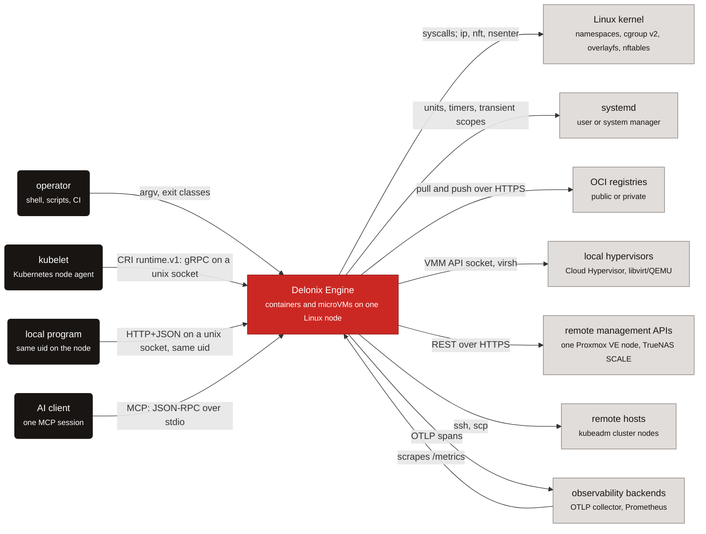

Where each arrow is in the code:

| Arrow | Code |
|---|---|
| operator → engine | `bins/delonix-runtime-bin/src/main.rs` (`main`, `run`); exit classes in `crates/foundation/delonix-model/src/exitcode.rs` |
| kubelet → engine | `crates/interfaces/delonix-cri/src/lib.rs` (`serve_blocking`) |
| local program → engine | `crates/interfaces/delonix-mgmt/src/lib.rs` (`serve_blocking`, the `axum` router) |
| AI client → engine | `crates/interfaces/delonix-mcp/src/lib.rs` (`serve_stdio`) |
| engine → kernel | `crates/adapters/delonix-linux/src/lib.rs` (`spawn`, `container_init`); `crates/adapters/delonix-sdn/src/infra.rs` (`ip`, `nft`, `nsenter` subprocesses) |
| engine → systemd | `busctl` transient scopes in `crates/adapters/delonix-linux/src/lib.rs`; boot units in `bins/delonix-runtime-bin/src/cmd/boot.rs` |
| engine → registries | `crates/adapters/delonix-oci/src/registry.rs` (`resolve_or_pull`, `push_to_registry`) |
| engine → hypervisors | `crates/adapters/delonix-vm/src/lib.rs` (`CloudHypervisorBackend`, `LibvirtBackend`) |
| engine → remote management APIs | `crates/providers/delonix-proxmox/src/lib.rs`, `crates/providers/delonix-truenas/src/lib.rs` |
| engine → remote hosts | `bins/delonix-runtime-bin/src/cmd/remote.rs` (`ssh`, `scp`), used by `cmd/cluster.rs` |
| engine ↔ observability | `crates/adapters/delonix-telemetry/src/telemetry.rs` (OTLP), `/metrics` routes in `delonix-mgmt` and `delonix-cri` |

## Level 2 — Containers: executables and processes

In C4 a *container* is something that runs. The build ships four executables (see the generated
count in the [handbook README](README.md)); several more **processes** appear per workload or per
node, each with an owner. The three figures below split that picture by concern: who enters the
engine, what one container costs in processes, and the rootless network infrastructure.

### Entry points

**Legend**

| Shape | Meaning |
|---|---|
| rounded box, dark | caller |
| box, white with red border | engine executable |
| cylinder, blue | state on disk |
| solid arrow | request or file access, labelled |
| dashed arrow | `exec` or spawn of a process |
| outlined region | process boundary |

Four doors lead into the engine, but only the one-shot `delonix` process ever creates a
container: the multi-threaded servers run the CLI back for that.

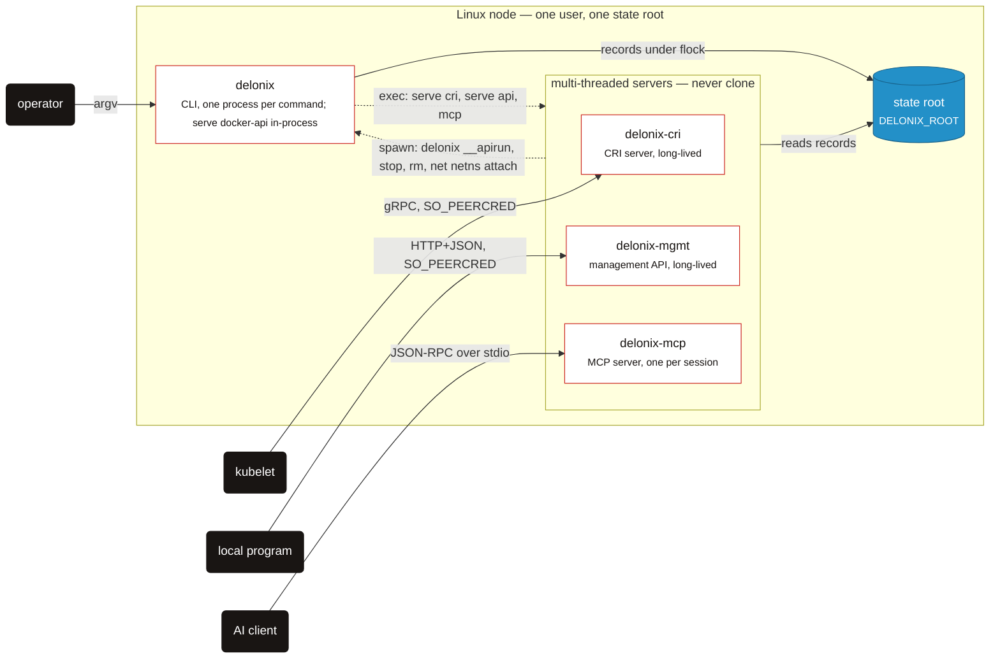

The `exec` is `cmd/serve.rs::exec_server` (and `cmd/mcp.rs`); the run-back is the CRI's
`delonix()` helper and `write_run_spec` in `crates/interfaces/delonix-cri/src/runtime_svc/lifecycle.rs`,
`run_cli` in `delonix-mgmt` and `run_cli_blocking` in `delonix-mcp`, all resolving the CLI through
`delonix_node::dispatch::cli_bin`. The CRI also writes its own records under
`cri/` — see [State on disk](#state-on-disk).

### One detached container

**Legend**

| Shape | Meaning |
|---|---|
| box, white with red border | engine process |
| box, grey | external system |
| cylinder, blue | file on disk |
| solid arrow | data flow or write, labelled |
| dashed arrow | fork, clone or spawn |
| outlined region | lives as long as the workload |

A `run -d` leaves exactly three or four processes behind, and the supervisor — not a daemon — is
the container's parent.

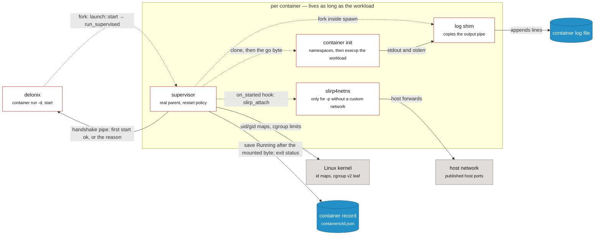

The supervisor is `crates/adapters/delonix-linux/src/supervise.rs::run_supervised`, chosen by
`delonix_compute::launch::start` through `HostWorkload::supervise`
(`crates/adapters/delonix-linux/src/workload.rs`); inside it `create_with` → `spawn` does the
`clone`, `write_userns_maps`, the cgroup, the `on_started` hook (filled with
`delonix_sdn::slirp_attach` by `cmd/container.rs::with_host_workload`) and forks `log_shim`, all in
`crates/adapters/delonix-linux/src/lib.rs`. The record is written through `delonix_state::Store`.
A foreground `run` does the same without the supervisor.

### Rootless network infrastructure

**Legend**

| Shape | Meaning |
|---|---|
| box, white with red border | engine process |
| box, grey | external system |
| cylinder, blue | state on disk |
| solid arrow | request or traffic, labelled |
| dashed arrow | spawn (the CLI starts the process) |
| outlined region | the pin's user, network and mount namespaces |

Everything rootless networking needs lives inside one namespace set held by a process that only
sleeps; the rest can die and be restarted around it.

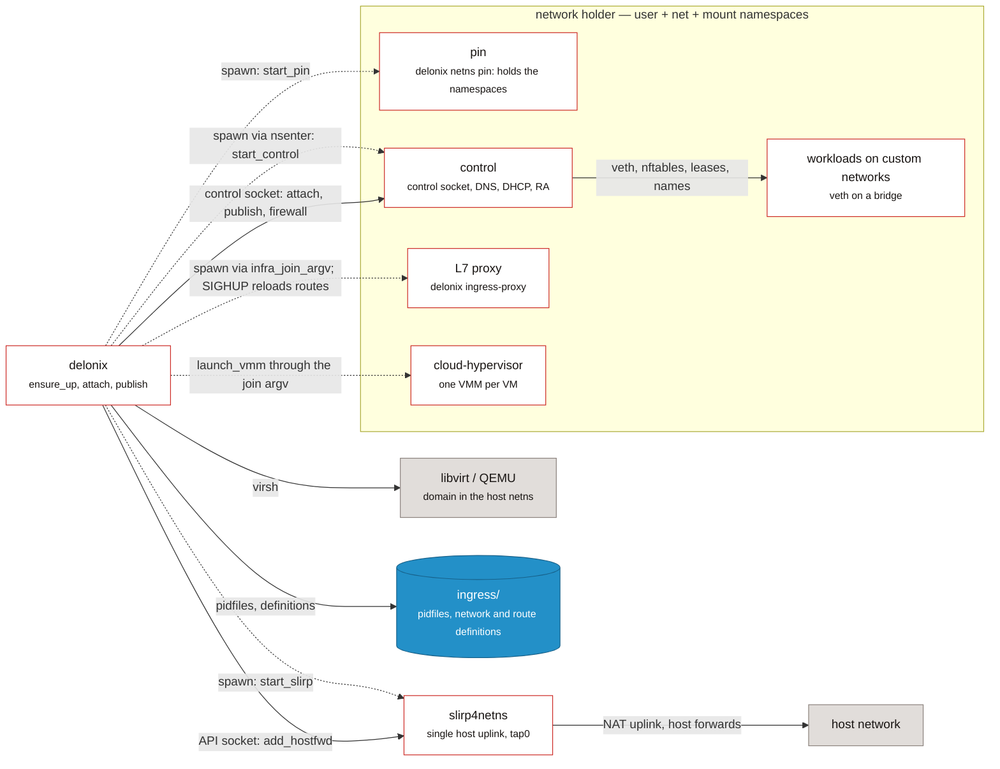

The pin, control and uplink are `start_pin`/`pin_main`, `start_control`/`control_main` and
`start_slirp` in `crates/adapters/delonix-sdn/src/infra.rs`; the pin's namespaces are created in
`pin_userns.rs`. The proxy is `cmd/ingress_proxy.rs::spawn_proxy`; the VMM launch is
`delonix_vm::launch_vmm`, given the join argv by the `VmNetwork` port. A container joins a custom
network by the CLI re-executing itself into the namespaces (`reexec_into_netns`, see the run
sequence under Level 4 below). A libvirt VM lives outside
the holder, on `virbr0` in the host's network namespace.

### Process table

| Process | Born in | Lives for |
|---|---|---|
| `delonix` | `bins/delonix-runtime-bin/src/main.rs` (`main`, `run`) | one command. `main` intercepts the hidden entry points (`netns pin`, `netns control`, `netns run`, `__rmtree`, `__volsnap`, `__ovlmigrate`, `__ovlhold`, `__duusage`, `__buildtar`, `__apirun`, `__netnsconnect`) **before** clap parses |
| `delonix-cri` | `crates/interfaces/delonix-cri/src/bin/delonix-cri.rs` → `delonix_cri::serve_blocking` | a service (typically a systemd unit). `delonix serve cri` `exec`s it (`cmd/serve.rs::exec_server`) |
| `delonix-mgmt` | `bins/delonix-mgmt-bin/src/main.rs` → `delonix_mgmt::serve_blocking` | a service; `delonix serve api` `exec`s it |
| `delonix-mcp` | `bins/delonix-mcp-bin/src/main.rs` → `delonix_mcp::serve_stdio` | one AI-client session (a child process on stdio); `delonix mcp` `exec`s it |
| Docker API slice | `cmd/serve.rs` → `cmd::dockerapi::run`, **inside** the `delonix` process | while `delonix serve docker-api` runs |
| supervisor | `delonix_linux::supervise::run_supervised`, chosen by `delonix_compute::launch::start` for every detached start the caller can fork for | the container's life; it is the real parent, so it collects the exit status and applies `--restart` |
| container init | `delonix_linux::spawn` → `clone` → `container_init` | the container |
| log shim | `fork` inside `spawn`, running `log_shim` | the container |
| per-container `slirp4netns` | `delonix_sdn::slirp_attach`, called as the `on_started` hook | the container's netns; orphans reaped by `reap_orphan_slirp` |
| pin | `infra::start_pin` spawns `delonix netns pin`; `infra::pin_main` creates the user, net and mount namespaces in-process (`crates/adapters/delonix-sdn/src/pin_userns.rs`) and sleeps | the infra; its pid is `ingress/holder.pid` and it never changes |
| control | `infra::start_control` (`nsenter -t <pin> -U -m -n -- delonix netns control`) → `infra::control_main` | restartable; serves the control socket, DNS (`dns_server_main`), Router Advertisements (`ra_sender_main`) and per-bridge DHCP (`dhcp_serve`) |
| single `slirp4netns` | `infra::start_slirp` (`tap0` into the pin's netns, `--api-socket`) | the infra |
| L7 ingress proxy | `cmd/ingress_proxy.rs::spawn_proxy` through `infra::infra_join_argv` | while an `HTTPRoute`/`Ingress` or an `--expose` route exists; reloads routes on `SIGHUP` |
| `cloud-hypervisor` | `delonix_vm::launch_vmm`, run through the infra join argv | the VM |
| libvirt domain | `LibvirtBackend` driving `virsh` | the VM (the domain lives in libvirt) |

`ensure_up` (`crates/adapters/delonix-sdn/src/infra.rs`) is the only function that brings the
network infra up, under a per-root file lock, and it distinguishes three cases: pin and control
alive (nothing to do); pin alive and control gone (restart **only** the control plane — no wire
moves); pin gone (tear down and rebuild).

### One set of operations, several interfaces

| Interface | Transport | Entry | Status |
|---|---|---|---|
| CLI | argv | `bins/delonix-runtime-bin` | the complete surface |
| CRI (`runtime.v1`) | gRPC on a unix socket, `0600` + `SO_PEERCRED` | `delonix_cri::serve_blocking` | serves the kubelet |
| Management API | HTTP+JSON on a unix socket, same uid only | `delonix_mgmt::serve_blocking` (routes such as `/v1/containers`, `/v1/volumes`, `/metrics`) | local only ([ADR-0010](../adr/0010-remote-management-api.md) rejected a remote API); to be replaced by the node contract |
| MCP | stdio | `delonix_mcp::serve_stdio` | local, no tenant ([ADR-0025](../adr/0025-mcp-local-ai-control-surface.md)) |
| Docker Engine API slice | HTTP on a unix socket | `cmd::dockerapi::run` | a compatibility slice, inside `delonix` |
| **Node contract** `delonix.node.v1` | gRPC **and** HTTP/JSON on one unix socket | `proto/delonix/node/v1/` | **contract only** — no server yet |

The node contract is the intended single API
([ADR-0040](../adr/0040-engine-restructuring-layers-ports-node-contract.md) D4,
[ADR-0042](../adr/0042-one-engine-api-maturity-and-docs.md)). The `.proto` files are the source
of truth; `docs/api/openapi.yaml` is **generated** from them and never edited by hand.
`scripts/contract_gate.py` fails on: `buf format`, `buf lint`, `buf breaking` against the last
tag that carries `proto/`, an RPC without an HTTP mapping (or a bidirectional stream with one),
an OpenAPI document that differs from the generated one, and two paths that are the same URL
under different variable names. Three rules it protects: one request message per RPC, explicit
identity (`namespace`/`name`) in the request, and images addressed by query parameter.

## Level 3 — Components: crates by layer

### Layers and the allowed direction

> **Legend** — white box with red border: a layer of crates · solid arrow: *may depend on*, with
> what the dependency is used for.

ADR-0040 D1 fixes one dependency direction: contexts are depended on, never the other way round,
and binaries are the only place where everything meets.

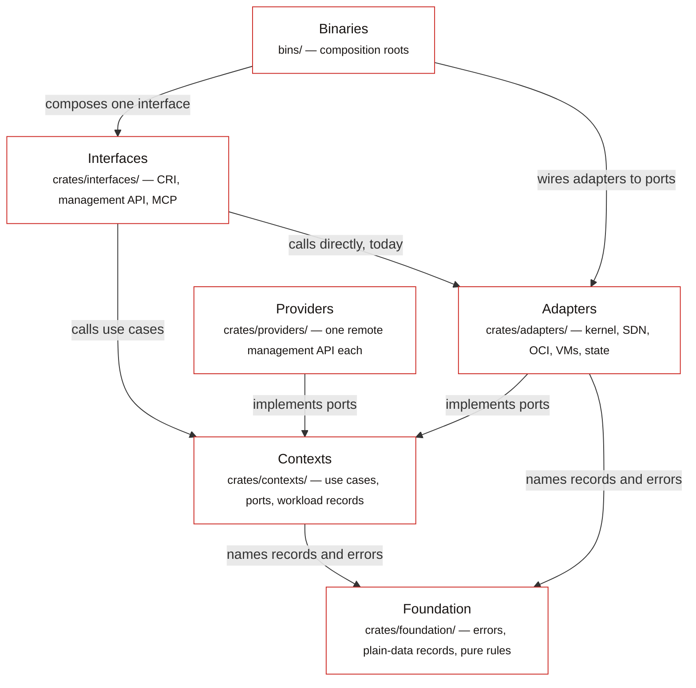

- **Foundation** (`crates/foundation/`) — shared, pure-ish types every layer may name.
- **Contexts** (`crates/contexts/`) — one crate per bounded context, named after the published
  API groups: use cases and the **ports** they need. No HTTP, no provider, and no mounts,
  processes or network configuration. `delonix-node` is the one context that reads the host
  directly — `/proc`, `/sys`, `kill(pid, 0)`, `SO_PEERCRED` — because those questions are what it
  exists to answer once.
- **Adapters** (`crates/adapters/`) and **providers** (`crates/providers/`) — implement ports:
  kernel, SDN, OCI store, VM backends, persisted state; providers bring an HTTP client for one
  remote target.
- **Interfaces** (`crates/interfaces/`) — CRI, management API, MCP: parse a request, call the
  engine, present.
- **Binaries** (`bins/`) — composition roots.

The layer each crate belongs to, and the direction it may depend in:

<!-- dev-docs:begin layers -->
| Layer | May depend on |
|---|---|
| Foundation | foundation |
| Contexts | foundation, contexts |
| Adapters | foundation, contexts |
| Providers | foundation, contexts |
| Interfaces | foundation, contexts, adapters, providers |
| Binaries | foundation, contexts, adapters, providers, interfaces |

Declared exceptions (each one names the ADR-0040 phase that removes it):

- `delonix-linux` → `delonix-state` — removed in **P4a**
- `delonix-mcp` → `delonix-mgmt` — removed in **P5**
- `delonix-oci` → `delonix-state` — removed in **P4**
- `delonix-opnsense` → `delonix-sdn` — removed in **P4**
- `delonix-proxmox` → `delonix-sdn` — removed in **P4**
- `delonix-proxmox` → `delonix-vm` — removed in **P4**
- `delonix-scanner` → `delonix-oci` — removed in **P4**
- `delonix-sdn` → `delonix-state` — removed in **P4**
- `delonix-vm` → `delonix-state` — removed in **P4**
- `delonix-volume` → `delonix-state` — removed in **P4**
<!-- dev-docs:end layers -->

### Where the restructuring stands

ADR-0040 is a strangler plan in phases (P0 rails → P1 contract → P2 contexts → P3 adapters and
binaries → P4 providers → P5 node API → P6 CRI → P7 observability). What the code shows today:

- **P0 is done.** Every crate lives in its layer's directory, versions are workspace-level, and
  the fitness gate runs in CI.
- **P1 is done as a contract, not as a server.** `proto/delonix/node/v1/*.proto` exists, the
  OpenAPI document `docs/api/openapi.yaml` is generated from it, and `scripts/contract_gate.py`
  guards both. **Nothing serves the contract yet** — no crate references `delonix.node.v1`
  ([ADR-0042](../adr/0042-one-engine-api-maturity-and-docs.md) D1 says the same).
- **P2 has started.** `delonix-model` (the shared `Error` and its `DX_*` codes, generated names,
  exit classes, the numbered code dictionary, the secret model, and — since #405 — the plain-data
  records `Status`, `ContainerFw`/`FwRule` with their validators, `default_namespace` and the
  lifecycle `typestate`), `delonix-stack` (Kind table, 3-way reconciler, revisions) and
  `delonix-compute` (the one run specification `RunOpts`, `resolve_run`, `build_record`, the
  network and launch use cases) exist. Most application logic still lives in
  `bins/delonix-runtime-bin/src/cmd/`.
- **P3 is under way.** The compute ports are implemented in adapters (`HostImages`,
  `HostVolumes`, `HostDevices`, `HostRuntime`, `HostNetwork`, `HostWorkload`, `HostVmNetwork`),
  telemetry left the foundation for `delonix-telemetry`, `delonix-vm` reaches the SDN only
  through the `VmNetwork` port, and the CRI, management API and MCP servers became their own
  executables. Four adapters carry their ADR-0040 names: `delonix-scanner` (was `delonix-scan`),
  `delonix-oci` (was `delonix-image`), `delonix-sdn` (was `delonix-net`) and `delonix-linux` (was
  `delonix-runtime`, the container engine crate). **#406 removed `delonix-runtime-core`**, the
  foundation crate that used to hold everything shared, in steps: **#404** moved the stores,
  atomic writes and the encrypted secret store to the `delonix-state` adapter; **#405** moved the
  plain-data records (`Status`, `ContainerFw`/`FwRule`, `typestate`) down to `delonix-model`; and
  **#406** moved the `Container` and `Vm` records (with `Mount`, health and cgroup-parent types,
  `DELONIX_SLICE` and `workload_net`) to `delonix-compute`, and the event log, `virt`,
  `peer_cred`, `dispatch` and the host/process helpers (`now_unix`, `is_alive`,
  `safe_to_signal`, `generate_id`, …) to a new context, `delonix-node`. No re-exports were left
  behind. The adapters that open records or
  write files through `delonix-state` (`delonix-linux`, `delonix-vm`, `delonix-sdn`,
  `delonix-oci`, `delonix-volume`) are declared exceptions until P4 gives them a
  `StateRepository` port (`scripts/arch_fitness.py`).
- **P4 is under way; P5–P7 have not started.** ADR-0044 (accepted 2026-09-24) decides how P4 is
  done. **#420** landed the `StateRepository<T>` port
  (`crates/foundation/delonix-model/src/ports.rs`), and `delonix-linux` already uses it for
  `wait_and_record`/`stop`/`persist_stop`/`remove`, which is why its exception in
  `scripts/arch_fitness.py` names phase `P4a` and lists only the sites still open. **#486** added
  the VM provider port (`VmSpec`, `Extensions`, `Provider`, `VmProvider` in
  `crates/contexts/delonix-compute/src/vm_provider.rs`, P4b slice 1), and `delonix-vm` implements
  it for the two local backends (`LocalVmProvider`, `crates/adapters/delonix-vm/src/provider.rs`)
  by reusing its existing `create_with`/`stop`/`start` rather than a second orchestration; moving
  each backend into its own provider crate is P4b slice 2. The remaining exceptions in the table above name the phase that removes each.

### Records, node helpers and persisted state, after #406

> **Legend** — white box with red border: engine crate (or group of crates) · cylinder, blue:
> files under the state root · solid arrow: *uses*, with what is used.

Plain-data types live in the foundation, the workload records in the Compute context, the node's
own helpers in the Node context, and the files that hold records in one adapter that every other
adapter reaches those files through.

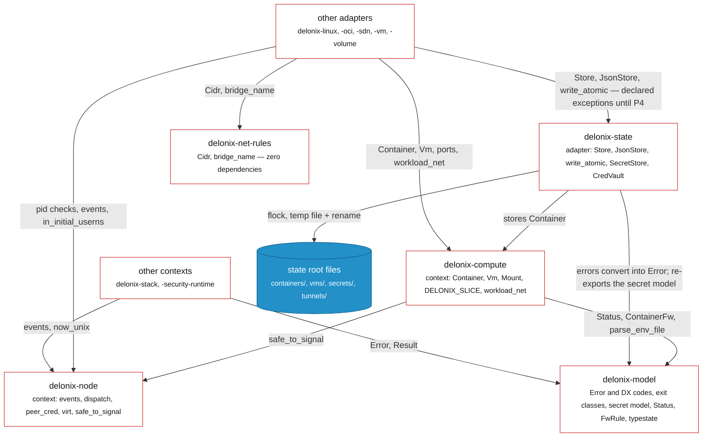

Checked against: `crates/contexts/delonix-compute/src/record.rs` (`use
delonix_model::records::{…}`, `use delonix_node::safe_to_signal`) and `src/lib.rs` (`pub use
record::*`); `crates/contexts/delonix-node/src/lib.rs` and `host.rs`;
`crates/foundation/delonix-model/src/records.rs` and `typestate.rs`;
`crates/adapters/delonix-state/src/store.rs` (`use delonix_compute::Container`), `secret.rs`,
`cred_vault.rs`, `error.rs`. `delonix-net-rules` is used by `delonix-sdn` and `delonix-vm` only;
`delonix-volume` and `delonix-scanner` also name `delonix-model` directly (the generated graph
below has every edge).

### Compute ports and the adapters behind them

> **Legend** — white box with red border: engine component (use cases, adapter, binary) ·
> outlined region: the context crate · solid arrow: a call through the named port.

`container run` is the reference path: the context decides through ports, and the binary chooses
which adapter answers each port.

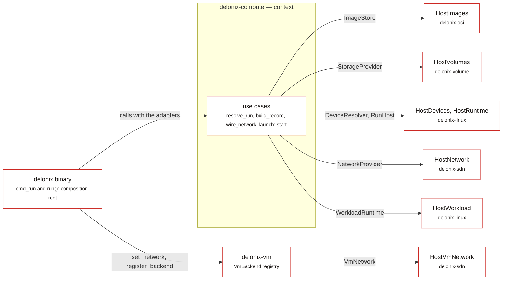

Ports: `crates/contexts/delonix-compute/src/ports.rs` (`ImageStore`, `StorageProvider`,
`DeviceResolver`, `RunHost`, `VmNetwork`, `NetworkProvider`) and `launch.rs` (`WorkloadRuntime`).
Implementations: `delonix-oci/src/run_images.rs`, `delonix-volume/src/lib.rs`,
`delonix-linux/src/{cdi,run_host,workload}.rs`, `delonix-sdn/src/{run_network,vm_network}.rs`.
Wiring: `bins/delonix-runtime-bin/src/cmd/container.rs::cmd_run` and
`bins/delonix-runtime-bin/src/main.rs::run`.

### Interfaces and binaries

> **Legend** — white box with red border: engine crate (or group of crates) · solid arrow: a
> direct Rust call, with what it is used for.

The servers read in-process and hand every fork to the CLI; the one interface-to-interface edge is
a declared exception.

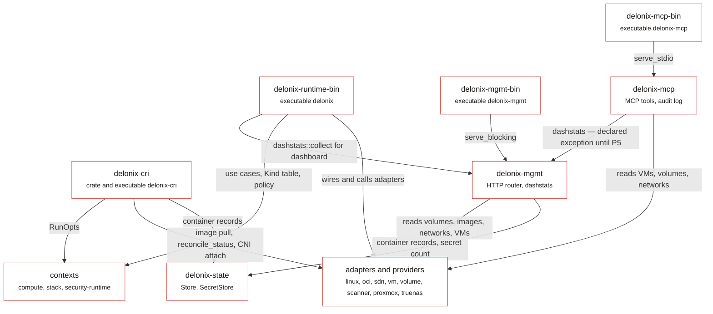

Not drawn, to keep the figure legible: every binary and `delonix-cri`/`delonix-mgmt` also call
`delonix-telemetry` (`telemetry::init`, metrics), and `delonix-mcp` and the CLI read
`delonix-state` too. The dashboard edges are `bins/delonix-runtime-bin/src/cmd/dash.rs` and
`crates/interfaces/delonix-mcp/src/lib.rs` (`delonix_mgmt::dashstats::collect`); the CRI's
`RunOpts` use is `start_run_opts` in `runtime_svc/lifecycle.rs`.

### Every crate edge

The crate graph, as `Cargo.toml` declares it. It is complete and therefore dense; read it to
answer "does A depend on B", and read the per-layer figures above to understand why.

<!-- dev-docs:begin crates-graph -->
**Legend** — one box per crate, grouped by layer; an arrow `A --> B` means *A depends on B*. Red: binaries · white with red border: interfaces · white: contexts and adapters · grey: providers · blue: foundation.

```mermaid
flowchart TB
  subgraph foundation["Foundation"]
    delonix_model["delonix-model"]
    delonix_net_rules["delonix-net-rules"]
  end
  subgraph context["Contexts"]
    delonix_compute["delonix-compute"]
    delonix_node["delonix-node"]
    delonix_security_runtime["delonix-security-runtime"]
    delonix_stack["delonix-stack"]
  end
  subgraph adapter["Adapters"]
    delonix_linux["delonix-linux"]
    delonix_oci["delonix-oci"]
    delonix_scanner["delonix-scanner"]
    delonix_sdn["delonix-sdn"]
    delonix_state["delonix-state"]
    delonix_telemetry["delonix-telemetry"]
    delonix_vm["delonix-vm"]
    delonix_volume["delonix-volume"]
  end
  subgraph provider["Providers"]
    delonix_opnsense["delonix-opnsense"]
    delonix_proxmox["delonix-proxmox"]
    delonix_truenas["delonix-truenas"]
  end
  subgraph interface["Interfaces"]
    delonix_cri["delonix-cri"]
    delonix_mcp["delonix-mcp"]
    delonix_mgmt["delonix-mgmt"]
  end
  subgraph bin["Binaries"]
    delonix_mcp_bin["delonix-mcp-bin"]
    delonix_mgmt_bin["delonix-mgmt-bin"]
    delonix_runtime_bin["delonix-runtime-bin"]
  end
  delonix_compute --> delonix_model
  delonix_compute --> delonix_node
  delonix_cri --> delonix_compute
  delonix_cri --> delonix_linux
  delonix_cri --> delonix_model
  delonix_cri --> delonix_node
  delonix_cri --> delonix_oci
  delonix_cri --> delonix_sdn
  delonix_cri --> delonix_state
  delonix_cri --> delonix_telemetry
  delonix_linux --> delonix_compute
  delonix_linux --> delonix_model
  delonix_linux --> delonix_node
  delonix_linux --> delonix_state
  delonix_mcp --> delonix_compute
  delonix_mcp --> delonix_linux
  delonix_mcp --> delonix_mgmt
  delonix_mcp --> delonix_model
  delonix_mcp --> delonix_node
  delonix_mcp --> delonix_sdn
  delonix_mcp --> delonix_state
  delonix_mcp --> delonix_vm
  delonix_mcp --> delonix_volume
  delonix_mcp_bin --> delonix_mcp
  delonix_mcp_bin --> delonix_node
  delonix_mcp_bin --> delonix_telemetry
  delonix_mgmt --> delonix_compute
  delonix_mgmt --> delonix_linux
  delonix_mgmt --> delonix_model
  delonix_mgmt --> delonix_node
  delonix_mgmt --> delonix_oci
  delonix_mgmt --> delonix_scanner
  delonix_mgmt --> delonix_sdn
  delonix_mgmt --> delonix_state
  delonix_mgmt --> delonix_telemetry
  delonix_mgmt --> delonix_vm
  delonix_mgmt --> delonix_volume
  delonix_mgmt_bin --> delonix_mgmt
  delonix_mgmt_bin --> delonix_node
  delonix_mgmt_bin --> delonix_telemetry
  delonix_node --> delonix_model
  delonix_oci --> delonix_compute
  delonix_oci --> delonix_model
  delonix_oci --> delonix_node
  delonix_oci --> delonix_state
  delonix_opnsense --> delonix_model
  delonix_opnsense --> delonix_sdn
  delonix_proxmox --> delonix_compute
  delonix_proxmox --> delonix_model
  delonix_proxmox --> delonix_sdn
  delonix_proxmox --> delonix_vm
  delonix_runtime_bin --> delonix_compute
  delonix_runtime_bin --> delonix_linux
  delonix_runtime_bin --> delonix_mgmt
  delonix_runtime_bin --> delonix_model
  delonix_runtime_bin --> delonix_node
  delonix_runtime_bin --> delonix_oci
  delonix_runtime_bin --> delonix_opnsense
  delonix_runtime_bin --> delonix_proxmox
  delonix_runtime_bin --> delonix_scanner
  delonix_runtime_bin --> delonix_sdn
  delonix_runtime_bin --> delonix_security_runtime
  delonix_runtime_bin --> delonix_stack
  delonix_runtime_bin --> delonix_state
  delonix_runtime_bin --> delonix_telemetry
  delonix_runtime_bin --> delonix_truenas
  delonix_runtime_bin --> delonix_vm
  delonix_runtime_bin --> delonix_volume
  delonix_scanner --> delonix_model
  delonix_scanner --> delonix_oci
  delonix_sdn --> delonix_compute
  delonix_sdn --> delonix_model
  delonix_sdn --> delonix_net_rules
  delonix_sdn --> delonix_node
  delonix_sdn --> delonix_state
  delonix_security_runtime --> delonix_model
  delonix_security_runtime --> delonix_node
  delonix_stack --> delonix_model
  delonix_state --> delonix_compute
  delonix_state --> delonix_model
  delonix_state --> delonix_node
  delonix_truenas --> delonix_model
  delonix_vm --> delonix_compute
  delonix_vm --> delonix_model
  delonix_vm --> delonix_net_rules
  delonix_vm --> delonix_node
  delonix_vm --> delonix_state
  delonix_volume --> delonix_compute
  delonix_volume --> delonix_model
  delonix_volume --> delonix_node
  delonix_volume --> delonix_state
  class delonix_compute block
  class delonix_cri iface
  class delonix_linux block
  class delonix_mcp iface
  class delonix_mcp_bin engine
  class delonix_mgmt iface
  class delonix_mgmt_bin engine
  class delonix_model store
  class delonix_net_rules store
  class delonix_node block
  class delonix_oci block
  class delonix_opnsense external
  class delonix_proxmox external
  class delonix_runtime_bin engine
  class delonix_scanner block
  class delonix_sdn block
  class delonix_security_runtime block
  class delonix_stack block
  class delonix_state block
  class delonix_telemetry block
  class delonix_truenas external
  class delonix_vm block
  class delonix_volume block
  classDef engine fill:#cc2823,stroke:#8f1b17,color:#ffffff
  classDef iface fill:#ffffff,stroke:#cc2823,stroke-width:2px,color:#191513
  classDef block fill:#ffffff,stroke:#8a817c,color:#191513
  classDef external fill:#e1ddda,stroke:#8a817c,color:#191513
  classDef store fill:#2390c8,stroke:#17618a,color:#ffffff
```
<!-- dev-docs:end crates-graph -->

### How the crates communicate

1. **Direct Rust calls, along the layer direction.** The normal case. For example `cmd_run`
   (`cmd/container.rs`) calls `delonix_compute::run::resolve_run` with the adapters
   `delonix_oci::run_images::HostImages`, `delonix_volume::HostVolumes`,
   `delonix_linux::cdi::HostDevices` and `delonix_linux::run_host::HostRuntime`, then
   `delonix_compute::network::{attach_custom_network, wire_network}` with
   `delonix_sdn::run_network::HostNetwork`, then `delonix_compute::launch::start` with
   `delonix_linux::workload::HostWorkload`.
2. **Registration at the composition root.** `run()` in `bins/delonix-runtime-bin/src/main.rs`
   registers configured remote VM backends (`cmd::vmbackends::register_configured` →
   `delonix_vm::register_backend`) and the SDN implementation of the VM network port
   (`delonix_vm::set_network(HostVmNetwork)`) before any command runs.
3. **Re-executing the engine's own binary.** Still common, and counted by the `self_exec_sites`
   ratchet. The reasons are real:
   - `clone` is only safe in a **single-threaded** process, and the CRI, management API and
     Docker API servers are multi-threaded `tokio` runtimes. They hand a typed `RunOpts` in a
     `0600` file to a fresh `delonix __apirun <spec>` (`lifecycle.rs::write_run_spec`,
     `cmd::dockerapi::run_from_spec_file`).
   - A rootless process must **enter** the network pin's user and mount namespaces before a
     container can join a named netns there, so `reexec_into_netns` runs
     `nsenter … ip netns exec <netns> delonix netns run <spec>`.
   - Work on files owned by mapped subuids needs a process inside a mapped user namespace
     (`delonix_linux::reexec_mapped`, `reexec_mapped_hold`, `remove_tree_mapped` → the
     `__rmtree`/`__ovlhold`/… entry points).
   - The servers still build some CLI invocations (`delonix-mgmt`, `delonix-mcp`'s
     `run_cli_blocking`, the CRI's `delonix()` helper), resolving the CLI through
     `delonix_node::dispatch::cli_bin` (`DELONIX_BIN`, then the sibling `delonix`, then
     the `PATH`) — never their own executable.
   ADR-0040 D2.4/D5 plans a `delonix-launcher` executable receiving a typed spec, so these become
   use-case calls plus one spawn.
4. **The control socket.** Everything inside the rootless infra netns is done by the control
   process: `infra::control_send`/`control_query` write one line (`attach …`, `publish …`,
   `firewall …`) to a `0600` unix socket; `control_loop` accepts only peers with the engine's own
   uid (`SO_PEERCRED`) and serves one connection at a time, so netns/veth/nftables operations
   never interleave.
5. **Subprocesses to host tools**, in adapters: `ip`, `nft`, `nsenter`, `slirp4netns`
   (`delonix-sdn`), `newuidmap`/`newgidmap` (`delonix-linux`, `pin_userns`), `qemu-img`,
   `virsh`, `cloud-localds` (`delonix-vm`), `busctl` for systemd transient scopes
   (`delonix-linux`), `ssh`/`scp` (`cmd/remote.rs`).
6. **HTTP to a remote management system lives only in providers.** `delonix-proxmox` and
   `delonix-truenas` depend on `reqwest` for that. Two adapters also speak HTTP, for other reasons:
   `delonix-oci` has its own OCI registry client (`src/registry.rs`, `reqwest` in its
   `Cargo.toml`), and `delonix-telemetry` exports OTLP over HTTP. No context crate does.

## State on disk

There is no database. State is files under one **state root**:

- `DELONIX_ROOT` when set; otherwise `$XDG_DATA_HOME/delonix` or `~/.local/share/delonix` for an
  unprivileged user and `/var/lib/delonix` for root
  (`bins/delonix-runtime-bin/src/cmd/util.rs::state_root` → `ImageStore::default_root`;
  `infra::base_root` resolves the same rule on the network side).
- **Sockets do not live under the state root.** They are in a short per-user runtime directory
  (`infra::runtime_dir`, overridable with `DELONIX_NET_RUNTIME_DIR`) because `AF_UNIX` paths are
  limited in length; a non-default root gets a hashed suffix (`root_suffix`) so two roots on one
  login never share sockets. **When you run anything in isolation, set both variables.**

| Path under the root | What | Code |
|---|---|---|
| `containers/<id>.json` | one JSON record per container | `delonix_state::Store` (`delonix-state/src/store.rs`) |
| `containers/<id>/{upper,work,merged}` + `overlay-lowers` | the container's writable layer and the list of shared image layers it mounts | `ImageStore::prepare_overlay` (`delonix-oci/src/overlay.rs`) |
| `images/<id>.json`, `layers/<hex>/`, `blobs/sha256/<hex>` | image metadata, unpacked layers shared by every container, content-addressed blobs | `ImageStore::open` (`image.rs`), `Cas` (`cas.rs`) |
| `volumes/<name>/_data`, `volumes/.ns/<ns>/` | named volumes, namespace-scoped volumes | `VolumeStore` (`delonix-volume/src/lib.rs`) |
| `vms/` | VM records (`delonix_state::JsonStore<Vm>`) and per-VM files | `delonix-vm` |
| `vm-images/` | VM images (`.qcow2` + `.json`) | `cmd/vmimage.rs::VmImageStore` |
| `secrets/` | encrypted secrets | `SecretStore` (`delonix-state/src/secret.rs`) |
| `tunnels/keyring.key`, `tunnels/cred/` | the host master key and encrypted credentials | `CredVault` (`delonix-state/src/cred_vault.rs`) |
| `ingress/` | pidfiles (`holder.pid` is the pin), `refs/` markers, network and route definitions, logs | `delonix-sdn/src/infra.rs` |
| `hosts-sync` | marker file: `delonix hosts sync` was run, so the service names of `--expose` containers are kept in the host's `/etc/hosts` (it sits at the root, not under `ingress/`) | `hosts_sync_flag` in `cmd/ingress_proxy.rs` |
| `ipam/` | per-prefix address leases | `delonix-sdn/src/ipam.rs` |
| `cri/{sandboxes,containers}/` | the CRI's own records | `delonix-cri/src/runtime_svc/lifecycle.rs` (`sb_dir`, `ct_dir`) |
| `clusters/` | kubeconfigs, keys and PKI of clusters | `cmd/cluster.rs` |
| `events.jsonl` | append-only event log | `delonix_node::events` |

Concurrency is handled by the file system, because several processes (the CLI, the CRI server,
a supervisor) mutate the same records: writes are atomic (temporary file + `rename`,
`delonix_state::write_atomic`), and read-modify-write goes through `Store::update` /
`JsonStore::update`, which take an exclusive `flock` and **refuse** to proceed without it. All
of that lives in the `delonix-state` adapter. The record types it stores are defined elsewhere:
`Container` and `Vm` in the `delonix-compute` context, and the plain-data parts of a record
(`Status`, `ContainerFw`/`FwRule`) in the `delonix-model` foundation crate. The network
infra has its own `FileLock` around `ensure_up`, `teardown`, `acquire`, `release` and the reapers.

Because nothing resident watches processes, a record saying `Running` can be stale. Readers
reconcile: `delonix_linux::reconcile_status` checks the pid together with its start time
(`delonix_node::safe_to_signal`) so a recycled pid is never mistaken for the container.

## Level 4 — Two flows, as sequences

Level 4 is drawn only where the order of steps is the point. Both flows below are sequences
rather than structure figures.

### `container run -d --net web -p 8080:80 nginx`, rootless

Every arrow below is a call in `cmd_run` (`bins/delonix-runtime-bin/src/cmd/container.rs`) or in
the functions it reaches.

> **Legend** — participants are processes; solid arrows are calls, socket lines or spawns (the
> label says which); dashed arrows are replies; a self-arrow is work inside that process; notes
> mark what stays behind.

A custom network forces a second pass of the CLI inside the pin's namespaces, and the record is
published only after the container's mounts are final.

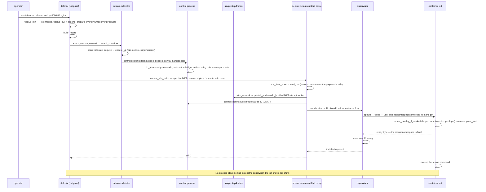

Without a custom network the flow has no second pass: `spawn` creates its own user namespace, and
the parent writes the id maps (`write_userns_maps`), sets up the cgroup, runs the `on_started`
hook (the per-container `slirp_attach` when there are `-p` ports) and only then sends the "go"
byte to the child.

### CRI: `RunPodSandbox` → `CreateContainer` → `StartContainer`

From `crates/interfaces/delonix-cri/src/runtime_svc/lifecycle.rs`.

> **Legend** — participants are processes, plus the state root as a participant; solid arrows are
> gRPC calls, in-process calls, subprocesses or file writes (the label says which); dashed arrows
> are replies; `alt` boxes are the mutually exclusive network modes.

The CRI server records and decides, but every container start crosses into a fresh `delonix`
process.

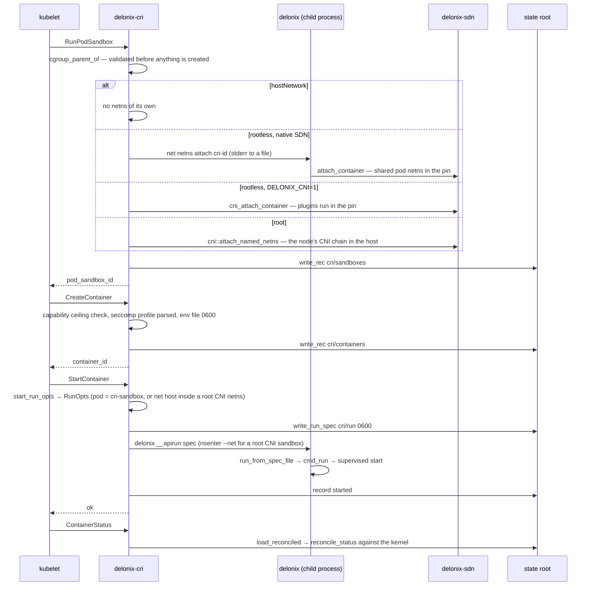

## Known limitations

> **Note — the node contract is not served.** `proto/delonix/node/v1` is gated and generates
> OpenAPI, but no process answers it. Integrations today use the CLI, the CRI, the local
> management API or MCP.

> **Note — the servers still run the CLI.** `delonix-cri`, `delonix-mgmt` and `delonix-mcp` start
> workloads by re-executing `delonix`. This keeps `clone` out of multi-threaded processes, at the
> cost of a process per operation and error text crossing a process boundary.

> **Note — adapters still reach the state files directly.** `delonix-linux`, `delonix-vm`,
> `delonix-sdn`, `delonix-oci` and `delonix-volume` depend on `delonix-state` as declared
> exceptions. The `StateRepository` port that removes them exists since #420
> (`delonix-model/src/ports.rs`, ADR-0044 D6), and so far only `delonix-linux` goes through it for
> part of its lifecycle; the other four still open the stores directly until their P4 slice lands.

> **Note — `macvlan`/`ipvlan` are declared, not realized.** `network create` records them and
> reports `Realized=False` with reason `DriverNotImplemented`
> (`bins/delonix-runtime-bin/src/cmd/network.rs`): their physical plane needs `CAP_NET_ADMIN` in
> the host's initial network namespace.

> **Note — recovery after the pin dies is by restart.** If the control process dies, `ensure_up`
> restarts only it and no workload moves. If the **pin** dies, the netns is rebuilt and
> `delonix net netns up` restarts the stranded containers and pod members
> (`cmd/netns.rs::reconcile_after_respawn`, which reads the container store only — VMs are not
> recovered this way).

> **Note — IPv6 in the SDN is off by default.** The ingress firewall is `table ip`; the holder
> installs a dropping `table ip6` (`infra::ingress_v6_refusal_ruleset`) and disables IPv6 inside
> container netns unless `DELONIX_ENABLE_IPV6=1` (`ipv6_sdn_enabled`).

> **Note — a caller that cannot fork starts unsupervised.** `launch::should_supervise` requires
> `detach && forkable`; without a supervisor nobody is the process's parent and the real exit
> code cannot be collected.

## Where to start reading

| Area | Start here |
|---|---|
| CLI entry and hidden re-exec entry points | `bins/delonix-runtime-bin/src/main.rs` (`main`, `run`) |
| `container run` end to end | `cmd/container.rs::cmd_run`, then `delonix-compute/src/{run,network,launch}.rs` |
| Process creation, namespaces, rootfs, seccomp, cgroups | `delonix-linux/src/lib.rs` (`spawn`, `container_init`, `setup_rootfs`, `setup_cgroup`), `supervise.rs`, `launch_spec.rs` |
| Rootless networking | `delonix-sdn/src/infra.rs` (`ensure_up`, `control_main`, `attach_container`, `publish_port`, `ingress_table_ruleset`, `fw_chain_body`), `pin_userns.rs`, `ipam.rs` |
| Images | `delonix-oci/src/{registry,cas,image,overlay,build}.rs` |
| VMs | `delonix-vm/src/lib.rs` (`VmBackend`, `builtin_backends`, `register_backend`, `select_backend`), `cloudinit.rs`; `cmd/vm.rs`, `cmd/vmimage.rs` |
| Declarative apply | `delonix-stack/src/{kinds,reconcile}.rs`; `cmd/stack.rs`, `cmd/manifest.rs` |
| Records, errors, persisted state | `delonix-compute/src/record.rs` (`Container`, `Vm`), `delonix-model/src/{records,error,exitcode}.rs`, `delonix-state/src/{store,secret}.rs` |
| CRI | `delonix-cri/src/lib.rs::serve_blocking`, `runtime_svc.rs`, `runtime_svc/lifecycle.rs` |
| Management API / MCP | `delonix-mgmt/src/lib.rs`, `delonix-mcp/src/lib.rs` |
| Node contract | `proto/delonix/node/v1/`, `scripts/contract_gate.py`, `docs/api/openapi.yaml` |
| Architecture rules | `scripts/arch_fitness.py`, ADR-0040 |

---

**Next:** [The crates](crates.md) — one section per crate: what it owns, its main types, where to start reading and the traps it has already paid for.
