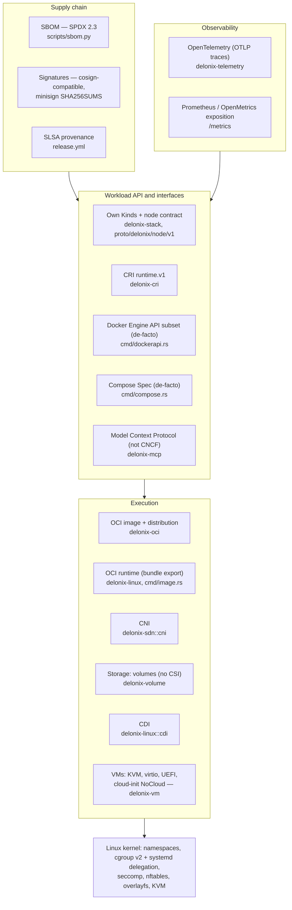

# Cloud native standards, layer by layer

A container and microVM engine is not one specification. It is a stack of layers, and most
layers have an open standard: some from the **OCI** (Open Container Initiative), some from
Kubernetes SIGs and the **CNCF** (Cloud Native Computing Foundation), some from the Linux kernel,
and a few that are de-facto interfaces with no standards body behind them.

This page is organised **by standard and by layer**. For each one it answers four questions: what
the standard is, what it requires of an implementation, how Delonix implements it today (crate,
file, symbol), and what the evidence says about conformance, gaps included. If you search for
"OCI, CRI, CNI, CSI, CDI", this is the page.

Read [Cloud native primer](cloud-native-primer.md) first if namespaces, cgroups, overlayfs
or the kubelet are new to you. This page assumes those basics and does not repeat them.

Three rules for reading this page:

- **"Compatible" never appears without a number, a date and a version.** A conformance claim
  that nobody re-measures stops being a measurement and becomes a quotation.
- **"Not implemented" is a first-class answer.** Where the engine does not implement a standard,
  the section says so and links the decision (ADR) that explains why.
- **Paths are relative to the repository root**, and every symbol named here was read in the
  code. If a symbol has moved when you read this, trust the code and fix the page.

---

## 13.0 The layer map

Each arrow means "is built on". The kernel layer is not a CNCF standard; it is covered in 13.15
because every other layer depends on it.

---

## 13.1 OCI Runtime Specification

**What the standard is.** The [OCI Runtime Specification](https://github.com/opencontainers/runtime-spec)
defines a *filesystem bundle* (a root filesystem plus a `config.json`) and the lifecycle of a
container created from it (`create`, `start`, `kill`, `delete`, `state`). It is what `runc`,
`crun` and `youki` implement, and what containerd and CRI-O drive.

**What an implementation must do.**

- Read a bundle: `config.json` with `ociVersion`, `process`, `root`, `mounts`, `linux`
  (namespaces, capabilities, cgroups, masked and read-only paths, seccomp).
- Expose the lifecycle operations and the `state` document, and run the hooks the config declares
  (`prestart`, `createRuntime`, `poststop`, …).

**How Delonix implements it.** Delonix is **not an OCI runtime binary** in the `runc` sense: it
does not read a bundle and does not expose the `create/start/state` command line. It is its own
runtime, and it relates to the specification in two ways:

1. **It produces bundles for OCI runtimes.** `delonix image export <image> <dir>` writes
   `<dir>/rootfs` and `<dir>/config.json` so that `runc run -b <dir>` can run the image.
   - `bins/delonix-runtime-bin/src/cmd/image.rs`: `cmd_export` unpacks the rootfs through
     `ImageStore::export_rootfs` (`crates/adapters/delonix-oci/src/overlay.rs`) and builds the
     config with `build_runtime_spec`.
   - `build_runtime_spec` builds the config from the `oci_spec::runtime` types (the `oci-spec`
     crate, pinned in the root `Cargo.toml`) instead of hand-written JSON. Its doc comment lists
     what an earlier hand-written bundle lacked (standard mounts, effective capabilities,
     masked/read-only paths).
2. **It implements the same mechanisms natively.** `fn spawn` and `container_init` in
   `crates/adapters/delonix-linux/src/lib.rs` do what an OCI runtime does from a `config.json`:
   namespaces, `pivot_root`, capabilities, seccomp, masked paths. The execution specification
   they consume is not `config.json` but `RunOpts`
   (`crates/contexts/delonix-compute/src/run_opts.rs`), which every front end (CLI, Kinds,
   compose, Docker API, CRI) produces.

**Conformance status / gaps.**

- No runtime-spec conformance suite has been run against Delonix. It could not be: there is no
  bundle-consuming entry point to run it against.
- **OCI hooks are not implemented.** [ADR-0033](../adr/0033-oci-runtime-hooks.md) (Proposed)
  records why: no concrete consumer, and running a host binary named by a container spec is the
  security class the project already gates behind a spike. The in-process `StartedHook` closure
  in `delonix-linux` looks similar but is not the OCI protocol.
- The exported bundle is minimal (default command, env and cwd from the image). Treat it as a
  hand-off format, not a translation of a container's full configuration.

**Where to start reading.** `cmd_export` and `build_runtime_spec` in
`bins/delonix-runtime-bin/src/cmd/image.rs` → `export_rootfs` in
`crates/adapters/delonix-oci/src/overlay.rs` → `spawn` in `crates/adapters/delonix-linux/src/lib.rs`.

---

## 13.2 OCI Image Specification

**What the standard is.** The [OCI Image Specification](https://github.com/opencontainers/image-spec)
defines how an image is described: a *manifest* listing a *config* blob and ordered *layer* blobs,
an *image index* for multiple platforms, content-addressed by digest, and the *image layout*
directory format (`oci-layout`, `index.json`, `blobs/sha256/…`).

**What an implementation must do.**

- Address all content by digest and verify it.
- Understand manifests, indexes (select the right platform) and layer media types
  (tar, gzip, zstd), and apply layers in order, including whiteouts.
- Read and write the image layout when exchanging images without a registry.

**How Delonix implements it.** All in `crates/adapters/delonix-oci`:

- **Content-addressed store**: `src/cas.rs` (`Cas`), with `ImageStore` in `src/image.rs`.
- **Layers as overlay lowers**: `ImageStore::prepare_overlay` (`src/overlay.rs`) writes an
  `overlay-lowers` file next to the container's `merged/`, and the container's own init mounts it.
  Layers are shared between containers, not copied (see the containers-share-layers notes in
  `AGENTS.md` and [ADR-0037](../adr/0037-overlay-mount-new-api.md) for the mount API).
- **Layer media type by magic number**: the helper next to `DOCKER_MANIFEST_MEDIA_TYPE` in
  `src/registry.rs` detects gzip, zstd or plain tar.
- **Writing the image layout**: `write_oci_archive` (`src/save.rs`), used by `delonix image save`.
  It writes `oci-layout`, `index.json`, the blobs, and a legacy `manifest.json` so one archive
  reads in `ctr images import`, `podman load`, `docker load` and `delonix image load`. It sets
  both `org.opencontainers.image.ref.name` and `io.containerd.image.name`; without the second,
  `ctr` imports blobs but registers no name.
- **Reading archives**: `load_docker_archive` (`src/load.rs`).

**Conformance status / gaps.**

- **Pushed and archived manifests use the Docker v2 schema 2 media type**
  (`application/vnd.docker.distribution.manifest.v2+json`, `DOCKER_MANIFEST_MEDIA_TYPE` in
  `src/registry.rs`), not `application/vnd.oci.image.manifest.v1+json`. Pulls accept both
  (`ACCEPT_MANIFEST`). This is interoperable with the registries and importers named above, but
  it is not "writes OCI image manifests".
- No image-spec conformance suite has been run.

**Where to start reading.** `src/image.rs` → `src/cas.rs` → `src/overlay.rs`
(`prepare_overlay`, `export_rootfs`) → `src/save.rs` → `src/load.rs`.

---

## 13.3 OCI Distribution Specification

**What the standard is.** The [OCI Distribution Specification](https://github.com/opencontainers/distribution-spec)
defines the HTTP API of a registry: `GET /v2/<name>/manifests/<reference>`, blob fetch and upload,
tag listing, and the token authentication flow most registries use.

**What an implementation must do.**

- Negotiate manifest media types with `Accept`, follow the `401 → token → retry` flow, fetch blobs
  and **verify each against its digest**.
- For a digest reference (`repo@sha256:…`), verify that the manifest itself hashes to that digest.
- Push blobs (with existence checks) and then the manifest.

**How Delonix implements it.** `crates/adapters/delonix-oci/src/registry.rs`:

- `parse_reference` splits `registry/repo:tag@digest` (including the combined `tag@digest` form).
- `pull_from_registry_with_creds` / `pull_from_registry_with_creds_full` pull a multi-layer image;
  blobs already in the CAS are not downloaded again.
- **`verify_manifest_digest`**: for a digest-pinned pull, the manifest bytes must hash to the
  pinned digest, or the pull is refused. Without this, a compromised registry could serve a
  different, internally consistent manifest and the pin would be decorative. For a tag reference
  it is a no-op; TLS is the only integrity, as with `docker pull`.
- `blob_with_progress_capped` resumes an interrupted blob download with `Range:`. A `206` at an
  offset other than the one requested, or a `200` that ignored the range, restarts from zero
  instead of being stitched. The final digest check is what makes stitching safe.
- `push_to_registry`, `build_manifest`, `list_remote_tags`.
- **OCI artifacts** (single-blob, empty config `application/vnd.oci.empty.v1+json`, the pattern
  ORAS and Helm use): `push_oci_artifact*` and `pull_oci_artifact*`. VM images are published this
  way (see [Building microVMs](microvm-setup.md)). Annotations are read only *after* the
  digest check.
- Credentials: `src/auth.rs` reads the Docker/Podman `auths` format.
- A throwaway local registry for buildpack builds: `src/internal_registry.rs`.

**Conformance status / gaps.**

- No distribution-spec conformance run exists for the client.
- `list_remote_tags` reads only the first page of `tags/list` (no `Link` pagination). The
  `AGENTS.md` notes call this irrelevant for the handful of tags a VM image has; it would matter
  for a large repository.
- The engine does not implement the registry *server* side, except the local throwaway registry
  above.

**Where to start reading.** `parse_reference` → `pull_from_registry_with_creds_full` →
`verify_manifest_digest` → `blob_with_progress_capped` → `pull_oci_artifact_with_meta`, all in
`src/registry.rs`.

---

## 13.4 Kubernetes Container Runtime Interface (CRI)

**What the standard is.** The [CRI](https://github.com/kubernetes/cri-api) is the gRPC API
(`runtime.v1`) the kubelet uses to run pods: a `RuntimeService` (pod sandboxes, containers,
exec/attach/port-forward, stats) and an `ImageService`. The kubelet connects to a runtime through
`--container-runtime-endpoint`.

**What an implementation must do.**

- Serve both services on a local socket; report `RuntimeReady` and `NetworkReady` in `Status`.
- Implement the pod sandbox model: shared network namespace, pod-level cgroup parent, container
  lifecycle inside the sandbox.
- Return **URLs** from `Exec`/`Attach`/`PortForward` and serve those streams over the Kubernetes
  remotecommand protocol (WebSocket or SPDY).
- Tell the kubelet its cgroup driver (`RuntimeConfig`), honour resource limits, report stats for
  eviction, and write logs in the CRI log format.

**How Delonix implements it.** `crates/interfaces/delonix-cri`, binary `delonix-cri`
(also `delonix serve cri`):

- **Contract**: `proto/api.proto` declares `package runtime.v1` with
  `go_package = "k8s.io/cri-api/pkg/apis/runtime/v1"`; `Version` answers
  `runtime_api_version: "v1"` (`src/runtime_svc.rs`).
- **Server**: `serve_blocking` in `src/lib.rs`; socket from `--addr` or `DELONIX_CRI_ADDR`,
  default `unix:///run/delonix-cri.sock` (`src/bin/delonix-cri.rs`).
- **Lifecycle**: `src/runtime_svc.rs` (the gRPC trait) delegates to
  `src/runtime_svc/lifecycle.rs`.
- **Cgroup driver**: `runtime_config` answers `engine_cgroup_driver()`, which is `Cgroupfs`. Its
  doc comment records the measurement that forced this (2026-09-15, k8s 1.36.4): answering nothing
  made the kubelet default to `systemd`, systemd dropped `cpuset` from empty pod slices, and the
  kubelet killed pods in a loop.
- **Kubelet resource model**: [ADR-0038](../adr/0038-cri-follows-kubelet-resource-model.md). The
  kubelet's `cgroup_parent` is validated by `KubeCgroupParent::parse`
  (`crates/contexts/delonix-compute/src/record.rs`) and consumed in
  `crates/contexts/delonix-compute/src/run.rs`; `delonix-linux` has `transient_scope_argv` for
  placing a container in a systemd scope under a pod slice.
- **Capability ceiling**: `CapCeiling` (`src/cap_ceiling.rs`), configured by
  `DELONIX_CRI_CAP_CEILING` and `DELONIX_CRI_CAP_CEILING_MODE`, and visible in `crictl info` as
  `capabilityCeiling` (inserted in `status`).
- **Streaming**: `src/streaming.rs` serves remotecommand over WebSocket (`v5.channel.k8s.io`), and
  `src/spdy.rs` over SPDY/3.1; `port_forward` returns a streaming URL.
- **Stats and metrics**: `container_stats`, `list_pod_sandbox_stats`, `list_metric_descriptors`
  in `lifecycle.rs`.
- **Pod networking**: see 13.5.

**Conformance status / gaps.**

- **Measured with the upstream `critest`** ([docs/cri-conformance.md](../cri-conformance.md)):
  cri-tools `critest` **v1.36.0**, engine `delonix-cri` **v0.63.1**, rootless, **2026-08-25**:
  **79 passed, 24 failed, 19 skipped, of 103 specs run** (122 in the suite). Failures by area in
  that document: AppArmor per-container profiles, mount propagation, parts of the security
  context, image manager (pull by digest, `Uid`/`Username`), streaming port-forward, OOM, and a
  few single specs. That number is older than several CRI fixes recorded in `AGENTS.md`; it has
  not been re-measured since. Reproduce with `scripts/critest.sh`.
- **Manually exercised with `crictl`** on 2026-09-11 (per `AGENTS.md`): version, info, images,
  and the `runp → create → start → exec` cycle.
- **Validated against a real kubelet** (k8s 1.36.4, 2026-09-15, per `AGENTS.md` and the
  `engine_cgroup_driver` doc comment): single-node control plane stable, CoreDNS running with
  root-mode CNI.
- **Unimplemented RPCs** (they return `UNIMPLEMENTED`): `UpdateContainerResources`,
  `CheckpointContainer`, `GetContainerEvents` (`src/runtime_svc.rs`).
- **Watch for a stale comment**: `engine_cgroup_driver` says the honest `SYSTEMD` answer "needs
  the engine to place containers in a transient scope … until it does, this stays", while
  `transient_scope_argv` already exists in `delonix-linux`. The driver answer is still
  `Cgroupfs`; do not change it without re-running the kubelet measurement in the doc comment.

**Where to start reading.** `src/bin/delonix-cri.rs` → `serve_blocking` (`src/lib.rs`) →
`src/runtime_svc.rs` (`status`, `runtime_config`) → `run_pod_sandbox` in
`src/runtime_svc/lifecycle.rs` → `src/cap_ceiling.rs` → `src/streaming.rs`.

---

## 13.5 Container Network Interface (CNI)

**What the standard is.** The [CNI specification](https://www.cni.dev/docs/spec/) defines how a
runtime asks plugin binaries to configure a network namespace: a network configuration list
(`/etc/cni/net.d/*.conflist`), plugin binaries in `CNI_PATH` (usually `/opt/cni/bin`), and
operations passed in `CNI_COMMAND` with the configuration on stdin.

**What an implementation must do.**

- Load the configuration list, resolve each plugin in `CNI_PATH`, and set `CNI_COMMAND`,
  `CNI_CONTAINERID`, `CNI_NETNS`, `CNI_IFNAME`, `CNI_PATH`.
- For `ADD`, run plugins in order, passing each one the previous result as `prevResult`; for
  `DEL`, run them in reverse.
- Parse results and structured errors; pass `runtimeConfig` (for example `portMappings`) to the
  plugins that declare the capability. Newer spec versions add `CHECK`, `GC` and `STATUS`.

**How Delonix implements it.** Two network providers exist, and CNI is one of them:

- **Native SDN** (the default for containers): the rootless holder netns, bridge, IPAM, nftables
  firewall — `crates/adapters/delonix-sdn` (see [4.5](cloud-native-primer.md) and
  [Architecture](architecture.md)).
- **CNI protocol layer**: `crates/adapters/delonix-sdn/src/cni.rs`, pure and testable.
  `list_conf_files`, `parse_config`, `load_default`, `resolve_plugin`, `add` (chains
  `prevResult`), `del`, `plugin_dirs` (from `CNI_PATH`), `readiness` (config parses **and** every
  binary, `ipam.type` included, is in `CNI_PATH`), `attach_named_netns`, `detach_named_netns`,
  `set_netns_sysctls`.
- **Where CNI is used**:
  - **CRI, root mode**: the pod network is always the node's CNI chain, in the host, as in
    containerd. `run_pod_sandbox` (`crates/interfaces/delonix-cri/src/runtime_svc/lifecycle.rs`)
    creates `/run/netns/cri-<id>` and calls `delonix_sdn::cni::attach_named_netns`. `NetworkReady`
    comes from `root_cni_readiness` (`src/runtime_svc.rs`), the same fact the sandbox acts on.
  - **CRI, rootless**: opt-in with `DELONIX_CNI=1` plus a conflist (`enabled_conf`); the plugins
    run inside the holder that owns the netns (`delonix_sdn::infra::cni_attach_container`).
    Without the flag, rootless pods use the native SDN.

**Conformance status / gaps.**

- `cni.rs` documents support for configuration versions 0.4.0 and 1.0.0. `CHECK` exists as a
  variant of `Command_` but is **never invoked**; `GC` and `STATUS` are not implemented.
- `runtimeConfig` is not passed to plugins, so `hostPort` through the `portmap` plugin does not
  work on a root CNI sandbox (`AGENTS.md`, 2026-09-15 notes).
- Measured with a real bridge/host-local chain on a kubeadm node (2026-09-15, k8s 1.36.4, per
  `AGENTS.md`): node `Ready`, CoreDNS serving, Service DNS resolved from another pod. Not
  measured: more than one node, and the rootless CNI path after it was refactored to share the
  `ADD` body.
- No CNI plugin conformance tooling has been run against the runtime side.

**Where to start reading.** `crates/adapters/delonix-sdn/src/cni.rs` (module comment, `add`,
`readiness`) → `run_pod_sandbox` in `crates/interfaces/delonix-cri/src/runtime_svc/lifecycle.rs`
→ `root_cni_readiness` in `src/runtime_svc.rs`.

---

## 13.6 Container Storage Interface (CSI)

**What the standard is.** The [CSI specification](https://github.com/container-storage-interface/spec)
is a gRPC API between an orchestrator and a storage driver: an Identity service, a Controller
service (create/delete/publish volumes) and a Node service (stage/publish into a pod's mount
namespace), registered with the kubelet.

**What an implementation must do.** Run a Node plugin reachable on every node for the lifetime of
the volumes it serves (usually a DaemonSet with registrar sidecars), and usually a Controller
plugin as a long-running service.

**How Delonix implements it.** **It does not implement CSI.** Storage is served by the engine's
own `kind: Volume`:

- `crates/adapters/delonix-volume/src/lib.rs`: named volumes (`<root>/volumes/<name>/_data`) and
  bind mounts, both `MS_BIND`, Docker `-v` syntax. `HostVolumes` implements the compute context's
  `StorageProvider` port (`crates/contexts/delonix-compute/src/ports.rs`).
- Network storage (NFS, CIFS/SMB, WebDAV) mounted as a volume, and a storage provisioner against a
  NAS API ([ADR-0009](../adr/0009-truenas-storage-provisioner.md), crate
  `crates/providers/delonix-truenas`).

**Conformance status / gaps.** Not implemented, by decision:
[ADR-0034](../adr/0034-csi-daemon-conflict.md) (Proposed). A CSI Node plugin is a standing
service, and the engine is daemonless by design. The ADR reopens only when a concrete need names
the CSI protocol specifically **and** the daemon question has its own accepted ADR. It also
records the practical path that needs no code here (an external NFS provisioner against the same
server).

**Where to start reading.** [ADR-0034](../adr/0034-csi-daemon-conflict.md) →
`crates/adapters/delonix-volume/src/lib.rs` → `StorageProvider` in
`crates/contexts/delonix-compute/src/ports.rs`.

---

## 13.7 Container Device Interface (CDI)

**What the standard is.** The [Container Device Interface](https://github.com/cncf-tags/container-device-interface)
describes devices (GPUs, for example) as JSON or YAML specs in `/etc/cdi` and `/var/run/cdi`. A
fully-qualified name such as `nvidia.com/gpu=all` resolves to *container edits*: device nodes,
mounts, environment variables and hooks.

**What an implementation must do.** Load specs from both directories with the defined precedence,
resolve qualified names, and apply both the device-independent top-level `containerEdits` and the
per-device ones, including hooks.

**How Delonix implements it.** As a **consumer** of specs generated by a vendor tool
(`nvidia-ctk cdi generate`), never as a driver-discovery tool:

- `crates/adapters/delonix-linux/src/cdi.rs`: `is_cdi_qualified`, `ensure_cdi_available`,
  `resolve_cdi_device`, `expand_gpu_devices`; spec directories `/etc/cdi` then `/var/run/cdi`.
- `HostDevices` implements the `DeviceResolver` port (`crates/contexts/delonix-compute/src/ports.rs`),
  turning edits into the same mounts, device list and environment that `-v` and `--device` produce.
  The container's own init applies them before `pivot_root`; no second process enters the
  container by PID.
- CLI surface: `container run --gpus nvidia|all` and `--device nvidia.com/gpu=<name|all>`. Without
  a spec or `nvidia-ctk`, the run is refused before anything is created.

**Conformance status / gaps.**

- **Hooks are not executed.** A best-effort `ldconfig -r <rootfs>` replaces the usual
  `createContainer` hook, and a spec that declares hooks produces a visible warning. This is the
  one named cost of [ADR-0033](../adr/0033-oci-runtime-hooks.md).
- The module comment records a measurement against a spec from `nvidia-ctk` 1.20.0
  (`cdiVersion` 0.7.0): the top-level `containerEdits` carry most device nodes and all mounts, so
  reading only per-device edits breaks CUDA. The comment gives no date, and it was not re-measured
  for this page. `AGENTS.md` lists the exact precedence between the two directories and whether
  `ldconfig -r` is enough as "to confirm on a real GPU host".

**Where to start reading.** `crates/adapters/delonix-linux/src/cdi.rs` (module comment,
`resolve_cdi_device`, `HostDevices`) → `DeviceResolver` in
`crates/contexts/delonix-compute/src/ports.rs`.

---

## 13.8 The workload API: own Kinds and the node contract

**What the standard is.** There is no external standard here, on purpose. The engine exposes its
own declarative **Kinds** in its own API groups (`core`, `compute`, `networking`, `gateway`,
`storage`, `artifact`, `infrastructure`; list them with `delonix api-resources`). The shape
follows Kubernetes conventions (`apiVersion`, `kind`, `metadata`, `spec`) without claiming
Kubernetes API compatibility.

**What an implementation must do** (the engine's own rules):

- Publish the manifest schema generated from the code, not written by hand
  ([ADR-0007](../adr/0007-generated-manifest-schema.md)).
- Plan, apply and detect drift with a three-way diff, and never ignore a field silently.
- Serve one node contract over gRPC and HTTP/JSON on the same local socket, with the OpenAPI
  document generated from the protobuf ([ADR-0040](../adr/0040-engine-restructuring-layers-ports-node-contract.md),
  Proposed; [ADR-0041](../adr/0041-node-local-contract-for-the-control-plane-agent.md)).

**How Delonix implements it.**

- Kind table: `crates/contexts/delonix-stack/src/kinds.rs` (each Kind's `api_version`, domain,
  convergence, teardown). Reconciler: `src/reconcile.rs`.
- Published schema: `docs/schema/v1/delonix.json`.
- Node contract: `proto/delonix/node/v1/*.proto`, with `docs/api/openapi.yaml` generated and
  checked by `scripts/contract_gate.py`.

**Conformance status / gaps.** Gated by CI (the schema test, `contract_gate.py`), not by an
external suite. See [Architecture](architecture.md) and [System design](system-design-interview.md).

**Where to start reading.** `crates/contexts/delonix-stack/src/kinds.rs` →
`src/reconcile.rs` → `proto/delonix/node/v1/node.proto` → `scripts/contract_gate.py`.

---

## 13.9 Docker Engine API subset — a de-facto interface

**What the standard is.** The [Docker Engine API](https://docs.docker.com/reference/api/engine/)
is **not a CNCF or OCI standard**. It is one vendor's REST API that many tools speak
(`docker` CLI, compose, kind, test frameworks). It is included here because it is a real
interoperability surface.

**What an implementation must do.** Answer `/_ping` and version negotiation, then the routes a
given tool calls, with Docker's JSON shapes and status codes.

**How Delonix implements it.** `bins/delonix-runtime-bin/src/cmd/dockerapi.rs`, served by
`delonix serve docker-api [--addr unix://<socket>]`:

- `API_VERSION` is `"1.43"`, `MIN_API_VERSION` is `"1.24"`; version prefixes are stripped so
  `/v<version>/...` works.
- **The coverage is a published table**: `API_MATRIX` (served routes) and `API_UNIMPLEMENTED`
  (refused routes with a reason). `delonix serve docker-api --matrix` prints them, and a test
  fails if a dispatch arm exists without a matrix entry.
- Container lifecycle routes delegate to the same functions as the CLI. The socket is `0600` with
  `SO_PEERCRED` (same uid only).

**Conformance status / gaps.**

- The module comment says it was checked against a real `docker` CLI 27.3.1 (undated).
- Refused today, with reasons in `API_UNIMPLEMENTED`: `exec` and `attach` (need HTTP hijacking),
  `logs`, `events`, `build`, networks, `images/create` (the pull most tools call first),
  `images/{name}/json`, `stats`, volumes. Read the table rather than trusting this list; the
  table is the contract.
- Docker's network model (`NetworkingConfig`) is not translated.

**Where to start reading.** `API_MATRIX` and `API_UNIMPLEMENTED` in
`bins/delonix-runtime-bin/src/cmd/dockerapi.rs` → the dispatch `match` in the same file →
`tests/compat/docker_api_smoke.py`.

---

## 13.10 Compose Specification — a de-facto spec

**What the standard is.** The [Compose Specification](https://compose-spec.io/) describes a
multi-container application in YAML (`services`, `networks`, `volumes`, `secrets`, `configs`).
It is an open specification maintained by the Compose project, **not a CNCF or OCI standard**.

**What an implementation must do.** Parse the model, order services by `depends_on` (with its
conditions), create networks and volumes, and not silently change the meaning of a file.

**How Delonix implements it.** `bins/delonix-runtime-bin/src/cmd/compose.rs`
(`delonix compose up|down|ps|logs|config`): a translator into `RunOpts` and the engine's own
`Image`/`Network`/`Volume` documents, with membership derived from labels.

**Conformance status / gaps.**

- Unknown keys are **refused, not ignored**: `check_unsupported_fields` checks the raw YAML
  against allowlists (`SUPPORTED_TOP`, `SUPPORTED_SERVICE`, …) and denylists with reasons
  (`KNOWN_UNSUPPORTED_TOP`, `KNOWN_UNSUPPORTED_SERVICE`). Older notes elsewhere in the workspace
  say unknown keys were swallowed silently; the code no longer does that.
- `include:` is refused (use `-f a.yml -f b.yml`). No Compose conformance suite has been run.

**Where to start reading.** The module comment and `check_unsupported_fields` in `compose.rs`.

---

## 13.11 OpenTelemetry

**What the standard is.** [OpenTelemetry](https://opentelemetry.io/) is the CNCF project for
traces, metrics and logs, with the OTLP wire protocol for exporting them to a collector.

**What an implementation must do.** Emit spans with resource attributes (at least
`service.name`), export them over OTLP (gRPC or HTTP), and flush before the process exits.

**How Delonix implements it.** `crates/adapters/delonix-telemetry/src/telemetry.rs`:

- Structured logs through `tracing` (`DELONIX_LOG`, `DELONIX_LOG_FORMAT=json`).
- **Traces over OTLP/HTTP protobuf** when `DELONIX_OTLP_ENDPOINT` is set (`build_otlp_layer`,
  `/v1/traces` appended if missing), with a batch span processor on its own thread, so it works
  both in the async CRI server and in the synchronous CLI. `service.name` distinguishes the
  binaries.

**Conformance status / gaps** (all stated in the module comment):

- **Traces only.** Metrics go through Prometheus exposition (13.12), not OTLP; there is no OTLP
  log export.
- **Plain HTTP only.** No TLS backend is compiled in, as a supply-chain decision; an `https://`
  endpoint is not supported.
- The short-lived CLI does not flush on exit, so a fast invocation can lose its spans. The
  reliable path is the long-running `delonix-cri`.

**Where to start reading.** Module comment, `init` and `build_otlp_layer` in
`crates/adapters/delonix-telemetry/src/telemetry.rs`.

---

## 13.12 Prometheus exposition format

**What the standard is.** The [Prometheus exposition format](https://prometheus.io/docs/instrumenting/exposition_formats/)
and its successor [OpenMetrics](https://github.com/prometheus/OpenMetrics) define the text a
scrape target serves on `GET /metrics`.

**What an implementation must do.** Serve the text with the correct `Content-Type`, with stable
metric names and types, fast enough for the scrape timeout.

**How Delonix implements it.**

- One shared registry: `crates/adapters/delonix-telemetry/src/metrics.rs` (`encode`, and setters
  such as `set_containers`, `set_vms`, `set_memory`, `set_network`, `set_storage`), built on the
  `prometheus-client` crate.
- `delonix-cri`: an optional `/metrics` listener enabled by `DELONIX_METRICS_ADDR`
  (`src/lib.rs`, `metrics_handler`), separate from the gRPC socket.
- `delonix-mgmt`: `/metrics` on its local socket (`crates/interfaces/delonix-mgmt/src/lib.rs`,
  `metrics`). Cheap fields are computed per scrape; expensive ones (disk walk) are refreshed in
  the background so scrapes stay fast.
- Both handlers serve `application/openmetrics-text; version=1.0.0; charset=utf-8`.

**Conformance status / gaps.** No `promtool check metrics` run is recorded. The expensive gauges
can be up to one refresh interval stale; the notes in `AGENTS.md` explain why that trade was
chosen.

**Where to start reading.** `crates/adapters/delonix-telemetry/src/metrics.rs` →
`metrics_handler` in `crates/interfaces/delonix-cri/src/lib.rs` → `metrics` and
`src/dashstats.rs` in `delonix-mgmt`.

---

## 13.13 Supply chain: SBOM (SPDX), signatures, SLSA provenance

**What the standards are.**

- [SPDX](https://spdx.dev/) (ISO/IEC 5962) is a format for a software bill of materials.
- [Sigstore cosign](https://docs.sigstore.dev/cosign/) signs container images and stores the
  signature as an OCI artifact tagged `sha256-<digest>.sig`.
- [SLSA](https://slsa.dev/) defines build provenance: an attestation that says which source and
  which builder produced an artifact.

**What an implementation must do.** Publish an SBOM whose packages, versions and checksums match
the artifact; sign so that verification fails on tampering; bind provenance to the exact
published files.

**How Delonix implements it.**

- **SBOM of the release binaries**: `scripts/sbom.py` writes SPDX 2.3 from `Cargo.lock`. The
  `release.yml` step "SBOM (SPDX 2.3, do Cargo.lock)" writes `delonix-sbom.spdx.json` and adds it
  to `SHA256SUMS`, so the SBOM is covered by the signature.
- **Release signature**: `release.yml` signs `SHA256SUMS` with minisign and verifies it with the
  public key embedded in `scripts/install.sh` (`MINISIGN_PUBKEY`). If the key is configured and
  the secret is missing, the release fails instead of shipping unsigned.
- **SLSA provenance**: `release.yml` step "Proveniência (SLSA) dos binários" uses
  `actions/attest-build-provenance` on the published `delonix`, `delonix-cri` and `delonix-mcp`
  binaries. Verify with `gh attestation verify <file> --repo angolardevops/delonix-runtime`.
- **Image signatures, cosign-compatible**: `crates/adapters/delonix-oci/src/sign.rs`.
  `sign_image` (behind `delonix image sign`) publishes an ECDSA P-256 simple-signing payload as
  the `.sig` artifact; `verify_signature` (behind `image pull --verify <key>` and `image verify`) checks the signature and
  that the payload names the image digest. VM images use the same mechanism
  ([ADR-0017](../adr/0017-signing-vm-images.md)).
- **Image scanning**: `crates/adapters/delonix-scanner/src/lib.rs`. `extract_sbom` reads the
  `apk`/`dpkg` databases (and Python requirements) straight from layers in the CAS without
  running the image; `advisories_from_osv` ingests OSV feeds.

**Conformance status / gaps.**

- The release SBOM covers the Rust dependency tree only, not system libraries, and does not
  promise a reproducible build; `sbom.py` says so in the document's `comment` field.
- **Image signatures are key-based only.** `sign.rs` has no Fulcio or Rekor code, so there is no
  keyless signing and no transparency log.
- **The image scanner's SBOM is an internal package list**, not an SPDX or CycloneDX document; no
  Rust code in the engine writes SPDX.
- No SPDX validator or `slsa-verifier` run is recorded in this repository.

**Where to start reading.** `scripts/sbom.py` → the SBOM, minisign and provenance steps in
`.github/workflows/release.yml` → `crates/adapters/delonix-oci/src/sign.rs` →
`crates/adapters/delonix-scanner/src/lib.rs`.

---

## 13.14 Virtual machines: KVM, virtio, UEFI, cloud-init NoCloud

**What the standards are.**

- [KVM](https://docs.kernel.org/virt/kvm/index.html) is the Linux kernel hypervisor interface
  (`/dev/kvm`).
- [virtio](https://docs.oasis-open.org/virtio/virtio/v1.2/virtio-v1.2.html) (OASIS) is the
  paravirtual device standard: disk, network, 9p/fs and console.
- [UEFI](https://uefi.org/specifications) is the firmware interface cloud images boot through.
- [cloud-init NoCloud](https://docs.cloud-init.io/en/latest/reference/datasources/nocloud.html) is
  the datasource that reads `user-data`, `meta-data` and `network-config` from a local volume
  labelled `cidata`.

**What an implementation must do.** Give the guest virtio devices and a firmware it can boot, and
hand it a NoCloud seed whose network configuration matches its NIC.

**How Delonix implements it.** `crates/adapters/delonix-vm`:

- **Backends behind a port**: `trait VmBackend` and `register_backend` in `src/lib.rs`. Cloud
  Hypervisor (Rust VMM on `/dev/kvm`) and libvirt/QEMU are local; Proxmox VE is a remote provider
  (`crates/providers/delonix-proxmox`). See [Building microVMs](microvm-setup.md).
- **virtio**: `libvirt_domain_xml` renders the main disk as `bus='virtio'` (`vda`), NICs as
  `<model type='virtio'/>`, and shared volumes as virtio-9p.
- **UEFI firmware for Cloud Hypervisor**: `DEFAULT_CH_FIRMWARES` prefers the EDK2 `CLOUDHV.fd`
  over `hypervisor-fw`. Its doc comment records why: with `hypervisor-fw` the project's images do
  not boot; with EDK2 they do (measured 2026-08-12 per `AGENTS.md`). libvirt uses a `pflash`
  `<loader>`.
- **cloud-init NoCloud**: `src/cloudinit.rs`. `build_user_data`, `build_network_config` (DHCP on
  the primary NIC **matched by MAC**, from `mac_for`, because matching by name breaks
  NetworkManager guests), and `generate_seed_iso`, which packages the seed with `cloud-localds`.
  Remote backends receive the intent (`hostname`, user, SSH keys) instead of a local ISO.

**Conformance status / gaps.**

- Cloud Hypervisor does not support virtio-9p; `spec.volumes` on a CH VM is refused (virtio-fs
  would need the `virtiofsd` daemon, which is not wired in).
- `delonix-vm-base:fedora-42` does not boot under Cloud Hypervisor's EDK2, including the vendor's
  original image (`AGENTS.md`, 2026-08-12); direct kernel boot works.
- Live migration is a NO-GO: [ADR-0031](../adr/0031-live-vm-migration-no-go.md).
- Published VM images are amd64 only: [ADR-0018](../adr/0018-vm-images-stay-amd64.md).

**Where to start reading.** `trait VmBackend` and `create_with` in
`crates/adapters/delonix-vm/src/lib.rs` → `src/cloudinit.rs` → `libvirt_domain_xml` →
`DEFAULT_CH_FIRMWARES`.

---

## 13.15 Linux: cgroup v2 and systemd delegation

**What the standard is.** Not CNCF: [cgroup v2](https://docs.kernel.org/admin-guide/cgroup-v2.html)
is the kernel's resource control interface, and
[systemd's delegation contract](https://systemd.io/CGROUP_DELEGATION/) defines who may write
which part of the tree. Every container runtime depends on both.

**What an implementation must do.** Write limits only in a subtree delegated to it, respect the
"no internal processes" rule, and never assume that a controller listed at the root is available
to the calling session.

**How Delonix implements it.** `crates/adapters/delonix-linux/src/lib.rs`:

- Root mode: leaves under `delonix.slice` (`DELONIX_SLICE` in `delonix-compute`).
- Rootless: `user_service_base` and `try_delegated_base` place containers under
  `user@<uid>.service/dlx-containers`.
- `cgroup_limits_apply` answers "will limits apply here?" without starting a container. Rootless,
  it probes the process's *current* cgroup (`delegated_base_usable`), not the host's root cgroup;
  root, it probes `delonix.slice` and creates it if missing (`root_slice_writable`).
- Under the kubelet, `transient_scope_argv` builds the `StartTransientUnit` call for a delegated
  scope under a pod slice (ADR-0038).

**Conformance status / gaps.** A plain SSH session scope is not delegated; the remedy is
`systemd-run --user --scope -p Delegate=yes` (measured 2026-08-04 per `AGENTS.md`). Without
delegation `container run` refuses `-m`/`--cpus`/`--cpu-weight` with exit 69
(`preflight_resource_limits` in `bins/delonix-runtime-bin/src/cmd/container.rs`;
`DELONIX_ALLOW_UNENFORCED_LIMITS=1` runs unenforced, with a warning). That probe covers only the
`memory`/`cpu`/`pids` base: `--cpuset`, `--io-weight` and the `--device-*-bps`/`--device-*-iops`
flags are still accepted best-effort, and `cpuset` and `io` are usually not delegated to user
sessions on stock Ubuntu — so those can be accepted without effect. See
[Environment](environment.md#cgroup-delegation-some-limits-are-refused-others-are-not-enforced) and [ADR-0015](../adr/0015-intermediate-cgroup-level.md).

**Where to start reading.** `cgroup_limits_apply` → `user_service_base` → `try_delegated_base` →
`transient_scope_argv`, all in `crates/adapters/delonix-linux/src/lib.rs`.

---

## 13.16 Model Context Protocol (MCP) — not a CNCF standard

**What the standard is.** The [Model Context Protocol](https://modelcontextprotocol.io/) is a
JSON-RPC protocol through which an AI client calls *tools* and reads *resources* exposed by a
server. It is **not a CNCF, OCI or Kubernetes standard**; it appears here because it is one of
the engine's interfaces.

**What an implementation must do.** Serve JSON-RPC over a transport (stdio or HTTP), declare
server capabilities, and describe tool inputs with JSON Schema.

**How Delonix implements it.** `crates/interfaces/delonix-mcp` (binary `delonix-mcp`, also
`delonix mcp serve`), built on the `rmcp` crate:

- **stdio only**: a foreground child of the AI client, which exits when stdin closes. It is not a
  daemon ([ADR-0025](../adr/0025-mcp-local-ai-control-surface.md)).
- Tool inputs are typed and schema-validated; outputs are JSON text. Tools carry a risk class
  (`src/risk.rs`) and calls are audited (`src/audit.rs`).
- The only principal is the local uid, the same boundary as `delonix-mgmt`.

**Conformance status / gaps.** No HTTP transport and no structured tool output, by decision (see
the module comment). No MCP conformance tooling has been run.

**Where to start reading.** Module comment in `crates/interfaces/delonix-mcp/src/lib.rs` →
`src/risk.rs` → `src/audit.rs`.

---

## 13.17 Summary table

Status is **implemented** (the engine meets the core of the contract), **partial** (a documented
subset, or a documented deviation) or **not implemented**. The evidence column is where you
check the claim, not a promise.

| Standard | Delonix component | Status | Evidence |
|---|---|---|---|
| OCI Runtime Spec | `delonix-linux` (native mechanisms); `image export` bundle via `build_runtime_spec` | partial — produces bundles, is not a bundle-consuming runtime; no hooks | 13.1, [ADR-0033](../adr/0033-oci-runtime-hooks.md) |
| OCI Image Spec | `delonix-oci` (`cas`, `overlay`, `write_oci_archive`) | partial — reads OCI and Docker manifests; writes Docker schema 2 manifests | 13.2, `src/registry.rs` |
| OCI Distribution Spec | `delonix-oci::registry` (`verify_manifest_digest`, resumable blobs, artifacts) | implemented (client) — no pagination of tag lists; no conformance run | 13.3 |
| CRI (`runtime.v1`) | `delonix-cri` | partial — critest v1.36.0: 79/103 passed, engine v0.63.1, 2026-08-25; kubelet 1.36.4 validated 2026-09-15 | [cri-conformance.md](../cri-conformance.md), [ADR-0038](../adr/0038-cri-follows-kubelet-resource-model.md) |
| CNI | `delonix-sdn::cni`; CRI root mode, rootless opt-in `DELONIX_CNI=1` | partial — `ADD`/`DEL`; no `CHECK`/`GC`/`STATUS` calls, no `runtimeConfig` | 13.5 |
| CSI | none (`kind: Volume`, `delonix-volume`, `delonix-truenas`) | not implemented — needs a daemon | [ADR-0034](../adr/0034-csi-daemon-conflict.md) |
| CDI | `delonix-linux::cdi` (`HostDevices`) | partial — consumer; hooks not executed | 13.7 |
| Engine Kinds + node contract | `delonix-stack`, `proto/delonix/node/v1` | implemented (own API) — CI-gated | [ADR-0040](../adr/0040-engine-restructuring-layers-ports-node-contract.md), `scripts/contract_gate.py` |
| Docker Engine API (de-facto) | `cmd/dockerapi.rs` | partial — published `API_MATRIX` / `API_UNIMPLEMENTED` | `delonix serve docker-api --matrix` |
| Compose Spec (de-facto) | `cmd/compose.rs` | partial — allowlist, unknown keys refused, no `include:` | 13.10 |
| OpenTelemetry | `delonix-telemetry::telemetry` | partial — OTLP/HTTP traces only, no TLS | 13.11 |
| Prometheus / OpenMetrics | `delonix-telemetry::metrics`, `/metrics` in `delonix-cri` and `delonix-mgmt` | implemented — no `promtool` run recorded | 13.12 |
| SPDX SBOM | `scripts/sbom.py` in `release.yml` | partial — Rust dependency tree of the binaries; the image scanner does not emit SPDX | 13.13 |
| Signatures (cosign-compatible, minisign) | `delonix-oci::sign`; minisign in `release.yml` | partial — key-based; no keyless, no transparency log | 13.13, [ADR-0017](../adr/0017-signing-vm-images.md) |
| SLSA provenance | `actions/attest-build-provenance` in `release.yml` | implemented for release binaries | 13.13 |
| KVM / virtio / UEFI | `delonix-vm` (Cloud Hypervisor, libvirt) | implemented — no virtio-9p on Cloud Hypervisor; no live migration | 13.14, [ADR-0031](../adr/0031-live-vm-migration-no-go.md) |
| cloud-init NoCloud | `delonix-vm::cloudinit` | implemented | 13.14 |
| cgroup v2 + systemd delegation (Linux) | `delonix-linux` | implemented — limits need a delegated scope | 13.15, [ADR-0015](../adr/0015-intermediate-cgroup-level.md) |
| MCP (not CNCF) | `delonix-mcp` | partial — stdio only | [ADR-0025](../adr/0025-mcp-local-ai-control-surface.md) |

When you change one of these components, update its row and its section in the same pull request.
If you re-run a conformance suite, replace the number, the date and the version together, and
update the source document ([docs/cri-conformance.md](../cri-conformance.md) for the CRI) first.
