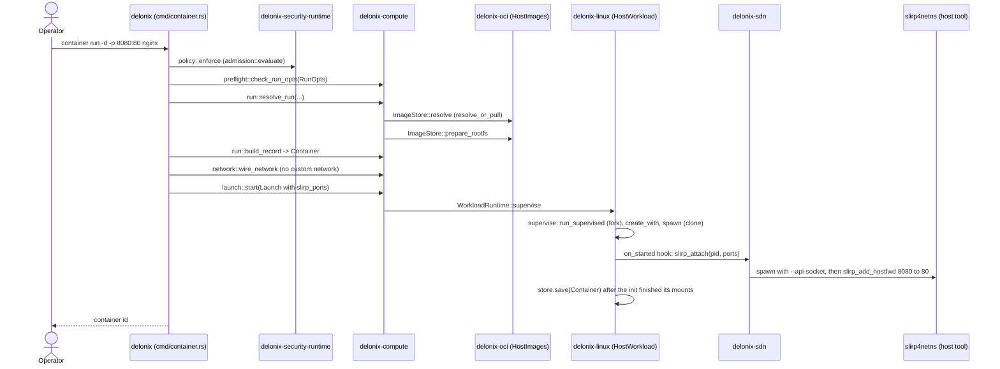
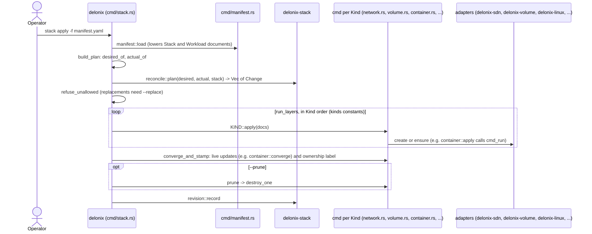
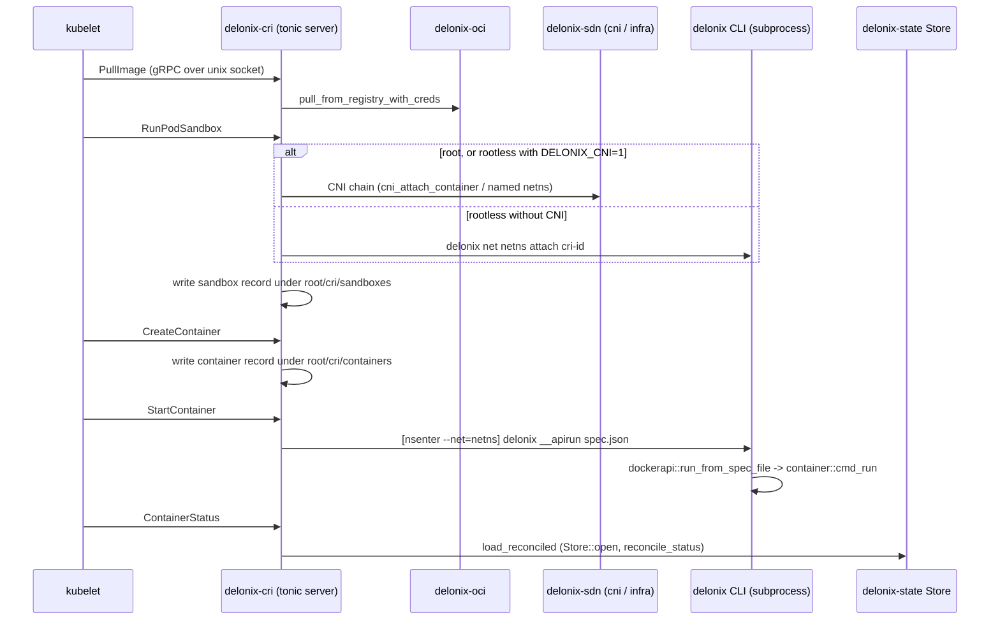

# The crates

**Before you read:** [Architecture](architecture.md), above all [Layers and the allowed direction](architecture.md#layers-and-the-allowed-direction).

This page is the map you keep open while reading the code. The table below is
generated from `Cargo.toml` and `scripts/arch_fitness.py`; everything after it is
written by hand, and every pointer (`path:symbol`) was read in the tree before it
was written down. Where a claim could not be confirmed it is not here. After it you can find the
crate that owns a change, the files to read first in it, and the traps it has already paid for.

How to use it:

- Find the crate that owns what you want to change (layer first, see
  [Architecture](architecture.md) for why the layers exist and which
  direction a dependency may point).
- Read its **Start reading at** list in order, then its **Gotchas**: each one is a
  trap this code base has already paid for, and the comment that records it is
  still in the file.
- Before you add a `use delonix_…` line, check the table: an edge that is not in
  the "Depends on" column will fail `scripts/arch_fitness.py` unless it goes in the
  allowed direction.

Two conventions you will meet everywhere:

- **Pure versus effect.** Contexts and foundation crates decide; adapters touch the
  kernel, the disk, a subprocess or the network. When a use case in a context needs
  an effect, it declares a *port* (a trait) and an adapter implements it. The
  composition root that wires ports to adapters is the `delonix` binary.
- **"Talks to" means the mechanism, not just the dependency.** A crate may depend on
  another and still reach it by running the `delonix` binary as a subprocess (the
  CRI and the local management API do this for anything that forks), or by writing
  a line on a unix control socket (the network holder).

## Reference table

<!-- dev-docs:begin crates-table -->
| Crate | Layer | Path | Binaries | Depends on (engine crates) | Used by |
|---|---|---|---|---|---|
| `delonix-model` | Foundation | `crates/foundation/delonix-model` | — | — | `delonix-compute`, `delonix-cri`, `delonix-linux`, `delonix-mcp`, `delonix-mgmt`, `delonix-node`, `delonix-oci`, `delonix-opnsense`, `delonix-proxmox`, `delonix-runtime-bin`, `delonix-scanner`, `delonix-sdn`, `delonix-security-runtime`, `delonix-stack`, `delonix-state`, `delonix-truenas`, `delonix-vm`, `delonix-volume` |
| `delonix-net-rules` | Foundation | `crates/foundation/delonix-net-rules` | — | — | `delonix-sdn`, `delonix-vm` |
| `delonix-compute` | Contexts | `crates/contexts/delonix-compute` | — | `delonix-model`, `delonix-node` | `delonix-cri`, `delonix-linux`, `delonix-mcp`, `delonix-mgmt`, `delonix-oci`, `delonix-proxmox`, `delonix-runtime-bin`, `delonix-sdn`, `delonix-state`, `delonix-vm`, `delonix-volume` |
| `delonix-node` | Contexts | `crates/contexts/delonix-node` | — | `delonix-model` | `delonix-compute`, `delonix-cri`, `delonix-linux`, `delonix-mcp`, `delonix-mcp-bin`, `delonix-mgmt`, `delonix-mgmt-bin`, `delonix-oci`, `delonix-runtime-bin`, `delonix-sdn`, `delonix-security-runtime`, `delonix-state`, `delonix-vm`, `delonix-volume` |
| `delonix-security-runtime` | Contexts | `crates/contexts/delonix-security-runtime` | — | `delonix-model`, `delonix-node` | `delonix-runtime-bin` |
| `delonix-stack` | Contexts | `crates/contexts/delonix-stack` | — | `delonix-model` | `delonix-runtime-bin` |
| `delonix-linux` | Adapters | `crates/adapters/delonix-linux` | — | `delonix-compute`, `delonix-model`, `delonix-node`, `delonix-state` | `delonix-cri`, `delonix-mcp`, `delonix-mgmt`, `delonix-runtime-bin` |
| `delonix-oci` | Adapters | `crates/adapters/delonix-oci` | — | `delonix-compute`, `delonix-model`, `delonix-node`, `delonix-state` | `delonix-cri`, `delonix-mgmt`, `delonix-runtime-bin`, `delonix-scanner` |
| `delonix-scanner` | Adapters | `crates/adapters/delonix-scanner` | — | `delonix-model`, `delonix-oci` | `delonix-mgmt`, `delonix-runtime-bin` |
| `delonix-sdn` | Adapters | `crates/adapters/delonix-sdn` | — | `delonix-compute`, `delonix-model`, `delonix-net-rules`, `delonix-node`, `delonix-state` | `delonix-cri`, `delonix-mcp`, `delonix-mgmt`, `delonix-opnsense`, `delonix-proxmox`, `delonix-runtime-bin` |
| `delonix-state` | Adapters | `crates/adapters/delonix-state` | — | `delonix-compute`, `delonix-model`, `delonix-node` | `delonix-cri`, `delonix-linux`, `delonix-mcp`, `delonix-mgmt`, `delonix-oci`, `delonix-runtime-bin`, `delonix-sdn`, `delonix-vm`, `delonix-volume` |
| `delonix-telemetry` | Adapters | `crates/adapters/delonix-telemetry` | — | — | `delonix-cri`, `delonix-mcp-bin`, `delonix-mgmt`, `delonix-mgmt-bin`, `delonix-runtime-bin` |
| `delonix-vm` | Adapters | `crates/adapters/delonix-vm` | — | `delonix-compute`, `delonix-model`, `delonix-net-rules`, `delonix-node`, `delonix-state` | `delonix-mcp`, `delonix-mgmt`, `delonix-proxmox`, `delonix-runtime-bin` |
| `delonix-volume` | Adapters | `crates/adapters/delonix-volume` | — | `delonix-compute`, `delonix-model`, `delonix-node`, `delonix-state` | `delonix-mcp`, `delonix-mgmt`, `delonix-runtime-bin` |
| `delonix-opnsense` | Providers | `crates/providers/delonix-opnsense` | — | `delonix-model`, `delonix-sdn` | `delonix-runtime-bin` |
| `delonix-proxmox` | Providers | `crates/providers/delonix-proxmox` | — | `delonix-compute`, `delonix-model`, `delonix-sdn`, `delonix-vm` | `delonix-runtime-bin` |
| `delonix-truenas` | Providers | `crates/providers/delonix-truenas` | — | `delonix-model` | `delonix-runtime-bin` |
| `delonix-cri` | Interfaces | `crates/interfaces/delonix-cri` | `delonix-cri` | `delonix-compute`, `delonix-linux`, `delonix-model`, `delonix-node`, `delonix-oci`, `delonix-sdn`, `delonix-state`, `delonix-telemetry` | — |
| `delonix-mcp` | Interfaces | `crates/interfaces/delonix-mcp` | — | `delonix-compute`, `delonix-linux`, `delonix-mgmt`, `delonix-model`, `delonix-node`, `delonix-sdn`, `delonix-state`, `delonix-vm`, `delonix-volume` | `delonix-mcp-bin` |
| `delonix-mgmt` | Interfaces | `crates/interfaces/delonix-mgmt` | — | `delonix-compute`, `delonix-linux`, `delonix-model`, `delonix-node`, `delonix-oci`, `delonix-scanner`, `delonix-sdn`, `delonix-state`, `delonix-telemetry`, `delonix-vm`, `delonix-volume` | `delonix-mcp`, `delonix-mgmt-bin`, `delonix-runtime-bin` |
| `delonix-mcp-bin` | Binaries | `bins/delonix-mcp-bin` | `delonix-mcp` | `delonix-mcp`, `delonix-node`, `delonix-telemetry` | — |
| `delonix-mgmt-bin` | Binaries | `bins/delonix-mgmt-bin` | `delonix-mgmt` | `delonix-mgmt`, `delonix-node`, `delonix-telemetry` | — |
| `delonix-runtime-bin` | Binaries | `bins/delonix-runtime-bin` | `delonix` | `delonix-compute`, `delonix-linux`, `delonix-mgmt`, `delonix-model`, `delonix-node`, `delonix-oci`, `delonix-opnsense`, `delonix-proxmox`, `delonix-scanner`, `delonix-sdn`, `delonix-security-runtime`, `delonix-stack`, `delonix-state`, `delonix-telemetry`, `delonix-truenas`, `delonix-vm`, `delonix-volume` | — |
<!-- dev-docs:end crates-table -->

## Foundation

Foundation crates carry no mechanism: pure types and rules. They may depend only on
other foundation crates. The persisted `Container` and `Vm` records are not here
(they belong to `delonix-compute`), and the files that hold records are read and
written by the `delonix-state` adapter.

### `delonix-model`

**Purpose.** The part of the model any layer can name without depending on a
mechanism: the engine's shared `Error` type with the stable `DX_*` code of each
variant, the generated workload names, and the mapping from an `Error` to a process
exit code, the numbered `DX-CDNN` code dictionary, the secret model (what a
secret is and what a valid name and key look like), and — since #405 — the records
that are plain data: a workload's `Status`, the per-container firewall
(`ContainerFw`, `FwRule` and the pure validators `fw_proto_ok`, `fw_port_ok`,
`fw_src_ok`), `default_namespace`, and the compile-time lifecycle `typestate`. Pure —
no I/O, no process state (crate doc). The `Container` and `Vm` records that use these
types are in `delonix-compute`; the files that store records are in `delonix-state`.

**Key modules**

| Module | Responsibility |
|---|---|
| `error` | `Error`, `Result`, and `Error::code` (the `DX_*` string of each variant) |
| `exitcode` | exit-code classes (`NOT_RUNNING`, `NOT_FOUND`, `CONFLICT`, …) and `for_error` |
| `names` | default names (`derived_name`, `random_name`) |
| `codes` | the dictionary of numbered codes `DX-CDNN` (ADR-0043): class digit, domain digit, number |
| `secret` | `Secret` and the pure rules `valid_name`, `valid_env_key`, `parse_env_file`; the encrypted store is `delonix-state` |
| `records` | `Status` (`from_wait`, `is_terminal`, `exit_code`), `ContainerFw`/`FwRule`, `fw_proto_ok`/`fw_port_ok`/`fw_src_ok`, `default_namespace` (moved here in #405) |
| `typestate` | compile-time lifecycle phases `Phase<Created/Running/Stopped>`; illegal transitions do not compile (moved in #405) |

**Main public API**

| Item | What it is | Where |
|---|---|---|
| `Error::code` | the stable machine code (`DX_*`) of an error | `crates/foundation/delonix-model/src/error.rs:code` |
| `exitcode::for_error` | the one place an `Error` becomes an exit code | `crates/foundation/delonix-model/src/exitcode.rs:for_error` |
| `exitcode::merge` | the code for a batch of results | `crates/foundation/delonix-model/src/exitcode.rs:merge` |
| `names::derived_name` | deterministic name from an id | `crates/foundation/delonix-model/src/names.rs:derived_name` |
| `secret::Secret`, `secret::parse_env_file` | the secret record and the `KEY=value` file parser, used by `delonix-compute` without depending on an adapter | `crates/foundation/delonix-model/src/secret.rs` |
| `records::Status` | lifecycle state of a workload | `crates/foundation/delonix-model/src/records.rs:Status` |
| `records::ContainerFw`, `records::FwRule` | the persisted per-container firewall; `delonix-sdn` applies it with nftables | `crates/foundation/delonix-model/src/records.rs` |
| `typestate::Phase` | typed lifecycle phases | `crates/foundation/delonix-model/src/typestate.rs:Phase` |

**Talks to.** No other engine crate: it is a root of the graph, and every other
engine crate that returns the shared error imports it from here. The CLI re-exports `exitcode` and `names` as
`cmd::exitcode` and `cmd::names`
(`bins/delonix-runtime-bin/src/cmd/mod.rs`), so older call sites did not change.

**Notable external dependencies.** `thiserror` (the `Error` derive), `serde_json`
(the `Error::Json` variant wraps `serde_json::Error`) and `serde` (the `Secret`
derive).

**Tests.** Inline unit tests (`codes`, `error`, `exitcode`, `names`, `typestate`)
and a doc-test in `src/typestate.rs`.

**Start reading at.** `src/exitcode.rs` (its module doc explains why classes exist),
then `src/records.rs`, then `src/names.rs`.

**Gotchas.**

- The `match` in `for_error` is exhaustive on purpose: a new `Error` variant must
  be classified here or the build fails.
- Two import paths reach the same type: `delonix_model::records::FwRule` and
  `delonix_sdn::FwRule` (a re-export, `crates/adapters/delonix-sdn/src/lib.rs`). They
  are one type, so both compile; `grep` for both paths when you look for callers.

### `delonix-net-rules`

**Purpose.** Network rules that can be computed without touching the kernel:
bridge names, IP derivation inside a prefix, the `Cidr` value type, label
matching, parsing of `iptables-save` output. It has **zero dependencies**, so any
caller can compile the same rules the engine uses. It deliberately excludes
anything that reads shared state (IP allocation reads the IPAM registry, so it
stays in `delonix-sdn`).

**Key modules.** A single `lib.rs`.

**Main public API**

| Item | What it is | Where |
|---|---|---|
| `Cidr` | IPv4 prefix type, no external crate | `crates/foundation/delonix-net-rules/src/lib.rs:Cidr` |
| `bridge_name` | the one formula for a network's bridge device name | `crates/foundation/delonix-net-rules/src/lib.rs:bridge_name` |
| `derive_ip_in`, `valid_ip_in_subnet` | preferred address for an id, and membership check | `crates/foundation/delonix-net-rules/src/lib.rs` |
| `matches_labels` | label selector matching (used by `kind: Service`) | `crates/foundation/delonix-net-rules/src/lib.rs:matches_labels` |
| `parse_overlay_peer` | parse an overlay peer spec | `crates/foundation/delonix-net-rules/src/lib.rs:parse_overlay_peer` |

**Talks to.** Nothing. `delonix-sdn` re-exports its items, so callers of
`delonix_sdn::Cidr` etc. keep compiling.

**Notable external dependencies.** None.

**Tests.** Inline unit tests.

**Start reading at.** `src/lib.rs` — the module doc lists what was left out and why.

**Gotchas.** Parts of the module doc are still in Portuguese (LANG-01 debt); the
code is the reference.

## Contexts

A context owns a domain's decisions and the ports its use cases need. No context
mounts, spawns or configures the network; `delonix-node` is the one that reads the
host directly (`/proc`, `/sys`, `kill(pid, 0)`, `SO_PEERCRED`).

### `delonix-compute`

**Purpose.** The Compute context (`compute.delonix.io`): the records the engine
persists for a container and a VM (`Container`, `Vm`, and what they carry — `Mount`,
health checks, cgroup placement, extra networks, disks and NICs), the run
specification every entry point translates into (`RunOpts`), and the `container run`
use case as pure steps over ports — preflight, resolve, build the record, wire the
network, start. It also holds the Pod specification types and their translation to
`RunOpts`, and the workload IPv4 range. The records came here from the removed
`delonix-runtime-core` (#406). It does **not** spawn processes, pull images or configure networks; it
calls traits that adapters implement.

**Key modules**

| Module | Responsibility |
|---|---|
| `record` (private, re-exported at the crate root) | `Container`, `Vm`, `Mount`, `HealthConfig`/`Health`/`HealthState`, `CgroupParent`, `KubeCgroupParent`/`KubeCgroupDriver`, `ExtraNet`, the VM types (`CpuTopology`, `ExtraDisk`, `ExtraNic`, `VmVolume`, `VmBootSpec`), `DELONIX_SLICE`, `safe_cgroup_segment` |
| `workload_net` | the workload IPv4 range (`is_workload_ipv4`), defined once |
| `run_opts` | `RunOpts`, the one run specification |
| `preflight` | refuse flag combinations that mean nothing, before any effect |
| `run` | `resolve_run` (through ports) and `build_record` (pure) |
| `network` | the network phase: `attach_custom_network`, `wire_network` |
| `launch` | `Launch` intent, `WorkloadRuntime` port, `start` use case, restart policy |
| `ports` | `ImageStore`, `StorageProvider`, `DeviceResolver`, `RunHost`, `NetworkProvider`, `VmNetwork` |
| `pod` | Pod spec types and `pod_to_run_opts`/`container_to_run_opts` |
| `notice` | `Notice`, a warning returned as data instead of printed |

**Main public API**

| Item | What it is | Where |
|---|---|---|
| `Container` | the container record everything reads and writes | `crates/contexts/delonix-compute/src/record.rs:Container` |
| `Vm` | the VM record | `crates/contexts/delonix-compute/src/record.rs:Vm` |
| `KubeCgroupParent::parse` | validation of the cgroup parent the kubelet sends | `crates/contexts/delonix-compute/src/record.rs:KubeCgroupParent` |
| `DELONIX_SLICE` | the root-mode cgroup slice | `crates/contexts/delonix-compute/src/record.rs:DELONIX_SLICE` |
| `RunOpts` | the run specification | `crates/contexts/delonix-compute/src/run_opts.rs:RunOpts` |
| `preflight::check_run_opts` | pure refusal of impossible combinations | `crates/contexts/delonix-compute/src/preflight.rs:check_run_opts` |
| `run::resolve_run` | resolve image, volumes, devices, user, defaults through ports | `crates/contexts/delonix-compute/src/run.rs:resolve_run` |
| `run::build_record` | turn spec + resolution into a `Container` (pure) | `crates/contexts/delonix-compute/src/run.rs:build_record` |
| `network::wire_network` | publish ports, record network/IP, namespace isolation, shaping — before start | `crates/contexts/delonix-compute/src/network.rs:wire_network` |
| `launch::start` | supervised or direct start, and cleanup of a start that never happened | `crates/contexts/delonix-compute/src/launch.rs:start` |
| `launch::WorkloadRuntime` | port that turns a `Launch` into a process | `crates/contexts/delonix-compute/src/launch.rs:WorkloadRuntime` |
| `ports::NetworkProvider` | port for attach/publish/firewall/shaping | `crates/contexts/delonix-compute/src/ports.rs:NetworkProvider` |
| `ports::VmNetwork` | port for a VM tap on the rootless network | `crates/contexts/delonix-compute/src/ports.rs:VmNetwork` |

**Talks to.** Only `delonix-model` and `delonix-node` (`safe_to_signal` for the
records, `generate_id` in tests), by direct call. Everything else arrives through its
ports, implemented in adapters:

| Port | Implemented by |
|---|---|
| `ImageStore` | `crates/adapters/delonix-oci/src/run_images.rs:HostImages` |
| `StorageProvider` | `crates/adapters/delonix-volume/src/lib.rs:HostVolumes` |
| `DeviceResolver` | `crates/adapters/delonix-linux/src/cdi.rs:HostDevices` |
| `RunHost` | `crates/adapters/delonix-linux/src/run_host.rs:HostRuntime` |
| `WorkloadRuntime` | `crates/adapters/delonix-linux/src/workload.rs:HostWorkload` |
| `NetworkProvider` | `crates/adapters/delonix-sdn/src/run_network.rs:HostNetwork` |
| `VmNetwork` | `crates/adapters/delonix-sdn/src/vm_network.rs:HostVmNetwork` |

**Notable external dependencies.** `serde`, `schemars` (Cargo.toml comment: the
spec types derive their JSON Schema next to their definition, so the published
schema cannot drift from the types).

**Tests.** Inline unit tests with fake port implementations (`FakeNet`,
`FakeRuntime`, `Fake` in `network.rs`, `launch.rs`, `run.rs`) — the use case is
tested without a kernel.

**Start reading at.** `src/record.rs` (the `Container` and `Vm` structs), then
`src/ports.rs`, then `src/run.rs`, then `src/launch.rs`.

**Gotchas.**

- `Container.userns` says whether the container **created** its own user
  namespace, not whether it runs in a different one. Workloads that join the
  network holder's user namespace have `userns = false` and are still in a
  different user namespace than the caller. `mount_live` in `delonix-linux`
  records this and always opens the `user` namespace instead of trusting the field
  (`crates/adapters/delonix-linux/src/lib.rs:mount_live`).
- `Container.ip` is the address on the **primary** network only; a multi-homed
  container has more (see the `NetPlan` doc comment in
  `crates/adapters/delonix-sdn/src/infra.rs` and `apply_firewall_all`, which exists
  because firewalling only the primary IP was bypassable).
- `Container::cgroup()` is the static root-mode path. For a running rootless
  container the real cgroup is read from `/proc/<pid>/cgroup` by
  `delonix_linux::live_cgroup`.
- `record.rs` is the leftover of a large split: its module doc still says the records
  "came out of `delonix-runtime-core`", and the crate doc in `src/lib.rs` still
  describes the crate as holding only the run specification. The module list above
  is the reference.

- Two items named `ImageStore` exist: the port trait
  `delonix_compute::ports::ImageStore` and the concrete store
  `delonix_oci::ImageStore` (a struct). `HostImages` adapts the second to the
  first. Import paths matter.
- `wire_network` must run **before** `launch::start`; its module doc records that a
  supervised `-d` otherwise missed the network settings.

### `delonix-node`

**Purpose.** The node context (crate doc, ADR-0040 D2.2): the node's own concerns
that more than one crate needs and would otherwise copy — the append-only event log,
the virtualisation and host checks, the `SO_PEERCRED` check for local sockets, the
rule a server binary follows when `delonix` runs it, and the questions asked of the
host and of processes (the clock, the user namespace, pid liveness, a fresh id). It
came out of the removed `delonix-runtime-core` (#406). It does **not** create
processes, mount, or configure the network, and holds no workload record.

**Key modules**

| Module | Responsibility |
|---|---|
| `host` (private, re-exported at the crate root) | `now_unix`, `in_initial_userns`, `initial_uid_map`, `is_rootless`, `fmt_local_ts`, `is_alive`, `proc_starttime`, `safe_to_signal`, `generate_id`, `self_bin` |
| `events` | append-only `events.jsonl` event log (`emit`, `read`, `read_from`, `size`) |
| `dispatch` | version check and CLI resolution for server binaries run by `delonix` (`DELONIX_DISPATCH_VERSION`, `DELONIX_BIN`) |
| `peer_cred` | `peer_uid` from `SO_PEERCRED` |
| `virt` | virtualization/virtio detection from `/sys` and `/proc` (`detect`, `blk_scheduler`, `set_blk_scheduler_none`) |

**Main public API**

| Item | What it is | Where |
|---|---|---|
| `events::emit` | append one event line | `crates/contexts/delonix-node/src/events.rs:emit` |
| `dispatch::check_version`, `dispatch::cli_bin` | how `delonix-cri`/`-mgmt`/`-mcp` refuse a mismatched release and find the `delonix` CLI to run back | `crates/contexts/delonix-node/src/dispatch.rs` |
| `is_alive`, `proc_starttime`, `safe_to_signal` | pid checks that survive pid recycling | `crates/contexts/delonix-node/src/host.rs` |
| `in_initial_userns`, `is_rootless` | whether uid 0 here is the host's root | `crates/contexts/delonix-node/src/host.rs` |
| `generate_id`, `now_unix` | a 16-hex-digit id, seconds since the epoch | `crates/contexts/delonix-node/src/host.rs` |
| `peer_cred::peer_uid` | the uid on the other end of a unix socket | `crates/contexts/delonix-node/src/peer_cred.rs:peer_uid` |

**Talks to.** `delonix-model` only (per `Cargo.toml`). No subprocesses: detection
reads `/sys` and `/proc` directly, and `is_alive` uses `kill(pid, 0)`.

**Notable external dependencies.** `serde`/`serde_json` (the event lines), `libc`.

**Tests.** Inline `#[cfg(test)]` modules in `events.rs`, `peer_cred.rs` and
`virt.rs`; no `tests/` directory.

**Start reading at.** `src/lib.rs` (the re-exports), then `src/host.rs`, then
`src/dispatch.rs`.

**Gotchas.**

- `geteuid() == 0` is not "root on the host": use `in_initial_userns` (its doc
  comment records two places that took the root path inside a nested user namespace).
- In `src/host.rs` the rustdoc of `is_alive` begins with a paragraph about the `Vm`
  record, left behind by the split; the one-line sentence after it is the function's
  real documentation.

### `delonix-stack`

**Purpose.** The Stack context (`core.delonix.io`): the table of Kinds and their
facts, the three-way reconciler that plans a manifest against what exists, and the
revision history of an apply. Planning is pure — nothing here opens a store of a
concrete resource or runs a command (crate doc). Loading manifests and applying
each Kind stay in the CLI.

**Key modules**

| Module | Responsibility |
|---|---|
| `kinds` | Kind name constants and `KindFacts` (domain, form, converges, teardown, namespaced, presence) |
| `reconcile` | `Desired`/`Actual`/`Change`, `plan`, the ownership label and last-applied annotation |
| `revision` | record and list apply revisions (for rollback) |
| `condition` | the `Condition` type |

**Main public API**

| Item | What it is | Where |
|---|---|---|
| `kinds::facts`, `kinds::stack_kinds`, `kinds::converges` | the single table the CLI consults per Kind | `crates/contexts/delonix-stack/src/kinds.rs` |
| `reconcile::plan` | desired vs actual → `Vec<Change>` | `crates/contexts/delonix-stack/src/reconcile.rs:plan` |
| `reconcile::STACK_LABEL`, `LAST_APPLIED` | ownership label and three-way diff annotation | `crates/contexts/delonix-stack/src/reconcile.rs` |
| `reconcile::hot_fields_for` | which field changes can be applied live | `crates/contexts/delonix-stack/src/reconcile.rs:hot_fields_for` |
| `revision::record`, `revision::list` | apply history | `crates/contexts/delonix-stack/src/revision.rs` |

**Talks to.** `delonix-model` only. The CLI re-exports `kinds`, `reconcile`
and `revision` as `cmd::kinds` etc. (`bins/delonix-runtime-bin/src/cmd/mod.rs`).

**Notable external dependencies.** `serde`, `serde_json`.

**Tests.** Inline unit tests (plans as data).

**Start reading at.** `src/kinds.rs`, then `src/reconcile.rs`, then
`bins/delonix-runtime-bin/src/cmd/stack.rs` to see it consumed.

**Gotchas.** Adding a Kind is not only a row in `kinds.rs`: the CLI has per-Kind
code (`desired_of`/`actual_of`, `converge_and_stamp`, `destroy_one` in
`cmd/stack.rs`) and schema/completion tables with their own tests. Run the full
test suite of `delonix-runtime-bin` after touching the table.

### `delonix-security-runtime`

**Purpose.** The node's security **decisions**: the policy file, the single
admission evaluation for containers and VMs, the security event, an explainable
posture score, and redaction of secrets in text. Pure functions of their arguments.
It deliberately has no sensors, watchers or resident process (crate doc: daemonless
by design), and no tenant, project or environment field anywhere.

**Key modules**

| Module | Responsibility |
|---|---|
| `policy` | `SecurityPolicy`, `Mode`, lints |
| `admission` | `Request`, `evaluate`, `Decision`, `Violation` |
| `event` | `SecurityEvent` on the engine's event log |
| `score` | `Score` with deductions and reasons |
| `redact` | redaction of sensitive keys/values in hostile input |
| `severity` | `Severity`, `ActionRisk`, `Confidence` |

**Main public API**

| Item | What it is | Where |
|---|---|---|
| `SecurityPolicy::parse` | load a policy | `crates/contexts/delonix-security-runtime/src/policy.rs:SecurityPolicy` |
| `admission::evaluate` | decide one request | `crates/contexts/delonix-security-runtime/src/admission.rs:evaluate` |
| `admission::Request` | container or VM admission input | `crates/contexts/delonix-security-runtime/src/admission.rs:Request` |
| `redact::redact_text` | mask secrets in text | `crates/contexts/delonix-security-runtime/src/redact.rs:redact_text` |

**Talks to.** `delonix-model` and `delonix-node` (`events`, `now_unix`). Consumed by the CLI
through `bins/delonix-runtime-bin/src/cmd/policy.rs`, which `cmd_run` calls before
any image is resolved.

**Notable external dependencies.** `serde`, `serde_json`.

**Tests.** Inline unit tests, including a `boundary_tests` module in `lib.rs` and a
doc-test in the crate doc.

**Start reading at.** `src/lib.rs` (crate doc), `src/admission.rs`, `src/policy.rs`.

**Gotchas.** None beyond the crate doc: do not add a background sensor here — the
doc explains why an inert control in rootless mode is worse than none.

## Adapters

Adapters are where the engine meets the kernel, the disk, host tools and remote
registries. They depend on foundation and contexts, never on each other (the
declared exceptions are listed in [Architecture](architecture.md)).

### `delonix-linux`

**Purpose.** The low-level container runtime: `clone` with namespaces,
`pivot_root`, cgroups v2, capabilities and seccomp, `exec` via `setns`, stop and
remove, and the detached supervisor behind `run -d`. Its crate doc states the rule:
the syscall boundary for containers lives here. It does not resolve images, parse
CLI flags or configure the network; network effects arrive as hooks from the
caller.

**Key modules**

| Module | Responsibility |
|---|---|
| `lib.rs` | `RunSpec`, `create_with`/`spawn`, `container_init`, rootfs setup and overlay mount, `exec`, `stop`, `remove`, live mounts, cgroups, `reconcile_status` |
| `workload` | `HostWorkload`, the `WorkloadRuntime` port implementation |
| `launch_spec` | `run_spec`, the one builder of `RunSpec` from a `Launch` |
| `supervise` | `run_supervised`, the forked parent of a detached container |
| `capabilities` | capability name↔number table and default set |
| `seccomp_profile` | OCI seccomp profile loading |
| `cdi` | CDI device spec consumer (`HostDevices`) |
| `run_host` | `HostRuntime`, the `RunHost` port implementation |
| `regulate`, `resource_advice`, `workload_view` | resource pressure, host advice, requested-vs-enforced view |

**Main public API**

| Item | What it is | Where |
|---|---|---|
| `RunSpec` | everything a spawn needs | `crates/adapters/delonix-linux/src/lib.rs:RunSpec` |
| `create_with` | start a container (calls `spawn`) | `crates/adapters/delonix-linux/src/lib.rs:create_with` |
| `exec` | run a command inside a running container | `crates/adapters/delonix-linux/src/lib.rs:exec` |
| `stop`, `remove` | lifecycle | `crates/adapters/delonix-linux/src/lib.rs` |
| `reconcile_status` | refresh a record against the live process | `crates/adapters/delonix-linux/src/lib.rs:reconcile_status` |
| `mount_live`, `update_limits`, `set_frozen` | hot changes to a running container | `crates/adapters/delonix-linux/src/lib.rs` |
| `mount_overlay_if_marked` | overlay mount with the new mount API | `crates/adapters/delonix-linux/src/lib.rs:mount_overlay_if_marked` |
| `supervise::run_supervised` | detached supervisor | `crates/adapters/delonix-linux/src/supervise.rs:run_supervised` |
| `workload::HostWorkload` | `WorkloadRuntime` adapter | `crates/adapters/delonix-linux/src/workload.rs:HostWorkload` |

**Talks to.** `delonix-model`, `delonix-node`, `delonix-compute` and `delonix-state` (`Store`,
`SecretStore`, `write_private_temp`; a declared layering exception removed in ADR-0040 P4), by direct call.
Syscalls through `nix`, `libc` and `rustix`. Host tools it runs: `busctl` (systemd
scopes for the kubelet cgroup parent), `apparmor_parser`, `ldconfig`,
`nvidia-smi`. The slirp for `-p` is not started here: `HostWorkload` takes an
`attach_slirp` hook that the CLI fills with `delonix_sdn::slirp_attach`
(`bins/delonix-runtime-bin/src/cmd/container.rs:with_host_workload`).

**Notable external dependencies.** `nix`, `libc`, `seccompiler`; `rustix` with
`mount`/`fs` (Cargo.toml comment: `nix` has no wrapper for
`fsopen`/`fsconfig`/`fsmount`/`move_mount`, needed to avoid the page-size limit of
the classic `mount(2)` data argument); `serde_yaml` for CDI specs.

**Tests.** Inline unit test modules in `lib.rs` and the module files;
integration tests in `crates/adapters/delonix-linux/tests/` (`cgroup_parent.rs`,
`advisor_fixtures.rs`).

**Start reading at.** `src/workload.rs`, then `src/launch_spec.rs`, then
`src/lib.rs` from `RunSpec` through `spawn` and `container_init`.

**Gotchas.**

- `spawn` does not return, and the record is not saved with a `pid`, until the init
  has finished its mounts; the comment before `store.save` in `spawn` explains the
  host-root race this closes. Do not move that save earlier.
- `supervise::run_supervised` and the rootless handshake assume a single-threaded
  caller (`fork`). That is why multi-threaded servers (the CRI, the management API,
  the Docker API shim) run the `delonix` binary instead of calling this crate to
  start containers.
- Use `live_cgroup(container)`, not `container.cgroup()`, for a running rootless
  container.

### `delonix-oci`

**Purpose.** OCI images: a content-addressed blob store, the image store and its
metadata, registry pull/push with auth, per-container rootfs preparation (shared
overlay layers), Dockerfile/Delonixfile parsing and build helpers, Cloud Native
Buildpacks planning, archive load/save, and signature sign/verify. It does not run
containers; a build runs its steps through the CLI.

**Key modules**

| Module | Responsibility |
|---|---|
| `cas` | `Cas`, sha256-addressed blobs |
| `image` | `Image`, `ImageConfig`, `ImageStore` |
| `registry` | reference parsing, `resolve_or_pull`, pull/push, OCI artifacts |
| `overlay` | `prepare_container_rootfs`, `prepare_overlay`, `existing_rootfs_path` |
| `build` | Dockerfile parser (`parse_dockerfile`), stages, `commit_flat_rootfs` |
| `run_images` | `HostImages`, the compute `ImageStore` port |
| `auth` | registry credentials (`login`/`lookup`) |
| `load`, `save` | Docker archive in, OCI archive out |
| `sign` | `sign_image`, `verify_signature` (ECDSA P-256) |
| `buildpack`, `detect`, `internal_registry` | CNB plan, language detection, throwaway registry |
| `rootfs_user` | `--user` resolution against a rootfs |
| `error` | the crate's own `Error`, one dictionary number per failing group (ADR-0043), converted into `delonix_model::Error` |

**Main public API**

| Item | What it is | Where |
|---|---|---|
| `ImageStore` | open, resolve, list, remove images | `crates/adapters/delonix-oci/src/image.rs:ImageStore` |
| `registry::resolve_or_pull` | local image or pull | `crates/adapters/delonix-oci/src/registry.rs:resolve_or_pull` |
| `pull_from_registry_with_creds` | pull with credentials (used by the CRI) | `crates/adapters/delonix-oci/src/registry.rs` |
| `ImageStore::prepare_container_rootfs` | rootfs for a container id | `crates/adapters/delonix-oci/src/overlay.rs` |
| `build::parse_dockerfile` | Dockerfile/Delonixfile grammar | `crates/adapters/delonix-oci/src/build.rs:parse_dockerfile` |
| `Cas` | blob store | `crates/adapters/delonix-oci/src/cas.rs:Cas` |
| `verify_signature` | cosign-style verification | `crates/adapters/delonix-oci/src/sign.rs:verify_signature` |

**Talks to.** `delonix-model`, into whose `Error` its own errors convert
(`src/error.rs`, `impl From<Error> for delonix_model::Error`, ADR-0043); `delonix-node`;
`delonix-compute` (it implements the `ImageStore` port); and `delonix-state`
(`write_atomic_mode`; a declared layering exception removed in ADR-0040 P4). Registries over
HTTPS with a blocking `reqwest` client. No host subprocesses in its source.

**Notable external dependencies.** `reqwest` (blocking, rustls), `oci-spec`
(canonical OCI image types), `sha2`, `tar`, `flate2`, `zstd`, `base64`, `ring`
(signature verification); dev-only `proptest` (parser robustness on stable Rust)
and `criterion`.

**Tests.** Inline unit tests; a benchmark in
`crates/adapters/delonix-oci/benches/parse_reference.rs`.

**Start reading at.** `src/image.rs`, then `src/registry.rs` (`resolve_or_pull`),
then `src/overlay.rs`.

**Gotchas.**

- `delonix_oci::ImageStore` (struct) is not `delonix_compute::ports::ImageStore`
  (trait); see `run_images.rs`.
- The rootfs a container starts from is an overlay over shared layers with a marker
  file; the mount itself happens inside the container's init
  (`delonix_linux::mount_overlay_if_marked`), not here.

### `delonix-sdn`

**Purpose.** The rootless SDN and the firewall. A long-lived *pin* process holds a
user+network namespace; a restartable *control* process inside it serves a unix
control socket and owns the bridges, nftables rules, DHCP and internal DNS; one
`slirp4netns` bridges that namespace to the host. It also covers the
slirp-per-container path for `-p` without a custom network, IPAM, CNI plugin
execution, WireGuard overlay, and optional eBPF flow accounting. It re-exports
`delonix-net-rules`. It does not spawn containers.

**Key modules**

| Module | Responsibility |
|---|---|
| `lib.rs` | `NetworkStore`, publish spec parsing, `slirp_attach`, slirp orphan reaping |
| `infra` | the holder: `ensure_up`, `acquire`, `attach_container`, `publish_port`, `apply_firewall_all`, `network_route`, `vm_attach`, the control socket |
| `run_network` | `HostNetwork` (`NetworkProvider` port), `publish_with_retry` |
| `vm_network` | `HostVmNetwork` (`VmNetwork` port) |
| `ipam` | lease registry for addresses |
| `cni` | CNI conformance: run plugin binaries |
| `wg` | WireGuard over the overlay |
| `bpf` | optional eBPF flow accounting |
| `discover` | listening ports of a workload from `/proc/<pid>/net` |
| `pin_userns` | the pin's own namespaces and id maps |

**Main public API**

| Item | What it is | Where |
|---|---|---|
| `NetworkStore` | declarative network registry | `crates/adapters/delonix-sdn/src/lib.rs:NetworkStore` |
| `parse_publish`, `parse_publish_addr` | `-p` grammar | `crates/adapters/delonix-sdn/src/lib.rs` |
| `slirp_attach` | a container's own slirp, with host forwards | `crates/adapters/delonix-sdn/src/lib.rs:slirp_attach` |
| `infra::ensure_up` | bring the holder up (pin + control + slirp) | `crates/adapters/delonix-sdn/src/infra.rs:ensure_up` |
| `infra::attach_container` | veth on a network, IP lease | `crates/adapters/delonix-sdn/src/infra.rs:attach_container` |
| `infra::apply_firewall_all` | per-container chain for every IP it holds | `crates/adapters/delonix-sdn/src/infra.rs:apply_firewall_all` |
| `run_network::HostNetwork` | `NetworkProvider` adapter | `crates/adapters/delonix-sdn/src/run_network.rs:HostNetwork` |

**Talks to.** `delonix-model`, `delonix-node`, `delonix-net-rules`, `delonix-compute`
(ports, `workload_net`), `delonix-state` (`write_atomic`, `write_private_temp`; a declared layering
exception removed in ADR-0040 P4). Host tools: `ip`, `nft`, `nsenter`, `slirp4netns`, `conntrack`, `wg`, CNI
plugin binaries. The holder is started by re-executing the engine binary
(`netns pin`, `netns control`, intercepted in the CLI's `main` before argument
parsing — `bins/delonix-runtime-bin/src/main.rs`). Everything that must happen
inside the namespace is a line written to the control socket
(`infra.rs:control_query`), served by `handle_control`. Port forwards go to
`slirp4netns` over its API socket (`slirp_add_hostfwd`). `build.rs` compiles the
eBPF object only if `clang` and the headers exist; eBPF is never required.

**Notable external dependencies.** `libc`, `serde`, `serde_json`, `tracing`;
dev-only `proptest` for IP allocation invariants.

**Tests.** Inline unit test modules; integration tests in
`crates/adapters/delonix-sdn/tests/`.

**Start reading at.** `src/infra.rs` module doc and `ensure_up`, then
`attach_container`, then `src/run_network.rs`.

**Gotchas.**

- The private `capture()` helper in `src/lib.rs` returns stdout **without checking
  the exit status**. Read its output; never treat its `Ok` as "the command
  succeeded". (The helper of the same name in `delonix-vm` is different: it returns
  `None` on failure.)
- The control socket path is derived from the uid **and**, when `DELONIX_ROOT` is not
  the default, from a hash of it (`runtime_dir` + `root_suffix`, ADR-0014);
  `DELONIX_NET_RUNTIME_DIR` overrides both. Anything re-executed across a user namespace must carry
  `runtime_dir_env()` as well as `DELONIX_ROOT`; see how the pin is spawned in
  `infra.rs`. When isolating a test run, set both `DELONIX_ROOT` and
  `DELONIX_NET_RUNTIME_DIR`.
- A firewall that only knows `Container.ip` misses additional networks; use
  `apply_firewall_all`.

### `delonix-vm`

**Purpose.** MicroVMs and VMs behind the `VmBackend` trait and a runtime
**registry** of backends. Cloud Hypervisor and libvirt are the local backends; a
remote backend registers itself from outside the crate. It owns VM records, boot
and lifecycle, snapshots, cloud-init seed generation, and backend selection
(explicit, default file, or auto-detection). It does not hold an HTTP client or
provider credentials.

**Key modules**

| Module | Responsibility |
|---|---|
| `lib.rs` | `VmConfig`, `VmBackend`, registry, `CloudHypervisorBackend`, `LibvirtBackend`, `create_with`, `start`/`stop`/`remove`, snapshots, `status`/`list` |
| `cloudinit` | `build_user_data`, `build_network_config`, `generate_seed_iso` |

**Main public API**

| Item | What it is | Where |
|---|---|---|
| `VmBackend` | the backend port (`boot`, `stop`, `destroy`, `resume`, `snapshot`, `ip`, `manages_own_storage`, `auto_selectable`, …) | `crates/adapters/delonix-vm/src/lib.rs:VmBackend` |
| `register_backend`, `BackendRegistration` | add a backend by factory | `crates/adapters/delonix-vm/src/lib.rs` |
| `set_network` | register the `VmNetwork` port once per process | `crates/adapters/delonix-vm/src/lib.rs:set_network` |
| `VmConfig` | what to create | `crates/adapters/delonix-vm/src/lib.rs:VmConfig` |
| `create_with`, `start`, `stop`, `remove`, `status`, `list` | lifecycle | `crates/adapters/delonix-vm/src/lib.rs` |
| `snapshot`, `restore`, `snapshots`, `delete_snapshot` | checkpoints | `crates/adapters/delonix-vm/src/lib.rs` |
| `valid_vm_name` | name validation at the engine boundary | `crates/adapters/delonix-vm/src/lib.rs:valid_vm_name` |

**Talks to.** `delonix-model`, `delonix-node`, `delonix-compute` (the `Vm` record, the `VmNetwork` port),
`delonix-net-rules`, `delonix-state` (`JsonStore<Vm>`, `write_atomic`; a declared
layering exception removed in ADR-0040 P4). Host tools: `cloud-hypervisor` (and its HTTP API on a unix
socket, e.g. `PUT /api/v1/vm.pause`), `virsh`, `qemu-img`, `cloud-localds`, `sh`.
The network is reached only through the registered `VmNetwork`; the CLI registers
`delonix_sdn::vm_network::HostVmNetwork` at startup
(`bins/delonix-runtime-bin/src/main.rs`).

**Notable external dependencies.** `libc`, `tracing` — deliberately few.

**Tests.** Inline unit test modules in `lib.rs`.

**Start reading at.** `VmBackend` and the registry in `src/lib.rs`, then
`create_with`, then one backend (`CloudHypervisorBackend`).

**Gotchas.**

- For Cloud Hypervisor the IP is **computed** from the MAC, not observed
  (`VmNetwork::lease_ip`, `ip_is_predicted`). A predicted IP is not proof the guest
  booted.
- Tool output is parsed with a pinned `C` locale (`stable_cmd`); use it for any new
  host tool call whose output you parse.
- `stop` and `destroy` are distinct trait methods: for a remote backend, destroying
  also removes the disk.

### `delonix-volume`

**Purpose.** Named volumes (`<root>/volumes/<name>/_data`) and bind mounts,
including the `-v` grammar, quotas and usage measurement, network-backed volumes
(NFS/CIFS/WebDAV mounted by host tools), shares under a parent volume, and
snapshots. It implements the compute `StorageProvider` port. It does not create a
NAS dataset (that is `delonix-truenas`).

**Key modules.** A single `lib.rs`.

**Main public API**

| Item | What it is | Where |
|---|---|---|
| `VolumeStore` | create, list, remove, quota, mount | `crates/adapters/delonix-volume/src/lib.rs:VolumeStore` |
| `VolumeStore::resolve_spec` | `-v` spec → `Mount` | `crates/adapters/delonix-volume/src/lib.rs` |
| `Volume` | the volume record | `crates/adapters/delonix-volume/src/lib.rs:Volume` |
| `measure`, `Usage` | disk usage with an unreadable counter | `crates/adapters/delonix-volume/src/lib.rs` |
| `HostVolumes` | `StorageProvider` adapter | `crates/adapters/delonix-volume/src/lib.rs:HostVolumes` |

**Talks to.** `delonix-model`, `delonix-node`, `delonix-compute`, `delonix-state`
(`write_atomic`; a declared layering exception removed in ADR-0040 P4). Host tools: `mount`,
`umount`, `losetup`. Removal of trees owned by mapped uids is injected by the
caller (`remove_with` takes an `rmtree` closure; the CLI passes
`delonix_linux::remove_tree_mapped`).

**Notable external dependencies.** `serde`, `serde_json`.

**Tests.** Inline unit tests.

**Start reading at.** `VolumeStore` in `src/lib.rs`, then `resolve_spec`, then
`ensure_mounted`.

**Gotchas.** An unreadable directory is not an empty one: `Usage.unreadable > 0`
means `bytes` is a lower bound. In rootless mode a database volume made `0700` by a
mapped uid is the normal case.

### `delonix-scanner`

**Purpose.** Image vulnerability scanning without root and without running the
image: extract an SBOM (Alpine `apk`, Debian/Ubuntu `dpkg`) by reading layers from
the CAS, and match it against an advisory database. A `pytree` module scans Python
module trees (manifest and dependency checks). It does not download the advisory
database itself (no HTTP client in its dependencies).

**Key modules**

| Module | Responsibility |
|---|---|
| `lib.rs` | `extract_sbom`, `AdvisoryDb`, `Finding`, `advisories_from_osv`, version comparison |
| `error` | the crate's own `Error`, converted into the engine's `delonix_model::Error` class (`DX_*` codes) |
| `pytree` | Python module-tree scanning |

**Main public API**

| Item | What it is | Where |
|---|---|---|
| `extract_sbom` | packages of an image | `crates/adapters/delonix-scanner/src/lib.rs:extract_sbom` |
| `AdvisoryDb` | advisories to match against | `crates/adapters/delonix-scanner/src/lib.rs:AdvisoryDb` |
| `advisories_from_osv` | load OSV-format advisories | `crates/adapters/delonix-scanner/src/lib.rs:advisories_from_osv` |

**Talks to.** `delonix-oci` (`ImageStore`, `Image`) by direct call — a declared
layering exception (see [Architecture](architecture.md)) — and `delonix-model`, into whose
`Error` its own errors convert (`src/error.rs`, `impl From<Error> for delonix_model::Error`).

**Notable external dependencies.** `tar`, `flate2`, `serde`, `serde_json`.

**Tests.** Inline unit tests.

**Start reading at.** `src/lib.rs` from `extract_sbom`.

**Gotchas.** None recorded in code beyond the crate doc.

### `delonix-telemetry`

**Purpose.** Observability for the engine's binaries: structured `tracing`
logging, optional OpenTelemetry span export over OTLP, and the shared Prometheus
registry the servers expose. It was split out of the former `delonix-runtime-core`
so that a crate needing a `Container` type does not compile an OTLP client (crate doc).

**Key modules**

| Module | Responsibility |
|---|---|
| `telemetry` | `init` — `fmt` subscriber, plus OTLP when configured |
| `metrics` | Prometheus counters/gauges and `encode` |

**Main public API**

| Item | What it is | Where |
|---|---|---|
| `telemetry::init` | call once at the start of each binary | `crates/adapters/delonix-telemetry/src/telemetry.rs:init` |
| `metrics::encode` | text exposition for `/metrics` | `crates/adapters/delonix-telemetry/src/metrics.rs:encode` |

**Talks to.** No engine crate. OTLP export to a collector when configured.

**Notable external dependencies.** `tracing-subscriber`, `opentelemetry`,
`opentelemetry_sdk`, `opentelemetry-otlp`, `tracing-opentelemetry`,
`prometheus-client`.

**Tests.** Inline unit tests.

**Start reading at.** `src/telemetry.rs`, then `src/metrics.rs`.

**Gotchas.** The OTLP exporter batches. The short-lived `delonix` CLI does not
flush on exit, so spans from a quick CLI invocation can be lost; long-running
servers deliver reliably (module doc of `telemetry.rs`).

### `delonix-state`

**Purpose.** The engine's persisted state (crate doc, ADR-0040 D2.3): one JSON file
per record behind an exclusive `flock`, the atomic-write helpers every adapter uses
for its own files, and the secret vault encrypted at rest. It came out of
the former `delonix-runtime-core` in #404: the record **types** live elsewhere
(`Container`, `Vm` in `delonix-compute`; `Status` and the firewall records in
`delonix-model`), the files that hold them live here. It does not decide anything about a
workload; it loads, saves and locks.

**Key modules**

| Module | Responsibility |
|---|---|
| `store` (private, re-exported) | `Store` (containers, `<root>/containers/<id>.json`), `JsonStore<T>` (any other record type), the per-key `flock` (`FileLock`), `safe_key`, `write_atomic`, `write_atomic_mode`, `write_private_temp` |
| `secret` | `SecretStore`: named secrets under `<root>/secrets/<name>.json`, sealed with the host master key; re-exports the pure model from `delonix_model::secret` |
| `cred_vault` | `CredVault`: XChaCha20-Poly1305 credentials under `<root>/tunnels/cred/`, master key `<root>/tunnels/keyring.key` (0600), key rotation; `random_bytes`, `valid_cred_name` |
| `error` (private, re-exported) | the crate's own `Error`, each variant with its dictionary number (ADR-0043), and its conversion into `delonix_model::Error` |

**Main public API**

| Item | What it is | Where |
|---|---|---|
| `Store` | container records: `open`, `default_root`, `base`, `load` (exact id, id prefix, name, or `<namespace>/<name>`), `save`, `list` (newest first), `remove`, and `update` for read-modify-write | `crates/adapters/delonix-state/src/store.rs:Store` |
| `JsonStore<T>` | the same pattern keyed by string for other records (VMs, tunnel records, …): `open`, `load`, `save`, `exists`, `list`, `remove`, `update` | `crates/adapters/delonix-state/src/store.rs:JsonStore` |
| `write_atomic`, `write_atomic_mode` | unique temp file per writer + `fsync` + `rename` + best-effort directory `fsync`; `write_atomic_mode` sets the file mode at creation | `crates/adapters/delonix-state/src/store.rs` |
| `write_private_temp` | a new `O_EXCL`, 0600 file in the system temp dir, for handing content to a tool | `crates/adapters/delonix-state/src/store.rs:write_private_temp` |
| `SecretStore` | `open`, `save`, `update`, `load`, `list`, `remove`, `resolve_env`, `materialize`, `rotate_key` | `crates/adapters/delonix-state/src/secret.rs:SecretStore` |
| `CredVault` | `seal`/`unseal`, `put`/`get`/`exists`/`list`/`remove`, `rotate_key` | `crates/adapters/delonix-state/src/cred_vault.rs:CredVault` |
| `Error`, `Result` | `NoSuchContainer`, `AmbiguousContainer`, `NoSuchRecord`, `NoSuchSecret`, `InvalidSecretName`, `InvalidEnvKey`, `InvalidCredentialName`, `CorruptMasterKey`, `Vault`, `Lock`, `Entropy`, and `Engine` wrapping a `delonix_model::Error`; `number`, `is_not_found`, `is_invalid_argument`, `into_root` | `crates/adapters/delonix-state/src/error.rs` |

**Talks to.** `delonix-compute` (the `Container` type the `Store` holds),
`delonix-model` (`default_namespace`, the error class its errors convert into, and
the secret model) and `delonix-node` (`generate_id`, in tests). No subprocesses and no network: only the filesystem.
Callers, all by direct call: `delonix-linux` (`Store`, `SecretStore`,
`write_private_temp`), `delonix-vm` (`JsonStore`, `write_atomic`), `delonix-sdn`
(`write_atomic`, `write_private_temp`), `delonix-oci` (`write_atomic_mode`),
`delonix-volume` (`write_atomic`), `delonix-cri`, `delonix-mgmt` and `delonix-mcp`
(`Store`), and the CLI. The five adapter dependencies are declared layering
exceptions in `scripts/arch_fitness.py`, removed in ADR-0040 P4 by a
`StateRepository` port (see [Architecture](architecture.md)).

**Notable external dependencies.** `serde`/`serde_json`, `thiserror`, `libc`
(`flock`), `chacha20poly1305` and `getrandom` (the `Cargo.toml` comment: AEAD in pure
Rust, no C, builds on musl/aarch64).

**Tests.** Inline unit tests in `store.rs`, `secret.rs`, `cred_vault.rs` and
`error.rs`; no `tests/` directory.

**Start reading at.** `src/lib.rs` (the crate doc and the re-exports), then
`src/store.rs` from `FileLock::acquire` and `Store::update`, then `src/secret.rs`.

**Gotchas.**

- **The messages are a contract.** Each `Error` variant converts into the
  `delonix_model::Error` class the call sites used to build by hand, with the same
  text, wrapped with its number, so the CLI prints what it printed before and exits
  with the same code (module doc of `error.rs`). `NoSuchRecord` is `4000`, the class
  entry itself, and converts without a coded wrapper.
- **`Store::update` and `JsonStore::update` refuse to run without the lock**
  (`FileLock::acquire` returns `Error::Lock`); the doc comment explains why a silent
  unlocked read-modify-write is worse than an error. **`SecretStore::update` does
  not**: its own `FileLock::acquire` returns `Option` and proceeds without a lock
  when the lock file cannot be opened.
- **Lock files are never deleted** (`.<key>.lock` next to the record): deleting one
  opens a window where two processes lock different inodes (doc comment of
  `Store::lock_path`).
- **A bare name that exists in several namespaces is refused**
  (`AmbiguousContainer`), while an ambiguous id **prefix** still resolves to the
  newest container (doc comment of `Store::load`).
- **Every key from outside passes through `safe_key`** before a `PathBuf::join`;
  `SecretStore` checks `valid_name` in `load`/`remove` too, after a path-traversal
  bug the doc comment of `SecretStore::load` records.
- `CredVault` protects against casual disk reads, backups and leaks, **not**
  against someone with the engine user's privileges, who can read the master key
  (module doc of `cred_vault.rs`).

## Providers

Providers are backends that speak to an external system's management API. They
live outside the adapters so that talking to a remote management API stays out of
the engine adapters (Cargo.toml comments of both crates). This is not "no HTTP in
adapters": `delonix-oci` has its own OCI registry client, and `delonix-telemetry`
exports OTLP over HTTP.

### `delonix-proxmox`

**Purpose.** A `VmBackend` backed by the REST API of **one** Proxmox VE node,
named explicitly. No inventory and no node selection. It never touches a local
disk (`manages_own_storage` is `true`) and is never auto-detected
(`auto_selectable` is `false`, because answering "available?" would cost a network
round trip).

**Key modules.** A single `lib.rs`.

**Main public API**

| Item | What it is | Where |
|---|---|---|
| `Target`, `Auth` | node endpoint, node name, credentials | `crates/providers/delonix-proxmox/src/lib.rs` |
| `Client` | API client (`connect`, `create_vm`, `start`, `stop`, `destroy`, `snapshot`, `wait_task`, …) | `crates/providers/delonix-proxmox/src/lib.rs:Client` |
| `ProxmoxBackend` | the `VmBackend` implementation | `crates/providers/delonix-proxmox/src/lib.rs:ProxmoxBackend` |
| `register` | register the backend in `delonix-vm`'s registry | `crates/providers/delonix-proxmox/src/lib.rs:register` |

**Talks to.** `delonix-vm` (the trait and `register_backend`; a declared layering
exception), `delonix-compute` (the `Vm` record) and `delonix-model`. The node over HTTPS with blocking `reqwest`.
The CLI registers it from environment configuration at startup
(`bins/delonix-runtime-bin/src/cmd/vmbackends.rs:register_configured`).

**Notable external dependencies.** `reqwest` (blocking, rustls), `serde`,
`serde_json`.

**Tests.** Inline unit tests; `crates/providers/delonix-proxmox/tests/live.rs`
runs against a real node and skips with a printed line unless
`DELONIX_PROXMOX_TEST_URL` is set.

**Start reading at.** Crate doc in `src/lib.rs`, then `Client::wait_task`, then
`impl VmBackend for ProxmoxBackend`.

**Gotchas.** Most operations return a task id, not a result. A finished task
reports `status: stopped` whether it succeeded or not; the verdict is
`exitstatus` (`task_verdict`, crate doc).

### `delonix-truenas`

**Purpose.** Provisioning on a TrueNAS SCALE appliance: dataset, quota, NFS share
and permissions, so a `kind: Volume` does not require them made by hand. It only
**creates** what lives on the NAS; mounting stays in `delonix-volume` through the
same path as a hand-made share.

**Key modules.** A single `lib.rs`.

**Main public API**

| Item | What it is | Where |
|---|---|---|
| `Client::connect` | connect and pin a supported major version | `crates/providers/delonix-truenas/src/lib.rs:Client` |
| `Client::ensure_dataset`, `set_permissions`, `ensure_nfs_share` | idempotent provisioning | `crates/providers/delonix-truenas/src/lib.rs` |
| `Client::remove_nfs_share`, `remove_dataset` | teardown | `crates/providers/delonix-truenas/src/lib.rs` |
| `validate_quota`, `validate_target_url`, `validate_dataset_name` | input checks before any request | `crates/providers/delonix-truenas/src/lib.rs` |

**Talks to.** `delonix-model` only; the appliance over HTTPS. Used by
`bins/delonix-runtime-bin/src/cmd/provision.rs`.

**Notable external dependencies.** `reqwest` (blocking, rustls), `serde`,
`serde_json`.

**Tests.** Inline unit tests; `crates/providers/delonix-truenas/tests/live.rs`
against a real appliance, skipped when unconfigured.

**Start reading at.** Crate doc in `src/lib.rs` (four measured findings), then
`Client::connect`, then `ensure_dataset`.

**Gotchas.** Some calls return a job id that must be polled (`wait_job`). Numeric
properties can be `null`; "no quota" is not the number 0 (crate doc).

## Interfaces

Interfaces expose the engine over a protocol. Each server runs as its own binary;
`delonix serve <x>` and `delonix mcp` `exec` it
(`bins/delonix-runtime-bin/src/cmd/serve.rs:exec_server`).

### `delonix-cri`

**Purpose.** A Kubernetes CRI server (`runtime.v1` RuntimeService and ImageService
over gRPC on a unix socket), so a kubelet or `crictl` can use the engine as the
node runtime. It also serves the streaming endpoints for exec/attach/port-forward
(WebSocket and SPDY). It keeps its own sandbox and container records under
`<root>/cri/` and does **not** start containers in-process.

**Key modules**

| Module | Responsibility |
|---|---|
| `lib.rs` | generated `cri` stubs, `DelonixImage` (ImageService), `serve_blocking` |
| `runtime_svc` | RuntimeService: `version`, `status`, runtime config, dispatch to lifecycle |
| `runtime_svc/lifecycle` | pod sandboxes and containers |
| `streaming`, `spdy` | exec/attach/port-forward streaming servers |
| `cap_ceiling` | node-level upper bound on capabilities |
| `child_handle` | a spawned child handle safe against pid reuse |
| `bin/delonix-cri.rs` | the `delonix-cri` executable |

**Main public API**

| Item | What it is | Where |
|---|---|---|
| `serve_blocking` | run the gRPC server on a socket | `crates/interfaces/delonix-cri/src/lib.rs:serve_blocking` |
| `CapCeiling`, `CeilingMode` | capability ceiling config | `crates/interfaces/delonix-cri/src/cap_ceiling.rs` |
| `lifecycle::run_pod_sandbox`, `create_container`, `start_container` | the lifecycle entry points | `crates/interfaces/delonix-cri/src/runtime_svc/lifecycle.rs` |

**Talks to.**

- Clients: gRPC over a unix socket (`tonic`); stubs generated by `build.rs` from
  `crates/interfaces/delonix-cri/proto/api.proto`.
- Images: `delonix-oci` in-process (`pull_from_registry_with_creds`,
  `ImageStore`).
- State: reads `delonix_state::Store` directly and calls
  `delonix_linux::reconcile_status`.
- Starting, stopping and removing: runs the `delonix` CLI
  (`dispatch::cli_bin`) with `DELONIX_ROOT` and `DELONIX_INTERNAL=1`.
  `start_container` writes the `RunOpts` as a JSON file and runs
  `delonix __apirun <file>`, under `nsenter --net=<netns>` when the sandbox has a
  CNI namespace (`delonix_detached_why_in`). The module doc gives the reason: the
  server is multi-threaded and `clone`/`fork` are not safe there.
- Pod network: `delonix_sdn::cni` / `delonix_sdn::infra::cni_attach_container`
  in-process, or `delonix net netns attach` as a subprocess (rootless without CNI).

**Notable external dependencies.** `tonic`, `prost` (+ `tonic-build`), `tokio`,
`tokio-stream`, `axum` (WebSocket), `hyper`, `hyper-util`, `futures-util`,
`flate2`; dev-only `tower` for the gRPC round-trip test.

**Tests.** Inline unit tests; `crates/interfaces/delonix-cri/tests/grpc_status.rs`
does a real gRPC round trip over a unix socket.

**Start reading at.** `src/bin/delonix-cri.rs`, then `src/runtime_svc.rs`, then
`src/runtime_svc/lifecycle.rs` (`run_pod_sandbox`, `start_container`).

**Gotchas.**

- stderr of a detached engine run goes to a **file**, never a pipe: the
  container inherits the descriptor and a pipe would never reach EOF
  (`delonix_detached_why` doc).
- The runtime config must answer `Cgroupfs` (`engine_cgroup_driver`); the proto's
  zero value is `SYSTEMD`, so a default brings back the pod-kill loop the comment
  measured (ADR 0038).
- Never re-run the server's own executable to run a command; `cli_bin` exists
  because doing so bound the socket again.

### `delonix-mgmt`

**Purpose.** The local management API: HTTP+JSON over a unix socket, accepted only
for the calling uid (`SO_PEERCRED`). Reads (volumes, containers, images, networks,
VMs) are library calls; container mutations run the `delonix` CLI so they take the
engine's real path. It also collects the dashboard summary and publishes
Prometheus gauges. Its crate doc says new local clients belong on the node contract
of ADR-0040/0041 rather than these routes.

**Key modules**

| Module | Responsibility |
|---|---|
| `lib.rs` | `serve_blocking`, the `axum` router, handlers, `run_cli` |
| `dashstats` | `DashSummary`, `collect` (counts, memory, network, disk), timeouts, metrics publishing |

**Main public API**

| Item | What it is | Where |
|---|---|---|
| `serve_blocking` | run the server | `crates/interfaces/delonix-mgmt/src/lib.rs:serve_blocking` |
| `dashstats::collect` | summary shared by `delonix dashboard` and `/metrics` | `crates/interfaces/delonix-mgmt/src/dashstats.rs:collect` |

**Talks to.** Direct calls into `delonix-state` (`Store`, `SecretStore`),
`delonix-model`, `delonix-node` (`peer_cred`, `dispatch`), `delonix-compute` (`Container`), `delonix-volume`, `delonix-oci`, `delonix-scanner`, `delonix-vm`, `delonix-sdn`
(`infra`, `NetworkStore`), `delonix-linux`, `delonix-telemetry`. Mutations: the
`delonix` CLI as a subprocess (`run_cli`).

**Notable external dependencies.** `axum`, `tokio`, `hyper`, `hyper-util`,
`tower`.

**Tests.** Inline unit tests using `tower` against the router.

**Start reading at.** The router in `src/lib.rs` (`.route(` calls), then
`run_cli`, then `src/dashstats.rs`.

**Gotchas.** Arguments passed to the CLI are validated to reject a leading `-`
(`valid_arg`), otherwise an id could be parsed as a flag.

### `delonix-mcp`

**Purpose.** A Model Context Protocol server: a local AI control surface. Stdio
transport only; a child process of one client session, never a daemon. The single
principal is the local uid. Tool inputs are typed and schema-validated; outputs are
JSON text. It keeps a local audit log and an in-process task registry.

**Key modules**

| Module | Responsibility |
|---|---|
| `lib.rs` | `DelonixMcp` tools (`runtime.info`, `resource.list`, `container.restart`, …), `serve_stdio`, `doctor_checks` |
| `risk` | risk level per tool |
| `audit` | append-only `mcp/audit.log` |
| `tasks` | session-scoped task registry |

**Main public API**

| Item | What it is | Where |
|---|---|---|
| `serve_stdio` | run the server | `crates/interfaces/delonix-mcp/src/lib.rs:serve_stdio` |
| `DelonixMcp` | the tool handler | `crates/interfaces/delonix-mcp/src/lib.rs:DelonixMcp` |
| `capabilities_table`, `doctor_checks` | `delonix mcp capabilities` / `doctor` | `crates/interfaces/delonix-mcp/src/lib.rs` |

**Talks to.** Direct calls for reads: `delonix-state` (`Store`), `delonix-model`, `delonix-node`, `delonix-compute`, `delonix-vm`,
`delonix-volume`, `delonix-sdn`, `delonix-linux` (`resource_advice`), and
`delonix-mgmt` (`dashstats`, a declared layering exception). Mutations run the
`delonix` CLI (`run_cli_blocking`, via `dispatch::cli_bin`).

**Notable external dependencies.** `rmcp` (server, stdio transport), `schemars`,
`tokio`, `sha2` (argument hashes in the audit log).

**Tests.** Inline unit tests (`tempfile` dev-dependency).

**Start reading at.** Crate doc in `src/lib.rs`, the `#[tool(` handlers, then
`src/risk.rs`.

**Gotchas.** Same as the CRI: mutations go through `cli_bin`, never
`current_exe()` (that is the server itself).

## Binaries

### `delonix-runtime-bin` (binary `delonix`)

**Purpose.** The CLI and the composition root. It parses commands (`clap`),
translates every entry point (flags, manifests, compose files, the Docker Engine
API slice, kind clusters) into engine calls, wires adapters to context ports, loads
manifests and applies each Kind, and prints (with the `po` translation catalog).
Hidden internal verbs (`netns pin`, `netns control`, `__apirun`, `__rmtree`,
`__ovlhold`, …) are intercepted in `main` before argument parsing so re-executed
processes land in the right code. It also hosts the Docker API slice and the L7
ingress proxy in-process.

**Key modules** (a selection; one module per command group in `src/cmd/`)

| Module | Responsibility |
|---|---|
| `main.rs` | internal-verb interception, `run`, backend and network registration |
| `cmd/container.rs` | `container` group; `cmd_run` composes the run use case |
| `cmd/manifest.rs` | manifest loading (`load`), lowering of `Stack`/`Workload` |
| `cmd/stack.rs` | `stack plan/apply/destroy`: plan, per-Kind apply, converge, prune, revisions |
| `cmd/vm.rs`, `cmd/vmimage.rs`, `cmd/vmfile.rs` | VMs, VM images, VMfile |
| `cmd/network.rs`, `cmd/firewall.rs`, `cmd/netns.rs` | networks, ingress/egress, holder commands |
| `cmd/image.rs`, `cmd/build.rs` | images and builds |
| `cmd/serve.rs`, `cmd/mcp.rs` | `exec` into the server binaries; `serve docker-api` in-process |
| `cmd/dockerapi.rs` | Docker Engine API slice; `run_from_spec_file` for `__apirun` |
| `cmd/policy.rs` | node runtime policy via `delonix-security-runtime` |
| `cmd/hosts.rs`, `cmd/hosts_file.rs` | `hosts sync` (not a stable group) and the per-state-root managed block of the host's `/etc/hosts`, shared with `hosts: [host]` on an `HTTPRoute` (ADR-0046, ADR-0048 phase 2); the recompute is `desired_hosts`/`sync_hosts_now` in `cmd/ingress_proxy.rs`, called from `rebuild()` |
| `cmd/vmbackends.rs` | registers configured remote VM backends |
| `cmd/output.rs`, `cmd/po.rs` | tables/describe output, translation catalog |

**Main public API.** Not a library. The entry points a contributor meets first:
`bins/delonix-runtime-bin/src/main.rs:run`,
`bins/delonix-runtime-bin/src/cmd/container.rs:cmd_run`,
`bins/delonix-runtime-bin/src/cmd/stack.rs:build_plan`.

**Talks to.** Every engine crate except `delonix-cri` and `delonix-mcp` by direct
call (see the table). Server binaries by `exec`. Host tools directly from some
commands: `ssh`/`scp` (cluster bootstrap), `virsh`, `qemu-img`, `virt-ls`/`virt-cat`
(VM images), `systemctl`/`loginctl`/`systemd-run` (boot units, cgroup scopes),
`tcpdump`, `ip`, `ss`, `kubectl`. Re-executes itself for namespace entry
(`reexec_into_netns`) and mapped-uid operations.

**Notable external dependencies.** `clap`, `clap_complete`; `hyper`,
`hyper-util`, `tokio`, `tokio-rustls`, `rustls-pemfile`, `rcgen` (the embedded L7
proxy; Cargo.toml comment: already in the tree via other crates); `ratatui` (the
interactive dashboard, confined to this binary); `serde_yaml` (manifests);
`schemars` (schema generation); `oci-spec` (runtime); `reqwest`.

**Tests.** Many inline `#[cfg(test)]` modules, including CLI-shape tests in
`main.rs` (help translations, stability classification, dead command references);
`bins/delonix-runtime-bin/tests/architecture.rs` checks that the documented
architecture matches the code. `build.rs` embeds the project templates.

**Start reading at.** `src/main.rs` (`main`, then `run`), then
`src/cmd/container.rs:cmd_run`, then `src/cmd/stack.rs`.

**Gotchas.**

- Adding a command means updating every entry point that duplicates it, the `pt.po`
  catalog and the help tests; follow the feature checklist in
  [Contribution workflow](contributing-workflow.md).
- The engine binary's hidden verbs are matched on raw `argv` before `clap`;
  renaming a public command does not rename them.

### `delonix-mgmt-bin` (binary `delonix-mgmt`)

**Purpose.** The executable of the local management API. Checks the dispatch
version, reads `--addr` / `DELONIX_API_ADDR` (default
`unix:///run/delonix-mgmt.sock`) and `DELONIX_ROOT` (default `/var/lib/delonix`),
then calls `delonix_mgmt::serve_blocking`.

**Talks to.** `delonix-mgmt`, `delonix-node` (`dispatch`),
`delonix-telemetry` (`init`). Run by `delonix serve api`.

**Tests.** None of its own.

**Start reading at.** `bins/delonix-mgmt-bin/src/main.rs`.

### `delonix-mcp-bin` (binary `delonix-mcp`)

**Purpose.** The executable of the MCP server. Verbs `serve [--transport stdio]`,
`doctor`, `capabilities`.

**Talks to.** `delonix-mcp` (`serve_stdio`, `doctor_checks`,
`capabilities_table`), `delonix-node` (`dispatch`), `delonix-telemetry`.
Run by `delonix mcp <verb>`.

**Notable external dependencies.** `tokio`.

**Tests.** None of its own.

**Start reading at.** `bins/delonix-mcp-bin/src/main.rs`.

## Removed crates

- **`delonix-runtime-core`** (foundation) was removed in #406, the gate of ADR-0040 P3.
  It used to hold the shared records and every small cross-cutting helper. Its
  contents went to the layer the ADR gives each one:
  [`delonix-model`](#delonix-model) received `Error`/`Result`, `Status`,
  `ContainerFw`/`FwRule`, `default_namespace`, `typestate` and the secret model
  (#397, #405); [`delonix-state`](#delonix-state) the stores, the atomic writes and the
  secret vault (#404); [`delonix-telemetry`](#delonix-telemetry) logging, spans and
  metrics; [`delonix-compute`](#delonix-compute) the `Container` and `Vm` records with
  what they carry, `DELONIX_SLICE` and `workload_net`; and the new context
  [`delonix-node`](#delonix-node) the event log, `virt`, `peer_cred`, `dispatch` and the
  host/process helpers (`now_unix`, `safe_to_signal`, `generate_id`, …). There are no
  re-exports under the old paths: an old `delonix_runtime_core::X` import is rewritten
  to the crate that now defines `X`.

## How a request crosses the crates

Three flows, each arrow traced to a call in the tree. Function names are the ones
you can grep for.

### 1. `delonix container run -d -p 8080:80 nginx`

Default network (`--net host`), so the port is published by the container's own
`slirp4netns`, not by the holder. With `--net <custom>` the flow differs: the first
pass attaches through the holder and re-executes into the network namespace
(`attach_custom_network`, `reexec_into_netns`), and ports are published on the
holder by `HostNetwork::publish`.

> **Legend** — participants are crates (with the module or type that plays the part), the operator or kubelet, and host tools; solid arrows are calls or messages, labelled with the function; dashed arrows are replies; a self-arrow is work inside that participant; `loop`, `alt` and `opt` boxes are repetition, exclusive branches and optional steps.

The policy and the pure decisions run first; only then does the Linux adapter fork, clone and start the container's own `slirp4netns`.

### 2. `delonix stack apply -f manifest.yaml`

> **Legend** — participants are crates (with the module or type that plays the part), the operator or kubelet, and host tools; solid arrows are calls or messages, labelled with the function; dashed arrows are replies; a self-arrow is work inside that participant; `loop`, `alt` and `opt` boxes are repetition, exclusive branches and optional steps.

Planning is one pure call into `delonix-stack`; everything that touches a resource stays in the CLI's per-Kind code and the adapters it calls.

### 3. kubelet → `delonix-cri` → engine

> **Legend** — participants are crates (with the module or type that plays the part), the operator or kubelet, and host tools; solid arrows are calls or messages, labelled with the function; dashed arrows are replies; a self-arrow is work inside that participant; `loop`, `alt` and `opt` boxes are repetition, exclusive branches and optional steps.

The CRI server pulls images and attaches networks in-process, but every container start crosses into a fresh `delonix` process.

---

**Next:** [System Design Interview — the Delonix Engine](system-design-interview.md) — the same engine argued from requirements, with the trade-offs and failure modes behind each design choice.
