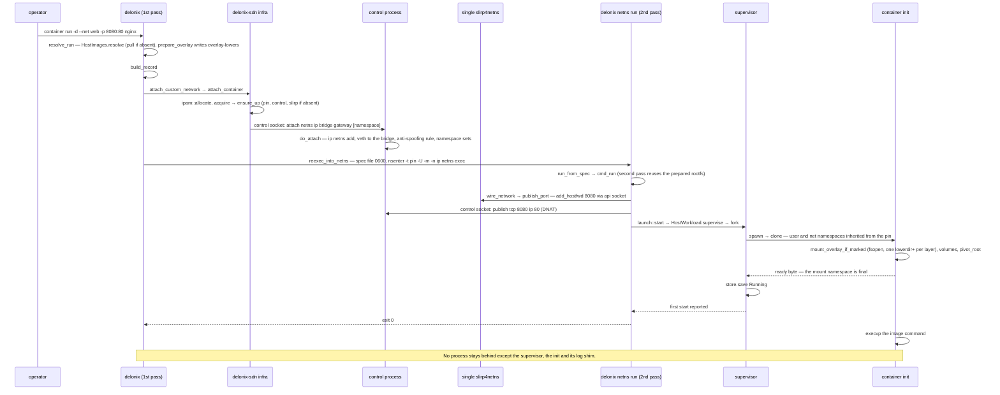
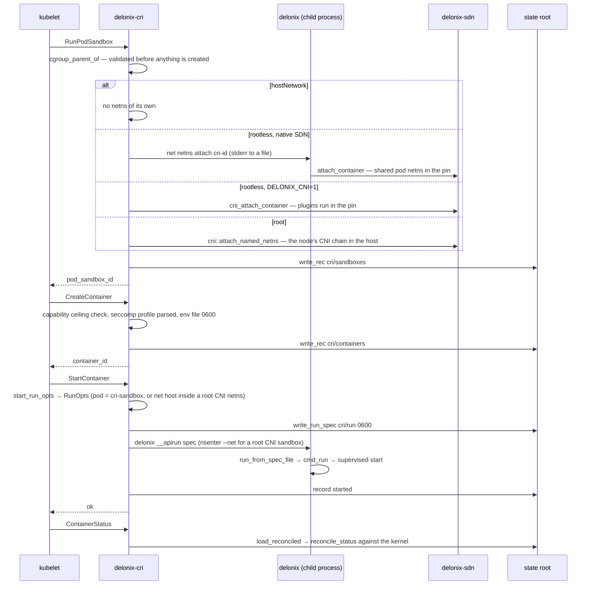

<!-- translated-from: 05-architecture.md sha256:09b0e7a6de683cf35f3aa20754770fa16bab45f97752a1ac9e2e26bb01f0dcae -->
# 5. Architecture

Cette page est la carte dont un contributeur a besoin avant de toucher au backend : ce qu’est le moteur, comment
les crates sont organisés en couches, quels processus existent à l’exécution, où l’état vit sur disque, et comment les
éléments communiquent entre eux. Chaque affirmation structurelle nomme le fichier et le symbole par rapport auxquels elle a été
vérifiée. Le document canonique, plus long, est [`ARCHITECTURE.md`](../../../ARCHITECTURE.md) à la
racine du dépôt ; les décisions qui sous-tendent la structure se trouvent dans [`docs/adr/`](../../adr/), avant tout
l’[ADR-0040](../../adr/0040-engine-restructuring-layers-ports-node-contract.md).

> **Deux moitiés sur cette page.** Le tableau des couches et le graphe des crates sont *générés* par
> `python3 scripts/dev_docs.py` à partir de `Cargo.toml` et de `scripts/arch_fitness.py` — ne les modifiez pas
> à la main. Tout le reste est du récit et est relu après chaque release.

## Identité et frontières du moteur

Le texte canonique est la section *«Identidade e fronteira do motor»* en tête de
[`AGENTS.md`](../../../AGENTS.md). En bref :

- **Ce qu’il est.** Une abstraction d’exécution pour **un nœud** : il exécute des **containers et des microVM**
  et gère le réseau et le stockage dont ils ont besoin. Il est déclaratif, avec ses **propres Kinds**
  regroupés par `apiVersion` (`core`, `compute`, `networking`, `gateway`, `storage`, `artifact`,
  `infrastructure` — la table est `crates/contexts/delonix-stack/src/kinds.rs`, et
  `delonix api-resources` l’affiche).
- **Les providers se trouvent derrière des ports.** Le noyau Linux, Cloud Hypervisor et libvirt, Proxmox VE
  et le CRI de Kubernetes sont atteints à travers un trait, jamais à travers des `if provider == …` dispersés
  dans le code. Les ports actuels : `VmBackend` (`crates/adapters/delonix-vm/src/lib.rs`) et les
  ports de calcul dans `crates/contexts/delonix-compute/src/ports.rs` et `launch.rs`
  (`ImageStore`, `StorageProvider`, `DeviceResolver`, `RunHost`, `NetworkProvider`,
  `VmNetwork`, `WorkloadRuntime`). Un backend OpenStack est conçu
  ([ADR-0039](../../adr/0039-openstack-vm-backend.md), *Proposed*) mais n’a pas encore de crate.
- **Cloud native** — plan / apply / dérive, les mêmes opérations exposées par plusieurs interfaces,
  observabilité via OpenTelemetry et Prometheus (`crates/adapters/delonix-telemetry`).
- **Daemonless** — aucun processus résident par défaut. Ce qui doit persister appartient à systemd ou à un
  processus par workload avec un propriétaire clair (le superviseur d’un container, le pin réseau).
- **Rootless-first** — le chemin normal s’exécute en tant qu’utilisateur non privilégié ; le privilège est un
  opt-in explicite (`--privileged`, `vm bridge`).
- **Ne connaît aucun consommateur.** Aucune plateforme, aucun control plane, aucune console ni aucun agent n’est nommé dans `crates/`,
  `bins/`, `proto/` ou les manifestes, et il n’existe aucune notion de locataire, de compte, d’offre ou de facturation.
  Le *namespace* que vous verrez partout est le namespace d’**isolation** propre au moteur, pas un
  locataire.

Ce ne sont pas des conventions ; `scripts/arch_fitness.py` impose la moitié structurelle en CI :

| Vérification | Où dans `arch_fitness.py` |
|---|---|
| Une dépendance à l’encontre de la direction des couches échoue, sauf s’il s’agit d’une exception déclarée qui nomme la phase de l’ADR-0040 qui la supprime | `LAYERS`, `ALLOWED`, `EXCEPTIONS`, `rule_failures` |
| Un crate de fondation ou de contexte ne peut pas prendre de dépendance de runtime/serveur/CLI (`tokio`, `tonic`, `reqwest`, `clap`, …) | `HEAVY` |
| Un binaire compose **un seul** crate d’interface | `rule_failures` (la vérification `roles`) |
| Un crate doit vivre dans le répertoire de sa couche | `LAYER_DIR`, `misplaced` |
| Le nom d’un consommateur n’importe où sous `crates/`, `bins/`, `proto/` (commentaires compris) échoue | `CONSUMER_NAMES`, `consumer_mentions` |
| Les versions des dépendances ne vivent que dans le `[workspace.dependencies]` racine | `inline_versions` |
| Des ratchets (cliquets) qui ne peuvent que descendre (listés ci-dessous) — par ex. des crates de bibliothèque qui ré-exécutent le binaire propre au moteur, `println!` dans des bibliothèques, des écritures dans l’environnement du processus, des adaptateurs qui importent l’`Error` partagée comme la leur | les motifs de ratchet (`SELF_EXEC`, `PRINTS`, `ENV_WRITES`, `SHARED_ERROR`, …), ligne de base dans `scripts/arch_baseline.json` |

<!-- dev-docs:begin ratchets -->
`scripts/arch_fitness.py` maintient **4 cliquets de dette** (référence dans `scripts/arch_baseline.json`) :

- `self_exec_sites`
- `library_prints`
- `env_writes`
- `shared_error_imports`
<!-- dev-docs:end ratchets -->

`python3 scripts/arch_fitness.py --list` montre ce que chaque ratchet compte aujourd’hui, fichier par fichier.

## Les couches et la direction autorisée

L’ADR-0040 D1 fixe une seule direction de dépendance :

```
interfaces ─► contexts (domain + use cases + ports) ◄─ adapters / providers
     │                                                      ▲
     └──────────────────── composes (bins/) ────────────────┘
```

- **Fondation** (`crates/foundation/`) — types partagés, plus ou moins purs, que chaque couche peut nommer.
- **Contextes** (`crates/contexts/`) — un crate par contexte borné, nommé d’après les groupes d’API
  publiés : les cas d’usage et les **ports** dont ils ont besoin. Pas de noyau, pas de HTTP, pas de provider.
- **Adaptateurs** (`crates/adapters/`) et **providers** (`crates/providers/`) — implémentent les ports :
  noyau, SDN, store OCI, backends de VM ; les providers apportent un client HTTP pour une cible distante.
- **Interfaces** (`crates/interfaces/`) — CRI, API de gestion, MCP : analysent une requête, appellent le
  moteur, présentent le résultat.
- **Binaires** (`bins/`) — racines de composition.

La couche à laquelle appartient chaque crate, et la direction dans laquelle il peut dépendre :

<!-- dev-docs:begin layers -->
| Couche | Peut dépendre de |
|---|---|
| Foundation | foundation |
| Contexts | foundation, contexts |
| Adapters | foundation, contexts |
| Providers | foundation, contexts |
| Interfaces | foundation, contexts, adapters, providers |
| Binaries | foundation, contexts, adapters, providers, interfaces |

Exceptions déclarées (chacune nomme la phase de l'ADR-0040 qui la supprime) :

- `delonix-mcp` → `delonix-mgmt` — supprimée en **P5**
- `delonix-proxmox` → `delonix-vm` — supprimée en **P4**
- `delonix-scanner` → `delonix-oci` — supprimée en **P4**
<!-- dev-docs:end layers -->

### Où en est la restructuration

L’ADR-0040 est un plan d’étranglement en phases (P0 rails → P1 contrat → P2 contextes → P3 adaptateurs et
binaires → P4 providers → P5 API de nœud → P6 CRI → P7 observabilité). Ce que montre le code aujourd’hui :

- **P0 est terminée.** Chaque crate vit dans le répertoire de sa couche, les versions sont au niveau du workspace, et
  le gate de fitness s’exécute en CI.
- **P1 est terminée en tant que contrat, pas en tant que serveur.** `proto/delonix/node/v1/*.proto` existe, le
  document OpenAPI `docs/api/openapi.yaml` en est généré, et `scripts/contract_gate.py`
  protège les deux. **Rien ne sert encore le contrat** — aucun crate ne référence `delonix.node.v1`
  (l’[ADR-0042](../../adr/0042-one-engine-api-maturity-and-docs.md) D1 dit la même chose).
- **P2 a commencé.** `delonix-model` (l’`Error` partagée et ses codes `DX_*`, les noms générés, les classes de sortie), `delonix-stack` (table
  des Kinds, réconciliateur à 3 voies, révisions) et `delonix-compute` (l’unique spécification d’exécution `RunOpts`,
  `resolve_run`, `build_record`, les cas d’usage de réseau et de lancement) existent. La plus grande partie de la logique applicative
  vit encore dans `bins/delonix-runtime-bin/src/cmd/`.
- **P3 est en cours.** Les ports de calcul sont implémentés dans des adaptateurs (`HostImages`,
  `HostVolumes`, `HostDevices`, `HostRuntime`, `HostNetwork`, `HostWorkload`, `HostVmNetwork`),
  la télémétrie a quitté la fondation pour `delonix-telemetry`, `delonix-vm` n’atteint le SDN qu’à
  travers le port `VmNetwork`, et les serveurs CRI, API de gestion et MCP sont devenus leurs propres
  exécutables. Quatre adaptateurs portent leur nom de l’ADR-0040 : `delonix-scanner` (anciennement `delonix-scan`),
  `delonix-oci` (anciennement `delonix-image`), `delonix-sdn` (anciennement `delonix-net`) et `delonix-linux` (anciennement
  `delonix-runtime`, le crate du moteur de containers). `delonix-runtime-core` existe toujours et contient
  toujours les stores, mais l’`Error` partagée est descendue dans `delonix-model` et est réexportée.
- **P4–P7 n’ont pas commencé.** Les exceptions restantes dans le tableau ci-dessus nomment ces phases.

Le graphe des crates, tel que `Cargo.toml` le déclare :

```mermaid
graph TB
  subgraph foundation["Foundation"]
    delonix_model["delonix-model"]
    delonix_net_rules["delonix-net-rules"]
    delonix_runtime_core["delonix-runtime-core"]
  end
  subgraph context["Contexts"]
    delonix_compute["delonix-compute"]
    delonix_security_runtime["delonix-security-runtime"]
    delonix_stack["delonix-stack"]
  end
  subgraph adapter["Adapters"]
    delonix_linux["delonix-linux"]
    delonix_oci["delonix-oci"]
    delonix_scanner["delonix-scanner"]
    delonix_sdn["delonix-sdn"]
    delonix_telemetry["delonix-telemetry"]
    delonix_vm["delonix-vm"]
    delonix_volume["delonix-volume"]
  end
  subgraph provider["Providers"]
    delonix_proxmox["delonix-proxmox"]
    delonix_truenas["delonix-truenas"]
  end
  subgraph interface["Interfaces"]
    delonix_cri["delonix-cri"]
    delonix_mcp["delonix-mcp"]
    delonix_mgmt["delonix-mgmt"]
  end
  subgraph bin["Binaries"]
    delonix_mcp_bin["delonix-mcp-bin"]
    delonix_mgmt_bin["delonix-mgmt-bin"]
    delonix_runtime_bin["delonix-runtime-bin"]
  end
  delonix_compute --> delonix_runtime_core
  delonix_cri --> delonix_compute
  delonix_cri --> delonix_linux
  delonix_cri --> delonix_oci
  delonix_cri --> delonix_runtime_core
  delonix_cri --> delonix_sdn
  delonix_cri --> delonix_telemetry
  delonix_linux --> delonix_compute
  delonix_linux --> delonix_runtime_core
  delonix_mcp --> delonix_linux
  delonix_mcp --> delonix_mgmt
  delonix_mcp --> delonix_runtime_core
  delonix_mcp --> delonix_sdn
  delonix_mcp --> delonix_vm
  delonix_mcp --> delonix_volume
  delonix_mcp_bin --> delonix_mcp
  delonix_mcp_bin --> delonix_runtime_core
  delonix_mcp_bin --> delonix_telemetry
  delonix_mgmt --> delonix_linux
  delonix_mgmt --> delonix_oci
  delonix_mgmt --> delonix_runtime_core
  delonix_mgmt --> delonix_scanner
  delonix_mgmt --> delonix_sdn
  delonix_mgmt --> delonix_telemetry
  delonix_mgmt --> delonix_vm
  delonix_mgmt --> delonix_volume
  delonix_mgmt_bin --> delonix_mgmt
  delonix_mgmt_bin --> delonix_runtime_core
  delonix_mgmt_bin --> delonix_telemetry
  delonix_oci --> delonix_compute
  delonix_oci --> delonix_runtime_core
  delonix_proxmox --> delonix_runtime_core
  delonix_proxmox --> delonix_vm
  delonix_runtime_bin --> delonix_compute
  delonix_runtime_bin --> delonix_linux
  delonix_runtime_bin --> delonix_mgmt
  delonix_runtime_bin --> delonix_model
  delonix_runtime_bin --> delonix_oci
  delonix_runtime_bin --> delonix_proxmox
  delonix_runtime_bin --> delonix_runtime_core
  delonix_runtime_bin --> delonix_scanner
  delonix_runtime_bin --> delonix_sdn
  delonix_runtime_bin --> delonix_security_runtime
  delonix_runtime_bin --> delonix_stack
  delonix_runtime_bin --> delonix_telemetry
  delonix_runtime_bin --> delonix_truenas
  delonix_runtime_bin --> delonix_vm
  delonix_runtime_bin --> delonix_volume
  delonix_runtime_core --> delonix_model
  delonix_scanner --> delonix_model
  delonix_scanner --> delonix_oci
  delonix_sdn --> delonix_compute
  delonix_sdn --> delonix_net_rules
  delonix_sdn --> delonix_runtime_core
  delonix_security_runtime --> delonix_runtime_core
  delonix_stack --> delonix_runtime_core
  delonix_truenas --> delonix_runtime_core
  delonix_vm --> delonix_compute
  delonix_vm --> delonix_net_rules
  delonix_vm --> delonix_runtime_core
  delonix_volume --> delonix_compute
  delonix_volume --> delonix_runtime_core
```

<!-- dev-docs:begin crates-graph -->

<!-- dev-docs:end crates-graph -->

## Exécutables et processus à l’exécution

C’est le niveau *container* du C4 : les choses qui s’exécutent. Le build fournit quatre exécutables (voir le
nombre généré dans le [README du manuel](README.md)) ; plusieurs autres **processus** apparaissent par
workload ou par nœud, chacun avec un propriétaire.

```mermaid
graph TB
    OP["operator<br>terminal"]
    KL["kubelet"]
    LC["local client<br>same uid, unix socket"]
    AI["AI client<br>stdio"]
    REG["OCI registries"]

    subgraph NODE["Linux node — one user, one state root"]
        CLI["delonix<br>CLI, one command per process<br>bins/delonix-runtime-bin"]
        CRI["delonix-cri<br>gRPC runtime.v1 on a unix socket<br>crates/interfaces/delonix-cri"]
        MGMT["delonix-mgmt<br>HTTP+JSON on a unix socket<br>bins/delonix-mgmt-bin"]
        MCP["delonix-mcp<br>MCP over stdio<br>bins/delonix-mcp-bin"]
        STATE[("state root<br>DELONIX_ROOT")]

        subgraph WL["per container"]
            SUP["supervisor<br>fork of the CLI, parent of the init"]
            INIT["container init → workload<br>clone with namespaces"]
            SHIM["log shim<br>fork, writes the log file"]
            CSLIRP["slirp4netns<br>only for -p without a custom network"]
        end

        subgraph INFRA["rootless network infra — started on demand"]
            PIN["pin<br>delonix netns pin<br>owns userns + netns + mountns"]
            CTL["control<br>delonix netns control<br>control socket, DNS, DHCP, RA"]
            ISLIRP["slirp4netns<br>single host uplink, api socket"]
            PROXY["L7 proxy<br>delonix ingress-proxy"]
        end

        CH["cloud-hypervisor<br>inside the infra netns"]
        LV["libvirt / QEMU<br>driven through virsh"]
    end

    OP -- argv --> CLI
    KL -- "gRPC, SO_PEERCRED" --> CRI
    LC -- "HTTP, SO_PEERCRED" --> MGMT
    AI -- "JSON-RPC over stdio" --> MCP
    CLI -. "serve cri / serve api / mcp: exec" .-> CRI
    CLI -. exec .-> MGMT
    CLI -. exec .-> MCP
    CRI -- "runs the CLI back:<br>net netns attach, __apirun spec" --> CLI
    MGMT -- "runs the CLI back" --> CLI
    MCP -- "runs the CLI back" --> CLI
    CLI -- "spawn netns pin" --> PIN
    CLI -- "nsenter, netns control" --> CTL
    CLI -- spawn --> ISLIRP
    CLI -- "control socket: attach, publish, firewall" --> CTL
    CLI -- "api socket: add_hostfwd" --> ISLIRP
    CLI -- "fork, run_supervised" --> SUP
    SUP -- clone --> INIT
    SUP -- fork --> SHIM
    CLI -- "slirp_attach hook" --> CSLIRP
    CLI -- "infra_join_argv + setsid, SIGHUP" --> PROXY
    CLI -- "launch_vmm through the infra join argv" --> CH
    CLI -- virsh --> LV
    CLI -- HTTPS --> REG
    CLI --- STATE
    CRI --- STATE
    MGMT --- STATE
```



| Processus | Né dans | Vit pendant |
|---|---|---|
| `delonix` | `bins/delonix-runtime-bin/src/main.rs` (`main`, `run`) | une commande. `main` intercepte les points d’entrée cachés (`netns pin`, `netns control`, `netns run`, `__rmtree`, `__volsnap`, `__ovlmigrate`, `__ovlhold`, `__duusage`, `__buildtar`, `__apirun`, `__netnsconnect`) **avant** que clap n’analyse |
| `delonix-cri` | `crates/interfaces/delonix-cri/src/bin/delonix-cri.rs` → `delonix_cri::serve_blocking` | un service (généralement une unité systemd). `delonix serve cri` l’exécute par `exec` (`cmd/serve.rs::exec_server`) |
| `delonix-mgmt` | `bins/delonix-mgmt-bin/src/main.rs` → `delonix_mgmt::serve_blocking` | un service ; `delonix serve api` l’exécute par `exec` |
| `delonix-mcp` | `bins/delonix-mcp-bin/src/main.rs` → `delonix_mcp::serve_stdio` | une session de client d’IA (un processus enfant sur stdio) ; `delonix mcp` l’exécute par `exec` |
| Tranche de l’API Docker | `cmd/serve.rs` → `cmd::dockerapi::run`, **à l’intérieur** du processus `delonix` | tant que `delonix serve docker-api` s’exécute |
| superviseur | `delonix_linux::supervise::run_supervised`, choisi par `delonix_compute::launch::start` pour chaque démarrage détaché pour lequel l’appelant peut faire un fork | la vie du container ; c’est le vrai parent, il recueille donc le code de sortie et applique `--restart` |
| init du container | `delonix_linux::spawn` → `clone` → `container_init` | le container |
| log shim | `fork` à l’intérieur de `spawn`, exécutant `log_shim` | le container |
| `slirp4netns` par container | `delonix_sdn::slirp_attach`, appelé comme hook `on_started` | le netns du container ; les orphelins sont récupérés par `reap_orphan_slirp` |
| pin | `infra::start_pin` lance `delonix netns pin` ; `infra::pin_main` crée les namespaces user, net et mount dans le processus (`crates/adapters/delonix-sdn/src/pin_userns.rs`) et s’endort | l’infrastructure ; son pid est `ingress/holder.pid` et il ne change jamais |
| control | `infra::start_control` (`nsenter -t <pin> -U -m -n -- delonix netns control`) → `infra::control_main` | redémarrable ; sert le socket de contrôle, le DNS (`dns_server_main`), les Router Advertisements (`ra_sender_main`) et le DHCP par bridge (`dhcp_serve`) |
| `slirp4netns` unique | `infra::start_slirp` (`tap0` dans le netns du pin, `--api-socket`) | l’infrastructure |
| proxy d’ingress L7 | `cmd/ingress_proxy.rs::spawn_proxy` via `infra::infra_join_argv` | tant qu’une route `HTTPRoute`/`Ingress` ou `--expose` existe ; recharge les routes sur `SIGHUP` |
| `cloud-hypervisor` | `delonix_vm::launch_vmm`, exécuté via l’argv de jonction à l’infrastructure | la VM |
| domaine libvirt | `LibvirtBackend` pilotant `virsh` | la VM (le domaine vit dans libvirt) |

`ensure_up` (`crates/adapters/delonix-sdn/src/infra.rs`) est la seule fonction qui démarre
l’infrastructure réseau, sous un verrou de fichier par racine, et elle distingue trois cas : pin et control
vivants (rien à faire) ; pin vivant et control disparu (redémarrer **uniquement** le plan de contrôle — aucun câble
ne bouge) ; pin disparu (démonter et reconstruire).

## Un seul ensemble d’opérations, plusieurs interfaces

| Interface | Transport | Point d’entrée | Statut |
|---|---|---|---|
| CLI | argv | `bins/delonix-runtime-bin` | la surface complète |
| CRI (`runtime.v1`) | gRPC sur un socket unix, `0600` + `SO_PEERCRED` | `delonix_cri::serve_blocking` | sert le kubelet |
| API de gestion | HTTP+JSON sur un socket unix, même uid uniquement | `delonix_mgmt::serve_blocking` (routes telles que `/v1/containers`, `/v1/volumes`, `/metrics`) | locale uniquement (l’[ADR-0010](../../adr/0010-remote-management-api.md) a rejeté une API distante) ; destinée à être remplacée par le contrat de nœud |
| MCP | stdio | `delonix_mcp::serve_stdio` | local, sans locataire ([ADR-0025](../../adr/0025-mcp-local-ai-control-surface.md)) |
| Tranche de l’API Docker Engine | HTTP sur un socket unix | `cmd::dockerapi::run` | une tranche de compatibilité, à l’intérieur de `delonix` |
| **Contrat de nœud** `delonix.node.v1` | gRPC **et** HTTP/JSON sur un seul socket unix | `proto/delonix/node/v1/` | **contrat uniquement** — pas encore de serveur |

Le contrat de nœud est l’API unique visée
([ADR-0040](../../adr/0040-engine-restructuring-layers-ports-node-contract.md) D4,
[ADR-0042](../../adr/0042-one-engine-api-maturity-and-docs.md)). Les fichiers `.proto` sont la source
de vérité ; `docs/api/openapi.yaml` en est **généré** et n’est jamais modifié à la main.
`scripts/contract_gate.py` échoue sur : `buf format`, `buf lint`, `buf breaking` par rapport au dernier
tag qui contient `proto/`, un RPC sans mapping HTTP (ou un stream bidirectionnel qui en a un),
un document OpenAPI qui diffère de celui généré, et deux chemins qui sont la même URL
sous des noms de variables différents. Trois règles qu’il protège : un message de requête par RPC, une identité
explicite (`namespace`/`name`) dans la requête, et des images adressées par paramètre de requête.

## L’état sur disque

Il n’y a pas de base de données. L’état est constitué de fichiers sous une seule **racine d’état** :

- `DELONIX_ROOT` lorsqu’elle est définie ; sinon `$XDG_DATA_HOME/delonix` ou `~/.local/share/delonix` pour un
  utilisateur non privilégié et `/var/lib/delonix` pour root
  (`bins/delonix-runtime-bin/src/cmd/util.rs::state_root` → `ImageStore::default_root` ;
  `infra::base_root` résout la même règle côté réseau).
- **Les sockets ne vivent pas sous la racine d’état.** Ils se trouvent dans un court répertoire d’exécution par utilisateur
  (`infra::runtime_dir`, modifiable avec `DELONIX_NET_RUNTIME_DIR`), car la longueur des chemins `AF_UNIX` est
  limitée ; une racine non par défaut reçoit un suffixe haché (`root_suffix`), de sorte que deux racines d’une même
  session ne partagent jamais de sockets. **Lorsque vous exécutez quoi que ce soit de manière isolée, définissez les deux variables.**

| Chemin sous la racine | Quoi | Code |
|---|---|---|
| `containers/<id>.json` | un enregistrement JSON par container | `delonix_runtime_core::Store` (`store.rs`) |
| `containers/<id>/{upper,work,merged}` + `overlay-lowers` | la couche inscriptible du container et la liste des couches d’image partagées qu’il monte | `ImageStore::prepare_overlay` (`delonix-oci/src/overlay.rs`) |
| `images/<id>.json`, `layers/<hex>/`, `blobs/sha256/<hex>` | métadonnées d’image, couches décompressées partagées par tous les containers, blobs adressés par contenu | `ImageStore::open` (`image.rs`), `Cas` (`cas.rs`) |
| `volumes/<name>/_data`, `volumes/.ns/<ns>/` | volumes nommés, volumes limités à un namespace | `VolumeStore` (`delonix-volume/src/lib.rs`) |
| `vms/` | enregistrements de VM (`JsonStore`) et fichiers par VM | `delonix-vm` |
| `vm-images/` | images de VM (`.qcow2` + `.json`) | `cmd/vmimage.rs::VmImageStore` |
| `secrets/` | secrets chiffrés | `SecretStore` (`delonix-runtime-core/src/secret.rs`) |
| `ingress/` | pidfiles (`holder.pid` est le pin), marqueurs `refs/`, définitions de réseaux et de routes, logs | `delonix-sdn/src/infra.rs` |
| `ipam/` | baux d’adresses par préfixe | `delonix-sdn/src/ipam.rs` |
| `cri/{sandboxes,containers}/` | les enregistrements propres au CRI | `delonix-cri/src/runtime_svc/lifecycle.rs` (`sb_dir`, `ct_dir`) |
| `clusters/` | kubeconfigs, clés et PKI des clusters | `cmd/cluster.rs` |
| `events.jsonl` | journal d’événements en ajout seul | `delonix_runtime_core::events` |

La concurrence est gérée par le système de fichiers, car plusieurs processus (la CLI, le serveur CRI,
un superviseur) modifient les mêmes enregistrements : les écritures sont atomiques (fichier temporaire + `rename`,
`store.rs::write_atomic`), et la lecture-modification-écriture passe par `Store::update` /
`JsonStore::update`, qui prennent un `flock` exclusif et **refusent** de continuer sans lui. L’infrastructure
réseau a son propre `FileLock` autour de `ensure_up`, `teardown`, `acquire`, `release` et des
fonctions de récupération.

Comme rien de résident ne surveille les processus, un enregistrement indiquant `Running` peut être obsolète. Les lecteurs
réconcilient : `delonix_linux::reconcile_status` vérifie le pid ainsi que son heure de démarrage
(`delonix_runtime_core::safe_to_signal`), de sorte qu’un pid recyclé n’est jamais confondu avec le container.

## Comment les crates communiquent

1. **Appels Rust directs, dans la direction des couches.** Le cas normal. Par exemple `cmd_run`
   (`cmd/container.rs`) appelle `delonix_compute::run::resolve_run` avec les adaptateurs
   `delonix_oci::run_images::HostImages`, `delonix_volume::HostVolumes`,
   `delonix_linux::cdi::HostDevices` et `delonix_linux::run_host::HostRuntime`, puis
   `delonix_compute::network::{attach_custom_network, wire_network}` avec
   `delonix_sdn::run_network::HostNetwork`, puis `delonix_compute::launch::start` avec
   `delonix_linux::workload::HostWorkload`.
2. **Enregistrement à la racine de composition.** `run()` dans `bins/delonix-runtime-bin/src/main.rs`
   enregistre les backends de VM distants configurés (`cmd::vmbackends::register_configured` →
   `delonix_vm::register_backend`) et l’implémentation SDN du port réseau des VM
   (`delonix_vm::set_network(HostVmNetwork)`) avant qu’une commande ne s’exécute.
3. **Ré-exécution du binaire propre au moteur.** Encore courante, et comptée par le ratchet
   `self_exec_sites`. Les raisons sont réelles :
   - `clone` n’est sûr que dans un processus **mono-thread**, et les serveurs CRI, API de gestion et
     API Docker sont des runtimes `tokio` multi-thread. Ils transmettent un `RunOpts` typé dans un
     fichier `0600` à un nouveau `delonix __apirun <spec>` (`lifecycle.rs::write_run_spec`,
     `cmd::dockerapi::run_from_spec_file`).
   - Un processus rootless doit **entrer** dans les namespaces user et mount du pin réseau avant qu’un
     container puisse y rejoindre un netns nommé, c’est pourquoi `reexec_into_netns` exécute
     `nsenter … ip netns exec <netns> delonix netns run <spec>`.
   - Le travail sur des fichiers appartenant à des subuid mappés nécessite un processus à l’intérieur d’un user namespace mappé
     (`delonix_linux::reexec_mapped`, `reexec_mapped_hold`, `remove_tree_mapped` → les
     points d’entrée `__rmtree`/`__ovlhold`/…).
   - Les serveurs construisent encore certaines invocations de la CLI (`delonix-mgmt`, le
     `run_cli_blocking` de `delonix-mcp`, l’utilitaire `delonix()` du CRI), en résolvant la CLI via
     `delonix_runtime_core::dispatch::cli_bin` (`DELONIX_BIN`, puis le `delonix` voisin, puis
     le `PATH`) — jamais leur propre exécutable.
   L’ADR-0040 D2.4/D5 prévoit un exécutable `delonix-launcher` recevant une spec typée, afin que ces cas deviennent
   des appels de cas d’usage plus un seul lancement de processus.
4. **Le socket de contrôle.** Tout ce qui se passe à l’intérieur du netns de l’infrastructure rootless est fait par le processus
   control : `infra::control_send`/`control_query` écrivent une ligne (`attach …`, `publish …`,
   `firewall …`) sur un socket unix `0600` ; `control_loop` n’accepte que les pairs ayant l’uid propre au moteur
   (`SO_PEERCRED`) et sert une connexion à la fois, de sorte que les opérations netns/veth/nftables
   ne s’entrelacent jamais.
5. **Des sous-processus vers des outils de l’hôte**, dans les adaptateurs : `ip`, `nft`, `nsenter`, `slirp4netns`
   (`delonix-sdn`), `newuidmap`/`newgidmap` (`delonix-linux`, `pin_userns`), `qemu-img`,
   `virsh`, `cloud-localds` (`delonix-vm`), `busctl` pour les scopes transitoires systemd
   (`delonix-linux`), `ssh`/`scp` (`cmd/remote.rs`).
6. **Le HTTP vers un système de gestion distant ne vit que dans les providers.** `delonix-proxmox` et
   `delonix-truenas` dépendent de `reqwest` pour cela. Deux adaptateurs parlent aussi HTTP, pour d’autres raisons :
   `delonix-oci` a son propre client de registre OCI (`src/registry.rs`, `reqwest` dans son
   `Cargo.toml`), et `delonix-telemetry` exporte OTLP sur HTTP. Aucun crate de contexte ne le fait.

## Deux flux, sous forme de séquences

### `container run -d --net web -p 8080:80 nginx`, rootless

Chaque flèche ci-dessous est un appel dans `cmd_run` (`bins/delonix-runtime-bin/src/cmd/container.rs`) ou dans
les fonctions qu’il atteint.



Sans réseau personnalisé, le flux n’a pas de seconde passe : `spawn` crée son propre user namespace, et
le parent écrit les maps d’id (`write_userns_maps`), configure le cgroup, exécute le hook `on_started`
(le `slirp_attach` par container lorsqu’il y a des ports `-p`) et seulement ensuite envoie l’octet « go »
à l’enfant.

### CRI : `RunPodSandbox` → `CreateContainer` → `StartContainer`

D’après `crates/interfaces/delonix-cri/src/runtime_svc/lifecycle.rs`.



## Limitations connues

> **Remarque — le contrat de nœud n’est pas servi.** `proto/delonix/node/v1` est contrôlé par un gate et génère
> l’OpenAPI, mais aucun processus n’y répond. Les intégrations utilisent aujourd’hui la CLI, le CRI, l’API de
> gestion locale ou MCP.

> **Remarque — les serveurs exécutent encore la CLI.** `delonix-cri`, `delonix-mgmt` et `delonix-mcp` démarrent
> les workloads en ré-exécutant `delonix`. Cela tient `clone` à l’écart des processus multi-thread, au
> prix d’un processus par opération et d’un texte d’erreur qui traverse une frontière de processus.

> **Remarque — `macvlan`/`ipvlan` sont déclarés, pas réalisés.** `network create` les enregistre et
> signale `Realized=False` avec la raison `DriverNotImplemented`
> (`bins/delonix-runtime-bin/src/cmd/network.rs`) : leur plan physique a besoin de `CAP_NET_ADMIN` dans
> le network namespace initial de l’hôte.

> **Remarque — la récupération après la mort du pin se fait par redémarrage.** Si le processus control meurt, `ensure_up`
> ne redémarre que lui et aucun workload ne bouge. Si le **pin** meurt, le netns est reconstruit et
> `delonix net netns up` redémarre les containers et membres de pods bloqués
> (`cmd/netns.rs::reconcile_after_respawn`, qui ne lit que le store des containers — les VM ne sont pas
> récupérées de cette façon).

> **Remarque — l’IPv6 dans le SDN est désactivé par défaut.** Le pare-feu d’ingress est `table ip` ; le holder
> installe une `table ip6` qui rejette tout (`infra::ingress_v6_refusal_ruleset`) et désactive l’IPv6 à l’intérieur
> des netns des containers, sauf si `DELONIX_ENABLE_IPV6=1` (`ipv6_sdn_enabled`).

> **Remarque — un appelant qui ne peut pas faire de fork démarre sans supervision.** `launch::should_supervise` exige
> `detach && forkable` ; sans superviseur, personne n’est le parent du processus et le vrai code
> de sortie ne peut pas être recueilli.

## Par où commencer la lecture

| Domaine | Commencez ici |
|---|---|
| Point d’entrée de la CLI et points d’entrée cachés de ré-exécution | `bins/delonix-runtime-bin/src/main.rs` (`main`, `run`) |
| `container run` de bout en bout | `cmd/container.rs::cmd_run`, puis `delonix-compute/src/{run,network,launch}.rs` |
| Création de processus, namespaces, rootfs, seccomp, cgroups | `delonix-linux/src/lib.rs` (`spawn`, `container_init`, `setup_rootfs`, `setup_cgroup`), `supervise.rs`, `launch_spec.rs` |
| Réseau rootless | `delonix-sdn/src/infra.rs` (`ensure_up`, `control_main`, `attach_container`, `publish_port`, `ingress_table_ruleset`, `fw_chain_body`), `pin_userns.rs`, `ipam.rs` |
| Images | `delonix-oci/src/{registry,cas,image,overlay,build}.rs` |
| VM | `delonix-vm/src/lib.rs` (`VmBackend`, `builtin_backends`, `register_backend`, `select_backend`), `cloudinit.rs` ; `cmd/vm.rs`, `cmd/vmimage.rs` |
| Apply déclaratif | `delonix-stack/src/{kinds,reconcile}.rs` ; `cmd/stack.rs`, `cmd/manifest.rs` |
| CRI | `delonix-cri/src/lib.rs::serve_blocking`, `runtime_svc.rs`, `runtime_svc/lifecycle.rs` |
| API de gestion / MCP | `delonix-mgmt/src/lib.rs`, `delonix-mcp/src/lib.rs` |
| Contrat de nœud | `proto/delonix/node/v1/`, `scripts/contract_gate.py`, `docs/api/openapi.yaml` |
| Règles d’architecture | `scripts/arch_fitness.py`, ADR-0040 |
