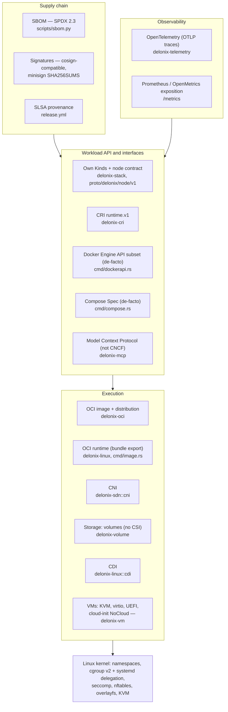

<!-- translated-from: 13-cloud-native-standards.md sha256:4b76e303e34bfa46861021a2375452ee269686e36b514d6515a7637ee1991bcd -->
# 13. Standards cloud native, couche par couche

Un moteur de containers et de microVMs n'est pas une spécification unique. C'est un empilement de
couches, et la plupart des couches ont un standard ouvert : certains viennent de l'**OCI** (Open
Container Initiative), d'autres des SIG Kubernetes et de la **CNCF** (Cloud Native Computing
Foundation), d'autres du noyau Linux, et quelques-uns sont des interfaces de facto sans organisme de
normalisation derrière elles.

Cette page est organisée **par standard et par couche**. Pour chacun, elle répond à quatre questions :
ce qu'est le standard, ce qu'il exige d'une implémentation, comment Delonix l'implémente aujourd'hui
(crate, fichier, symbole), et ce que disent les éléments de preuve sur la conformité, lacunes
comprises. Si vous cherchez « OCI, CRI, CNI, CSI, CDI », c'est cette page.

Lisez d'abord [4. Introduction au cloud native](04-cloud-native-primer.md) si les namespaces, les
cgroups, overlayfs ou le kubelet sont nouveaux pour vous. Cette page suppose ces bases acquises et ne
les répète pas.

Trois règles pour lire cette page :

- **« Compatible » n'apparaît jamais sans un nombre, une date et une version.** Une affirmation de
  conformité que personne ne remesure cesse d'être une mesure et devient une citation.
- **« Non implémenté » est une réponse à part entière.** Lorsque le moteur n'implémente pas un
  standard, la section le dit et renvoie à la décision (ADR) qui explique pourquoi.
- **Les chemins sont relatifs à la racine du dépôt**, et chaque symbole nommé ici a été lu dans le
  code. Si un symbole a bougé au moment où vous lisez ceci, faites confiance au code et corrigez la
  page.

---

## 13.0 La carte des couches

Chaque flèche signifie « est construit sur ». La couche noyau n'est pas un standard CNCF ; elle est
traitée en 13.15 parce que toutes les autres couches en dépendent.

---

## 13.1 OCI Runtime Specification

**Ce qu'est le standard.** L'[OCI Runtime Specification](https://github.com/opencontainers/runtime-spec)
définit un *filesystem bundle* (un système de fichiers racine plus un `config.json`) et le cycle de vie
d'un container créé à partir de celui-ci (`create`, `start`, `kill`, `delete`, `state`). C'est ce
qu'implémentent `runc`, `crun` et `youki`, et ce que pilotent containerd et CRI-O.

**Ce qu'une implémentation doit faire.**

- Lire un bundle : `config.json` avec `ociVersion`, `process`, `root`, `mounts`, `linux`
  (namespaces, capabilities, cgroups, chemins masqués et en lecture seule, seccomp).
- Exposer les opérations du cycle de vie et le document `state`, et exécuter les hooks que la
  configuration déclare (`prestart`, `createRuntime`, `poststop`, …).

**Comment Delonix l'implémente.** Delonix n'est **pas un binaire de runtime OCI** au sens de `runc` :
il ne lit pas de bundle et n'expose pas la ligne de commande `create/start/state`. C'est son propre
runtime, et il se rapporte à la spécification de deux manières :

1. **Il produit des bundles pour les runtimes OCI.** `delonix image export <image> <dir>` écrit
   `<dir>/rootfs` et `<dir>/config.json` afin que `runc run -b <dir>` puisse exécuter l'image.
   - `bins/delonix-runtime-bin/src/cmd/image.rs` : `cmd_export` décompresse le rootfs via
     `ImageStore::export_rootfs` (`crates/adapters/delonix-oci/src/overlay.rs`) et construit la
     configuration avec `build_runtime_spec`.
   - `build_runtime_spec` construit la configuration à partir des types `oci_spec::runtime` (le crate
     `oci-spec`, épinglé dans le `Cargo.toml` racine) au lieu de JSON écrit à la main. Son commentaire
     de documentation liste ce qui manquait à un bundle antérieur écrit à la main (montages standard,
     capabilities effectives, chemins masqués/en lecture seule).
2. **Il implémente nativement les mêmes mécanismes.** `fn spawn` et `container_init` dans
   `crates/adapters/delonix-linux/src/lib.rs` font ce qu'un runtime OCI fait à partir d'un
   `config.json` : namespaces, `pivot_root`, capabilities, seccomp, chemins masqués. La spécification
   d'exécution qu'ils consomment n'est pas `config.json` mais `RunOpts`
   (`crates/contexts/delonix-compute/src/run_opts.rs`), que produit chaque frontal (CLI, Kinds,
   compose, API Docker, CRI).

**État de conformité / lacunes.**

- Aucune suite de conformité runtime-spec n'a été exécutée contre Delonix. Ce n'était pas possible :
  il n'existe aucun point d'entrée consommant un bundle contre lequel l'exécuter.
- **Les hooks OCI ne sont pas implémentés.** L'[ADR-0033](../../adr/0033-oci-runtime-hooks.md)
  (Proposed) consigne pourquoi : aucun consommateur concret, et exécuter un binaire de l'hôte nommé par
  une spécification de container est la classe de sécurité que le projet conditionne déjà à un spike.
  La closure en processus `StartedHook` de `delonix-linux` y ressemble, mais ce n'est pas le protocole
  OCI.
- Le bundle exporté est minimal (commande, environnement et répertoire de travail par défaut, issus de
  l'image). Traitez-le comme un format de passage de relais, pas comme une traduction de la
  configuration complète d'un container.

**Par où commencer la lecture.** `cmd_export` et `build_runtime_spec` dans
`bins/delonix-runtime-bin/src/cmd/image.rs` → `export_rootfs` dans
`crates/adapters/delonix-oci/src/overlay.rs` → `spawn` dans `crates/adapters/delonix-linux/src/lib.rs`.

---

## 13.2 OCI Image Specification

**Ce qu'est le standard.** L'[OCI Image Specification](https://github.com/opencontainers/image-spec)
définit comment une image est décrite : un *manifest* listant un blob *config* et des blobs *layer*
ordonnés, un *image index* pour plusieurs plateformes, adressés par contenu via leur digest, et le
format de répertoire *image layout* (`oci-layout`, `index.json`, `blobs/sha256/…`).

**Ce qu'une implémentation doit faire.**

- Adresser tout le contenu par digest et le vérifier.
- Comprendre les manifests, les index (sélectionner la bonne plateforme) et les media types de layers
  (tar, gzip, zstd), et appliquer les layers dans l'ordre, whiteouts compris.
- Lire et écrire l'image layout lors d'échanges d'images sans registre.

**Comment Delonix l'implémente.** Tout se trouve dans `crates/adapters/delonix-oci` :

- **Store adressé par contenu** : `src/cas.rs` (`Cas`), avec `ImageStore` dans `src/image.rs`.
- **Layers comme couches basses (lowers) d'overlay** : `ImageStore::prepare_overlay` (`src/overlay.rs`)
  écrit un fichier `overlay-lowers` à côté du `merged/` du container, et l'init du container lui-même
  le monte. Les layers sont partagées entre containers, pas copiées (voir les notes sur le partage des
  layers entre containers dans `AGENTS.md` et l'[ADR-0037](../../adr/0037-overlay-mount-new-api.md)
  pour l'API de montage).
- **Media type de layer d'après le nombre magique** : le helper à côté de `DOCKER_MANIFEST_MEDIA_TYPE`
  dans `src/registry.rs` détecte gzip, zstd ou tar brut.
- **Écriture de l'image layout** : `write_oci_archive` (`src/save.rs`), utilisé par
  `delonix image save`. Il écrit `oci-layout`, `index.json`, les blobs, et un `manifest.json` hérité
  afin qu'une même archive se lise dans `ctr images import`, `podman load`, `docker load` et
  `delonix image load`. Il définit à la fois `org.opencontainers.image.ref.name` et
  `io.containerd.image.name` ; sans le second, `ctr` importe les blobs mais n'enregistre aucun nom.
- **Lecture des archives** : `load_docker_archive` (`src/load.rs`).

**État de conformité / lacunes.**

- **Les manifests poussés et archivés utilisent le media type Docker v2 schema 2**
  (`application/vnd.docker.distribution.manifest.v2+json`, `DOCKER_MANIFEST_MEDIA_TYPE` dans
  `src/registry.rs`), et non `application/vnd.oci.image.manifest.v1+json`. Les pulls acceptent les deux
  (`ACCEPT_MANIFEST`). C'est interopérable avec les registres et les outils d'import nommés ci-dessus,
  mais ce n'est pas « écrit des manifests d'image OCI ».
- Aucune suite de conformité image-spec n'a été exécutée.

**Par où commencer la lecture.** `src/image.rs` → `src/cas.rs` → `src/overlay.rs`
(`prepare_overlay`, `export_rootfs`) → `src/save.rs` → `src/load.rs`.

---

## 13.3 OCI Distribution Specification

**Ce qu'est le standard.** L'[OCI Distribution Specification](https://github.com/opencontainers/distribution-spec)
définit l'API HTTP d'un registre : `GET /v2/<name>/manifests/<reference>`, récupération et envoi de
blobs, liste des tags, et le flux d'authentification par jeton qu'utilisent la plupart des registres.

**Ce qu'une implémentation doit faire.**

- Négocier les media types de manifest avec `Accept`, suivre le flux `401 → token → retry`, récupérer
  les blobs et **vérifier chacun contre son digest**.
- Pour une référence par digest (`repo@sha256:…`), vérifier que le manifest lui-même a ce digest pour
  empreinte.
- Pousser les blobs (avec vérification d'existence) puis le manifest.

**Comment Delonix l'implémente.** `crates/adapters/delonix-oci/src/registry.rs` :

- `parse_reference` découpe `registry/repo:tag@digest` (y compris la forme combinée `tag@digest`).
- `pull_from_registry_with_creds` / `pull_from_registry_with_creds_full` tirent une image
  multi-layers ; les blobs déjà présents dans le CAS ne sont pas retéléchargés.
- **`verify_manifest_digest`** : pour un pull épinglé par digest, les octets du manifest doivent avoir
  pour empreinte le digest épinglé, sinon le pull est refusé. Sans cela, un registre compromis pourrait
  servir un manifest différent et cohérent en interne, et l'épinglage serait décoratif. Pour une
  référence par tag, c'est sans effet ; TLS est la seule garantie d'intégrité, comme avec `docker pull`.
- `blob_with_progress_capped` reprend un téléchargement de blob interrompu avec `Range:`. Un `206` à un
  offset différent de celui demandé, ou un `200` qui a ignoré le range, recommence de zéro au lieu
  d'être recousu. C'est la vérification finale du digest qui rend le recousage sûr.
- `push_to_registry`, `build_manifest`, `list_remote_tags`.
- **Artefacts OCI** (blob unique, config vide `application/vnd.oci.empty.v1+json`, le modèle
  qu'utilisent ORAS et Helm) : `push_oci_artifact*` et `pull_oci_artifact*`. Les images de VM sont
  publiées ainsi (voir [9. Construire des microVMs](09-microvm-setup.md)). Les annotations ne sont lues
  qu'*après* la vérification du digest.
- Identifiants : `src/auth.rs` lit le format `auths` de Docker/Podman.
- Un registre local jetable pour les builds de buildpacks : `src/internal_registry.rs`.

**État de conformité / lacunes.**

- Aucune exécution de conformité distribution-spec n'existe pour le client.
- `list_remote_tags` ne lit que la première page de `tags/list` (pas de pagination `Link`). Les notes
  d'`AGENTS.md` jugent cela sans importance pour la poignée de tags d'une image de VM ; cela compterait
  pour un gros dépôt.
- Le moteur n'implémente pas le côté *serveur* du registre, à l'exception du registre local jetable
  ci-dessus.

**Par où commencer la lecture.** `parse_reference` → `pull_from_registry_with_creds_full` →
`verify_manifest_digest` → `blob_with_progress_capped` → `pull_oci_artifact_with_meta`, tous dans
`src/registry.rs`.

---

## 13.4 Kubernetes Container Runtime Interface (CRI)

**Ce qu'est le standard.** Le [CRI](https://github.com/kubernetes/cri-api) est l'API gRPC
(`runtime.v1`) que le kubelet utilise pour exécuter des pods : un `RuntimeService` (sandboxes de pod,
containers, exec/attach/port-forward, statistiques) et un `ImageService`. Le kubelet se connecte à un
runtime via `--container-runtime-endpoint`.

**Ce qu'une implémentation doit faire.**

- Servir les deux services sur un socket local ; signaler `RuntimeReady` et `NetworkReady` dans
  `Status`.
- Implémenter le modèle de sandbox de pod : namespace réseau partagé, parent de cgroup au niveau du
  pod, cycle de vie des containers à l'intérieur de la sandbox.
- Renvoyer des **URL** depuis `Exec`/`Attach`/`PortForward` et servir ces flux via le protocole
  remotecommand de Kubernetes (WebSocket ou SPDY).
- Indiquer au kubelet son pilote de cgroup (`RuntimeConfig`), respecter les limites de ressources,
  fournir des statistiques pour l'éviction, et écrire les logs au format de log CRI.

**Comment Delonix l'implémente.** `crates/interfaces/delonix-cri`, binaire `delonix-cri`
(également `delonix serve cri`) :

- **Contrat** : `proto/api.proto` déclare `package runtime.v1` avec
  `go_package = "k8s.io/cri-api/pkg/apis/runtime/v1"` ; `Version` répond
  `runtime_api_version: "v1"` (`src/runtime_svc.rs`).
- **Serveur** : `serve_blocking` dans `src/lib.rs` ; socket issu de `--addr` ou de `DELONIX_CRI_ADDR`,
  par défaut `unix:///run/delonix-cri.sock` (`src/bin/delonix-cri.rs`).
- **Cycle de vie** : `src/runtime_svc.rs` (le trait gRPC) délègue à
  `src/runtime_svc/lifecycle.rs`.
- **Pilote de cgroup** : `runtime_config` répond `engine_cgroup_driver()`, qui vaut `Cgroupfs`. Son
  commentaire de documentation consigne la mesure qui l'a imposé (2026-09-15, k8s 1.36.4) : ne rien
  répondre faisait adopter `systemd` par défaut au kubelet, systemd retirait `cpuset` des slices de pod
  vides, et le kubelet tuait les pods en boucle.
- **Modèle de ressources du kubelet** : [ADR-0038](../../adr/0038-cri-follows-kubelet-resource-model.md).
  Le `cgroup_parent` du kubelet est validé par `KubeCgroupParent::parse`
  (`crates/foundation/delonix-runtime-core/src/lib.rs`) et consommé dans
  `crates/contexts/delonix-compute/src/run.rs` ; `delonix-linux` dispose de `transient_scope_argv` pour
  placer un container dans un scope systemd sous une slice de pod.
- **Plafond de capabilities** : `CapCeiling` (`src/cap_ceiling.rs`), configuré par
  `DELONIX_CRI_CAP_CEILING` et `DELONIX_CRI_CAP_CEILING_MODE`, et visible dans `crictl info` sous
  `capabilityCeiling` (inséré dans `status`).
- **Streaming** : `src/streaming.rs` sert remotecommand via WebSocket (`v5.channel.k8s.io`), et
  `src/spdy.rs` via SPDY/3.1 ; `port_forward` renvoie une URL de streaming.
- **Statistiques et métriques** : `container_stats`, `list_pod_sandbox_stats`,
  `list_metric_descriptors` dans `lifecycle.rs`.
- **Réseau des pods** : voir 13.5.

**État de conformité / lacunes.**

- **Mesuré avec le `critest` amont** ([docs/cri-conformance.md](../../cri-conformance.md)) :
  cri-tools `critest` **v1.36.0**, moteur `delonix-cri` **v0.63.1**, rootless, **2026-08-25** :
  **79 réussis, 24 échoués, 19 ignorés, sur 103 specs exécutées** (122 dans la suite). Échecs par
  domaine dans ce document : profils AppArmor par container, propagation des montages, parties du
  contexte de sécurité, gestionnaire d'images (pull par digest, `Uid`/`Username`), port-forward en
  streaming, OOM, et quelques specs isolées. Ce nombre est antérieur à plusieurs corrections du CRI
  consignées dans `AGENTS.md` ; il n'a pas été remesuré depuis. Reproduisez-le avec
  `scripts/critest.sh`.
- **Exercé manuellement avec `crictl`** le 2026-09-11 (selon `AGENTS.md`) : version, info, images, et
  le cycle `runp → create → start → exec`.
- **Validé contre un vrai kubelet** (k8s 1.36.4, 2026-09-15, selon `AGENTS.md` et le commentaire de
  documentation de `engine_cgroup_driver`) : control plane à nœud unique stable, CoreDNS en marche avec
  le CNI en mode root.
- **RPC non implémentés** (ils renvoient `UNIMPLEMENTED`) : `UpdateContainerResources`,
  `CheckpointContainer`, `GetContainerEvents` (`src/runtime_svc.rs`).
- **Attention à un commentaire obsolète** : `engine_cgroup_driver` dit que la réponse honnête
  `SYSTEMD` « needs the engine to place containers in a transient scope … until it does, this stays »,
  alors que `transient_scope_argv` existe déjà dans `delonix-linux`. La réponse du pilote est toujours
  `Cgroupfs` ; ne la changez pas sans réexécuter la mesure avec le kubelet décrite dans le commentaire
  de documentation.

**Par où commencer la lecture.** `src/bin/delonix-cri.rs` → `serve_blocking` (`src/lib.rs`) →
`src/runtime_svc.rs` (`status`, `runtime_config`) → `run_pod_sandbox` dans
`src/runtime_svc/lifecycle.rs` → `src/cap_ceiling.rs` → `src/streaming.rs`.

---

## 13.5 Container Network Interface (CNI)

**Ce qu'est le standard.** La [spécification CNI](https://www.cni.dev/docs/spec/) définit comment un
runtime demande à des binaires de plugin de configurer un namespace réseau : une liste de
configuration réseau (`/etc/cni/net.d/*.conflist`), des binaires de plugin dans `CNI_PATH`
(habituellement `/opt/cni/bin`), et des opérations passées dans `CNI_COMMAND` avec la configuration
sur l'entrée standard.

**Ce qu'une implémentation doit faire.**

- Charger la liste de configuration, résoudre chaque plugin dans `CNI_PATH`, et définir
  `CNI_COMMAND`, `CNI_CONTAINERID`, `CNI_NETNS`, `CNI_IFNAME`, `CNI_PATH`.
- Pour `ADD`, exécuter les plugins dans l'ordre, en passant à chacun le résultat précédent comme
  `prevResult` ; pour `DEL`, les exécuter en ordre inverse.
- Analyser les résultats et les erreurs structurées ; passer `runtimeConfig` (par exemple
  `portMappings`) aux plugins qui déclarent la capacité. Les versions plus récentes de la spécification
  ajoutent `CHECK`, `GC` et `STATUS`.

**Comment Delonix l'implémente.** Deux providers réseau existent, et CNI est l'un d'eux :

- **SDN native** (la valeur par défaut pour les containers) : le netns holder rootless, le bridge,
  l'IPAM, le pare-feu nftables — `crates/adapters/delonix-sdn` (voir [4.5](04-cloud-native-primer.md)
  et [5. Architecture](05-architecture.md)).
- **Couche du protocole CNI** : `crates/adapters/delonix-sdn/src/cni.rs`, pure et testable.
  `list_conf_files`, `parse_config`, `load_default`, `resolve_plugin`, `add` (enchaîne `prevResult`),
  `del`, `plugin_dirs` (depuis `CNI_PATH`), `readiness` (la configuration s'analyse **et** chaque
  binaire, `ipam.type` compris, est dans `CNI_PATH`), `attach_named_netns`, `detach_named_netns`,
  `set_netns_sysctls`.
- **Où CNI est utilisé** :
  - **CRI, mode root** : le réseau du pod est toujours la chaîne CNI du nœud, dans l'hôte, comme dans
    containerd. `run_pod_sandbox` (`crates/interfaces/delonix-cri/src/runtime_svc/lifecycle.rs`) crée
    `/run/netns/cri-<id>` et appelle `delonix_sdn::cni::attach_named_netns`. `NetworkReady` provient
    de `root_cni_readiness` (`src/runtime_svc.rs`), le même fait sur lequel agit la sandbox.
  - **CRI, rootless** : optionnel avec `DELONIX_CNI=1` plus une conflist (`enabled_conf`) ; les plugins
    s'exécutent à l'intérieur du holder qui possède le netns
    (`delonix_sdn::infra::cni_attach_container`). Sans ce flag, les pods rootless utilisent la SDN
    native.

**État de conformité / lacunes.**

- `cni.rs` documente la prise en charge des versions de configuration 0.4.0 et 1.0.0. `CHECK` existe
  comme variante de `Command_` mais n'est **jamais invoqué** ; `GC` et `STATUS` ne sont pas implémentés.
- `runtimeConfig` n'est pas passé aux plugins, donc `hostPort` via le plugin `portmap` ne fonctionne
  pas sur une sandbox CNI en mode root (`AGENTS.md`, notes du 2026-09-15).
- Mesuré avec une vraie chaîne bridge/host-local sur un nœud kubeadm (2026-09-15, k8s 1.36.4, selon
  `AGENTS.md`) : nœud `Ready`, CoreDNS qui sert, DNS de Service résolu depuis un autre pod. Non mesuré :
  plus d'un nœud, et le chemin CNI rootless après sa refactorisation pour partager le corps de `ADD`.
- Aucun outillage de conformité de plugin CNI n'a été exécuté contre le côté runtime.

**Par où commencer la lecture.** `crates/adapters/delonix-sdn/src/cni.rs` (commentaire de module,
`add`, `readiness`) → `run_pod_sandbox` dans `crates/interfaces/delonix-cri/src/runtime_svc/lifecycle.rs`
→ `root_cni_readiness` dans `src/runtime_svc.rs`.

---

## 13.6 Container Storage Interface (CSI)

**Ce qu'est le standard.** La [spécification CSI](https://github.com/container-storage-interface/spec)
est une API gRPC entre un orchestrateur et un pilote de stockage : un service Identity, un service
Controller (créer/supprimer/publier des volumes) et un service Node (préparer/publier dans le
namespace de montage d'un pod), enregistrés auprès du kubelet.

**Ce qu'une implémentation doit faire.** Exécuter un plugin Node accessible sur chaque nœud pendant
toute la durée de vie des volumes qu'il sert (habituellement un DaemonSet avec des sidecars
d'enregistrement), et généralement un plugin Controller en tant que service de longue durée.

**Comment Delonix l'implémente.** **Il n'implémente pas CSI.** Le stockage est servi par le propre
`kind: Volume` du moteur :

- `crates/adapters/delonix-volume/src/lib.rs` : volumes nommés (`<root>/volumes/<name>/_data`) et
  montages bind, tous deux `MS_BIND`, syntaxe `-v` de Docker. `HostVolumes` implémente le port
  `StorageProvider` du contexte de calcul (`crates/contexts/delonix-compute/src/ports.rs`).
- Stockage réseau (NFS, CIFS/SMB, WebDAV) monté comme volume, et un provisionneur de stockage contre
  une API de NAS ([ADR-0009](../../adr/0009-truenas-storage-provisioner.md), crate
  `crates/providers/delonix-truenas`).

**État de conformité / lacunes.** Non implémenté, par décision :
[ADR-0034](../../adr/0034-csi-daemon-conflict.md) (Proposed). Un plugin Node CSI est un service
permanent, et le moteur est daemonless par conception. L'ADR ne se rouvre que lorsqu'un besoin concret
nomme spécifiquement le protocole CSI **et** que la question du daemon a son propre ADR accepté. Il
consigne aussi la voie pratique qui ne nécessite aucun code ici (un provisionneur NFS externe contre le
même serveur).

**Par où commencer la lecture.** [ADR-0034](../../adr/0034-csi-daemon-conflict.md) →
`crates/adapters/delonix-volume/src/lib.rs` → `StorageProvider` dans
`crates/contexts/delonix-compute/src/ports.rs`.

---

## 13.7 Container Device Interface (CDI)

**Ce qu'est le standard.** La [Container Device Interface](https://github.com/cncf-tags/container-device-interface)
décrit des périphériques (des GPU, par exemple) sous forme de specs JSON ou YAML dans `/etc/cdi` et
`/var/run/cdi`. Un nom pleinement qualifié comme `nvidia.com/gpu=all` se résout en *modifications de
container* : nœuds de périphérique, montages, variables d'environnement et hooks.

**Ce qu'une implémentation doit faire.** Charger les specs des deux répertoires selon la précédence
définie, résoudre les noms qualifiés, et appliquer à la fois les `containerEdits` de premier niveau
indépendants des périphériques et ceux propres à chaque périphérique, hooks compris.

**Comment Delonix l'implémente.** En tant que **consommateur** de specs générées par un outil
fournisseur (`nvidia-ctk cdi generate`), jamais en tant qu'outil de découverte de pilote :

- `crates/adapters/delonix-linux/src/cdi.rs` : `is_cdi_qualified`, `ensure_cdi_available`,
  `resolve_cdi_device`, `expand_gpu_devices` ; répertoires de specs `/etc/cdi` puis `/var/run/cdi`.
- `HostDevices` implémente le port `DeviceResolver` (`crates/contexts/delonix-compute/src/ports.rs`),
  transformant les modifications en les mêmes montages, liste de périphériques et environnement que
  produisent `-v` et `--device`. L'init du container lui-même les applique avant `pivot_root` ; aucun
  second processus n'entre dans le container par PID.
- Surface CLI : `container run --gpus nvidia|all` et `--device nvidia.com/gpu=<name|all>`. Sans spec ni
  `nvidia-ctk`, l'exécution est refusée avant que quoi que ce soit ne soit créé.

**État de conformité / lacunes.**

- **Les hooks ne sont pas exécutés.** Un `ldconfig -r <rootfs>` au mieux remplace le hook habituel
  `createContainer`, et une spec qui déclare des hooks produit un avertissement visible. C'est le coût
  nommé de l'[ADR-0033](../../adr/0033-oci-runtime-hooks.md).
- Le commentaire de module consigne une mesure contre une spec issue de `nvidia-ctk` 1.20.0
  (`cdiVersion` 0.7.0) : les `containerEdits` de premier niveau portent la plupart des nœuds de
  périphérique et tous les montages, donc ne lire que les modifications par périphérique casse CUDA.
  Le commentaire ne donne pas de date, et la mesure n'a pas été refaite pour cette page. `AGENTS.md`
  liste la précédence exacte entre les deux répertoires et la suffisance de `ldconfig -r` comme « à
  confirmer sur un vrai hôte GPU ».

**Par où commencer la lecture.** `crates/adapters/delonix-linux/src/cdi.rs` (commentaire de module,
`resolve_cdi_device`, `HostDevices`) → `DeviceResolver` dans
`crates/contexts/delonix-compute/src/ports.rs`.

---

## 13.8 L'API de workload : Kinds propres et contrat de nœud

**Ce qu'est le standard.** Il n'y a pas de standard externe ici, volontairement. Le moteur expose ses
propres **Kinds** déclaratifs dans ses propres groupes d'API (`core`, `compute`, `networking`,
`gateway`, `storage`, `artifact`, `infrastructure` ; listez-les avec `delonix api-resources`). La forme
suit les conventions de Kubernetes (`apiVersion`, `kind`, `metadata`, `spec`) sans revendiquer de
compatibilité avec l'API Kubernetes.

**Ce qu'une implémentation doit faire** (les règles propres au moteur) :

- Publier le schéma des manifestes généré à partir du code, et non écrit à la main
  ([ADR-0007](../../adr/0007-generated-manifest-schema.md)).
- Planifier, appliquer et détecter la dérive avec un diff à trois voies, et ne jamais ignorer un champ
  silencieusement.
- Servir un unique contrat de nœud via gRPC et HTTP/JSON sur le même socket local, avec le document
  OpenAPI généré à partir du protobuf ([ADR-0040](../../adr/0040-engine-restructuring-layers-ports-node-contract.md),
  Proposed ; [ADR-0041](../../adr/0041-node-local-contract-for-the-control-plane-agent.md)).

**Comment Delonix l'implémente.**

- Table des Kinds : `crates/contexts/delonix-stack/src/kinds.rs` (`api_version`, domaine, convergence,
  démontage de chaque Kind). Réconciliateur : `src/reconcile.rs`.
- Schéma publié : `docs/schema/v1/delonix.json`.
- Contrat de nœud : `proto/delonix/node/v1/*.proto`, avec `docs/api/openapi.yaml` généré et vérifié par
  `scripts/contract_gate.py`.

**État de conformité / lacunes.** Contrôlé par la CI (le test du schéma, `contract_gate.py`), et non
par une suite externe. Voir [5. Architecture](05-architecture.md) et
[7. System design](07-system-design-interview.md).

**Par où commencer la lecture.** `crates/contexts/delonix-stack/src/kinds.rs` →
`src/reconcile.rs` → `proto/delonix/node/v1/node.proto` → `scripts/contract_gate.py`.

---

## 13.9 Sous-ensemble de l'API Docker Engine — une interface de facto

**Ce qu'est le standard.** L'[API Docker Engine](https://docs.docker.com/reference/api/engine/)
n'est **pas un standard CNCF ni OCI**. C'est l'API REST d'un fournisseur que de nombreux outils parlent
(CLI `docker`, compose, kind, frameworks de test). Elle figure ici parce que c'est une véritable
surface d'interopérabilité.

**Ce qu'une implémentation doit faire.** Répondre à `/_ping` et à la négociation de version, puis aux
routes qu'appelle un outil donné, avec les formes JSON et les codes de statut de Docker.

**Comment Delonix l'implémente.** `bins/delonix-runtime-bin/src/cmd/dockerapi.rs`, servi par
`delonix serve docker-api [--addr unix://<socket>]` :

- `API_VERSION` vaut `"1.43"`, `MIN_API_VERSION` vaut `"1.24"` ; les préfixes de version sont retirés
  afin que `/v<version>/...` fonctionne.
- **La couverture est une table publiée** : `API_MATRIX` (routes servies) et `API_UNIMPLEMENTED`
  (routes refusées, avec une raison). `delonix serve docker-api --matrix` les affiche, et un test
  échoue si une branche de dispatch existe sans entrée dans la matrice.
- Les routes du cycle de vie des containers délèguent aux mêmes fonctions que la CLI. Le socket est en
  `0600` avec `SO_PEERCRED` (même uid uniquement).

**État de conformité / lacunes.**

- Le commentaire de module indique qu'elle a été vérifiée contre une vraie CLI `docker` 27.3.1 (sans
  date).
- Refusées aujourd'hui, avec leurs raisons dans `API_UNIMPLEMENTED` : `exec` et `attach` (ont besoin du
  détournement HTTP, hijacking), `logs`, `events`, `build`, les réseaux, `images/create` (le pull que la
  plupart des outils appellent en premier), `images/{name}/json`, `stats`, les volumes. Lisez la table
  plutôt que de faire confiance à cette liste ; la table est le contrat.
- Le modèle réseau de Docker (`NetworkingConfig`) n'est pas traduit.

**Par où commencer la lecture.** `API_MATRIX` et `API_UNIMPLEMENTED` dans
`bins/delonix-runtime-bin/src/cmd/dockerapi.rs` → le `match` de dispatch dans le même fichier →
`tests/compat/docker_api_smoke.py`.

---

## 13.10 Compose Specification — une spécification de facto

**Ce qu'est le standard.** La [Compose Specification](https://compose-spec.io/) décrit une application
multi-containers en YAML (`services`, `networks`, `volumes`, `secrets`, `configs`). C'est une
spécification ouverte maintenue par le projet Compose, **pas un standard CNCF ni OCI**.

**Ce qu'une implémentation doit faire.** Analyser le modèle, ordonner les services selon `depends_on`
(avec ses conditions), créer les réseaux et les volumes, et ne pas changer silencieusement la
signification d'un fichier.

**Comment Delonix l'implémente.** `bins/delonix-runtime-bin/src/cmd/compose.rs`
(`delonix compose up|down|ps|logs|config`) : un traducteur vers `RunOpts` et vers les documents
`Image`/`Network`/`Volume` propres au moteur, avec l'appartenance dérivée des labels.

**État de conformité / lacunes.**

- Les clés inconnues sont **refusées, pas ignorées** : `check_unsupported_fields` vérifie le YAML brut
  contre des listes d'autorisation (`SUPPORTED_TOP`, `SUPPORTED_SERVICE`, …) et des listes de refus
  avec raisons (`KNOWN_UNSUPPORTED_TOP`, `KNOWN_UNSUPPORTED_SERVICE`). Des notes plus anciennes ailleurs
  dans le workspace disent que les clés inconnues étaient avalées silencieusement ; le code ne le fait
  plus.
- `include:` est refusé (utilisez `-f a.yml -f b.yml`). Aucune suite de conformité Compose n'a été
  exécutée.

**Par où commencer la lecture.** Le commentaire de module et `check_unsupported_fields` dans
`compose.rs`.

---

## 13.11 OpenTelemetry

**Ce qu'est le standard.** [OpenTelemetry](https://opentelemetry.io/) est le projet CNCF pour les
traces, les métriques et les logs, avec le protocole de transport OTLP pour les exporter vers un
collecteur.

**Ce qu'une implémentation doit faire.** Émettre des spans avec des attributs de ressource (au moins
`service.name`), les exporter via OTLP (gRPC ou HTTP), et les vider (flush) avant la fin du processus.

**Comment Delonix l'implémente.** `crates/adapters/delonix-telemetry/src/telemetry.rs` :

- Logs structurés via `tracing` (`DELONIX_LOG`, `DELONIX_LOG_FORMAT=json`).
- **Traces via OTLP/HTTP protobuf** lorsque `DELONIX_OTLP_ENDPOINT` est défini (`build_otlp_layer`,
  `/v1/traces` ajouté s'il manque), avec un processeur de spans par lots sur son propre thread, de sorte
  que cela fonctionne à la fois dans le serveur CRI asynchrone et dans la CLI synchrone. `service.name`
  distingue les binaires.

**État de conformité / lacunes** (tous énoncés dans le commentaire de module) :

- **Traces uniquement.** Les métriques passent par l'exposition Prometheus (13.12), pas par OTLP ; il
  n'y a pas d'export de logs OTLP.
- **HTTP en clair uniquement.** Aucun backend TLS n'est compilé, par décision liée à la supply chain ;
  un endpoint `https://` n'est pas pris en charge.
- La CLI, de courte durée, ne vide pas les spans à la sortie, donc une invocation rapide peut perdre
  ses spans. Le chemin fiable est le `delonix-cri` de longue durée.

**Par où commencer la lecture.** Commentaire de module, `init` et `build_otlp_layer` dans
`crates/adapters/delonix-telemetry/src/telemetry.rs`.

---

## 13.12 Format d'exposition Prometheus

**Ce qu'est le standard.** Le [format d'exposition Prometheus](https://prometheus.io/docs/instrumenting/exposition_formats/)
et son successeur [OpenMetrics](https://github.com/prometheus/OpenMetrics) définissent le texte qu'une
cible de scrape sert sur `GET /metrics`.

**Ce qu'une implémentation doit faire.** Servir le texte avec le bon `Content-Type`, avec des noms et
des types de métriques stables, suffisamment vite pour le délai de scrape.

**Comment Delonix l'implémente.**

- Un registre partagé unique : `crates/adapters/delonix-telemetry/src/metrics.rs` (`encode`, et des
  setters comme `set_containers`, `set_vms`, `set_memory`, `set_network`, `set_storage`), construit sur
  le crate `prometheus-client`.
- `delonix-cri` : un listener `/metrics` optionnel activé par `DELONIX_METRICS_ADDR`
  (`src/lib.rs`, `metrics_handler`), distinct du socket gRPC.
- `delonix-mgmt` : `/metrics` sur son socket local (`crates/interfaces/delonix-mgmt/src/lib.rs`,
  `metrics`). Les champs peu coûteux sont calculés à chaque scrape ; les coûteux (parcours du disque)
  sont rafraîchis en arrière-plan afin que les scrapes restent rapides.
- Les deux handlers servent `application/openmetrics-text; version=1.0.0; charset=utf-8`.

**État de conformité / lacunes.** Aucune exécution de `promtool check metrics` n'est consignée. Les
jauges coûteuses peuvent avoir jusqu'à un intervalle de rafraîchissement de retard ; les notes
d'`AGENTS.md` expliquent pourquoi ce compromis a été choisi.

**Par où commencer la lecture.** `crates/adapters/delonix-telemetry/src/metrics.rs` →
`metrics_handler` dans `crates/interfaces/delonix-cri/src/lib.rs` → `metrics` et
`src/dashstats.rs` dans `delonix-mgmt`.

---

## 13.13 Supply chain : SBOM (SPDX), signatures, provenance SLSA

**Ce que sont les standards.**

- [SPDX](https://spdx.dev/) (ISO/IEC 5962) est un format de nomenclature logicielle (software bill of
  materials).
- [Sigstore cosign](https://docs.sigstore.dev/cosign/) signe les images de container et stocke la
  signature comme un artefact OCI tagué `sha256-<digest>.sig`.
- [SLSA](https://slsa.dev/) définit la provenance de build : une attestation qui indique quelle source
  et quel builder ont produit un artefact.

**Ce qu'une implémentation doit faire.** Publier un SBOM dont les paquets, les versions et les sommes
de contrôle correspondent à l'artefact ; signer de sorte que la vérification échoue en cas
d'altération ; lier la provenance aux fichiers publiés exacts.

**Comment Delonix l'implémente.**

- **SBOM des binaires de release** : `scripts/sbom.py` écrit du SPDX 2.3 à partir de `Cargo.lock`.
  L'étape « SBOM (SPDX 2.3, do Cargo.lock) » de `release.yml` écrit `delonix-sbom.spdx.json` et l'ajoute
  à `SHA256SUMS`, de sorte que le SBOM est couvert par la signature.
- **Signature de release** : `release.yml` signe `SHA256SUMS` avec minisign et la vérifie avec la clé
  publique embarquée dans `scripts/install.sh` (`MINISIGN_PUBKEY`). Si la clé est configurée et que le
  secret manque, la release échoue au lieu d'être publiée sans signature.
- **Provenance SLSA** : l'étape « Proveniência (SLSA) dos binários » de `release.yml` utilise
  `actions/attest-build-provenance` sur les binaires publiés `delonix`, `delonix-cri` et `delonix-mcp`.
  Vérifiez avec `gh attestation verify <file> --repo angolardevops/delonix-runtime`.
- **Signatures d'images, compatibles cosign** : `crates/adapters/delonix-oci/src/sign.rs`.
  `sign_image` (derrière `delonix image sign`) publie une charge utile simple-signing ECDSA P-256 comme
  artefact `.sig` ; `verify_signature` (derrière `image pull --verify <key>` et `image verify`) vérifie la signature et
  que la charge utile nomme le digest de l'image. Les images de VM utilisent le même mécanisme
  ([ADR-0017](../../adr/0017-signing-vm-images.md)).
- **Analyse d'images** : `crates/adapters/delonix-scanner/src/lib.rs`. `extract_sbom` lit les bases
  `apk`/`dpkg` (et les requirements Python) directement dans les layers du CAS sans exécuter l'image ;
  `advisories_from_osv` ingère les flux OSV.

**État de conformité / lacunes.**

- Le SBOM de release ne couvre que l'arbre de dépendances Rust, pas les bibliothèques système, et ne
  promet pas un build reproductible ; `sbom.py` le dit dans le champ `comment` du document.
- **Les signatures d'images sont uniquement à base de clés.** `sign.rs` ne contient aucun code Fulcio ou
  Rekor, il n'y a donc ni signature sans clé (keyless) ni journal de transparence.
- **Le SBOM de l'analyseur d'images est une liste de paquets interne**, pas un document SPDX ni
  CycloneDX ; aucun code Rust du moteur n'écrit de SPDX.
- Aucune exécution d'un validateur SPDX ou de `slsa-verifier` n'est consignée dans ce dépôt.

**Par où commencer la lecture.** `scripts/sbom.py` → les étapes SBOM, minisign et provenance de
`.github/workflows/release.yml` → `crates/adapters/delonix-oci/src/sign.rs` →
`crates/adapters/delonix-scanner/src/lib.rs`.

---

## 13.14 Machines virtuelles : KVM, virtio, UEFI, cloud-init NoCloud

**Ce que sont les standards.**

- [KVM](https://docs.kernel.org/virt/kvm/index.html) est l'interface d'hyperviseur du noyau Linux
  (`/dev/kvm`).
- [virtio](https://docs.oasis-open.org/virtio/virtio/v1.2/virtio-v1.2.html) (OASIS) est le standard de
  périphériques paravirtualisés : disque, réseau, 9p/fs et console.
- [UEFI](https://uefi.org/specifications) est l'interface de firmware par laquelle démarrent les images
  cloud.
- [cloud-init NoCloud](https://docs.cloud-init.io/en/latest/reference/datasources/nocloud.html) est la
  source de données qui lit `user-data`, `meta-data` et `network-config` depuis un volume local
  étiqueté `cidata`.

**Ce qu'une implémentation doit faire.** Donner à l'invité des périphériques virtio et un firmware sur
lequel il peut démarrer, et lui remettre un seed NoCloud dont la configuration réseau correspond à sa
carte réseau.

**Comment Delonix l'implémente.** `crates/adapters/delonix-vm` :

- **Backends derrière un port** : `trait VmBackend` et `register_backend` dans `src/lib.rs`. Cloud
  Hypervisor (VMM Rust sur `/dev/kvm`) et libvirt/QEMU sont locaux ; Proxmox VE est un provider distant
  (`crates/providers/delonix-proxmox`). Voir [9. Construire des microVMs](09-microvm-setup.md).
- **virtio** : `libvirt_domain_xml` rend le disque principal en `bus='virtio'` (`vda`), les cartes
  réseau en `<model type='virtio'/>`, et les volumes partagés en virtio-9p.
- **Firmware UEFI pour Cloud Hypervisor** : `DEFAULT_CH_FIRMWARES` préfère le `CLOUDHV.fd` d'EDK2 à
  `hypervisor-fw`. Son commentaire de documentation consigne pourquoi : avec `hypervisor-fw`, les images
  du projet ne démarrent pas ; avec EDK2, elles démarrent (mesuré le 2026-08-12 selon `AGENTS.md`).
  libvirt utilise un `<loader>` `pflash`.
- **cloud-init NoCloud** : `src/cloudinit.rs`. `build_user_data`, `build_network_config` (DHCP sur la
  carte réseau principale **reconnue par MAC**, issue de `mac_for`, car la reconnaissance par nom casse
  les invités NetworkManager), et `generate_seed_iso`, qui empaquette le seed avec `cloud-localds`.
  Les backends distants reçoivent l'intention (`hostname`, utilisateur, clés SSH) au lieu d'un ISO
  local.

**État de conformité / lacunes.**

- Cloud Hypervisor ne prend pas en charge virtio-9p ; `spec.volumes` sur une VM CH est refusé
  (virtio-fs nécessiterait le daemon `virtiofsd`, qui n'est pas câblé).
- `delonix-vm-base:fedora-42` ne démarre pas sous l'EDK2 de Cloud Hypervisor, y compris l'image
  d'origine du fournisseur (`AGENTS.md`, 2026-08-12) ; le démarrage direct du noyau fonctionne.
- La migration à chaud est un NO-GO : [ADR-0031](../../adr/0031-live-vm-migration-no-go.md).
- Les images de VM publiées sont uniquement amd64 : [ADR-0018](../../adr/0018-vm-images-stay-amd64.md).

**Par où commencer la lecture.** `trait VmBackend` et `create_with` dans
`crates/adapters/delonix-vm/src/lib.rs` → `src/cloudinit.rs` → `libvirt_domain_xml` →
`DEFAULT_CH_FIRMWARES`.

---

## 13.15 Linux : cgroup v2 et délégation systemd

**Ce qu'est le standard.** Pas CNCF : [cgroup v2](https://docs.kernel.org/admin-guide/cgroup-v2.html)
est l'interface de contrôle des ressources du noyau, et
[le contrat de délégation de systemd](https://systemd.io/CGROUP_DELEGATION/) définit qui peut écrire
quelle partie de l'arborescence. Chaque runtime de containers dépend des deux.

**Ce qu'une implémentation doit faire.** N'écrire des limites que dans un sous-arbre qui lui est
délégué, respecter la règle « no internal processes », et ne jamais supposer qu'un contrôleur listé à
la racine est disponible pour la session appelante.

**Comment Delonix l'implémente.** `crates/adapters/delonix-linux/src/lib.rs` :

- Mode root : des feuilles sous `delonix.slice` (`DELONIX_SLICE` dans `delonix-runtime-core`).
- Rootless : `user_service_base` et `try_delegated_base` placent les containers sous
  `user@<uid>.service/dlx-containers`.
- `cgroup_limits_apply` répond à « les limites s'appliqueront-elles ici ? » sans démarrer de container.
  En rootless, il sonde le cgroup *courant* du processus (`delegated_base_usable`), et non le cgroup
  racine de l'hôte ; en root, il sonde `delonix.slice` et le crée s'il manque (`root_slice_writable`).
- Sous le kubelet, `transient_scope_argv` construit l'appel `StartTransientUnit` pour un scope délégué
  sous une slice de pod (ADR-0038).

**État de conformité / lacunes.** Un simple scope de session SSH n'est pas délégué ; le remède est
`systemd-run --user --scope -p Delegate=yes` (mesuré le 2026-08-04 selon `AGENTS.md`). Sans délégation,
`container run` refuse `-m`/`--cpus`/`--cpu-weight` avec le code de sortie 69
(`preflight_resource_limits` dans `bins/delonix-runtime-bin/src/cmd/container.rs` ;
`DELONIX_ALLOW_UNENFORCED_LIMITS=1` exécute sans application, avec un avertissement). Cette sonde ne
couvre que la base `memory`/`cpu`/`pids` : `--cpuset`, `--io-weight` et les flags
`--device-*-bps`/`--device-*-iops` sont toujours acceptés au mieux, et `cpuset` et `io` ne sont
généralement pas délégués aux sessions utilisateur sur un Ubuntu standard — ils peuvent donc être
acceptés sans effet. Voir
[1. Environnement](01-environment.md#cgroup-delegation-some-limits-are-refused-others-are-not-enforced) et [ADR-0015](../../adr/0015-intermediate-cgroup-level.md).

**Par où commencer la lecture.** `cgroup_limits_apply` → `user_service_base` → `try_delegated_base` →
`transient_scope_argv`, tous dans `crates/adapters/delonix-linux/src/lib.rs`.

---

## 13.16 Model Context Protocol (MCP) — pas un standard CNCF

**Ce qu'est le standard.** Le [Model Context Protocol](https://modelcontextprotocol.io/) est un
protocole JSON-RPC par lequel un client d'IA appelle des *tools* et lit des *resources* exposés par un
serveur. Ce n'est **pas un standard CNCF, OCI ni Kubernetes** ; il apparaît ici parce que c'est l'une
des interfaces du moteur.

**Ce qu'une implémentation doit faire.** Servir du JSON-RPC sur un transport (stdio ou HTTP), déclarer
les capacités du serveur, et décrire les entrées des outils avec JSON Schema.

**Comment Delonix l'implémente.** `crates/interfaces/delonix-mcp` (binaire `delonix-mcp`, également
`delonix mcp serve`), construit sur le crate `rmcp` :

- **stdio uniquement** : un processus enfant au premier plan du client d'IA, qui se termine lorsque
  stdin se ferme. Ce n'est pas un daemon ([ADR-0025](../../adr/0025-mcp-local-ai-control-surface.md)).
- Les entrées des outils sont typées et validées par schéma ; les sorties sont du texte JSON. Les
  outils portent une classe de risque (`src/risk.rs`) et les appels sont audités (`src/audit.rs`).
- Le seul principal est l'uid local, la même frontière que `delonix-mgmt`.

**État de conformité / lacunes.** Pas de transport HTTP ni de sortie d'outil structurée, par décision
(voir le commentaire de module). Aucun outillage de conformité MCP n'a été exécuté.

**Par où commencer la lecture.** Commentaire de module dans `crates/interfaces/delonix-mcp/src/lib.rs` →
`src/risk.rs` → `src/audit.rs`.

---

## 13.17 Tableau récapitulatif

Le statut est **implémenté** (le moteur satisfait le cœur du contrat), **partiel** (un sous-ensemble
documenté, ou un écart documenté) ou **non implémenté**. La colonne des éléments de preuve indique où
vérifier l'affirmation, ce n'est pas une promesse.

| Standard | Composant Delonix | Statut | Éléments de preuve |
|---|---|---|---|
| OCI Runtime Spec | `delonix-linux` (mécanismes natifs) ; bundle `image export` via `build_runtime_spec` | partiel — produit des bundles, n'est pas un runtime consommant des bundles ; pas de hooks | 13.1, [ADR-0033](../../adr/0033-oci-runtime-hooks.md) |
| OCI Image Spec | `delonix-oci` (`cas`, `overlay`, `write_oci_archive`) | partiel — lit les manifests OCI et Docker ; écrit des manifests Docker schema 2 | 13.2, `src/registry.rs` |
| OCI Distribution Spec | `delonix-oci::registry` (`verify_manifest_digest`, blobs reprenables, artefacts) | implémenté (client) — pas de pagination des listes de tags ; pas d'exécution de conformité | 13.3 |
| CRI (`runtime.v1`) | `delonix-cri` | partiel — critest v1.36.0 : 79/103 réussis, moteur v0.63.1, 2026-08-25 ; kubelet 1.36.4 validé le 2026-09-15 | [cri-conformance.md](../../cri-conformance.md), [ADR-0038](../../adr/0038-cri-follows-kubelet-resource-model.md) |
| CNI | `delonix-sdn::cni` ; CRI en mode root, rootless optionnel `DELONIX_CNI=1` | partiel — `ADD`/`DEL` ; pas d'appels `CHECK`/`GC`/`STATUS`, pas de `runtimeConfig` | 13.5 |
| CSI | aucun (`kind: Volume`, `delonix-volume`, `delonix-truenas`) | non implémenté — nécessite un daemon | [ADR-0034](../../adr/0034-csi-daemon-conflict.md) |
| CDI | `delonix-linux::cdi` (`HostDevices`) | partiel — consommateur ; hooks non exécutés | 13.7 |
| Kinds du moteur + contrat de nœud | `delonix-stack`, `proto/delonix/node/v1` | implémenté (API propre) — contrôlé par la CI | [ADR-0040](../../adr/0040-engine-restructuring-layers-ports-node-contract.md), `scripts/contract_gate.py` |
| Docker Engine API (de facto) | `cmd/dockerapi.rs` | partiel — `API_MATRIX` / `API_UNIMPLEMENTED` publiés | `delonix serve docker-api --matrix` |
| Compose Spec (de facto) | `cmd/compose.rs` | partiel — liste d'autorisation, clés inconnues refusées, pas de `include:` | 13.10 |
| OpenTelemetry | `delonix-telemetry::telemetry` | partiel — traces OTLP/HTTP uniquement, pas de TLS | 13.11 |
| Prometheus / OpenMetrics | `delonix-telemetry::metrics`, `/metrics` dans `delonix-cri` et `delonix-mgmt` | implémenté — aucune exécution de `promtool` consignée | 13.12 |
| SBOM SPDX | `scripts/sbom.py` dans `release.yml` | partiel — arbre de dépendances Rust des binaires ; l'analyseur d'images n'émet pas de SPDX | 13.13 |
| Signatures (compatibles cosign, minisign) | `delonix-oci::sign` ; minisign dans `release.yml` | partiel — à base de clés ; pas de keyless, pas de journal de transparence | 13.13, [ADR-0017](../../adr/0017-signing-vm-images.md) |
| Provenance SLSA | `actions/attest-build-provenance` dans `release.yml` | implémenté pour les binaires de release | 13.13 |
| KVM / virtio / UEFI | `delonix-vm` (Cloud Hypervisor, libvirt) | implémenté — pas de virtio-9p sur Cloud Hypervisor ; pas de migration à chaud | 13.14, [ADR-0031](../../adr/0031-live-vm-migration-no-go.md) |
| cloud-init NoCloud | `delonix-vm::cloudinit` | implémenté | 13.14 |
| cgroup v2 + délégation systemd (Linux) | `delonix-linux` | implémenté — les limites nécessitent un scope délégué | 13.15, [ADR-0015](../../adr/0015-intermediate-cgroup-level.md) |
| MCP (pas CNCF) | `delonix-mcp` | partiel — stdio uniquement | [ADR-0025](../../adr/0025-mcp-local-ai-control-surface.md) |

Lorsque vous modifiez l'un de ces composants, mettez à jour sa ligne et sa section dans la même pull
request. Si vous réexécutez une suite de conformité, remplacez ensemble le nombre, la date et la
version, et mettez d'abord à jour le document source ([docs/cri-conformance.md](../../cri-conformance.md)
pour le CRI).
