<!-- translated-from: architecture.md sha256:ce0b4cc047eb967f418349a1b81b6096f61bd47fdc80136d63667a1c6ea1c28e -->
# Architecture

**Avant de lire :** [Structure du projet](project-structure.md) (où se trouvent les choses), [IaaS et cloud native](iaas-and-cloud-native.md) (la place et les principes du moteur) et [Initiation au cloud native](cloud-native-primer.md) (les mécanismes que les figures nomment).

Cette page est la carte dont un contributeur a besoin avant de toucher au backend : ce qu’est le
moteur, qui lui parle, quels processus existent en exécution, comment les crates sont en couches
et s’appellent entre eux, et où vit l’état sur disque. Elle suit le modèle C4 dans l’ordre —
**Niveau 1** contexte système, **Niveau 2** containers (exécutables et processus), **Niveau 3**
composants (crates), et **Niveau 4** flux au niveau du code sous forme de séquences. Chaque nœud
et chaque flèche d’une figure nomme, dans le texte à côté, le fichier et le symbole contre lesquels
il a été vérifié. Après elle, vous pourrez dire dans quel processus s’exécute un travail donné, à
quelle couche appartient un crate et quelles dépendances il peut prendre, et où sur disque vit son
état.

Le document canonique, plus long, est [`ARCHITECTURE.md`](../../../ARCHITECTURE.md) à la racine du
dépôt ; les décisions derrière la structure se trouvent dans [`docs/adr/`](../../adr/), surtout
l’[ADR-0040](../../adr/0040-engine-restructuring-layers-ports-node-contract.md). Si un terme vous est
inconnu, lisez d’abord [IaaS et cloud native](iaas-and-cloud-native.md) et
[Fondations Linux](linux-foundations.md) ; pour l’arborescence elle-même (à quoi sert chaque
répertoire de premier niveau), voir [Structure du projet](project-structure.md).

> **Deux moitiés sur cette page.** Le tableau des couches, la liste des ratchets et le graphe
> complet des crates sont *générés* par `python3 scripts/dev_docs.py` depuis `Cargo.toml` et
> `scripts/arch_fitness.py` — ne les éditez pas à la main. Le reste est un récit et est relu après
> chaque changement structurel.

**Comment lire les figures.** Chaque figure utilise les mêmes formes et couleurs, et sa légende
vient en premier :

| Forme | Signification |
|---|---|
| boîte arrondie, sombre | personne ou acteur externe (opérateur, kubelet, programme local) |
| boîte, rouge | le moteur Delonix dans son ensemble (ce dépôt) |
| boîte, blanche à bordure rouge | une brique du moteur : exécutable, processus ou crate |
| boîte, grise | un système externe (noyau, systemd, registre, hyperviseur, API distante) |
| cylindre, bleu | état sur disque |
| flèche pleine | un appel ou un flux de données ; l’étiquette dit ce qui circule |
| flèche pointillée | démarre, `exec`ute ou supervise un processus |
| région encadrée | une frontière de confiance ou de processus |

## Identité et frontières du moteur

Le texte canonique est la section *«Identidade e fronteira do motor»* en tête de
[`AGENTS.md`](../../../AGENTS.md). Ce qu’est le moteur, ce qu’il laisse à un control plane, et
comment chaque principe cloud native apparaît dans le code, c’est le *contexte*, expliqué dans
[IaaS et cloud native](iaas-and-cloud-native.md#where-delonix-runtime-fits-and-where-it-deliberately-stops).
Cette section ne garde que les parties qui façonnent la *structure* ci-dessous :

- **Les providers se trouvent derrière des ports.** Le noyau Linux, Cloud Hypervisor et libvirt,
  Proxmox VE et le CRI de Kubernetes sont atteints via un trait, jamais via un `if provider == …`
  dispersé dans le code. Les ports d’aujourd’hui : `VmBackend`
  (`crates/adapters/delonix-vm/src/lib.rs`) et les ports de compute dans
  `crates/contexts/delonix-compute/src/ports.rs` et `launch.rs` (`ImageStore`, `StorageProvider`,
  `DeviceResolver`, `RunHost`, `NetworkProvider`, `VmNetwork`, `WorkloadRuntime`). Un backend
  OpenStack est conçu ([ADR-0039](../../adr/0039-openstack-vm-backend.md), *Proposed*) mais n’a pas
  encore de crate.
- **Un seul ensemble d’opérations, plusieurs interfaces** — la CLI, le CRI, l’API de gestion
  locale, le MCP et une tranche de l’API Docker Engine, avec le contrat de nœud comme API unique
  visée (voir [ci-dessous](#one-set-of-operations-several-interfaces)) ; l’observabilité passe par
  `crates/adapters/delonix-telemetry`.
- **Daemonless et rootless-first décident du modèle de processus** — ce qui doit persister
  appartient à systemd ou à un processus par workload avec un propriétaire clair (le superviseur
  d’un container, le pin réseau), et le privilège est un opt-in explicite (`--privileged`,
  `vm bridge`). Le Niveau 2 montre ces processus.
- **Ne connaît aucun consommateur.** Aucune plateforme, control plane, console ou agent n’est
  nommé dans `crates/`, `bins/`, `proto/` ou les manifestes, et il n’y a aucune notion de
  locataire, compte, offre ou facturation. Le *namespace* que vous verrez partout est le
  namespace d’**isolement** propre au moteur, pas un locataire.

Ce ne sont pas des conventions ; `scripts/arch_fitness.py` impose la moitié structurelle en CI :

| Vérification | Où dans `arch_fitness.py` |
|---|---|
| Une dépendance allant contre la direction des couches échoue, sauf exception déclarée nommant la phase de l’ADR-0040 qui la supprime | `LAYERS`, `ALLOWED`, `EXCEPTIONS`, `rule_failures` |
| Un crate de fondation ou de contexte ne peut pas prendre une dépendance de runtime/serveur/CLI (`tokio`, `tonic`, `reqwest`, `clap`, …) | `HEAVY` |
| Un binaire compose **une** interface | `rule_failures` (la vérification `roles`) |
| Un crate doit vivre dans le répertoire de sa couche | `LAYER_DIR`, `misplaced` |
| Le nom d’un consommateur n’importe où sous `crates/`, `bins/`, `proto/` (commentaires compris) fait échouer | `CONSUMER_NAMES`, `consumer_mentions` |
| Les versions de dépendance ne vivent que dans le `[workspace.dependencies]` racine | `inline_versions` |
| Des ratchets qui ne peuvent que baisser (listés ci-dessous) — par ex. des crates de bibliothèque qui ré-exécutent le binaire du moteur lui-même, des `println!` dans des bibliothèques, des écritures dans l’environnement du processus, des adapters qui importent l’`Error` partagé comme s’il était le leur | les motifs de ratchet (`SELF_EXEC`, `PRINTS`, `ENV_WRITES`, `SHARED_ERROR`, …), base de référence dans `scripts/arch_baseline.json` |

<!-- dev-docs:begin ratchets -->
`scripts/arch_fitness.py` maintient **5 cliquets de dette** (référence dans `scripts/arch_baseline.json`) :

- `self_exec_sites`
- `library_prints`
- `env_writes`
- `shared_error_imports`
- `raw_error_variant_matches`
<!-- dev-docs:end ratchets -->

`python3 scripts/arch_fitness.py --list` montre ce que compte chaque ratchet aujourd’hui, fichier
par fichier.

## Niveau 1 — Contexte système

> **Légende** — boîte arrondie sombre : personne ou acteur externe · boîte rouge : le moteur
> Delonix · boîte grise : système externe · flèche pleine : appel ou flux de données, étiqueté.

Le moteur se trouve entre quatre types d’appelants et les systèmes d’un nœud Linux ; il n’a pas
d’API propre exposée au réseau, et tout ce qu’il atteint à distance est atteint *vers
l’extérieur*.

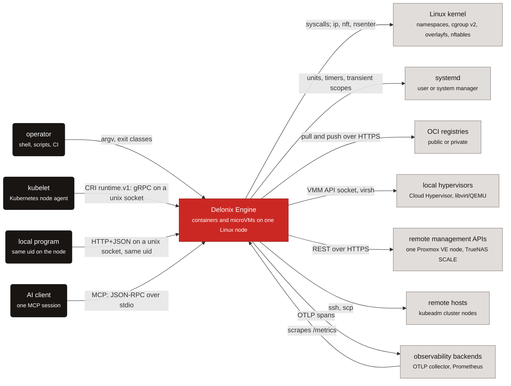

Où se trouve chaque flèche dans le code :

| Flèche | Code |
|---|---|
| opérateur → moteur | `bins/delonix-runtime-bin/src/main.rs` (`main`, `run`) ; classes de sortie dans `crates/foundation/delonix-model/src/exitcode.rs` |
| kubelet → moteur | `crates/interfaces/delonix-cri/src/lib.rs` (`serve_blocking`) |
| programme local → moteur | `crates/interfaces/delonix-mgmt/src/lib.rs` (`serve_blocking`, le routeur `axum`) |
| client d’IA → moteur | `crates/interfaces/delonix-mcp/src/lib.rs` (`serve_stdio`) |
| moteur → noyau | `crates/adapters/delonix-linux/src/lib.rs` (`spawn`, `container_init`) ; `crates/adapters/delonix-sdn/src/infra.rs` (sous-processus `ip`, `nft`, `nsenter`) |
| moteur → systemd | scopes transitoires `busctl` dans `crates/adapters/delonix-linux/src/lib.rs` ; units de démarrage dans `bins/delonix-runtime-bin/src/cmd/boot.rs` |
| moteur → registres | `crates/adapters/delonix-oci/src/registry.rs` (`resolve_or_pull`, `push_to_registry`) |
| moteur → hyperviseurs | `crates/adapters/delonix-vm/src/lib.rs` (`CloudHypervisorBackend`, `LibvirtBackend`) |
| moteur → API de gestion distantes | `crates/providers/delonix-proxmox/src/lib.rs`, `crates/providers/delonix-truenas/src/lib.rs` |
| moteur → hôtes distants | `bins/delonix-runtime-bin/src/cmd/remote.rs` (`ssh`, `scp`), utilisé par `cmd/cluster.rs` |
| moteur ↔ observabilité | `crates/adapters/delonix-telemetry/src/telemetry.rs` (OTLP), routes `/metrics` dans `delonix-mgmt` et `delonix-cri` |

## Niveau 2 — Containers : exécutables et processus

Dans C4, un *container* est quelque chose qui s’exécute. Le build livre quatre exécutables (voir
le compte généré dans le [README du manuel](README.md)) ; plusieurs autres **processus**
apparaissent par workload ou par nœud, chacun avec un propriétaire. Les trois figures ci-dessous
découpent ce tableau par préoccupation : qui entre dans le moteur, ce que coûte un container en
processus, et l’infrastructure réseau rootless.

### Points d’entrée

**Légende**

| Forme | Signification |
|---|---|
| boîte arrondie, sombre | appelant |
| boîte, blanche à bordure rouge | exécutable du moteur |
| cylindre, bleu | état sur disque |
| flèche pleine | requête ou accès fichier, étiqueté |
| flèche pointillée | `exec` ou démarrage d’un processus |
| région encadrée | frontière de processus |

Quatre portes mènent au moteur, mais seul le processus `delonix` à usage unique crée jamais un
container : les serveurs multithreads rappellent la CLI pour cela.

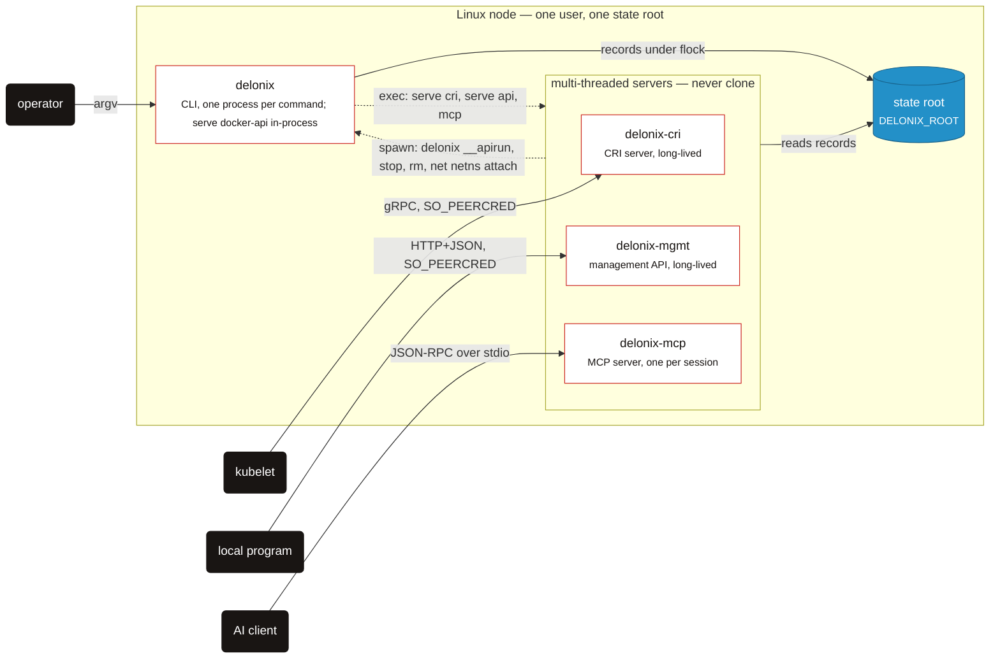

Le `exec` est `cmd/serve.rs::exec_server` (et `cmd/mcp.rs`) ; le rappel est l’assistant
`delonix()` du CRI et `write_run_spec` dans
`crates/interfaces/delonix-cri/src/runtime_svc/lifecycle.rs`, `run_cli` dans `delonix-mgmt` et
`run_cli_blocking` dans `delonix-mcp`, tous résolvant la CLI via
`delonix_node::dispatch::cli_bin`. Le CRI écrit aussi ses propres enregistrements sous `cri/` —
voir [État sur disque](#state-on-disk).

### Un container détaché

**Légende**

| Forme | Signification |
|---|---|
| boîte, blanche à bordure rouge | processus du moteur |
| boîte, grise | système externe |
| cylindre, bleu | fichier sur disque |
| flèche pleine | flux de données ou écriture, étiqueté |
| flèche pointillée | fork, clone ou spawn |
| région encadrée | vit aussi longtemps que le workload |

Un `run -d` laisse derrière lui exactement trois ou quatre processus, et le superviseur — pas un
daemon — est le parent du container.

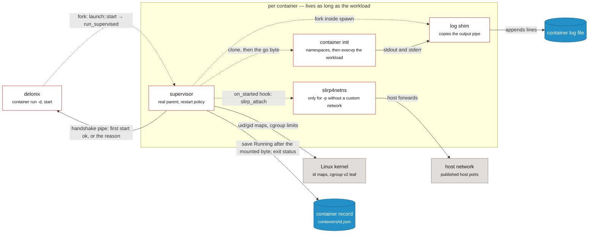

Le superviseur est `crates/adapters/delonix-linux/src/supervise.rs::run_supervised`, choisi par
`delonix_compute::launch::start` via `HostWorkload::supervise`
(`crates/adapters/delonix-linux/src/workload.rs`) ; à l’intérieur, `create_with` → `spawn` fait le
`clone`, le `write_userns_maps`, le cgroup, le hook `on_started` (rempli avec
`delonix_sdn::slirp_attach` par `cmd/container.rs::with_host_workload`) et fait un fork de
`log_shim`, le tout dans `crates/adapters/delonix-linux/src/lib.rs`. L’enregistrement est écrit
via `delonix_state::Store`. Un `run` au premier plan fait la même chose sans le superviseur.

### Infrastructure réseau rootless

**Légende**

| Forme | Signification |
|---|---|
| boîte, blanche à bordure rouge | processus du moteur |
| boîte, grise | système externe |
| cylindre, bleu | état sur disque |
| flèche pleine | requête ou trafic, étiqueté |
| flèche pointillée | spawn (la CLI démarre le processus) |
| région encadrée | les namespaces user, network et mount du pin |

Tout ce dont le réseau rootless a besoin vit dans un même ensemble de namespaces détenu par un
processus qui ne fait que dormir ; le reste peut mourir et être redémarré autour de lui.

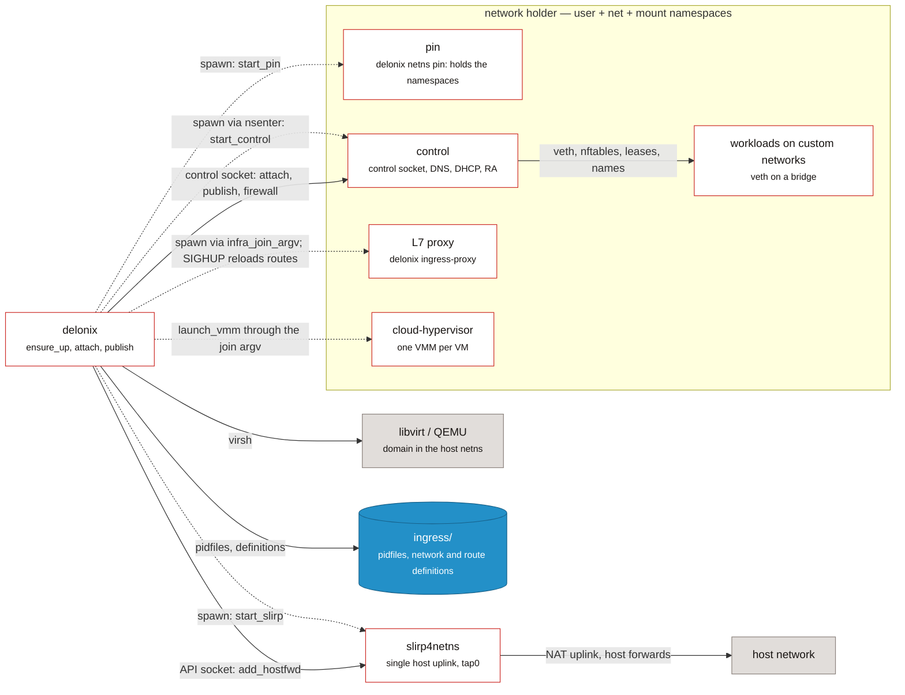

Le pin, le control et l’uplink sont `start_pin`/`pin_main`, `start_control`/`control_main` et
`start_slirp` dans `crates/adapters/delonix-sdn/src/infra.rs` ; les namespaces du pin sont créés
dans `pin_userns.rs`. Le proxy est `cmd/ingress_proxy.rs::spawn_proxy` ; le lancement du VMM est
`delonix_vm::launch_vmm`, auquel le port `VmNetwork` fournit l’argv de jonction. Un container
rejoint un réseau personnalisé en se ré-exécutant lui-même à l’intérieur des namespaces
(`reexec_into_netns`, voir la séquence de run au Niveau 4 ci-dessous). Une VM libvirt vit en
dehors du holder, sur `virbr0` dans le network namespace de l’hôte.

### Table des processus

| Processus | Naît dans | Vit pour |
|---|---|---|
| `delonix` | `bins/delonix-runtime-bin/src/main.rs` (`main`, `run`) | une commande. `main` intercepte les points d’entrée cachés (`netns pin`, `netns control`, `netns run`, `__rmtree`, `__volsnap`, `__ovlmigrate`, `__ovlhold`, `__duusage`, `__buildtar`, `__apirun`, `__netnsconnect`) **avant** que clap ne fasse le parsing |
| `delonix-cri` | `crates/interfaces/delonix-cri/src/bin/delonix-cri.rs` → `delonix_cri::serve_blocking` | un service (typiquement une unit systemd). `delonix serve cri` en fait `exec` (`cmd/serve.rs::exec_server`) |
| `delonix-mgmt` | `bins/delonix-mgmt-bin/src/main.rs` → `delonix_mgmt::serve_blocking` | un service ; `delonix serve api` en fait `exec` |
| `delonix-mcp` | `bins/delonix-mcp-bin/src/main.rs` → `delonix_mcp::serve_stdio` | une session de client d’IA (un processus enfant sur stdio) ; `delonix mcp` en fait `exec` |
| Tranche de l’API Docker | `cmd/serve.rs` → `cmd::dockerapi::run`, **à l’intérieur** du processus `delonix` | tant que `delonix serve docker-api` s’exécute |
| superviseur | `delonix_linux::supervise::run_supervised`, choisi par `delonix_compute::launch::start` pour tout démarrage détaché que l’appelant peut fork | la vie du container ; c’est le vrai parent, il collecte donc le statut de sortie et applique le `--restart` |
| init du container | `delonix_linux::spawn` → `clone` → `container_init` | le container |
| shim de logs | `fork` à l’intérieur de `spawn`, exécutant `log_shim` | le container |
| `slirp4netns` par container | `delonix_sdn::slirp_attach`, appelé comme le hook `on_started` | la netns du container ; les orphelins sont collectés par `reap_orphan_slirp` |
| pin | `infra::start_pin` démarre `delonix netns pin` ; `infra::pin_main` crée les namespaces user, net et mount dans le processus (`crates/adapters/delonix-sdn/src/pin_userns.rs`) et dort | l’infra ; son pid est `ingress/holder.pid` et ne change jamais |
| control | `infra::start_control` (`nsenter -t <pin> -U -m -n -- delonix netns control`) → `infra::control_main` | redémarrable ; sert le socket de contrôle, le DNS (`dns_server_main`), les Router Advertisements (`ra_sender_main`) et le DHCP par bridge (`dhcp_serve`) |
| `slirp4netns` unique | `infra::start_slirp` (`tap0` dans la netns du pin, `--api-socket`) | l’infra |
| proxy d’ingress L7 | `cmd/ingress_proxy.rs::spawn_proxy` via `infra::infra_join_argv` | tant qu’un `HTTPRoute`/`Ingress` ou une route `--expose` existe ; recharge les routes sur `SIGHUP` |
| `cloud-hypervisor` | `delonix_vm::launch_vmm`, exécuté via l’argv de jonction de l’infra | la VM |
| domaine libvirt | `LibvirtBackend` pilotant `virsh` | la VM (le domaine vit dans libvirt) |

`ensure_up` (`crates/adapters/delonix-sdn/src/infra.rs`) est la seule fonction qui remonte l’infra
réseau, sous un verrou de fichier par racine, et elle distingue trois cas : pin et control
vivants (rien à faire) ; pin vivant et control disparu (redémarre **uniquement** le control
plane — aucun câblage ne bouge) ; pin disparu (démonte et reconstruit).

### Un seul ensemble d’opérations, plusieurs interfaces

| Interface | Transport | Entrée | Statut |
|---|---|---|---|
| CLI | argv | `bins/delonix-runtime-bin` | la surface complète |
| CRI (`runtime.v1`) | gRPC sur un socket unix, `0600` + `SO_PEERCRED` | `delonix_cri::serve_blocking` | sert le kubelet |
| API de gestion | HTTP+JSON sur un socket unix, même uid seulement | `delonix_mgmt::serve_blocking` (routes telles que `/v1/containers`, `/v1/volumes`, `/metrics`) | locale uniquement ([ADR-0010](../../adr/0010-remote-management-api.md) a rejeté une API distante) ; destinée à être remplacée par le contrat de nœud |
| MCP | stdio | `delonix_mcp::serve_stdio` | locale, aucun locataire ([ADR-0025](../../adr/0025-mcp-local-ai-control-surface.md)) |
| Tranche de l’API Docker Engine | HTTP sur un socket unix | `cmd::dockerapi::run` | une tranche de compatibilité, à l’intérieur de `delonix` |
| **Contrat de nœud** `delonix.node.v1` | gRPC **et** HTTP/JSON sur un seul socket unix | `proto/delonix/node/v1/` | **contrat seulement** — pas encore de serveur |

Le contrat de nœud est l’API unique visée
([ADR-0040](../../adr/0040-engine-restructuring-layers-ports-node-contract.md) D4,
[ADR-0042](../../adr/0042-one-engine-api-maturity-and-docs.md)). Les fichiers `.proto` sont la source
de vérité ; `docs/api/openapi.yaml` en est **généré** et jamais édité à la main.
`scripts/contract_gate.py` échoue sur : `buf format`, `buf lint`, `buf breaking` contre la
dernière tag portant `proto/`, un RPC sans mappage HTTP (ou un stream bidirectionnel en ayant
un), un document OpenAPI différent du généré, et deux chemins qui sont la même URL sous des noms
de variable différents. Trois règles qu’il protège : un message de requête par RPC, une identité
explicite (`namespace`/`name`) dans la requête, et des images adressées par paramètre de requête.

## Niveau 3 — Composants : crates par couche

### Les couches et la direction autorisée

> **Légende** — boîte blanche à bordure rouge : une couche de crates · flèche pleine : *peut
> dépendre de*, avec l’usage de la dépendance.

Le D1 de l’ADR-0040 fixe une direction de dépendance : les contexts sont dépendus, jamais
l’inverse, et les binaires sont le seul endroit où tout se rencontre.

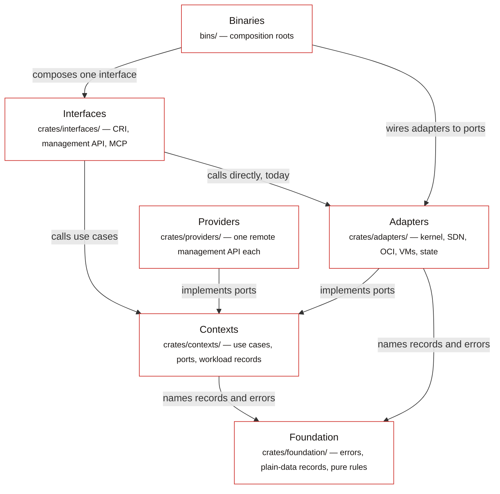

- **Foundation** (`crates/foundation/`) — types partagés, plus ou moins purs, que toute couche
  peut nommer.
- **Contexts** (`crates/contexts/`) — un crate par contexte borné, nommé d’après les groupes
  d’API publiés : les cas d’usage et les **ports** dont ils ont besoin. Pas de HTTP, pas de
  provider, et pas de montages, processus ou configuration réseau. `delonix-node` est le seul
  context qui lit l’hôte directement — `/proc`, `/sys`, `kill(pid, 0)`, `SO_PEERCRED` — parce que
  ces questions sont la raison même de son existence, pour y répondre une fois pour toutes.
- **Adapters** (`crates/adapters/`) et **providers** (`crates/providers/`) — implémentent des
  ports : noyau, SDN, store OCI, backends de VM, état persisté ; les providers apportent un
  client HTTP pour une cible distante.
- **Interfaces** (`crates/interfaces/`) — CRI, API de gestion, MCP : analysent une requête,
  appellent le moteur, présentent.
- **Binaries** (`bins/`) — racines de composition.

La couche à laquelle appartient chaque crate, et la direction dans laquelle il peut dépendre :

<!-- dev-docs:begin layers -->
| Couche | Peut dépendre de |
|---|---|
| Foundation | foundation |
| Contexts | foundation, contexts |
| Adapters | foundation, contexts |
| Providers | foundation, contexts |
| Interfaces | foundation, contexts, adapters, providers |
| Binaries | foundation, contexts, adapters, providers, interfaces |

Exceptions déclarées (chacune nomme la phase de l'ADR-0040 qui la supprime) :

- `delonix-linux` → `delonix-state` — supprimée en **P4a**
- `delonix-mcp` → `delonix-mgmt` — supprimée en **P5**
- `delonix-oci` → `delonix-state` — supprimée en **P4**
- `delonix-opnsense` → `delonix-sdn` — supprimée en **P4**
- `delonix-proxmox` → `delonix-sdn` — supprimée en **P4**
- `delonix-proxmox` → `delonix-vm` — supprimée en **P4**
- `delonix-scanner` → `delonix-oci` — supprimée en **P4**
- `delonix-sdn` → `delonix-state` — supprimée en **P4**
- `delonix-vm` → `delonix-state` — supprimée en **P4**
- `delonix-volume` → `delonix-state` — supprimée en **P4**
<!-- dev-docs:end layers -->

### Où en est la restructuration

L’ADR-0040 est un plan strangler en phases (P0 rails → P1 contrat → P2 contexts → P3 adapters et
binaires → P4 providers → P5 API de nœud → P6 CRI → P7 observabilité). Ce que le code montre
aujourd’hui :

- **La P0 est terminée.** Chaque crate vit dans le répertoire de sa couche, les versions sont au
  niveau du workspace, et le gate de fitness s’exécute en CI.
- **La P1 est terminée en tant que contrat, pas en tant que serveur.**
  `proto/delonix/node/v1/*.proto` existe, le document OpenAPI `docs/api/openapi.yaml` en est
  généré, et `scripts/contract_gate.py` protège les deux. **Rien ne sert encore le contrat** —
  aucun crate ne référence `delonix.node.v1` (l’ADR-0042 D1 dit la même chose).
- **La P2 a commencé.** `delonix-model` (l’`Error` partagé et ses codes `DX_*`, les noms
  générés, les classes de sortie, le dictionnaire de codes numérotés, le modèle de secrets, et —
  depuis la #405 — les enregistrements uniquement-données `Status`, `ContainerFw`/`FwRule` avec
  leurs validateurs, `default_namespace` et le `typestate` du cycle de vie), `delonix-stack`
  (table de Kinds, réconciliateur à 3 voies, révisions) et `delonix-compute` (la spécification
  d’exécution unique `RunOpts`, `resolve_run`, `build_record`, les cas d’usage réseau et de
  lancement) existent. La majeure partie de la logique applicative vit encore dans
  `bins/delonix-runtime-bin/src/cmd/`.
- **La P3 est en cours.** Les ports de compute sont implémentés dans des adapters
  (`HostImages`, `HostVolumes`, `HostDevices`, `HostRuntime`, `HostNetwork`, `HostWorkload`,
  `HostVmNetwork`), la télémétrie a quitté la fondation pour `delonix-telemetry`, `delonix-vm`
  n’atteint le SDN que via le port `VmNetwork`, et les serveurs CRI, API de gestion et MCP sont
  devenus leurs propres exécutables. Quatre adapters portent déjà leurs noms ADR-0040 :
  `delonix-scanner` (était `delonix-scan`), `delonix-oci` (était `delonix-image`), `delonix-sdn`
  (était `delonix-net`) et `delonix-linux` (était `delonix-runtime`, le crate du moteur de
  containers). **La #406 a supprimé `delonix-runtime-core`**, le crate de fondation qui
  contenait auparavant tout ce qui était partagé, en étapes : la **#404** a déplacé les stores,
  les écritures atomiques et le store de secrets chiffré vers l’adapter `delonix-state` ; la
  **#405** a déplacé les enregistrements uniquement-données (`Status`, `ContainerFw`/`FwRule`,
  `typestate`) vers le bas, vers `delonix-model` ; et la **#406** a déplacé les enregistrements
  `Container` et `Vm` (avec `Mount`, les types de santé et de parent-de-cgroup, `DELONIX_SLICE`
  et `workload_net`) vers `delonix-compute`, et le journal d’événements, `virt`, `peer_cred`,
  `dispatch` et les assistants d’hôte/processus (`now_unix`, `is_alive`, `safe_to_signal`,
  `generate_id`, …) vers un nouveau context, `delonix-node`. Aucun ré-export n’a été laissé
  derrière. Les adapters qui ouvrent des enregistrements ou écrivent des fichiers via
  `delonix-state` (`delonix-linux`, `delonix-vm`, `delonix-sdn`, `delonix-oci`,
  `delonix-volume`) sont des exceptions déclarées jusqu’à ce que la P4 leur donne un port
  `StateRepository` (`scripts/arch_fitness.py`).
- **La P4 est en cours ; les P5–P7 n’ont pas commencé.** L’ADR-0044 (accepté le 2026-09-24)
  décide comment la P4 se fait. Le **#420** a apporté le port `StateRepository<T>`
  (`crates/foundation/delonix-model/src/ports.rs`), que `delonix-linux` utilise déjà pour
  `wait_and_record`/`stop`/`persist_stop`/`remove` — d’où son exception `P4a` dans
  `scripts/arch_fitness.py`, qui ne liste que les sites encore ouverts. Le **#486** a ajouté le port
  de provider de VM (`VmSpec`, `Extensions`, `Provider`, `VmProvider` dans
  `crates/contexts/delonix-compute/src/vm_provider.rs`, P4b tranche 1), et `delonix-vm`
  l’implémente pour les deux backends locaux (`LocalVmProvider`,
  `crates/adapters/delonix-vm/src/provider.rs`) en réutilisant son `create_with`/`stop`/`start`
  existant ; déplacer chaque backend dans son propre crate de provider est la P4b tranche 2. Les
  exceptions restantes dans le tableau ci-dessus nomment la phase qui supprime chacune.

### Enregistrements, assistants de nœud et état persisté, après la #406

> **Légende** — boîte blanche à bordure rouge : crate du moteur (ou groupe de crates) · cylindre,
> bleu : fichiers sous la racine d’état · flèche pleine : *utilise*, avec ce qui est utilisé.

Les types uniquement-données vivent dans la fondation, les enregistrements de workload dans le
context Compute, les propres assistants du nœud dans le context Node, et les fichiers qui
contiennent les enregistrements dans un seul adapter à travers lequel tout autre adapter atteint
ces fichiers.

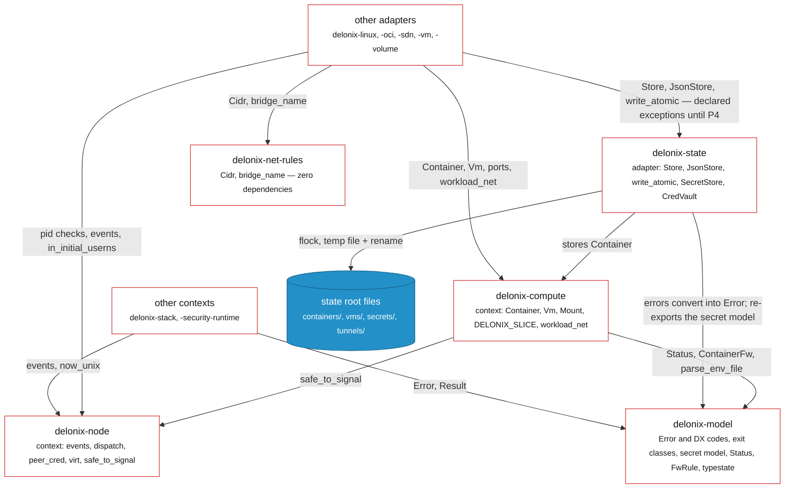

Vérifié contre : `crates/contexts/delonix-compute/src/record.rs` (`use
delonix_model::records::{…}`, `use delonix_node::safe_to_signal`) et `src/lib.rs` (`pub use
record::*`) ; `crates/contexts/delonix-node/src/lib.rs` et `host.rs` ;
`crates/foundation/delonix-model/src/records.rs` et `typestate.rs` ;
`crates/adapters/delonix-state/src/store.rs` (`use delonix_compute::Container`), `secret.rs`,
`cred_vault.rs`, `error.rs`. `delonix-net-rules` n’est utilisé que par `delonix-sdn` et
`delonix-vm` ; `delonix-volume` et `delonix-scanner` nomment aussi `delonix-model` directement (le
graphe généré ci-dessous a chaque arête).

### Ports de Compute et les adapters derrière eux

> **Légende** — boîte blanche à bordure rouge : composant du moteur (cas d’usage, adapter,
> binaire) · région encadrée : le crate de context · flèche pleine : un appel via le port nommé.

`container run` est le chemin de référence : le context décide via des ports, et le binaire
choisit quel adapter répond à chaque port.

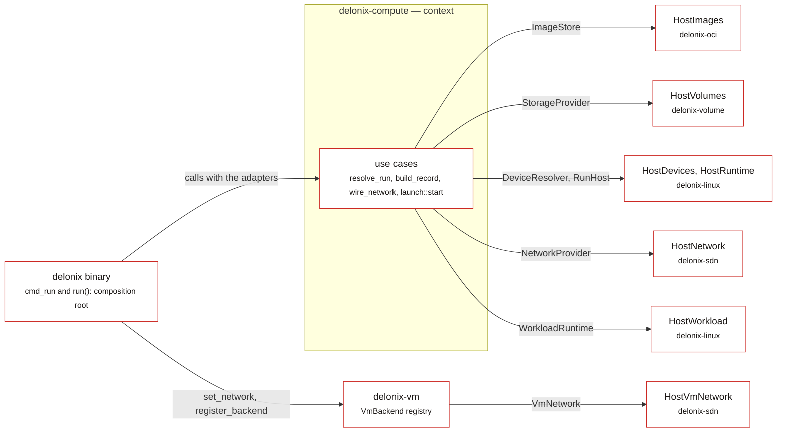

Ports : `crates/contexts/delonix-compute/src/ports.rs` (`ImageStore`, `StorageProvider`,
`DeviceResolver`, `RunHost`, `VmNetwork`, `NetworkProvider`) et `launch.rs` (`WorkloadRuntime`).
Implémentations : `delonix-oci/src/run_images.rs`, `delonix-volume/src/lib.rs`,
`delonix-linux/src/{cdi,run_host,workload}.rs`, `delonix-sdn/src/{run_network,vm_network}.rs`.
Câblage : `bins/delonix-runtime-bin/src/cmd/container.rs::cmd_run` et
`bins/delonix-runtime-bin/src/main.rs::run`.

### Interfaces et binaires

> **Légende** — boîte blanche à bordure rouge : crate du moteur (ou groupe de crates) · flèche
> pleine : un appel Rust direct, avec son usage.

Les serveurs lisent dans leur propre processus et confient chaque fork à la CLI ; la seule arête
interface-vers-interface est une exception déclarée.

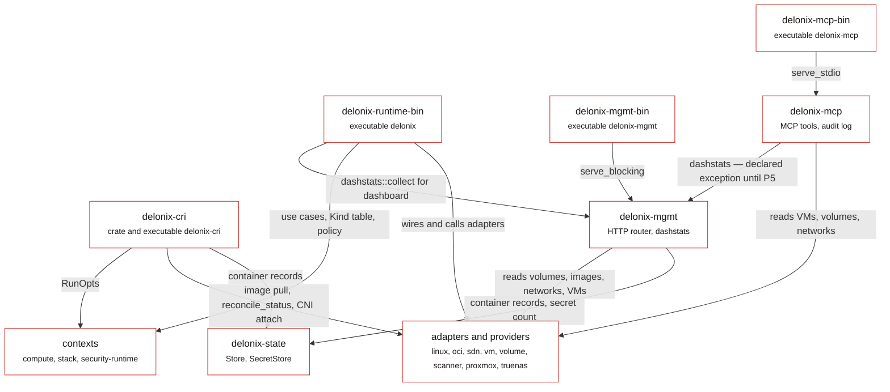

Non dessiné, pour garder la figure lisible : chaque binaire et `delonix-cri`/`delonix-mgmt`
appellent aussi `delonix-telemetry` (`telemetry::init`, métriques), et `delonix-mcp` et la CLI
lisent aussi `delonix-state`. Les arêtes du tableau de bord sont
`bins/delonix-runtime-bin/src/cmd/dash.rs` et `crates/interfaces/delonix-mcp/src/lib.rs`
(`delonix_mgmt::dashstats::collect`) ; l’usage de `RunOpts` par le CRI est `start_run_opts` dans
`runtime_svc/lifecycle.rs`.

### Chaque arête de crate

Le graphe des crates, tel que `Cargo.toml` le déclare. Il est complet et donc dense ; lisez-le
pour répondre « est-ce que A dépend de B », et lisez les figures par couche ci-dessus pour
comprendre pourquoi.

<!-- dev-docs:begin crates-graph -->
**Légende** — une boîte par crate, regroupées par couche ; une flèche `A --> B` signifie *A dépend de B*. Rouge : binaires · blanc à bordure rouge : interfaces · blanc : contextes et adaptateurs · gris : providers · bleu : fondation.

```mermaid
flowchart TB
  subgraph foundation["Foundation"]
    delonix_model["delonix-model"]
    delonix_net_rules["delonix-net-rules"]
  end
  subgraph context["Contexts"]
    delonix_compute["delonix-compute"]
    delonix_node["delonix-node"]
    delonix_security_runtime["delonix-security-runtime"]
    delonix_stack["delonix-stack"]
  end
  subgraph adapter["Adapters"]
    delonix_linux["delonix-linux"]
    delonix_oci["delonix-oci"]
    delonix_scanner["delonix-scanner"]
    delonix_sdn["delonix-sdn"]
    delonix_state["delonix-state"]
    delonix_telemetry["delonix-telemetry"]
    delonix_vm["delonix-vm"]
    delonix_volume["delonix-volume"]
  end
  subgraph provider["Providers"]
    delonix_opnsense["delonix-opnsense"]
    delonix_proxmox["delonix-proxmox"]
    delonix_truenas["delonix-truenas"]
  end
  subgraph interface["Interfaces"]
    delonix_cri["delonix-cri"]
    delonix_mcp["delonix-mcp"]
    delonix_mgmt["delonix-mgmt"]
  end
  subgraph bin["Binaries"]
    delonix_mcp_bin["delonix-mcp-bin"]
    delonix_mgmt_bin["delonix-mgmt-bin"]
    delonix_runtime_bin["delonix-runtime-bin"]
  end
  delonix_compute --> delonix_model
  delonix_compute --> delonix_node
  delonix_cri --> delonix_compute
  delonix_cri --> delonix_linux
  delonix_cri --> delonix_model
  delonix_cri --> delonix_node
  delonix_cri --> delonix_oci
  delonix_cri --> delonix_sdn
  delonix_cri --> delonix_state
  delonix_cri --> delonix_telemetry
  delonix_linux --> delonix_compute
  delonix_linux --> delonix_model
  delonix_linux --> delonix_node
  delonix_linux --> delonix_state
  delonix_mcp --> delonix_compute
  delonix_mcp --> delonix_linux
  delonix_mcp --> delonix_mgmt
  delonix_mcp --> delonix_model
  delonix_mcp --> delonix_node
  delonix_mcp --> delonix_sdn
  delonix_mcp --> delonix_state
  delonix_mcp --> delonix_vm
  delonix_mcp --> delonix_volume
  delonix_mcp_bin --> delonix_mcp
  delonix_mcp_bin --> delonix_node
  delonix_mcp_bin --> delonix_telemetry
  delonix_mgmt --> delonix_compute
  delonix_mgmt --> delonix_linux
  delonix_mgmt --> delonix_model
  delonix_mgmt --> delonix_node
  delonix_mgmt --> delonix_oci
  delonix_mgmt --> delonix_scanner
  delonix_mgmt --> delonix_sdn
  delonix_mgmt --> delonix_state
  delonix_mgmt --> delonix_telemetry
  delonix_mgmt --> delonix_vm
  delonix_mgmt --> delonix_volume
  delonix_mgmt_bin --> delonix_mgmt
  delonix_mgmt_bin --> delonix_node
  delonix_mgmt_bin --> delonix_telemetry
  delonix_node --> delonix_model
  delonix_oci --> delonix_compute
  delonix_oci --> delonix_model
  delonix_oci --> delonix_node
  delonix_oci --> delonix_state
  delonix_opnsense --> delonix_model
  delonix_opnsense --> delonix_sdn
  delonix_proxmox --> delonix_compute
  delonix_proxmox --> delonix_model
  delonix_proxmox --> delonix_sdn
  delonix_proxmox --> delonix_vm
  delonix_runtime_bin --> delonix_compute
  delonix_runtime_bin --> delonix_linux
  delonix_runtime_bin --> delonix_mgmt
  delonix_runtime_bin --> delonix_model
  delonix_runtime_bin --> delonix_node
  delonix_runtime_bin --> delonix_oci
  delonix_runtime_bin --> delonix_opnsense
  delonix_runtime_bin --> delonix_proxmox
  delonix_runtime_bin --> delonix_scanner
  delonix_runtime_bin --> delonix_sdn
  delonix_runtime_bin --> delonix_security_runtime
  delonix_runtime_bin --> delonix_stack
  delonix_runtime_bin --> delonix_state
  delonix_runtime_bin --> delonix_telemetry
  delonix_runtime_bin --> delonix_truenas
  delonix_runtime_bin --> delonix_vm
  delonix_runtime_bin --> delonix_volume
  delonix_scanner --> delonix_model
  delonix_scanner --> delonix_oci
  delonix_sdn --> delonix_compute
  delonix_sdn --> delonix_model
  delonix_sdn --> delonix_net_rules
  delonix_sdn --> delonix_node
  delonix_sdn --> delonix_state
  delonix_security_runtime --> delonix_model
  delonix_security_runtime --> delonix_node
  delonix_stack --> delonix_model
  delonix_state --> delonix_compute
  delonix_state --> delonix_model
  delonix_state --> delonix_node
  delonix_truenas --> delonix_model
  delonix_vm --> delonix_compute
  delonix_vm --> delonix_model
  delonix_vm --> delonix_net_rules
  delonix_vm --> delonix_node
  delonix_vm --> delonix_state
  delonix_volume --> delonix_compute
  delonix_volume --> delonix_model
  delonix_volume --> delonix_node
  delonix_volume --> delonix_state
  class delonix_compute block
  class delonix_cri iface
  class delonix_linux block
  class delonix_mcp iface
  class delonix_mcp_bin engine
  class delonix_mgmt iface
  class delonix_mgmt_bin engine
  class delonix_model store
  class delonix_net_rules store
  class delonix_node block
  class delonix_oci block
  class delonix_opnsense external
  class delonix_proxmox external
  class delonix_runtime_bin engine
  class delonix_scanner block
  class delonix_sdn block
  class delonix_security_runtime block
  class delonix_stack block
  class delonix_state block
  class delonix_telemetry block
  class delonix_truenas external
  class delonix_vm block
  class delonix_volume block
  classDef engine fill:#cc2823,stroke:#8f1b17,color:#ffffff
  classDef iface fill:#ffffff,stroke:#cc2823,stroke-width:2px,color:#191513
  classDef block fill:#ffffff,stroke:#8a817c,color:#191513
  classDef external fill:#e1ddda,stroke:#8a817c,color:#191513
  classDef store fill:#2390c8,stroke:#17618a,color:#ffffff
```
<!-- dev-docs:end crates-graph -->

### Comment les crates communiquent

1. **Appels Rust directs, dans la direction de la couche.** Le cas normal. Par exemple
   `cmd_run` (`cmd/container.rs`) appelle `delonix_compute::run::resolve_run` avec les adapters
   `delonix_oci::run_images::HostImages`, `delonix_volume::HostVolumes`,
   `delonix_linux::cdi::HostDevices` et `delonix_linux::run_host::HostRuntime`, puis
   `delonix_compute::network::{attach_custom_network, wire_network}` avec
   `delonix_sdn::run_network::HostNetwork`, puis `delonix_compute::launch::start` avec
   `delonix_linux::workload::HostWorkload`.
2. **Enregistrement à la racine de composition.** `run()` dans
   `bins/delonix-runtime-bin/src/main.rs` enregistre les backends de VM distants configurés
   (`cmd::vmbackends::register_configured` → `delonix_vm::register_backend`) et l’implémentation
   SDN du port réseau de VM (`delonix_vm::set_network(HostVmNetwork)`) avant qu’aucune commande
   ne s’exécute.
3. **Ré-exécuter le binaire du moteur lui-même.** Encore courant, et compté par le ratchet
   `self_exec_sites`. Les raisons sont réelles :
   - `clone` n’est sûr que dans un processus **monothread**, et les serveurs CRI, API de gestion
     et Docker API sont des runtimes `tokio` multithreads. Ils remettent un `RunOpts` typé dans
     un fichier `0600` à un nouveau `delonix __apirun <spec>` (`lifecycle.rs::write_run_spec`,
     `cmd::dockerapi::run_from_spec_file`).
   - Un processus rootless doit **entrer** dans les namespaces user et mount du pin réseau avant
     qu’un container puisse rejoindre une netns nommée là-bas, donc `reexec_into_netns` exécute
     `nsenter … ip netns exec <netns> delonix netns run <spec>`.
   - Un travail sur des fichiers appartenant à des subuids mappés nécessite un processus à
     l’intérieur d’un user namespace mappé (`delonix_linux::reexec_mapped`,
     `reexec_mapped_hold`, `remove_tree_mapped` → les points d’entrée
     `__rmtree`/`__ovlhold`/…).
   - Les serveurs construisent encore certaines invocations de CLI (`delonix-mgmt`, le
     `run_cli_blocking` de `delonix-mcp`, l’assistant `delonix()` du CRI), résolvant la CLI via
     `delonix_node::dispatch::cli_bin` (`DELONIX_BIN`, puis un `delonix` voisin, puis le
     `PATH`) — jamais leur propre exécutable.
   Le D2.4/D5 de l’ADR-0040 prévoit un exécutable `delonix-launcher` recevant une spec typée,
   pour que ceux-ci deviennent des appels de cas d’usage plus un spawn.
4. **Le socket de contrôle.** Tout ce qui se passe à l’intérieur de la netns rootless de
   l’infra est fait par le processus control : `infra::control_send`/`control_query` écrivent
   une ligne (`attach …`, `publish …`, `firewall …`) sur un socket unix `0600` ; `control_loop`
   n’accepte que les pairs ayant le même uid que le moteur (`SO_PEERCRED`) et ne sert qu’une
   connexion à la fois, si bien que les opérations netns/veth/nftables ne s’entrelacent jamais.
5. **Sous-processus vers des outils de l’hôte**, dans des adapters : `ip`, `nft`, `nsenter`,
   `slirp4netns` (`delonix-sdn`), `newuidmap`/`newgidmap` (`delonix-linux`, `pin_userns`),
   `qemu-img`, `virsh`, `cloud-localds` (`delonix-vm`), `busctl` pour les scopes transitoires
   systemd (`delonix-linux`), `ssh`/`scp` (`cmd/remote.rs`).
6. **Le HTTP vers un système de gestion distant ne vit que dans les providers.**
   `delonix-proxmox` et `delonix-truenas` dépendent de `reqwest` pour cela. Deux adapters
   parlent aussi HTTP, pour d’autres raisons : `delonix-oci` a son propre client de registre OCI
   (`src/registry.rs`, `reqwest` dans son `Cargo.toml`), et `delonix-telemetry` exporte OTLP sur
   HTTP. Aucun crate de context ne le fait.

## État sur disque

Il n’y a pas de base de données. L’état, ce sont des fichiers sous une **racine d’état** :

- `DELONIX_ROOT` quand elle est définie ; sinon `$XDG_DATA_HOME/delonix` ou
  `~/.local/share/delonix` pour un utilisateur non privilégié et `/var/lib/delonix` pour root
  (`bins/delonix-runtime-bin/src/cmd/util.rs::state_root` → `ImageStore::default_root` ;
  `infra::base_root` résout la même règle côté réseau).
- **Les sockets ne vivent pas sous la racine d’état.** Ils se trouvent dans un répertoire de
  runtime court par utilisateur (`infra::runtime_dir`, redéfinissable avec
  `DELONIX_NET_RUNTIME_DIR`) car les chemins `AF_UNIX` ont une longueur limitée ; une racine
  non par défaut obtient un suffixe haché (`root_suffix`) pour que deux racines sur une même
  connexion ne partagent jamais de sockets. **Quand vous exécutez quoi que ce soit en
  isolation, définissez les deux variables.**

| Chemin sous la racine | Quoi | Code |
|---|---|---|
| `containers/<id>.json` | un enregistrement JSON par container | `delonix_state::Store` (`delonix-state/src/store.rs`) |
| `containers/<id>/{upper,work,merged}` + `overlay-lowers` | la couche inscriptible du container et la liste des couches d’image partagées qu’il monte | `ImageStore::prepare_overlay` (`delonix-oci/src/overlay.rs`) |
| `images/<id>.json`, `layers/<hex>/`, `blobs/sha256/<hex>` | métadonnées d’image, couches décompressées partagées par tous les containers, blobs adressés par contenu | `ImageStore::open` (`image.rs`), `Cas` (`cas.rs`) |
| `volumes/<name>/_data`, `volumes/.ns/<ns>/` | volumes nommés, volumes limités par namespace | `VolumeStore` (`delonix-volume/src/lib.rs`) |
| `vms/` | enregistrements de VM (`delonix_state::JsonStore<Vm>`) et fichiers par VM | `delonix-vm` |
| `vm-images/` | images de VM (`.qcow2` + `.json`) | `cmd/vmimage.rs::VmImageStore` |
| `secrets/` | secrets chiffrés | `SecretStore` (`delonix-state/src/secret.rs`) |
| `tunnels/keyring.key`, `tunnels/cred/` | la clé maîtresse de l’hôte et les identifiants chiffrés | `CredVault` (`delonix-state/src/cred_vault.rs`) |
| `ingress/` | pidfiles (`holder.pid` est le pin), marqueurs `refs/`, définitions de réseau et de route, logs | `delonix-sdn/src/infra.rs` |
| `hosts-sync` | fichier marqueur : `delonix hosts sync` a été exécuté, donc les noms de service des containers `--expose` sont conservés dans le `/etc/hosts` de l’hôte (il est à la racine, pas sous `ingress/`) | `hosts_sync_flag` dans `cmd/ingress_proxy.rs` |
| `ipam/` | baux d’adresse par préfixe | `delonix-sdn/src/ipam.rs` |
| `cri/{sandboxes,containers}/` | les propres enregistrements du CRI | `delonix-cri/src/runtime_svc/lifecycle.rs` (`sb_dir`, `ct_dir`) |
| `clusters/` | kubeconfigs, clés et PKI des clusters | `cmd/cluster.rs` |
| `events.jsonl` | journal d’événements ajout-seul | `delonix_node::events` |

La concurrence est gérée par le système de fichiers, car plusieurs processus (la CLI, le serveur
CRI, un superviseur) mutent les mêmes enregistrements : les écritures sont atomiques (fichier
temporaire + `rename`, `delonix_state::write_atomic`), et la lecture-modification-écriture passe
par `Store::update` / `JsonStore::update`, qui prennent un `flock` exclusif et **refusent**
d’avancer sans lui. Tout cela vit dans l’adapter `delonix-state`. Les types d’enregistrement
qu’il stocke sont définis ailleurs : `Container` et `Vm` dans le context `delonix-compute`, et les
parties uniquement-données d’un enregistrement (`Status`, `ContainerFw`/`FwRule`) dans le crate de
fondation `delonix-model`. L’infra réseau a son propre `FileLock` autour de `ensure_up`,
`teardown`, `acquire`, `release` et les reapers.

Comme rien de résident ne surveille les processus, un enregistrement disant `Running` peut être
obsolète. Les lecteurs réconcilient : `delonix_linux::reconcile_status` vérifie le pid avec son
heure de démarrage (`delonix_node::safe_to_signal`) pour qu’un pid recyclé ne soit jamais pris
pour le container.

## Niveau 4 — Deux flux, en séquences

Le Niveau 4 n’est dessiné que là où l’ordre des étapes est le point important. Les deux flux
ci-dessous sont des séquences plutôt que des figures de structure.

### `container run -d --net web -p 8080:80 nginx`, rootless

Chaque flèche ci-dessous est un appel dans `cmd_run`
(`bins/delonix-runtime-bin/src/cmd/container.rs`) ou dans les fonctions qu’il atteint.

> **Légende** — les participants sont des processus ; les flèches pleines sont des appels, des
> lignes de socket ou des spawns (l’étiquette dit lequel) ; les flèches pointillées sont des
> réponses ; une auto-flèche est un travail interne à ce processus ; les notes marquent ce qui
> reste derrière.

Un réseau personnalisé force un second passage de la CLI à l’intérieur des namespaces du pin, et
l’enregistrement n’est publié qu’une fois les montages du container finaux.

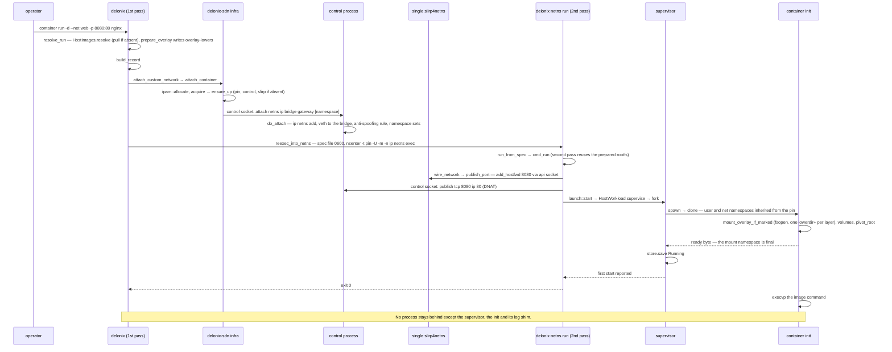

Sans réseau personnalisé, le flux n’a pas de second passage : `spawn` crée son propre user
namespace, et le parent écrit les maps d’id (`write_userns_maps`), configure le cgroup, exécute
le hook `on_started` (le `slirp_attach` par container quand il y a des ports `-p`) et envoie
seulement ensuite l’octet « go » à l’enfant.

### CRI : `RunPodSandbox` → `CreateContainer` → `StartContainer`

Depuis `crates/interfaces/delonix-cri/src/runtime_svc/lifecycle.rs`.

> **Légende** — les participants sont des processus, plus la racine d’état comme participant ;
> les flèches pleines sont des appels gRPC, des appels internes, des sous-processus ou des
> écritures de fichiers (l’étiquette dit lequel) ; les flèches pointillées sont des réponses ;
> les boîtes `alt` sont les modes réseau mutuellement exclusifs.

Le serveur CRI enregistre et décide, mais chaque démarrage de container traverse vers un nouveau
processus `delonix`.

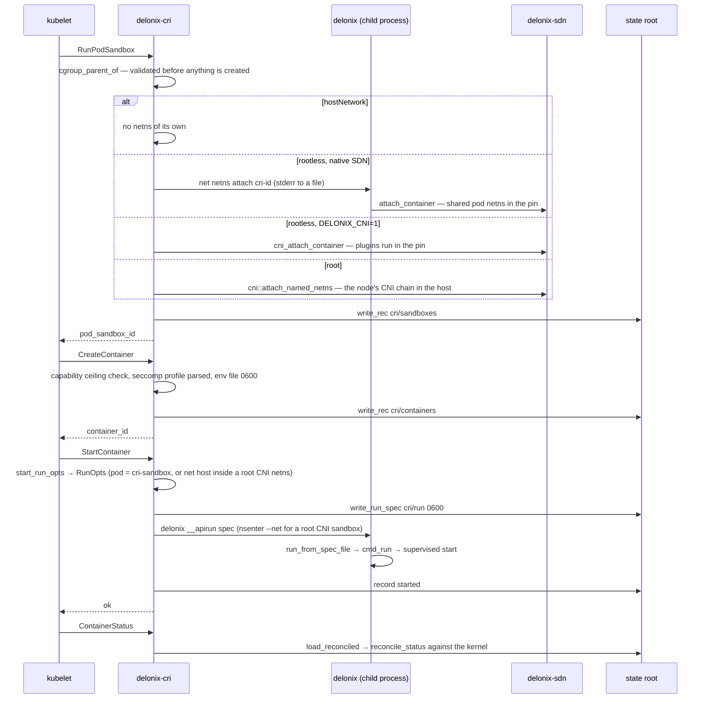

## Limitations connues

> **Note — le contrat de nœud n’est pas servi.** `proto/delonix/node/v1` est protégé par un gate
> et génère OpenAPI, mais aucun processus n’y répond. Les intégrations actuelles utilisent la
> CLI, le CRI, l’API de gestion locale ou le MCP.

> **Note — les serveurs exécutent encore la CLI.** `delonix-cri`, `delonix-mgmt` et
> `delonix-mcp` démarrent les workloads en ré-exécutant `delonix`. Cela maintient `clone` hors des
> processus multithreads, au prix d’un processus par opération et d’un texte d’erreur traversant
> une frontière de processus.

> **Note — les adapters atteignent encore directement les fichiers d’état.** `delonix-linux`,
> `delonix-vm`, `delonix-sdn`, `delonix-oci` et `delonix-volume` dépendent de `delonix-state`
> comme exceptions déclarées. Le port `StateRepository` qui les supprime existe depuis le #420
> (`delonix-model/src/ports.rs`, ADR-0044 D6), et pour l’instant seul `delonix-linux` passe par lui
> pour une partie de son cycle de vie ; les quatre autres ouvrent les stores directement jusqu’à
> l’arrivée de leur tranche de la P4.

> **Note — `macvlan`/`ipvlan` sont déclarés, pas réalisés.** `network create` les enregistre et
> rapporte `Realized=False` avec la raison `DriverNotImplemented`
> (`bins/delonix-runtime-bin/src/cmd/network.rs`) : leur plan physique nécessite
> `CAP_NET_ADMIN` dans le network namespace initial de l’hôte.

> **Note — la récupération après la mort du pin se fait par redémarrage.** Si le processus
> control meurt, `ensure_up` ne redémarre que lui et aucun workload ne bouge. Si le **pin**
> meurt, la netns est reconstruite et `delonix net netns up` redémarre les containers et
> membres de pod échoués (`cmd/netns.rs::reconcile_after_respawn`, qui ne lit que le store de
> containers — les VM ne sont pas récupérées de cette façon).

> **Note — l’IPv6 dans le SDN est désactivé par défaut.** Le pare-feu d’ingress est `table ip` ;
> le holder installe une `table ip6` qui rejette tout (`infra::ingress_v6_refusal_ruleset`) et
> désactive l’IPv6 à l’intérieur des netns de container sauf si `DELONIX_ENABLE_IPV6=1`
> (`ipv6_sdn_enabled`).

> **Note — un appelant qui ne peut pas fork démarre sans supervision.**
> `launch::should_supervise` exige `detach && forkable` ; sans superviseur, personne n’est le
> parent du processus et le vrai code de sortie ne peut pas être collecté.

## Par où commencer à lire

| Domaine | Commencez ici |
|---|---|
| Entrée de la CLI et points d’entrée de ré-exécution cachés | `bins/delonix-runtime-bin/src/main.rs` (`main`, `run`) |
| `container run` de bout en bout | `cmd/container.rs::cmd_run`, puis `delonix-compute/src/{run,network,launch}.rs` |
| Création de processus, namespaces, rootfs, seccomp, cgroups | `delonix-linux/src/lib.rs` (`spawn`, `container_init`, `setup_rootfs`, `setup_cgroup`), `supervise.rs`, `launch_spec.rs` |
| Réseau rootless | `delonix-sdn/src/infra.rs` (`ensure_up`, `control_main`, `attach_container`, `publish_port`, `ingress_table_ruleset`, `fw_chain_body`), `pin_userns.rs`, `ipam.rs` |
| Images | `delonix-oci/src/{registry,cas,image,overlay,build}.rs` |
| VM | `delonix-vm/src/lib.rs` (`VmBackend`, `builtin_backends`, `register_backend`, `select_backend`), `cloudinit.rs` ; `cmd/vm.rs`, `cmd/vmimage.rs` |
| Apply déclaratif | `delonix-stack/src/{kinds,reconcile}.rs` ; `cmd/stack.rs`, `cmd/manifest.rs` |
| Enregistrements, erreurs, état persisté | `delonix-compute/src/record.rs` (`Container`, `Vm`), `delonix-model/src/{records,error,exitcode}.rs`, `delonix-state/src/{store,secret}.rs` |
| CRI | `delonix-cri/src/lib.rs::serve_blocking`, `runtime_svc.rs`, `runtime_svc/lifecycle.rs` |
| API de gestion / MCP | `delonix-mgmt/src/lib.rs`, `delonix-mcp/src/lib.rs` |
| Contrat de nœud | `proto/delonix/node/v1/`, `scripts/contract_gate.py`, `docs/api/openapi.yaml` |
| Règles d’architecture | `scripts/arch_fitness.py`, ADR-0040 |

---

**Suivant :** [Les crates](crates.md) — une section par crate : ce qu’il possède, ses types principaux, par où commencer à lire et les pièges pour lesquels il a déjà payé.
