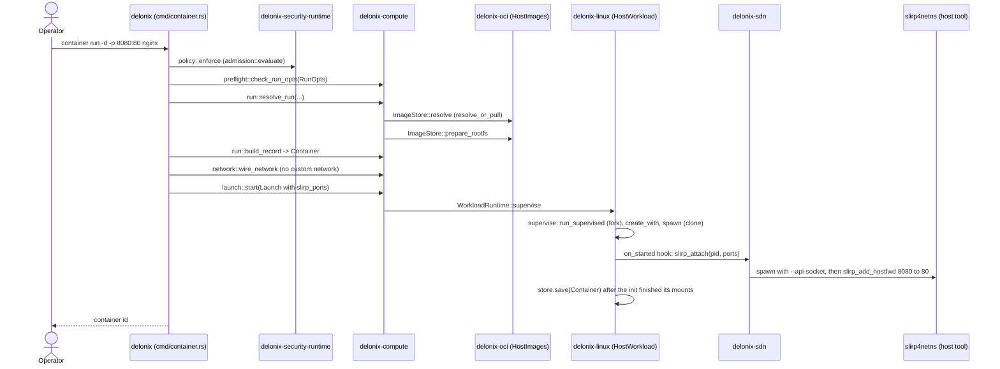
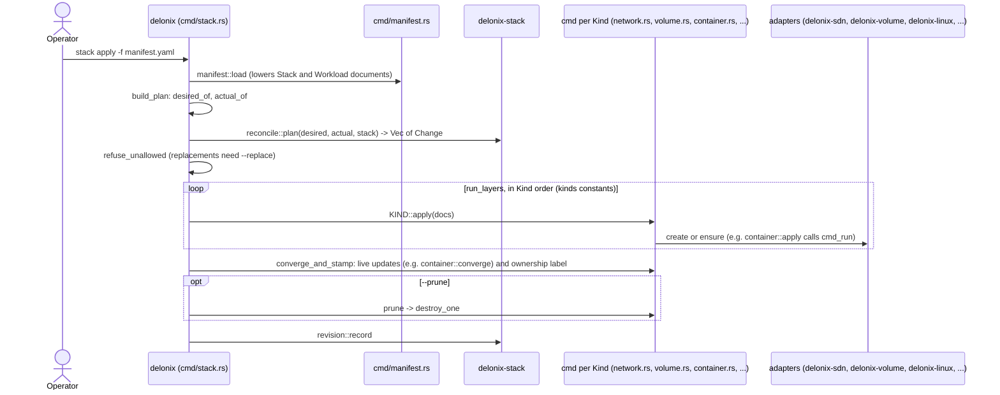
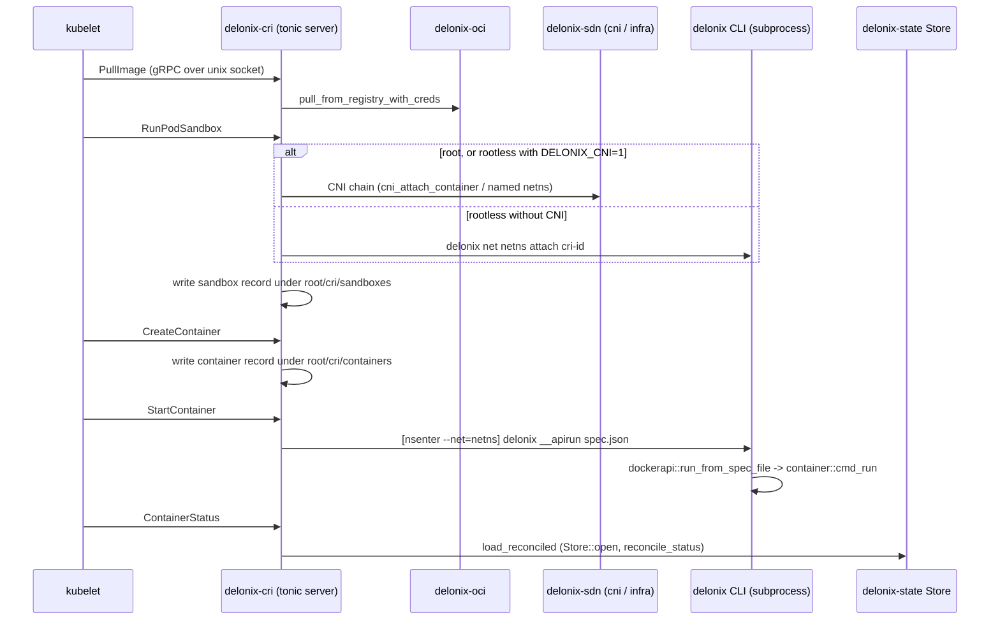

<!-- translated-from: crates.md sha256:7cf95952ecf9b721f67f7f193df0b680bdffce7891f98512953820df6d6bdb36 -->
# Les crates

Cette page est la carte que vous gardez ouverte en lisant le code. Le tableau ci-dessous est
généré à partir de `Cargo.toml` et de `scripts/arch_fitness.py` ; tout ce qui suit est écrit à la
main, et chaque pointeur (`path:symbol`) a été lu dans l'arborescence avant d'être consigné.
Lorsqu'une affirmation n'a pas pu être confirmée, elle ne figure pas ici.

Comment l'utiliser :

- Trouvez le crate responsable de ce que vous voulez modifier (la couche d'abord ; voir
  [Architecture](architecture.md) pour savoir pourquoi les couches existent et dans quelle
  direction une dépendance peut pointer).
- Lisez sa liste **Commencer la lecture par** dans l'ordre, puis ses **Pièges** : chacun est un
  piège que ce code a déjà payé, et le commentaire qui le consigne se trouve toujours dans le
  fichier.
- Avant d'ajouter une ligne `use delonix_…`, consultez le tableau : une arête qui ne figure pas dans
  la colonne « Depends on » fera échouer `scripts/arch_fitness.py`, sauf si elle va dans la direction
  autorisée.

Deux conventions que vous rencontrerez partout :

- **Pur ou à effet.** Les contextes et les crates de fondation décident ; les adaptateurs touchent au
  noyau, au disque, à un sous-processus ou au réseau. Lorsqu'un cas d'usage d'un contexte a besoin
  d'un effet, il déclare un *port* (un trait) et un adaptateur l'implémente. La racine de
  composition qui relie les ports aux adaptateurs est le binaire `delonix`.
- **« Communique avec » désigne le mécanisme, pas seulement la dépendance.** Un crate peut dépendre
  d'un autre et pourtant l'atteindre en exécutant le binaire `delonix` comme sous-processus (le CRI et
  l'API de gestion locale le font pour tout ce qui fork), ou en écrivant une ligne sur une socket de
  contrôle unix (le holder réseau).

## Tableau de référence

<!-- dev-docs:begin crates-table -->
| Crate | Couche | Chemin | Binaires | Dépend de (crates du moteur) | Utilisé par |
|---|---|---|---|---|---|
| `delonix-model` | Foundation | `crates/foundation/delonix-model` | — | — | `delonix-compute`, `delonix-cri`, `delonix-linux`, `delonix-mcp`, `delonix-mgmt`, `delonix-node`, `delonix-oci`, `delonix-proxmox`, `delonix-runtime-bin`, `delonix-scanner`, `delonix-sdn`, `delonix-security-runtime`, `delonix-stack`, `delonix-state`, `delonix-truenas`, `delonix-vm`, `delonix-volume` |
| `delonix-net-rules` | Foundation | `crates/foundation/delonix-net-rules` | — | — | `delonix-sdn`, `delonix-vm` |
| `delonix-compute` | Contexts | `crates/contexts/delonix-compute` | — | `delonix-model`, `delonix-node` | `delonix-cri`, `delonix-linux`, `delonix-mcp`, `delonix-mgmt`, `delonix-oci`, `delonix-proxmox`, `delonix-runtime-bin`, `delonix-sdn`, `delonix-state`, `delonix-vm`, `delonix-volume` |
| `delonix-node` | Contexts | `crates/contexts/delonix-node` | — | `delonix-model` | `delonix-compute`, `delonix-cri`, `delonix-linux`, `delonix-mcp`, `delonix-mcp-bin`, `delonix-mgmt`, `delonix-mgmt-bin`, `delonix-oci`, `delonix-runtime-bin`, `delonix-sdn`, `delonix-security-runtime`, `delonix-state`, `delonix-vm`, `delonix-volume` |
| `delonix-security-runtime` | Contexts | `crates/contexts/delonix-security-runtime` | — | `delonix-model`, `delonix-node` | `delonix-runtime-bin` |
| `delonix-stack` | Contexts | `crates/contexts/delonix-stack` | — | `delonix-model` | `delonix-runtime-bin` |
| `delonix-linux` | Adapters | `crates/adapters/delonix-linux` | — | `delonix-compute`, `delonix-model`, `delonix-node`, `delonix-state` | `delonix-cri`, `delonix-mcp`, `delonix-mgmt`, `delonix-runtime-bin` |
| `delonix-oci` | Adapters | `crates/adapters/delonix-oci` | — | `delonix-compute`, `delonix-model`, `delonix-node`, `delonix-state` | `delonix-cri`, `delonix-mgmt`, `delonix-runtime-bin`, `delonix-scanner` |
| `delonix-scanner` | Adapters | `crates/adapters/delonix-scanner` | — | `delonix-model`, `delonix-oci` | `delonix-mgmt`, `delonix-runtime-bin` |
| `delonix-sdn` | Adapters | `crates/adapters/delonix-sdn` | — | `delonix-compute`, `delonix-model`, `delonix-net-rules`, `delonix-node`, `delonix-state` | `delonix-cri`, `delonix-mcp`, `delonix-mgmt`, `delonix-runtime-bin` |
| `delonix-state` | Adapters | `crates/adapters/delonix-state` | — | `delonix-compute`, `delonix-model`, `delonix-node` | `delonix-cri`, `delonix-linux`, `delonix-mcp`, `delonix-mgmt`, `delonix-oci`, `delonix-runtime-bin`, `delonix-sdn`, `delonix-vm`, `delonix-volume` |
| `delonix-telemetry` | Adapters | `crates/adapters/delonix-telemetry` | — | — | `delonix-cri`, `delonix-mcp-bin`, `delonix-mgmt`, `delonix-mgmt-bin`, `delonix-runtime-bin` |
| `delonix-vm` | Adapters | `crates/adapters/delonix-vm` | — | `delonix-compute`, `delonix-model`, `delonix-net-rules`, `delonix-node`, `delonix-state` | `delonix-mcp`, `delonix-mgmt`, `delonix-proxmox`, `delonix-runtime-bin` |
| `delonix-volume` | Adapters | `crates/adapters/delonix-volume` | — | `delonix-compute`, `delonix-model`, `delonix-node`, `delonix-state` | `delonix-mcp`, `delonix-mgmt`, `delonix-runtime-bin` |
| `delonix-proxmox` | Providers | `crates/providers/delonix-proxmox` | — | `delonix-compute`, `delonix-model`, `delonix-vm` | `delonix-runtime-bin` |
| `delonix-truenas` | Providers | `crates/providers/delonix-truenas` | — | `delonix-model` | `delonix-runtime-bin` |
| `delonix-cri` | Interfaces | `crates/interfaces/delonix-cri` | `delonix-cri` | `delonix-compute`, `delonix-linux`, `delonix-model`, `delonix-node`, `delonix-oci`, `delonix-sdn`, `delonix-state`, `delonix-telemetry` | — |
| `delonix-mcp` | Interfaces | `crates/interfaces/delonix-mcp` | — | `delonix-compute`, `delonix-linux`, `delonix-mgmt`, `delonix-model`, `delonix-node`, `delonix-sdn`, `delonix-state`, `delonix-vm`, `delonix-volume` | `delonix-mcp-bin` |
| `delonix-mgmt` | Interfaces | `crates/interfaces/delonix-mgmt` | — | `delonix-compute`, `delonix-linux`, `delonix-model`, `delonix-node`, `delonix-oci`, `delonix-scanner`, `delonix-sdn`, `delonix-state`, `delonix-telemetry`, `delonix-vm`, `delonix-volume` | `delonix-mcp`, `delonix-mgmt-bin`, `delonix-runtime-bin` |
| `delonix-mcp-bin` | Binaries | `bins/delonix-mcp-bin` | `delonix-mcp` | `delonix-mcp`, `delonix-node`, `delonix-telemetry` | — |
| `delonix-mgmt-bin` | Binaries | `bins/delonix-mgmt-bin` | `delonix-mgmt` | `delonix-mgmt`, `delonix-node`, `delonix-telemetry` | — |
| `delonix-runtime-bin` | Binaries | `bins/delonix-runtime-bin` | `delonix` | `delonix-compute`, `delonix-linux`, `delonix-mgmt`, `delonix-model`, `delonix-node`, `delonix-oci`, `delonix-proxmox`, `delonix-scanner`, `delonix-sdn`, `delonix-security-runtime`, `delonix-stack`, `delonix-state`, `delonix-telemetry`, `delonix-truenas`, `delonix-vm`, `delonix-volume` | — |
<!-- dev-docs:end crates-table -->

## Fondation

Les crates de fondation ne portent aucun mécanisme : des types, des règles pures et le format de
l'état sur disque. Ils ne peuvent dépendre que d'autres crates de fondation. Les fichiers qui contiennent ces
enregistrements ne sont pas ici : ils sont lus et écrits par l'adaptateur `delonix-state`.

### `delonix-runtime-core`

**Rôle.** Le vocabulaire partagé du moteur : les enregistrements persistés (`Container`, `Vm`), leur
`Status`, le type d'erreur que renvoie chaque crate (défini dans `delonix-model` et réexporté ici
sous le même chemin). Il contient aussi les petites pièces transverses dont plus d'un crate a besoin
et qui seraient sinon copiées : la vérification `SO_PEERCRED` pour les sockets locales, le journal
d'événements en ajout seul, et la règle que suit un binaire serveur lorsque `delonix` l'exécute. Il ne
crée **pas** de processus, ne monte rien et ne configure pas le réseau, et il n'a aucune notion de
tenant, de plan ou de facturation (la documentation du crate le dit, et le reste du workspace s'appuie
dessus).

Les stores (`Store`, `JsonStore<T>`), les utilitaires d'écriture atomique et le store de secrets
chiffré (`SecretStore`, `CredVault`) **ont quitté ce crate** pour `delonix-state` (ADR-0040 P3) ; le
modèle pur des secrets (`Secret`, `valid_name`, `valid_env_key`, `parse_env_file`) est allé dans
`delonix-model`. Plus rien d'eux n'est réexporté ici : `src/lib.rs` ne réexporte que
`delonix_model::{Error, Result}`, de sorte qu'un point d'appel qui utilisait
`delonix_runtime_core::Store` importe désormais `delonix_state::Store`.

**Modules clés**

| Module | Responsabilité |
|---|---|
| `lib.rs` | `Container`, `Vm`, `Status`, `Mount`, `ContainerFw`/`FwRule`, configuration de santé, analyse du cgroup parent, `generate_id`, utilitaires de vivacité des pid |
| `events` | journal d'événements `events.jsonl` en ajout seul (`emit`, `read`) |
| `dispatch` | vérification de version et résolution de la CLI pour les binaires serveurs exécutés par `delonix` |
| `peer_cred` | `peer_uid` à partir de `SO_PEERCRED` |
| `typestate` | phases du cycle de vie à la compilation (`Phase<Created/Running/Stopped>`) |
| `virt` | détection de la virtualisation/virtio depuis `/sys` et `/proc` |
| `workload_net` | la plage IPv4 des charges de travail, définie une seule fois |

**API publique principale**

| Élément | Ce que c'est | Où |
|---|---|---|
| `Container` | l'enregistrement de container que tout le monde lit et écrit | `crates/foundation/delonix-runtime-core/src/lib.rs:Container` |
| `Vm` | l'enregistrement de VM | `crates/foundation/delonix-runtime-core/src/lib.rs:Vm` |
| `Status` | l'état du cycle de vie d'une charge de travail | `crates/foundation/delonix-runtime-core/src/lib.rs:Status` |
| `Error`, `Result` | l'erreur que renvoie chaque crate du moteur, réexportée depuis `delonix-model` | `crates/foundation/delonix-runtime-core/src/lib.rs` (`pub use delonix_model::{Error, Result}`) |
| `events::emit` | ajoute une ligne d'événement | `crates/foundation/delonix-runtime-core/src/events.rs:emit` |
| `dispatch::check_version`, `dispatch::cli_bin` | comment `delonix-cri`/`-mgmt`/`-mcp` refusent une release non concordante et trouvent la CLI `delonix` à rappeler | `crates/foundation/delonix-runtime-core/src/dispatch.rs` |
| `is_alive`, `proc_starttime`, `safe_to_signal` | vérifications de pid qui résistent au recyclage des pid | `crates/foundation/delonix-runtime-core/src/lib.rs` |

**Communique avec.** `delonix-model` uniquement, pour les `Error`/`Result` qu'il réexporte. Aucun
sous-processus : la détection lit directement `/sys` et `/proc`.

**Dépendances externes notables.** `serde`/`serde_json` (les types d'enregistrement les dérivent),
`thiserror`, `libc`. Les dépendances de chiffrement (`chacha20poly1305`, `getrandom`) sont parties
avec le store de secrets dans `delonix-state`.

**Tests.** Modules `#[cfg(test)]` intégrés dans les fichiers source ; pas de répertoire `tests/`.

**Commencer la lecture par.** `src/lib.rs` (les structs `Container` et `Vm`), puis
`src/dispatch.rs`. Pour la manière dont les enregistrements sont stockés, voir `delonix-state`.

**Pièges.**

- `Container.userns` indique si le container a **créé** son propre user namespace, et non s'il
  s'exécute dans un namespace différent. Les charges de travail qui rejoignent le user namespace du
  holder réseau ont `userns = false` et se trouvent pourtant dans un user namespace différent de
  celui de l'appelant. `mount_live` dans `delonix-linux` le consigne et ouvre toujours le namespace
  `user` au lieu de faire confiance au champ (`crates/adapters/delonix-linux/src/lib.rs:mount_live`).
- `Container.ip` est l'adresse sur le réseau **principal** uniquement ; un container multi-homé en a
  davantage (voir le commentaire de documentation de `NetPlan` dans
  `crates/adapters/delonix-sdn/src/infra.rs` et `apply_firewall_all`, qui existe parce que filtrer
  uniquement l'IP principale était contournable).
- La description du crate dans `Cargo.toml` dit encore qu'il contient le « Secret Manager » et le
  « Store », et la documentation du crate dans `src/lib.rs` dit encore « shared types, state and
  errors ». Les deux sont antérieures au déplacement vers `delonix-state` ; la liste des modules fait
  foi.
- `Container::cgroup()` est le chemin statique du mode root. Pour un container rootless en cours
  d'exécution, le vrai cgroup est lu dans `/proc/<pid>/cgroup` par `delonix_linux::live_cgroup`.

### `delonix-model`

**Rôle.** La partie du modèle que toute couche peut nommer sans dépendre d'un mécanisme : le type
`Error` partagé du moteur avec le code `DX_*` stable de chaque variante, les noms générés des charges
de travail, la correspondance d'une `Error` vers un code de sortie de processus, le dictionnaire des
codes numérotés `DX-CDNN`, et le modèle des secrets (ce qu'est un secret et à quoi ressemblent un nom
et une clé valides). Pur — aucune I/O, aucun état de processus (documentation du crate). Il ne
contient pas d'enregistrements ; ceux-ci se trouvent dans `delonix-runtime-core`, et les fichiers qui
les stockent sont dans `delonix-state`.

**Modules clés**

| Module | Responsabilité |
|---|---|
| `error` | `Error`, `Result` et `Error::code` (la chaîne `DX_*` de chaque variante) |
| `exitcode` | classes de codes de sortie (`NOT_RUNNING`, `NOT_FOUND`, `CONFLICT`, …) et `for_error` |
| `names` | noms par défaut (`derived_name`, `random_name`) |
| `codes` | le dictionnaire des codes numérotés `DX-CDNN` (ADR-0043) : chiffre de classe, chiffre de domaine, numéro |
| `secret` | `Secret` et les règles pures `valid_name`, `valid_env_key`, `parse_env_file` ; le store chiffré est `delonix-state` |

**API publique principale**

| Élément | Ce que c'est | Où |
|---|---|---|
| `Error::code` | le code machine stable (`DX_*`) d'une erreur | `crates/foundation/delonix-model/src/error.rs:code` |
| `exitcode::for_error` | l'unique endroit où une `Error` devient un code de sortie | `crates/foundation/delonix-model/src/exitcode.rs:for_error` |
| `exitcode::merge` | le code d'un lot de résultats | `crates/foundation/delonix-model/src/exitcode.rs:merge` |
| `names::derived_name` | nom déterministe à partir d'un id | `crates/foundation/delonix-model/src/names.rs:derived_name` |
| `secret::Secret`, `secret::parse_env_file` | l'enregistrement de secret et le parseur de fichiers `KEY=value`, utilisés par `delonix-compute` sans dépendre d'un adaptateur | `crates/foundation/delonix-model/src/secret.rs` |

**Communique avec.** Aucun autre crate du moteur : il est désormais une racine du graphe, et
`delonix-runtime-core` dépend de lui (la dépendance pointait autrefois dans l'autre sens). La CLI
réexporte les deux modules sous les noms `cmd::exitcode` et `cmd::names`
(`bins/delonix-runtime-bin/src/cmd/mod.rs`), de sorte que les anciens points d'appel n'ont pas changé.

**Dépendances externes notables.** `thiserror` (le derive de `Error`), `serde_json` (la variante
`Error::Json` enveloppe `serde_json::Error`) et `serde` (le derive de `Secret`).

**Tests.** Tests unitaires intégrés.

**Commencer la lecture par.** `src/exitcode.rs` (la documentation de son module explique pourquoi les
classes existent), puis `src/names.rs`.

**Pièges.** Le `match` de `for_error` est exhaustif volontairement : une nouvelle variante d'`Error`
doit être classée ici, sinon le build échoue.

### `delonix-net-rules`

**Rôle.** Les règles réseau qui peuvent être calculées sans toucher au noyau : noms de bridges,
dérivation d'IP à l'intérieur d'un préfixe, le type valeur `Cidr`, la correspondance de labels,
l'analyse de la sortie d'`iptables-save`. Il a **zéro dépendance**, de sorte que n'importe quel
appelant peut compiler les mêmes règles que celles qu'utilise le moteur. Il exclut délibérément tout
ce qui lit un état partagé (l'allocation d'IP lit le registre IPAM ; elle reste donc dans
`delonix-sdn`).

**Modules clés.** Un seul `lib.rs`.

**API publique principale**

| Élément | Ce que c'est | Où |
|---|---|---|
| `Cidr` | type de préfixe IPv4, sans crate externe | `crates/foundation/delonix-net-rules/src/lib.rs:Cidr` |
| `bridge_name` | l'unique formule du nom de périphérique bridge d'un réseau | `crates/foundation/delonix-net-rules/src/lib.rs:bridge_name` |
| `derive_ip_in`, `valid_ip_in_subnet` | adresse préférée pour un id, et vérification d'appartenance | `crates/foundation/delonix-net-rules/src/lib.rs` |
| `matches_labels` | correspondance par sélecteur de labels (utilisée par `kind: Service`) | `crates/foundation/delonix-net-rules/src/lib.rs:matches_labels` |
| `parse_overlay_peer` | analyse la spécification d'un pair overlay | `crates/foundation/delonix-net-rules/src/lib.rs:parse_overlay_peer` |

**Communique avec.** Rien. `delonix-sdn` réexporte ses éléments, de sorte que les appelants de
`delonix_sdn::Cidr` etc. continuent de compiler.

**Dépendances externes notables.** Aucune.

**Tests.** Tests unitaires intégrés.

**Commencer la lecture par.** `src/lib.rs` — la documentation du module liste ce qui a été laissé de
côté et pourquoi.

**Pièges.** Des parties de la documentation du module sont encore en portugais (dette LANG-01) ; le
code fait référence.

## Contextes

Un contexte possède les décisions d'un domaine et les ports dont ses cas d'usage ont besoin. Aucun
contexte ne touche au noyau.

### `delonix-compute`

**Rôle.** Le contexte Compute (`compute.delonix.io`) : la spécification d'exécution vers laquelle
chaque point d'entrée traduit (`RunOpts`), et le cas d'usage `container run` sous forme d'étapes pures
sur des ports — preflight, résolution, construction de l'enregistrement, câblage du réseau,
démarrage. Il contient aussi les types de spécification de Pod et leur traduction en `RunOpts`. Il ne
lance **pas** de processus, ne récupère pas d'images et ne configure pas de réseaux ; il appelle des
traits que des adaptateurs implémentent.

**Modules clés**

| Module | Responsabilité |
|---|---|
| `run_opts` | `RunOpts`, l'unique spécification d'exécution |
| `preflight` | refuser les combinaisons d'options dénuées de sens, avant tout effet |
| `run` | `resolve_run` (à travers les ports) et `build_record` (pur) |
| `network` | la phase réseau : `attach_custom_network`, `wire_network` |
| `launch` | intention `Launch`, port `WorkloadRuntime`, cas d'usage `start`, politique de redémarrage |
| `ports` | `ImageStore`, `StorageProvider`, `DeviceResolver`, `RunHost`, `NetworkProvider`, `VmNetwork` |
| `pod` | types de spécification de Pod et `pod_to_run_opts`/`container_to_run_opts` |
| `notice` | `Notice`, un avertissement renvoyé sous forme de données au lieu d'être affiché |

**API publique principale**

| Élément | Ce que c'est | Où |
|---|---|---|
| `RunOpts` | la spécification d'exécution | `crates/contexts/delonix-compute/src/run_opts.rs:RunOpts` |
| `preflight::check_run_opts` | refus pur des combinaisons impossibles | `crates/contexts/delonix-compute/src/preflight.rs:check_run_opts` |
| `run::resolve_run` | résout l'image, les volumes, les périphériques, l'utilisateur et les valeurs par défaut à travers les ports | `crates/contexts/delonix-compute/src/run.rs:resolve_run` |
| `run::build_record` | transforme spec + résolution en un `Container` (pur) | `crates/contexts/delonix-compute/src/run.rs:build_record` |
| `network::wire_network` | publie les ports, enregistre le réseau/l'IP, l'isolation par namespace, la mise en forme du trafic — avant le démarrage | `crates/contexts/delonix-compute/src/network.rs:wire_network` |
| `launch::start` | démarrage supervisé ou direct, et nettoyage d'un démarrage qui n'a jamais eu lieu | `crates/contexts/delonix-compute/src/launch.rs:start` |
| `launch::WorkloadRuntime` | port qui transforme un `Launch` en processus | `crates/contexts/delonix-compute/src/launch.rs:WorkloadRuntime` |
| `ports::NetworkProvider` | port pour attach/publish/firewall/mise en forme du trafic | `crates/contexts/delonix-compute/src/ports.rs:NetworkProvider` |
| `ports::VmNetwork` | port pour le tap d'une VM sur le réseau rootless | `crates/contexts/delonix-compute/src/ports.rs:VmNetwork` |

**Communique avec.** Uniquement `delonix-runtime-core`, par appel direct. Tout le reste arrive à
travers ses ports, implémentés dans des adaptateurs :

| Port | Implémenté par |
|---|---|
| `ImageStore` | `crates/adapters/delonix-oci/src/run_images.rs:HostImages` |
| `StorageProvider` | `crates/adapters/delonix-volume/src/lib.rs:HostVolumes` |
| `DeviceResolver` | `crates/adapters/delonix-linux/src/cdi.rs:HostDevices` |
| `RunHost` | `crates/adapters/delonix-linux/src/run_host.rs:HostRuntime` |
| `WorkloadRuntime` | `crates/adapters/delonix-linux/src/workload.rs:HostWorkload` |
| `NetworkProvider` | `crates/adapters/delonix-sdn/src/run_network.rs:HostNetwork` |
| `VmNetwork` | `crates/adapters/delonix-sdn/src/vm_network.rs:HostVmNetwork` |

**Dépendances externes notables.** `serde`, `schemars` (commentaire du Cargo.toml : les types de
spécification dérivent leur JSON Schema à côté de leur définition, de sorte que le schéma publié ne
peut pas diverger des types).

**Tests.** Tests unitaires intégrés avec de fausses implémentations des ports (`FakeNet`,
`FakeRuntime`, `Fake` dans `network.rs`, `launch.rs`, `run.rs`) — le cas d'usage est testé sans noyau.

**Commencer la lecture par.** `src/ports.rs`, puis `src/run.rs`, puis `src/launch.rs`.

**Pièges.**

- Il existe deux éléments nommés `ImageStore` : le trait de port `delonix_compute::ports::ImageStore`
  et le store concret `delonix_oci::ImageStore` (une struct). `HostImages` adapte le second au
  premier. Les chemins d'import comptent.
- `wire_network` doit s'exécuter **avant** `launch::start` ; la documentation de son module consigne
  qu'un `-d` supervisé manquait sinon les réglages réseau.

### `delonix-stack`

**Rôle.** Le contexte Stack (`core.delonix.io`) : la table des Kinds et de leurs faits, le
réconciliateur à trois voies qui planifie un manifeste par rapport à ce qui existe, et l'historique
des révisions d'un apply. La planification est pure — rien ici n'ouvre le store d'une ressource
concrète ni n'exécute de commande (documentation du crate). Le chargement des manifestes et
l'application de chaque Kind restent dans la CLI.

**Modules clés**

| Module | Responsabilité |
|---|---|
| `kinds` | constantes de noms de Kinds et `KindFacts` (domaine, forme, convergence, teardown, namespacé, présence) |
| `reconcile` | `Desired`/`Actual`/`Change`, `plan`, le label de propriété et l'annotation last-applied |
| `revision` | enregistrer et lister les révisions d'apply (pour le rollback) |
| `condition` | le type `Condition` |

**API publique principale**

| Élément | Ce que c'est | Où |
|---|---|---|
| `kinds::facts`, `kinds::stack_kinds`, `kinds::converges` | l'unique table que la CLI consulte par Kind | `crates/contexts/delonix-stack/src/kinds.rs` |
| `reconcile::plan` | désiré vs réel → `Vec<Change>` | `crates/contexts/delonix-stack/src/reconcile.rs:plan` |
| `reconcile::STACK_LABEL`, `LAST_APPLIED` | label de propriété et annotation du diff à trois voies | `crates/contexts/delonix-stack/src/reconcile.rs` |
| `reconcile::hot_fields_for` | quelles modifications de champs peuvent être appliquées à chaud | `crates/contexts/delonix-stack/src/reconcile.rs:hot_fields_for` |
| `revision::record`, `revision::list` | historique des apply | `crates/contexts/delonix-stack/src/revision.rs` |

**Communique avec.** `delonix-runtime-core` uniquement. La CLI réexporte `kinds`, `reconcile` et
`revision` sous les noms `cmd::kinds` etc. (`bins/delonix-runtime-bin/src/cmd/mod.rs`).

**Dépendances externes notables.** `serde`, `serde_json`.

**Tests.** Tests unitaires intégrés (des plans sous forme de données).

**Commencer la lecture par.** `src/kinds.rs`, puis `src/reconcile.rs`, puis
`bins/delonix-runtime-bin/src/cmd/stack.rs` pour le voir consommé.

**Pièges.** Ajouter un Kind ne se résume pas à une ligne dans `kinds.rs` : la CLI a du code par Kind
(`desired_of`/`actual_of`, `converge_and_stamp`, `destroy_one` dans `cmd/stack.rs`) ainsi que des
tables de schéma/complétion avec leurs propres tests. Exécutez la suite de tests complète de
`delonix-runtime-bin` après avoir touché à la table.

### `delonix-security-runtime`

**Rôle.** Les **décisions** de sécurité du nœud : le fichier de politique, l'évaluation d'admission
unique pour les containers et les VMs, l'événement de sécurité, un score de posture explicable, et le
masquage des secrets dans du texte. Des fonctions pures de leurs arguments. Il n'a délibérément ni
capteurs, ni observateurs, ni processus résident (documentation du crate : daemonless par
conception), et aucun champ tenant, projet ou environnement nulle part.

**Modules clés**

| Module | Responsabilité |
|---|---|
| `policy` | `SecurityPolicy`, `Mode`, lints |
| `admission` | `Request`, `evaluate`, `Decision`, `Violation` |
| `event` | `SecurityEvent` sur le journal d'événements du moteur |
| `score` | `Score` avec déductions et raisons |
| `redact` | masquage des clés/valeurs sensibles dans une entrée hostile |
| `severity` | `Severity`, `ActionRisk`, `Confidence` |

**API publique principale**

| Élément | Ce que c'est | Où |
|---|---|---|
| `SecurityPolicy::parse` | charge une politique | `crates/contexts/delonix-security-runtime/src/policy.rs:SecurityPolicy` |
| `admission::evaluate` | décide d'une requête | `crates/contexts/delonix-security-runtime/src/admission.rs:evaluate` |
| `admission::Request` | entrée d'admission d'un container ou d'une VM | `crates/contexts/delonix-security-runtime/src/admission.rs:Request` |
| `redact::redact_text` | masque les secrets dans du texte | `crates/contexts/delonix-security-runtime/src/redact.rs:redact_text` |

**Communique avec.** `delonix-runtime-core` (`events`, `now_unix`). Consommé par la CLI via
`bins/delonix-runtime-bin/src/cmd/policy.rs`, que `cmd_run` appelle avant la résolution de toute
image.

**Dépendances externes notables.** `serde`, `serde_json`.

**Tests.** Tests unitaires intégrés, dont un module `boundary_tests` dans `lib.rs` et un doc-test dans
la documentation du crate.

**Commencer la lecture par.** `src/lib.rs` (documentation du crate), `src/admission.rs`,
`src/policy.rs`.

**Pièges.** Aucun au-delà de la documentation du crate : n'ajoutez pas de capteur en arrière-plan
ici — la documentation explique pourquoi un contrôle inerte en mode rootless est pire qu'aucun.

## Adaptateurs

Les adaptateurs sont l'endroit où le moteur rencontre le noyau, le disque, les outils de l'hôte et
les registres distants. Ils dépendent de la fondation et des contextes, jamais les uns des autres
(les exceptions déclarées sont listées dans [Architecture](architecture.md)).

### `delonix-linux`

**Rôle.** Le runtime de containers de bas niveau : `clone` avec namespaces, `pivot_root`, cgroups
v2, capabilities et seccomp, `exec` via `setns`, arrêt et suppression, et le superviseur détaché
derrière `run -d`. La documentation du crate énonce la règle : la frontière des appels système pour
les containers se trouve ici. Il ne résout pas les images, n'analyse pas les options de la CLI et ne
configure pas le réseau ; les effets réseau arrivent sous forme de hooks fournis par l'appelant.

**Modules clés**

| Module | Responsabilité |
|---|---|
| `lib.rs` | `RunSpec`, `create_with`/`spawn`, `container_init`, mise en place du rootfs et montage overlay, `exec`, `stop`, `remove`, montages à chaud, cgroups, `reconcile_status` |
| `workload` | `HostWorkload`, l'implémentation du port `WorkloadRuntime` |
| `launch_spec` | `run_spec`, l'unique constructeur de `RunSpec` à partir d'un `Launch` |
| `supervise` | `run_supervised`, le parent forké d'un container détaché |
| `capabilities` | table nom↔numéro des capabilities et ensemble par défaut |
| `seccomp_profile` | chargement de profils seccomp OCI |
| `cdi` | consommateur de spécifications de périphériques CDI (`HostDevices`) |
| `run_host` | `HostRuntime`, l'implémentation du port `RunHost` |
| `regulate`, `resource_advice`, `workload_view` | pression sur les ressources, conseils sur l'hôte, vue demandé-vs-imposé |

**API publique principale**

| Élément | Ce que c'est | Où |
|---|---|---|
| `RunSpec` | tout ce dont un lancement a besoin | `crates/adapters/delonix-linux/src/lib.rs:RunSpec` |
| `create_with` | démarre un container (appelle `spawn`) | `crates/adapters/delonix-linux/src/lib.rs:create_with` |
| `exec` | exécute une commande dans un container en cours d'exécution | `crates/adapters/delonix-linux/src/lib.rs:exec` |
| `stop`, `remove` | cycle de vie | `crates/adapters/delonix-linux/src/lib.rs` |
| `reconcile_status` | actualise un enregistrement par rapport au processus vivant | `crates/adapters/delonix-linux/src/lib.rs:reconcile_status` |
| `mount_live`, `update_limits`, `set_frozen` | modifications à chaud d'un container en cours d'exécution | `crates/adapters/delonix-linux/src/lib.rs` |
| `mount_overlay_if_marked` | montage overlay avec la nouvelle API de montage | `crates/adapters/delonix-linux/src/lib.rs:mount_overlay_if_marked` |
| `supervise::run_supervised` | superviseur détaché | `crates/adapters/delonix-linux/src/supervise.rs:run_supervised` |
| `workload::HostWorkload` | adaptateur `WorkloadRuntime` | `crates/adapters/delonix-linux/src/workload.rs:HostWorkload` |

**Communique avec.** `delonix-runtime-core`, `delonix-compute` et `delonix-state` (`Store`,
`SecretStore`, `write_private_temp` ; une exception de couches déclarée, supprimée dans l'ADR-0040 P4), par appel direct. Appels système
via `nix`, `libc` et `rustix`. Outils de l'hôte qu'il exécute : `busctl` (scopes systemd pour le
cgroup parent du kubelet), `apparmor_parser`, `ldconfig`, `nvidia-smi`. Le slirp de `-p` n'est pas
démarré ici : `HostWorkload` prend un hook `attach_slirp` que la CLI remplit avec
`delonix_sdn::slirp_attach`
(`bins/delonix-runtime-bin/src/cmd/container.rs:with_host_workload`).

**Dépendances externes notables.** `nix`, `libc`, `seccompiler` ; `rustix` avec `mount`/`fs`
(commentaire du Cargo.toml : `nix` n'a pas de wrapper pour `fsopen`/`fsconfig`/`fsmount`/`move_mount`,
nécessaires pour éviter la limite de la taille d'une page de l'argument data du `mount(2)` classique) ;
`serde_yaml` pour les spécifications CDI.

**Tests.** Modules de tests unitaires intégrés dans `lib.rs` et dans les fichiers de modules ; tests
d'intégration dans `crates/adapters/delonix-linux/tests/` (`cgroup_parent.rs`,
`advisor_fixtures.rs`).

**Commencer la lecture par.** `src/workload.rs`, puis `src/launch_spec.rs`, puis `src/lib.rs` depuis
`RunSpec` jusqu'à `spawn` et `container_init`.

**Pièges.**

- `spawn` ne rend pas la main, et l'enregistrement n'est pas sauvegardé avec un `pid`, tant que
  l'init n'a pas terminé ses montages ; le commentaire précédant `store.save` dans `spawn` explique la
  course sur la racine de l'hôte que cela ferme. Ne déplacez pas cette sauvegarde plus tôt.
- `supervise::run_supervised` et le handshake rootless supposent un appelant mono-thread (`fork`).
  C'est pourquoi les serveurs multi-thread (le CRI, l'API de gestion, le shim de l'API Docker)
  exécutent le binaire `delonix` au lieu d'appeler ce crate pour démarrer des containers.
- Utilisez `live_cgroup(container)`, et non `container.cgroup()`, pour un container rootless en cours
  d'exécution.

### `delonix-oci`

**Rôle.** Les images OCI : un store de blobs adressés par contenu, le store d'images et ses
métadonnées, le pull/push vers les registres avec authentification, la préparation du rootfs par
container (couches overlay partagées), l'analyse des Dockerfile/Delonixfile et des utilitaires de
build, la planification Cloud Native Buildpacks, le chargement/l'enregistrement d'archives, et la
signature/vérification. Il n'exécute pas de containers ; un build exécute ses étapes à travers la CLI.

**Modules clés**

| Module | Responsabilité |
|---|---|
| `cas` | `Cas`, blobs adressés par sha256 |
| `image` | `Image`, `ImageConfig`, `ImageStore` |
| `registry` | analyse des références, `resolve_or_pull`, pull/push, artefacts OCI |
| `overlay` | `prepare_container_rootfs`, `prepare_overlay`, `existing_rootfs_path` |
| `build` | parseur de Dockerfile (`parse_dockerfile`), étapes, `commit_flat_rootfs` |
| `run_images` | `HostImages`, le port `ImageStore` de compute |
| `auth` | identifiants des registres (`login`/`lookup`) |
| `load`, `save` | archive Docker en entrée, archive OCI en sortie |
| `sign` | `sign_image`, `verify_signature` (ECDSA P-256) |
| `buildpack`, `detect`, `internal_registry` | plan CNB, détection du langage, registre jetable |
| `rootfs_user` | résolution de `--user` par rapport à un rootfs |

**API publique principale**

| Élément | Ce que c'est | Où |
|---|---|---|
| `ImageStore` | ouvre, résout, liste et supprime des images | `crates/adapters/delonix-oci/src/image.rs:ImageStore` |
| `registry::resolve_or_pull` | image locale ou pull | `crates/adapters/delonix-oci/src/registry.rs:resolve_or_pull` |
| `pull_from_registry_with_creds` | pull avec identifiants (utilisé par le CRI) | `crates/adapters/delonix-oci/src/registry.rs` |
| `ImageStore::prepare_container_rootfs` | rootfs pour un id de container | `crates/adapters/delonix-oci/src/overlay.rs` |
| `build::parse_dockerfile` | grammaire Dockerfile/Delonixfile | `crates/adapters/delonix-oci/src/build.rs:parse_dockerfile` |
| `Cas` | store de blobs | `crates/adapters/delonix-oci/src/cas.rs:Cas` |
| `verify_signature` | vérification à la manière de cosign | `crates/adapters/delonix-oci/src/sign.rs:verify_signature` |

**Communique avec.** `delonix-runtime-core`, `delonix-compute` (il implémente le port
`ImageStore`), et `delonix-state` (`write_atomic_mode` ; une exception de couches déclarée,
supprimée dans l'ADR-0040 P4). Les registres en HTTPS avec un client `reqwest` bloquant. Aucun sous-processus de
l'hôte dans son code source.

**Dépendances externes notables.** `reqwest` (bloquant, rustls), `oci-spec` (types d'images OCI
canoniques), `sha2`, `tar`, `flate2`, `zstd`, `base64`, `ring` (vérification des signatures) ; en
développement uniquement, `proptest` (robustesse du parseur sur Rust stable) et `criterion`.

**Tests.** Tests unitaires intégrés ; un benchmark dans
`crates/adapters/delonix-oci/benches/parse_reference.rs`.

**Commencer la lecture par.** `src/image.rs`, puis `src/registry.rs` (`resolve_or_pull`), puis
`src/overlay.rs`.

**Pièges.**

- `delonix_oci::ImageStore` (struct) n'est pas `delonix_compute::ports::ImageStore` (trait) ; voir
  `run_images.rs`.
- Le rootfs à partir duquel démarre un container est un overlay au-dessus de couches partagées, avec
  un fichier marqueur ; le montage lui-même a lieu dans l'init du container
  (`delonix_linux::mount_overlay_if_marked`), et non ici.

### `delonix-sdn`

**Rôle.** Le SDN rootless et le pare-feu. Un processus *pin* de longue durée détient un namespace
user+réseau ; un processus de *contrôle* redémarrable à l'intérieur sert une socket de contrôle unix
et possède les bridges, les règles nftables, le DHCP et le DNS interne ; un `slirp4netns` relie ce
namespace à l'hôte. Il couvre aussi le chemin slirp-par-container pour `-p` sans réseau
personnalisé, l'IPAM, l'exécution de plugins CNI, l'overlay WireGuard, et une comptabilité de flux
eBPF optionnelle. Il réexporte `delonix-net-rules`. Il ne lance pas de containers.

**Modules clés**

| Module | Responsabilité |
|---|---|
| `lib.rs` | `NetworkStore`, analyse des spécifications de publication, `slirp_attach`, collecte des slirp orphelins |
| `infra` | le holder : `ensure_up`, `acquire`, `attach_container`, `publish_port`, `apply_firewall_all`, `network_route`, `vm_attach`, la socket de contrôle |
| `run_network` | `HostNetwork` (port `NetworkProvider`), `publish_with_retry` |
| `vm_network` | `HostVmNetwork` (port `VmNetwork`) |
| `ipam` | registre des baux d'adresses |
| `cni` | conformité CNI : exécution des binaires de plugins |
| `wg` | WireGuard au-dessus de l'overlay |
| `bpf` | comptabilité de flux eBPF optionnelle |
| `discover` | ports en écoute d'une charge de travail d'après `/proc/<pid>/net` |
| `pin_userns` | les namespaces propres au pin et ses mappages d'identifiants |

**API publique principale**

| Élément | Ce que c'est | Où |
|---|---|---|
| `NetworkStore` | registre déclaratif des réseaux | `crates/adapters/delonix-sdn/src/lib.rs:NetworkStore` |
| `parse_publish`, `parse_publish_addr` | grammaire de `-p` | `crates/adapters/delonix-sdn/src/lib.rs` |
| `slirp_attach` | le slirp propre à un container, avec redirections de l'hôte | `crates/adapters/delonix-sdn/src/lib.rs:slirp_attach` |
| `infra::ensure_up` | démarre le holder (pin + contrôle + slirp) | `crates/adapters/delonix-sdn/src/infra.rs:ensure_up` |
| `infra::attach_container` | veth sur un réseau, bail d'IP | `crates/adapters/delonix-sdn/src/infra.rs:attach_container` |
| `infra::apply_firewall_all` | chaîne par container pour chaque IP qu'il détient | `crates/adapters/delonix-sdn/src/infra.rs:apply_firewall_all` |
| `run_network::HostNetwork` | adaptateur `NetworkProvider` | `crates/adapters/delonix-sdn/src/run_network.rs:HostNetwork` |

**Communique avec.** `delonix-runtime-core`, `delonix-net-rules`, `delonix-compute` (ports), `delonix-state`
(`write_atomic`, `write_private_temp` ; une exception de couches déclarée, supprimée dans l'ADR-0040 P4). Outils
de l'hôte : `ip`, `nft`, `nsenter`, `slirp4netns`, `conntrack`, `wg`, binaires de plugins CNI. Le
holder est démarré en ré-exécutant le binaire du moteur (`netns pin`, `netns control`, interceptés
dans le `main` de la CLI avant l'analyse des arguments — `bins/delonix-runtime-bin/src/main.rs`).
Tout ce qui doit se produire à l'intérieur du namespace est une ligne écrite sur la socket de contrôle
(`infra.rs:control_query`), servie par `handle_control`. Les redirections de ports vont à
`slirp4netns` via sa socket d'API (`slirp_add_hostfwd`). `build.rs` ne compile l'objet eBPF que si
`clang` et les en-têtes sont présents ; eBPF n'est jamais requis.

**Dépendances externes notables.** `libc`, `serde`, `serde_json`, `tracing` ; en développement
uniquement, `proptest` pour les invariants d'allocation d'IP.

**Tests.** Modules de tests unitaires intégrés ; tests d'intégration dans
`crates/adapters/delonix-sdn/tests/`.

**Commencer la lecture par.** La documentation du module `src/infra.rs` et `ensure_up`, puis
`attach_container`, puis `src/run_network.rs`.

**Pièges.**

- L'utilitaire privé `capture()` de `src/lib.rs` renvoie stdout **sans vérifier le code de sortie**.
  Lisez sa sortie ; ne traitez jamais son `Ok` comme « la commande a réussi ». (L'utilitaire du même
  nom dans `delonix-vm` est différent : il renvoie `None` en cas d'échec.)
- Le chemin de la socket de contrôle est dérivé de l'uid **et**, lorsque `DELONIX_ROOT` n'est pas la
  valeur par défaut, d'un hash de celui-ci (`runtime_dir` + `root_suffix`, ADR-0014) ;
  `DELONIX_NET_RUNTIME_DIR` remplace les deux. Tout ce qui est ré-exécuté à travers un user namespace
  doit transporter `runtime_dir_env()` en plus de `DELONIX_ROOT` ; voyez comment le pin est lancé
  dans `infra.rs`. Pour isoler une exécution de tests, définissez à la fois `DELONIX_ROOT` et
  `DELONIX_NET_RUNTIME_DIR`.
- Un pare-feu qui ne connaît que `Container.ip` manque les réseaux supplémentaires ; utilisez
  `apply_firewall_all`.

### `delonix-vm`

**Rôle.** Les microVMs et les VMs derrière le trait `VmBackend` et un **registre** de backends à
l'exécution. Cloud Hypervisor et libvirt sont les backends locaux ; un backend distant s'enregistre
depuis l'extérieur du crate. Il possède les enregistrements de VMs, le démarrage et le cycle de vie,
les snapshots, la génération du seed cloud-init, et la sélection du backend (explicite, fichier par
défaut ou auto-détection). Il ne contient ni client HTTP ni identifiants de provider.

**Modules clés**

| Module | Responsabilité |
|---|---|
| `lib.rs` | `VmConfig`, `VmBackend`, registre, `CloudHypervisorBackend`, `LibvirtBackend`, `create_with`, `start`/`stop`/`remove`, snapshots, `status`/`list` |
| `cloudinit` | `build_user_data`, `build_network_config`, `generate_seed_iso` |

**API publique principale**

| Élément | Ce que c'est | Où |
|---|---|---|
| `VmBackend` | le port de backend (`boot`, `stop`, `destroy`, `resume`, `snapshot`, `ip`, `manages_own_storage`, `auto_selectable`, …) | `crates/adapters/delonix-vm/src/lib.rs:VmBackend` |
| `register_backend`, `BackendRegistration` | ajoute un backend par factory | `crates/adapters/delonix-vm/src/lib.rs` |
| `set_network` | enregistre le port `VmNetwork` une fois par processus | `crates/adapters/delonix-vm/src/lib.rs:set_network` |
| `VmConfig` | ce qu'il faut créer | `crates/adapters/delonix-vm/src/lib.rs:VmConfig` |
| `create_with`, `start`, `stop`, `remove`, `status`, `list` | cycle de vie | `crates/adapters/delonix-vm/src/lib.rs` |
| `snapshot`, `restore`, `snapshots`, `delete_snapshot` | points de contrôle | `crates/adapters/delonix-vm/src/lib.rs` |
| `valid_vm_name` | validation du nom à la frontière du moteur | `crates/adapters/delonix-vm/src/lib.rs:valid_vm_name` |

**Communique avec.** `delonix-runtime-core`, `delonix-compute` (le port `VmNetwork`),
`delonix-net-rules`, `delonix-state` (`JsonStore<Vm>`, `write_atomic` ; une exception de couches
déclarée, supprimée dans l'ADR-0040 P4). Outils de l'hôte : `cloud-hypervisor` (et son API HTTP sur une socket unix, p.
ex. `PUT /api/v1/vm.pause`), `virsh`, `qemu-img`, `cloud-localds`, `sh`. Le réseau n'est atteint qu'à
travers le `VmNetwork` enregistré ; la CLI enregistre `delonix_sdn::vm_network::HostVmNetwork` au
démarrage (`bins/delonix-runtime-bin/src/main.rs`).

**Dépendances externes notables.** `libc`, `tracing` — délibérément peu nombreuses.

**Tests.** Modules de tests unitaires intégrés dans `lib.rs`.

**Commencer la lecture par.** `VmBackend` et le registre dans `src/lib.rs`, puis `create_with`, puis
un backend (`CloudHypervisorBackend`).

**Pièges.**

- Pour Cloud Hypervisor, l'IP est **calculée** à partir de la MAC, et non observée
  (`VmNetwork::lease_ip`, `ip_is_predicted`). Une IP prédite ne prouve pas que l'invité a démarré.
- La sortie des outils est analysée avec une locale `C` épinglée (`stable_cmd`) ; utilisez-la pour
  tout nouvel appel à un outil de l'hôte dont vous analysez la sortie.
- `stop` et `destroy` sont des méthodes distinctes du trait : pour un backend distant, détruire
  supprime aussi le disque.

### `delonix-volume`

**Rôle.** Les volumes nommés (`<root>/volumes/<name>/_data`) et les bind mounts, y compris la
grammaire de `-v`, les quotas et la mesure de l'utilisation, les volumes adossés au réseau
(NFS/CIFS/WebDAV montés par des outils de l'hôte), les partages sous un volume parent, et les
snapshots. Il implémente le port `StorageProvider` de compute. Il ne crée pas de dataset sur un NAS
(c'est le rôle de `delonix-truenas`).

**Modules clés.** Un seul `lib.rs`.

**API publique principale**

| Élément | Ce que c'est | Où |
|---|---|---|
| `VolumeStore` | création, listage, suppression, quota, montage | `crates/adapters/delonix-volume/src/lib.rs:VolumeStore` |
| `VolumeStore::resolve_spec` | spécification `-v` → `Mount` | `crates/adapters/delonix-volume/src/lib.rs` |
| `Volume` | l'enregistrement de volume | `crates/adapters/delonix-volume/src/lib.rs:Volume` |
| `measure`, `Usage` | utilisation disque avec un compteur d'illisibles | `crates/adapters/delonix-volume/src/lib.rs` |
| `HostVolumes` | adaptateur `StorageProvider` | `crates/adapters/delonix-volume/src/lib.rs:HostVolumes` |

**Communique avec.** `delonix-runtime-core`, `delonix-compute`, `delonix-model`, `delonix-state`
(`write_atomic` ; une exception de couches déclarée, supprimée dans l'ADR-0040 P4). Outils de l'hôte : `mount`, `umount`,
`losetup`. La suppression d'arborescences appartenant à des uids mappés est injectée par l'appelant
(`remove_with` prend une closure `rmtree` ; la CLI passe `delonix_linux::remove_tree_mapped`).

**Dépendances externes notables.** `serde`, `serde_json`.

**Tests.** Tests unitaires intégrés.

**Commencer la lecture par.** `VolumeStore` dans `src/lib.rs`, puis `resolve_spec`, puis
`ensure_mounted`.

**Pièges.** Un répertoire illisible n'est pas un répertoire vide : `Usage.unreadable > 0` signifie
que `bytes` est une borne inférieure. En mode rootless, un volume de base de données passé en `0700`
par un uid mappé est le cas normal.

### `delonix-scanner`

**Rôle.** L'analyse de vulnérabilités des images sans root et sans exécuter l'image : extraire un
SBOM (Alpine `apk`, Debian/Ubuntu `dpkg`) en lisant les couches depuis le CAS, et le confronter à une
base d'avis de sécurité. Un module `pytree` analyse les arborescences de modules Python (vérifications
du manifeste et des dépendances). Il ne télécharge pas lui-même la base d'avis (aucun client HTTP
dans ses dépendances).

**Modules clés**

| Module | Responsabilité |
|---|---|
| `lib.rs` | `extract_sbom`, `AdvisoryDb`, `Finding`, `advisories_from_osv`, comparaison de versions |
| `error` | l'`Error` propre au crate, convertie dans la classe `delonix_model::Error` du moteur (codes `DX_*`) |
| `pytree` | analyse des arborescences de modules Python |

**API publique principale**

| Élément | Ce que c'est | Où |
|---|---|---|
| `extract_sbom` | paquets d'une image | `crates/adapters/delonix-scanner/src/lib.rs:extract_sbom` |
| `AdvisoryDb` | avis de sécurité à confronter | `crates/adapters/delonix-scanner/src/lib.rs:AdvisoryDb` |
| `advisories_from_osv` | charge des avis au format OSV | `crates/adapters/delonix-scanner/src/lib.rs:advisories_from_osv` |

**Communique avec.** `delonix-oci` (`ImageStore`, `Image`) par appel direct — une exception de
couches déclarée (voir [Architecture](architecture.md)) — et `delonix-model`, dans l'`Error` duquel ses
propres erreurs se convertissent (`src/error.rs`, `impl From<Error> for delonix_model::Error`).

**Dépendances externes notables.** `tar`, `flate2`, `serde`, `serde_json`.

**Tests.** Tests unitaires intégrés.

**Commencer la lecture par.** `src/lib.rs` à partir de `extract_sbom`.

**Pièges.** Aucun consigné dans le code au-delà de la documentation du crate.

### `delonix-telemetry`

**Rôle.** L'observabilité des binaires du moteur : journalisation structurée `tracing`, export
optionnel de spans OpenTelemetry via OTLP, et le registre Prometheus partagé qu'exposent les
serveurs. Il a quitté `delonix-runtime-core` afin qu'un crate qui a besoin d'un type `Container` ne
compile pas un client OTLP (documentation du crate).

**Modules clés**

| Module | Responsabilité |
|---|---|
| `telemetry` | `init` — subscriber `fmt`, plus OTLP lorsqu'il est configuré |
| `metrics` | compteurs/jauges Prometheus et `encode` |

**API publique principale**

| Élément | Ce que c'est | Où |
|---|---|---|
| `telemetry::init` | à appeler une fois au démarrage de chaque binaire | `crates/adapters/delonix-telemetry/src/telemetry.rs:init` |
| `metrics::encode` | exposition texte pour `/metrics` | `crates/adapters/delonix-telemetry/src/metrics.rs:encode` |

**Communique avec.** Aucun crate du moteur. Export OTLP vers un collecteur lorsqu'il est configuré.

**Dépendances externes notables.** `tracing-subscriber`, `opentelemetry`, `opentelemetry_sdk`,
`opentelemetry-otlp`, `tracing-opentelemetry`, `prometheus-client`.

**Tests.** Tests unitaires intégrés.

**Commencer la lecture par.** `src/telemetry.rs`, puis `src/metrics.rs`.

**Pièges.** L'exportateur OTLP fonctionne par lots. La CLI `delonix`, de courte durée, ne vide pas le
tampon à la sortie ; les spans d'une invocation rapide de la CLI peuvent donc être perdus ; les
serveurs de longue durée les livrent de manière fiable (documentation du module `telemetry.rs`).

### `delonix-state`

**Rôle.** L'état persisté du moteur (documentation du crate, ADR-0040 D2.3) : un fichier JSON par
enregistrement derrière un `flock` exclusif, les utilitaires d'écriture atomique que chaque adaptateur
utilise pour ses propres fichiers, et le coffre de secrets chiffré au repos. Il est issu de
`delonix-runtime-core` : les **types** d'enregistrement (`Container`, `Vm`) restent dans la
fondation, les fichiers qui les contiennent vivent ici. Il ne décide rien au sujet d'une charge de
travail ; il charge, enregistre et verrouille.

**Modules clés**

| Module | Responsabilité |
|---|---|
| `store` (privé, réexporté) | `Store` (containers, `<root>/containers/<id>.json`), `JsonStore<T>` (tout autre type d'enregistrement), le `flock` par clé (`FileLock`), `safe_key`, `write_atomic`, `write_atomic_mode`, `write_private_temp` |
| `secret` | `SecretStore` : secrets nommés sous `<root>/secrets/<name>.json`, scellés avec la clé maîtresse de l'hôte ; réexporte le modèle pur depuis `delonix_model::secret` |
| `cred_vault` | `CredVault` : identifiants XChaCha20-Poly1305 sous `<root>/tunnels/cred/`, clé maîtresse `<root>/tunnels/keyring.key` (0600), rotation de clé ; `random_bytes`, `valid_cred_name` |
| `error` (privé, réexporté) | l'`Error` propre au crate, chaque variante avec son numéro du dictionnaire (ADR-0043), et sa conversion en `delonix_model::Error` |

**API publique principale**

| Élément | Ce que c'est | Où |
|---|---|---|
| `Store` | enregistrements de containers : `open`, `default_root`, `base`, `load` (id exact, préfixe d'id, nom, ou `<namespace>/<name>`), `save`, `list` (le plus récent d'abord), `remove`, et `update` pour la lecture-modification-écriture | `crates/adapters/delonix-state/src/store.rs:Store` |
| `JsonStore<T>` | le même modèle, indexé par chaîne, pour les autres enregistrements (VMs, enregistrements de tunnels, …) : `open`, `load`, `save`, `exists`, `list`, `remove`, `update` | `crates/adapters/delonix-state/src/store.rs:JsonStore` |
| `write_atomic`, `write_atomic_mode` | fichier temporaire unique par écrivain + `fsync` + `rename` + `fsync` du répertoire au mieux ; `write_atomic_mode` fixe le mode du fichier à la création | `crates/adapters/delonix-state/src/store.rs` |
| `write_private_temp` | un nouveau fichier `O_EXCL`, 0600, dans le répertoire temporaire du système, pour transmettre du contenu à un outil | `crates/adapters/delonix-state/src/store.rs:write_private_temp` |
| `SecretStore` | `open`, `save`, `update`, `load`, `list`, `remove`, `resolve_env`, `materialize`, `rotate_key` | `crates/adapters/delonix-state/src/secret.rs:SecretStore` |
| `CredVault` | `seal`/`unseal`, `put`/`get`/`exists`/`list`/`remove`, `rotate_key` | `crates/adapters/delonix-state/src/cred_vault.rs:CredVault` |
| `Error`, `Result` | `NoSuchContainer`, `AmbiguousContainer`, `NoSuchRecord`, `NoSuchSecret`, `InvalidSecretName`, `InvalidEnvKey`, `InvalidCredentialName`, `CorruptMasterKey`, `Vault`, `Lock`, `Entropy`, et `Engine` qui enveloppe une `delonix_model::Error` ; `number`, `is_not_found`, `is_invalid_argument`, `into_root` | `crates/adapters/delonix-state/src/error.rs` |

**Communique avec.** `delonix-runtime-core` (le type `Container` que contient le `Store`, et
`default_namespace`) et `delonix-model` (la classe d'erreur vers laquelle ses erreurs sont converties,
et le modèle des secrets). Aucun sous-processus et aucun réseau : uniquement le système de fichiers.
Appelants, tous par appel direct : `delonix-linux` (`Store`, `SecretStore`,
`write_private_temp`), `delonix-vm` (`JsonStore`, `write_atomic`), `delonix-sdn`
(`write_atomic`, `write_private_temp`), `delonix-oci` (`write_atomic_mode`),
`delonix-volume` (`write_atomic`), `delonix-cri`, `delonix-mgmt` et `delonix-mcp`
(`Store`), et la CLI. Les cinq dépendances d'adaptateurs sont des exceptions de couches déclarées
dans `scripts/arch_fitness.py`, supprimées dans l'ADR-0040 P4 par un port
`StateRepository` (voir [Architecture](architecture.md)).

**Dépendances externes notables.** `serde`/`serde_json`, `thiserror`, `libc`
(`flock`), `chacha20poly1305` et `getrandom` (le commentaire du `Cargo.toml` : AEAD en pur
Rust, sans C, compile sur musl/aarch64).

**Tests.** Tests unitaires intégrés dans `store.rs`, `secret.rs`, `cred_vault.rs` et
`error.rs` ; pas de répertoire `tests/`.

**Commencer la lecture par.** `src/lib.rs` (la documentation du crate et les réexportations), puis
`src/store.rs` à partir de `FileLock::acquire` et `Store::update`, puis `src/secret.rs`.

**Pièges.**

- **Les messages sont un contrat.** Chaque variante d'`Error` est convertie en la classe
  `delonix_model::Error` que les points d'appel construisaient auparavant à la main, avec le même
  texte, enveloppée avec son numéro, de sorte que la CLI affiche ce qu'elle affichait avant et sort
  avec le même code (documentation du module `error.rs`). `NoSuchRecord` vaut `4000`, l'entrée de la
  classe elle-même, et est convertie sans enveloppe codée.
- **`Store::update` et `JsonStore::update` refusent de s'exécuter sans le verrou**
  (`FileLock::acquire` renvoie `Error::Lock`) ; le commentaire de documentation explique pourquoi une
  lecture-modification-écriture silencieuse sans verrou est pire qu'une erreur. **`SecretStore::update`
  ne le fait pas** : son propre `FileLock::acquire` renvoie `Option` et continue sans verrou
  lorsque le fichier de verrou ne peut pas être ouvert.
- **Les fichiers de verrou ne sont jamais supprimés** (`.<key>.lock` à côté de l'enregistrement) : en
  supprimer un ouvre une fenêtre où deux processus verrouillent des inodes différents (commentaire de
  documentation de `Store::lock_path`).
- **Un nom nu qui existe dans plusieurs namespaces est refusé**
  (`AmbiguousContainer`), alors qu'un **préfixe** d'id ambigu se résout toujours vers le container
  le plus récent (commentaire de documentation de `Store::load`).
- **Toute clé venue de l'extérieur passe par `safe_key`** avant un `PathBuf::join` ;
  `SecretStore` vérifie aussi `valid_name` dans `load`/`remove`, après un bug de traversée de chemin
  que consigne le commentaire de documentation de `SecretStore::load`.
- `CredVault` protège contre les lectures occasionnelles du disque, les sauvegardes et les fuites,
  **pas** contre quelqu'un disposant des privilèges de l'utilisateur du moteur, qui peut lire la clé
  maîtresse (documentation du module `cred_vault.rs`).

## Providers

Les providers sont des backends qui parlent à l'API de gestion d'un système externe. Ils vivent en
dehors des adaptateurs afin que le dialogue avec une API de gestion distante reste hors des
adaptateurs du moteur (commentaires du Cargo.toml des deux crates). Cela ne signifie pas « pas de
HTTP dans les adaptateurs » : `delonix-oci` a son propre client de registre OCI, et
`delonix-telemetry` exporte en OTLP sur HTTP.

### `delonix-proxmox`

**Rôle.** Un `VmBackend` adossé à l'API REST d'**un seul** nœud Proxmox VE, nommé explicitement. Ni
inventaire ni sélection de nœud. Il ne touche jamais à un disque local (`manages_own_storage` vaut
`true`) et n'est jamais auto-détecté (`auto_selectable` vaut `false`, car répondre à « disponible ? »
coûterait un aller-retour réseau).

**Modules clés.** Un seul `lib.rs`.

**API publique principale**

| Élément | Ce que c'est | Où |
|---|---|---|
| `Target`, `Auth` | point d'accès du nœud, nom du nœud, identifiants | `crates/providers/delonix-proxmox/src/lib.rs` |
| `Client` | client d'API (`connect`, `create_vm`, `start`, `stop`, `destroy`, `snapshot`, `wait_task`, …) | `crates/providers/delonix-proxmox/src/lib.rs:Client` |
| `ProxmoxBackend` | l'implémentation de `VmBackend` | `crates/providers/delonix-proxmox/src/lib.rs:ProxmoxBackend` |
| `register` | enregistre le backend dans le registre de `delonix-vm` | `crates/providers/delonix-proxmox/src/lib.rs:register` |

**Communique avec.** `delonix-vm` (le trait et `register_backend` ; une exception de couches
déclarée) et `delonix-runtime-core`. Le nœud en HTTPS avec `reqwest` bloquant. La CLI l'enregistre à
partir de la configuration de l'environnement au démarrage
(`bins/delonix-runtime-bin/src/cmd/vmbackends.rs:register_configured`).

**Dépendances externes notables.** `reqwest` (bloquant, rustls), `serde`, `serde_json`.

**Tests.** Tests unitaires intégrés ; `crates/providers/delonix-proxmox/tests/live.rs` s'exécute
contre un vrai nœud et est ignoré en affichant une ligne, sauf si `DELONIX_PROXMOX_TEST_URL` est
défini.

**Commencer la lecture par.** La documentation du crate dans `src/lib.rs`, puis `Client::wait_task`,
puis `impl VmBackend for ProxmoxBackend`.

**Pièges.** La plupart des opérations renvoient un id de tâche, et non un résultat. Une tâche
terminée indique `status: stopped` qu'elle ait réussi ou non ; le verdict est `exitstatus`
(`task_verdict`, documentation du crate).

### `delonix-truenas`

**Rôle.** Le provisionnement sur une appliance TrueNAS SCALE : dataset, quota, partage NFS et
permissions, afin qu'un `kind: Volume` n'exige pas qu'ils soient créés à la main. Il ne fait que
**créer** ce qui vit sur le NAS ; le montage reste dans `delonix-volume`, par le même chemin qu'un
partage créé à la main.

**Modules clés.** Un seul `lib.rs`.

**API publique principale**

| Élément | Ce que c'est | Où |
|---|---|---|
| `Client::connect` | se connecte et épingle une version majeure prise en charge | `crates/providers/delonix-truenas/src/lib.rs:Client` |
| `Client::ensure_dataset`, `set_permissions`, `ensure_nfs_share` | provisionnement idempotent | `crates/providers/delonix-truenas/src/lib.rs` |
| `Client::remove_nfs_share`, `remove_dataset` | démontage | `crates/providers/delonix-truenas/src/lib.rs` |
| `validate_quota`, `validate_target_url`, `validate_dataset_name` | vérifications des entrées avant toute requête | `crates/providers/delonix-truenas/src/lib.rs` |

**Communique avec.** `delonix-runtime-core` uniquement ; l'appliance en HTTPS. Utilisé par
`bins/delonix-runtime-bin/src/cmd/provision.rs`.

**Dépendances externes notables.** `reqwest` (bloquant, rustls), `serde`, `serde_json`.

**Tests.** Tests unitaires intégrés ; `crates/providers/delonix-truenas/tests/live.rs` contre une
vraie appliance, ignoré en l'absence de configuration.

**Commencer la lecture par.** La documentation du crate dans `src/lib.rs` (quatre constats mesurés),
puis `Client::connect`, puis `ensure_dataset`.

**Pièges.** Certains appels renvoient un id de job qu'il faut interroger (`wait_job`). Les propriétés
numériques peuvent valoir `null` ; « pas de quota » n'est pas le nombre 0 (documentation du crate).

## Interfaces

Les interfaces exposent le moteur à travers un protocole. Chaque serveur s'exécute comme son propre
binaire ; `delonix serve <x>` et `delonix mcp` font un `exec` vers lui
(`bins/delonix-runtime-bin/src/cmd/serve.rs:exec_server`).

### `delonix-cri`

**Rôle.** Un serveur CRI Kubernetes (RuntimeService et ImageService `runtime.v1` en gRPC sur une
socket unix), afin qu'un kubelet ou `crictl` puisse utiliser le moteur comme runtime du nœud. Il sert
aussi les points d'accès de streaming pour exec/attach/port-forward (WebSocket et SPDY). Il conserve
ses propres enregistrements de sandboxes et de containers sous `<root>/cri/` et ne démarre **pas** de
containers dans son propre processus.

**Modules clés**

| Module | Responsabilité |
|---|---|
| `lib.rs` | stubs `cri` générés, `DelonixImage` (ImageService), `serve_blocking` |
| `runtime_svc` | RuntimeService : `version`, `status`, configuration du runtime, répartition vers le cycle de vie |
| `runtime_svc/lifecycle` | sandboxes de pods et containers |
| `streaming`, `spdy` | serveurs de streaming exec/attach/port-forward |
| `cap_ceiling` | plafond des capabilities au niveau du nœud |
| `child_handle` | un handle de processus enfant sûr face à la réutilisation des pid |
| `bin/delonix-cri.rs` | l'exécutable `delonix-cri` |

**API publique principale**

| Élément | Ce que c'est | Où |
|---|---|---|
| `serve_blocking` | exécute le serveur gRPC sur une socket | `crates/interfaces/delonix-cri/src/lib.rs:serve_blocking` |
| `CapCeiling`, `CeilingMode` | configuration du plafond des capabilities | `crates/interfaces/delonix-cri/src/cap_ceiling.rs` |
| `lifecycle::run_pod_sandbox`, `create_container`, `start_container` | les points d'entrée du cycle de vie | `crates/interfaces/delonix-cri/src/runtime_svc/lifecycle.rs` |

**Communique avec.**

- Clients : gRPC sur une socket unix (`tonic`) ; stubs générés par `build.rs` à partir de
  `crates/interfaces/delonix-cri/proto/api.proto`.
- Images : `delonix-oci` dans le processus (`pull_from_registry_with_creds`, `ImageStore`).
- État : lit directement `delonix_state::Store` et appelle
  `delonix_linux::reconcile_status`.
- Démarrage, arrêt et suppression : exécute la CLI `delonix` (`dispatch::cli_bin`) avec
  `DELONIX_ROOT` et `DELONIX_INTERNAL=1`. `start_container` écrit le `RunOpts` dans un fichier JSON et
  exécute `delonix __apirun <file>`, sous `nsenter --net=<netns>` lorsque la sandbox a un namespace
  CNI (`delonix_detached_why_in`). La documentation du module en donne la raison : le serveur est
  multi-thread et `clone`/`fork` n'y sont pas sûrs.
- Réseau des pods : `delonix_sdn::cni` / `delonix_sdn::infra::cni_attach_container` dans le
  processus, ou `delonix net netns attach` comme sous-processus (rootless sans CNI).

**Dépendances externes notables.** `tonic`, `prost` (+ `tonic-build`), `tokio`, `tokio-stream`,
`axum` (WebSocket), `hyper`, `hyper-util`, `futures-util`, `flate2` ; en développement uniquement,
`tower` pour le test d'aller-retour gRPC.

**Tests.** Tests unitaires intégrés ; `crates/interfaces/delonix-cri/tests/grpc_status.rs` effectue un
vrai aller-retour gRPC sur une socket unix.

**Commencer la lecture par.** `src/bin/delonix-cri.rs`, puis `src/runtime_svc.rs`, puis
`src/runtime_svc/lifecycle.rs` (`run_pod_sandbox`, `start_container`).

**Pièges.**

- La sortie stderr d'une exécution détachée du moteur va dans un **fichier**, jamais dans un pipe : le
  container hérite du descripteur et un pipe n'atteindrait jamais EOF (documentation de
  `delonix_detached_why`).
- La configuration du runtime doit répondre `Cgroupfs` (`engine_cgroup_driver`) ; la valeur zéro du
  proto est `SYSTEMD`, donc une valeur par défaut ramène la boucle de destruction de pods mesurée dans
  le commentaire (ADR 0038).
- Ne ré-exécutez jamais l'exécutable du serveur lui-même pour lancer une commande ; `cli_bin` existe
  parce que le faire a de nouveau lié la socket.

### `delonix-mgmt`

**Rôle.** L'API de gestion locale : HTTP+JSON sur une socket unix, acceptée uniquement pour l'uid
appelant (`SO_PEERCRED`). Les lectures (volumes, containers, images, réseaux, VMs) sont des appels de
bibliothèque ; les mutations de containers exécutent la CLI `delonix` afin d'emprunter le vrai chemin
du moteur. Il collecte aussi le résumé du tableau de bord et publie des jauges Prometheus. La
documentation du crate indique que les nouveaux clients locaux doivent utiliser le contrat de nœud
des ADR-0040/0041 plutôt que ces routes.

**Modules clés**

| Module | Responsabilité |
|---|---|
| `lib.rs` | `serve_blocking`, le routeur `axum`, les handlers, `run_cli` |
| `dashstats` | `DashSummary`, `collect` (décomptes, mémoire, réseau, disque), délais d'expiration, publication des métriques |

**API publique principale**

| Élément | Ce que c'est | Où |
|---|---|---|
| `serve_blocking` | exécute le serveur | `crates/interfaces/delonix-mgmt/src/lib.rs:serve_blocking` |
| `dashstats::collect` | résumé partagé par `delonix dashboard` et `/metrics` | `crates/interfaces/delonix-mgmt/src/dashstats.rs:collect` |

**Communique avec.** Appels directs dans `delonix-state` (`Store`, `SecretStore`),
`delonix-runtime-core`, `delonix-volume`, `delonix-oci`, `delonix-scanner`, `delonix-vm`, `delonix-sdn` (`infra`, `NetworkStore`),
`delonix-linux`, `delonix-telemetry`. Mutations : la CLI `delonix` comme sous-processus (`run_cli`).

**Dépendances externes notables.** `axum`, `tokio`, `hyper`, `hyper-util`, `tower`.

**Tests.** Tests unitaires intégrés utilisant `tower` contre le routeur.

**Commencer la lecture par.** Le routeur dans `src/lib.rs` (les appels `.route(`), puis `run_cli`,
puis `src/dashstats.rs`.

**Pièges.** Les arguments passés à la CLI sont validés pour rejeter un `-` initial (`valid_arg`),
sans quoi un id pourrait être analysé comme une option.

### `delonix-mcp`

**Rôle.** Un serveur Model Context Protocol : une surface de contrôle locale pour l'IA. Transport
stdio uniquement ; un processus enfant d'une session client, jamais un daemon. L'unique principal est
l'uid local. Les entrées des outils sont typées et validées par schéma ; les sorties sont du texte
JSON. Il tient un journal d'audit local et un registre de tâches dans le processus.

**Modules clés**

| Module | Responsabilité |
|---|---|
| `lib.rs` | outils de `DelonixMcp` (`runtime.info`, `resource.list`, `container.restart`, …), `serve_stdio`, `doctor_checks` |
| `risk` | niveau de risque par outil |
| `audit` | `mcp/audit.log` en ajout seul |
| `tasks` | registre de tâches limité à la session |

**API publique principale**

| Élément | Ce que c'est | Où |
|---|---|---|
| `serve_stdio` | exécute le serveur | `crates/interfaces/delonix-mcp/src/lib.rs:serve_stdio` |
| `DelonixMcp` | le handler des outils | `crates/interfaces/delonix-mcp/src/lib.rs:DelonixMcp` |
| `capabilities_table`, `doctor_checks` | `delonix mcp capabilities` / `doctor` | `crates/interfaces/delonix-mcp/src/lib.rs` |

**Communique avec.** Appels directs pour les lectures : `delonix-state` (`Store`), `delonix-runtime-core`, `delonix-vm`,
`delonix-volume`, `delonix-sdn`, `delonix-linux` (`resource_advice`), et `delonix-mgmt`
(`dashstats`, une exception de couches déclarée). Les mutations exécutent la CLI `delonix`
(`run_cli_blocking`, via `dispatch::cli_bin`).

**Dépendances externes notables.** `rmcp` (serveur, transport stdio), `schemars`, `tokio`, `sha2`
(hash des arguments dans le journal d'audit).

**Tests.** Tests unitaires intégrés (dépendance de développement `tempfile`).

**Commencer la lecture par.** La documentation du crate dans `src/lib.rs`, les handlers `#[tool(`,
puis `src/risk.rs`.

**Pièges.** Les mêmes que pour le CRI : les mutations passent par `cli_bin`, jamais par
`current_exe()` (qui est le serveur lui-même).

## Binaires

### `delonix-runtime-bin` (binaire `delonix`)

**Rôle.** La CLI et la racine de composition. Il analyse les commandes (`clap`), traduit chaque point
d'entrée (options, manifestes, fichiers compose, la tranche de l'API Docker Engine, clusters kind) en
appels au moteur, relie les adaptateurs aux ports des contextes, charge les manifestes et applique
chaque Kind, et affiche (avec le catalogue de traduction `po`). Les verbes internes cachés
(`netns pin`, `netns control`, `__apirun`, `__rmtree`, `__ovlhold`, …) sont interceptés dans `main`
avant l'analyse des arguments, afin que les processus ré-exécutés aboutissent dans le bon code. Il
héberge aussi dans son propre processus la tranche de l'API Docker et le proxy d'ingress L7.

**Modules clés** (une sélection ; un module par groupe de commandes dans `src/cmd/`)

| Module | Responsabilité |
|---|---|
| `main.rs` | interception des verbes internes, `run`, enregistrement des backends et du réseau |
| `cmd/container.rs` | groupe `container` ; `cmd_run` compose le cas d'usage d'exécution |
| `cmd/manifest.rs` | chargement des manifestes (`load`), réduction de `Stack`/`Workload` |
| `cmd/stack.rs` | `stack plan/apply/destroy` : plan, apply par Kind, convergence, prune, révisions |
| `cmd/vm.rs`, `cmd/vmimage.rs`, `cmd/vmfile.rs` | VMs, images VM, VMfile |
| `cmd/network.rs`, `cmd/firewall.rs`, `cmd/netns.rs` | réseaux, ingress/egress, commandes du holder |
| `cmd/image.rs`, `cmd/build.rs` | images et builds |
| `cmd/serve.rs`, `cmd/mcp.rs` | `exec` vers les binaires serveurs ; `serve docker-api` dans le processus |
| `cmd/dockerapi.rs` | tranche de l'API Docker Engine ; `run_from_spec_file` pour `__apirun` |
| `cmd/policy.rs` | politique d'exécution du nœud via `delonix-security-runtime` |
| `cmd/vmbackends.rs` | enregistre les backends de VM distants configurés |
| `cmd/output.rs`, `cmd/po.rs` | sortie en tableaux/describe, catalogue de traduction |

**API publique principale.** Ce n'est pas une bibliothèque. Les points d'entrée qu'un contributeur
rencontre en premier : `bins/delonix-runtime-bin/src/main.rs:run`,
`bins/delonix-runtime-bin/src/cmd/container.rs:cmd_run`,
`bins/delonix-runtime-bin/src/cmd/stack.rs:build_plan`.

**Communique avec.** Tous les crates du moteur sauf `delonix-cri` et `delonix-mcp`, par appel direct
(voir le tableau). Les binaires serveurs par `exec`. Des outils de l'hôte directement depuis certaines
commandes : `ssh`/`scp` (amorçage de clusters), `virsh`, `qemu-img`, `virt-ls`/`virt-cat` (images VM),
`systemctl`/`loginctl`/`systemd-run` (units de démarrage, scopes cgroup), `tcpdump`, `ip`, `ss`,
`kubectl`. Il se ré-exécute lui-même pour entrer dans des namespaces (`reexec_into_netns`) et pour les
opérations sous uid mappé.

**Dépendances externes notables.** `clap`, `clap_complete` ; `hyper`, `hyper-util`, `tokio`,
`tokio-rustls`, `rustls-pemfile`, `rcgen` (le proxy L7 embarqué ; commentaire du Cargo.toml : déjà
présents dans l'arbre via d'autres crates) ; `ratatui` (le tableau de bord interactif, confiné à ce
binaire) ; `serde_yaml` (manifestes) ; `schemars` (génération du schéma) ; `oci-spec` (runtime) ;
`reqwest`.

**Tests.** De nombreux modules `#[cfg(test)]` intégrés, dont des tests de forme de la CLI dans
`main.rs` (traductions de l'aide, classification de stabilité, références à des commandes mortes) ;
`bins/delonix-runtime-bin/tests/architecture.rs` vérifie que l'architecture documentée correspond au
code. `build.rs` embarque les modèles de projet.

**Commencer la lecture par.** `src/main.rs` (`main`, puis `run`), puis
`src/cmd/container.rs:cmd_run`, puis `src/cmd/stack.rs`.

**Pièges.**

- Ajouter une commande implique de mettre à jour chaque point d'entrée qui la duplique, le catalogue
  `pt.po` et les tests de l'aide ; suivez la liste de contrôle des fonctionnalités dans
  [Flux de contribution](contributing-workflow.md).
- Les verbes cachés du binaire du moteur sont reconnus sur l'`argv` brut avant `clap` ; renommer une
  commande publique ne les renomme pas.

### `delonix-mgmt-bin` (binaire `delonix-mgmt`)

**Rôle.** L'exécutable de l'API de gestion locale. Il vérifie la version de dispatch, lit `--addr` /
`DELONIX_API_ADDR` (par défaut `unix:///run/delonix-mgmt.sock`) et `DELONIX_ROOT` (par défaut
`/var/lib/delonix`), puis appelle `delonix_mgmt::serve_blocking`.

**Communique avec.** `delonix-mgmt`, `delonix-runtime-core` (`dispatch`), `delonix-telemetry`
(`init`). Exécuté par `delonix serve api`.

**Tests.** Aucun qui lui soit propre.

**Commencer la lecture par.** `bins/delonix-mgmt-bin/src/main.rs`.

### `delonix-mcp-bin` (binaire `delonix-mcp`)

**Rôle.** L'exécutable du serveur MCP. Verbes `serve [--transport stdio]`, `doctor`,
`capabilities`.

**Communique avec.** `delonix-mcp` (`serve_stdio`, `doctor_checks`, `capabilities_table`),
`delonix-runtime-core` (`dispatch`), `delonix-telemetry`. Exécuté par `delonix mcp <verb>`.

**Dépendances externes notables.** `tokio`.

**Tests.** Aucun qui lui soit propre.

**Commencer la lecture par.** `bins/delonix-mcp-bin/src/main.rs`.

## Comment une requête traverse les crates

Trois flux, chaque flèche retracée jusqu'à un appel dans l'arborescence. Les noms de fonctions sont
ceux que vous pouvez rechercher avec grep.

### 1. `delonix container run -d -p 8080:80 nginx`

Réseau par défaut (`--net host`) : le port est donc publié par le propre `slirp4netns` du container,
et non par le holder. Avec `--net <custom>`, le flux diffère : la première passe s'attache via le
holder et se ré-exécute dans le namespace réseau (`attach_custom_network`, `reexec_into_netns`), et
les ports sont publiés sur le holder par `HostNetwork::publish`.

### 2. `delonix stack apply -f manifest.yaml`

### 3. kubelet → `delonix-cri` → moteur

