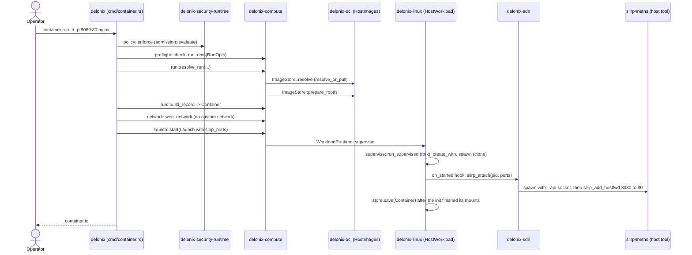
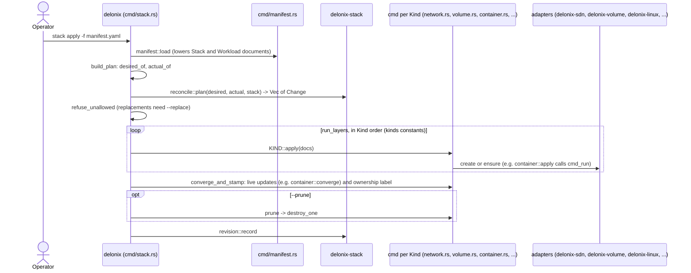
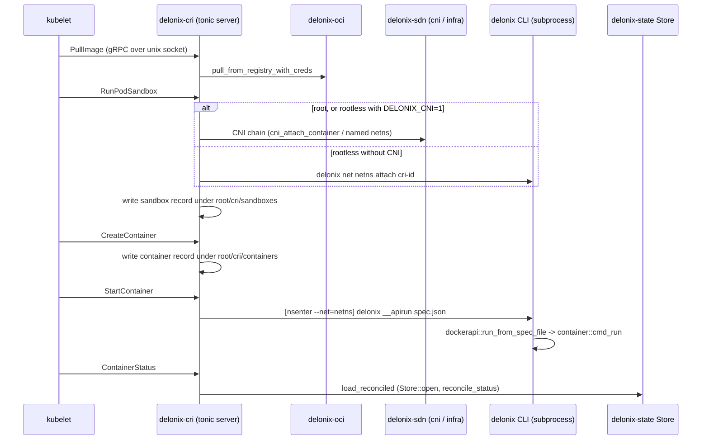

<!-- translated-from: crates.md sha256:02a670fe76c5758e314a6b3e1fa863a1636de585aa08a088f253e5a021a85f05 -->
# Les crates

**Avant de lire :** [Architecture](architecture.md), surtout [Les couches et la direction autorisée](architecture.md#layers-and-the-allowed-direction).

Cette page est la carte que vous gardez ouverte en lisant le code. Le tableau
ci-dessous est généré depuis `Cargo.toml` et `scripts/arch_fitness.py` ; tout
ce qui suit est écrit à la main, et chaque pointeur (`chemin:symbole`) a été lu
dans l’arborescence avant d’être consigné. Là où une affirmation n’a pas pu
être confirmée, elle n’est pas ici. Après elle, vous pourrez trouver le crate
qui possède un changement, les fichiers à lire en premier, et les pièges pour
lesquels il a déjà payé.

Comment l’utiliser :

- Trouvez le crate qui possède ce que vous voulez changer (la couche d’abord,
  voir [Architecture](architecture.md) pour comprendre pourquoi les couches
  existent et dans quelle direction une dépendance peut pointer).
- Lisez sa liste **Commencez à lire à** dans l’ordre, puis ses **Pièges** :
  chacun est un piège pour lequel cette base de code a déjà payé, et le
  commentaire qui le consigne est toujours dans le fichier.
- Avant d’ajouter une ligne `use delonix_…`, vérifiez le tableau : une arête
  qui n’est pas dans la colonne « Dépend de » fera échouer
  `scripts/arch_fitness.py` sauf si elle va dans la direction autorisée.

Deux conventions que vous rencontrerez partout :

- **Pur contre effet.** Les contexts et les crates de fondation décident ; les
  adapters touchent le noyau, le disque, un sous-processus ou le réseau.
  Quand un cas d’usage dans un context a besoin d’un effet, il déclare un
  *port* (un trait) et un adapter l’implémente. La racine de composition qui
  câble les ports aux adapters est le binaire `delonix`.
- **« Parle à » signifie le mécanisme, pas seulement la dépendance.** Un
  crate peut dépendre d’un autre et pourtant l’atteindre en exécutant le
  binaire `delonix` comme sous-processus (le CRI et l’API de gestion locale le
  font pour tout ce qui fork), ou en écrivant une ligne sur un socket de
  contrôle unix (le holder réseau).

## Tableau de référence

<!-- dev-docs:begin crates-table -->
| Crate | Couche | Chemin | Binaires | Dépend de (crates du moteur) | Utilisé par |
|---|---|---|---|---|---|
| `delonix-model` | Foundation | `crates/foundation/delonix-model` | — | — | `delonix-compute`, `delonix-cri`, `delonix-linux`, `delonix-mcp`, `delonix-mgmt`, `delonix-node`, `delonix-oci`, `delonix-opnsense`, `delonix-proxmox`, `delonix-runtime-bin`, `delonix-scanner`, `delonix-sdn`, `delonix-security-runtime`, `delonix-stack`, `delonix-state`, `delonix-truenas`, `delonix-vm`, `delonix-volume` |
| `delonix-net-rules` | Foundation | `crates/foundation/delonix-net-rules` | — | — | `delonix-sdn`, `delonix-vm` |
| `delonix-compute` | Contexts | `crates/contexts/delonix-compute` | — | `delonix-model`, `delonix-node` | `delonix-cri`, `delonix-linux`, `delonix-mcp`, `delonix-mgmt`, `delonix-oci`, `delonix-proxmox`, `delonix-runtime-bin`, `delonix-sdn`, `delonix-state`, `delonix-vm`, `delonix-volume` |
| `delonix-node` | Contexts | `crates/contexts/delonix-node` | — | `delonix-model` | `delonix-compute`, `delonix-cri`, `delonix-linux`, `delonix-mcp`, `delonix-mcp-bin`, `delonix-mgmt`, `delonix-mgmt-bin`, `delonix-oci`, `delonix-runtime-bin`, `delonix-sdn`, `delonix-security-runtime`, `delonix-state`, `delonix-vm`, `delonix-volume` |
| `delonix-security-runtime` | Contexts | `crates/contexts/delonix-security-runtime` | — | `delonix-model`, `delonix-node` | `delonix-runtime-bin` |
| `delonix-stack` | Contexts | `crates/contexts/delonix-stack` | — | `delonix-model` | `delonix-runtime-bin` |
| `delonix-linux` | Adapters | `crates/adapters/delonix-linux` | — | `delonix-compute`, `delonix-model`, `delonix-node`, `delonix-state` | `delonix-cri`, `delonix-mcp`, `delonix-mgmt`, `delonix-runtime-bin` |
| `delonix-oci` | Adapters | `crates/adapters/delonix-oci` | — | `delonix-compute`, `delonix-model`, `delonix-node`, `delonix-state` | `delonix-cri`, `delonix-mgmt`, `delonix-runtime-bin`, `delonix-scanner` |
| `delonix-scanner` | Adapters | `crates/adapters/delonix-scanner` | — | `delonix-model`, `delonix-oci` | `delonix-mgmt`, `delonix-runtime-bin` |
| `delonix-sdn` | Adapters | `crates/adapters/delonix-sdn` | — | `delonix-compute`, `delonix-model`, `delonix-net-rules`, `delonix-node`, `delonix-state` | `delonix-cri`, `delonix-mcp`, `delonix-mgmt`, `delonix-opnsense`, `delonix-proxmox`, `delonix-runtime-bin` |
| `delonix-state` | Adapters | `crates/adapters/delonix-state` | — | `delonix-compute`, `delonix-model`, `delonix-node` | `delonix-cri`, `delonix-linux`, `delonix-mcp`, `delonix-mgmt`, `delonix-oci`, `delonix-runtime-bin`, `delonix-sdn`, `delonix-vm`, `delonix-volume` |
| `delonix-telemetry` | Adapters | `crates/adapters/delonix-telemetry` | — | — | `delonix-cri`, `delonix-mcp-bin`, `delonix-mgmt`, `delonix-mgmt-bin`, `delonix-runtime-bin` |
| `delonix-vm` | Adapters | `crates/adapters/delonix-vm` | — | `delonix-compute`, `delonix-model`, `delonix-net-rules`, `delonix-node`, `delonix-state` | `delonix-mcp`, `delonix-mgmt`, `delonix-runtime-bin` |
| `delonix-volume` | Adapters | `crates/adapters/delonix-volume` | — | `delonix-compute`, `delonix-model`, `delonix-node`, `delonix-state` | `delonix-mcp`, `delonix-mgmt`, `delonix-runtime-bin` |
| `delonix-opnsense` | Providers | `crates/providers/delonix-opnsense` | — | `delonix-model`, `delonix-sdn` | `delonix-runtime-bin` |
| `delonix-proxmox` | Providers | `crates/providers/delonix-proxmox` | — | `delonix-compute`, `delonix-model`, `delonix-sdn` | `delonix-runtime-bin` |
| `delonix-truenas` | Providers | `crates/providers/delonix-truenas` | — | `delonix-model` | `delonix-runtime-bin` |
| `delonix-cri` | Interfaces | `crates/interfaces/delonix-cri` | `delonix-cri` | `delonix-compute`, `delonix-linux`, `delonix-model`, `delonix-node`, `delonix-oci`, `delonix-sdn`, `delonix-state`, `delonix-telemetry` | — |
| `delonix-mcp` | Interfaces | `crates/interfaces/delonix-mcp` | — | `delonix-compute`, `delonix-linux`, `delonix-mgmt`, `delonix-model`, `delonix-node`, `delonix-sdn`, `delonix-state`, `delonix-vm`, `delonix-volume` | `delonix-mcp-bin` |
| `delonix-mgmt` | Interfaces | `crates/interfaces/delonix-mgmt` | — | `delonix-compute`, `delonix-linux`, `delonix-model`, `delonix-node`, `delonix-oci`, `delonix-scanner`, `delonix-sdn`, `delonix-state`, `delonix-telemetry`, `delonix-vm`, `delonix-volume` | `delonix-mcp`, `delonix-mgmt-bin`, `delonix-runtime-bin` |
| `delonix-mcp-bin` | Binaries | `bins/delonix-mcp-bin` | `delonix-mcp` | `delonix-mcp`, `delonix-node`, `delonix-telemetry` | — |
| `delonix-mgmt-bin` | Binaries | `bins/delonix-mgmt-bin` | `delonix-mgmt` | `delonix-mgmt`, `delonix-node`, `delonix-telemetry` | — |
| `delonix-runtime-bin` | Binaries | `bins/delonix-runtime-bin` | `delonix` | `delonix-compute`, `delonix-linux`, `delonix-mgmt`, `delonix-model`, `delonix-node`, `delonix-oci`, `delonix-opnsense`, `delonix-proxmox`, `delonix-scanner`, `delonix-sdn`, `delonix-security-runtime`, `delonix-stack`, `delonix-state`, `delonix-telemetry`, `delonix-truenas`, `delonix-vm`, `delonix-volume` | — |
<!-- dev-docs:end crates-table -->

## Foundation

Les crates de fondation ne portent aucun mécanisme : des types et des règles
purs. Ils ne peuvent dépendre que d’autres crates de fondation. Les
enregistrements persistés `Container` et `Vm` ne sont pas ici (ils
appartiennent à `delonix-compute`), et les fichiers qui contiennent les
enregistrements sont lus et écrits par l’adapter `delonix-state`.

### `delonix-model`

**Objet.** La partie du modèle que n’importe quelle couche peut nommer sans
dépendre d’un mécanisme : le type `Error` partagé du moteur avec le code
`DX_*` stable de chaque variante, les noms de workload générés, le mappage
d’une `Error` vers un code de sortie de processus, le dictionnaire de codes
numérotés `DX-CDNN`, le modèle de secrets (ce qu’est un secret et à quoi
ressemblent un nom et une clé valides), et — depuis la #405 — les
enregistrements qui sont de simples données : le `Status` d’un workload, le
pare-feu par container (`ContainerFw`, `FwRule` et les validateurs purs
`fw_proto_ok`, `fw_port_ok`, `fw_src_ok`), `default_namespace`, et le
`typestate` de cycle de vie vérifié à la compilation. Pur — pas d’E/S, pas
d’état de processus (doc du crate). Les enregistrements `Container` et `Vm`
qui utilisent ces types sont dans `delonix-compute` ; les fichiers qui
stockent les enregistrements sont dans `delonix-state`.

**Modules clés**

| Module | Responsabilité |
|---|---|
| `error` | `Error`, `Result`, et `Error::code` (la chaîne `DX_*` de chaque variante) |
| `exitcode` | classes de code de sortie (`NOT_RUNNING`, `NOT_FOUND`, `CONFLICT`, …) et `for_error` |
| `names` | noms par défaut (`derived_name`, `random_name`) |
| `codes` | le dictionnaire de codes numérotés `DX-CDNN` (ADR-0043) : chiffre de classe, chiffre de domaine, numéro |
| `secret` | `Secret` et les règles pures `valid_name`, `valid_env_key`, `parse_env_file` ; le store chiffré est `delonix-state` |
| `records` | `Status` (`from_wait`, `is_terminal`, `exit_code`), `ContainerFw`/`FwRule`, `fw_proto_ok`/`fw_port_ok`/`fw_src_ok`, `default_namespace` (déplacé ici en #405) |
| `typestate` | phases de cycle de vie vérifiées à la compilation `Phase<Created/Running/Stopped>` ; les transitions illégales ne compilent pas (déplacé en #405) |

**Principale API publique**

| Élément | Ce que c’est | Où |
|---|---|---|
| `Error::code` | le code machine stable (`DX_*`) d’une erreur | `crates/foundation/delonix-model/src/error.rs:code` |
| `exitcode::for_error` | le seul endroit où une `Error` devient un code de sortie | `crates/foundation/delonix-model/src/exitcode.rs:for_error` |
| `exitcode::merge` | le code pour un lot de résultats | `crates/foundation/delonix-model/src/exitcode.rs:merge` |
| `names::derived_name` | nom déterministe à partir d’un id | `crates/foundation/delonix-model/src/names.rs:derived_name` |
| `secret::Secret`, `secret::parse_env_file` | l’enregistrement de secret et l’analyseur de fichiers `KEY=value`, utilisé par `delonix-compute` sans dépendre d’un adapter | `crates/foundation/delonix-model/src/secret.rs` |
| `records::Status` | état de cycle de vie d’un workload | `crates/foundation/delonix-model/src/records.rs:Status` |
| `records::ContainerFw`, `records::FwRule` | le pare-feu persisté par container ; `delonix-sdn` l’applique avec nftables | `crates/foundation/delonix-model/src/records.rs` |
| `typestate::Phase` | phases de cycle de vie typées | `crates/foundation/delonix-model/src/typestate.rs:Phase` |

**Parle à.** Aucun autre crate du moteur : c’est une racine du graphe, et tout
autre crate du moteur qui renvoie l’erreur partagée l’importe d’ici. La CLI
ré-exporte `exitcode` et `names` sous `cmd::exitcode` et `cmd::names`
(`bins/delonix-runtime-bin/src/cmd/mod.rs`), pour que les sites d’appel plus
anciens n’aient pas changé.

**Dépendances externes notables.** `thiserror` (le derive `Error`),
`serde_json` (la variante `Error::Json` enveloppe `serde_json::Error`) et
`serde` (le derive de `Secret`).

**Tests.** Tests unitaires en ligne (`codes`, `error`, `exitcode`, `names`,
`typestate`) et un doc-test dans `src/typestate.rs`.

**Commencez à lire à.** `src/exitcode.rs` (son doc de module explique
pourquoi les classes existent), puis `src/records.rs`, puis `src/names.rs`.

**Pièges.**

- Le `match` dans `for_error` est exhaustif à dessein : une nouvelle variante
  d’`Error` doit y être classée ou le build échoue.
- Deux chemins d’import atteignent le même type :
  `delonix_model::records::FwRule` et `delonix_sdn::FwRule` (un ré-export,
  `crates/adapters/delonix-sdn/src/lib.rs`). C’est un seul type, donc les deux
  compilent ; faites un `grep` sur les deux chemins quand vous cherchez des
  appelants.

### `delonix-net-rules`

**Objet.** Des règles réseau calculables sans toucher au noyau : noms de
bridge, dérivation d’IP à l’intérieur d’un préfixe, le type valeur `Cidr`,
correspondance d’étiquettes, analyse de la sortie d’`iptables-save`. Il a
**zéro dépendance**, si bien que n’importe quel appelant peut compiler les
mêmes règles que le moteur utilise. Il exclut délibérément tout ce qui lit un
état partagé (l’allocation d’IP lit le registre IPAM, donc elle reste dans
`delonix-sdn`).

**Modules clés.** Un seul `lib.rs`.

**Principale API publique**

| Élément | Ce que c’est | Où |
|---|---|---|
| `Cidr` | type de préfixe IPv4, sans crate externe | `crates/foundation/delonix-net-rules/src/lib.rs:Cidr` |
| `bridge_name` | l’unique formule pour le nom du périphérique bridge d’un réseau | `crates/foundation/delonix-net-rules/src/lib.rs:bridge_name` |
| `derive_ip_in`, `valid_ip_in_subnet` | adresse préférée pour un id, et vérification d’appartenance | `crates/foundation/delonix-net-rules/src/lib.rs` |
| `matches_labels` | correspondance de sélecteur d’étiquettes (utilisé par `kind: Service`) | `crates/foundation/delonix-net-rules/src/lib.rs:matches_labels` |
| `parse_overlay_peer` | analyse une spec de pair d’overlay | `crates/foundation/delonix-net-rules/src/lib.rs:parse_overlay_peer` |

**Parle à.** Rien. `delonix-sdn` ré-exporte ses éléments, si bien que les
appelants de `delonix_sdn::Cidr` etc. continuent de compiler.

**Dépendances externes notables.** Aucune.

**Tests.** Tests unitaires en ligne.

**Commencez à lire à.** `src/lib.rs` — le doc de module liste ce qui a été
laissé de côté et pourquoi.

**Pièges.** Des parties du doc de module sont encore en portugais (dette
LANG-01) ; le code fait référence.

## Contexts

Un context possède les décisions d’un domaine et les ports dont ses cas
d’usage ont besoin. Aucun context ne monte, ne démarre ni ne configure le
réseau ; `delonix-node` est celui qui lit l’hôte directement (`/proc`,
`/sys`, `kill(pid, 0)`, `SO_PEERCRED`).

### `delonix-compute`

**Objet.** Le context Compute (`compute.delonix.io`) : les enregistrements
que le moteur persiste pour un container et une VM (`Container`, `Vm`, et ce
qu’ils portent — `Mount`, contrôles de santé, placement cgroup, réseaux
supplémentaires, disques et cartes réseau), la spécification d’exécution vers
laquelle tout point d’entrée traduit (`RunOpts`), et le cas d’usage
`container run` sous forme d’étapes pures sur des ports — préflight,
résolution, construction de l’enregistrement, câblage du réseau, démarrage.
Il porte aussi les types de spécification de Pod et leur traduction vers
`RunOpts`, et la plage IPv4 de workload. Les enregistrements sont venus ici
depuis le `delonix-runtime-core` supprimé (#406). Il **ne** démarre **pas**
de processus, ne tire pas d’images et ne configure pas de réseaux ; il
appelle des traits que des adapters implémentent.

**Modules clés**

| Module | Responsabilité |
|---|---|
| `record` (privé, ré-exporté à la racine du crate) | `Container`, `Vm`, `Mount`, `HealthConfig`/`Health`/`HealthState`, `CgroupParent`, `KubeCgroupParent`/`KubeCgroupDriver`, `ExtraNet`, les types de VM (`CpuTopology`, `ExtraDisk`, `ExtraNic`, `VmVolume`, `VmBootSpec`), `DELONIX_SLICE`, `safe_cgroup_segment` |
| `workload_net` | la plage IPv4 de workload (`is_workload_ipv4`), définie une fois |
| `run_opts` | `RunOpts`, l’unique spécification d’exécution |
| `preflight` | refuse les combinaisons de flags qui n’ont pas de sens, avant tout effet |
| `run` | `resolve_run` (via des ports) et `build_record` (pur) |
| `network` | la phase réseau : `attach_custom_network`, `wire_network` |
| `launch` | intention `Launch`, port `WorkloadRuntime`, cas d’usage `start`, politique de redémarrage |
| `ports` | `ImageStore`, `StorageProvider`, `DeviceResolver`, `RunHost`, `NetworkProvider`, `VmNetwork` |
| `pod` | types de spec de Pod et `pod_to_run_opts`/`container_to_run_opts` |
| `notice` | `Notice`, un avertissement renvoyé comme donnée plutôt qu’affiché |

**Principale API publique**

| Élément | Ce que c’est | Où |
|---|---|---|
| `Container` | l’enregistrement de container que tout lit et écrit | `crates/contexts/delonix-compute/src/record.rs:Container` |
| `Vm` | l’enregistrement de VM | `crates/contexts/delonix-compute/src/record.rs:Vm` |
| `KubeCgroupParent::parse` | validation du parent de cgroup envoyé par le kubelet | `crates/contexts/delonix-compute/src/record.rs:KubeCgroupParent` |
| `DELONIX_SLICE` | le slice de cgroup du mode root | `crates/contexts/delonix-compute/src/record.rs:DELONIX_SLICE` |
| `RunOpts` | la spécification d’exécution | `crates/contexts/delonix-compute/src/run_opts.rs:RunOpts` |
| `preflight::check_run_opts` | refus pur des combinaisons impossibles | `crates/contexts/delonix-compute/src/preflight.rs:check_run_opts` |
| `run::resolve_run` | résout image, volumes, périphériques, utilisateur, défauts via des ports | `crates/contexts/delonix-compute/src/run.rs:resolve_run` |
| `run::build_record` | transforme spec + résolution en un `Container` (pur) | `crates/contexts/delonix-compute/src/run.rs:build_record` |
| `network::wire_network` | publie les ports, enregistre réseau/IP, isolement de namespace, shaping — avant le démarrage | `crates/contexts/delonix-compute/src/network.rs:wire_network` |
| `launch::start` | démarrage supervisé ou direct, et nettoyage d’un démarrage qui n’a jamais eu lieu | `crates/contexts/delonix-compute/src/launch.rs:start` |
| `launch::WorkloadRuntime` | port qui transforme un `Launch` en processus | `crates/contexts/delonix-compute/src/launch.rs:WorkloadRuntime` |
| `ports::NetworkProvider` | port pour attach/publish/pare-feu/shaping | `crates/contexts/delonix-compute/src/ports.rs:NetworkProvider` |
| `ports::VmNetwork` | port pour un tap de VM sur le réseau rootless | `crates/contexts/delonix-compute/src/ports.rs:VmNetwork` |

**Parle à.** Seulement `delonix-model` et `delonix-node` (`safe_to_signal`
pour les enregistrements, `generate_id` dans les tests), par appel direct.
Tout le reste arrive via ses ports, implémentés dans des adapters :

| Port | Implémenté par |
|---|---|
| `ImageStore` | `crates/adapters/delonix-oci/src/run_images.rs:HostImages` |
| `StorageProvider` | `crates/adapters/delonix-volume/src/lib.rs:HostVolumes` |
| `DeviceResolver` | `crates/adapters/delonix-linux/src/cdi.rs:HostDevices` |
| `RunHost` | `crates/adapters/delonix-linux/src/run_host.rs:HostRuntime` |
| `WorkloadRuntime` | `crates/adapters/delonix-linux/src/workload.rs:HostWorkload` |
| `NetworkProvider` | `crates/adapters/delonix-sdn/src/run_network.rs:HostNetwork` |
| `VmNetwork` | `crates/adapters/delonix-sdn/src/vm_network.rs:HostVmNetwork` |

**Dépendances externes notables.** `serde`, `schemars` (commentaire dans
Cargo.toml : les types de spec dérivent leur JSON Schema à côté de leur
définition, si bien que le schéma publié ne peut pas diverger des types).

**Tests.** Tests unitaires en ligne avec de fausses implémentations de port
(`FakeNet`, `FakeRuntime`, `Fake` dans `network.rs`, `launch.rs`, `run.rs`) —
le cas d’usage est testé sans noyau.

**Commencez à lire à.** `src/record.rs` (les structs `Container` et `Vm`),
puis `src/ports.rs`, puis `src/run.rs`, puis `src/launch.rs`.

**Pièges.**

- `Container.userns` dit si le container a **créé** son propre user
  namespace, pas s’il s’exécute dans un différent. Les workloads qui
  rejoignent le user namespace du holder réseau ont `userns = false` et sont
  quand même dans un user namespace différent de celui de l’appelant.
  `mount_live` dans `delonix-linux` le consigne et ouvre toujours le
  namespace `user` au lieu de faire confiance au champ
  (`crates/adapters/delonix-linux/src/lib.rs:mount_live`).
- `Container.ip` est l’adresse sur le réseau **primaire** seulement ; un
  container multi-homed en a d’autres (voir le doc-comment de `NetPlan` dans
  `crates/adapters/delonix-sdn/src/infra.rs` et `apply_firewall_all`, qui
  existe parce que ne pare-feuter que l’IP primaire pouvait être contourné).
- `Container::cgroup()` est le chemin statique du mode root. Pour un
  container rootless en cours d’exécution, le vrai cgroup est lu depuis
  `/proc/<pid>/cgroup` par `delonix_linux::live_cgroup`.
- `record.rs` est le reste d’une grande scission : son doc de module dit
  encore que les enregistrements « sont venus de `delonix-runtime-core` », et
  le doc du crate dans `src/lib.rs` décrit encore le crate comme ne portant
  que la spécification d’exécution. La liste de modules ci-dessus fait
  référence.

- Deux éléments nommés `ImageStore` existent : le trait de port
  `delonix_compute::ports::ImageStore` et le store concret
  `delonix_oci::ImageStore` (une struct). `HostImages` adapte le second au
  premier. Les chemins d’import comptent.
- `wire_network` doit s’exécuter **avant** `launch::start` ; son doc de
  module consigne qu’un `-d` supervisé, sinon, ratait les réglages réseau.

### `delonix-node`

**Objet.** Le context de nœud (doc du crate, ADR-0040 D2.2) : les
préoccupations propres au nœud dont plus d’un crate a besoin et qu’il aurait
autrement dupliquées — le journal d’événements ajout-seul, les vérifications
de virtualisation et d’hôte, la vérification `SO_PEERCRED` pour les sockets
locaux, la règle qu’un binaire serveur suit quand `delonix` l’exécute, et les
questions posées à l’hôte et aux processus (l’horloge, le user namespace, la
vivacité d’un pid, un id neuf). Il est venu du `delonix-runtime-core`
supprimé (#406). Il **ne** crée **pas** de processus, ne monte pas, ne
configure pas le réseau, et ne porte aucun enregistrement de workload.

**Modules clés**

| Module | Responsabilité |
|---|---|
| `host` (privé, ré-exporté à la racine du crate) | `now_unix`, `in_initial_userns`, `initial_uid_map`, `is_rootless`, `fmt_local_ts`, `is_alive`, `proc_starttime`, `safe_to_signal`, `generate_id`, `self_bin` |
| `events` | journal d’événements ajout-seul `events.jsonl` (`emit`, `read`, `read_from`, `size`) |
| `dispatch` | vérification de version et résolution de CLI pour les binaires serveur exécutés par `delonix` (`DELONIX_DISPATCH_VERSION`, `DELONIX_BIN`) |
| `peer_cred` | `peer_uid` depuis `SO_PEERCRED` |
| `virt` | détection de virtualisation/virtio depuis `/sys` et `/proc` (`detect`, `blk_scheduler`, `set_blk_scheduler_none`) |

**Principale API publique**

| Élément | Ce que c’est | Où |
|---|---|---|
| `events::emit` | ajoute une ligne d’événement | `crates/contexts/delonix-node/src/events.rs:emit` |
| `dispatch::check_version`, `dispatch::cli_bin` | comment `delonix-cri`/`-mgmt`/`-mcp` refusent une release non concordante et trouvent la CLI `delonix` à rappeler | `crates/contexts/delonix-node/src/dispatch.rs` |
| `is_alive`, `proc_starttime`, `safe_to_signal` | vérifications de pid qui survivent au recyclage de pid | `crates/contexts/delonix-node/src/host.rs` |
| `in_initial_userns`, `is_rootless` | si l’uid 0 ici est le root de l’hôte | `crates/contexts/delonix-node/src/host.rs` |
| `generate_id`, `now_unix` | un id de 16 chiffres hex, secondes depuis l’epoch | `crates/contexts/delonix-node/src/host.rs` |
| `peer_cred::peer_uid` | l’uid de l’autre bout d’un socket unix | `crates/contexts/delonix-node/src/peer_cred.rs:peer_uid` |

**Parle à.** Seulement `delonix-model` (selon `Cargo.toml`). Pas de
sous-processus : la détection lit `/sys` et `/proc` directement, et
`is_alive` utilise `kill(pid, 0)`.

**Dépendances externes notables.** `serde`/`serde_json` (les lignes
d’événement), `libc`.

**Tests.** Modules `#[cfg(test)]` en ligne dans `events.rs`, `peer_cred.rs`
et `virt.rs` ; pas de répertoire `tests/`.

**Commencez à lire à.** `src/lib.rs` (les ré-exports), puis `src/host.rs`,
puis `src/dispatch.rs`.

**Pièges.**

- `geteuid() == 0` n’est pas « root sur l’hôte » : utilisez
  `in_initial_userns` (son doc-comment consigne deux endroits qui avaient
  pris le chemin root à l’intérieur d’un user namespace imbriqué).
- Dans `src/host.rs`, le rustdoc d’`is_alive` commence par un paragraphe sur
  l’enregistrement `Vm`, laissé par la scission ; la phrase d’une ligne qui
  suit est la vraie documentation de la fonction.

### `delonix-stack`

**Objet.** Le context Stack (`core.delonix.io`) : la table des Kinds et leurs
faits, le réconciliateur à trois voies qui planifie un manifeste contre ce
qui existe, et l’historique de révisions d’un apply. Planifier est pur — rien
ici n’ouvre un store d’une ressource concrète ni n’exécute une commande (doc
du crate). Charger les manifestes et appliquer chaque Kind restent dans la
CLI.

**Modules clés**

| Module | Responsabilité |
|---|---|
| `kinds` | constantes de nom de Kind et `KindFacts` (domaine, forme, converge, teardown, namespaced, presence) |
| `reconcile` | `Desired`/`Actual`/`Change`, `plan`, l’étiquette de propriété et l’annotation last-applied |
| `revision` | enregistre et liste les révisions d’apply (pour rollback) |
| `condition` | le type `Condition` |

**Principale API publique**

| Élément | Ce que c’est | Où |
|---|---|---|
| `kinds::facts`, `kinds::stack_kinds`, `kinds::converges` | l’unique table que la CLI consulte par Kind | `crates/contexts/delonix-stack/src/kinds.rs` |
| `reconcile::plan` | désiré vs réel → `Vec<Change>` | `crates/contexts/delonix-stack/src/reconcile.rs:plan` |
| `reconcile::STACK_LABEL`, `LAST_APPLIED` | étiquette de propriété et annotation de diff à trois voies | `crates/contexts/delonix-stack/src/reconcile.rs` |
| `reconcile::hot_fields_for` | quels changements de champ peuvent être appliqués à chaud | `crates/contexts/delonix-stack/src/reconcile.rs:hot_fields_for` |
| `revision::record`, `revision::list` | historique d’apply | `crates/contexts/delonix-stack/src/revision.rs` |

**Parle à.** Seulement `delonix-model`. La CLI ré-exporte `kinds`,
`reconcile` et `revision` sous `cmd::kinds` etc.
(`bins/delonix-runtime-bin/src/cmd/mod.rs`).

**Dépendances externes notables.** `serde`, `serde_json`.

**Tests.** Tests unitaires en ligne (plans comme données).

**Commencez à lire à.** `src/kinds.rs`, puis `src/reconcile.rs`, puis
`bins/delonix-runtime-bin/src/cmd/stack.rs` pour le voir consommé.

**Pièges.** Ajouter un Kind n’est pas seulement une ligne dans `kinds.rs` :
la CLI a du code par Kind (`desired_of`/`actual_of`, `converge_and_stamp`,
`destroy_one` dans `cmd/stack.rs`) et des tables de schéma/complétion avec
leurs propres tests. Exécutez la suite de tests complète de
`delonix-runtime-bin` après avoir touché la table.

### `delonix-security-runtime`

**Objet.** Les **décisions** de sécurité du nœud : le fichier de politique,
l’évaluation unique d’admission pour containers et VM, l’événement de
sécurité, un score de posture explicable, et la rédaction des secrets dans le
texte. Des fonctions pures de leurs arguments. Il n’a délibérément aucun
capteur, observateur ni processus résident (doc du crate : daemonless par
conception), et aucun champ de locataire, projet ou environnement nulle part.

**Modules clés**

| Module | Responsabilité |
|---|---|
| `policy` | `SecurityPolicy`, `Mode`, lints |
| `admission` | `Request`, `evaluate`, `Decision`, `Violation` |
| `event` | `SecurityEvent` sur le journal d’événements du moteur |
| `score` | `Score` avec déductions et raisons |
| `redact` | rédaction de clés/valeurs sensibles dans une entrée hostile |
| `severity` | `Severity`, `ActionRisk`, `Confidence` |

**Principale API publique**

| Élément | Ce que c’est | Où |
|---|---|---|
| `SecurityPolicy::parse` | charge une politique | `crates/contexts/delonix-security-runtime/src/policy.rs:SecurityPolicy` |
| `admission::evaluate` | décide pour une requête | `crates/contexts/delonix-security-runtime/src/admission.rs:evaluate` |
| `admission::Request` | entrée d’admission container ou VM | `crates/contexts/delonix-security-runtime/src/admission.rs:Request` |
| `redact::redact_text` | masque les secrets dans le texte | `crates/contexts/delonix-security-runtime/src/redact.rs:redact_text` |

**Parle à.** `delonix-model` et `delonix-node` (`events`, `now_unix`).
Consommé par la CLI via `bins/delonix-runtime-bin/src/cmd/policy.rs`, que
`cmd_run` appelle avant qu’aucune image ne soit résolue.

**Dépendances externes notables.** `serde`, `serde_json`.

**Tests.** Tests unitaires en ligne, y compris un module `boundary_tests`
dans `lib.rs` et un doc-test dans le doc du crate.

**Commencez à lire à.** `src/lib.rs` (doc du crate), `src/admission.rs`,
`src/policy.rs`.

**Pièges.** Aucun au-delà du doc du crate : n’ajoutez pas de capteur en
arrière-plan ici — le doc explique pourquoi un contrôle inerte en mode
rootless est pire que rien.

## Adapters

Les adapters sont l’endroit où le moteur rencontre le noyau, le disque, les
outils de l’hôte et les registres distants. Ils dépendent de la fondation et
des contexts, jamais les uns des autres (les exceptions déclarées sont
listées dans [Architecture](architecture.md)).

### `delonix-linux`

**Objet.** Le runtime de containers de bas niveau : `clone` avec des
namespaces, `pivot_root`, cgroups v2, capabilities et seccomp, `exec` via
`setns`, arrêt et suppression, et le superviseur détaché derrière `run -d`.
Son doc de crate énonce la règle : la frontière d’appels système des
containers vit ici. Il ne résout pas les images, n’analyse pas les flags de
la CLI et ne configure pas le réseau ; les effets réseau arrivent comme des
hooks venant de l’appelant.

**Modules clés**

| Module | Responsabilité |
|---|---|
| `lib.rs` | `RunSpec`, `create_with`/`spawn`, `container_init`, configuration du rootfs et montage overlay, `exec`, `stop`, `remove`, montages à chaud, cgroups, `reconcile_status` |
| `workload` | `HostWorkload`, l’implémentation du port `WorkloadRuntime` |
| `launch_spec` | `run_spec`, l’unique constructeur de `RunSpec` depuis un `Launch` |
| `supervise` | `run_supervised`, le parent forké d’un container détaché |
| `capabilities` | table nom↔numéro de capability et ensemble par défaut |
| `seccomp_profile` | chargement de profil seccomp OCI |
| `cdi` | consommateur de spec de périphérique CDI (`HostDevices`) |
| `run_host` | `HostRuntime`, l’implémentation du port `RunHost` |
| `regulate`, `resource_advice`, `workload_view` | pression sur les ressources, conseil de l’hôte, vue demandé-vs-imposé |

**Principale API publique**

| Élément | Ce que c’est | Où |
|---|---|---|
| `RunSpec` | tout ce dont un spawn a besoin | `crates/adapters/delonix-linux/src/lib.rs:RunSpec` |
| `create_with` | démarre un container (appelle `spawn`) | `crates/adapters/delonix-linux/src/lib.rs:create_with` |
| `exec` | exécute une commande dans un container en cours | `crates/adapters/delonix-linux/src/lib.rs:exec` |
| `stop`, `remove` | cycle de vie | `crates/adapters/delonix-linux/src/lib.rs` |
| `reconcile_status` | rafraîchit un enregistrement contre le processus réel | `crates/adapters/delonix-linux/src/lib.rs:reconcile_status` |
| `mount_live`, `update_limits`, `set_frozen` | changements à chaud sur un container en cours | `crates/adapters/delonix-linux/src/lib.rs` |
| `mount_overlay_if_marked` | montage overlay avec la nouvelle API de montage | `crates/adapters/delonix-linux/src/lib.rs:mount_overlay_if_marked` |
| `supervise::run_supervised` | superviseur détaché | `crates/adapters/delonix-linux/src/supervise.rs:run_supervised` |
| `workload::HostWorkload` | adapter de `WorkloadRuntime` | `crates/adapters/delonix-linux/src/workload.rs:HostWorkload` |

**Parle à.** `delonix-model`, `delonix-node`, `delonix-compute` et
`delonix-state` (`Store`, `SecretStore`, `write_private_temp` ; une exception
de couche déclarée, supprimée à l’ADR-0040 P4), par appel direct. Appels
système via `nix`, `libc` et `rustix`. Outils de l’hôte qu’il exécute :
`busctl` (scopes systemd pour le parent de cgroup du kubelet),
`apparmor_parser`, `ldconfig`, `nvidia-smi`. Le slirp pour `-p` n’est pas
démarré ici : `HostWorkload` reçoit un hook `attach_slirp` que la CLI remplit
avec `delonix_sdn::slirp_attach`
(`bins/delonix-runtime-bin/src/cmd/container.rs:with_host_workload`).

**Dépendances externes notables.** `nix`, `libc`, `seccompiler` ; `rustix`
avec `mount`/`fs` (commentaire dans Cargo.toml : `nix` n’a pas d’enveloppe
pour `fsopen`/`fsconfig`/`fsmount`/`move_mount`, nécessaires pour éviter la
limite de taille de page de l’argument `data` du `mount(2)` classique) ;
`serde_yaml` pour les specs CDI.

**Tests.** Modules de tests unitaires en ligne dans `lib.rs` et les fichiers
de module ; tests d’intégration dans `crates/adapters/delonix-linux/tests/`
(`cgroup_parent.rs`, `advisor_fixtures.rs`).

**Commencez à lire à.** `src/workload.rs`, puis `src/launch_spec.rs`, puis
`src/lib.rs` depuis `RunSpec` jusqu’à `spawn` et `container_init`.

**Pièges.**

- `spawn` ne revient pas, et l’enregistrement n’est pas sauvegardé avec un
  `pid`, tant que l’init n’a pas fini ses montages ; le commentaire avant
  `store.save` dans `spawn` explique la course host-root que cela referme. Ne
  déplacez pas cette sauvegarde plus tôt.
- `supervise::run_supervised` et la poignée de main rootless supposent un
  appelant monothread (`fork`). C’est pourquoi les serveurs multithreads (le
  CRI, l’API de gestion, le shim de l’API Docker) exécutent le binaire
  `delonix` au lieu d’appeler ce crate pour démarrer des containers.
- Utilisez `live_cgroup(container)`, pas `container.cgroup()`, pour un
  container rootless en cours d’exécution.

### `delonix-oci`

**Objet.** Images OCI : un store de blobs adressé par contenu, le store
d’images et ses métadonnées, pull/push de registre avec authentification,
préparation de rootfs par container (couches overlay partagées), analyse
Dockerfile/Delonixfile et assistants de build, planification Cloud Native
Buildpacks, chargement/sauvegarde d’archive, et signature/vérification. Il
n’exécute pas de containers ; un build exécute ses étapes via la CLI.

**Modules clés**

| Module | Responsabilité |
|---|---|
| `cas` | `Cas`, blobs adressés par sha256 |
| `image` | `Image`, `ImageConfig`, `ImageStore` |
| `registry` | analyse de référence, `resolve_or_pull`, pull/push, artefacts OCI |
| `overlay` | `prepare_container_rootfs`, `prepare_overlay`, `existing_rootfs_path` |
| `build` | analyseur de Dockerfile (`parse_dockerfile`), étapes, `commit_flat_rootfs` |
| `run_images` | `HostImages`, le port `ImageStore` de compute |
| `auth` | identifiants de registre (`login`/`lookup`) |
| `load`, `save` | archive Docker en entrée, archive OCI en sortie |
| `sign` | `sign_image`, `verify_signature` (ECDSA P-256) |
| `buildpack`, `detect`, `internal_registry` | plan CNB, détection de langage, registre jetable |
| `rootfs_user` | résolution de `--user` contre un rootfs |
| `error` | l’`Error` propre du crate, un numéro de dictionnaire par groupe d’échec (ADR-0043), converti en `delonix_model::Error` |

**Principale API publique**

| Élément | Ce que c’est | Où |
|---|---|---|
| `ImageStore` | ouvre, résout, liste, supprime des images | `crates/adapters/delonix-oci/src/image.rs:ImageStore` |
| `registry::resolve_or_pull` | image locale ou pull | `crates/adapters/delonix-oci/src/registry.rs:resolve_or_pull` |
| `pull_from_registry_with_creds` | pull avec identifiants (utilisé par le CRI) | `crates/adapters/delonix-oci/src/registry.rs` |
| `ImageStore::prepare_container_rootfs` | rootfs pour un id de container | `crates/adapters/delonix-oci/src/overlay.rs` |
| `build::parse_dockerfile` | grammaire Dockerfile/Delonixfile | `crates/adapters/delonix-oci/src/build.rs:parse_dockerfile` |
| `Cas` | store de blobs | `crates/adapters/delonix-oci/src/cas.rs:Cas` |
| `verify_signature` | vérification façon cosign | `crates/adapters/delonix-oci/src/sign.rs:verify_signature` |

**Parle à.** `delonix-model`, dans l’`Error` duquel ses propres erreurs se
convertissent (`src/error.rs`, `impl From<Error> for delonix_model::Error`,
ADR-0043) ; `delonix-node` ; `delonix-compute` (il implémente le port
`ImageStore`) ; et `delonix-state` (`write_atomic_mode` ; une exception de
couche déclarée, supprimée à l’ADR-0040 P4). Registres sur HTTPS avec un
client `reqwest` bloquant. Aucun sous-processus d’hôte dans sa source.

**Dépendances externes notables.** `reqwest` (bloquant, rustls),
`oci-spec` (types OCI d’image canoniques), `sha2`, `tar`, `flate2`, `zstd`,
`base64`, `ring` (vérification de signature) ; dev seulement `proptest`
(robustesse de l’analyseur sur Rust stable) et `criterion`.

**Tests.** Tests unitaires en ligne ; un benchmark dans
`crates/adapters/delonix-oci/benches/parse_reference.rs`.

**Commencez à lire à.** `src/image.rs`, puis `src/registry.rs`
(`resolve_or_pull`), puis `src/overlay.rs`.

**Pièges.**

- `delonix_oci::ImageStore` (struct) n’est pas
  `delonix_compute::ports::ImageStore` (trait) ; voir `run_images.rs`.
- Le rootfs depuis lequel un container démarre est un overlay sur des
  couches partagées avec un fichier marqueur ; le montage lui-même a lieu
  dans l’init du container (`delonix_linux::mount_overlay_if_marked`), pas
  ici.

### `delonix-sdn`

**Objet.** Le SDN rootless et le pare-feu. Un processus *pin* de longue
durée détient un namespace user+network ; un processus *control* redémarrable
à l’intérieur sert un socket de contrôle unix et possède les bridges, les
règles nftables, le DHCP et le DNS interne ; un `slirp4netns` relie ce
namespace à l’hôte. Il couvre aussi le chemin slirp-par-container pour `-p`
sans réseau personnalisé, l’IPAM, l’exécution de plugins CNI, l’overlay
WireGuard, et une comptabilisation de flux eBPF optionnelle. Il ré-exporte
`delonix-net-rules`. Il ne démarre pas de containers.

**Modules clés**

| Module | Responsabilité |
|---|---|
| `lib.rs` | `NetworkStore`, analyse de spec de publish, `slirp_attach`, collecte des slirp orphelins |
| `infra` | le holder : `ensure_up`, `acquire`, `attach_container`, `publish_port`, `apply_firewall_all`, `network_route`, `vm_attach`, le socket de contrôle |
| `run_network` | `HostNetwork` (port `NetworkProvider`), `publish_with_retry` |
| `vm_network` | `HostVmNetwork` (port `VmNetwork`) |
| `ipam` | registre de baux pour les adresses |
| `cni` | conformité CNI : exécution de binaires de plugin |
| `wg` | WireGuard sur l’overlay |
| `bpf` | comptabilisation de flux eBPF optionnelle |
| `discover` | ports en écoute d’un workload depuis `/proc/<pid>/net` |
| `pin_userns` | les propres namespaces et maps d’id du pin |

**Principale API publique**

| Élément | Ce que c’est | Où |
|---|---|---|
| `NetworkStore` | registre réseau déclaratif | `crates/adapters/delonix-sdn/src/lib.rs:NetworkStore` |
| `parse_publish`, `parse_publish_addr` | grammaire du `-p` | `crates/adapters/delonix-sdn/src/lib.rs` |
| `slirp_attach` | le propre slirp d’un container, avec des redirections d’hôte | `crates/adapters/delonix-sdn/src/lib.rs:slirp_attach` |
| `infra::ensure_up` | fait remonter le holder (pin + control + slirp) | `crates/adapters/delonix-sdn/src/infra.rs:ensure_up` |
| `infra::attach_container` | veth sur un réseau, bail d’IP | `crates/adapters/delonix-sdn/src/infra.rs:attach_container` |
| `infra::apply_firewall_all` | chaîne par container pour chaque IP qu’il détient | `crates/adapters/delonix-sdn/src/infra.rs:apply_firewall_all` |
| `run_network::HostNetwork` | adapter de `NetworkProvider` | `crates/adapters/delonix-sdn/src/run_network.rs:HostNetwork` |

**Parle à.** `delonix-model`, `delonix-node`, `delonix-net-rules`,
`delonix-compute` (ports, `workload_net`), `delonix-state` (`write_atomic`,
`write_private_temp` ; une exception de couche déclarée, supprimée à
l’ADR-0040 P4). Outils de l’hôte : `ip`, `nft`, `nsenter`, `slirp4netns`,
`conntrack`, `wg`, binaires de plugin CNI. Le holder est démarré en
ré-exécutant le binaire du moteur (`netns pin`, `netns control`, intercepté
dans le `main` de la CLI avant l’analyse des arguments —
`bins/delonix-runtime-bin/src/main.rs`). Tout ce qui doit se passer à
l’intérieur du namespace est une ligne écrite sur le socket de contrôle
(`infra.rs:control_query`), servie par `handle_control`. Les redirections de
port vont vers `slirp4netns` via son socket d’API (`slirp_add_hostfwd`). Le
`build.rs` ne compile l’objet eBPF que si `clang` et les en-têtes existent ;
l’eBPF n’est jamais requis.

**Dépendances externes notables.** `libc`, `serde`, `serde_json`,
`tracing` ; dev seulement `proptest` pour les invariants d’allocation d’IP.

**Tests.** Modules de tests unitaires en ligne ; tests d’intégration dans
`crates/adapters/delonix-sdn/tests/`.

**Commencez à lire à.** Le doc de module et `ensure_up` de `src/infra.rs`,
puis `attach_container`, puis `src/run_network.rs`.

**Pièges.**

- L’assistant privé `capture()` dans `src/lib.rs` renvoie stdout **sans
  vérifier le code de sortie**. Lisez sa sortie ; ne traitez jamais son `Ok`
  comme « la commande a réussi ». (L’assistant du même nom dans `delonix-vm`
  est différent : il renvoie `None` en cas d’échec.)
- Le chemin du socket de contrôle est dérivé de l’uid **et**, quand
  `DELONIX_ROOT` n’est pas la valeur par défaut, d’un hachage de celui-ci
  (`runtime_dir` + `root_suffix`, ADR-0014) ; `DELONIX_NET_RUNTIME_DIR`
  écrase les deux. Tout ce qui est ré-exécuté à travers un user namespace
  doit porter `runtime_dir_env()` en plus de `DELONIX_ROOT` ; voyez comment
  le pin est démarré dans `infra.rs`. En isolant une exécution de test,
  définissez à la fois `DELONIX_ROOT` et `DELONIX_NET_RUNTIME_DIR`.
- Un pare-feu qui ne connaît que `Container.ip` rate les réseaux
  supplémentaires ; utilisez `apply_firewall_all`.

### `delonix-vm`

**Objet.** MicroVM et VM derrière le trait `VmBackend` et un **registre**
d’exécution des backends. Cloud Hypervisor et libvirt sont les backends
locaux ; un backend distant s’enregistre lui-même depuis l’extérieur du
crate. Il possède les enregistrements de VM, le démarrage et le cycle de
vie, les snapshots, la génération de seed cloud-init, et la sélection de
backend (explicite, fichier par défaut, ou auto-détection). Il ne détient
aucun client HTTP ni identifiants de provider.

**Modules clés**

| Module | Responsabilité |
|---|---|
| `lib.rs` | `VmConfig`, `VmBackend`, registre, `CloudHypervisorBackend`, `LibvirtBackend`, `create_with`, `start`/`stop`/`remove`, snapshots, `status`/`list` |
| `cloudinit` | `build_user_data`, `build_network_config`, `generate_seed_iso` |

**Principale API publique**

| Élément | Ce que c’est | Où |
|---|---|---|
| `VmBackend` | le port de backend (`boot`, `stop`, `destroy`, `resume`, `snapshot`, `ip`, `manages_own_storage`, `auto_selectable`, …) | `crates/adapters/delonix-vm/src/lib.rs:VmBackend` |
| `register_backend`, `BackendRegistration` | ajoute un backend par fabrique | `crates/adapters/delonix-vm/src/lib.rs` |
| `set_network` | enregistre le port `VmNetwork` une fois par processus | `crates/adapters/delonix-vm/src/lib.rs:set_network` |
| `VmConfig` | ce qu’il faut créer | `crates/adapters/delonix-vm/src/lib.rs:VmConfig` |
| `create_with`, `start`, `stop`, `remove`, `status`, `list` | cycle de vie | `crates/adapters/delonix-vm/src/lib.rs` |
| `snapshot`, `restore`, `snapshots`, `delete_snapshot` | points de contrôle | `crates/adapters/delonix-vm/src/lib.rs` |
| `valid_vm_name` | validation de nom à la frontière du moteur | `crates/adapters/delonix-vm/src/lib.rs:valid_vm_name` |

**Parle à.** `delonix-model`, `delonix-node`, `delonix-compute`
(l’enregistrement `Vm`, le port `VmNetwork`), `delonix-net-rules`,
`delonix-state` (`JsonStore<Vm>`, `write_atomic` ; une exception de couche
déclarée, supprimée à l’ADR-0040 P4). Outils de l’hôte : `cloud-hypervisor`
(et son API HTTP sur un socket unix, ex. `PUT /api/v1/vm.pause`), `virsh`,
`qemu-img`, `cloud-localds`, `sh`. Le réseau n’est atteint que via le
`VmNetwork` enregistré ; la CLI enregistre
`delonix_sdn::vm_network::HostVmNetwork` au démarrage
(`bins/delonix-runtime-bin/src/main.rs`).

**Dépendances externes notables.** `libc`, `tracing` — délibérément peu.

**Tests.** Modules de tests unitaires en ligne dans `lib.rs`.

**Commencez à lire à.** `VmBackend` et le registre dans `src/lib.rs`, puis
`create_with`, puis un backend (`CloudHypervisorBackend`).

**Pièges.**

- Pour Cloud Hypervisor, l’IP est **calculée** à partir de la MAC, pas
  observée (`VmNetwork::lease_ip`, `ip_is_predicted`). Une IP prédite ne
  prouve pas que l’invité a démarré.
- La sortie des outils est analysée avec un locale `C` épinglé (`stable_cmd`)
  ; utilisez-le pour tout nouvel appel d’outil d’hôte dont vous analysez la
  sortie.
- `stop` et `destroy` sont des méthodes de trait distinctes : pour un
  backend distant, détruire supprime aussi le disque.

### `delonix-volume`

**Objet.** Volumes nommés (`<root>/volumes/<name>/_data`) et bind mounts, y
compris la grammaire du `-v`, quotas et mesure d’usage, volumes adossés au
réseau (NFS/CIFS/WebDAV montés par des outils de l’hôte), partages sous un
volume parent, et snapshots. Il implémente le port `StorageProvider` de
compute. Il ne crée pas de dataset sur un NAS (c’est `delonix-truenas`).

**Modules clés.** Un seul `lib.rs`.

**Principale API publique**

| Élément | Ce que c’est | Où |
|---|---|---|
| `VolumeStore` | crée, liste, supprime, quota, monte | `crates/adapters/delonix-volume/src/lib.rs:VolumeStore` |
| `VolumeStore::resolve_spec` | spec du `-v` → `Mount` | `crates/adapters/delonix-volume/src/lib.rs` |
| `Volume` | l’enregistrement de volume | `crates/adapters/delonix-volume/src/lib.rs:Volume` |
| `measure`, `Usage` | usage disque avec un compteur non lisible | `crates/adapters/delonix-volume/src/lib.rs` |
| `HostVolumes` | adapter de `StorageProvider` | `crates/adapters/delonix-volume/src/lib.rs:HostVolumes` |

**Parle à.** `delonix-model`, `delonix-node`, `delonix-compute`,
`delonix-state` (`write_atomic` ; une exception de couche déclarée, supprimée
à l’ADR-0040 P4). Outils de l’hôte : `mount`, `umount`, `losetup`. La
suppression d’arborescences possédées par des uids mappés est injectée par
l’appelant (`remove_with` reçoit une closure `rmtree` ; la CLI passe
`delonix_linux::remove_tree_mapped`).

**Dépendances externes notables.** `serde`, `serde_json`.

**Tests.** Tests unitaires en ligne.

**Commencez à lire à.** `VolumeStore` dans `src/lib.rs`, puis
`resolve_spec`, puis `ensure_mounted`.

**Pièges.** Un répertoire illisible n’est pas un répertoire vide :
`Usage.unreadable > 0` signifie que `bytes` est une borne inférieure. En mode
rootless, un volume de base de données rendu `0700` par un uid mappé est le
cas normal.

### `delonix-scanner`

**Objet.** Analyse de vulnérabilités d’image sans root et sans exécuter
l’image : extrait un SBOM (`apk` d’Alpine, `dpkg` de Debian/Ubuntu) en
lisant les couches depuis le CAS, et le compare à une base de données
d’avis. Un module `pytree` analyse les arborescences de modules Python
(vérifications de manifeste et de dépendances). Il ne télécharge pas
lui-même la base d’avis (pas de client HTTP dans ses dépendances).

**Modules clés**

| Module | Responsabilité |
|---|---|
| `lib.rs` | `extract_sbom`, `AdvisoryDb`, `Finding`, `advisories_from_osv`, comparaison de versions |
| `error` | l’`Error` propre du crate, converti en la classe `delonix_model::Error` du moteur (codes `DX_*`) |
| `pytree` | analyse d’arborescences de modules Python |

**Principale API publique**

| Élément | Ce que c’est | Où |
|---|---|---|
| `extract_sbom` | paquets d’une image | `crates/adapters/delonix-scanner/src/lib.rs:extract_sbom` |
| `AdvisoryDb` | avis contre lesquels comparer | `crates/adapters/delonix-scanner/src/lib.rs:AdvisoryDb` |
| `advisories_from_osv` | charge des avis au format OSV | `crates/adapters/delonix-scanner/src/lib.rs:advisories_from_osv` |

**Parle à.** `delonix-oci` (`ImageStore`, `Image`) par appel direct — une
exception de couche déclarée (voir [Architecture](architecture.md)) — et
`delonix-model`, dans l’`Error` duquel ses propres erreurs se convertissent
(`src/error.rs`, `impl From<Error> for delonix_model::Error`).

**Dépendances externes notables.** `tar`, `flate2`, `serde`, `serde_json`.

**Tests.** Tests unitaires en ligne.

**Commencez à lire à.** `src/lib.rs` depuis `extract_sbom`.

**Pièges.** Aucun consigné dans le code au-delà du doc du crate.

### `delonix-telemetry`

**Objet.** Observabilité pour les binaires du moteur : logging structuré
`tracing`, export optionnel de spans OpenTelemetry via OTLP, et le registre
Prometheus partagé que les serveurs exposent. Il a été extrait de l’ancien
`delonix-runtime-core` pour qu’un crate ayant besoin d’un type `Container` ne
compile pas un client OTLP (doc du crate).

**Modules clés**

| Module | Responsabilité |
|---|---|
| `telemetry` | `init` — subscriber `fmt`, plus OTLP quand configuré |
| `metrics` | compteurs/jauges Prometheus et `encode` |

**Principale API publique**

| Élément | Ce que c’est | Où |
|---|---|---|
| `telemetry::init` | appelé une fois au début de chaque binaire | `crates/adapters/delonix-telemetry/src/telemetry.rs:init` |
| `metrics::encode` | exposition texte pour `/metrics` | `crates/adapters/delonix-telemetry/src/metrics.rs:encode` |

**Parle à.** Aucun crate du moteur. Export OTLP vers un collecteur quand
configuré.

**Dépendances externes notables.** `tracing-subscriber`, `opentelemetry`,
`opentelemetry_sdk`, `opentelemetry-otlp`, `tracing-opentelemetry`,
`prometheus-client`.

**Tests.** Tests unitaires en ligne.

**Commencez à lire à.** `src/telemetry.rs`, puis `src/metrics.rs`.

**Pièges.** L’exportateur OTLP regroupe par lots. La CLI `delonix`, de
courte durée, ne vide pas le buffer à la sortie, si bien que des spans d’une
invocation rapide de la CLI peuvent être perdus ; les serveurs de longue
durée livrent de manière fiable (doc de module de `telemetry.rs`).

### `delonix-state`

**Objet.** L’état persisté du moteur (doc du crate, ADR-0040 D2.3) : un
fichier JSON par enregistrement derrière un `flock` exclusif, les assistants
d’écriture atomique que chaque adapter utilise pour ses propres fichiers, et
le coffre de secrets chiffré au repos. Il est venu de l’ancien
`delonix-runtime-core` dans la modification #404 — les **types**
d’enregistrement vivent ailleurs (`Container`, `Vm` dans `delonix-compute` ;
`Status` et les enregistrements de pare-feu dans `delonix-model`), les
fichiers qui les contiennent vivent ici. Il ne décide de rien sur un
workload ; il charge, sauvegarde et verrouille.

**Modules clés**

| Module | Responsabilité |
|---|---|
| `store` (privé, ré-exporté) | `Store` (containers, `<root>/containers/<id>.json`), `JsonStore<T>` (tout autre type d’enregistrement), le `flock` par clé (`FileLock`), `safe_key`, `write_atomic`, `write_atomic_mode`, `write_private_temp` |
| `secret` | `SecretStore` : secrets nommés sous `<root>/secrets/<name>.json`, scellés avec la clé maîtresse de l’hôte ; ré-exporte le modèle pur de `delonix_model::secret` |
| `cred_vault` | `CredVault` : identifiants XChaCha20-Poly1305 sous `<root>/tunnels/cred/`, clé maîtresse `<root>/tunnels/keyring.key` (0600), rotation de clé ; `random_bytes`, `valid_cred_name` |
| `error` (privé, ré-exporté) | l’`Error` propre du crate, chaque variante avec son numéro de dictionnaire (ADR-0043), et sa conversion vers `delonix_model::Error` |

**Principale API publique**

| Élément | Ce que c’est | Où |
|---|---|---|
| `Store` | enregistrements de container : `open`, `default_root`, `base`, `load` (id exact, préfixe d’id, nom, ou `<namespace>/<name>`), `save`, `list` (le plus récent d’abord), `remove`, et `update` pour lecture-modification-écriture | `crates/adapters/delonix-state/src/store.rs:Store` |
| `JsonStore<T>` | le même motif indexé par chaîne pour d’autres enregistrements (VM, enregistrements de tunnel, …) : `open`, `load`, `save`, `exists`, `list`, `remove`, `update` | `crates/adapters/delonix-state/src/store.rs:JsonStore` |
| `write_atomic`, `write_atomic_mode` | fichier temporaire unique par écrivain + `fsync` + `rename` + `fsync` du répertoire en meilleur effort ; `write_atomic_mode` fixe le mode du fichier à la création | `crates/adapters/delonix-state/src/store.rs` |
| `write_private_temp` | un nouveau fichier `O_EXCL`, 0600, dans le répertoire temporaire système, pour remettre du contenu à un outil | `crates/adapters/delonix-state/src/store.rs:write_private_temp` |
| `SecretStore` | `open`, `save`, `update`, `load`, `list`, `remove`, `resolve_env`, `materialize`, `rotate_key` | `crates/adapters/delonix-state/src/secret.rs:SecretStore` |
| `CredVault` | `seal`/`unseal`, `put`/`get`/`exists`/`list`/`remove`, `rotate_key` | `crates/adapters/delonix-state/src/cred_vault.rs:CredVault` |
| `Error`, `Result` | `NoSuchContainer`, `AmbiguousContainer`, `NoSuchRecord`, `NoSuchSecret`, `InvalidSecretName`, `InvalidEnvKey`, `InvalidCredentialName`, `CorruptMasterKey`, `Vault`, `Lock`, `Entropy`, et `Engine` enveloppant une `delonix_model::Error` ; `number`, `is_not_found`, `is_invalid_argument`, `into_root` | `crates/adapters/delonix-state/src/error.rs` |

**Parle à.** `delonix-compute` (le type `Container` que le `Store` détient),
`delonix-model` (`default_namespace`, la classe d’erreur vers laquelle ses
erreurs se convertissent, et le modèle de secrets) et `delonix-node`
(`generate_id`, dans les tests). Pas de sous-processus et pas de réseau :
seulement le système de fichiers. Appelants, tous par appel direct :
`delonix-linux` (`Store`, `SecretStore`, `write_private_temp`), `delonix-vm`
(`JsonStore`, `write_atomic`), `delonix-sdn` (`write_atomic`,
`write_private_temp`), `delonix-oci` (`write_atomic_mode`), `delonix-volume`
(`write_atomic`), `delonix-cri`, `delonix-mgmt` et `delonix-mcp` (`Store`), et
la CLI. Les cinq dépendances d’adapter sont des exceptions de couche
déclarées dans `scripts/arch_fitness.py`, supprimées à l’ADR-0040 P4 par un
port `StateRepository` (voir [Architecture](architecture.md)).

**Dépendances externes notables.** `serde`/`serde_json`, `thiserror`,
`libc` (`flock`), `chacha20poly1305` et `getrandom` (le commentaire dans
`Cargo.toml` : AEAD en Rust pur, sans C, compile sur musl/aarch64).

**Tests.** Tests unitaires en ligne dans `store.rs`, `secret.rs`,
`cred_vault.rs` et `error.rs` ; pas de répertoire `tests/`.

**Commencez à lire à.** `src/lib.rs` (le doc du crate et les ré-exports),
puis `src/store.rs` depuis `FileLock::acquire` et `Store::update`, puis
`src/secret.rs`.

**Pièges.**

- **Les messages sont un contrat.** Chaque variante d’`Error` se convertit
  vers la classe `delonix_model::Error` que les sites d’appel construisaient
  auparavant à la main, avec le même texte, enveloppé de son numéro, pour que
  la CLI affiche ce qu’elle affichait avant et sorte avec le même code (doc
  de module de `error.rs`). `NoSuchRecord` est `4000`, l’entrée de classe
  elle-même, et se convertit sans enveloppe codée.
- **`Store::update` et `JsonStore::update` refusent de s’exécuter sans le
  verrou** (`FileLock::acquire` renvoie `Error::Lock`) ; le doc-comment
  explique pourquoi une lecture-modification-écriture non verrouillée en
  silence est pire qu’une erreur. **`SecretStore::update` non** : son propre
  `FileLock::acquire` renvoie une `Option` et avance sans verrou quand le
  fichier de verrou ne peut pas être ouvert.
- **Les fichiers de verrou ne sont jamais supprimés** (`.<key>.lock` à côté
  de l’enregistrement) : en supprimer un ouvre une fenêtre où deux processus
  verrouillent des inodes différents (doc-comment de `Store::lock_path`).
- **Un nom nu qui existe dans plusieurs namespaces est refusé**
  (`AmbiguousContainer`), tandis qu’un **préfixe** d’id ambigu se résout
  quand même vers le container le plus récent (doc-comment de
  `Store::load`).
- **Chaque clé venant de l’extérieur passe par `safe_key`** avant un
  `PathBuf::join` ; `SecretStore` vérifie aussi `valid_name` dans
  `load`/`remove`, après un bug de traversée de chemin que le doc-comment de
  `SecretStore::load` consigne.
- `CredVault` protège contre les lectures de disque occasionnelles, les
  sauvegardes et les fuites, **pas** contre quelqu’un ayant les privilèges de
  l’utilisateur du moteur, qui peut lire la clé maîtresse (doc de module de
  `cred_vault.rs`).

## Providers

Les providers sont des backends qui parlent à l’API de gestion d’un système
externe. Ils vivent hors des adapters pour que parler à une API de gestion
distante reste hors des adapters du moteur (commentaires Cargo.toml des deux
crates). Ce n’est pas « pas de HTTP dans les adapters » : `delonix-oci` a son
propre client de registre OCI, et `delonix-telemetry` exporte OTLP sur HTTP.

### `delonix-proxmox`

**Objet.** Un `VmBackend` adossé à l’API REST d’**un** nœud Proxmox VE,
nommé explicitement. Aucun inventaire ni sélection de nœud. Il ne touche
jamais un disque local (`manages_own_storage` vaut `true`) et n’est jamais
auto-détecté (`auto_selectable` vaut `false`, car répondre « disponible ? »
coûterait un aller-retour réseau).

**Modules clés.** Un seul `lib.rs`.

**Principale API publique**

| Élément | Ce que c’est | Où |
|---|---|---|
| `Target`, `Auth` | endpoint du nœud, nom du nœud, identifiants | `crates/providers/delonix-proxmox/src/lib.rs` |
| `Client` | client d’API (`connect`, `create_vm`, `start`, `stop`, `destroy`, `snapshot`, `wait_task`, …) | `crates/providers/delonix-proxmox/src/lib.rs:Client` |
| `ProxmoxBackend` | l’implémentation de `VmBackend` | `crates/providers/delonix-proxmox/src/lib.rs:ProxmoxBackend` |
| `register` | enregistre le backend dans le registre de `delonix-vm` | `crates/providers/delonix-proxmox/src/lib.rs:register` |

**Parle à.** `delonix-vm` (le trait et `register_backend` ; une exception de
couche déclarée), `delonix-compute` (l’enregistrement `Vm`) et
`delonix-model`. Le nœud sur HTTPS avec `reqwest` bloquant. La CLI
l’enregistre depuis la configuration d’environnement au démarrage
(`bins/delonix-runtime-bin/src/cmd/vmbackends.rs:register_configured`).

**Dépendances externes notables.** `reqwest` (bloquant, rustls), `serde`,
`serde_json`.

**Tests.** Tests unitaires en ligne ;
`crates/providers/delonix-proxmox/tests/live.rs` s’exécute contre un nœud
réel et se saute avec une ligne affichée sauf si
`DELONIX_PROXMOX_TEST_URL` est définie.

**Commencez à lire à.** Doc du crate dans `src/lib.rs`, puis
`Client::wait_task`, puis `impl VmBackend for ProxmoxBackend`.

**Pièges.** La plupart des opérations renvoient un id de tâche, pas un
résultat. Une tâche terminée rapporte `status: stopped` qu’elle ait réussi ou
non ; le verdict est `exitstatus` (`task_verdict`, doc du crate).

### `delonix-truenas`

**Objet.** Provisionnement sur une appliance TrueNAS SCALE : dataset, quota,
partage NFS et permissions, pour qu’un `kind: Volume` n’exige pas de les
créer à la main. Il ne **crée** que ce qui vit sur le NAS ; le montage reste
dans `delonix-volume` via le même chemin qu’un partage fait à la main.

**Modules clés.** Un seul `lib.rs`.

**Principale API publique**

| Élément | Ce que c’est | Où |
|---|---|---|
| `Client::connect` | connecte et épingle une version majeure prise en charge | `crates/providers/delonix-truenas/src/lib.rs:Client` |
| `Client::ensure_dataset`, `set_permissions`, `ensure_nfs_share` | provisionnement idempotent | `crates/providers/delonix-truenas/src/lib.rs` |
| `Client::remove_nfs_share`, `remove_dataset` | démontage | `crates/providers/delonix-truenas/src/lib.rs` |
| `validate_quota`, `validate_target_url`, `validate_dataset_name` | vérifications d’entrée avant toute requête | `crates/providers/delonix-truenas/src/lib.rs` |

**Parle à.** Seulement `delonix-model` ; l’appliance sur HTTPS. Utilisé par
`bins/delonix-runtime-bin/src/cmd/provision.rs`.

**Dépendances externes notables.** `reqwest` (bloquant, rustls), `serde`,
`serde_json`.

**Tests.** Tests unitaires en ligne ;
`crates/providers/delonix-truenas/tests/live.rs` contre une appliance
réelle, sauté quand non configuré.

**Commencez à lire à.** Doc du crate dans `src/lib.rs` (quatre constats
mesurés), puis `Client::connect`, puis `ensure_dataset`.

**Pièges.** Certains appels renvoient un id de job qui doit être sondé
(`wait_job`). Les propriétés numériques peuvent être `null` ; « pas de
quota » n’est pas le nombre 0 (doc du crate).

## Interfaces

Les interfaces exposent le moteur sur un protocole. Chaque serveur s’exécute
comme son propre binaire ; `delonix serve <x>` et `delonix mcp` en font
`exec` (`bins/delonix-runtime-bin/src/cmd/serve.rs:exec_server`).

### `delonix-cri`

**Objet.** Un serveur CRI de Kubernetes (RuntimeService et ImageService
`runtime.v1` sur gRPC sur un socket unix), pour qu’un kubelet ou `crictl`
puisse utiliser le moteur comme runtime de nœud. Il sert aussi les
endpoints de streaming pour exec/attach/port-forward (WebSocket et SPDY).
Il garde ses propres enregistrements de sandbox et de container sous
`<root>/cri/` et **ne** démarre **pas** de containers dans son propre
processus.

**Modules clés**

| Module | Responsabilité |
|---|---|
| `lib.rs` | stubs `cri` générés, `DelonixImage` (ImageService), `serve_blocking` |
| `runtime_svc` | RuntimeService : `version`, `status`, config de runtime, dispatch vers le lifecycle |
| `runtime_svc/lifecycle` | pod sandboxes et containers |
| `streaming`, `spdy` | serveurs de streaming exec/attach/port-forward |
| `cap_ceiling` | plafond de capabilities au niveau du nœud |
| `child_handle` | une référence à un enfant démarré, sûre contre la réutilisation de pid |
| `bin/delonix-cri.rs` | l’exécutable `delonix-cri` |

**Principale API publique**

| Élément | Ce que c’est | Où |
|---|---|---|
| `serve_blocking` | exécute le serveur gRPC sur un socket | `crates/interfaces/delonix-cri/src/lib.rs:serve_blocking` |
| `CapCeiling`, `CeilingMode` | configuration du plafond de capabilities | `crates/interfaces/delonix-cri/src/cap_ceiling.rs` |
| `lifecycle::run_pod_sandbox`, `create_container`, `start_container` | les points d’entrée du lifecycle | `crates/interfaces/delonix-cri/src/runtime_svc/lifecycle.rs` |

**Parle à.**

- Clients : gRPC sur un socket unix (`tonic`) ; stubs générés par `build.rs`
  depuis `crates/interfaces/delonix-cri/proto/api.proto`.
- Images : `delonix-oci` dans son propre processus
  (`pull_from_registry_with_creds`, `ImageStore`).
- État : lit `delonix_state::Store` directement et appelle
  `delonix_linux::reconcile_status`.
- Démarrer, arrêter, supprimer : exécute la CLI `delonix`
  (`dispatch::cli_bin`) avec `DELONIX_ROOT` et `DELONIX_INTERNAL=1`.
  `start_container` écrit le `RunOpts` comme fichier JSON et exécute
  `delonix __apirun <file>`, sous `nsenter --net=<netns>` quand la sandbox a
  une netns CNI (`delonix_detached_why_in`). Le doc de module donne la
  raison : le serveur est multithread et `clone`/`fork` n’y sont pas sûrs.
- Réseau du pod : `delonix_sdn::cni` / `delonix_sdn::infra::cni_attach_container`
  dans son propre processus, ou `delonix net netns attach` comme
  sous-processus (rootless sans CNI).

**Dépendances externes notables.** `tonic`, `prost` (+ `tonic-build`),
`tokio`, `tokio-stream`, `axum` (WebSocket), `hyper`, `hyper-util`,
`futures-util`, `flate2` ; dev seulement `tower` pour le test d’aller-retour
gRPC.

**Tests.** Tests unitaires en ligne ;
`crates/interfaces/delonix-cri/tests/grpc_status.rs` fait un vrai
aller-retour gRPC sur un socket unix.

**Commencez à lire à.** `src/bin/delonix-cri.rs`, puis `src/runtime_svc.rs`,
puis `src/runtime_svc/lifecycle.rs` (`run_pod_sandbox`, `start_container`).

**Pièges.**

- Le stderr d’une exécution détachée du moteur va vers un **fichier**,
  jamais un pipe : le container hérite le descripteur et un pipe n’atteindrait
  jamais l’EOF (doc de `delonix_detached_why`).
- La config de runtime doit répondre `Cgroupfs` (`engine_cgroup_driver`) ;
  la valeur zéro du proto est `SYSTEMD`, si bien qu’une valeur par défaut
  ramène la boucle de mise à mort de pods que le commentaire a mesurée
  (ADR 0038).
- Ne ré-exécutez jamais le propre exécutable du serveur pour exécuter une
  commande ; `cli_bin` existe parce que le faire re-liait le socket.

### `delonix-mgmt`

**Objet.** L’API de gestion locale : HTTP+JSON sur un socket unix, accepté
seulement pour l’uid appelant (`SO_PEERCRED`). Les lectures (volumes,
containers, images, réseaux, VM) sont des appels de bibliothèque ; les
mutations de container exécutent la CLI `delonix` pour suivre le vrai chemin
du moteur. Il collecte aussi le résumé du tableau de bord et publie des
jauges Prometheus. Son doc de crate dit que les nouveaux clients locaux
appartiennent au contrat de nœud de l’ADR-0040/0041 plutôt qu’à ces routes.

**Modules clés**

| Module | Responsabilité |
|---|---|
| `lib.rs` | `serve_blocking`, le routeur `axum`, les handlers, `run_cli` |
| `dashstats` | `DashSummary`, `collect` (comptes, mémoire, réseau, disque), délais, publication de métriques |

**Principale API publique**

| Élément | Ce que c’est | Où |
|---|---|---|
| `serve_blocking` | exécute le serveur | `crates/interfaces/delonix-mgmt/src/lib.rs:serve_blocking` |
| `dashstats::collect` | le résumé partagé par `delonix dashboard` et `/metrics` | `crates/interfaces/delonix-mgmt/src/dashstats.rs:collect` |

**Parle à.** Appels directs vers `delonix-state` (`Store`, `SecretStore`),
`delonix-model`, `delonix-node` (`peer_cred`, `dispatch`), `delonix-compute`
(`Container`), `delonix-volume`, `delonix-oci`, `delonix-scanner`,
`delonix-vm`, `delonix-sdn` (`infra`, `NetworkStore`), `delonix-linux`,
`delonix-telemetry`. Mutations : la CLI `delonix` comme sous-processus
(`run_cli`).

**Dépendances externes notables.** `axum`, `tokio`, `hyper`, `hyper-util`,
`tower`.

**Tests.** Tests unitaires en ligne utilisant `tower` contre le routeur.

**Commencez à lire à.** Le routeur dans `src/lib.rs` (appels `.route(`),
puis `run_cli`, puis `src/dashstats.rs`.

**Pièges.** Les arguments passés à la CLI sont validés pour rejeter un `-`
initial (`valid_arg`), sinon un id pourrait être analysé comme un flag.

### `delonix-mcp`

**Objet.** Un serveur Model Context Protocol : une surface de contrôle
d’IA locale. Transport stdio seulement ; un processus enfant d’une session
client, jamais un daemon. L’unique principal est l’uid local. Les entrées
d’outil sont typées et validées par schéma ; les sorties sont du texte JSON.
Il garde un journal d’audit local et un registre de tâches dans son propre
processus.

**Modules clés**

| Module | Responsabilité |
|---|---|
| `lib.rs` | outils `DelonixMcp` (`runtime.info`, `resource.list`, `container.restart`, …), `serve_stdio`, `doctor_checks` |
| `risk` | niveau de risque par outil |
| `audit` | `mcp/audit.log` ajout-seul |
| `tasks` | registre de tâches limité à la session |

**Principale API publique**

| Élément | Ce que c’est | Où |
|---|---|---|
| `serve_stdio` | exécute le serveur | `crates/interfaces/delonix-mcp/src/lib.rs:serve_stdio` |
| `DelonixMcp` | le gestionnaire d’outils | `crates/interfaces/delonix-mcp/src/lib.rs:DelonixMcp` |
| `capabilities_table`, `doctor_checks` | `delonix mcp capabilities` / `doctor` | `crates/interfaces/delonix-mcp/src/lib.rs` |

**Parle à.** Appels directs pour les lectures : `delonix-state` (`Store`),
`delonix-model`, `delonix-node`, `delonix-compute`, `delonix-vm`,
`delonix-volume`, `delonix-sdn`, `delonix-linux` (`resource_advice`), et
`delonix-mgmt` (`dashstats`, une exception de couche déclarée). Les
mutations exécutent la CLI `delonix` (`run_cli_blocking`, via
`dispatch::cli_bin`).

**Dépendances externes notables.** `rmcp` (serveur, transport stdio),
`schemars`, `tokio`, `sha2` (hachages d’arguments dans le journal d’audit).

**Tests.** Tests unitaires en ligne (dépendance de dev `tempfile`).

**Commencez à lire à.** Doc du crate dans `src/lib.rs`, les handlers
`#[tool(`, puis `src/risk.rs`.

**Pièges.** Comme pour le CRI : les mutations passent par `cli_bin`, jamais
`current_exe()` (c’est le serveur lui-même).

## Binaries

### `delonix-runtime-bin` (binaire `delonix`)

**Objet.** La CLI et la racine de composition. Elle analyse les commandes
(`clap`), traduit chaque point d’entrée (flags, manifestes, fichiers
compose, la tranche de l’API Docker Engine, clusters kind) en appels au
moteur, câble les adapters aux ports de context, charge les manifestes et
applique chaque Kind, et affiche (avec le catalogue de traduction `po`). Les
verbes internes cachés (`netns pin`, `netns control`, `__apirun`,
`__rmtree`, `__ovlhold`, …) sont interceptés dans `main` avant l’analyse des
arguments pour que les processus ré-exécutés atterrissent dans le bon code.
Elle héberge aussi la tranche de l’API Docker et le proxy d’ingress L7 dans
son propre processus.

**Modules clés** (une sélection ; un module par groupe de commandes dans
`src/cmd/`)

| Module | Responsabilité |
|---|---|
| `main.rs` | interception des verbes internes, `run`, enregistrement de backend et de réseau |
| `cmd/container.rs` | groupe `container` ; `cmd_run` compose le cas d’usage d’exécution |
| `cmd/manifest.rs` | chargement de manifeste (`load`), réduction de `Stack`/`Workload` |
| `cmd/stack.rs` | `stack plan/apply/destroy` : planification, apply par Kind, convergence, prune, révisions |
| `cmd/vm.rs`, `cmd/vmimage.rs`, `cmd/vmfile.rs` | VM, images de VM, VMfile |
| `cmd/network.rs`, `cmd/firewall.rs`, `cmd/netns.rs` | réseaux, ingress/egress, commandes du holder |
| `cmd/image.rs`, `cmd/build.rs` | images et builds |
| `cmd/serve.rs`, `cmd/mcp.rs` | `exec` vers les binaires serveur ; `serve docker-api` dans son propre processus |
| `cmd/dockerapi.rs` | tranche de l’API Docker Engine ; `run_from_spec_file` pour `__apirun` |
| `cmd/policy.rs` | politique de runtime du nœud via `delonix-security-runtime` |
| `cmd/hosts.rs`, `cmd/hosts_file.rs` | `hosts sync` (groupe non stable) et le bloc géré, par racine d’état, du `/etc/hosts` de l’hôte, partagé avec `hosts: [host]` sur une `HTTPRoute` (ADR-0046, ADR-0048 phase 2) ; le recalcul est `desired_hosts`/`sync_hosts_now` dans `cmd/ingress_proxy.rs`, appelé depuis `rebuild()` |
| `cmd/vmbackends.rs` | enregistre les backends de VM distants configurés |
| `cmd/output.rs`, `cmd/po.rs` | sortie de tableaux/describe, catalogue de traduction |

**Principale API publique.** Pas une bibliothèque. Les points d’entrée
qu’un contributeur rencontre en premier :
`bins/delonix-runtime-bin/src/main.rs:run`,
`bins/delonix-runtime-bin/src/cmd/container.rs:cmd_run`,
`bins/delonix-runtime-bin/src/cmd/stack.rs:build_plan`.

**Parle à.** Tout crate du moteur sauf `delonix-cri` et `delonix-mcp` par
appel direct (voir le tableau). Les binaires serveur par `exec`. Des outils
de l’hôte directement depuis certaines commandes : `ssh`/`scp` (amorçage de
cluster), `virsh`, `qemu-img`, `virt-ls`/`virt-cat` (images de VM),
`systemctl`/`loginctl`/`systemd-run` (units de démarrage, scopes de cgroup),
`tcpdump`, `ip`, `ss`, `kubectl`. Se ré-exécute elle-même pour entrer dans
un namespace (`reexec_into_netns`) et pour les opérations d’uid mappé.

**Dépendances externes notables.** `clap`, `clap_complete` ; `hyper`,
`hyper-util`, `tokio`, `tokio-rustls`, `rustls-pemfile`, `rcgen` (le proxy
L7 embarqué ; commentaire Cargo.toml : déjà dans l’arborescence via d’autres
crates) ; `ratatui` (le tableau de bord interactif, confiné à ce binaire) ;
`serde_yaml` (manifestes) ; `schemars` (génération de schéma) ; `oci-spec`
(runtime) ; `reqwest`.

**Tests.** De nombreux modules `#[cfg(test)]` en ligne, y compris des tests
de forme de CLI dans `main.rs` (traductions d’aide, classification de
stabilité, références de commandes mortes) ;
`bins/delonix-runtime-bin/tests/architecture.rs` vérifie que l’architecture
documentée correspond au code. `build.rs` embarque les modèles de projet.

**Commencez à lire à.** `src/main.rs` (`main`, puis `run`), puis
`src/cmd/container.rs:cmd_run`, puis `src/cmd/stack.rs`.

**Pièges.**

- Ajouter une commande signifie mettre à jour chaque point d’entrée qui la
  duplique, le catalogue `pt.po` et les tests d’aide ; suivez la checklist de
  fonctionnalité dans [Flux de contribution](contributing-workflow.md).
- Les verbes cachés du binaire du moteur sont comparés sur l’`argv` brut
  avant `clap` ; renommer une commande publique ne les renomme pas.

### `delonix-mgmt-bin` (binaire `delonix-mgmt`)

**Objet.** L’exécutable de l’API de gestion locale. Vérifie la version de
dispatch, lit `--addr` / `DELONIX_API_ADDR` (par défaut
`unix:///run/delonix-mgmt.sock`) et `DELONIX_ROOT` (par défaut
`/var/lib/delonix`), puis appelle `delonix_mgmt::serve_blocking`.

**Parle à.** `delonix-mgmt`, `delonix-node` (`dispatch`), `delonix-telemetry`
(`init`). Exécuté par `delonix serve api`.

**Tests.** Aucun propre.

**Commencez à lire à.** `bins/delonix-mgmt-bin/src/main.rs`.

### `delonix-mcp-bin` (binaire `delonix-mcp`)

**Objet.** L’exécutable du serveur MCP. Verbes `serve [--transport stdio]`,
`doctor`, `capabilities`.

**Parle à.** `delonix-mcp` (`serve_stdio`, `doctor_checks`,
`capabilities_table`), `delonix-node` (`dispatch`), `delonix-telemetry`.
Exécuté par `delonix mcp <verb>`.

**Dépendances externes notables.** `tokio`.

**Tests.** Aucun propre.

**Commencez à lire à.** `bins/delonix-mcp-bin/src/main.rs`.

## Crates supprimés

- **`delonix-runtime-core`** (foundation) a été supprimé en #406, le gate de
  la P3 de l’ADR-0040. Il contenait auparavant les enregistrements partagés
  et chaque petit assistant transversal. Son contenu est allé vers la couche
  que l’ADR attribue à chacun : [`delonix-model`](#delonix-model) a reçu
  `Error`/`Result`, `Status`, `ContainerFw`/`FwRule`, `default_namespace`,
  `typestate` et le modèle de secrets (#397, #405) ;
  [`delonix-state`](#delonix-state) les stores, les écritures atomiques et
  le coffre de secrets (#404) ; [`delonix-telemetry`](#delonix-telemetry) le
  logging, les spans et les métriques ; [`delonix-compute`](#delonix-compute)
  les enregistrements `Container` et `Vm` avec ce qu’ils portent,
  `DELONIX_SLICE` et `workload_net` ; et le nouveau context
  [`delonix-node`](#delonix-node) le journal d’événements, `virt`,
  `peer_cred`, `dispatch` et les assistants d’hôte/processus (`now_unix`,
  `safe_to_signal`, `generate_id`, …). Il n’y a pas de ré-exports sous les
  anciens chemins : un ancien import `delonix_runtime_core::X` est réécrit
  vers le crate qui définit désormais `X`.

## Comment une requête traverse les crates

Trois flux, chaque flèche tracée jusqu’à un appel dans l’arborescence. Les
noms de fonction sont ceux que vous pouvez chercher avec `grep`.

### 1. `delonix container run -d -p 8080:80 nginx`

Réseau par défaut (`--net host`), donc le port est publié par le propre
`slirp4netns` du container, pas par le holder. Avec `--net <custom>`, le
flux diffère : le premier passage s’attache via le holder et se ré-exécute
dans le network namespace (`attach_custom_network`, `reexec_into_netns`), et
les ports sont publiés sur le holder par `HostNetwork::publish`.

> **Légende** — les participants sont des crates (avec le module ou le type
> qui joue le rôle), l’opérateur ou le kubelet, et des outils de l’hôte ; les
> flèches pleines sont des appels ou des messages, étiquetés par la
> fonction ; les flèches pointillées sont des réponses ; une auto-flèche est
> un travail à l’intérieur de ce participant ; les boîtes `loop`, `alt` et
> `opt` sont respectivement répétition, branches exclusives et étapes
> optionnelles.

La politique et les décisions pures s’exécutent d’abord ; ce n’est qu’ensuite
que l’adapter Linux fait fork, clone, et démarre le propre `slirp4netns` du
container.

### 2. `delonix stack apply -f manifest.yaml`

> **Légende** — les participants sont des crates (avec le module ou le type
> qui joue le rôle), l’opérateur ou le kubelet, et des outils de l’hôte ; les
> flèches pleines sont des appels ou des messages, étiquetés par la
> fonction ; les flèches pointillées sont des réponses ; une auto-flèche est
> un travail à l’intérieur de ce participant ; les boîtes `loop`, `alt` et
> `opt` sont respectivement répétition, branches exclusives et étapes
> optionnelles.

Planifier est un unique appel pur vers `delonix-stack` ; tout ce qui touche
une ressource reste dans le code par Kind de la CLI et les adapters qu’il
appelle.

### 3. kubelet → `delonix-cri` → moteur

> **Légende** — les participants sont des crates (avec le module ou le type
> qui joue le rôle), l’opérateur ou le kubelet, et des outils de l’hôte ; les
> flèches pleines sont des appels ou des messages, étiquetés par la
> fonction ; les flèches pointillées sont des réponses ; une auto-flèche est
> un travail à l’intérieur de ce participant ; les boîtes `loop`, `alt` et
> `opt` sont respectivement répétition, branches exclusives et étapes
> optionnelles.

Le serveur CRI tire les images et attache les réseaux dans son propre
processus, mais chaque démarrage de container traverse vers un nouveau
processus `delonix`.

---

**Suivant :** [System Design Interview — le Delonix Engine](system-design-interview.md) — le même moteur plaidé à partir d’exigences, avec les compromis et les modes de panne derrière chaque choix de conception.
