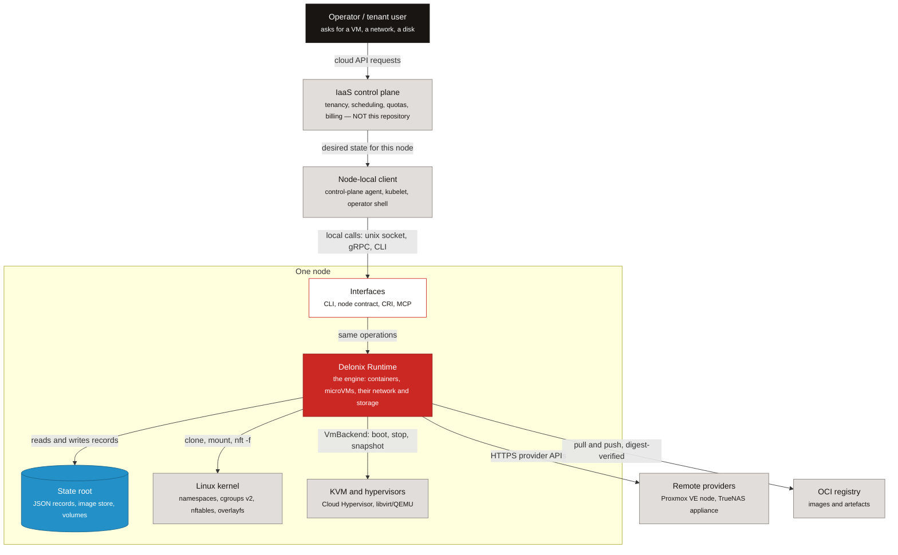

<!-- translated-from: iaas-and-cloud-native.md sha256:85933d280626e83ee934bf13ac9d4537374084eccdf6fdaca15e9682eec0ad31 -->
# IaaS et cloud native — où s’inscrit le moteur

**Avant de lire :** [Commencer ici](start-here.md#what-delonix-is-5-minutes) (les quatre phrases sur ce qu’est Delonix). Aucune connaissance du noyau ni de Rust n’est encore nécessaire.

Vous êtes peut-être un ingénieur DevOps, un SRE, un ingénieur plateforme ou un développeur cloud qui a
*utilisé* pendant des années un cloud Infrastructure-as-a-Service sans jamais en construire un. Cette
page vous donne le modèle mental dont vous avez besoin avant de lire le code du moteur : de quoi est
faite une IaaS, quelles couches ce dépôt implémente, lesquelles il laisse délibérément à d’autres, et
comment les principes cloud native que vous connaissez déjà apparaissent dans des fichiers concrets
ici. Après elle, vous pourrez dire, pour n’importe quelle responsabilité d’une IaaS, si ce dépôt la
possède ou la laisse à un control plane, et pointer vers le fichier où chaque principe cloud native
est appliqué.

Chaque affirmation sur le moteur pointe vers un fichier, un symbole ou un ADR. Quand un ADR est
cité, son état est donné, parce qu’un ADR *Proposed* est une direction, pas un fait sur le code. Des
chemins comme `crates/adapters/delonix-linux` nomment les crates du moteur ; vous n’avez pas besoin
de les connaître encore — pour l’instant, lisez un chemin comme « le code de ceci vit ici ». Le
niveau du répertoire (`foundation`, `contexts`, `adapters`, `providers`, `interfaces`) est la couche
du crate, expliquée plus loin dans [Structure du projet](project-structure.md) et
[Architecture](architecture.md).

Si un mot vous est inconnu, cherchez-le dans le [glossaire](glossary.md).

## Ce qu’est une IaaS

### Les modèles de service

Les définitions de référence se trouvent dans **NIST SP 800-145**, *The NIST Definition of Cloud
Computing* ([csrc.nist.gov/pubs/sp/800/145/final](https://csrc.nist.gov/pubs/sp/800/145/final)). En
résumé :

| Modèle | Le consommateur reçoit | Le consommateur gère | Le fournisseur gère |
|---|---|---|---|
| **IaaS** — Infrastructure as a Service | traitement, stockage, réseaux et autres ressources informatiques fondamentales | systèmes d’exploitation, usage du stockage, applications déployées, et contrôle limité de certains réseaux (ex. pare-feux de l’hôte) | l’infrastructure physique et virtuelle sous-jacente |
| **PaaS** — Platform as a Service | un endroit pour déployer des applications construites avec les langages, bibliothèques et outils du fournisseur | les applications et leur configuration | tout le reste, y compris l’OS et le runtime |
| **SaaS** — Software as a Service | une application en cours d’exécution | tout au plus des réglages propres à l’utilisateur | tout, y compris l’application |

Le même document NIST liste les cinq caractéristiques essentielles — self-service à la demande,
accès réseau étendu, mutualisation des ressources, élasticité rapide et service mesuré. Retenez les
trois dernières : ce sont exactement les propriétés qui vivent **au-dessus** d’un seul nœud, dans un
control plane.

### Les briques que toute IaaS possède

Quel que soit le fournisseur, une IaaS est assemblée à partir des mêmes pièces :

- **Régions et zones** — une région est un emplacement géographique ; une zone est un domaine de
  panne à l’intérieur (alimentation, refroidissement, réseau séparés). Les décisions de placement se
  font par rapport à elles.
- **Calcul** — des machines virtuelles, et de plus en plus des containers et des microVM légères,
  placées sur des hôtes physiques.
- **Stockage** — *block* (un disque attaché à une machine), *file* (un système de fichiers partagé
  comme NFS ou SMB), et *object* (une API HTTP sur des buckets et des clés).
- **Réseaux virtuels** — un réseau privé par client (souvent appelé VPC), des subnets à l’intérieur,
  des security groups ou des règles de pare-feu, du NAT pour le trafic sortant, des load balancers
  pour le trafic entrant, et du DNS interne.
- **Identité et tenancy** — qui appelle, à quelle organisation ou quel compte il appartient, ce qu’il
  a le droit de faire, et comment ses ressources sont isolées de celles de tous les autres.
- **Mesure** — compter ce que consomme chaque locataire, pour pouvoir le limiter (quotas) et le
  facturer (billing).
- **Un control plane et un data plane** — le *control plane* accepte les requêtes d’API, stocke
  l’état désiré, décide du placement et pilote les changements ; le *data plane* est l’endroit où les
  workloads s’exécutent réellement et où les paquets circulent réellement. Une IaaS saine continue à
  servir les workloads en cours d’exécution même quand son control plane est brièvement
  indisponible.
- **Un agent de nœud ou un runtime sur chaque hôte** — le logiciel présent sur chaque machine
  physique qui transforme « exécute cette VM avec ce réseau et ce disque » en appels au noyau, à
  l’hyperviseur et au stockage, et qui rapporte ce qui s’y trouve réellement.

Ce dépôt est le dernier point. Le reste de la page explique exactement jusqu’où cela va.

## Les couches d’une IaaS

**Légende**

| Forme | Signification |
|---|---|
| boîte, sombre | personne ou acteur externe |
| boîte, rouge | le moteur Delonix (ce dépôt) |
| boîte, claire | une brique du moteur |
| boîte, grise | un système externe — quelque chose que ce dépôt n’implémente pas |
| boîte, bleue | état sur disque |

Les flèches pleines sont des appels ou des flux de données, et l’étiquette dit ce qui circule.

*Légende de la figure : une requête voyage d’un opérateur, à travers un control plane multi-tenant
qui n’est pas dans ce dépôt, jusqu’à un client local au nœud, entre dans le moteur sur un nœud, et
descend jusqu’au noyau, aux hyperviseurs et au stockage que le moteur pilote à travers ses ports de
providers.*

Où chaque élément vit dans le code :

- **Interfaces** — le binaire de la CLI (`bins/delonix-runtime-bin`), le serveur CRI de Kubernetes
  (`crates/interfaces/delonix-cri`, `delonix serve cri`), le socket de gestion local
  (`crates/interfaces/delonix-mgmt`), le serveur MCP (`crates/interfaces/delonix-mcp`,
  `delonix mcp serve`) et le contrat de nœud (`proto/delonix/node/v1/`). Voir
  [Un seul ensemble d’opérations, plusieurs interfaces](architecture.md#one-set-of-operations-several-interfaces).
- **State root** — `crates/adapters/delonix-state` (enregistrements JSON derrière `flock`,
  écritures atomiques, le coffre de secrets chiffré) et l’image store dans
  `crates/adapters/delonix-oci` (`cas.rs`).
- **Noyau** — `crates/adapters/delonix-linux` (processus, namespaces, cgroups, montages) et
  `crates/adapters/delonix-sdn` (bridges, nftables, DNS).
- **Hyperviseurs** — le trait `VmBackend` dans `crates/adapters/delonix-vm/src/lib.rs`.
- **Providers distants** — `crates/providers/delonix-proxmox` (ADR-0008, Accepted et implémenté)
  et `crates/providers/delonix-truenas` (ADR-0009, Accepted). Un backend OpenStack n’est encore
  qu’une proposition (ADR-0039, Proposed, conditionné à un spike).
- **Registre** — `crates/adapters/delonix-oci/src/registry.rs`.

Le control plane et le client local au nœud sont en gris à dessein : ils ne sont pas dans ce dépôt,
et rien dans `crates/`, `bins/` ou `proto/` n’a le droit d’en nommer un. `scripts/arch_fitness.py`
(`CONSUMER_NAMES`, `consumer_mentions`) fait échouer la CI dès qu’il trouve un tel nom.

## Où s’inscrit delonix-runtime, et où il s’arrête délibérément

### Ce qu’il est

Delonix Runtime est la **couche d’exécution de nœud** du schéma ci-dessus. Sur un nœud, il :

- exécute des **containers et des microVM** — les containers via `crates/adapters/delonix-linux`,
  les VM via les implémentations enregistrables de `VmBackend` dans `crates/adapters/delonix-vm` ;
- gère le **réseau** dont ces workloads ont besoin — bridges rootless, chaînes de pare-feu par
  workload, DNS interne (`crates/adapters/delonix-sdn`) — et leur **stockage** — volumes nommés,
  bind mounts et partages réseau (`crates/adapters/delonix-volume`) ;
- est **déclaratif**, avec ses propres Kinds regroupés par `apiVersion` (listez-les avec
  `delonix api-resources` ; la table qui les sous-tend est `KindFacts` dans
  `crates/contexts/delonix-stack/src/kinds.rs`) ;
- ne parle aux providers qu’à travers des **ports** — des traits comme `NetworkProvider`,
  `ImageStore` et `StorageProvider` dans `crates/contexts/delonix-compute/src/ports.rs`, et
  `VmBackend` — jamais à travers des branches `if provider == …`. Ce découpage en couches est
  l’ADR-0040 (**Proposed**), et ses règles sont déjà imposées par `scripts/arch_fitness.py`
  (`LAYERS`, `ALLOWED`) ;
- expose les **mêmes opérations à travers plusieurs portes** : la CLI, le contrat de nœud, le CRI
  et le MCP.

Une réserve sur le contrat de nœud, pour que vous n’alliez pas chercher un serveur qui n’existe
pas : `proto/delonix/node/v1/node.proto` est marqué *DRAFT contract for ADR-0040*. Le contrat, son
`docs/api/openapi.yaml` généré et son gate de CI (`scripts/contract_gate.py`) existent ; aucun
crate ne sert encore `NodeService`. L’ADR-0042 (**Accepted**, étapes A et B livrées) fixe la
manière dont cette API sera versionnée et documentée quand le serveur arrivera.

### Ce qu’il ne fait délibérément pas

La règle canonique est la section *«Identidade e fronteira do motor»* en tête de
[`AGENTS.md`](../../../AGENTS.md) : le moteur ne connaît **aucun consommateur** — ni plateformes, ni
control planes, ni consoles, ni agents — et n’a aucune notion de **locataire, compte, offre, quota
ou facturation**. Une exigence venant d’un consommateur n’entre que sous la forme d’une capacité
générique du moteur qui a du sens pour n’importe quel client.

L’ADR-0010 (**Rejected**, 2026-08-10) est la décision qui maintient l’API de gestion **locale** :
un socket unix, avec le pair tenu d’avoir le même uid que le serveur (`SO_PEERCRED`). Une API de
gestion distante et multi-tenant aurait besoin d’identité, d’autorisation et d’audit, et ces
choses appartiennent à l’autre côté de la frontière. L’ADR-0025 (**Accepted**) applique le même
raisonnement au MCP : stdio uniquement, un seul principal local, aucun locataire, aucun OAuth.

Deux mots se chevauchent entre les deux mondes et créent de la confusion en revue :

- **namespace** — dans le moteur, `metadata.namespace` est une frontière d’*isolement* entre des
  workloads sur un nœud (des containers dans des namespaces différents ne peuvent pas s’atteindre).
  Ce n’est ni un locataire ni un compte : rien dans le moteur ne sait qui possède un namespace.
- **quota** — le moteur impose des limites *par ressource* qu’on lui indique (limites de mémoire et
  de CPU du cgroup, un quota de volume). Un quota par compte (« ce client peut avoir 20 vCPU ») est
  une décision de control plane.

### Qui possède quoi

| Responsabilité IaaS | Control plane au-dessus | Moteur Delonix sur le nœud | Hôte et noyau |
|---|---|---|---|
| Régions, zones, placement, ordonnancement entre nœuds | oui | non | — |
| Identité, locataires, comptes, IAM | oui | non (uid local uniquement — ADR-0010, ADR-0025) | — |
| Quotas par compte, mesure pour la facturation, facturation | oui | non ; il n’expose que des métriques par nœud (`/metrics` dans `delonix-mgmt` et `delonix-cri`) | — |
| Gestion de flotte (ajouter/drainer des nœuds à distance) | oui | non — l’API distante a été rejetée (ADR-0010) | — |
| Exécuter un container | le demande | oui — `crates/adapters/delonix-linux` | namespaces, cgroups v2, seccomp |
| Exécuter une microVM | le demande | oui — `VmBackend` (`crates/adapters/delonix-vm`) | KVM |
| Réseau virtuel sur le nœud (bridge, pare-feu, DNS, publication de ports) | définit l’intention | oui — `crates/adapters/delonix-sdn` | nftables, netns |
| Stockage block/file attaché à un workload | définit l’intention | oui — `crates/adapters/delonix-volume`, provisionnement de NAS via `delonix-truenas` (ADR-0009, Accepted) | systèmes de fichiers, clients NFS/SMB |
| Service de stockage objet (buckets sur HTTP) | oui, ou un service séparé | non fourni | — |
| Images : pull, vérification, stockage | choisit l’image | oui — `crates/adapters/delonix-oci` | overlayfs |
| État désiré pour un nœud : plan, apply, dérive | envoie le manifeste | oui — `crates/contexts/delonix-stack` | — |
| Survivre à un redémarrage de l’hôte | — | écrit des units systemd (`bins/delonix-runtime-bin/src/cmd/boot.rs`, `delonix system boot enable`) | systemd |
| Matériel, firmware, patchs de l’OS de l’hôte | — | non | l’opérateur |

## Principes cloud native, et comment le moteur applique chacun

La définition de la Cloud Native Computing Foundation (v1.1, approuvée le 2024-02-26) dit que les
pratiques cloud native permettent aux organisations « de développer, construire et déployer des
workloads … de manière programmatique et répétable », et que le cloud native est « caractérisé par
des systèmes faiblement couplés qui interopèrent de manière sûre, résiliente, gérable, durable et
observable ». Elle cite containers, service meshes, multi-tenancy, microservices, infrastructure
immuable, serverless et API déclaratives comme ingrédients typiques. Lisez le texte complet sur
[github.com/cncf/toc/blob/main/DEFINITION.md](https://github.com/cncf/toc/blob/main/DEFINITION.md).
Notez que la *multi-tenancy* figure dans cette liste, et que dans cette architecture elle est
fournie par le control plane au-dessus du moteur, pas par le moteur.

Ci-dessous, chaque principe reçoit trois courtes parties : ce qu’il signifie en général, où il vit
dans Delonix, et une habitude qu’il vous demande.

### Déclaratif et convergent

**En général.** Vous décrivez l’état que vous voulez ; le système le compare à ce qui existe, vous
montre la différence, et ne change que ce qui diffère. Exécuter deux fois la même description ne
change rien la deuxième fois. Un outil qui ne fait que créer n’est pas déclaratif, quelle que soit
la forme YAML de son entrée.

**Dans Delonix.** `delonix stack plan` et `delonix stack apply` exécutent le réconciliateur dans
`crates/contexts/delonix-stack/src/reconcile.rs` (`plan`, `Change`, `Action`). C’est une **fonction
pure** sur un instantané déjà lu, et c’est un **diff à trois voies** : le dernier spec appliqué est
stocké sur la ressource elle-même (`encode_last_applied`, l’annotation `delonix.io/last-applied`),
ce qui permet de distinguer « vous avez retiré ce champ » de « quelqu’un l’a défini à la main ». Un
changement qui ne peut pas être appliqué à chaud est refusé, sauf si `--replace <Kind>/<name>`
autorise la destruction, et `--detailed-exitcode` (0 = aucun changement, 2 = changements, 1 =
erreur) transforme un plan en gate de dérive dans la CI. L’ADR-0019 (**Accepted**) ajoute un
historique de révisions, explicitement comme un enregistrement et jamais comme source de vérité.

**Ce qu’il vous demande.** Si vous ajoutez ou modifiez un Kind, son apply doit converger : un champ
modifié doit soit être mis à jour à chaud, soit apparaître dans le plan comme un remplacement. Le
commentaire de module de `reconcile.rs` en explique la raison — `stack apply` a un jour affiché
`already exists, nothing to do` et renvoyé 0 tout en ignorant le changement que l’utilisateur avait
fait. Un nouveau Kind convergent a aussi besoin de sa ligne dans `KindFacts` (`kinds.rs`) ; les
tests de ce crate vérifient la table.

### API-first

**En général.** Chaque opération est disponible via une interface programmatique, et les humains
utilisent la même interface que l’automatisation. Une capacité qui n’existe que derrière un bouton
ou une commande n’est pas une capacité de plateforme.

**Dans Delonix.** Les mêmes opérations sont exposées par la CLI, le CRI (`delonix serve cri`,
`crates/interfaces/delonix-cri`), le socket de gestion local (`crates/interfaces/delonix-mgmt`), le
serveur MCP (`delonix mcp serve`, `crates/interfaces/delonix-mcp`) et le contrat de nœud
(`proto/delonix/node/v1/`, brouillon). Le contrat est la source de vérité pour ses deux encodages,
gRPC et HTTP/JSON, et `docs/api/openapi.yaml` en est généré, jamais édité à la main
(`scripts/contract_gate.py`). L’ADR-0040 (**Proposed**) consigne honnêtement l’écart actuel :
plusieurs de ces portes ré-exécutent encore le binaire de la CLI en sous-processus au lieu
d’appeler un cas d’usage — un compte que `scripts/arch_fitness.py` suit sous le nom du ratchet
`self_exec_sites`.

**Ce qu’il vous demande.** N’ajoutez pas une capacité à une seule porte, et n’ajoutez pas un
nouvel appel de sous-processus vers le binaire du moteur lui-même depuis une bibliothèque — appelez
plutôt le cas d’usage. Le ratchet échoue si `self_exec_sites` augmente. Détails dans
[Architecture](architecture.md#one-set-of-operations-several-interfaces).

### Observable via des standards ouverts

**En général.** Un système vous dit ce qu’il fait à travers des formats que tout outil comprend —
logs structurés, traces et métriques — au lieu d’un tableau de bord maison ou d’un log qu’il faut
lire à l’œil.

**Dans Delonix.** `crates/adapters/delonix-telemetry` porte le logging structuré
(`DELONIX_LOG_FORMAT=json`), des spans OpenTelemetry exportés via OTLP (`DELONIX_OTLP_ENDPOINT`,
`OTEL_SERVICE_NAME` respecté par `telemetry.rs`) et le registre Prometheus partagé (`metrics.rs`),
servi sur `/metrics` par `delonix-mgmt` et `delonix-cri`. Les événements du moteur sont disponibles
avec `delonix system events`.

**Ce qu’il vous demande.** Un crate de bibliothèque n’affiche rien : il émet des événements
`tracing` et c’est l’interface qui décide quoi montrer. `scripts/arch_fitness.py` compte les
`println!`/`eprintln!` dans les crates de bibliothèque comme le ratchet `library_prints`, et échoue
si le nombre augmente.

### Artefacts immuables

**En général.** Ce que vous déployez est un artefact versionné, adressé par contenu, construit une
fois et jamais modifié en place. Vous changez un déploiement en le pointant vers un artefact
différent, et vous pouvez prouver quels octets s’exécutent.

**Dans Delonix.** Les images suivent les spécifications OCI d’image et de distribution
(`crates/adapters/delonix-oci`). Les blobs vivent dans un store adressé par contenu (`cas.rs`), et
un pull par digest vérifie le manifeste lui-même contre le digest demandé
(`verify_manifest_digest` dans `registry.rs`), pas seulement chaque blob contre le manifeste. Les
containers partagent des couches d’image en lecture seule via overlayfs et n’écrivent que dans leur
propre couche supérieure.

**Ce qu’il vous demande.** N’acceptez jamais des octets téléchargés sans les vérifier contre un
digest ou une somme de contrôle publiée, et n’affaiblissez jamais une vérification pour faire
fonctionner un registre lent ou bizarre — une vérification qu’on peut sauter n’est pas une
vérification. Voir
[Initiation au cloud native](cloud-native-primer.md#44-oci-images-content-addressed-storage-and-overlayfs).

### Faiblement couplé : ports et adapters

**En général.** Les composants dépendent d’interfaces étroites, pas des internes des autres, pour
qu’une partie puisse être remplacée sans réécrire le reste. Pour un moteur d’infrastructure, cela
signifie surtout : un nouveau provider devrait être une nouvelle implémentation, pas une nouvelle
branche partout.

**Dans Delonix.** L’ADR-0040 (**Proposed**) répartit les crates en foundation, contexts, adapters,
providers, interfaces et binaires, et le répertoire est la couche (`crates/foundation/`,
`crates/contexts/`, `crates/adapters/`, `crates/providers/`, `crates/interfaces/`, `bins/`). La
direction autorisée est écrite une seule fois, dans `ALLOWED` de `scripts/arch_fitness.py`, et la
CI l’impose. Les ports sont des traits dans `crates/contexts/delonix-compute/src/ports.rs` et
`VmBackend` dans `delonix-vm` ; l’ADR-0008 (**Accepted**) a rendu les backends de VM
enregistrables, ce qui est ainsi qu’un nœud Proxmox distant est devenu un backend de plus.

**Ce qu’il vous demande.** Un nouveau provider entre comme implémentation d’un port. Un nouveau
crate entre dans la table `LAYERS` et dans le répertoire de sa couche dans le même commit, et ne
peut dépendre que dans la direction autorisée. Voir
[Architecture](architecture.md#layers-and-the-allowed-direction).

### Jetable et idempotent

**En général.** N’importe quel processus peut être arrêté et redémarré rapidement et en sécurité,
et répéter une opération n’aggrave pas les choses. C’est ce qui permet à un ordonnanceur de
déplacer, redémarrer ou remplacer des workloads sans humain.

**Dans Delonix.** `delonix container stop` envoie SIGTERM, attend jusqu’à `--time` secondes, puis
SIGKILL (`stop` dans `crates/adapters/delonix-linux/src/lib.rs`), et arrêter un container déjà
arrêté réussit (`cmd_stop` dans `bins/delonix-runtime-bin/src/cmd/container.rs`). Un arrêt demandé
est enregistré avant l’envoi du signal (`stopped_by_user`), pour qu’un superviseur de redémarrage
ne ressuscite pas ce que l’opérateur a arrêté. Côté déclaratif, appliquer un manifeste inchangé
produit un plan sans changement.

**Ce qu’il vous demande.** Chaque nouvelle commande doit pouvoir s’exécuter deux fois sans danger.
Décidez explicitement ce que « déjà fait » renvoie — un succès, ou la classe de conflit
(`Error::Conflict`, associée à un code de sortie par `for_error` dans
`crates/foundation/delonix-model/src/exitcode.rs`) — et ne détruisez jamais rien avant de savoir
que l’objet est le vôtre à détruire.

### Sécurisé par défaut : rootless-first, moindre privilège

**En général.** Le chemin normal accorde le plus petit ensemble de privilèges qui fonctionne. Un
privilège supplémentaire est quelque chose qu’un opérateur demande explicitement et peut voir,
jamais un défaut silencieux.

**Dans Delonix.** Les containers s’exécutent dans un user namespace sans root sur le chemin normal,
et ne conservent que l’ensemble de capabilities par défaut `KEPT_CAPS`
(`crates/adapters/delonix-linux/src/capabilities.rs`, résolu par `resolve_cap_keep`). Sur le
chemin du CRI, le nœud peut imposer un plafond aux capabilities qu’aucun spec de pod ne peut
dépasser (`crates/interfaces/delonix-cri/src/cap_ceiling.rs`). Les décisions de sécurité —
politique, admission pour les containers et les VM, rédaction des secrets — sont rassemblées dans
`crates/contexts/delonix-security-runtime` (ADR-0026, **Proposed**).

**Ce qu’il vous demande.** Ne faites pas fonctionner une fonctionnalité en exigeant root ou
`--privileged` sur le chemin normal. Si un privilège est vraiment nécessaire, faites-en un opt-in
explicite qui le dit à l’opérateur, et refusez — avec un message clair — plutôt que de dégrader
silencieusement quand il manque.

### Daemonless

**En général.** De nombreux moteurs de containers exécutent un daemon résident qui possède tout
l’état. Un moteur daemonless garde l’état dans des fichiers et fait son travail dans des processus
de courte durée, si bien qu’aucun processus central dont le crash ou la mise à jour ferait tomber
tous les workloads n’existe.

**Dans Delonix.** Chaque commande de la CLI est un processus qui fait son travail et se termine. Ce
qui doit persister appartient à systemd ou à un processus par workload avec un propriétaire clair :
`delonix system boot enable` écrit une unit systemd par container ou VM dont l’`ExecStart` est un
`delonix … start` (`bins/delonix-runtime-bin/src/cmd/boot.rs`). La règle — un nouveau daemon exige
un ADR avec la preuve de ce que l’alternative n’a pas pu résoudre — se trouve dans `AGENTS.md`.
L’ADR-0021 (**Proposed**) montre la règle appliquée : même un réconciliateur de pull est conçu pour
s’exécuter depuis un timer systemd plutôt que comme un processus résident.

**Ce qu’il vous demande.** Avant d’ajouter un processus de longue durée, vérifiez si une unit
systemd, un timer, l’activation par socket ou un superviseur par workload résout le problème. Si
aucun ne le fait, écrivez d’abord l’ADR. Voir
[Initiation au cloud native](cloud-native-primer.md#410-daemonless-in-one-paragraph).

## Le prisme des douze facteurs, côté fournisseur

La Twelve-Factor App ([12factor.net](https://12factor.net/)) est écrite pour les développeurs
d’applications. Un moteur se trouve de l’autre côté : il doit *fournir* les mécanismes qui
permettent à un workload de suivre chaque facteur. Certains facteurs ne relèvent tout simplement
pas du moteur, et le tableau le dit.

| Facteur | Ce que le moteur doit fournir | Où Delonix le fait |
|---|---|---|
| I. Codebase | rien — un codebase par app est le choix du développeur | non applicable |
| II. Dependencies | un moyen de livrer une app avec ses dépendances isolées | images OCI (`crates/adapters/delonix-oci`) ; les construire avec `delonix build` à partir d’un Dockerfile ou d’un Delonixfile ([Delonixfile et VMfile](delonixfile-and-vmfile.md)) |
| III. Config | injecter configuration et secrets au démarrage, pas au build | `-e`, `--env-file`, `--secret` sur `delonix container run` ; fusion d’environnement dans `crates/contexts/delonix-compute/src/run.rs` ; `parse_env_file` dans `crates/foundation/delonix-model/src/secret.rs` ; secrets chiffrés au repos dans `delonix-state` |
| IV. Backing services | attacher un service par son nom, remplaçable sans changer le code | DNS interne, nom standard `<name>.<namespace>.svc.delonix.internal`, l’ancien `<name>.<namespace>.delonix.internal` répondant toujours (`service_fqdn`, `parse_internal_name`, `dns_resolve_for` dans `crates/adapters/delonix-sdn/src/infra.rs`) ; un Kind `Service` résolvant vers plusieurs backends (ADR-0032, **Accepted**) ; comment les noms atteignent le `/etc/hosts` de l’hôte : [service-names-and-hosts.md](service-names-and-hosts.md) |
| V. Build, release, run | séparer les trois étapes, avec une release immuable | `delonix build` → une image identifiée par digest → `container run` / `stack apply` ; historique de révisions du stack (ADR-0019, **Accepted**) |
| VI. Processes | des processus sans état, avec l’état dans un stockage attaché | racine `--read-only` ; volumes nommés et partages (`crates/adapters/delonix-volume`) |
| VII. Port binding | exposer un port que l’app lie elle-même | `-p [hostIp:]hostPort:containerPort` (`parse_publish_addr`, `slirp_add_hostfwd` dans `crates/adapters/delonix-sdn/src/lib.rs`) |
| VIII. Concurrency | exécuter plusieurs copies d’un type de processus | plusieurs containers par service compose (`deploy.replicas` dans `bins/delonix-runtime-bin/src/cmd/compose.rs`) et round-robin DNS via `Service` (ADR-0032). **Non fourni :** l’autoscaling, et la mise à l’échelle entre nœuds (c’est une décision de control plane) |
| IX. Disposability | démarrage rapide, arrêt gracieux sur un signal | SIGTERM puis SIGKILL après `--time` (`stop` dans `delonix-linux`) ; politiques de redémarrage avec `--restart` |
| X. Dev/prod parity | les mêmes artefacts et le même runtime dans chaque environnement | le même binaire et les mêmes Kinds sur un portable et sur un nœud, rootless sur les deux. **En partie :** la parité avec *un autre* runtime de production (par exemple un cluster Kubernetes géré) dépend de ce runtime |
| XI. Logs | capturer stdout/stderr comme un flux d’événements, pas des fichiers gérés par l’app | un shim de log par container (`log_shim` dans `crates/adapters/delonix-linux/src/lib.rs`) ; `delonix container logs --follow` ; lignes horodatées avec `--log-cri` |
| XII. Admin processes | exécuter des tâches ponctuelles dans le même environnement que l’app | `delonix container exec` |

## À lire ensuite

- **Fondations Linux** ([linux-foundations.md](linux-foundations.md)) — les primitives du noyau sur
  lesquelles tout cela repose : processus et `/proc`, namespaces, cgroups v2, descripteurs de
  fichier et signaux.
- **Initiation au cloud native** ([cloud-native-primer.md](cloud-native-primer.md)) — comment le
  moteur utilise ces primitives et les spécifications qui les surplombent (OCI, CRI, CNI,
  KVM/virtio, cloud-init), avec fichiers et symboles.
- **Architecture** ([architecture.md](architecture.md)) — la structure derrière ce contexte :
  couches, processus et crates en détail, une fois que les deux pages ci-dessus et
  [Structure du projet](project-structure.md) vous sont familières.

---

**Suivant :** [Fondations Linux](linux-foundations.md) — les primitives du noyau dont dépend chaque page suivante, en pratique : processus, namespaces, cgroups v2, descripteurs de fichier et signaux.
