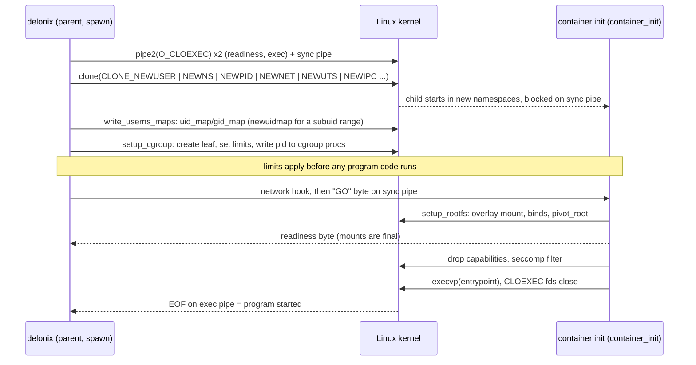

<!-- translated-from: linux-foundations.md sha256:939d3e706c124fa92db0bb6c46fdccd6dc62d6ab6cdf2df388654650357dab5a -->
# Fondations Linux

**Avant de lire :** [IaaS et cloud native](iaas-and-cloud-native.md), pour comprendre pourquoi un moteur de nœud a besoin de ces primitives. Un shell Linux suffit, rien d’autre.

Chaque page après celle-ci suppose que vous savez répondre, par une commande, à des questions
comme « dans quel network namespace se trouve ce processus ? », « pourquoi cette limite ne
s’est-elle pas appliquée ? » ou « qui tient encore ce pipe ouvert ? ». Cette page enseigne ces
primitives en pratique, du point de vue de quelqu’un qui écrit du code système Linux *et* doit
l’opérer à 3 heures du matin. À la fin, vous saurez répondre à chacune de ces questions depuis un
shell, et prédire les pannes que les pages suivantes décrivent avec le vocabulaire du moteur (une
limite qui ne s’applique pas, un pipe qui n’atteint jamais l’EOF, un PID qui nomme un autre
processus).

Elle n’explique pas comment le moteur les utilise — cette correspondance, avec fichiers et
symboles, se trouve dans l’[Initiation au cloud native](cloud-native-primer.md). Chaque section ici
se termine par un renvoi vers la partie correspondante.

**Comment utiliser cette page.** Ouvrez un terminal et tapez en même temps. Chaque commande
marquée *non privilégiée* a été exécutée en tant qu’utilisateur ordinaire sur un hôte Ubuntu avec
un noyau 7.0, util-linux 2.39 et systemd, et la sortie montrée est ce qu’elle a affiché (coupée,
avec les chemins spécifiques à l’hôte remplacés par des espaces réservés). Les commandes marquées
**nécessite root — exécuter dans une VM jetable** n’ont *pas été exécutées* pour cette page : elles
changent un état à l’échelle de l’hôte, et vous ne devriez jamais les essayer sur une machine qui
fait tourner quelque chose auquel vous tenez. [Configuration des microVM](microvm-setup.md) montre
comment obtenir une VM jetable depuis le moteur lui-même.

Travaillez dans un répertoire de travail pour que rien de ce que vous créez n’atterrisse dans le
dépôt :

```bash
mkdir -p ~/scratch/linux-lab && cd ~/scratch/linux-lab
```

---

## Processus, le noyau et /proc

Un **processus** est un programme en cours d’exécution avec son propre espace d’adressage, un
**PID** numérique, un parent (son **PPID**) et un ensemble d’attributs détenus par le noyau :
identifiants, namespaces, appartenance à un cgroup, descripteurs de fichier ouverts, dispositions
de signal et limites de ressources. Tout processus sauf le PID 1 a un parent ; quand un parent
meurt en premier, l’orphelin est reparenté au *subreaper* le plus proche ou au PID 1.

- **`fork`** duplique le processus appelant. L’enfant reçoit une copie de l’espace d’adressage
  (copy-on-write) et une copie de la **table des descripteurs de fichier** — les mêmes fichiers
  ouverts, partagés, pas rouverts. Seul le *thread* appelant est copié, ce qui explique pourquoi
  faire un fork d’un programme multithread puis faire quelque chose de non trivial avant `exec`
  est dangereux (un verrou détenu par un autre thread reste détenu pour toujours dans l’enfant).
- **`execve`** remplace le programme s’exécutant dans un processus : même PID, même parent, mêmes
  namespaces et cgroup, nouveau code. Les descripteurs de fichier survivent à `exec` *sauf* s’ils
  sont marqués close-on-exec — plus de détails dans
  [Descripteurs de fichier](#file-descriptors).
- **`clone`** est la forme générale derrière à la fois `fork` et la création de thread. Ses flags
  choisissent ce que l’enfant partage avec le parent et, ce qui compte ici, dans quels
  **nouveaux namespaces** il démarre (`CLONE_NEWUSER`, `CLONE_NEWNS`, `CLONE_NEWPID`,
  `CLONE_NEWNET`, …). Un container naît d’un `clone` avec ces flags.

Le noyau expose chaque processus comme un répertoire sous `/proc`. Les fichiers que vous
utiliserez le plus :

| Chemin | Ce qu’il vous dit |
|---|---|
| `/proc/<pid>/status` | nom, état, PPid, uid/gid, `NSpid` (le PID dans chaque namespace PID imbriqué), ensembles de capabilities, threads |
| `/proc/<pid>/cmdline` | l’argv, séparé par NUL |
| `/proc/<pid>/ns/` | un lien symbolique par namespace ; le numéro d’inode est l’identité du namespace |
| `/proc/<pid>/cgroup` | le chemin cgroup v2 (`0::/…`) |
| `/proc/<pid>/fd/`, `/proc/<pid>/fdinfo/` | descripteurs de fichier ouverts et leur offset/flags |
| `/proc/<pid>/stat` | le champ 22 est l’heure de démarrage, qui distingue un processus d’un autre plus tardif ayant réutilisé son PID |

Essayez-le sur votre propre shell (*non privilégié*) :

```bash
grep -E '^(State|PPid|Threads|NSpid|CapEff)' /proc/$$/status
tr '\0' ' ' < /proc/$$/cmdline; echo
cat /proc/self/cgroup
```

```text
State:	S (sleeping)
PPid:	4033620
NSpid:	953496
Threads:	1
CapEff:	0000000000000000
0::/user.slice/user-1000.slice/user@1000.service/app.slice/app-….scope
```

Notez que `$$` est votre shell, tandis que `self` est le processus qui ouvre le fichier — pour
`cat /proc/self/cgroup`, c’est `cat`. Notez aussi qu’**un PID est un nombre, pas un nom** : une
fois qu’un processus a été collecté, le noyau peut donner le même numéro à un processus sans
rapport. Un code qui stocke un PID et le signale plus tard doit vérifier l’heure de démarrage, ou
mieux, détenir un *pidfd* (voir plus bas).

**Pourquoi le moteur lit `/proc`.** C’est la seule vue faisant autorité et sans verrou d’un
processus vivant : le vrai cgroup d’un container en cours d’exécution, si un PID enregistré nomme
toujours le même processus, quels namespaces rejoindre pour un `exec`. → [Comment Delonix
l’utilise : namespaces Linux et fonctionnement
rootless](cloud-native-primer.md#41-linux-namespaces-and-rootless-operation).

**Pour aller plus loin :** [`proc(5)`](https://man7.org/linux/man-pages/man5/proc.5.html),
[`fork(2)`](https://man7.org/linux/man-pages/man2/fork.2.html),
[`execve(2)`](https://man7.org/linux/man-pages/man2/execve.2.html),
[`clone(2)`](https://man7.org/linux/man-pages/man2/clone.2.html).

---

## Namespaces

Un **namespace** enveloppe un type de ressource globale pour que les processus qui s’y trouvent
voient leur propre instance. Linux en a huit :

| Namespace | Flag | Isole |
|---|---|---|
| mount | `CLONE_NEWNS` | la table de montage : ce qui est monté où |
| UTS | `CLONE_NEWUTS` | le hostname et le nom de domaine NIS |
| IPC | `CLONE_NEWIPC` | les objets IPC System V et les files de messages POSIX |
| PID | `CLONE_NEWPID` | la numérotation des processus ; le premier processus à l’intérieur est le PID 1 |
| network | `CLONE_NEWNET` | interfaces, adresses, routes, tables de pare-feu, sockets, `/proc/sys/net` |
| user | `CLONE_NEWUSER` | uids/gids et capabilities ; le propriétaire de tous les autres namespaces |
| cgroup | `CLONE_NEWCGROUP` | la vue de l’arbre de cgroups (le processus voit son cgroup comme `/`) |
| time | `CLONE_NEWTIME` | les décalages de `CLOCK_MONOTONIC` et `CLOCK_BOOTTIME` |

### Identité : l’inode derrière /proc/<pid>/ns

Chaque entrée dans `/proc/<pid>/ns` est un lien symbolique dont la cible encode le type de
namespace et un numéro d’inode. **Deux processus sont dans le même namespace exactement quand ces
inodes sont égaux** — c’est ainsi qu’on compare, pas par les noms (*non privilégié*) :

```bash
ls -l /proc/self/ns
```

```text
lrwxrwxrwx 1 you you 0 … cgroup -> cgroup:[4026531835]
lrwxrwxrwx 1 you you 0 … ipc -> ipc:[4026531839]
lrwxrwxrwx 1 you you 0 … mnt -> mnt:[4026531832]
lrwxrwxrwx 1 you you 0 … net -> net:[4026531833]
lrwxrwxrwx 1 you you 0 … pid -> pid:[4026531836]
lrwxrwxrwx 1 you you 0 … pid_for_children -> pid:[4026531836]
lrwxrwxrwx 1 you you 0 … time -> time:[4026531834]
lrwxrwxrwx 1 you you 0 … time_for_children -> time:[4026531834]
lrwxrwxrwx 1 you you 0 … user -> user:[4026531837]
lrwxrwxrwx 1 you you 0 … uts -> uts:[4026531838]
```

`pid_for_children` et `time_for_children` existent parce qu’un processus ne change jamais son
propre namespace PID ou de temps : `unshare`/`setns` sur ceux-ci n’affecte que les enfants qu’il
crée ensuite.

`lsns` liste les namespaces à l’échelle du système. Sur l’hôte utilisé pour cette page,
**util-linux 2.39.3 sur un noyau 7.0 échoue** avec `lsns: Unsupported ioctl NS_GET_USERNS` et
n’affiche rien. Si le vôtre fait de même, comparez les inodes directement :
`readlink /proc/<pid>/ns/net` pour les processus qui vous intéressent.

### En pratique : un namespace user + mount + UTS + network, sans root

Un utilisateur non privilégié ne peut pas créer la plupart des namespaces seul…

```bash
unshare --net true
```

```text
unshare: unshare failed: Operation not permitted
```

… mais peut créer un **user namespace**, et à l’intérieur devient root *sur les namespaces que ce
user namespace possède*. `--map-root-user` (`-r`) mappe votre uid vers 0 à l’intérieur
(*non privilégié*) :

```bash
unshare --user --map-root-user --mount --uts --net sh -c '
  hostname lab; hostname; id
  cat /proc/self/uid_map
  ip link
  readlink /proc/self/ns/net'
hostname; readlink /proc/self/ns/net     # back outside
```

```text
lab
uid=0(root) gid=0(root) groups=0(root),65534(nogroup)
         0       1000          1
1: lo: <LOOPBACK> mtu 65536 qdisc noop state DOWN mode DEFAULT group default qlen 1000
    link/loopback 00:00:00:00:00:00 brd 00:00:00:00:00:00
net:[4026534483]
<your-host>
net:[4026531833]
```

Trois choses à voir : le hostname n’a changé qu’à l’intérieur ; le network namespace tout neuf n’a
**que `lo`, et il est down** ; et l’inode du namespace diffère de celui de l’hôte. Le groupe
`65534(nogroup)` est un groupe de l’hôte sans mappage à l’intérieur — les ids non mappés
apparaissent toujours comme l’id de débordement (overflow).

Un mount namespace fonctionne de la même façon : les montages faits à l’intérieur sont invisibles
à l’extérieur (*non privilégié*) :

```bash
mkdir -p mnt
unshare -r -m sh -c "mount -t tmpfs scratch $PWD/mnt && findmnt -n -o SOURCE,FSTYPE $PWD/mnt && touch $PWD/mnt/only-here && ls $PWD/mnt"
ls mnt; findmnt -n mnt; echo "findmnt rc=$?"
```

```text
scratch tmpfs
only-here
findmnt rc=1
```

Un namespace PID nécessite `--fork`, car l’appelant lui-même reste dans son ancien namespace PID ;
seul son enfant devient PID 1. `--mount-proc` remonte `/proc` pour que des outils comme `ps`
voient la nouvelle numérotation (*non privilégié*) :

```bash
unshare -r --pid --fork --mount-proc sh -c 'echo $$; ps -o pid,ppid,comm'
```

```text
1
    PID    PPID COMMAND
      1       0 sh
      2       1 ps
```

Vu de l’extérieur, le même processus a deux PID — `NSpid` les liste du namespace le plus externe
vers l’intérieur (*non privilégié*) :

```bash
unshare -r -p -f sleep 3 & U=$!; sleep 0.4
grep -E '^(Name|NSpid)' /proc/$(pgrep -P $U)/status; wait
```

```text
Name:	sleep
NSpid:	953619	1
```

Les namespaces cgroup et de temps peuvent être essayés de la même façon (`unshare -r --cgroup cat
/proc/self/cgroup` affiche `0::/`).

### User namespaces et mappage d’uid

Le mappage vit dans `/proc/<pid>/uid_map` et `gid_map`, une ligne par plage :
`<premier id à l’intérieur> <premier id à l’extérieur> <compte>`. Les règles qui façonnent les
containers rootless :

- Les mappages sont écrits **une seule fois**, par un processus ayant le bon privilège sur le
  nouveau namespace — typiquement le parent, pendant que l’enfant attend.
- Un utilisateur non privilégié peut écrire un **mappage d’une seule ligne pour son propre uid**
  (ce que `-r` a fait ci-dessus : `0 1000 1`). Un container dont l’image s’exécute en tant qu’uid
  101 ou change le propriétaire de fichiers vers des uids de service a besoin d’une *plage*.
- Les plages proviennent de `/etc/subuid` et `/etc/subgid` et sont écrites par les utilitaires
  setuid **`newuidmap`/`newgidmap`**, qui vérifient que la plage vous appartient.

*Non privilégié* (nécessite une entrée pour votre utilisateur dans
`/etc/subuid`/`/etc/subgid`) :

```bash
grep "^$(id -un):" /etc/subuid /etc/subgid
unshare --user --map-auto --map-root-user cat /proc/self/uid_map
```

```text
/etc/subgid:you:100000:65536
/etc/subuid:you:100000:65536
         0       1000          1
         1     100000      65536
```

L’uid 0 à l’intérieur, c’est vous ; les uids 1–65536 à l’intérieur sont les uids hôte
100000–165535, qui n’appartiennent à personne sur l’hôte. Ce dernier point explique pourquoi un
fichier écrit par un container en tant qu’uid 999 ne peut pas être supprimé par vous depuis
l’extérieur — voir la note sur la lecture de tels fichiers dans
[Environnement](environment.md).

Sur Ubuntu 23.10 et versions ultérieures, `kernel.apparmor_restrict_unprivileged_userns=1` peut
refuser les user namespaces aux binaires sans profil AppArmor. `/usr/bin/unshare` en a un ; un
binaire fraîchement compilé dans un répertoire arbitraire peut ne pas en avoir. Le symptôme est un
`EPERM` au premier `unshare`, qui ressemble à un bug du programme.
[Environnement](environment.md) couvre le correctif.

### Créer contre rejoindre ; garder un namespace vivant

- **Créer** : `unshare(2)` (le processus actuel se déplace dans de nouveaux namespaces) ou
  `clone(2)` avec `CLONE_NEW*` (l’enfant y démarre).
- **Rejoindre** : `setns(2)` sur un descripteur de fichier ouvert depuis
  `/proc/<pid>/ns/<type>`. L’outil `nsenter(1)` l’enveloppe.

**Un namespace vit tant que quelque chose le référence** : un processus à l’intérieur, un
descripteur de fichier ouvert vers son fichier `/proc/<pid>/ns/*`, ou un bind mount de ce fichier
(ce que crée `ip netns add` sous `/run/netns`). Quand la dernière référence disparaît, un network
namespace et chaque interface qu’il contient disparaissent.

Le motif rootless est donc un **holder** : un petit processus qui dort à l’intérieur du namespace
pour qu’il survive, et que d’autres rejoignent. Vous pouvez le faire sans root, car vous possédez
le user namespace que le holder a créé (*non privilégié*) :

```bash
unshare --user --map-root-user --net sleep 60 &   # the holder; unshare execs sleep
H=$!; sleep 0.5
nsenter --target $H --user --net --preserve-credentials sh -c 'ip link add dummy0 type dummy; ip -br link'
nsenter --target $H --user --net --preserve-credentials ip -br link    # a second visitor sees it
```

```text
lo               DOWN           00:00:00:00:00:00 <LOOPBACK>
dummy0           DOWN           ae:1a:b3:4b:88:4c <BROADCAST,NOARP>
lo               DOWN           00:00:00:00:00:00 <LOOPBACK>
dummy0           DOWN           ae:1a:b3:4b:88:4c <BROADCAST,NOARP>
```

Quand `sleep` se termine, le namespace et `dummy0` disparaissent avec lui.

Les équivalents privilégiés, **nécessite root — exécuter dans une VM jetable** (non exécutés dans
cette revue) :

```bash
ip netns add lab                 # a named netns, pinned by a bind mount in /run/netns
ip netns exec lab ip link        # run a command in it
nsenter --target <pid> --net --mount ip addr   # join another user's process's namespaces
ip netns del lab
```

### Bonnes pratiques

- **En rootless, associez toujours le network namespace à un user namespace.** Sans lui, vous
  n’avez pas de `CAP_NET_ADMIN` sur le nouveau namespace ; avec lui, vous l’avez, et rien ne fuit
  vers l’hôte.
- **Créez le user namespace en premier** (ou dans le même `clone`) : chaque autre namespace est
  possédé par le user namespace dans lequel il a été créé, et cette propriété décide qui peut le
  configurer.
- **Gardez un holder** pour tout ce qui doit survivre à une commande, et traitez le holder comme
  un processus avec un propriétaire et un pidfile, pas comme un accident.
- **Rejoignez, ne recréez pas.** Recréer un namespace qui a encore des membres vivants les coupe.
- **Comparez les inodes, jamais les noms ni les PID**, pour décider « même namespace ».
- **Nettoyez** ce que vous nommez : `ip netns del`, démontez les bind mounts, et laissez les
  holders se terminer.

→ [Comment Delonix l’utilise : namespaces Linux et fonctionnement
rootless](cloud-native-primer.md#41-linux-namespaces-and-rootless-operation) et [Réseau des
containers](cloud-native-primer.md#45-container-networking).

**Pour aller plus loin :** [`namespaces(7)`](https://man7.org/linux/man-pages/man7/namespaces.7.html),
[`user_namespaces(7)`](https://man7.org/linux/man-pages/man7/user_namespaces.7.html),
[`pid_namespaces(7)`](https://man7.org/linux/man-pages/man7/pid_namespaces.7.html),
[`network_namespaces(7)`](https://man7.org/linux/man-pages/man7/network_namespaces.7.html),
[`unshare(1)`](https://man7.org/linux/man-pages/man1/unshare.1.html),
[`nsenter(1)`](https://man7.org/linux/man-pages/man1/nsenter.1.html),
[`setns(2)`](https://man7.org/linux/man-pages/man2/setns.2.html),
[`newuidmap(1)`](https://man7.org/linux/man-pages/man1/newuidmap.1.html),
[`subuid(5)`](https://man7.org/linux/man-pages/man5/subuid.5.html).

---

## cgroups v2

Un **control group** est un ensemble de processus auquel s’appliquent des limites de ressources et
de la comptabilisation. cgroup v2 est **un arbre unifié unique** monté à `/sys/fs/cgroup` : un
répertoire est un cgroup, un processus appartient exactement à un, et les fichiers du répertoire
sont l’interface.

- `cgroup.controllers` — les contrôleurs **disponibles** dans ce cgroup (accordés par le parent).
- `cgroup.subtree_control` — les contrôleurs **activés pour les enfants** de ce cgroup. Écrire
  `+memory` là crée des fichiers `memory.*` dans chaque enfant.
- `cgroup.procs` — les PID de ce cgroup. Écrire un PID déplace ce processus (seulement ce
  processus ; ses enfants existants restent où ils sont).
- Fichiers de contrôleur : `memory.max`, `memory.high`, `memory.events`, `memory.peak`, `cpu.max`
  (`<quota> <période>` en microsecondes, ou `max`), `cpu.weight`, `cpu.stat`, `pids.max`, et les
  fichiers de pression `cpu.pressure`, `memory.pressure`, `io.pressure` (PSI).

### La règle « pas de processus internes »

Un cgroup qui **a des processus** ne peut pas activer de contrôleurs pour ses enfants, et un
cgroup qui distribue des ressources aux enfants garde ses processus dans des feuilles. En
pratique : les processus vivent dans des **feuilles**, et un gestionnaire qui veut créer des
enfants pour ses propres processus doit d’abord se déplacer lui-même dans une feuille. Le noyau
signale une violation par `EBUSY`.

### Délégation aux utilisateurs

Seul root peut écrire dans l’arbre de cgroups par défaut. systemd **délègue** une sous-arborescence
à un utilisateur en la lui attribuant (chown) : sur la plupart des hôtes, `user@<uid>.service` vous
appartient et délègue certains contrôleurs. Regardez d’abord votre propre position
(*non privilégié*) :

```bash
CG=/sys/fs/cgroup$(cut -d: -f3 /proc/self/cgroup); echo "$CG"
cat "$CG/cgroup.controllers"
U=/sys/fs/cgroup/user.slice/user-$(id -u).slice/user@$(id -u).service
stat -c '%U %n' "$U/cgroup.subtree_control"; cat "$U/cgroup.subtree_control"
```

```text
/sys/fs/cgroup/user.slice/user-1000.slice/user@1000.service/app.slice/app-….scope
memory pids
you /sys/fs/cgroup/user.slice/user-1000.slice/user@1000.service/cgroup.subtree_control
cpu memory pids
```

Deux faits à remarquer sur cet hôte : la scope du shell n’a pas de contrôleur `cpu` (donc
`cpu.max` n’y existe pas), et `cpuset`/`io` ne sont pas du tout délégués à l’utilisateur — le
slice racine ne les transmet pas vers le bas.

**Pourquoi une session SSH ne peut pas définir de limites.** Une connexion via SSH atterrit dans
`session-<n>.scope`, qui est un *frère* de `user@<uid>.service`, pas un enfant. Déplacer un PID
entre deux cgroups nécessite un accès en écriture au `cgroup.procs` de leur **ancêtre commun** ;
ici c’est `user-<uid>.slice`, appartenant à root. Un programme démarré depuis SSH ne peut donc pas
se placer sous la sous-arborescence déléguée, et les limites qu’il essaie de définir n’ont nulle
part où aller. Le correctif consiste à demander à systemd une scope déléguée.

### En pratique : une commande limitée dans une scope utilisateur

`systemd-run --user --scope` exécute une commande dans une nouvelle scope transitoire sous votre
gestionnaire utilisateur, avec des propriétés de contrôle de ressources appliquées
(*non privilégié*) :

```bash
systemd-run --user --scope -q -p MemoryMax=64M -p CPUQuota=20% sh -c '
  C=/sys/fs/cgroup$(cut -d: -f3 /proc/self/cgroup); echo "$C"
  cat "$C/memory.max" "$C/cpu.max"
  cat "$C/cpu.pressure"
  head -3 "$C/cpu.stat"'
```

```text
/sys/fs/cgroup/user.slice/user-1000.slice/user@1000.service/app.slice/run-r4b0….scope
67108864
20000 100000
some avg10=0.00 avg60=0.00 avg300=0.00 total=35
full avg10=0.00 avg60=0.00 avg300=0.00 total=35
usage_usec 6398
user_usec 1066
system_usec 5331
```

`CPUQuota=20%` est devenu `cpu.max = 20000 100000` : 20 ms de CPU par période de 100 ms.

Maintenant, provoquez un OOM kill et lisez la preuve **avant que le cgroup ne disparaisse**. Une
scope transitoire est supprimée dès que son dernier processus se termine, la lecture doit donc se
faire depuis l’intérieur. Deux détails comptent : `MemorySwapMax=0` (sinon l’allocation swap
simplement), et `OOMPolicy=continue` (le comportement par défaut de systemd pour une scope est
d’arrêter la scope *entière* quand un processus est tué par OOM — le lecteur mourrait aussi ; sans
cela, cette commande n’affichait que `Terminated`) (*non privilégié*) :

```bash
systemd-run --user --scope -q -p MemoryMax=32M -p MemorySwapMax=0 -p OOMPolicy=continue sh -c '
  python3 -c "b = bytearray(128 * 1024 * 1024)"; echo "python exit=$?"
  C=/sys/fs/cgroup$(cut -d: -f3 /proc/self/cgroup); cat "$C/memory.events"'
```

```text
Killed
python exit=137
low 0
high 0
max 51
oom 1
oom_kill 1
oom_group_kill 0
sock_throttled 0
```

Le code de sortie 137, c’est 128 + 9 (SIGKILL). Le **seul** endroit qui dit « ceci était un OOM
kill et non un `kill -9` » est `oom_kill` dans `memory.events` — et il disparaît une fois le
cgroup supprimé.

Enfin, voyez la règle « pas de processus internes » et la délégation d’un seul coup, à l’intérieur
d’une scope que systemd vous délègue (`Delegate=yes`) (*non privilégié*) :

```bash
systemd-run --user --scope -q -p Delegate=yes sh -c '
  C=/sys/fs/cgroup$(cut -d: -f3 /proc/self/cgroup)
  mkdir "$C/leaf"
  env printf "+memory" > "$C/cgroup.subtree_control" || echo "refused: this cgroup still has processes"
  echo $$ > "$C/leaf/cgroup.procs" && echo "moved self into leaf"
  echo "+memory +pids" > "$C/cgroup.subtree_control" && echo "controllers enabled for children"
  echo 16M > "$C/leaf/memory.max"; cat "$C/leaf/memory.max"'
```

```text
printf: write error: Device or resource busy
refused: this cgroup still has processes
moved self into leaf
controllers enabled for children
16777216
```

Les mêmes étapes sans systemd, **nécessite root — exécuter dans une VM jetable** (non exécutées
dans cette revue) :

```bash
mkdir /sys/fs/cgroup/lab
echo "+memory +pids" > /sys/fs/cgroup/cgroup.subtree_control   # usually already enabled at the root
mkdir /sys/fs/cgroup/lab/work
echo 64M > /sys/fs/cgroup/lab/work/memory.max
echo <pid> > /sys/fs/cgroup/lab/work/cgroup.procs
cat /sys/fs/cgroup/lab/work/memory.events
# cleanup: the cgroup must be empty before rmdir
echo <pid> > /sys/fs/cgroup/cgroup.procs; rmdir /sys/fs/cgroup/lab/work /sys/fs/cgroup/lab
```

### Bonnes pratiques

- **Une feuille par workload.** Les limites, la comptabilisation et la preuve d’OOM appartiennent
  alors à exactement une chose.
- **Définissez les limites et déplacez le processus *avant* qu’il ne commence à exécuter son
  programme.** Une migration déplace un processus, jamais ses descendants ; tout ce qui a fait un
  fork avant le déplacement reste hors limite pour toujours.
- **Lisez `memory.events` pour l’OOM**, et lisez-le pendant que le cgroup existe encore — depuis
  le processus qui attend le workload, pas après.
- **N’écrivez pas dans des contrôleurs ou des cgroups que vous ne possédez pas.** Un cgroup qui
  vous est délégué est à vous ; son parent ne l’est pas. Sur un hôte partagé, ne touchez jamais à
  `/sys/fs/cgroup` en dehors de votre propre sous-arborescence.
- **Vérifiez le propriétaire de `cgroup.subtree_control`**, pas la présence d’un nom de
  contrôleur, pour savoir si vous avez vraiment la délégation.
- **Utilisez le PSI (`*.pressure`)** pour voir la contention avant qu’elle ne devienne un OOM ou
  un incident de latence.

→ [Comment Delonix l’utilise : cgroups v2 et délégation](cloud-native-primer.md#42-cgroups-v2-and-delegation).

**Pour aller plus loin :** [kernel.org — Control Group v2
(`cgroup-v2.rst`)](https://www.kernel.org/doc/Documentation/admin-guide/cgroup-v2.rst),
[`cgroups(7)`](https://man7.org/linux/man-pages/man7/cgroups.7.html),
[`systemd.resource-control(5)`](https://man7.org/linux/man-pages/man5/systemd.resource-control.5.html),
[`systemd-run(1)`](https://man7.org/linux/man-pages/man1/systemd-run.1.html),
[systemd — Control Group APIs and Delegation](https://systemd.io/CGROUP_DELEGATION/),
[noyau — PSI](https://docs.kernel.org/accounting/psi.html).

---

## Descripteurs de fichier

Un **descripteur de fichier** est un petit entier qui indexe une **table par processus**. Chaque
entrée pointe vers une **description de fichier ouvert** dans le noyau — qui contient l’offset du
fichier et les flags d’état (`O_APPEND`, `O_NONBLOCK`, …) — et cette description pointe vers
l’objet sous-jacent : un inode pour un fichier ordinaire, ou un pipe, un socket, un compteur
d’événements, un processus.

```
process fd table          kernel                         object
  3 ─────────────┐
                 ├──► open file description ──────────► inode / pipe / socket / …
  7 (dup of 3) ──┘     (offset, O_APPEND, …)
```

Conséquences qui mordent dans du code réel :

- **`dup`/`dup2` et `fork` partagent la description de fichier ouvert** : deux fd (ou deux
  processus) déplacent le même offset. Ouvrir deux fois le même chemin donne deux descriptions
  avec des offsets indépendants.
- Le flag **close-on-exec** (`FD_CLOEXEC`) est par *descripteur*, pas par description : il vit
  dans l’entrée de la table et se définit avec `O_CLOEXEC` à l’`open`, `SOCK_CLOEXEC` au
  `socket`, `pipe2(…, O_CLOEXEC)`, ou `fcntl(fd, F_SETFD, FD_CLOEXEC)` après coup. La fenêtre
  entre `open` et `fcntl` est une course dans un programme multithread ; utilisez le flag
  atomique.
- Les fd **0, 1, 2** sont stdin, stdout et stderr seulement par convention ; ils sont hérités
  comme n’importe quel autre fd.
- Tout ce à quoi un processus parle est un fd : fichiers, **pipes** (`pipe2`), **sockets** y
  compris les **sockets unix**, **pidfds** (une référence stable vers un processus,
  `pidfd_open`), **memfds** (mémoire anonyme avec une interface de fichier, `memfd_create`),
  **eventfds** (un compteur pour les réveils), instances epoll, références de namespace ouvertes
  depuis `/proc/<pid>/ns`.
- **Un pipe n’atteint l’EOF que quand chaque copie de son extrémité d’écriture est fermée**, dans
  chaque processus. Une copie oubliée dans un enfant de longue durée, et le lecteur bloque pour
  toujours.

### En pratique en bash

Ouvrir, écrire, inspecter et fermer un descripteur (*non privilégié*) :

```bash
bash -c '
exec 3<>notes.txt          # open read-write as fd 3
echo hello >&3
ls -l /proc/$$/fd | tail -n +2
cat /proc/$$/fdinfo/3
exec 3>&-                  # close fd 3
ls /proc/$$/fd
cat notes.txt'
```

```text
lrwx------ 1 you you 64 … 0 -> socket:[464860423]
l-wx------ 1 you you 64 … 1 -> …
l-wx------ 1 you you 64 … 2 -> …
lrwx------ 1 you you 64 … 3 -> /home/you/scratch/linux-lab/notes.txt
pos:	6
flags:	0100002
mnt_id:	34
ino:	21761577
0
1
2
hello
```

`flags` est en octal : `02` est `O_RDWR`, `0100000` est `O_LARGEFILE`. Il n’y a pas de
`02000000` (`O_CLOEXEC`) : **les fd ouverts par le shell sont hérités** par chaque commande qu’il
exécute. Vous pouvez le voir (*non privilégié*) :

```bash
bash -c 'exec 3>inherited.txt; ls -l /proc/self/fd | awk "NR>1{print \$9,\$10,\$11}"'
```

```text
0 -> socket:[464878621]
1 -> pipe:[464854925]
2 -> …
3 -> /home/you/scratch/linux-lab/inherited.txt
4 -> /proc/953134/fd
```

`ls` a reçu le fd 3 du shell sans le demander (le fd 4 est le répertoire que `ls` a lui-même
ouvert).

**L’ordre des redirections compte**, car chaque redirection est un `dup2` appliqué de gauche à
droite (*non privilégié*) :

```bash
( echo out; echo err >&2 ) >both.log 2>&1      # stdout → file, then stderr → where stdout is now
cat both.log
( echo out; echo err >&2 ) 2>&1 >only-out.log  # stderr → where stdout is NOW (the terminal), then stdout → file
cat only-out.log
```

```text
out
err
err
out
```

La première forme met les deux lignes dans le fichier. Dans la seconde, `err` est allé au
terminal (la ligne `err` isolée) et seul `out` a atteint le fichier.

**Un pipe comme fd numéroté**, via la substitution de processus et un numéro de fd choisi
automatiquement (*non privilégié*) :

```bash
bash -c '
exec {fd}< <(printf "line1\nline2\n")
echo "fd=$fd"; readlink /proc/$$/fd/$fd
read -r first <&$fd; echo "$first"
exec {fd}<&-'
```

```text
fd=10
pipe:[464865935]
line1
```

**Tubes nommés et sockets unix** depuis la ligne de commande (*non privilégié* ; `nc` ici est le
netcat d’OpenBSD, où `-U` signifie socket unix et `-N` ferme la connexion à la fin de l’entrée) :

```bash
mkfifo pipe.fifo
( echo "through the fifo" > pipe.fifo & ); cat pipe.fifo; rm pipe.fifo

nc -lU s.sock > got.txt & sleep 0.3
printf 'ping\n' | nc -NU s.sock; wait; cat got.txt; rm -f s.sock got.txt
```

```text
through the fifo
ping
```

`socat` offre la même chose et plus (`socat - UNIX-CONNECT:s.sock`) ; il n’était pas installé sur
l’hôte utilisé pour cette page, donc cette forme n’est pas vérifiée ici.

**Les autres types de fd, et close-on-exec par défaut.** Python ouvre tout avec `O_CLOEXEC` sauf
indication contraire, ce qui en fait un laboratoire pratique (*non privilégié*) :

```bash
python3 - <<'EOF'
import os, subprocess
a = os.open("cloexec.txt", os.O_WRONLY | os.O_CREAT | os.O_CLOEXEC, 0o600)
b = os.open("inherit.txt", os.O_WRONLY | os.O_CREAT, 0o600); os.set_inheritable(b, True)
print("parent:", a, "cloexec.txt |", b, "inherit.txt")
print(subprocess.run(["sh", "-c", "ls -l /proc/$$/fd | awk 'NR>1{print $9, $11}'"],
                     capture_output=True, text=True, close_fds=False).stdout)
for name, fd in [("pidfd", os.pidfd_open(os.getpid())), ("memfd", os.memfd_create("scratch")),
                 ("eventfd", os.eventfd(0))]:
    print(name, "->", os.readlink(f"/proc/self/fd/{fd}"))
EOF
```

```text
parent: 3 cloexec.txt | 4 inherit.txt
0 pipe:[464869577]
1 pipe:[464879797]
2 pipe:[464879798]
4 …/inherit.txt

pidfd -> anon_inode:[pidfd]
memfd -> /memfd:scratch (deleted)
eventfd -> anon_inode:[eventfd]
```

Le shell enfant a reçu le fd 4 et **pas** le fd 3 : le close-on-exec a fait son travail à
l’`execve`.

Pour inspecter les descripteurs d’un autre processus, utilisez `/proc/<pid>/fd` et
`/proc/<pid>/fdinfo/<fd>`, ou `lsof -p <pid>` (*non privilégié*, pour vos propres processus) :

```bash
lsof -p $$ | head -4
```

```text
COMMAND    PID   USER   FD   TYPE             DEVICE SIZE/OFF      NODE NAME
bash    953131   you     0u  unix 0x0000000000000000      0t0 464878621 type=STREAM (CONNECTED)
bash    953131   you     1w   REG              259,4      827  21672530 …
bash    953131   you     2w   REG              259,4      827  21672530 …
```

Tracer quels fd un programme ouvre et ferme se fait avec
`strace -f -e trace=openat,close,dup2,pipe2,execve <cmd>` (non exercé pour cette page).

### Limites

(*non privilégié*)

```bash
ulimit -n; ulimit -Hn
cat /proc/sys/fs/file-nr /proc/sys/fs/file-max /proc/sys/fs/nr_open
```

```text
1048576
1048576
66730	0	9223372036854775807
9223372036854775807
1048576
```

- `ulimit -n` est `RLIMIT_NOFILE` pour *ce* processus : la limite souple, puis la limite dure.
  Elle est héritée à travers `fork`/`exec` ; les units systemd la définissent avec `LimitNOFILE=`.
  Beaucoup d’hôtes définissent la limite souple par défaut à 1024 — pas celui-ci, ne supposez donc
  pas que vos nombres correspondent.
- `fs.nr_open` est le plafond jusqu’où la limite dure de n’importe quel processus peut être
  relevée.
- `file-nr` correspond à *handles alloués, inutilisés, maximum* à l’échelle du système.
- `EMFILE` signifie que votre processus est à court ; `ENFILE` signifie que le système l’est.

### Bonnes pratiques pour le code du moteur

- **CLOEXEC partout.** Ouvrez avec `O_CLOEXEC`, créez des pipes avec `pipe2(…, O_CLOEXEC)`, des
  sockets avec `SOCK_CLOEXEC`. La bibliothèque standard de Rust le fait déjà pour ce qu’elle
  ouvre ; les appels `libc` bruts non. Dans le moteur, voyez les pipes de préparation et d’exec
  dans `spawn` (`crates/adapters/delonix-linux/src/lib.rs`), dont le commentaire explique que
  `O_CLOEXEC` sur l’extrémité d’écriture est ce qui transforme « l’enfant est mort, ou a fait exec
  sans écrire » en un EOF sur lequel le parent peut agir ; le même `pipe2(…, O_CLOEXEC)` apparaît
  dans `pipe` de `crates/adapters/delonix-sdn/src/pin_userns.rs`, et `OFlag::O_CLOEXEC` dans
  `exec_with` et `open_container_ns` de `delonix-linux`.
- **Un enfant qui fait un fork mais n’exec jamais doit fermer ce qu’il a hérité.** CLOEXEC n’agit
  qu’à l’`execve`. Le shim de logs du moteur est exactement un tel enfant : il ferme tout sauf les
  fd dont il a besoin avec `close_range` juste après le fork — voir `close_range_raw` et son point
  d’appel dans `spawn` (`crates/adapters/delonix-linux/src/lib.rs`). `close_range_raw` appelle
  l’appel système par numéro parce que l’enveloppe `libc` n’existe que pour les cibles glibc.
- **Ne laissez jamais fuir un pipe ou le stdio de l’appelant vers un enfant de longue durée.**
  Deux incidents réels sont consignés dans [`AGENTS.md`](../../../AGENTS.md) : le shim de logs
  gardant ouvertes d’autres connexions HTTP d’un serveur de longue durée (section *«CLI
  (`delonix`)»*, l’entrée `delonix serve docker-api`), et le pin réseau (le processus holder de
  longue durée du network namespace rootless du moteur — le motif holder montré dans
  [Namespaces](#creating-versus-joining-keeping-a-namespace-alive)) héritant le stderr de
  l’appelant, si bien que `out=$(delonix …)` ne voyait jamais l’EOF — corrigé en écrivant vers
  `pin.log` (section « A classe «X não é Y» — varredura de 2026-08-05 » ; code : `start_pin` et
  `pin_log_path` dans `crates/adapters/delonix-sdn/src/infra.rs`).
- **Signalez un processus via un pidfd, pas un PID.** Un PID collecté peut être réutilisé ; un
  pidfd désigne un processus pour toute sa vie. Voir
  [ADR-0027](../../adr/0027-pidfd-for-killing-exec-children.md) et `ChildHandle` (`open`, `kill`)
  dans `crates/interfaces/delonix-cri/src/child_handle.rs`. Là où seul un PID stocké existe,
  comparez d’abord l’heure de démarrage : `safe_to_signal` dans
  `crates/contexts/delonix-node/src/host.rs`.
- **Bornez les fd sous charge.** Un serveur qui ouvre un descripteur par requête doit le fermer
  sur chaque chemin, y compris les erreurs et les timeouts, et doit traiter `EMFILE` comme de la
  contre-pression, pas comme un crash.
- **Après un `fork` dans un processus multithread, ne faites que du travail async-signal-safe**
  (fermer des fd, `dup2`, `execve`, `_exit`) — pas d’allocation, pas de verrous.

→ [Comment Delonix l’utilise : Capabilities, seccomp, AppArmor, chemins
masqués](cloud-native-primer.md#43-capabilities-seccomp-apparmor-masked-paths) (la liste du
filtre d’appels système inclut `close_range`, `memfd_create` et `eventfd2`), et [Daemonless, en un
paragraphe](cloud-native-primer.md#410-daemonless-in-one-paragraph) pour comprendre pourquoi les
processus par workload ne doivent pas détenir ce qu’ils ne possèdent pas.

**Pour aller plus loin :** [`open(2)`](https://man7.org/linux/man-pages/man2/open.2.html),
[`fcntl(2)`](https://man7.org/linux/man-pages/man2/fcntl.2.html),
[`dup(2)`](https://man7.org/linux/man-pages/man2/dup.2.html),
[`pipe(2)`](https://man7.org/linux/man-pages/man2/pipe.2.html),
[`close_range(2)`](https://man7.org/linux/man-pages/man2/close_range.2.html),
[`pidfd_open(2)`](https://man7.org/linux/man-pages/man2/pidfd_open.2.html),
[`memfd_create(2)`](https://man7.org/linux/man-pages/man2/memfd_create.2.html),
[`eventfd(2)`](https://man7.org/linux/man-pages/man2/eventfd.2.html),
[`unix(7)`](https://man7.org/linux/man-pages/man7/unix.7.html),
[`getrlimit(2)`](https://man7.org/linux/man-pages/man2/getrlimit.2.html),
[manuel bash — Redirections](https://www.gnu.org/software/bash/manual/html_node/Redirections.html).

---

## Signaux et durée de vie des processus

- **`SIGTERM`** demande à un processus de se terminer ; il peut être intercepté, et un service
  bien élevé nettoie derrière lui. **`SIGKILL`** ne peut être ni intercepté ni ignoré. Un arrêt
  gracieux, c’est « `SIGTERM`, attendre un temps borné, puis `SIGKILL` » — `stop` dans
  `crates/adapters/delonix-linux/src/lib.rs` fait exactement cela.
- **Le PID 1 dans un namespace PID est spécial** : les signaux qui lui sont envoyés depuis
  *l’intérieur* de son namespace sont ignorés sauf s’il a installé un gestionnaire, et même un
  `SIGKILL` depuis l’intérieur ne fait rien (*non privilégié*) :

  ```bash
  unshare -r -p -f --mount-proc sh -c 'kill -TERM 1; kill -KILL 1; echo "pid $$ survived its own SIGTERM and SIGKILL"'
  sh -c 'kill -TERM $$; echo not reached'; echo "rc=$?"
  ```

  ```text
  pid 1 survived its own SIGTERM and SIGKILL
  Terminated
  rc=143
  ```

  Ainsi un container dont le PID 1 n’a pas de gestionnaire `SIGTERM` ne s’arrête pas sur
  `SIGTERM`, et l’arrêt se termine par `SIGKILL`. Quand le PID 1 d’un namespace se termine, le
  noyau tue tous les autres processus qu’il contient.
- **Zombies.** Un enfant qui s’est terminé reste zombie jusqu’à ce que son parent récupère son
  statut avec `wait`/`waitpid`/`waitid`. Un parent qui n’attend jamais accumule des zombies
  (*non privilégié*) :

  ```bash
  sh -c 'sleep 0.2 & exec sleep 2' & P=$!; sleep 1
  ps -o pid,ppid,stat,comm --ppid $P; wait
  ```

  ```text
      PID    PPID STAT COMMAND
   953503  953501 Z    sleep
  ```

  Le shell a fait un fork d’un `sleep`, puis a fait `exec` vers un autre `sleep` qui n’attend
  jamais : l’enfant reste dans l’état `Z` jusqu’à ce que son parent se termine.
- **Seul le parent peut attendre.** C’est pourquoi un moteur sans daemon a quand même besoin d’un
  petit **superviseur** par workload détaché : le processus qui a fait le fork du workload est le
  seul à pouvoir lire son véritable statut de sortie et, pour un OOM, lire `memory.events` avant
  que le cgroup ne soit supprimé. Voir `run_supervised` dans
  `crates/adapters/delonix-linux/src/supervise.rs` et `wait_and_record` dans
  `crates/adapters/delonix-linux/src/lib.rs`.
- **Un serveur de longue durée doit collecter ses enfants**, et ne doit pas collecter des enfants
  qu’autre chose attend. Le collecteur du shim de l’API Docker jette un œil avec `WNOWAIT` pour
  cette raison (`spawn_zombie_reaper` dans `bins/delonix-runtime-bin/src/cmd/dockerapi.rs`) ;
  l’historique se trouve dans [`AGENTS.md`](../../../AGENTS.md), sections *«CLI (`delonix`)»* et
  *«Auditoria de segurança #3 (2026-08-10)»*.

**Pour aller plus loin :** [`signal(7)`](https://man7.org/linux/man-pages/man7/signal.7.html),
[`pid_namespaces(7)`](https://man7.org/linux/man-pages/man7/pid_namespaces.7.html),
[`wait(2)`](https://man7.org/linux/man-pages/man2/wait.2.html),
[`pidfd_send_signal(2)`](https://man7.org/linux/man-pages/man2/pidfd_send_signal.2.html).

---

## Tout assembler

Un container rootless, ce sont les primitives ci-dessus, appliquées dans un ordre strict. La
séquence ci-dessous suit `spawn` et `container_init` dans
`crates/adapters/delonix-linux/src/lib.rs` ; l’ordre n’est pas cosmétique, et les commentaires qui
s’y trouvent expliquent la course que chaque étape referme.

> **Légende** — les participants sont des processus (et le noyau) ; les flèches pleines sont des
> appels système ou des écritures ; les flèches pointillées sont des réponses ou des événements de
> pipe ; les notes marquent un état qui devient vrai à ce moment.

La figure montre que le parent configure l’identité, le cgroup et le réseau **pendant que
l’enfant est bloqué**, et que l’enfant ne signale « prêt » qu’une fois son système de fichiers
final.



Étape par étape, dans le vocabulaire de cette page :

1. **Les descripteurs de fichier d’abord.** Les pipes qui coordonnent parent et enfant sont créés
   close-on-exec, si bien que les copies de l’enfant disparaissent à `execvp` et qu’un enfant mort
   se lit comme un EOF, jamais comme un blocage.
2. **User namespace**, créé dans le même `clone` que les autres, pour qu’il les possède.
3. **Mappages uid/gid**, écrits par le parent pendant que l’enfant attend (un processus ne peut
   pas se mapper utilement lui-même).
4. **Feuille de cgroup** avec des limites, et le PID déplacé à l’intérieur *avant* que le
   programme ne s’exécute — un déplacement plus tardif laisserait les enfants précoces hors
   limite.
5. **Mount namespace → `pivot_root`** : l’enfant construit sa racine et la substitue, puis
   signale sa disponibilité, pour que rien ne puisse faire `setns` vers un système de fichiers à
   moitié construit.
6. **Privilèges abandonnés, puis `exec`**, sans aucun descripteur hérité à part le stdio.

→ Voir [Architecture — Niveau 2 : exécutables et
processus](architecture.md#level-2-containers-executables-and-processes), [Architecture — Niveau
4 : deux flux, en séquences](architecture.md#level-4-two-flows-as-sequences), et le crate
[`delonix-linux`](crates.md#delonix-linux).

---

## Exercices d’auto-vérification

Faites-les dans votre répertoire de travail, en tant qu’utilisateur normal.

1. **Identique ou différent ?** Démarrez `unshare -r -n sleep 30 &`, puis comparez
   `readlink /proc/$!/ns/net` à `readlink /proc/self/ns/net`, et `…/ns/mnt` pour les deux.
   *Attendu :* les inodes `net` diffèrent ; les inodes `mnt` sont égaux (vous n’avez pas demandé
   de mount namespace).
2. **Rejoindre le holder.** Avec le même `sleep` en cours d’exécution, exécutez
   `nsenter --target $! --user --net --preserve-credentials ip -br link`. *Attendu :* seulement
   `lo`, `DOWN`. Après que `sleep` se termine, le même `nsenter` échoue car le processus, et avec
   lui le namespace, a disparu.
3. **Où est passée la limite ?** Exécutez `systemd-run --user --scope -q -p MemoryMax=48M sh -c
   'cat /sys/fs/cgroup$(cut -d: -f3 /proc/self/cgroup)/memory.max'`, puis `cat
   /sys/fs/cgroup$(cut -d: -f3 /proc/self/cgroup)/memory.max` dans votre shell normal.
   *Attendu :* `50331648` à l’intérieur de la scope ; à l’extérieur, `max` (ou « No such file » si
   votre cgroup n’a pas de contrôleur mémoire).
4. **Héritage en bash.** Exécutez `bash -c 'exec 5>five.txt; ls /proc/self/fd'`, puis `bash -c
   'exec 5>five.txt; exec 5>&-; ls /proc/self/fd'`. *Attendu :* `5` apparaît dans le premier
   listing (hérité par `ls`, car le shell ne définit pas close-on-exec) et pas dans le second ;
   `3` dans les deux est le répertoire que `ls` a lui-même ouvert.
5. **Qui détient l’extrémité d’écriture ?** Comparez les deux commandes et leur timing :

   ```bash
   bash -c 'exec {w}> >(cat >/dev/null; echo "reader got EOF at ${SECONDS}s" >&2)
            sleep 3 & exec {w}>&-; echo "writer closed at ${SECONDS}s"; wait'
   bash -c 'exec {w}> >(cat >/dev/null; echo "reader got EOF at ${SECONDS}s" >&2)
            { exec {w}>&-; sleep 3; } & exec {w}>&-; echo "writer closed at ${SECONDS}s"; wait'
   ```

   *Attendu :* dans le premier, `writer closed at 0s` et `reader got EOF at 3s` — le `sleep` en
   arrière-plan a hérité une copie de l’extrémité d’écriture du pipe, donc l’EOF attend qu’il se
   termine ; dans le second, l’enfant ferme sa copie en premier et le lecteur obtient l’EOF à
   `0s`. C’est la même forme que l’incident du pin/stderr. (Ne retirez pas `exec {w}>&-` dans le
   parent : `wait` attend aussi le lecteur, et un lecteur qui ne voit jamais l’EOF fait bloquer
   la commande.)

---

**Suivant :** [Initiation au cloud native](cloud-native-primer.md) — où le moteur utilise chacune de ces primitives, et les spécifications ouvertes (OCI, CNI, CRI, KVM) construites par-dessus.
