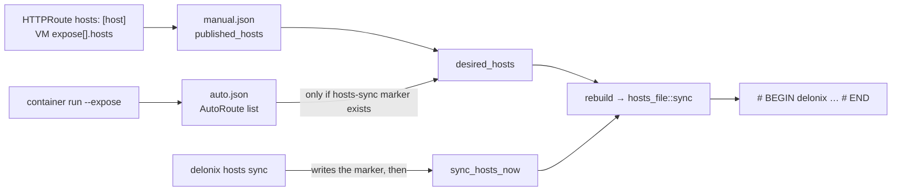

<!-- translated-from: service-names-and-hosts.md sha256:b9b856f54706cbe896f0eccfe8259eb95641bcd2979c1fbb6de35a57fa0b309a -->
# Comment les noms atteignent `/etc/hosts`

**À lire avant :** [Architecture](architecture.md#state-on-disk) (racine d’état, `httproute/`), [Variables d’environnement](environment-variables.md) (`DELONIX_ROOT`, `DELONIX_HOSTS_FILE`) et [Cloner, compiler et tester](build-and-test.md#the-gates-ci-runs) (isoler l’état du moteur).

Une charge de travail sur le SDN n’est pas joignable depuis l’hôte par son IP ; l’entrée, c’est le proxy L7, que le
forward slirp publie sur le loopback. Un navigateur sur la machine de l’opérateur n’ouvre donc
`http://app.example.pt:8080/` que lorsque le nom `app.example.pt` se résout vers `127.0.0.1` (ou vers une
adresse que la route a réservée). Le moteur peut écrire ce mappage pour vous. Cette page explique le mécanisme
unique qui le sous-tend, les deux façons dont un nom y entre, et ce que chacune refuse de faire. Tout ce qui
suit est lu dans les fichiers nommés à côté ; les décisions sont l’ADR-0046 (`hosts: [host]`) et
l’ADR-0048 (`hosts sync`), à lire pour le *pourquoi*.

## Un bloc par racine d’état

Tout cela vit dans `bins/delonix-runtime-bin/src/cmd/hosts_file.rs`. Le moteur ne réécrit jamais le
fichier hosts : il possède **un bloc délimité** et laisse tous les autres octets intacts.

```text
# BEGIN delonix 3fa2c1d0 (managed — do not edit)
127.0.0.1	app.example.pt
127.0.0.1	web.default.svc.delonix.internal
# END delonix 3fa2c1d0
```

- **L’identifiant désigne la racine d’état.** `root_id()` est un hash FNV-1a de `state_root()`, tronqué à 32
  bits et affiché en huit chiffres hexadécimaux. C’est un hash écrit à la main, volontairement : `DefaultHasher` n’a pas
  de promesse de stabilité, et un bloc orphelin à cause d’un changement de hash est un nom qui ne disparaît jamais. Deux racines
  sur une même machine (une racine isolée à côté de la vraie ; root et un utilisateur rootless) possèdent chacune
  leur propre bloc, de sorte qu’aucune n’efface les noms de l’autre quand elle reconstruit.
- **Le bloc est réécrit en entier** (`block`, `render`). Les entrées sont mises en minuscules, triées et
  dédoublonnées, et `render` est pure : elle prend le texte existant et les entrées voulues et renvoie
  le nouveau texte, si bien que les cas qui comptent sont des tests unitaires. Un nom qui n’a plus de source
  n’est simplement pas dans la réécriture suivante ; il n’y a rien à ramasser. Une liste vide supprime le bloc.
- **Le bloc est réécrit sur place**, là où il se trouvait. Les blocs de deux racines n’échangent pas leurs places à chaque
  synchronisation. Les lignes gardent leurs propres fins (CRLF et l’absence de saut de ligne final sont préservés).

### Ce que `render` refuse

Chacun de ces cas est une `Error::Invalid` renvoyée *avant* toute écriture, donc le fichier reste intact :

| Situation | Pourquoi elle est refusée |
|---|---|
| Un nom voulu a déjà une entrée **en dehors** du bloc de cette racine (une ligne écrite à la main, ou le bloc d’une autre racine) | L’opérateur, ou une autre racine, a écrit cette ligne. Une seconde réponse pour le même nom changerait silencieusement l’endroit où il pointe. Les commentaires qui ne font que mentionner le nom ne comptent pas. |
| Un même nom avec **deux adresses différentes** dans la même réécriture | Deux routes le revendiquent depuis des pools différents : le résolveur prendrait la ligne qu’il lit en premier. |
| Le bloc de cette racine a une ligne `# BEGIN` mais **pas de `# END`** | Généralement une modification à la main. Traiter « jusqu’à la fin du fichier » comme le bloc effacerait les lignes écrites à la main et les blocs d’autres racines qui suivent. Le message indique quelle ligne rétablir. |

### Comment il écrit (`sync_at`)

1. Lire le fichier ; `render` ; si le résultat est égal à ce qui a été lu, **retourner sans écrire**. C’est
   pourquoi un manifeste qui n’utilise pas `hosts:` n’a jamais besoin de root.
2. Résoudre les liens symboliques (`canonicalize`), de sorte qu’un fichier hosts en lien symbolique est modifié à travers le lien et que le
   lien n’est pas remplacé par un fichier ordinaire.
3. Prendre un `flock` exclusif sur `.hosts.delonix.lock` à côté de la cible, relire, et refaire `render` si
   le fichier a changé entre-temps. Deux écrivains ne doivent pas entrelacer un lire-modifier-écrire.
4. Écrire un fichier temporaire `.hosts.delonix.<pid>.<nanos>` à côté de la cible, ouvert avec
   `create_new` (`O_EXCL`) : un nom que personne ne peut deviner et qui ne peut pas être créé d’avance comme lien symbolique pour
   rediriger l’écriture. Copier les permissions de la cible, `sync_all` (un crash entre le renommage et
   l’arrivée des données sur le disque ne doit pas laisser une table nom→adresse vide), puis `rename` par-dessus la cible.

Le moteur ne teste pas « suis-je root ? ». Il tente l’écriture et, sur `PermissionDenied`, renvoie une
erreur qui affiche le bloc exact à coller. Une exécution non privilégiée s’arrête donc avec le bloc à
l’écran ; elle ne saute pas le nom en silence. (Si le fichier de verrou ne peut pas être créé, le verrou
n’est simplement pas tenu ; l’écriture échoue alors avec le même message.)

## D’où viennent les noms

Il y a deux entrées, et elles aboutissent dans le même bloc par la même fonction
(`sync` dans `hosts_file.rs`), appelée depuis `rebuild` dans `cmd/ingress_proxy.rs`.



### Chemin A : `hosts: [host]` sur une route (ADR-0046)

`HttpRouteSpec.hosts` (`cmd/httproute.rs`) accepte aujourd’hui une seule valeur, `host` (`HOSTS_TARGETS`) ;
toute autre est refusée à la validation, et le message dit que `containers` requiert l’ADR-0047 et que `guest`
est prévu. Quand une route liste `host`, `apply` enregistre un `PublishedHost { host, source, addr }` par
hôte de règle dans la config manuelle de la route (`published_hosts`, dans `<root>/httproute/manual.json`, ou
`httproute-host/` pour une route servie par le proxy du netns de l’hôte — voir `Where` dans `ingress_proxy.rs`).
`source` est le document qui l’a demandé, pour que le réconciliateur sache à qui appartient le nom, et `remove_for_prune`
puisse retirer exactement les noms de ce document.

Une `VirtualMachine` rejoint le même chemin par `spec.expose[]` (`cmd/vm_expose.rs`) : le sucre
est abaissé au chargement en une `HTTPRoute` synthétique nommée `<vm>-expose`, et `expose[].hosts` y est copié.
La route publie une seule liste pour tous ses noms, donc chaque entrée `expose` doit porter les mêmes
`hosts` ; une différence est une erreur, couverte par
`hosts_are_carried_to_the_route_and_must_agree_across_entries`.

**L’adresse** est `127.0.0.1` sauf si la route a `spec.pool`. Dans ce cas `apply` réserve une adresse
de ce `kind: IPPool` (`cmd/ippool.rs` : `peek`, `claim_moving`, `address_present`) et le nom
pointe vers elle. Deux conditions à connaître : l’adresse doit déjà être sur une interface de l’hôte
(l’apply s’arrête et suggère `ip addr add … dev lo` ; que le moteur l’ajoute lui-même, `announce: l2`, n’est pas
construit), et la réservation est examinée *avant* d’être prise, pour qu’un apply échoué ne laisse pas
un bail tenu. **Le port n’est pas dans le fichier hosts** : un fichier hosts ne peut pas en porter un, donc l’URL que vous
ouvrez a toujours le port de l’entrypoint de la route.

### Chemin B : `delonix hosts sync` (ADR-0048, phase 2)

`cmd/hosts.rs`. Le nom de service standard d’un container enregistré avec `container run --expose` est
`<name>.<ns>.svc.delonix.internal` (`AutoRoute::fqdn`, qui appelle
`delonix_sdn::infra::service_fqdn`). Ces enregistrements sont des entrées `AutoRoute { name, namespace, ip, port }`
dans `<root>/httproute/auto.json`. `hosts sync` est un opt-in explicite :

| Commande | Ce qu’elle fait |
|---|---|
| `delonix hosts sync --print` | Affiche le bloc qui serait écrit (`hosts_block_now`) et ne touche à rien, donc n’a pas besoin de root. |
| `delonix hosts sync` | Écrit le marqueur `<root>/hosts-sync`, puis réécrit le bloc (`sync_hosts_now`). Si l’écriture est refusée, le marqueur est retiré, pour qu’une première exécution échouée ne laisse pas les `--expose` suivants avertir d’un bloc que personne n’a accepté. |
| `delonix hosts sync --off` | Retire le marqueur et réécrit le bloc. |

Une fois le marqueur présent, `desired_hosts` inclut les noms des auto-routes, et `container run --expose`
(`auto_register`) et `container rm` (`auto_deregister`) reconstruisent le bloc d’eux-mêmes. Les noms automatiques
pointent toujours vers `127.0.0.1` ; le `--expose` d’un container n’a pas de pool. Les noms `hosts:` des routes
déclarées ne sont **pas** publiés par `hosts sync` (leur propre opt-in prévaut), et `--off` ne retire donc
que les noms automatiques : les noms demandés par le `hosts: [host]` d’une route restent dans le bloc. Le message
propre à la commande (« service names removed ») concerne les premiers.

### Deux sortes de noms, deux politiques d’échec

`desired_hosts` renvoie une paire : les noms qu’un **document a demandés** (`strict`) et les noms **publiés par
`hosts sync`**. `rebuild` appelle `hosts_file::sync` et, en cas d’échec :

- avec **aucun** nom strict, il n’affiche qu’un `warning: …` (un `container run
  --expose` non privilégié ne doit pas échouer parce que `/etc/hosts` requiert root) ;
- avec **au moins un** nom strict présent, il renvoie l’erreur et l’apply échoue.

Lisez bien cette condition : elle regarde si des noms stricts existent dans le bloc, pas quel
nom a causé l’échec. Ainsi, tant qu’une route avec `hosts: [host]` est déclarée, une écriture qui échoue à cause
d’un seul nom automatique fait aussi échouer l’opération qui a déclenché la reconstruction.

## L’exécuter en root : `sudo`

`delonix hosts sync` appelle d’abord `cmd::vmbridge::adopt_invoking_user_root()`. Sous `sudo`, la racine d’état
serait celle de root (`/var/lib/delonix`), qui n’a aucun enregistrement, et la commande publierait
zéro nom au lieu de ceux de l’utilisateur appelant. La fonction lit `SUDO_USER`, cherche son home avec
`getent passwd`, et fixe `DELONIX_ROOT` à `<home>/.local/share/delonix`. Un `DELONIX_ROOT` explicite
prévaut, et hors `sudo` rien ne change. L’identifiant du bloc est le hash de la racine obtenue, donc
`sudo delonix hosts sync` et le `delonix container run --expose` de l’utilisateur s’accordent sur le même
bloc.

## Le tester sans toucher à `/etc/hosts`

Définissez `DELONIX_HOSTS_FILE` (lue par `hosts_path()`) et isolez l’état, comme le décrit
[Cloner, compiler et tester](build-and-test.md#the-gates-ci-runs). Le chemin B n’a besoin ni de proxy ni de
container pour *écrire* le bloc, seulement du fichier d’enregistrements, vous pouvez donc le fabriquer :

```bash
S=$(mktemp -d)                                   # or your scratch directory
export DELONIX_ROOT=$S/root DELONIX_NET_RUNTIME_DIR=$S/run DELONIX_HOSTS_FILE=$S/hosts
mkdir -p "$DELONIX_ROOT/httproute" "$DELONIX_NET_RUNTIME_DIR"
printf '127.0.0.1\tlocalhost\n' > "$DELONIX_HOSTS_FILE"
printf '[{"name":"web","namespace":"default","ip":"10.210.0.5","port":80}]' \
  > "$DELONIX_ROOT/httproute/auto.json"

delonix hosts sync --print      # the block, nothing written
delonix hosts sync              # writes it into $DELONIX_HOSTS_FILE
delonix hosts sync --off        # removes it; the rest of the file is as it was
```

Exécuté ainsi, le moteur a affiché le bloc pour `--print` sans créer `hosts-sync` ; `hosts sync`
a écrit le bloc après la ligne `localhost` existante et créé le marqueur ; `--off` a retiré le marqueur
et laissé le fichier tel qu’il était ; une ligne écrite à la main pour le même nom a fait échouer `hosts sync` avec la
ligne fautive, sans rien écrire ; et un fichier hosts dans un répertoire en lecture seule l’a fait échouer avec le bloc
à coller et **retirer de nouveau le marqueur**. (`--off` affiche « removed from /etc/hosts » quoi que dise
`DELONIX_HOSTS_FILE` ; le message est un texte fixe.) Le chemin A n’a été vérifié que jusqu’à la validation :
`hosts: [guest]` est refusé avec le message ci-dessus, et `stack apply --dry-run` conserve `hosts: [host]`
dans le document rendu. Aucun proxy n’a été démarré.

Les tests unitaires de `hosts_file.rs` exercent `render` et `sync_at` directement (`sync_at` prend le chemin
pour que les tests ne touchent jamais l’environnement du processus). Lancez `cargo test -p delonix-runtime-bin hosts_file`.

## Ce qui n’est pas validé

Dites-le dans une revue plutôt que de le supposer :

- **Le vrai `/etc/hosts`.** Chaque exécution ci-dessus a utilisé un fichier temporaire. Écrire le vrai fichier, en root,
  n’a pas été observé par cette page.
- **Un client qui résout un nom du bloc et atteint le backend.** L’ADR-0046 consigne que cette étape de trafic
  n’a pas non plus été observée (le bloc, les refus et la suppression ont été mesurés).
  Le sucre `expose:` avec `hosts:` a été couvert par des tests unitaires et `--dry-run`, pas par du trafic.
- **`hosts: guest`** et **`announce: l2`** ne sont pas construits : `guest` est refusé par la validation, et une
  adresse qui n’est pas sur l’hôte est refusée au lieu d’être ajoutée.
- **La maintenance automatique requiert un processus capable d’écrire le fichier.** Un `container run
  --expose` rootless après `sudo delonix hosts sync` se contente d’avertir quand il ne peut pas réécrire `/etc/hosts` ;
  le bloc garde alors les anciens noms jusqu’à ce que quelque chose disposant de la permission le réécrive.
- Le côté **suppression** de la politique d’échec ci-dessus (un `rm` qui ne peut pas écrire le fichier) a été lu
  dans le code, pas exécuté sans root.

## Où lire ensuite

- `cmd/hosts_file.rs` pour le mécanisme, `cmd/ingress_proxy.rs` (`desired_hosts`, `rebuild`,
  `hosts_block_now`, `sync_hosts_now`, `hosts_sync_flag`) pour les deux entrées.
- `docs/adr/0046-vm-expose-ippool-hosts.md` et `docs/adr/0048-service-names-and-credentials.md` pour
  les décisions et ce que chacune dit avoir été mesuré.

---

**Ensuite :** [Conventions de code](coding-conventions.md) — comment le code de ce dépôt doit être écrit, chaque règle étant associée au gate ou à la décision qui la justifie.
