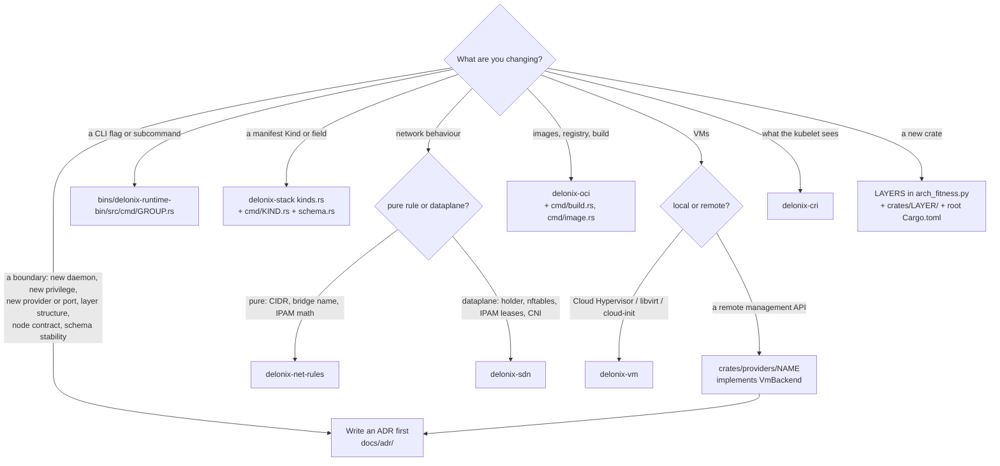

<!-- translated-from: start-here.md sha256:330654e7ab818b3b9bb88817dac83eae2f11aae1306174d0bf5b83c6c165de11 -->
# Commencer ici

Cette page vous mène de « je viens de cloner le dépôt » à « ma première pull request est en cours de revue »,
une étape à la fois. Après elle, vous aurez un checkout qui compile, un binaire que vous pouvez
exécuter contre un état isolé, et une carte de l’endroit où va votre modification et des règles
qu’elle doit respecter. Chaque étape dit quoi faire, ce que vous devriez voir, et quelle page explique les
détails. Chaque règle de cette page renvoie à l’endroit où elle est écrite — si une règle n’a pas de lien, ce
n’est pas une règle.

Si un mot vous est inconnu, cherchez-le dans le [glossaire](glossary.md).

## Jour 0 en 30 minutes

Le jour 0 suit l’ordre du manuel, mais ne prend de chaque partie que ce dont vous avez besoin
aujourd’hui : l’idée du moteur ([IaaS et cloud native](iaas-and-cloud-native.md)), l’hôte dont il a
besoin ([Préparer votre environnement](environment.md), qui s’appuie sur les primitives dans
[Fondations Linux](linux-foundations.md)), une compilation et une exécution isolée
([Cloner, compiler et tester](build-and-test.md), avec chaque variable dans
[Variables d’environnement](environment-variables.md)), et où se trouvent les choses
([Structure du projet](project-structure.md)). Revenez aux pages complètes quand une étape vous y
renvoie.

### Ce qu’est Delonix (5 minutes)

Delonix Runtime est un moteur qui exécute des **containers et des microVMs sur un nœud**, avec le
réseau et le stockage dont ils ont besoin. Il est :

- **déclaratif** — vous décrivez les ressources avec ses propres Kinds (`delonix api-resources` les liste)
  et le moteur planifie et applique la différence ;
- **daemonless** — aucun service en arrière-plan n’est nécessaire ; chaque commande est un processus qui fait son travail
  et se termine ;
- **rootless-first** — le chemin normal s’exécute sous votre propre utilisateur non privilégié.

Il ne sait **pas** qui l’utilise : aucune notion de plateforme, de locataire, de compte ou de facturation n’existe dans le
code. Lisez [IaaS et cloud native](iaas-and-cloud-native.md#where-delonix-runtime-fits-and-where-it-deliberately-stops)
pour savoir quelle place cela donne au moteur dans un cloud, et [Architecture](architecture.md#engine-identity-and-boundaries)
pour la façon dont la frontière est imposée ; pour l’instant, ces quatre phrases suffisent.

### Ce dont vous avez besoin (10 minutes)

Un hôte Linux avec cgroup v2 et les user namespaces non privilégiés, la toolchain Rust épinglée dans
`rust-toolchain.toml`, et `protoc` dans votre `PATH`. La liste complète, et les pièges de l’hôte qui ressemblent à
des bugs du moteur, se trouvent dans [Préparer votre environnement](environment.md). Lisez au moins sa section
[Pièges connus de l’hôte](environment.md#known-host-traps) avant l’étape 5 ci-dessous. Si
« user namespace » ou « délégation de cgroup » sont des mots nouveaux pour vous, l’explication en pratique se trouve
dans [Fondations Linux](linux-foundations.md) — vous n’en avez pas besoin pour terminer le jour 0, mais vous en
aurez besoin la première fois qu’une limite ne s’appliquera pas.

### Cinq commandes qui prouvent que votre configuration fonctionne (15 minutes)

Exécutez-les depuis la racine de votre checkout. Si l’une d’elles ne donne pas la forme indiquée, arrêtez-vous et
corrigez le problème avant d’aller plus loin — chaque étape suivante en dépend.

**1. Clonez, avec les tags.**

```bash
git clone https://github.com/angolardevops/delonix-runtime.git
cd delonix-runtime
git fetch --tags origin
git describe --tags --abbrev=0        # prints the newest release, e.g. vX.Y.Z
```

Les tags comptent : le gate (contrôle CI) de version et le gate de contrat comparent votre branch avec eux
([Cloner, compiler et tester](build-and-test.md#clone)).

**2. Compilez la CLI.**

```bash
cargo build -p delonix-runtime-bin
```

Attendu : `Finished` sur la dernière ligne et un binaire dans `target/debug/delonix`. S’il s’arrête avec un
message au sujet de `protoc`, installez-le ([Préparer votre environnement](environment.md#protoc-required-to-build)).

**3. Exécutez les tests d’un petit crate pur.**

```bash
cargo test -p delonix-net-rules
```

`delonix-net-rules` n’a aucune dépendance (voir son `Cargo.toml`), donc cela prouve seulement que
votre toolchain compile et exécute des tests — rien sur l’hôte. Attendu : une ligne de la forme
`test result: ok. N passed; 0 failed`.

**4. Exécutez le binaire que vous venez de compiler.**

```bash
./target/debug/delonix --version
./target/debug/delonix --help
```

Attendu : `--version` affiche `delonix <version>` sur la première ligne, une description du
moteur en une ligne sur la deuxième, puis une ligne de la forme `commit: <sha> · built: <date> · <licence>` ;
entre deux releases, la partie `commit:` indique aussi à quelle distance le build se trouve du dernier tag
(`+N commits since vX.Y.Z`). Un court bloc `get started:` suit. `--help` affiche
`Usage: delonix [OPTIONS] <COMMAND>`, une liste `Commands:` et une `COMMAND MAP`.

Utilisez toujours `./target/debug/delonix`, jamais un `delonix` trouvé dans votre `PATH` — celui-là est une
release installée et est généralement plus ancien ([Préparer votre environnement](environment.md#a-stale-delonix-on-your-path)).

**5. Exécutez une vraie commande, entièrement isolée.**

Tout ce qui va au-delà de `--help` lit et écrit l’état du moteur. Faites d’abord pointer **les deux** variables d’état vers des
répertoires de travail jetables — une demi-isolation est pire que pas d’isolation du tout
([Cloner, compiler et tester](build-and-test.md#isolating-the-engines-state) ; ce que fait chaque variable
se trouve dans [Variables d’environnement](environment-variables.md#isolating-a-development-run)) :

```bash
export DELONIX_ROOT=$HOME/scratch/dlx/root
export DELONIX_NET_RUNTIME_DIR=/tmp/dlx-run      # keep it short: it holds unix sockets
mkdir -p "$DELONIX_ROOT" "$DELONIX_NET_RUNTIME_DIR"

./target/debug/delonix system info
./target/debug/delonix volume create hello
./target/debug/delonix volume ls
./target/debug/delonix volume inspect does-not-exist; echo "exit=$?"
./target/debug/delonix volume rm hello
```

Formes attendues :

```text
$ delonix system info
Delonix Engine <version>
  state root:         <your $DELONIX_ROOT>
  mode:               rootless (daemonless)
  cgroup2 delegated:  yes | no
  network infra:      down (comes up on demand)
  containers:         0 (0 running)
  events:             0

$ delonix volume ls
NAME    DRIVER   MOUNTPOINT                              SIZE
hello   local    <your $DELONIX_ROOT>/volumes/hello/_data   0 B

$ delonix volume inspect does-not-exist; echo "exit=$?"
error no such volume does-not-exist
exit=4
```

Ce que cela prouve : la ligne `state root:` est **votre répertoire jetable** (vous ne touchez donc pas à l’état
réel), le moteur s’exécute en rootless, et les erreurs portent une classe dans le code de sortie (4 = introuvable — voir
[Initiation à Rust pour cette base de code](rust-primer.md#32-errors-one-error-and-exit-codes-derived-from-its-type)). Si
`cgroup2 delegated:` indique `no`, `container run` refuse `-m`/`--cpus`/`--cpu-weight` dans cette
session (sortie 69) et `--cpuset`/`--io-weight` n’ont aucun effet ; il s’agit d’un réglage de l’hôte, expliqué dans
[Préparer votre environnement](environment.md#cgroup-delegation-some-limits-are-refused-others-are-not-enforced).

Lorsque vous aurez fini d’expérimenter avec le réseau plus tard, démontez l’infrastructure réseau isolée avec
les deux mêmes variables exportées : `./target/debug/delonix net netns down`.

## Votre première contribution, de bout en bout

### 1. Choisissez un sujet

- Consultez les issues ouvertes portant l’étiquette **`good first issue`** ou **`documentation`** sur GitHub. Commentez
  l’issue avant de commencer, pour que deux personnes ne fassent pas le même travail.
- Pour tout ce qui n’est pas trivial — une nouvelle commande, un nouveau Kind de manifeste, une modification de la configuration des namespaces ou des
  cgroups, un nouveau backend — ouvrez d’abord une issue et mettez-vous d’accord sur l’approche
  ([`CONTRIBUTING.md`](../../../CONTRIBUTING.md), [Flux de contribution](contributing-workflow.md)).
- Vérifiez les pull requests ouvertes pour ne pas dupliquer un travail déjà en cours.

Bons premiers domaines, parce que ce sont du code pur avec des tests unitaires et sans privilèges sur l’hôte : un parseur ou
un validateur dans le crate de la CLI, un message d’erreur qui ne dit pas quoi faire, une entrée portugaise
manquante dans `bins/delonix-runtime-bin/data/pt.po`, ou une page de ce manuel qui est fausse.

### 2. Ouvrez un worktree à partir de `origin/main`

Une tâche, un worktree, une branch — ne modifiez jamais un checkout partagé, ne placez jamais le worktree dans `/tmp`
([Un worktree par tâche](contributing-workflow.md#one-worktree-per-task)) :

```bash
git fetch --tags origin
git worktree add -b <topic>/<task> ../.worktrees/delonix-runtime/<task> origin/main
cd ../.worktrees/delonix-runtime/<task>
git log --oneline -- <path you will touch>      # what was already decided or fixed there
```

Lire d’abord l’historique de la zone fait partie du travail : une grande partie de ce code consigne des choses qui
ont été essayées, mesurées et modifiées ([Partez du dernier tag](contributing-workflow.md#start-from-the-latest-tag-not-from-memory)).

### 3. Trouvez où va la modification

Utilisez l’arbre de décision de [Où va ma modification ?](#where-does-my-change-go) ci-dessous, puis lisez la
section de [Les crates](crates.md) consacrée à ce crate. Si un chemin de la table ne vous dit encore rien,
[Structure du projet](project-structure.md) explique chaque répertoire de premier niveau, et pourquoi le
répertoire d’un crate est sa couche.

### 4. Écrivez le test d’abord

- Une nouvelle fonction pure (parseur, validateur, constructeur d’arguments, plan) reçoit un test unitaire dans le même fichier,
  sous `#[cfg(test)] mod tests`. Un test ne touche jamais la racine d’état réelle : passez-lui un
  répertoire temporaire — voir [Tests](rust-primer.md#39-tests).
- Une correction de bug reçoit un test qui **échoue sans la correction**. Annulez votre correction une fois, exécutez le test, voyez-le
  échouer, puis rétablissez la correction. Un test qui passe dans les deux cas ne prouve rien.
- Une modification des namespaces, des cgroups, du holder réseau ou du démarrage des VM nécessite aussi une exécution **réelle** avec
  l’état isolé, parce que les tests unitaires n’atteignent pas ces chemins
  ([Exécuter les tests](build-and-test.md#run-the-tests)).

### 5. Exécutez les gates locaux

Chaque job de CI a une commande locale, listée dans
[Les gates exécutés par la CI](build-and-test.md#the-gates-ci-runs). Au minimum, avant de demander une
revue :

```bash
cargo fmt --all --check
cargo clippy --workspace --all-targets --locked -- -D warnings
cargo test --workspace --locked --no-fail-fast
python3 scripts/lang_ratchet.py
python3 scripts/arch_fitness.py
python3 scripts/dev_docs.py --check
python3 scripts/version_gate.py
```

Ajoutez ceux qui correspondent à ce que vous avez touché (les gates de surface de la CLI si vous avez ajouté une commande, le gate de
contrat si vous avez touché `proto/`, le générateur de documentation si le texte d’aide a changé) — le tableau de
[Les gates exécutés par la CI](build-and-test.md#the-gates-ci-runs) indique lesquels.

### 6. Rédigez la pull request

Ouvrez-la contre `main` et remplissez chaque section de
[`.github/PULL_REQUEST_TEMPLATE.md`](../../../.github/PULL_REQUEST_TEMPLATE.md). Le modèle comporte quatre
parties, et les relecteurs les lisent toutes :

- **What does this change do, and why?** — le *pourquoi* ; le diff montre déjà le *quoi*.
- **How was this tested?** — les gates que vous avez exécutés et, pour le code du runtime, des namespaces, des cgroups ou du réseau, la
  commande que vous avez exécutée **en réel** et sa sortie.
- **Checklist** — build/clippy/fmt/test propres ; nouvelles chaînes visibles par l’utilisateur en anglais, enveloppées dans
  `po::t`/`po::tf` avec une entrée portugaise dans `pt.po` ; chaque point d’entrée d’une commande câblé ; tests unitaires
  pour les nouvelles fonctions pures ; frontières de privilège signalées.
- **Does this cross a privilege or namespace boundary?** — mappage de user namespace, le netns du holder,
  le socket de contrôle, `setns`/`unshare`, ou un traitement de chemins piloté par une entrée de l’utilisateur ou du manifeste. Si vous
  n’êtes pas sûr, dites-le.

Dites ce qui a été prouvé **et** ce qui n’a pas été validé, et pourquoi
([Commits et pull requests](contributing-workflow.md#commits-and-pull-requests)).

### 7. Ce que vérifient les relecteurs

Les propriétaires du code listés dans [`.github/CODEOWNERS`](../../../.github/CODEOWNERS) relisent chaque modification. La
liste de contrôle de la revue se trouve dans [Conventions de code](coding-conventions.md) ; les standards cloud native à l’aune
desquels une modification est mesurée se trouvent dans [Standards cloud native](cloud-native-standards.md). Lisez
les deux avant d’ouvrir la PR, pas après la première série de commentaires.

### 8. Après le merge

Supprimez le worktree **et** la branch — la branch survit à `worktree remove` :

```bash
cd ../../../delonix-runtime    # from the worktree of step 2 back to the clone
git worktree remove ../.worktrees/delonix-runtime/<task>
git branch -D <topic>/<task>
```

## Où va ma modification ?



| Modification | Où elle va (vérifié dans l’arborescence) | À lire | Règle et sa source |
|---|---|---|---|
| **Nouvelle option ou sous-commande de la CLI** | `bins/delonix-runtime-bin/src/cmd/<group>.rs` (un module par groupe) ; chaînes via `cmd/po.rs` avec le portugais dans `data/pt.po` ; texte du manuel dans `cmd/manual_entries.rs` ; liste des feuilles dans `scripts/cli_baseline.tsv` (`scripts/cli-tree.sh --update`). La validation pure d’une exécution appartient à `crates/contexts/delonix-compute/src/preflight.rs` | [Ajouter ou modifier une commande de la CLI](contributing-workflow.md#adding-or-changing-a-cli-command), [La CLI](rust-primer.md#36-the-cli-clap-derive-and-translated-output) | LANG-01 (`scripts/lang_ratchet.py`) ; gate de surface de la CLI (`scripts/cli-tree.sh --gate`, `scripts/docs_cli_gate.py`) ; câbler chaque point d’entrée (`CONTRIBUTING.md`) |
| **Nouveau Kind, ou un champ d’un Kind** | Les faits du Kind : `FACTS` dans `crates/contexts/delonix-stack/src/kinds.rs`. Son type de spec et son apply : `bins/delonix-runtime-bin/src/cmd/<kind>.rs`. Champs modifiables à chaud : `hot_fields` dans `crates/contexts/delonix-stack/src/reconcile.rs`. Le schéma : `TYPED_KINDS` dans `cmd/schema.rs`, et le `docs/schema/v1/delonix.json` publié (`delonix manifest schema`) | [Réconciliation déclarative](cloud-native-primer.md#48-declarative-reconciliation), [`delonix-stack`](crates.md#delonix-stack) | Ouvrir d’abord une issue (`CONTRIBUTING.md`) ; le schéma est généré à partir du code ([ADR-0007](../../adr/0007-generated-manifest-schema.md)) ; les tests de `kinds.rs` et `schema.rs` échouent lorsqu’une table est oubliée |
| **Comportement réseau** | Règles pures sans I/O : `crates/foundation/delonix-net-rules/src/lib.rs`. Dataplane (holder, socket de contrôle, nftables, IPAM, CNI) : `crates/adapters/delonix-sdn/src/` (`infra.rs`, `ipam.rs`, `cni.rs`). L’étape réseau de `container run` : `crates/contexts/delonix-compute/src/network.rs`. CLI : `cmd/network.rs`, `cmd/net.rs`, `cmd/firewall.rs` | [Réseau des containers](cloud-native-primer.md#45-container-networking), [`delonix-sdn`](crates.md#delonix-sdn) | Rootless-first et pas d’échec silencieux ([Règles d’architecture](contributing-workflow.md#architecture-rules-the-gates-enforce)) ; signaler la frontière de privilège dans la PR (`SECURITY.md`) |
| **Images, registre, build** | `crates/adapters/delonix-oci/src/` (`registry.rs`, `build.rs`, `cas.rs`, `overlay.rs`) ; CLI dans `cmd/build.rs`, `cmd/image.rs` | [Delonixfile et VMfile](delonixfile-and-vmfile.md), [`delonix-oci`](crates.md#delonix-oci) | Les téléchargements sont vérifiés par digest (`SECURITY.md`, périmètre supply chain) |
| **État persisté : un champ d’enregistrement, un store, le verrouillage de fichiers, les secrets au repos** | Types d’enregistrement (`Container`, `Vm`) : `crates/contexts/delonix-compute/src/record.rs` ; les parties de données simples (`Status`, `ContainerFw`) : `crates/foundation/delonix-model/src/records.rs`. Comment ils sont stockés et verrouillés (`Store`, `JsonStore`, `write_atomic*`, `SecretStore`, `CredVault`) : `crates/adapters/delonix-state/src/` (`store.rs`, `secret.rs`, `cred_vault.rs`) | [`delonix-state`](crates.md#delonix-state), [L’état sur disque](architecture.md#state-on-disk), [Concurrence](rust-primer.md#38-concurrency-and-shared-state) | Les nouveaux champs d’enregistrement prennent `#[serde(default)]` ; la lecture-modification-écriture passe par `update` ([État et concurrence](coding-conventions.md#8-state-and-concurrency)) |
| **Comportement des VM sur ce nœud** | `crates/adapters/delonix-vm/src/lib.rs` (le trait `VmBackend` et le registre de backends), `cloudinit.rs` ; CLI dans `cmd/vm.rs`, `cmd/vmimage.rs`, `cmd/vmfile.rs` | [Construire des microVMs](microvm-setup.md), [Les traits comme ports](rust-primer.md#33-traits-as-ports-vmbackend-and-the-backend-registry) | [ADR-0008](../../adr/0008-proxmox-vm-backend.md) (les backends sont enregistrables) |
| **Un nouveau backend de VM ou provider de stockage derrière une API distante** | Un nouveau crate sous `crates/providers/`, qui implémente un port ; enregistré à la racine de composition (`cmd/vmbackends.rs`) | [Providers](crates.md#providers), [Les couches](architecture.md#layers-and-the-allowed-direction) | ADR d’abord ([Quand écrire un ADR](contributing-workflow.md#when-to-write-an-adr)) ; [ADR-0040](../../adr/0040-engine-restructuring-layers-ports-node-contract.md) |
| **CRI (ce à quoi parle le kubelet)** | `crates/interfaces/delonix-cri/src/` (`runtime_svc.rs`, `runtime_svc/lifecycle.rs`, `streaming.rs`) | [Kubernetes](cloud-native-primer.md#46-kubernetes-cri-kubelet-kubeadm-and-kind), [`delonix-cri`](crates.md#delonix-cri) | [ADR-0038](../../adr/0038-cri-follows-kubelet-resource-model.md) |
| **Un nouveau crate** | Une entrée dans `LAYERS` dans `scripts/arch_fitness.py`, un répertoire sous `crates/<layer>/`, et son chemin dans `[workspace.dependencies]` du `Cargo.toml` racine — le tout dans le même commit | [Les couches](architecture.md#layers-and-the-allowed-direction) | `scripts/arch_fitness.py` (répertoire = couche, versions uniquement à la racine) |
| **Une décision qui déplace une frontière** | `docs/adr/NNNN-title.md`, avant le code | [Quand écrire un ADR](contributing-workflow.md#when-to-write-an-adr) | [`docs/adr/README.md`](../../adr/README.md) ; les ADR acceptés sont remplacés par un successeur, jamais réécrits |

Si votre modification ne correspond à aucune ligne, posez la question dans l’issue avant d’écrire du code (voir
[Quand vous êtes bloqué](#when-you-are-stuck)).

## Les règles à ne pas enfreindre

Chaque règle est imposée par un gate, par une revue, ou par les deux. Le lien indique où elle est écrite.

| Règle | Source |
|---|---|
| **Le moteur ne connaît aucun consommateur.** Aucun produit, plateforme, control plane, console ou agent qui utilise le moteur n’est nommé dans `crates/`, `bins/`, `proto/` ou les manifestes, commentaires compris ; aucune notion de locataire, de compte, d’offre ou de facturation. | *«Identidade e fronteira do motor»* en tête de [`AGENTS.md`](../../../AGENTS.md). Les consommateurs nommés sont imposés par `CONSUMER_NAMES` dans `scripts/arch_fitness.py` (une liste fixe de noms, recherchés par expression régulière) ; l’interdiction des notions de locataire, de compte, d’offre et de facturation n’est vérifiée par aucun gate et est contrôlée en revue |
| **Daemonless.** Aucun processus résident par défaut ; un nouveau exige un ADR avec la preuve de ce que systemd ne pouvait pas faire. | [`AGENTS.md`](../../../AGENTS.md) (même section) ; [Règles d’architecture](contributing-workflow.md#architecture-rules-the-gates-enforce) |
| **Rootless-first.** Le chemin normal s’exécute sans privilège ; le privilège est un opt-in explicite et annoncé. Une nouvelle frontière de privilège exige un spike GO/NO-GO et un ADR. | [`AGENTS.md`](../../../AGENTS.md) ; [Quand écrire un ADR](contributing-workflow.md#when-to-write-an-adr) |
| **Les dépendances pointent vers l’intérieur, le répertoire est la couche, les versions ne vivent qu’à la racine.** | [ADR-0040](../../adr/0040-engine-restructuring-layers-ports-node-contract.md) ; `scripts/arch_fitness.py` |
| **LANG-01 : le code est en anglais.** Identifiants, commentaires et messages en anglais ; le portugais uniquement via `pt.po`. | [Langue](contributing-workflow.md#language-english-in-the-code-lang-01) ; `scripts/lang_ratchet.py` |
| **Alignement de version.** Ne modifiez pas `version` dans le `Cargo.toml` racine dans une PR de fonctionnalité ; votre branch doit contenir le tag le plus récent. | [Alignement de version](contributing-workflow.md#version-alignment) ; `scripts/version_gate.py` |
| **Un worktree par tâche**, en dehors de `/tmp`, ajoutez les fichiers par nom, supprimez le worktree et la branch à la fin. | [Un worktree par tâche](contributing-workflow.md#one-worktree-per-task) |
| **N’exécutez jamais le moteur, la batterie E2E ou le harnais de chaos contre l’état réel.** Exportez à la fois `DELONIX_ROOT` et `DELONIX_NET_RUNTIME_DIR` ; ne définissez pas `E2E_SHARED_STATE=1` sauf si vous diagnostiquez votre propre hôte. | [Isoler l’état du moteur](build-and-test.md#isolating-the-engines-state), [E2E](build-and-test.md#end-to-end-battery-scriptse2esh), [chaos](build-and-test.md#chaos-harness-scriptschaossh) |
| **Les modifications sensibles pour la sécurité sont signalées**, et les vulnérabilités sont signalées en privé, jamais dans une issue ou une PR publique. | [`SECURITY.md`](../../../SECURITY.md) ; [Modifications sensibles pour la sécurité](contributing-workflow.md#security-sensitive-changes) |

## Quand vous êtes bloqué

Cherchez dans cet ordre — chaque étape coûte moins cher que la suivante :

1. **Ce manuel.** Le [README](README.md) contient la liste des pages ; le [glossaire](glossary.md)
   explique le vocabulaire.
2. **[`AGENTS.md`](../../../AGENTS.md)**, organisé par domaine. Il est long et en partie historique (et
   en partie en portugais) : utilisez-le pour savoir *où* chercher, puis confirmez dans le code.
3. **L’index des ADR**, [`docs/adr/README.md`](../../adr/README.md) — la décision derrière une structure,
   et ce qui a été rejeté.
4. **L’historique du fichier** : `git log --oneline -- <path>` et `git log -p -S '<symbol>'`. Ici, les messages
   de commit expliquent le pourquoi.

Si vous êtes toujours bloqué, **demandez** sur GitHub :

- Commentez l’issue sur laquelle vous travaillez, ou ouvrez-en une nouvelle avec
  [le modèle de demande de fonctionnalité](../../../.github/ISSUE_TEMPLATE/feature_request.md) (pour les questions
  sur une approche) ou [le modèle de rapport de bug](../../../.github/ISSUE_TEMPLATE/bug_report.md).
- Un problème de sécurité passe par le [signalement privé de vulnérabilités](../../../SECURITY.md), pas par une issue.

Le modèle de rapport de bug demande :

- la sortie de `delonix --version` ;
- la distribution et la version du noyau, rootless ou root, et si vous avez installé avec `install.sh`,
  téléchargé un binaire, ou compilé depuis les sources ;
- la commande ou le manifeste exact qui le déclenche ;
- ce que vous attendiez, et la sortie **complète, non tronquée** de ce qui s’est réellement passé ;
- s’il se reproduit à chaque fois, parfois, ou une seule fois ;
- tout autre élément qui pourrait être pertinent.

Ce manuel recommande en plus deux choses que le modèle ne demande pas, parce qu’elles évitent un
aller-retour :

- la sortie **complète** de `--version` du binaire que vous avez exécuté, y compris la ligne `commit:` (entre
  deux releases, chaque build annonce le même numéro de version, et seul le commit permet de les distinguer) ;
- si `DELONIX_ROOT`/`DELONIX_NET_RUNTIME_DIR` étaient définies, et ce que vous avez déjà lu et essayé
  (la page, la section de `AGENTS.md`, l’ADR).

## Liste de progression

- [ ] J’ai lu ce qu’est Delonix et les quatre principes ([Architecture](architecture.md#engine-identity-and-boundaries)).
- [ ] Mon hôte satisfait [Préparer votre environnement](environment.md), et j’ai lu les pièges connus de l’hôte.
- [ ] `cargo build -p delonix-runtime-bin` se termine.
- [ ] `cargo test -p delonix-net-rules` affiche `test result: ok`.
- [ ] `./target/debug/delonix --help` fonctionne, et j’ai cessé d’utiliser le `delonix` de mon `PATH`.
- [ ] `delonix system info` affiche mon `DELONIX_ROOT` jetable comme racine d’état.
- [ ] J’ai choisi une issue et je l’ai commentée (ou j’en ai ouvert une pour une modification non triviale).
- [ ] Je travaille dans mon propre worktree créé à partir de `origin/main`.
- [ ] J’ai trouvé où va la modification et lu la section de ce crate dans [Les crates](crates.md).
- [ ] J’ai écrit un test qui échoue sans ma modification.
- [ ] Les gates locaux de [Cloner, compiler et tester](build-and-test.md#the-gates-ci-runs) passent.
- [ ] J’ai lu [Conventions de code](coding-conventions.md) et [Standards cloud native, couche par couche](cloud-native-standards.md).
- [ ] Ma PR remplit chaque section du modèle, y compris ce qui n’a *pas* été validé.
- [ ] Après le merge, j’ai supprimé mon worktree et ma branch.

---

**Suivant :** [IaaS et cloud native — où s’inscrit le moteur](iaas-and-cloud-native.md) — le modèle mental d’une IaaS, quelle couche est ce moteur, et comment les principes cloud native apparaissent dans ses fichiers.
