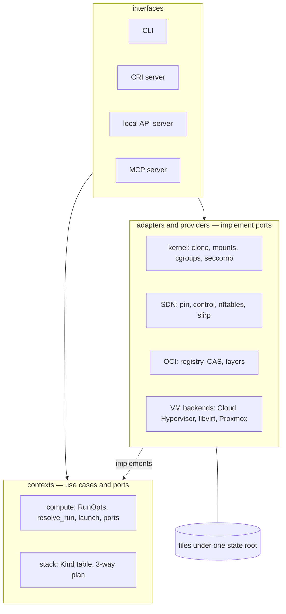
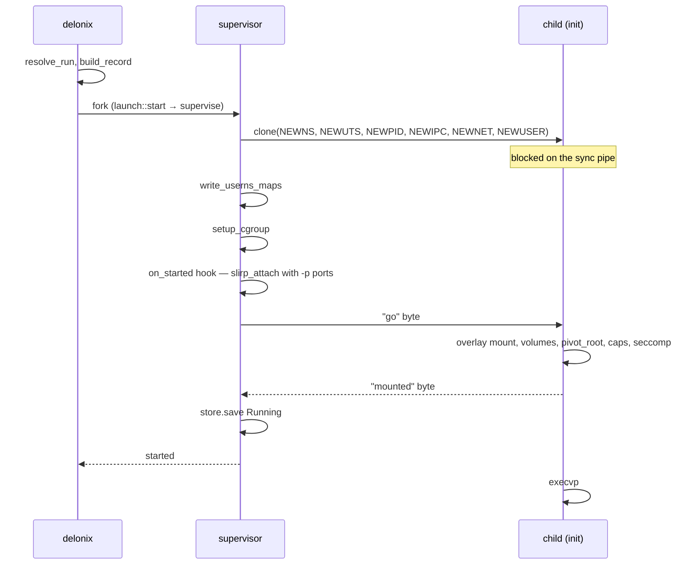
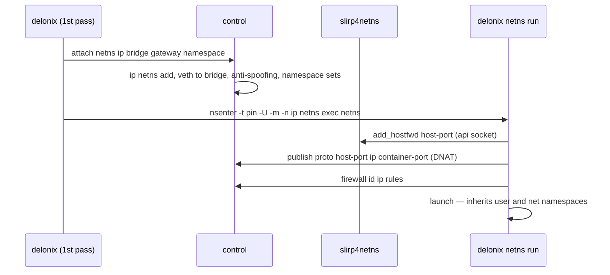
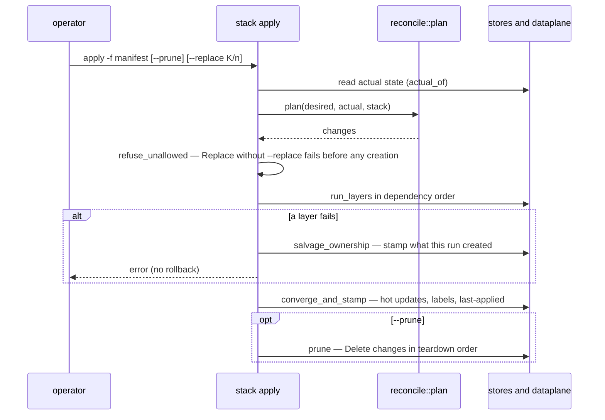

<!-- translated-from: system-design-interview.md sha256:bfd271752cdd492aaae69b15c607340620c6f409a64f4a8ec7fd97b582bdca71 -->
# Entretien de conception de système — le Delonix Engine

> **Recruteur :** Concevez un moteur de containers et de microVMs pour un seul nœud Linux. Il doit
> fonctionner sans root par défaut, sans daemon résident, et il ne doit pas savoir qui l'appelle.

Cette page répond à cet énoncé comme le ferait un bon candidat, puis confronte chaque réponse à ce
que fait réellement le Delonix Engine. Chaque analyse approfondie se termine par **Où cela se trouve
dans le code**, qui liste les fichiers et les symboles lus pour cette page. Pour la carte structurelle
(couches, graphe des crates, processus, chemins d'état), lisez d'abord
[Architecture](architecture.md) ; cette page traite de *pourquoi* la conception a cette forme.

Les chiffres cités ci-dessous sont des **mesures consignées dans le dépôt avec leur date ou leur
release**, et non des faits intemporels. Mesurez à nouveau avant de vous appuyer sur l'un d'eux.

---

## 1. Exigences

> **Candidat :** Avant de dessiner des boîtes, je veux fixer ce que « terminé » veut dire.

### Fonctionnelles

- Exécuter des **containers** à partir d'images OCI : pull, décompression, création, démarrage,
  arrêt, exec, logs, suppression.
- Exécuter des **microVMs** à partir d'images disque, sur plus d'un hyperviseur.
- Des **réseaux** entre charges de travail : bridges privés, ports publiés, pare-feu, noms DNS,
  isolation par namespace.
- Du **stockage** : volumes nommés, bind mounts, partages réseau.
- Un fonctionnement **déclaratif** : un manifeste de Kinds, `plan`, `apply`, détection de dérive,
  prune.
- Servir le **kubelet** à travers le CRI, afin que le moteur puisse être le runtime d'un nœud
  Kubernetes.
- Exposer les mêmes opérations à des **programmes locaux** (une API, un protocole d'outils d'IA), et
  pas seulement à un shell.

### Non fonctionnelles

- **Rootless-first.** Le chemin normal s'exécute sous un utilisateur non privilégié ; le privilège est
  opt-in et annoncé.
- **Daemonless.** Aucun processus ne tourne « au cas où ». La persistance appartient à systemd ou à un
  processus par charge de travail qui a un propriétaire.
- **Aucune connaissance du consommateur.** Pas de tenant, de compte, de plan ni de facturation ; le
  moteur valide son propre contrat au lieu de faire confiance à un appelant pour refuser ce qu'il ne
  sait pas faire.
- **Observable** par des standards ouverts (OpenTelemetry, Prometheus) et un journal d'événements.
- **Échec honnête.** Une opération refusée ou à moitié effectuée est signalée comme telle, avec une
  raison et une classe de sortie stable — jamais `0` sur un échec.
- **Survit aux redémarrages de ses propres processus de contrôle** sans perturber les charges de
  travail en cours.

---

## 2. Contraintes de contexte : ce qu'un utilisateur Linux non privilégié peut faire

> **Candidat :** Le rootless modifie la conception plus que toute autre exigence, alors je vais
> lister les règles du noyau avec lesquelles je dois vivre.

| Le noyau permet à un utilisateur non privilégié de… | …mais pas de | Conséquence pour la conception |
|---|---|---|
| créer un **user namespace** et y être l'uid 0 (`CLONE_NEWUSER`) | mapper des uids arbitraires de l'hôte | un mappage à un seul uid, sauf si `newuidmap`/`newgidmap` et `/etc/subuid` accordent une plage ; une image qui fait un `chown` vers l'uid 101 a besoin de la plage |
| créer des namespaces net, mount, PID, IPC, UTS **appartenant à ce user namespace**, avec `CAP_NET_ADMIN`/`CAP_SYS_ADMIN` à l'intérieur | toucher au namespace réseau initial de l'hôte | le réseau est construit *à l'intérieur* d'un namespace que possède le moteur ; atteindre l'hôte nécessite un pont en espace utilisateur (`slirp4netns`) |
| faire un `mount` d'overlayfs, de tmpfs, de binds **dans son propre mount namespace** | monter dans la vue de l'hôte | l'init du container lui-même effectue le montage overlay après le `clone` |
| écrire des limites dans un sous-arbre cgroup v2 **délégué** | écrire dans des cgroups qui ne lui ont pas été délégués | les limites ne s'appliquent que là où systemd les a déléguées (`systemd-run --user --scope -p Delegate=yes`) |
| faire un `setns` dans un namespace appartenant à son propre user namespace | faire un `setns` dans un namespace appartenant au user namespace d'*un autre* processus | rejoindre un réseau créé ailleurs implique **d'entrer d'abord dans le user namespace de son propriétaire** |
| exécuter `clone` en toute sécurité dans un processus **mono-thread** | supposer que `clone` est sûr dans un processus multi-thread (`clone` n'exécute pas les handlers `pthread_atfork`) | les serveurs construits sur `tokio` doivent confier la création de processus à un nouveau processus |

Deux politiques d'hôte reviennent constamment et ressemblent à des bugs du moteur : Ubuntu 23.10+
restreint les user namespaces non privilégiés via AppArmor (un profil est attaché au *chemin* de
l'exécutable qui crée le namespace), et une simple session SSH n'est pas un scope cgroup délégué.

---

## 3. API

> **Candidat :** Un seul ensemble d'opérations, plusieurs portes — et l'une d'elles est le contrat
> vers lequel les autres convergent.

| Porte | Encodage | Qui l'utilise |
|---|---|---|
| CLI `delonix` | argv, classes de sortie stables | opérateurs, scripts |
| Contrat de nœud `delonix.node.v1` | gRPC **et** HTTP/JSON sur la **même** socket unix locale | tout client local (conception ; pas encore servi) |
| CRI `runtime.v1` | gRPC sur une socket unix | le kubelet |
| MCP | JSON-RPC sur stdio | un client d'IA local, une session par processus |

Points de conception du contrat de nœud, tous écrits dans
[ADR-0040](../../adr/0040-engine-restructuring-layers-ports-node-contract.md) D4 et
[ADR-0042](../../adr/0042-one-engine-api-maturity-and-docs.md) :

- **Les fichiers `.proto` sont la source de vérité** ; le mappage REST provient des annotations
  `google.api.http` et le document OpenAPI en est généré. Un gate (contrôle CI) vérifie le format, le
  lint, les ruptures de compatibilité par rapport à la dernière release, que chaque RPC sauf les flux
  bidirectionnels (`Exec`, `Console`) a un mappage HTTP, et que l'OpenAPI commité est bien celui qui
  est généré.
- Des services **orientés ressources** (`ContainerService`, `PodService`, `VirtualMachineService`,
  `NetworkService`, `VolumeService`, `ImageService`, `StackService`, `NodeService`,
  `OperationService`), un message de requête par RPC, l'identité exprimée explicitement par
  `namespace`/`name`.
- **Un travail long renvoie une `Operation`** qui est persistée avant d'être acquittée, de sorte
  qu'un serveur redémarré puisse dire `Interrupted` au lieu de `RUNNING` pour toujours.
- **Local uniquement.** `SO_PEERCRED`, même uid, pas de TCP, pas de TLS, pas d'identité dans le
  moteur — [ADR-0010](../../adr/0010-remote-management-api.md) a rejeté une API distante. Tout ce qui
  est hors du nœud place son propre proxy devant.

> **Recruteur :** Pourquoi pas simplement un serveur REST ?
>
> **Candidat :** Parce que les clients gRPC et l'outillage shell méritent tous deux un encodage de
> première classe, et que les générer à partir d'un seul fichier les empêche de diverger. La CLI
> n'est pas non plus une citoyenne de seconde zone : ses classes de sortie
> (`delonix-model/src/exitcode.rs`) sont les classes `DX_*` que l'ADR-0040 D4 exige que les erreurs
> du contrat portent.

**Où cela se trouve dans le code :** `proto/delonix/node/v1/{node,compute,infra,operations,common}.proto` ;
`scripts/contract_gate.py` ; `docs/api/openapi.yaml` ; `crates/interfaces/delonix-cri/src/lib.rs`
(`serve_blocking`) ; `bins/delonix-mcp-bin/src/main.rs` ; `crates/foundation/delonix-model/src/exitcode.rs`.
État honnête : aucun crate ne référence encore `delonix.node.v1` ; les programmes locaux utilisent
l'API de gestion (`crates/interfaces/delonix-mgmt`), que l'ADR-0042 prévoit de migrer puis de
supprimer.

---

## 4. Conception de haut niveau

> **Candidat :** Je vais l'organiser en couches pour que les règles du domaine n'importent jamais le
> noyau, et je vais faire en sorte que chaque processus de longue durée possède exactement une chose.



- **Couches** (ADR-0040 D1) : fondation → contextes → adaptateurs/providers → interfaces → binaires,
  imposées par `scripts/arch_fitness.py`.
- **L'état** consiste en enregistrements JSON et en fichiers adressés par contenu sous une seule
  racine, avec des écritures atomiques et un `flock` autour des lectures-modifications-écritures — pas
  de base de données, car il n'y a pas de daemon pour en posséder une.
- **Les processus** existent par charge de travail (un superviseur qui est le parent du container,
  l'init, un shim de logs) et par nœud lorsque le réseau est utilisé (un *pin* qui ne fait que tenir
  les namespaces, un processus de *contrôle* redémarrable, un uplink `slirp4netns`). Rien d'autre ne
  reste actif.

**Où cela se trouve dans le code :** `scripts/arch_fitness.py` (`LAYERS`, `ALLOWED`) ;
`crates/adapters/delonix-state/src/store.rs` (`Store::update`, `JsonStore::update`,
`write_atomic`) ; `crates/contexts/delonix-compute/src/{ports,launch}.rs` ;
`crates/adapters/delonix-linux/src/supervise.rs` (`run_supervised`).

---

## 5. Analyses approfondies

### 5.1 Un `container run` rootless

> **Recruteur :** Décrivez-moi `run -d -p 8080:80 nginx` exécuté par un utilisateur non privilégié.

> **Candidat :** Résoudre tout ce qui peut échouer *avant* de créer un processus ; puis créer le
> processus à l'arrêt, le configurer de l'extérieur, et ne le libérer que lorsqu'il est prêt.

1. **Résoudre.** Une seule spécification d'exécution (`RunOpts`) provient de chaque point d'entrée —
   options de la CLI, manifeste de Pod, API Docker, CRI. `resolve_run` récupère l'image si elle est
   absente, prépare le système de fichiers racine, résout `--user` par rapport à celui-ci, résout les
   volumes et les périphériques, et valide les options de sécurité. Chaque refus a lieu ici, et une
   garde supprime le répertoire préparé en cas de retour anticipé.
2. **Enregistrer.** `build_record` transforme la spécification en un enregistrement `Container`
   (pur).
3. **Choisir le parent.** Pour un démarrage détaché, la CLI fork un **superviseur** qui devient le
   parent du container (`launch::start` → `should_supervise`). Seul le vrai parent peut faire un
   `waitpid` ; c'est donc ce qui rend possibles le vrai code de sortie et `--restart` sans daemon.
4. **Cloner.** `spawn` appelle `clone` avec de nouveaux namespaces mount, UTS, PID et IPC, plus les
   namespaces user et réseau lorsque le container reçoit les siens. L'enfant se bloque sur un pipe.
5. **Configurer de l'extérieur, dans un ordre fixe.** Le parent écrit les mappages uid/gid
   (`write_userns_maps`, via `newuidmap` lorsqu'une plage de subuid existe), met en place le cgroup,
   exécute le hook `on_started` (ici : `slirp_attach` avec les ports de `-p`, afin que le réseau
   existe avant l'exécution de l'entrypoint), et n'écrit qu'ensuite l'octet « go ».
6. **Dans l'enfant.** `container_init` monte l'overlay (`mount_overlay_if_marked`), attache les
   volumes en bind, met en place `/dev`, fait un `pivot_root`, masque des chemins de `/proc`, applique
   les capabilities, seccomp et `no_new_privs`, et signale **« mounted »** sur un second pipe avant le
   `execvp`.
7. **Publier l'enregistrement en dernier.** Le parent attend l'octet « mounted » (`wait_for_mounts`),
   brièvement le résultat de l'exec, et ne fait qu'ensuite le `store.save` de `Running`.



> **Recruteur :** Pourquoi attendre « mounted » avant de sauvegarder l'enregistrement ?
>
> **Candidat :** Parce que l'enregistrement est ce que lisent les *autres* processus pour décider
> qu'ils peuvent entrer dans le container. Avant le `pivot_root`, un `setns` dans le mount namespace de
> l'enfant aboutit dans le système de fichiers de l'hôte. Mesuré le 2026-08-28 avec une sonde capable
> de distinguer les deux systèmes de fichiers : avant le correctif, 5 des 54 `exec` lancés juste après
> `run -d` se sont exécutés hors du container ; après, 0 sur 54. L'attente a trois issues
> (`MountWait::{Ready, InitExited, Unknown}`) et un plafond, de sorte qu'un montage bloqué ne peut pas
> bloquer `run`.

**Où cela se trouve dans le code :** `crates/contexts/delonix-compute/src/run.rs` (`resolve_run`,
`build_record`) ; `crates/contexts/delonix-compute/src/launch.rs` (`start`, `should_supervise`,
`WorkloadRuntime`) ; `crates/adapters/delonix-linux/src/workload.rs` (`HostWorkload`) ;
`crates/adapters/delonix-linux/src/supervise.rs` (`run_supervised`) ;
`crates/adapters/delonix-linux/src/lib.rs` (`spawn`, `write_userns_maps`, `setup_cgroup`,
`container_init`, `setup_rootfs`, `wait_for_mounts`, `MountWait`) ;
`bins/delonix-runtime-bin/src/cmd/container.rs` (`cmd_run`).

### 5.2 Réseau : pin, contrôle, slirp, nftables

> **Recruteur :** Les containers doivent se parler, être isolés par namespace et publier des ports —
> sans `CAP_NET_ADMIN` sur l'hôte.

> **Candidat :** Construire un monde réseau privé à l'intérieur d'un namespace que possède
> l'utilisateur, le relier à l'hôte en espace utilisateur, et faire tout le filtrage là-dedans.

**Séparer la détention du service.** Un unique processus « holder » qui posséderait les namespaces
*et* servirait les requêtes ferait tomber le réseau de toutes les charges de travail à chacun de ses
redémarrages. Donc :

- le **pin** (`delonix netns pin`) crée lui-même les namespaces user, réseau et mount, puis ne fait
  plus que dormir (`pin_main`). Son pid est la cible de chaque `nsenter -t <pin>`, et il ne change
  jamais ;
- le processus de **contrôle** (`delonix netns control`, lancé via `nsenter` dans les namespaces du
  pin) sert une socket unix `0600` restreinte par `SO_PEERCRED`, et exécute DNS, DHCP et les Router
  Advertisements. Il est redémarrable : `ensure_up` ne redémarre que lui lorsque le pin est vivant ;
- **un seul `slirp4netns`** attache `tap0` au netns du pin et expose une socket d'API pour
  `add_hostfwd`.

Le pin crée ses namespaces **dans le processus** (l'appelant écrit les mappages d'identifiants via
deux pipes) au lieu de passer par `unshare(1)`, car un profil AppArmor est attaché au chemin de
l'exécutable qui crée le user namespace, et `/usr/bin/unshare` n'est pas celui du moteur.

**Rejoindre un réseau personnalisé.** Un container sur `--net web` ne peut pas faire de `setns` dans
un netns appartenant au user namespace du pin. La CLI demande donc au processus de contrôle de créer
le netns et la veth (`attach …`), puis **se ré-exécute elle-même** à l'intérieur des namespaces user
et mount du pin (`nsenter -t <pin> -U -m -n -- ip netns exec <netns> delonix netns run <spec>`) ; la
seconde passe hérite des namespaces user et réseau au lieu de les créer.

**Publier un port** se fait en deux étapes, qui relèvent toutes deux de l'état du dataplane plutôt
que de l'état d'un processus (c'est pourquoi des ports peuvent être ajoutés et retirés sur un
container en cours d'exécution) : `add_hostfwd` sur l'unique slirp, et une règle DNAT dans le netns
du pin (`publish …` sur la socket de contrôle).

**Filtrer avec une verdict map.** La table d'ingress (`table ip dlxing`) est construite de sorte que
la politique par container coûte la même chose quel que soit le nombre de containers :

```text
forward priority -20  fwguard   drop 169.254.0.0/16 and 127.0.0.0/8
forward priority -10  fwdeny    established → accept; bridge pair in @netpair → verdict; bridge↔bridge → drop
forward priority  -5  fwcont    ip daddr vmap @fwmap ; ip saddr vmap @fwmap
forward priority   0  forward   policy drop; established; tap0; same-bridge; @netpair
```

`fwcont` a deux règles ; les règles de chaque container vivent dans sa propre chaîne, atteinte via la
verdict map `fwmap` indexée par IP. Le trafic **entre** réseaux est rejeté par paire, sauf si une
`NetworkRoute` place la paire dans `@netpair` — une route dit que le paquet *peut* traverser, et la
chaîne par container décide encore s'il est *autorisé*.

**L'isolation par namespace** vit dans la chaîne de chaque container : les membres de
`@dlxns<hash>` (même namespace) sont acceptés, et les **nouvelles** connexions depuis toute autre
adresse de container (`@dlxall`) sont rejetées ; les réponses passent toujours, car le rejet ne
correspond qu'à `ct state new`. Une politique d'ingress explicite remplace ce comportement par
défaut. L'IPv6 dans le SDN est refusé par défaut (`table ip6` avec `policy drop`), car toutes les
règles ci-dessus sont IPv4.



> **Recruteur :** Le processus de contrôle sert une connexion à la fois. N'est-ce pas un goulot
> d'étranglement ?
>
> **Candidat :** C'est délibérément le point de sérialisation des modifications de netns, de veth et
> de nftables, qui ne doivent pas s'entrelacer. Le risque est que des clients abandonnent dans la
> file : lors de la préparation de la v0.47.0, 30 attaches concurrents avec un plafond de lecture de
> 5 secondes en ont perdu 15 ; avec le plafond de réponse relevé (`CONTROL_REPLY_TIMEOUT`, 30 s), les
> 30 ont abouti. Le plafond d'I/O par connexion (`CONTROL_IO_TIMEOUT`) existe pour qu'un client bloqué
> ne puisse pas figer le plan de contrôle du nœud.

**Où cela se trouve dans le code :** `crates/adapters/delonix-sdn/src/infra.rs` (`ensure_up`,
`start_pin`, `pin_main`, `start_control`, `control_main`, `control_loop`, `start_slirp`,
`attach_container`, `do_attach`, `publish_port`, `join_argv`, `ingress_table_ruleset`,
`fw_chain_body`, `dlxns_set`, `DLXALL_SET`, `ingress_v6_refusal_ruleset`, `CONTROL_IO_TIMEOUT`,
`CONTROL_REPLY_TIMEOUT`) ; `crates/adapters/delonix-sdn/src/pin_userns.rs` ;
`crates/adapters/delonix-sdn/src/run_network.rs` (`HostNetwork`) ;
`crates/contexts/delonix-compute/src/network.rs` (`attach_custom_network`, `wire_network`) ;
`bins/delonix-runtime-bin/src/cmd/container.rs` (`reexec_into_netns`, `run_from_spec`).

### 5.3 Images : CAS, couches partagées et montage à nombreuses couches

> **Recruteur :** Un nœud exécute vingt containers de la même image. Qu'y a-t-il sur le disque ?

> **Candidat :** Les blobs une seule fois, les couches décompressées une seule fois, et un petit
> répertoire inscriptible par container.

- **CAS.** Les blobs sont nommés d'après leur sha256 sous `blobs/sha256/<hex>` ; écrire un digest
  existant est un no-op. Un pull vérifie chaque blob par rapport au manifeste **et** le manifeste par
  rapport au digest épinglé par l'utilisateur (`verify_manifest_digest`) — sinon un épinglage serait
  décoratif.
- **Téléchargements reprenables.** Le téléchargement d'un blob réessaie avec `Range:` à partir des
  octets déjà obtenus (`BLOB_ATTEMPTS`), et distingue un `206` à l'offset demandé (reprise), un `206`
  ailleurs et un `200` (redémarrage). La vérification du digest à la fin rend l'assemblage sûr.
- **Couches partagées.** `prepare_overlay` crée `upper/`, `work/`, `merged/` pour le container et
  écrit la liste ordonnée des répertoires de couches partagées dans `overlay-lowers`. C'est **l'init
  du container lui-même** qui le monte, dans son mount namespace, là où un utilisateur non privilégié
  en a le droit. Le contrat est un fichier sur disque plutôt qu'un champ en mémoire, car le chemin
  rootless ré-exécute le binaire et une struct ne franchit pas cette frontière.

  Estimation rapide, telle que consignée pour la v0.59.0 : l'ancienne copie à plat coûtait à chaque
  container une arborescence d'image complète — sur un hôte de développement, `containers/` occupait
  47 GiB, en grande partie des copies identiques, et chaque `run` d'une image de 2,1 GiB passait
  environ 13 s à copier. Le partage des couches a ramené ce répertoire à 7,2 GiB.
- **Nombreuses couches.** Le `mount(2)` classique passe `lowerdir=a:b:c…` comme une seule chaîne et le
  noyau en copie au plus une page, **en tronquant silencieusement**. Mesuré pour
  [ADR-0037](../../adr/0037-overlay-mount-new-api.md) (validé le 2026-09-06) : 20 couches
  (4084 octets) montées, 30 (5994 octets) en échec, et une image de builder à 91 couches nécessitait
  9107 octets. Le montage utilise désormais `fsopen`/`fsconfig`/`fsmount`/`move_mount` avec un appel
  `lowerdir+` par couche ; il n'y a donc plus de plafond de longueur.

**Où cela se trouve dans le code :** `crates/adapters/delonix-oci/src/cas.rs` (`Cas::write`,
`Cas::has`) ; `crates/adapters/delonix-oci/src/registry.rs` (`blob_with_progress_capped`,
`BLOB_ATTEMPTS`, `parse_content_range`, `verify_manifest_digest`) ;
`crates/adapters/delonix-oci/src/overlay.rs` (`prepare_overlay`, `LOWERS_FILE`) ;
`crates/adapters/delonix-oci/src/run_images.rs` (`HostImages`) ;
`crates/adapters/delonix-linux/src/lib.rs` (`mount_overlay_if_marked`, `fsopen_overlay`).

### 5.4 microVMs : un port, un registre et le piège du firmware

> **Recruteur :** Ajoutez des VMs sans construire une abstraction d'hyperviseur qui fuit partout.

> **Candidat :** Un trait par provider, un registre que remplit la racine de composition, et les
> particularités propres au provider traitées par le provider.

- **Port.** `VmBackend` possède `id`, `available`, `boot`, `is_running`, `ip`, `stop`, et des
  opérations optionnelles (`pause`, `snapshot`, `restore`, …) dont la réponse par défaut est « non
  pris en charge ». Les faits propres au provider sont des méthodes, et non des comparaisons de
  chaînes aux points d'appel : `ip_is_predicted` (l'adresse de Cloud Hypervisor est calculée à partir
  de la MAC, et non observée), `manages_own_storage` (un nœud distant possède son disque), `destroy`
  distinct de `stop` (en local, le disque appartient au moteur ; à distance, seul destroy le libère).
- **Registre.** `builtin_backends` initialise Cloud Hypervisor et libvirt par ordre de préférence ;
  `register_backend` en ajoute d'autres (le backend Proxmox, enregistré par la racine de composition
  de la CLI uniquement lorsqu'il est configuré). Un enregistrement porte une closure de factory et un
  drapeau `auto_selectable`, de sorte que l'auto-détection ne construit jamais — et donc n'authentifie
  jamais — un backend distant. L'enregistrement ne fait aucune I/O.
- **Le réseau d'une VM.** Cloud Hypervisor s'exécute dans le netns du pin et obtient un `tap` sur un
  bridge réseau à travers le port `VmNetwork`, que le SDN implémente (`HostVmNetwork`) ; `delonix-vm`
  ne dépend pas de `delonix-sdn`. Comme le serveur DHCP est celui du moteur et qu'il est
  déterministe, le bail est connu avant le démarrage de l'invité, ce qui permet à l'isolation par
  namespace de s'appliquer à l'adresse d'une VM dès le premier paquet — et c'est pourquoi « a une
  IP » ne prouve pas qu'un invité a démarré (`sdn_reachable` interroge par ARP depuis l'intérieur du
  netns).
- **Firmware.** La recherche de firmware de Cloud Hypervisor préfère EDK2 `CLOUDHV.fd` à
  `hypervisor-fw` (`DEFAULT_CH_FIRMWARES`, avec un test qui fixe l'ordre).
- **cloud-init.** `VmConfig` porte l'intention (`hostname`, utilisateur, clés SSH) ; les backends
  locaux la réalisent sous forme d'une ISO NoCloud dont le `network-config` associe la NIC principale
  par **MAC**, et un backend distant peut la réaliser nativement.

**Où cela se trouve dans le code :** `crates/adapters/delonix-vm/src/lib.rs` (`VmBackend`,
`BackendRegistration`, `builtin_backends`, `register_backend`, `select_backend`, `auto_detect`,
`backend_for`, `CloudHypervisorBackend`, `LibvirtBackend`, `launch_vmm`, `DEFAULT_CH_FIRMWARES`,
`set_network`) ; `crates/adapters/delonix-vm/src/cloudinit.rs` (`generate_seed_iso`) ;
`crates/contexts/delonix-compute/src/ports.rs` (`VmNetwork`) ;
`crates/adapters/delonix-sdn/src/vm_network.rs` (`HostVmNetwork`) ;
`crates/adapters/delonix-sdn/src/infra.rs` (`sdn_reachable`, `dhcp_lease_ip`) ;
`crates/providers/delonix-proxmox/src/lib.rs` (`ProxmoxBackend`) ;
`bins/delonix-runtime-bin/src/cmd/vmbackends.rs` (`register_configured`).

### 5.5 Le réconciliateur déclaratif, sans fichier d'état

> **Recruteur :** `apply` doit converger, détecter la dérive et élaguer — à la manière de Terraform —
> mais vous avez dit pas de daemon et pas de base de données.

> **Candidat :** Conserver la dernière spec appliquée sur la ressource elle-même, déduire la
> propriété d'un label, et faire de la planification une fonction pure.

- **Plan pur.** `reconcile::plan(desired, actual, stack)` prend deux instantanés et renvoie
  `Vec<Change>` ; il n'ouvre jamais de store. Cela rend les cas difficiles testables sous forme de
  données.
- **Diff à trois voies.** La table des derniers champs appliqués est stockée sur la ressource
  (`delonix.io/last-applied`). Un champ présent sur la machine mais absent du manifeste n'est
  rétabli **que si nous l'avions défini** ; sinon il est laissé tel quel — la distinction qu'un diff à
  deux voies ne peut pas faire.
- **Propriété par label** (`delonix.io/stack`). Une ressource sans propriétaire est adoptée
  (`Adopt`) ; une ressource appartenant à une autre stack est un `Conflict` et n'est jamais touchée ;
  `--prune` et `destroy` ne voient que ce qui porte le label.
- **Les actions** sont `Create`, `Adopt`, `Update` (à chaud, même PID), `Replace` (refusée sauf si
  `--replace <Kind>/<name>` est fourni, vérifié avant toute création), `NoOp`, `Delete`, `Conflict`,
  `NotConverged`. `plan --detailed-exitcode` répond 0/2/1 pour un gate de dérive en CI.
- **Une seule table de faits par Kind** (domaine, forme, s'il converge, s'il a un teardown, s'il est
  namespacé, comment sa présence est observée) gouverne le planificateur, l'ordre d'application et
  l'ordre de teardown, au lieu de listes tenues synchronisées à la main.



**Où cela se trouve dans le code :** `crates/contexts/delonix-stack/src/reconcile.rs` (`plan`,
`Action`, `Change`, `STACK_LABEL`, `LAST_APPLIED`, `hot_fields_for`, `encode_last_applied`) ;
`crates/contexts/delonix-stack/src/kinds.rs` (`KindFacts`, `facts`, `stack_kinds`, `converges`,
`has_teardown`) ; `bins/delonix-runtime-bin/src/cmd/stack.rs` (`apply`, `apply_docs`,
`refuse_unallowed`, `run_layers`, `salvage_ownership`, `converge_and_stamp`, `prune`,
`destroy_one`).

---

## 6. Compromis

| Décision | Ce qu'elle apporte | Ce qu'elle coûte |
|---|---|---|
| **Pas de daemon** ; un superviseur par container détaché, systemd pour la persistance au démarrage | aucun processus unique dont la mort emporte toutes les charges de travail ; chaque processus a un propriétaire évident | personne ne voit un processus mourir à moins que son propre superviseur ne le voie ; un appelant qui ne peut pas faire de fork démarre sans supervision et le vrai code de sortie est perdu ; les orphelins nécessitent des collecteurs explicites |
| **Fichiers JSON + `flock`** au lieu d'une base de données | état inspectable, tolérant aux plantages, sans dépendance supplémentaire, fonctionne entre les processus CLI/CRI/superviseur | ni transactions ni requêtes ; la vérité sur l'état vivant est réconciliée à la lecture (`reconcile_status`, `safe_to_signal`) |
| **Uplink en espace utilisateur (`slirp4netns`)** au lieu de paires veth dans l'hôte | fonctionne avec zéro privilège sur l'hôte | saut supplémentaire et CPU en espace utilisateur ; un client loopback apparaît comme la passerelle slirp (`SLIRP_GW`) plutôt que comme lui-même |
| **Séparation pin/contrôle** | un redémarrage du contrôle ne déplace aucun câble | deux processus à comprendre, et les mises à niveau sur place doivent encore reconnaître les anciens pins |
| **Ré-exécution au lieu d'un `clone` dans le processus pour les serveurs** | `clone` ne s'exécute jamais dans un processus multi-thread | un processus par opération, et un texte d'erreur qui franchit une frontière de processus — le cycle que l'ADR-0040 supprime avec un lanceur |
| **Overlay monté par l'init du container** | une seule copie de chaque couche sur disque ; montage non privilégié | la vue fusionnée d'un container arrêté nécessite un processus auxiliaire pour tenir le montage (`reexec_mapped_hold`) |
| **Dispatch par verdict map** | coût par paquet constant à mesure que les containers augmentent | les règles sont du texte généré ; le générateur et le lecteur des compteurs doivent partager le formatage (`fw_rule_tail`) |
| **Diff à trois voies sur la ressource** | aucun fichier d'état à perdre ou à désynchroniser | seuls les champs qu'un Kind peut relire peuvent être comparés ; les valeurs de `Secret` ne sont pas déchiffrées pour la planification |

---

## 7. Modes de défaillance et limites d'un seul nœud

> **Recruteur :** Dites-moi comment il casse.

- **Le processus de contrôle meurt.** `ensure_up` trouve le pin vivant et ne redémarre que le plan de
  contrôle à l'intérieur des namespaces survivants ; les charges de travail en cours conservent leurs
  PID et leur réseau.
- **Le pin meurt.** Les namespaces disparaissent avec lui et ne peuvent pas être réintégrés ;
  l'infrastructure est donc reconstruite. `delonix net netns up` trouve les containers et les membres
  de pod qui s'exécutaient avec un réseau et les redémarre (`reconcile_after_respawn` ;
  `DELONIX_NO_AUTO_RECOVER=1` se contente de signaler). Il s'agit d'une récupération par redémarrage,
  et elle ne lit que le store des containers — les VMs ne sont pas récupérées de cette manière.
- **Une mise à niveau par-dessus un holder plus ancien.** Un holder antérieur à la séparation qui
  sert un ancien chemin de socket est détecté et signalé avec les deux chemins ; il n'est
  délibérément **pas** tué automatiquement, car cela ferait tomber le réseau de toutes les charges de
  travail.
- **`apply` meurt à mi-chemin.** Apply échoue vite, sans rollback. Avant de créer quoi que ce soit, il
  valide le graphe et refuse les remplacements non autorisés ; si une couche échoue, ce que cette
  exécution a créé est marqué comme sa propriété (`salvage_ownership`), de sorte qu'un `destroy` ou un
  `--prune` ultérieur puisse encore l'atteindre, et l'exécution échouée est enregistrée comme une
  révision.
- **Des fuites sans daemon.** Chaque bail et chaque référence sont libérés par un détachement normal ;
  tout ce qui meurt autrement fuit donc. Mesuré le 2026-08-25 : le fichier IPAM d'un réseau contenait
  391 baux, dont 47 appartenaient à un container existant. Les collecteurs respectent une fenêtre de
  grâce (`REF_MARKER_GRACE`), car un container en cours de création détient un bail et une référence
  avant d'avoir un enregistrement ; le collecteur IPAM fonctionne en deux passes (un bail n'est
  récupéré que s'il est encore orphelin lors d'une exécution ultérieure, au-delà de la fenêtre) et
  **échoue de manière fermée** — un store illisible est une erreur, jamais « rien n'est vivant ». La
  vivacité compte chaque enregistrement de container, le netns de pod des membres de pod et les
  marqueurs de référence attachés, et pas seulement les ids des containers en cours d'exécution
  (`cmd/prune.rs::lease_owners`, `live_ref_owners`).
- **La course de l'attente de montage** (5.1) : fermée en ne publiant l'enregistrement qu'après que
  l'init a signalé ses montages ; un démarrage détaché dont l'init se termine avant le montage est une
  erreur, et non `0`.
- **Limites d'un seul nœud.** Chaque réseau est un `/16` à l'intérieur du netns du pin ; chaque
  modification de netns/veth/nftables passe par une seule connexion de contrôle sérialisée ; le débit
  de `slirp4netns` est en espace utilisateur ; et déplacer une VM vers un autre hôte (`vm migrate`)
  implique une réelle interruption — la migration à chaud est un NO-GO en l'état
  ([ADR-0031](../../adr/0031-live-vm-migration-no-go.md)).
  L'ordonnancement entre nœuds est hors périmètre par conception.

**Où cela se trouve dans le code :** `crates/adapters/delonix-sdn/src/infra.rs` (`ensure_up`,
`stale_holder_message`, `reap_orphan_refs`, `REF_MARKER_GRACE`) ;
`crates/adapters/delonix-sdn/src/ipam.rs` (`reap_orphan_leases`) ;
`crates/adapters/delonix-sdn/src/lib.rs` (`reap_orphan_slirp`) ;
`bins/delonix-runtime-bin/src/cmd/netns.rs` (`reconcile_after_respawn`, `is_reattach_candidate`) ;
`bins/delonix-runtime-bin/src/cmd/prune.rs` (`lease_owners`, `live_ref_owners`) ;
`bins/delonix-runtime-bin/src/cmd/stack.rs` (`salvage_ownership`) ;
`crates/adapters/delonix-linux/src/lib.rs` (`reconcile_status`, `MountWait`).

---

## 8. Questions de suivi

**Pourquoi ne pas ajouter un petit daemon pour les événements et les redémarrages ?**
Parce que chaque processus résident est un domaine de défaillance et une surface d'attaque. Le
journal d'événements est un fichier en ajout seul (`delonix_runtime_core::events`), les redémarrages
appartiennent au superviseur de chaque container, et la persistance au démarrage est une unit systemd
par charge de travail (`delonix system boot`). Un daemon exige son propre ADR démontrant ce que les
alternatives n'ont pas pu faire — voir [ADR-0034](../../adr/0034-csi-daemon-conflict.md) pour un cas
où la question s'est posée, et [ADR-0021](../../adr/0021-gitops-pull-reconciler.md) (*Proposé*) pour
une réconciliation continue qui reste daemonless.

**Comment le CRI démarre-t-il un container si le serveur ne doit pas faire de `clone` ?**
`StartContainer` construit un `RunOpts` typé, l'écrit dans un fichier `0600` et exécute
`delonix __apirun <spec>`, qui appelle le même `cmd_run` que la CLI. L'ADR-0040 D5 remplace ce
passage par la CLI par un exécutable lanceur. La politique de ressources sur le chemin CRI suit le
kubelet ([ADR-0038](../../adr/0038-cri-follows-kubelet-resource-model.md)).

**Pourquoi l'API de gestion est-elle uniquement locale ?**
L'accès distant implique l'identité, l'autorisation, les certificats et l'audit d'appelants dont le
moteur n'a aucune notion. [ADR-0010](../../adr/0010-remote-management-api.md) l'a rejeté ; la surface
MCP est locale pour la même raison ([ADR-0025](../../adr/0025-mcp-local-ai-control-surface.md)).

**Comment ajouteriez-vous un nouveau provider de VM ?**
Un nouveau crate qui implémente `VmBackend`, enregistré à la racine de composition — aucune
modification des points d'appel ([ADR-0008](../../adr/0008-proxmox-vm-backend.md)). L'ADR-0040 D3
déplace les réglages des providers dans des extensions namespacées et leurs particularités dans des
capacités ; OpenStack est conditionné à un spike
([ADR-0039](../../adr/0039-openstack-vm-backend.md)).

**Comment les Services répartissent-ils la charge sans VIP ?**
Un `Service` sélectionne des containers par label et le DNS interne renvoie plusieurs enregistrements
`A`, avec rotation à chaque requête — aucun nouveau dataplane
([ADR-0032](../../adr/0032-service-kind-dns-round-robin.md)).

**Pourquoi ext4 et non btrfs/zfs sous la racine d'état ?**
L'overlay au-dessus d'un cache de couches partagé a déjà supprimé la duplication ; un autre système de
fichiers ne sera réexaminé que pour un besoin mesuré
([ADR-0016](../../adr/0016-filesystem-under-the-state-root.md)).

**Et macOS et Windows ?**
Pas un portage — rien de ce qu'utilise ce moteur n'existe en dehors du noyau Linux. Le plan est un
lanceur pour une VM invitée Linux ([ADR-0036](../../adr/0036-macos-windows-support.md), *Proposé*).

**Où va la restructuration ?**
Quatre couches, une seule spécification d'exécution, des ports de provider avec des capacités, un
seul contrat de nœud servi sur un serveur à socket activation, et un lanceur qui possède chaque
lancement créant des namespaces
([ADR-0040](../../adr/0040-engine-restructuring-layers-ports-node-contract.md),
[ADR-0042](../../adr/0042-one-engine-api-maturity-and-docs.md)).
