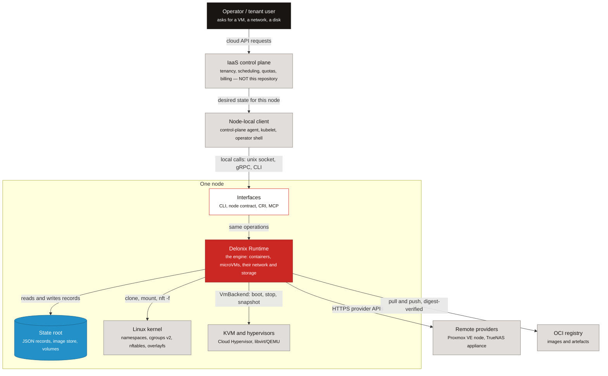

# IaaS and cloud native — where the engine fits

**Before you read:** [Start here](start-here.md#what-delonix-is-5-minutes) (the four sentences on what Delonix is). No kernel or Rust knowledge is needed yet.

You may be a DevOps engineer, an SRE, a platform engineer or a cloud developer who has *used* an
Infrastructure-as-a-Service cloud for years without ever building one. This page gives you the
mental model you need before reading the engine's code: what an IaaS is made of, which of its
layers this repository implements, which it deliberately leaves to others, and how the cloud native
principles you already know show up in concrete files here. After it you can say, for any IaaS
responsibility, whether this repository owns it or leaves it to a control plane, and point to the
file where each cloud native principle is applied.

Every claim about the engine points to a file, a symbol or an ADR. When an ADR is cited, its
status is given, because a *Proposed* ADR is a direction, not a fact about the code. Paths such
as `crates/adapters/delonix-linux` name the engine's crates; you do not need to know them yet — for
now read a path as "the code for this lives here". The directory level (`foundation`, `contexts`,
`adapters`, `providers`, `interfaces`) is the crate's layer, explained later in
[Project structure](project-structure.md) and [Architecture](architecture.md).

If a word is new to you, look it up in the [glossary](glossary.md).

## What an IaaS is

### The service models

The reference definitions are in **NIST SP 800-145**, *The NIST Definition of Cloud Computing*
([csrc.nist.gov/pubs/sp/800/145/final](https://csrc.nist.gov/pubs/sp/800/145/final)). In short:

| Model | The consumer gets | The consumer manages | The provider manages |
|---|---|---|---|
| **IaaS** — Infrastructure as a Service | processing, storage, networks and other fundamental computing resources | operating systems, storage use, deployed applications, and limited control of some networking (e.g. host firewalls) | the underlying physical and virtual infrastructure |
| **PaaS** — Platform as a Service | a place to deploy applications built with the provider's languages, libraries and tools | the applications and their configuration | everything underneath, including OS and runtime |
| **SaaS** — Software as a Service | a running application | at most user-specific settings | everything, including the application |

The same NIST document lists the five essential characteristics — on-demand self-service, broad
network access, resource pooling, rapid elasticity and measured service. Keep the last three in
mind: they are exactly the properties that live **above** a single node, in a control plane.

### The building blocks every IaaS has

Whatever the vendor, an IaaS is assembled from the same pieces:

- **Regions and zones** — a region is a geographic location; a zone is a failure domain inside it
  (separate power, cooling, network). Placement decisions are made against them.
- **Compute** — virtual machines, and increasingly containers and lightweight microVMs, placed on
  physical hosts.
- **Storage** — *block* (a disk attached to one machine), *file* (a shared filesystem such as NFS
  or SMB), and *object* (an HTTP API over buckets and keys).
- **Virtual networks** — a private network per customer (often called a VPC), subnets inside it,
  security groups or firewall rules, NAT for outbound traffic, load balancers for inbound traffic,
  and internal DNS.
- **Identity and tenancy** — who is calling, which organization or account they belong to, what
  they may do, and how their resources are isolated from everyone else's.
- **Metering** — counting what each tenant consumes, so it can be limited (quotas) and charged
  (billing).
- **A control plane and a data plane** — the *control plane* accepts API requests, stores desired
  state, decides placement and drives changes; the *data plane* is where workloads actually run
  and packets actually flow. A healthy IaaS keeps serving running workloads even when its control
  plane is briefly unavailable.
- **A node agent or runtime on each host** — the piece of software on every physical machine that
  turns "run this VM with this network and this disk" into kernel, hypervisor and storage calls,
  and reports back what is really there.

This repository is the last bullet. The rest of the page explains exactly how far that goes.

## The layers of an IaaS

**Legend**

| Shape | Meaning |
|---|---|
| box, dark | person or external actor |
| box, red | the Delonix engine (this repository) |
| box, light | a building block of the engine |
| box, grey | an external system — something this repository does not implement |
| box, blue | state on disk |

Solid arrows are calls or data flows, and the label says what flows.

*Caption: a request travels from an operator, through a multi-tenant control plane that is not in
this repository, to a node-local client, into the engine on one node, and down to the kernel,
hypervisors and storage the engine drives through its provider ports.*

Where each element lives in the code:

- **Interfaces** — the CLI binary (`bins/delonix-runtime-bin`), the Kubernetes CRI server
  (`crates/interfaces/delonix-cri`, `delonix serve cri`), the local management socket
  (`crates/interfaces/delonix-mgmt`), the MCP server (`crates/interfaces/delonix-mcp`,
  `delonix mcp serve`) and the node contract (`proto/delonix/node/v1/`). See
  [One set of operations, several interfaces](architecture.md#one-set-of-operations-several-interfaces).
- **State root** — `crates/adapters/delonix-state` (JSON records behind `flock`, atomic writes, the
  encrypted secret vault) and the image store in `crates/adapters/delonix-oci` (`cas.rs`).
- **Kernel** — `crates/adapters/delonix-linux` (process, namespaces, cgroups, mounts) and
  `crates/adapters/delonix-sdn` (bridges, nftables, DNS).
- **Hypervisors** — the `VmBackend` trait in `crates/adapters/delonix-vm/src/lib.rs`.
- **Remote providers** — `crates/providers/delonix-proxmox` (ADR-0008, Accepted and implemented)
  and `crates/providers/delonix-truenas` (ADR-0009, Accepted). An OpenStack backend is only a
  proposal (ADR-0039, Proposed, gated on a spike).
- **Registry** — `crates/adapters/delonix-oci/src/registry.rs`.

The control plane and the node-local client are grey on purpose: they are not in this repository,
and nothing in `crates/`, `bins/` or `proto/` is allowed to name one. `scripts/arch_fitness.py`
(`CONSUMER_NAMES`, `consumer_mentions`) fails CI when it finds such a name.

## Where delonix-runtime fits, and where it deliberately stops

### What it is

Delonix Runtime is the **node execution layer** of the picture above. On one node it:

- runs **containers and microVMs** — containers through `crates/adapters/delonix-linux`, VMs
  through the registrable `VmBackend` implementations in `crates/adapters/delonix-vm`;
- manages the **network** those workloads need — rootless bridges, per-workload firewall chains,
  internal DNS (`crates/adapters/delonix-sdn`) — and their **storage** — named volumes, bind
  mounts and network shares (`crates/adapters/delonix-volume`);
- is **declarative**, with its own Kinds grouped by `apiVersion` (list them with
  `delonix api-resources`; the table behind them is `KindFacts` in
  `crates/contexts/delonix-stack/src/kinds.rs`);
- talks to providers only through **ports** — traits such as `NetworkProvider`, `ImageStore` and
  `StorageProvider` in `crates/contexts/delonix-compute/src/ports.rs`, and `VmBackend` — never
  through `if provider == …` branches. This layering is ADR-0040 (**Proposed**), and its rules are
  already enforced by `scripts/arch_fitness.py` (`LAYERS`, `ALLOWED`);
- exposes the **same operations through several doors**: the CLI, the node contract, the CRI and
  MCP.

One caveat on the node contract, so you do not go looking for a server that is not there:
`proto/delonix/node/v1/node.proto` is marked *DRAFT contract for ADR-0040*. The contract, its
generated `docs/api/openapi.yaml` and its CI gate (`scripts/contract_gate.py`) exist; no crate
serves `NodeService` yet. ADR-0042 (**Accepted**, steps A and B delivered) fixes how that API is
versioned and documented when the server lands.

### What it deliberately does not do

The canonical rule is the section *«Identidade e fronteira do motor»* at the top of
[`AGENTS.md`](../../AGENTS.md): the engine knows **no consumer** — no platforms, control planes,
consoles or agents — and has no notion of **tenant, account, plan, quota or billing**. A
requirement coming from a consumer enters only as a generic engine capability that makes sense for
any client.

ADR-0010 (**Rejected**, 2026-08-10) is the decision that keeps the management API **local**: a
unix socket, with the peer required to have the same uid as the server (`SO_PEERCRED`). A remote,
multi-tenant management API would need identity, authorization and audit, and those belong on the
other side of the boundary. ADR-0025 (**Accepted**) applies the same reasoning to MCP: stdio only,
one local principal, no tenant, no OAuth.

Two words overlap between the two worlds and cause confusion in review:

- **namespace** — in the engine, `metadata.namespace` is an *isolation* boundary between workloads
  on one node (containers in different namespaces cannot reach each other). It is not a tenant or
  an account: nothing in the engine knows who owns a namespace.
- **quota** — the engine enforces *per-resource* limits it is told about (cgroup memory and CPU
  limits, a volume quota). A per-account quota ("this customer may have 20 vCPUs") is a
  control-plane decision.

### Who owns what

| IaaS responsibility | Control plane above | Delonix engine on the node | Host and kernel |
|---|---|---|---|
| Regions, zones, placement, scheduling across nodes | yes | no | — |
| Identity, tenants, accounts, IAM | yes | no (local uid only — ADR-0010, ADR-0025) | — |
| Quotas per account, metering for billing, billing | yes | no; it only exposes per-node metrics (`/metrics` in `delonix-mgmt` and `delonix-cri`) | — |
| Fleet management (add/drain nodes remotely) | yes | no — the remote API was rejected (ADR-0010) | — |
| Running a container | asks for it | yes — `crates/adapters/delonix-linux` | namespaces, cgroups v2, seccomp |
| Running a microVM | asks for it | yes — `VmBackend` (`crates/adapters/delonix-vm`) | KVM |
| Virtual network on the node (bridge, firewall, DNS, port publishing) | defines the intent | yes — `crates/adapters/delonix-sdn` | nftables, netns |
| Block/file storage attached to a workload | defines the intent | yes — `crates/adapters/delonix-volume`, NAS provisioning via `delonix-truenas` (ADR-0009, Accepted) | filesystems, NFS/SMB clients |
| Object storage service (buckets over HTTP) | yes, or a separate service | not provided | — |
| Images: pull, verify, store | chooses the image | yes — `crates/adapters/delonix-oci` | overlayfs |
| Desired state for one node: plan, apply, drift | sends the manifest | yes — `crates/contexts/delonix-stack` | — |
| Surviving a host reboot | — | writes systemd units (`bins/delonix-runtime-bin/src/cmd/boot.rs`, `delonix system boot enable`) | systemd |
| Hardware, firmware, host OS patching | — | no | the operator |

## Cloud native principles, and how the engine applies each

The Cloud Native Computing Foundation's definition (v1.1, approved 2024-02-26) says cloud native
practices let organizations "develop, build, and deploy workloads … in a programmatic and repeatable
manner", and that cloud native is "characterized by loosely coupled systems that interoperate in a
manner that is secure, resilient, manageable, sustainable, and observable". It names containers,
service meshes, multi-tenancy, microservices, immutable infrastructure, serverless and declarative
APIs as typical ingredients. Read the full text at
[github.com/cncf/toc/blob/main/DEFINITION.md](https://github.com/cncf/toc/blob/main/DEFINITION.md).
Note that *multi-tenancy* is on that list, and in this architecture it is provided by the control
plane above the engine, not by the engine.

Below, each principle gets three short parts: what it means in general, where it lives in Delonix,
and one habit it asks of you.

### Declarative and convergent

**In general.** You describe the state you want; the system compares it with what exists, shows you
the difference, and changes only what differs. Running the same description twice changes nothing
the second time. A tool that only creates is not declarative, however YAML-shaped its input.

**In Delonix.** `delonix stack plan` and `delonix stack apply` run the reconciler in
`crates/contexts/delonix-stack/src/reconcile.rs` (`plan`, `Change`, `Action`). It is a **pure
function** over an already-read snapshot, and it is a **three-way diff**: the last applied spec is
stored on the resource itself (`encode_last_applied`, the `delonix.io/last-applied` annotation), so
it can tell "you removed this field" from "someone set this by hand". A change that cannot be
applied live is refused unless `--replace <Kind>/<name>` authorizes the destruction, and
`--detailed-exitcode` (0 = no changes, 2 = changes, 1 = error) turns a plan into a drift gate in CI.
ADR-0019 (**Accepted**) adds a revision history, explicitly as a record and never as a source of
truth.

**What it asks of you.** If you add or change a Kind, its apply must converge: a changed field must
either be updated live or appear in the plan as a replacement. The module doc of `reconcile.rs`
records why — `stack apply` once printed `already exists, nothing to do` and returned 0 while
ignoring the change the user had made. A new converging Kind also needs its row in `KindFacts`
(`kinds.rs`); the tests in that crate check the table.

### API-first

**In general.** Every operation is available through a programmatic interface, and humans use the
same interface that automation uses. A capability that exists only behind one button or one
command is not a platform capability.

**In Delonix.** The same operations are exposed by the CLI, the CRI (`delonix serve cri`,
`crates/interfaces/delonix-cri`), the local management socket (`crates/interfaces/delonix-mgmt`),
the MCP server (`delonix mcp serve`, `crates/interfaces/delonix-mcp`) and the node contract
(`proto/delonix/node/v1/`, draft). The contract is the source of truth for both its gRPC and its
HTTP/JSON encodings, and `docs/api/openapi.yaml` is generated from it, never edited by hand
(`scripts/contract_gate.py`). ADR-0040 (**Proposed**) records today's gap honestly: several of
these doors still re-run the CLI binary as a subprocess instead of calling a use case — a count
that `scripts/arch_fitness.py` tracks as the `self_exec_sites` ratchet.

**What it asks of you.** Do not add a capability to only one door, and do not add a new
subprocess call to the engine's own binary from a library — call the use case instead. The
ratchet fails if `self_exec_sites` goes up. Details in
[Architecture](architecture.md#one-set-of-operations-several-interfaces).

### Observable through open standards

**In general.** A system tells you what it is doing through formats every tool understands —
structured logs, traces and metrics — instead of a custom dashboard or a log you have to parse by
eye.

**In Delonix.** `crates/adapters/delonix-telemetry` holds structured logging
(`DELONIX_LOG_FORMAT=json`), OpenTelemetry spans exported over OTLP (`DELONIX_OTLP_ENDPOINT`,
`OTEL_SERVICE_NAME` honoured by `telemetry.rs`) and the shared Prometheus registry (`metrics.rs`),
served at `/metrics` by `delonix-mgmt` and `delonix-cri`. Engine events are available with
`delonix system events`.

**What it asks of you.** A library crate does not print: it emits `tracing` events and the
interface decides what to show. `scripts/arch_fitness.py` counts `println!`/`eprintln!` in library
crates as the `library_prints` ratchet, and fails if the number rises.

### Immutable artefacts

**In general.** What you deploy is a versioned, content-addressed artefact built once and never
modified in place. You change a deployment by pointing it at a different artefact, and you can
prove which bytes are running.

**In Delonix.** Images follow the OCI image and distribution specifications
(`crates/adapters/delonix-oci`). Blobs live in a content-addressed store (`cas.rs`), and a pull by
digest verifies the manifest itself against the digest you asked for
(`verify_manifest_digest` in `registry.rs`), not only each blob against the manifest. Containers
share read-only image layers through overlayfs and write only to their own upper layer.

**What it asks of you.** Never accept downloaded bytes without verifying them against a digest or a
published checksum, and never weaken a check to make a slow or odd registry work — a check that
can be skipped is not a check. See
[Cloud native primer](cloud-native-primer.md#44-oci-images-content-addressed-storage-and-overlayfs).

### Loosely coupled: ports and adapters

**In general.** Components depend on narrow interfaces, not on each other's internals, so one part
can be replaced without rewriting the rest. For an infrastructure engine this mostly means: a new
provider should be a new implementation, not a new branch everywhere.

**In Delonix.** ADR-0040 (**Proposed**) sorts crates into foundation, contexts, adapters, providers,
interfaces and binaries, and the directory is the layer (`crates/foundation/`, `crates/contexts/`,
`crates/adapters/`, `crates/providers/`, `crates/interfaces/`, `bins/`). The allowed direction is
written once, in `ALLOWED` in `scripts/arch_fitness.py`, and CI enforces it. Ports are traits in
`crates/contexts/delonix-compute/src/ports.rs` and `VmBackend` in `delonix-vm`; ADR-0008
(**Accepted**) made VM backends registrable, which is how a remote Proxmox node became one more
backend.

**What it asks of you.** A new provider enters as an implementation of a port. A new crate enters
the `LAYERS` table and the directory of its layer in the same commit, and it may only depend in the
allowed direction. See [Architecture](architecture.md#layers-and-the-allowed-direction).

### Disposable and idempotent

**In general.** Any process can be stopped and started again quickly and safely, and repeating an
operation does not make things worse. That is what lets a scheduler move, restart or replace
workloads without a human.

**In Delonix.** `delonix container stop` sends SIGTERM, waits up to `--time` seconds, then SIGKILL
(`stop` in `crates/adapters/delonix-linux/src/lib.rs`), and stopping an already stopped container
succeeds (`cmd_stop` in `bins/delonix-runtime-bin/src/cmd/container.rs`). A requested stop is
recorded before signalling (`stopped_by_user`), so a restart supervisor does not resurrect what the
operator stopped. On the declarative side, applying an unchanged manifest yields a plan with no
changes.

**What it asks of you.** Every new command should be safe to run twice. Decide explicitly what
"already done" returns — success, or the conflict class (`Error::Conflict`, mapped to an exit code
by `for_error` in `crates/foundation/delonix-model/src/exitcode.rs`) — and never destroy anything
before you know the object is yours to destroy.

### Secure by default: rootless-first, least privilege

**In general.** The normal path grants the smallest set of privileges that works. Extra privilege
is something an operator asks for explicitly and can see, never a silent default.

**In Delonix.** Containers run inside a user namespace without root on the normal path, and keep
only the default capability set `KEPT_CAPS` (`crates/adapters/delonix-linux/src/capabilities.rs`,
resolved by `resolve_cap_keep`). On the CRI path the node can put a ceiling on capabilities that
no pod spec can exceed (`crates/interfaces/delonix-cri/src/cap_ceiling.rs`). Security decisions —
policy, admission for containers and VMs, redaction of secrets — are gathered in
`crates/contexts/delonix-security-runtime` (ADR-0026, **Proposed**).

**What it asks of you.** Do not make a feature work by requiring root or `--privileged` on the
normal path. If privilege is truly needed, make it an explicit opt-in that says so to the operator,
and refuse — with a clear message — rather than silently degrading when it is missing.

### Daemonless

**In general.** Many container engines run a resident daemon that owns all state. A daemonless
engine keeps state in files and does its work in short-lived processes, so there is no central
process whose crash or upgrade takes every workload down.

**In Delonix.** Each CLI command is a process that does its work and exits. What must persist
belongs to systemd or to a per-workload process with a clear owner: `delonix system boot enable`
writes one systemd unit per container or VM whose `ExecStart` is a `delonix … start`
(`bins/delonix-runtime-bin/src/cmd/boot.rs`). The rule — a new daemon needs an ADR with evidence of
what the alternative could not solve — is in `AGENTS.md`. ADR-0021 (**Proposed**) shows the rule
applied: even a pull reconciler is designed to run from a systemd timer rather than as a resident
process.

**What it asks of you.** Before adding a long-lived process, check whether a systemd unit, a timer,
socket activation or a per-workload supervisor solves the problem. If none does, write the ADR
first. See [Cloud native primer](cloud-native-primer.md#410-daemonless-in-one-paragraph).

## The twelve-factor lens, from the provider side

The Twelve-Factor App ([12factor.net](https://12factor.net/)) is written for application
developers. An engine sits on the other side: it must *provide* the mechanisms that let a workload
follow each factor. Some factors are simply not the engine's business, and the table says so.

| Factor | What the engine must provide | Where Delonix does it |
|---|---|---|
| I. Codebase | nothing — one codebase per app is the developer's choice | not applicable |
| II. Dependencies | a way to ship an app with its dependencies isolated | OCI images (`crates/adapters/delonix-oci`); building them with `delonix build` from a Dockerfile or Delonixfile ([Delonixfile and VMfile](delonixfile-and-vmfile.md)) |
| III. Config | inject configuration and secrets at start, not at build | `-e`, `--env-file`, `--secret` on `delonix container run`; environment merge in `crates/contexts/delonix-compute/src/run.rs`; `parse_env_file` in `crates/foundation/delonix-model/src/secret.rs`; secrets encrypted at rest in `delonix-state` |
| IV. Backing services | attach a service by name, swappable without code change | internal DNS, standard name `<name>.<namespace>.svc.delonix.internal` with the older `<name>.<namespace>.delonix.internal` still answering (`service_fqdn`, `parse_internal_name`, `dns_resolve_for` in `crates/adapters/delonix-sdn/src/infra.rs`); a `Service` Kind resolving to several backends (ADR-0032, **Accepted**) |
| V. Build, release, run | separate the three stages, with an immutable release | `delonix build` → an image identified by digest → `container run` / `stack apply`; stack revision history (ADR-0019, **Accepted**) |
| VI. Processes | stateless processes, with state in attached storage | `--read-only` root filesystem; named volumes and shares (`crates/adapters/delonix-volume`) |
| VII. Port binding | expose a port the app binds itself | `-p [hostIp:]hostPort:containerPort` (`parse_publish_addr`, `slirp_add_hostfwd` in `crates/adapters/delonix-sdn/src/lib.rs`) |
| VIII. Concurrency | run more copies of a process type | several containers per compose service (`deploy.replicas` in `bins/delonix-runtime-bin/src/cmd/compose.rs`) and DNS round-robin through `Service` (ADR-0032). **Not provided:** autoscaling, and scaling across nodes (that is a control-plane decision) |
| IX. Disposability | fast start, graceful stop on a signal | SIGTERM then SIGKILL after `--time` (`stop` in `delonix-linux`); restart policies with `--restart` |
| X. Dev/prod parity | the same artefacts and runtime in every environment | the same binary and Kinds on a laptop and on a node, rootless on both. **Partly:** parity with *another* production runtime (for example a managed Kubernetes cluster) depends on that runtime |
| XI. Logs | capture stdout/stderr as an event stream, not files the app manages | a per-container log shim (`log_shim` in `crates/adapters/delonix-linux/src/lib.rs`); `delonix container logs --follow`; timestamped lines with `--log-cri` |
| XII. Admin processes | run one-off tasks in the same environment as the app | `delonix container exec` |

## Read next

- **Linux foundations** ([linux-foundations.md](linux-foundations.md)) — the kernel primitives all
  of this rests on: processes and `/proc`, namespaces, cgroups v2, file descriptors and signals.
- **Cloud native primer** ([cloud-native-primer.md](cloud-native-primer.md)) — how the engine uses
  those primitives and the specifications on top of them (OCI, CRI, CNI, KVM/virtio, cloud-init),
  with files and symbols.
- **Architecture** ([architecture.md](architecture.md)) — the structure behind this context: layers,
  processes and crates in detail, once the two pages above and
  [Project structure](project-structure.md) feel familiar.

---

**Next:** [Linux foundations](linux-foundations.md) — the kernel primitives every later page relies on, hands-on: processes, namespaces, cgroups v2, file descriptors and signals.
