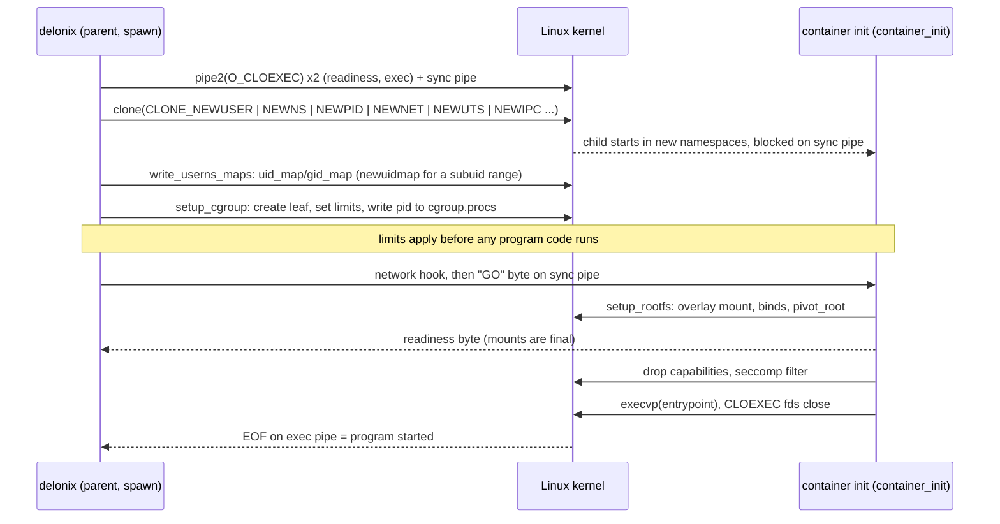

# Linux foundations

Every page after this one assumes you can answer, with a command, questions like "which network
namespace is this process in?", "why did this limit not apply?" or "who is still holding this pipe
open?". This page teaches those primitives hands-on, from the perspective of someone who writes
Linux system code *and* has to operate it at 3 a.m.

It does not explain how the engine uses them — that mapping, with files and symbols, is the
[Cloud native primer](cloud-native-primer.md). Each section here ends with a pointer to the
matching part of it.

**How to use this page.** Open a terminal and type along. Every command marked *unprivileged* was
run as an ordinary user on an Ubuntu host with a 7.0 kernel, util-linux 2.39 and systemd, and the
output shown is what it printed (trimmed, with host-specific paths replaced by placeholders).
Commands marked **requires root — run in a disposable VM** were *not executed* for this page:
they change host-wide state, and you should never try them on a machine that runs anything you
care about. [Microvm setup](microvm-setup.md) shows how to get a throwaway VM from the engine
itself.

Work in a scratch directory so nothing you create lands in the repository:

```bash
mkdir -p ~/scratch/linux-lab && cd ~/scratch/linux-lab
```

---

## Processes, the kernel and /proc

A **process** is a running program with its own address space, a numeric **PID**, a parent (its
**PPID**) and a set of kernel-owned attributes: credentials, namespaces, cgroup membership, open
file descriptors, signal dispositions and resource limits. Every process except PID 1 has a
parent; when a parent dies first, the orphan is re-parented to the nearest *subreaper* or to PID 1.

- **`fork`** duplicates the calling process. The child gets a copy of the address space (copy-on-
  write) and a copy of the **file descriptor table** — the same open files, shared, not reopened.
  Only the calling *thread* is copied, which is why forking a multi-threaded program and then
  doing anything non-trivial before `exec` is dangerous (a lock held by another thread stays held
  forever in the child).
- **`execve`** replaces the program running in a process: same PID, same parent, same namespaces
  and cgroup, new code. File descriptors survive `exec` *unless* they are marked close-on-exec —
  more on that in [File descriptors](#file-descriptors).
- **`clone`** is the general form behind both `fork` and thread creation. Its flags choose what the
  child shares with the parent and, crucially here, which **new namespaces** it starts in
  (`CLONE_NEWUSER`, `CLONE_NEWNS`, `CLONE_NEWPID`, `CLONE_NEWNET`, …). A container is born from a
  `clone` with those flags.

The kernel exposes each process as a directory under `/proc`. The files you will use most:

| Path | What it tells you |
|---|---|
| `/proc/<pid>/status` | name, state, PPid, uid/gid, `NSpid` (the PID in every nested PID namespace), capability sets, threads |
| `/proc/<pid>/cmdline` | the argv, NUL-separated |
| `/proc/<pid>/ns/` | one symlink per namespace; the inode number is the namespace's identity |
| `/proc/<pid>/cgroup` | the cgroup v2 path (`0::/…`) |
| `/proc/<pid>/fd/`, `/proc/<pid>/fdinfo/` | open file descriptors and their offset/flags |
| `/proc/<pid>/stat` | field 22 is the start time, which distinguishes a process from a later one that reused its PID |

Try it on your own shell (*unprivileged*):

```bash
grep -E '^(State|PPid|Threads|NSpid|CapEff)' /proc/$$/status
tr '\0' ' ' < /proc/$$/cmdline; echo
cat /proc/self/cgroup
```

```text
State:	S (sleeping)
PPid:	4033620
NSpid:	953496
Threads:	1
CapEff:	0000000000000000
0::/user.slice/user-1000.slice/user@1000.service/app.slice/app-….scope
```

Note that `$$` is your shell, while `self` is whichever process opens the file — for `cat
/proc/self/cgroup` that is `cat`. Also note that **a PID is a number, not a name**: once a process
has been reaped, the kernel may give the same number to an unrelated process. Code that stores a
PID and signals it later must check the start time, or better, hold a *pidfd* (see below).

**Why the engine reads `/proc`.** It is the only authoritative, lock-free view of a live
process: the real cgroup of a running container, whether a recorded PID still names the same
process, which namespaces to join for `exec`. → [How Delonix uses this: namespaces and rootless
operation](cloud-native-primer.md#41-linux-namespaces-and-rootless-operation).

**Read more:** [`proc(5)`](https://man7.org/linux/man-pages/man5/proc.5.html),
[`fork(2)`](https://man7.org/linux/man-pages/man2/fork.2.html),
[`execve(2)`](https://man7.org/linux/man-pages/man2/execve.2.html),
[`clone(2)`](https://man7.org/linux/man-pages/man2/clone.2.html).

---

## Namespaces

A **namespace** wraps one kind of global resource so that processes inside it see their own
instance. Linux has eight:

| Namespace | Flag | Isolates |
|---|---|---|
| mount | `CLONE_NEWNS` | the mount table: what is mounted where |
| UTS | `CLONE_NEWUTS` | hostname and NIS domain name |
| IPC | `CLONE_NEWIPC` | System V IPC objects and POSIX message queues |
| PID | `CLONE_NEWPID` | process numbering; the first process inside is PID 1 |
| network | `CLONE_NEWNET` | interfaces, addresses, routes, firewall tables, sockets, `/proc/sys/net` |
| user | `CLONE_NEWUSER` | uids/gids and capabilities; the owner of every other namespace |
| cgroup | `CLONE_NEWCGROUP` | the view of the cgroup tree (the process sees its cgroup as `/`) |
| time | `CLONE_NEWTIME` | the offsets of `CLOCK_MONOTONIC` and `CLOCK_BOOTTIME` |

### Identity: the inode behind /proc/<pid>/ns

Each entry in `/proc/<pid>/ns` is a symlink whose target encodes the namespace type and an inode
number. **Two processes are in the same namespace exactly when those inodes are equal** — this is
how you compare, not by names (*unprivileged*):

```bash
ls -l /proc/self/ns
```

```text
lrwxrwxrwx 1 you you 0 … cgroup -> cgroup:[4026531835]
lrwxrwxrwx 1 you you 0 … ipc -> ipc:[4026531839]
lrwxrwxrwx 1 you you 0 … mnt -> mnt:[4026531832]
lrwxrwxrwx 1 you you 0 … net -> net:[4026531833]
lrwxrwxrwx 1 you you 0 … pid -> pid:[4026531836]
lrwxrwxrwx 1 you you 0 … pid_for_children -> pid:[4026531836]
lrwxrwxrwx 1 you you 0 … time -> time:[4026531834]
lrwxrwxrwx 1 you you 0 … time_for_children -> time:[4026531834]
lrwxrwxrwx 1 you you 0 … user -> user:[4026531837]
lrwxrwxrwx 1 you you 0 … uts -> uts:[4026531838]
```

`pid_for_children` and `time_for_children` exist because a process never changes its own PID or
time namespace: `unshare`/`setns` on those affects only the children it creates next.

`lsns` lists namespaces system-wide. On the host used for this page, **util-linux 2.39.3 on a
7.0 kernel fails** with `lsns: Unsupported ioctl NS_GET_USERNS` and prints nothing. If yours does
the same, compare the inodes directly: `readlink /proc/<pid>/ns/net` for the processes you care
about.

### Hands-on: a user + mount + UTS + network namespace, without root

An unprivileged user cannot create most namespaces on their own…

```bash
unshare --net true
```

```text
unshare: unshare failed: Operation not permitted
```

…but can create a **user namespace**, and inside it becomes root *over the namespaces that user
namespace owns*. `--map-root-user` (`-r`) maps your uid to 0 inside (*unprivileged*):

```bash
unshare --user --map-root-user --mount --uts --net sh -c '
  hostname lab; hostname; id
  cat /proc/self/uid_map
  ip link
  readlink /proc/self/ns/net'
hostname; readlink /proc/self/ns/net     # back outside
```

```text
lab
uid=0(root) gid=0(root) groups=0(root),65534(nogroup)
         0       1000          1
1: lo: <LOOPBACK> mtu 65536 qdisc noop state DOWN mode DEFAULT group default qlen 1000
    link/loopback 00:00:00:00:00:00 brd 00:00:00:00:00:00
net:[4026534483]
<your-host>
net:[4026531833]
```

Three things to see: the hostname changed only inside; the fresh network namespace has **only
`lo`, and it is down**; and the namespace inode differs from the host's. The `65534(nogroup)`
group is a host group with no mapping inside — unmapped ids always show as the overflow id.

A mount namespace works the same way: mounts made inside are invisible outside
(*unprivileged*):

```bash
mkdir -p mnt
unshare -r -m sh -c "mount -t tmpfs scratch $PWD/mnt && findmnt -n -o SOURCE,FSTYPE $PWD/mnt && touch $PWD/mnt/only-here && ls $PWD/mnt"
ls mnt; findmnt -n mnt; echo "findmnt rc=$?"
```

```text
scratch tmpfs
only-here
findmnt rc=1
```

A PID namespace needs `--fork`, because the caller itself stays in its old PID namespace; only
its child becomes PID 1. `--mount-proc` remounts `/proc` so tools like `ps` see the new numbering
(*unprivileged*):

```bash
unshare -r --pid --fork --mount-proc sh -c 'echo $$; ps -o pid,ppid,comm'
```

```text
1
    PID    PPID COMMAND
      1       0 sh
      2       1 ps
```

Seen from outside, the same process has two PIDs — `NSpid` lists them from the outermost
namespace inwards (*unprivileged*):

```bash
unshare -r -p -f sleep 3 & U=$!; sleep 0.4
grep -E '^(Name|NSpid)' /proc/$(pgrep -P $U)/status; wait
```

```text
Name:	sleep
NSpid:	953619	1
```

The cgroup and time namespaces can be tried the same way (`unshare -r --cgroup cat
/proc/self/cgroup` prints `0::/`).

### User namespaces and uid mapping

The mapping lives in `/proc/<pid>/uid_map` and `gid_map`, one line per range:
`<first id inside> <first id outside> <count>`. The rules that shape rootless containers:

- The maps are written **once**, by a process with the right privilege over the new namespace —
  typically the parent, while the child waits.
- An unprivileged user may write a **single-line map of its own uid** (what `-r` did above: `0 1000
  1`). A container whose image runs as uid 101 or chowns files to service uids needs a *range*.
- Ranges come from `/etc/subuid` and `/etc/subgid` and are written by the setuid helpers
  **`newuidmap`/`newgidmap`**, which check that the range belongs to you.

*Unprivileged* (needs an entry for your user in `/etc/subuid`/`/etc/subgid`):

```bash
grep "^$(id -un):" /etc/subuid /etc/subgid
unshare --user --map-auto --map-root-user cat /proc/self/uid_map
```

```text
/etc/subgid:you:100000:65536
/etc/subuid:you:100000:65536
         0       1000          1
         1     100000      65536
```

Uid 0 inside is you; uids 1–65536 inside are host uids 100000–165535, which belong to nobody on
the host. That last point is why a file written by a container as uid 999 cannot be removed by
you from outside — see the note on reading such files in
[Environment](environment.md).

On Ubuntu 23.10 and later, `kernel.apparmor_restrict_unprivileged_userns=1` can refuse user
namespaces to binaries without an AppArmor profile. `/usr/bin/unshare` has one; a freshly built
binary in an arbitrary directory may not. The symptom is `EPERM` at the first `unshare`, which
looks like a bug in the program. [Environment](environment.md) covers the fix.

### Creating versus joining; keeping a namespace alive

- **Create**: `unshare(2)` (the current process moves into new namespaces) or `clone(2)` with
  `CLONE_NEW*` (the child starts in them).
- **Join**: `setns(2)` on a file descriptor opened from `/proc/<pid>/ns/<type>`. The `nsenter(1)`
  tool wraps it.

**A namespace lives as long as something references it**: a process inside it, an open file
descriptor to its `/proc/<pid>/ns/*` file, or a bind mount of that file (which is what
`ip netns add` creates under `/run/netns`). When the last reference goes, a network namespace and
every interface in it disappear.

So the rootless pattern is a **holder**: a small process that sleeps inside the namespace so it
survives, and that others join. You can do this without root, because you own the user namespace
the holder created (*unprivileged*):

```bash
unshare --user --map-root-user --net sleep 60 &   # the holder; unshare execs sleep
H=$!; sleep 0.5
nsenter --target $H --user --net --preserve-credentials sh -c 'ip link add dummy0 type dummy; ip -br link'
nsenter --target $H --user --net --preserve-credentials ip -br link    # a second visitor sees it
```

```text
lo               DOWN           00:00:00:00:00:00 <LOOPBACK>
dummy0           DOWN           ae:1a:b3:4b:88:4c <BROADCAST,NOARP>
lo               DOWN           00:00:00:00:00:00 <LOOPBACK>
dummy0           DOWN           ae:1a:b3:4b:88:4c <BROADCAST,NOARP>
```

When `sleep` ends, the namespace and `dummy0` go with it.

The privileged equivalents, **requires root — run in a disposable VM** (not executed in this
review):

```bash
ip netns add lab                 # a named netns, pinned by a bind mount in /run/netns
ip netns exec lab ip link        # run a command in it
nsenter --target <pid> --net --mount ip addr   # join another user's process's namespaces
ip netns del lab
```

### Best practices

- **When rootless, always pair the network namespace with a user namespace.** Without it you have
  no `CAP_NET_ADMIN` over the new namespace; with it you do, and nothing leaks to the host.
- **Create the user namespace first** (or in the same `clone`): every other namespace is owned by
  the user namespace it was created in, and that ownership decides who may configure it.
- **Keep a holder** for anything that must outlive a command, and treat the holder as a process
  with an owner and a pidfile, not as an accident.
- **Join, don't recreate.** Recreating a namespace that still has live members cuts them off.
- **Compare inodes, never names or PIDs**, to decide "same namespace".
- **Clean up** what you name: `ip netns del`, unmount bind mounts, and let holders exit.

→ [How Delonix uses this: Linux namespaces and rootless
operation](cloud-native-primer.md#41-linux-namespaces-and-rootless-operation) and [Container
networking](cloud-native-primer.md#45-container-networking).

**Read more:** [`namespaces(7)`](https://man7.org/linux/man-pages/man7/namespaces.7.html),
[`user_namespaces(7)`](https://man7.org/linux/man-pages/man7/user_namespaces.7.html),
[`pid_namespaces(7)`](https://man7.org/linux/man-pages/man7/pid_namespaces.7.html),
[`network_namespaces(7)`](https://man7.org/linux/man-pages/man7/network_namespaces.7.html),
[`unshare(1)`](https://man7.org/linux/man-pages/man1/unshare.1.html),
[`nsenter(1)`](https://man7.org/linux/man-pages/man1/nsenter.1.html),
[`setns(2)`](https://man7.org/linux/man-pages/man2/setns.2.html),
[`newuidmap(1)`](https://man7.org/linux/man-pages/man1/newuidmap.1.html),
[`subuid(5)`](https://man7.org/linux/man-pages/man5/subuid.5.html).

---

## cgroups v2

A **control group** is a set of processes to which resource limits and accounting apply. cgroup
v2 is **one unified tree** mounted at `/sys/fs/cgroup`: a directory is a cgroup, a process
belongs to exactly one, and the files in the directory are the interface.

- `cgroup.controllers` — the controllers **available** in this cgroup (granted by the parent).
- `cgroup.subtree_control` — the controllers **enabled for the children** of this cgroup. Writing
  `+memory` there creates `memory.*` files in every child.
- `cgroup.procs` — the PIDs in this cgroup. Writing a PID moves that process (only that process;
  its existing children stay where they are).
- Controller files: `memory.max`, `memory.high`, `memory.events`, `memory.peak`, `cpu.max`
  (`<quota> <period>` in microseconds, or `max`), `cpu.weight`, `cpu.stat`, `pids.max`, and the
  pressure files `cpu.pressure`, `memory.pressure`, `io.pressure` (PSI).

### The "no internal processes" rule

A cgroup that **has processes** cannot enable controllers for its children, and a cgroup that
distributes resources to children keeps its processes in leaves. In practice: processes live in
**leaves**, and a manager that wants to create children for its own processes must first move
itself into a leaf. The kernel reports a violation as `EBUSY`.

### Delegation to users

Only root can write the cgroup tree by default. systemd **delegates** a subtree to a user by
chowning it: on most hosts `user@<uid>.service` belongs to you and delegates some controllers.
Look at your own position first (*unprivileged*):

```bash
CG=/sys/fs/cgroup$(cut -d: -f3 /proc/self/cgroup); echo "$CG"
cat "$CG/cgroup.controllers"
U=/sys/fs/cgroup/user.slice/user-$(id -u).slice/user@$(id -u).service
stat -c '%U %n' "$U/cgroup.subtree_control"; cat "$U/cgroup.subtree_control"
```

```text
/sys/fs/cgroup/user.slice/user-1000.slice/user@1000.service/app.slice/app-….scope
memory pids
you /sys/fs/cgroup/user.slice/user-1000.slice/user@1000.service/cgroup.subtree_control
cpu memory pids
```

Two facts worth noticing on this host: the shell's scope has no `cpu` controller (so `cpu.max`
does not exist there), and `cpuset`/`io` are not delegated to the user at all — the root slice
does not pass them down.

**Why an SSH session cannot set limits.** A login over SSH lands in `session-<n>.scope`, which is
a *sibling* of `user@<uid>.service`, not a child. Moving a PID between two cgroups requires write
access to their **common ancestor's** `cgroup.procs`; here that is `user-<uid>.slice`, owned by
root. So a program started from SSH cannot put itself under the delegated subtree, and limits it
tries to set have nowhere to go. The fix is to ask systemd for a delegated scope.

### Hands-on: a limited command in a user scope

`systemd-run --user --scope` runs a command in a new transient scope under your user manager,
with resource-control properties applied (*unprivileged*):

```bash
systemd-run --user --scope -q -p MemoryMax=64M -p CPUQuota=20% sh -c '
  C=/sys/fs/cgroup$(cut -d: -f3 /proc/self/cgroup); echo "$C"
  cat "$C/memory.max" "$C/cpu.max"
  cat "$C/cpu.pressure"
  head -3 "$C/cpu.stat"'
```

```text
/sys/fs/cgroup/user.slice/user-1000.slice/user@1000.service/app.slice/run-r4b0….scope
67108864
20000 100000
some avg10=0.00 avg60=0.00 avg300=0.00 total=35
full avg10=0.00 avg60=0.00 avg300=0.00 total=35
usage_usec 6398
user_usec 1066
system_usec 5331
```

`CPUQuota=20%` became `cpu.max = 20000 100000`: 20 ms of CPU per 100 ms period.

Now provoke an OOM kill and read the evidence **before the cgroup disappears**. A transient scope
is removed as soon as its last process exits, so the reading must happen from inside it. Two
details matter: `MemorySwapMax=0` (otherwise the allocation just swaps), and `OOMPolicy=continue`
(systemd's default for a scope is to stop the *whole* scope when one process is OOM-killed — the
reader would die too; without it this command printed only `Terminated`) (*unprivileged*):

```bash
systemd-run --user --scope -q -p MemoryMax=32M -p MemorySwapMax=0 -p OOMPolicy=continue sh -c '
  python3 -c "b = bytearray(128 * 1024 * 1024)"; echo "python exit=$?"
  C=/sys/fs/cgroup$(cut -d: -f3 /proc/self/cgroup); cat "$C/memory.events"'
```

```text
Killed
python exit=137
low 0
high 0
max 51
oom 1
oom_kill 1
oom_group_kill 0
sock_throttled 0
```

Exit code 137 is 128 + 9 (SIGKILL). The **only** place that says "this was an OOM kill and not a
`kill -9`" is `oom_kill` in `memory.events` — and it is gone once the cgroup is removed.

Finally, see the "no internal processes" rule and delegation in one go, inside a scope systemd
delegates to you (`Delegate=yes`) (*unprivileged*):

```bash
systemd-run --user --scope -q -p Delegate=yes sh -c '
  C=/sys/fs/cgroup$(cut -d: -f3 /proc/self/cgroup)
  mkdir "$C/leaf"
  env printf "+memory" > "$C/cgroup.subtree_control" || echo "refused: this cgroup still has processes"
  echo $$ > "$C/leaf/cgroup.procs" && echo "moved self into leaf"
  echo "+memory +pids" > "$C/cgroup.subtree_control" && echo "controllers enabled for children"
  echo 16M > "$C/leaf/memory.max"; cat "$C/leaf/memory.max"'
```

```text
printf: write error: Device or resource busy
refused: this cgroup still has processes
moved self into leaf
controllers enabled for children
16777216
```

The same steps without systemd, **requires root — run in a disposable VM** (not executed in this
review):

```bash
mkdir /sys/fs/cgroup/lab
echo "+memory +pids" > /sys/fs/cgroup/cgroup.subtree_control   # usually already enabled at the root
mkdir /sys/fs/cgroup/lab/work
echo 64M > /sys/fs/cgroup/lab/work/memory.max
echo <pid> > /sys/fs/cgroup/lab/work/cgroup.procs
cat /sys/fs/cgroup/lab/work/memory.events
# cleanup: the cgroup must be empty before rmdir
echo <pid> > /sys/fs/cgroup/cgroup.procs; rmdir /sys/fs/cgroup/lab/work /sys/fs/cgroup/lab
```

### Best practices

- **One leaf per workload.** Limits, accounting and OOM evidence then belong to exactly one thing.
- **Set limits and move the process in *before* it starts running its program.** A migration moves
  one process, never its descendants; anything forked before the move stays outside the limit
  forever.
- **Read `memory.events` for OOM**, and read it while the cgroup still exists — from the process
  that waits for the workload, not afterwards.
- **Do not write to controllers or cgroups you do not own.** A cgroup delegated to you is yours;
  its parent is not. On a shared host, never touch `/sys/fs/cgroup` outside your own subtree.
- **Check the ownership of `cgroup.subtree_control`**, not the presence of a controller name, to
  know whether you really have delegation.
- **Use PSI (`*.pressure`)** to see contention before it becomes an OOM or a latency incident.

→ [How Delonix uses this: cgroups v2 and delegation](cloud-native-primer.md#42-cgroups-v2-and-delegation).

**Read more:** [kernel.org — Control Group v2
(`cgroup-v2.rst`)](https://www.kernel.org/doc/Documentation/admin-guide/cgroup-v2.rst),
[`cgroups(7)`](https://man7.org/linux/man-pages/man7/cgroups.7.html),
[`systemd.resource-control(5)`](https://man7.org/linux/man-pages/man5/systemd.resource-control.5.html),
[`systemd-run(1)`](https://man7.org/linux/man-pages/man1/systemd-run.1.html),
[systemd — Control Group APIs and Delegation](https://systemd.io/CGROUP_DELEGATION/),
[kernel — PSI](https://docs.kernel.org/accounting/psi.html).

---

## File descriptors

A **file descriptor** is a small integer that indexes a **per-process table**. Each entry points
to an **open file description** in the kernel — which holds the file offset and the status flags
(`O_APPEND`, `O_NONBLOCK`, …) — and that description points to the underlying object: an inode
for a regular file, or a pipe, a socket, an event counter, a process.

```
process fd table          kernel                         object
  3 ─────────────┐
                 ├──► open file description ──────────► inode / pipe / socket / …
  7 (dup of 3) ──┘     (offset, O_APPEND, …)
```

Consequences that bite in real code:

- **`dup`/`dup2` and `fork` share the open file description**: two fds (or two processes) move the
  same offset. Opening the same path twice gives two descriptions with independent offsets.
- The **close-on-exec** flag (`FD_CLOEXEC`) is per *descriptor*, not per description: it lives in
  the table entry and is set with `O_CLOEXEC` at `open`, `SOCK_CLOEXEC` at `socket`, `pipe2(…,
  O_CLOEXEC)`, or `fcntl(fd, F_SETFD, FD_CLOEXEC)` afterwards. The window between `open` and
  `fcntl` is a race in a multi-threaded program; use the atomic flag.
- Fds **0, 1, 2** are stdin, stdout and stderr only by convention; they are inherited like any
  other fd.
- Everything a process talks to is an fd: files, **pipes** (`pipe2`), **sockets** including **unix
  sockets**, **pidfds** (a stable handle to a process, `pidfd_open`), **memfds** (anonymous memory
  with a file interface, `memfd_create`), **eventfds** (a counter for wakeups), epoll instances,
  namespace handles opened from `/proc/<pid>/ns`.
- **A pipe reaches EOF only when every copy of its write end is closed**, in every process. One
  forgotten copy in a long-lived child and the reader blocks forever.

### Hands-on in bash

Open, write, inspect and close a descriptor (*unprivileged*):

```bash
bash -c '
exec 3<>notes.txt          # open read-write as fd 3
echo hello >&3
ls -l /proc/$$/fd | tail -n +2
cat /proc/$$/fdinfo/3
exec 3>&-                  # close fd 3
ls /proc/$$/fd
cat notes.txt'
```

```text
lrwx------ 1 you you 64 … 0 -> socket:[464860423]
l-wx------ 1 you you 64 … 1 -> …
l-wx------ 1 you you 64 … 2 -> …
lrwx------ 1 you you 64 … 3 -> /home/you/scratch/linux-lab/notes.txt
pos:	6
flags:	0100002
mnt_id:	34
ino:	21761577
0
1
2
hello
```

`flags` is octal: `02` is `O_RDWR`, `0100000` is `O_LARGEFILE`. There is no `02000000`
(`O_CLOEXEC`): **fds opened by the shell are inherited** by every command it runs. You can see it
(*unprivileged*):

```bash
bash -c 'exec 3>inherited.txt; ls -l /proc/self/fd | awk "NR>1{print \$9,\$10,\$11}"'
```

```text
0 -> socket:[464878621]
1 -> pipe:[464854925]
2 -> …
3 -> /home/you/scratch/linux-lab/inherited.txt
4 -> /proc/953134/fd
```

`ls` received fd 3 from the shell without asking for it (fd 4 is the directory `ls` itself opened).

**Redirection order matters**, because each redirection is a `dup2` applied left to right
(*unprivileged*):

```bash
( echo out; echo err >&2 ) >both.log 2>&1      # stdout → file, then stderr → where stdout is now
cat both.log
( echo out; echo err >&2 ) 2>&1 >only-out.log  # stderr → where stdout is NOW (the terminal), then stdout → file
cat only-out.log
```

```text
out
err
err
out
```

The first form puts both lines in the file. In the second, `err` went to the terminal (the lone
`err` line) and only `out` reached the file.

**A pipe as a numbered fd**, using process substitution and an automatically chosen fd number
(*unprivileged*):

```bash
bash -c '
exec {fd}< <(printf "line1\nline2\n")
echo "fd=$fd"; readlink /proc/$$/fd/$fd
read -r first <&$fd; echo "$first"
exec {fd}<&-'
```

```text
fd=10
pipe:[464865935]
line1
```

**Named pipes and unix sockets** from the command line (*unprivileged*; `nc` here is OpenBSD
netcat, where `-U` means unix socket and `-N` closes the connection at end of input):

```bash
mkfifo pipe.fifo
( echo "through the fifo" > pipe.fifo & ); cat pipe.fifo; rm pipe.fifo

nc -lU s.sock > got.txt & sleep 0.3
printf 'ping\n' | nc -NU s.sock; wait; cat got.txt; rm -f s.sock got.txt
```

```text
through the fifo
ping
```

`socat` offers the same and more (`socat - UNIX-CONNECT:s.sock`); it was not installed on the host
used for this page, so that form is not verified here.

**The other fd kinds, and close-on-exec by default.** Python opens everything with `O_CLOEXEC`
unless told otherwise, which makes it a convenient lab (*unprivileged*):

```bash
python3 - <<'EOF'
import os, subprocess
a = os.open("cloexec.txt", os.O_WRONLY | os.O_CREAT | os.O_CLOEXEC, 0o600)
b = os.open("inherit.txt", os.O_WRONLY | os.O_CREAT, 0o600); os.set_inheritable(b, True)
print("parent:", a, "cloexec.txt |", b, "inherit.txt")
print(subprocess.run(["sh", "-c", "ls -l /proc/$$/fd | awk 'NR>1{print $9, $11}'"],
                     capture_output=True, text=True, close_fds=False).stdout)
for name, fd in [("pidfd", os.pidfd_open(os.getpid())), ("memfd", os.memfd_create("scratch")),
                 ("eventfd", os.eventfd(0))]:
    print(name, "->", os.readlink(f"/proc/self/fd/{fd}"))
EOF
```

```text
parent: 3 cloexec.txt | 4 inherit.txt
0 pipe:[464869577]
1 pipe:[464879797]
2 pipe:[464879798]
4 …/inherit.txt

pidfd -> anon_inode:[pidfd]
memfd -> /memfd:scratch (deleted)
eventfd -> anon_inode:[eventfd]
```

The child shell got fd 4 and **not** fd 3: close-on-exec did its job at `execve`.

To inspect another process's descriptors, use `/proc/<pid>/fd` and `/proc/<pid>/fdinfo/<fd>`, or
`lsof -p <pid>` (*unprivileged*, for your own processes):

```bash
lsof -p $$ | head -4
```

```text
COMMAND    PID   USER   FD   TYPE             DEVICE SIZE/OFF      NODE NAME
bash    953131   you     0u  unix 0x0000000000000000      0t0 464878621 type=STREAM (CONNECTED)
bash    953131   you     1w   REG              259,4      827  21672530 …
bash    953131   you     2w   REG              259,4      827  21672530 …
```

Tracing which fds a program opens and closes is `strace -f -e trace=openat,close,dup2,pipe2,execve
<cmd>` (not exercised for this page).

### Limits

(*unprivileged*)

```bash
ulimit -n; ulimit -Hn
cat /proc/sys/fs/file-nr /proc/sys/fs/file-max /proc/sys/fs/nr_open
```

```text
1048576
1048576
66730	0	9223372036854775807
9223372036854775807
1048576
```

- `ulimit -n` is `RLIMIT_NOFILE` for *this* process: soft, then hard. It is inherited across
  `fork`/`exec`; systemd units set it with `LimitNOFILE=`. Many hosts default the soft limit to
  1024 — this one does not, so do not assume your numbers match.
- `fs.nr_open` is the ceiling any process's hard limit may be raised to.
- `file-nr` is *allocated handles, unused, maximum* system-wide.
- `EMFILE` means your process is out; `ENFILE` means the system is.

### Best practices for engine code

- **CLOEXEC everywhere.** Open with `O_CLOEXEC`, create pipes with `pipe2(…, O_CLOEXEC)`, sockets
  with `SOCK_CLOEXEC`. Rust's standard library already does this for what it opens; raw `libc`
  calls do not. In the engine, see the readiness and exec pipes in `spawn`
  (`crates/adapters/delonix-linux/src/lib.rs`), whose comment explains that `O_CLOEXEC` on the
  write end is what turns "the child died, or exec'd without writing" into an EOF the parent can
  act on; the same `pipe2(…, O_CLOEXEC)` appears in `pipe` in
  `crates/adapters/delonix-sdn/src/pin_userns.rs`, and `OFlag::O_CLOEXEC` in `exec_with` and
  `open_container_ns` in `delonix-linux`.
- **A child that forks but never execs must close what it inherited.** CLOEXEC only acts at
  `execve`. The engine's log shim is exactly such a child: it closes everything except the fds it
  needs with `close_range` right after the fork — see `close_range_raw` and its call site in
  `spawn` (`crates/adapters/delonix-linux/src/lib.rs`). `close_range_raw` calls the syscall by
  number because the `libc` wrapper exists only for glibc targets.
- **Never leak a pipe or the caller's stdio into a long-lived child.** Two real incidents are
  recorded in [`AGENTS.md`](../../AGENTS.md): the log shim holding other HTTP connections of a
  long-running server open (section *«CLI (`delonix`)»*, the `delonix serve docker-api` entry), and
  the network pin inheriting the caller's stderr so that `out=$(delonix …)` never saw EOF — fixed
  by writing to `pin.log` (section *«A classe «X não é Y» — varredura de 2026-08-05»*; code:
  `start_pin` and `pin_log_path` in `crates/adapters/delonix-sdn/src/infra.rs`).
- **Signal a process through a pidfd, not a PID.** A reaped PID can be reused; a pidfd refers to
  one process for its whole life. See [ADR-0027](../adr/0027-pidfd-for-killing-exec-children.md)
  and `ChildHandle` (`open`, `kill`) in `crates/interfaces/delonix-cri/src/child_handle.rs`. Where
  only a stored PID exists, compare the start time first: `safe_to_signal` in
  `crates/contexts/delonix-node/src/host.rs`.
- **Bound fds under load.** A server that opens a descriptor per request must close it on every
  path, including errors and timeouts, and must treat `EMFILE` as back-pressure, not a crash.
- **After `fork` in a multi-threaded process, do only async-signal-safe work** (close fds, `dup2`,
  `execve`, `_exit`) — no allocation, no locks.

→ [How Delonix uses this: Capabilities, seccomp, AppArmor, masked
paths](cloud-native-primer.md#43-capabilities-seccomp-apparmor-masked-paths) (the syscall
filter lists `close_range`, `memfd_create` and `eventfd2`), and [Daemonless, in one
paragraph](cloud-native-primer.md#410-daemonless-in-one-paragraph) for why per-workload processes
must not hold what they do not own.

**Read more:** [`open(2)`](https://man7.org/linux/man-pages/man2/open.2.html),
[`fcntl(2)`](https://man7.org/linux/man-pages/man2/fcntl.2.html),
[`dup(2)`](https://man7.org/linux/man-pages/man2/dup.2.html),
[`pipe(2)`](https://man7.org/linux/man-pages/man2/pipe.2.html),
[`close_range(2)`](https://man7.org/linux/man-pages/man2/close_range.2.html),
[`pidfd_open(2)`](https://man7.org/linux/man-pages/man2/pidfd_open.2.html),
[`memfd_create(2)`](https://man7.org/linux/man-pages/man2/memfd_create.2.html),
[`eventfd(2)`](https://man7.org/linux/man-pages/man2/eventfd.2.html),
[`unix(7)`](https://man7.org/linux/man-pages/man7/unix.7.html),
[`getrlimit(2)`](https://man7.org/linux/man-pages/man2/getrlimit.2.html),
[bash manual — Redirections](https://www.gnu.org/software/bash/manual/html_node/Redirections.html).

---

## Signals and process lifetime

- **`SIGTERM`** asks a process to exit; it can be caught, and a well-behaved service cleans up.
  **`SIGKILL`** cannot be caught or ignored. A graceful stop is "`SIGTERM`, wait a bounded time,
  then `SIGKILL`" — `stop` in `crates/adapters/delonix-linux/src/lib.rs` does exactly that.
- **PID 1 in a PID namespace is special**: signals sent to it from *inside* its namespace are
  ignored unless it installed a handler, and even `SIGKILL` from inside does nothing
  (*unprivileged*):

  ```bash
  unshare -r -p -f --mount-proc sh -c 'kill -TERM 1; kill -KILL 1; echo "pid $$ survived its own SIGTERM and SIGKILL"'
  sh -c 'kill -TERM $$; echo not reached'; echo "rc=$?"
  ```

  ```text
  pid 1 survived its own SIGTERM and SIGKILL
  Terminated
  rc=143
  ```

  So a container whose PID 1 has no `SIGTERM` handler does not stop on `SIGTERM`, and the stop
  ends in `SIGKILL`. When PID 1 of a namespace exits, the kernel kills every other process in it.
- **Zombies.** A child that has exited stays as a zombie until its parent collects the status with
  `wait`/`waitpid`/`waitid`. A parent that never waits accumulates zombies (*unprivileged*):

  ```bash
  sh -c 'sleep 0.2 & exec sleep 2' & P=$!; sleep 1
  ps -o pid,ppid,stat,comm --ppid $P; wait
  ```

  ```text
      PID    PPID STAT COMMAND
   953503  953501 Z    sleep
  ```

  The shell forked a `sleep`, then `exec`'d into another `sleep` that never waits: the child stays
  in state `Z` until its parent exits.
- **Only the parent can wait.** That is why an engine without a daemon still needs a small
  **supervisor** per detached workload: the process that forked the workload is the only one that
  can read its real exit status and, for OOM, read `memory.events` before the cgroup is removed.
  See `run_supervised` in `crates/adapters/delonix-linux/src/supervise.rs` and `wait_and_record` in
  `crates/adapters/delonix-linux/src/lib.rs`.
- **A long-running server must reap its children**, and must not reap children someone else is
  waiting for. The Docker API shim's reaper peeks with `WNOWAIT` for that reason
  (`spawn_zombie_reaper` in `bins/delonix-runtime-bin/src/cmd/dockerapi.rs`); the history is in
  [`AGENTS.md`](../../AGENTS.md), sections *«CLI (`delonix`)»* and *«Auditoria de segurança #3
  (2026-08-10)»*.

**Read more:** [`signal(7)`](https://man7.org/linux/man-pages/man7/signal.7.html),
[`pid_namespaces(7)`](https://man7.org/linux/man-pages/man7/pid_namespaces.7.html),
[`wait(2)`](https://man7.org/linux/man-pages/man2/wait.2.html),
[`pidfd_send_signal(2)`](https://man7.org/linux/man-pages/man2/pidfd_send_signal.2.html).

---

## Putting it together

A rootless container is the primitives above, applied in a strict order. The sequence below
follows `spawn` and `container_init` in `crates/adapters/delonix-linux/src/lib.rs`; the order is
not cosmetic, and the comments there explain the race each step closes.

> **Legend** — participants are processes (and the kernel); solid arrows are system calls or
> writes; dashed arrows are replies or pipe events; notes mark state that becomes true at that
> point.

The figure shows that the parent configures identity, cgroup and network **while the child is
blocked**, and that the child only reports "ready" after its filesystem is final.



Step by step, in the vocabulary of this page:

1. **File descriptors first.** The pipes that coordinate parent and child are created
   close-on-exec, so the child's copies vanish at `execvp` and a dead child reads as EOF, never as
   a hang.
2. **User namespace**, created in the same `clone` as the others, so it owns them.
3. **uid/gid maps**, written by the parent while the child waits (a process cannot usefully map
   itself).
4. **cgroup leaf** with limits, and the PID moved in *before* the program runs — a later move
   would leave early children outside the limit.
5. **Mount namespace → `pivot_root`**: the child builds its root and swaps it in, then signals
   readiness, so nothing can `setns` into a half-built filesystem.
6. **Privileges dropped, then `exec`**, with no inherited descriptor except stdio.

→ See [Architecture — Level 2: executables and
processes](architecture.md#level-2-containers-executables-and-processes), [Architecture — Level 4:
two flows, as sequences](architecture.md#level-4-two-flows-as-sequences), and the [`delonix-linux`
crate](crates.md#delonix-linux).

---

## Self-check exercises

Do these in your scratch directory, as your normal user.

1. **Same or different?** Start `unshare -r -n sleep 30 &`, then compare
   `readlink /proc/$!/ns/net` with `readlink /proc/self/ns/net`, and `…/ns/mnt` for both.
   *Expected:* the `net` inodes differ; the `mnt` inodes are equal (you did not ask for a mount
   namespace).
2. **Join the holder.** With the same `sleep` running, run `nsenter --target $! --user --net
   --preserve-credentials ip -br link`. *Expected:* only `lo`, `DOWN`. After `sleep` exits, the
   same `nsenter` fails because the process, and with it the namespace, is gone.
3. **Where did the limit go?** Run `systemd-run --user --scope -q -p MemoryMax=48M sh -c 'cat
   /sys/fs/cgroup$(cut -d: -f3 /proc/self/cgroup)/memory.max'`, then `cat
   /sys/fs/cgroup$(cut -d: -f3 /proc/self/cgroup)/memory.max` in your plain shell. *Expected:*
   `50331648` inside the scope; outside, `max` (or "No such file" if your cgroup has no memory
   controller).
4. **Inheritance in bash.** Run `bash -c 'exec 5>five.txt; ls /proc/self/fd'`, then `bash -c
   'exec 5>five.txt; exec 5>&-; ls /proc/self/fd'`. *Expected:* `5` appears in the first listing
   (inherited by `ls`, because the shell does not set close-on-exec) and not in the second; `3` in
   both is the directory `ls` itself opened.
5. **Who holds the write end?** Compare the two commands and their timings:

   ```bash
   bash -c 'exec {w}> >(cat >/dev/null; echo "reader got EOF at ${SECONDS}s" >&2)
            sleep 3 & exec {w}>&-; echo "writer closed at ${SECONDS}s"; wait'
   bash -c 'exec {w}> >(cat >/dev/null; echo "reader got EOF at ${SECONDS}s" >&2)
            { exec {w}>&-; sleep 3; } & exec {w}>&-; echo "writer closed at ${SECONDS}s"; wait'
   ```

   *Expected:* in the first, `writer closed at 0s` and `reader got EOF at 3s` — the background
   `sleep` inherited a copy of the pipe's write end, so EOF waits for it; in the second, the child
   closes its copy first and the reader gets EOF at `0s`. This is the same shape as the pin/stderr
   incident. (Do not drop the `exec {w}>&-` in the parent: `wait` also waits for the reader, and a
   reader that never sees EOF makes the command hang.)
