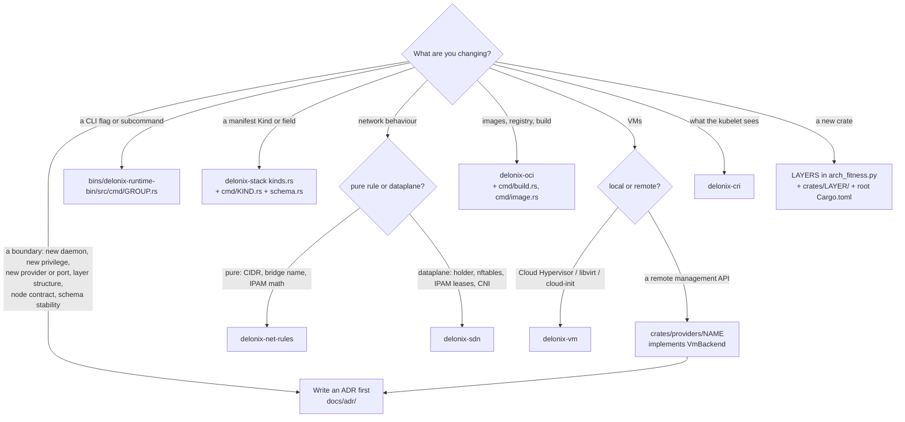

<!-- translated-from: 00-start-here.md sha256:3b8669d2ae0501c037d937d9cf4974b6451dd8a1ab1c871835097b72e9031360 -->
# 0. Começa aqui

Esta página leva-te de «acabei de clonar o repositório» a «o meu primeiro pull request está em
revisão», um passo de cada vez. Cada passo diz o que fazer, o que deves ver, e que página explica os
detalhes. Cada regra desta página tem um link para o sítio onde está escrita — se uma regra não tem
link, não é uma regra.

Se uma palavra daqui for nova para ti, procura-a no [glossário](14-glossary.md).

## Dia 0 em 30 minutos

### O que é o Delonix (5 minutos)

O Delonix Runtime é um motor que corre **containers e microVMs num nó**, a par da rede e do
armazenamento de que eles precisam. É:

- **declarativo** — descreves recursos com os seus Kinds próprios (`delonix api-resources` lista-os)
  e o motor planeia e aplica a diferença;
- **daemonless** — não é preciso nenhum serviço em segundo plano; cada comando é um processo que faz
  o seu trabalho e sai;
- **rootless-first** — o caminho normal corre com o teu próprio utilizador sem privilégios.

**Não** sabe quem o usa: não existe no código nenhum conceito de plataforma, inquilino, conta ou
facturação. Lê [05 — Arquitectura](05-architecture.md#engine-identity-and-boundaries) para o quadro
completo; por agora, estas quatro frases chegam.

### O que precisas (10 minutos)

Um host Linux com cgroup v2 e user namespaces sem privilégios, a toolchain de Rust fixada no
`rust-toolchain.toml`, e o `protoc` no teu `PATH`. A lista completa, e as armadilhas do host que
parecem bugs do motor, estão em [01 — Preparar o teu ambiente](01-environment.md). Lê pelo menos a
secção [Armadilhas conhecidas do host](01-environment.md#known-host-traps) antes do passo 5 abaixo.

### Cinco comandos que provam que o teu ambiente funciona (15 minutos)

Corre-os a partir da raiz da tua checkout. Se algum deles não der a forma mostrada, pára e
corrige-o antes de avançar — todos os passos seguintes dependem dele.

**1. Clonar, com as tags.**

```bash
git clone https://github.com/angolardevops/delonix-runtime.git
cd delonix-runtime
git fetch --tags origin
git describe --tags --abbrev=0        # prints the newest release, e.g. vX.Y.Z
```

As tags importam: o gate de versão e o gate de contrato comparam o teu branch com elas
([02](02-build-and-test.md#clone)).

**2. Compilar a CLI.**

```bash
cargo build -p delonix-runtime-bin
```

Esperado: `Finished` na última linha e um binário em `target/debug/delonix`. Se parar com uma
mensagem sobre o `protoc`, instala-o ([01](01-environment.md#protoc-required-to-build)).

**3. Correr os testes de um crate pequeno e puro.**

```bash
cargo test -p delonix-net-rules
```

O `delonix-net-rules` não tem dependência nenhuma (vê o seu `Cargo.toml`), por isso isto só prova
que a tua toolchain compila e corre testes — nada sobre o host. Esperado: uma linha da forma
`test result: ok. N passed; 0 failed`.

**4. Correr o binário que acabaste de compilar.**

```bash
./target/debug/delonix --version
./target/debug/delonix --help
```

Esperado: `--version` imprime `delonix <version>` na primeira linha, uma descrição do motor numa
linha na segunda, e depois uma linha da forma `commit: <sha> · built: <date> · <licence>`; entre
releases a parte `commit:` diz também a que distância o build está da última tag
(`+N commits since vX.Y.Z`). Segue-se um bloco curto `get started:`. `--help` imprime
`Usage: delonix [OPTIONS] <COMMAND>`, uma lista `Commands:` e um `COMMAND MAP`.

Usa sempre `./target/debug/delonix`, nunca um `delonix` encontrado no teu `PATH` — esse é uma
release instalada e normalmente é mais antigo ([01](01-environment.md#a-stale-delonix-on-your-path)).

**5. Correr um comando real, totalmente isolado.**

Tudo o que vá além do `--help` lê e escreve estado do motor. Aponta **as duas** variáveis de estado
para directórios de rascunho primeiro — meia isolação é pior que nenhuma
([02](02-build-and-test.md#isolating-the-engines-state)):

```bash
export DELONIX_ROOT=$HOME/scratch/dlx/root
export DELONIX_NET_RUNTIME_DIR=/tmp/dlx-run      # keep it short: it holds unix sockets
mkdir -p "$DELONIX_ROOT" "$DELONIX_NET_RUNTIME_DIR"

./target/debug/delonix system info
./target/debug/delonix volume create hello
./target/debug/delonix volume ls
./target/debug/delonix volume inspect does-not-exist; echo "exit=$?"
./target/debug/delonix volume rm hello
```

Formas esperadas:

```text
$ delonix system info
Delonix Engine <version>
  state root:         <your $DELONIX_ROOT>
  mode:               rootless (daemonless)
  cgroup2 delegated:  yes | no
  network infra:      down (comes up on demand)
  containers:         0 (0 running)
  events:             0

$ delonix volume ls
NAME    DRIVER   MOUNTPOINT                              SIZE
hello   local    <your $DELONIX_ROOT>/volumes/hello/_data   0 B

$ delonix volume inspect does-not-exist; echo "exit=$?"
error no such volume does-not-exist
exit=4
```

O que isto prova: a linha `state root:` é **o teu directório de rascunho** (por isso não estás a
tocar em estado real), o motor corre rootless, e os erros levam uma classe no código de saída
(4 = não existe — ver
[03](03-rust-primer.md#32-errors-one-error-and-exit-codes-derived-from-its-type)). Se
`cgroup2 delegated:` disser `no`, o `container run` recusa `-m`/`--cpus`/`--cpu-weight` nesta
sessão (saída 69) e `--cpuset`/`--io-weight` não têm efeito; isso é uma configuração do host,
explicada em
[01](01-environment.md#cgroup-delegation-some-limits-are-refused-others-are-not-enforced).

Quando acabares de experimentar com a rede mais tarde, desmonta a infra de rede isolada com as
mesmas duas variáveis exportadas: `./target/debug/delonix net netns down`.

## A tua primeira contribuição, de ponta a ponta

### 1. Escolhe alguma coisa

- Procura issues abertas com a etiqueta **`good first issue`** ou **`documentation`** no GitHub.
  Comenta na issue antes de começar, para duas pessoas não fazerem o mesmo trabalho.
- Para tudo o que não seja trivial — um comando novo, um Kind de manifesto novo, uma mudança na
  configuração de namespaces ou cgroups, um backend novo — abre primeiro uma issue e acorda a
  abordagem ([`CONTRIBUTING.md`](../../../CONTRIBUTING.md), [10](10-contributing-workflow.md)).
- Vê os pull requests abertos, para não duplicares trabalho que já está em curso.

Boas primeiras áreas, porque são código puro com testes unitários e sem privilégios de host: um
parser ou validador no crate da CLI, uma mensagem de erro que não diz o que fazer, uma entrada em
português em falta em `bins/delonix-runtime-bin/data/pt.po`, ou uma página deste manual que esteja
errada.

### 2. Abre um worktree a partir de `origin/main`

Uma tarefa, um worktree, um branch — nunca edites uma checkout partilhada, nunca ponhas o worktree
em `/tmp` ([10 — Um worktree por tarefa](10-contributing-workflow.md#one-worktree-per-task)):

```bash
git fetch --tags origin
git worktree add -b <topic>/<task> ../.worktrees/delonix-runtime/<task> origin/main
cd ../.worktrees/delonix-runtime/<task>
git log --oneline -- <path you will touch>      # what was already decided or fixed there
```

Ler primeiro o histórico da área faz parte do trabalho: muito deste código regista coisas que foram
tentadas, medidas e mudadas ([10 — Parte da tag mais recente](10-contributing-workflow.md#start-from-the-latest-tag-not-from-memory)).

### 3. Descobre onde vai a mudança

Usa a árvore de decisão em [Onde vai a minha mudança?](#where-does-my-change-go) abaixo, e depois lê
a secção de [06 — Os crates](06-crates.md) para esse crate.

### 4. Escreve o teste primeiro

- Uma função pura nova (parser, validador, construtor de argumentos, plano) leva um teste unitário
  no mesmo ficheiro, dentro de `#[cfg(test)] mod tests`. Um teste nunca toca no state root real:
  passa-lhe um directório temporário — ver [03 — Testes](03-rust-primer.md#39-tests).
- Uma correcção de bug leva um teste que **falha sem a correcção**. Reverte a tua correcção uma vez,
  corre o teste, vê-o falhar, e depois repõe a correcção. Um teste que passa de qualquer maneira não
  prova nada.
- Uma mudança em namespaces, cgroups, no holder de rede ou no arranque de VMs precisa também de uma
  execução **ao vivo** com o estado isolado, porque os testes unitários não alcançam esses caminhos
  ([02 — Correr os testes](02-build-and-test.md#run-the-tests)).

### 5. Corre os gates locais

Cada job de CI tem um comando local, listado em
[02 — Os gates que a CI corre](02-build-and-test.md#the-gates-ci-runs). No mínimo, antes de pedir
revisão:

```bash
cargo fmt --all --check
cargo clippy --workspace --all-targets --locked -- -D warnings
cargo test --workspace --locked --no-fail-fast
python3 scripts/lang_ratchet.py
python3 scripts/arch_fitness.py
python3 scripts/dev_docs.py --check
python3 scripts/version_gate.py
```

Acrescenta os que correspondem ao que tocaste (os gates da superfície da CLI se acrescentaste um
comando, o gate de contrato se tocaste em `proto/`, o gerador da documentação se o texto de ajuda
mudou) — a tabela da 02 diz quais.

### 6. Escreve o pull request

Abre-o contra `main` e preenche todas as secções de
[`.github/PULL_REQUEST_TEMPLATE.md`](../../../.github/PULL_REQUEST_TEMPLATE.md). O modelo tem quatro
partes, e os revisores lêem todas:

- **What does this change do, and why?** — o *porquê*; o diff já mostra o *quê*.
- **How was this tested?** — os gates que correste e, para código de runtime/namespace/cgroup/rede,
  o comando que correste **ao vivo** e a sua saída.
- **Checklist** — build/clippy/fmt/test limpos; strings novas visíveis ao utilizador em inglês,
  envolvidas em `po::t`/`po::tf`, com uma entrada em português no `pt.po`; todos os pontos de
  entrada de um comando ligados; testes unitários para as funções puras novas; fronteiras de
  privilégio assinaladas.
- **Does this cross a privilege or namespace boundary?** — mapeamento do user namespace, a netns do
  holder, o socket de controlo, `setns`/`unshare`, ou tratamento de caminhos conduzido por input do
  utilizador ou de um manifesto. Se não tiveres a certeza, di-lo.

Diz o que ficou provado **e** o que não foi validado, e porquê
([10 — Commits e pull requests](10-contributing-workflow.md#commits-and-pull-requests)).

### 7. O que os revisores verificam

Os code owners em [`.github/CODEOWNERS`](../../../.github/CODEOWNERS) revêem todas as mudanças. A
checklist de revisão está em [12 — Convenções de código](12-coding-conventions.md); os padrões cloud
native contra os quais uma mudança é medida estão em
[13 — Padrões cloud native](13-cloud-native-standards.md). Lê as duas antes de abrires o PR, não
depois da primeira ronda de comentários.

### 8. Depois do merge

Remove o worktree **e** o branch — o branch sobrevive ao `worktree remove`:

```bash
cd ../../../delonix-runtime    # from the worktree of step 2 back to the clone
git worktree remove ../.worktrees/delonix-runtime/<task>
git branch -D <topic>/<task>
```

## Onde vai a minha mudança?



| Mudança | Onde vai (confirmado na árvore) | Ler | Regra e a sua fonte |
|---|---|---|---|
| **Flag ou subcomando novo da CLI** | `bins/delonix-runtime-bin/src/cmd/<group>.rs` (um módulo por grupo); strings através de `cmd/po.rs`, com o português em `data/pt.po`; texto do manual em `cmd/manual_entries.rs`; lista de folhas em `scripts/cli_baseline.tsv` (`scripts/cli-tree.sh --update`). A validação pura de uma execução pertence a `crates/contexts/delonix-compute/src/preflight.rs` | [10 — Acrescentar ou mudar um comando da CLI](10-contributing-workflow.md#adding-or-changing-a-cli-command), [03 — A CLI](03-rust-primer.md#36-the-cli-clap-derive-and-translated-output) | LANG-01 (`scripts/lang_ratchet.py`); gate da superfície da CLI (`scripts/cli-tree.sh --gate`, `scripts/docs_cli_gate.py`); ligar todos os pontos de entrada (`CONTRIBUTING.md`) |
| **Kind novo, ou um campo de um Kind** | Os factos do Kind: `FACTS` em `crates/contexts/delonix-stack/src/kinds.rs`. O seu tipo de spec e o apply: `bins/delonix-runtime-bin/src/cmd/<kind>.rs`. Campos actualizáveis a quente: `hot_fields` em `crates/contexts/delonix-stack/src/reconcile.rs`. O schema: `TYPED_KINDS` em `cmd/schema.rs`, e o `docs/schema/v1/delonix.json` publicado (`delonix manifest schema`) | [04 — Reconciliação declarativa](04-cloud-native-primer.md#48-declarative-reconciliation), [06 — `delonix-stack`](06-crates.md#delonix-stack) | Abre primeiro uma issue (`CONTRIBUTING.md`); o schema é gerado a partir do código ([ADR-0007](../../adr/0007-generated-manifest-schema.md)); os testes em `kinds.rs` e `schema.rs` falham quando uma tabela fica esquecida |
| **Comportamento de rede** | Regras puras sem I/O: `crates/foundation/delonix-net-rules/src/lib.rs`. Dataplane (holder, socket de controlo, nftables, IPAM, CNI): `crates/adapters/delonix-sdn/src/` (`infra.rs`, `ipam.rs`, `cni.rs`). O passo de rede do `container run`: `crates/contexts/delonix-compute/src/network.rs`. CLI: `cmd/network.rs`, `cmd/net.rs`, `cmd/firewall.rs` | [04 — Rede de containers](04-cloud-native-primer.md#45-container-networking), [06 — `delonix-sdn`](06-crates.md#delonix-sdn) | Rootless-first e nenhuma falha silenciosa ([10 — Regras de arquitectura](10-contributing-workflow.md#architecture-rules-the-gates-enforce)); assinala a fronteira de privilégio no PR (`SECURITY.md`) |
| **Imagens, registo, build** | `crates/adapters/delonix-oci/src/` (`registry.rs`, `build.rs`, `cas.rs`, `overlay.rs`); CLI em `cmd/build.rs`, `cmd/image.rs` | [08 — Delonixfile e VMfile](08-delonixfile-and-vmfile.md), [06 — `delonix-oci`](06-crates.md#delonix-oci) | Os downloads são verificados por digest (`SECURITY.md`, âmbito da cadeia de fornecimento) |
| **Estado persistido: um campo de registo, um store, locks de ficheiro, segredos em repouso** | Tipos de registo (`Container`, `Vm`): `crates/foundation/delonix-runtime-core/src/lib.rs`. Como são guardados e trancados (`Store`, `JsonStore`, `write_atomic*`, `SecretStore`, `CredVault`): `crates/adapters/delonix-state/src/` (`store.rs`, `secret.rs`, `cred_vault.rs`) | [06 — `delonix-state`](06-crates.md#delonix-state), [05 — Estado em disco](05-architecture.md#state-on-disk), [03 — Concorrência](03-rust-primer.md#38-concurrency-and-shared-state) | Os campos novos de um registo levam `#[serde(default)]`; o read-modify-write passa pelo `update` ([12 — Estado e concorrência](12-coding-conventions.md#8-state-and-concurrency)) |
| **Comportamento de VMs neste nó** | `crates/adapters/delonix-vm/src/lib.rs` (o trait `VmBackend` e o registo de backends), `cloudinit.rs`; CLI em `cmd/vm.rs`, `cmd/vmimage.rs`, `cmd/vmfile.rs` | [09 — Construir microVMs](09-microvm-setup.md), [03 — Traits como portas](03-rust-primer.md#33-traits-as-ports-vmbackend-and-the-backend-registry) | [ADR-0008](../../adr/0008-proxmox-vm-backend.md) (os backends são registáveis) |
| **Um backend de VM ou provider de armazenamento novo, atrás de uma API remota** | Um crate novo em `crates/providers/`, a implementar uma porta; registado na raiz de composição (`cmd/vmbackends.rs`) | [06 — Providers](06-crates.md#providers), [05 — Camadas](05-architecture.md#layers-and-the-allowed-direction) | Primeiro um ADR ([10 — Quando escrever um ADR](10-contributing-workflow.md#when-to-write-an-adr)); [ADR-0040](../../adr/0040-engine-restructuring-layers-ports-node-contract.md) |
| **CRI (aquilo com que o kubelet fala)** | `crates/interfaces/delonix-cri/src/` (`runtime_svc.rs`, `runtime_svc/lifecycle.rs`, `streaming.rs`) | [04 — Kubernetes](04-cloud-native-primer.md#46-kubernetes-cri-kubelet-kubeadm-and-kind), [06 — `delonix-cri`](06-crates.md#delonix-cri) | [ADR-0038](../../adr/0038-cri-follows-kubelet-resource-model.md) |
| **Um crate novo** | Uma entrada em `LAYERS` em `scripts/arch_fitness.py`, um directório em `crates/<layer>/`, e o seu caminho no `[workspace.dependencies]` do `Cargo.toml` raiz — tudo no mesmo commit | [05 — Camadas](05-architecture.md#layers-and-the-allowed-direction) | `scripts/arch_fitness.py` (directório = camada, versões só na raiz) |
| **Uma decisão que muda uma fronteira** | `docs/adr/NNNN-title.md`, antes do código | [10 — Quando escrever um ADR](10-contributing-workflow.md#when-to-write-an-adr) | [`docs/adr/README.md`](../../adr/README.md); os ADRs aceites são sucedidos, nunca reescritos |

Se a tua mudança não encaixa em nenhuma linha, pergunta na issue antes de escrever código (ver
[Quando estás preso](#when-you-are-stuck)).

## Regras que não podes quebrar

Cada regra é imposta por um gate, por uma revisão, ou pelos dois. O link é o sítio onde está escrita.

| Regra | Fonte |
|---|---|
| **O motor não conhece nenhum consumidor.** Nenhum produto, plataforma, control plane, consola ou agente que use o motor é nomeado em `crates/`, `bins/`, `proto/` ou nos manifestos, comentários incluídos; nenhum inquilino, conta, plano ou facturação. | *«Identidade e fronteira do motor»* no topo do [`AGENTS.md`](../../../AGENTS.md). Os consumidores nomeados são impostos por `CONSUMER_NAMES` em `scripts/arch_fitness.py` (uma lista fixa de nomes, casada por expressão regular); a proibição dos conceitos de inquilino, conta, plano e facturação não é casada por nenhum gate e é verificada em revisão |
| **Daemonless.** Nenhum processo residente por omissão; um novo precisa de um ADR com a evidência do que o systemd não conseguiu fazer. | [`AGENTS.md`](../../../AGENTS.md) (a mesma secção); [10 — Regras de arquitectura](10-contributing-workflow.md#architecture-rules-the-gates-enforce) |
| **Rootless-first.** O caminho normal corre sem privilégios; o privilégio é um opt-in explícito e anunciado. Uma fronteira de privilégio nova precisa de um spike GO/NO-GO e de um ADR. | [`AGENTS.md`](../../../AGENTS.md); [10 — Quando escrever um ADR](10-contributing-workflow.md#when-to-write-an-adr) |
| **As dependências apontam para dentro, o directório é a camada, as versões vivem só na raiz.** | [ADR-0040](../../adr/0040-engine-restructuring-layers-ports-node-contract.md); `scripts/arch_fitness.py` |
| **LANG-01: o código é em inglês.** Identificadores, comentários e mensagens em inglês; português só através do `pt.po`. | [10 — Língua](10-contributing-workflow.md#language-english-in-the-code-lang-01); `scripts/lang_ratchet.py` |
| **Alinhamento da versão.** Não mudes a `version` do `Cargo.toml` raiz num PR de feature; o teu branch tem de conter a tag mais recente. | [10 — Alinhamento da versão](10-contributing-workflow.md#version-alignment); `scripts/version_gate.py` |
| **Um worktree por tarefa**, fora de `/tmp`, ficheiros adicionados pelo nome, worktree e branch removidos no fim. | [10 — Um worktree por tarefa](10-contributing-workflow.md#one-worktree-per-task) |
| **Nunca corras o motor, a bateria E2E ou o arnês de caos contra estado real.** Exporta tanto `DELONIX_ROOT` como `DELONIX_NET_RUNTIME_DIR`; não definas `E2E_SHARED_STATE=1` a não ser que estejas a diagnosticar o teu próprio host. | [02 — Isolar o estado do motor](02-build-and-test.md#isolating-the-engines-state), [E2E](02-build-and-test.md#end-to-end-battery-scriptse2esh), [caos](02-build-and-test.md#chaos-harness-scriptschaossh) |
| **As mudanças sensíveis para a segurança são assinaladas**, e as vulnerabilidades são reportadas em privado, nunca numa issue ou PR público. | [`SECURITY.md`](../../../SECURITY.md); [10 — Mudanças sensíveis para a segurança](10-contributing-workflow.md#security-sensitive-changes) |

## Quando estás preso

Procura por esta ordem — cada passo é mais barato do que o seguinte:

1. **Este manual.** O [README](README.md) tem a lista de páginas; o [glossário](14-glossary.md)
   explica o vocabulário.
2. **[`AGENTS.md`](../../../AGENTS.md)**, organizado por área. É longo e em parte histórico (e em
   parte em português): usa-o para saber *onde* procurar, e depois confirma no código.
3. **O índice de ADRs**, [`docs/adr/README.md`](../../adr/README.md) — a decisão por trás de uma
   estrutura, e o que foi rejeitado.
4. **O histórico do ficheiro**: `git log --oneline -- <path>` e `git log -p -S '<symbol>'`. As
   mensagens de commit aqui explicam o porquê.

Se continuares preso, **pergunta** no GitHub:

- Comenta na issue em que estás a trabalhar, ou abre uma nova com
  [o modelo de pedido de funcionalidade](../../../.github/ISSUE_TEMPLATE/feature_request.md) (para
  perguntas sobre uma abordagem) ou [o modelo de relato de bug](../../../.github/ISSUE_TEMPLATE/bug_report.md).
- Um problema de segurança segue pelo [relato privado de vulnerabilidades](../../../SECURITY.md),
  não por uma issue.

O modelo de relato de bug pede:

- a saída de `delonix --version`;
- a distro e a versão do kernel, rootless ou root, e se instalaste com o `install.sh`,
  descarregaste um binário, ou compilaste a partir do código-fonte;
- o comando ou manifesto exacto que o provoca;
- o que esperavas, e a saída **completa, sem cortes** do que aconteceu de facto;
- se reproduz sempre, às vezes, ou só uma vez;
- qualquer outra coisa que possa ser relevante.

Este manual recomenda ainda duas coisas que o modelo não pede, porque poupam uma ida e volta:

- a saída **inteira** do `--version` do binário que correste, incluindo a linha `commit:` (entre
  releases todos os builds reportam o mesmo número de versão, e só o commit os distingue);
- se `DELONIX_ROOT`/`DELONIX_NET_RUNTIME_DIR` estavam definidas, e o que já leste e tentaste
  (a página, a secção do `AGENTS.md`, o ADR).

## Checklist de progresso

- [ ] Li o que é o Delonix e os quatro princípios ([05](05-architecture.md#engine-identity-and-boundaries)).
- [ ] O meu host cumpre a [01](01-environment.md), e li as armadilhas conhecidas do host.
- [ ] `cargo build -p delonix-runtime-bin` termina.
- [ ] `cargo test -p delonix-net-rules` reporta `test result: ok`.
- [ ] `./target/debug/delonix --help` funciona, e deixei de usar o `delonix` do meu `PATH`.
- [ ] `delonix system info` mostra o meu `DELONIX_ROOT` de rascunho como state root.
- [ ] Escolhi uma issue e comentei nela (ou abri uma para uma mudança não trivial).
- [ ] Trabalho no meu próprio worktree, criado a partir de `origin/main`.
- [ ] Descobri onde vai a mudança e li a secção desse crate na [06](06-crates.md).
- [ ] Escrevi um teste que falha sem a minha mudança.
- [ ] Os gates locais da [02](02-build-and-test.md#the-gates-ci-runs) passam.
- [ ] Li a [12](12-coding-conventions.md) e a [13](13-cloud-native-standards.md).
- [ ] O meu PR preenche todas as secções do modelo, incluindo o que *não* foi validado.
- [ ] Depois do merge, removi o meu worktree e o meu branch.
