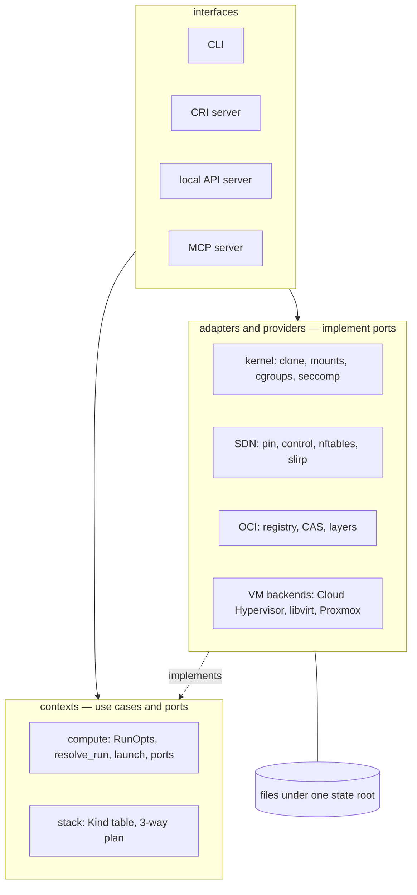
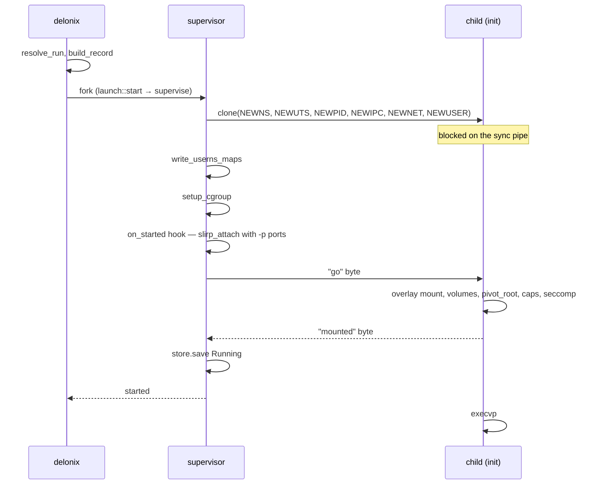
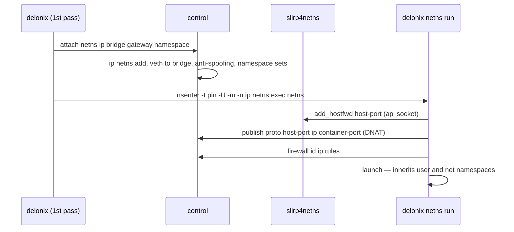
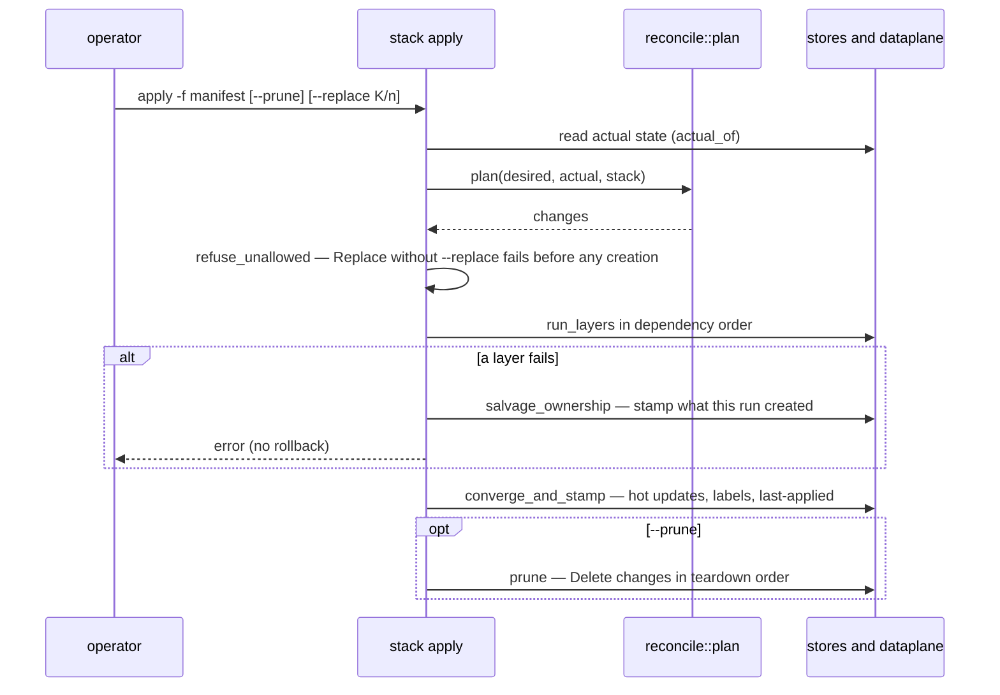

<!-- translated-from: 07-system-design-interview.md sha256:11b5c2d21ae7be9b05ae54f148b67e7fd71ab43e5b17b5fc375f698b8d8df861 -->
# 7. System Design Interview — o Delonix Engine

> **Entrevistador:** Desenha um motor de containers e de microVMs para um único nó Linux. Tem de
> correr sem root por omissão, sem um daemon residente, e não pode saber quem o está a chamar.

Esta página responde a esse enunciado como um candidato forte responderia, e depois confronta cada
resposta com o que o Delonix Engine faz de facto. Cada aprofundamento termina com **Onde vive no
código**, que lista os ficheiros e símbolos lidos para esta página. Para o mapa estrutural (camadas,
grafo de crates, processos, caminhos de estado) lê primeiro [5. Arquitectura](05-architecture.md);
esta página é sobre *porque* é que o desenho tem esta forma.

Os números citados abaixo são **medições registadas no repositório com a sua data ou release**, não
factos intemporais. Volta a medir antes de confiares num deles.

---

## 1. Requisitos

> **Candidato:** Antes de desenhar caixas, quero fixar o que significa «feito».

### Funcionais

- Correr **containers** a partir de imagens OCI: pull, descompactar, criar, arrancar, parar, exec,
  logs, remover.
- Correr **microVMs** a partir de imagens de disco, em mais do que um hypervisor.
- **Redes** entre cargas: bridges privadas, portas publicadas, firewall, nomes DNS, isolamento por
  namespace.
- **Armazenamento**: volumes nomeados, bind mounts, partilhas de rede.
- Operação **declarativa**: um manifesto de Kinds, `plan`, `apply`, detecção de deriva, poda.
- Servir o **kubelet** através do CRI, para que o motor possa ser o runtime de um nó Kubernetes.
- Expor as mesmas operações a **programas locais** (uma API, um protocolo de ferramentas de IA), e
  não só a uma shell.

### Não funcionais

- **Rootless-first.** O caminho normal corre como um utilizador sem privilégio; o privilégio é
  opt-in e dito.
- **Daemonless.** Nenhum processo corre «só por via das dúvidas». A persistência pertence ao systemd
  ou a um processo por carga com dono.
- **Nenhum conhecimento do consumidor.** Nenhum inquilino, conta, plano ou faturação; o motor valida
  o seu próprio contrato em vez de confiar num chamador para recusar o que ele não consegue fazer.
- **Observável** através de padrões abertos (OpenTelemetry, Prometheus) e de um registo de eventos.
- **Falha honesta.** Uma operação recusada ou feita a meio é reportada como tal, com uma razão e uma
  classe de saída estável — nunca `0` por cima de uma falha.
- **Sobrevive a reinícios dos seus próprios processos de controlo** sem perturbar as cargas que
  estão a correr.

---

## 2. Restrições de fundo: o que um utilizador Linux sem privilégio pode fazer

> **Candidato:** O rootless muda o desenho mais do que qualquer outro requisito, por isso deixa-me
> listar as regras do kernel com que tenho de viver.

| O kernel deixa um utilizador sem privilégio… | …mas não | Consequência para o desenho |
|---|---|---|
| criar um **user namespace** e ser uid 0 dentro dele (`CLONE_NEWUSER`) | mapear uids arbitrários do host | um mapa de uid único, a menos que `newuidmap`/`newgidmap` e `/etc/subuid` concedam um intervalo; uma imagem que faça `chown` para o uid 101 precisa do intervalo |
| criar namespaces de rede, mount, PID, IPC e UTS **pertencentes a esse user namespace**, com `CAP_NET_ADMIN`/`CAP_SYS_ADMIN` dentro deles | mexer no network namespace inicial do host | a rede é construída *dentro* de um namespace de que o motor é dono; chegar ao host precisa de uma bridge em user space (`slirp4netns`) |
| fazer `mount` de overlayfs, tmpfs e binds **dentro do seu próprio mount namespace** | montar na vista do host | o próprio init do container faz o mount do overlay depois do `clone` |
| escrever limites numa subárvore cgroup v2 **delegada** | escrever em cgroups que não lhe foram delegados | os limites só se aplicam onde o systemd os delegou (`systemd-run --user --scope -p Delegate=yes`) |
| fazer `setns` para um namespace pertencente ao seu próprio user namespace | fazer `setns` para um namespace pertencente ao user namespace de *outro* processo | juntar-se a uma rede criada noutro sítio significa **entrar primeiro no user namespace desse dono** |
| correr `clone` em segurança num processo **com uma só thread** | assumir que `clone` é seguro num processo com várias threads (o `clone` não corre os handlers `pthread_atfork`) | servidores construídos sobre `tokio` têm de entregar a criação de processos a um processo novo |

Duas políticas do host aparecem constantemente e parecem bugs do motor: o Ubuntu 23.10+ restringe os
user namespaces sem privilégio através do AppArmor (um perfil é associado ao *caminho* do executável
que cria o namespace), e uma sessão SSH simples não é um scope de cgroup delegado.

---

## 3. API

> **Candidato:** Um conjunto de operações, várias portas de entrada — e uma delas é o contrato para
> onde as outras convergem.

| Porta de entrada | Codificação | Quem a usa |
|---|---|---|
| CLI `delonix` | argv, classes de saída estáveis | operadores, scripts |
| Contrato de nó `delonix.node.v1` | gRPC **e** HTTP/JSON no **mesmo** socket unix local | qualquer cliente local (desenho; ainda não servido) |
| CRI `runtime.v1` | gRPC num socket unix | o kubelet |
| MCP | JSON-RPC sobre stdio | um cliente de IA local, uma sessão por processo |

Pontos de desenho do contrato de nó, todos escritos no
[ADR-0040](../../adr/0040-engine-restructuring-layers-ports-node-contract.md) D4 e no
[ADR-0042](../../adr/0042-one-engine-api-maturity-and-docs.md):

- **Os ficheiros `.proto` são a fonte de verdade**; o mapeamento REST vem das anotações
  `google.api.http` e o documento OpenAPI é gerado a partir delas. Um gate de CI verifica o formato,
  o lint, as quebras de compatibilidade face à última release, que cada RPC excepto os streams
  bidireccionais (`Exec`, `Console`) tem um mapeamento HTTP, e que o OpenAPI commitado é o gerado.
- Serviços **orientados a recursos** (`ContainerService`, `PodService`, `VirtualMachineService`,
  `NetworkService`, `VolumeService`, `ImageService`, `StackService`, `NodeService`,
  `OperationService`), uma mensagem de pedido por RPC, identidade explícita como `namespace`/`name`.
- **O trabalho longo devolve uma `Operation`** que é persistida antes de ser confirmada, para que um
  servidor reiniciado possa dizer `Interrupted` em vez de `RUNNING` para sempre.
- **Só local.** `SO_PEERCRED`, o mesmo uid, sem TCP, sem TLS, sem identidade no motor — o
  [ADR-0010](../../adr/0010-remote-management-api.md) rejeitou uma API remota. Qualquer coisa fora do
  nó põe o seu próprio proxy à frente.

> **Entrevistador:** Porque não simplesmente um servidor REST?
>
> **Candidato:** Porque os clientes gRPC e as ferramentas de shell merecem ambos uma codificação de
> primeira classe, e gerar as duas a partir de um único ficheiro impede-as de divergir. A CLI também
> não é cidadã de segunda: as suas classes de saída (`delonix-model/src/exitcode.rs`) são as classes
> `DX_*` que o ADR-0040 D4 exige que os erros do contrato carreguem.

**Onde vive no código:** `proto/delonix/node/v1/{node,compute,infra,operations,common}.proto`;
`scripts/contract_gate.py`; `docs/api/openapi.yaml`; `crates/interfaces/delonix-cri/src/lib.rs`
(`serve_blocking`); `bins/delonix-mcp-bin/src/main.rs`; `crates/foundation/delonix-model/src/exitcode.rs`.
Estado honesto: nenhum crate referencia ainda o `delonix.node.v1`; os programas locais usam a API de
gestão (`crates/interfaces/delonix-mgmt`), que o ADR-0042 planeia migrar e remover.

---

## 4. Desenho de alto nível

> **Candidato:** Vou organizá-lo em camadas para que as regras do domínio nunca importem o kernel, e
> vou fazer com que cada processo de vida longa seja dono de exactamente uma coisa.



- **Camadas** (ADR-0040 D1): fundação → contextos → adaptadores/providers → interfaces → binários,
  impostas por `scripts/arch_fitness.py`.
- O **estado** são registos JSON e ficheiros endereçados por conteúdo debaixo de um só root, com
  escritas atómicas e `flock` à volta de cada ler-modificar-escrever — sem base de dados, porque não
  há nenhum daemon para ser dono dela.
- Os **processos** existem por carga (um supervisor que é o pai do container, o init, um shim de
  logs) e por nó quando a rede é usada (um *pin* que só segura namespaces, um processo de *controlo*
  reiniciável, um uplink `slirp4netns`). Mais nada fica de pé.

**Onde vive no código:** `scripts/arch_fitness.py` (`LAYERS`, `ALLOWED`);
`crates/foundation/delonix-runtime-core/src/store.rs` (`Store::update`, `JsonStore::update`,
`write_atomic`); `crates/contexts/delonix-compute/src/{ports,launch}.rs`;
`crates/adapters/delonix-linux/src/supervise.rs` (`run_supervised`).

---

## 5. Aprofundamentos

### 5.1 Um `container run` rootless

> **Entrevistador:** Leva-me pelo `run -d -p 8080:80 nginx` como utilizador sem privilégio.

> **Candidato:** Resolver tudo o que pode falhar *antes* de criar um processo; depois criar o
> processo parado, configurá-lo de fora, e só o libertar quando estiver pronto.

1. **Resolver.** Uma especificação de execução (`RunOpts`) vem de cada entrada — flags da CLI, um
   manifesto de Pod, a API Docker, o CRI. O `resolve_run` faz pull da imagem se estiver ausente,
   prepara o sistema de ficheiros raiz, resolve o `--user` contra ele, resolve volumes e
   dispositivos, e valida as opções de segurança. Todas as recusas acontecem aqui, e uma guarda
   remove o directório preparado em qualquer retorno antecipado.
2. **Registar.** O `build_record` transforma a especificação num registo `Container` (puro).
3. **Escolher o pai.** Para um arranque destacado a CLI faz fork de um **supervisor** que se torna o
   pai do container (`launch::start` → `should_supervise`). Só o pai real pode fazer `waitpid`, por
   isso é isto que torna possíveis o código de saída real e o `--restart` sem daemon.
4. **Clone.** O `spawn` chama `clone` com namespaces novos de mount, UTS, PID e IPC, mais user e
   network namespaces quando o container tem os seus próprios. O filho fica bloqueado num pipe.
5. **Configurar de fora, por uma ordem fixa.** O pai escreve os mapas de uid/gid
   (`write_userns_maps`, através de `newuidmap` quando existe um intervalo de subuid), prepara o
   cgroup, corre o hook `on_started` (aqui: `slirp_attach` com as portas de `-p`, para que a rede
   exista antes de o entrypoint correr), e só então escreve o byte «go».
6. **Dentro do filho.** O `container_init` monta o overlay (`mount_overlay_if_marked`), faz bind dos
   volumes, prepara o `/dev`, faz `pivot_root`, mascara caminhos de `/proc`, aplica capabilities,
   seccomp e `no_new_privs`, e sinaliza **«mounted»** num segundo pipe antes do `execvp`.
7. **Publicar o registo em último.** O pai espera pelo byte «mounted» (`wait_for_mounts`), espera
   brevemente pelo resultado do exec, e só então faz `store.save` de `Running`.



> **Entrevistador:** Porquê esperar por «mounted» antes de guardar o registo?
>
> **Candidato:** Porque o registo é o que *outros* processos lêem para decidir que podem entrar no
> container. Antes do `pivot_root`, um `setns` para o mount namespace do filho aterra no sistema de
> ficheiros do host. Medido a 2026-08-28 com uma sonda capaz de distinguir os dois sistemas de
> ficheiros: antes da correcção, 5 de 54 `exec`s lançados logo a seguir a `run -d` correram fora do
> container; depois dela, 0 de 54. A
> espera tem três desfechos (`MountWait::{Ready, InitExited, Unknown}`) e um tecto, por isso um mount
> pendurado não pode pendurar o `run`.

**Onde vive no código:** `crates/contexts/delonix-compute/src/run.rs` (`resolve_run`,
`build_record`); `crates/contexts/delonix-compute/src/launch.rs` (`start`, `should_supervise`,
`WorkloadRuntime`); `crates/adapters/delonix-linux/src/workload.rs` (`HostWorkload`);
`crates/adapters/delonix-linux/src/supervise.rs` (`run_supervised`);
`crates/adapters/delonix-linux/src/lib.rs` (`spawn`, `write_userns_maps`, `setup_cgroup`,
`container_init`, `setup_rootfs`, `wait_for_mounts`, `MountWait`);
`bins/delonix-runtime-bin/src/cmd/container.rs` (`cmd_run`).

### 5.2 Rede: pin, controlo, slirp, nftables

> **Entrevistador:** Os containers precisam de falar uns com os outros, de ser isolados por namespace
> e de publicar portas — sem `CAP_NET_ADMIN` no host.

> **Candidato:** Construir um mundo de rede privado dentro de um namespace de que o utilizador é dono,
> ligá-lo ao host em user space, e fazer toda a filtragem aí.

**Separar segurar de servir.** Um único processo «holder» que fosse dono dos namespaces *e* servisse
pedidos derrubaria a rede de todas as cargas sempre que reiniciasse. Por isso:

- o **pin** (`delonix netns pin`) cria ele próprio os namespaces de user, de rede e de mount e depois
  só dorme (`pin_main`). O seu pid é o alvo de cada `nsenter -t <pin>`, e nunca muda;
- o processo de **controlo** (`delonix netns control`, arrancado através de `nsenter` para dentro dos
  namespaces do pin) serve um socket unix `0600` restringido por `SO_PEERCRED`, e corre DNS, DHCP e
  Router Advertisements. É reiniciável: o `ensure_up` reinicia só ele quando o pin está vivo;
- **um `slirp4netns`** liga o `tap0` à netns do pin e expõe um socket de API para `add_hostfwd`.

O pin cria os seus namespaces **no próprio processo** (o chamador escreve os mapas de ids através de
dois pipes) em vez de via `unshare(1)`, porque um perfil AppArmor é associado pelo caminho do
executável que cria o user namespace, e o `/usr/bin/unshare` não é o do motor.

**Juntar-se a uma rede custom.** Um container em `--net web` não consegue fazer `setns` para uma
netns pertencente ao user namespace do pin. Por isso a CLI pede ao processo de controlo que crie a
netns e o veth (`attach …`), e depois **re-executa-se a si própria** dentro dos namespaces de user e
de mount do pin (`nsenter -t <pin> -U -m -n -- ip netns exec <netns> delonix netns run <spec>`); a
segunda passagem herda os namespaces de user e de rede em vez de os criar.

**Publicar uma porta** são dois passos, ambos estado do dataplane e não estado de processo (é por
isso que se podem acrescentar e remover portas num container a correr): `add_hostfwd` no slirp único,
e uma regra DNAT dentro da netns do pin (`publish …` no socket de controlo).

**Filtrar com um verdict map.** A tabela de ingress (`table ip dlxing`) é construída de modo a que a
política por container custe o mesmo seja qual for o número de containers:

```text
forward priority -20  fwguard   drop 169.254.0.0/16 and 127.0.0.0/8
forward priority -10  fwdeny    established → accept; bridge pair in @netpair → verdict; bridge↔bridge → drop
forward priority  -5  fwcont    ip daddr vmap @fwmap ; ip saddr vmap @fwmap
forward priority   0  forward   policy drop; established; tap0; same-bridge; @netpair
```

O `fwcont` tem duas regras; as regras de cada container vivem na sua própria chain, alcançada através
do verdict map `fwmap` chaveado por IP. O tráfego **entre** redes é descartado par a par, a menos que
uma `NetworkRoute` ponha o par em `@netpair` — uma rota diz que o pacote *pode* atravessar, e a chain
por container continua a decidir se é *permitido*.

O **isolamento por namespace** vive na chain de cada container: os membros de `@dlxns<hash>` (mesmo
namespace) são aceites, e as ligações **novas** vindas de qualquer outro endereço de container
(`@dlxall`) são descartadas; as respostas continuam a fluir porque o drop só casa com `ct state new`.
Uma política de ingress explícita substitui esse default. O IPv6 na SDN é recusado por omissão
(`table ip6` com `policy drop`), porque todas as regras acima são IPv4.



> **Entrevistador:** O processo de controlo serve uma ligação de cada vez. Não é um estrangulamento?
>
> **Candidato:** É deliberadamente o ponto de serialização das mudanças de netns, veth e nftables, que
> não se podem intercalar. O risco são os clientes desistirem na fila: quando a v0.47.0 foi preparada,
> 30 attaches concorrentes com um tecto de leitura de 5 segundos perderam 15; com o tecto da resposta
> subido (`CONTROL_REPLY_TIMEOUT`, 30 s) os 30 concluíram. O tecto de I/O por ligação
> (`CONTROL_IO_TIMEOUT`) existe para que um cliente preso não congele o plano de controlo do nó.

**Onde vive no código:** `crates/adapters/delonix-sdn/src/infra.rs` (`ensure_up`,
`start_pin`, `pin_main`, `start_control`, `control_main`, `control_loop`, `start_slirp`,
`attach_container`, `do_attach`, `publish_port`, `join_argv`, `ingress_table_ruleset`,
`fw_chain_body`, `dlxns_set`, `DLXALL_SET`, `ingress_v6_refusal_ruleset`, `CONTROL_IO_TIMEOUT`,
`CONTROL_REPLY_TIMEOUT`); `crates/adapters/delonix-sdn/src/pin_userns.rs`;
`crates/adapters/delonix-sdn/src/run_network.rs` (`HostNetwork`);
`crates/contexts/delonix-compute/src/network.rs` (`attach_custom_network`, `wire_network`);
`bins/delonix-runtime-bin/src/cmd/container.rs` (`reexec_into_netns`, `run_from_spec`).

### 5.3 Imagens: CAS, camadas partilhadas e o mount de muitas camadas

> **Entrevistador:** Um nó corre vinte containers da mesma imagem. O que está em disco?

> **Candidato:** Os blobs uma vez, as camadas descompactadas uma vez, e um pequeno directório gravável
> por container.

- **CAS.** Os blobs são nomeados pelo seu sha256 em `blobs/sha256/<hex>`; escrever um digest que já
  existe é um no-op. Um pull verifica cada blob contra o manifesto **e** o manifesto contra o digest
  que o utilizador fixou (`verify_manifest_digest`) — caso contrário um pin seria decorativo.
- **Downloads retomáveis.** O download de um blob volta a tentar com `Range:` a partir dos bytes que
  já tem (`BLOB_ATTEMPTS`), e distingue um `206` no offset pedido (retoma), um `206` noutro sítio e um
  `200` (recomeça). A verificação do digest no fim é o que torna a costura segura.
- **Camadas partilhadas.** O `prepare_overlay` cria `upper/`, `work/`, `merged/` para o container e
  escreve a lista ordenada dos directórios de camadas partilhadas em `overlay-lowers`. É o **próprio
  init do container** que o monta, dentro do seu mount namespace, onde um utilizador sem privilégio
  tem permissão para o fazer. O contrato é um ficheiro em disco e não um campo em memória porque o
  caminho rootless re-executa o binário e uma struct não atravessa essa fronteira.

  Contas de guardanapo, tal como registadas para a v0.59.0: a cópia flat anterior custava a cada
  container uma árvore de imagem completa — num host de desenvolvimento `containers/` tinha 47 GiB,
  quase tudo cópias idênticas, e cada `run` de uma imagem de 2,1 GiB passava cerca de 13 s a copiar.
  Partilhar as camadas levou esse directório para 7,2 GiB.
- **Muitas camadas.** O `mount(2)` clássico passa `lowerdir=a:b:c…` como uma única string e o kernel
  copia no máximo uma página dela, **truncando em silêncio**. Medido para o
  [ADR-0037](../../adr/0037-overlay-mount-new-api.md) (validado a 2026-09-06): 20 camadas (4084 bytes)
  montaram, 30 (5994 bytes) falharam, e uma imagem builder de 91 camadas precisava de 9107 bytes. O
  mount usa agora `fsopen`/`fsconfig`/`fsmount`/`move_mount` com uma chamada `lowerdir+` por camada,
  por isso não há tecto de comprimento.

**Onde vive no código:** `crates/adapters/delonix-oci/src/cas.rs` (`Cas::write`,
`Cas::has`); `crates/adapters/delonix-oci/src/registry.rs` (`blob_with_progress_capped`,
`BLOB_ATTEMPTS`, `parse_content_range`, `verify_manifest_digest`);
`crates/adapters/delonix-oci/src/overlay.rs` (`prepare_overlay`, `LOWERS_FILE`);
`crates/adapters/delonix-oci/src/run_images.rs` (`HostImages`);
`crates/adapters/delonix-linux/src/lib.rs` (`mount_overlay_if_marked`, `fsopen_overlay`).

### 5.4 microVMs: uma porta, um registo e a armadilha do firmware

> **Entrevistador:** Acrescenta VMs sem construir uma abstracção de hypervisor que vaze por todo o
> lado.

> **Candidato:** Um trait por provider, um registo que a raiz de composição preenche, e as
> peculiaridades que pertencem ao provider respondidas pelo provider.

- **Porta.** O `VmBackend` tem `id`, `available`, `boot`, `is_running`, `ip`, `stop`, e operações
  opcionais (`pause`, `snapshot`, `restore`, …) cuja resposta por omissão é «não suportado». Os
  factos do provider são métodos, não verificações de strings nos sítios de chamada:
  `ip_is_predicted` (o endereço do Cloud Hypervisor é calculado a partir do MAC, não observado),
  `manages_own_storage` (um nó remoto é dono do seu disco), `destroy` distinto de `stop` (localmente o
  disco é do motor; remotamente só o destroy o liberta).
- **Registo.** O `builtin_backends` semeia o Cloud Hypervisor e o libvirt por ordem de preferência; o
  `register_backend` acrescenta mais (o backend Proxmox, registado pela raiz de composição da CLI só
  quando configurado). Um registo transporta uma closure factory e uma flag `auto_selectable`, para
  que a auto-detecção nunca construa — e portanto nunca autentique — um backend remoto. Registar não
  faz I/O.
- **Rede de uma VM.** O Cloud Hypervisor corre dentro da netns do pin e recebe um `tap` numa bridge de
  rede através da porta `VmNetwork`, que a SDN implementa (`HostVmNetwork`); o `delonix-vm` não
  depende do `delonix-sdn`. Como o servidor DHCP é do próprio motor e determinístico, o lease é
  conhecido antes de o convidado arrancar, e é isso que permite que o isolamento de namespace se
  aplique ao endereço de uma VM desde o primeiro pacote — e é também por isso que «tem um IP» não é
  prova de um convidado arrancado (o `sdn_reachable` pergunta por ARP de dentro da netns).
- **Firmware.** A procura de firmware do Cloud Hypervisor prefere o EDK2 `CLOUDHV.fd` ao
  `hypervisor-fw` (`DEFAULT_CH_FIRMWARES`, com um teste que fixa a ordem).
- **cloud-init.** O `VmConfig` transporta intenção (`hostname`, utilizador, chaves SSH); os backends
  locais realizam-na como um ISO NoCloud cujo `network-config` identifica a NIC primária pelo **MAC**,
  e um backend remoto pode realizá-la de forma nativa.

**Onde vive no código:** `crates/adapters/delonix-vm/src/lib.rs` (`VmBackend`,
`BackendRegistration`, `builtin_backends`, `register_backend`, `select_backend`, `auto_detect`,
`backend_for`, `CloudHypervisorBackend`, `LibvirtBackend`, `launch_vmm`, `DEFAULT_CH_FIRMWARES`,
`set_network`); `crates/adapters/delonix-vm/src/cloudinit.rs` (`generate_seed_iso`);
`crates/contexts/delonix-compute/src/ports.rs` (`VmNetwork`);
`crates/adapters/delonix-sdn/src/vm_network.rs` (`HostVmNetwork`);
`crates/adapters/delonix-sdn/src/infra.rs` (`sdn_reachable`, `dhcp_lease_ip`);
`crates/providers/delonix-proxmox/src/lib.rs` (`ProxmoxBackend`);
`bins/delonix-runtime-bin/src/cmd/vmbackends.rs` (`register_configured`).

### 5.5 O reconciliador declarativo, sem ficheiro de estado

> **Entrevistador:** O `apply` tem de convergir, detectar deriva e podar — ao estilo do Terraform —
> mas disseste sem daemon e sem base de dados.

> **Candidato:** Guardar a última spec aplicada no próprio recurso, derivar a posse de uma label, e
> fazer do planeamento uma função pura.

- **Plano puro.** O `reconcile::plan(desired, actual, stack)` recebe dois snapshots e devolve
  `Vec<Change>`; nunca abre um store. Isso torna os casos difíceis testáveis como dados.
- **Diff de três vias.** O último mapa de campos aplicado é guardado no recurso
  (`delonix.io/last-applied`). Um campo presente na máquina mas ausente do manifesto é revertido
  **só se fomos nós a defini-lo**; caso contrário é deixado em paz — a distinção que um diff de duas
  vias não consegue fazer.
- **Posse por label** (`delonix.io/stack`). Um recurso sem dono é `Adopt`ado; um que pertence a outra
  stack é um `Conflict` e nunca é tocado; o `--prune` e o `destroy` só vêem o que tem a label.
- **As acções** são `Create`, `Adopt`, `Update` (a quente, mesmo PID), `Replace` (recusado a menos
  que seja dado `--replace <Kind>/<name>`, verificado antes de qualquer coisa ser criada), `NoOp`,
  `Delete`, `Conflict`, `NotConverged`. O `plan --detailed-exitcode` responde 0/2/1 para um gate de
  deriva em CI.
- **Uma única tabela de factos dos Kinds** (domínio, forma, se converge, se tem teardown, se é
  namespaced, como é observada a presença) governa o planeador, a ordem de apply e a ordem de
  teardown, em vez de listas mantidas em sincronia à mão.



**Onde vive no código:** `crates/contexts/delonix-stack/src/reconcile.rs` (`plan`,
`Action`, `Change`, `STACK_LABEL`, `LAST_APPLIED`, `hot_fields_for`, `encode_last_applied`);
`crates/contexts/delonix-stack/src/kinds.rs` (`KindFacts`, `facts`, `stack_kinds`, `converges`,
`has_teardown`); `bins/delonix-runtime-bin/src/cmd/stack.rs` (`apply`, `apply_docs`,
`refuse_unallowed`, `run_layers`, `salvage_ownership`, `converge_and_stamp`, `prune`,
`destroy_one`).

---

## 6. Compromissos

| Decisão | O que compra | O que custa |
|---|---|---|
| **Sem daemon**; um supervisor por container destacado, systemd para a persistência no arranque | nenhum processo único cuja morte leve todas as cargas; cada processo tem um dono óbvio | nada vê um processo morrer a menos que o seu próprio supervisor o veja; um chamador que não consegue fazer fork arranca sem supervisão e o código de saída real perde-se; os órfãos precisam de ceifadores explícitos |
| **Ficheiros JSON + `flock`** em vez de uma base de dados | estado inspeccionável, tolerante a crashes, sem dependência extra, funciona entre os processos da CLI/CRI/supervisor | sem transacções nem consultas; a verdade sobre a vivacidade é reconciliada na leitura (`reconcile_status`, `safe_to_signal`) |
| **Uplink em user space (`slirp4netns`)** em vez de pares veth no host | funciona com zero privilégio no host | salto extra e CPU em user space; um cliente de loopback aparece como o gateway do slirp (`SLIRP_GW`) e não como ele próprio |
| **Separação pin/controlo** | um reinício do controlo não mexe em nenhum fio | dois processos sobre os quais raciocinar, e os upgrades in-place continuam a ter de reconhecer pins mais antigos |
| **Re-exec em vez de `clone` no próprio processo nos servidores** | o `clone` nunca corre num processo com várias threads | um processo por operação, e texto de erro a atravessar uma fronteira de processo — o ciclo que o ADR-0040 remove com um launcher |
| **Overlay montado pelo init do container** | uma cópia de cada camada em disco; mount sem privilégio | a vista fundida de um container parado precisa de um processo auxiliar que segure o mount (`reexec_mapped_hold`) |
| **Despacho por verdict map** | custo por pacote constante à medida que os containers crescem | as regras são texto gerado; o gerador e o leitor de contadores têm de partilhar a formatação (`fw_rule_tail`) |
| **Diff de 3 vias no recurso** | nenhum ficheiro de estado para perder ou divergir | só os campos que um Kind consegue ler de volta podem ser comparados; os valores de `Secret` não são decifrados para planear |

---

## 7. Modos de falha e os limites de um só nó

> **Entrevistador:** Diz-me como é que se parte.

- **O processo de controlo morre.** O `ensure_up` encontra o pin vivo e reinicia só o plano de
  controlo dentro dos namespaces sobreviventes; as cargas a correr mantêm os seus PIDs e a rede.
- **O pin morre.** Os namespaces vão com ele e não se consegue voltar a entrar neles, por isso a infra
  é reconstruída. O `delonix net netns up` encontra os containers e membros de pod que estavam a correr
  com rede e reinicia-os (`reconcile_after_respawn`; `DELONIX_NO_AUTO_RECOVER=1` só reporta). Isto é
  recuperação por reinício, e lê só o store de containers — as VMs não são recuperadas desta forma.
- **Um upgrade por cima de um holder mais antigo.** Um holder anterior à separação a servir num
  caminho de socket legado é detectado e reportado com os dois caminhos; deliberadamente **não** é
  morto automaticamente, porque isso derrubaria a rede de todas as cargas.
- **O `apply` morre a meio.** O apply é fail-fast sem rollback. Antes de criar o que quer que seja
  valida o grafo e recusa substituições não autorizadas; se uma camada falhar, o que esta execução
  criou é carimbado com posse (`salvage_ownership`) para que um `destroy` ou `--prune` posterior ainda
  lhe consiga chegar, e a execução falhada é registada como uma revisão.
- **Fugas sem daemon.** Cada lease e referência é libertada por um detach normal, por isso tudo o que
  morre de outra forma deixa fuga. Medido a 2026-08-25: o ficheiro de IPAM de uma rede tinha 391
  leases, dos quais 47 pertenciam a um container existente. Os ceifadores respeitam uma janela de
  graça (`REF_MARKER_GRACE`) porque um container a ser criado segura um lease e uma referência antes
  de ter registo; o ceifador de IPAM é de duas passagens (um lease só é reclamado se ainda estiver
  órfão numa execução posterior, depois da janela) e **falha fechado** — um store ilegível é um erro,
  nunca «nada está vivo». A vivacidade conta todos os registos de container, a netns de pod dos
  membros de pod e os marcadores de referência ligados, e não só os ids de containers a correr
  (`cmd/prune.rs::lease_owners`, `live_ref_owners`).
- **A corrida da espera pelos mounts** (5.1): fechada publicando o registo só depois de o init
  reportar os seus mounts; um arranque destacado cujo init sai antes de montar é um erro, não `0`.
- **Limites de um só nó.** Cada rede é um `/16` dentro da netns do pin; cada mudança de
  netns/veth/nftables passa por uma única ligação de controlo serializada; o débito do `slirp4netns`
  é em user space; e mover uma VM para outro host (`vm migrate`) implica tempo de indisponibilidade
  real — a migração ao vivo é um NO-GO tal como está construído
  ([ADR-0031](../../adr/0031-live-vm-migration-no-go.md)).
  O escalonamento entre nós está fora de âmbito por desenho.

**Onde vive no código:** `crates/adapters/delonix-sdn/src/infra.rs` (`ensure_up`,
`stale_holder_message`, `reap_orphan_refs`, `REF_MARKER_GRACE`);
`crates/adapters/delonix-sdn/src/ipam.rs` (`reap_orphan_leases`);
`crates/adapters/delonix-sdn/src/lib.rs` (`reap_orphan_slirp`);
`bins/delonix-runtime-bin/src/cmd/netns.rs` (`reconcile_after_respawn`, `is_reattach_candidate`);
`bins/delonix-runtime-bin/src/cmd/prune.rs` (`lease_owners`, `live_ref_owners`);
`bins/delonix-runtime-bin/src/cmd/stack.rs` (`salvage_ownership`);
`crates/adapters/delonix-linux/src/lib.rs` (`reconcile_status`, `MountWait`).

---

## 8. Perguntas de seguimento

**Porque não acrescentar um pequeno daemon para eventos e reinícios?**
Porque cada processo residente é um domínio de falha e uma superfície de ataque. O registo de eventos
é um ficheiro só de acrescento (`delonix_runtime_core::events`), os reinícios pertencem ao supervisor
por container, e a persistência no arranque é uma unit systemd por carga (`delonix system boot`). Um
daemon precisa do seu próprio ADR com a evidência do que as alternativas não conseguiram fazer — ver
o [ADR-0034](../../adr/0034-csi-daemon-conflict.md) para um caso em que a pergunta surgiu, e o
[ADR-0021](../../adr/0021-gitops-pull-reconciler.md) (*Proposto*) para uma reconciliação contínua que
se mantém daemonless.

**Como é que o CRI arranca um container se o servidor não pode fazer `clone`?**
O `StartContainer` constrói um `RunOpts` tipado, escreve-o num ficheiro `0600` e corre
`delonix __apirun <spec>`, que chama o mesmo `cmd_run` que a CLI. O ADR-0040 D5 substitui o salto pela
CLI por um executável launcher. A política de recursos no caminho CRI segue o kubelet
([ADR-0038](../../adr/0038-cri-follows-kubelet-resource-model.md)).

**Porque é que a API de gestão é só local?**
O acesso remoto implica identidade, autorização, certificados e auditoria de chamadores de que o motor
não tem noção. O [ADR-0010](../../adr/0010-remote-management-api.md) rejeitou-o; a superfície MCP é
local pela mesma razão ([ADR-0025](../../adr/0025-mcp-local-ai-control-surface.md)).

**Como acrescentarias um provider de VM novo?**
Um crate novo que implementa `VmBackend`, registado na raiz de composição — sem editar os sítios de
chamada ([ADR-0008](../../adr/0008-proxmox-vm-backend.md)). O ADR-0040 D3 move os botões dos providers
para extensões com namespace e as peculiaridades para capacidades; o OpenStack está condicionado a um
spike ([ADR-0039](../../adr/0039-openstack-vm-backend.md)).

**Como é que os Services balanceiam a carga sem um VIP?**
Um `Service` selecciona containers por label e o DNS interno devolve vários registos `A`, rodados a
cada consulta — sem dataplane novo ([ADR-0032](../../adr/0032-service-kind-dns-round-robin.md)).

**Porquê ext4 e não btrfs/zfs debaixo do state root?**
O overlay sobre uma cache de camadas partilhada já eliminou a duplicação; um sistema de ficheiros
diferente só é revisitado perante uma necessidade medida
([ADR-0016](../../adr/0016-filesystem-under-the-state-root.md)).

**E o macOS e o Windows?**
Não é um port — nada do que este motor usa existe fora do kernel Linux. O plano é um launcher para
uma VM convidada Linux ([ADR-0036](../../adr/0036-macos-windows-support.md), *Proposto*).

**Para onde vai a reestruturação?**
Quatro camadas, uma especificação de execução, portas de provider com capacidades, um contrato de nó
servido num servidor por socket activation, e um launcher dono de cada spawn que cria namespaces
([ADR-0040](../../adr/0040-engine-restructuring-layers-ports-node-contract.md),
[ADR-0042](../../adr/0042-one-engine-api-maturity-and-docs.md)).
