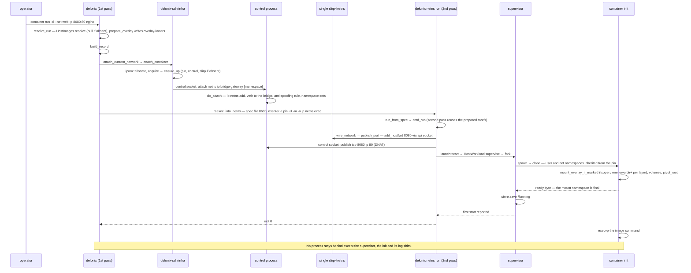
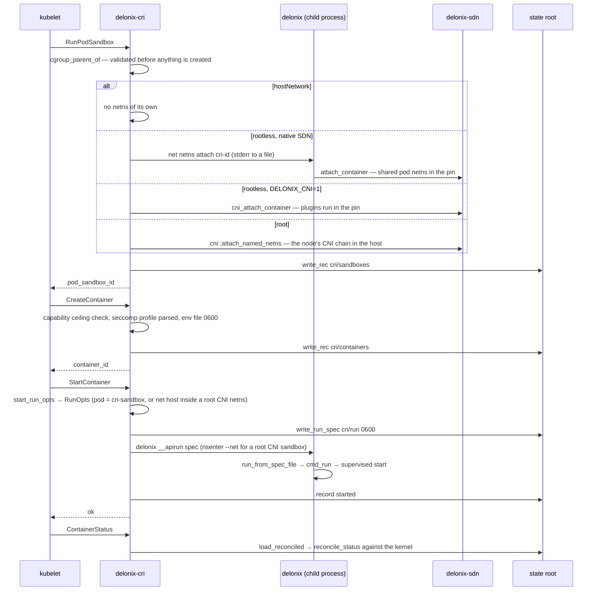

<!-- translated-from: architecture.md sha256:ff3afb854d7e3428a88311a0a4898a0cc23223baf4a6ec89156aee337cb1899d -->
# Arquitectura

Esta página é o mapa de que um contribuidor precisa antes de mexer no backend: o que o motor é, como
os crates estão organizados em camadas, que processos existem em tempo de execução, onde vive o estado
em disco, e como as peças falam umas com as outras. Cada afirmação estrutural nomeia o ficheiro e o
símbolo contra os quais foi verificada. O documento canónico, mais longo, é o
[`ARCHITECTURE.md`](../../../ARCHITECTURE.md) na raiz do repositório; as decisões por trás da estrutura
estão em [`docs/adr/`](../../adr/), acima de tudo o
[ADR-0040](../../adr/0040-engine-restructuring-layers-ports-node-contract.md).

> **Duas metades nesta página.** A tabela das camadas e o grafo de crates são *gerados* por
> `python3 scripts/dev_docs.py` a partir do `Cargo.toml` e do `scripts/arch_fitness.py` — não os edites
> à mão. Tudo o resto é narrativa e é revisto depois de cada release.

## Identidade e fronteiras do motor

O texto canónico é a secção *«Identidade e fronteira do motor»* no topo do
[`AGENTS.md`](../../../AGENTS.md). Em resumo:

- **O que é.** Uma abstracção de execução para **um nó**: corre **containers e microVMs**
  e gere a rede e o armazenamento de que eles precisam. É declarativo, com **Kinds próprios**
  agrupados por `apiVersion` (`core`, `compute`, `networking`, `gateway`, `storage`, `artifact`,
  `infrastructure` — a tabela é `crates/contexts/delonix-stack/src/kinds.rs`, e o
  `delonix api-resources` imprime-a).
- **Os providers ficam atrás de portas.** O kernel Linux, o Cloud Hypervisor e o libvirt, o Proxmox VE
  e o CRI do Kubernetes são alcançados através de um trait, nunca através de `if provider == …`
  espalhado pelo código. As portas de hoje: `VmBackend` (`crates/adapters/delonix-vm/src/lib.rs`) e as
  portas de compute em `crates/contexts/delonix-compute/src/ports.rs` e `launch.rs`
  (`ImageStore`, `StorageProvider`, `DeviceResolver`, `RunHost`, `NetworkProvider`,
  `VmNetwork`, `WorkloadRuntime`). Um backend OpenStack está desenhado
  ([ADR-0039](../../adr/0039-openstack-vm-backend.md), *Proposed*) mas ainda não tem crate.
- **Cloud native** — plan / apply / deriva, as mesmas operações expostas por várias interfaces,
  observabilidade através de OpenTelemetry e Prometheus (`crates/adapters/delonix-telemetry`).
- **Daemonless** — nenhum processo residente por omissão. O que tem de persistir pertence ao systemd ou
  a um processo por workload com um dono claro (o supervisor de um container, o pin de rede).
- **Rootless-first** — o caminho normal corre como um utilizador sem privilégio; o privilégio é um
  opt-in explícito (`--privileged`, `vm bridge`).
- **Não conhece nenhum consumidor.** Nenhuma plataforma, control plane, consola ou agente é nomeado em
  `crates/`, `bins/`, `proto/` ou nos manifestos, e não há noção de inquilino, conta, plano ou
  facturação. O *namespace* que vais ver por todo o lado é o namespace de **isolamento** do próprio
  motor, não um inquilino.

Isto não são convenções; o `scripts/arch_fitness.py` impõe a metade estrutural na CI:

| Verificação | Onde em `arch_fitness.py` |
|---|---|
| Uma dependência contra a direcção das camadas falha, a menos que seja uma excepção declarada que nomeie a fase do ADR-0040 que a remove | `LAYERS`, `ALLOWED`, `EXCEPTIONS`, `rule_failures` |
| Um crate de fundação ou de contexto não pode ter uma dependência de runtime/servidor/CLI (`tokio`, `tonic`, `reqwest`, `clap`, …) | `HEAVY` |
| Um binário compõe **um** crate de interface | `rule_failures` (a verificação `roles`) |
| Um crate tem de viver no directório da sua camada | `LAYER_DIR`, `misplaced` |
| O nome de um consumidor em qualquer sítio debaixo de `crates/`, `bins/`, `proto/` (comentários incluídos) falha | `CONSUMER_NAMES`, `consumer_mentions` |
| As versões das dependências vivem só no `[workspace.dependencies]` da raiz | `inline_versions` |
| Ratchets que só podem descer (listados abaixo) — por ex. crates de biblioteca a re-executar o binário do próprio motor, `println!` em bibliotecas, escritas no ambiente do processo, adapters a importar o `Error` partilhado como se fosse seu | os padrões de ratchet (`SELF_EXEC`, `PRINTS`, `ENV_WRITES`, `SHARED_ERROR`, …), linha de base em `scripts/arch_baseline.json` |

<!-- dev-docs:begin ratchets -->
O `scripts/arch_fitness.py` mantém **5 ratchets de dívida** (linha de base em `scripts/arch_baseline.json`):

- `self_exec_sites`
- `library_prints`
- `env_writes`
- `shared_error_imports`
- `raw_error_variant_matches`
<!-- dev-docs:end ratchets -->

O `python3 scripts/arch_fitness.py --list` mostra o que cada ratchet conta hoje, ficheiro a ficheiro.

## Camadas e a direcção permitida

O ADR-0040 D1 fixa uma só direcção de dependência:

```
interfaces ─► contexts (domain + use cases + ports) ◄─ adapters / providers
     │                                                      ▲
     └──────────────────── composes (bins/) ────────────────┘
```

- **Fundação** (`crates/foundation/`) — tipos partilhados, quase puros, que qualquer camada pode nomear.
- **Contextos** (`crates/contexts/`) — um crate por bounded context, com o nome dos grupos de API
  publicados: casos de uso e as **portas** de que precisam. Sem kernel, sem HTTP, sem provider.
- **Adapters** (`crates/adapters/`) e **providers** (`crates/providers/`) — implementam portas:
  kernel, SDN, store OCI, backends de VM; os providers trazem um cliente HTTP para um alvo remoto.
- **Interfaces** (`crates/interfaces/`) — CRI, API de gestão, MCP: lêem um pedido, chamam o
  motor, apresentam.
- **Binários** (`bins/`) — raízes de composição.

A camada a que cada crate pertence, e a direcção em que pode depender:

<!-- dev-docs:begin layers -->
| Camada | Pode depender de |
|---|---|
| Foundation | foundation |
| Contexts | foundation, contexts |
| Adapters | foundation, contexts |
| Providers | foundation, contexts |
| Interfaces | foundation, contexts, adapters, providers |
| Binaries | foundation, contexts, adapters, providers, interfaces |

Excepções declaradas (cada uma nomeia a fase do ADR-0040 que a remove):

- `delonix-linux` → `delonix-state` — removida na **P4**
- `delonix-mcp` → `delonix-mgmt` — removida na **P5**
- `delonix-oci` → `delonix-state` — removida na **P4**
- `delonix-proxmox` → `delonix-vm` — removida na **P4**
- `delonix-scanner` → `delonix-oci` — removida na **P4**
- `delonix-sdn` → `delonix-state` — removida na **P4**
- `delonix-vm` → `delonix-state` — removida na **P4**
- `delonix-volume` → `delonix-state` — removida na **P4**
<!-- dev-docs:end layers -->

### Em que ponto está a reestruturação

O ADR-0040 é um plano strangler em fases (P0 carris → P1 contrato → P2 contextos → P3 adapters e
binários → P4 providers → P5 API de nó → P6 CRI → P7 observabilidade). O que o código mostra hoje:

- **A P0 está feita.** Todos os crates vivem no directório da sua camada, as versões são ao nível do
  workspace, e o gate de fitness corre na CI.
- **A P1 está feita como contrato, não como servidor.** O `proto/delonix/node/v1/*.proto` existe, o
  documento OpenAPI `docs/api/openapi.yaml` é gerado a partir dele, e o `scripts/contract_gate.py`
  protege os dois. **Nada serve ainda o contrato** — nenhum crate referencia `delonix.node.v1`
  (o [ADR-0042](../../adr/0042-one-engine-api-maturity-and-docs.md) D1 diz o mesmo).
- **A P2 começou.** Existem o `delonix-model` (o `Error` partilhado e os seus códigos `DX_*`, nomes gerados, classes de saída), o `delonix-stack` (tabela de
  Kinds, reconciliador de 3 vias, revisões) e o `delonix-compute` (a especificação de execução única `RunOpts`,
  `resolve_run`, `build_record`, os casos de uso de rede e de lançamento). A maior parte da lógica de
  aplicação ainda vive em `bins/delonix-runtime-bin/src/cmd/`.
- **A P3 está em curso.** As portas de compute estão implementadas em adapters (`HostImages`,
  `HostVolumes`, `HostDevices`, `HostRuntime`, `HostNetwork`, `HostWorkload`, `HostVmNetwork`),
  a telemetria saiu da fundação para o `delonix-telemetry`, o `delonix-vm` só chega à SDN
  através da porta `VmNetwork`, e os servidores CRI, API de gestão e MCP passaram a ser executáveis
  próprios. Quatro adapters já têm os nomes do ADR-0040: `delonix-scanner` (era `delonix-scan`),
  `delonix-oci` (era `delonix-image`), `delonix-sdn` (era `delonix-net`) e `delonix-linux` (era
  `delonix-runtime`, o crate do motor de containers). O `delonix-runtime-core` ainda existe, mas o
  `Error` partilhado desceu para o `delonix-model` (re-exportado), e os stores, as escritas atómicas e
  o store de segredos cifrado saíram para o adapter `delonix-state` (o modelo puro de segredos
  foi para o `delonix-model`). Os adapters que abrem registos ou escrevem ficheiros através dele
  (`delonix-linux`, `delonix-vm`, `delonix-sdn`, `delonix-oci`, `delonix-volume`) são excepções
  declaradas até a P4 lhes dar uma porta `StateRepository` (`scripts/arch_fitness.py`).
- **As P4–P7 ainda não começaram.** As excepções que restam na tabela acima nomeiam essas fases.

O grafo de crates, tal como o `Cargo.toml` o declara:

```mermaid
graph TB
  subgraph foundation["Foundation"]
    delonix_model["delonix-model"]
    delonix_net_rules["delonix-net-rules"]
    delonix_runtime_core["delonix-runtime-core"]
  end
  subgraph context["Contexts"]
    delonix_compute["delonix-compute"]
    delonix_security_runtime["delonix-security-runtime"]
    delonix_stack["delonix-stack"]
  end
  subgraph adapter["Adapters"]
    delonix_linux["delonix-linux"]
    delonix_oci["delonix-oci"]
    delonix_scanner["delonix-scanner"]
    delonix_sdn["delonix-sdn"]
    delonix_state["delonix-state"]
    delonix_telemetry["delonix-telemetry"]
    delonix_vm["delonix-vm"]
    delonix_volume["delonix-volume"]
  end
  subgraph provider["Providers"]
    delonix_proxmox["delonix-proxmox"]
    delonix_truenas["delonix-truenas"]
  end
  subgraph interface["Interfaces"]
    delonix_cri["delonix-cri"]
    delonix_mcp["delonix-mcp"]
    delonix_mgmt["delonix-mgmt"]
  end
  subgraph bin["Binaries"]
    delonix_mcp_bin["delonix-mcp-bin"]
    delonix_mgmt_bin["delonix-mgmt-bin"]
    delonix_runtime_bin["delonix-runtime-bin"]
  end
  delonix_compute --> delonix_model
  delonix_compute --> delonix_runtime_core
  delonix_cri --> delonix_compute
  delonix_cri --> delonix_linux
  delonix_cri --> delonix_oci
  delonix_cri --> delonix_runtime_core
  delonix_cri --> delonix_sdn
  delonix_cri --> delonix_state
  delonix_cri --> delonix_telemetry
  delonix_linux --> delonix_compute
  delonix_linux --> delonix_runtime_core
  delonix_linux --> delonix_state
  delonix_mcp --> delonix_linux
  delonix_mcp --> delonix_mgmt
  delonix_mcp --> delonix_runtime_core
  delonix_mcp --> delonix_sdn
  delonix_mcp --> delonix_state
  delonix_mcp --> delonix_vm
  delonix_mcp --> delonix_volume
  delonix_mcp_bin --> delonix_mcp
  delonix_mcp_bin --> delonix_runtime_core
  delonix_mcp_bin --> delonix_telemetry
  delonix_mgmt --> delonix_linux
  delonix_mgmt --> delonix_oci
  delonix_mgmt --> delonix_runtime_core
  delonix_mgmt --> delonix_scanner
  delonix_mgmt --> delonix_sdn
  delonix_mgmt --> delonix_state
  delonix_mgmt --> delonix_telemetry
  delonix_mgmt --> delonix_vm
  delonix_mgmt --> delonix_volume
  delonix_mgmt_bin --> delonix_mgmt
  delonix_mgmt_bin --> delonix_runtime_core
  delonix_mgmt_bin --> delonix_telemetry
  delonix_oci --> delonix_compute
  delonix_oci --> delonix_runtime_core
  delonix_oci --> delonix_state
  delonix_proxmox --> delonix_runtime_core
  delonix_proxmox --> delonix_vm
  delonix_runtime_bin --> delonix_compute
  delonix_runtime_bin --> delonix_linux
  delonix_runtime_bin --> delonix_mgmt
  delonix_runtime_bin --> delonix_model
  delonix_runtime_bin --> delonix_oci
  delonix_runtime_bin --> delonix_proxmox
  delonix_runtime_bin --> delonix_runtime_core
  delonix_runtime_bin --> delonix_scanner
  delonix_runtime_bin --> delonix_sdn
  delonix_runtime_bin --> delonix_security_runtime
  delonix_runtime_bin --> delonix_stack
  delonix_runtime_bin --> delonix_state
  delonix_runtime_bin --> delonix_telemetry
  delonix_runtime_bin --> delonix_truenas
  delonix_runtime_bin --> delonix_vm
  delonix_runtime_bin --> delonix_volume
  delonix_runtime_core --> delonix_model
  delonix_scanner --> delonix_model
  delonix_scanner --> delonix_oci
  delonix_sdn --> delonix_compute
  delonix_sdn --> delonix_net_rules
  delonix_sdn --> delonix_runtime_core
  delonix_sdn --> delonix_state
  delonix_security_runtime --> delonix_runtime_core
  delonix_stack --> delonix_runtime_core
  delonix_state --> delonix_model
  delonix_state --> delonix_runtime_core
  delonix_truenas --> delonix_runtime_core
  delonix_vm --> delonix_compute
  delonix_vm --> delonix_net_rules
  delonix_vm --> delonix_runtime_core
  delonix_vm --> delonix_state
  delonix_volume --> delonix_compute
  delonix_volume --> delonix_model
  delonix_volume --> delonix_runtime_core
  delonix_volume --> delonix_state
```

<!-- dev-docs:begin crates-graph -->

<!-- dev-docs:end crates-graph -->

## Executáveis e processos em tempo de execução

Este é o nível *container* do C4: as coisas que correm. O build produz quatro executáveis (ver a
contagem gerada no [README do manual](README.md)); aparecem vários outros **processos** por
workload ou por nó, cada um com um dono.

```mermaid
graph TB
    OP["operator<br>terminal"]
    KL["kubelet"]
    LC["local client<br>same uid, unix socket"]
    AI["AI client<br>stdio"]
    REG["OCI registries"]

    subgraph NODE["Linux node — one user, one state root"]
        CLI["delonix<br>CLI, one command per process<br>bins/delonix-runtime-bin"]
        CRI["delonix-cri<br>gRPC runtime.v1 on a unix socket<br>crates/interfaces/delonix-cri"]
        MGMT["delonix-mgmt<br>HTTP+JSON on a unix socket<br>bins/delonix-mgmt-bin"]
        MCP["delonix-mcp<br>MCP over stdio<br>bins/delonix-mcp-bin"]
        STATE[("state root<br>DELONIX_ROOT")]

        subgraph WL["per container"]
            SUP["supervisor<br>fork of the CLI, parent of the init"]
            INIT["container init → workload<br>clone with namespaces"]
            SHIM["log shim<br>fork, writes the log file"]
            CSLIRP["slirp4netns<br>only for -p without a custom network"]
        end

        subgraph INFRA["rootless network infra — started on demand"]
            PIN["pin<br>delonix netns pin<br>owns userns + netns + mountns"]
            CTL["control<br>delonix netns control<br>control socket, DNS, DHCP, RA"]
            ISLIRP["slirp4netns<br>single host uplink, api socket"]
            PROXY["L7 proxy<br>delonix ingress-proxy"]
        end

        CH["cloud-hypervisor<br>inside the infra netns"]
        LV["libvirt / QEMU<br>driven through virsh"]
    end

    OP -- argv --> CLI
    KL -- "gRPC, SO_PEERCRED" --> CRI
    LC -- "HTTP, SO_PEERCRED" --> MGMT
    AI -- "JSON-RPC over stdio" --> MCP
    CLI -. "serve cri / serve api / mcp: exec" .-> CRI
    CLI -. exec .-> MGMT
    CLI -. exec .-> MCP
    CRI -- "runs the CLI back:<br>net netns attach, __apirun spec" --> CLI
    MGMT -- "runs the CLI back" --> CLI
    MCP -- "runs the CLI back" --> CLI
    CLI -- "spawn netns pin" --> PIN
    CLI -- "nsenter, netns control" --> CTL
    CLI -- spawn --> ISLIRP
    CLI -- "control socket: attach, publish, firewall" --> CTL
    CLI -- "api socket: add_hostfwd" --> ISLIRP
    CLI -- "fork, run_supervised" --> SUP
    SUP -- clone --> INIT
    SUP -- fork --> SHIM
    CLI -- "slirp_attach hook" --> CSLIRP
    CLI -- "infra_join_argv + setsid, SIGHUP" --> PROXY
    CLI -- "launch_vmm through the infra join argv" --> CH
    CLI -- virsh --> LV
    CLI -- HTTPS --> REG
    CLI --- STATE
    CRI --- STATE
    MGMT --- STATE
```



| Processo | Nasce em | Vive durante |
|---|---|---|
| `delonix` | `bins/delonix-runtime-bin/src/main.rs` (`main`, `run`) | um comando. O `main` intercepta os pontos de entrada escondidos (`netns pin`, `netns control`, `netns run`, `__rmtree`, `__volsnap`, `__ovlmigrate`, `__ovlhold`, `__duusage`, `__buildtar`, `__apirun`, `__netnsconnect`) **antes** de o clap fazer o parse |
| `delonix-cri` | `crates/interfaces/delonix-cri/src/bin/delonix-cri.rs` → `delonix_cri::serve_blocking` | um serviço (tipicamente uma unit do systemd). O `delonix serve cri` faz `exec` dele (`cmd/serve.rs::exec_server`) |
| `delonix-mgmt` | `bins/delonix-mgmt-bin/src/main.rs` → `delonix_mgmt::serve_blocking` | um serviço; o `delonix serve api` faz `exec` dele |
| `delonix-mcp` | `bins/delonix-mcp-bin/src/main.rs` → `delonix_mcp::serve_stdio` | uma sessão de cliente de IA (um processo filho em stdio); o `delonix mcp` faz `exec` dele |
| Fatia da Docker API | `cmd/serve.rs` → `cmd::dockerapi::run`, **dentro** do processo `delonix` | enquanto o `delonix serve docker-api` corre |
| supervisor | `delonix_linux::supervise::run_supervised`, escolhido pelo `delonix_compute::launch::start` para todo o arranque destacado em que quem chama consiga fazer fork | a vida do container; é o pai real, por isso recolhe o estado de saída e aplica o `--restart` |
| init do container | `delonix_linux::spawn` → `clone` → `container_init` | o container |
| log shim | `fork` dentro do `spawn`, a correr `log_shim` | o container |
| `slirp4netns` por container | `delonix_sdn::slirp_attach`, chamado como hook `on_started` | a netns do container; os órfãos são recolhidos por `reap_orphan_slirp` |
| pin | `infra::start_pin` lança `delonix netns pin`; `infra::pin_main` cria os namespaces user, net e mount dentro do processo (`crates/adapters/delonix-sdn/src/pin_userns.rs`) e dorme | a infra; o seu pid é `ingress/holder.pid` e nunca muda |
| control | `infra::start_control` (`nsenter -t <pin> -U -m -n -- delonix netns control`) → `infra::control_main` | reiniciável; serve o socket de controlo, o DNS (`dns_server_main`), os Router Advertisements (`ra_sender_main`) e o DHCP por bridge (`dhcp_serve`) |
| `slirp4netns` único | `infra::start_slirp` (`tap0` para dentro da netns do pin, `--api-socket`) | a infra |
| proxy de ingress L7 | `cmd/ingress_proxy.rs::spawn_proxy` através de `infra::infra_join_argv` | enquanto existir uma rota `HTTPRoute`/`Ingress` ou `--expose`; recarrega as rotas com `SIGHUP` |
| `cloud-hypervisor` | `delonix_vm::launch_vmm`, corrido através do join argv da infra | a VM |
| domínio libvirt | `LibvirtBackend` a conduzir o `virsh` | a VM (o domínio vive no libvirt) |

O `ensure_up` (`crates/adapters/delonix-sdn/src/infra.rs`) é a única função que levanta a infra de
rede, sob um lock de ficheiro por raiz, e distingue três casos: pin e control vivos (nada a fazer);
pin vivo e control desaparecido (reinicia **só** o plano de controlo — nenhum fio muda de sítio); pin
desaparecido (desmonta e reconstrói).

## Um conjunto de operações, várias interfaces

| Interface | Transporte | Entrada | Estado |
|---|---|---|---|
| CLI | argv | `bins/delonix-runtime-bin` | a superfície completa |
| CRI (`runtime.v1`) | gRPC num socket unix, `0600` + `SO_PEERCRED` | `delonix_cri::serve_blocking` | serve o kubelet |
| API de gestão | HTTP+JSON num socket unix, só o mesmo uid | `delonix_mgmt::serve_blocking` (rotas como `/v1/containers`, `/v1/volumes`, `/metrics`) | só local (o [ADR-0010](../../adr/0010-remote-management-api.md) rejeitou uma API remota); a substituir pelo contrato de nó |
| MCP | stdio | `delonix_mcp::serve_stdio` | local, sem inquilino ([ADR-0025](../../adr/0025-mcp-local-ai-control-surface.md)) |
| Fatia da Docker Engine API | HTTP num socket unix | `cmd::dockerapi::run` | uma fatia de compatibilidade, dentro do `delonix` |
| **Contrato de nó** `delonix.node.v1` | gRPC **e** HTTP/JSON num único socket unix | `proto/delonix/node/v1/` | **só contrato** — ainda sem servidor |

O contrato de nó é a API única pretendida
([ADR-0040](../../adr/0040-engine-restructuring-layers-ports-node-contract.md) D4,
[ADR-0042](../../adr/0042-one-engine-api-maturity-and-docs.md)). Os ficheiros `.proto` são a fonte de
verdade; o `docs/api/openapi.yaml` é **gerado** a partir deles e nunca editado à mão.
O `scripts/contract_gate.py` falha com: `buf format`, `buf lint`, `buf breaking` contra a última
tag que tenha `proto/`, um RPC sem mapeamento HTTP (ou um stream bidireccional com um),
um documento OpenAPI diferente do gerado, e dois caminhos que sejam o mesmo URL com nomes de variável
diferentes. Três regras que protege: uma mensagem de pedido por RPC, identidade explícita
(`namespace`/`name`) no pedido, e imagens endereçadas por parâmetro de query.

## Estado em disco

Não há base de dados. O estado são ficheiros debaixo de uma **raiz de estado**:

- `DELONIX_ROOT` quando definido; caso contrário `$XDG_DATA_HOME/delonix` ou `~/.local/share/delonix`
  para um utilizador sem privilégio e `/var/lib/delonix` para o root
  (`bins/delonix-runtime-bin/src/cmd/util.rs::state_root` → `ImageStore::default_root`;
  o `infra::base_root` resolve a mesma regra do lado da rede).
- **Os sockets não vivem debaixo da raiz de estado.** Ficam num directório de runtime curto por
  utilizador (`infra::runtime_dir`, que se pode substituir com `DELONIX_NET_RUNTIME_DIR`) porque os
  caminhos `AF_UNIX` têm o comprimento limitado; uma raiz que não seja a de omissão recebe um sufixo com
  hash (`root_suffix`) para que duas raízes no mesmo login nunca partilhem sockets. **Quando correres
  alguma coisa isolada, define as duas variáveis.**

| Caminho debaixo da raiz | O quê | Código |
|---|---|---|
| `containers/<id>.json` | um registo JSON por container | `delonix_state::Store` (`delonix-state/src/store.rs`) |
| `containers/<id>/{upper,work,merged}` + `overlay-lowers` | a camada gravável do container e a lista das camadas de imagem partilhadas que ele monta | `ImageStore::prepare_overlay` (`delonix-oci/src/overlay.rs`) |
| `images/<id>.json`, `layers/<hex>/`, `blobs/sha256/<hex>` | metadados das imagens, camadas desempacotadas partilhadas por todos os containers, blobs endereçados por conteúdo | `ImageStore::open` (`image.rs`), `Cas` (`cas.rs`) |
| `volumes/<name>/_data`, `volumes/.ns/<ns>/` | volumes nomeados, volumes com âmbito de namespace | `VolumeStore` (`delonix-volume/src/lib.rs`) |
| `vms/` | registos de VM (`JsonStore`) e ficheiros por VM | `delonix-vm` |
| `vm-images/` | imagens de VM (`.qcow2` + `.json`) | `cmd/vmimage.rs::VmImageStore` |
| `secrets/` | segredos cifrados | `SecretStore` (`delonix-state/src/secret.rs`) |
| `tunnels/keyring.key`, `tunnels/cred/` | a chave mestra do host e as credenciais cifradas | `CredVault` (`delonix-state/src/cred_vault.rs`) |
| `ingress/` | pidfiles (`holder.pid` é o pin), marcadores `refs/`, definições de redes e rotas, logs | `delonix-sdn/src/infra.rs` |
| `ipam/` | leases de endereços por prefixo | `delonix-sdn/src/ipam.rs` |
| `cri/{sandboxes,containers}/` | os registos próprios do CRI | `delonix-cri/src/runtime_svc/lifecycle.rs` (`sb_dir`, `ct_dir`) |
| `clusters/` | kubeconfigs, chaves e PKI dos clusters | `cmd/cluster.rs` |
| `events.jsonl` | registo de eventos só de acrescento | `delonix_runtime_core::events` |

A concorrência é tratada pelo sistema de ficheiros, porque vários processos (a CLI, o servidor CRI,
um supervisor) alteram os mesmos registos: as escritas são atómicas (ficheiro temporário + `rename`,
`delonix_state::write_atomic`), e a leitura-modificação-escrita passa pelo `Store::update` /
`JsonStore::update`, que obtêm um `flock` exclusivo e **recusam** avançar sem ele. Tudo
isso vive no adapter `delonix-state`; os tipos de registo que ele guarda ficam no
`delonix-runtime-core`. A infra de rede tem
o seu próprio `FileLock` à volta de `ensure_up`, `teardown`, `acquire`, `release` e dos processos de
recolha.

Como nada residente vigia os processos, um registo que diz `Running` pode estar desactualizado. Os
leitores reconciliam: o `delonix_linux::reconcile_status` verifica o pid juntamente com o seu instante
de arranque (`delonix_runtime_core::safe_to_signal`), para que um pid reciclado nunca seja confundido
com o container.

## Como os crates comunicam

1. **Chamadas Rust directas, no sentido das camadas.** O caso normal. Por exemplo o `cmd_run`
   (`cmd/container.rs`) chama o `delonix_compute::run::resolve_run` com os adapters
   `delonix_oci::run_images::HostImages`, `delonix_volume::HostVolumes`,
   `delonix_linux::cdi::HostDevices` e `delonix_linux::run_host::HostRuntime`, depois o
   `delonix_compute::network::{attach_custom_network, wire_network}` com o
   `delonix_sdn::run_network::HostNetwork`, depois o `delonix_compute::launch::start` com o
   `delonix_linux::workload::HostWorkload`.
2. **Registo na raiz de composição.** O `run()` em `bins/delonix-runtime-bin/src/main.rs`
   regista os backends de VM remotos configurados (`cmd::vmbackends::register_configured` →
   `delonix_vm::register_backend`) e a implementação SDN da porta de rede das VMs
   (`delonix_vm::set_network(HostVmNetwork)`) antes de qualquer comando correr.
3. **Re-executar o binário do próprio motor.** Ainda é comum, e é contado pelo ratchet
   `self_exec_sites`. As razões são reais:
   - o `clone` só é seguro num processo **de uma só thread**, e os servidores CRI, API de gestão e
     Docker API são runtimes `tokio` multi-thread. Entregam um `RunOpts` tipado num ficheiro
     `0600` a um `delonix __apirun <spec>` novo (`lifecycle.rs::write_run_spec`,
     `cmd::dockerapi::run_from_spec_file`).
   - Um processo rootless tem de **entrar** nos namespaces user e mount do pin de rede antes de um
     container se poder juntar a uma netns nomeada lá dentro, por isso o `reexec_into_netns` corre
     `nsenter … ip netns exec <netns> delonix netns run <spec>`.
   - Trabalhar sobre ficheiros que pertencem a subuids mapeados precisa de um processo dentro de um user
     namespace mapeado (`delonix_linux::reexec_mapped`, `reexec_mapped_hold`, `remove_tree_mapped` → os
     pontos de entrada `__rmtree`/`__ovlhold`/…).
   - Os servidores ainda constroem algumas invocações da CLI (`delonix-mgmt`, o `run_cli_blocking` do
     `delonix-mcp`, o helper `delonix()` do CRI), resolvendo a CLI através de
     `delonix_runtime_core::dispatch::cli_bin` (`DELONIX_BIN`, depois o `delonix` ao lado, depois o
     `PATH`) — nunca o seu próprio executável.
   O ADR-0040 D2.4/D5 planeia um executável `delonix-launcher` que recebe um spec tipado, para que estes
   passem a ser chamadas a casos de uso mais um spawn.
4. **O socket de controlo.** Tudo o que acontece dentro da netns da infra rootless é feito pelo processo
   control: o `infra::control_send`/`control_query` escrevem uma linha (`attach …`, `publish …`,
   `firewall …`) num socket unix `0600`; o `control_loop` só aceita pares com o próprio uid do motor
   (`SO_PEERCRED`) e serve uma ligação de cada vez, para que as operações de netns/veth/nftables
   nunca se intercalem.
5. **Subprocessos para ferramentas do host**, nos adapters: `ip`, `nft`, `nsenter`, `slirp4netns`
   (`delonix-sdn`), `newuidmap`/`newgidmap` (`delonix-linux`, `pin_userns`), `qemu-img`,
   `virsh`, `cloud-localds` (`delonix-vm`), `busctl` para scopes transitórios do systemd
   (`delonix-linux`), `ssh`/`scp` (`cmd/remote.rs`).
6. **O HTTP para um sistema de gestão remoto vive só nos providers.** O `delonix-proxmox` e o
   `delonix-truenas` dependem do `reqwest` para isso. Dois adapters também falam HTTP, por outras razões:
   o `delonix-oci` tem o seu próprio cliente de registo OCI (`src/registry.rs`, `reqwest` no seu
   `Cargo.toml`), e o `delonix-telemetry` exporta OTLP sobre HTTP. Nenhum crate de contexto o faz.

## Dois fluxos, como sequências

### `container run -d --net web -p 8080:80 nginx`, rootless

Cada seta abaixo é uma chamada no `cmd_run` (`bins/delonix-runtime-bin/src/cmd/container.rs`) ou nas
funções que ele alcança.



Sem uma rede personalizada o fluxo não tem segunda passagem: o `spawn` cria o seu próprio user
namespace, e o pai escreve os mapas de ids (`write_userns_maps`), prepara o cgroup, corre o hook
`on_started` (o `slirp_attach` por container quando há portas `-p`) e só então envia o byte de
«avançar» ao filho.

### CRI: `RunPodSandbox` → `CreateContainer` → `StartContainer`

A partir de `crates/interfaces/delonix-cri/src/runtime_svc/lifecycle.rs`.



## Limitações conhecidas

> **Nota — o contrato de nó não é servido.** O `proto/delonix/node/v1` tem gate e gera
> OpenAPI, mas nenhum processo lhe responde. As integrações hoje usam a CLI, o CRI, a API de gestão
> local ou o MCP.

> **Nota — os servidores ainda correm a CLI.** O `delonix-cri`, o `delonix-mgmt` e o `delonix-mcp`
> arrancam workloads re-executando o `delonix`. Isto mantém o `clone` fora de processos multi-thread, à
> custa de um processo por operação e de texto de erro a atravessar uma fronteira de processo.

> **Nota — `macvlan`/`ipvlan` são declarados, não realizados.** O `network create` regista-os e
> reporta `Realized=False` com a razão `DriverNotImplemented`
> (`bins/delonix-runtime-bin/src/cmd/network.rs`): o seu plano físico precisa de `CAP_NET_ADMIN` no
> network namespace inicial do host.

> **Nota — a recuperação depois de o pin morrer é por reinício.** Se o processo control morrer, o
> `ensure_up` reinicia só ele e nenhum workload se mexe. Se o **pin** morrer, a netns é reconstruída e o
> `delonix net netns up` reinicia os containers e membros de pods encalhados
> (`cmd/netns.rs::reconcile_after_respawn`, que só lê o store de containers — as VMs não são
> recuperadas desta forma).

> **Nota — o IPv6 na SDN está desligado por omissão.** A firewall de ingress é `table ip`; o holder
> instala uma `table ip6` que descarta (`infra::ingress_v6_refusal_ruleset`) e desliga o IPv6 dentro
> das netns dos containers, a menos que `DELONIX_ENABLE_IPV6=1` (`ipv6_sdn_enabled`).

> **Nota — quem chama e não consegue fazer fork arranca sem supervisor.** O `launch::should_supervise`
> exige `detach && forkable`; sem supervisor ninguém é o pai do processo e o código de saída real não
> pode ser recolhido.

## Por onde começar a ler

| Área | Começa aqui |
|---|---|
| Entrada da CLI e pontos de entrada escondidos de re-exec | `bins/delonix-runtime-bin/src/main.rs` (`main`, `run`) |
| `container run` de ponta a ponta | `cmd/container.rs::cmd_run`, depois `delonix-compute/src/{run,network,launch}.rs` |
| Criação de processos, namespaces, rootfs, seccomp, cgroups | `delonix-linux/src/lib.rs` (`spawn`, `container_init`, `setup_rootfs`, `setup_cgroup`), `supervise.rs`, `launch_spec.rs` |
| Rede rootless | `delonix-sdn/src/infra.rs` (`ensure_up`, `control_main`, `attach_container`, `publish_port`, `ingress_table_ruleset`, `fw_chain_body`), `pin_userns.rs`, `ipam.rs` |
| Imagens | `delonix-oci/src/{registry,cas,image,overlay,build}.rs` |
| VMs | `delonix-vm/src/lib.rs` (`VmBackend`, `builtin_backends`, `register_backend`, `select_backend`), `cloudinit.rs`; `cmd/vm.rs`, `cmd/vmimage.rs` |
| Apply declarativo | `delonix-stack/src/{kinds,reconcile}.rs`; `cmd/stack.rs`, `cmd/manifest.rs` |
| CRI | `delonix-cri/src/lib.rs::serve_blocking`, `runtime_svc.rs`, `runtime_svc/lifecycle.rs` |
| API de gestão / MCP | `delonix-mgmt/src/lib.rs`, `delonix-mcp/src/lib.rs` |
| Contrato de nó | `proto/delonix/node/v1/`, `scripts/contract_gate.py`, `docs/api/openapi.yaml` |
| Regras de arquitectura | `scripts/arch_fitness.py`, ADR-0040 |
