<!-- translated-from: architecture.md sha256:ce0b4cc047eb967f418349a1b81b6096f61bd47fdc80136d63667a1c6ea1c28e -->
# Arquitectura

**Antes de leres:** [Estrutura do projecto](project-structure.md) (onde as coisas estão), [IaaS e cloud native](iaas-and-cloud-native.md) (o lugar e os princípios do motor) e [Introdução ao cloud native](cloud-native-primer.md) (os mecanismos que as figuras nomeiam).

Esta página é o mapa de que um contribuidor precisa antes de tocar no backend: o que é o motor,
quem fala com ele, que processos existem em runtime, como os crates estão em camadas e se chamam
uns aos outros, e onde vive o estado em disco. Segue o modelo C4 por ordem — **Nível 1** contexto
de sistema, **Nível 2** containers (executáveis e processos), **Nível 3** componentes (crates), e
**Nível 4** fluxos ao nível do código como sequências. Todo nó e seta numa figura nomeia, no texto
ao lado, o ficheiro e o símbolo contra o qual foi verificado. Depois dela consegues dizer em que
processo corre um trabalho, a que camada pertence um crate e que dependências pode ter, e onde em
disco vive o seu estado.

O documento canónico, mais longo, é o [`ARCHITECTURE.md`](../../../ARCHITECTURE.md) na raiz do
repositório; as decisões por trás da estrutura estão em [`docs/adr/`](../../adr/), sobretudo o
[ADR-0040](../../adr/0040-engine-restructuring-layers-ports-node-contract.md). Se um termo for novo
para ti, lê primeiro [IaaS e cloud native](iaas-and-cloud-native.md) e
[Fundações de Linux](linux-foundations.md); para a árvore em si (o que é cada directório de topo)
ver [Estrutura do projecto](project-structure.md).

> **Duas metades nesta página.** A tabela de camadas, a lista de ratchets e o grafo completo de
> crates são *gerados* por `python3 scripts/dev_docs.py` a partir do `Cargo.toml` e do
> `scripts/arch_fitness.py` — não os edites à mão. O resto é narrativa e é revisto depois de cada
> mudança estrutural.

**Como ler as figuras.** Toda figura usa as mesmas formas e cores, e a sua legenda vem primeiro:

| Forma | Significado |
|---|---|
| caixa arredondada, escura | pessoa ou actor externo (operador, kubelet, programa local) |
| caixa, vermelha | o motor Delonix como um todo (este repositório) |
| caixa, branca com borda vermelha | um bloco de construção do motor: executável, processo ou crate |
| caixa, cinzenta | um sistema externo (kernel, systemd, registo, hipervisor, API remota) |
| cilindro, azul | estado em disco |
| seta sólida | uma chamada ou um fluxo de dados; a etiqueta diz o que flui |
| seta tracejada | arranca, faz `exec` de, ou supervisiona um processo |
| região contornada | uma fronteira de confiança ou de processo |

## Identidade e fronteiras do motor

O texto canónico é a secção *«Identidade e fronteira do motor»* no topo do
[`AGENTS.md`](../../../AGENTS.md). O que o motor é, o que deixa para um control plane, e como cada
princípio cloud native aparece no código são o *contexto*, explicado em
[IaaS e cloud native](iaas-and-cloud-native.md#where-delonix-runtime-fits-and-where-it-deliberately-stops).
Esta secção guarda só as partes que moldam a *estrutura* abaixo:

- **Os providers ficam atrás de portas.** O kernel Linux, o Cloud Hypervisor e o libvirt, o
  Proxmox VE e o CRI do Kubernetes são alcançados através de um trait, nunca através de
  `if provider == …` espalhado pelo código. As portas de hoje: `VmBackend`
  (`crates/adapters/delonix-vm/src/lib.rs`) e as portas de compute em
  `crates/contexts/delonix-compute/src/ports.rs` e `launch.rs` (`ImageStore`, `StorageProvider`,
  `DeviceResolver`, `RunHost`, `NetworkProvider`, `VmNetwork`, `WorkloadRuntime`). Um backend
  OpenStack está desenhado ([ADR-0039](../../adr/0039-openstack-vm-backend.md), *Proposed*) mas
  ainda não tem crate.
- **Um conjunto de operações, várias interfaces** — a CLI, o CRI, a API de gestão local, o MCP e
  uma fatia da API Docker Engine, com o contrato de nó como a API única pretendida (ver
  [abaixo](#one-set-of-operations-several-interfaces)); a observabilidade passa por
  `crates/adapters/delonix-telemetry`.
- **Daemonless e rootless-first decidem o modelo de processos** — o que tem de persistir pertence
  ao systemd ou a um processo por workload com um dono claro (o supervisor de um container, o pin
  de rede), e o privilégio é um opt-in explícito (`--privileged`, `vm bridge`). O Nível 2 mostra
  esses processos.
- **Não conhece nenhum consumidor.** Nenhuma plataforma, control plane, consola ou agente é
  nomeado em `crates/`, `bins/`, `proto/` ou nos manifestos, e não há noção de inquilino, conta,
  plano ou facturação. O *namespace* que vais ver em todo o lado é o namespace de **isolamento**
  próprio do motor, não um inquilino.

Estas não são convenções; o `scripts/arch_fitness.py` impõe a metade estrutural na CI:

| Verificação | Onde no `arch_fitness.py` |
|---|---|
| Uma dependência contra a direcção das camadas falha, a não ser que seja uma excepção declarada que nomeia a fase do ADR-0040 que a remove | `LAYERS`, `ALLOWED`, `EXCEPTIONS`, `rule_failures` |
| Um crate de fundação ou de contexto não pode levar uma dependência de runtime/servidor/CLI (`tokio`, `tonic`, `reqwest`, `clap`, …) | `HEAVY` |
| Um binário compõe **uma** interface | `rule_failures` (a verificação `roles`) |
| Um crate tem de viver no directório da sua camada | `LAYER_DIR`, `misplaced` |
| O nome de um consumidor em qualquer sítio debaixo de `crates/`, `bins/`, `proto/` (comentários incluídos) falha | `CONSUMER_NAMES`, `consumer_mentions` |
| As versões de dependência vivem só no `[workspace.dependencies]` raiz | `inline_versions` |
| Ratchets que só podem descer (listados abaixo) — ex.: crates de biblioteca a voltar a correr o próprio binário do motor, `println!` em bibliotecas, escritas no ambiente do processo, adapters a importar o `Error` partilhado como se fosse seu | os padrões de ratchet (`SELF_EXEC`, `PRINTS`, `ENV_WRITES`, `SHARED_ERROR`, …), linha de base em `scripts/arch_baseline.json` |

<!-- dev-docs:begin ratchets -->
O `scripts/arch_fitness.py` mantém **5 ratchets de dívida** (linha de base em `scripts/arch_baseline.json`):

- `self_exec_sites`
- `library_prints`
- `env_writes`
- `shared_error_imports`
- `raw_error_variant_matches`
<!-- dev-docs:end ratchets -->

O `python3 scripts/arch_fitness.py --list` mostra o que cada ratchet conta hoje, ficheiro a
ficheiro.

## Nível 1 — Contexto de sistema

> **Legenda** — caixa arredondada escura: pessoa ou actor externo · caixa vermelha: o motor
> Delonix · caixa cinzenta: sistema externo · seta sólida: chamada ou fluxo de dados, com
> etiqueta.

O motor fica entre quatro tipos de chamador e os sistemas de um nó Linux; não tem nenhuma API
própria virada para a rede, e tudo o que alcança remotamente é alcançado *para fora*.

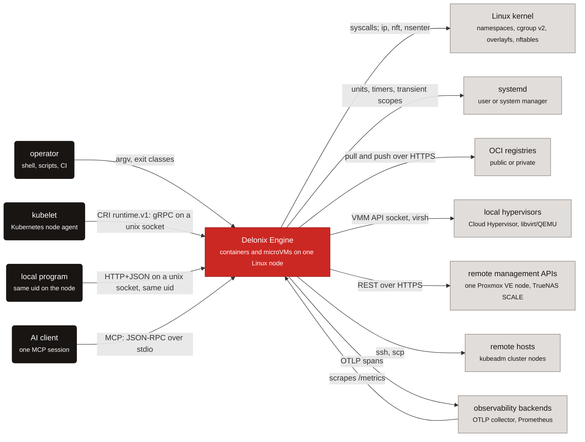

Onde cada seta está no código:

| Seta | Código |
|---|---|
| operador → motor | `bins/delonix-runtime-bin/src/main.rs` (`main`, `run`); classes de saída em `crates/foundation/delonix-model/src/exitcode.rs` |
| kubelet → motor | `crates/interfaces/delonix-cri/src/lib.rs` (`serve_blocking`) |
| programa local → motor | `crates/interfaces/delonix-mgmt/src/lib.rs` (`serve_blocking`, o router `axum`) |
| cliente de IA → motor | `crates/interfaces/delonix-mcp/src/lib.rs` (`serve_stdio`) |
| motor → kernel | `crates/adapters/delonix-linux/src/lib.rs` (`spawn`, `container_init`); `crates/adapters/delonix-sdn/src/infra.rs` (subprocessos `ip`, `nft`, `nsenter`) |
| motor → systemd | scopes transitórios `busctl` em `crates/adapters/delonix-linux/src/lib.rs`; units de arranque em `bins/delonix-runtime-bin/src/cmd/boot.rs` |
| motor → registos | `crates/adapters/delonix-oci/src/registry.rs` (`resolve_or_pull`, `push_to_registry`) |
| motor → hipervisores | `crates/adapters/delonix-vm/src/lib.rs` (`CloudHypervisorBackend`, `LibvirtBackend`) |
| motor → APIs de gestão remotas | `crates/providers/delonix-proxmox/src/lib.rs`, `crates/providers/delonix-truenas/src/lib.rs` |
| motor → hosts remotos | `bins/delonix-runtime-bin/src/cmd/remote.rs` (`ssh`, `scp`), usado por `cmd/cluster.rs` |
| motor ↔ observabilidade | `crates/adapters/delonix-telemetry/src/telemetry.rs` (OTLP), rotas `/metrics` em `delonix-mgmt` e `delonix-cri` |

## Nível 2 — Containers: executáveis e processos

No C4 um *container* é algo que corre. O build produz quatro executáveis (ver a contagem gerada no
[README do manual](README.md)); vários **processos** mais aparecem por workload ou por nó, cada um
com um dono. As três figuras abaixo dividem essa imagem por preocupação: quem entra no motor, o
que um container custa em processos, e a infra-estrutura de rede rootless.

### Pontos de entrada

**Legenda**

| Forma | Significado |
|---|---|
| caixa arredondada, escura | chamador |
| caixa, branca com borda vermelha | executável do motor |
| cilindro, azul | estado em disco |
| seta sólida | pedido ou acesso a ficheiro, com etiqueta |
| seta tracejada | `exec` ou arranque de um processo |
| região contornada | fronteira de processo |

Quatro portas levam ao motor, mas só o processo `delonix` de disparo único chega a criar um
container: os servidores multi-thread voltam a chamar a CLI para isso.

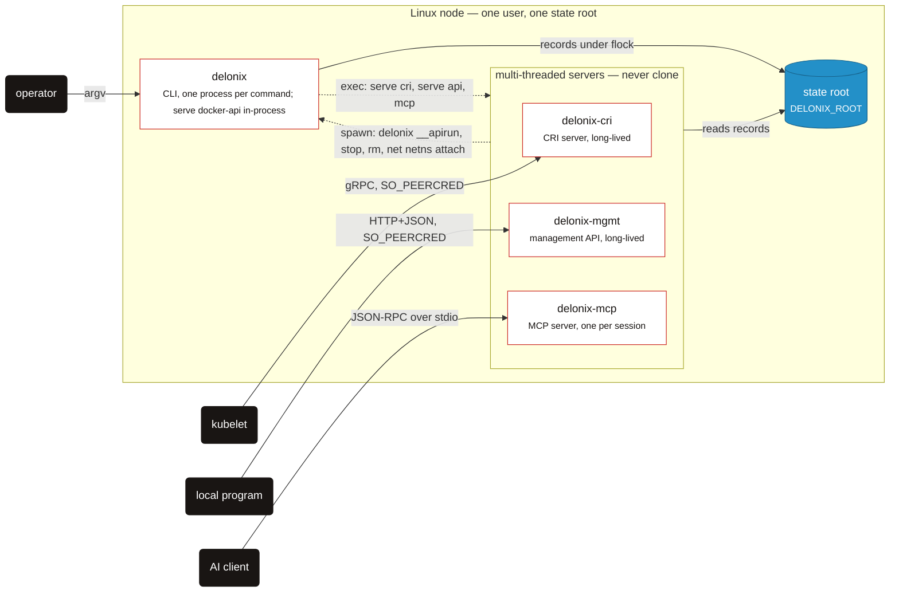

O `exec` é `cmd/serve.rs::exec_server` (e `cmd/mcp.rs`); a chamada de volta é o helper `delonix()`
do CRI e `write_run_spec` em `crates/interfaces/delonix-cri/src/runtime_svc/lifecycle.rs`,
`run_cli` no `delonix-mgmt` e `run_cli_blocking` no `delonix-mcp`, todos a resolver a CLI através
de `delonix_node::dispatch::cli_bin`. O CRI também escreve os seus próprios registos debaixo de
`cri/` — ver [Estado em disco](#state-on-disk).

### Um container destacado

**Legenda**

| Forma | Significado |
|---|---|
| caixa, branca com borda vermelha | processo do motor |
| caixa, cinzenta | sistema externo |
| cilindro, azul | ficheiro em disco |
| seta sólida | fluxo de dados ou escrita, com etiqueta |
| seta tracejada | fork, clone ou spawn |
| região contornada | vive enquanto o workload viver |

Um `run -d` deixa para trás exactamente três ou quatro processos, e o supervisor — não um daemon —
é o pai do container.

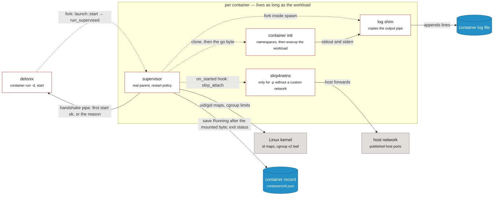

O supervisor é `crates/adapters/delonix-linux/src/supervise.rs::run_supervised`, escolhido por
`delonix_compute::launch::start` através de `HostWorkload::supervise`
(`crates/adapters/delonix-linux/src/workload.rs`); lá dentro `create_with` → `spawn` faz o
`clone`, o `write_userns_maps`, o cgroup, o hook `on_started` (preenchido com
`delonix_sdn::slirp_attach` por `cmd/container.rs::with_host_workload`) e faz fork do `log_shim`,
tudo em `crates/adapters/delonix-linux/src/lib.rs`. O registo é escrito através do
`delonix_state::Store`. Um `run` em primeiro plano faz o mesmo sem o supervisor.

### Infra-estrutura de rede rootless

**Legenda**

| Forma | Significado |
|---|---|
| caixa, branca com borda vermelha | processo do motor |
| caixa, cinzenta | sistema externo |
| cilindro, azul | estado em disco |
| seta sólida | pedido ou tráfego, com etiqueta |
| seta tracejada | spawn (a CLI arranca o processo) |
| região contornada | os namespaces de user, network e mount do pin |

Tudo o que a rede rootless precisa vive dentro de um conjunto de namespaces segurado por um
processo que só dorme; o resto pode morrer e ser reiniciado à volta dele.

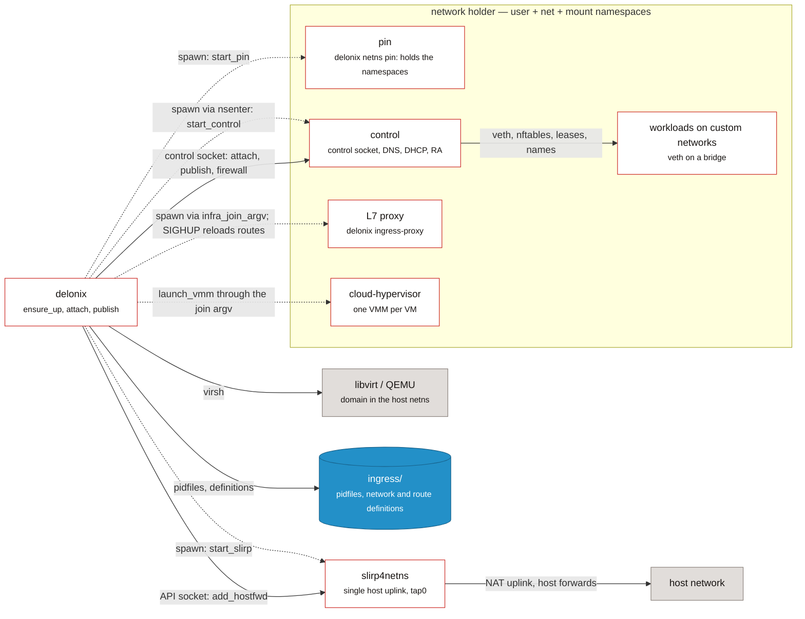

O pin, o control e o uplink são `start_pin`/`pin_main`, `start_control`/`control_main` e
`start_slirp` em `crates/adapters/delonix-sdn/src/infra.rs`; os namespaces do pin são criados em
`pin_userns.rs`. O proxy é `cmd/ingress_proxy.rs::spawn_proxy`; o arranque do VMM é
`delonix_vm::launch_vmm`, ao qual a porta `VmNetwork` dá o argv de junção. Um container junta-se a
uma rede personalizada por a CLI se re-executar para dentro dos namespaces (`reexec_into_netns`,
ver a sequência de run no Nível 4 abaixo). Uma VM libvirt vive fora do holder, na `virbr0` no
network namespace do host.

### Tabela de processos

| Processo | Nasce em | Vive por |
|---|---|---|
| `delonix` | `bins/delonix-runtime-bin/src/main.rs` (`main`, `run`) | um comando. O `main` intercepta os pontos de entrada escondidos (`netns pin`, `netns control`, `netns run`, `__rmtree`, `__volsnap`, `__ovlmigrate`, `__ovlhold`, `__duusage`, `__buildtar`, `__apirun`, `__netnsconnect`) **antes** de o clap fazer o parse |
| `delonix-cri` | `crates/interfaces/delonix-cri/src/bin/delonix-cri.rs` → `delonix_cri::serve_blocking` | um serviço (tipicamente uma unit systemd). O `delonix serve cri` faz `exec` dele (`cmd/serve.rs::exec_server`) |
| `delonix-mgmt` | `bins/delonix-mgmt-bin/src/main.rs` → `delonix_mgmt::serve_blocking` | um serviço; o `delonix serve api` faz `exec` dele |
| `delonix-mcp` | `bins/delonix-mcp-bin/src/main.rs` → `delonix_mcp::serve_stdio` | uma sessão de cliente de IA (um processo filho sobre stdio); o `delonix mcp` faz `exec` dele |
| Fatia da API Docker | `cmd/serve.rs` → `cmd::dockerapi::run`, **dentro** do processo `delonix` | enquanto o `delonix serve docker-api` corre |
| supervisor | `delonix_linux::supervise::run_supervised`, escolhido por `delonix_compute::launch::start` para todo arranque destacado que o chamador consiga fazer fork | a vida do container; é o pai real, por isso colhe o estado de saída e aplica o `--restart` |
| init do container | `delonix_linux::spawn` → `clone` → `container_init` | o container |
| shim de logs | `fork` dentro do `spawn`, a correr `log_shim` | o container |
| `slirp4netns` por-container | `delonix_sdn::slirp_attach`, chamado como o hook `on_started` | a netns do container; órfãos colhidos por `reap_orphan_slirp` |
| pin | `infra::start_pin` arranca `delonix netns pin`; `infra::pin_main` cria os namespaces de user, net e mount dentro do processo (`crates/adapters/delonix-sdn/src/pin_userns.rs`) e dorme | a infra; o seu pid é `ingress/holder.pid` e nunca muda |
| control | `infra::start_control` (`nsenter -t <pin> -U -m -n -- delonix netns control`) → `infra::control_main` | reiniciável; serve o socket de controlo, o DNS (`dns_server_main`), Router Advertisements (`ra_sender_main`) e DHCP por-bridge (`dhcp_serve`) |
| `slirp4netns` único | `infra::start_slirp` (`tap0` para dentro da netns do pin, `--api-socket`) | a infra |
| proxy de ingress L7 | `cmd/ingress_proxy.rs::spawn_proxy` através de `infra::infra_join_argv` | enquanto existir um `HTTPRoute`/`Ingress` ou uma rota `--expose`; recarrega rotas em `SIGHUP` |
| `cloud-hypervisor` | `delonix_vm::launch_vmm`, corrido através do argv de junção da infra | a VM |
| domínio libvirt | `LibvirtBackend` a conduzir o `virsh` | a VM (o domínio vive no libvirt) |

O `ensure_up` (`crates/adapters/delonix-sdn/src/infra.rs`) é a única função que levanta a infra de
rede, debaixo de um file lock por-raiz, e distingue três casos: pin e control vivos (nada a
fazer); pin vivo e control desaparecido (reinicia **só** o control plane — nenhum fio se mexe);
pin desaparecido (desmonta e reconstrói).

### Um conjunto de operações, várias interfaces

| Interface | Transporte | Entrada | Estado |
|---|---|---|---|
| CLI | argv | `bins/delonix-runtime-bin` | a superfície completa |
| CRI (`runtime.v1`) | gRPC sobre um socket unix, `0600` + `SO_PEERCRED` | `delonix_cri::serve_blocking` | serve o kubelet |
| API de gestão | HTTP+JSON sobre um socket unix, só o mesmo uid | `delonix_mgmt::serve_blocking` (rotas como `/v1/containers`, `/v1/volumes`, `/metrics`) | só local ([ADR-0010](../../adr/0010-remote-management-api.md) rejeitou uma API remota); a ser substituída pelo contrato de nó |
| MCP | stdio | `delonix_mcp::serve_stdio` | local, sem inquilino ([ADR-0025](../../adr/0025-mcp-local-ai-control-surface.md)) |
| Fatia da Docker Engine API | HTTP sobre um socket unix | `cmd::dockerapi::run` | uma fatia de compatibilidade, dentro do `delonix` |
| **Contrato de nó** `delonix.node.v1` | gRPC **e** HTTP/JSON num só socket unix | `proto/delonix/node/v1/` | **só contrato** — ainda sem servidor |

O contrato de nó é a API única pretendida
([ADR-0040](../../adr/0040-engine-restructuring-layers-ports-node-contract.md) D4,
[ADR-0042](../../adr/0042-one-engine-api-maturity-and-docs.md)). Os ficheiros `.proto` são a fonte de
verdade; o `docs/api/openapi.yaml` é **gerado** a partir deles e nunca editado à mão. O
`scripts/contract_gate.py` falha em: `buf format`, `buf lint`, `buf breaking` contra a última tag
que traz `proto/`, um RPC sem mapeamento HTTP (ou um stream bidireccional com um), um documento
OpenAPI que difere do gerado, e dois caminhos que sejam o mesmo URL sob nomes de variável
diferentes. Três regras que protege: um pedido por RPC, identidade explícita
(`namespace`/`name`) no pedido, e imagens endereçadas por parâmetro de query.

## Nível 3 — Componentes: crates por camada

### Camadas e a direcção permitida

> **Legenda** — caixa branca com borda vermelha: uma camada de crates · seta sólida: *pode
> depender de*, com o que a dependência é usada para.

O D1 do ADR-0040 fixa uma direcção de dependência: os contexts são dependidos, nunca ao
contrário, e os binários são o único sítio onde tudo se encontra.

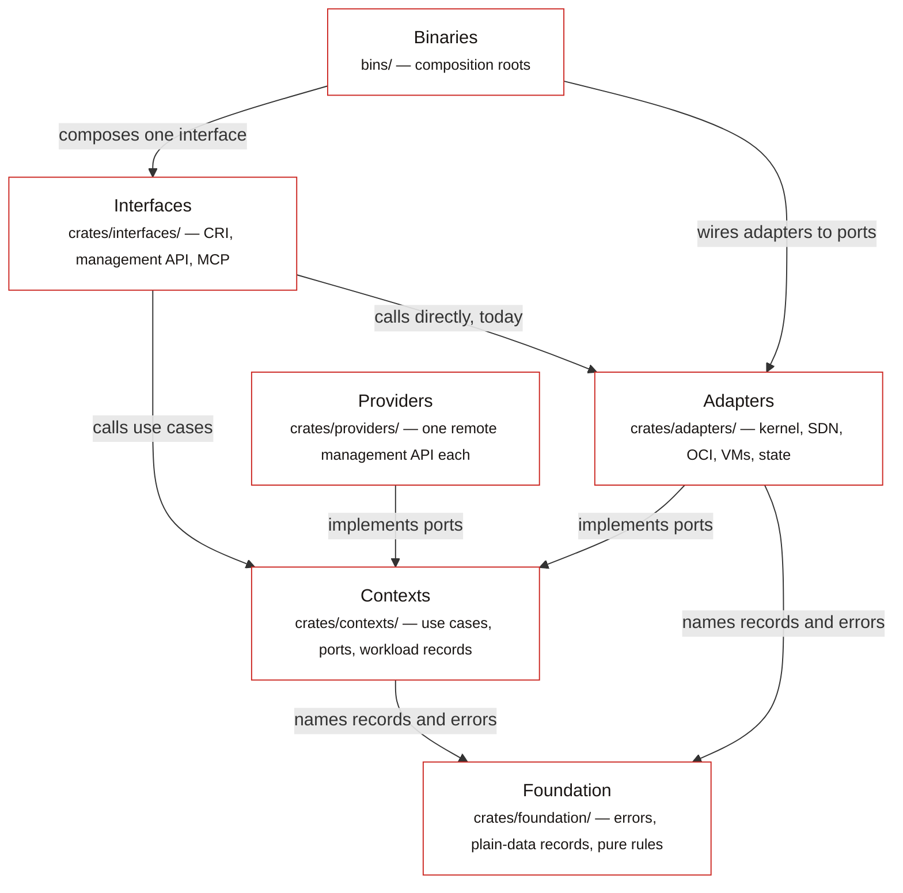

- **Foundation** (`crates/foundation/`) — tipos partilhados, mais ou menos puros, que qualquer
  camada pode nomear.
- **Contexts** (`crates/contexts/`) — um crate por contexto delimitado, nomeado a partir dos
  grupos de API publicados: os casos de uso e as **portas** de que precisam. Sem HTTP, sem
  provider, e sem mounts, processos ou configuração de rede. O `delonix-node` é o único context
  que lê o host directamente — `/proc`, `/sys`, `kill(pid, 0)`, `SO_PEERCRED` — porque essas
  perguntas são a razão de ele existir, para as responder uma vez.
- **Adapters** (`crates/adapters/`) e **providers** (`crates/providers/`) — implementam portas:
  kernel, SDN, store OCI, backends de VM, estado persistido; os providers trazem um cliente HTTP
  para um alvo remoto.
- **Interfaces** (`crates/interfaces/`) — CRI, API de gestão, MCP: analisam um pedido, chamam o
  motor, apresentam.
- **Binaries** (`bins/`) — raízes de composição.

A camada a que cada crate pertence, e a direcção em que pode depender:

<!-- dev-docs:begin layers -->
| Camada | Pode depender de |
|---|---|
| Foundation | foundation |
| Contexts | foundation, contexts |
| Adapters | foundation, contexts |
| Providers | foundation, contexts |
| Interfaces | foundation, contexts, adapters, providers |
| Binaries | foundation, contexts, adapters, providers, interfaces |

Excepções declaradas (cada uma nomeia a fase do ADR-0040 que a remove):

- `delonix-linux` → `delonix-state` — removida na **P4a**
- `delonix-mcp` → `delonix-mgmt` — removida na **P5**
- `delonix-oci` → `delonix-state` — removida na **P4**
- `delonix-opnsense` → `delonix-sdn` — removida na **P4**
- `delonix-proxmox` → `delonix-sdn` — removida na **P4**
- `delonix-proxmox` → `delonix-vm` — removida na **P4**
- `delonix-scanner` → `delonix-oci` — removida na **P4**
- `delonix-sdn` → `delonix-state` — removida na **P4**
- `delonix-vm` → `delonix-state` — removida na **P4**
- `delonix-volume` → `delonix-state` — removida na **P4**
<!-- dev-docs:end layers -->

### Onde está a restruturação

O ADR-0040 é um plano strangler por fases (P0 carris → P1 contrato → P2 contexts → P3 adapters e
binários → P4 providers → P5 API de nó → P6 CRI → P7 observabilidade). O que o código mostra hoje:

- **A P0 está feita.** Todo crate vive no directório da sua camada, as versões são ao nível do
  workspace, e o gate de fitness corre na CI.
- **A P1 está feita como contrato, não como servidor.** O `proto/delonix/node/v1/*.proto` existe,
  o documento OpenAPI `docs/api/openapi.yaml` é gerado a partir dele, e o
  `scripts/contract_gate.py` guarda os dois. **Nada serve ainda o contrato** — nenhum crate
  referencia `delonix.node.v1` (o ADR-0042 D1 diz o mesmo).
- **A P2 começou.** O `delonix-model` (o `Error` partilhado e os seus códigos `DX_*`, nomes
  gerados, classes de saída, o dicionário de códigos numerado, o modelo de segredos, e — desde a
  #405 — os registos só-de-dados `Status`, `ContainerFw`/`FwRule` com os seus validadores,
  `default_namespace` e o `typestate` do ciclo de vida), o `delonix-stack` (tabela de Kinds,
  reconciliador de 3 vias, revisões) e o `delonix-compute` (a única especificação de execução
  `RunOpts`, `resolve_run`, `build_record`, os casos de uso de rede e de arranque) existem. A
  maior parte da lógica de aplicação ainda vive em `bins/delonix-runtime-bin/src/cmd/`.
- **A P3 está em curso.** As portas de compute são implementadas em adapters (`HostImages`,
  `HostVolumes`, `HostDevices`, `HostRuntime`, `HostNetwork`, `HostWorkload`, `HostVmNetwork`), a
  telemetria saiu da fundação para o `delonix-telemetry`, o `delonix-vm` só alcança a SDN através
  da porta `VmNetwork`, e os servidores CRI, API de gestão e MCP tornaram-se executáveis próprios.
  Quatro adapters levam já os seus nomes do ADR-0040: `delonix-scanner` (era `delonix-scan`),
  `delonix-oci` (era `delonix-image`), `delonix-sdn` (era `delonix-net`) e `delonix-linux` (era
  `delonix-runtime`, o crate do motor de containers). **A #406 removeu o `delonix-runtime-core`**,
  o crate de fundação que costumava guardar tudo o partilhado, em passos: a **#404** moveu os
  stores, as escritas atómicas e o store de segredos cifrado para o adapter `delonix-state`; a
  **#405** moveu os registos só-de-dados (`Status`, `ContainerFw`/`FwRule`, `typestate`) para
  baixo, para o `delonix-model`; e a **#406** moveu os registos `Container` e `Vm` (com `Mount`,
  tipos de saúde e de pai-de-cgroup, `DELONIX_SLICE` e `workload_net`) para o `delonix-compute`, e
  o registo de eventos, `virt`, `peer_cred`, `dispatch` e os helpers de host/processo (`now_unix`,
  `is_alive`, `safe_to_signal`, `generate_id`, …) para um context novo, o `delonix-node`. Não
  ficou nenhum re-export para trás. Os adapters que abrem registos ou escrevem ficheiros através
  do `delonix-state` (`delonix-linux`, `delonix-vm`, `delonix-sdn`, `delonix-oci`,
  `delonix-volume`) são excepções declaradas até a P4 lhes dar uma porta `StateRepository`
  (`scripts/arch_fitness.py`).
- **A P4 está em curso; as P5–P7 não começaram.** O ADR-0044 (aceite a 2026-09-24) decide como a
  P4 se faz. O **#420** trouxe a porta `StateRepository<T>`
  (`crates/foundation/delonix-model/src/ports.rs`), que o `delonix-linux` já usa em
  `wait_and_record`/`stop`/`persist_stop`/`remove` — por isso a sua excepção no
  `scripts/arch_fitness.py` diz `P4a` e lista só os sítios ainda abertos. O **#486** acrescentou a
  porta de provider de VM (`VmSpec`, `Extensions`, `Provider`, `VmProvider` em
  `crates/contexts/delonix-compute/src/vm_provider.rs`, P4b fatia 1), e o `delonix-vm`
  implementa-a para os dois backends locais (`LocalVmProvider`,
  `crates/adapters/delonix-vm/src/provider.rs`) reaproveitando o `create_with`/`stop`/`start` que
  já tinha; mover cada backend para o seu crate de provider é a P4b fatia 2. As excepções
  restantes na tabela acima nomeiam a fase que remove cada uma.

### Registos, helpers de nó e estado persistido, depois da #406

> **Legenda** — caixa branca com borda vermelha: crate do motor (ou grupo de crates) · cilindro,
> azul: ficheiros debaixo do state root · seta sólida: *usa*, com o que é usado.

Os tipos só-de-dados vivem na fundação, os registos de workload no context Compute, os próprios
helpers do nó no context Node, e os ficheiros que guardam registos num só adapter através do qual
todo outro adapter alcança esses ficheiros.

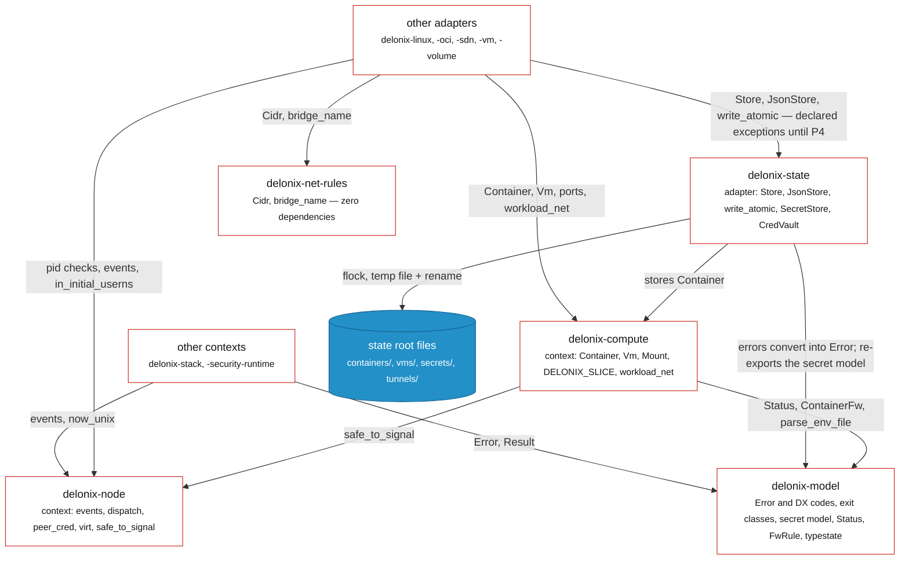

Verificado contra: `crates/contexts/delonix-compute/src/record.rs` (`use
delonix_model::records::{…}`, `use delonix_node::safe_to_signal`) e `src/lib.rs` (`pub use
record::*`); `crates/contexts/delonix-node/src/lib.rs` e `host.rs`;
`crates/foundation/delonix-model/src/records.rs` e `typestate.rs`;
`crates/adapters/delonix-state/src/store.rs` (`use delonix_compute::Container`), `secret.rs`,
`cred_vault.rs`, `error.rs`. O `delonix-net-rules` só é usado por `delonix-sdn` e `delonix-vm`; o
`delonix-volume` e o `delonix-scanner` também nomeiam `delonix-model` directamente (o grafo gerado
abaixo tem toda aresta).

### Portas de Compute e os adapters por trás delas

> **Legenda** — caixa branca com borda vermelha: componente do motor (casos de uso, adapter,
> binário) · região contornada: o crate de context · seta sólida: uma chamada através da porta
> nomeada.

O `container run` é o caminho de referência: o context decide através de portas, e o binário
escolhe que adapter responde a cada porta.

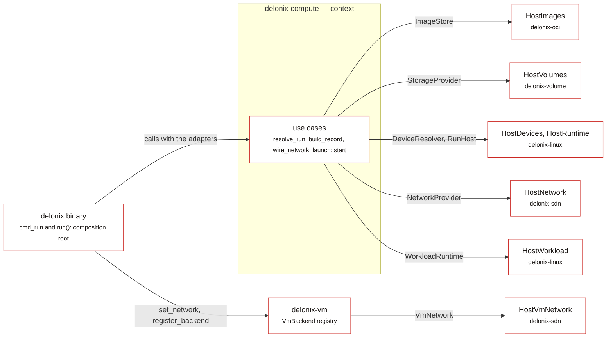

Portas: `crates/contexts/delonix-compute/src/ports.rs` (`ImageStore`, `StorageProvider`,
`DeviceResolver`, `RunHost`, `VmNetwork`, `NetworkProvider`) e `launch.rs` (`WorkloadRuntime`).
Implementações: `delonix-oci/src/run_images.rs`, `delonix-volume/src/lib.rs`,
`delonix-linux/src/{cdi,run_host,workload}.rs`, `delonix-sdn/src/{run_network,vm_network}.rs`.
Ligação: `bins/delonix-runtime-bin/src/cmd/container.rs::cmd_run` e
`bins/delonix-runtime-bin/src/main.rs::run`.

### Interfaces e binários

> **Legenda** — caixa branca com borda vermelha: crate do motor (ou grupo de crates) · seta
> sólida: uma chamada directa de Rust, com o que é usada para.

Os servidores leem dentro do processo e entregam todo fork à CLI; a única aresta
interface-para-interface é uma excepção declarada.

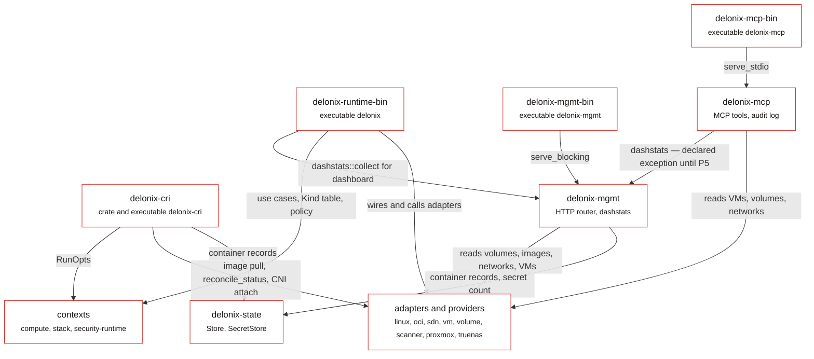

Não desenhado, para a figura ficar legível: todo binário e `delonix-cri`/`delonix-mgmt` também
chamam `delonix-telemetry` (`telemetry::init`, métricas), e o `delonix-mcp` e a CLI também leem o
`delonix-state`. As arestas do dashboard são `bins/delonix-runtime-bin/src/cmd/dash.rs` e
`crates/interfaces/delonix-mcp/src/lib.rs` (`delonix_mgmt::dashstats::collect`); o uso de
`RunOpts` pelo CRI é `start_run_opts` em `runtime_svc/lifecycle.rs`.

### Toda aresta de crate

O grafo de crates, tal como o `Cargo.toml` o declara. É completo e por isso denso; lê-o para
responder «será que A depende de B», e lê as figuras por-camada acima para perceber porquê.

<!-- dev-docs:begin crates-graph -->
**Legenda** — uma caixa por crate, agrupada por camada; uma seta `A --> B` quer dizer *A depende de B*. Vermelho: binários · branco com borda vermelha: interfaces · branco: contextos e adaptadores · cinzento: providers · azul: fundação.

```mermaid
flowchart TB
  subgraph foundation["Foundation"]
    delonix_model["delonix-model"]
    delonix_net_rules["delonix-net-rules"]
  end
  subgraph context["Contexts"]
    delonix_compute["delonix-compute"]
    delonix_node["delonix-node"]
    delonix_security_runtime["delonix-security-runtime"]
    delonix_stack["delonix-stack"]
  end
  subgraph adapter["Adapters"]
    delonix_linux["delonix-linux"]
    delonix_oci["delonix-oci"]
    delonix_scanner["delonix-scanner"]
    delonix_sdn["delonix-sdn"]
    delonix_state["delonix-state"]
    delonix_telemetry["delonix-telemetry"]
    delonix_vm["delonix-vm"]
    delonix_volume["delonix-volume"]
  end
  subgraph provider["Providers"]
    delonix_opnsense["delonix-opnsense"]
    delonix_proxmox["delonix-proxmox"]
    delonix_truenas["delonix-truenas"]
  end
  subgraph interface["Interfaces"]
    delonix_cri["delonix-cri"]
    delonix_mcp["delonix-mcp"]
    delonix_mgmt["delonix-mgmt"]
  end
  subgraph bin["Binaries"]
    delonix_mcp_bin["delonix-mcp-bin"]
    delonix_mgmt_bin["delonix-mgmt-bin"]
    delonix_runtime_bin["delonix-runtime-bin"]
  end
  delonix_compute --> delonix_model
  delonix_compute --> delonix_node
  delonix_cri --> delonix_compute
  delonix_cri --> delonix_linux
  delonix_cri --> delonix_model
  delonix_cri --> delonix_node
  delonix_cri --> delonix_oci
  delonix_cri --> delonix_sdn
  delonix_cri --> delonix_state
  delonix_cri --> delonix_telemetry
  delonix_linux --> delonix_compute
  delonix_linux --> delonix_model
  delonix_linux --> delonix_node
  delonix_linux --> delonix_state
  delonix_mcp --> delonix_compute
  delonix_mcp --> delonix_linux
  delonix_mcp --> delonix_mgmt
  delonix_mcp --> delonix_model
  delonix_mcp --> delonix_node
  delonix_mcp --> delonix_sdn
  delonix_mcp --> delonix_state
  delonix_mcp --> delonix_vm
  delonix_mcp --> delonix_volume
  delonix_mcp_bin --> delonix_mcp
  delonix_mcp_bin --> delonix_node
  delonix_mcp_bin --> delonix_telemetry
  delonix_mgmt --> delonix_compute
  delonix_mgmt --> delonix_linux
  delonix_mgmt --> delonix_model
  delonix_mgmt --> delonix_node
  delonix_mgmt --> delonix_oci
  delonix_mgmt --> delonix_scanner
  delonix_mgmt --> delonix_sdn
  delonix_mgmt --> delonix_state
  delonix_mgmt --> delonix_telemetry
  delonix_mgmt --> delonix_vm
  delonix_mgmt --> delonix_volume
  delonix_mgmt_bin --> delonix_mgmt
  delonix_mgmt_bin --> delonix_node
  delonix_mgmt_bin --> delonix_telemetry
  delonix_node --> delonix_model
  delonix_oci --> delonix_compute
  delonix_oci --> delonix_model
  delonix_oci --> delonix_node
  delonix_oci --> delonix_state
  delonix_opnsense --> delonix_model
  delonix_opnsense --> delonix_sdn
  delonix_proxmox --> delonix_compute
  delonix_proxmox --> delonix_model
  delonix_proxmox --> delonix_sdn
  delonix_proxmox --> delonix_vm
  delonix_runtime_bin --> delonix_compute
  delonix_runtime_bin --> delonix_linux
  delonix_runtime_bin --> delonix_mgmt
  delonix_runtime_bin --> delonix_model
  delonix_runtime_bin --> delonix_node
  delonix_runtime_bin --> delonix_oci
  delonix_runtime_bin --> delonix_opnsense
  delonix_runtime_bin --> delonix_proxmox
  delonix_runtime_bin --> delonix_scanner
  delonix_runtime_bin --> delonix_sdn
  delonix_runtime_bin --> delonix_security_runtime
  delonix_runtime_bin --> delonix_stack
  delonix_runtime_bin --> delonix_state
  delonix_runtime_bin --> delonix_telemetry
  delonix_runtime_bin --> delonix_truenas
  delonix_runtime_bin --> delonix_vm
  delonix_runtime_bin --> delonix_volume
  delonix_scanner --> delonix_model
  delonix_scanner --> delonix_oci
  delonix_sdn --> delonix_compute
  delonix_sdn --> delonix_model
  delonix_sdn --> delonix_net_rules
  delonix_sdn --> delonix_node
  delonix_sdn --> delonix_state
  delonix_security_runtime --> delonix_model
  delonix_security_runtime --> delonix_node
  delonix_stack --> delonix_model
  delonix_state --> delonix_compute
  delonix_state --> delonix_model
  delonix_state --> delonix_node
  delonix_truenas --> delonix_model
  delonix_vm --> delonix_compute
  delonix_vm --> delonix_model
  delonix_vm --> delonix_net_rules
  delonix_vm --> delonix_node
  delonix_vm --> delonix_state
  delonix_volume --> delonix_compute
  delonix_volume --> delonix_model
  delonix_volume --> delonix_node
  delonix_volume --> delonix_state
  class delonix_compute block
  class delonix_cri iface
  class delonix_linux block
  class delonix_mcp iface
  class delonix_mcp_bin engine
  class delonix_mgmt iface
  class delonix_mgmt_bin engine
  class delonix_model store
  class delonix_net_rules store
  class delonix_node block
  class delonix_oci block
  class delonix_opnsense external
  class delonix_proxmox external
  class delonix_runtime_bin engine
  class delonix_scanner block
  class delonix_sdn block
  class delonix_security_runtime block
  class delonix_stack block
  class delonix_state block
  class delonix_telemetry block
  class delonix_truenas external
  class delonix_vm block
  class delonix_volume block
  classDef engine fill:#cc2823,stroke:#8f1b17,color:#ffffff
  classDef iface fill:#ffffff,stroke:#cc2823,stroke-width:2px,color:#191513
  classDef block fill:#ffffff,stroke:#8a817c,color:#191513
  classDef external fill:#e1ddda,stroke:#8a817c,color:#191513
  classDef store fill:#2390c8,stroke:#17618a,color:#ffffff
```
<!-- dev-docs:end crates-graph -->

### Como os crates comunicam

1. **Chamadas Rust directas, na direcção da camada.** O caso normal. Por exemplo o `cmd_run`
   (`cmd/container.rs`) chama `delonix_compute::run::resolve_run` com os adapters
   `delonix_oci::run_images::HostImages`, `delonix_volume::HostVolumes`,
   `delonix_linux::cdi::HostDevices` e `delonix_linux::run_host::HostRuntime`, depois
   `delonix_compute::network::{attach_custom_network, wire_network}` com
   `delonix_sdn::run_network::HostNetwork`, depois `delonix_compute::launch::start` com
   `delonix_linux::workload::HostWorkload`.
2. **Registo na raiz de composição.** O `run()` em `bins/delonix-runtime-bin/src/main.rs`
   regista os backends de VM remotos configurados (`cmd::vmbackends::register_configured` →
   `delonix_vm::register_backend`) e a implementação SDN da porta de rede de VM
   (`delonix_vm::set_network(HostVmNetwork)`) antes de qualquer comando correr.
3. **Re-executar o próprio binário do motor.** Ainda comum, e contado pelo ratchet
   `self_exec_sites`. As razões são reais:
   - O `clone` só é seguro num processo **de uma só thread**, e os servidores CRI, API de gestão
     e Docker API são runtimes `tokio` multi-thread. Entregam um `RunOpts` tipado num ficheiro
     `0600` a um `delonix __apirun <spec>` novo (`lifecycle.rs::write_run_spec`,
     `cmd::dockerapi::run_from_spec_file`).
   - Um processo rootless tem de **entrar** nos namespaces de user e mount do pin de rede antes
     de um container se poder juntar a uma netns nomeada lá, por isso `reexec_into_netns` corre
     `nsenter … ip netns exec <netns> delonix netns run <spec>`.
   - Trabalho sobre ficheiros que pertencem a subuids mapeados precisa de um processo dentro de
     um user namespace mapeado (`delonix_linux::reexec_mapped`, `reexec_mapped_hold`,
     `remove_tree_mapped` → os pontos de entrada `__rmtree`/`__ovlhold`/…).
   - Os servidores ainda constroem algumas invocações da CLI (`delonix-mgmt`, o
     `run_cli_blocking` do `delonix-mcp`, o helper `delonix()` do CRI), resolvendo a CLI através
     de `delonix_node::dispatch::cli_bin` (`DELONIX_BIN`, depois um `delonix` ao lado, depois o
     `PATH`) — nunca o seu próprio executável.
   O D2.4/D5 do ADR-0040 planeia um executável `delonix-launcher` que recebe uma spec tipada,
   para estes se tornarem chamadas de caso de uso mais um spawn.
4. **O socket de controlo.** Tudo dentro da netns rootless da infra é feito pelo processo
   control: `infra::control_send`/`control_query` escrevem uma linha (`attach …`, `publish …`,
   `firewall …`) num socket unix `0600`; o `control_loop` só aceita peers com o mesmo uid do
   motor (`SO_PEERCRED`) e serve uma ligação de cada vez, por isso as operações de
   netns/veth/nftables nunca se intercalam.
5. **Subprocessos a ferramentas do host**, em adapters: `ip`, `nft`, `nsenter`, `slirp4netns`
   (`delonix-sdn`), `newuidmap`/`newgidmap` (`delonix-linux`, `pin_userns`), `qemu-img`,
   `virsh`, `cloud-localds` (`delonix-vm`), `busctl` para scopes transitórios do systemd
   (`delonix-linux`), `ssh`/`scp` (`cmd/remote.rs`).
6. **HTTP para um sistema de gestão remoto só vive em providers.** O `delonix-proxmox` e o
   `delonix-truenas` dependem do `reqwest` para isso. Dois adapters também falam HTTP, por outras
   razões: o `delonix-oci` tem o seu próprio cliente de registo OCI (`src/registry.rs`, `reqwest`
   no seu `Cargo.toml`), e o `delonix-telemetry` exporta OTLP sobre HTTP. Nenhum crate de context
   o faz.

## Estado em disco

Não há base de dados. O estado são ficheiros debaixo de um **state root**:

- `DELONIX_ROOT` quando definida; senão `$XDG_DATA_HOME/delonix` ou `~/.local/share/delonix` para
  um utilizador sem privilégio e `/var/lib/delonix` para root
  (`bins/delonix-runtime-bin/src/cmd/util.rs::state_root` → `ImageStore::default_root`;
  `infra::base_root` resolve a mesma regra do lado da rede).
- **Os sockets não vivem debaixo do state root.** Estão num directório de runtime curto por
  utilizador (`infra::runtime_dir`, sobreponível com `DELONIX_NET_RUNTIME_DIR`) porque os
  caminhos `AF_UNIX` têm comprimento limitado; uma raiz que não seja a de omissão ganha um sufixo
  com hash (`root_suffix`) para duas raízes num mesmo login nunca partilharem sockets. **Quando
  correres qualquer coisa isolada, define as duas variáveis.**

| Caminho debaixo da raiz | O quê | Código |
|---|---|---|
| `containers/<id>.json` | um registo JSON por container | `delonix_state::Store` (`delonix-state/src/store.rs`) |
| `containers/<id>/{upper,work,merged}` + `overlay-lowers` | a layer escrevível do container e a lista de layers de imagem partilhadas que monta | `ImageStore::prepare_overlay` (`delonix-oci/src/overlay.rs`) |
| `images/<id>.json`, `layers/<hex>/`, `blobs/sha256/<hex>` | metadados de imagem, layers desempacotadas partilhadas por todo container, blobs endereçados por conteúdo | `ImageStore::open` (`image.rs`), `Cas` (`cas.rs`) |
| `volumes/<name>/_data`, `volumes/.ns/<ns>/` | volumes nomeados, volumes por-namespace | `VolumeStore` (`delonix-volume/src/lib.rs`) |
| `vms/` | registos de VM (`delonix_state::JsonStore<Vm>`) e ficheiros por-VM | `delonix-vm` |
| `vm-images/` | imagens de VM (`.qcow2` + `.json`) | `cmd/vmimage.rs::VmImageStore` |
| `secrets/` | segredos cifrados | `SecretStore` (`delonix-state/src/secret.rs`) |
| `tunnels/keyring.key`, `tunnels/cred/` | a chave mestra do host e credenciais cifradas | `CredVault` (`delonix-state/src/cred_vault.rs`) |
| `ingress/` | pidfiles (`holder.pid` é o pin), marcadores `refs/`, definições de rede e rota, logs | `delonix-sdn/src/infra.rs` |
| `hosts-sync` | ficheiro marcador: o `delonix hosts sync` foi corrido, por isso os nomes de serviço dos containers `--expose` são mantidos no `/etc/hosts` do host (fica na raiz, não em `ingress/`) | `hosts_sync_flag` em `cmd/ingress_proxy.rs` |
| `ipam/` | leases de endereço por-prefixo | `delonix-sdn/src/ipam.rs` |
| `cri/{sandboxes,containers}/` | os próprios registos do CRI | `delonix-cri/src/runtime_svc/lifecycle.rs` (`sb_dir`, `ct_dir`) |
| `clusters/` | kubeconfigs, chaves e PKI de clusters | `cmd/cluster.rs` |
| `events.jsonl` | registo de eventos só-de-acrescentar | `delonix_node::events` |

A concorrência é tratada pelo sistema de ficheiros, porque vários processos (a CLI, o servidor
CRI, um supervisor) mutam os mesmos registos: as escritas são atómicas (ficheiro temporário +
`rename`, `delonix_state::write_atomic`), e o read-modify-write passa por `Store::update` /
`JsonStore::update`, que tomam um `flock` exclusivo e **recusam** avançar sem ele. Tudo isso vive
no adapter `delonix-state`. Os tipos de registo que ele guarda são definidos noutro sítio:
`Container` e `Vm` no context `delonix-compute`, e as partes só-de-dados de um registo (`Status`,
`ContainerFw`/`FwRule`) no crate de fundação `delonix-model`. A infra de rede tem o seu próprio
`FileLock` à volta de `ensure_up`, `teardown`, `acquire`, `release` e os reapers.

Como nada residente vigia processos, um registo a dizer `Running` pode estar desactualizado. Os
leitores reconciliam: o `delonix_linux::reconcile_status` verifica o pid junto com a sua hora de
arranque (`delonix_node::safe_to_signal`) para um pid reciclado nunca ser confundido com o
container.

## Nível 4 — Dois fluxos, como sequências

O Nível 4 só é desenhado onde a ordem dos passos é o ponto. Os dois fluxos abaixo são sequências
em vez de figuras de estrutura.

### `container run -d --net web -p 8080:80 nginx`, rootless

Toda seta abaixo é uma chamada no `cmd_run` (`bins/delonix-runtime-bin/src/cmd/container.rs`) ou
nas funções que ele alcança.

> **Legenda** — os participantes são processos; as setas sólidas são chamadas, linhas de socket
> ou spawns (a etiqueta diz qual); as setas tracejadas são respostas; uma auto-seta é trabalho
> dentro desse processo; as notas marcam o que fica para trás.

Uma rede personalizada força uma segunda passagem da CLI dentro dos namespaces do pin, e o
registo só é publicado depois de os mounts do container serem finais.

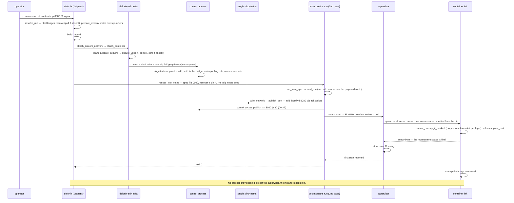

Sem uma rede personalizada o fluxo não tem segunda passagem: o `spawn` cria o seu próprio user
namespace, e o pai escreve os mapas de id (`write_userns_maps`), configura o cgroup, corre o hook
`on_started` (o `slirp_attach` por-container quando há portas `-p`) e só então envia o byte "go"
ao filho.

### CRI: `RunPodSandbox` → `CreateContainer` → `StartContainer`

De `crates/interfaces/delonix-cri/src/runtime_svc/lifecycle.rs`.

> **Legenda** — os participantes são processos, mais o state root como participante; as setas
> sólidas são chamadas gRPC, chamadas dentro do processo, subprocessos ou escritas de ficheiro (a
> etiqueta diz qual); as setas tracejadas são respostas; as caixas `alt` são os modos de rede
> mutuamente exclusivos.

O servidor CRI regista e decide, mas todo arranque de container atravessa para um processo
`delonix` novo.

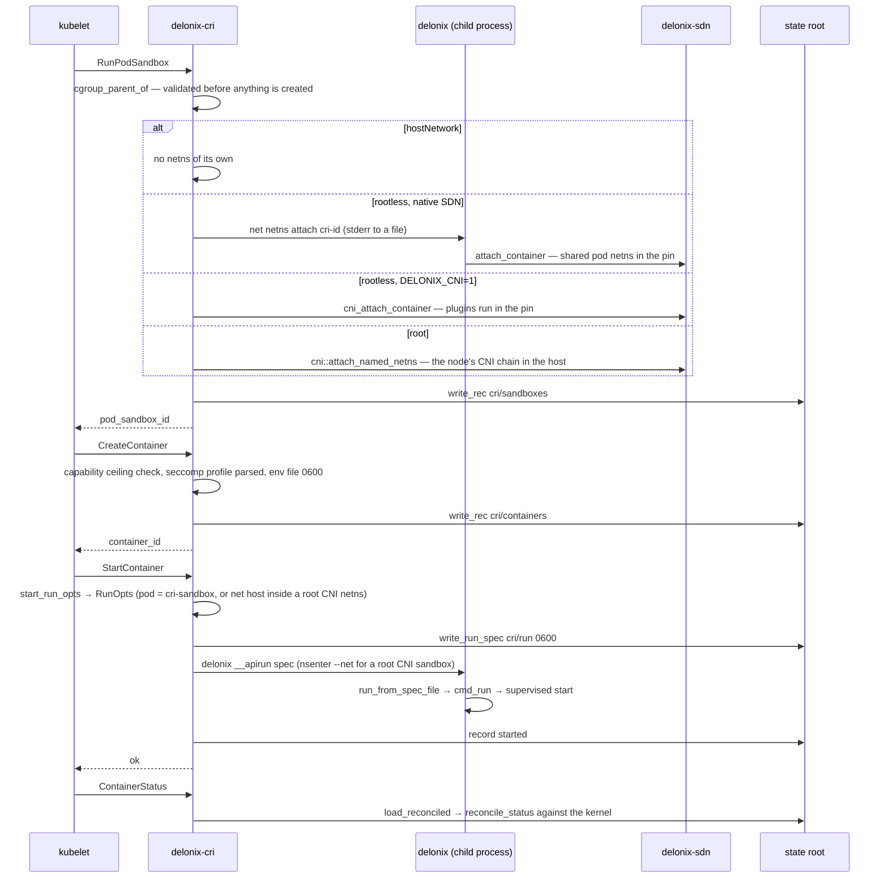

## Limitações conhecidas

> **Nota — o contrato de nó não é servido.** O `proto/delonix/node/v1` é guardado por gate e
> gera OpenAPI, mas nenhum processo lhe responde. As integrações de hoje usam a CLI, o CRI, a API
> de gestão local ou o MCP.

> **Nota — os servidores ainda correm a CLI.** O `delonix-cri`, o `delonix-mgmt` e o `delonix-mcp`
> arrancam workloads voltando a executar o `delonix`. Isto mantém o `clone` fora de processos
> multi-thread, ao custo de um processo por operação e de o texto de erro atravessar uma fronteira
> de processo.

> **Nota — os adapters ainda alcançam os ficheiros de estado directamente.** O `delonix-linux`, o
> `delonix-vm`, o `delonix-sdn`, o `delonix-oci` e o `delonix-volume` dependem do `delonix-state`
> como excepções declaradas. A porta `StateRepository` que os remove existe desde o #420
> (`delonix-model/src/ports.rs`, ADR-0044 D6), e por agora só o `delonix-linux` passa por ela em
> parte do seu ciclo de vida; os outros quatro abrem os stores directamente até a sua fatia da P4
> entrar.

> **Nota — `macvlan`/`ipvlan` estão declaradas, não realizadas.** O `network create` regista-as e
> reporta `Realized=False` com a razão `DriverNotImplemented`
> (`bins/delonix-runtime-bin/src/cmd/network.rs`): o seu plano físico precisa de `CAP_NET_ADMIN`
> na network namespace inicial do host.

> **Nota — a recuperação depois de o pin morrer é por reinício.** Se o processo control morrer, o
> `ensure_up` só o reinicia a ele e nenhum workload se move. Se o **pin** morrer, a netns é
> reconstruída e o `delonix net netns up` reinicia os containers e membros de pod encalhados
> (`cmd/netns.rs::reconcile_after_respawn`, que só lê o store de containers — as VMs não são
> recuperadas desta forma).

> **Nota — o IPv6 na SDN está desligado por omissão.** A firewall de ingress é `table ip`; o
> holder instala uma `table ip6` que dropa tudo (`infra::ingress_v6_refusal_ruleset`) e desliga o
> IPv6 dentro das netns de container a não ser que `DELONIX_ENABLE_IPV6=1`
> (`ipv6_sdn_enabled`).

> **Nota — um chamador que não consegue fazer fork arranca sem supervisor.** O
> `launch::should_supervise` exige `detach && forkable`; sem supervisor ninguém é o pai do
> processo e o código de saída real não pode ser colhido.

## Onde começar a ler

| Área | Começa aqui |
|---|---|
| Entrada da CLI e pontos de entrada de re-exec escondidos | `bins/delonix-runtime-bin/src/main.rs` (`main`, `run`) |
| `container run` de ponta a ponta | `cmd/container.rs::cmd_run`, depois `delonix-compute/src/{run,network,launch}.rs` |
| Criação de processos, namespaces, rootfs, seccomp, cgroups | `delonix-linux/src/lib.rs` (`spawn`, `container_init`, `setup_rootfs`, `setup_cgroup`), `supervise.rs`, `launch_spec.rs` |
| Rede rootless | `delonix-sdn/src/infra.rs` (`ensure_up`, `control_main`, `attach_container`, `publish_port`, `ingress_table_ruleset`, `fw_chain_body`), `pin_userns.rs`, `ipam.rs` |
| Imagens | `delonix-oci/src/{registry,cas,image,overlay,build}.rs` |
| VMs | `delonix-vm/src/lib.rs` (`VmBackend`, `builtin_backends`, `register_backend`, `select_backend`), `cloudinit.rs`; `cmd/vm.rs`, `cmd/vmimage.rs` |
| Apply declarativo | `delonix-stack/src/{kinds,reconcile}.rs`; `cmd/stack.rs`, `cmd/manifest.rs` |
| Registos, erros, estado persistido | `delonix-compute/src/record.rs` (`Container`, `Vm`), `delonix-model/src/{records,error,exitcode}.rs`, `delonix-state/src/{store,secret}.rs` |
| CRI | `delonix-cri/src/lib.rs::serve_blocking`, `runtime_svc.rs`, `runtime_svc/lifecycle.rs` |
| API de gestão / MCP | `delonix-mgmt/src/lib.rs`, `delonix-mcp/src/lib.rs` |
| Contrato de nó | `proto/delonix/node/v1/`, `scripts/contract_gate.py`, `docs/api/openapi.yaml` |
| Regras de arquitectura | `scripts/arch_fitness.py`, ADR-0040 |

---

**Seguinte:** [Os crates](crates.md) — uma secção por crate: o que possui, os seus tipos principais, por onde começar a ler e as armadilhas por que já pagou.
