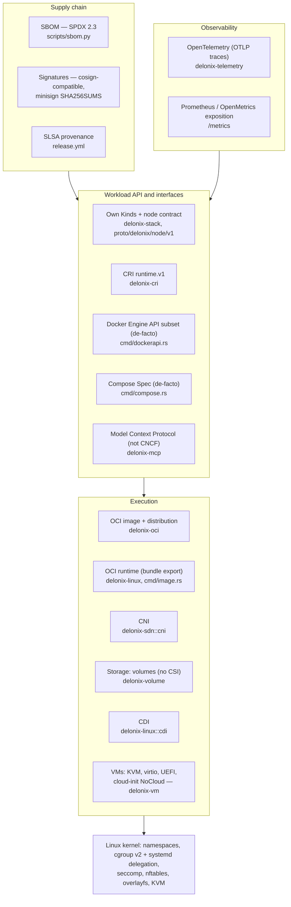

<!-- translated-from: cloud-native-standards.md sha256:b42da13e7ba332edc815ba25d93934d6e2e59b6827868ca6f84561249d2e8d4c -->
# Padrões cloud native, camada a camada

**Antes de leres:** [Introdução ao cloud native](cloud-native-primer.md) (como o motor usa cada mecanismo) e [Arquitectura](architecture.md) (os crates nomeados abaixo). Esta é uma página de referência: lê a secção do padrão que te toca.

Um motor de containers e microVMs não é uma especificação. É uma pilha de camadas, e a maior parte
das camadas tem um padrão aberto: uns da **OCI** (Open Container Initiative), outros dos SIGs do
Kubernetes e da **CNCF** (Cloud Native Computing Foundation), outros do kernel Linux, e alguns que
são interfaces de facto sem nenhum organismo de normalização por trás.

Esta página está organizada **por padrão e por camada**. Para cada um responde a quatro perguntas:
o que é o padrão, o que exige de uma implementação, como o Delonix o implementa hoje (crate,
ficheiro, símbolo), e o que as evidências dizem sobre a conformidade, lacunas incluídas. Se
procurares «OCI, CRI, CNI, CSI, CDI», esta é a página. Depois de leres a secção de que precisas,
consegues dizer o que um padrão pede, onde o motor o cumpre, e que evidência de conformidade
existe — com a sua data e versão.

Lê primeiro [Fundações de Linux](linux-foundations.md) e [Introdução ao cloud native](cloud-native-primer.md)
se namespaces, cgroups, overlayfs ou o kubelet forem novidade para ti. Esta página assume essas
bases e não as repete: o primitivo é ensinado na primeira, como o motor o usa na segunda, e o
padrão e a sua conformidade aqui.

Três regras para ler esta página:

- **«Compatível» nunca aparece sem um número, uma data e uma versão.** Uma afirmação de
  conformidade que ninguém volta a medir deixa de ser uma medição e passa a ser uma citação.
- **«Não implementado» é uma resposta de primeira classe.** Onde o motor não implementa um padrão,
  a secção di-lo e liga para a decisão (ADR) que explica porquê.
- **Os caminhos são relativos à raiz do repositório**, e cada símbolo aqui nomeado foi lido no
  código. Se um símbolo tiver mudado de sítio quando leres isto, confia no código e corrige a
  página.

---

## 13.0 O mapa das camadas

Cada seta quer dizer «é construído sobre». A camada do kernel não é um padrão CNCF; é tratada em
13.15 porque todas as outras camadas dependem dela.

---

## 13.1 OCI Runtime Specification

**O que é o padrão.** A [OCI Runtime Specification](https://github.com/opencontainers/runtime-spec)
define um *filesystem bundle* (um sistema de ficheiros raiz mais um `config.json`) e o ciclo de vida
de um container criado a partir dele (`create`, `start`, `kill`, `delete`, `state`). É o que o
`runc`, o `crun` e o `youki` implementam, e o que o containerd e o CRI-O conduzem.

**O que uma implementação tem de fazer.**

- Ler um bundle: `config.json` com `ociVersion`, `process`, `root`, `mounts`, `linux`
  (namespaces, capabilities, cgroups, caminhos mascarados e só de leitura, seccomp).
- Expor as operações do ciclo de vida e o documento `state`, e correr os hooks que a config declara
  (`prestart`, `createRuntime`, `poststop`, …).

**Como o Delonix o implementa.** O Delonix **não é um binário de runtime OCI** no sentido do
`runc`: não lê um bundle e não expõe a linha de comandos `create/start/state`. É um runtime próprio,
e relaciona-se com a especificação de duas formas:

1. **Produz bundles para runtimes OCI.** `delonix image export <image> <dir>` escreve
   `<dir>/rootfs` e `<dir>/config.json` para que `runc run -b <dir>` possa correr a imagem.
   - `bins/delonix-runtime-bin/src/cmd/image.rs`: o `cmd_export` desempacota o rootfs através de
     `ImageStore::export_rootfs` (`crates/adapters/delonix-oci/src/overlay.rs`) e constrói a config
     com `build_runtime_spec`.
   - O `build_runtime_spec` constrói a config a partir dos tipos `oci_spec::runtime` (o crate
     `oci-spec`, fixado no `Cargo.toml` raiz) em vez de JSON escrito à mão. O seu doc comment lista
     o que faltava a um bundle anterior escrito à mão (mounts padrão, capabilities efectivas,
     caminhos mascarados/só de leitura).
2. **Implementa os mesmos mecanismos de forma nativa.** O `fn spawn` e o `container_init` em
   `crates/adapters/delonix-linux/src/lib.rs` fazem o que um runtime OCI faz a partir de um
   `config.json`: namespaces, `pivot_root`, capabilities, seccomp, caminhos mascarados. A
   especificação de execução que consomem não é um `config.json` mas o `RunOpts`
   (`crates/contexts/delonix-compute/src/run_opts.rs`), que todas as frentes (CLI, Kinds, compose,
   API Docker, CRI) produzem.

**Estado de conformidade / lacunas.**

- Nenhuma suite de conformidade do runtime-spec foi corrida contra o Delonix. Nem podia: não há um
  ponto de entrada que consuma bundles contra o qual a correr.
- **Os hooks OCI não estão implementados.** O [ADR-0033](../../adr/0033-oci-runtime-hooks.md)
  (Proposto) regista porquê: não há consumidor concreto, e correr um binário do host nomeado por um
  spec de container é a classe de segurança que o projecto já põe atrás de um spike. O closure
  `StartedHook` em processo no `delonix-linux` parece semelhante mas não é o protocolo OCI.
- O bundle exportado é mínimo (comando, env e cwd por omissão da imagem). Trata-o como um formato de
  entrega, não como uma tradução da configuração completa de um container.

**Por onde começar a ler.** `cmd_export` e `build_runtime_spec` em
`bins/delonix-runtime-bin/src/cmd/image.rs` → `export_rootfs` em
`crates/adapters/delonix-oci/src/overlay.rs` → `spawn` em `crates/adapters/delonix-linux/src/lib.rs`.

---

## 13.2 OCI Image Specification

**O que é o padrão.** A [OCI Image Specification](https://github.com/opencontainers/image-spec)
define como uma imagem é descrita: um *manifest* que lista um blob de *config* e blobs de *layer*
ordenados, um *image index* para várias plataformas, endereçado por conteúdo através de digest, e o
formato de directório *image layout* (`oci-layout`, `index.json`, `blobs/sha256/…`).

**O que uma implementação tem de fazer.**

- Endereçar todo o conteúdo por digest e verificá-lo.
- Compreender manifests, índices (escolher a plataforma certa) e media types de layer
  (tar, gzip, zstd), e aplicar as layers por ordem, whiteouts incluídos.
- Ler e escrever o image layout ao trocar imagens sem registo.

**Como o Delonix o implementa.** Tudo em `crates/adapters/delonix-oci`:

- **Store endereçado por conteúdo**: `src/cas.rs` (`Cas`), com o `ImageStore` em `src/image.rs`.
- **Layers como lowers do overlay**: o `ImageStore::prepare_overlay` (`src/overlay.rs`) escreve um
  ficheiro `overlay-lowers` ao lado do `merged/` do container, e é o próprio init do container que o
  monta. As layers são partilhadas entre containers, não copiadas (vê as notas sobre containers que
  partilham layers no `AGENTS.md` e o [ADR-0037](../../adr/0037-overlay-mount-new-api.md) para a API
  de mount).
- **Media type da layer pelo número mágico**: o helper ao lado de `DOCKER_MANIFEST_MEDIA_TYPE` em
  `src/registry.rs` detecta gzip, zstd ou tar simples.
- **Escrita do image layout**: `write_oci_archive` (`src/save.rs`), usado por `delonix image save`.
  Escreve `oci-layout`, `index.json`, os blobs, e um `manifest.json` legado para que um só arquivo
  seja lido por `ctr images import`, `podman load`, `docker load` e `delonix image load`. Define
  tanto `org.opencontainers.image.ref.name` como `io.containerd.image.name`; sem o segundo, o `ctr`
  importa os blobs mas não regista nome nenhum.
- **Leitura de arquivos**: `load_docker_archive` (`src/load.rs`).

**Estado de conformidade / lacunas.**

- **Os manifests enviados e arquivados usam o media type Docker v2 schema 2**
  (`application/vnd.docker.distribution.manifest.v2+json`, `DOCKER_MANIFEST_MEDIA_TYPE` em
  `src/registry.rs`), não `application/vnd.oci.image.manifest.v1+json`. Os pulls aceitam os dois
  (`ACCEPT_MANIFEST`). Isto é interoperável com os registos e importadores acima nomeados, mas não é
  «escreve manifests de imagem OCI».
- Nenhuma suite de conformidade do image-spec foi corrida.

**Por onde começar a ler.** `src/image.rs` → `src/cas.rs` → `src/overlay.rs`
(`prepare_overlay`, `export_rootfs`) → `src/save.rs` → `src/load.rs`.

---

## 13.3 OCI Distribution Specification

**O que é o padrão.** A [OCI Distribution Specification](https://github.com/opencontainers/distribution-spec)
define a API HTTP de um registo: `GET /v2/<name>/manifests/<reference>`, obtenção e envio de blobs,
listagem de tags, e o fluxo de autenticação por token que a maioria dos registos usa.

**O que uma implementação tem de fazer.**

- Negociar os media types de manifest com `Accept`, seguir o fluxo `401 → token → retry`, obter os
  blobs e **verificar cada um contra o seu digest**.
- Para uma referência por digest (`repo@sha256:…`), verificar que o próprio manifest tem esse
  digest como hash.
- Enviar os blobs (com verificação de existência) e depois o manifest.

**Como o Delonix o implementa.** `crates/adapters/delonix-oci/src/registry.rs`:

- O `parse_reference` separa `registry/repo:tag@digest` (incluindo a forma combinada `tag@digest`).
- `pull_from_registry_with_creds` / `pull_from_registry_with_creds_full` fazem pull de uma imagem de
  várias layers; os blobs que já estão no CAS não são descarregados de novo.
- **`verify_manifest_digest`**: num pull fixado por digest, os bytes do manifest têm de ter como
  hash o digest fixado, ou o pull é recusado. Sem isto, um registo comprometido podia servir um
  manifest diferente e internamente consistente, e o pin seria decorativo. Para uma referência por
  tag não faz nada; o TLS é a única integridade, como no `docker pull`.
- O `blob_with_progress_capped` retoma um download de blob interrompido com `Range:`. Um `206` num
  offset diferente do pedido, ou um `200` que ignorou o range, recomeça do zero em vez de ser
  costurado. A verificação final do digest é o que torna a costura segura.
- `push_to_registry`, `build_manifest`, `list_remote_tags`.
- **Artefactos OCI** (blob único, config vazia `application/vnd.oci.empty.v1+json`, o padrão que o
  ORAS e o Helm usam): `push_oci_artifact*` e `pull_oci_artifact*`. As imagens VM são publicadas
  desta forma (vê [Construir microVMs](microvm-setup.md)). As annotations só são lidas
  *depois* da verificação do digest.
- Credenciais: `src/auth.rs` lê o formato `auths` do Docker/Podman.
- Um registo local descartável para builds com buildpacks: `src/internal_registry.rs`.

**Estado de conformidade / lacunas.**

- Não existe nenhuma corrida de conformidade do distribution-spec para o cliente.
- O `list_remote_tags` lê só a primeira página de `tags/list` (sem paginação por `Link`). As notas
  do `AGENTS.md` chamam a isto irrelevante para o punhado de tags que uma imagem VM tem; importaria
  para um repositório grande.
- O motor não implementa o lado *servidor* de um registo, excepto o registo local descartável acima.

**Por onde começar a ler.** `parse_reference` → `pull_from_registry_with_creds_full` →
`verify_manifest_digest` → `blob_with_progress_capped` → `pull_oci_artifact_with_meta`, todos em
`src/registry.rs`.

---

## 13.4 Kubernetes Container Runtime Interface (CRI)

**O que é o padrão.** O [CRI](https://github.com/kubernetes/cri-api) é a API gRPC (`runtime.v1`) que
o kubelet usa para correr pods: um `RuntimeService` (sandboxes de pod, containers,
exec/attach/port-forward, estatísticas) e um `ImageService`. O kubelet liga-se a um runtime através
de `--container-runtime-endpoint`.

**O que uma implementação tem de fazer.**

- Servir os dois serviços num socket local; reportar `RuntimeReady` e `NetworkReady` no `Status`.
- Implementar o modelo de sandbox de pod: network namespace partilhado, cgroup pai ao nível do pod,
  ciclo de vida dos containers dentro do sandbox.
- Devolver **URLs** a partir de `Exec`/`Attach`/`PortForward` e servir esses streams pelo protocolo
  remotecommand do Kubernetes (WebSocket ou SPDY).
- Dizer ao kubelet qual é o seu driver de cgroup (`RuntimeConfig`), honrar os limites de recursos,
  reportar estatísticas para o eviction, e escrever os logs no formato de log do CRI.

**Como o Delonix o implementa.** `crates/interfaces/delonix-cri`, binário `delonix-cri`
(também `delonix serve cri`):

- **Contrato**: `proto/api.proto` declara `package runtime.v1` com
  `go_package = "k8s.io/cri-api/pkg/apis/runtime/v1"`; o `Version` responde
  `runtime_api_version: "v1"` (`src/runtime_svc.rs`).
- **Servidor**: `serve_blocking` em `src/lib.rs`; socket a partir de `--addr` ou `DELONIX_CRI_ADDR`,
  por omissão `unix:///run/delonix-cri.sock` (`src/bin/delonix-cri.rs`).
- **Ciclo de vida**: `src/runtime_svc.rs` (o trait gRPC) delega em
  `src/runtime_svc/lifecycle.rs`.
- **Driver de cgroup**: o `runtime_config` responde `engine_cgroup_driver()`, que é `Cgroupfs`. O
  seu doc comment regista a medição que obrigou a isto (2026-09-15, k8s 1.36.4): não responder nada
  fazia o kubelet assumir `systemd`, o systemd retirava o `cpuset` dos slices de pod vazios, e o
  kubelet matava pods em ciclo.
- **Modelo de recursos do kubelet**: [ADR-0038](../../adr/0038-cri-follows-kubelet-resource-model.md).
  O `cgroup_parent` do kubelet é validado por `KubeCgroupParent::parse`
  (`crates/contexts/delonix-compute/src/record.rs`) e consumido em
  `crates/contexts/delonix-compute/src/run.rs`; o `delonix-linux` tem `transient_scope_argv` para
  colocar um container num scope systemd debaixo de um slice de pod.
- **Tecto de capabilities**: `CapCeiling` (`src/cap_ceiling.rs`), configurado por
  `DELONIX_CRI_CAP_CEILING` e `DELONIX_CRI_CAP_CEILING_MODE`, e visível no `crictl info` como
  `capabilityCeiling` (inserido no `status`).
- **Streaming**: `src/streaming.rs` serve o remotecommand sobre WebSocket (`v5.channel.k8s.io`), e
  `src/spdy.rs` sobre SPDY/3.1; o `port_forward` devolve um URL de streaming.
- **Estatísticas e métricas**: `container_stats`, `list_pod_sandbox_stats`,
  `list_metric_descriptors` em `lifecycle.rs`.
- **Rede de pod**: vê 13.5.

**Estado de conformidade / lacunas.**

- **Medido com o `critest` do projecto original** ([docs/cri-conformance.md](../../cri-conformance.md)):
  cri-tools `critest` **v1.36.0**, motor `delonix-cri` **v0.63.1**, rootless, **2026-08-25**:
  **79 passaram, 24 falharam, 19 saltadas, de 103 specs corridas** (122 na suite). Falhas por área
  nesse documento: perfis AppArmor por container, propagação de mounts, partes do security context,
  image manager (pull por digest, `Uid`/`Username`), port-forward por streaming, OOM, e algumas
  specs isoladas. Esse número é anterior a várias correcções do CRI registadas no `AGENTS.md`; não
  voltou a ser medido desde então. Reproduz com `scripts/critest.sh`.
- **Exercitado à mão com o `crictl`** a 2026-09-11 (segundo o `AGENTS.md`): version, info, images,
  e o ciclo `runp → create → start → exec`.
- **Validado contra um kubelet real** (k8s 1.36.4, 2026-09-15, segundo o `AGENTS.md` e o doc comment
  de `engine_cgroup_driver`): control plane de nó único estável, CoreDNS a correr com CNI em modo
  root.
- **RPCs não implementados** (devolvem `UNIMPLEMENTED`): `UpdateContainerResources`,
  `CheckpointContainer`, `GetContainerEvents` (`src/runtime_svc.rs`).
- **Atenção a um comentário desactualizado**: o `engine_cgroup_driver` diz que a resposta honesta
  `SYSTEMD` «needs the engine to place containers in a transient scope … until it does, this
  stays», enquanto o `transient_scope_argv` já existe no `delonix-linux`. A resposta do driver
  continua a ser `Cgroupfs`; não a mudes sem voltar a correr a medição com o kubelet descrita no doc
  comment.

**Por onde começar a ler.** `src/bin/delonix-cri.rs` → `serve_blocking` (`src/lib.rs`) →
`src/runtime_svc.rs` (`status`, `runtime_config`) → `run_pod_sandbox` em
`src/runtime_svc/lifecycle.rs` → `src/cap_ceiling.rs` → `src/streaming.rs`.

---

## 13.5 Container Network Interface (CNI)

**O que é o padrão.** A [especificação CNI](https://www.cni.dev/docs/spec/) define como um runtime
pede a binários de plugin que configurem um network namespace: uma lista de configuração de rede
(`/etc/cni/net.d/*.conflist`), binários de plugin no `CNI_PATH` (normalmente `/opt/cni/bin`), e
operações passadas em `CNI_COMMAND` com a configuração no stdin.

**O que uma implementação tem de fazer.**

- Carregar a lista de configuração, resolver cada plugin no `CNI_PATH`, e definir `CNI_COMMAND`,
  `CNI_CONTAINERID`, `CNI_NETNS`, `CNI_IFNAME`, `CNI_PATH`.
- Para `ADD`, correr os plugins por ordem, passando a cada um o resultado anterior como
  `prevResult`; para `DEL`, corrê-los pela ordem inversa.
- Fazer parsing dos resultados e dos erros estruturados; passar o `runtimeConfig` (por exemplo
  `portMappings`) aos plugins que declarem a capacidade. As versões mais recentes da especificação
  acrescentam `CHECK`, `GC` e `STATUS`.

**Como o Delonix o implementa.** Existem dois providers de rede, e o CNI é um deles:

- **SDN nativa** (a omissão para containers): o netns holder rootless, bridge, IPAM, firewall
  nftables — `crates/adapters/delonix-sdn` (vê [4.5](cloud-native-primer.md) e
  [Arquitectura](architecture.md)).
- **Camada do protocolo CNI**: `crates/adapters/delonix-sdn/src/cni.rs`, pura e testável.
  `list_conf_files`, `parse_config`, `load_default`, `resolve_plugin`, `add` (encadeia o
  `prevResult`), `del`, `plugin_dirs` (a partir do `CNI_PATH`), `readiness` (a config faz parse **e**
  todos os binários, `ipam.type` incluído, estão no `CNI_PATH`), `attach_named_netns`,
  `detach_named_netns`, `set_netns_sysctls`.
- **Onde o CNI é usado**:
  - **CRI, modo root**: a rede do pod é sempre a cadeia CNI do nó, no host, como no containerd. O
    `run_pod_sandbox` (`crates/interfaces/delonix-cri/src/runtime_svc/lifecycle.rs`) cria
    `/run/netns/cri-<id>` e chama `delonix_sdn::cni::attach_named_netns`. O `NetworkReady` vem de
    `root_cni_readiness` (`src/runtime_svc.rs`), o mesmo facto sobre o qual o sandbox actua.
  - **CRI, rootless**: opt-in com `DELONIX_CNI=1` mais uma conflist (`enabled_conf`); os plugins
    correm dentro do holder que é dono do netns (`delonix_sdn::infra::cni_attach_container`). Sem a
    flag, os pods rootless usam a SDN nativa.

**Estado de conformidade / lacunas.**

- O `cni.rs` documenta suporte às versões de configuração 0.4.0 e 1.0.0. O `CHECK` existe como
  variante de `Command_` mas **nunca é invocado**; `GC` e `STATUS` não estão implementados.
- O `runtimeConfig` não é passado aos plugins, por isso o `hostPort` através do plugin `portmap` não
  funciona num sandbox CNI em modo root (`AGENTS.md`, notas de 2026-09-15).
- Medido com uma cadeia bridge/host-local real num nó kubeadm (2026-09-15, k8s 1.36.4, segundo o
  `AGENTS.md`): nó `Ready`, CoreDNS a servir, DNS de Service resolvido a partir de outro pod. Não
  medido: mais do que um nó, e o caminho CNI rootless depois de ser refactorizado para partilhar o
  corpo do `ADD`.
- Nenhuma ferramenta de conformidade de plugins CNI foi corrida contra o lado do runtime.

**Por onde começar a ler.** `crates/adapters/delonix-sdn/src/cni.rs` (comentário do módulo, `add`,
`readiness`) → `run_pod_sandbox` em `crates/interfaces/delonix-cri/src/runtime_svc/lifecycle.rs`
→ `root_cni_readiness` em `src/runtime_svc.rs`.

---

## 13.6 Container Storage Interface (CSI)

**O que é o padrão.** A [especificação CSI](https://github.com/container-storage-interface/spec) é
uma API gRPC entre um orquestrador e um driver de armazenamento: um serviço Identity, um serviço
Controller (criar/apagar/publicar volumes) e um serviço Node (fazer stage/publish para o mount
namespace de um pod), registados junto do kubelet.

**O que uma implementação tem de fazer.** Correr um plugin Node alcançável em todos os nós durante
toda a vida dos volumes que serve (normalmente um DaemonSet com sidecars de registo), e normalmente
um plugin Controller como serviço de longa duração.

**Como o Delonix o implementa.** **Não implementa CSI.** O armazenamento é servido pelo próprio
`kind: Volume` do motor:

- `crates/adapters/delonix-volume/src/lib.rs`: volumes nomeados (`<root>/volumes/<name>/_data`) e
  bind mounts, ambos `MS_BIND`, sintaxe `-v` do Docker. O `HostVolumes` implementa a porta
  `StorageProvider` do contexto de compute (`crates/contexts/delonix-compute/src/ports.rs`).
- Armazenamento de rede (NFS, CIFS/SMB, WebDAV) montado como volume, e um provisionador de
  armazenamento contra uma API de NAS ([ADR-0009](../../adr/0009-truenas-storage-provisioner.md),
  crate `crates/providers/delonix-truenas`).

**Estado de conformidade / lacunas.** Não implementado, por decisão:
[ADR-0034](../../adr/0034-csi-daemon-conflict.md) (Proposto). Um plugin Node do CSI é um serviço
permanente, e o motor é daemonless por desenho. O ADR só reabre quando uma necessidade concreta
nomear especificamente o protocolo CSI **e** a questão do daemon tiver o seu próprio ADR aceite.
Regista também o caminho prático que não precisa de código aqui (um provisionador NFS externo
contra o mesmo servidor).

**Por onde começar a ler.** [ADR-0034](../../adr/0034-csi-daemon-conflict.md) →
`crates/adapters/delonix-volume/src/lib.rs` → `StorageProvider` em
`crates/contexts/delonix-compute/src/ports.rs`.

---

## 13.7 Container Device Interface (CDI)

**O que é o padrão.** A [Container Device Interface](https://github.com/cncf-tags/container-device-interface)
descreve dispositivos (GPUs, por exemplo) como specs JSON ou YAML em `/etc/cdi` e `/var/run/cdi`. Um
nome totalmente qualificado como `nvidia.com/gpu=all` resolve-se em *container edits*: nós de
dispositivo, mounts, variáveis de ambiente e hooks.

**O que uma implementação tem de fazer.** Carregar as specs dos dois directórios com a precedência
definida, resolver os nomes qualificados, e aplicar tanto os `containerEdits` de topo, independentes
do dispositivo, como os de cada dispositivo, hooks incluídos.

**Como o Delonix o implementa.** Como **consumidor** de specs geradas por uma ferramenta do
fabricante (`nvidia-ctk cdi generate`), nunca como ferramenta de descoberta de drivers:

- `crates/adapters/delonix-linux/src/cdi.rs`: `is_cdi_qualified`, `ensure_cdi_available`,
  `resolve_cdi_device`, `expand_gpu_devices`; directórios de specs `/etc/cdi` e depois
  `/var/run/cdi`.
- O `HostDevices` implementa a porta `DeviceResolver` (`crates/contexts/delonix-compute/src/ports.rs`),
  transformando as edits nos mesmos mounts, lista de dispositivos e ambiente que o `-v` e o
  `--device` produzem. É o próprio init do container que os aplica antes do `pivot_root`; nenhum
  segundo processo entra no container por PID.
- Superfície da CLI: `container run --gpus nvidia|all` e `--device nvidia.com/gpu=<name|all>`. Sem
  uma spec ou sem o `nvidia-ctk`, o run é recusado antes de se criar seja o que for.

**Estado de conformidade / lacunas.**

- **Os hooks não são executados.** Um `ldconfig -r <rootfs>` em melhor esforço substitui o hook
  `createContainer` habitual, e uma spec que declare hooks produz um aviso visível. É o único custo
  nomeado do [ADR-0033](../../adr/0033-oci-runtime-hooks.md).
- O comentário do módulo regista uma medição contra uma spec do `nvidia-ctk` 1.20.0
  (`cdiVersion` 0.7.0): os `containerEdits` de topo levam a maior parte dos nós de dispositivo e
  todos os mounts, por isso ler só as edits por dispositivo parte o CUDA. O comentário não dá data,
  e não voltou a ser medido para esta página. O `AGENTS.md` lista a precedência exacta entre os dois
  directórios, e se o `ldconfig -r` chega, como «por confirmar num host GPU real».

**Por onde começar a ler.** `crates/adapters/delonix-linux/src/cdi.rs` (comentário do módulo,
`resolve_cdi_device`, `HostDevices`) → `DeviceResolver` em
`crates/contexts/delonix-compute/src/ports.rs`.

---

## 13.8 A API de workloads: Kinds próprios e o contrato de nó

**O que é o padrão.** Aqui não há padrão externo, de propósito. O motor expõe os seus próprios
**Kinds** declarativos nos seus próprios grupos de API (`core`, `compute`, `networking`, `gateway`,
`storage`, `artifact`, `infrastructure`; lista-os com `delonix api-resources`). A forma segue as
convenções do Kubernetes (`apiVersion`, `kind`, `metadata`, `spec`) sem afirmar compatibilidade com
a API do Kubernetes.

**O que uma implementação tem de fazer** (as regras próprias do motor):

- Publicar o schema dos manifestos gerado a partir do código, não escrito à mão
  ([ADR-0007](../../adr/0007-generated-manifest-schema.md)).
- Planear, aplicar e detectar deriva com um diff de três vias, e nunca ignorar um campo em silêncio.
- Servir um contrato de nó sobre gRPC e HTTP/JSON no mesmo socket local, com o documento OpenAPI
  gerado a partir do protobuf ([ADR-0040](../../adr/0040-engine-restructuring-layers-ports-node-contract.md),
  Proposto; [ADR-0041](../../adr/0041-node-local-contract-for-the-control-plane-agent.md)).

**Como o Delonix o implementa.**

- Tabela de Kinds: `crates/contexts/delonix-stack/src/kinds.rs` (o `api_version`, o domínio, a
  convergência e o teardown de cada Kind). Reconciliador: `src/reconcile.rs`.
- Schema publicado: `docs/schema/v1/delonix.json`.
- Contrato de nó: `proto/delonix/node/v1/*.proto`, com `docs/api/openapi.yaml` gerado e verificado
  por `scripts/contract_gate.py`.

**Estado de conformidade / lacunas.** Garantido por gates de CI (o teste do schema,
`contract_gate.py`), não por uma suite externa. Vê [Arquitectura](architecture.md) e
[System design](system-design-interview.md).

**Por onde começar a ler.** `crates/contexts/delonix-stack/src/kinds.rs` →
`src/reconcile.rs` → `proto/delonix/node/v1/node.proto` → `scripts/contract_gate.py`.

---

## 13.9 Subconjunto da Docker Engine API — uma interface de facto

**O que é o padrão.** A [Docker Engine API](https://docs.docker.com/reference/api/engine/) **não é
um padrão CNCF nem OCI**. É a API REST de um fabricante que muitas ferramentas falam (CLI `docker`,
compose, kind, frameworks de teste). Está incluída aqui porque é uma superfície real de
interoperabilidade.

**O que uma implementação tem de fazer.** Responder ao `/_ping` e à negociação de versão, e depois
às rotas que uma dada ferramenta chama, com as formas JSON e os códigos de estado do Docker.

**Como o Delonix o implementa.** `bins/delonix-runtime-bin/src/cmd/dockerapi.rs`, servido por
`delonix serve docker-api [--addr unix://<socket>]`:

- `API_VERSION` é `"1.43"`, `MIN_API_VERSION` é `"1.24"`; os prefixos de versão são retirados para
  que `/v<version>/...` funcione.
- **A cobertura é uma tabela publicada**: `API_MATRIX` (rotas servidas) e `API_UNIMPLEMENTED`
  (rotas recusadas, com razão). `delonix serve docker-api --matrix` imprime-as, e um teste falha se
  existir um braço de despacho sem entrada na matriz.
- As rotas do ciclo de vida dos containers delegam nas mesmas funções que a CLI. O socket é `0600`
  com `SO_PEERCRED` (só o mesmo uid).

**Estado de conformidade / lacunas.**

- O comentário do módulo diz que foi verificado contra uma CLI `docker` 27.3.1 real (sem data).
- Recusadas hoje, com as razões em `API_UNIMPLEMENTED`: `exec` e `attach` (precisam de HTTP
  hijacking), `logs`, `events`, `build`, redes, `images/create` (o pull que a maioria das ferramentas
  chama primeiro), `images/{name}/json`, `stats`, volumes. Lê a tabela em vez de confiar nesta
  lista; a tabela é o contrato.
- O modelo de rede do Docker (`NetworkingConfig`) não é traduzido.

**Por onde começar a ler.** `API_MATRIX` e `API_UNIMPLEMENTED` em
`bins/delonix-runtime-bin/src/cmd/dockerapi.rs` → o `match` de despacho no mesmo ficheiro →
`tests/compat/docker_api_smoke.py`.

---

## 13.10 Compose Specification — uma especificação de facto

**O que é o padrão.** A [Compose Specification](https://compose-spec.io/) descreve uma aplicação
multi-container em YAML (`services`, `networks`, `volumes`, `secrets`, `configs`). É uma
especificação aberta mantida pelo projecto Compose, **não um padrão CNCF nem OCI**.

**O que uma implementação tem de fazer.** Fazer parsing do modelo, ordenar os serviços por
`depends_on` (com as suas condições), criar redes e volumes, e não mudar em silêncio o significado
de um ficheiro.

**Como o Delonix o implementa.** `bins/delonix-runtime-bin/src/cmd/compose.rs`
(`delonix compose up|down|ps|logs|config`): um tradutor para `RunOpts` e para os documentos
`Image`/`Network`/`Volume` próprios do motor, com a pertença derivada das labels.

**Estado de conformidade / lacunas.**

- As chaves desconhecidas são **recusadas, não ignoradas**: o `check_unsupported_fields` verifica o
  YAML cru contra allowlists (`SUPPORTED_TOP`, `SUPPORTED_SERVICE`, …) e denylists com razões
  (`KNOWN_UNSUPPORTED_TOP`, `KNOWN_UNSUPPORTED_SERVICE`). Notas mais antigas noutros sítios do
  workspace dizem que as chaves desconhecidas eram engolidas em silêncio; o código já não faz isso.
- O `include:` é recusado (usa `-f a.yml -f b.yml`). Nenhuma suite de conformidade do Compose foi
  corrida.

**Por onde começar a ler.** O comentário do módulo e o `check_unsupported_fields` em `compose.rs`.

---

## 13.11 OpenTelemetry

**O que é o padrão.** O [OpenTelemetry](https://opentelemetry.io/) é o projecto CNCF para traces,
métricas e logs, com o protocolo OTLP para os exportar para um collector.

**O que uma implementação tem de fazer.** Emitir spans com atributos de recurso (pelo menos
`service.name`), exportá-los por OTLP (gRPC ou HTTP), e fazer flush antes de o processo sair.

**Como o Delonix o implementa.** `crates/adapters/delonix-telemetry/src/telemetry.rs`:

- Logs estruturados através de `tracing` (`DELONIX_LOG`, `DELONIX_LOG_FORMAT=json`).
- **Traces por OTLP/HTTP protobuf** quando `DELONIX_OTLP_ENDPOINT` está definido
  (`build_otlp_layer`, com `/v1/traces` acrescentado se faltar), com um batch span processor na sua
  própria thread, para funcionar tanto no servidor CRI assíncrono como na CLI síncrona. O
  `service.name` distingue os binários.

**Estado de conformidade / lacunas** (tudo enunciado no comentário do módulo):

- **Só traces.** As métricas passam pela exposição Prometheus (13.12), não por OTLP; não há
  exportação de logs por OTLP.
- **Só HTTP simples.** Nenhum backend TLS é compilado, por decisão de supply chain; um endpoint
  `https://` não é suportado.
- A CLI, de vida curta, não faz flush à saída, por isso uma invocação rápida pode perder os seus
  spans. O caminho fiável é o `delonix-cri`, de longa duração.

**Por onde começar a ler.** Comentário do módulo, `init` e `build_otlp_layer` em
`crates/adapters/delonix-telemetry/src/telemetry.rs`.

---

## 13.12 Formato de exposição Prometheus

**O que é o padrão.** O [formato de exposição Prometheus](https://prometheus.io/docs/instrumenting/exposition_formats/)
e o seu sucessor [OpenMetrics](https://github.com/prometheus/OpenMetrics) definem o texto que um
alvo de scrape serve em `GET /metrics`.

**O que uma implementação tem de fazer.** Servir o texto com o `Content-Type` correcto, com nomes e
tipos de métrica estáveis, depressa o suficiente para o timeout do scrape.

**Como o Delonix o implementa.**

- Um registo partilhado: `crates/adapters/delonix-telemetry/src/metrics.rs` (`encode`, e setters
  como `set_containers`, `set_vms`, `set_memory`, `set_network`, `set_storage`), construído sobre o
  crate `prometheus-client`.
- `delonix-cri`: um listener `/metrics` opcional, activado por `DELONIX_METRICS_ADDR`
  (`src/lib.rs`, `metrics_handler`), separado do socket gRPC.
- `delonix-mgmt`: `/metrics` no seu socket local (`crates/interfaces/delonix-mgmt/src/lib.rs`,
  `metrics`). Os campos baratos são calculados a cada scrape; os caros (percorrer o disco) são
  actualizados em background para os scrapes continuarem rápidos.
- Os dois handlers servem `application/openmetrics-text; version=1.0.0; charset=utf-8`.

**Estado de conformidade / lacunas.** Não está registada nenhuma corrida de
`promtool check metrics`. Os gauges caros podem estar desactualizados até um intervalo de
actualização; as notas no `AGENTS.md` explicam porque se escolheu esse compromisso.

**Por onde começar a ler.** `crates/adapters/delonix-telemetry/src/metrics.rs` →
`metrics_handler` em `crates/interfaces/delonix-cri/src/lib.rs` → `metrics` e
`src/dashstats.rs` no `delonix-mgmt`.

---

## 13.13 Supply chain: SBOM (SPDX), assinaturas, proveniência SLSA

**O que são os padrões.**

- O [SPDX](https://spdx.dev/) (ISO/IEC 5962) é um formato para uma lista de materiais de software
  (SBOM).
- O [Sigstore cosign](https://docs.sigstore.dev/cosign/) assina imagens de container e guarda a
  assinatura como um artefacto OCI com a tag `sha256-<digest>.sig`.
- O [SLSA](https://slsa.dev/) define a proveniência de build: uma atestação que diz que código-fonte
  e que builder produziram um artefacto.

**O que uma implementação tem de fazer.** Publicar um SBOM cujos pacotes, versões e checksums batam
com o artefacto; assinar de forma a que a verificação falhe perante adulteração; ligar a
proveniência aos ficheiros exactos publicados.

**Como o Delonix o implementa.**

- **SBOM dos binários da release**: o `scripts/sbom.py` escreve SPDX 2.3 a partir do `Cargo.lock`. O
  passo «SBOM (SPDX 2.3, do Cargo.lock)» do `release.yml` escreve `delonix-sbom.spdx.json` e
  acrescenta-o ao `SHA256SUMS`, por isso o SBOM fica coberto pela assinatura.
- **Assinatura da release**: o `release.yml` assina o `SHA256SUMS` com minisign e verifica-o com a
  chave pública embutida em `scripts/install.sh` (`MINISIGN_PUBKEY`). Se a chave estiver configurada
  e faltar o segredo, a release falha em vez de sair sem assinatura.
- **Proveniência SLSA**: o passo «Proveniência (SLSA) dos binários» do `release.yml` usa
  `actions/attest-build-provenance` sobre os binários publicados `delonix`, `delonix-cri` e
  `delonix-mcp`. Verifica com `gh attestation verify <file> --repo angolardevops/delonix-runtime`.
- **Assinaturas de imagem, compatíveis com cosign**: `crates/adapters/delonix-oci/src/sign.rs`. O
  `sign_image` (por trás de `delonix image sign`) publica um payload simple-signing ECDSA P-256
  como o artefacto `.sig`; o `verify_signature` (por trás de `image pull --verify <key>` e de
  `image verify`) verifica a assinatura e que o payload nomeia o digest da imagem. As imagens VM
  usam o mesmo mecanismo ([ADR-0017](../../adr/0017-signing-vm-images.md)).
- **Scan de imagens**: `crates/adapters/delonix-scanner/src/lib.rs`. O `extract_sbom` lê as bases de
  dados `apk`/`dpkg` (e os requirements de Python) directamente das layers no CAS sem correr a
  imagem; o `advisories_from_osv` ingere feeds OSV.

**Estado de conformidade / lacunas.**

- O SBOM da release cobre só a árvore de dependências Rust, não as bibliotecas de sistema, e não
  promete um build reprodutível; o `sbom.py` di-lo no campo `comment` do documento.
- **As assinaturas de imagem são só por chave.** O `sign.rs` não tem código de Fulcio nem de Rekor,
  por isso não há assinatura keyless nem transparency log.
- **O SBOM do scanner de imagens é uma lista interna de pacotes**, não um documento SPDX nem
  CycloneDX; nenhum código Rust do motor escreve SPDX.
- Não está registada neste repositório nenhuma corrida de um validador SPDX nem do `slsa-verifier`.

**Por onde começar a ler.** `scripts/sbom.py` → os passos de SBOM, minisign e proveniência em
`.github/workflows/release.yml` → `crates/adapters/delonix-oci/src/sign.rs` →
`crates/adapters/delonix-scanner/src/lib.rs`.

---

## 13.14 Máquinas virtuais: KVM, virtio, UEFI, cloud-init NoCloud

**O que são os padrões.**

- O [KVM](https://docs.kernel.org/virt/kvm/index.html) é a interface de hypervisor do kernel Linux
  (`/dev/kvm`).
- O [virtio](https://docs.oasis-open.org/virtio/virtio/v1.2/virtio-v1.2.html) (OASIS) é o padrão de
  dispositivos paravirtuais: disco, rede, 9p/fs e consola.
- O [UEFI](https://uefi.org/specifications) é a interface de firmware pela qual as cloud images
  arrancam.
- O [cloud-init NoCloud](https://docs.cloud-init.io/en/latest/reference/datasources/nocloud.html) é
  a datasource que lê `user-data`, `meta-data` e `network-config` de um volume local com a etiqueta
  `cidata`.

**O que uma implementação tem de fazer.** Dar ao convidado dispositivos virtio e um firmware pelo
qual consiga arrancar, e entregar-lhe um seed NoCloud cuja configuração de rede bata com a sua NIC.

**Como o Delonix o implementa.** `crates/adapters/delonix-vm`:

- **Backends atrás de uma porta**: `trait VmBackend` e `register_backend` em `src/lib.rs`. O Cloud
  Hypervisor (VMM em Rust sobre `/dev/kvm`) e o libvirt/QEMU são locais; o Proxmox VE é um provider
  remoto (`crates/providers/delonix-proxmox`). Vê [Construir microVMs](microvm-setup.md).
- **virtio**: o `libvirt_domain_xml` gera o disco principal como `bus='virtio'` (`vda`), as NICs
  como `<model type='virtio'/>`, e os volumes partilhados como virtio-9p.
- **Firmware UEFI para o Cloud Hypervisor**: o `DEFAULT_CH_FIRMWARES` prefere o EDK2 `CLOUDHV.fd`
  ao `hypervisor-fw`. O seu doc comment regista porquê: com o `hypervisor-fw` as imagens do projecto
  não arrancam; com o EDK2 arrancam (medido a 2026-08-12, segundo o `AGENTS.md`). O libvirt usa um
  `<loader>` `pflash`.
- **cloud-init NoCloud**: `src/cloudinit.rs`. `build_user_data`, `build_network_config` (DHCP na NIC
  primária **casada por MAC**, a partir de `mac_for`, porque casar por nome parte os convidados com
  NetworkManager), e `generate_seed_iso`, que empacota o seed com o `cloud-localds`. Os backends
  remotos recebem a intenção (`hostname`, utilizador, chaves SSH) em vez de um ISO local.

**Estado de conformidade / lacunas.**

- O Cloud Hypervisor não suporta virtio-9p; `spec.volumes` numa VM CH é recusado (o virtio-fs
  precisaria do daemon `virtiofsd`, que não está ligado).
- O `delonix-vm-base:fedora-42` não arranca com o EDK2 do Cloud Hypervisor, incluindo a imagem
  original do fabricante (`AGENTS.md`, 2026-08-12); o arranque directo do kernel funciona.
- A live migration é um NO-GO: [ADR-0031](../../adr/0031-live-vm-migration-no-go.md).
- As imagens VM publicadas são só amd64: [ADR-0018](../../adr/0018-vm-images-stay-amd64.md).

**Por onde começar a ler.** `trait VmBackend` e `create_with` em
`crates/adapters/delonix-vm/src/lib.rs` → `src/cloudinit.rs` → `libvirt_domain_xml` →
`DEFAULT_CH_FIRMWARES`.

---

## 13.15 Linux: cgroup v2 e delegação do systemd

**O que é o padrão.** Não é CNCF: o [cgroup v2](https://docs.kernel.org/admin-guide/cgroup-v2.html)
é a interface de controlo de recursos do kernel, e o
[contrato de delegação do systemd](https://systemd.io/CGROUP_DELEGATION/) define quem pode escrever
que parte da árvore. Todos os runtimes de containers dependem dos dois.

**O que uma implementação tem de fazer.** Escrever limites só numa subárvore que lhe tenha sido
delegada, respeitar a regra de «no internal processes», e nunca assumir que um controlador listado
na raiz está disponível para a sessão que chama.

**Como o Delonix o implementa.** Onde os containers são colocados (modo root debaixo de
`delonix.slice`, rootless debaixo de `user@<uid>.service/dlx-containers`) está em
[Manual de cloud native 4.2](cloud-native-primer.md#42-cgroups-v2-and-delegation); a árvore e a
regra de delegação em si estão em [Fundações de Linux](linux-foundations.md#cgroups-v2). O que
importa para o contrato, em `crates/adapters/delonix-linux/src/lib.rs`:

- O `cgroup_limits_apply` responde a «os limites vão aplicar-se aqui?» sem arrancar um container. Em
  rootless, sonda o cgroup *actual* do processo (`delegated_base_usable`), não o cgroup raiz do host;
  em root, sonda o `delonix.slice` e cria-o se faltar (`root_slice_writable`).
- Debaixo do kubelet, o `transient_scope_argv` constrói a chamada `StartTransientUnit` para um scope
  delegado debaixo de um slice de pod (ADR-0038).

**Estado de conformidade / lacunas.** Um scope de sessão SSH simples não é delegado; o remédio é
`systemd-run --user --scope -p Delegate=yes` (medido a 2026-08-04, segundo o `AGENTS.md`). Sem
delegação, o `container run` recusa `-m`/`--cpus`/`--cpu-weight` com exit 69
(`preflight_resource_limits` em `bins/delonix-runtime-bin/src/cmd/container.rs`;
`DELONIX_ALLOW_UNENFORCED_LIMITS=1` corre sem imposição, com um aviso). Essa sonda só cobre a base
`memory`/`cpu`/`pids`: `--cpuset`, `--io-weight` e as flags `--device-*-bps`/`--device-*-iops`
continuam a ser aceites em melhor esforço, e o `cpuset` e o `io` normalmente não são delegados às
sessões de utilizador num Ubuntu de fábrica — por isso podem ser aceites sem efeito. Vê
[Ambiente](environment.md#cgroup-delegation-some-limits-are-refused-others-are-not-enforced) e o [ADR-0015](../../adr/0015-intermediate-cgroup-level.md).

**Por onde começar a ler.** `cgroup_limits_apply` → `user_service_base` → `try_delegated_base` →
`transient_scope_argv`, todos em `crates/adapters/delonix-linux/src/lib.rs`.

---

## 13.16 Model Context Protocol (MCP) — não é um padrão CNCF

**O que é o padrão.** O [Model Context Protocol](https://modelcontextprotocol.io/) é um protocolo
JSON-RPC através do qual um cliente de IA chama *tools* e lê *resources* expostos por um servidor.
**Não é um padrão CNCF, OCI nem Kubernetes**; aparece aqui porque é uma das interfaces do motor.

**O que uma implementação tem de fazer.** Servir JSON-RPC sobre um transporte (stdio ou HTTP),
declarar as capacidades do servidor, e descrever as entradas das tools com JSON Schema.

**Como o Delonix o implementa.** `crates/interfaces/delonix-mcp` (binário `delonix-mcp`, também
`delonix mcp serve`), construído sobre o crate `rmcp`:

- **Só stdio**: um filho em primeiro plano do cliente de IA, que sai quando o stdin fecha. Não é um
  daemon ([ADR-0025](../../adr/0025-mcp-local-ai-control-surface.md)).
- As entradas das tools são tipadas e validadas por schema; as saídas são texto JSON. As tools levam
  uma classe de risco (`src/risk.rs`) e as chamadas são auditadas (`src/audit.rs`).
- O único principal é o uid local, a mesma fronteira do `delonix-mgmt`.

**Estado de conformidade / lacunas.** Sem transporte HTTP e sem saída estruturada das tools, por
decisão (vê o comentário do módulo). Nenhuma ferramenta de conformidade MCP foi corrida.

**Por onde começar a ler.** Comentário do módulo em `crates/interfaces/delonix-mcp/src/lib.rs` →
`src/risk.rs` → `src/audit.rs`.

---

## 13.17 Tabela-resumo

O estado é **implementado** (o motor cumpre o núcleo do contrato), **parcial** (um subconjunto
documentado, ou um desvio documentado) ou **não implementado**. A coluna de evidências é onde
verificas a afirmação, não uma promessa.

| Padrão | Componente Delonix | Estado | Evidências |
|---|---|---|---|
| OCI Runtime Spec | `delonix-linux` (mecanismos nativos); bundle do `image export` via `build_runtime_spec` | parcial — produz bundles, não é um runtime que consuma bundles; sem hooks | 13.1, [ADR-0033](../../adr/0033-oci-runtime-hooks.md) |
| OCI Image Spec | `delonix-oci` (`cas`, `overlay`, `write_oci_archive`) | parcial — lê manifests OCI e Docker; escreve manifests Docker schema 2 | 13.2, `src/registry.rs` |
| OCI Distribution Spec | `delonix-oci::registry` (`verify_manifest_digest`, blobs retomáveis, artefactos) | implementado (cliente) — sem paginação das listas de tags; sem corrida de conformidade | 13.3 |
| CRI (`runtime.v1`) | `delonix-cri` | parcial — critest v1.36.0: 79/103 passaram, motor v0.63.1, 2026-08-25; kubelet 1.36.4 validado a 2026-09-15 | [cri-conformance.md](../../cri-conformance.md), [ADR-0038](../../adr/0038-cri-follows-kubelet-resource-model.md) |
| CNI | `delonix-sdn::cni`; CRI em modo root, rootless opt-in `DELONIX_CNI=1` | parcial — `ADD`/`DEL`; sem chamadas `CHECK`/`GC`/`STATUS`, sem `runtimeConfig` | 13.5 |
| CSI | nenhum (`kind: Volume`, `delonix-volume`, `delonix-truenas`) | não implementado — precisa de um daemon | [ADR-0034](../../adr/0034-csi-daemon-conflict.md) |
| CDI | `delonix-linux::cdi` (`HostDevices`) | parcial — consumidor; hooks não executados | 13.7 |
| Kinds do motor + contrato de nó | `delonix-stack`, `proto/delonix/node/v1` | implementado (API própria) — garantido por gates de CI | [ADR-0040](../../adr/0040-engine-restructuring-layers-ports-node-contract.md), `scripts/contract_gate.py` |
| Docker Engine API (de facto) | `cmd/dockerapi.rs` | parcial — `API_MATRIX` / `API_UNIMPLEMENTED` publicados | `delonix serve docker-api --matrix` |
| Compose Spec (de facto) | `cmd/compose.rs` | parcial — allowlist, chaves desconhecidas recusadas, sem `include:` | 13.10 |
| OpenTelemetry | `delonix-telemetry::telemetry` | parcial — só traces OTLP/HTTP, sem TLS | 13.11 |
| Prometheus / OpenMetrics | `delonix-telemetry::metrics`, `/metrics` no `delonix-cri` e no `delonix-mgmt` | implementado — sem corrida de `promtool` registada | 13.12 |
| SBOM SPDX | `scripts/sbom.py` no `release.yml` | parcial — árvore de dependências Rust dos binários; o scanner de imagens não emite SPDX | 13.13 |
| Assinaturas (compatíveis com cosign, minisign) | `delonix-oci::sign`; minisign no `release.yml` | parcial — por chave; sem keyless, sem transparency log | 13.13, [ADR-0017](../../adr/0017-signing-vm-images.md) |
| Proveniência SLSA | `actions/attest-build-provenance` no `release.yml` | implementado para os binários da release | 13.13 |
| KVM / virtio / UEFI | `delonix-vm` (Cloud Hypervisor, libvirt) | implementado — sem virtio-9p no Cloud Hypervisor; sem live migration | 13.14, [ADR-0031](../../adr/0031-live-vm-migration-no-go.md) |
| cloud-init NoCloud | `delonix-vm::cloudinit` | implementado | 13.14 |
| cgroup v2 + delegação do systemd (Linux) | `delonix-linux` | implementado — os limites precisam de um scope delegado | 13.15, [ADR-0015](../../adr/0015-intermediate-cgroup-level.md) |
| MCP (não CNCF) | `delonix-mcp` | parcial — só stdio | [ADR-0025](../../adr/0025-mcp-local-ai-control-surface.md) |

Quando mudares um destes componentes, actualiza a sua linha e a sua secção no mesmo pull request.
Se voltares a correr uma suite de conformidade, substitui o número, a data e a versão em conjunto, e
actualiza primeiro o documento de origem ([docs/cri-conformance.md](../../cri-conformance.md) para o
CRI).

---

**Seguinte:** [Variáveis de ambiente (`DELONIX_*`)](environment-variables.md) — cada variável `DELONIX_*` que o código lê, a sua omissão, e quais baixam uma fronteira.
