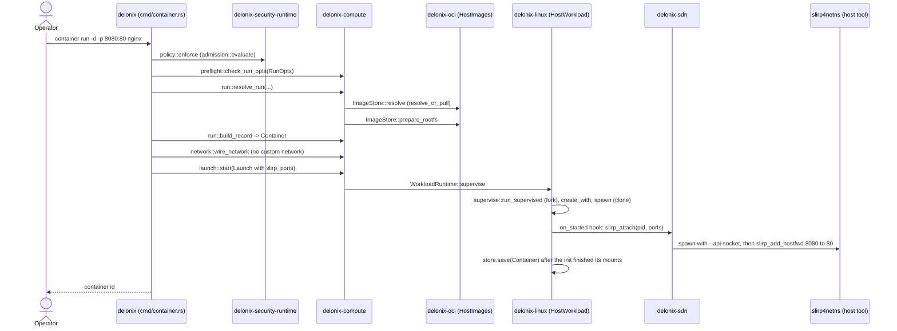
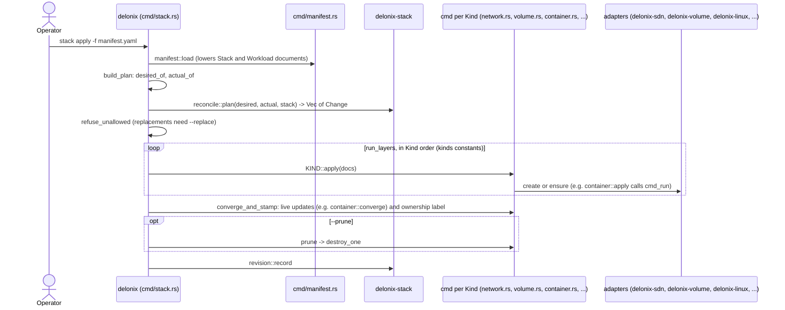
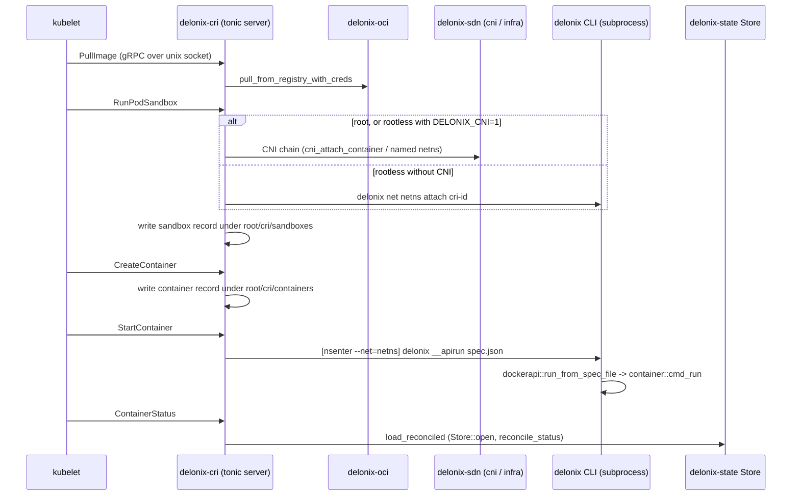

<!-- translated-from: crates.md sha256:02a670fe76c5758e314a6b3e1fa863a1636de585aa08a088f253e5a021a85f05 -->
# Os crates

**Antes de leres:** [Arquitectura](architecture.md), sobretudo [Camadas e a direcção permitida](architecture.md#layers-and-the-allowed-direction).

Esta página é o mapa que mantés aberto enquanto lês o código. A tabela abaixo é
gerada a partir do `Cargo.toml` e do `scripts/arch_fitness.py`; tudo depois dela é
escrito à mão, e cada apontador (`caminho:símbolo`) foi lido na árvore antes de
ser escrito. Onde uma afirmação não pôde ser confirmada, não está aqui. Depois
dela consegues encontrar o crate que possui uma mudança, os ficheiros a ler
primeiro nele, e as armadilhas por que já pagou.

Como usá-la:

- Encontra o crate que possui o que queres mudar (a camada primeiro, ver
  [Arquitectura](architecture.md) para saber porque é que as camadas existem e
  em que direcção uma dependência pode apontar).
- Lê a sua lista **Começa a ler em** por ordem, depois as suas **Armadilhas**:
  cada uma é uma armadilha por que esta base de código já pagou, e o comentário
  que a regista continua no ficheiro.
- Antes de acrescentares uma linha `use delonix_…`, verifica a tabela: uma aresta
  que não esteja na coluna "Depende de" falha o `scripts/arch_fitness.py` a não
  ser que vá na direcção permitida.

Duas convenções que vais encontrar em todo o lado:

- **Puro versus efeito.** Os contexts e os crates de fundação decidem; os
  adapters tocam no kernel, no disco, num subprocesso ou na rede. Quando um caso
  de uso num context precisa de um efeito, declara uma *porta* (um trait) e um
  adapter implementa-a. A raiz de composição que liga portas a adapters é o
  binário `delonix`.
- **«Fala com» significa o mecanismo, não só a dependência.** Um crate pode
  depender de outro e ainda assim alcançá-lo correndo o binário `delonix` como
  subprocesso (o CRI e a API de gestão local fazem isto para tudo o que faz
  fork), ou escrevendo uma linha num socket de controlo unix (o holder de rede).

## Tabela de referência

<!-- dev-docs:begin crates-table -->
| Crate | Camada | Caminho | Binários | Depende de (crates do motor) | Usado por |
|---|---|---|---|---|---|
| `delonix-model` | Foundation | `crates/foundation/delonix-model` | — | — | `delonix-compute`, `delonix-cri`, `delonix-linux`, `delonix-mcp`, `delonix-mgmt`, `delonix-node`, `delonix-oci`, `delonix-opnsense`, `delonix-proxmox`, `delonix-runtime-bin`, `delonix-scanner`, `delonix-sdn`, `delonix-security-runtime`, `delonix-stack`, `delonix-state`, `delonix-truenas`, `delonix-vm`, `delonix-volume` |
| `delonix-net-rules` | Foundation | `crates/foundation/delonix-net-rules` | — | — | `delonix-sdn`, `delonix-vm` |
| `delonix-compute` | Contexts | `crates/contexts/delonix-compute` | — | `delonix-model`, `delonix-node` | `delonix-cri`, `delonix-linux`, `delonix-mcp`, `delonix-mgmt`, `delonix-oci`, `delonix-proxmox`, `delonix-runtime-bin`, `delonix-sdn`, `delonix-state`, `delonix-vm`, `delonix-volume` |
| `delonix-node` | Contexts | `crates/contexts/delonix-node` | — | `delonix-model` | `delonix-compute`, `delonix-cri`, `delonix-linux`, `delonix-mcp`, `delonix-mcp-bin`, `delonix-mgmt`, `delonix-mgmt-bin`, `delonix-oci`, `delonix-runtime-bin`, `delonix-sdn`, `delonix-security-runtime`, `delonix-state`, `delonix-vm`, `delonix-volume` |
| `delonix-security-runtime` | Contexts | `crates/contexts/delonix-security-runtime` | — | `delonix-model`, `delonix-node` | `delonix-runtime-bin` |
| `delonix-stack` | Contexts | `crates/contexts/delonix-stack` | — | `delonix-model` | `delonix-runtime-bin` |
| `delonix-linux` | Adapters | `crates/adapters/delonix-linux` | — | `delonix-compute`, `delonix-model`, `delonix-node`, `delonix-state` | `delonix-cri`, `delonix-mcp`, `delonix-mgmt`, `delonix-runtime-bin` |
| `delonix-oci` | Adapters | `crates/adapters/delonix-oci` | — | `delonix-compute`, `delonix-model`, `delonix-node`, `delonix-state` | `delonix-cri`, `delonix-mgmt`, `delonix-runtime-bin`, `delonix-scanner` |
| `delonix-scanner` | Adapters | `crates/adapters/delonix-scanner` | — | `delonix-model`, `delonix-oci` | `delonix-mgmt`, `delonix-runtime-bin` |
| `delonix-sdn` | Adapters | `crates/adapters/delonix-sdn` | — | `delonix-compute`, `delonix-model`, `delonix-net-rules`, `delonix-node`, `delonix-state` | `delonix-cri`, `delonix-mcp`, `delonix-mgmt`, `delonix-opnsense`, `delonix-proxmox`, `delonix-runtime-bin` |
| `delonix-state` | Adapters | `crates/adapters/delonix-state` | — | `delonix-compute`, `delonix-model`, `delonix-node` | `delonix-cri`, `delonix-linux`, `delonix-mcp`, `delonix-mgmt`, `delonix-oci`, `delonix-runtime-bin`, `delonix-sdn`, `delonix-vm`, `delonix-volume` |
| `delonix-telemetry` | Adapters | `crates/adapters/delonix-telemetry` | — | — | `delonix-cri`, `delonix-mcp-bin`, `delonix-mgmt`, `delonix-mgmt-bin`, `delonix-runtime-bin` |
| `delonix-vm` | Adapters | `crates/adapters/delonix-vm` | — | `delonix-compute`, `delonix-model`, `delonix-net-rules`, `delonix-node`, `delonix-state` | `delonix-mcp`, `delonix-mgmt`, `delonix-proxmox`, `delonix-runtime-bin` |
| `delonix-volume` | Adapters | `crates/adapters/delonix-volume` | — | `delonix-compute`, `delonix-model`, `delonix-node`, `delonix-state` | `delonix-mcp`, `delonix-mgmt`, `delonix-runtime-bin` |
| `delonix-opnsense` | Providers | `crates/providers/delonix-opnsense` | — | `delonix-model`, `delonix-sdn` | `delonix-runtime-bin` |
| `delonix-proxmox` | Providers | `crates/providers/delonix-proxmox` | — | `delonix-compute`, `delonix-model`, `delonix-sdn`, `delonix-vm` | `delonix-runtime-bin` |
| `delonix-truenas` | Providers | `crates/providers/delonix-truenas` | — | `delonix-model` | `delonix-runtime-bin` |
| `delonix-cri` | Interfaces | `crates/interfaces/delonix-cri` | `delonix-cri` | `delonix-compute`, `delonix-linux`, `delonix-model`, `delonix-node`, `delonix-oci`, `delonix-sdn`, `delonix-state`, `delonix-telemetry` | — |
| `delonix-mcp` | Interfaces | `crates/interfaces/delonix-mcp` | — | `delonix-compute`, `delonix-linux`, `delonix-mgmt`, `delonix-model`, `delonix-node`, `delonix-sdn`, `delonix-state`, `delonix-vm`, `delonix-volume` | `delonix-mcp-bin` |
| `delonix-mgmt` | Interfaces | `crates/interfaces/delonix-mgmt` | — | `delonix-compute`, `delonix-linux`, `delonix-model`, `delonix-node`, `delonix-oci`, `delonix-scanner`, `delonix-sdn`, `delonix-state`, `delonix-telemetry`, `delonix-vm`, `delonix-volume` | `delonix-mcp`, `delonix-mgmt-bin`, `delonix-runtime-bin` |
| `delonix-mcp-bin` | Binaries | `bins/delonix-mcp-bin` | `delonix-mcp` | `delonix-mcp`, `delonix-node`, `delonix-telemetry` | — |
| `delonix-mgmt-bin` | Binaries | `bins/delonix-mgmt-bin` | `delonix-mgmt` | `delonix-mgmt`, `delonix-node`, `delonix-telemetry` | — |
| `delonix-runtime-bin` | Binaries | `bins/delonix-runtime-bin` | `delonix` | `delonix-compute`, `delonix-linux`, `delonix-mgmt`, `delonix-model`, `delonix-node`, `delonix-oci`, `delonix-opnsense`, `delonix-proxmox`, `delonix-scanner`, `delonix-sdn`, `delonix-security-runtime`, `delonix-stack`, `delonix-state`, `delonix-telemetry`, `delonix-truenas`, `delonix-vm`, `delonix-volume` | — |
<!-- dev-docs:end crates-table -->

## Foundation

Os crates de fundação não levam mecanismo nenhum: tipos e regras puros. Só podem
depender de outros crates de fundação. Os registos persistidos `Container` e `Vm`
não estão aqui (pertencem ao `delonix-compute`), e os ficheiros que guardam
registos são lidos e escritos pelo adapter `delonix-state`.

### `delonix-model`

**Propósito.** A parte do modelo que qualquer camada pode nomear sem depender de
um mecanismo: o tipo `Error` partilhado do motor com o código `DX_*` estável de
cada variante, os nomes gerados de workload, o mapeamento de um `Error` para um
código de saída de processo, o dicionário de códigos numerados `DX-CDNN`, o
modelo de segredos (o que é um segredo e como é um nome e uma chave válidos), e —
desde a #405 — os registos que são só dados: o `Status` de um workload, a
firewall por-container (`ContainerFw`, `FwRule` e os validadores puros
`fw_proto_ok`, `fw_port_ok`, `fw_src_ok`), `default_namespace`, e o `typestate`
de ciclo de vida verificado em tempo de compilação. Puro — sem I/O, sem estado
de processo (doc-comment do crate). Os registos `Container` e `Vm` que usam
estes tipos estão no `delonix-compute`; os ficheiros que guardam registos estão
no `delonix-state`.

**Módulos principais**

| Módulo | Responsabilidade |
|---|---|
| `error` | `Error`, `Result`, e `Error::code` (a string `DX_*` de cada variante) |
| `exitcode` | classes de código de saída (`NOT_RUNNING`, `NOT_FOUND`, `CONFLICT`, …) e `for_error` |
| `names` | nomes por omissão (`derived_name`, `random_name`) |
| `codes` | o dicionário de códigos numerados `DX-CDNN` (ADR-0043): dígito de classe, dígito de domínio, número |
| `secret` | `Secret` e as regras puras `valid_name`, `valid_env_key`, `parse_env_file`; o store cifrado é o `delonix-state` |
| `records` | `Status` (`from_wait`, `is_terminal`, `exit_code`), `ContainerFw`/`FwRule`, `fw_proto_ok`/`fw_port_ok`/`fw_src_ok`, `default_namespace` (movido para aqui na #405) |
| `typestate` | fases de ciclo de vida verificadas em tempo de compilação `Phase<Created/Running/Stopped>`; transições ilegais não compilam (movido na #405) |

**Principal API pública**

| Item | O que é | Onde |
|---|---|---|
| `Error::code` | o código de máquina estável (`DX_*`) de um erro | `crates/foundation/delonix-model/src/error.rs:code` |
| `exitcode::for_error` | o único sítio onde um `Error` se torna um código de saída | `crates/foundation/delonix-model/src/exitcode.rs:for_error` |
| `exitcode::merge` | o código para um lote de resultados | `crates/foundation/delonix-model/src/exitcode.rs:merge` |
| `names::derived_name` | nome determinístico a partir de um id | `crates/foundation/delonix-model/src/names.rs:derived_name` |
| `secret::Secret`, `secret::parse_env_file` | o registo de segredo e o parser de ficheiros `KEY=value`, usado pelo `delonix-compute` sem depender de um adapter | `crates/foundation/delonix-model/src/secret.rs` |
| `records::Status` | estado de ciclo de vida de um workload | `crates/foundation/delonix-model/src/records.rs:Status` |
| `records::ContainerFw`, `records::FwRule` | a firewall persistida por-container; o `delonix-sdn` aplica-a com nftables | `crates/foundation/delonix-model/src/records.rs` |
| `typestate::Phase` | fases de ciclo de vida tipadas | `crates/foundation/delonix-model/src/typestate.rs:Phase` |

**Fala com.** Nenhum outro crate do motor: é uma raiz do grafo, e todo outro
crate do motor que devolve o erro partilhado importa-o daqui. A CLI re-exporta
`exitcode` e `names` como `cmd::exitcode` e `cmd::names`
(`bins/delonix-runtime-bin/src/cmd/mod.rs`), para os pontos de chamada mais
antigos não mudarem.

**Dependências externas notáveis.** `thiserror` (o derive de `Error`),
`serde_json` (a variante `Error::Json` embrulha `serde_json::Error`) e `serde`
(o derive de `Secret`).

**Testes.** Testes unitários inline (`codes`, `error`, `exitcode`, `names`,
`typestate`) e um doc-test em `src/typestate.rs`.

**Começa a ler em.** `src/exitcode.rs` (o seu doc-comment de módulo explica
porque é que as classes existem), depois `src/records.rs`, depois `src/names.rs`.

**Armadilhas.**

- O `match` no `for_error` é exaustivo de propósito: uma variante nova de
  `Error` tem de ser classificada aqui ou o build falha.
- Dois caminhos de import alcançam o mesmo tipo: `delonix_model::records::FwRule`
  e `delonix_sdn::FwRule` (um re-export, `crates/adapters/delonix-sdn/src/lib.rs`).
  São um só tipo, por isso os dois compilam; faz `grep` aos dois caminhos quando
  procurares chamadores.

### `delonix-net-rules`

**Propósito.** Regras de rede que podem ser calculadas sem tocar no kernel:
nomes de bridge, derivação de IP dentro de um prefixo, o tipo de valor `Cidr`,
correspondência de labels, parsing da saída de `iptables-save`. Tem **zero
dependências**, por isso qualquer chamador consegue compilar as mesmas regras
que o motor usa. Exclui deliberadamente tudo o que lê estado partilhado (a
alocação de IP lê o registo IPAM, por isso fica no `delonix-sdn`).

**Módulos principais.** Um único `lib.rs`.

**Principal API pública**

| Item | O que é | Onde |
|---|---|---|
| `Cidr` | tipo de prefixo IPv4, sem crate externo | `crates/foundation/delonix-net-rules/src/lib.rs:Cidr` |
| `bridge_name` | a única fórmula para o nome do dispositivo bridge de uma rede | `crates/foundation/delonix-net-rules/src/lib.rs:bridge_name` |
| `derive_ip_in`, `valid_ip_in_subnet` | endereço preferido para um id, e verificação de pertença | `crates/foundation/delonix-net-rules/src/lib.rs` |
| `matches_labels` | correspondência de selector de labels (usado pelo `kind: Service`) | `crates/foundation/delonix-net-rules/src/lib.rs:matches_labels` |
| `parse_overlay_peer` | analisa a spec de um peer de overlay | `crates/foundation/delonix-net-rules/src/lib.rs:parse_overlay_peer` |

**Fala com.** Nada. O `delonix-sdn` re-exporta os seus itens, por isso os
chamadores de `delonix_sdn::Cidr` etc. continuam a compilar.

**Dependências externas notáveis.** Nenhuma.

**Testes.** Testes unitários inline.

**Começa a ler em.** `src/lib.rs` — o doc-comment do módulo lista o que ficou de
fora e porquê.

**Armadilhas.** Partes do doc-comment do módulo ainda estão em português (dívida
LANG-01); o código é a referência.

## Contexts

Um context possui as decisões de um domínio e as portas de que os seus casos de
uso precisam. Nenhum context monta, arranca processos ou configura a rede; o
`delonix-node` é o único que lê o host directamente (`/proc`, `/sys`,
`kill(pid, 0)`, `SO_PEERCRED`).

### `delonix-compute`

**Propósito.** O context Compute (`compute.delonix.io`): os registos que o
motor persiste para um container e uma VM (`Container`, `Vm`, e o que carregam —
`Mount`, verificações de saúde, colocação de cgroup, redes extra, discos e NICs),
a especificação de execução para a qual todo ponto de entrada traduz
(`RunOpts`), e o caso de uso `container run` como passos puros sobre portas —
preflight, resolver, construir o registo, ligar a rede, arrancar. Também tem os
tipos de especificação de Pod e a sua tradução para `RunOpts`, e o intervalo
IPv4 de workload. Os registos vieram para aqui do `delonix-runtime-core`
removido (#406). **Não** arranca processos, faz pull de imagens nem configura
redes; chama traits que os adapters implementam.

**Módulos principais**

| Módulo | Responsabilidade |
|---|---|
| `record` (privado, re-exportado na raiz do crate) | `Container`, `Vm`, `Mount`, `HealthConfig`/`Health`/`HealthState`, `CgroupParent`, `KubeCgroupParent`/`KubeCgroupDriver`, `ExtraNet`, os tipos de VM (`CpuTopology`, `ExtraDisk`, `ExtraNic`, `VmVolume`, `VmBootSpec`), `DELONIX_SLICE`, `safe_cgroup_segment` |
| `workload_net` | o intervalo IPv4 de workload (`is_workload_ipv4`), definido uma vez |
| `run_opts` | `RunOpts`, a única especificação de execução |
| `preflight` | recusa combinações de flags sem sentido, antes de qualquer efeito |
| `run` | `resolve_run` (através de portas) e `build_record` (puro) |
| `network` | a fase de rede: `attach_custom_network`, `wire_network` |
| `launch` | intenção `Launch`, porta `WorkloadRuntime`, caso de uso `start`, política de restart |
| `ports` | `ImageStore`, `StorageProvider`, `DeviceResolver`, `RunHost`, `NetworkProvider`, `VmNetwork` |
| `pod` | tipos de spec de Pod e `pod_to_run_opts`/`container_to_run_opts` |
| `notice` | `Notice`, um aviso devolvido como dado em vez de impresso |

**Principal API pública**

| Item | O que é | Onde |
|---|---|---|
| `Container` | o registo de container que tudo lê e escreve | `crates/contexts/delonix-compute/src/record.rs:Container` |
| `Vm` | o registo de VM | `crates/contexts/delonix-compute/src/record.rs:Vm` |
| `KubeCgroupParent::parse` | validação do pai de cgroup que o kubelet envia | `crates/contexts/delonix-compute/src/record.rs:KubeCgroupParent` |
| `DELONIX_SLICE` | o slice de cgroup do modo root | `crates/contexts/delonix-compute/src/record.rs:DELONIX_SLICE` |
| `RunOpts` | a especificação de execução | `crates/contexts/delonix-compute/src/run_opts.rs:RunOpts` |
| `preflight::check_run_opts` | recusa pura de combinações impossíveis | `crates/contexts/delonix-compute/src/preflight.rs:check_run_opts` |
| `run::resolve_run` | resolve imagem, volumes, dispositivos, utilizador, defaults através de portas | `crates/contexts/delonix-compute/src/run.rs:resolve_run` |
| `run::build_record` | transforma spec + resolução num `Container` (puro) | `crates/contexts/delonix-compute/src/run.rs:build_record` |
| `network::wire_network` | publica portas, regista rede/IP, isolamento de namespace, shaping — antes de arrancar | `crates/contexts/delonix-compute/src/network.rs:wire_network` |
| `launch::start` | arranque supervisionado ou directo, e limpeza de um arranque que nunca aconteceu | `crates/contexts/delonix-compute/src/launch.rs:start` |
| `launch::WorkloadRuntime` | porta que transforma um `Launch` num processo | `crates/contexts/delonix-compute/src/launch.rs:WorkloadRuntime` |
| `ports::NetworkProvider` | porta para attach/publish/firewall/shaping | `crates/contexts/delonix-compute/src/ports.rs:NetworkProvider` |
| `ports::VmNetwork` | porta para um tap de VM na rede rootless | `crates/contexts/delonix-compute/src/ports.rs:VmNetwork` |

**Fala com.** Só o `delonix-model` e o `delonix-node` (`safe_to_signal` para os
registos, `generate_id` em testes), por chamada directa. Tudo o resto chega
através das suas portas, implementadas em adapters:

| Porta | Implementada por |
|---|---|
| `ImageStore` | `crates/adapters/delonix-oci/src/run_images.rs:HostImages` |
| `StorageProvider` | `crates/adapters/delonix-volume/src/lib.rs:HostVolumes` |
| `DeviceResolver` | `crates/adapters/delonix-linux/src/cdi.rs:HostDevices` |
| `RunHost` | `crates/adapters/delonix-linux/src/run_host.rs:HostRuntime` |
| `WorkloadRuntime` | `crates/adapters/delonix-linux/src/workload.rs:HostWorkload` |
| `NetworkProvider` | `crates/adapters/delonix-sdn/src/run_network.rs:HostNetwork` |
| `VmNetwork` | `crates/adapters/delonix-sdn/src/vm_network.rs:HostVmNetwork` |

**Dependências externas notáveis.** `serde`, `schemars` (comentário no
Cargo.toml: os tipos de spec derivam o seu JSON Schema ao lado da sua
definição, para o schema publicado nunca poder divergir dos tipos).

**Testes.** Testes unitários inline com implementações falsas de porta
(`FakeNet`, `FakeRuntime`, `Fake` em `network.rs`, `launch.rs`, `run.rs`) — o
caso de uso é testado sem um kernel.

**Começa a ler em.** `src/record.rs` (as structs `Container` e `Vm`), depois
`src/ports.rs`, depois `src/run.rs`, depois `src/launch.rs`.

**Armadilhas.**

- `Container.userns` diz se o container **criou** o seu próprio user
  namespace, não se corre num diferente. Workloads que se juntam ao user
  namespace do holder de rede têm `userns = false` e continuam num user
  namespace diferente do do chamador. O `mount_live` no `delonix-linux` regista
  isto e abre sempre o namespace `user` em vez de confiar no campo
  (`crates/adapters/delonix-linux/src/lib.rs:mount_live`).
- `Container.ip` é o endereço só na rede **primária**; um container
  multi-homed tem mais (ver o doc-comment de `NetPlan` em
  `crates/adapters/delonix-sdn/src/infra.rs` e `apply_firewall_all`, que existe
  porque fazer firewall só ao IP primário era contornável).
- `Container::cgroup()` é o caminho estático do modo root. Para um container
  rootless a correr, o cgroup real é lido de `/proc/<pid>/cgroup` por
  `delonix_linux::live_cgroup`.
- `record.rs` é o resto de uma divisão grande: o seu doc-comment de módulo
  ainda diz que os registos "vieram do `delonix-runtime-core`", e o doc-comment
  do crate em `src/lib.rs` ainda descreve o crate como guardando só a
  especificação de execução. A lista de módulos acima é a referência.

- Existem dois itens chamados `ImageStore`: o trait de porta
  `delonix_compute::ports::ImageStore` e o store concreto `delonix_oci::ImageStore`
  (uma struct). O `HostImages` adapta o segundo ao primeiro. Os caminhos de
  import importam.
- O `wire_network` tem de correr **antes** do `launch::start`; o seu
  doc-comment de módulo regista que um `-d` supervisionado, senão, perdia as
  definições de rede.

### `delonix-node`

**Propósito.** O context de nó (doc-comment do crate, ADR-0040 D2.2): as
preocupações próprias do nó de que mais do que um crate precisa e que de outra
forma copiaria — o registo de eventos só-de-acrescentar, as verificações de
virtualização e de host, a verificação `SO_PEERCRED` para sockets locais, a
regra que um binário servidor segue quando o `delonix` o corre, e as perguntas
feitas ao host e a processos (o relógio, o user namespace, a vivacidade de um
pid, um id novo). Veio do `delonix-runtime-core` removido (#406). **Não** cria
processos, monta, nem configura a rede, e não guarda nenhum registo de workload.

**Módulos principais**

| Módulo | Responsabilidade |
|---|---|
| `host` (privado, re-exportado na raiz do crate) | `now_unix`, `in_initial_userns`, `initial_uid_map`, `is_rootless`, `fmt_local_ts`, `is_alive`, `proc_starttime`, `safe_to_signal`, `generate_id`, `self_bin` |
| `events` | registo de eventos só-de-acrescentar `events.jsonl` (`emit`, `read`, `read_from`, `size`) |
| `dispatch` | verificação de versão e resolução de CLI para binários servidor corridos pelo `delonix` (`DELONIX_DISPATCH_VERSION`, `DELONIX_BIN`) |
| `peer_cred` | `peer_uid` a partir de `SO_PEERCRED` |
| `virt` | detecção de virtualização/virtio a partir de `/sys` e `/proc` (`detect`, `blk_scheduler`, `set_blk_scheduler_none`) |

**Principal API pública**

| Item | O que é | Onde |
|---|---|---|
| `events::emit` | acrescenta uma linha de evento | `crates/contexts/delonix-node/src/events.rs:emit` |
| `dispatch::check_version`, `dispatch::cli_bin` | como o `delonix-cri`/`-mgmt`/`-mcp` recusam uma release que não bate certo e encontram a CLI `delonix` para voltar a chamar | `crates/contexts/delonix-node/src/dispatch.rs` |
| `is_alive`, `proc_starttime`, `safe_to_signal` | verificações de pid que sobrevivem à reciclagem de pid | `crates/contexts/delonix-node/src/host.rs` |
| `in_initial_userns`, `is_rootless` | se o uid 0 aqui é o root do host | `crates/contexts/delonix-node/src/host.rs` |
| `generate_id`, `now_unix` | um id de 16 dígitos hex, segundos desde a epoch | `crates/contexts/delonix-node/src/host.rs` |
| `peer_cred::peer_uid` | o uid do outro lado de um socket unix | `crates/contexts/delonix-node/src/peer_cred.rs:peer_uid` |

**Fala com.** Só o `delonix-model` (segundo o `Cargo.toml`). Sem subprocessos:
a detecção lê `/sys` e `/proc` directamente, e o `is_alive` usa `kill(pid, 0)`.

**Dependências externas notáveis.** `serde`/`serde_json` (as linhas de
evento), `libc`.

**Testes.** Módulos `#[cfg(test)]` inline em `events.rs`, `peer_cred.rs` e
`virt.rs`; sem directório `tests/`.

**Começa a ler em.** `src/lib.rs` (os re-exports), depois `src/host.rs`, depois
`src/dispatch.rs`.

**Armadilhas.**

- `geteuid() == 0` não é "root no host": usa o `in_initial_userns` (o seu
  doc-comment regista dois sítios que tomaram o caminho de root dentro de um
  user namespace aninhado).
- Em `src/host.rs` o rustdoc do `is_alive` começa com um parágrafo sobre o
  registo `Vm`, deixado para trás pela divisão; a frase de uma linha a seguir é
  a documentação real da função.

### `delonix-stack`

**Propósito.** O context Stack (`core.delonix.io`): a tabela de Kinds e os seus
factos, o reconciliador de três vias que planeia um manifesto contra o que
existe, e o histórico de revisões de um apply. Planear é puro — nada aqui abre
um store de um recurso concreto nem corre um comando (doc-comment do crate).
Carregar manifestos e aplicar cada Kind ficam na CLI.

**Módulos principais**

| Módulo | Responsabilidade |
|---|---|
| `kinds` | constantes de nome de Kind e `KindFacts` (domínio, forma, converge, teardown, namespaced, presence) |
| `reconcile` | `Desired`/`Actual`/`Change`, `plan`, a label de posse e a anotação de last-applied |
| `revision` | regista e lista revisões de apply (para rollback) |
| `condition` | o tipo `Condition` |

**Principal API pública**

| Item | O que é | Onde |
|---|---|---|
| `kinds::facts`, `kinds::stack_kinds`, `kinds::converges` | a única tabela que a CLI consulta por Kind | `crates/contexts/delonix-stack/src/kinds.rs` |
| `reconcile::plan` | desejado vs real → `Vec<Change>` | `crates/contexts/delonix-stack/src/reconcile.rs:plan` |
| `reconcile::STACK_LABEL`, `LAST_APPLIED` | label de posse e anotação de diff de três vias | `crates/contexts/delonix-stack/src/reconcile.rs` |
| `reconcile::hot_fields_for` | que mudanças de campo podem ser aplicadas a quente | `crates/contexts/delonix-stack/src/reconcile.rs:hot_fields_for` |
| `revision::record`, `revision::list` | histórico de apply | `crates/contexts/delonix-stack/src/revision.rs` |

**Fala com.** Só o `delonix-model`. A CLI re-exporta `kinds`, `reconcile`
e `revision` como `cmd::kinds` etc. (`bins/delonix-runtime-bin/src/cmd/mod.rs`).

**Dependências externas notáveis.** `serde`, `serde_json`.

**Testes.** Testes unitários inline (planos como dados).

**Começa a ler em.** `src/kinds.rs`, depois `src/reconcile.rs`, depois
`bins/delonix-runtime-bin/src/cmd/stack.rs` para o ver consumido.

**Armadilhas.** Acrescentar um Kind não é só uma linha em `kinds.rs`: a CLI
tem código por-Kind (`desired_of`/`actual_of`, `converge_and_stamp`,
`destroy_one` em `cmd/stack.rs`) e tabelas de schema/completion com os seus
próprios testes. Corre a suite de testes completa do `delonix-runtime-bin`
depois de mexeres na tabela.

### `delonix-security-runtime`

**Propósito.** As **decisões** de segurança do nó: o ficheiro de política, a
avaliação única de admissão para containers e VMs, o evento de segurança, um
score de postura explicável, e a redacção de segredos em texto. Funções puras
dos seus argumentos. Deliberadamente não tem sensores, watchers nem processo
residente (doc-comment do crate: daemonless por desenho), e nenhum campo de
inquilino, projecto ou ambiente em lado nenhum.

**Módulos principais**

| Módulo | Responsabilidade |
|---|---|
| `policy` | `SecurityPolicy`, `Mode`, lints |
| `admission` | `Request`, `evaluate`, `Decision`, `Violation` |
| `event` | `SecurityEvent` no registo de eventos do motor |
| `score` | `Score` com deduções e razões |
| `redact` | redacção de chaves/valores sensíveis em input hostil |
| `severity` | `Severity`, `ActionRisk`, `Confidence` |

**Principal API pública**

| Item | O que é | Onde |
|---|---|---|
| `SecurityPolicy::parse` | carrega uma política | `crates/contexts/delonix-security-runtime/src/policy.rs:SecurityPolicy` |
| `admission::evaluate` | decide um pedido | `crates/contexts/delonix-security-runtime/src/admission.rs:evaluate` |
| `admission::Request` | input de admissão de container ou VM | `crates/contexts/delonix-security-runtime/src/admission.rs:Request` |
| `redact::redact_text` | mascara segredos em texto | `crates/contexts/delonix-security-runtime/src/redact.rs:redact_text` |

**Fala com.** `delonix-model` e `delonix-node` (`events`, `now_unix`).
Consumido pela CLI através de `bins/delonix-runtime-bin/src/cmd/policy.rs`, que
o `cmd_run` chama antes de qualquer imagem ser resolvida.

**Dependências externas notáveis.** `serde`, `serde_json`.

**Testes.** Testes unitários inline, incluindo um módulo `boundary_tests` em
`lib.rs` e um doc-test no doc-comment do crate.

**Começa a ler em.** `src/lib.rs` (doc-comment do crate), `src/admission.rs`,
`src/policy.rs`.

**Armadilhas.** Nenhuma além do doc-comment do crate: não acrescentes um
sensor em segundo plano aqui — o doc-comment explica porque é que um controlo
inerte em modo rootless é pior que nenhum.

## Adapters

Os adapters são onde o motor encontra o kernel, o disco, ferramentas do host e
registos remotos. Dependem da fundação e dos contexts, nunca uns dos outros (as
excepções declaradas estão listadas em [Arquitectura](architecture.md)).

### `delonix-linux`

**Propósito.** O runtime de containers de baixo nível: `clone` com namespaces,
`pivot_root`, cgroups v2, capabilities e seccomp, `exec` via `setns`, parar e
remover, e o supervisor destacado por trás do `run -d`. O seu doc-comment de
crate afirma a regra: a fronteira de syscalls dos containers vive aqui. Não
resolve imagens, não analisa flags da CLI nem configura a rede; os efeitos de
rede chegam como hooks vindos do chamador.

**Módulos principais**

| Módulo | Responsabilidade |
|---|---|
| `lib.rs` | `RunSpec`, `create_with`/`spawn`, `container_init`, configuração do rootfs e mount overlay, `exec`, `stop`, `remove`, mounts ao vivo, cgroups, `reconcile_status` |
| `workload` | `HostWorkload`, a implementação da porta `WorkloadRuntime` |
| `launch_spec` | `run_spec`, o único construtor de `RunSpec` a partir de um `Launch` |
| `supervise` | `run_supervised`, o pai feito fork de um container destacado |
| `capabilities` | tabela nome↔número de capability e o conjunto por omissão |
| `seccomp_profile` | carregamento de perfil seccomp OCI |
| `cdi` | consumidor de spec de dispositivo CDI (`HostDevices`) |
| `run_host` | `HostRuntime`, a implementação da porta `RunHost` |
| `regulate`, `resource_advice`, `workload_view` | pressão de recursos, conselho do host, vista pedido-vs-imposto |

**Principal API pública**

| Item | O que é | Onde |
|---|---|---|
| `RunSpec` | tudo o que um spawn precisa | `crates/adapters/delonix-linux/src/lib.rs:RunSpec` |
| `create_with` | arranca um container (chama `spawn`) | `crates/adapters/delonix-linux/src/lib.rs:create_with` |
| `exec` | corre um comando dentro de um container a correr | `crates/adapters/delonix-linux/src/lib.rs:exec` |
| `stop`, `remove` | ciclo de vida | `crates/adapters/delonix-linux/src/lib.rs` |
| `reconcile_status` | actualiza um registo contra o processo vivo | `crates/adapters/delonix-linux/src/lib.rs:reconcile_status` |
| `mount_live`, `update_limits`, `set_frozen` | mudanças a quente a um container a correr | `crates/adapters/delonix-linux/src/lib.rs` |
| `mount_overlay_if_marked` | mount overlay com a nova API de mount | `crates/adapters/delonix-linux/src/lib.rs:mount_overlay_if_marked` |
| `supervise::run_supervised` | supervisor destacado | `crates/adapters/delonix-linux/src/supervise.rs:run_supervised` |
| `workload::HostWorkload` | adapter de `WorkloadRuntime` | `crates/adapters/delonix-linux/src/workload.rs:HostWorkload` |

**Fala com.** `delonix-model`, `delonix-node`, `delonix-compute` e
`delonix-state` (`Store`, `SecretStore`, `write_private_temp`; uma excepção de
camada declarada, removida no ADR-0040 P4), por chamada directa. Syscalls
através de `nix`, `libc` e `rustix`. Ferramentas do host que corre: `busctl`
(scopes systemd para o pai de cgroup do kubelet), `apparmor_parser`,
`ldconfig`, `nvidia-smi`. O slirp para `-p` não é arrancado aqui: o
`HostWorkload` recebe um hook `attach_slirp` que a CLI preenche com
`delonix_sdn::slirp_attach`
(`bins/delonix-runtime-bin/src/cmd/container.rs:with_host_workload`).

**Dependências externas notáveis.** `nix`, `libc`, `seccompiler`; `rustix` com
`mount`/`fs` (comentário no Cargo.toml: o `nix` não tem wrapper para
`fsopen`/`fsconfig`/`fsmount`/`move_mount`, precisos para evitar o limite de
tamanho de página do argumento `data` do `mount(2)` clássico); `serde_yaml`
para specs CDI.

**Testes.** Módulos de teste unitário inline em `lib.rs` e nos ficheiros de
módulo; testes de integração em `crates/adapters/delonix-linux/tests/`
(`cgroup_parent.rs`, `advisor_fixtures.rs`).

**Começa a ler em.** `src/workload.rs`, depois `src/launch_spec.rs`, depois
`src/lib.rs` desde `RunSpec` até `spawn` e `container_init`.

**Armadilhas.**

- O `spawn` não devolve, e o registo não é guardado com um `pid`, até o init
  ter terminado os seus mounts; o comentário antes do `store.save` no `spawn`
  explica a corrida de host-root que isto fecha. Não movas esse save para mais
  cedo.
- O `supervise::run_supervised` e o handshake rootless assumem um chamador de
  uma só thread (`fork`). É por isso que servidores multi-thread (o CRI, a API
  de gestão, o shim da API Docker) correm o binário `delonix` em vez de chamar
  este crate para arrancar containers.
- Usa `live_cgroup(container)`, não `container.cgroup()`, para um container
  rootless a correr.

### `delonix-oci`

**Propósito.** Imagens OCI: um store de blobs endereçado por conteúdo, o
image store e os seus metadados, pull/push de registo com autenticação,
preparação de rootfs por-container (layers overlay partilhadas), parsing de
Dockerfile/Delonixfile e helpers de build, planeamento de Cloud Native
Buildpacks, load/save de arquivo, e sign/verify de assinatura. Não corre
containers; um build corre os seus passos através da CLI.

**Módulos principais**

| Módulo | Responsabilidade |
|---|---|
| `cas` | `Cas`, blobs endereçados por sha256 |
| `image` | `Image`, `ImageConfig`, `ImageStore` |
| `registry` | parsing de referência, `resolve_or_pull`, pull/push, artefactos OCI |
| `overlay` | `prepare_container_rootfs`, `prepare_overlay`, `existing_rootfs_path` |
| `build` | parser de Dockerfile (`parse_dockerfile`), estágios, `commit_flat_rootfs` |
| `run_images` | `HostImages`, a porta `ImageStore` de compute |
| `auth` | credenciais de registo (`login`/`lookup`) |
| `load`, `save` | arquivo Docker a entrar, arquivo OCI a sair |
| `sign` | `sign_image`, `verify_signature` (ECDSA P-256) |
| `buildpack`, `detect`, `internal_registry` | plano CNB, detecção de linguagem, registo descartável |
| `rootfs_user` | resolução de `--user` contra um rootfs |
| `error` | o próprio `Error` do crate, um número de dicionário por grupo de falha (ADR-0043), convertido para `delonix_model::Error` |

**Principal API pública**

| Item | O que é | Onde |
|---|---|---|
| `ImageStore` | abre, resolve, lista, remove imagens | `crates/adapters/delonix-oci/src/image.rs:ImageStore` |
| `registry::resolve_or_pull` | imagem local ou pull | `crates/adapters/delonix-oci/src/registry.rs:resolve_or_pull` |
| `pull_from_registry_with_creds` | pull com credenciais (usado pelo CRI) | `crates/adapters/delonix-oci/src/registry.rs` |
| `ImageStore::prepare_container_rootfs` | rootfs para um id de container | `crates/adapters/delonix-oci/src/overlay.rs` |
| `build::parse_dockerfile` | gramática de Dockerfile/Delonixfile | `crates/adapters/delonix-oci/src/build.rs:parse_dockerfile` |
| `Cas` | store de blobs | `crates/adapters/delonix-oci/src/cas.rs:Cas` |
| `verify_signature` | verificação estilo cosign | `crates/adapters/delonix-oci/src/sign.rs:verify_signature` |

**Fala com.** `delonix-model`, para cujo `Error` os seus próprios erros
convertem (`src/error.rs`, `impl From<Error> for delonix_model::Error`,
ADR-0043); `delonix-node`; `delonix-compute` (implementa a porta `ImageStore`);
e `delonix-state` (`write_atomic_mode`; uma excepção de camada declarada,
removida no ADR-0040 P4). Registos sobre HTTPS com um cliente `reqwest`
bloqueante. Sem subprocessos de host na sua fonte.

**Dependências externas notáveis.** `reqwest` (bloqueante, rustls),
`oci-spec` (tipos canónicos de imagem OCI), `sha2`, `tar`, `flate2`, `zstd`,
`base64`, `ring` (verificação de assinatura); só em dev, `proptest`
(robustez do parser em Rust estável) e `criterion`.

**Testes.** Testes unitários inline; um benchmark em
`crates/adapters/delonix-oci/benches/parse_reference.rs`.

**Começa a ler em.** `src/image.rs`, depois `src/registry.rs`
(`resolve_or_pull`), depois `src/overlay.rs`.

**Armadilhas.**

- `delonix_oci::ImageStore` (struct) não é `delonix_compute::ports::ImageStore`
  (trait); ver `run_images.rs`.
- O rootfs de que um container arranca é um overlay sobre layers partilhadas
  com um ficheiro marcador; o mount em si acontece dentro do init do container
  (`delonix_linux::mount_overlay_if_marked`), não aqui.

### `delonix-sdn`

**Propósito.** A SDN rootless e a firewall. Um processo *pin* de vida longa
segura um namespace user+network; um processo *control* reiniciável lá dentro
serve um socket de controlo unix e possui as bridges, as regras nftables, o
DHCP e o DNS interno; um `slirp4netns` faz a ponte entre esse namespace e o
host. Cobre também o caminho slirp-por-container para `-p` sem uma rede
personalizada, o IPAM, a execução de plugins CNI, o overlay WireGuard, e a
contabilidade de fluxo eBPF opcional. Re-exporta o `delonix-net-rules`. Não
arranca containers.

**Módulos principais**

| Módulo | Responsabilidade |
|---|---|
| `lib.rs` | `NetworkStore`, parsing de spec de publish, `slirp_attach`, colheita de slirp órfão |
| `infra` | o holder: `ensure_up`, `acquire`, `attach_container`, `publish_port`, `apply_firewall_all`, `network_route`, `vm_attach`, o socket de controlo |
| `run_network` | `HostNetwork` (porta `NetworkProvider`), `publish_with_retry` |
| `vm_network` | `HostVmNetwork` (porta `VmNetwork`) |
| `ipam` | registo de leases para endereços |
| `cni` | conformidade CNI: corre binários de plugin |
| `wg` | WireGuard sobre o overlay |
| `bpf` | contabilidade de fluxo eBPF opcional |
| `discover` | portas em escuta de um workload a partir de `/proc/<pid>/net` |
| `pin_userns` | os próprios namespaces e mapas de id do pin |

**Principal API pública**

| Item | O que é | Onde |
|---|---|---|
| `NetworkStore` | registo de rede declarativo | `crates/adapters/delonix-sdn/src/lib.rs:NetworkStore` |
| `parse_publish`, `parse_publish_addr` | gramática do `-p` | `crates/adapters/delonix-sdn/src/lib.rs` |
| `slirp_attach` | o próprio slirp de um container, com forwards de host | `crates/adapters/delonix-sdn/src/lib.rs:slirp_attach` |
| `infra::ensure_up` | levanta o holder (pin + control + slirp) | `crates/adapters/delonix-sdn/src/infra.rs:ensure_up` |
| `infra::attach_container` | veth numa rede, lease de IP | `crates/adapters/delonix-sdn/src/infra.rs:attach_container` |
| `infra::apply_firewall_all` | chain por-container para todo IP que possui | `crates/adapters/delonix-sdn/src/infra.rs:apply_firewall_all` |
| `run_network::HostNetwork` | adapter de `NetworkProvider` | `crates/adapters/delonix-sdn/src/run_network.rs:HostNetwork` |

**Fala com.** `delonix-model`, `delonix-node`, `delonix-net-rules`,
`delonix-compute` (portas, `workload_net`), `delonix-state` (`write_atomic`,
`write_private_temp`; uma excepção de camada declarada, removida no ADR-0040
P4). Ferramentas do host: `ip`, `nft`, `nsenter`, `slirp4netns`, `conntrack`,
`wg`, binários de plugin CNI. O holder é arrancado re-executando o binário do
motor (`netns pin`, `netns control`, intercetado no `main` da CLI antes do
parsing de argumentos — `bins/delonix-runtime-bin/src/main.rs`). Tudo o que
tem de acontecer dentro do namespace é uma linha escrita para o socket de
controlo (`infra.rs:control_query`), servida pelo `handle_control`. Os
forwards de porta vão para o `slirp4netns` através do seu socket de API
(`slirp_add_hostfwd`). O `build.rs` só compila o objecto eBPF se o `clang` e os
headers existirem; o eBPF nunca é obrigatório.

**Dependências externas notáveis.** `libc`, `serde`, `serde_json`,
`tracing`; só em dev, `proptest` para invariantes de alocação de IP.

**Testes.** Módulos de teste unitário inline; testes de integração em
`crates/adapters/delonix-sdn/tests/`.

**Começa a ler em.** O doc-comment de módulo e `ensure_up` de `src/infra.rs`,
depois `attach_container`, depois `src/run_network.rs`.

**Armadilhas.**

- O helper privado `capture()` em `src/lib.rs` devolve stdout **sem
  verificar o código de saída**. Lê a sua saída; nunca trates o seu `Ok` como
  "o comando teve sucesso". (O helper com o mesmo nome no `delonix-vm` é
  diferente: devolve `None` em falha.)
- O caminho do socket de controlo é derivado do uid **e**, quando o
  `DELONIX_ROOT` não é o de omissão, de um hash dele (`runtime_dir` +
  `root_suffix`, ADR-0014); `DELONIX_NET_RUNTIME_DIR` sobrepõe os dois.
  Qualquer coisa re-executada através de um user namespace tem de levar
  `runtime_dir_env()` além de `DELONIX_ROOT`; vê como o pin é arrancado em
  `infra.rs`. Ao isolares uma corrida de teste, define tanto `DELONIX_ROOT`
  como `DELONIX_NET_RUNTIME_DIR`.
- Uma firewall que só conhece `Container.ip` perde redes adicionais; usa o
  `apply_firewall_all`.

### `delonix-vm`

**Propósito.** MicroVMs e VMs atrás do trait `VmBackend` e um **registo** de
backends em runtime. O Cloud Hypervisor e o libvirt são os backends locais; um
backend remoto regista-se a si próprio de fora do crate. Possui os registos de
VM, o arranque e o ciclo de vida, os snapshots, a geração de seed de
cloud-init, e a escolha de backend (explícita, ficheiro por omissão, ou
auto-detecção). Não segura um cliente HTTP nem credenciais de provider.

**Módulos principais**

| Módulo | Responsabilidade |
|---|---|
| `lib.rs` | `VmConfig`, `VmBackend`, registo, `CloudHypervisorBackend`, `LibvirtBackend`, `create_with`, `start`/`stop`/`remove`, snapshots, `status`/`list` |
| `cloudinit` | `build_user_data`, `build_network_config`, `generate_seed_iso` |

**Principal API pública**

| Item | O que é | Onde |
|---|---|---|
| `VmBackend` | a porta de backend (`boot`, `stop`, `destroy`, `resume`, `snapshot`, `ip`, `manages_own_storage`, `auto_selectable`, …) | `crates/adapters/delonix-vm/src/lib.rs:VmBackend` |
| `register_backend`, `BackendRegistration` | acrescenta um backend por factory | `crates/adapters/delonix-vm/src/lib.rs` |
| `set_network` | regista a porta `VmNetwork` uma vez por processo | `crates/adapters/delonix-vm/src/lib.rs:set_network` |
| `VmConfig` | o que criar | `crates/adapters/delonix-vm/src/lib.rs:VmConfig` |
| `create_with`, `start`, `stop`, `remove`, `status`, `list` | ciclo de vida | `crates/adapters/delonix-vm/src/lib.rs` |
| `snapshot`, `restore`, `snapshots`, `delete_snapshot` | checkpoints | `crates/adapters/delonix-vm/src/lib.rs` |
| `valid_vm_name` | validação de nome na fronteira do motor | `crates/adapters/delonix-vm/src/lib.rs:valid_vm_name` |

**Fala com.** `delonix-model`, `delonix-node`, `delonix-compute` (o registo
`Vm`, a porta `VmNetwork`), `delonix-net-rules`, `delonix-state`
(`JsonStore<Vm>`, `write_atomic`; uma excepção de camada declarada, removida no
ADR-0040 P4). Ferramentas do host: `cloud-hypervisor` (e a sua API HTTP num
socket unix, ex.: `PUT /api/v1/vm.pause`), `virsh`, `qemu-img`,
`cloud-localds`, `sh`. A rede só é alcançada através do `VmNetwork` registado;
a CLI regista `delonix_sdn::vm_network::HostVmNetwork` no arranque
(`bins/delonix-runtime-bin/src/main.rs`).

**Dependências externas notáveis.** `libc`, `tracing` — deliberadamente
poucas.

**Testes.** Módulos de teste unitário inline em `lib.rs`.

**Começa a ler em.** `VmBackend` e o registo em `src/lib.rs`, depois
`create_with`, depois um backend (`CloudHypervisorBackend`).

**Armadilhas.**

- Para o Cloud Hypervisor o IP é **calculado** a partir do MAC, não observado
  (`VmNetwork::lease_ip`, `ip_is_predicted`). Um IP previsto não prova que o
  convidado arrancou.
- A saída de ferramentas é analisada com um locale `C` fixo (`stable_cmd`);
  usa-o para qualquer chamada nova a ferramenta de host cuja saída analises.
- `stop` e `destroy` são métodos de trait distintos: para um backend remoto,
  destruir também remove o disco.

### `delonix-volume`

**Propósito.** Volumes nomeados (`<root>/volumes/<name>/_data`) e bind mounts,
incluindo a gramática do `-v`, quotas e medição de uso, volumes suportados por
rede (NFS/CIFS/WebDAV montados por ferramentas do host), shares debaixo de um
volume pai, e snapshots. Implementa a porta `StorageProvider` de compute. Não
cria um dataset numa NAS (isso é o `delonix-truenas`).

**Módulos principais.** Um único `lib.rs`.

**Principal API pública**

| Item | O que é | Onde |
|---|---|---|
| `VolumeStore` | cria, lista, remove, quota, monta | `crates/adapters/delonix-volume/src/lib.rs:VolumeStore` |
| `VolumeStore::resolve_spec` | spec do `-v` → `Mount` | `crates/adapters/delonix-volume/src/lib.rs` |
| `Volume` | o registo de volume | `crates/adapters/delonix-volume/src/lib.rs:Volume` |
| `measure`, `Usage` | uso de disco com um contador não-legível | `crates/adapters/delonix-volume/src/lib.rs` |
| `HostVolumes` | adapter de `StorageProvider` | `crates/adapters/delonix-volume/src/lib.rs:HostVolumes` |

**Fala com.** `delonix-model`, `delonix-node`, `delonix-compute`,
`delonix-state` (`write_atomic`; uma excepção de camada declarada, removida no
ADR-0040 P4). Ferramentas do host: `mount`, `umount`, `losetup`. A remoção de
árvores possuídas por uids mapeados é injectada pelo chamador (`remove_with`
recebe uma closure `rmtree`; a CLI passa `delonix_linux::remove_tree_mapped`).

**Dependências externas notáveis.** `serde`, `serde_json`.

**Testes.** Testes unitários inline.

**Começa a ler em.** `VolumeStore` em `src/lib.rs`, depois `resolve_spec`,
depois `ensure_mounted`.

**Armadilhas.** Um directório não-legível não é um vazio:
`Usage.unreadable > 0` quer dizer que `bytes` é um limite inferior. Em modo
rootless, um volume de base de dados feito `0700` por um uid mapeado é o caso
normal.

### `delonix-scanner`

**Propósito.** Varredura de vulnerabilidades de imagem sem root e sem correr a
imagem: extrai um SBOM (`apk` do Alpine, `dpkg` do Debian/Ubuntu) lendo layers
do CAS, e compara-o contra uma base de dados de avisos. Um módulo `pytree`
varre árvores de módulos Python (manifesto e verificações de dependência). Não
descarrega ele próprio a base de dados de avisos (sem cliente HTTP nas suas
dependências).

**Módulos principais**

| Módulo | Responsabilidade |
|---|---|
| `lib.rs` | `extract_sbom`, `AdvisoryDb`, `Finding`, `advisories_from_osv`, comparação de versões |
| `error` | o próprio `Error` do crate, convertido para a classe `delonix_model::Error` do motor (códigos `DX_*`) |
| `pytree` | varredura de árvores de módulos Python |

**Principal API pública**

| Item | O que é | Onde |
|---|---|---|
| `extract_sbom` | pacotes de uma imagem | `crates/adapters/delonix-scanner/src/lib.rs:extract_sbom` |
| `AdvisoryDb` | avisos contra os quais comparar | `crates/adapters/delonix-scanner/src/lib.rs:AdvisoryDb` |
| `advisories_from_osv` | carrega avisos no formato OSV | `crates/adapters/delonix-scanner/src/lib.rs:advisories_from_osv` |

**Fala com.** `delonix-oci` (`ImageStore`, `Image`) por chamada directa — uma
excepção de camada declarada (ver [Arquitectura](architecture.md)) — e
`delonix-model`, para cujo `Error` os seus próprios erros convertem
(`src/error.rs`, `impl From<Error> for delonix_model::Error`).

**Dependências externas notáveis.** `tar`, `flate2`, `serde`, `serde_json`.

**Testes.** Testes unitários inline.

**Começa a ler em.** `src/lib.rs` a partir de `extract_sbom`.

**Armadilhas.** Nenhuma registada no código além do doc-comment do crate.

### `delonix-telemetry`

**Propósito.** Observabilidade para os binários do motor: logging
estruturado `tracing`, exportação opcional de spans OpenTelemetry sobre OTLP, e
o registo Prometheus partilhado que os servidores expõem. Foi separado do
antigo `delonix-runtime-core` para um crate que precisa de um tipo `Container`
não compilar um cliente OTLP (doc-comment do crate).

**Módulos principais**

| Módulo | Responsabilidade |
|---|---|
| `telemetry` | `init` — subscriber `fmt`, mais OTLP quando configurado |
| `metrics` | contadores/gauges Prometheus e `encode` |

**Principal API pública**

| Item | O que é | Onde |
|---|---|---|
| `telemetry::init` | chamada uma vez no início de cada binário | `crates/adapters/delonix-telemetry/src/telemetry.rs:init` |
| `metrics::encode` | exposição em texto para `/metrics` | `crates/adapters/delonix-telemetry/src/metrics.rs:encode` |

**Fala com.** Nenhum crate do motor. Exportação OTLP para um colector quando
configurado.

**Dependências externas notáveis.** `tracing-subscriber`, `opentelemetry`,
`opentelemetry_sdk`, `opentelemetry-otlp`, `tracing-opentelemetry`,
`prometheus-client`.

**Testes.** Testes unitários inline.

**Começa a ler em.** `src/telemetry.rs`, depois `src/metrics.rs`.

**Armadilhas.** O exportador OTLP faz batch. A CLI `delonix`, de vida curta,
não faz flush à saída, por isso spans de uma invocação rápida da CLI podem
perder-se; servidores de longa duração entregam com fiabilidade (doc-comment
de módulo de `telemetry.rs`).

### `delonix-state`

**Propósito.** O estado persistido do motor (doc-comment do crate, ADR-0040
D2.3): um ficheiro JSON por registo atrás de um `flock` exclusivo, os helpers
de escrita atómica que todo adapter usa para os seus próprios ficheiros, e o
cofre de segredos cifrado em repouso. Veio do antigo `delonix-runtime-core` na
mudança #404 — os **tipos** de registo vivem noutro sítio (`Container`, `Vm` no
`delonix-compute`; `Status` e os registos de firewall no `delonix-model`), os
ficheiros que os guardam vivem aqui. Não decide nada sobre um workload; carrega,
guarda e tranca.

**Módulos principais**

| Módulo | Responsabilidade |
|---|---|
| `store` (privado, re-exportado) | `Store` (containers, `<root>/containers/<id>.json`), `JsonStore<T>` (qualquer outro tipo de registo), o `flock` por-chave (`FileLock`), `safe_key`, `write_atomic`, `write_atomic_mode`, `write_private_temp` |
| `secret` | `SecretStore`: segredos nomeados debaixo de `<root>/secrets/<name>.json`, selados com a chave mestra do host; re-exporta o modelo puro de `delonix_model::secret` |
| `cred_vault` | `CredVault`: credenciais XChaCha20-Poly1305 debaixo de `<root>/tunnels/cred/`, chave mestra `<root>/tunnels/keyring.key` (0600), rotação de chave; `random_bytes`, `valid_cred_name` |
| `error` (privado, re-exportado) | o próprio `Error` do crate, cada variante com o seu número de dicionário (ADR-0043), e a sua conversão para `delonix_model::Error` |

**Principal API pública**

| Item | O que é | Onde |
|---|---|---|
| `Store` | registos de container: `open`, `default_root`, `base`, `load` (id exacto, prefixo de id, nome, ou `<namespace>/<name>`), `save`, `list` (mais recente primeiro), `remove`, e `update` para read-modify-write | `crates/adapters/delonix-state/src/store.rs:Store` |
| `JsonStore<T>` | o mesmo padrão chaveado por string para outros registos (VMs, registos de túnel, …): `open`, `load`, `save`, `exists`, `list`, `remove`, `update` | `crates/adapters/delonix-state/src/store.rs:JsonStore` |
| `write_atomic`, `write_atomic_mode` | ficheiro temporário único por escritor + `fsync` + `rename` + `fsync` do directório em melhor esforço; `write_atomic_mode` define o modo do ficheiro na criação | `crates/adapters/delonix-state/src/store.rs` |
| `write_private_temp` | um ficheiro novo `O_EXCL`, 0600, no directório temp do sistema, para entregar conteúdo a uma ferramenta | `crates/adapters/delonix-state/src/store.rs:write_private_temp` |
| `SecretStore` | `open`, `save`, `update`, `load`, `list`, `remove`, `resolve_env`, `materialize`, `rotate_key` | `crates/adapters/delonix-state/src/secret.rs:SecretStore` |
| `CredVault` | `seal`/`unseal`, `put`/`get`/`exists`/`list`/`remove`, `rotate_key` | `crates/adapters/delonix-state/src/cred_vault.rs:CredVault` |
| `Error`, `Result` | `NoSuchContainer`, `AmbiguousContainer`, `NoSuchRecord`, `NoSuchSecret`, `InvalidSecretName`, `InvalidEnvKey`, `InvalidCredentialName`, `CorruptMasterKey`, `Vault`, `Lock`, `Entropy`, e `Engine` a embrulhar um `delonix_model::Error`; `number`, `is_not_found`, `is_invalid_argument`, `into_root` | `crates/adapters/delonix-state/src/error.rs` |

**Fala com.** `delonix-compute` (o tipo `Container` que o `Store` guarda),
`delonix-model` (`default_namespace`, a classe de erro para a qual os seus
erros convertem, e o modelo de segredos) e `delonix-node` (`generate_id`, em
testes). Sem subprocessos e sem rede: só o sistema de ficheiros. Chamadores,
todos por chamada directa: `delonix-linux` (`Store`, `SecretStore`,
`write_private_temp`), `delonix-vm` (`JsonStore`, `write_atomic`), `delonix-sdn`
(`write_atomic`, `write_private_temp`), `delonix-oci` (`write_atomic_mode`),
`delonix-volume` (`write_atomic`), `delonix-cri`, `delonix-mgmt` e
`delonix-mcp` (`Store`), e a CLI. As cinco dependências de adapter são
excepções de camada declaradas no `scripts/arch_fitness.py`, removidas no
ADR-0040 P4 por uma porta `StateRepository` (ver [Arquitectura](architecture.md)).

**Dependências externas notáveis.** `serde`/`serde_json`, `thiserror`,
`libc` (`flock`), `chacha20poly1305` e `getrandom` (o comentário no
`Cargo.toml`: AEAD em Rust puro, sem C, compila em musl/aarch64).

**Testes.** Testes unitários inline em `store.rs`, `secret.rs`,
`cred_vault.rs` e `error.rs`; sem directório `tests/`.

**Começa a ler em.** `src/lib.rs` (o doc-comment do crate e os re-exports),
depois `src/store.rs` a partir de `FileLock::acquire` e `Store::update`,
depois `src/secret.rs`.

**Armadilhas.**

- **As mensagens são um contrato.** Cada variante de `Error` converte para a
  classe `delonix_model::Error` que os pontos de chamada costumavam construir à
  mão, com o mesmo texto, embrulhado com o seu número, para a CLI imprimir o
  que imprimia antes e sair com o mesmo código (doc-comment de módulo de
  `error.rs`). O `NoSuchRecord` é `4000`, a própria entrada de classe, e
  converte sem embrulho codificado.
- **O `Store::update` e o `JsonStore::update` recusam-se a correr sem o
  lock** (o `FileLock::acquire` devolve `Error::Lock`); o doc-comment explica
  porque é que um read-modify-write sem lock em silêncio é pior que um erro.
  **O `SecretStore::update` não**: o seu próprio `FileLock::acquire` devolve
  `Option` e avança sem lock quando o ficheiro de lock não pode ser aberto.
- **Os ficheiros de lock nunca são apagados** (`.<key>.lock` ao lado do
  registo): apagar um abre uma janela em que dois processos trancam inodes
  diferentes (doc-comment de `Store::lock_path`).
- **Um nome nu que existe em várias namespaces é recusado**
  (`AmbiguousContainer`), enquanto um **prefixo** de id ambíguo continua a
  resolver para o container mais recente (doc-comment de `Store::load`).
- **Toda chave de fora passa por `safe_key`** antes de um `PathBuf::join`; o
  `SecretStore` verifica `valid_name` também em `load`/`remove`, depois de um
  bug de path traversal que o doc-comment de `SecretStore::load` regista.
- O `CredVault` protege contra leituras casuais de disco, backups e fugas,
  **não** contra alguém com os privilégios do utilizador do motor, que consegue
  ler a chave mestra (doc-comment de módulo de `cred_vault.rs`).

## Providers

Os providers são backends que falam com a API de gestão de um sistema externo.
Vivem fora dos adapters para falar com uma API de gestão remota ficar fora dos
adapters do motor (comentários no Cargo.toml dos dois crates). Isto não é "sem
HTTP em adapters": o `delonix-oci` tem o seu próprio cliente de registo OCI, e o
`delonix-telemetry` exporta OTLP sobre HTTP.

### `delonix-proxmox`

**Propósito.** Um `VmBackend` suportado pela API REST de **um** nó Proxmox VE,
nomeado explicitamente. Sem inventário e sem selecção de nó. Nunca toca num
disco local (`manages_own_storage` é `true`) e nunca é auto-detectado
(`auto_selectable` é `false`, porque responder "disponível?" custaria uma
volta à rede).

**Módulos principais.** Um único `lib.rs`.

**Principal API pública**

| Item | O que é | Onde |
|---|---|---|
| `Target`, `Auth` | endpoint do nó, nome do nó, credenciais | `crates/providers/delonix-proxmox/src/lib.rs` |
| `Client` | cliente de API (`connect`, `create_vm`, `start`, `stop`, `destroy`, `snapshot`, `wait_task`, …) | `crates/providers/delonix-proxmox/src/lib.rs:Client` |
| `ProxmoxBackend` | a implementação de `VmBackend` | `crates/providers/delonix-proxmox/src/lib.rs:ProxmoxBackend` |
| `register` | regista o backend no registo do `delonix-vm` | `crates/providers/delonix-proxmox/src/lib.rs:register` |

**Fala com.** `delonix-vm` (o trait e `register_backend`; uma excepção de
camada declarada), `delonix-compute` (o registo `Vm`) e `delonix-model`. O nó
sobre HTTPS com `reqwest` bloqueante. A CLI regista-o a partir da configuração
de ambiente no arranque
(`bins/delonix-runtime-bin/src/cmd/vmbackends.rs:register_configured`).

**Dependências externas notáveis.** `reqwest` (bloqueante, rustls), `serde`,
`serde_json`.

**Testes.** Testes unitários inline; `crates/providers/delonix-proxmox/tests/live.rs`
corre contra um nó real e salta com uma linha impressa a não ser que
`DELONIX_PROXMOX_TEST_URL` esteja definida.

**Começa a ler em.** Doc-comment do crate em `src/lib.rs`, depois
`Client::wait_task`, depois `impl VmBackend for ProxmoxBackend`.

**Armadilhas.** A maioria das operações devolve um id de tarefa, não um
resultado. Uma tarefa terminada reporta `status: stopped` quer tenha tido
sucesso quer não; o veredicto é `exitstatus` (`task_verdict`, doc-comment do
crate).

### `delonix-truenas`

**Propósito.** Provisionamento numa appliance TrueNAS SCALE: dataset, quota,
partilha NFS e permissões, para um `kind: Volume` não os exigir feitos à mão.
Só **cria** o que vive na NAS; o mount fica no `delonix-volume` através do
mesmo caminho de uma partilha feita à mão.

**Módulos principais.** Um único `lib.rs`.

**Principal API pública**

| Item | O que é | Onde |
|---|---|---|
| `Client::connect` | liga e fixa uma versão major suportada | `crates/providers/delonix-truenas/src/lib.rs:Client` |
| `Client::ensure_dataset`, `set_permissions`, `ensure_nfs_share` | provisionamento idempotente | `crates/providers/delonix-truenas/src/lib.rs` |
| `Client::remove_nfs_share`, `remove_dataset` | teardown | `crates/providers/delonix-truenas/src/lib.rs` |
| `validate_quota`, `validate_target_url`, `validate_dataset_name` | verificações de input antes de qualquer pedido | `crates/providers/delonix-truenas/src/lib.rs` |

**Fala com.** Só `delonix-model`; a appliance sobre HTTPS. Usado por
`bins/delonix-runtime-bin/src/cmd/provision.rs`.

**Dependências externas notáveis.** `reqwest` (bloqueante, rustls), `serde`,
`serde_json`.

**Testes.** Testes unitários inline;
`crates/providers/delonix-truenas/tests/live.rs` contra uma appliance real,
saltado quando não configurado.

**Começa a ler em.** Doc-comment do crate em `src/lib.rs` (quatro achados
medidos), depois `Client::connect`, depois `ensure_dataset`.

**Armadilhas.** Algumas chamadas devolvem um id de job que tem de ser
sondado (`wait_job`). Propriedades numéricas podem ser `null`; "sem quota" não
é o número 0 (doc-comment do crate).

## Interfaces

As interfaces expõem o motor sobre um protocolo. Cada servidor corre como o
seu próprio binário; `delonix serve <x>` e `delonix mcp` fazem `exec` dele
(`bins/delonix-runtime-bin/src/cmd/serve.rs:exec_server`).

### `delonix-cri`

**Propósito.** Um servidor CRI do Kubernetes (RuntimeService e ImageService
`runtime.v1` sobre gRPC num socket unix), para um kubelet ou o `crictl`
conseguirem usar o motor como o runtime do nó. Serve também os endpoints de
streaming para exec/attach/port-forward (WebSocket e SPDY). Mantém os seus
próprios registos de sandbox e container debaixo de `<root>/cri/` e **não**
arranca containers dentro do processo.

**Módulos principais**

| Módulo | Responsabilidade |
|---|---|
| `lib.rs` | stubs `cri` gerados, `DelonixImage` (ImageService), `serve_blocking` |
| `runtime_svc` | RuntimeService: `version`, `status`, config de runtime, despacho para o lifecycle |
| `runtime_svc/lifecycle` | pod sandboxes e containers |
| `streaming`, `spdy` | servidores de streaming exec/attach/port-forward |
| `cap_ceiling` | tecto de capabilities ao nível do nó |
| `child_handle` | uma referência a um filho arrancado, segura contra reciclagem de pid |
| `bin/delonix-cri.rs` | o executável `delonix-cri` |

**Principal API pública**

| Item | O que é | Onde |
|---|---|---|
| `serve_blocking` | corre o servidor gRPC num socket | `crates/interfaces/delonix-cri/src/lib.rs:serve_blocking` |
| `CapCeiling`, `CeilingMode` | configuração do tecto de capabilities | `crates/interfaces/delonix-cri/src/cap_ceiling.rs` |
| `lifecycle::run_pod_sandbox`, `create_container`, `start_container` | os pontos de entrada do lifecycle | `crates/interfaces/delonix-cri/src/runtime_svc/lifecycle.rs` |

**Fala com.**

- Clientes: gRPC sobre um socket unix (`tonic`); stubs gerados pelo `build.rs`
  a partir de `crates/interfaces/delonix-cri/proto/api.proto`.
- Imagens: `delonix-oci` dentro do processo (`pull_from_registry_with_creds`,
  `ImageStore`).
- Estado: lê `delonix_state::Store` directamente e chama
  `delonix_linux::reconcile_status`.
- Arrancar, parar e remover: corre a CLI `delonix`
  (`dispatch::cli_bin`) com `DELONIX_ROOT` e `DELONIX_INTERNAL=1`. O
  `start_container` escreve o `RunOpts` como um ficheiro JSON e corre
  `delonix __apirun <file>`, debaixo de `nsenter --net=<netns>` quando a
  sandbox tem uma netns CNI (`delonix_detached_why_in`). O doc-comment do
  módulo dá a razão: o servidor é multi-thread e `clone`/`fork` não são
  seguros lá.
- Rede do pod: `delonix_sdn::cni` / `delonix_sdn::infra::cni_attach_container`
  dentro do processo, ou `delonix net netns attach` como subprocesso (rootless
  sem CNI).

**Dependências externas notáveis.** `tonic`, `prost` (+ `tonic-build`),
`tokio`, `tokio-stream`, `axum` (WebSocket), `hyper`, `hyper-util`,
`futures-util`, `flate2`; só em dev, `tower` para o teste de round-trip gRPC.

**Testes.** Testes unitários inline;
`crates/interfaces/delonix-cri/tests/grpc_status.rs` faz um round-trip gRPC
real sobre um socket unix.

**Começa a ler em.** `src/bin/delonix-cri.rs`, depois `src/runtime_svc.rs`,
depois `src/runtime_svc/lifecycle.rs` (`run_pod_sandbox`, `start_container`).

**Armadilhas.**

- O stderr de uma corrida destacada do motor vai para um **ficheiro**, nunca
  um pipe: o container herda o descritor e um pipe nunca chegaria a EOF
  (doc-comment de `delonix_detached_why`).
- A config de runtime tem de responder `Cgroupfs` (`engine_cgroup_driver`); o
  valor zero do proto é `SYSTEMD`, por isso um default traz de volta o ciclo
  de morte de pods que o comentário mediu (ADR 0038).
- Nunca voltes a correr o próprio executável do servidor para correr um
  comando; o `cli_bin` existe porque fazê-lo voltava a ligar o socket.

### `delonix-mgmt`

**Propósito.** A API de gestão local: HTTP+JSON sobre um socket unix, aceite
só para o uid que chama (`SO_PEERCRED`). As leituras (volumes, containers,
imagens, redes, VMs) são chamadas de biblioteca; as mutações de container
correm a CLI `delonix` para seguirem o caminho real do motor. Também colhe o
resumo do dashboard e publica gauges Prometheus. O seu doc-comment de crate diz
que clientes locais novos pertencem ao contrato de nó do ADR-0040/0041 em vez
destas rotas.

**Módulos principais**

| Módulo | Responsabilidade |
|---|---|
| `lib.rs` | `serve_blocking`, o router `axum`, handlers, `run_cli` |
| `dashstats` | `DashSummary`, `collect` (contagens, memória, rede, disco), timeouts, publicação de métricas |

**Principal API pública**

| Item | O que é | Onde |
|---|---|---|
| `serve_blocking` | corre o servidor | `crates/interfaces/delonix-mgmt/src/lib.rs:serve_blocking` |
| `dashstats::collect` | o resumo partilhado pelo `delonix dashboard` e pelo `/metrics` | `crates/interfaces/delonix-mgmt/src/dashstats.rs:collect` |

**Fala com.** Chamadas directas ao `delonix-state` (`Store`, `SecretStore`),
`delonix-model`, `delonix-node` (`peer_cred`, `dispatch`), `delonix-compute`
(`Container`), `delonix-volume`, `delonix-oci`, `delonix-scanner`,
`delonix-vm`, `delonix-sdn` (`infra`, `NetworkStore`), `delonix-linux`,
`delonix-telemetry`. Mutações: a CLI `delonix` como subprocesso (`run_cli`).

**Dependências externas notáveis.** `axum`, `tokio`, `hyper`, `hyper-util`,
`tower`.

**Testes.** Testes unitários inline usando `tower` contra o router.

**Começa a ler em.** O router em `src/lib.rs` (chamadas `.route(`), depois
`run_cli`, depois `src/dashstats.rs`.

**Armadilhas.** Os argumentos passados à CLI são validados para recusar um
`-` inicial (`valid_arg`), senão um id podia ser lido como uma flag.

### `delonix-mcp`

**Propósito.** Um servidor Model Context Protocol: uma superfície de controlo
de IA local. Só transporte stdio; um processo filho de uma sessão de cliente,
nunca um daemon. O único principal é o uid local. Os inputs de ferramenta são
tipados e validados por schema; as saídas são texto JSON. Mantém um registo de
auditoria local e um registo de tarefas dentro do processo.

**Módulos principais**

| Módulo | Responsabilidade |
|---|---|
| `lib.rs` | ferramentas `DelonixMcp` (`runtime.info`, `resource.list`, `container.restart`, …), `serve_stdio`, `doctor_checks` |
| `risk` | nível de risco por ferramenta |
| `audit` | `mcp/audit.log` só-de-acrescentar |
| `tasks` | registo de tarefas por sessão |

**Principal API pública**

| Item | O que é | Onde |
|---|---|---|
| `serve_stdio` | corre o servidor | `crates/interfaces/delonix-mcp/src/lib.rs:serve_stdio` |
| `DelonixMcp` | o handler de ferramentas | `crates/interfaces/delonix-mcp/src/lib.rs:DelonixMcp` |
| `capabilities_table`, `doctor_checks` | `delonix mcp capabilities` / `doctor` | `crates/interfaces/delonix-mcp/src/lib.rs` |

**Fala com.** Chamadas directas para leituras: `delonix-state` (`Store`),
`delonix-model`, `delonix-node`, `delonix-compute`, `delonix-vm`,
`delonix-volume`, `delonix-sdn`, `delonix-linux` (`resource_advice`), e
`delonix-mgmt` (`dashstats`, uma excepção de camada declarada). As mutações
correm a CLI `delonix` (`run_cli_blocking`, via `dispatch::cli_bin`).

**Dependências externas notáveis.** `rmcp` (servidor, transporte stdio),
`schemars`, `tokio`, `sha2` (hashes de argumento no registo de auditoria).

**Testes.** Testes unitários inline (dependência de dev `tempfile`).

**Começa a ler em.** Doc-comment do crate em `src/lib.rs`, os handlers
`#[tool(`, depois `src/risk.rs`.

**Armadilhas.** O mesmo que o CRI: as mutações passam por `cli_bin`, nunca
`current_exe()` (esse é o próprio servidor).

## Binaries

### `delonix-runtime-bin` (binário `delonix`)

**Propósito.** A CLI e a raiz de composição. Analisa comandos (`clap`),
traduz todo ponto de entrada (flags, manifestos, ficheiros compose, a fatia da
API Docker Engine, clusters kind) em chamadas ao motor, liga adapters a portas
de context, carrega manifestos e aplica cada Kind, e imprime (com o catálogo de
tradução `po`). Verbos internos escondidos (`netns pin`, `netns control`,
`__apirun`, `__rmtree`, `__ovlhold`, …) são interceptados no `main` antes do
parsing de argumentos para processos re-executados aterrarem no código certo.
Também hospeda a fatia da API Docker e o proxy de ingress L7 dentro do
processo.

**Módulos principais** (uma selecção; um módulo por grupo de comandos em
`src/cmd/`)

| Módulo | Responsabilidade |
|---|---|
| `main.rs` | intercepção de verbo interno, `run`, registo de backend e de rede |
| `cmd/container.rs` | grupo `container`; o `cmd_run` compõe o caso de uso de execução |
| `cmd/manifest.rs` | carregamento de manifesto (`load`), redução de `Stack`/`Workload` |
| `cmd/stack.rs` | `stack plan/apply/destroy`: planear, apply por-Kind, convergir, prune, revisões |
| `cmd/vm.rs`, `cmd/vmimage.rs`, `cmd/vmfile.rs` | VMs, imagens de VM, VMfile |
| `cmd/network.rs`, `cmd/firewall.rs`, `cmd/netns.rs` | redes, ingress/egress, comandos do holder |
| `cmd/image.rs`, `cmd/build.rs` | imagens e builds |
| `cmd/serve.rs`, `cmd/mcp.rs` | `exec` para os binários servidor; `serve docker-api` dentro do processo |
| `cmd/dockerapi.rs` | fatia da API Docker Engine; `run_from_spec_file` para o `__apirun` |
| `cmd/policy.rs` | política de runtime do nó através do `delonix-security-runtime` |
| `cmd/hosts.rs`, `cmd/hosts_file.rs` | `hosts sync` (grupo não estável) e o bloco gerido, por state root, do `/etc/hosts` do host, partilhado com `hosts: [host]` num `HTTPRoute` (ADR-0046, ADR-0048 fase 2); o recálculo é `desired_hosts`/`sync_hosts_now` em `cmd/ingress_proxy.rs`, chamado a partir de `rebuild()` |
| `cmd/vmbackends.rs` | regista backends de VM remotos configurados |
| `cmd/output.rs`, `cmd/po.rs` | saída de tabelas/describe, catálogo de tradução |

**Principal API pública.** Não é uma biblioteca. Os pontos de entrada que um
contribuidor encontra primeiro: `bins/delonix-runtime-bin/src/main.rs:run`,
`bins/delonix-runtime-bin/src/cmd/container.rs:cmd_run`,
`bins/delonix-runtime-bin/src/cmd/stack.rs:build_plan`.

**Fala com.** Todo crate do motor excepto `delonix-cri` e `delonix-mcp` por
chamada directa (ver a tabela). Binários servidor por `exec`. Ferramentas do
host directamente a partir de alguns comandos: `ssh`/`scp` (bootstrap de
cluster), `virsh`, `qemu-img`, `virt-ls`/`virt-cat` (imagens de VM),
`systemctl`/`loginctl`/`systemd-run` (units de arranque, scopes de cgroup),
`tcpdump`, `ip`, `ss`, `kubectl`. Re-executa-se a si próprio para entrada em
namespace (`reexec_into_netns`) e operações de uid mapeado.

**Dependências externas notáveis.** `clap`, `clap_complete`; `hyper`,
`hyper-util`, `tokio`, `tokio-rustls`, `rustls-pemfile`, `rcgen` (o proxy L7
embutido; comentário no Cargo.toml: já na árvore através de outros crates);
`ratatui` (o dashboard interactivo, confinado a este binário); `serde_yaml`
(manifestos); `schemars` (geração de schema); `oci-spec` (runtime); `reqwest`.

**Testes.** Muitos módulos `#[cfg(test)]` inline, incluindo testes de forma
da CLI em `main.rs` (traduções de help, classificação de estabilidade,
referências a comandos mortos); `bins/delonix-runtime-bin/tests/architecture.rs`
verifica que a arquitectura documentada bate com o código. O `build.rs` embute
os templates de projecto.

**Começa a ler em.** `src/main.rs` (`main`, depois `run`), depois
`src/cmd/container.rs:cmd_run`, depois `src/cmd/stack.rs`.

**Armadilhas.**

- Acrescentar um comando significa actualizar todo ponto de entrada que o
  duplica, o catálogo `pt.po` e os testes de help; segue a checklist de
  funcionalidade em [Fluxo de contribuição](contributing-workflow.md).
- Os verbos escondidos do binário do motor são comparados no `argv` cru
  antes do `clap`; renomear um comando público não os renomeia.

### `delonix-mgmt-bin` (binário `delonix-mgmt`)

**Propósito.** O executável da API de gestão local. Verifica a versão de
despacho, lê `--addr` / `DELONIX_API_ADDR` (por omissão
`unix:///run/delonix-mgmt.sock`) e `DELONIX_ROOT` (por omissão
`/var/lib/delonix`), depois chama `delonix_mgmt::serve_blocking`.

**Fala com.** `delonix-mgmt`, `delonix-node` (`dispatch`), `delonix-telemetry`
(`init`). Corrido pelo `delonix serve api`.

**Testes.** Nenhum próprio.

**Começa a ler em.** `bins/delonix-mgmt-bin/src/main.rs`.

### `delonix-mcp-bin` (binário `delonix-mcp`)

**Propósito.** O executável do servidor MCP. Verbos `serve [--transport stdio]`,
`doctor`, `capabilities`.

**Fala com.** `delonix-mcp` (`serve_stdio`, `doctor_checks`,
`capabilities_table`), `delonix-node` (`dispatch`), `delonix-telemetry`.
Corrido pelo `delonix mcp <verb>`.

**Dependências externas notáveis.** `tokio`.

**Testes.** Nenhum próprio.

**Começa a ler em.** `bins/delonix-mcp-bin/src/main.rs`.

## Crates removidos

- **`delonix-runtime-core`** (foundation) foi removido na #406, o gate da P3
  do ADR-0040. Costumava guardar os registos partilhados e cada pequeno helper
  transversal. O seu conteúdo foi para a camada que o ADR dá a cada um:
  [`delonix-model`](#delonix-model) recebeu `Error`/`Result`, `Status`,
  `ContainerFw`/`FwRule`, `default_namespace`, `typestate` e o modelo de
  segredos (#397, #405); [`delonix-state`](#delonix-state) os stores, as
  escritas atómicas e o cofre de segredos (#404); [`delonix-telemetry`](#delonix-telemetry)
  o logging, os spans e as métricas; [`delonix-compute`](#delonix-compute) os
  registos `Container` e `Vm` com o que carregam, `DELONIX_SLICE` e
  `workload_net`; e o context novo [`delonix-node`](#delonix-node) o registo
  de eventos, `virt`, `peer_cred`, `dispatch` e os helpers de host/processo
  (`now_unix`, `safe_to_signal`, `generate_id`, …). Não há re-exports debaixo
  dos caminhos antigos: um import antigo `delonix_runtime_core::X` é
  reescrito para o crate que agora define `X`.

## Como um pedido atravessa os crates

Três fluxos, cada seta traçada a uma chamada na árvore. Os nomes de função são
os que podes procurar com `grep`.

### 1. `delonix container run -d -p 8080:80 nginx`

Rede por omissão (`--net host`), por isso a porta é publicada pelo próprio
`slirp4netns` do container, não pelo holder. Com `--net <custom>` o fluxo
difere: a primeira passagem liga-se através do holder e re-executa-se para
dentro do network namespace (`attach_custom_network`, `reexec_into_netns`), e
as portas são publicadas no holder pelo `HostNetwork::publish`.

> **Legenda** — os participantes são crates (com o módulo ou tipo que
> desempenha o papel), o operador ou o kubelet, e ferramentas do host; as setas
> sólidas são chamadas ou mensagens, com etiqueta da função; as setas
> tracejadas são respostas; uma auto-seta é trabalho dentro desse participante;
> as caixas `loop`, `alt` e `opt` são repetição, ramos exclusivos e passos
> opcionais.

A política e as decisões puras correm primeiro; só depois é que o adapter de
Linux faz fork, clone, e arranca o próprio `slirp4netns` do container.

### 2. `delonix stack apply -f manifest.yaml`

> **Legenda** — os participantes são crates (com o módulo ou tipo que
> desempenha o papel), o operador ou o kubelet, e ferramentas do host; as setas
> sólidas são chamadas ou mensagens, com etiqueta da função; as setas
> tracejadas são respostas; uma auto-seta é trabalho dentro desse participante;
> as caixas `loop`, `alt` e `opt` são repetição, ramos exclusivos e passos
> opcionais.

Planear é uma chamada pura só para o `delonix-stack`; tudo o que toca num
recurso fica no código por-Kind da CLI e nos adapters que chama.

### 3. kubelet → `delonix-cri` → motor

> **Legenda** — os participantes são crates (com o módulo ou tipo que
> desempenha o papel), o operador ou o kubelet, e ferramentas do host; as setas
> sólidas são chamadas ou mensagens, com etiqueta da função; as setas
> tracejadas são respostas; uma auto-seta é trabalho dentro desse participante;
> as caixas `loop`, `alt` e `opt` são repetição, ramos exclusivos e passos
> opcionais.

O servidor CRI faz pull de imagens e liga redes dentro do processo, mas todo
arranque de container atravessa para um processo `delonix` novo.

---

**Seguinte:** [System Design Interview — o Delonix Engine](system-design-interview.md) — o mesmo motor argumentado a partir de requisitos, com os compromissos e os modos de falha por trás de cada escolha de desenho.
