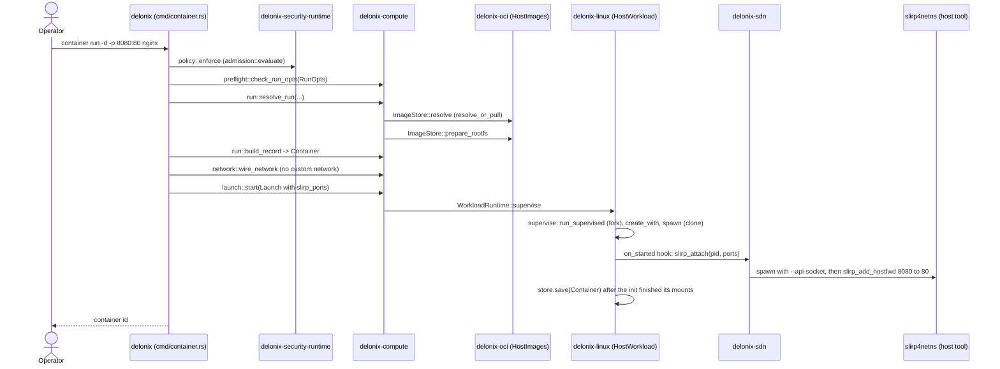
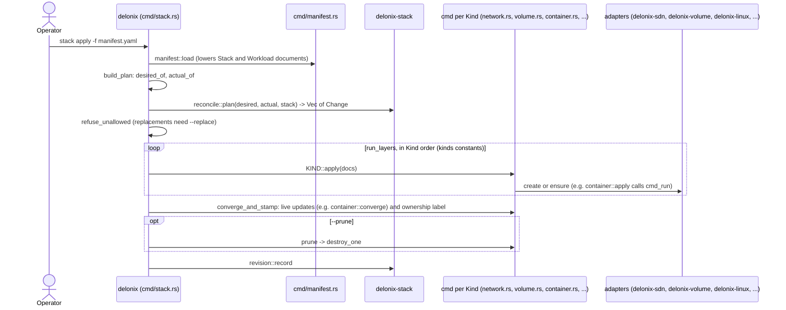
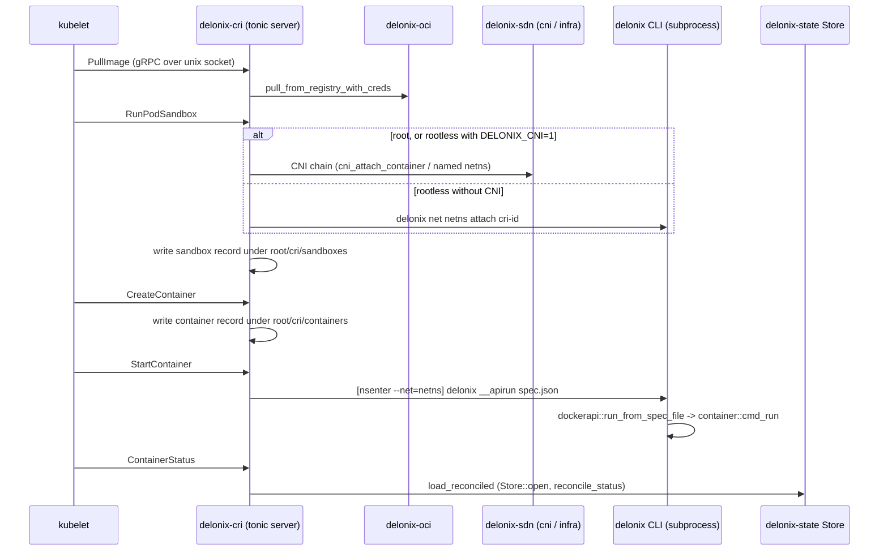

<!-- translated-from: crates.md sha256:7cf95952ecf9b721f67f7f193df0b680bdffce7891f98512953820df6d6bdb36 -->
# Os crates

Esta página é o mapa que tens aberto enquanto lês o código. A tabela abaixo é
gerada a partir de `Cargo.toml` e de `scripts/arch_fitness.py`; tudo o que vem depois
é escrito à mão, e cada apontador (`path:symbol`) foi lido na árvore antes de ser
escrito. Onde uma afirmação não pôde ser confirmada, não está aqui.

Como a usar:

- Encontra o crate que é dono do que queres mudar (primeiro a camada; ver
  [Arquitectura](architecture.md) para saberes porque existem as camadas e
  para que direcção uma dependência pode apontar).
- Lê a sua lista **Começa a ler em** pela ordem, e depois as suas **Armadilhas**: cada
  uma é uma armadilha que esta base de código já pagou, e o comentário que a regista
  ainda está no ficheiro.
- Antes de acrescentares uma linha `use delonix_…`, consulta a tabela: uma aresta que
  não esteja na coluna «Depends on» vai falhar o `scripts/arch_fitness.py` a menos que
  vá na direcção permitida.

Duas convenções que vais encontrar em todo o lado:

- **Puro versus efeito.** Os crates de contexto e de fundação decidem; os adaptadores
  tocam no kernel, no disco, num subprocesso ou na rede. Quando um caso de uso num
  contexto precisa de um efeito, declara uma *porta* (um trait) e um adaptador
  implementa-a. A raiz de composição que liga as portas aos adaptadores é o binário
  `delonix`.
- **«Fala com» significa o mecanismo, não só a dependência.** Um crate pode depender
  de outro e mesmo assim chegar-lhe correndo o binário `delonix` como subprocesso (o
  CRI e a API de gestão local fazem isto para tudo o que faça fork), ou escrevendo
  uma linha num socket de controlo unix (o holder de rede).

## Tabela de referência

<!-- dev-docs:begin crates-table -->
| Crate | Camada | Caminho | Binários | Depende de (crates do motor) | Usado por |
|---|---|---|---|---|---|
| `delonix-model` | Foundation | `crates/foundation/delonix-model` | — | — | `delonix-compute`, `delonix-cri`, `delonix-linux`, `delonix-mcp`, `delonix-mgmt`, `delonix-node`, `delonix-oci`, `delonix-proxmox`, `delonix-runtime-bin`, `delonix-scanner`, `delonix-sdn`, `delonix-security-runtime`, `delonix-stack`, `delonix-state`, `delonix-truenas`, `delonix-vm`, `delonix-volume` |
| `delonix-net-rules` | Foundation | `crates/foundation/delonix-net-rules` | — | — | `delonix-sdn`, `delonix-vm` |
| `delonix-compute` | Contexts | `crates/contexts/delonix-compute` | — | `delonix-model`, `delonix-node` | `delonix-cri`, `delonix-linux`, `delonix-mcp`, `delonix-mgmt`, `delonix-oci`, `delonix-proxmox`, `delonix-runtime-bin`, `delonix-sdn`, `delonix-state`, `delonix-vm`, `delonix-volume` |
| `delonix-node` | Contexts | `crates/contexts/delonix-node` | — | `delonix-model` | `delonix-compute`, `delonix-cri`, `delonix-linux`, `delonix-mcp`, `delonix-mcp-bin`, `delonix-mgmt`, `delonix-mgmt-bin`, `delonix-oci`, `delonix-runtime-bin`, `delonix-sdn`, `delonix-security-runtime`, `delonix-state`, `delonix-vm`, `delonix-volume` |
| `delonix-security-runtime` | Contexts | `crates/contexts/delonix-security-runtime` | — | `delonix-model`, `delonix-node` | `delonix-runtime-bin` |
| `delonix-stack` | Contexts | `crates/contexts/delonix-stack` | — | `delonix-model` | `delonix-runtime-bin` |
| `delonix-linux` | Adapters | `crates/adapters/delonix-linux` | — | `delonix-compute`, `delonix-model`, `delonix-node`, `delonix-state` | `delonix-cri`, `delonix-mcp`, `delonix-mgmt`, `delonix-runtime-bin` |
| `delonix-oci` | Adapters | `crates/adapters/delonix-oci` | — | `delonix-compute`, `delonix-model`, `delonix-node`, `delonix-state` | `delonix-cri`, `delonix-mgmt`, `delonix-runtime-bin`, `delonix-scanner` |
| `delonix-scanner` | Adapters | `crates/adapters/delonix-scanner` | — | `delonix-model`, `delonix-oci` | `delonix-mgmt`, `delonix-runtime-bin` |
| `delonix-sdn` | Adapters | `crates/adapters/delonix-sdn` | — | `delonix-compute`, `delonix-model`, `delonix-net-rules`, `delonix-node`, `delonix-state` | `delonix-cri`, `delonix-mcp`, `delonix-mgmt`, `delonix-runtime-bin` |
| `delonix-state` | Adapters | `crates/adapters/delonix-state` | — | `delonix-compute`, `delonix-model`, `delonix-node` | `delonix-cri`, `delonix-linux`, `delonix-mcp`, `delonix-mgmt`, `delonix-oci`, `delonix-runtime-bin`, `delonix-sdn`, `delonix-vm`, `delonix-volume` |
| `delonix-telemetry` | Adapters | `crates/adapters/delonix-telemetry` | — | — | `delonix-cri`, `delonix-mcp-bin`, `delonix-mgmt`, `delonix-mgmt-bin`, `delonix-runtime-bin` |
| `delonix-vm` | Adapters | `crates/adapters/delonix-vm` | — | `delonix-compute`, `delonix-model`, `delonix-net-rules`, `delonix-node`, `delonix-state` | `delonix-mcp`, `delonix-mgmt`, `delonix-proxmox`, `delonix-runtime-bin` |
| `delonix-volume` | Adapters | `crates/adapters/delonix-volume` | — | `delonix-compute`, `delonix-model`, `delonix-node`, `delonix-state` | `delonix-mcp`, `delonix-mgmt`, `delonix-runtime-bin` |
| `delonix-proxmox` | Providers | `crates/providers/delonix-proxmox` | — | `delonix-compute`, `delonix-model`, `delonix-vm` | `delonix-runtime-bin` |
| `delonix-truenas` | Providers | `crates/providers/delonix-truenas` | — | `delonix-model` | `delonix-runtime-bin` |
| `delonix-cri` | Interfaces | `crates/interfaces/delonix-cri` | `delonix-cri` | `delonix-compute`, `delonix-linux`, `delonix-model`, `delonix-node`, `delonix-oci`, `delonix-sdn`, `delonix-state`, `delonix-telemetry` | — |
| `delonix-mcp` | Interfaces | `crates/interfaces/delonix-mcp` | — | `delonix-compute`, `delonix-linux`, `delonix-mgmt`, `delonix-model`, `delonix-node`, `delonix-sdn`, `delonix-state`, `delonix-vm`, `delonix-volume` | `delonix-mcp-bin` |
| `delonix-mgmt` | Interfaces | `crates/interfaces/delonix-mgmt` | — | `delonix-compute`, `delonix-linux`, `delonix-model`, `delonix-node`, `delonix-oci`, `delonix-scanner`, `delonix-sdn`, `delonix-state`, `delonix-telemetry`, `delonix-vm`, `delonix-volume` | `delonix-mcp`, `delonix-mgmt-bin`, `delonix-runtime-bin` |
| `delonix-mcp-bin` | Binaries | `bins/delonix-mcp-bin` | `delonix-mcp` | `delonix-mcp`, `delonix-node`, `delonix-telemetry` | — |
| `delonix-mgmt-bin` | Binaries | `bins/delonix-mgmt-bin` | `delonix-mgmt` | `delonix-mgmt`, `delonix-node`, `delonix-telemetry` | — |
| `delonix-runtime-bin` | Binaries | `bins/delonix-runtime-bin` | `delonix` | `delonix-compute`, `delonix-linux`, `delonix-mgmt`, `delonix-model`, `delonix-node`, `delonix-oci`, `delonix-proxmox`, `delonix-scanner`, `delonix-sdn`, `delonix-security-runtime`, `delonix-stack`, `delonix-state`, `delonix-telemetry`, `delonix-truenas`, `delonix-vm`, `delonix-volume` | — |
<!-- dev-docs:end crates-table -->

## Fundação

Os crates de fundação não carregam mecanismo: tipos, regras puras e o formato do
estado em disco. Só podem depender de outros crates de fundação. Os ficheiros que guardam esses
registos não estão aqui: são lidos e escritos pelo adapter `delonix-state`.

### `delonix-runtime-core`

**Propósito.** O vocabulário partilhado do motor: os registos persistidos
(`Container`, `Vm`), o seu `Status`, e o tipo de erro que cada crate devolve (definido em
`delonix-model` e re-exportado aqui com o mesmo caminho). Guarda também as pequenas
peças transversais de que mais do que um crate precisa e que de outra forma seriam
copiadas: a verificação `SO_PEERCRED` para sockets locais, o registo de eventos só de
acrescento, e a regra que um binário de servidor segue quando o `delonix` o corre.
**Não** cria processos, não monta, nem configura a rede, e não tem noção de inquilino,
plano ou faturação (o doc do crate di-lo, e o resto do workspace conta com isso).

Os stores (`Store`, `JsonStore<T>`), os auxiliares de escrita atómica e o store de
segredos cifrado (`SecretStore`, `CredVault`) **saíram deste crate** para o `delonix-state`
(ADR-0040 P3); o modelo puro de segredos (`Secret`, `valid_name`, `valid_env_key`,
`parse_env_file`) foi para o `delonix-model`. Nada disso é re-exportado aqui:
o `src/lib.rs` re-exporta apenas `delonix_model::{Error, Result}`, por isso um sítio de
chamada que usava `delonix_runtime_core::Store` importa agora `delonix_state::Store`.

**Módulos principais**

| Módulo | Responsabilidade |
|---|---|
| `lib.rs` | `Container`, `Vm`, `Status`, `Mount`, `ContainerFw`/`FwRule`, config de saúde, análise do cgroup-parent, `generate_id`, auxiliares de vivacidade de pid |
| `events` | registo de eventos `events.jsonl` só de acrescento (`emit`, `read`) |
| `dispatch` | verificação de versão e resolução da CLI para binários de servidor corridos pelo `delonix` |
| `peer_cred` | `peer_uid` a partir de `SO_PEERCRED` |
| `typestate` | fases do ciclo de vida em tempo de compilação (`Phase<Created/Running/Stopped>`) |
| `virt` | detecção de virtualização/virtio a partir de `/sys` e `/proc` |
| `workload_net` | o intervalo IPv4 das cargas, definido uma única vez |

**API pública principal**

| Item | O que é | Onde |
|---|---|---|
| `Container` | o registo de container que tudo lê e escreve | `crates/foundation/delonix-runtime-core/src/lib.rs:Container` |
| `Vm` | o registo de VM | `crates/foundation/delonix-runtime-core/src/lib.rs:Vm` |
| `Status` | estado do ciclo de vida de uma carga | `crates/foundation/delonix-runtime-core/src/lib.rs:Status` |
| `Error`, `Result` | o erro que cada crate do motor devolve, re-exportado de `delonix-model` | `crates/foundation/delonix-runtime-core/src/lib.rs` (`pub use delonix_model::{Error, Result}`) |
| `events::emit` | acrescenta uma linha de evento | `crates/foundation/delonix-runtime-core/src/events.rs:emit` |
| `dispatch::check_version`, `dispatch::cli_bin` | como o `delonix-cri`/`-mgmt`/`-mcp` recusam uma release que não bate certo e encontram a CLI `delonix` para voltar a correr | `crates/foundation/delonix-runtime-core/src/dispatch.rs` |
| `is_alive`, `proc_starttime`, `safe_to_signal` | verificações de pid que sobrevivem à reciclagem de pids | `crates/foundation/delonix-runtime-core/src/lib.rs` |

**Fala com.** Só `delonix-model`, pelo `Error`/`Result` que re-exporta. Sem
subprocessos: a detecção lê `/sys` e `/proc` directamente.

**Dependências externas relevantes.** `serde`/`serde_json` (os tipos de registo
derivam-nos), `thiserror`, `libc`. As dependências de cifra (`chacha20poly1305`,
`getrandom`) mudaram-se com o store de segredos para o `delonix-state`.

**Testes.** Módulos `#[cfg(test)]` inline nos ficheiros-fonte; sem directório `tests/`.

**Começa a ler em.** `src/lib.rs` (as structs `Container` e `Vm`), depois
`src/dispatch.rs`. Para a forma como os registos são guardados, vê o `delonix-state`.

**Armadilhas.**

- `Container.userns` diz se o container **criou** o seu próprio user namespace, e não
  se corre num diferente. As cargas que se juntam ao user namespace do holder de rede
  têm `userns = false` e estão mesmo assim num user namespace diferente do do
  chamador. O `mount_live` em `delonix-linux` regista isto e abre sempre o namespace
  `user` em vez de confiar no campo
  (`crates/adapters/delonix-linux/src/lib.rs:mount_live`).
- `Container.ip` é o endereço só na rede **primária**; um container multi-homed tem
  mais (ver o doc comment de `NetPlan` em `crates/adapters/delonix-sdn/src/infra.rs` e
  `apply_firewall_all`, que existe porque aplicar a firewall só ao IP primário era
  contornável).
- A descrição do crate no `Cargo.toml` ainda diz que ele guarda o "Secret Manager"
  e o "Store", e o doc do crate em `src/lib.rs` ainda diz "shared types,
  state and errors". Ambos são anteriores à mudança para o `delonix-state`; a lista de
  módulos é a referência.
- `Container::cgroup()` é o caminho estático do modo root. Para um container rootless
  a correr, o cgroup real é lido de `/proc/<pid>/cgroup` por
  `delonix_linux::live_cgroup`.

### `delonix-model`

**Propósito.** A parte do modelo que qualquer camada pode nomear sem depender de um
mecanismo: o tipo `Error` partilhado do motor com o código `DX_*` estável de cada
variante, os nomes de carga gerados, e o mapeamento de um `Error` para um código de
saída de processo, o dicionário de códigos numerados `DX-CDNN`, e o modelo de segredos (o que
é um segredo e como são um nome e uma chave válidos). Puro — sem I/O, sem estado de processo
(doc do crate). Não guarda registos; esses estão em `delonix-runtime-core`, e os
ficheiros que os guardam estão em `delonix-state`.

**Módulos principais**

| Módulo | Responsabilidade |
|---|---|
| `error` | `Error`, `Result`, e `Error::code` (a string `DX_*` de cada variante) |
| `exitcode` | classes de códigos de saída (`NOT_RUNNING`, `NOT_FOUND`, `CONFLICT`, …) e `for_error` |
| `names` | nomes por omissão (`derived_name`, `random_name`) |
| `codes` | o dicionário de códigos numerados `DX-CDNN` (ADR-0043): dígito de classe, dígito de domínio, número |
| `secret` | `Secret` e as regras puras `valid_name`, `valid_env_key`, `parse_env_file`; o store cifrado é o `delonix-state` |

**API pública principal**

| Item | O que é | Onde |
|---|---|---|
| `Error::code` | o código de máquina estável (`DX_*`) de um erro | `crates/foundation/delonix-model/src/error.rs:code` |
| `exitcode::for_error` | o único sítio onde um `Error` se torna um código de saída | `crates/foundation/delonix-model/src/exitcode.rs:for_error` |
| `exitcode::merge` | o código para um lote de resultados | `crates/foundation/delonix-model/src/exitcode.rs:merge` |
| `names::derived_name` | nome determinístico a partir de um id | `crates/foundation/delonix-model/src/names.rs:derived_name` |
| `secret::Secret`, `secret::parse_env_file` | o registo de segredo e o parser de ficheiros `KEY=value`, usados pelo `delonix-compute` sem depender de um adapter | `crates/foundation/delonix-model/src/secret.rs` |

**Fala com.** Nenhum outro crate do motor: é agora uma raiz do grafo, e o
`delonix-runtime-core` depende dele (a dependência apontava antes no sentido
contrário). A CLI re-exporta os dois módulos como `cmd::exitcode` e `cmd::names`
(`bins/delonix-runtime-bin/src/cmd/mod.rs`), por isso os sítios de chamada mais
antigos não mudaram.

**Dependências externas relevantes.** `thiserror` (o derive do `Error`), `serde_json`
(a variante `Error::Json` envolve `serde_json::Error`) e `serde` (o derive do
`Secret`).

**Testes.** Testes unitários inline.

**Começa a ler em.** `src/exitcode.rs` (o doc do módulo explica porque existem
classes), depois `src/names.rs`.

**Armadilhas.** O `match` em `for_error` é exaustivo de propósito: uma variante nova
de `Error` tem de ser classificada aqui ou o build falha.

### `delonix-net-rules`

**Propósito.** Regras de rede que podem ser calculadas sem tocar no kernel: nomes de
bridge, derivação de IP dentro de um prefixo, o tipo de valor `Cidr`, correspondência
de labels, análise da saída de `iptables-save`. Tem **zero dependências**, por isso
qualquer chamador consegue compilar as mesmas regras que o motor usa. Exclui
deliberadamente tudo o que lê estado partilhado (a alocação de IPs lê o registo de
IPAM, por isso fica em `delonix-sdn`).

**Módulos principais.** Um único `lib.rs`.

**API pública principal**

| Item | O que é | Onde |
|---|---|---|
| `Cidr` | tipo de prefixo IPv4, sem crate externo | `crates/foundation/delonix-net-rules/src/lib.rs:Cidr` |
| `bridge_name` | a única fórmula para o nome do dispositivo bridge de uma rede | `crates/foundation/delonix-net-rules/src/lib.rs:bridge_name` |
| `derive_ip_in`, `valid_ip_in_subnet` | endereço preferido para um id, e verificação de pertença | `crates/foundation/delonix-net-rules/src/lib.rs` |
| `matches_labels` | correspondência de selectores de labels (usada pelo `kind: Service`) | `crates/foundation/delonix-net-rules/src/lib.rs:matches_labels` |
| `parse_overlay_peer` | analisa a especificação de um par de overlay | `crates/foundation/delonix-net-rules/src/lib.rs:parse_overlay_peer` |

**Fala com.** Nada. O `delonix-sdn` re-exporta os seus itens, por isso os chamadores de
`delonix_sdn::Cidr` etc. continuam a compilar.

**Dependências externas relevantes.** Nenhuma.

**Testes.** Testes unitários inline.

**Começa a ler em.** `src/lib.rs` — o doc do módulo lista o que ficou de fora e porquê.

**Armadilhas.** Partes do doc do módulo ainda estão em português (dívida LANG-01); o
código é a referência.

## Contextos

Um contexto é dono das decisões de um domínio e das portas de que os seus casos de uso
precisam. Nenhum contexto toca no kernel.

### `delonix-compute`

**Propósito.** O contexto Compute (`compute.delonix.io`): a especificação de execução
para a qual cada ponto de entrada traduz (`RunOpts`), e o caso de uso `container run`
como passos puros sobre portas — preflight, resolver, construir o registo, ligar a
rede, arrancar. Guarda também os tipos da especificação de Pod e a sua tradução para
`RunOpts`. **Não** lança processos, não faz pull de imagens nem configura redes; chama
traits que os adaptadores implementam.

**Módulos principais**

| Módulo | Responsabilidade |
|---|---|
| `run_opts` | `RunOpts`, a única especificação de execução |
| `preflight` | recusa combinações de flags que não significam nada, antes de qualquer efeito |
| `run` | `resolve_run` (através de portas) e `build_record` (puro) |
| `network` | a fase de rede: `attach_custom_network`, `wire_network` |
| `launch` | intenção `Launch`, porta `WorkloadRuntime`, caso de uso `start`, política de reinício |
| `ports` | `ImageStore`, `StorageProvider`, `DeviceResolver`, `RunHost`, `NetworkProvider`, `VmNetwork` |
| `pod` | tipos da spec de Pod e `pod_to_run_opts`/`container_to_run_opts` |
| `notice` | `Notice`, um aviso devolvido como dados em vez de impresso |

**API pública principal**

| Item | O que é | Onde |
|---|---|---|
| `RunOpts` | a especificação de execução | `crates/contexts/delonix-compute/src/run_opts.rs:RunOpts` |
| `preflight::check_run_opts` | recusa pura de combinações impossíveis | `crates/contexts/delonix-compute/src/preflight.rs:check_run_opts` |
| `run::resolve_run` | resolve imagem, volumes, dispositivos, utilizador e defaults através de portas | `crates/contexts/delonix-compute/src/run.rs:resolve_run` |
| `run::build_record` | transforma spec + resolução num `Container` (puro) | `crates/contexts/delonix-compute/src/run.rs:build_record` |
| `network::wire_network` | publica portas, regista rede/IP, isolamento de namespace, shaping — antes do arranque | `crates/contexts/delonix-compute/src/network.rs:wire_network` |
| `launch::start` | arranque supervisionado ou directo, e limpeza de um arranque que nunca aconteceu | `crates/contexts/delonix-compute/src/launch.rs:start` |
| `launch::WorkloadRuntime` | porta que transforma um `Launch` num processo | `crates/contexts/delonix-compute/src/launch.rs:WorkloadRuntime` |
| `ports::NetworkProvider` | porta para attach/publish/firewall/shaping | `crates/contexts/delonix-compute/src/ports.rs:NetworkProvider` |
| `ports::VmNetwork` | porta para o tap de uma VM na rede rootless | `crates/contexts/delonix-compute/src/ports.rs:VmNetwork` |

**Fala com.** Só `delonix-runtime-core`, por chamada directa. Tudo o resto chega
através das suas portas, implementadas em adaptadores:

| Porta | Implementada por |
|---|---|
| `ImageStore` | `crates/adapters/delonix-oci/src/run_images.rs:HostImages` |
| `StorageProvider` | `crates/adapters/delonix-volume/src/lib.rs:HostVolumes` |
| `DeviceResolver` | `crates/adapters/delonix-linux/src/cdi.rs:HostDevices` |
| `RunHost` | `crates/adapters/delonix-linux/src/run_host.rs:HostRuntime` |
| `WorkloadRuntime` | `crates/adapters/delonix-linux/src/workload.rs:HostWorkload` |
| `NetworkProvider` | `crates/adapters/delonix-sdn/src/run_network.rs:HostNetwork` |
| `VmNetwork` | `crates/adapters/delonix-sdn/src/vm_network.rs:HostVmNetwork` |

**Dependências externas relevantes.** `serde`, `schemars` (comentário do Cargo.toml:
os tipos de spec derivam o seu JSON Schema ao lado da sua definição, para que o schema
publicado não possa divergir dos tipos).

**Testes.** Testes unitários inline com implementações falsas das portas (`FakeNet`,
`FakeRuntime`, `Fake` em `network.rs`, `launch.rs`, `run.rs`) — o caso de uso é testado
sem kernel.

**Começa a ler em.** `src/ports.rs`, depois `src/run.rs`, depois `src/launch.rs`.

**Armadilhas.**

- Existem dois itens chamados `ImageStore`: o trait de porta
  `delonix_compute::ports::ImageStore` e o store concreto `delonix_oci::ImageStore`
  (uma struct). O `HostImages` adapta o segundo ao primeiro. Os caminhos de import
  importam.
- O `wire_network` tem de correr **antes** de `launch::start`; o doc do seu módulo
  regista que, caso contrário, um `-d` supervisionado perdia as definições de rede.

### `delonix-stack`

**Propósito.** O contexto Stack (`core.delonix.io`): a tabela de Kinds e os seus
factos, o reconciliador de três vias que planeia um manifesto contra o que existe, e o
histórico de revisões de um apply. Planear é puro — nada aqui abre o store de um
recurso concreto nem corre um comando (doc do crate). Carregar manifestos e aplicar
cada Kind ficam na CLI.

**Módulos principais**

| Módulo | Responsabilidade |
|---|---|
| `kinds` | constantes dos nomes de Kind e `KindFacts` (domínio, forma, converge, teardown, namespaced, presença) |
| `reconcile` | `Desired`/`Actual`/`Change`, `plan`, a label de posse e a anotação last-applied |
| `revision` | regista e lista revisões de apply (para rollback) |
| `condition` | o tipo `Condition` |

**API pública principal**

| Item | O que é | Onde |
|---|---|---|
| `kinds::facts`, `kinds::stack_kinds`, `kinds::converges` | a tabela única que a CLI consulta por Kind | `crates/contexts/delonix-stack/src/kinds.rs` |
| `reconcile::plan` | desejado vs actual → `Vec<Change>` | `crates/contexts/delonix-stack/src/reconcile.rs:plan` |
| `reconcile::STACK_LABEL`, `LAST_APPLIED` | label de posse e anotação do diff de três vias | `crates/contexts/delonix-stack/src/reconcile.rs` |
| `reconcile::hot_fields_for` | que mudanças de campos podem ser aplicadas ao vivo | `crates/contexts/delonix-stack/src/reconcile.rs:hot_fields_for` |
| `revision::record`, `revision::list` | histórico de apply | `crates/contexts/delonix-stack/src/revision.rs` |

**Fala com.** Só `delonix-runtime-core`. A CLI re-exporta `kinds`, `reconcile` e
`revision` como `cmd::kinds` etc. (`bins/delonix-runtime-bin/src/cmd/mod.rs`).

**Dependências externas relevantes.** `serde`, `serde_json`.

**Testes.** Testes unitários inline (planos como dados).

**Começa a ler em.** `src/kinds.rs`, depois `src/reconcile.rs`, depois
`bins/delonix-runtime-bin/src/cmd/stack.rs` para o veres consumido.

**Armadilhas.** Acrescentar um Kind não é só uma linha em `kinds.rs`: a CLI tem código
por Kind (`desired_of`/`actual_of`, `converge_and_stamp`, `destroy_one` em
`cmd/stack.rs`) e tabelas de schema/completação com os seus próprios testes. Corre a
bateria completa de testes do `delonix-runtime-bin` depois de mexeres na tabela.

### `delonix-security-runtime`

**Propósito.** As **decisões** de segurança do nó: o ficheiro de política, a avaliação
única de admissão para containers e VMs, o evento de segurança, uma pontuação de
postura explicável, e a redacção de segredos em texto. Funções puras dos seus
argumentos. Deliberadamente não tem sensores, watchers nem processo residente (doc do
crate: daemonless por desenho), nem nenhum campo de inquilino, projecto ou ambiente em
lado nenhum.

**Módulos principais**

| Módulo | Responsabilidade |
|---|---|
| `policy` | `SecurityPolicy`, `Mode`, lints |
| `admission` | `Request`, `evaluate`, `Decision`, `Violation` |
| `event` | `SecurityEvent` no registo de eventos do motor |
| `score` | `Score` com deduções e razões |
| `redact` | redacção de chaves/valores sensíveis em input hostil |
| `severity` | `Severity`, `ActionRisk`, `Confidence` |

**API pública principal**

| Item | O que é | Onde |
|---|---|---|
| `SecurityPolicy::parse` | carrega uma política | `crates/contexts/delonix-security-runtime/src/policy.rs:SecurityPolicy` |
| `admission::evaluate` | decide um pedido | `crates/contexts/delonix-security-runtime/src/admission.rs:evaluate` |
| `admission::Request` | input de admissão de container ou VM | `crates/contexts/delonix-security-runtime/src/admission.rs:Request` |
| `redact::redact_text` | mascara segredos em texto | `crates/contexts/delonix-security-runtime/src/redact.rs:redact_text` |

**Fala com.** `delonix-runtime-core` (`events`, `now_unix`). Consumido pela CLI através
de `bins/delonix-runtime-bin/src/cmd/policy.rs`, que o `cmd_run` chama antes de
qualquer imagem ser resolvida.

**Dependências externas relevantes.** `serde`, `serde_json`.

**Testes.** Testes unitários inline, incluindo um módulo `boundary_tests` em `lib.rs` e
um doc-test no doc do crate.

**Começa a ler em.** `src/lib.rs` (doc do crate), `src/admission.rs`, `src/policy.rs`.

**Armadilhas.** Nenhuma além do doc do crate: não acrescentes aqui um sensor em
background — o doc explica porque é que um controlo inerte em modo rootless é pior do
que nenhum.

## Adaptadores

Os adaptadores são onde o motor encontra o kernel, o disco, as ferramentas do host e os
registos remotos. Dependem da fundação e dos contextos, nunca uns dos outros (as
excepções declaradas estão listadas em [Arquitectura](architecture.md)).

### `delonix-linux`

**Propósito.** O runtime de containers de baixo nível: `clone` com namespaces,
`pivot_root`, cgroups v2, capabilities e seccomp, `exec` via `setns`, parar e remover,
e o supervisor destacado por trás de `run -d`. O doc do crate enuncia a regra: a
fronteira de syscalls para containers vive aqui. Não resolve imagens, não analisa flags
da CLI nem configura a rede; os efeitos de rede chegam como hooks vindos do chamador.

**Módulos principais**

| Módulo | Responsabilidade |
|---|---|
| `lib.rs` | `RunSpec`, `create_with`/`spawn`, `container_init`, preparação do rootfs e mount do overlay, `exec`, `stop`, `remove`, mounts ao vivo, cgroups, `reconcile_status` |
| `workload` | `HostWorkload`, a implementação da porta `WorkloadRuntime` |
| `launch_spec` | `run_spec`, o único construtor de `RunSpec` a partir de um `Launch` |
| `supervise` | `run_supervised`, o pai com fork de um container destacado |
| `capabilities` | tabela nome↔número de capabilities e conjunto por omissão |
| `seccomp_profile` | carregamento de perfis seccomp OCI |
| `cdi` | consumidor de specs de dispositivos CDI (`HostDevices`) |
| `run_host` | `HostRuntime`, a implementação da porta `RunHost` |
| `regulate`, `resource_advice`, `workload_view` | pressão de recursos, conselhos ao host, vista pedido-vs-imposto |

**API pública principal**

| Item | O que é | Onde |
|---|---|---|
| `RunSpec` | tudo o que um spawn precisa | `crates/adapters/delonix-linux/src/lib.rs:RunSpec` |
| `create_with` | arranca um container (chama `spawn`) | `crates/adapters/delonix-linux/src/lib.rs:create_with` |
| `exec` | corre um comando dentro de um container a correr | `crates/adapters/delonix-linux/src/lib.rs:exec` |
| `stop`, `remove` | ciclo de vida | `crates/adapters/delonix-linux/src/lib.rs` |
| `reconcile_status` | actualiza um registo contra o processo vivo | `crates/adapters/delonix-linux/src/lib.rs:reconcile_status` |
| `mount_live`, `update_limits`, `set_frozen` | mudanças a quente num container a correr | `crates/adapters/delonix-linux/src/lib.rs` |
| `mount_overlay_if_marked` | mount do overlay com a API de mount nova | `crates/adapters/delonix-linux/src/lib.rs:mount_overlay_if_marked` |
| `supervise::run_supervised` | supervisor destacado | `crates/adapters/delonix-linux/src/supervise.rs:run_supervised` |
| `workload::HostWorkload` | adaptador de `WorkloadRuntime` | `crates/adapters/delonix-linux/src/workload.rs:HostWorkload` |

**Fala com.** `delonix-runtime-core`, `delonix-compute` e `delonix-state` (`Store`,
`SecretStore`, `write_private_temp`; uma excepção de camadas declarada, removida na P4 do ADR-0040), por chamada directa.
Syscalls através de `nix`, `libc` e `rustix`. Ferramentas do host que corre: `busctl`
(scopes do systemd para o cgroup parent do kubelet), `apparmor_parser`, `ldconfig`,
`nvidia-smi`. O slirp para `-p` não é arrancado aqui: o `HostWorkload` recebe um hook
`attach_slirp` que a CLI preenche com `delonix_sdn::slirp_attach`
(`bins/delonix-runtime-bin/src/cmd/container.rs:with_host_workload`).

**Dependências externas relevantes.** `nix`, `libc`, `seccompiler`; `rustix` com
`mount`/`fs` (comentário do Cargo.toml: o `nix` não tem wrapper para
`fsopen`/`fsconfig`/`fsmount`/`move_mount`, necessários para evitar o limite do tamanho
de página do argumento de dados do `mount(2)` clássico); `serde_yaml` para specs CDI.

**Testes.** Módulos de testes unitários inline em `lib.rs` e nos ficheiros dos módulos;
testes de integração em `crates/adapters/delonix-linux/tests/` (`cgroup_parent.rs`,
`advisor_fixtures.rs`).

**Começa a ler em.** `src/workload.rs`, depois `src/launch_spec.rs`, depois
`src/lib.rs` desde `RunSpec` através de `spawn` e `container_init`.

**Armadilhas.**

- O `spawn` não devolve, e o registo não é guardado com um `pid`, até o init ter
  terminado os seus mounts; o comentário antes do `store.save` em `spawn` explica a
  corrida com a raiz do host que isto fecha. Não movas esse save para mais cedo.
- O `supervise::run_supervised` e o handshake rootless assumem um chamador com uma só
  thread (`fork`). É por isso que os servidores com várias threads (o CRI, a API de
  gestão, o shim da API Docker) correm o binário `delonix` em vez de chamarem este
  crate para arrancar containers.
- Usa `live_cgroup(container)`, e não `container.cgroup()`, para um container rootless
  a correr.

### `delonix-oci`

**Propósito.** Imagens OCI: um store de blobs endereçado por conteúdo, o store de
imagens e os seus metadados, pull/push do registo com autenticação, preparação do
rootfs por container (camadas de overlay partilhadas), análise de Dockerfile/Delonixfile
e auxiliares de build, planeamento de Cloud Native Buildpacks, load/save de arquivos, e
assinatura/verificação. Não corre containers; um build corre os seus passos através da
CLI.

**Módulos principais**

| Módulo | Responsabilidade |
|---|---|
| `cas` | `Cas`, blobs endereçados por sha256 |
| `image` | `Image`, `ImageConfig`, `ImageStore` |
| `registry` | análise de referências, `resolve_or_pull`, pull/push, artefactos OCI |
| `overlay` | `prepare_container_rootfs`, `prepare_overlay`, `existing_rootfs_path` |
| `build` | parser de Dockerfile (`parse_dockerfile`), estágios, `commit_flat_rootfs` |
| `run_images` | `HostImages`, a porta `ImageStore` do compute |
| `auth` | credenciais do registo (`login`/`lookup`) |
| `load`, `save` | arquivo Docker à entrada, arquivo OCI à saída |
| `sign` | `sign_image`, `verify_signature` (ECDSA P-256) |
| `buildpack`, `detect`, `internal_registry` | plano CNB, detecção de linguagem, registo descartável |
| `rootfs_user` | resolução de `--user` contra um rootfs |

**API pública principal**

| Item | O que é | Onde |
|---|---|---|
| `ImageStore` | abrir, resolver, listar, remover imagens | `crates/adapters/delonix-oci/src/image.rs:ImageStore` |
| `registry::resolve_or_pull` | imagem local ou pull | `crates/adapters/delonix-oci/src/registry.rs:resolve_or_pull` |
| `pull_from_registry_with_creds` | pull com credenciais (usado pelo CRI) | `crates/adapters/delonix-oci/src/registry.rs` |
| `ImageStore::prepare_container_rootfs` | rootfs para um id de container | `crates/adapters/delonix-oci/src/overlay.rs` |
| `build::parse_dockerfile` | gramática de Dockerfile/Delonixfile | `crates/adapters/delonix-oci/src/build.rs:parse_dockerfile` |
| `Cas` | store de blobs | `crates/adapters/delonix-oci/src/cas.rs:Cas` |
| `verify_signature` | verificação ao estilo cosign | `crates/adapters/delonix-oci/src/sign.rs:verify_signature` |

**Fala com.** `delonix-runtime-core`, `delonix-compute` (implementa a porta
`ImageStore`), e `delonix-state` (`write_atomic_mode`; uma excepção de camadas
declarada, removida na P4 do ADR-0040). Registos por HTTPS com um cliente `reqwest` bloqueante. Nenhum
subprocesso do host no seu código-fonte.

**Dependências externas relevantes.** `reqwest` (bloqueante, rustls), `oci-spec`
(tipos canónicos de imagens OCI), `sha2`, `tar`, `flate2`, `zstd`, `base64`, `ring`
(verificação de assinaturas); só em dev, `proptest` (robustez do parser em Rust
estável) e `criterion`.

**Testes.** Testes unitários inline; um benchmark em
`crates/adapters/delonix-oci/benches/parse_reference.rs`.

**Começa a ler em.** `src/image.rs`, depois `src/registry.rs` (`resolve_or_pull`),
depois `src/overlay.rs`.

**Armadilhas.**

- `delonix_oci::ImageStore` (struct) não é `delonix_compute::ports::ImageStore`
  (trait); ver `run_images.rs`.
- O rootfs de onde um container arranca é um overlay sobre camadas partilhadas com um
  ficheiro marcador; o mount em si acontece dentro do init do container
  (`delonix_linux::mount_overlay_if_marked`), não aqui.

### `delonix-sdn`

**Propósito.** A SDN rootless e a firewall. Um processo *pin* de vida longa segura um
namespace de user+rede; um processo de *controlo* reiniciável dentro dele serve um
socket de controlo unix e é dono das bridges, das regras nftables, do DHCP e do DNS
interno; um `slirp4netns` liga esse namespace ao host. Cobre também o caminho de slirp
por container para `-p` sem rede custom, o IPAM, a execução de plugins CNI, o overlay
WireGuard e a contabilidade de fluxos eBPF opcional. Re-exporta o `delonix-net-rules`.
Não lança containers.

**Módulos principais**

| Módulo | Responsabilidade |
|---|---|
| `lib.rs` | `NetworkStore`, análise da spec de publish, `slirp_attach`, ceifa de slirps órfãos |
| `infra` | o holder: `ensure_up`, `acquire`, `attach_container`, `publish_port`, `apply_firewall_all`, `network_route`, `vm_attach`, o socket de controlo |
| `run_network` | `HostNetwork` (porta `NetworkProvider`), `publish_with_retry` |
| `vm_network` | `HostVmNetwork` (porta `VmNetwork`) |
| `ipam` | registo de leases de endereços |
| `cni` | conformidade CNI: corre binários de plugins |
| `wg` | WireGuard sobre o overlay |
| `bpf` | contabilidade de fluxos eBPF opcional |
| `discover` | portas à escuta de uma carga a partir de `/proc/<pid>/net` |
| `pin_userns` | os namespaces próprios do pin e os mapas de ids |

**API pública principal**

| Item | O que é | Onde |
|---|---|---|
| `NetworkStore` | registo declarativo de redes | `crates/adapters/delonix-sdn/src/lib.rs:NetworkStore` |
| `parse_publish`, `parse_publish_addr` | gramática de `-p` | `crates/adapters/delonix-sdn/src/lib.rs` |
| `slirp_attach` | o slirp próprio de um container, com forwards do host | `crates/adapters/delonix-sdn/src/lib.rs:slirp_attach` |
| `infra::ensure_up` | sobe o holder (pin + controlo + slirp) | `crates/adapters/delonix-sdn/src/infra.rs:ensure_up` |
| `infra::attach_container` | veth numa rede, lease de IP | `crates/adapters/delonix-sdn/src/infra.rs:attach_container` |
| `infra::apply_firewall_all` | chain por container para cada IP que ele tem | `crates/adapters/delonix-sdn/src/infra.rs:apply_firewall_all` |
| `run_network::HostNetwork` | adaptador de `NetworkProvider` | `crates/adapters/delonix-sdn/src/run_network.rs:HostNetwork` |

**Fala com.** `delonix-runtime-core`, `delonix-net-rules`, `delonix-compute`
(portas), `delonix-state` (`write_atomic`, `write_private_temp`; uma excepção de camadas
declarada, removida na P4 do ADR-0040). Ferramentas do host: `ip`, `nft`, `nsenter`, `slirp4netns`, `conntrack`, `wg`,
binários de plugins CNI. O holder é arrancado re-executando o binário do motor
(`netns pin`, `netns control`, interceptados no `main` da CLI antes da análise de
argumentos — `bins/delonix-runtime-bin/src/main.rs`). Tudo o que tem de acontecer
dentro do namespace é uma linha escrita no socket de controlo
(`infra.rs:control_query`), servida por `handle_control`. Os forwards de portas vão para
o `slirp4netns` pelo seu socket de API (`slirp_add_hostfwd`). O `build.rs` compila o
objecto eBPF só se existirem o `clang` e os headers; o eBPF nunca é obrigatório.

**Dependências externas relevantes.** `libc`, `serde`, `serde_json`, `tracing`; só em
dev, `proptest` para invariantes de alocação de IPs.

**Testes.** Módulos de testes unitários inline; testes de integração em
`crates/adapters/delonix-sdn/tests/`.

**Começa a ler em.** O doc do módulo `src/infra.rs` e `ensure_up`, depois
`attach_container`, depois `src/run_network.rs`.

**Armadilhas.**

- O auxiliar privado `capture()` em `src/lib.rs` devolve o stdout **sem verificar o
  estado de saída**. Lê a sua saída; nunca trates o seu `Ok` como «o comando teve
  sucesso». (O auxiliar com o mesmo nome em `delonix-vm` é diferente: devolve `None` em
  caso de falha.)
- O caminho do socket de controlo deriva do uid **e**, quando o `DELONIX_ROOT` não é o
  de omissão, de um hash dele (`runtime_dir` + `root_suffix`, ADR-0014); o
  `DELONIX_NET_RUNTIME_DIR` sobrepõe-se aos dois. Tudo o que for re-executado através de
  um user namespace tem de levar `runtime_dir_env()` além do `DELONIX_ROOT`; vê como o
  pin é lançado em `infra.rs`. Ao isolar uma corrida de testes, define tanto
  `DELONIX_ROOT` como `DELONIX_NET_RUNTIME_DIR`.
- Uma firewall que só conhece `Container.ip` perde as redes adicionais; usa
  `apply_firewall_all`.

### `delonix-vm`

**Propósito.** MicroVMs e VMs por trás do trait `VmBackend` e de um **registo** de
backends em runtime. O Cloud Hypervisor e o libvirt são os backends locais; um backend
remoto regista-se a partir de fora do crate. É dono dos registos de VM, do boot e do
ciclo de vida, dos snapshots, da geração do seed de cloud-init, e da selecção de backend
(explícita, ficheiro de default, ou auto-detecção). Não tem um cliente HTTP nem
credenciais de provider.

**Módulos principais**

| Módulo | Responsabilidade |
|---|---|
| `lib.rs` | `VmConfig`, `VmBackend`, registo, `CloudHypervisorBackend`, `LibvirtBackend`, `create_with`, `start`/`stop`/`remove`, snapshots, `status`/`list` |
| `cloudinit` | `build_user_data`, `build_network_config`, `generate_seed_iso` |

**API pública principal**

| Item | O que é | Onde |
|---|---|---|
| `VmBackend` | a porta de backend (`boot`, `stop`, `destroy`, `resume`, `snapshot`, `ip`, `manages_own_storage`, `auto_selectable`, …) | `crates/adapters/delonix-vm/src/lib.rs:VmBackend` |
| `register_backend`, `BackendRegistration` | acrescenta um backend por factory | `crates/adapters/delonix-vm/src/lib.rs` |
| `set_network` | regista a porta `VmNetwork` uma vez por processo | `crates/adapters/delonix-vm/src/lib.rs:set_network` |
| `VmConfig` | o que criar | `crates/adapters/delonix-vm/src/lib.rs:VmConfig` |
| `create_with`, `start`, `stop`, `remove`, `status`, `list` | ciclo de vida | `crates/adapters/delonix-vm/src/lib.rs` |
| `snapshot`, `restore`, `snapshots`, `delete_snapshot` | checkpoints | `crates/adapters/delonix-vm/src/lib.rs` |
| `valid_vm_name` | validação do nome na fronteira do motor | `crates/adapters/delonix-vm/src/lib.rs:valid_vm_name` |

**Fala com.** `delonix-runtime-core`, `delonix-compute` (a porta `VmNetwork`),
`delonix-net-rules`, `delonix-state` (`JsonStore<Vm>`, `write_atomic`; uma excepção de
camadas declarada, removida na P4 do ADR-0040). Ferramentas do host: `cloud-hypervisor` (e a sua API HTTP num
socket unix, p. ex. `PUT /api/v1/vm.pause`), `virsh`, `qemu-img`, `cloud-localds`, `sh`.
A rede só é alcançada através do `VmNetwork` registado; a CLI regista
`delonix_sdn::vm_network::HostVmNetwork` no arranque
(`bins/delonix-runtime-bin/src/main.rs`).

**Dependências externas relevantes.** `libc`, `tracing` — deliberadamente poucas.

**Testes.** Módulos de testes unitários inline em `lib.rs`.

**Começa a ler em.** O `VmBackend` e o registo em `src/lib.rs`, depois `create_with`,
depois um backend (`CloudHypervisorBackend`).

**Armadilhas.**

- Para o Cloud Hypervisor o IP é **calculado** a partir do MAC, não observado
  (`VmNetwork::lease_ip`, `ip_is_predicted`). Um IP previsto não é prova de que o
  convidado arrancou.
- A saída das ferramentas é analisada com um locale `C` fixado (`stable_cmd`); usa-o
  para qualquer chamada nova a uma ferramenta do host cuja saída analises.
- `stop` e `destroy` são métodos distintos do trait: para um backend remoto, destruir
  também remove o disco.

### `delonix-volume`

**Propósito.** Volumes nomeados (`<root>/volumes/<name>/_data`) e bind mounts,
incluindo a gramática de `-v`, quotas e medição de uso, volumes suportados por rede
(NFS/CIFS/WebDAV montados por ferramentas do host), partilhas debaixo de um volume pai,
e snapshots. Implementa a porta `StorageProvider` do compute. Não cria um dataset numa
NAS (isso é o `delonix-truenas`).

**Módulos principais.** Um único `lib.rs`.

**API pública principal**

| Item | O que é | Onde |
|---|---|---|
| `VolumeStore` | criar, listar, remover, quota, montar | `crates/adapters/delonix-volume/src/lib.rs:VolumeStore` |
| `VolumeStore::resolve_spec` | spec de `-v` → `Mount` | `crates/adapters/delonix-volume/src/lib.rs` |
| `Volume` | o registo de volume | `crates/adapters/delonix-volume/src/lib.rs:Volume` |
| `measure`, `Usage` | uso de disco com um contador de ilegíveis | `crates/adapters/delonix-volume/src/lib.rs` |
| `HostVolumes` | adaptador de `StorageProvider` | `crates/adapters/delonix-volume/src/lib.rs:HostVolumes` |

**Fala com.** `delonix-runtime-core`, `delonix-compute`, `delonix-model`, `delonix-state`
(`write_atomic`; uma excepção de camadas declarada, removida na P4 do ADR-0040). Ferramentas do host: `mount`,
`umount`, `losetup`. A remoção de árvores cujo dono são uids mapeados é injectada pelo
chamador (`remove_with` recebe uma closure `rmtree`; a CLI passa
`delonix_linux::remove_tree_mapped`).

**Dependências externas relevantes.** `serde`, `serde_json`.

**Testes.** Testes unitários inline.

**Começa a ler em.** `VolumeStore` em `src/lib.rs`, depois `resolve_spec`, depois
`ensure_mounted`.

**Armadilhas.** Um directório ilegível não é um directório vazio: `Usage.unreadable > 0`
significa que `bytes` é um limite inferior. Em modo rootless, um volume de base de dados
posto a `0700` por um uid mapeado é o caso normal.

### `delonix-scanner`

**Propósito.** Varrimento de vulnerabilidades de imagens sem root e sem correr a imagem:
extrair um SBOM (Alpine `apk`, Debian/Ubuntu `dpkg`) lendo as camadas do CAS, e
compará-lo com uma base de dados de advisories. Um módulo `pytree` varre árvores de
módulos Python (verificações de manifesto e de dependências). Não descarrega ele próprio
a base de dados de advisories (não há cliente HTTP nas suas dependências).

**Módulos principais**

| Módulo | Responsabilidade |
|---|---|
| `lib.rs` | `extract_sbom`, `AdvisoryDb`, `Finding`, `advisories_from_osv`, comparação de versões |
| `error` | o `Error` próprio do crate, convertido na classe `delonix_model::Error` do motor (códigos `DX_*`) |
| `pytree` | varrimento de árvores de módulos Python |

**API pública principal**

| Item | O que é | Onde |
|---|---|---|
| `extract_sbom` | pacotes de uma imagem | `crates/adapters/delonix-scanner/src/lib.rs:extract_sbom` |
| `AdvisoryDb` | advisories contra os quais comparar | `crates/adapters/delonix-scanner/src/lib.rs:AdvisoryDb` |
| `advisories_from_osv` | carrega advisories em formato OSV | `crates/adapters/delonix-scanner/src/lib.rs:advisories_from_osv` |

**Fala com.** `delonix-oci` (`ImageStore`, `Image`) por chamada directa — uma excepção
de camadas declarada (ver [Arquitectura](architecture.md)) — e `delonix-model`, em cujo
`Error` os seus próprios erros se convertem (`src/error.rs`,
`impl From<Error> for delonix_model::Error`).

**Dependências externas relevantes.** `tar`, `flate2`, `serde`, `serde_json`.

**Testes.** Testes unitários inline.

**Começa a ler em.** `src/lib.rs` a partir de `extract_sbom`.

**Armadilhas.** Nenhuma registada no código além do doc do crate.

### `delonix-telemetry`

**Propósito.** Observabilidade para os binários do motor: logging estruturado com
`tracing`, exportação opcional de spans OpenTelemetry por OTLP, e o registo Prometheus
partilhado que os servidores expõem. Saiu do `delonix-runtime-core` para que um crate
que precise de um tipo `Container` não compile um cliente OTLP (doc do crate).

**Módulos principais**

| Módulo | Responsabilidade |
|---|---|
| `telemetry` | `init` — subscriber `fmt`, mais OTLP quando configurado |
| `metrics` | contadores/gauges Prometheus e `encode` |

**API pública principal**

| Item | O que é | Onde |
|---|---|---|
| `telemetry::init` | chama-o uma vez no início de cada binário | `crates/adapters/delonix-telemetry/src/telemetry.rs:init` |
| `metrics::encode` | exposição em texto para `/metrics` | `crates/adapters/delonix-telemetry/src/metrics.rs:encode` |

**Fala com.** Nenhum crate do motor. Exportação OTLP para um collector quando
configurada.

**Dependências externas relevantes.** `tracing-subscriber`, `opentelemetry`,
`opentelemetry_sdk`, `opentelemetry-otlp`, `tracing-opentelemetry`,
`prometheus-client`.

**Testes.** Testes unitários inline.

**Começa a ler em.** `src/telemetry.rs`, depois `src/metrics.rs`.

**Armadilhas.** O exportador OTLP agrupa em lotes. A CLI `delonix`, de vida curta, não
faz flush à saída, por isso os spans de uma invocação rápida da CLI podem perder-se; os
servidores de vida longa entregam de forma fiável (doc do módulo `telemetry.rs`).

### `delonix-state`

**Propósito.** O estado persistido do motor (doc do crate, ADR-0040 D2.3): um ficheiro JSON
por registo atrás de um `flock` exclusivo, os auxiliares de escrita atómica que cada adapter usa
para os seus próprios ficheiros, e o cofre de segredos cifrado em repouso. Saiu do
`delonix-runtime-core`: os **tipos** de registo (`Container`, `Vm`) ficam na
fundação, os ficheiros que os guardam vivem aqui. Não decide nada sobre uma
carga; carrega, guarda e tranca.

**Módulos principais**

| Módulo | Responsabilidade |
|---|---|
| `store` (privado, re-exportado) | `Store` (containers, `<root>/containers/<id>.json`), `JsonStore<T>` (qualquer outro tipo de registo), o `flock` por chave (`FileLock`), `safe_key`, `write_atomic`, `write_atomic_mode`, `write_private_temp` |
| `secret` | `SecretStore`: segredos nomeados em `<root>/secrets/<name>.json`, selados com a chave mestra do host; re-exporta o modelo puro de `delonix_model::secret` |
| `cred_vault` | `CredVault`: credenciais XChaCha20-Poly1305 em `<root>/tunnels/cred/`, chave mestra `<root>/tunnels/keyring.key` (0600), rotação de chave; `random_bytes`, `valid_cred_name` |
| `error` (privado, re-exportado) | o `Error` próprio do crate, cada variante com o seu número do dicionário (ADR-0043), e a sua conversão em `delonix_model::Error` |

**API pública principal**

| Item | O que é | Onde |
|---|---|---|
| `Store` | registos de container: `open`, `default_root`, `base`, `load` (id exacto, prefixo de id, nome, ou `<namespace>/<name>`), `save`, `list` (os mais recentes primeiro), `remove`, e `update` para ler-modificar-escrever | `crates/adapters/delonix-state/src/store.rs:Store` |
| `JsonStore<T>` | o mesmo padrão, com chave de string, para outros registos (VMs, registos de túnel, …): `open`, `load`, `save`, `exists`, `list`, `remove`, `update` | `crates/adapters/delonix-state/src/store.rs:JsonStore` |
| `write_atomic`, `write_atomic_mode` | ficheiro temporário único por escritor + `fsync` + `rename` + `fsync` do directório em best-effort; o `write_atomic_mode` define o modo do ficheiro na criação | `crates/adapters/delonix-state/src/store.rs` |
| `write_private_temp` | um ficheiro novo `O_EXCL`, 0600, no directório temporário do sistema, para entregar conteúdo a uma ferramenta | `crates/adapters/delonix-state/src/store.rs:write_private_temp` |
| `SecretStore` | `open`, `save`, `update`, `load`, `list`, `remove`, `resolve_env`, `materialize`, `rotate_key` | `crates/adapters/delonix-state/src/secret.rs:SecretStore` |
| `CredVault` | `seal`/`unseal`, `put`/`get`/`exists`/`list`/`remove`, `rotate_key` | `crates/adapters/delonix-state/src/cred_vault.rs:CredVault` |
| `Error`, `Result` | `NoSuchContainer`, `AmbiguousContainer`, `NoSuchRecord`, `NoSuchSecret`, `InvalidSecretName`, `InvalidEnvKey`, `InvalidCredentialName`, `CorruptMasterKey`, `Vault`, `Lock`, `Entropy`, e `Engine` a envolver um `delonix_model::Error`; `number`, `is_not_found`, `is_invalid_argument`, `into_root` | `crates/adapters/delonix-state/src/error.rs` |

**Fala com.** `delonix-runtime-core` (o tipo `Container` que o `Store` guarda, e
`default_namespace`) e `delonix-model` (a classe de erro em que os seus erros se convertem,
e o modelo de segredos). Sem subprocessos e sem rede: só o sistema de ficheiros.
Chamadores, todos por chamada directa: `delonix-linux` (`Store`, `SecretStore`,
`write_private_temp`), `delonix-vm` (`JsonStore`, `write_atomic`), `delonix-sdn`
(`write_atomic`, `write_private_temp`), `delonix-oci` (`write_atomic_mode`),
`delonix-volume` (`write_atomic`), `delonix-cri`, `delonix-mgmt` e `delonix-mcp`
(`Store`), e a CLI. As cinco dependências de adapters são excepções de camadas
declaradas em `scripts/arch_fitness.py`, removidas na P4 do ADR-0040 por uma
porta `StateRepository` (ver [Arquitectura](architecture.md)).

**Dependências externas relevantes.** `serde`/`serde_json`, `thiserror`, `libc`
(`flock`), `chacha20poly1305` e `getrandom` (o comentário do `Cargo.toml`: AEAD em Rust
puro, sem C, compila em musl/aarch64).

**Testes.** Testes unitários inline em `store.rs`, `secret.rs`, `cred_vault.rs` e
`error.rs`; sem directório `tests/`.

**Começa a ler em.** `src/lib.rs` (o doc do crate e as re-exportações), depois
`src/store.rs` a partir de `FileLock::acquire` e `Store::update`, depois `src/secret.rs`.

**Armadilhas.**

- **As mensagens são um contrato.** Cada variante de `Error` converte-se na classe
  de `delonix_model::Error` que os sítios de chamada construíam à mão, com o mesmo
  texto, envolvida com o seu número, para que a CLI imprima o que imprimia antes e saia
  com o mesmo código (doc do módulo `error.rs`). `NoSuchRecord` é `4000`, a própria entrada
  da classe, e converte-se sem um invólucro com código.
- **O `Store::update` e o `JsonStore::update` recusam correr sem o lock**
  (`FileLock::acquire` devolve `Error::Lock`); o doc comment explica porque é que uma
  leitura-modificação-escrita silenciosa sem lock é pior do que um erro. **O `SecretStore::update`
  não**: o seu próprio `FileLock::acquire` devolve `Option` e avança sem lock
  quando o ficheiro de lock não pode ser aberto.
- **Os ficheiros de lock nunca são apagados** (`.<key>.lock` ao lado do registo): apagar um
  abre uma janela em que dois processos trancam inodes diferentes (doc comment de
  `Store::lock_path`).
- **Um nome simples que existe em vários namespaces é recusado**
  (`AmbiguousContainer`), enquanto um **prefixo** de id ambíguo continua a resolver para o
  container mais recente (doc comment de `Store::load`).
- **Cada chave vinda de fora passa por `safe_key`** antes de um `PathBuf::join`;
  o `SecretStore` verifica também `valid_name` em `load`/`remove`, depois de um bug de
  path traversal que o doc comment de `SecretStore::load` regista.
- O `CredVault` protege contra leituras casuais do disco, backups e fugas, **não**
  contra alguém com os privilégios do utilizador do motor, que consegue ler a chave mestra
  (doc do módulo `cred_vault.rs`).

## Providers

Os providers são backends que falam com a API de gestão de um sistema externo. Vivem
fora dos adaptadores para que falar com uma API de gestão remota fique fora dos
adaptadores do motor (comentários do Cargo.toml dos dois crates). Isto não é «nada de
HTTP nos adaptadores»: o `delonix-oci` tem o seu próprio cliente de registo OCI, e o
`delonix-telemetry` exporta OTLP por HTTP.

### `delonix-proxmox`

**Propósito.** Um `VmBackend` suportado pela API REST de **um** nó Proxmox VE, nomeado
explicitamente. Sem inventário e sem selecção de nó. Nunca toca num disco local
(`manages_own_storage` é `true`) e nunca é auto-detectado (`auto_selectable` é `false`,
porque responder a «disponível?» custaria uma ida e volta pela rede).

**Módulos principais.** Um único `lib.rs`.

**API pública principal**

| Item | O que é | Onde |
|---|---|---|
| `Target`, `Auth` | endpoint do nó, nome do nó, credenciais | `crates/providers/delonix-proxmox/src/lib.rs` |
| `Client` | cliente da API (`connect`, `create_vm`, `start`, `stop`, `destroy`, `snapshot`, `wait_task`, …) | `crates/providers/delonix-proxmox/src/lib.rs:Client` |
| `ProxmoxBackend` | a implementação de `VmBackend` | `crates/providers/delonix-proxmox/src/lib.rs:ProxmoxBackend` |
| `register` | regista o backend no registo do `delonix-vm` | `crates/providers/delonix-proxmox/src/lib.rs:register` |

**Fala com.** `delonix-vm` (o trait e `register_backend`; uma excepção de camadas
declarada) e `delonix-runtime-core`. O nó por HTTPS com `reqwest` bloqueante. A CLI
regista-o a partir da configuração do ambiente no arranque
(`bins/delonix-runtime-bin/src/cmd/vmbackends.rs:register_configured`).

**Dependências externas relevantes.** `reqwest` (bloqueante, rustls), `serde`,
`serde_json`.

**Testes.** Testes unitários inline; `crates/providers/delonix-proxmox/tests/live.rs`
corre contra um nó real e salta com uma linha impressa a menos que
`DELONIX_PROXMOX_TEST_URL` esteja definida.

**Começa a ler em.** O doc do crate em `src/lib.rs`, depois `Client::wait_task`, depois
`impl VmBackend for ProxmoxBackend`.

**Armadilhas.** A maioria das operações devolve um id de tarefa, não um resultado. Uma
tarefa terminada reporta `status: stopped` quer tenha tido sucesso quer não; o veredicto
é o `exitstatus` (`task_verdict`, doc do crate).

### `delonix-truenas`

**Propósito.** Provisionamento numa appliance TrueNAS SCALE: dataset, quota, partilha
NFS e permissões, para que um `kind: Volume` não os exija feitos à mão. Só **cria** o que
vive na NAS; a montagem fica no `delonix-volume` pelo mesmo caminho de uma partilha
feita à mão.

**Módulos principais.** Um único `lib.rs`.

**API pública principal**

| Item | O que é | Onde |
|---|---|---|
| `Client::connect` | liga e fixa uma versão major suportada | `crates/providers/delonix-truenas/src/lib.rs:Client` |
| `Client::ensure_dataset`, `set_permissions`, `ensure_nfs_share` | provisionamento idempotente | `crates/providers/delonix-truenas/src/lib.rs` |
| `Client::remove_nfs_share`, `remove_dataset` | teardown | `crates/providers/delonix-truenas/src/lib.rs` |
| `validate_quota`, `validate_target_url`, `validate_dataset_name` | verificações de input antes de qualquer pedido | `crates/providers/delonix-truenas/src/lib.rs` |

**Fala com.** Só `delonix-runtime-core`; a appliance por HTTPS. Usado por
`bins/delonix-runtime-bin/src/cmd/provision.rs`.

**Dependências externas relevantes.** `reqwest` (bloqueante, rustls), `serde`,
`serde_json`.

**Testes.** Testes unitários inline; `crates/providers/delonix-truenas/tests/live.rs`
contra uma appliance real, saltado quando não está configurado.

**Começa a ler em.** O doc do crate em `src/lib.rs` (quatro achados medidos), depois
`Client::connect`, depois `ensure_dataset`.

**Armadilhas.** Algumas chamadas devolvem um id de job que tem de ser consultado
(`wait_job`). As propriedades numéricas podem ser `null`; «sem quota» não é o número 0
(doc do crate).

## Interfaces

As interfaces expõem o motor através de um protocolo. Cada servidor corre como o seu
próprio binário; `delonix serve <x>` e `delonix mcp` fazem `exec` dele
(`bins/delonix-runtime-bin/src/cmd/serve.rs:exec_server`).

### `delonix-cri`

**Propósito.** Um servidor CRI do Kubernetes (`runtime.v1` RuntimeService e
ImageService sobre gRPC num socket unix), para que um kubelet ou o `crictl` possam usar
o motor como runtime do nó. Serve também os endpoints de streaming para
exec/attach/port-forward (WebSocket e SPDY). Mantém os seus próprios registos de sandbox
e de container em `<root>/cri/` e **não** arranca containers no próprio processo.

**Módulos principais**

| Módulo | Responsabilidade |
|---|---|
| `lib.rs` | stubs `cri` gerados, `DelonixImage` (ImageService), `serve_blocking` |
| `runtime_svc` | RuntimeService: `version`, `status`, config do runtime, despacho para o ciclo de vida |
| `runtime_svc/lifecycle` | pod sandboxes e containers |
| `streaming`, `spdy` | servidores de streaming de exec/attach/port-forward |
| `cap_ceiling` | limite superior de capabilities ao nível do nó |
| `child_handle` | um handle de processo filho seguro contra a reutilização de pids |
| `bin/delonix-cri.rs` | o executável `delonix-cri` |

**API pública principal**

| Item | O que é | Onde |
|---|---|---|
| `serve_blocking` | corre o servidor gRPC num socket | `crates/interfaces/delonix-cri/src/lib.rs:serve_blocking` |
| `CapCeiling`, `CeilingMode` | config do tecto de capabilities | `crates/interfaces/delonix-cri/src/cap_ceiling.rs` |
| `lifecycle::run_pod_sandbox`, `create_container`, `start_container` | os pontos de entrada do ciclo de vida | `crates/interfaces/delonix-cri/src/runtime_svc/lifecycle.rs` |

**Fala com.**

- Clientes: gRPC sobre um socket unix (`tonic`); stubs gerados pelo `build.rs` a partir
  de `crates/interfaces/delonix-cri/proto/api.proto`.
- Imagens: `delonix-oci` no próprio processo (`pull_from_registry_with_creds`,
  `ImageStore`).
- Estado: lê o `delonix_state::Store` directamente e chama
  `delonix_linux::reconcile_status`.
- Arrancar, parar e remover: corre a CLI `delonix` (`dispatch::cli_bin`) com
  `DELONIX_ROOT` e `DELONIX_INTERNAL=1`. O `start_container` escreve o `RunOpts` como um
  ficheiro JSON e corre `delonix __apirun <file>`, debaixo de `nsenter --net=<netns>`
  quando o sandbox tem um namespace CNI (`delonix_detached_why_in`). O doc do módulo dá
  a razão: o servidor tem várias threads e `clone`/`fork` não são seguros aí.
- Rede do pod: `delonix_sdn::cni` / `delonix_sdn::infra::cni_attach_container` no
  próprio processo, ou `delonix net netns attach` como subprocesso (rootless sem CNI).

**Dependências externas relevantes.** `tonic`, `prost` (+ `tonic-build`), `tokio`,
`tokio-stream`, `axum` (WebSocket), `hyper`, `hyper-util`, `futures-util`, `flate2`;
só em dev, `tower` para o teste de ida e volta gRPC.

**Testes.** Testes unitários inline; `crates/interfaces/delonix-cri/tests/grpc_status.rs`
faz uma ida e volta gRPC real sobre um socket unix.

**Começa a ler em.** `src/bin/delonix-cri.rs`, depois `src/runtime_svc.rs`, depois
`src/runtime_svc/lifecycle.rs` (`run_pod_sandbox`, `start_container`).

**Armadilhas.**

- O stderr de uma execução destacada do motor vai para um **ficheiro**, nunca para um
  pipe: o container herda o descritor e um pipe nunca chegaria ao EOF (doc de
  `delonix_detached_why`).
- A config do runtime tem de responder `Cgroupfs` (`engine_cgroup_driver`); o valor zero
  do proto é `SYSTEMD`, por isso um default traz de volta o ciclo de mortes de pods que o
  comentário mediu (ADR 0038).
- Nunca voltes a correr o próprio executável do servidor para correr um comando; o
  `cli_bin` existe porque fazê-lo voltava a fazer bind do socket.

### `delonix-mgmt`

**Propósito.** A API de gestão local: HTTP+JSON sobre um socket unix, aceite só para o
uid chamador (`SO_PEERCRED`). As leituras (volumes, containers, imagens, redes, VMs) são
chamadas de biblioteca; as mutações de containers correm a CLI `delonix` para seguirem o
caminho real do motor. Recolhe também o resumo do dashboard e publica gauges Prometheus.
O doc do seu crate diz que os clientes locais novos pertencem ao contrato de nó do
ADR-0040/0041 e não a estas rotas.

**Módulos principais**

| Módulo | Responsabilidade |
|---|---|
| `lib.rs` | `serve_blocking`, o router `axum`, handlers, `run_cli` |
| `dashstats` | `DashSummary`, `collect` (contagens, memória, rede, disco), timeouts, publicação de métricas |

**API pública principal**

| Item | O que é | Onde |
|---|---|---|
| `serve_blocking` | corre o servidor | `crates/interfaces/delonix-mgmt/src/lib.rs:serve_blocking` |
| `dashstats::collect` | resumo partilhado pelo `delonix dashboard` e por `/metrics` | `crates/interfaces/delonix-mgmt/src/dashstats.rs:collect` |

**Fala com.** Chamadas directas a `delonix-state` (`Store`, `SecretStore`),
`delonix-runtime-core`, `delonix-volume`,
`delonix-oci`, `delonix-scanner`, `delonix-vm`, `delonix-sdn` (`infra`, `NetworkStore`),
`delonix-linux`, `delonix-telemetry`. Mutações: a CLI `delonix` como subprocesso
(`run_cli`).

**Dependências externas relevantes.** `axum`, `tokio`, `hyper`, `hyper-util`, `tower`.

**Testes.** Testes unitários inline que usam `tower` contra o router.

**Começa a ler em.** O router em `src/lib.rs` (chamadas `.route(`), depois `run_cli`,
depois `src/dashstats.rs`.

**Armadilhas.** Os argumentos passados à CLI são validados para rejeitar um `-` inicial
(`valid_arg`); caso contrário um id podia ser interpretado como uma flag.

### `delonix-mcp`

**Propósito.** Um servidor Model Context Protocol: uma superfície de controlo de IA
local. Só transporte stdio; um processo filho de uma sessão de cliente, nunca um daemon.
O único principal é o uid local. Os inputs das tools são tipados e validados por schema;
os outputs são texto JSON. Mantém um registo de auditoria local e um registo de tarefas
no próprio processo.

**Módulos principais**

| Módulo | Responsabilidade |
|---|---|
| `lib.rs` | tools de `DelonixMcp` (`runtime.info`, `resource.list`, `container.restart`, …), `serve_stdio`, `doctor_checks` |
| `risk` | nível de risco por tool |
| `audit` | `mcp/audit.log` só de acrescento |
| `tasks` | registo de tarefas com âmbito de sessão |

**API pública principal**

| Item | O que é | Onde |
|---|---|---|
| `serve_stdio` | corre o servidor | `crates/interfaces/delonix-mcp/src/lib.rs:serve_stdio` |
| `DelonixMcp` | o handler das tools | `crates/interfaces/delonix-mcp/src/lib.rs:DelonixMcp` |
| `capabilities_table`, `doctor_checks` | `delonix mcp capabilities` / `doctor` | `crates/interfaces/delonix-mcp/src/lib.rs` |

**Fala com.** Chamadas directas para leituras: `delonix-state` (`Store`), `delonix-runtime-core`, `delonix-vm`,
`delonix-volume`, `delonix-sdn`, `delonix-linux` (`resource_advice`), e `delonix-mgmt`
(`dashstats`, uma excepção de camadas declarada). As mutações correm a CLI `delonix`
(`run_cli_blocking`, via `dispatch::cli_bin`).

**Dependências externas relevantes.** `rmcp` (servidor, transporte stdio), `schemars`,
`tokio`, `sha2` (hashes dos argumentos no registo de auditoria).

**Testes.** Testes unitários inline (dependência de dev `tempfile`).

**Começa a ler em.** O doc do crate em `src/lib.rs`, os handlers `#[tool(`, depois
`src/risk.rs`.

**Armadilhas.** Iguais às do CRI: as mutações passam pelo `cli_bin`, nunca pelo
`current_exe()` (esse é o próprio servidor).

## Binários

### `delonix-runtime-bin` (binário `delonix`)

**Propósito.** A CLI e a raiz de composição. Analisa comandos (`clap`), traduz cada ponto
de entrada (flags, manifestos, ficheiros compose, a fatia da Docker Engine API, clusters
kind) em chamadas ao motor, liga adaptadores às portas dos contextos, carrega manifestos e
aplica cada Kind, e imprime (com o catálogo de tradução `po`). Os verbos internos
escondidos (`netns pin`, `netns control`, `__apirun`, `__rmtree`, `__ovlhold`, …) são
interceptados no `main` antes da análise de argumentos, para que os processos
re-executados aterrem no código certo. Aloja também, no próprio processo, a fatia da API
Docker e o proxy de ingress L7.

**Módulos principais** (uma selecção; um módulo por grupo de comandos em `src/cmd/`)

| Módulo | Responsabilidade |
|---|---|
| `main.rs` | intercepção de verbos internos, `run`, registo de backends e de rede |
| `cmd/container.rs` | grupo `container`; `cmd_run` compõe o caso de uso run |
| `cmd/manifest.rs` | carregamento de manifestos (`load`), redução de `Stack`/`Workload` |
| `cmd/stack.rs` | `stack plan/apply/destroy`: plano, apply por Kind, convergência, poda, revisões |
| `cmd/vm.rs`, `cmd/vmimage.rs`, `cmd/vmfile.rs` | VMs, imagens de VM, VMfile |
| `cmd/network.rs`, `cmd/firewall.rs`, `cmd/netns.rs` | redes, ingress/egress, comandos do holder |
| `cmd/image.rs`, `cmd/build.rs` | imagens e builds |
| `cmd/serve.rs`, `cmd/mcp.rs` | `exec` para os binários de servidor; `serve docker-api` no próprio processo |
| `cmd/dockerapi.rs` | fatia da Docker Engine API; `run_from_spec_file` para `__apirun` |
| `cmd/policy.rs` | política de runtime do nó via `delonix-security-runtime` |
| `cmd/vmbackends.rs` | regista os backends de VM remotos configurados |
| `cmd/output.rs`, `cmd/po.rs` | saída de tabelas/describe, catálogo de tradução |

**API pública principal.** Não é uma biblioteca. Os pontos de entrada que um contribuidor
encontra primeiro:
`bins/delonix-runtime-bin/src/main.rs:run`,
`bins/delonix-runtime-bin/src/cmd/container.rs:cmd_run`,
`bins/delonix-runtime-bin/src/cmd/stack.rs:build_plan`.

**Fala com.** Todos os crates do motor excepto `delonix-cri` e `delonix-mcp`, por
chamada directa (ver a tabela). Os binários de servidor por `exec`. Ferramentas do host
directamente a partir de alguns comandos: `ssh`/`scp` (bootstrap de clusters), `virsh`,
`qemu-img`, `virt-ls`/`virt-cat` (imagens de VM), `systemctl`/`loginctl`/`systemd-run`
(units de arranque, scopes de cgroup), `tcpdump`, `ip`, `ss`, `kubectl`. Re-executa-se a
si próprio para entrar em namespaces (`reexec_into_netns`) e para operações com uids
mapeados.

**Dependências externas relevantes.** `clap`, `clap_complete`; `hyper`, `hyper-util`,
`tokio`, `tokio-rustls`, `rustls-pemfile`, `rcgen` (o proxy L7 embutido; comentário do
Cargo.toml: já na árvore via outros crates); `ratatui` (o dashboard interactivo,
confinado a este binário); `serde_yaml` (manifestos); `schemars` (geração de schema);
`oci-spec` (runtime); `reqwest`.

**Testes.** Muitos módulos `#[cfg(test)]` inline, incluindo testes da forma da CLI em
`main.rs` (traduções da ajuda, classificação de estabilidade, referências a comandos
mortos); `bins/delonix-runtime-bin/tests/architecture.rs` verifica que a arquitectura
documentada bate certo com o código. O `build.rs` embute os templates de projecto.

**Começa a ler em.** `src/main.rs` (`main`, depois `run`), depois
`src/cmd/container.rs:cmd_run`, depois `src/cmd/stack.rs`.

**Armadilhas.**

- Acrescentar um comando significa actualizar cada ponto de entrada que o duplica, o
  catálogo `pt.po` e os testes da ajuda; segue a checklist de features em
  [Fluxo de contribuição](contributing-workflow.md).
- Os verbos escondidos do binário do motor são comparados com o `argv` em bruto antes do
  `clap`; renomear um comando público não os renomeia.

### `delonix-mgmt-bin` (binário `delonix-mgmt`)

**Propósito.** O executável da API de gestão local. Verifica a versão de despacho, lê
`--addr` / `DELONIX_API_ADDR` (por omissão `unix:///run/delonix-mgmt.sock`) e
`DELONIX_ROOT` (por omissão `/var/lib/delonix`), e depois chama
`delonix_mgmt::serve_blocking`.

**Fala com.** `delonix-mgmt`, `delonix-runtime-core` (`dispatch`), `delonix-telemetry`
(`init`). Corrido por `delonix serve api`.

**Testes.** Nenhum próprio.

**Começa a ler em.** `bins/delonix-mgmt-bin/src/main.rs`.

### `delonix-mcp-bin` (binário `delonix-mcp`)

**Propósito.** O executável do servidor MCP. Verbos `serve [--transport stdio]`,
`doctor`, `capabilities`.

**Fala com.** `delonix-mcp` (`serve_stdio`, `doctor_checks`, `capabilities_table`),
`delonix-runtime-core` (`dispatch`), `delonix-telemetry`. Corrido por
`delonix mcp <verb>`.

**Dependências externas relevantes.** `tokio`.

**Testes.** Nenhum próprio.

**Começa a ler em.** `bins/delonix-mcp-bin/src/main.rs`.

## Como um pedido atravessa os crates

Três fluxos, cada seta seguida até uma chamada na árvore. Os nomes das funções são os
que podes procurar com grep.

### 1. `delonix container run -d -p 8080:80 nginx`

Rede por omissão (`--net host`), por isso a porta é publicada pelo `slirp4netns` próprio
do container, e não pelo holder. Com `--net <custom>` o fluxo é diferente: a primeira
passagem liga-se através do holder e re-executa-se para dentro do network namespace
(`attach_custom_network`, `reexec_into_netns`), e as portas são publicadas no holder por
`HostNetwork::publish`.

### 2. `delonix stack apply -f manifest.yaml`

### 3. kubelet → `delonix-cri` → motor

