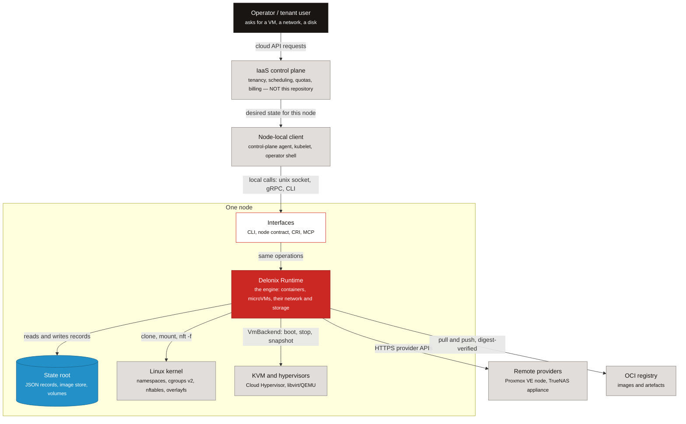

<!-- translated-from: iaas-and-cloud-native.md sha256:23052b9c1c7d3e122386216c08314ec759d95390b79fca113b7004b3b87c4af7 -->
# IaaS e cloud native — onde o motor encaixa

**Antes de leres:** [Começa aqui](start-here.md#what-delonix-is-5-minutes) (as quatro frases sobre o que é o Delonix). Ainda não precisas de conhecimento de kernel nem de Rust.

Podes ser um engenheiro DevOps, um SRE, um engenheiro de plataforma ou um programador cloud que
*usou* uma cloud Infrastructure-as-a-Service durante anos sem alguma vez construir uma. Esta página
dá-te o modelo mental de que precisas antes de leres o código do motor: do que é feita uma IaaS,
que camadas dela este repositório implementa, quais deixa deliberadamente para outros, e como os
princípios cloud native que já conheces aparecem em ficheiros concretos aqui. Depois dela consegues
dizer, para qualquer responsabilidade de uma IaaS, se este repositório a possui ou a deixa para um
control plane, e apontar para o ficheiro onde cada princípio cloud native é aplicado.

Toda a afirmação sobre o motor aponta para um ficheiro, um símbolo ou um ADR. Quando um ADR é
citado, o seu estado é dado, porque um ADR *Proposed* é uma direcção, não um facto sobre o código.
Caminhos como `crates/adapters/delonix-linux` nomeiam os crates do motor; ainda não precisas de os
conhecer — por agora lê um caminho como "o código disto vive aqui". O nível do directório
(`foundation`, `contexts`, `adapters`, `providers`, `interfaces`) é a camada do crate, explicada mais
à frente em [Estrutura do projecto](project-structure.md) e [Arquitectura](architecture.md).

Se uma palavra for nova para ti, procura-a no [glossário](glossary.md).

## O que é uma IaaS

### Os modelos de serviço

As definições de referência estão em **NIST SP 800-145**, *The NIST Definition of Cloud Computing*
([csrc.nist.gov/pubs/sp/800/145/final](https://csrc.nist.gov/pubs/sp/800/145/final)). Em resumo:

| Modelo | O consumidor recebe | O consumidor gere | O fornecedor gere |
|---|---|---|---|
| **IaaS** — Infrastructure as a Service | processamento, armazenamento, redes e outros recursos computacionais fundamentais | sistemas operativos, uso do armazenamento, aplicações implantadas, e controlo limitado de alguma rede (ex.: firewalls do host) | a infra-estrutura física e virtual subjacente |
| **PaaS** — Platform as a Service | um sítio para implantar aplicações construídas com as linguagens, bibliotecas e ferramentas do fornecedor | as aplicações e a sua configuração | tudo por baixo, incluindo o SO e o runtime |
| **SaaS** — Software as a Service | uma aplicação a correr | no máximo definições específicas do utilizador | tudo, incluindo a aplicação |

O mesmo documento NIST lista as cinco características essenciais — self-service on-demand, acesso
amplo à rede, pooling de recursos, elasticidade rápida e serviço medido. Guarda as três últimas:
são exactamente as propriedades que vivem **acima** de um único nó, num control plane.

### Os blocos de construção que toda IaaS tem

Seja qual for o fornecedor, uma IaaS é montada a partir das mesmas peças:

- **Regiões e zonas** — uma região é uma localização geográfica; uma zona é um domínio de falha
  dentro dela (energia, arrefecimento e rede separados). As decisões de colocação são tomadas
  contra elas.
- **Computação** — máquinas virtuais, e cada vez mais containers e microVMs leves, colocadas em
  hosts físicos.
- **Armazenamento** — *block* (um disco ligado a uma máquina), *file* (um sistema de ficheiros
  partilhado como NFS ou SMB), e *object* (uma API HTTP sobre buckets e chaves).
- **Redes virtuais** — uma rede privada por cliente (muitas vezes chamada VPC), subnets dentro dela,
  security groups ou regras de firewall, NAT para tráfego de saída, load balancers para tráfego de
  entrada, e DNS interno.
- **Identidade e inquilinato** — quem está a chamar, a que organização ou conta pertence, o que
  pode fazer, e como os seus recursos são isolados dos de todos os outros.
- **Medição** — contar o que cada inquilino consome, para poder ser limitado (quotas) e cobrado
  (facturação).
- **Um control plane e um data plane** — o *control plane* aceita pedidos de API, guarda o estado
  desejado, decide a colocação e conduz as mudanças; o *data plane* é onde os workloads realmente
  correm e os pacotes realmente fluem. Uma IaaS saudável continua a servir workloads a correr mesmo
  quando o seu control plane fica brevemente indisponível.
- **Um agente de nó ou runtime em cada host** — a peça de software em cada máquina física que
  transforma "corre esta VM com esta rede e este disco" em chamadas ao kernel, ao hipervisor e ao
  armazenamento, e reporta de volta o que realmente lá está.

Este repositório é o último ponto. O resto da página explica exactamente até onde isso vai.

## As camadas de uma IaaS

**Legenda**

| Forma | Significado |
|---|---|
| caixa, escura | pessoa ou actor externo |
| caixa, vermelha | o motor Delonix (este repositório) |
| caixa, clara | um bloco de construção do motor |
| caixa, cinzenta | um sistema externo — algo que este repositório não implementa |
| caixa, azul | estado em disco |

As setas sólidas são chamadas ou fluxos de dados, e a etiqueta diz o que flui.

*Legenda da figura: um pedido viaja de um operador, através de um control plane multi-inquilino que
não está neste repositório, até um cliente local ao nó, entra no motor num nó, e desce até ao
kernel, aos hipervisores e ao armazenamento que o motor conduz através das suas portas de provider.*

Onde cada elemento vive no código:

- **Interfaces** — o binário da CLI (`bins/delonix-runtime-bin`), o servidor CRI do Kubernetes
  (`crates/interfaces/delonix-cri`, `delonix serve cri`), o socket de gestão local
  (`crates/interfaces/delonix-mgmt`), o servidor MCP (`crates/interfaces/delonix-mcp`,
  `delonix mcp serve`) e o contrato de nó (`proto/delonix/node/v1/`). Ver
  [Um conjunto de operações, várias interfaces](architecture.md#one-set-of-operations-several-interfaces).
- **State root** — `crates/adapters/delonix-state` (registos JSON atrás de `flock`, escritas
  atómicas, o cofre de segredos cifrado) e o image store em `crates/adapters/delonix-oci`
  (`cas.rs`).
- **Kernel** — `crates/adapters/delonix-linux` (processos, namespaces, cgroups, mounts) e
  `crates/adapters/delonix-sdn` (bridges, nftables, DNS).
- **Hipervisores** — o trait `VmBackend` em `crates/adapters/delonix-vm/src/lib.rs`.
- **Providers remotos** — `crates/providers/delonix-proxmox` (ADR-0008, Accepted e implementado)
  e `crates/providers/delonix-truenas` (ADR-0009, Accepted). Um backend OpenStack é ainda só uma
  proposta (ADR-0039, Proposed, condicionado a um spike).
- **Registo** — `crates/adapters/delonix-oci/src/registry.rs`.

O control plane e o cliente local ao nó estão a cinzento de propósito: não estão neste
repositório, e nada em `crates/`, `bins/` ou `proto/` pode nomear um. O `scripts/arch_fitness.py`
(`CONSUMER_NAMES`, `consumer_mentions`) falha a CI quando encontra um nome desses.

## Onde o delonix-runtime encaixa, e onde pára deliberadamente

### O que é

O Delonix Runtime é a **camada de execução de nó** da figura acima. Num nó, ele:

- corre **containers e microVMs** — containers através de `crates/adapters/delonix-linux`, VMs
  através das implementações registáveis de `VmBackend` em `crates/adapters/delonix-vm`;
- gere a **rede** de que esses workloads precisam — bridges rootless, chains de firewall por
  workload, DNS interno (`crates/adapters/delonix-sdn`) — e o seu **armazenamento** — volumes
  nomeados, bind mounts e partilhas de rede (`crates/adapters/delonix-volume`);
- é **declarativo**, com os seus próprios Kinds agrupados por `apiVersion` (lista-os com
  `delonix api-resources`; a tabela por trás deles é `KindFacts` em
  `crates/contexts/delonix-stack/src/kinds.rs`);
- fala com os providers só através de **portas** — traits como `NetworkProvider`, `ImageStore` e
  `StorageProvider` em `crates/contexts/delonix-compute/src/ports.rs`, e `VmBackend` — nunca
  através de ramos `if provider == …`. Esta divisão em camadas é o ADR-0040 (**Proposed**), e as
  suas regras já são impostas por `scripts/arch_fitness.py` (`LAYERS`, `ALLOWED`);
- expõe as **mesmas operações através de várias portas**: a CLI, o contrato de nó, o CRI e o MCP.

Uma ressalva sobre o contrato de nó, para não ires à procura de um servidor que não existe:
`proto/delonix/node/v1/node.proto` está marcado como *DRAFT contract for ADR-0040*. O contrato, o
`docs/api/openapi.yaml` gerado a partir dele, e o seu gate de CI (`scripts/contract_gate.py`)
existem; nenhum crate serve ainda o `NodeService`. O ADR-0042 (**Accepted**, passos A e B
entregues) fixa como essa API é versionada e documentada quando o servidor chegar.

### O que deliberadamente não faz

A regra canónica é a secção *«Identidade e fronteira do motor»* no topo do
[`AGENTS.md`](../../../AGENTS.md): o motor não conhece **nenhum consumidor** — nem plataformas,
control planes, consolas ou agentes — e não tem noção de **inquilino, conta, plano, quota ou
facturação**. Um requisito vindo de um consumidor só entra como uma capacidade genérica do motor
que faça sentido para qualquer cliente.

O ADR-0010 (**Rejected**, 2026-08-10) é a decisão que mantém a API de gestão **local**: um socket
unix, com o peer obrigado a ter o mesmo uid que o servidor (`SO_PEERCRED`). Uma API de gestão
remota e multi-inquilino precisaria de identidade, autorização e auditoria, e essas coisas
pertencem ao outro lado da fronteira. O ADR-0025 (**Accepted**) aplica o mesmo raciocínio ao MCP:
só stdio, um único principal local, sem inquilino, sem OAuth.

Duas palavras sobrepõem-se entre os dois mundos e causam confusão em revisão:

- **namespace** — no motor, `metadata.namespace` é uma fronteira de *isolamento* entre workloads
  num nó (containers em namespaces diferentes não se conseguem alcançar). Não é um inquilino nem
  uma conta: nada no motor sabe quem possui um namespace.
- **quota** — o motor impõe limites *por-recurso* que lhe são dados (limites de memória e CPU do
  cgroup, uma quota de volume). Uma quota por-conta ("este cliente pode ter 20 vCPUs") é uma
  decisão de control plane.

### Quem possui o quê

| Responsabilidade de IaaS | Control plane acima | Motor Delonix no nó | Host e kernel |
|---|---|---|---|
| Regiões, zonas, colocação, escalonamento entre nós | sim | não | — |
| Identidade, inquilinos, contas, IAM | sim | não (só uid local — ADR-0010, ADR-0025) | — |
| Quotas por conta, medição para facturação, facturação | sim | não; só expõe métricas por-nó (`/metrics` em `delonix-mgmt` e `delonix-cri`) | — |
| Gestão de frota (acrescentar/drenar nós remotamente) | sim | não — a API remota foi rejeitada (ADR-0010) | — |
| Correr um container | pede-o | sim — `crates/adapters/delonix-linux` | namespaces, cgroups v2, seccomp |
| Correr uma microVM | pede-o | sim — `VmBackend` (`crates/adapters/delonix-vm`) | KVM |
| Rede virtual no nó (bridge, firewall, DNS, publicação de portas) | define a intenção | sim — `crates/adapters/delonix-sdn` | nftables, netns |
| Armazenamento block/file ligado a um workload | define a intenção | sim — `crates/adapters/delonix-volume`, provisionamento de NAS via `delonix-truenas` (ADR-0009, Accepted) | sistemas de ficheiros, clientes NFS/SMB |
| Serviço de object storage (buckets sobre HTTP) | sim, ou um serviço separado | não fornecido | — |
| Imagens: pull, verificação, armazenamento | escolhe a imagem | sim — `crates/adapters/delonix-oci` | overlayfs |
| Estado desejado para um nó: plan, apply, deriva | envia o manifesto | sim — `crates/contexts/delonix-stack` | — |
| Sobreviver a um reboot do host | — | escreve units systemd (`bins/delonix-runtime-bin/src/cmd/boot.rs`, `delonix system boot enable`) | systemd |
| Hardware, firmware, patches do SO do host | — | não | o operador |

## Princípios cloud native, e como o motor aplica cada um

A definição da Cloud Native Computing Foundation (v1.1, aprovada em 2024-02-26) diz que as práticas
cloud native permitem às organizações "desenvolver, construir e implantar workloads … de forma
programática e repetível", e que cloud native é "caracterizado por sistemas fracamente acoplados
que interoperam de forma segura, resiliente, gerível, sustentável e observável". Nomeia containers,
service meshes, multi-tenancy, microserviços, infra-estrutura imutável, serverless e APIs
declarativas como ingredientes típicos. Lê o texto completo em
[github.com/cncf/toc/blob/main/DEFINITION.md](https://github.com/cncf/toc/blob/main/DEFINITION.md).
Repara que *multi-tenancy* está nessa lista, e nesta arquitectura é fornecida pelo control plane
acima do motor, não pelo motor.

Abaixo, cada princípio ganha três partes curtas: o que significa em geral, onde vive no Delonix, e
um hábito que te pede.

### Declarativo e convergente

**Em geral.** Descreves o estado que queres; o sistema compara-o com o que existe, mostra-te a
diferença, e muda só o que difere. Correr a mesma descrição duas vezes não muda nada da segunda
vez. Uma ferramenta que só cria não é declarativa, por mais forma de YAML que o seu input tenha.

**No Delonix.** `delonix stack plan` e `delonix stack apply` correm o reconciliador em
`crates/contexts/delonix-stack/src/reconcile.rs` (`plan`, `Change`, `Action`). É uma **função
pura** sobre um snapshot já lido, e é um **diff de três vias**: o último spec aplicado é guardado
no próprio recurso (`encode_last_applied`, a anotação `delonix.io/last-applied`), para conseguir
distinguir "tiraste este campo" de "alguém pôs isto à mão". Uma mudança que não possa ser aplicada
a quente é recusada a não ser que `--replace <Kind>/<name>` autorize a destruição, e o
`--detailed-exitcode` (0 = sem mudanças, 2 = mudanças, 1 = erro) transforma um plano num gate de
deriva em CI. O ADR-0019 (**Accepted**) acrescenta um histórico de revisões, explicitamente como
um registo e nunca como fonte de verdade.

**O que te pede.** Se acrescentares ou mudares um Kind, o seu apply tem de convergir: um campo
mudado tem de ser actualizado a quente ou aparecer no plano como uma substituição. O doc-comment do
módulo de `reconcile.rs` regista porquê — o `stack apply` já imprimiu `already exists, nothing to
do` e devolveu 0 enquanto ignorava a mudança que o utilizador tinha feito. Um Kind convergente novo
precisa também da sua linha em `KindFacts` (`kinds.rs`); os testes desse crate verificam a tabela.

### API-first

**Em geral.** Toda a operação está disponível através de uma interface programática, e os humanos
usam a mesma interface que a automação usa. Uma capacidade que só existe atrás de um botão ou um
comando não é uma capacidade de plataforma.

**No Delonix.** As mesmas operações são expostas pela CLI, pelo CRI (`delonix serve cri`,
`crates/interfaces/delonix-cri`), pelo socket de gestão local (`crates/interfaces/delonix-mgmt`),
pelo servidor MCP (`delonix mcp serve`, `crates/interfaces/delonix-mcp`) e pelo contrato de nó
(`proto/delonix/node/v1/`, rascunho). O contrato é a fonte de verdade tanto para as suas
codificações gRPC como HTTP/JSON, e o `docs/api/openapi.yaml` é gerado a partir dele, nunca editado
à mão (`scripts/contract_gate.py`). O ADR-0040 (**Proposed**) regista honestamente a lacuna de
hoje: várias destas portas ainda voltam a correr o binário da CLI como subprocesso em vez de
chamar um caso de uso — uma contagem que `scripts/arch_fitness.py` acompanha como o ratchet
`self_exec_sites`.

**O que te pede.** Não acrescentes uma capacidade só a uma porta, e não acrescentes uma chamada de
subprocesso nova ao próprio binário do motor a partir de uma biblioteca — chama o caso de uso em
vez disso. O ratchet falha se `self_exec_sites` subir. Detalhes em
[Arquitectura](architecture.md#one-set-of-operations-several-interfaces).

### Observável através de padrões abertos

**Em geral.** Um sistema diz-te o que está a fazer através de formatos que qualquer ferramenta
entende — logs estruturados, traces e métricas — em vez de um dashboard próprio ou um log que tens
de ler à mão.

**No Delonix.** `crates/adapters/delonix-telemetry` tem logging estruturado
(`DELONIX_LOG_FORMAT=json`), spans OpenTelemetry exportados por OTLP (`DELONIX_OTLP_ENDPOINT`,
`OTEL_SERVICE_NAME` respeitado por `telemetry.rs`) e o registo Prometheus partilhado
(`metrics.rs`), servido em `/metrics` pelo `delonix-mgmt` e pelo `delonix-cri`. Os eventos do
motor estão disponíveis com `delonix system events`.

**O que te pede.** Um crate de biblioteca não imprime: emite eventos `tracing` e a interface decide
o que mostrar. `scripts/arch_fitness.py` conta `println!`/`eprintln!` em crates de biblioteca como
o ratchet `library_prints`, e falha se o número subir.

### Artefactos imutáveis

**Em geral.** O que implantas é um artefacto versionado, endereçado por conteúdo, construído uma
vez e nunca modificado no lugar. Mudas uma implantação apontando-a para um artefacto diferente, e
consegues provar que bytes estão a correr.

**No Delonix.** As imagens seguem as especificações OCI de imagem e de distribuição
(`crates/adapters/delonix-oci`). Os blobs vivem num store endereçado por conteúdo (`cas.rs`), e um
pull por digest verifica o próprio manifesto contra o digest que pediste
(`verify_manifest_digest` em `registry.rs`), não só cada blob contra o manifesto. Os containers
partilham layers de imagem só-de-leitura através do overlayfs e escrevem só na sua própria upper
layer.

**O que te pede.** Nunca aceites bytes descarregados sem os verificar contra um digest ou um
checksum publicado, e nunca enfraqueças uma verificação para fazer funcionar um registo lento ou
estranho — uma verificação que pode ser saltada não é uma verificação. Ver
[Introdução ao cloud native](cloud-native-primer.md#44-oci-images-content-addressed-storage-and-overlayfs).

### Fracamente acoplado: ports e adapters

**Em geral.** Os componentes dependem de interfaces estreitas, não dos internos uns dos outros,
para uma parte poder ser substituída sem reescrever o resto. Para um motor de infra-estrutura isto
significa sobretudo: um provider novo deve ser uma implementação nova, não um ramo novo
espalhado por todo o lado.

**No Delonix.** O ADR-0040 (**Proposed**) organiza os crates em foundation, contexts, adapters,
providers, interfaces e binários, e o directório é a camada (`crates/foundation/`,
`crates/contexts/`, `crates/adapters/`, `crates/providers/`, `crates/interfaces/`, `bins/`). A
direcção permitida está escrita uma vez, em `ALLOWED` em `scripts/arch_fitness.py`, e a CI
impõe-na. As portas são traits em `crates/contexts/delonix-compute/src/ports.rs` e `VmBackend` em
`delonix-vm`; o ADR-0008 (**Accepted**) tornou os backends de VM registáveis, que é como um nó
Proxmox remoto se tornou mais um backend.

**O que te pede.** Um provider novo entra como implementação de uma porta. Um crate novo entra na
tabela `LAYERS` e no directório da sua camada no mesmo commit, e só pode depender na direcção
permitida. Ver [Arquitectura](architecture.md#layers-and-the-allowed-direction).

### Descartável e idempotente

**Em geral.** Qualquer processo pode ser parado e arrancado de novo rapidamente e em segurança, e
repetir uma operação não piora as coisas. É isso que permite a um escalonador mover, reiniciar ou
substituir workloads sem um humano.

**No Delonix.** `delonix container stop` envia SIGTERM, espera até `--time` segundos, e depois
SIGKILL (`stop` em `crates/adapters/delonix-linux/src/lib.rs`), e parar um container já parado tem
sucesso (`cmd_stop` em `bins/delonix-runtime-bin/src/cmd/container.rs`). Um stop pedido é
registado antes de sinalizar (`stopped_by_user`), para um supervisor de restart não ressuscitar o
que o operador parou. Do lado declarativo, aplicar um manifesto inalterado produz um plano sem
mudanças.

**O que te pede.** Todo comando novo deve ser seguro correr duas vezes. Decide explicitamente o
que "já feito" devolve — sucesso, ou a classe de conflito (`Error::Conflict`, mapeada para um
código de saída por `for_error` em `crates/foundation/delonix-model/src/exitcode.rs`) — e nunca
destruas nada antes de saberes que o objecto é teu para destruir.

### Seguro por omissão: rootless-first, menor privilégio

**Em geral.** O caminho normal concede o conjunto mínimo de privilégios que funciona. Privilégio
extra é algo que um operador pede explicitamente e consegue ver, nunca uma omissão silenciosa.

**No Delonix.** Os containers correm dentro de um user namespace sem root no caminho normal, e
mantêm só o conjunto de capabilities por omissão `KEPT_CAPS`
(`crates/adapters/delonix-linux/src/capabilities.rs`, resolvido por `resolve_cap_keep`). No
caminho do CRI o nó pode pôr um tecto às capabilities que nenhum spec de pod pode ultrapassar
(`crates/interfaces/delonix-cri/src/cap_ceiling.rs`). As decisões de segurança — política,
admissão para containers e VMs, redacção de segredos — estão reunidas em
`crates/contexts/delonix-security-runtime` (ADR-0026, **Proposed**).

**O que te pede.** Não faças uma funcionalidade funcionar exigindo root ou `--privileged` no
caminho normal. Se o privilégio for mesmo preciso, torna-o um opt-in explícito que o diz ao
operador, e recusa — com uma mensagem clara — em vez de degradar em silêncio quando falta.

### Daemonless

**Em geral.** Muitos motores de containers correm um daemon residente que possui todo o estado. Um
motor daemonless guarda o estado em ficheiros e faz o seu trabalho em processos de vida curta, por
isso não há nenhum processo central cujo crash ou actualização derrube todos os workloads.

**No Delonix.** Cada comando da CLI é um processo que faz o seu trabalho e sai. O que tem de
persistir pertence ao systemd ou a um processo por workload com um dono claro: `delonix system
boot enable` escreve uma unit systemd por container ou VM cujo `ExecStart` é um `delonix … start`
(`bins/delonix-runtime-bin/src/cmd/boot.rs`). A regra — um daemon novo precisa de um ADR com a
evidência do que a alternativa não conseguiu resolver — está no `AGENTS.md`. O ADR-0021
(**Proposed**) mostra a regra aplicada: até um reconciliador de pull está desenhado para correr a
partir de um timer systemd em vez de um processo residente.

**O que te pede.** Antes de acrescentar um processo de vida longa, verifica se uma unit systemd, um
timer, activação por socket ou um supervisor por workload resolve o problema. Se nenhum resolver,
escreve o ADR primeiro. Ver [Introdução ao cloud native](cloud-native-primer.md#410-daemonless-in-one-paragraph).

## A lente dos doze factores, do lado do fornecedor

A Twelve-Factor App ([12factor.net](https://12factor.net/)) é escrita para programadores de
aplicações. Um motor está do outro lado: tem de *fornecer* os mecanismos que deixam um workload
seguir cada factor. Alguns factores simplesmente não são da conta do motor, e a tabela di-lo.

| Factor | O que o motor tem de fornecer | Onde o Delonix o faz |
|---|---|---|
| I. Codebase | nada — um codebase por app é escolha do programador | não aplicável |
| II. Dependencies | uma forma de enviar uma app com as suas dependências isoladas | imagens OCI (`crates/adapters/delonix-oci`); construí-las com `delonix build` a partir de um Dockerfile ou Delonixfile ([Delonixfile e VMfile](delonixfile-and-vmfile.md)) |
| III. Config | injectar configuração e segredos no arranque, não no build | `-e`, `--env-file`, `--secret` em `delonix container run`; fusão de ambiente em `crates/contexts/delonix-compute/src/run.rs`; `parse_env_file` em `crates/foundation/delonix-model/src/secret.rs`; segredos cifrados em repouso em `delonix-state` |
| IV. Backing services | ligar um serviço pelo nome, substituível sem mudar código | DNS interno `<name>.<namespace>.delonix.internal` (`dns_resolve_for` em `crates/adapters/delonix-sdn/src/infra.rs`); um Kind `Service` que resolve para vários backends (ADR-0032, **Accepted**) |
| V. Build, release, run | separar as três fases, com uma release imutável | `delonix build` → uma imagem identificada por digest → `container run` / `stack apply`; histórico de revisões do stack (ADR-0019, **Accepted**) |
| VI. Processes | processos sem estado, com o estado em armazenamento ligado | raiz `--read-only`; volumes nomeados e partilhas (`crates/adapters/delonix-volume`) |
| VII. Port binding | expor uma porta que a própria app liga | `-p [hostIp:]hostPort:containerPort` (`parse_publish_addr`, `slirp_add_hostfwd` em `crates/adapters/delonix-sdn/src/lib.rs`) |
| VIII. Concurrency | correr mais cópias de um tipo de processo | vários containers por serviço compose (`deploy.replicas` em `bins/delonix-runtime-bin/src/cmd/compose.rs`) e round-robin de DNS através de `Service` (ADR-0032). **Não fornecido:** autoscaling, e escala entre nós (isso é uma decisão de control plane) |
| IX. Disposability | arranque rápido, paragem graciosa a um sinal | SIGTERM depois SIGKILL após `--time` (`stop` em `delonix-linux`); políticas de restart com `--restart` |
| X. Dev/prod parity | os mesmos artefactos e runtime em todos os ambientes | o mesmo binário e Kinds num portátil e num nó, rootless nos dois. **Em parte:** a paridade com *outro* runtime de produção (por exemplo um cluster Kubernetes gerido) depende desse runtime |
| XI. Logs | capturar stdout/stderr como um fluxo de eventos, não ficheiros que a app gere | um shim de log por-container (`log_shim` em `crates/adapters/delonix-linux/src/lib.rs`); `delonix container logs --follow`; linhas com timestamp com `--log-cri` |
| XII. Admin processes | correr tarefas pontuais no mesmo ambiente que a app | `delonix container exec` |

## Lê a seguir

- **Fundações de Linux** ([linux-foundations.md](linux-foundations.md)) — os primitivos do kernel
  em que tudo isto assenta: processos e `/proc`, namespaces, cgroups v2, descritores de ficheiro e
  sinais.
- **Introdução ao cloud native** ([cloud-native-primer.md](cloud-native-primer.md)) — como o motor
  usa esses primitivos e as especificações por cima deles (OCI, CRI, CNI, KVM/virtio, cloud-init),
  com ficheiros e símbolos.
- **Arquitectura** ([architecture.md](architecture.md)) — a estrutura por trás deste contexto:
  camadas, processos e crates em detalhe, depois de as duas páginas acima e
  [Estrutura do projecto](project-structure.md) te serem familiares.

---

**Seguinte:** [Fundações de Linux](linux-foundations.md) — os primitivos do kernel de que todas as páginas seguintes dependem, à mão: processos, namespaces, cgroups v2, descritores de ficheiro e sinais.
