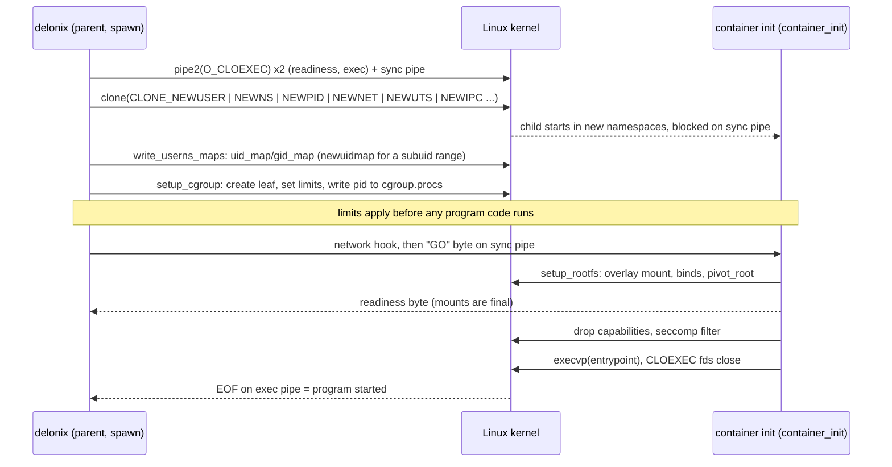

<!-- translated-from: linux-foundations.md sha256:939d3e706c124fa92db0bb6c46fdccd6dc62d6ab6cdf2df388654650357dab5a -->
# Fundações de Linux

**Antes de leres:** [IaaS e cloud native](iaas-and-cloud-native.md), para saberes porque é que um motor de nó precisa destes primitivos. Só precisas de uma shell Linux, nada mais.

Toda página depois desta assume que consegues responder, com um comando, a perguntas como «em que
network namespace está este processo?», «porque é que este limite não se aplicou?» ou «quem ainda
segura este pipe aberto?». Esta página ensina esses primitivos à mão, do ponto de vista de alguém
que escreve código de sistema Linux *e* tem de o operar às 3 da manhã. No fim vais conseguir
responder a cada uma dessas perguntas a partir de uma shell, e prever as falhas que as páginas
seguintes descrevem no vocabulário do motor (um limite que não se aplica, um pipe que nunca chega a
EOF, um PID que nomeia outro processo).

Não explica como o motor os usa — esse mapeamento, com ficheiros e símbolos, é a
[Introdução ao cloud native](cloud-native-primer.md). Cada secção aqui termina com um apontador
para a parte correspondente dela.

**Como usar esta página.** Abre um terminal e escreve ao mesmo tempo. Todo comando marcado *sem
privilégio* foi corrido como utilizador comum num host Ubuntu com um kernel 7.0, util-linux 2.39 e
systemd, e a saída mostrada é o que ele imprimiu (cortada, com caminhos específicos do host
substituídos por placeholders). Comandos marcados **exige root — corre numa VM descartável** *não
foram executados* para esta página: mudam estado de todo o host, e nunca os devias tentar numa
máquina que corre algo com que te importas. [Configuração de microVMs](microvm-setup.md) mostra
como obter uma VM descartável a partir do próprio motor.

Trabalha num directório de rascunho para nada do que crias aterrar no repositório:

```bash
mkdir -p ~/scratch/linux-lab && cd ~/scratch/linux-lab
```

---

## Processos, o kernel e /proc

Um **processo** é um programa a correr com o seu próprio espaço de endereçamento, um **PID**
numérico, um pai (o seu **PPID**) e um conjunto de atributos pertencentes ao kernel: credenciais,
namespaces, pertença a um cgroup, descritores de ficheiro abertos, disposições de sinal e limites de
recurso. Todo processo excepto o PID 1 tem um pai; quando um pai morre primeiro, o órfão é
re-adoptado pelo *subreaper* mais próximo ou pelo PID 1.

- O **`fork`** duplica o processo que o chama. O filho recebe uma cópia do espaço de endereçamento
  (copy-on-write) e uma cópia da **tabela de descritores de ficheiro** — os mesmos ficheiros
  abertos, partilhados, não reabertos. Só a *thread* que chamou é copiada, o que é a razão pela
  qual fazer fork de um programa multi-thread e depois fazer algo não trivial antes do `exec` é
  perigoso (um lock segurado por outra thread fica segurado para sempre no filho).
- O **`execve`** substitui o programa a correr num processo: mesmo PID, mesmo pai, mesmos
  namespaces e cgroup, código novo. Os descritores de ficheiro sobrevivem ao `exec` *a não ser*
  que estejam marcados close-on-exec — mais sobre isto em
  [Descritores de ficheiro](#file-descriptors).
- O **`clone`** é a forma geral por trás tanto do `fork` como da criação de threads. As suas flags
  escolhem o que o filho partilha com o pai e, crucialmente aqui, em que **namespaces novos**
  arranca (`CLONE_NEWUSER`, `CLONE_NEWNS`, `CLONE_NEWPID`, `CLONE_NEWNET`, …). Um container nasce
  de um `clone` com essas flags.

O kernel expõe cada processo como um directório debaixo de `/proc`. Os ficheiros que vais usar
mais:

| Caminho | O que te diz |
|---|---|
| `/proc/<pid>/status` | nome, estado, PPid, uid/gid, `NSpid` (o PID em cada namespace de PID aninhado), conjuntos de capabilities, threads |
| `/proc/<pid>/cmdline` | o argv, separado por NUL |
| `/proc/<pid>/ns/` | um symlink por namespace; o número de inode é a identidade do namespace |
| `/proc/<pid>/cgroup` | o caminho de cgroup v2 (`0::/…`) |
| `/proc/<pid>/fd/`, `/proc/<pid>/fdinfo/` | descritores de ficheiro abertos e o seu offset/flags |
| `/proc/<pid>/stat` | o campo 22 é a hora de arranque, que distingue um processo de um posterior que reutilizou o seu PID |

Experimenta na tua própria shell (*sem privilégio*):

```bash
grep -E '^(State|PPid|Threads|NSpid|CapEff)' /proc/$$/status
tr '\0' ' ' < /proc/$$/cmdline; echo
cat /proc/self/cgroup
```

```text
State:	S (sleeping)
PPid:	4033620
NSpid:	953496
Threads:	1
CapEff:	0000000000000000
0::/user.slice/user-1000.slice/user@1000.service/app.slice/app-….scope
```

Repara que `$$` é a tua shell, enquanto `self` é qualquer processo que abrir o ficheiro — para
`cat /proc/self/cgroup` esse é o `cat`. Repara também que **um PID é um número, não um nome**: uma
vez colhido um processo, o kernel pode dar o mesmo número a um processo sem relação nenhuma. Código
que guarda um PID e o sinaliza mais tarde tem de verificar a hora de arranque, ou melhor, segurar um
*pidfd* (ver abaixo).

**Porque é que o motor lê `/proc`.** É a única vista autoritativa e sem lock de um processo vivo: o
cgroup real de um container a correr, se um PID registado ainda nomeia o mesmo processo, que
namespaces juntar para um `exec`. → [Como o Delonix usa isto: namespaces e funcionamento
rootless](cloud-native-primer.md#41-linux-namespaces-and-rootless-operation).

**Ler mais:** [`proc(5)`](https://man7.org/linux/man-pages/man5/proc.5.html),
[`fork(2)`](https://man7.org/linux/man-pages/man2/fork.2.html),
[`execve(2)`](https://man7.org/linux/man-pages/man2/execve.2.html),
[`clone(2)`](https://man7.org/linux/man-pages/man2/clone.2.html).

---

## Namespaces

Um **namespace** envolve um tipo de recurso global para que os processos lá dentro vejam a sua
própria instância. O Linux tem oito:

| Namespace | Flag | Isola |
|---|---|---|
| mount | `CLONE_NEWNS` | a tabela de mounts: o que está montado onde |
| UTS | `CLONE_NEWUTS` | o hostname e o nome de domínio NIS |
| IPC | `CLONE_NEWIPC` | objectos IPC do System V e filas de mensagens POSIX |
| PID | `CLONE_NEWPID` | a numeração de processos; o primeiro processo lá dentro é o PID 1 |
| network | `CLONE_NEWNET` | interfaces, endereços, rotas, tabelas de firewall, sockets, `/proc/sys/net` |
| user | `CLONE_NEWUSER` | uids/gids e capabilities; o dono de todos os outros namespaces |
| cgroup | `CLONE_NEWCGROUP` | a vista da árvore de cgroups (o processo vê o seu cgroup como `/`) |
| time | `CLONE_NEWTIME` | os offsets de `CLOCK_MONOTONIC` e `CLOCK_BOOTTIME` |

### Identidade: o inode por trás de /proc/<pid>/ns

Cada entrada em `/proc/<pid>/ns` é um symlink cujo alvo codifica o tipo do namespace e um número de
inode. **Dois processos estão no mesmo namespace exactamente quando esses inodes são iguais** — é
assim que se compara, não pelos nomes (*sem privilégio*):

```bash
ls -l /proc/self/ns
```

```text
lrwxrwxrwx 1 you you 0 … cgroup -> cgroup:[4026531835]
lrwxrwxrwx 1 you you 0 … ipc -> ipc:[4026531839]
lrwxrwxrwx 1 you you 0 … mnt -> mnt:[4026531832]
lrwxrwxrwx 1 you you 0 … net -> net:[4026531833]
lrwxrwxrwx 1 you you 0 … pid -> pid:[4026531836]
lrwxrwxrwx 1 you you 0 … pid_for_children -> pid:[4026531836]
lrwxrwxrwx 1 you you 0 … time -> time:[4026531834]
lrwxrwxrwx 1 you you 0 … time_for_children -> time:[4026531834]
lrwxrwxrwx 1 you you 0 … user -> user:[4026531837]
lrwxrwxrwx 1 you you 0 … uts -> uts:[4026531838]
```

O `pid_for_children` e o `time_for_children` existem porque um processo nunca muda o seu próprio
namespace de PID ou de tempo: `unshare`/`setns` nesses afecta só os filhos que criar a seguir.

O `lsns` lista namespaces em todo o sistema. No host usado para esta página, o **util-linux 2.39.3
num kernel 7.0 falha** com `lsns: Unsupported ioctl NS_GET_USERNS` e não imprime nada. Se o teu
fizer o mesmo, compara os inodes directamente: `readlink /proc/<pid>/ns/net` para os processos que
te interessam.

### À mão: um namespace de user + mount + UTS + network, sem root

Um utilizador sem privilégio não consegue criar a maioria dos namespaces sozinho…

```bash
unshare --net true
```

```text
unshare: unshare failed: Operation not permitted
```

…mas consegue criar um **user namespace**, e lá dentro torna-se root *sobre os namespaces que esse
user namespace possui*. O `--map-root-user` (`-r`) mapeia o teu uid para 0 lá dentro
(*sem privilégio*):

```bash
unshare --user --map-root-user --mount --uts --net sh -c '
  hostname lab; hostname; id
  cat /proc/self/uid_map
  ip link
  readlink /proc/self/ns/net'
hostname; readlink /proc/self/ns/net     # back outside
```

```text
lab
uid=0(root) gid=0(root) groups=0(root),65534(nogroup)
         0       1000          1
1: lo: <LOOPBACK> mtu 65536 qdisc noop state DOWN mode DEFAULT group default qlen 1000
    link/loopback 00:00:00:00:00:00 brd 00:00:00:00:00:00
net:[4026534483]
<your-host>
net:[4026531833]
```

Três coisas a ver: o hostname mudou só lá dentro; o network namespace novo tem **só `lo`, e está
down**; e o inode do namespace difere do do host. O grupo `65534(nogroup)` é um grupo do host sem
mapeamento lá dentro — ids não mapeados aparecem sempre como o id de overflow.

Um mount namespace funciona da mesma forma: mounts feitos lá dentro são invisíveis fora
(*sem privilégio*):

```bash
mkdir -p mnt
unshare -r -m sh -c "mount -t tmpfs scratch $PWD/mnt && findmnt -n -o SOURCE,FSTYPE $PWD/mnt && touch $PWD/mnt/only-here && ls $PWD/mnt"
ls mnt; findmnt -n mnt; echo "findmnt rc=$?"
```

```text
scratch tmpfs
only-here
findmnt rc=1
```

Um namespace de PID precisa de `--fork`, porque o próprio chamador fica no seu namespace de PID
antigo; só o seu filho se torna PID 1. O `--mount-proc` volta a montar o `/proc` para ferramentas
como `ps` verem a numeração nova (*sem privilégio*):

```bash
unshare -r --pid --fork --mount-proc sh -c 'echo $$; ps -o pid,ppid,comm'
```

```text
1
    PID    PPID COMMAND
      1       0 sh
      2       1 ps
```

Visto de fora, o mesmo processo tem dois PIDs — o `NSpid` lista-os do namespace mais externo para
dentro (*sem privilégio*):

```bash
unshare -r -p -f sleep 3 & U=$!; sleep 0.4
grep -E '^(Name|NSpid)' /proc/$(pgrep -P $U)/status; wait
```

```text
Name:	sleep
NSpid:	953619	1
```

Os namespaces de cgroup e de tempo podem ser experimentados da mesma forma (`unshare -r --cgroup
cat /proc/self/cgroup` imprime `0::/`).

### User namespaces e mapeamento de uid

O mapeamento vive em `/proc/<pid>/uid_map` e `gid_map`, uma linha por intervalo:
`<primeiro id lá dentro> <primeiro id fora> <contagem>`. As regras que moldam os containers
rootless:

- Os mapas são escritos **uma vez**, por um processo com o privilégio certo sobre o namespace
  novo — normalmente o pai, enquanto o filho espera.
- Um utilizador sem privilégio pode escrever um **mapa de uma linha do seu próprio uid** (o que o
  `-r` fez acima: `0 1000 1`). Um container cuja imagem corre como uid 101 ou muda a dona de
  ficheiros para uids de serviço precisa de um *intervalo*.
- Os intervalos vêm de `/etc/subuid` e `/etc/subgid` e são escritos pelos helpers setuid
  **`newuidmap`/`newgidmap`**, que verificam que o intervalo te pertence.

*Sem privilégio* (precisa de uma entrada para o teu utilizador em `/etc/subuid`/`/etc/subgid`):

```bash
grep "^$(id -un):" /etc/subuid /etc/subgid
unshare --user --map-auto --map-root-user cat /proc/self/uid_map
```

```text
/etc/subgid:you:100000:65536
/etc/subuid:you:100000:65536
         0       1000          1
         1     100000      65536
```

O uid 0 lá dentro és tu; os uids 1–65536 lá dentro são os uids do host 100000–165535, que não
pertencem a ninguém no host. Esse último ponto é a razão pela qual um ficheiro escrito por um
container como uid 999 não pode ser removido por ti de fora — ver a nota sobre a leitura desses
ficheiros em [Ambiente](environment.md).

No Ubuntu 23.10 e posteriores, o `kernel.apparmor_restrict_unprivileged_userns=1` pode recusar user
namespaces a binários sem perfil AppArmor. O `/usr/bin/unshare` tem um; um binário acabado de
construir num directório arbitrário pode não ter. O sintoma é `EPERM` no primeiro `unshare`, que
parece um bug do programa. O [Ambiente](environment.md) cobre a correcção.

### Criar versus juntar; manter um namespace vivo

- **Criar**: `unshare(2)` (o processo actual move-se para namespaces novos) ou `clone(2)` com
  `CLONE_NEW*` (o filho arranca lá dentro).
- **Juntar**: `setns(2)` sobre um descritor de ficheiro aberto a partir de
  `/proc/<pid>/ns/<tipo>`. A ferramenta `nsenter(1)` embrulha-o.

**Um namespace vive enquanto algo o referenciar**: um processo lá dentro, um descritor de ficheiro
aberto para o seu ficheiro `/proc/<pid>/ns/*`, ou um bind mount desse ficheiro (que é o que o
`ip netns add` cria debaixo de `/run/netns`). Quando a última referência desaparece, um network
namespace e toda interface lá dentro desaparecem.

Por isso o padrão rootless é um **holder**: um processo pequeno que dorme dentro do namespace para
o manter vivo, e a que outros se juntam. Consegues fazer isto sem root, porque possuis o user
namespace que o holder criou (*sem privilégio*):

```bash
unshare --user --map-root-user --net sleep 60 &   # the holder; unshare execs sleep
H=$!; sleep 0.5
nsenter --target $H --user --net --preserve-credentials sh -c 'ip link add dummy0 type dummy; ip -br link'
nsenter --target $H --user --net --preserve-credentials ip -br link    # a second visitor sees it
```

```text
lo               DOWN           00:00:00:00:00:00 <LOOPBACK>
dummy0           DOWN           ae:1a:b3:4b:88:4c <BROADCAST,NOARP>
lo               DOWN           00:00:00:00:00:00 <LOOPBACK>
dummy0           DOWN           ae:1a:b3:4b:88:4c <BROADCAST,NOARP>
```

Quando o `sleep` termina, o namespace e o `dummy0` vão com ele.

Os equivalentes privilegiados, **exige root — corre numa VM descartável** (não executados nesta
revisão):

```bash
ip netns add lab                 # a named netns, pinned by a bind mount in /run/netns
ip netns exec lab ip link        # run a command in it
nsenter --target <pid> --net --mount ip addr   # join another user's process's namespaces
ip netns del lab
```

### Boas práticas

- **Em rootless, empareja sempre o network namespace com um user namespace.** Sem ele não tens
  `CAP_NET_ADMIN` sobre o namespace novo; com ele tens, e nada vaza para o host.
- **Cria o user namespace primeiro** (ou no mesmo `clone`): todo outro namespace pertence ao user
  namespace em que foi criado, e essa posse decide quem o pode configurar.
- **Mantém um holder** para tudo o que tenha de sobreviver a um comando, e trata o holder como um
  processo com dono e pidfile, não como um acidente.
- **Junta-te, não recries.** Recriar um namespace que ainda tem membros vivos corta-os fora.
- **Compara inodes, nunca nomes ou PIDs**, para decidires «o mesmo namespace».
- **Limpa** o que nomeares: `ip netns del`, desmonta bind mounts, e deixa os holders sair.

→ [Como o Delonix usa isto: namespaces do Linux e funcionamento
rootless](cloud-native-primer.md#41-linux-namespaces-and-rootless-operation) e [Rede de
containers](cloud-native-primer.md#45-container-networking).

**Ler mais:** [`namespaces(7)`](https://man7.org/linux/man-pages/man7/namespaces.7.html),
[`user_namespaces(7)`](https://man7.org/linux/man-pages/man7/user_namespaces.7.html),
[`pid_namespaces(7)`](https://man7.org/linux/man-pages/man7/pid_namespaces.7.html),
[`network_namespaces(7)`](https://man7.org/linux/man-pages/man7/network_namespaces.7.html),
[`unshare(1)`](https://man7.org/linux/man-pages/man1/unshare.1.html),
[`nsenter(1)`](https://man7.org/linux/man-pages/man1/nsenter.1.html),
[`setns(2)`](https://man7.org/linux/man-pages/man2/setns.2.html),
[`newuidmap(1)`](https://man7.org/linux/man-pages/man1/newuidmap.1.html),
[`subuid(5)`](https://man7.org/linux/man-pages/man5/subuid.5.html).

---

## cgroups v2

Um **control group** é um conjunto de processos ao qual se aplicam limites de recurso e
contabilidade. O cgroup v2 é **uma árvore unificada** montada em `/sys/fs/cgroup`: um directório é
um cgroup, um processo pertence a exactamente um, e os ficheiros no directório são a interface.

- `cgroup.controllers` — os controladores **disponíveis** neste cgroup (concedidos pelo pai).
- `cgroup.subtree_control` — os controladores **activados para os filhos** deste cgroup. Escrever
  `+memory` lá cria ficheiros `memory.*` em cada filho.
- `cgroup.procs` — os PIDs neste cgroup. Escrever um PID move esse processo (só esse processo; os
  seus filhos existentes ficam onde estão).
- Ficheiros de controlador: `memory.max`, `memory.high`, `memory.events`, `memory.peak`, `cpu.max`
  (`<quota> <período>` em microsegundos, ou `max`), `cpu.weight`, `cpu.stat`, `pids.max`, e os
  ficheiros de pressão `cpu.pressure`, `memory.pressure`, `io.pressure` (PSI).

### A regra «sem processos internos»

Um cgroup que **tem processos** não pode activar controladores para os seus filhos, e um cgroup que
distribui recursos a filhos mantém os seus processos em folhas. Na prática: os processos vivem em
**folhas**, e um gestor que queira criar filhos para os seus próprios processos tem primeiro de se
mover para uma folha. O kernel reporta uma violação como `EBUSY`.

### Delegação a utilizadores

Só o root consegue escrever na árvore de cgroups por omissão. O systemd **delega** uma subárvore a
um utilizador ao mudar o dono dela: na maioria dos hosts o `user@<uid>.service` pertence-te e
delega alguns controladores. Olha primeiro para a tua própria posição (*sem privilégio*):

```bash
CG=/sys/fs/cgroup$(cut -d: -f3 /proc/self/cgroup); echo "$CG"
cat "$CG/cgroup.controllers"
U=/sys/fs/cgroup/user.slice/user-$(id -u).slice/user@$(id -u).service
stat -c '%U %n' "$U/cgroup.subtree_control"; cat "$U/cgroup.subtree_control"
```

```text
/sys/fs/cgroup/user.slice/user-1000.slice/user@1000.service/app.slice/app-….scope
memory pids
you /sys/fs/cgroup/user.slice/user-1000.slice/user@1000.service/cgroup.subtree_control
cpu memory pids
```

Dois factos que vale a pena reparar neste host: o scope da shell não tem controlador `cpu` (por
isso `cpu.max` não existe lá), e o `cpuset`/`io` não são delegados ao utilizador de todo — o slice
raiz não os passa para baixo.

**Porque é que uma sessão SSH não consegue definir limites.** Um login por SSH aterra em
`session-<n>.scope`, que é um *irmão* de `user@<uid>.service`, não um filho. Mover um PID entre
dois cgroups exige acesso de escrita ao `cgroup.procs` do seu **antepassado comum**; aqui isso é
`user-<uid>.slice`, propriedade do root. Por isso um programa arrancado por SSH não se consegue pôr
debaixo da subárvore delegada, e os limites que tenta definir não têm para onde ir. A correcção é
pedir ao systemd um scope delegado.

### À mão: um comando limitado num scope de utilizador

O `systemd-run --user --scope` corre um comando num scope transitório novo debaixo do teu gestor de
utilizador, com propriedades de controlo de recurso aplicadas (*sem privilégio*):

```bash
systemd-run --user --scope -q -p MemoryMax=64M -p CPUQuota=20% sh -c '
  C=/sys/fs/cgroup$(cut -d: -f3 /proc/self/cgroup); echo "$C"
  cat "$C/memory.max" "$C/cpu.max"
  cat "$C/cpu.pressure"
  head -3 "$C/cpu.stat"'
```

```text
/sys/fs/cgroup/user.slice/user-1000.slice/user@1000.service/app.slice/run-r4b0….scope
67108864
20000 100000
some avg10=0.00 avg60=0.00 avg300=0.00 total=35
full avg10=0.00 avg60=0.00 avg300=0.00 total=35
usage_usec 6398
user_usec 1066
system_usec 5331
```

O `CPUQuota=20%` tornou-se `cpu.max = 20000 100000`: 20 ms de CPU por período de 100 ms.

Agora provoca um OOM kill e lê a evidência **antes de o cgroup desaparecer**. Um scope transitório é
removido assim que o seu último processo sai, por isso a leitura tem de acontecer de dentro dele.
Dois detalhes importam: `MemorySwapMax=0` (senão a alocação simplesmente vai para swap), e
`OOMPolicy=continue` (a omissão do systemd para um scope é parar o scope *inteiro* quando um
processo é morto por OOM — o leitor também morreria; sem isto este comando só imprimia
`Terminated`) (*sem privilégio*):

```bash
systemd-run --user --scope -q -p MemoryMax=32M -p MemorySwapMax=0 -p OOMPolicy=continue sh -c '
  python3 -c "b = bytearray(128 * 1024 * 1024)"; echo "python exit=$?"
  C=/sys/fs/cgroup$(cut -d: -f3 /proc/self/cgroup); cat "$C/memory.events"'
```

```text
Killed
python exit=137
low 0
high 0
max 51
oom 1
oom_kill 1
oom_group_kill 0
sock_throttled 0
```

O código de saída 137 é 128 + 9 (SIGKILL). O **único** sítio que diz «isto foi um OOM kill e não um
`kill -9`» é o `oom_kill` em `memory.events` — e desaparece assim que o cgroup é removido.

Por fim, vê a regra «sem processos internos» e a delegação de uma só vez, dentro de um scope que o
systemd te delega (`Delegate=yes`) (*sem privilégio*):

```bash
systemd-run --user --scope -q -p Delegate=yes sh -c '
  C=/sys/fs/cgroup$(cut -d: -f3 /proc/self/cgroup)
  mkdir "$C/leaf"
  env printf "+memory" > "$C/cgroup.subtree_control" || echo "refused: this cgroup still has processes"
  echo $$ > "$C/leaf/cgroup.procs" && echo "moved self into leaf"
  echo "+memory +pids" > "$C/cgroup.subtree_control" && echo "controllers enabled for children"
  echo 16M > "$C/leaf/memory.max"; cat "$C/leaf/memory.max"'
```

```text
printf: write error: Device or resource busy
refused: this cgroup still has processes
moved self into leaf
controllers enabled for children
16777216
```

Os mesmos passos sem systemd, **exige root — corre numa VM descartável** (não executados nesta
revisão):

```bash
mkdir /sys/fs/cgroup/lab
echo "+memory +pids" > /sys/fs/cgroup/cgroup.subtree_control   # usually already enabled at the root
mkdir /sys/fs/cgroup/lab/work
echo 64M > /sys/fs/cgroup/lab/work/memory.max
echo <pid> > /sys/fs/cgroup/lab/work/cgroup.procs
cat /sys/fs/cgroup/lab/work/memory.events
# cleanup: the cgroup must be empty before rmdir
echo <pid> > /sys/fs/cgroup/cgroup.procs; rmdir /sys/fs/cgroup/lab/work /sys/fs/cgroup/lab
```

### Boas práticas

- **Uma folha por workload.** Os limites, a contabilidade e a evidência de OOM pertencem então a
  exactamente uma coisa.
- **Define os limites e move o processo para dentro *antes* de ele começar a correr o seu
  programa.** Uma migração move um processo, nunca os seus descendentes; qualquer coisa que tenha
  feito fork antes da mudança fica fora do limite para sempre.
- **Lê o `memory.events` para OOM**, e lê-o enquanto o cgroup ainda existe — a partir do processo
  que espera pelo workload, não depois.
- **Não escrevas em controladores ou cgroups que não possuis.** Um cgroup delegado a ti é teu; o
  seu pai não é. Num host partilhado, nunca toques em `/sys/fs/cgroup` fora da tua própria
  subárvore.
- **Verifica o dono do `cgroup.subtree_control`**, não a presença de um nome de controlador, para
  saberes se tens mesmo delegação.
- **Usa o PSI (`*.pressure`)** para ver contenção antes de se tornar um OOM ou um incidente de
  latência.

→ [Como o Delonix usa isto: cgroups v2 e delegação](cloud-native-primer.md#42-cgroups-v2-and-delegation).

**Ler mais:** [kernel.org — Control Group v2
(`cgroup-v2.rst`)](https://www.kernel.org/doc/Documentation/admin-guide/cgroup-v2.rst),
[`cgroups(7)`](https://man7.org/linux/man-pages/man7/cgroups.7.html),
[`systemd.resource-control(5)`](https://man7.org/linux/man-pages/man5/systemd.resource-control.5.html),
[`systemd-run(1)`](https://man7.org/linux/man-pages/man1/systemd-run.1.html),
[systemd — Control Group APIs and Delegation](https://systemd.io/CGROUP_DELEGATION/),
[kernel — PSI](https://docs.kernel.org/accounting/psi.html).

---

## Descritores de ficheiro

Um **descritor de ficheiro** é um pequeno inteiro que indexa uma **tabela por-processo**. Cada
entrada aponta para uma **descrição de ficheiro aberto** no kernel — que guarda o offset do
ficheiro e as flags de estado (`O_APPEND`, `O_NONBLOCK`, …) — e essa descrição aponta para o objecto
subjacente: um inode para um ficheiro normal, ou um pipe, um socket, um contador de eventos, um
processo.

```
process fd table          kernel                         object
  3 ─────────────┐
                 ├──► open file description ──────────► inode / pipe / socket / …
  7 (dup of 3) ──┘     (offset, O_APPEND, …)
```

Consequências que mordem em código real:

- **`dup`/`dup2` e `fork` partilham a descrição de ficheiro aberto**: dois fds (ou dois processos)
  movem o mesmo offset. Abrir o mesmo caminho duas vezes dá duas descrições com offsets
  independentes.
- A flag **close-on-exec** (`FD_CLOEXEC`) é por *descritor*, não por descrição: vive na entrada da
  tabela e define-se com `O_CLOEXEC` no `open`, `SOCK_CLOEXEC` no `socket`, `pipe2(…,
  O_CLOEXEC)`, ou `fcntl(fd, F_SETFD, FD_CLOEXEC)` depois. A janela entre `open` e `fcntl` é uma
  corrida num programa multi-thread; usa a flag atómica.
- Os fds **0, 1, 2** são stdin, stdout e stderr só por convenção; são herdados como qualquer outro
  fd.
- Tudo com que um processo fala é um fd: ficheiros, **pipes** (`pipe2`), **sockets** incluindo
  **sockets unix**, **pidfds** (uma referência estável a um processo, `pidfd_open`), **memfds**
  (memória anónima com uma interface de ficheiro, `memfd_create`), **eventfds** (um contador para
  wakeups), instâncias epoll, referências de namespace abertas de `/proc/<pid>/ns`.
- **Um pipe só chega a EOF quando toda cópia da sua ponta de escrita estiver fechada**, em todo
  processo. Uma cópia esquecida num filho de vida longa e o leitor bloqueia para sempre.

### À mão em bash

Abre, escreve, inspecciona e fecha um descritor (*sem privilégio*):

```bash
bash -c '
exec 3<>notes.txt          # open read-write as fd 3
echo hello >&3
ls -l /proc/$$/fd | tail -n +2
cat /proc/$$/fdinfo/3
exec 3>&-                  # close fd 3
ls /proc/$$/fd
cat notes.txt'
```

```text
lrwx------ 1 you you 64 … 0 -> socket:[464860423]
l-wx------ 1 you you 64 … 1 -> …
l-wx------ 1 you you 64 … 2 -> …
lrwx------ 1 you you 64 … 3 -> /home/you/scratch/linux-lab/notes.txt
pos:	6
flags:	0100002
mnt_id:	34
ino:	21761577
0
1
2
hello
```

`flags` está em octal: `02` é `O_RDWR`, `0100000` é `O_LARGEFILE`. Não há `02000000`
(`O_CLOEXEC`): **os fds abertos pela shell são herdados** por todo comando que ela corre. Consegues
vê-lo (*sem privilégio*):

```bash
bash -c 'exec 3>inherited.txt; ls -l /proc/self/fd | awk "NR>1{print \$9,\$10,\$11}"'
```

```text
0 -> socket:[464878621]
1 -> pipe:[464854925]
2 -> …
3 -> /home/you/scratch/linux-lab/inherited.txt
4 -> /proc/953134/fd
```

O `ls` recebeu o fd 3 da shell sem o pedir (o fd 4 é o directório que o próprio `ls` abriu).

**A ordem do redirecionamento importa**, porque cada redirecionamento é um `dup2` aplicado da
esquerda para a direita (*sem privilégio*):

```bash
( echo out; echo err >&2 ) >both.log 2>&1      # stdout → file, then stderr → where stdout is now
cat both.log
( echo out; echo err >&2 ) 2>&1 >only-out.log  # stderr → where stdout is NOW (the terminal), then stdout → file
cat only-out.log
```

```text
out
err
err
out
```

A primeira forma põe as duas linhas no ficheiro. Na segunda, o `err` foi para o terminal (a linha
solitária `err`) e só o `out` chegou ao ficheiro.

**Um pipe como um fd numerado**, usando substituição de processo e um número de fd escolhido
automaticamente (*sem privilégio*):

```bash
bash -c '
exec {fd}< <(printf "line1\nline2\n")
echo "fd=$fd"; readlink /proc/$$/fd/$fd
read -r first <&$fd; echo "$first"
exec {fd}<&-'
```

```text
fd=10
pipe:[464865935]
line1
```

**Named pipes e sockets unix** a partir da linha de comandos (*sem privilégio*; o `nc` aqui é o
netcat do OpenBSD, onde `-U` significa socket unix e `-N` fecha a ligação no fim do input):

```bash
mkfifo pipe.fifo
( echo "through the fifo" > pipe.fifo & ); cat pipe.fifo; rm pipe.fifo

nc -lU s.sock > got.txt & sleep 0.3
printf 'ping\n' | nc -NU s.sock; wait; cat got.txt; rm -f s.sock got.txt
```

```text
through the fifo
ping
```

O `socat` oferece o mesmo e mais (`socat - UNIX-CONNECT:s.sock`); não estava instalado no host
usado para esta página, por isso essa forma não é verificada aqui.

**Os outros tipos de fd, e close-on-exec por omissão.** O Python abre tudo com `O_CLOEXEC` a não
ser que lhe digam o contrário, o que o torna um laboratório conveniente (*sem privilégio*):

```bash
python3 - <<'EOF'
import os, subprocess
a = os.open("cloexec.txt", os.O_WRONLY | os.O_CREAT | os.O_CLOEXEC, 0o600)
b = os.open("inherit.txt", os.O_WRONLY | os.O_CREAT, 0o600); os.set_inheritable(b, True)
print("parent:", a, "cloexec.txt |", b, "inherit.txt")
print(subprocess.run(["sh", "-c", "ls -l /proc/$$/fd | awk 'NR>1{print $9, $11}'"],
                     capture_output=True, text=True, close_fds=False).stdout)
for name, fd in [("pidfd", os.pidfd_open(os.getpid())), ("memfd", os.memfd_create("scratch")),
                 ("eventfd", os.eventfd(0))]:
    print(name, "->", os.readlink(f"/proc/self/fd/{fd}"))
EOF
```

```text
parent: 3 cloexec.txt | 4 inherit.txt
0 pipe:[464869577]
1 pipe:[464879797]
2 pipe:[464879798]
4 …/inherit.txt

pidfd -> anon_inode:[pidfd]
memfd -> /memfd:scratch (deleted)
eventfd -> anon_inode:[eventfd]
```

O shell filho recebeu o fd 4 e **não** o fd 3: o close-on-exec fez o seu trabalho no `execve`.

Para inspeccionar os descritores de outro processo, usa `/proc/<pid>/fd` e
`/proc/<pid>/fdinfo/<fd>`, ou `lsof -p <pid>` (*sem privilégio*, para os teus próprios processos):

```bash
lsof -p $$ | head -4
```

```text
COMMAND    PID   USER   FD   TYPE             DEVICE SIZE/OFF      NODE NAME
bash    953131   you     0u  unix 0x0000000000000000      0t0 464878621 type=STREAM (CONNECTED)
bash    953131   you     1w   REG              259,4      827  21672530 …
bash    953131   you     2w   REG              259,4      827  21672530 …
```

Rastrear que fds um programa abre e fecha é `strace -f -e trace=openat,close,dup2,pipe2,execve
<cmd>` (não exercitado para esta página).

### Limites

(*sem privilégio*)

```bash
ulimit -n; ulimit -Hn
cat /proc/sys/fs/file-nr /proc/sys/fs/file-max /proc/sys/fs/nr_open
```

```text
1048576
1048576
66730	0	9223372036854775807
9223372036854775807
1048576
```

- O `ulimit -n` é o `RLIMIT_NOFILE` para *este* processo: o brando, depois o duro. É herdado
  através de `fork`/`exec`; as units do systemd definem-no com `LimitNOFILE=`. Muitos hosts têm o
  limite brando por omissão a 1024 — este não, por isso não assumas que os teus números coincidem.
- O `fs.nr_open` é o tecto até onde o limite duro de qualquer processo pode ser subido.
- O `file-nr` é *handles alocados, não usados, máximo* de todo o sistema.
- `EMFILE` significa que o teu processo esgotou; `ENFILE` significa que o sistema esgotou.

### Boas práticas para código do motor

- **CLOEXEC em todo o lado.** Abre com `O_CLOEXEC`, cria pipes com `pipe2(…, O_CLOEXEC)`, sockets
  com `SOCK_CLOEXEC`. A biblioteca padrão do Rust já o faz para o que abre; chamadas `libc` cruas
  não. No motor, vê os pipes de prontidão e de exec no `spawn`
  (`crates/adapters/delonix-linux/src/lib.rs`), cujo comentário explica que o `O_CLOEXEC` na
  ponta de escrita é o que transforma «o filho morreu, ou fez exec sem escrever» num EOF a que o
  pai consegue reagir; o mesmo `pipe2(…, O_CLOEXEC)` aparece no `pipe` em
  `crates/adapters/delonix-sdn/src/pin_userns.rs`, e o `OFlag::O_CLOEXEC` no `exec_with` e no
  `open_container_ns` no `delonix-linux`.
- **Um filho que faz fork mas nunca exec tem de fechar o que herdou.** O CLOEXEC só actua no
  `execve`. O shim de logs do motor é exactamente esse filho: fecha tudo excepto os fds de que
  precisa com `close_range` logo a seguir ao fork — ver `close_range_raw` e o seu ponto de chamada
  no `spawn` (`crates/adapters/delonix-linux/src/lib.rs`). O `close_range_raw` chama a syscall
  pelo número porque o wrapper `libc` só existe para alvos glibc.
- **Nunca deixes vazar um pipe ou o stdio do chamador para um filho de vida longa.** Dois
  incidentes reais estão registados no [`AGENTS.md`](../../../AGENTS.md): o shim de logs a segurar
  outras ligações HTTP de um servidor de longa duração abertas (secção *«CLI (`delonix`)»*, a
  entrada `delonix serve docker-api`), e o pin de rede (o processo holder de vida longa do
  network namespace rootless do motor — o padrão holder mostrado em
  [Namespaces](#creating-versus-joining-keeping-a-namespace-alive)) a herdar o stderr do chamador,
  por isso `out=$(delonix …)` nunca via EOF — corrigido escrevendo para `pin.log` (secção «A
  classe «X não é Y» — varredura de 2026-08-05»; código: `start_pin` e `pin_log_path` em
  `crates/adapters/delonix-sdn/src/infra.rs`).
- **Sinaliza um processo através de um pidfd, não de um PID.** Um PID colhido pode ser reutilizado;
  um pidfd refere-se a um processo durante toda a sua vida. Ver
  [ADR-0027](../../adr/0027-pidfd-for-killing-exec-children.md) e `ChildHandle` (`open`, `kill`) em
  `crates/interfaces/delonix-cri/src/child_handle.rs`. Onde só existe um PID guardado, compara
  primeiro a hora de arranque: `safe_to_signal` em `crates/contexts/delonix-node/src/host.rs`.
- **Limita os fds sob carga.** Um servidor que abre um descritor por pedido tem de o fechar em
  todo caminho, incluindo erros e timeouts, e tem de tratar `EMFILE` como contra-pressão, não como
  um crash.
- **Depois de um `fork` num processo multi-thread, só trabalho async-signal-safe** (fechar fds,
  `dup2`, `execve`, `_exit`) — nada de alocação, nada de locks.

→ [Como o Delonix usa isto: Capabilities, seccomp, AppArmor, caminhos
mascarados](cloud-native-primer.md#43-capabilities-seccomp-apparmor-masked-paths) (a lista do
filtro de syscalls inclui `close_range`, `memfd_create` e `eventfd2`), e [Daemonless, num
parágrafo](cloud-native-primer.md#410-daemonless-in-one-paragraph) para porque é que os processos
por-workload não podem segurar o que não possuem.

**Ler mais:** [`open(2)`](https://man7.org/linux/man-pages/man2/open.2.html),
[`fcntl(2)`](https://man7.org/linux/man-pages/man2/fcntl.2.html),
[`dup(2)`](https://man7.org/linux/man-pages/man2/dup.2.html),
[`pipe(2)`](https://man7.org/linux/man-pages/man2/pipe.2.html),
[`close_range(2)`](https://man7.org/linux/man-pages/man2/close_range.2.html),
[`pidfd_open(2)`](https://man7.org/linux/man-pages/man2/pidfd_open.2.html),
[`memfd_create(2)`](https://man7.org/linux/man-pages/man2/memfd_create.2.html),
[`eventfd(2)`](https://man7.org/linux/man-pages/man2/eventfd.2.html),
[`unix(7)`](https://man7.org/linux/man-pages/man7/unix.7.html),
[`getrlimit(2)`](https://man7.org/linux/man-pages/man2/getrlimit.2.html),
[manual do bash — Redirecionamentos](https://www.gnu.org/software/bash/manual/html_node/Redirections.html).

---

## Sinais e o tempo de vida de um processo

- O **`SIGTERM`** pede a um processo para sair; pode ser apanhado, e um serviço bem-comportado
  limpa-se. O **`SIGKILL`** não pode ser apanhado nem ignorado. Uma paragem graciosa é «`SIGTERM`,
  espera um tempo limitado, depois `SIGKILL`» — o `stop` em
  `crates/adapters/delonix-linux/src/lib.rs` faz exactamente isso.
- **O PID 1 num namespace de PID é especial**: sinais enviados a ele de *dentro* do seu namespace
  são ignorados a não ser que ele tenha instalado um handler, e até um `SIGKILL` de dentro não faz
  nada (*sem privilégio*):

  ```bash
  unshare -r -p -f --mount-proc sh -c 'kill -TERM 1; kill -KILL 1; echo "pid $$ survived its own SIGTERM and SIGKILL"'
  sh -c 'kill -TERM $$; echo not reached'; echo "rc=$?"
  ```

  ```text
  pid 1 survived its own SIGTERM and SIGKILL
  Terminated
  rc=143
  ```

  Por isso um container cujo PID 1 não tem handler de `SIGTERM` não pára com `SIGTERM`, e a
  paragem acaba em `SIGKILL`. Quando o PID 1 de um namespace sai, o kernel mata todo outro
  processo lá dentro.
- **Zombies.** Um filho que saiu fica como zombie até o seu pai colher o estado com
  `wait`/`waitpid`/`waitid`. Um pai que nunca espera acumula zombies (*sem privilégio*):

  ```bash
  sh -c 'sleep 0.2 & exec sleep 2' & P=$!; sleep 1
  ps -o pid,ppid,stat,comm --ppid $P; wait
  ```

  ```text
      PID    PPID STAT COMMAND
   953503  953501 Z    sleep
  ```

  A shell fez fork de um `sleep`, depois fez `exec` para outro `sleep` que nunca espera: o filho
  fica no estado `Z` até o seu pai sair.
- **Só o pai consegue esperar.** É por isso que um motor sem daemon continua a precisar de um
  pequeno **supervisor** por workload destacado: o processo que fez fork do workload é o único
  que consegue ler o seu estado de saída real e, para OOM, ler o `memory.events` antes de o
  cgroup ser removido. Ver `run_supervised` em
  `crates/adapters/delonix-linux/src/supervise.rs` e `wait_and_record` em
  `crates/adapters/delonix-linux/src/lib.rs`.
- **Um servidor de longa duração tem de colher os seus filhos**, e não pode colher filhos que
  outra coisa esteja à espera. O reaper do shim da API Docker espreita com `WNOWAIT` por essa
  razão (`spawn_zombie_reaper` em `bins/delonix-runtime-bin/src/cmd/dockerapi.rs`); o histórico
  está no [`AGENTS.md`](../../../AGENTS.md), secções *«CLI (`delonix`)»* e *«Auditoria de segurança
  #3 (2026-08-10)»*.

**Ler mais:** [`signal(7)`](https://man7.org/linux/man-pages/man7/signal.7.html),
[`pid_namespaces(7)`](https://man7.org/linux/man-pages/man7/pid_namespaces.7.html),
[`wait(2)`](https://man7.org/linux/man-pages/man2/wait.2.html),
[`pidfd_send_signal(2)`](https://man7.org/linux/man-pages/man2/pidfd_send_signal.2.html).

---

## Juntando tudo

Um container rootless é os primitivos acima, aplicados numa ordem estrita. A sequência abaixo
segue o `spawn` e o `container_init` em `crates/adapters/delonix-linux/src/lib.rs`; a ordem não é
cosmética, e os comentários lá explicam a corrida que cada passo fecha.

> **Legenda** — os participantes são processos (e o kernel); as setas sólidas são chamadas de
> sistema ou escritas; as setas tracejadas são respostas ou eventos de pipe; as notas marcam
> estado que se torna verdadeiro nesse ponto.

A figura mostra que o pai configura a identidade, o cgroup e a rede **enquanto o filho está
bloqueado**, e que o filho só reporta «pronto» depois de o seu sistema de ficheiros estar final.



Passo a passo, no vocabulário desta página:

1. **Descritores de ficheiro primeiro.** Os pipes que coordenam pai e filho são criados
   close-on-exec, por isso as cópias do filho desaparecem no `execvp` e um filho morto lê-se como
   EOF, nunca como um bloqueio.
2. **User namespace**, criado no mesmo `clone` que os outros, para o possuir.
3. **Mapas de uid/gid**, escritos pelo pai enquanto o filho espera (um processo não se consegue
   mapear a si próprio com utilidade).
4. **Folha de cgroup** com limites, e o PID movido para dentro *antes* de o programa correr — uma
   mudança posterior deixaria os filhos iniciais fora do limite.
5. **Mount namespace → `pivot_root`**: o filho constrói a sua raiz e troca-a, depois sinaliza
   prontidão, para nada conseguir fazer `setns` para dentro de um sistema de ficheiros a meio
   construir.
6. **Privilégios largados, depois `exec`**, sem nenhum descritor herdado excepto o stdio.

→ Ver [Arquitectura — Nível 2: executáveis e
processos](architecture.md#level-2-containers-executables-and-processes), [Arquitectura — Nível 4:
dois fluxos, como sequências](architecture.md#level-4-two-flows-as-sequences), e o crate
[`delonix-linux`](crates.md#delonix-linux).

---

## Exercícios de auto-verificação

Faz estes no teu directório de rascunho, como o teu utilizador normal.

1. **Igual ou diferente?** Arranca `unshare -r -n sleep 30 &`, depois compara `readlink
   /proc/$!/ns/net` com `readlink /proc/self/ns/net`, e `…/ns/mnt` para os dois. *Esperado:* os
   inodes de `net` diferem; os inodes de `mnt` são iguais (não pediste um mount namespace).
2. **Junta-te ao holder.** Com o mesmo `sleep` a correr, corre `nsenter --target $! --user --net
   --preserve-credentials ip -br link`. *Esperado:* só `lo`, `DOWN`. Depois de o `sleep` sair, o
   mesmo `nsenter` falha porque o processo, e com ele o namespace, desapareceu.
3. **Para onde foi o limite?** Corre `systemd-run --user --scope -q -p MemoryMax=48M sh -c 'cat
   /sys/fs/cgroup$(cut -d: -f3 /proc/self/cgroup)/memory.max'`, depois `cat
   /sys/fs/cgroup$(cut -d: -f3 /proc/self/cgroup)/memory.max` na tua shell normal. *Esperado:*
   `50331648` dentro do scope; fora, `max` (ou "No such file" se o teu cgroup não tiver
   controlador de memória).
4. **Herança em bash.** Corre `bash -c 'exec 5>five.txt; ls /proc/self/fd'`, depois `bash -c
   'exec 5>five.txt; exec 5>&-; ls /proc/self/fd'`. *Esperado:* o `5` aparece na primeira listagem
   (herdado pelo `ls`, porque a shell não define close-on-exec) e não na segunda; o `3` nos dois
   é o directório que o próprio `ls` abriu.
5. **Quem segura a ponta de escrita?** Compara os dois comandos e os seus tempos:

   ```bash
   bash -c 'exec {w}> >(cat >/dev/null; echo "reader got EOF at ${SECONDS}s" >&2)
            sleep 3 & exec {w}>&-; echo "writer closed at ${SECONDS}s"; wait'
   bash -c 'exec {w}> >(cat >/dev/null; echo "reader got EOF at ${SECONDS}s" >&2)
            { exec {w}>&-; sleep 3; } & exec {w}>&-; echo "writer closed at ${SECONDS}s"; wait'
   ```

   *Esperado:* no primeiro, `writer closed at 0s` e `reader got EOF at 3s` — o `sleep` em segundo
   plano herdou uma cópia da ponta de escrita do pipe, por isso o EOF espera por ele; no segundo,
   o filho fecha a sua cópia primeiro e o leitor recebe o EOF em `0s`. É a mesma forma do
   incidente do pin/stderr. (Não tires o `exec {w}>&-` no pai: o `wait` também espera pelo leitor,
   e um leitor que nunca vê EOF faz o comando pendurar.)

---

**Seguinte:** [Introdução ao cloud native](cloud-native-primer.md) — onde o motor usa cada um destes primitivos, e as especificações abertas (OCI, CNI, CRI, KVM) construídas por cima deles.
