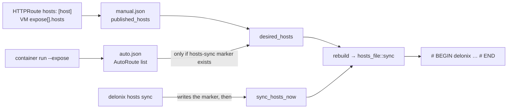

<!-- translated-from: service-names-and-hosts.md sha256:b9b856f54706cbe896f0eccfe8259eb95641bcd2979c1fbb6de35a57fa0b309a -->
# Como os nomes chegam ao `/etc/hosts`

**Antes de leres:** [Arquitectura](architecture.md#state-on-disk) (o state root, `httproute/`), [Variáveis de ambiente](environment-variables.md) (`DELONIX_ROOT`, `DELONIX_HOSTS_FILE`) e [Clonar, compilar e testar](build-and-test.md#the-gates-ci-runs) (isolar o estado do motor).

Um workload na SDN não é alcançável a partir do host pelo seu IP; a entrada é o proxy L7, que o
forward do slirp publica no loopback. Por isso um browser na máquina do operador só abre
`http://app.example.pt:8080/` quando o nome `app.example.pt` resolve para `127.0.0.1` (ou para um
endereço que a rota reservou). O motor consegue escrever esse mapeamento por ti. Esta página explica o
único mecanismo por trás disso, as duas vias por onde um nome entra nele, e o que cada uma recusa
fazer. Tudo o que se segue é lido dos ficheiros nomeados ao lado; as decisões são o ADR-0046
(`hosts: [host]`) e o ADR-0048 (`hosts sync`), que deves ler para perceber o *porquê*.

## Um bloco por state root

Tudo isto vive em `bins/delonix-runtime-bin/src/cmd/hosts_file.rs`. O motor nunca reescreve o
ficheiro de hosts: é dono de **um bloco delimitado** e deixa todos os outros bytes em paz.

```text
# BEGIN delonix 3fa2c1d0 (managed — do not edit)
127.0.0.1	app.example.pt
127.0.0.1	web.default.svc.delonix.internal
# END delonix 3fa2c1d0
```

- **O id nomeia o state root.** `root_id()` é um hash FNV-1a de `state_root()`, truncado a 32 bits e
  impresso como oito dígitos hexadecimais. É um hash escrito à mão de propósito: o `DefaultHasher` não
  promete ser estável, e um bloco órfão por uma mudança de hash é um nome que nunca mais desaparece.
  Duas raízes na mesma máquina (uma raiz isolada ao lado da real; root e um utilizador rootless)
  são donas cada uma do seu bloco, por isso nenhuma apaga os nomes da outra quando o reconstrói.
- **O bloco é reescrito por inteiro** (`block`, `render`). As entradas são passadas a minúsculas,
  ordenadas e sem duplicados, e o `render` é puro: recebe o texto existente e as entradas pretendidas
  e devolve o texto novo, por isso os casos que importam são testes unitários. Um nome que já não
  tem fonte simplesmente não está na reescrita seguinte; não há nada a ceifar. Uma lista vazia remove
  o bloco.
- **O bloco é reescrito no lugar**, onde estava. Os blocos de duas raízes não trocam de posição a
  cada sync. As linhas mantêm os seus próprios fins de linha (CRLF e a falta de newline final são
  preservados).

### O que o `render` recusa

Cada uma destas situações é um `Error::Invalid` devolvido *antes* de qualquer escrita, por isso o
ficheiro fica intocado:

| Situação | Porque é recusada |
|---|---|
| Um nome pretendido já tem uma entrada **fora** do bloco desta raiz (uma linha escrita à mão, ou o bloco de outra raiz) | O operador, ou outra raiz, escreveu essa linha. Uma segunda resposta para o mesmo nome mudaria em silêncio para onde ele aponta. Comentários que apenas mencionam o nome não contam. |
| Um nome com **dois endereços diferentes** na mesma reescrita | Duas rotas a reclamá-lo a partir de pools diferentes: o resolvedor tomaria a linha que lesse primeiro. |
| O bloco desta raiz tem uma linha `# BEGIN` mas **nenhum `# END`** | Normalmente uma edição à mão. Tratar «até ao fim do ficheiro» como o bloco apagaria as linhas escritas à mão e os blocos de outras raízes que vêm a seguir. A mensagem diz-te que linha repor. |

### Como escreve (`sync_at`)

1. Lê o ficheiro; `render`; se o resultado for igual ao que foi lido, **devolve sem escrever**. É
   por isso que um manifesto que não usa `hosts:` nunca precisa de root.
2. Resolve os symlinks (`canonicalize`), para que um ficheiro de hosts que seja um symlink seja
   editado através do link e o link não seja substituído por um ficheiro normal.
3. Toma um `flock` exclusivo em `.hosts.delonix.lock` junto ao alvo, volta a ler, e volta a fazer
   `render` se o ficheiro mudou entretanto. Dois escritores não podem intercalar um
   ler-modificar-escrever.
4. Escreve um ficheiro temporário `.hosts.delonix.<pid>.<nanos>` junto ao alvo, aberto com
   `create_new` (`O_EXCL`): um nome que ninguém consegue adivinhar e que não pode ser pré-criado como
   symlink para redireccionar a escrita. Copia as permissões do alvo, `sync_all` (um crash entre o
   rename e os dados chegarem ao disco não pode deixar um mapa nome→endereço vazio), e depois `rename`
   por cima do alvo.

O motor não testa «sou root?». Tenta a escrita e, em `PermissionDenied`, devolve um erro que imprime o
bloco exacto para colar. Uma corrida sem privilégio pára, portanto, com o bloco no ecrã; não salta o
nome em silêncio. (Se o ficheiro de lock não puder ser criado, o lock simplesmente não é tomado; a
escrita falha então com a mesma mensagem.)

## De onde vêm os nomes

Há duas entradas, e acabam no mesmo bloco através da mesma função (`sync` em `hosts_file.rs`),
chamada a partir de `rebuild` em `cmd/ingress_proxy.rs`.



### Via A: `hosts: [host]` numa rota (ADR-0046)

O `HttpRouteSpec.hosts` (`cmd/httproute.rs`) aceita hoje um só valor, `host` (`HOSTS_TARGETS`); tudo o
resto é recusado na validação, e a mensagem diz que `containers` precisa do ADR-0047 e que `guest` está
planeado. Quando uma rota lista `host`, o `apply` regista um `PublishedHost { host, source, addr }` por
cada host de regra na configuração manual da rota (`published_hosts`, em `<root>/httproute/manual.json`,
ou `httproute-host/` para uma rota servida pelo proxy da netns do host — ver `Where` em
`ingress_proxy.rs`). O `source` é o documento que o pediu, para o reconciliador saber de quem é o nome,
e o `remove_for_prune` poder largar exactamente os nomes desse documento.

Uma `VirtualMachine` chega à mesma via através de `spec.expose[]` (`cmd/vm_expose.rs`): o açúcar baixa,
ao carregar, para um `HTTPRoute` sintético chamado `<vm>-expose`, e o `expose[].hosts` é copiado para
ele. A rota publica uma só lista para todos os seus nomes, por isso todas as entradas de `expose` têm
de levar os mesmos `hosts`; uma diferença é um erro, coberto por
`hosts_are_carried_to_the_route_and_must_agree_across_entries`.

**O endereço** é `127.0.0.1`, a menos que a rota tenha `spec.pool`. Nesse caso o `apply` reserva um
endereço desse `kind: IPPool` (`cmd/ippool.rs`: `peek`, `claim_moving`, `address_present`) e o nome
aponta para ele. Duas condições que vale a pena conhecer: o endereço já tem de estar numa interface do
host (o apply pára e sugere `ip addr add … dev lo`; o motor acrescentá-lo, `announce: l2`, não está
construído), e a reserva é vista *antes* de ser tomada, para que um apply falhado não deixe um lease
retido. **A porta não está no ficheiro de hosts**: um ficheiro de hosts não a pode levar, por isso o URL
que abres continua a ter a porta do entrypoint da rota.

### Via B: `delonix hosts sync` (ADR-0048, fase 2)

`cmd/hosts.rs`. O nome de serviço padrão de um container registado com `container run --expose` é
`<name>.<ns>.svc.delonix.internal` (`AutoRoute::fqdn`, que chama `delonix_sdn::infra::service_fqdn`).
Esses registos são entradas `AutoRoute { name, namespace, ip, port }` em `<root>/httproute/auto.json`.
O `hosts sync` é um opt-in explícito:

| Comando | O que faz |
|---|---|
| `delonix hosts sync --print` | Imprime o bloco que seria escrito (`hosts_block_now`) e não toca em nada, por isso não precisa de root. |
| `delonix hosts sync` | Escreve o marcador `<root>/hosts-sync`, e depois reescreve o bloco (`sync_hosts_now`). Se a escrita for recusada o marcador é removido outra vez, para que uma primeira corrida falhada não deixe os `--expose` seguintes a avisar de um bloco que ninguém aceitou. |
| `delonix hosts sync --off` | Remove o marcador e reescreve o bloco. |

Assim que o marcador existe, o `desired_hosts` inclui os nomes das auto-rotas, e o `container run
--expose` (`auto_register`) e o `container rm` (`auto_deregister`) reconstroem o bloco por si. Os
nomes automáticos apontam sempre para `127.0.0.1`; o `--expose` de um container não tem pool. Os nomes
`hosts:` das rotas declaradas **não** são publicados pelo `hosts sync` (o opt-in próprio delas
prevalece), e o `--off` remove portanto só os nomes automáticos: os nomes pedidos pelo `hosts: [host]`
de uma rota ficam no bloco. A mensagem do próprio comando («service names removed») refere-se aos
primeiros.

### Dois tipos de nome, duas políticas de falha

O `desired_hosts` devolve um par: nomes que um **documento pediu** (`strict`) e nomes **publicados pelo
`hosts sync`**. O `rebuild` chama `hosts_file::sync` e, se falhar:

- sem **nenhum** nome strict, apenas imprime `warning: …` (um `container run --expose` sem privilégio
  não deve falhar porque o `/etc/hosts` precisa de root);
- com **algum** nome strict presente, devolve o erro e o apply falha.

Lê esta condição com cuidado: ela olha para se existem nomes strict no bloco, não para qual nome causou
a falha. Assim, enquanto houver uma rota com `hosts: [host]` declarada, uma escrita que falha por
causa apenas de um nome automático também faz falhar a operação que desencadeou o rebuild.

## Corrê-lo como root: `sudo`

O `delonix hosts sync` chama primeiro `cmd::vmbridge::adopt_invoking_user_root()`. Sob `sudo` o state
root seria o do root (`/var/lib/delonix`), que não tem registos, e o comando publicaria zero nomes em
vez dos do utilizador que o invocou. A função lê `SUDO_USER`, procura a sua home com `getent passwd`,
e define `DELONIX_ROOT` como `<home>/.local/share/delonix`. Um `DELONIX_ROOT` explícito prevalece, e
fora do `sudo` nada muda. O id do bloco é o hash da raiz resultante, por isso o `sudo delonix hosts
sync` e o `delonix container run --expose` do próprio utilizador concordam no mesmo bloco.

## Testá-lo sem tocar em `/etc/hosts`

Define `DELONIX_HOSTS_FILE` (lido por `hosts_path()`) e isola o estado, como descreve
[Clonar, compilar e testar](build-and-test.md#the-gates-ci-runs). A via B não precisa de proxy nem de
container para *escrever* o bloco, só do ficheiro de registo, por isso podes fabricá-lo:

```bash
S=$(mktemp -d)                                   # or your scratch directory
export DELONIX_ROOT=$S/root DELONIX_NET_RUNTIME_DIR=$S/run DELONIX_HOSTS_FILE=$S/hosts
mkdir -p "$DELONIX_ROOT/httproute" "$DELONIX_NET_RUNTIME_DIR"
printf '127.0.0.1\tlocalhost\n' > "$DELONIX_HOSTS_FILE"
printf '[{"name":"web","namespace":"default","ip":"10.210.0.5","port":80}]' \
  > "$DELONIX_ROOT/httproute/auto.json"

delonix hosts sync --print      # the block, nothing written
delonix hosts sync              # writes it into $DELONIX_HOSTS_FILE
delonix hosts sync --off        # removes it; the rest of the file is as it was
```

Corrido assim, o motor imprimiu o bloco para o `--print` sem criar o `hosts-sync`; o `hosts sync`
escreveu o bloco depois da linha `localhost` existente e criou o marcador; o `--off` removeu o marcador
e deixou o ficheiro como estava; uma linha escrita à mão para o mesmo nome fez o `hosts sync` falhar
com a linha ofensora e sem escrever nada; e um ficheiro de hosts num directório só de leitura fê-lo
falhar com o bloco para colar e **remover o marcador outra vez**. (O `--off` imprime «removed from
/etc/hosts» seja o que for que o `DELONIX_HOSTS_FILE` diga; a mensagem é texto fixo.) A via A só foi
verificada até à validação: `hosts: [guest]` é recusado com a mensagem acima, e o `stack apply
--dry-run` mantém `hosts: [host]` no documento renderizado. Não foi arrancado nenhum proxy.

Os testes unitários em `hosts_file.rs` exercitam directamente o `render` e o `sync_at` (o `sync_at`
recebe o caminho, para os testes nunca tocarem no ambiente do processo). Corre `cargo test -p
delonix-runtime-bin hosts_file`.

## O que não está validado

Di-lo numa revisão em vez de o assumires:

- **O `/etc/hosts` verdadeiro.** Todas as corridas acima usaram um ficheiro de rascunho. Esta página
  não observou a escrita do ficheiro real, como root.
- **Um cliente a resolver um nome do bloco e a alcançar o backend.** O ADR-0046 regista que este passo
  de tráfego também não foi observado (o bloco, as recusas e a remoção foram medidos). O açúcar
  `expose:` com `hosts:` foi coberto por testes unitários e `--dry-run`, não por tráfego.
- **`hosts: guest`** e **`announce: l2`** não estão construídos: o `guest` é recusado pela validação,
  e um endereço que não está no host é recusado em vez de acrescentado.
- **A manutenção automática precisa de um processo que consiga escrever o ficheiro.** Um `container
  run --expose` rootless depois de `sudo delonix hosts sync` apenas avisa quando não consegue reescrever
  o `/etc/hosts`; o bloco mantém então os nomes antigos até algo com permissão o reescrever.
- O lado da **remoção** da política de falha acima (um `rm` que não consegue escrever o ficheiro) foi
  lido no código, não corrido sem root.

## Onde ler a seguir

- `cmd/hosts_file.rs` para o mecanismo, `cmd/ingress_proxy.rs` (`desired_hosts`, `rebuild`,
  `hosts_block_now`, `sync_hosts_now`, `hosts_sync_flag`) para as duas entradas.
- `docs/adr/0046-vm-expose-ippool-hosts.md` e `docs/adr/0048-service-names-and-credentials.md` para as
  decisões e o que cada uma diz que foi medido.

---

**A seguir:** [Convenções de código](coding-conventions.md) — como o código neste repositório tem de ser escrito, cada regra etiquetada com o gate ou a decisão que está por trás.
