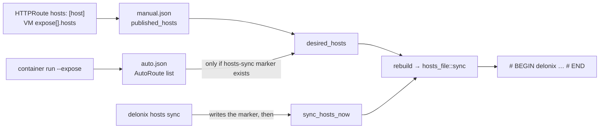

# How names reach `/etc/hosts`

**Before you read:** [Architecture](architecture.md#state-on-disk) (state root, `httproute/`), [Environment variables](environment-variables.md) (`DELONIX_ROOT`, `DELONIX_HOSTS_FILE`) and [Clone, build and test](build-and-test.md#the-gates-ci-runs) (isolating the engine's state).

A workload on the SDN is not reachable from the host by its IP; the way in is the L7 proxy, which the
slirp forward publishes on loopback. So a browser on the operator's machine only opens
`http://app.example.pt:8080/` once the name `app.example.pt` resolves to `127.0.0.1` (or to an
address the route reserved). The engine can write that mapping for you. This page explains the one
mechanism behind it, the two ways a name gets into it, and what each refuses to do. Everything
below is read from the files named next to it; the decisions are ADR-0046 (`hosts: [host]`) and
ADR-0048 (`hosts sync`), which you should read for the *why*.

## One block per state root

All of it lives in `bins/delonix-runtime-bin/src/cmd/hosts_file.rs`. The engine never rewrites the
hosts file: it owns **one delimited block** and leaves every other byte alone.

```text
# BEGIN delonix 3fa2c1d0 (managed — do not edit)
127.0.0.1	app.example.pt
127.0.0.1	web.default.svc.delonix.internal
# END delonix 3fa2c1d0
```

- **The id names the state root.** `root_id()` is an FNV-1a hash of `state_root()`, truncated to 32
  bits and printed as eight hex digits. It is a hand-rolled hash on purpose: `DefaultHasher` is not
  promised stable, and a block orphaned by a hash change is a name that never goes away. Two roots
  on one machine (an isolated root next to the real one; root and a rootless user) each own their
  own block, so neither erases the other's names when it rebuilds.
- **The block is rewritten whole** (`block`, `render`). Entries are lowercased, sorted and
  deduplicated, and `render` is pure: it takes the existing text and the wanted entries and returns
  the new text, so the cases that matter are unit tests. A name that no longer has a source simply
  is not in the next rewrite; there is nothing to reap. An empty list removes the block.
- **The block is rewritten in place**, where it was. Two roots' blocks do not swap places at every
  sync. Lines keep their own endings (CRLF and a missing final newline are preserved).

### What `render` refuses

Each of these is an `Error::Invalid` returned *before* any write, so the file is untouched:

| Situation | Why it is refused |
|---|---|
| A wanted name already has an entry **outside** this root's block (a hand-written line, or another root's block) | The operator, or another root, wrote that line. A second answer for the same name would silently change where it points. Comments that merely mention the name do not count. |
| One name with **two different addresses** in the same rewrite | Two routes claiming it from different pools: the resolver would take whichever line it read first. |
| This root's block has a `# BEGIN` line but **no `# END`** | Usually a hand edit. Treating "up to the end of the file" as the block would erase the hand-written lines and other roots' blocks that follow. The message tells you which line to restore. |

### How it writes (`sync_at`)

1. Read the file; `render`; if the result equals what was read, **return without writing**. This is
   why a manifest that does not use `hosts:` never needs root.
2. Resolve symlinks (`canonicalize`), so a symlinked hosts file is edited through the link and the
   link is not replaced by a regular file.
3. Take an exclusive `flock` on `.hosts.delonix.lock` beside the target, re-read, and re-render if
   the file changed meanwhile. Two writers must not interleave a read-modify-write.
4. Write a temporary file `.hosts.delonix.<pid>.<nanos>` beside the target, opened with
   `create_new` (`O_EXCL`): a name nobody can guess that cannot be pre-created as a symlink to
   redirect the write. Copy the target's permissions, `sync_all` (a crash between the rename and the
   data reaching disk must not leave an empty name→address map), then `rename` over the target.

The engine does not test "am I root?". It tries the write and, on `PermissionDenied`, returns an
error that prints the exact block to paste. An unprivileged run therefore stops with the block on
the screen; it does not skip the name silently. (If the lock file cannot be created the lock is
simply not held; the write then fails with the same message.)

## Where the names come from

There are two inputs, and they end up in the same block through the same function
(`sync` in `hosts_file.rs`), called from `rebuild` in `cmd/ingress_proxy.rs`.



### Path A: `hosts: [host]` on a route (ADR-0046)

`HttpRouteSpec.hosts` (`cmd/httproute.rs`) accepts one value today, `host` (`HOSTS_TARGETS`);
anything else is refused at validation, and the message says `containers` needs ADR-0047 and `guest`
is planned. When a route lists `host`, `apply` records one `PublishedHost { host, source, addr }` per
rule host in the route's manual config (`published_hosts`, in `<root>/httproute/manual.json`, or
`httproute-host/` for a route served by the host-netns proxy — see `Where` in `ingress_proxy.rs`).
`source` is the document that asked, so the reconciler can tell whose name it is, and `remove_for_prune`
can drop exactly that document's names.

A `VirtualMachine` reaches the same path through `spec.expose[]` (`cmd/vm_expose.rs`): the sugar
lowers at load into a synthetic `HTTPRoute` named `<vm>-expose`, and `expose[].hosts` is copied onto
it. The route publishes one list for all its names, so every `expose` entry must carry the same
`hosts`; a difference is an error, covered by
`hosts_are_carried_to_the_route_and_must_agree_across_entries`.

**The address** is `127.0.0.1` unless the route has `spec.pool`. Then `apply` reserves one address
from that `kind: IPPool` (`cmd/ippool.rs`: `peek`, `claim_moving`, `address_present`) and the name
points at it. Two conditions worth knowing: the address must already be on an interface of the host
(the apply stops and suggests `ip addr add … dev lo`; the engine adding it, `announce: l2`, is not
built), and the reservation is looked at *before* it is taken so a failed apply does not leave a
lease held. **The port is not in the hosts file**: a hosts file cannot carry one, so the URL you
open still has the route's entrypoint port.

### Path B: `delonix hosts sync` (ADR-0048, phase 2)

`cmd/hosts.rs`. The standard service name of a container registered with `container run --expose` is
`<name>.<ns>.svc.delonix.internal` (`AutoRoute::fqdn`, which calls
`delonix_sdn::infra::service_fqdn`). Those registrations are `AutoRoute { name, namespace, ip, port }`
entries in `<root>/httproute/auto.json`. `hosts sync` is an explicit opt-in:

| Command | What it does |
|---|---|
| `delonix hosts sync --print` | Prints the block that would be written (`hosts_block_now`) and touches nothing, so it needs no root. |
| `delonix hosts sync` | Writes the marker `<root>/hosts-sync`, then rewrites the block (`sync_hosts_now`). If the write is refused the marker is removed again, so a failed first run does not leave later `--expose` runs warning about a block nobody accepted. |
| `delonix hosts sync --off` | Removes the marker and rewrites the block. |

Once the marker exists, `desired_hosts` includes the auto-routes' names, and `container run --expose`
(`auto_register`) and `container rm` (`auto_deregister`) rebuild the block on their own. Auto names
always point at `127.0.0.1`; a container's `--expose` has no pool. The `hosts:` names of declared
routes are **not** published by `hosts sync` (their own opt-in wins), and `--off` therefore removes
only the auto names: names asked for by a route's `hosts: [host]` stay in the block. The command's
own message ("service names removed") is about the former.

### Two kinds of name, two failure policies

`desired_hosts` returns a pair: names a **document asked for** (`strict`) and names **published by
`hosts sync`**. `rebuild` calls `hosts_file::sync` and, if it fails:

- with **no** strict names at all, it only prints `warning: …` (an unprivileged `container run
  --expose` must not fail because `/etc/hosts` needs root);
- with **any** strict name present, it returns the error and the apply fails.

Read that condition carefully: it looks at whether strict names exist in the block, not at which
name caused the failure. So while a route with `hosts: [host]` is declared, a failing write caused
only by an auto name also fails the operation that triggered the rebuild.

## Running it as root: `sudo`

`delonix hosts sync` calls `cmd::vmbridge::adopt_invoking_user_root()` first. Under `sudo` the state
root would be root's (`/var/lib/delonix`), which has no registrations, and the command would publish
zero names instead of the invoking user's. The function reads `SUDO_USER`, looks its home up with
`getent passwd`, and sets `DELONIX_ROOT` to `<home>/.local/share/delonix`. An explicit `DELONIX_ROOT`
wins, and outside `sudo` nothing changes. The block's id is the hash of the resulting root, so
`sudo delonix hosts sync` and the user's own `delonix container run --expose` agree on the same
block.

## Testing it without touching `/etc/hosts`

Set `DELONIX_HOSTS_FILE` (read by `hosts_path()`) and isolate the state, as
[Clone, build and test](build-and-test.md#the-gates-ci-runs) describes. Path B needs no proxy and no
container to *write* the block, only the registration file, so you can fabricate it:

```bash
S=$(mktemp -d)                                   # or your scratch directory
export DELONIX_ROOT=$S/root DELONIX_NET_RUNTIME_DIR=$S/run DELONIX_HOSTS_FILE=$S/hosts
mkdir -p "$DELONIX_ROOT/httproute" "$DELONIX_NET_RUNTIME_DIR"
printf '127.0.0.1\tlocalhost\n' > "$DELONIX_HOSTS_FILE"
printf '[{"name":"web","namespace":"default","ip":"10.210.0.5","port":80}]' \
  > "$DELONIX_ROOT/httproute/auto.json"

delonix hosts sync --print      # the block, nothing written
delonix hosts sync              # writes it into $DELONIX_HOSTS_FILE
delonix hosts sync --off        # removes it; the rest of the file is as it was
```

Run this way, the engine printed the block for `--print` without creating `hosts-sync`; `hosts sync`
wrote the block after the existing `localhost` line and created the marker; `--off` removed the marker
and left the file as it was; a hand-written line for the same name made `hosts sync` fail with the
offending line and write nothing; and a hosts file in a read-only directory made it fail with the block
to paste and **remove the marker again**. (`--off` prints "removed from /etc/hosts" whatever
`DELONIX_HOSTS_FILE` says; the message is fixed text.) Path A was checked only up to validation:
`hosts: [guest]` is refused with the message above, and `stack apply --dry-run` keeps `hosts: [host]`
in the rendered document. No proxy was started.

The unit tests in `hosts_file.rs` exercise `render` and `sync_at` directly (`sync_at` takes the path
so the tests never touch the process environment). Run `cargo test -p delonix-runtime-bin hosts_file`.

## What is not validated

Say so in a review rather than assuming:

- **The real `/etc/hosts`.** Every run above used a scratch file. Writing the real file, as root,
  was not observed by this page.
- **A client resolving a name from the block and reaching the backend.** ADR-0046 records that this
  traffic step was not observed either (the block, the refusals and the removal were measured).
  The `expose:` sugar with `hosts:` was covered by unit tests and `--dry-run`, not by traffic.
- **`hosts: guest`** and **`announce: l2`** are not built: `guest` is refused by validation, and an
  address that is not on the host is refused rather than added.
- **Automatic maintenance needs a process that can write the file.** A rootless `container run
  --expose` after `sudo delonix hosts sync` only warns when it cannot rewrite `/etc/hosts`; the block
  then keeps the old names until something with permission rewrites it.
- The **removal** side of the failure policy above (a `rm` that cannot write the file) was read
  in the code, not run without root.

## Where to read next

- `cmd/hosts_file.rs` for the mechanism, `cmd/ingress_proxy.rs` (`desired_hosts`, `rebuild`,
  `hosts_block_now`, `sync_hosts_now`, `hosts_sync_flag`) for the two inputs.
- `docs/adr/0046-vm-expose-ippool-hosts.md` and `docs/adr/0048-service-names-and-credentials.md` for
  the decisions and what each says was measured.

---

**Next:** [Coding conventions](coding-conventions.md) — how code in this repository must be written, each rule tagged with the gate or decision behind it.
