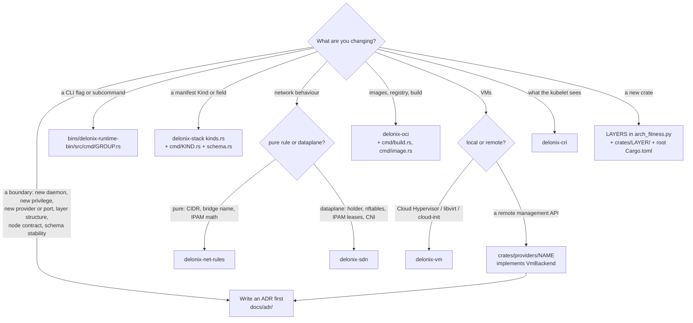

# Start here

This page takes you from "I just cloned the repository" to "my first pull request is under review",
one step at a time. Every step says what to do, what you should see, and which page explains the
details. Every rule on this page links to where it is written down — if a rule is not linked, it is
not a rule.

If a word here is new to you, look it up in the [glossary](glossary.md).

## Day 0 in 30 minutes

### What Delonix is (5 minutes)

Delonix Runtime is an engine that runs **containers and microVMs on one node**, together with the
networking and storage they need. It is:

- **declarative** — you describe resources with its own Kinds (`delonix api-resources` lists them)
  and the engine plans and applies the difference;
- **daemonless** — no background service is required; each command is a process that does its work
  and exits;
- **rootless-first** — the normal path runs as your own unprivileged user.

It does **not** know who uses it: no platform, tenant, account or billing concept exists in the
code. Read [Architecture](architecture.md#engine-identity-and-boundaries) for the full
picture; for now, those four sentences are enough.

### What you need (10 minutes)

A Linux host with cgroup v2 and unprivileged user namespaces, the pinned Rust toolchain from
`rust-toolchain.toml`, and `protoc` on your `PATH`. The full list, and the host traps that look like
engine bugs, are in [Preparing your environment](environment.md). Read at least its
[Known host traps](environment.md#known-host-traps) section before step 5 below.

### Five commands that prove your setup works (15 minutes)

Run these from the root of your checkout. If one of them does not give the shape shown, stop and
fix it before going further — every later step depends on it.

**1. Clone, with the tags.**

```bash
git clone https://github.com/angolardevops/delonix-runtime.git
cd delonix-runtime
git fetch --tags origin
git describe --tags --abbrev=0        # prints the newest release, e.g. vX.Y.Z
```

The tags matter: the version gate and the contract gate compare your branch with them
([Clone, build and test](build-and-test.md#clone)).

**2. Build the CLI.**

```bash
cargo build -p delonix-runtime-bin
```

Expected: `Finished` on the last line and a binary at `target/debug/delonix`. If it stops with a
message about `protoc`, install it ([Preparing your environment](environment.md#protoc-required-to-build)).

**3. Run the tests of a small, pure crate.**

```bash
cargo test -p delonix-net-rules
```

`delonix-net-rules` has no dependencies at all (see its `Cargo.toml`), so this only proves that
your toolchain compiles and runs tests — nothing about the host. Expected: a line of the form
`test result: ok. N passed; 0 failed`.

**4. Run the binary you just built.**

```bash
./target/debug/delonix --version
./target/debug/delonix --help
```

Expected: `--version` prints `delonix <version>` on the first line, a one-line description of the
engine on the second, and then a line of the form `commit: <sha> · built: <date> · <licence>`;
between releases the `commit:` part also says how far the build is from the last tag
(`+N commits since vX.Y.Z`). A short `get started:` block follows. `--help` prints
`Usage: delonix [OPTIONS] <COMMAND>`, a `Commands:` list and a `COMMAND MAP`.

Always use `./target/debug/delonix`, never a `delonix` found on your `PATH` — that one is an
installed release and is usually older ([Preparing your environment](environment.md#a-stale-delonix-on-your-path)).

**5. Run one real command, fully isolated.**

Anything beyond `--help` reads and writes engine state. Point **both** state variables at scratch
directories first — half isolation is worse than none
([Clone, build and test](build-and-test.md#isolating-the-engines-state)):

```bash
export DELONIX_ROOT=$HOME/scratch/dlx/root
export DELONIX_NET_RUNTIME_DIR=/tmp/dlx-run      # keep it short: it holds unix sockets
mkdir -p "$DELONIX_ROOT" "$DELONIX_NET_RUNTIME_DIR"

./target/debug/delonix system info
./target/debug/delonix volume create hello
./target/debug/delonix volume ls
./target/debug/delonix volume inspect does-not-exist; echo "exit=$?"
./target/debug/delonix volume rm hello
```

Expected shapes:

```text
$ delonix system info
Delonix Engine <version>
  state root:         <your $DELONIX_ROOT>
  mode:               rootless (daemonless)
  cgroup2 delegated:  yes | no
  network infra:      down (comes up on demand)
  containers:         0 (0 running)
  events:             0

$ delonix volume ls
NAME    DRIVER   MOUNTPOINT                              SIZE
hello   local    <your $DELONIX_ROOT>/volumes/hello/_data   0 B

$ delonix volume inspect does-not-exist; echo "exit=$?"
error no such volume does-not-exist
exit=4
```

What this proves: the `state root:` line is **your scratch directory** (so you are not touching real
state), the engine runs rootless, and errors carry a class in the exit code (4 = not found — see
[Rust primer for this codebase](rust-primer.md#32-errors-one-error-and-exit-codes-derived-from-its-type)). If
`cgroup2 delegated:` says `no`, `container run` refuses `-m`/`--cpus`/`--cpu-weight` in this
session (exit 69) and `--cpuset`/`--io-weight` have no effect; that is a host setting, explained in
[Preparing your environment](environment.md#cgroup-delegation-some-limits-are-refused-others-are-not-enforced).

When you are done experimenting with networking later, tear the isolated network infra down with
the same two variables exported: `./target/debug/delonix net netns down`.

## Your first contribution, end to end

### 1. Pick something

- Look at open issues labelled **`good first issue`** or **`documentation`** on GitHub. Comment on
  the issue before starting, so two people do not do the same work.
- For anything non-trivial — a new command, a new manifest Kind, a change to namespace or cgroup
  setup, a new backend — open an issue first and agree on the approach
  ([`CONTRIBUTING.md`](../../CONTRIBUTING.md), [Contribution workflow](contributing-workflow.md)).
- Check open pull requests so you do not duplicate work already in flight.

Good first areas, because they are pure code with unit tests and no host privileges: a parser or
validator in the CLI crate, an error message that does not say what to do, a missing Portuguese
entry in `bins/delonix-runtime-bin/data/pt.po`, or a page of this handbook that is wrong.

### 2. Open a worktree from `origin/main`

One task, one worktree, one branch — never edit a shared checkout, never put the worktree in `/tmp`
([One worktree per task](contributing-workflow.md#one-worktree-per-task)):

```bash
git fetch --tags origin
git worktree add -b <topic>/<task> ../.worktrees/delonix-runtime/<task> origin/main
cd ../.worktrees/delonix-runtime/<task>
git log --oneline -- <path you will touch>      # what was already decided or fixed there
```

Reading the history of the area first is part of the job: a lot of this code records things that
were tried, measured and changed ([Start from the latest tag](contributing-workflow.md#start-from-the-latest-tag-not-from-memory)).

### 3. Find where the change goes

Use the decision tree in [Where does my change go?](#where-does-my-change-go) below, then read the
section of [The crates](crates.md) for that crate.

### 4. Write the test first

- A new pure function (parser, validator, argument builder, plan) gets a unit test in the same file,
  under `#[cfg(test)] mod tests`. A test never touches the real state root: pass it a temporary
  directory — see [Tests](rust-primer.md#39-tests).
- A bug fix gets a test that **fails without the fix**. Revert your fix once, run the test, see it
  fail, then restore the fix. A test that passes either way proves nothing.
- A change to namespaces, cgroups, the network holder or VM boot also needs a **live** run with the
  state isolated, because unit tests cannot reach those paths
  ([Run the tests](build-and-test.md#run-the-tests)).

### 5. Run the local gates

Every CI job has a local command, listed in
[The gates CI runs](build-and-test.md#the-gates-ci-runs). At minimum, before asking for
review:

```bash
cargo fmt --all --check
cargo clippy --workspace --all-targets --locked -- -D warnings
cargo test --workspace --locked --no-fail-fast
python3 scripts/lang_ratchet.py
python3 scripts/arch_fitness.py
python3 scripts/dev_docs.py --check
python3 scripts/version_gate.py
```

Add the ones that match what you touched (the CLI surface gates if you added a command, the contract
gate if you touched `proto/`, the docs generator if help text changed) — the table in 02 says which.

### 6. Write the pull request

Open it against `main` and fill in every section of
[`.github/PULL_REQUEST_TEMPLATE.md`](../../.github/PULL_REQUEST_TEMPLATE.md). The template has four
parts, and reviewers read all of them:

- **What does this change do, and why?** — the *why*; the diff already shows the *what*.
- **How was this tested?** — the gates you ran, and for runtime/namespace/cgroup/network code, the
  command you ran **live** and its output.
- **Checklist** — build/clippy/fmt/test clean; new user-facing strings in English wrapped in
  `po::t`/`po::tf` with a Portuguese entry in `pt.po`; every entry point of a command wired; unit
  tests for new pure functions; privilege boundaries called out.
- **Does this cross a privilege or namespace boundary?** — user namespace mapping, the holder netns,
  the control socket, `setns`/`unshare`, or path handling driven by user or manifest input. If you
  are not sure, say so.

Say what was proved **and** what was not validated, and why
([Commits and pull requests](contributing-workflow.md#commits-and-pull-requests)).

### 7. What reviewers check

The code owners in [`.github/CODEOWNERS`](../../.github/CODEOWNERS) review every change. The review
checklist is in [Coding conventions](coding-conventions.md); the cloud-native standards a
change is measured against are in [Cloud native standards](cloud-native-standards.md). Read
both before you open the PR, not after the first round of comments.

### 8. After the merge

Remove the worktree **and** the branch — the branch survives `worktree remove`:

```bash
cd ../../../delonix-runtime    # from the worktree of step 2 back to the clone
git worktree remove ../.worktrees/delonix-runtime/<task>
git branch -D <topic>/<task>
```

## Where does my change go?



| Change | Where it goes (checked in the tree) | Read | Rule and its source |
|---|---|---|---|
| **New CLI flag or subcommand** | `bins/delonix-runtime-bin/src/cmd/<group>.rs` (one module per group); strings through `cmd/po.rs` with Portuguese in `data/pt.po`; manual text in `cmd/manual_entries.rs`; leaf list in `scripts/cli_baseline.tsv` (`scripts/cli-tree.sh --update`). Pure validation of a run belongs in `crates/contexts/delonix-compute/src/preflight.rs` | [Adding or changing a CLI command](contributing-workflow.md#adding-or-changing-a-cli-command), [The CLI](rust-primer.md#36-the-cli-clap-derive-and-translated-output) | LANG-01 (`scripts/lang_ratchet.py`); CLI surface gate (`scripts/cli-tree.sh --gate`, `scripts/docs_cli_gate.py`); wire every entry point (`CONTRIBUTING.md`) |
| **New Kind, or a field on one** | The Kind's facts: `FACTS` in `crates/contexts/delonix-stack/src/kinds.rs`. Its spec type and apply: `bins/delonix-runtime-bin/src/cmd/<kind>.rs`. Live-updatable fields: `hot_fields` in `crates/contexts/delonix-stack/src/reconcile.rs`. The schema: `TYPED_KINDS` in `cmd/schema.rs`, and the published `docs/schema/v1/delonix.json` (`delonix manifest schema`) | [Declarative reconciliation](cloud-native-primer.md#48-declarative-reconciliation), [`delonix-stack`](crates.md#delonix-stack) | Open an issue first (`CONTRIBUTING.md`); the schema is generated from the code ([ADR-0007](../adr/0007-generated-manifest-schema.md)); tests in `kinds.rs` and `schema.rs` fail when a table is left out |
| **Network behaviour** | Pure rules with no I/O: `crates/foundation/delonix-net-rules/src/lib.rs`. Dataplane (holder, control socket, nftables, IPAM, CNI): `crates/adapters/delonix-sdn/src/` (`infra.rs`, `ipam.rs`, `cni.rs`). The network step of `container run`: `crates/contexts/delonix-compute/src/network.rs`. CLI: `cmd/network.rs`, `cmd/net.rs`, `cmd/firewall.rs` | [Container networking](cloud-native-primer.md#45-container-networking), [`delonix-sdn`](crates.md#delonix-sdn) | Rootless-first and no silent failure ([Architecture rules](contributing-workflow.md#architecture-rules-the-gates-enforce)); flag the privilege boundary in the PR (`SECURITY.md`) |
| **Images, registry, build** | `crates/adapters/delonix-oci/src/` (`registry.rs`, `build.rs`, `cas.rs`, `overlay.rs`); CLI in `cmd/build.rs`, `cmd/image.rs` | [Delonixfile and VMfile](delonixfile-and-vmfile.md), [`delonix-oci`](crates.md#delonix-oci) | Downloads are verified by digest (`SECURITY.md`, supply-chain scope) |
| **Persisted state: a record field, a store, file locking, secrets at rest** | Record types (`Container`, `Vm`): `crates/contexts/delonix-compute/src/record.rs`; plain-data parts (`Status`, `ContainerFw`): `crates/foundation/delonix-model/src/records.rs`. How they are stored and locked (`Store`, `JsonStore`, `write_atomic*`, `SecretStore`, `CredVault`): `crates/adapters/delonix-state/src/` (`store.rs`, `secret.rs`, `cred_vault.rs`) | [`delonix-state`](crates.md#delonix-state), [State on disk](architecture.md#state-on-disk), [Concurrency](rust-primer.md#38-concurrency-and-shared-state) | New record fields take `#[serde(default)]`; read-modify-write goes through `update` ([State and concurrency](coding-conventions.md#8-state-and-concurrency)) |
| **VM behaviour on this node** | `crates/adapters/delonix-vm/src/lib.rs` (the `VmBackend` trait and the backend registry), `cloudinit.rs`; CLI in `cmd/vm.rs`, `cmd/vmimage.rs`, `cmd/vmfile.rs` | [Building microVMs](microvm-setup.md), [Traits as ports](rust-primer.md#33-traits-as-ports-vmbackend-and-the-backend-registry) | [ADR-0008](../adr/0008-proxmox-vm-backend.md) (backends are registrable) |
| **A new VM backend or storage provider behind a remote API** | A new crate under `crates/providers/`, implementing a port; registered at the composition root (`cmd/vmbackends.rs`) | [Providers](crates.md#providers), [Layers](architecture.md#layers-and-the-allowed-direction) | ADR first ([When to write an ADR](contributing-workflow.md#when-to-write-an-adr)); [ADR-0040](../adr/0040-engine-restructuring-layers-ports-node-contract.md) |
| **CRI (what the kubelet talks to)** | `crates/interfaces/delonix-cri/src/` (`runtime_svc.rs`, `runtime_svc/lifecycle.rs`, `streaming.rs`) | [Kubernetes](cloud-native-primer.md#46-kubernetes-cri-kubelet-kubeadm-and-kind), [`delonix-cri`](crates.md#delonix-cri) | [ADR-0038](../adr/0038-cri-follows-kubelet-resource-model.md) |
| **A new crate** | An entry in `LAYERS` in `scripts/arch_fitness.py`, a directory under `crates/<layer>/`, and its path in the root `Cargo.toml` `[workspace.dependencies]` — all in the same commit | [Layers](architecture.md#layers-and-the-allowed-direction) | `scripts/arch_fitness.py` (directory = layer, versions only in the root) |
| **A decision that moves a boundary** | `docs/adr/NNNN-title.md`, before the code | [When to write an ADR](contributing-workflow.md#when-to-write-an-adr) | [`docs/adr/README.md`](../adr/README.md); accepted ADRs are superseded, never rewritten |

If your change does not fit any row, ask in the issue before writing code (see
[When you are stuck](#when-you-are-stuck)).

## Rules you must not break

Each rule is enforced by a gate, a review, or both. The link is where it is written.

| Rule | Source |
|---|---|
| **The engine knows no consumer.** No product, platform, control plane, console or agent that uses the engine is named in `crates/`, `bins/`, `proto/` or the manifests, comments included; no tenant, account, plan or billing. | *«Identidade e fronteira do motor»* at the top of [`AGENTS.md`](../../AGENTS.md). The named consumers are enforced by `CONSUMER_NAMES` in `scripts/arch_fitness.py` (a fixed list of names, matched by regular expression); the ban on tenant, account, plan and billing concepts is not matched by any gate and is checked in review |
| **Daemonless.** No resident process by default; a new one needs an ADR with evidence of what systemd could not do. | [`AGENTS.md`](../../AGENTS.md) (same section); [Architecture rules](contributing-workflow.md#architecture-rules-the-gates-enforce) |
| **Rootless-first.** The normal path runs unprivileged; privilege is an explicit, announced opt-in. A new privilege boundary needs a GO/NO-GO spike and an ADR. | [`AGENTS.md`](../../AGENTS.md); [When to write an ADR](contributing-workflow.md#when-to-write-an-adr) |
| **Dependencies point inward, the directory is the layer, versions live only in the root.** | [ADR-0040](../adr/0040-engine-restructuring-layers-ports-node-contract.md); `scripts/arch_fitness.py` |
| **LANG-01: code is English.** Identifiers, comments and messages in English; Portuguese only through `pt.po`. | [Language](contributing-workflow.md#language-english-in-the-code-lang-01); `scripts/lang_ratchet.py` |
| **Version alignment.** Do not change `version` in the root `Cargo.toml` in a feature PR; your branch must contain the newest tag. | [Version alignment](contributing-workflow.md#version-alignment); `scripts/version_gate.py` |
| **One worktree per task**, outside `/tmp`, stage files by name, remove worktree and branch at the end. | [One worktree per task](contributing-workflow.md#one-worktree-per-task) |
| **Never run the engine, the E2E battery or the chaos harness against real state.** Export both `DELONIX_ROOT` and `DELONIX_NET_RUNTIME_DIR`; do not set `E2E_SHARED_STATE=1` unless you are diagnosing your own host. | [Isolating the engine's state](build-and-test.md#isolating-the-engines-state), [E2E](build-and-test.md#end-to-end-battery-scriptse2esh), [chaos](build-and-test.md#chaos-harness-scriptschaossh) |
| **Security-sensitive changes are called out**, and vulnerabilities are reported privately, never in a public issue or PR. | [`SECURITY.md`](../../SECURITY.md); [Security-sensitive changes](contributing-workflow.md#security-sensitive-changes) |

## When you are stuck

Look in this order — each step is cheaper than the next:

1. **This handbook.** The [README](README.md) has the page list; the [glossary](glossary.md)
   explains the vocabulary.
2. **[`AGENTS.md`](../../AGENTS.md)**, organised by area. It is long and partly historical (and
   partly in Portuguese): use it to learn *where* to look, then confirm in the code.
3. **The ADR index**, [`docs/adr/README.md`](../adr/README.md) — the decision behind a structure,
   and what was rejected.
4. **The history of the file**: `git log --oneline -- <path>` and `git log -p -S '<symbol>'`. Commit
   messages here explain why.

If you are still stuck, **ask** on GitHub:

- Comment on the issue you are working on, or open a new one with
  [the feature request template](../../.github/ISSUE_TEMPLATE/feature_request.md) (for questions
  about an approach) or [the bug report template](../../.github/ISSUE_TEMPLATE/bug_report.md).
- A security problem goes through [private vulnerability reporting](../../SECURITY.md), not an issue.

The bug report template asks for:

- the output of `delonix --version`;
- distro and kernel version, rootless or root, and whether you installed with `install.sh`,
  downloaded a binary, or built from source;
- the exact command or manifest that triggers it;
- what you expected, and the **full, untrimmed** output of what actually happened;
- whether it reproduces every time, sometimes, or only once;
- anything else that might be relevant.

This handbook additionally recommends two things the template does not ask, because they save a
round trip:

- the **whole** `--version` output of the binary you ran, including the `commit:` line (between
  releases every build reports the same version number, and only the commit tells them apart);
- whether `DELONIX_ROOT`/`DELONIX_NET_RUNTIME_DIR` were set, and what you already read and tried
  (the page, the `AGENTS.md` section, the ADR).

## Progress checklist

- [ ] I read what Delonix is and the four principles ([Architecture](architecture.md#engine-identity-and-boundaries)).
- [ ] My host meets [Preparing your environment](environment.md), and I read the known host traps.
- [ ] `cargo build -p delonix-runtime-bin` finishes.
- [ ] `cargo test -p delonix-net-rules` reports `test result: ok`.
- [ ] `./target/debug/delonix --help` works, and I stopped using the `delonix` on my `PATH`.
- [ ] `delonix system info` shows my scratch `DELONIX_ROOT` as the state root.
- [ ] I picked an issue and commented on it (or opened one for a non-trivial change).
- [ ] I work in my own worktree created from `origin/main`.
- [ ] I found where the change goes and read that crate's section in [The crates](crates.md).
- [ ] I wrote a test that fails without my change.
- [ ] The local gates from [Clone, build and test](build-and-test.md#the-gates-ci-runs) pass.
- [ ] I read [Coding conventions](coding-conventions.md) and [Cloud native standards, layer by layer](cloud-native-standards.md).
- [ ] My PR fills every section of the template, including what was *not* validated.
- [ ] After the merge, I removed my worktree and my branch.
