<!-- translated-from: architecture.md sha256:b386f534ba4f3a6df4c7e43ccb89095987972faa8be57403b9127c8a62dd2551 -->
# 架构

**阅读之前：** [项目结构](project-structure.md)（各部分位于何处）、[IaaS 与云原生](iaas-and-cloud-native.md)（引擎的位置与原则），以及[云原生入门](cloud-native-primer.md)（各图所命名的机制）。

本页是贡献者在触碰后端之前需要的地图：引擎是什么、谁与它对话、运行时存在哪些进程、各个
crate 如何分层并相互调用，以及状态在磁盘上位于何处。它按顺序遵循 C4 模型——**第 1 层**系统上下文、
**第 2 层**容器（可执行文件与进程）、**第 3 层**组件（crate），以及**第 4 层**作为序列的代码级流程。
图中的每一个节点和箭头，都会在旁边的文字中说明它所对照检查的文件和符号。读完之后，你就能说出一段工作
运行在哪个进程中、一个 crate 属于哪一层、它可以带上哪些依赖，以及它的状态在磁盘上位于何处。

权威且更详细的文档是仓库根目录下的 [`ARCHITECTURE.md`](../../../ARCHITECTURE.md)；结构背后的
决策在 [`docs/adr/`](../../adr/) 中，尤其是
[ADR-0040](../../adr/0040-engine-restructuring-layers-ports-node-contract.md)。如果某个术语对你来说
是新的，请先阅读 [IaaS 与云原生](iaas-and-cloud-native.md)和
[Linux 基础](linux-foundations.md)；至于目录树本身（每个顶层目录的用途），见
[项目结构](project-structure.md)。

> **本页有两个部分。** 层级表、ratchet 列表和完整的 crate 图都是由 `python3 scripts/dev_docs.py`
> 从 `Cargo.toml` 和 `scripts/arch_fitness.py` **生成**的——不要手工编辑它们。其余部分都是叙述性内容，
> 在每次结构性变更后接受复核。

**如何阅读这些图。** 每张图都使用相同的形状和颜色，并且图例总是排在最前面：

| 形状 | 含义 |
|---|---|
| 圆角方框，深色 | 人或外部行为者（操作者、kubelet、本地程序） |
| 方框，红色 | 整个 Delonix 引擎（本仓库） |
| 方框，白底红边 | 引擎的一个构建块：可执行文件、进程或 crate |
| 方框，灰色 | 外部系统（内核、systemd、镜像仓库、hypervisor、远程 API） |
| 圆柱体，蓝色 | 磁盘上的状态 |
| 实线箭头 | 一次调用或数据流；标签说明流动的内容 |
| 虚线箭头 | 启动、`exec` 或监督一个进程 |
| 带边框的区域 | 信任边界或进程边界 |

## 引擎的身份与边界

权威文本是 [`AGENTS.md`](../../../AGENTS.md) 顶部的 *«Identidade e fronteira do motor»*
（引擎的身份与边界）一节。引擎是什么、它把什么留给控制平面，以及每条云原生原则如何体现在代码中，
这些是*上下文*，在
[IaaS 与云原生](iaas-and-cloud-native.md#where-delonix-runtime-fits-and-where-it-deliberately-stops)
中有解释。本节只保留塑造下文*结构*的那些部分：

- **各个 provider 都位于端口（port）之后。** Linux 内核、Cloud Hypervisor 与 libvirt、Proxmox VE
  以及 Kubernetes 的 CRI，都是通过一个 trait 来访问的，绝不会在代码中散布
  `if provider == …` 这样的分支。今天已有的端口：`VmBackend`
  （`crates/adapters/delonix-vm/src/lib.rs`），以及
  `crates/contexts/delonix-compute/src/ports.rs` 和 `launch.rs` 中的计算端口
  （`ImageStore`、`StorageProvider`、`DeviceResolver`、`RunHost`、`NetworkProvider`、
  `VmNetwork`、`WorkloadRuntime`）。一个 OpenStack 后端已经设计好
  （[ADR-0039](../../adr/0039-openstack-vm-backend.md)，*Proposed*），但还没有对应的 crate。
- **一套操作，多个接口** —— CLI、CRI、本地管理 API、MCP，以及 Docker Engine API 的一个切片，
  节点契约是预期中唯一的 API（见[下文](#one-set-of-operations-several-interfaces)）；
  可观测性通过 `crates/adapters/delonix-telemetry` 实现。
- **无守护进程与无根优先决定了进程模型** —— 必须持久化的东西属于 systemd，或者属于一个有明确
  归属者的按工作负载进程（容器的 supervisor、网络的 pin），特权是显式的可选项
  （`--privileged`、`vm bridge`）。第 2 层展示了这些进程。
- **不认识任何消费者。** `crates/`、`bins/`、`proto/` 或清单中都不会出现任何平台、控制平面、
  控制台或代理的名字，也没有租户、账户、方案或计费的概念。你会在各处看到的
  *namespace*，是引擎自己的**隔离（isolation）**命名空间，不是租户。

这些不是约定；`scripts/arch_fitness.py` 会在 CI 中强制执行结构性的那一半：

| 检查项 | 在 `arch_fitness.py` 中的位置 |
|---|---|
| 一个依赖违反层级方向即失败，除非它是一个声明过的例外，并且注明了移除它的 ADR-0040 阶段 | `LAYERS`、`ALLOWED`、`EXCEPTIONS`、`rule_failures` |
| 基础（foundation）或上下文（context）crate 不得携带运行时/服务器/CLI 依赖（`tokio`、`tonic`、`reqwest`、`clap`……） | `HEAVY` |
| 一个二进制文件只能组合**一个**接口 crate | `rule_failures`（`roles` 检查） |
| 一个 crate 必须位于其所属层的目录中 | `LAYER_DIR`、`misplaced` |
| 在 `crates/`、`bins/`、`proto/` 下任何位置出现消费者的名字（包括注释）即失败 | `CONSUMER_NAMES`、`consumer_mentions` |
| 依赖版本只能存在于根目录的 `[workspace.dependencies]` 中 | `inline_versions` |
| 只能下降、不能上升的 ratchet（见下文）——例如库 crate 重新运行引擎自己的二进制文件、库中出现 `println!`、进程环境写入、适配器把共享的 `Error` 当作自己的来导入 | ratchet 的各个模式（`SELF_EXEC`、`PRINTS`、`ENV_WRITES`、`SHARED_ERROR`……），基线在 `scripts/arch_baseline.json` 中 |

<!-- dev-docs:begin ratchets -->
`scripts/arch_fitness.py` 维护 **5 个债务棘轮（ratchet）**（基线在 `scripts/arch_baseline.json`）：

- `self_exec_sites`
- `library_prints`
- `env_writes`
- `shared_error_imports`
- `raw_error_variant_matches`
<!-- dev-docs:end ratchets -->

`python3 scripts/arch_fitness.py --list` 会逐个文件显示每个 ratchet 今天统计到的数量。

## 第 1 层——系统上下文

> **图例** —— 深色圆角方框：人或外部行为者 · 红色方框：Delonix 引擎 ·
> 灰色方框：外部系统 · 实线箭头：调用或数据流，带标签。

引擎位于四类调用者与一个 Linux 节点上的各系统之间；它自己没有任何面向网络的 API，
它所触及的一切远程系统，都是*向外*触及的。

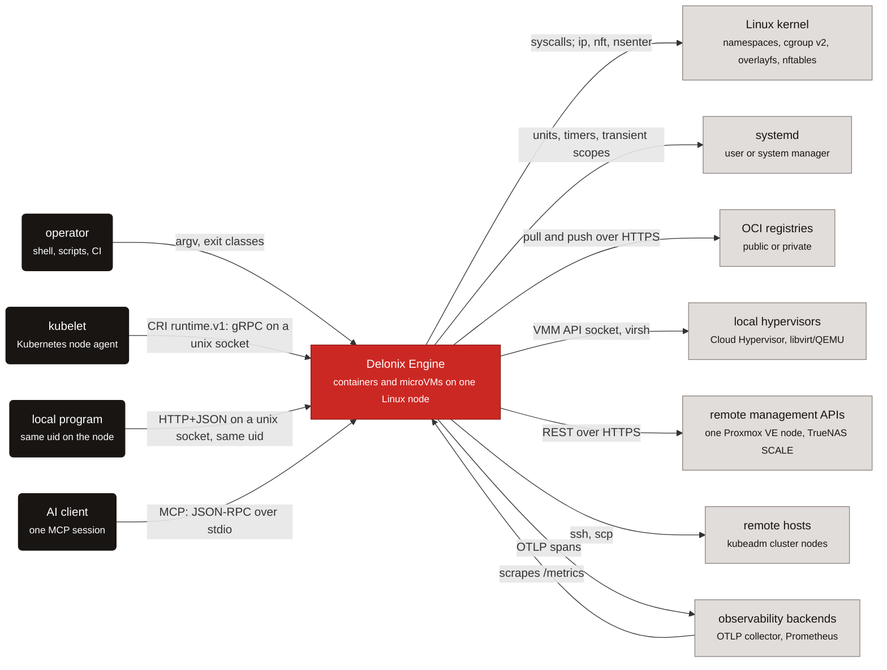

每条箭头在代码中的位置：

| 箭头 | 代码 |
|---|---|
| 操作者 → 引擎 | `bins/delonix-runtime-bin/src/main.rs`（`main`、`run`）；退出类别在 `crates/foundation/delonix-model/src/exitcode.rs` 中 |
| kubelet → 引擎 | `crates/interfaces/delonix-cri/src/lib.rs`（`serve_blocking`） |
| 本地程序 → 引擎 | `crates/interfaces/delonix-mgmt/src/lib.rs`（`serve_blocking`，`axum` 路由器） |
| AI 客户端 → 引擎 | `crates/interfaces/delonix-mcp/src/lib.rs`（`serve_stdio`） |
| 引擎 → 内核 | `crates/adapters/delonix-linux/src/lib.rs`（`spawn`、`container_init`）；`crates/adapters/delonix-sdn/src/infra.rs`（`ip`、`nft`、`nsenter` 子进程） |
| 引擎 → systemd | `crates/adapters/delonix-linux/src/lib.rs` 中的 `busctl` 临时作用域（transient scope）；`bins/delonix-runtime-bin/src/cmd/boot.rs` 中的启动 unit |
| 引擎 → 镜像仓库 | `crates/adapters/delonix-oci/src/registry.rs`（`resolve_or_pull`、`push_to_registry`） |
| 引擎 → hypervisor | `crates/adapters/delonix-vm/src/lib.rs`（`CloudHypervisorBackend`、`LibvirtBackend`） |
| 引擎 → 远程管理 API | `crates/providers/delonix-proxmox/src/lib.rs`、`crates/providers/delonix-truenas/src/lib.rs` |
| 引擎 → 远程主机 | `bins/delonix-runtime-bin/src/cmd/remote.rs`（`ssh`、`scp`），由 `cmd/cluster.rs` 使用 |
| 引擎 ↔ 可观测性 | `crates/adapters/delonix-telemetry/src/telemetry.rs`（OTLP）、`delonix-mgmt` 和 `delonix-cri` 中的 `/metrics` 路由 |

## 第 2 层——容器：可执行文件与进程

在 C4 中，*容器（container）*是指会运行的东西。构建产物包含四个可执行文件（数量见
[手册 README](README.md)中生成的统计）；此外还会出现更多**进程**，按每个工作负载或每个节点计，
每一个都有明确的归属者。下面三张图按关注点拆分这幅图景：谁进入引擎、一个容器要付出多少进程的
成本，以及无根网络基础设施。

### 入口点

**图例**

| 形状 | 含义 |
|---|---|
| 圆角方框，深色 | 调用者 |
| 方框，白底红边 | 引擎可执行文件 |
| 圆柱体，蓝色 | 磁盘上的状态 |
| 实线箭头 | 请求或文件访问，带标签 |
| 虚线箭头 | 进程的 `exec` 或启动 |
| 带边框的区域 | 进程边界 |

有四扇门通向引擎，但只有一次性（one-shot）的 `delonix` 进程会创建容器：多线程服务器为此
会反过来运行 CLI。

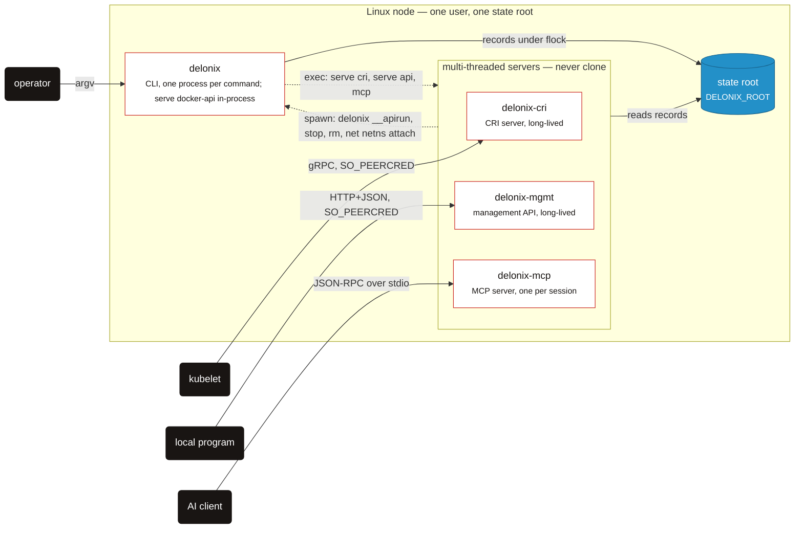

这里的 `exec` 是 `cmd/serve.rs::exec_server`（以及 `cmd/mcp.rs`）；反向运行则是 CRI 的
`delonix()` 辅助函数，以及 `crates/interfaces/delonix-cri/src/runtime_svc/lifecycle.rs` 中的
`write_run_spec`、`delonix-mgmt` 中的 `run_cli`，以及 `delonix-mcp` 中的 `run_cli_blocking`，
它们都通过 `delonix_node::dispatch::cli_bin` 来解析 CLI。CRI 还会在
`cri/` 下写入自己的记录——见[磁盘上的状态](#state-on-disk)。

### 一个后台（detached）容器

**图例**

| 形状 | 含义 |
|---|---|
| 方框，白底红边 | 引擎进程 |
| 方框，灰色 | 外部系统 |
| 圆柱体，蓝色 | 磁盘上的文件 |
| 实线箭头 | 数据流或写入，带标签 |
| 虚线箭头 | fork、clone 或 spawn |
| 带边框的区域 | 与工作负载同生共死 |

一次 `run -d` 恰好会留下三到四个进程，而容器的父进程是 supervisor（监督者）——而不是
守护进程。

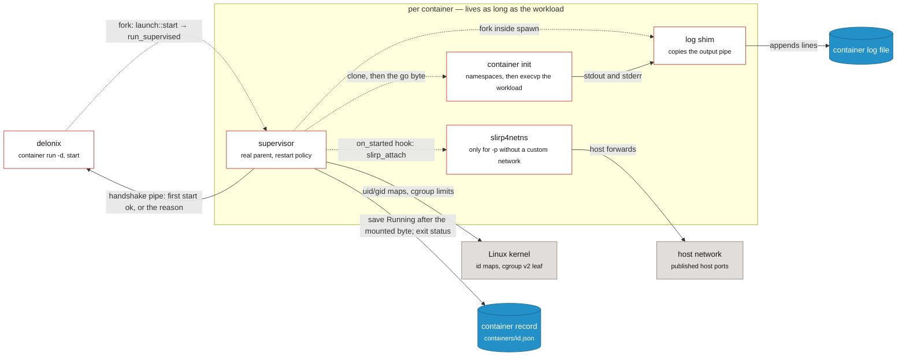

supervisor 是 `crates/adapters/delonix-linux/src/supervise.rs::run_supervised`，由
`delonix_compute::launch::start` 通过 `HostWorkload::supervise`
（`crates/adapters/delonix-linux/src/workload.rs`）选定；在它内部，`create_with` → `spawn`
完成 `clone`、`write_userns_maps`、cgroup 设置、`on_started` 钩子（由
`cmd/container.rs::with_host_workload` 填入 `delonix_sdn::slirp_attach`），并 fork 出
`log_shim`，全部都在 `crates/adapters/delonix-linux/src/lib.rs` 中。记录通过
`delonix_state::Store` 写入。前台（foreground）的 `run` 做的是同样的事，只是没有
supervisor。

### 无根网络基础设施

**图例**

| 形状 | 含义 |
|---|---|
| 方框，白底红边 | 引擎进程 |
| 方框，灰色 | 外部系统 |
| 圆柱体，蓝色 | 磁盘上的状态 |
| 实线箭头 | 请求或流量，带标签 |
| 虚线箭头 | spawn（由 CLI 启动该进程） |
| 带边框的区域 | pin 的用户、网络与挂载命名空间 |

无根网络所需的一切，都存在于由一个只会休眠（sleep）的进程所持有的一组命名空间中；
其余部分可以死亡，并围绕它重新启动。

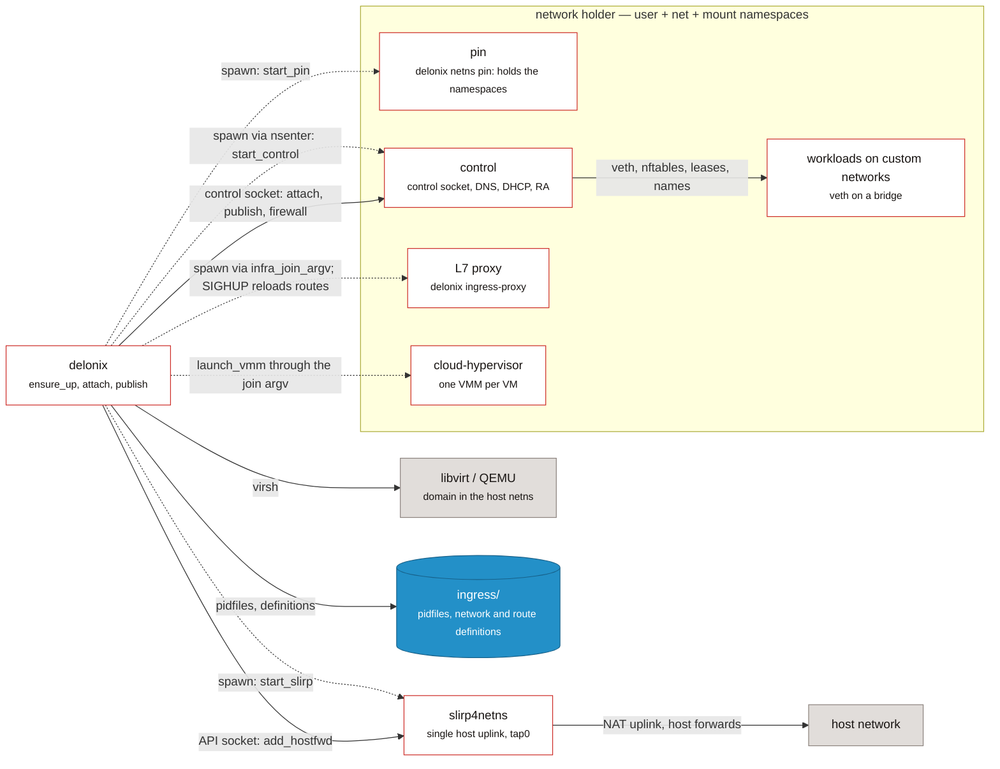

pin、control 与 uplink 分别是 `crates/adapters/delonix-sdn/src/infra.rs` 中的
`start_pin`/`pin_main`、`start_control`/`control_main` 与 `start_slirp`；pin 的命名空间在
`pin_userns.rs` 中创建。代理是 `cmd/ingress_proxy.rs::spawn_proxy`；VMM 的启动是
`delonix_vm::launch_vmm`，由 `VmNetwork` 端口提供加入用的 argv。容器通过 CLI 重新把自己
执行（re-execute）进这些命名空间来加入一个自定义网络
（`reexec_into_netns`，见下文第 4 层中的运行序列）。一台 libvirt 虚拟机则生活在 holder
之外，位于宿主机网络命名空间中的 `virbr0` 上。

### 进程表

| 进程 | 诞生于 | 存活期 |
|---|---|---|
| `delonix` | `bins/delonix-runtime-bin/src/main.rs`（`main`、`run`） | 一条命令的生命周期。`main` 会在 clap 解析**之前**拦截那些隐藏的入口点（`netns pin`、`netns control`、`netns run`、`__rmtree`、`__volsnap`、`__ovlmigrate`、`__ovlhold`、`__duusage`、`__buildtar`、`__apirun`、`__netnsconnect`） |
| `delonix-cri` | `crates/interfaces/delonix-cri/src/bin/delonix-cri.rs` → `delonix_cri::serve_blocking` | 一个服务（通常是一个 systemd unit）。`delonix serve cri` 会对它执行 `exec`（`cmd/serve.rs::exec_server`） |
| `delonix-mgmt` | `bins/delonix-mgmt-bin/src/main.rs` → `delonix_mgmt::serve_blocking` | 一个服务；`delonix serve api` 会对它执行 `exec` |
| `delonix-mcp` | `bins/delonix-mcp-bin/src/main.rs` → `delonix_mcp::serve_stdio` | 一个 AI 客户端会话（stdio 上的一个子进程）；`delonix mcp` 会对它执行 `exec` |
| Docker API 切片 | `cmd/serve.rs` → `cmd::dockerapi::run`，**在** `delonix` 进程**内部** | `delonix serve docker-api` 运行期间 |
| supervisor | `delonix_linux::supervise::run_supervised`，由 `delonix_compute::launch::start` 为调用者能够 fork 的每一次后台启动选定 | 容器的整个生命周期；它是真正的父进程，因此由它收集退出状态并施加 `--restart` |
| container init | `delonix_linux::spawn` → `clone` → `container_init` | 容器本身 |
| log shim | `spawn` 内部的 `fork`，运行 `log_shim` | 容器本身 |
| 每容器一个的 `slirp4netns` | `delonix_sdn::slirp_attach`，作为 `on_started` 钩子被调用 | 容器的 netns；孤儿进程由 `reap_orphan_slirp` 回收 |
| pin | `infra::start_pin` 启动 `delonix netns pin`；`infra::pin_main` 在进程内创建用户、网络与挂载命名空间（`crates/adapters/delonix-sdn/src/pin_userns.rs`）然后休眠 | 整个基础设施的生命周期；它的 pid 就是 `ingress/holder.pid`，且永不改变 |
| control | `infra::start_control`（`nsenter -t <pin> -U -m -n -- delonix netns control`）→ `infra::control_main` | 可重启；提供控制 socket、DNS（`dns_server_main`）、路由器通告 Router Advertisement（`ra_sender_main`）以及每网桥一个的 DHCP（`dhcp_serve`） |
| 单一的 `slirp4netns` | `infra::start_slirp`（`tap0` 接入 pin 的 netns，带 `--api-socket`） | 整个基础设施的生命周期 |
| L7 入口代理 | `cmd/ingress_proxy.rs::spawn_proxy`，通过 `infra::infra_join_argv` | 只要存在一个 `HTTPRoute`/`Ingress` 或 `--expose` 路由；收到 `SIGHUP` 时重新加载路由 |
| `cloud-hypervisor` | `delonix_vm::launch_vmm`，通过基础设施的 join argv 运行 | 该虚拟机的生命周期 |
| libvirt domain | `LibvirtBackend` 驱动 `virsh` | 该虚拟机的生命周期（domain 存在于 libvirt 中） |

`ensure_up`（`crates/adapters/delonix-sdn/src/infra.rs`）是唯一一个在按根目录划分的文件锁下
拉起网络基础设施的函数，它区分三种情况：pin 与 control 都存活（无需操作）；pin 存活但 control
消失（**只**重启控制平面——不移动任何线路）；pin 消失（拆除并重建）。

### 一套操作，多个接口

| 接口 | 传输方式 | 入口 | 状态 |
|---|---|---|---|
| CLI | argv | `bins/delonix-runtime-bin` | 完整的表面 |
| CRI（`runtime.v1`） | 基于 unix socket 的 gRPC，`0600` + `SO_PEERCRED` | `delonix_cri::serve_blocking` | 为 kubelet 提供服务 |
| 管理 API | 基于 unix socket 的 HTTP+JSON，仅限相同 uid | `delonix_mgmt::serve_blocking`（如 `/v1/containers`、`/v1/volumes`、`/metrics` 等路由） | 仅限本地（[ADR-0010](../../adr/0010-remote-management-api.md) 否决了远程 API）；将被节点契约取代 |
| MCP | stdio | `delonix_mcp::serve_stdio` | 本地，无租户（[ADR-0025](../../adr/0025-mcp-local-ai-control-surface.md)） |
| Docker Engine API 切片 | 基于 unix socket 的 HTTP | `cmd::dockerapi::run` | 一个兼容性切片，位于 `delonix` 内部 |
| **节点契约** `delonix.node.v1` | 同一个 unix socket 上的 gRPC **与** HTTP/JSON | `proto/delonix/node/v1/` | **仅契约**——尚无服务器 |

节点契约是预期中唯一的 API（[ADR-0040](../../adr/0040-engine-restructuring-layers-ports-node-contract.md)
D4，[ADR-0042](../../adr/0042-one-engine-api-maturity-and-docs.md)）。`.proto` 文件是权威来源；
`docs/api/openapi.yaml` 是从它们**生成**的，绝不手工编辑。`scripts/contract_gate.py` 会在以下情况失败：
`buf format`、`buf lint`、相对于最近一个携带 `proto/` 的标签的 `buf breaking`、一个没有 HTTP 映射的
RPC（或一个带 HTTP 映射的双向流）、一份与生成结果不同的 OpenAPI 文档，以及两条在不同变量名下其实是
同一个 URL 的路径。它保护的三条规则是：每个 RPC 一个请求消息、请求中显式的身份标识
（`namespace`/`name`），以及通过查询参数寻址的镜像。

## 第 3 层——组件：按层划分的 crate

### 各层及允许的方向

> **图例** —— 白底红边方框：一层 crate · 实线箭头：*可以依赖于*，并注明这个依赖是用来做什么的。

ADR-0040 D1 固定了一个依赖方向：上下文（context）是被依赖的一方，绝不会反过来，
而二进制文件是唯一一个万物汇合的地方。

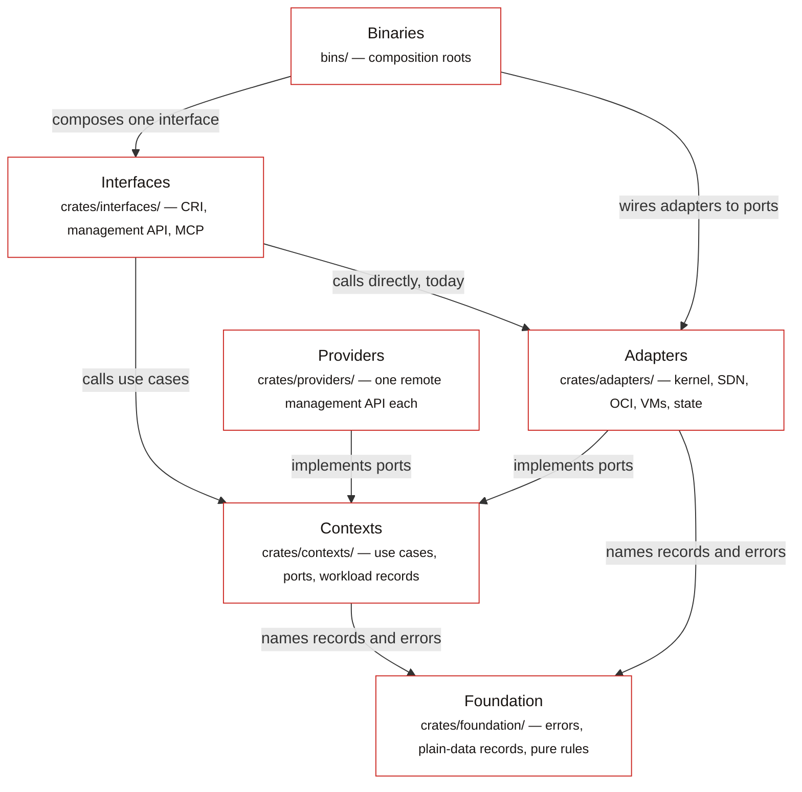

- **Foundation（基础）**（`crates/foundation/`）—— 每一层都可以引用的共享、近乎纯（pure-ish）
  的类型。
- **Contexts（上下文）**（`crates/contexts/`）—— 每个有界上下文（bounded context）一个 crate，
  以已发布的 API 分组命名：用例（use case）以及它们所需的**端口（port）**。没有 HTTP、没有
  provider，也没有挂载、进程或网络配置。`delonix-node` 是唯一一个直接读取宿主机的
  上下文——`/proc`、`/sys`、`kill(pid, 0)`、`SO_PEERCRED`——因为这些问题正是它存在的目的，
  由它集中回答一次。
- **Adapters（适配器）**（`crates/adapters/`）与 **Providers（提供者）**（`crates/providers/`）
  —— 实现端口：内核、SDN、OCI 存储、VM 后端、持久化状态；providers 为某一个远程目标携带一个
  HTTP 客户端。
- **Interfaces（接口）**（`crates/interfaces/`）—— CRI、管理 API、MCP：解析请求、调用引擎、
  呈现结果。
- **Binaries（二进制文件）**（`bins/`）—— 组合根（composition root）。

每个 crate 所属的层，以及它可以依赖的方向：

<!-- dev-docs:begin layers -->
| 层 | 可以依赖 |
|---|---|
| Foundation | foundation |
| Contexts | foundation, contexts |
| Adapters | foundation, contexts |
| Providers | foundation, contexts |
| Interfaces | foundation, contexts, adapters, providers |
| Binaries | foundation, contexts, adapters, providers, interfaces |

已声明的例外（每一项都注明了移除它的 ADR-0040 阶段）：

- `delonix-linux` → `delonix-state` — 移除于 **P4a**
- `delonix-mcp` → `delonix-mgmt` — 移除于 **P5**
- `delonix-oci` → `delonix-state` — 移除于 **P4**
- `delonix-opnsense` → `delonix-sdn` — 移除于 **P4**
- `delonix-proxmox` → `delonix-sdn` — 移除于 **P4**
- `delonix-scanner` → `delonix-oci` — 移除于 **P4**
- `delonix-sdn` → `delonix-state` — 移除于 **P4**
- `delonix-vm` → `delonix-state` — 移除于 **P4**
- `delonix-volume` → `delonix-state` — 移除于 **P4**
<!-- dev-docs:end layers -->

### 重构现状

ADR-0040 是一个分阶段的绞杀者模式（strangler）计划（P0 轨道 → P1 契约 → P2 上下文 →
P3 适配器与二进制文件 → P4 providers → P5 节点 API → P6 CRI → P7 可观测性）。代码今天呈现的状态是：

- **P0 已完成。** 每个 crate 都位于其所属层的目录中，版本统一在 workspace 层级管理，
  且 fitness 门禁会在 CI 中运行。
- **P1 作为一份契约已经完成，但还不是一台服务器。** `proto/delonix/node/v1/*.proto` 已存在，
  OpenAPI 文档 `docs/api/openapi.yaml` 由它生成，`scripts/contract_gate.py` 同时守护这两者。
  **目前还没有任何东西为这份契约提供服务**——没有任何 crate 引用 `delonix.node.v1`
  （[ADR-0042](../../adr/0042-one-engine-api-maturity-and-docs.md) D1 也是这么说的）。
- **P2 已经开始。** `delonix-model`（共享的 `Error` 及其 `DX_*` 代码、生成的名称、退出类别、
  编号的代码字典、密钥模型，以及自 #405 起的纯数据记录 `Status`、`ContainerFw`/`FwRule` 及其
  校验器、`default_namespace` 和生命周期的 `typestate`）、`delonix-stack`（Kind 表、三路协调器、
  版本历史）以及 `delonix-compute`（唯一的运行规格 `RunOpts`、`resolve_run`、`build_record`、
  网络与启动用例）都已经存在。大部分应用逻辑仍然位于 `bins/delonix-runtime-bin/src/cmd/` 中。
- **P3 正在进行中。** 计算端口已经在各个适配器中实现（`HostImages`、`HostVolumes`、
  `HostDevices`、`HostRuntime`、`HostNetwork`、`HostWorkload`、`HostVmNetwork`），
  telemetry 已经从 foundation 迁出到 `delonix-telemetry`，`delonix-vm` 只通过 `VmNetwork`
  端口访问 SDN，CRI、管理 API 和 MCP 服务器也都变成了各自独立的可执行文件。四个适配器已经
  带上了它们在 ADR-0040 中的名字：`delonix-scanner`（原为 `delonix-scan`）、`delonix-oci`
  （原为 `delonix-image`）、`delonix-sdn`（原为 `delonix-net`）以及 `delonix-linux`
  （原为容器引擎 crate `delonix-runtime`）。**#406 移除了 `delonix-runtime-core`**——
  那个曾经承载所有共享内容的 foundation crate——分几步完成：**#404** 把各个 store、原子写入
  以及加密的密钥 store 移到了 `delonix-state` 适配器；**#405** 把纯数据记录（`Status`、
  `ContainerFw`/`FwRule`、`typestate`）下移到了 `delonix-model`；**#406** 把 `Container` 和
  `Vm` 记录（连同 `Mount`、健康检查与 cgroup-parent 类型、`DELONIX_SLICE` 和 `workload_net`）
  移到了 `delonix-compute`，并把事件日志、`virt`、`peer_cred`、`dispatch` 以及宿主机/进程
  辅助函数（`now_unix`、`is_alive`、`safe_to_signal`、`generate_id`……）移到了一个新的上下文
  `delonix-node`。没有留下任何重新导出（re-export）。那些通过 `delonix-state` 打开记录或
  写入文件的适配器（`delonix-linux`、`delonix-vm`、`delonix-sdn`、`delonix-oci`、
  `delonix-volume`）被声明为例外，直到 P4 为它们提供一个 `StateRepository` 端口
  （`scripts/arch_fitness.py`）。
- **P4 正在进行中；P5–P7 尚未开始。** ADR-0044（于 2026-09-24 被接受）决定了 P4 如何完成。
  **#420** 落地了 `StateRepository<T>` 端口（`crates/foundation/delonix-model/src/ports.rs`），
  `delonix-linux` 已经在 `wait_and_record`/`stop`/`persist_stop`/`remove` 中使用它，这也是为什么
  它在 `scripts/arch_fitness.py` 中的例外只标注了阶段 `P4a`，并且只列出仍然开放的那些位置。
  **#486** 新增了 VM provider 端口（`crates/contexts/delonix-compute/src/vm_provider.rs` 中的
  `VmSpec`、`Extensions`、`Provider`、`VmProvider`，P4b 切片 1），`delonix-vm` 为两个本地后端
  实现了它（`LocalVmProvider`，`crates/adapters/delonix-vm/src/provider.rs`），做法是复用其已有的
  `create_with`/`stop`/`start`，而不是搞第二套编排；把每个后端各自移入自己的 provider crate
  是 P4b 切片 2。上表中其余的例外，都各自注明了移除自己的那个阶段。

### #406 之后的记录、节点辅助函数与持久化状态

> **图例** —— 白底红边方框：引擎 crate（或一组 crate） · 圆柱体，蓝色：状态根目录下的文件 ·
> 实线箭头：*使用*，并注明使用了什么。

纯数据类型存在于 foundation 中，工作负载记录存在于 Compute 上下文中，节点自身的辅助函数
存在于 Node 上下文中，而保存这些记录的文件则集中在一个适配器中，其他所有适配器都通过它来
访问这些文件。

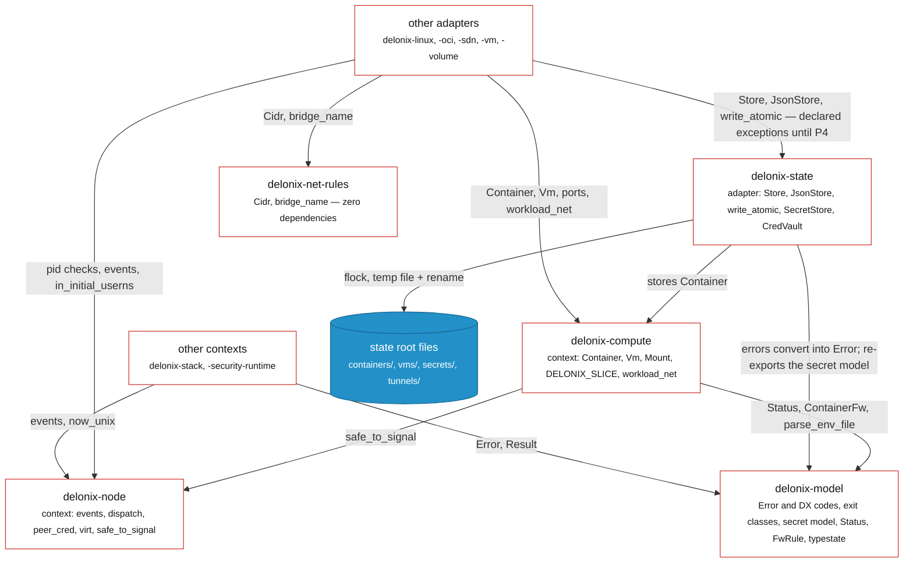

核对来源：`crates/contexts/delonix-compute/src/record.rs`（`use
delonix_model::records::{…}`、`use delonix_node::safe_to_signal`）与 `src/lib.rs`（`pub use
record::*`）；`crates/contexts/delonix-node/src/lib.rs` 与 `host.rs`；
`crates/foundation/delonix-model/src/records.rs` 与 `typestate.rs`；
`crates/adapters/delonix-state/src/store.rs`（`use delonix_compute::Container`）、`secret.rs`、
`cred_vault.rs`、`error.rs`。`delonix-net-rules` 只被 `delonix-sdn` 和 `delonix-vm` 使用；
`delonix-volume` 和 `delonix-scanner` 也直接引用 `delonix-model`（下方生成的图中包含了
每一条边）。

### 计算端口及其背后的适配器

> **图例** —— 白底红边方框：引擎组件（用例、适配器、二进制文件） ·
> 带边框的区域：上下文 crate · 实线箭头：一次经过指定端口的调用。

`container run` 是参考路径：上下文通过端口做决定，而二进制文件选择由哪个适配器来响应
每一个端口。

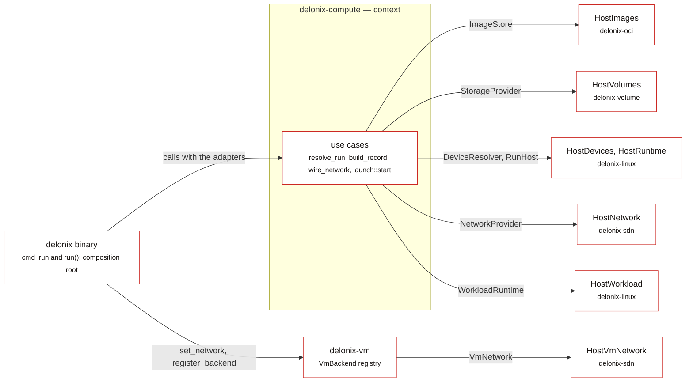

端口：`crates/contexts/delonix-compute/src/ports.rs`（`ImageStore`、`StorageProvider`、
`DeviceResolver`、`RunHost`、`VmNetwork`、`NetworkProvider`）与 `launch.rs`（`WorkloadRuntime`）。
实现：`delonix-oci/src/run_images.rs`、`delonix-volume/src/lib.rs`、
`delonix-linux/src/{cdi,run_host,workload}.rs`、`delonix-sdn/src/{run_network,vm_network}.rs`。
接线：`bins/delonix-runtime-bin/src/cmd/container.rs::cmd_run` 与
`bins/delonix-runtime-bin/src/main.rs::run`。

### 接口与二进制文件

> **图例** —— 白底红边方框：引擎 crate（或一组 crate） · 实线箭头：一次直接的 Rust
> 调用，并注明用途。

服务器在进程内读取数据，并把每一次 fork 都交给 CLI 去做；唯一一条接口到接口的边是一个
已声明的例外。

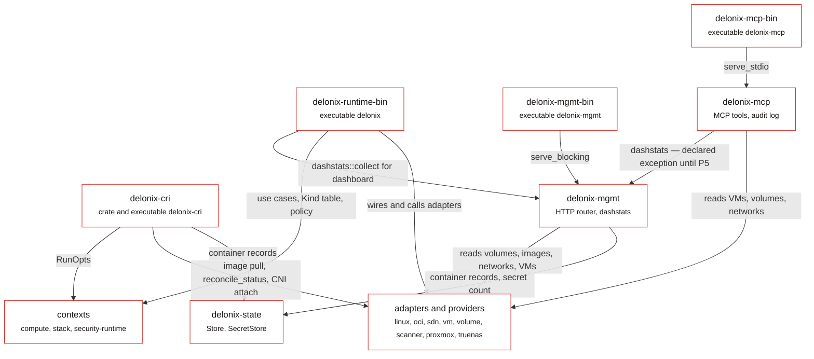

为了保持图的可读性，以下内容没有画出来：每个二进制文件以及 `delonix-cri`/`delonix-mgmt`
也都会调用 `delonix-telemetry`（`telemetry::init`、指标），`delonix-mcp` 和 CLI 也会读取
`delonix-state`。仪表盘（dashboard）相关的边是 `bins/delonix-runtime-bin/src/cmd/dash.rs`
和 `crates/interfaces/delonix-mcp/src/lib.rs`（`delonix_mgmt::dashstats::collect`）；CRI
对 `RunOpts` 的使用是 `runtime_svc/lifecycle.rs` 中的 `start_run_opts`。

### 每一条 crate 边

这是 `Cargo.toml` 所声明的 crate 图。它是完整的，因此也很密集；用它来回答「A 是否依赖
B」这样的问题，而要理解「为什么」，请阅读上文按层划分的各张图。

<!-- dev-docs:begin crates-graph -->
**图例** —— 每个 crate 一个方框，按层分组；箭头 `A --> B` 表示 *A 依赖 B*。红色：二进制 · 红边白底：接口 · 白色：上下文与适配器 · 灰色：provider · 蓝色：基础层。

```mermaid
flowchart TB
  subgraph foundation["Foundation"]
    delonix_model["delonix-model"]
    delonix_net_rules["delonix-net-rules"]
  end
  subgraph context["Contexts"]
    delonix_compute["delonix-compute"]
    delonix_node["delonix-node"]
    delonix_security_runtime["delonix-security-runtime"]
    delonix_stack["delonix-stack"]
  end
  subgraph adapter["Adapters"]
    delonix_linux["delonix-linux"]
    delonix_oci["delonix-oci"]
    delonix_scanner["delonix-scanner"]
    delonix_sdn["delonix-sdn"]
    delonix_state["delonix-state"]
    delonix_telemetry["delonix-telemetry"]
    delonix_vm["delonix-vm"]
    delonix_volume["delonix-volume"]
  end
  subgraph provider["Providers"]
    delonix_opnsense["delonix-opnsense"]
    delonix_proxmox["delonix-proxmox"]
    delonix_truenas["delonix-truenas"]
  end
  subgraph interface["Interfaces"]
    delonix_cri["delonix-cri"]
    delonix_mcp["delonix-mcp"]
    delonix_mgmt["delonix-mgmt"]
  end
  subgraph bin["Binaries"]
    delonix_mcp_bin["delonix-mcp-bin"]
    delonix_mgmt_bin["delonix-mgmt-bin"]
    delonix_runtime_bin["delonix-runtime-bin"]
  end
  delonix_compute --> delonix_model
  delonix_compute --> delonix_node
  delonix_cri --> delonix_compute
  delonix_cri --> delonix_linux
  delonix_cri --> delonix_model
  delonix_cri --> delonix_node
  delonix_cri --> delonix_oci
  delonix_cri --> delonix_sdn
  delonix_cri --> delonix_state
  delonix_cri --> delonix_telemetry
  delonix_linux --> delonix_compute
  delonix_linux --> delonix_model
  delonix_linux --> delonix_node
  delonix_linux --> delonix_state
  delonix_mcp --> delonix_compute
  delonix_mcp --> delonix_linux
  delonix_mcp --> delonix_mgmt
  delonix_mcp --> delonix_model
  delonix_mcp --> delonix_node
  delonix_mcp --> delonix_sdn
  delonix_mcp --> delonix_state
  delonix_mcp --> delonix_vm
  delonix_mcp --> delonix_volume
  delonix_mcp_bin --> delonix_mcp
  delonix_mcp_bin --> delonix_node
  delonix_mcp_bin --> delonix_telemetry
  delonix_mgmt --> delonix_compute
  delonix_mgmt --> delonix_linux
  delonix_mgmt --> delonix_model
  delonix_mgmt --> delonix_node
  delonix_mgmt --> delonix_oci
  delonix_mgmt --> delonix_scanner
  delonix_mgmt --> delonix_sdn
  delonix_mgmt --> delonix_state
  delonix_mgmt --> delonix_telemetry
  delonix_mgmt --> delonix_vm
  delonix_mgmt --> delonix_volume
  delonix_mgmt_bin --> delonix_mgmt
  delonix_mgmt_bin --> delonix_node
  delonix_mgmt_bin --> delonix_telemetry
  delonix_node --> delonix_model
  delonix_oci --> delonix_compute
  delonix_oci --> delonix_model
  delonix_oci --> delonix_node
  delonix_oci --> delonix_state
  delonix_opnsense --> delonix_model
  delonix_opnsense --> delonix_sdn
  delonix_proxmox --> delonix_compute
  delonix_proxmox --> delonix_model
  delonix_proxmox --> delonix_sdn
  delonix_runtime_bin --> delonix_compute
  delonix_runtime_bin --> delonix_linux
  delonix_runtime_bin --> delonix_mgmt
  delonix_runtime_bin --> delonix_model
  delonix_runtime_bin --> delonix_node
  delonix_runtime_bin --> delonix_oci
  delonix_runtime_bin --> delonix_opnsense
  delonix_runtime_bin --> delonix_proxmox
  delonix_runtime_bin --> delonix_scanner
  delonix_runtime_bin --> delonix_sdn
  delonix_runtime_bin --> delonix_security_runtime
  delonix_runtime_bin --> delonix_stack
  delonix_runtime_bin --> delonix_state
  delonix_runtime_bin --> delonix_telemetry
  delonix_runtime_bin --> delonix_truenas
  delonix_runtime_bin --> delonix_vm
  delonix_runtime_bin --> delonix_volume
  delonix_scanner --> delonix_model
  delonix_scanner --> delonix_oci
  delonix_sdn --> delonix_compute
  delonix_sdn --> delonix_model
  delonix_sdn --> delonix_net_rules
  delonix_sdn --> delonix_node
  delonix_sdn --> delonix_state
  delonix_security_runtime --> delonix_model
  delonix_security_runtime --> delonix_node
  delonix_stack --> delonix_model
  delonix_state --> delonix_compute
  delonix_state --> delonix_model
  delonix_state --> delonix_node
  delonix_truenas --> delonix_model
  delonix_vm --> delonix_compute
  delonix_vm --> delonix_model
  delonix_vm --> delonix_net_rules
  delonix_vm --> delonix_node
  delonix_vm --> delonix_state
  delonix_volume --> delonix_compute
  delonix_volume --> delonix_model
  delonix_volume --> delonix_node
  delonix_volume --> delonix_state
  class delonix_compute block
  class delonix_cri iface
  class delonix_linux block
  class delonix_mcp iface
  class delonix_mcp_bin engine
  class delonix_mgmt iface
  class delonix_mgmt_bin engine
  class delonix_model store
  class delonix_net_rules store
  class delonix_node block
  class delonix_oci block
  class delonix_opnsense external
  class delonix_proxmox external
  class delonix_runtime_bin engine
  class delonix_scanner block
  class delonix_sdn block
  class delonix_security_runtime block
  class delonix_stack block
  class delonix_state block
  class delonix_telemetry block
  class delonix_truenas external
  class delonix_vm block
  class delonix_volume block
  classDef engine fill:#cc2823,stroke:#8f1b17,color:#ffffff
  classDef iface fill:#ffffff,stroke:#cc2823,stroke-width:2px,color:#191513
  classDef block fill:#ffffff,stroke:#8a817c,color:#191513
  classDef external fill:#e1ddda,stroke:#8a817c,color:#191513
  classDef store fill:#2390c8,stroke:#17618a,color:#ffffff
```
<!-- dev-docs:end crates-graph -->

### crate 之间如何通信

1. **沿着层级方向的直接 Rust 调用。** 这是通常的情况。例如 `cmd_run`
   （`cmd/container.rs`）会带着适配器 `delonix_oci::run_images::HostImages`、
   `delonix_volume::HostVolumes`、`delonix_linux::cdi::HostDevices` 和
   `delonix_linux::run_host::HostRuntime` 调用 `delonix_compute::run::resolve_run`，接着
   带着 `delonix_sdn::run_network::HostNetwork` 调用
   `delonix_compute::network::{attach_custom_network, wire_network}`，然后带着
   `delonix_linux::workload::HostWorkload` 调用 `delonix_compute::launch::start`。
2. **在组合根（composition root）处注册。** `bins/delonix-runtime-bin/src/main.rs` 中的
   `run()` 会在任何命令运行之前，注册已配置的远程 VM 后端
   （`cmd::vmbackends::register_configured` → `delonix_vm::register_backend`）以及 VM 网络
   端口的 SDN 实现（`delonix_vm::set_network(HostVmNetwork)`）。
3. **重新执行引擎自己的二进制文件。** 这仍然很常见，并由 `self_exec_sites` ratchet 计数。
   原因是真实存在的：
   - `clone` 只有在**单线程**进程中才安全，而 CRI、管理 API 和 Docker API 服务器都是多线程的
     `tokio` 运行时。它们会把一份类型化的 `RunOpts` 放进一个 `0600` 的文件中，交给一个全新的
     `delonix __apirun <spec>`（`lifecycle.rs::write_run_spec`、
     `cmd::dockerapi::run_from_spec_file`）。
   - 一个无根进程必须先**进入**网络 pin 的用户与挂载命名空间，容器才能加入那里一个具名的
     netns，因此 `reexec_into_netns` 会运行
     `nsenter … ip netns exec <netns> delonix netns run <spec>`。
   - 对由映射后的 subuid 拥有的文件进行操作，需要一个位于已映射用户命名空间内部的进程
     （`delonix_linux::reexec_mapped`、`reexec_mapped_hold`、`remove_tree_mapped` →
     `__rmtree`/`__ovlhold`/……等入口点）。
   - 服务器仍然会构造一些 CLI 调用（`delonix-mgmt`、`delonix-mcp` 的
     `run_cli_blocking`、CRI 的 `delonix()` 辅助函数），并通过
     `delonix_node::dispatch::cli_bin` 来解析 CLI（先看 `DELONIX_BIN`，再看同目录下的
     `delonix`，最后看 `PATH`）——绝不使用它们自己的可执行文件。
   ADR-0040 D2.4/D5 计划推出一个接收类型化规格的 `delonix-launcher` 可执行文件，届时这些都会
   变成用例调用加上一次 spawn。
4. **控制 socket。** 无根基础设施 netns 内部的一切，都由 control 进程完成：
   `infra::control_send`/`control_query` 向一个 `0600` 的 unix socket 写入一行
   （`attach …`、`publish …`、`firewall …`）；`control_loop` 只接受与引擎自身 uid 相同的
   对端（`SO_PEERCRED`），并且一次只服务一条连接，因此 netns/veth/nftables 操作绝不会
   交错发生。
5. **通向宿主机工具的子进程**，位于各适配器中：`ip`、`nft`、`nsenter`、`slirp4netns`
   （`delonix-sdn`）、`newuidmap`/`newgidmap`（`delonix-linux`、`pin_userns`）、
   `qemu-img`、`virsh`、`cloud-localds`（`delonix-vm`）、用于 systemd 临时作用域的
   `busctl`（`delonix-linux`）、`ssh`/`scp`（`cmd/remote.rs`）。
6. **面向远程管理系统的 HTTP 只存在于 providers 中。** `delonix-proxmox` 和
   `delonix-truenas` 为此依赖 `reqwest`。另有两个适配器出于其他原因也会说 HTTP：
   `delonix-oci` 有自己的 OCI 镜像仓库客户端（`src/registry.rs`，其 `Cargo.toml` 中有
   `reqwest`），`delonix-telemetry` 通过 HTTP 导出 OTLP。没有任何上下文 crate 会这样做。

## 磁盘上的状态

这里没有数据库。状态就是**状态根目录（state root）**下的文件：

- 设置了就用 `DELONIX_ROOT`；否则对非特权用户使用 `$XDG_DATA_HOME/delonix` 或
  `~/.local/share/delonix`，对 root 使用 `/var/lib/delonix`
  （`bins/delonix-runtime-bin/src/cmd/util.rs::state_root` → `ImageStore::default_root`；
  `infra::base_root` 在网络这一侧解析的是同一条规则）。
- **Socket 不位于状态根目录之下。** 它们位于一个简短的、按用户划分的运行时目录中
  （`infra::runtime_dir`，可用 `DELONIX_NET_RUNTIME_DIR` 覆盖），因为 `AF_UNIX` 路径的长度
  是有限的；一个非默认的根目录会带上一个哈希后缀（`root_suffix`），这样同一次登录中的两个
  根目录就绝不会共享 socket。**当你在隔离环境中运行任何东西时，请把这两个变量都设置好。**

| 根目录下的路径 | 内容 | 代码 |
|---|---|---|
| `containers/<id>.json` | 每个容器一份 JSON 记录 | `delonix_state::Store`（`delonix-state/src/store.rs`） |
| `containers/<id>/{upper,work,merged}` + `overlay-lowers` | 容器的可写层，以及它挂载的共享镜像层列表 | `ImageStore::prepare_overlay`（`delonix-oci/src/overlay.rs`） |
| `images/<id>.json`、`layers/<hex>/`、`blobs/sha256/<hex>` | 镜像元数据、每个容器共享的解包后的层、按内容寻址的 blob | `ImageStore::open`（`image.rs`）、`Cas`（`cas.rs`） |
| `volumes/<name>/_data`、`volumes/.ns/<ns>/` | 具名卷、按命名空间划分的卷 | `VolumeStore`（`delonix-volume/src/lib.rs`） |
| `vms/` | VM 记录（`delonix_state::JsonStore<Vm>`）与每台 VM 的文件 | `delonix-vm` |
| `vm-images/` | VM 镜像（`.qcow2` + `.json`） | `cmd/vmimage.rs::VmImageStore` |
| `secrets/` | 加密的密钥 | `SecretStore`（`delonix-state/src/secret.rs`） |
| `tunnels/keyring.key`、`tunnels/cred/` | 宿主机主密钥与加密的凭据 | `CredVault`（`delonix-state/src/cred_vault.rs`） |
| `ingress/` | pidfile（`holder.pid` 就是 pin）、`refs/` 标记、网络与路由定义、日志 | `delonix-sdn/src/infra.rs` |
| `hosts-sync` | 标记文件：表示 `delonix hosts sync` 已经运行过，因此 `--expose` 容器的服务名称会被保留在宿主机的 `/etc/hosts` 中（它位于根目录，而不在 `ingress/` 之下） | `cmd/ingress_proxy.rs` 中的 `hosts_sync_flag` |
| `ipam/` | 按前缀划分的地址租约 | `delonix-sdn/src/ipam.rs` |
| `cri/{sandboxes,containers}/` | CRI 自己的记录 | `delonix-cri/src/runtime_svc/lifecycle.rs`（`sb_dir`、`ct_dir`） |
| `clusters/` | 各集群的 kubeconfig、密钥与 PKI | `cmd/cluster.rs` |
| `events.jsonl` | 只追加的事件日志 | `delonix_node::events` |

并发是由文件系统来处理的，因为有多个进程（CLI、CRI 服务器、supervisor）会修改同一份记录：
写入是原子的（临时文件 + `rename`，`delonix_state::write_atomic`），读-改-写则通过
`Store::update` / `JsonStore::update` 进行，它们会取得一个排他的 `flock`，并且在拿不到它的情况下
**拒绝**继续执行。这一切都位于 `delonix-state` 适配器中。它所存储的记录类型定义在别处：
`Container` 和 `Vm` 定义在 `delonix-compute` 上下文中，一条记录中纯数据的那部分
（`Status`、`ContainerFw`/`FwRule`）则定义在 `delonix-model` 这个 foundation crate 中。
网络基础设施在 `ensure_up`、`teardown`、`acquire`、`release` 以及各个回收器周围，有着它自己的
`FileLock`。

由于没有任何驻留的进程在监视其他进程，一条写着 `Running` 的记录有可能已经过时。读取者会
自行协调（reconcile）：`delonix_linux::reconcile_status` 会把 pid 连同它的启动时间一起检查
（`delonix_node::safe_to_signal`），这样一个被回收再利用的 pid 就绝不会被误认为是那个容器。

## 第 4 层——作为序列的两条流程

只有在步骤的顺序本身就是重点的地方，才会画出第 4 层。下面这两条流程都是序列图，
而不是结构图。

### `container run -d --net web -p 8080:80 nginx`，无根模式

下面的每一条箭头，都是 `cmd_run`（`bins/delonix-runtime-bin/src/cmd/container.rs`）中的
一次调用，或是它所触及的函数中的一次调用。

> **图例** —— 参与者是各个进程；实线箭头是调用、socket 通信或 spawn（具体是哪一种由标签
> 说明）；虚线箭头是回复；指向自身的箭头是该进程内部的工作；注释标出了最终留下了什么。

自定义网络会强制 CLI 在 pin 的命名空间内再走一遍（第二遍）；而记录只有在容器的挂载点
最终确定之后才会被发布。

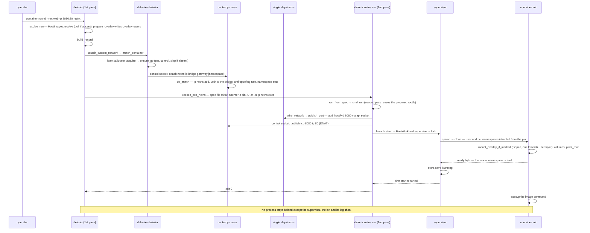

如果没有自定义网络，这条流程就没有第二遍：`spawn` 会创建自己的用户命名空间，父进程写入
id 映射（`write_userns_maps`）、设置好 cgroup、运行 `on_started` 钩子（如果有 `-p` 端口，
就是每容器一个的 `slirp_attach`），然后才向子进程发送「go」字节。

### CRI：`RunPodSandbox` → `CreateContainer` → `StartContainer`

出自 `crates/interfaces/delonix-cri/src/runtime_svc/lifecycle.rs`。

> **图例** —— 参与者是各个进程，此外状态根目录也作为一个参与者；实线箭头是 gRPC 调用、
> 进程内调用、子进程或文件写入（具体是哪一种由标签说明）；虚线箭头是回复；`alt` 框表示
> 互斥的各种网络模式。

CRI 服务器负责记录和决策，但每一次容器启动都会跨越到一个全新的 `delonix` 进程中。

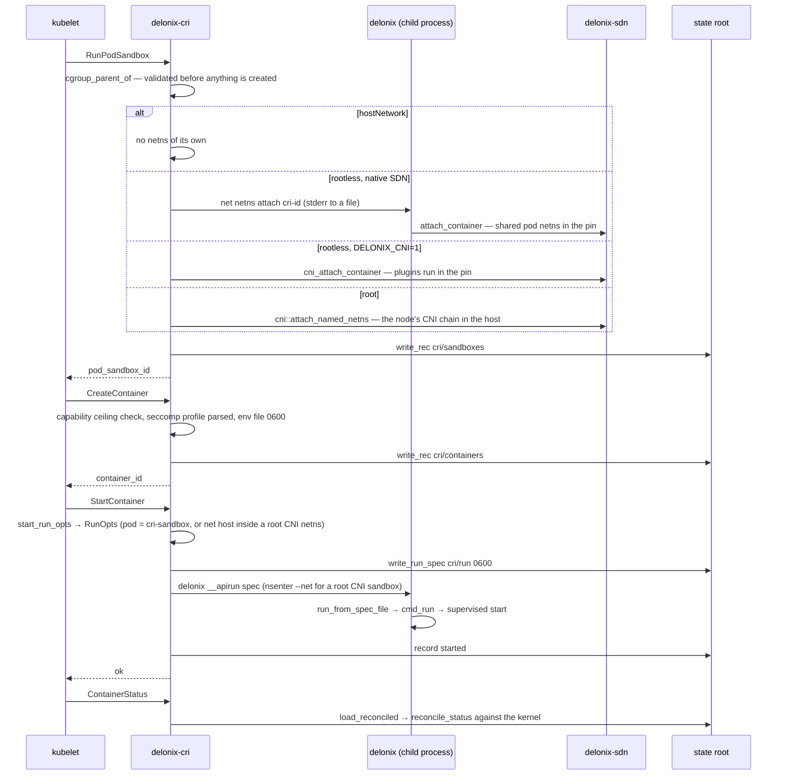

## 已知限制

> **注意——节点契约尚未被提供服务。** `proto/delonix/node/v1` 已经有门禁并会生成 OpenAPI，
> 但没有任何进程会响应它。今天的各种集成使用的是 CLI、CRI、本地管理 API 或 MCP。

> **注意——服务器仍然依靠运行 CLI。** `delonix-cri`、`delonix-mgmt` 和 `delonix-mcp` 都是
> 通过重新执行 `delonix` 来启动工作负载的。这样做把 `clone` 挡在了多线程进程之外，代价是
> 每次操作都要多一个进程，错误文本也要跨越进程边界。

> **注意——适配器仍然直接访问状态文件。** `delonix-linux`、`delonix-vm`、`delonix-sdn`、
> `delonix-oci` 和 `delonix-volume` 作为已声明的例外依赖 `delonix-state`。移除这些例外所需的
> `StateRepository` 端口自 #420 起就已存在（`delonix-model/src/ports.rs`，ADR-0044 D6），
> 但到目前为止，只有 `delonix-linux` 在其生命周期的一部分中通过它访问；其余四个在各自的
> P4 切片落地之前，仍然直接打开这些 store。

> **注意——`macvlan`/`ipvlan` 只是被声明，并未被实现。** `network create` 会记录它们，并报告
> `Realized=False`，原因是 `DriverNotImplemented`
> （`bins/delonix-runtime-bin/src/cmd/network.rs`）：它们的物理层需要在宿主机的初始网络
> 命名空间中拥有 `CAP_NET_ADMIN`。

> **注意——pin 死亡后的恢复是通过重启完成的。** 如果 control 进程死亡，`ensure_up`
> 只会重启它，不会移动任何工作负载。如果 **pin** 死亡，netns 会被重建，
> `delonix net netns up` 会重启那些被困住的容器和 pod 成员
> （`cmd/netns.rs::reconcile_after_respawn`，它只读取容器 store——VM 不会通过这种方式
> 被恢复）。

> **注意——SDN 中的 IPv6 默认是关闭的。** ingress 防火墙是 `table ip`；holder 会安装一个
> 会丢弃流量的 `table ip6`（`infra::ingress_v6_refusal_ruleset`），并在容器 netns 内部禁用
> IPv6，除非设置了 `DELONIX_ENABLE_IPV6=1`（`ipv6_sdn_enabled`）。

> **注意——一个无法 fork 的调用者，启动时是没有监督的。** `launch::should_supervise`
> 要求 `detach && forkable`；没有 supervisor，就没有谁是该进程的父进程，真实的退出码
> 也就无法被收集。

## 从哪里开始阅读

| 领域 | 从这里开始 |
|---|---|
| CLI 入口与隐藏的重新执行入口点 | `bins/delonix-runtime-bin/src/main.rs`（`main`、`run`） |
| `container run` 端到端 | `cmd/container.rs::cmd_run`，然后是 `delonix-compute/src/{run,network,launch}.rs` |
| 进程创建、命名空间、rootfs、seccomp、cgroup | `delonix-linux/src/lib.rs`（`spawn`、`container_init`、`setup_rootfs`、`setup_cgroup`）、`supervise.rs`、`launch_spec.rs` |
| 无根网络 | `delonix-sdn/src/infra.rs`（`ensure_up`、`control_main`、`attach_container`、`publish_port`、`ingress_table_ruleset`、`fw_chain_body`）、`pin_userns.rs`、`ipam.rs` |
| 镜像 | `delonix-oci/src/{registry,cas,image,overlay,build}.rs` |
| 虚拟机 | `delonix-vm/src/lib.rs`（`VmBackend`、`builtin_backends`、`register_backend`、`select_backend`）、`cloudinit.rs`；`cmd/vm.rs`、`cmd/vmimage.rs` |
| 声明式 apply | `delonix-stack/src/{kinds,reconcile}.rs`；`cmd/stack.rs`、`cmd/manifest.rs` |
| 记录、错误、持久化状态 | `delonix-compute/src/record.rs`（`Container`、`Vm`）、`delonix-model/src/{records,error,exitcode}.rs`、`delonix-state/src/{store,secret}.rs` |
| CRI | `delonix-cri/src/lib.rs::serve_blocking`、`runtime_svc.rs`、`runtime_svc/lifecycle.rs` |
| 管理 API / MCP | `delonix-mgmt/src/lib.rs`、`delonix-mcp/src/lib.rs` |
| 节点契约 | `proto/delonix/node/v1/`、`scripts/contract_gate.py`、`docs/api/openapi.yaml` |
| 架构规则 | `scripts/arch_fitness.py`、ADR-0040 |

---

**下一步：** [各个 crate](crates.md)——每个 crate 一段：它拥有什么、主要类型、从哪里开始阅读，
以及它已经付出过代价学到的陷阱。
