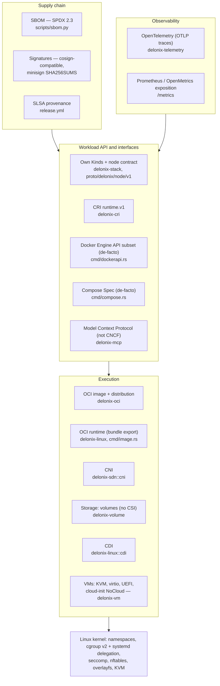

<!-- translated-from: cloud-native-standards.md sha256:b42da13e7ba332edc815ba25d93934d6e2e59b6827868ca6f84561249d2e8d4c -->
# 云原生标准，逐层展开

**阅读前须知：** [云原生入门](cloud-native-primer.md)（引擎如何使用每一种机制）和[架构](architecture.md)（下面点名的那些 crate）。这是一页参考资料：只读你会碰到的那一节标准。

一个容器与微虚拟机引擎并不是单单一份规范。它是一叠层，而大多数层都有一个开放标准：有的来自
**OCI**（Open Container Initiative，开放容器倡议）、有的来自 Kubernetes SIG 和 **CNCF**
（Cloud Native Computing Foundation，云原生计算基金会）、有的来自 Linux 内核，还有几个是
没有任何标准组织在背后支撑的事实接口。

本页**按标准、按层**来组织。对每一个标准，它都回答四个问题：这个标准是什么、它对一个实现
提出了什么要求、Delonix 今天是怎么实现它的（crate、文件、符号），以及关于合规性、包括缺口
在内，证据怎么说。如果你搜索"OCI、CRI、CNI、CSI、CDI"，要找的就是这一页。读完你需要的那一节
之后，你就能说出一个标准要求什么、引擎在哪里满足了它，以及有什么样的合规性证据存在——附带
日期和版本号。

如果命名空间、cgroup、overlayfs 或 kubelet 对你来说还是新概念，先读
[Linux 基础](linux-foundations.md)和[云原生入门](cloud-native-primer.md)。本页假定你已经
掌握这些基础，不会重复讲：原语在第一页里教，引擎如何使用它在第二页里讲，而标准本身及其合规性
在这里讲。

阅读本页要记住三条规则：

- **"兼容"这个词永远不能单独出现，必须带上一个数字、一个日期和一个版本号。** 一个没有人
  重新测量过的合规性声明，就不再是一次测量，而变成了一句引言。
- **"未实现"是一个第一等的答案。** 当引擎没有实现某个标准时，对应的小节会直说，并链接到
  解释原因的那份决策（ADR）。
- **路径都相对于仓库根目录**，这里点到的每一个符号都在代码里读过。如果你读到这里时某个符号
  已经挪了地方，以代码为准，并修正本页。

---

## 13.0 分层地图

每一条箭头的意思都是"建立在……之上"。内核这一层不是一个 CNCF 标准；它被放在 13.15 里讲，
因为其他每一层都依赖它。

---

## 13.1 OCI 运行时规范

**这个标准是什么。** [OCI 运行时规范](https://github.com/opencontainers/runtime-spec)
定义了一个*文件系统 bundle*（一个根文件系统外加一份 `config.json`）以及从它创建出的容器的
生命周期（`create`、`start`、`kill`、`delete`、`state`）。这是 `runc`、`crun` 和 `youki`
实现的东西，也是 containerd 和 CRI-O 所驱动的东西。

**一个实现必须做到什么。**

- 读取一个 bundle：`config.json`，其中带有 `ociVersion`、`process`、`root`、`mounts`、
  `linux`（命名空间、capability、cgroup、被屏蔽和只读的路径、seccomp）。
- 暴露生命周期操作和 `state` 文档，并运行 config 里声明的那些钩子（`prestart`、
  `createRuntime`、`poststop` 等）。

**Delonix 是怎么实现它的。** Delonix**不是**`runc` 那个意义上的 OCI 运行时二进制文件：
它不读取一个 bundle，也不暴露 `create/start/state` 那条命令行。它是它自己的运行时，与这份
规范之间有两种关系：

1. **它为 OCI 运行时生产 bundle。** `delonix image export <image> <dir>` 会写出
   `<dir>/rootfs` 和 `<dir>/config.json`，好让 `runc run -b <dir>` 能运行这个镜像。
   - `bins/delonix-runtime-bin/src/cmd/image.rs`：`cmd_export` 通过
     `ImageStore::export_rootfs`（`crates/adapters/delonix-oci/src/overlay.rs`）解包根
     文件系统，并用 `build_runtime_spec` 构建 config。
   - `build_runtime_spec` 是从 `oci_spec::runtime` 的类型（`oci-spec` crate，钉在根目录的
     `Cargo.toml` 里）构建 config 的，而不是手写 JSON。它的文档注释列出了早先那份手写 bundle
     缺了什么（标准挂载点、生效的 capability、被屏蔽/只读的路径）。
2. **它原生实现了同样的机制。** `crates/adapters/delonix-linux/src/lib.rs` 里的
   `fn spawn` 和 `container_init` 做的正是一个 OCI 运行时会从一份 `config.json` 里做的事：
   命名空间、`pivot_root`、capability、seccomp、被屏蔽的路径。它们所消费的执行规格不是
   `config.json`，而是 `RunOpts`（`crates/contexts/delonix-compute/src/run_opts.rs`）,
   由每一个前端（CLI、Kind、compose、Docker API、CRI）生产出来。

**合规状态／缺口。**

- 没有针对 Delonix 跑过 runtime-spec 的合规套件。也没法跑：不存在一个消费 bundle 的入口
  点可以拿来跑它。
- **没有实现 OCI 钩子。** [ADR-0033](../adr/0033-oci-runtime-hooks.md)（提议中）记录了
  原因：没有具体的消费者，而且运行一个由容器 spec 点名的宿主机二进制文件，属于本项目已经
  拿一次 spike 挡在前面的那类安全问题。`delonix-linux` 里那个进程内的 `StartedHook` 闭包
  看起来相似，但它不是 OCI 那套协议。
- 导出的 bundle 是最小化的（默认命令、环境变量和工作目录都取自镜像）。把它当作一种交接
  格式来对待，而不是对一个容器完整配置的转译。

**从哪里开始读。** `bins/delonix-runtime-bin/src/cmd/image.rs` 里的 `cmd_export` 和
`build_runtime_spec` → `crates/adapters/delonix-oci/src/overlay.rs` 里的
`export_rootfs` → `crates/adapters/delonix-linux/src/lib.rs` 里的 `spawn`。

---

## 13.2 OCI 镜像规范

**这个标准是什么。** [OCI 镜像规范](https://github.com/opencontainers/image-spec)
定义了一个镜像如何被描述：一份列出一个 *config* blob 和若干有序 *layer*（层）blob 的
*manifest*（清单）、一个供多平台使用的 *image index*（镜像索引）、按内容以摘要
（digest）寻址，以及 *image layout*（镜像布局）目录格式（`oci-layout`、`index.json`、
`blobs/sha256/…`）。

**一个实现必须做到什么。**

- 所有内容都按摘要寻址并验证。
- 理解 manifest、index（选出正确的平台）以及层的媒体类型（tar、gzip、zstd），并按顺序
  应用各层，包括 whiteout（白化标记）。
- 在不经过镜像仓库交换镜像时，能读写 image layout。

**Delonix 是怎么实现它的。** 全部在 `crates/adapters/delonix-oci` 里：

- **按内容寻址的存储**：`src/cas.rs`（`Cas`），`ImageStore` 在 `src/image.rs` 里。
- **层作为 overlay 的下层（lower）**：`ImageStore::prepare_overlay`（`src/overlay.rs`）
  在容器自己的 `merged/` 旁边写出一份 `overlay-lowers` 文件，容器自己的 init 会挂载它。
  层在容器之间是共享的，而不是被复制的（参见 `AGENTS.md` 里关于容器共享层的记录，以及关于
  挂载 API 的 [ADR-0037](../adr/0037-overlay-mount-new-api.md)）。
- **按魔数识别层的媒体类型**：`src/registry.rs` 里紧挨着 `DOCKER_MANIFEST_MEDIA_TYPE` 的
  那个辅助函数会检测 gzip、zstd 或纯 tar。
- **写出 image layout**：`write_oci_archive`（`src/save.rs`），由 `delonix image save`
  使用。它会写出 `oci-layout`、`index.json`、各个 blob，以及一份旧式的 `manifest.json`,
  这样同一份归档文件就能被 `ctr images import`、`podman load`、`docker load` 和
  `delonix image load` 读取。它同时设置了 `org.opencontainers.image.ref.name` 和
  `io.containerd.image.name`；没有后者的话，`ctr` 会导入各个 blob 却不会注册任何名字。
- **读取归档文件**：`load_docker_archive`（`src/load.rs`）。

**合规状态／缺口。**

- **推送和归档的 manifest 用的是 Docker v2 schema 2 的媒体类型**
  （`application/vnd.docker.distribution.manifest.v2+json`，`src/registry.rs` 里的
  `DOCKER_MANIFEST_MEDIA_TYPE`），而不是
  `application/vnd.oci.image.manifest.v1+json`。拉取时两种都接受（`ACCEPT_MANIFEST`）。
  这与上面点名的那些镜像仓库和导入工具是互通的，但这并不等于"写出的是 OCI 镜像 manifest"。
- 没有跑过 image-spec 的合规套件。

**从哪里开始读。** `src/image.rs` → `src/cas.rs` → `src/overlay.rs`
（`prepare_overlay`、`export_rootfs`）→ `src/save.rs` → `src/load.rs`。

---

## 13.3 OCI 分发规范

**这个标准是什么。** [OCI 分发规范](https://github.com/opencontainers/distribution-spec)
定义了一个镜像仓库的 HTTP API：`GET /v2/<name>/manifests/<reference>`、blob 的获取与上传、
标签列表，以及大多数镜像仓库使用的那套令牌认证流程。

**一个实现必须做到什么。**

- 用 `Accept` 协商 manifest 的媒体类型，遵循 `401 → 令牌 → 重试` 这套流程，获取各个 blob
  并**逐一对照其摘要验证**。
- 对于一个按摘要引用的镜像（`repo@sha256:…`），要验证 manifest 本身哈希出来确实是那个
  摘要。
- 推送 blob（带存在性检查），然后再推送 manifest。

**Delonix 是怎么实现它的。** `crates/adapters/delonix-oci/src/registry.rs`：

- `parse_reference` 拆解 `registry/repo:tag@digest`（包括 `tag@digest` 这种组合形式）。
- `pull_from_registry_with_creds` / `pull_from_registry_with_creds_full` 拉取一个多层
  镜像；已经在 CAS 里的 blob 不会重复下载。
- **`verify_manifest_digest`**：对于一次按摘要钉住（digest-pinned）的拉取，manifest
  字节必须哈希出那个被钉住的摘要，否则拉取会被拒绝。没有这一步的话，一个被攻陷的镜像仓库
  就能提供一份不同的、但自身内部一致的 manifest，而这个"钉住"就只是装饰。对于一个按标签
  的引用，这一步是空操作；这时唯一的完整性保障就只有 TLS，就像 `docker pull` 一样。
- `blob_with_progress_capped` 会用 `Range:` 恢复一次被中断的 blob 下载。一个响应在
  不是所请求的偏移量处返回的 `206`，或者一个忽略了 range 的 `200`，都会从零开始重新
  下载,而不是被拼接起来。最终的摘要校验，才是让拼接变得安全的原因。
- `push_to_registry`、`build_manifest`、`list_remote_tags`。
- **OCI artifact**（单个 blob、空 config 用 `application/vnd.oci.empty.v1+json`，
  ORAS 和 Helm 所用的模式）：`push_oci_artifact*` 和 `pull_oci_artifact*`。虚拟机镜像
  就是以这种方式发布的（见[构建微虚拟机](microvm-setup.md)）。注解（annotation）只在
  摘要校验*之后*才会被读取。
- 凭据：`src/auth.rs` 读取 Docker/Podman 的 `auths` 格式。
- 为构建包（buildpack）构建准备的一个一次性本地镜像仓库：`src/internal_registry.rs`。

**合规状态／缺口。**

- 没有为这个客户端跑过 distribution-spec 的合规测试。
- `list_remote_tags` 只读取 `tags/list` 的第一页（没有 `Link` 分页）。`AGENTS.md` 里的
  记录说，对于一个虚拟机镜像那寥寥几个标签来说这无关紧要；但对于一个很大的仓库来说，这
  就会成为问题。
- 引擎没有实现镜像仓库的*服务端*那一侧，除了上面提到的那个一次性本地镜像仓库。

**从哪里开始读。** `parse_reference` → `pull_from_registry_with_creds_full` →
`verify_manifest_digest` → `blob_with_progress_capped` → `pull_oci_artifact_with_meta`,
全都在 `src/registry.rs` 里。

---

## 13.4 Kubernetes 容器运行时接口（CRI）

**这个标准是什么。** [CRI](https://github.com/kubernetes/cri-api) 是 kubelet 用来运行
pod 的 gRPC API（`runtime.v1`）：一个 `RuntimeService`（pod 沙箱、容器、
exec/attach/端口转发、统计信息）和一个 `ImageService`。kubelet 通过
`--container-runtime-endpoint` 连接到一个运行时。

**一个实现必须做到什么。**

- 在一个本地套接字上同时服务这两个 service；在 `Status` 里报告 `RuntimeReady` 和
  `NetworkReady`。
- 实现 pod 沙箱模型：共享的网络命名空间、pod 级别的 cgroup 父节点、沙箱内部的容器生命周期。
- 从 `Exec`/`Attach`/`PortForward` 返回 **URL**，并通过 Kubernetes 的 remotecommand
  协议（WebSocket 或 SPDY）来服务那些流。
- 把它的 cgroup 驱动告诉 kubelet（`RuntimeConfig`），遵守资源限制，为驱逐（eviction）
  报告统计信息，并以 CRI 日志格式写日志。

**Delonix 是怎么实现它的。** `crates/interfaces/delonix-cri`，二进制文件
`delonix-cri`（也就是 `delonix serve cri`）：

- **契约**：`proto/api.proto` 声明了 `package runtime.v1`，带
  `go_package = "k8s.io/cri-api/pkg/apis/runtime/v1"`；`Version` 回答
  `runtime_api_version: "v1"`（`src/runtime_svc.rs`）。
- **服务端**：`src/lib.rs` 里的 `serve_blocking`；套接字来自 `--addr` 或
  `DELONIX_CRI_ADDR`，默认是 `unix:///run/delonix-cri.sock`
  （`src/bin/delonix-cri.rs`）。
- **生命周期**：`src/runtime_svc.rs`（那个 gRPC trait）把工作委托给
  `src/runtime_svc/lifecycle.rs`。
- **cgroup 驱动**：`runtime_config` 回答的是 `engine_cgroup_driver()`，它是
  `Cgroupfs`。它的文档注释记录了逼出这个答案的那次测量（2026-09-15，k8s
  1.36.4）：什么也不回答会让 kubelet 默认走 `systemd`，systemd 会从空的 pod slice 里
  丢掉 `cpuset`，然后 kubelet 就会陷入循环杀 pod。
- **kubelet 的资源模型**：[ADR-0038](../adr/0038-cri-follows-kubelet-resource-model.md)。
  kubelet 的 `cgroup_parent` 由 `KubeCgroupParent::parse`
  （`crates/contexts/delonix-compute/src/record.rs`）校验，并在
  `crates/contexts/delonix-compute/src/run.rs` 里被消费；`delonix-linux` 有
  `transient_scope_argv`，用来把一个容器放进 pod slice 之下的一个 systemd scope。
- **Capability 天花板**：`CapCeiling`（`src/cap_ceiling.rs`），由
  `DELONIX_CRI_CAP_CEILING` 和 `DELONIX_CRI_CAP_CEILING_MODE` 配置，在 `crictl info`
  里以 `capabilityCeiling` 的形式可见（插入进 `status` 里）。
- **流式传输**：`src/streaming.rs` 通过 WebSocket（`v5.channel.k8s.io`）服务
  remotecommand，`src/spdy.rs` 通过 SPDY/3.1 服务；`port_forward` 返回一个流式 URL。
- **统计与指标**：`lifecycle.rs` 里的 `container_stats`、`list_pod_sandbox_stats`、
  `list_metric_descriptors`。
- **Pod 网络**：见 13.5。

**合规状态／缺口。**

- **用上游的 `critest` 测量过**（[docs/cri-conformance.md](../cri-conformance.md)）：
  cri-tools `critest` **v1.36.0**，引擎 `delonix-cri` **v0.63.1**，rootless，
  **2026-08-25**：在跑过的 103 项规格里（套件总共 122 项），**79 通过、24 失败、19
  跳过**。那份文档里按领域列出的失败：AppArmor 按容器级别的 profile、挂载传播
  （propagation）、安全上下文（security context）的部分内容、镜像管理器（按摘要拉取、
  `Uid`/`Username`）、流式端口转发、OOM，以及少数几条单独的规格。这个数字比
  `AGENTS.md` 里记录的好几处 CRI 修复要旧；此后没有重新测量过。用 `scripts/critest.sh`
  可以复现。
- **在 2026-09-11 用 `crictl` 手动操练过**（据 `AGENTS.md`）：version、info、images,
  以及 `runp → create → start → exec` 这个循环。
- **针对一个真实的 kubelet 验证过**（k8s 1.36.4，2026-09-15，据 `AGENTS.md` 和
  `engine_cgroup_driver` 的文档注释）：单节点控制平面稳定，CoreDNS 在 root 模式的
  CNI 下运行。
- **未实现的 RPC**（它们返回 `UNIMPLEMENTED`）：`UpdateContainerResources`、
  `CheckpointContainer`、`GetContainerEvents`（`src/runtime_svc.rs`）。
- **留意一处已经过时的注释**：`engine_cgroup_driver` 里写着，老实回答 `SYSTEMD`
  "需要引擎先把容器放进一个临时 scope……在那之前，这里就先这样"，而
  `transient_scope_argv` 其实已经存在于 `delonix-linux` 里了。驱动的回答目前仍然是
  `Cgroupfs`；在没有按那条文档注释重新跑一遍 kubelet 测量之前，不要改它。

**从哪里开始读。** `src/bin/delonix-cri.rs` → `serve_blocking`（`src/lib.rs`）→
`src/runtime_svc.rs`（`status`、`runtime_config`）→ `src/runtime_svc/lifecycle.rs` 里的
`run_pod_sandbox` → `src/cap_ceiling.rs` → `src/streaming.rs`。

---

## 13.5 容器网络接口（CNI）

**这个标准是什么。** [CNI 规范](https://www.cni.dev/docs/spec/) 定义了一个运行时如何要求
插件二进制文件去配置一个网络命名空间：一份网络配置列表
（`/etc/cni/net.d/*.conflist`）、位于 `CNI_PATH`（通常是 `/opt/cni/bin`）里的插件
二进制文件，以及通过 `CNI_COMMAND` 传入的操作，配置内容走 stdin。

**一个实现必须做到什么。**

- 加载配置列表，在 `CNI_PATH` 里解析出每一个插件，并设置 `CNI_COMMAND`、
  `CNI_CONTAINERID`、`CNI_NETNS`、`CNI_IFNAME`、`CNI_PATH`。
- 对于 `ADD`，按顺序运行各个插件，把前一个的结果作为 `prevResult` 传给下一个；对于
  `DEL`，逆序运行。
- 解析结果和结构化错误；把 `runtimeConfig`（比如 `portMappings`）传给声明了这项能力的
  插件。更新的 spec 版本还加入了 `CHECK`、`GC` 和 `STATUS`。

**Delonix 是怎么实现它的。** 存在两个网络提供方，CNI 是其中之一：

- **原生 SDN**（容器的默认方案）：rootless 的 holder netns、bridge、IPAM、nftables
  防火墙——`crates/adapters/delonix-sdn`（参见
  [云原生入门 4.5](cloud-native-primer.md#45-container-networking) 和
  [架构](architecture.md#rootless-network-infrastructure)）。
- **CNI 协议层**：`crates/adapters/delonix-sdn/src/cni.rs`，纯函数且可测试。
  `list_conf_files`、`parse_config`、`load_default`、`resolve_plugin`、`add`（把
  `prevResult` 串联起来）、`del`、`plugin_dirs`（来自 `CNI_PATH`）、`readiness`
  （既要配置能解析，**又要**每一个二进制文件——包括 `ipam.type`——都在
  `CNI_PATH` 里）、`attach_named_netns`、`detach_named_netns`、`set_netns_sysctls`。
- **CNI 用在哪里**：
  - **CRI，root 模式**：pod 网络永远是节点的 CNI 链，在宿主机上，与 containerd
    一样。`run_pod_sandbox`
    （`crates/interfaces/delonix-cri/src/runtime_svc/lifecycle.rs`）创建
    `/run/netns/cri-<id>` 并调用 `delonix_sdn::cni::attach_named_netns`。
    `NetworkReady` 来自 `root_cni_readiness`（`src/runtime_svc.rs`），与沙箱据以
    行事的是同一个事实。
  - **CRI，rootless**：靠 `DELONIX_CNI=1` 加上一份 conflist（`enabled_conf`）来选择
    启用；插件在拥有那个 netns 的 holder 内部运行
    （`delonix_sdn::infra::cni_attach_container`）。没有这个开关时，rootless 的
    pod 走的是原生 SDN。

**合规状态／缺口。**

- `cni.rs` 里的文档记录了对配置版本 0.4.0 和 1.0.0 的支持。`CHECK` 作为
  `Command_` 的一个变体存在，但**从未被调用**；`GC` 和 `STATUS` 没有实现。
- `runtimeConfig` 不会传给插件，所以在一个 root 模式的 CNI 沙箱上，通过 `portmap`
  插件实现的 `hostPort` 是不工作的（`AGENTS.md`，2026-09-15 的记录）。
- 在一个 kubeadm 节点上用一条真实的 bridge/host-local 链测量过（2026-09-15，k8s
  1.36.4，据 `AGENTS.md`）：节点 `Ready`，CoreDNS 在服务，Service DNS 从另一个
  pod 解析成功。没有测量过的：多于一个节点，以及 rootless 的 CNI 路径在被重构为
  共享 `ADD` 主体之后的情况。
- 没有针对运行时这一侧跑过任何 CNI 插件的合规测试工具。

**从哪里开始读。** `crates/adapters/delonix-sdn/src/cni.rs`（模块注释、`add`、
`readiness`）→ `crates/interfaces/delonix-cri/src/runtime_svc/lifecycle.rs` 里的
`run_pod_sandbox` → `src/runtime_svc.rs` 里的 `root_cni_readiness`。

---

## 13.6 容器存储接口（CSI）

**这个标准是什么。** [CSI 规范](https://github.com/container-storage-interface/spec)
是一个编排器和一个存储驱动之间的 gRPC API：一个 Identity service、一个 Controller
service（创建/删除/发布卷）和一个 Node service（挂载/发布进一个 pod 的挂载命名空间），
并向 kubelet 注册。

**一个实现必须做到什么。** 运行一个在每个节点上、在它所服务的那些卷的整个生命周期内都可达的
Node 插件（通常是一个带注册器 sidecar 的 DaemonSet），以及通常还要有一个长期运行的
Controller 插件。

**Delonix 是怎么实现它的。** **它没有实现 CSI。** 存储由引擎自己的 `kind: Volume` 来
服务：

- `crates/adapters/delonix-volume/src/lib.rs`：命名卷（`<root>/volumes/<name>/_data`）
  和绑定挂载（bind mount），两者都是 `MS_BIND`，用的是 Docker `-v` 语法。
  `HostVolumes` 实现了 compute 上下文（context）的 `StorageProvider` 端口
  （`crates/contexts/delonix-compute/src/ports.rs`）。
- 网络存储（NFS、CIFS/SMB、WebDAV）以卷的形式挂载，以及一个针对 NAS API 的存储
  配置器（[ADR-0009](../adr/0009-truenas-storage-provisioner.md)，crate
  `crates/providers/delonix-truenas`）。

**合规状态／缺口。** 未实现，出于决策：
[ADR-0034](../adr/0034-csi-daemon-conflict.md)（提议中）。一个 CSI Node 插件是一个
常驻服务，而引擎按设计是无守护进程（daemonless）的。这份 ADR 只有在一个具体需求明确点名
CSI 这个协议、**并且**守护进程这个问题本身已经有一份被接受的 ADR 时，才会重新开启。它还
记录了一条不需要在这里写任何代码的现实路径（针对同一台服务器的一个外部 NFS 配置器）。

**从哪里开始读。** [ADR-0034](../adr/0034-csi-daemon-conflict.md) →
`crates/adapters/delonix-volume/src/lib.rs` →
`crates/contexts/delonix-compute/src/ports.rs` 里的 `StorageProvider`。

---

## 13.7 容器设备接口（CDI）

**这个标准是什么。** [容器设备接口](https://github.com/cncf-tags/container-device-interface)
把设备（比如 GPU）描述为 `/etc/cdi` 和 `/var/run/cdi` 里的 JSON 或 YAML spec。一个
完全限定的名字，比如 `nvidia.com/gpu=all`，会解析成*容器编辑（container edits）*：
设备节点、挂载点、环境变量和钩子。

**一个实现必须做到什么。** 按定义好的优先级从两个目录里加载 spec，解析限定名，并应用
设备无关的顶层 `containerEdits` 和按设备的那些编辑，包括钩子。

**Delonix 是怎么实现它的。** 作为一个由厂商工具（`nvidia-ctk cdi generate`）生成的
spec 的**消费者**，而绝不是一个驱动发现工具：

- `crates/adapters/delonix-linux/src/cdi.rs`：`is_cdi_qualified`、
  `ensure_cdi_available`、`resolve_cdi_device`、`expand_gpu_devices`；spec 目录
  先 `/etc/cdi` 后 `/var/run/cdi`。
- `HostDevices` 实现了 `DeviceResolver` 端口
  （`crates/contexts/delonix-compute/src/ports.rs`），把编辑内容变成与 `-v` 和
  `--device` 所产生的同样的挂载点、设备列表和环境变量。容器自己的 init 会在
  `pivot_root` 之前应用它们；不会有第二个进程按 PID 进入容器。
- CLI 接口：`container run --gpus nvidia|all` 和
  `--device nvidia.com/gpu=<name|all>`。没有 spec 或者没有 `nvidia-ctk` 时，运行
  会在创建任何东西之前就被拒绝。

**合规状态／缺口。**

- **钩子没有被执行。** 一个尽力而为（best-effort）的 `ldconfig -r <rootfs>` 取代了
  通常的 `createContainer` 钩子，一个声明了钩子的 spec 会产生一条可见的警告。这是
  [ADR-0033](../adr/0033-oci-runtime-hooks.md) 唯一点名的代价。
- 模块注释里记录了一次针对 `nvidia-ctk` 1.20.0（`cdiVersion` 0.7.0）的 spec 所做的
  测量：顶层的 `containerEdits` 携带了大多数设备节点和全部挂载点，所以只读取按设备
  的编辑会破坏 CUDA。这条注释没有写日期，这次也没有为本页重新测量。`AGENTS.md`
  把两个目录之间的确切优先级、以及 `ldconfig -r` 是否够用，都列为"需要在一台真实的
  GPU 宿主机上确认"。

**从哪里开始读。** `crates/adapters/delonix-linux/src/cdi.rs`（模块注释、
`resolve_cdi_device`、`HostDevices`）→
`crates/contexts/delonix-compute/src/ports.rs` 里的 `DeviceResolver`。

---

## 13.8 工作负载 API：自有 Kind 与节点契约

**这个标准是什么。** 这里刻意没有外部标准。引擎在自己的 API 分组（`core`、`compute`、
`networking`、`gateway`、`storage`、`artifact`、`infrastructure`；用
`delonix api-resources` 可以列出它们）里暴露自己的声明式 **Kind**。它的形状遵循
Kubernetes 的约定（`apiVersion`、`kind`、`metadata`、`spec`），但并不声称与 Kubernetes
API 兼容。

**一个实现必须做到什么**（引擎自己定的规则）：

- 发布从代码生成出来的清单 schema，而不是手写的
  （[ADR-0007](../adr/0007-generated-manifest-schema.md)）。
- 用三方差异比对来规划（plan）、应用（apply）并检测漂移（drift），绝不悄悄忽略任何一个
  字段。
- 在同一个本地套接字上，用 gRPC 和 HTTP/JSON 同时服务同一份节点契约，OpenAPI 文档从
  protobuf 生成
  （[ADR-0040](../adr/0040-engine-restructuring-layers-ports-node-contract.md)，
  提议中；[ADR-0041](../adr/0041-node-local-contract-for-the-control-plane-agent.md)）。

**Delonix 是怎么实现它的。**

- Kind 表：`crates/contexts/delonix-stack/src/kinds.rs`（每个 Kind 的
  `api_version`、领域、收敛（convergence）、拆除（teardown））。协调器：
  `src/reconcile.rs`。
- 发布的 schema：`docs/schema/v1/delonix.json`。
- 节点契约：`proto/delonix/node/v1/*.proto`，`docs/api/openapi.yaml` 是生成出来的,
  由 `scripts/contract_gate.py` 检查。

**合规状态／缺口。** 由 CI 把关（schema 测试、`contract_gate.py`），而不是靠一个外部
套件。参见[架构](architecture.md)和[系统设计](system-design-interview.md)。

**从哪里开始读。** `crates/contexts/delonix-stack/src/kinds.rs` →
`src/reconcile.rs` → `proto/delonix/node/v1/node.proto` →
`scripts/contract_gate.py`。

---

## 13.9 Docker 引擎 API 子集——一个事实接口

**这个标准是什么。** [Docker 引擎 API](https://docs.docker.com/reference/api/engine/)
**不是一个 CNCF 或 OCI 标准**。它是某一家厂商的 REST API，被许多工具讲这门语言
（`docker` CLI、compose、kind、各种测试框架）。之所以收录在这里，是因为它是一个真实存在
的互操作面。

**一个实现必须做到什么。** 回答 `/_ping` 和版本协商，然后回答某个具体工具会调用的那些
路由，用 Docker 的 JSON 形状和状态码。

**Delonix 是怎么实现它的。** `bins/delonix-runtime-bin/src/cmd/dockerapi.rs`，由
`delonix serve docker-api [--addr unix://<socket>]` 提供服务：

- `API_VERSION` 是 `"1.43"`，`MIN_API_VERSION` 是 `"1.24"`；版本前缀会被去掉，所以
  `/v<version>/...` 能正常工作。
- **覆盖范围是一份已发布的表**：`API_MATRIX`（已服务的路由）和 `API_UNIMPLEMENTED`
  （被拒绝的路由，附带原因）。`delonix serve docker-api --matrix` 会把它们打印
  出来，而且有一个测试会在存在某个分发（dispatch）分支却没有对应矩阵条目时失败。
- 容器生命周期的路由委托给了与 CLI 相同的那些函数。套接字是 `0600`，带
  `SO_PEERCRED`（只限同一个 uid）。

**合规状态／缺口。**

- 模块注释说它曾对照一个真实的 `docker` CLI 27.3.1 检查过（没有日期）。
- 今天被拒绝的路由，`API_UNIMPLEMENTED` 里附有原因：`exec` 和 `attach`（需要 HTTP
  hijacking）、`logs`、`events`、`build`、网络相关、`images/create`（大多数工具
  最先调用的那个拉取接口）、`images/{name}/json`、`stats`、卷相关。要看清楚请读
  那张表，而不要相信这份清单；那张表才是契约。
- Docker 的网络模型（`NetworkingConfig`）没有被转译。

**从哪里开始读。** `bins/delonix-runtime-bin/src/cmd/dockerapi.rs` 里的
`API_MATRIX` 和 `API_UNIMPLEMENTED` → 同一个文件里的分发 `match` →
`tests/compat/docker_api_smoke.py`。

---

## 13.10 Compose 规范——一个事实规范

**这个标准是什么。** [Compose 规范](https://compose-spec.io/) 用 YAML 描述一个多容器
应用（`services`、`networks`、`volumes`、`secrets`、`configs`）。它是由 Compose
项目维护的一份开放规范，**不是一个 CNCF 或 OCI 标准**。

**一个实现必须做到什么。** 解析这个模型，按 `depends_on`（及其条件）给各个 service
排序，创建网络和卷，并且不能悄悄改变一份文件的含义。

**Delonix 是怎么实现它的。** `bins/delonix-runtime-bin/src/cmd/compose.rs`
（`delonix compose up|down|ps|logs|config`）：一个把内容转译成 `RunOpts` 以及引擎
自己的 `Image`/`Network`/`Volume` 文档的转译器，成员关系是从标签（label）里推导出来的。

**合规状态／缺口。**

- 未知的键会被**拒绝，而不是被忽略**：`check_unsupported_fields` 会对照原始 YAML
  检查允许列表（`SUPPORTED_TOP`、`SUPPORTED_SERVICE` 等）和带原因的拒绝列表
  （`KNOWN_UNSUPPORTED_TOP`、`KNOWN_UNSUPPORTED_SERVICE`）。工作区里别处更早的
  记录说未知的键曾被悄悄吞掉；代码现在已经不这样做了。
- `include:` 会被拒绝（改用 `-f a.yml -f b.yml`）。没有跑过 Compose 的合规套件。

**从哪里开始读。** `compose.rs` 里的模块注释和 `check_unsupported_fields`。

---

## 13.11 OpenTelemetry

**这个标准是什么。** [OpenTelemetry](https://opentelemetry.io/) 是 CNCF 旗下面向
trace（追踪）、metrics（指标）和 log（日志）的项目，用 OTLP 这套线上协议把它们导出到
一个 collector（采集器）。

**一个实现必须做到什么。** 发出带资源属性（至少要有 `service.name`）的 span,
通过 OTLP（gRPC 或 HTTP）导出它们，并在进程退出之前把它们刷出去。

**Delonix 是怎么实现它的。** `crates/adapters/delonix-telemetry/src/telemetry.rs`：

- 通过 `tracing` 输出结构化日志（`DELONIX_LOG`、`DELONIX_LOG_FORMAT=json`）。
- **在设置了 `DELONIX_OTLP_ENDPOINT` 时，通过 OTLP/HTTP protobuf 输出 trace**
  （`build_otlp_layer`，若缺少 `/v1/traces` 会自动补上），批处理的 span
  处理器运行在自己的线程上，所以它在异步的 CRI 服务器和同步的 CLI 里都能工作。
  `service.name` 用来区分不同的二进制文件。

**合规状态／缺口**（都写在模块注释里）：

- **只有 trace。** 指标走的是 Prometheus 曝露格式（13.12），而不是 OTLP；也没有
  OTLP 的日志导出。
- **只支持明文 HTTP。** 出于供应链方面的决定，没有编译进任何 TLS 后端；不支持
  `https://` 端点。
- 短生命周期的 CLI 在退出时不会刷新，所以一次快速的调用可能会丢失它的 span。可靠的
  路径是长期运行的 `delonix-cri`。

**从哪里开始读。** `crates/adapters/delonix-telemetry/src/telemetry.rs` 里的模块
注释、`init` 和 `build_otlp_layer`。

---

## 13.12 Prometheus 曝露格式

**这个标准是什么。** [Prometheus 曝露格式](https://prometheus.io/docs/instrumenting/exposition_formats/)
及其后继者 [OpenMetrics](https://github.com/prometheus/OpenMetrics) 定义了一个抓取
目标在 `GET /metrics` 上提供的文本。

**一个实现必须做到什么。** 用正确的 `Content-Type` 提供这段文本，指标名和类型要稳定,
速度要快到能在抓取超时之内完成。

**Delonix 是怎么实现它的。**

- 一份共享的注册表：`crates/adapters/delonix-telemetry/src/metrics.rs`（`encode`,
  以及 `set_containers`、`set_vms`、`set_memory`、`set_network`、`set_storage`
  这些设值函数），建立在 `prometheus-client` crate 之上。
- `delonix-cri`：一个由 `DELONIX_METRICS_ADDR` 启用的可选 `/metrics` 监听器
  （`src/lib.rs`，`metrics_handler`），与 gRPC 套接字是分开的。
- `delonix-mgmt`：在它的本地套接字上提供 `/metrics`
  （`crates/interfaces/delonix-mgmt/src/lib.rs`，`metrics`）。便宜的字段每次抓取
  都重新计算；昂贵的字段（磁盘遍历）在后台刷新，这样抓取本身就能保持快速。
- 两个处理函数服务的都是
  `application/openmetrics-text; version=1.0.0; charset=utf-8`。

**合规状态／缺口。** 没有记录跑过任何一次 `promtool check metrics`。那些昂贵的
仪表值（gauge）最多可能滞后一个刷新周期；`AGENTS.md` 里的记录解释了为什么要这样
权衡。

**从哪里开始读。** `crates/adapters/delonix-telemetry/src/metrics.rs` →
`crates/interfaces/delonix-cri/src/lib.rs` 里的 `metrics_handler` → `delonix-mgmt`
里的 `metrics` 和 `src/dashstats.rs`。

---

## 13.13 供应链：SBOM（SPDX）、签名、SLSA 来源证明

**这些标准是什么。**

- [SPDX](https://spdx.dev/)（ISO/IEC 5962）是一种软件物料清单（SBOM）的格式。
- [Sigstore cosign](https://docs.sigstore.dev/cosign/) 给容器镜像签名，并把签名以一个
  标记为 `sha256-<digest>.sig` 的 OCI artifact 存储起来。
- [SLSA](https://slsa.dev/) 定义了构建来源证明：一份说明是哪份源代码、由哪个构建器
  产出了某个构件的证明。

**一个实现必须做到什么。** 发布一份包、版本号和校验和都与构件相符的 SBOM；签名，使得
篡改后校验会失败；把来源证明与实际发布出去的那些文件绑定在一起。

**Delonix 是怎么实现它的。**

- **发布二进制文件的 SBOM**：`scripts/sbom.py` 从 `Cargo.lock` 写出 SPDX 2.3 格式。
  `release.yml` 里 "SBOM (SPDX 2.3, do Cargo.lock)" 这一步写出
  `delonix-sbom.spdx.json`，并把它加进 `SHA256SUMS`，所以这份 SBOM 也被签名覆盖了。
- **发布签名**：`release.yml` 用 minisign 给 `SHA256SUMS` 签名，并用内置在
  `scripts/install.sh` 里的公钥（`MINISIGN_PUBKEY`）去验证它。如果密钥已经配置好了
  但是那份 secret 却缺失，发布会失败，而不是发一份未签名的出去。
- **SLSA 来源证明**：`release.yml` 里 "Proveniência (SLSA) dos binários" 这一步,
  对已发布的 `delonix`、`delonix-cri` 和 `delonix-mcp` 二进制文件使用
  `actions/attest-build-provenance`。用
  `gh attestation verify <file> --repo angolardevops/delonix-runtime` 来验证。
- **与 cosign 兼容的镜像签名**：`crates/adapters/delonix-oci/src/sign.rs`。
  `sign_image`（在 `delonix image sign` 背后）发布一份 ECDSA P-256 的
  simple-signing 载荷作为 `.sig` artifact；`verify_signature`（在
  `image pull --verify <key>` 和 `image verify` 背后）会检查签名，并检查载荷里
  点名的是不是那个镜像的摘要。虚拟机镜像用的是同一套机制
  （[ADR-0017](../adr/0017-signing-vm-images.md)）。
- **镜像扫描**：`crates/adapters/delonix-scanner/src/lib.rs`。`extract_sbom` 直接从
  CAS 里的层读取 `apk`/`dpkg` 的数据库（以及 Python 的依赖清单），不需要运行这个
  镜像；`advisories_from_osv` 摄入 OSV 的信息流。

**合规状态／缺口。**

- 发布用的这份 SBOM 只覆盖 Rust 的依赖树，不覆盖系统库，也不承诺可复现构建；
  `sbom.py` 在这份文档的 `comment` 字段里就是这么说的。
- **镜像签名只是基于密钥的。** `sign.rs` 没有 Fulcio 或 Rekor 相关的代码,所以
  没有无密钥签名，也没有透明日志。
- **镜像扫描器的 SBOM 是一份内部的包清单**，不是 SPDX 或 CycloneDX 文档；引擎里
  没有任何 Rust 代码会写出 SPDX。
- 本仓库里没有记录跑过任何一次 SPDX 校验器或 `slsa-verifier`。

**从哪里开始读。** `scripts/sbom.py` → `.github/workflows/release.yml` 里 SBOM、
minisign 和来源证明那几步 → `crates/adapters/delonix-oci/src/sign.rs` →
`crates/adapters/delonix-scanner/src/lib.rs`。

---

## 13.14 虚拟机：KVM、virtio、UEFI、cloud-init NoCloud

**这些标准是什么。**

- [KVM](https://docs.kernel.org/virt/kvm/index.html) 是 Linux 内核的 hypervisor
  （虚拟机监控器）接口（`/dev/kvm`）。
- [virtio](https://docs.oasis-open.org/virtio/virtio/v1.2/virtio-v1.2.html)
  （OASIS）是半虚拟化设备标准：磁盘、网络、9p/文件系统和控制台。
- [UEFI](https://uefi.org/specifications) 是云镜像据以启动的固件接口。
- [cloud-init NoCloud](https://docs.cloud-init.io/en/latest/reference/datasources/nocloud.html)
  是从一个标记为 `cidata` 的本地卷读取 `user-data`、`meta-data` 和
  `network-config` 的数据源（datasource）。

**一个实现必须做到什么。** 给客户机（guest）virtio 设备和它能启动的固件，交给它一份
NoCloud 种子（seed），其网络配置要与它的网卡匹配。

**Delonix 是怎么实现它的。** `crates/adapters/delonix-vm`：

- **端口背后的各个后端**：`src/lib.rs` 里的 `trait VmBackend` 和
  `register_backend`。Cloud Hypervisor（基于 `/dev/kvm` 的 Rust VMM）和
  libvirt/QEMU 是本地的；Proxmox VE 是一个远程的 provider
  （`crates/providers/delonix-proxmox`）。参见[构建微虚拟机](microvm-setup.md)。
- **virtio**：`libvirt_domain_xml` 把主磁盘渲染成 `bus='virtio'`（`vda`）、网卡
  渲染成 `<model type='virtio'/>`、共享卷渲染成 virtio-9p。
- **Cloud Hypervisor 的 UEFI 固件**：`DEFAULT_CH_FIRMWARES` 优先选用 EDK2 的
  `CLOUDHV.fd`，而不是 `hypervisor-fw`。它的文档注释记录了为什么：用
  `hypervisor-fw` 时本项目的镜像启动不起来；用 EDK2 就可以（据 `AGENTS.md`，
  2026-08-12 测量）。libvirt 用的是一个 `pflash` 的 `<loader>`。
- **cloud-init NoCloud**：`src/cloudinit.rs`。`build_user_data`、
  `build_network_config`（在主网卡上启用 DHCP，**按 MAC 地址匹配**，来自
  `mac_for`，因为按名字匹配会破坏 NetworkManager 客户机），以及
  `generate_seed_iso`，它用 `cloud-localds` 把种子打包起来。远程后端接收的是
  意图本身（`hostname`、用户、SSH 密钥），而不是一个本地 ISO。

**合规状态／缺口。**

- Cloud Hypervisor 不支持 virtio-9p；在一台 CH 虚拟机上，`spec.volumes` 会被拒绝
  （virtio-fs 需要 `virtiofsd` 守护进程，而这个还没有接进来）。
- `delonix-vm-base:fedora-42` 在 Cloud Hypervisor 的 EDK2 下启动不起来，包括厂商
  原始的那份镜像也一样（`AGENTS.md`，2026-08-12）；直接内核启动是可行的。
- 实时迁移是一个 NO-GO（不予采纳）：[ADR-0031](../adr/0031-live-vm-migration-no-go.md)。
- 已发布的虚拟机镜像只有 amd64：[ADR-0018](../adr/0018-vm-images-stay-amd64.md)。

**从哪里开始读。** `crates/adapters/delonix-vm/src/lib.rs` 里的
`trait VmBackend` 和 `create_with` → `src/cloudinit.rs` →
`libvirt_domain_xml` → `DEFAULT_CH_FIRMWARES`。

---

## 13.15 Linux：cgroup v2 与 systemd 委派

**这个标准是什么。** 不是 CNCF 标准：[cgroup v2](https://docs.kernel.org/admin-guide/cgroup-v2.html)
是内核的资源控制接口，[systemd 的委派契约](https://systemd.io/CGROUP_DELEGATION/)
定义了谁可以写这棵树的哪一部分。每一个容器运行时都依赖这两者。

**一个实现必须做到什么。** 只在委派给它的那棵子树里写限制，遵守"内部不能有进程"这条
规则，并且绝不能假定根节点上列出的某个控制器，对调用方所在的会话（session）也可用。

**Delonix 是怎么实现它的。** 容器被放在哪里（root 模式下放在 `delonix.slice`
之下，rootless 下放在 `user@<uid>.service/dlx-containers` 之下）在
[云原生入门 4.2](cloud-native-primer.md#42-cgroups-v2-and-delegation) 里讲；
那棵树本身和委派规则则在[Linux 基础](linux-foundations.md#cgroups-v2)里讲。就这份
契约本身而言，在 `crates/adapters/delonix-linux/src/lib.rs` 里的要点是：

- `cgroup_limits_apply` 回答"限制会在这里生效吗？"这个问题，而不需要真的启动一个
  容器。在 rootless 下，它探测的是进程*当前*所在的 cgroup
  （`delegated_base_usable`），而不是宿主机的根 cgroup；在 root 下，它探测的是
  `delonix.slice`，缺失时就创建它（`root_slice_writable`）。
- 在 kubelet 之下，`transient_scope_argv` 会构建那个用于在 pod slice 之下建立一个
  已委派 scope 的 `StartTransientUnit` 调用（ADR-0038）。

**合规状态／缺口。** 一个普通的 SSH 会话 scope 是没有被委派的；补救办法是
`systemd-run --user --scope -p Delegate=yes`（据 `AGENTS.md`，2026-08-04
测量）。没有委派时，`container run` 会以退出码 69 拒绝 `-m`/`--cpus`/
`--cpu-weight`（`bins/delonix-runtime-bin/src/cmd/container.rs` 里的
`preflight_resource_limits`；`DELONIX_ALLOW_UNENFORCED_LIMITS=1` 会让它不受限地
运行，并附带一条警告）。那次探测只覆盖了 `memory`/`cpu`/`pids` 这个基础组合：
`--cpuset`、`--io-weight` 以及 `--device-*-bps`/`--device-*-iops` 这些标志位
仍然会被尽力接受——而在标准的 Ubuntu 上，`cpuset` 和 `io` 通常并不会被委派给用户
会话——所以这些标志位可能被接受了却没有实际效果。参见
[准备你的环境](environment.md#cgroup-delegation-some-limits-are-refused-others-are-not-enforced)
和 [ADR-0015](../adr/0015-intermediate-cgroup-level.md)。

**从哪里开始读。** `crates/adapters/delonix-linux/src/lib.rs` 里的
`cgroup_limits_apply` → `user_service_base` → `try_delegated_base` →
`transient_scope_argv`。

---

## 13.16 模型上下文协议（MCP）——不是一个 CNCF 标准

**这个标准是什么。** [模型上下文协议](https://modelcontextprotocol.io/) 是一个
JSON-RPC 协议，AI 客户端通过它调用服务器暴露出来的*工具（tool）*、读取*资源
（resource）*。它**不是一个 CNCF、OCI 或 Kubernetes 标准**；之所以收录在这里,
是因为它是引擎的接口之一。

**一个实现必须做到什么。** 在某种传输方式（stdio 或 HTTP）上提供 JSON-RPC 服务、
声明服务器能力，并用 JSON Schema 描述工具的输入。

**Delonix 是怎么实现它的。** `crates/interfaces/delonix-mcp`（二进制文件
`delonix-mcp`，也就是 `delonix mcp serve`），建立在 `rmcp` crate 之上：

- **只有 stdio**：作为 AI 客户端的一个前台子进程，stdin 关闭时它就退出。它不是一个
  守护进程（[ADR-0025](../adr/0025-mcp-local-ai-control-surface.md)）。
- 工具的输入是有类型的、经过 schema 校验的；输出是 JSON 文本。工具带有一个风险等级
  （`src/risk.rs`），调用会被审计（`src/audit.rs`）。
- 唯一的主体（principal）是本地 uid，与 `delonix-mgmt` 用的是同一条边界。

**合规状态／缺口。** 出于决策，没有 HTTP 传输方式，也没有结构化的工具输出（详见
模块注释）。没有跑过任何 MCP 合规测试工具。

**从哪里开始读。** `crates/interfaces/delonix-mcp/src/lib.rs` 里的模块注释 →
`src/risk.rs` → `src/audit.rs`。

---

## 13.17 汇总表

状态分为**已实现**（引擎满足了契约的核心部分）、**部分实现**（一个有文档记录的子集,
或一个有文档记录的偏离）或**未实现**。证据这一列是你去核实这个说法的地方，而不是一句
承诺。

| 标准 | Delonix 组件 | 状态 | 证据 |
|---|---|---|---|
| OCI Runtime Spec | `delonix-linux`（原生机制）；通过 `build_runtime_spec` 实现的 `image export` bundle | 部分实现——能生产 bundle，但不是一个消费 bundle 的运行时；没有钩子 | 13.1，[ADR-0033](../adr/0033-oci-runtime-hooks.md) |
| OCI Image Spec | `delonix-oci`（`cas`、`overlay`、`write_oci_archive`） | 部分实现——能读取 OCI 和 Docker 的 manifest；写出的是 Docker schema 2 的 manifest | 13.2，`src/registry.rs` |
| OCI Distribution Spec | `delonix-oci::registry`（`verify_manifest_digest`、可恢复的 blob 下载、artifact） | 已实现（客户端）——标签列表没有分页；没有跑过合规测试 | 13.3 |
| CRI（`runtime.v1`） | `delonix-cri` | 部分实现——critest v1.36.0：79/103 通过，引擎 v0.63.1，2026-08-25；kubelet 1.36.4 已于 2026-09-15 验证 | [cri-conformance.md](../cri-conformance.md)，[ADR-0038](../adr/0038-cri-follows-kubelet-resource-model.md) |
| CNI | `delonix-sdn::cni`；CRI root 模式，rootless 下按需启用 `DELONIX_CNI=1` | 部分实现——`ADD`/`DEL`；没有 `CHECK`/`GC`/`STATUS` 调用，没有 `runtimeConfig` | 13.5 |
| CSI | 无（`kind: Volume`、`delonix-volume`、`delonix-truenas`） | 未实现——需要一个守护进程 | [ADR-0034](../adr/0034-csi-daemon-conflict.md) |
| CDI | `delonix-linux::cdi`（`HostDevices`） | 部分实现——是消费者；钩子没有被执行 | 13.7 |
| 引擎自有 Kind 与节点契约 | `delonix-stack`，`proto/delonix/node/v1` | 已实现（自有 API）——由 CI 把关 | [ADR-0040](../adr/0040-engine-restructuring-layers-ports-node-contract.md)，`scripts/contract_gate.py` |
| Docker 引擎 API（事实标准） | `cmd/dockerapi.rs` | 部分实现——已发布的 `API_MATRIX` / `API_UNIMPLEMENTED` | `delonix serve docker-api --matrix` |
| Compose Spec（事实标准） | `cmd/compose.rs` | 部分实现——允许列表机制，未知的键会被拒绝，没有 `include:` | 13.10 |
| OpenTelemetry | `delonix-telemetry::telemetry` | 部分实现——只有 OTLP/HTTP 的 trace，没有 TLS | 13.11 |
| Prometheus / OpenMetrics | `delonix-telemetry::metrics`，`delonix-cri` 和 `delonix-mgmt` 里的 `/metrics` | 已实现——没有记录跑过 `promtool` | 13.12 |
| SPDX SBOM | `release.yml` 里的 `scripts/sbom.py` | 部分实现——只覆盖二进制文件的 Rust 依赖树；镜像扫描器不产出 SPDX | 13.13 |
| 签名（与 cosign 兼容，minisign） | `delonix-oci::sign`；`release.yml` 里的 minisign | 部分实现——只有基于密钥的方式；没有无密钥签名，没有透明日志 | 13.13，[ADR-0017](../adr/0017-signing-vm-images.md) |
| SLSA 来源证明 | `release.yml` 里的 `actions/attest-build-provenance` | 对发布二进制文件已实现 | 13.13 |
| KVM / virtio / UEFI | `delonix-vm`（Cloud Hypervisor、libvirt） | 已实现——Cloud Hypervisor 上没有 virtio-9p；没有实时迁移 | 13.14，[ADR-0031](../adr/0031-live-vm-migration-no-go.md) |
| cloud-init NoCloud | `delonix-vm::cloudinit` | 已实现 | 13.14 |
| cgroup v2 + systemd 委派（Linux） | `delonix-linux` | 已实现——限制生效需要一个已委派的 scope | 13.15，[ADR-0015](../adr/0015-intermediate-cgroup-level.md) |
| MCP（不是 CNCF 标准） | `delonix-mcp` | 部分实现——只有 stdio | [ADR-0025](../adr/0025-mcp-local-ai-control-surface.md) |

当你改动这些组件里的某一个时，在同一个 pull request 里更新它对应的表格行和它所在的那一节。
如果你重新跑了一次合规测试套件，请把数字、日期和版本号一起换掉，并且先更新对应的源文档
（关于 CRI 的是 [docs/cri-conformance.md](../cri-conformance.md)）。

---

**下一篇：** [环境变量（`DELONIX_*`）](environment-variables.md)——代码读取的每一个 `DELONIX_*` 变量、它的默认值，以及哪些会降低边界。
