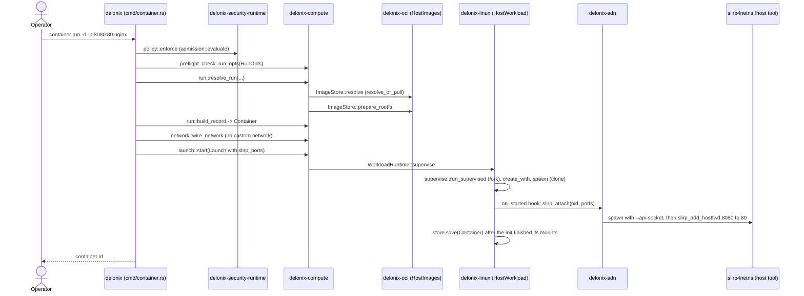
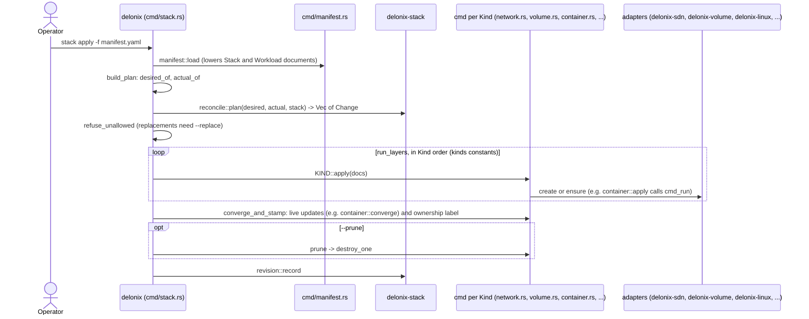
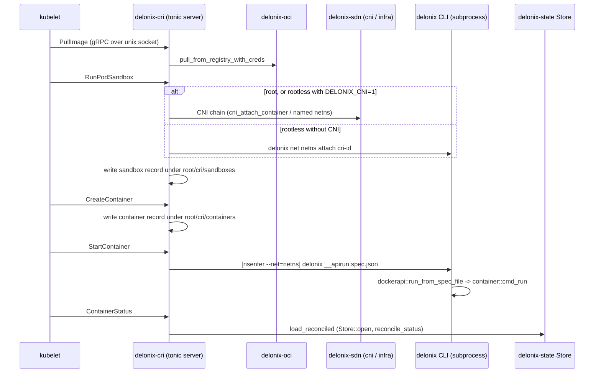

<!-- translated-from: crates.md sha256:02a670fe76c5758e314a6b3e1fa863a1636de585aa08a088f253e5a021a85f05 -->
# 各个 crate

**阅读之前：**[架构](architecture.md)，尤其是[层与允许的依赖方向](architecture.md#layers-and-the-allowed-direction)。

本页是你读代码时应该开着的地图。下面的表格由 `Cargo.toml` 和
`scripts/arch_fitness.py` 生成；表格之后的内容全部是手写的，其中每一处指引
（`path:symbol`）在写下之前都在树中读过一遍。凡是无法确认的说法都不会出现在这里。之后你还能找到
拥有某处改动的 crate、该 crate 中该先读哪些文件，以及它已经为之付出过代价的陷阱。

使用方法：

- 先找到拥有你想改动之处的 crate（先看层，参见
  [架构](architecture.md)了解层为何存在、依赖可以指向哪个方向）。
- 按顺序阅读它的 **从这里开始读** 列表，再读它的 **陷阱**：每一条都是
  这个代码库已经付出过代价的陷阱，记录它的注释仍然留在文件里。
- 在加入一行 `use delonix_…` 之前，先查表：一条不在「依赖」列里的边，
  除非方向是允许的方向，否则会被 `scripts/arch_fitness.py` 拒绝。

到处都会遇到的两个约定：

- **纯与有副作用之分。** 上下文和基础 crate 负责决策；适配器才触碰
  内核、磁盘、子进程或网络。当上下文里的一个用例需要一个副作用时，
  它声明一个 *端口*（trait），由某个适配器实现它。把端口接到适配器上的
  组合根是 `delonix` 二进制程序本身。
- **「与……对话」指的是机制，而不只是依赖关系。** 一个 crate 可能依赖
  另一个 crate，却仍然通过把 `delonix` 二进制当子进程运行来到达它
  （CRI 和本地管理 API 在需要 fork 的地方都是这样做的），或者通过在一个
  unix 控制套接字上写一行来到达它（网络 holder）。

## 参考表

<!-- dev-docs:begin crates-table -->
| Crate | 层 | 路径 | 二进制 | 依赖（引擎 crate） | 被使用于 |
|---|---|---|---|---|---|
| `delonix-model` | Foundation | `crates/foundation/delonix-model` | — | — | `delonix-compute`, `delonix-cri`, `delonix-linux`, `delonix-mcp`, `delonix-mgmt`, `delonix-node`, `delonix-oci`, `delonix-opnsense`, `delonix-proxmox`, `delonix-runtime-bin`, `delonix-scanner`, `delonix-sdn`, `delonix-security-runtime`, `delonix-stack`, `delonix-state`, `delonix-truenas`, `delonix-vm`, `delonix-volume` |
| `delonix-net-rules` | Foundation | `crates/foundation/delonix-net-rules` | — | — | `delonix-sdn`, `delonix-vm` |
| `delonix-compute` | Contexts | `crates/contexts/delonix-compute` | — | `delonix-model`, `delonix-node` | `delonix-cri`, `delonix-linux`, `delonix-mcp`, `delonix-mgmt`, `delonix-oci`, `delonix-proxmox`, `delonix-runtime-bin`, `delonix-sdn`, `delonix-state`, `delonix-vm`, `delonix-volume` |
| `delonix-node` | Contexts | `crates/contexts/delonix-node` | — | `delonix-model` | `delonix-compute`, `delonix-cri`, `delonix-linux`, `delonix-mcp`, `delonix-mcp-bin`, `delonix-mgmt`, `delonix-mgmt-bin`, `delonix-oci`, `delonix-runtime-bin`, `delonix-sdn`, `delonix-security-runtime`, `delonix-state`, `delonix-vm`, `delonix-volume` |
| `delonix-security-runtime` | Contexts | `crates/contexts/delonix-security-runtime` | — | `delonix-model`, `delonix-node` | `delonix-runtime-bin` |
| `delonix-stack` | Contexts | `crates/contexts/delonix-stack` | — | `delonix-model` | `delonix-runtime-bin` |
| `delonix-linux` | Adapters | `crates/adapters/delonix-linux` | — | `delonix-compute`, `delonix-model`, `delonix-node`, `delonix-state` | `delonix-cri`, `delonix-mcp`, `delonix-mgmt`, `delonix-runtime-bin` |
| `delonix-oci` | Adapters | `crates/adapters/delonix-oci` | — | `delonix-compute`, `delonix-model`, `delonix-node`, `delonix-state` | `delonix-cri`, `delonix-mgmt`, `delonix-runtime-bin`, `delonix-scanner` |
| `delonix-scanner` | Adapters | `crates/adapters/delonix-scanner` | — | `delonix-model`, `delonix-oci` | `delonix-mgmt`, `delonix-runtime-bin` |
| `delonix-sdn` | Adapters | `crates/adapters/delonix-sdn` | — | `delonix-compute`, `delonix-model`, `delonix-net-rules`, `delonix-node`, `delonix-state` | `delonix-cri`, `delonix-mcp`, `delonix-mgmt`, `delonix-opnsense`, `delonix-proxmox`, `delonix-runtime-bin` |
| `delonix-state` | Adapters | `crates/adapters/delonix-state` | — | `delonix-compute`, `delonix-model`, `delonix-node` | `delonix-cri`, `delonix-linux`, `delonix-mcp`, `delonix-mgmt`, `delonix-oci`, `delonix-runtime-bin`, `delonix-sdn`, `delonix-vm`, `delonix-volume` |
| `delonix-telemetry` | Adapters | `crates/adapters/delonix-telemetry` | — | — | `delonix-cri`, `delonix-mcp-bin`, `delonix-mgmt`, `delonix-mgmt-bin`, `delonix-runtime-bin` |
| `delonix-vm` | Adapters | `crates/adapters/delonix-vm` | — | `delonix-compute`, `delonix-model`, `delonix-net-rules`, `delonix-node`, `delonix-state` | `delonix-mcp`, `delonix-mgmt`, `delonix-runtime-bin` |
| `delonix-volume` | Adapters | `crates/adapters/delonix-volume` | — | `delonix-compute`, `delonix-model`, `delonix-node`, `delonix-state` | `delonix-mcp`, `delonix-mgmt`, `delonix-runtime-bin` |
| `delonix-opnsense` | Providers | `crates/providers/delonix-opnsense` | — | `delonix-model`, `delonix-sdn` | `delonix-runtime-bin` |
| `delonix-proxmox` | Providers | `crates/providers/delonix-proxmox` | — | `delonix-compute`, `delonix-model`, `delonix-sdn` | `delonix-runtime-bin` |
| `delonix-truenas` | Providers | `crates/providers/delonix-truenas` | — | `delonix-model` | `delonix-runtime-bin` |
| `delonix-cri` | Interfaces | `crates/interfaces/delonix-cri` | `delonix-cri` | `delonix-compute`, `delonix-linux`, `delonix-model`, `delonix-node`, `delonix-oci`, `delonix-sdn`, `delonix-state`, `delonix-telemetry` | — |
| `delonix-mcp` | Interfaces | `crates/interfaces/delonix-mcp` | — | `delonix-compute`, `delonix-linux`, `delonix-mgmt`, `delonix-model`, `delonix-node`, `delonix-sdn`, `delonix-state`, `delonix-vm`, `delonix-volume` | `delonix-mcp-bin` |
| `delonix-mgmt` | Interfaces | `crates/interfaces/delonix-mgmt` | — | `delonix-compute`, `delonix-linux`, `delonix-model`, `delonix-node`, `delonix-oci`, `delonix-scanner`, `delonix-sdn`, `delonix-state`, `delonix-telemetry`, `delonix-vm`, `delonix-volume` | `delonix-mcp`, `delonix-mgmt-bin`, `delonix-runtime-bin` |
| `delonix-mcp-bin` | Binaries | `bins/delonix-mcp-bin` | `delonix-mcp` | `delonix-mcp`, `delonix-node`, `delonix-telemetry` | — |
| `delonix-mgmt-bin` | Binaries | `bins/delonix-mgmt-bin` | `delonix-mgmt` | `delonix-mgmt`, `delonix-node`, `delonix-telemetry` | — |
| `delonix-runtime-bin` | Binaries | `bins/delonix-runtime-bin` | `delonix` | `delonix-compute`, `delonix-linux`, `delonix-mgmt`, `delonix-model`, `delonix-node`, `delonix-oci`, `delonix-opnsense`, `delonix-proxmox`, `delonix-scanner`, `delonix-sdn`, `delonix-security-runtime`, `delonix-stack`, `delonix-state`, `delonix-telemetry`, `delonix-truenas`, `delonix-vm`, `delonix-volume` | — |
<!-- dev-docs:end crates-table -->

## 基础层（Foundation）

基础层 crate 不携带任何机制：只有纯类型和规则。它们只能依赖其他基础层 crate。
持久化的 `Container` 和 `Vm` 记录不在这里（它们属于 `delonix-compute`），保存
记录的文件由 `delonix-state` 适配器读写。

### `delonix-model`

**用途。** 模型中任何一层都可以在不依赖具体机制的情况下引用的那部分：引擎
共享的 `Error` 类型（每个变体都带有稳定的 `DX_*` 代码）、自动生成的工作负载
名称、从 `Error` 到进程退出码的映射、编号的 `DX-CDNN` 代码字典、secret 模型
（何为一个 secret、合法的名称和键长什么样），以及——自 #405 起——那些纯粹是
数据的记录：工作负载的 `Status`、按容器划分的防火墙记录（`ContainerFw`、
`FwRule` 以及纯校验函数 `fw_proto_ok`、`fw_port_ok`、`fw_src_ok`）、
`default_namespace`，以及编译期的生命周期 `typestate`。纯——无 I/O，无进程
状态（crate 文档）。使用这些类型的 `Container` 和 `Vm` 记录在 `delonix-compute`
里；存放记录的文件在 `delonix-state` 里。

**关键模块**

| 模块 | 职责 |
|---|---|
| `error` | `Error`、`Result`，以及 `Error::code`（每个变体的 `DX_*` 字符串） |
| `exitcode` | 退出码分类（`NOT_RUNNING`、`NOT_FOUND`、`CONFLICT`……）以及 `for_error` |
| `names` | 默认名称（`derived_name`、`random_name`） |
| `codes` | 编号代码字典 `DX-CDNN`（ADR-0043）：类别位、域位、编号 |
| `secret` | `Secret` 及纯规则 `valid_name`、`valid_env_key`、`parse_env_file`；加密存储在 `delonix-state` |
| `records` | `Status`（`from_wait`、`is_terminal`、`exit_code`）、`ContainerFw`/`FwRule`、`fw_proto_ok`/`fw_port_ok`/`fw_src_ok`、`default_namespace`（在 #405 移到这里） |
| `typestate` | 编译期生命周期阶段 `Phase<Created/Running/Stopped>`；非法的转换无法通过编译（在 #405 移动） |

**主要公开 API**

| 项目 | 是什么 | 位置 |
|---|---|---|
| `Error::code` | 错误的稳定机器码（`DX_*`） | `crates/foundation/delonix-model/src/error.rs:code` |
| `exitcode::for_error` | 唯一把 `Error` 变成退出码的地方 | `crates/foundation/delonix-model/src/exitcode.rs:for_error` |
| `exitcode::merge` | 一批结果对应的退出码 | `crates/foundation/delonix-model/src/exitcode.rs:merge` |
| `names::derived_name` | 由 id 确定性推导出的名称 | `crates/foundation/delonix-model/src/names.rs:derived_name` |
| `secret::Secret`、`secret::parse_env_file` | secret 记录及 `KEY=value` 文件解析器，`delonix-compute` 无需依赖某个适配器即可使用 | `crates/foundation/delonix-model/src/secret.rs` |
| `records::Status` | 工作负载的生命周期状态 | `crates/foundation/delonix-model/src/records.rs:Status` |
| `records::ContainerFw`、`records::FwRule` | 持久化的按容器防火墙记录；`delonix-sdn` 用 nftables 应用它 | `crates/foundation/delonix-model/src/records.rs` |
| `typestate::Phase` | 类型化的生命周期阶段 | `crates/foundation/delonix-model/src/typestate.rs:Phase` |

**与……对话。** 不依赖任何其他引擎 crate：它是依赖图的根，其他每一个返回
共享错误类型的引擎 crate 都从这里导入。CLI 把 `exitcode` 和 `names` 重新导出为
`cmd::exitcode` 和 `cmd::names`
（`bins/delonix-runtime-bin/src/cmd/mod.rs`），因此老的调用点无需改动。

**值得留意的外部依赖。** `thiserror`（`Error` 的 derive 宏）、`serde_json`
（`Error::Json` 变体包裹 `serde_json::Error`）以及 `serde`（`Secret` 的
derive 宏）。

**测试。** 内联单元测试（`codes`、`error`、`exitcode`、`names`、`typestate`）
以及 `src/typestate.rs` 中的一个文档测试。

**从这里开始读。** `src/exitcode.rs`（它的模块文档解释了为什么会有这些
分类），然后是 `src/records.rs`，再是 `src/names.rs`。

**陷阱。**

- `for_error` 里的 `match` 故意写成穷尽的：新增的 `Error` 变体必须在这里
  被分类，否则编译不通过。
- 有两条导入路径指向同一个类型：`delonix_model::records::FwRule` 和
  `delonix_sdn::FwRule`（一个重新导出，见 `crates/adapters/delonix-sdn/src/lib.rs`）。
  它们是同一个类型，所以两边都能编译；查找调用者时，两条路径都要 `grep`。

### `delonix-net-rules`

**用途。** 无需触碰内核就能算出来的网络规则：网桥名称、前缀内的 IP 推导、
`Cidr` 值类型、标签匹配、`iptables-save` 输出的解析。它**零依赖**，因此任何
调用者都能编译出与引擎所用完全相同的规则。它刻意排除了任何需要读取共享状态
的东西（IP 分配要读 IPAM 注册表，所以那部分留在 `delonix-sdn`）。

**关键模块。** 单一的 `lib.rs`。

**主要公开 API**

| 项目 | 是什么 | 位置 |
|---|---|---|
| `Cidr` | IPv4 前缀类型，不依赖外部 crate | `crates/foundation/delonix-net-rules/src/lib.rs:Cidr` |
| `bridge_name` | 由网络名推导网桥设备名的唯一公式 | `crates/foundation/delonix-net-rules/src/lib.rs:bridge_name` |
| `derive_ip_in`、`valid_ip_in_subnet` | 为某个 id 推导首选地址，以及成员关系检查 | `crates/foundation/delonix-net-rules/src/lib.rs` |
| `matches_labels` | 标签选择器匹配（`kind: Service` 使用） | `crates/foundation/delonix-net-rules/src/lib.rs:matches_labels` |
| `parse_overlay_peer` | 解析一条 overlay 对端 spec | `crates/foundation/delonix-net-rules/src/lib.rs:parse_overlay_peer` |

**与……对话。** 不与任何东西对话。`delonix-sdn` 重新导出它的各项，因此
调用 `delonix_sdn::Cidr` 等的代码不受影响，照常编译。

**值得留意的外部依赖。** 无。

**测试。** 内联单元测试。

**从这里开始读。** `src/lib.rs`——模块文档列出了哪些内容被刻意排除在外，
以及为什么。

**陷阱。** 模块文档有一部分仍是葡萄牙语（LANG-01 遗留债务）；以代码为准。

## 上下文层（Contexts）

一个上下文拥有某个领域的决策权，以及它的用例所需要的端口。没有任何上下文
会去挂载、启动或配置网络；`delonix-node` 是唯一直接读取宿主机
（`/proc`、`/sys`、`kill(pid, 0)`、`SO_PEERCRED`）的那个。

### `delonix-compute`

**用途。** Compute 上下文（`compute.delonix.io`）：引擎为容器和虚拟机持久化
的记录（`Container`、`Vm`，以及它们携带的东西——`Mount`、健康检查、cgroup
归属、额外网络、磁盘和网卡），每个入口点都会转换成的运行规格
（`RunOpts`），以及把 `container run` 这个用例表达为端口之上一系列纯步骤——
预检、解析、构建记录、接线网络、启动。它同时持有 Pod 规格类型及其到
`RunOpts` 的转换，还有工作负载的 IPv4 网段。这些记录是从被移除的
`delonix-runtime-core`（#406）移过来的。它**不**负责派生进程、拉取镜像或
配置网络；它调用适配器实现的 trait。

**关键模块**

| 模块 | 职责 |
|---|---|
| `record`（私有，在 crate 根重新导出） | `Container`、`Vm`、`Mount`、`HealthConfig`/`Health`/`HealthState`、`CgroupParent`、`KubeCgroupParent`/`KubeCgroupDriver`、`ExtraNet`、VM 相关类型（`CpuTopology`、`ExtraDisk`、`ExtraNic`、`VmVolume`、`VmBootSpec`）、`DELONIX_SLICE`、`safe_cgroup_segment` |
| `workload_net` | 工作负载的 IPv4 网段（`is_workload_ipv4`），只定义一次 |
| `run_opts` | `RunOpts`，唯一的运行规格 |
| `preflight` | 在产生任何副作用之前，拒绝毫无意义的 flag 组合 |
| `run` | `resolve_run`（经由端口）与 `build_record`（纯函数） |
| `network` | 网络阶段：`attach_custom_network`、`wire_network` |
| `launch` | `Launch` 意图、`WorkloadRuntime` 端口、`start` 用例、重启策略 |
| `ports` | `ImageStore`、`StorageProvider`、`DeviceResolver`、`RunHost`、`NetworkProvider`、`VmNetwork` |
| `pod` | Pod 规格类型，以及 `pod_to_run_opts`/`container_to_run_opts` |
| `notice` | `Notice`，作为数据返回而不是直接打印出来的警告 |

**主要公开 API**

| 项目 | 是什么 | 位置 |
|---|---|---|
| `Container` | 所有人读写的容器记录 | `crates/contexts/delonix-compute/src/record.rs:Container` |
| `Vm` | 虚拟机记录 | `crates/contexts/delonix-compute/src/record.rs:Vm` |
| `KubeCgroupParent::parse` | 校验 kubelet 传来的 cgroup 父路径 | `crates/contexts/delonix-compute/src/record.rs:KubeCgroupParent` |
| `DELONIX_SLICE` | root 模式下的 cgroup slice | `crates/contexts/delonix-compute/src/record.rs:DELONIX_SLICE` |
| `RunOpts` | 运行规格 | `crates/contexts/delonix-compute/src/run_opts.rs:RunOpts` |
| `preflight::check_run_opts` | 纯函数，拒绝不可能的组合 | `crates/contexts/delonix-compute/src/preflight.rs:check_run_opts` |
| `run::resolve_run` | 经由端口解析镜像、卷、设备、用户、默认值 | `crates/contexts/delonix-compute/src/run.rs:resolve_run` |
| `run::build_record` | 把规格 + 解析结果变成一个 `Container`（纯函数） | `crates/contexts/delonix-compute/src/run.rs:build_record` |
| `network::wire_network` | 发布端口、记录网络/IP、命名空间隔离、限速——都在启动之前 | `crates/contexts/delonix-compute/src/network.rs:wire_network` |
| `launch::start` | 受监督或直接启动，以及从未真正发生的启动的清理 | `crates/contexts/delonix-compute/src/launch.rs:start` |
| `launch::WorkloadRuntime` | 把 `Launch` 变成一个进程的端口 | `crates/contexts/delonix-compute/src/launch.rs:WorkloadRuntime` |
| `ports::NetworkProvider` | attach/publish/firewall/限速的端口 | `crates/contexts/delonix-compute/src/ports.rs:NetworkProvider` |
| `ports::VmNetwork` | 无 root 网络上 VM tap 的端口 | `crates/contexts/delonix-compute/src/ports.rs:VmNetwork` |

**与……对话。** 只直接调用 `delonix-model` 和 `delonix-node`
（记录用到的 `safe_to_signal`，测试里用到的 `generate_id`）。其余一切都
经由它的端口到达，由各适配器实现：

| 端口 | 由谁实现 |
|---|---|
| `ImageStore` | `crates/adapters/delonix-oci/src/run_images.rs:HostImages` |
| `StorageProvider` | `crates/adapters/delonix-volume/src/lib.rs:HostVolumes` |
| `DeviceResolver` | `crates/adapters/delonix-linux/src/cdi.rs:HostDevices` |
| `RunHost` | `crates/adapters/delonix-linux/src/run_host.rs:HostRuntime` |
| `WorkloadRuntime` | `crates/adapters/delonix-linux/src/workload.rs:HostWorkload` |
| `NetworkProvider` | `crates/adapters/delonix-sdn/src/run_network.rs:HostNetwork` |
| `VmNetwork` | `crates/adapters/delonix-sdn/src/vm_network.rs:HostVmNetwork` |

**值得留意的外部依赖。** `serde`、`schemars`（Cargo.toml 注释：规格类型的
JSON Schema 就在其定义旁边推导出来，这样发布的 schema 就不会与类型本身
产生偏差）。

**测试。** 使用假端口实现（`network.rs`、`launch.rs`、`run.rs` 中的
`FakeNet`、`FakeRuntime`、`Fake`）的内联单元测试——用例在没有内核的情况下
也能测试。

**从这里开始读。** `src/record.rs`（`Container` 和 `Vm` 结构体），然后是
`src/ports.rs`，再是 `src/run.rs`，最后是 `src/launch.rs`。

**陷阱。**

- `Container.userns` 说的是这个容器是否**创建**了自己的用户命名空间，
  而不是它是否运行在一个不同的命名空间里。加入网络 holder 用户命名空间的
  工作负载 `userns = false`，但它们仍然处于一个与调用者不同的用户命名空间
  里。`delonix-linux` 里的 `mount_live` 记录了这一点，并且总是打开
  `user` 命名空间，而不是信任这个字段
  （`crates/adapters/delonix-linux/src/lib.rs:mount_live`）。
- `Container.ip` 只是**主**网络上的地址；一个多宿主容器还有更多地址
  （参见 `crates/adapters/delonix-sdn/src/infra.rs` 里的 `NetPlan` 文档注释
  以及 `apply_firewall_all`——它的存在正是因为只对主 IP 加防火墙是可以
  被绕过的）。
- `Container::cgroup()` 是静态的 root 模式路径。对于正在运行的无 root
  容器，真正的 cgroup 由 `delonix_linux::live_cgroup` 从
  `/proc/<pid>/cgroup` 读取。
- `record.rs` 是一次大拆分留下的残余：它的模块文档仍然说这些记录
  「来自 `delonix-runtime-core`」，`src/lib.rs` 里的 crate 文档也仍然把
  这个 crate 描述成只持有运行规格。以上的模块列表才是权威。

- 有两个同名为 `ImageStore` 的东西：端口 trait
  `delonix_compute::ports::ImageStore` 和具体的存储实现
  `delonix_oci::ImageStore`（一个结构体）。`HostImages` 把后者适配成
  前者。导入路径很重要。
- `wire_network` 必须在 `launch::start` **之前**运行；它的模块文档
  记录了：否则一个受监督的 `-d` 启动会漏掉网络设置。

### `delonix-node`

**用途。** 节点上下文（crate 文档，ADR-0040 D2.2）：节点自身的、被多个
crate 都需要、否则就得各自复制一份的东西——只追加写入的事件日志、
虚拟化与宿主机检测、本地套接字的 `SO_PEERCRED` 校验、`delonix` 启动某个
服务端二进制程序时遵循的规则，以及对宿主机和进程提出的问题（时钟、用户
命名空间、pid 是否存活、生成新 id）。它是从被移除的 `delonix-runtime-core`
（#406）中拆出来的。它**不**创建进程、不挂载、不配置网络，也不持有任何
工作负载记录。

**关键模块**

| 模块 | 职责 |
|---|---|
| `host`（私有，在 crate 根重新导出） | `now_unix`、`in_initial_userns`、`initial_uid_map`、`is_rootless`、`fmt_local_ts`、`is_alive`、`proc_starttime`、`safe_to_signal`、`generate_id`、`self_bin` |
| `events` | 只追加写入的 `events.jsonl` 事件日志（`emit`、`read`、`read_from`、`size`） |
| `dispatch` | `delonix` 启动的服务端二进制程序的版本检查与 CLI 定位（`DELONIX_DISPATCH_VERSION`、`DELONIX_BIN`） |
| `peer_cred` | 从 `SO_PEERCRED` 取得 `peer_uid` |
| `virt` | 从 `/sys` 和 `/proc` 检测虚拟化/virtio（`detect`、`blk_scheduler`、`set_blk_scheduler_none`） |

**主要公开 API**

| 项目 | 是什么 | 位置 |
|---|---|---|
| `events::emit` | 追加一行事件 | `crates/contexts/delonix-node/src/events.rs:emit` |
| `dispatch::check_version`、`dispatch::cli_bin` | `delonix-cri`/`-mgmt`/`-mcp` 如何拒绝版本不匹配的发行版、以及如何找到可以回调的 `delonix` CLI | `crates/contexts/delonix-node/src/dispatch.rs` |
| `is_alive`、`proc_starttime`、`safe_to_signal` | 经得起 pid 回收的存活检查 | `crates/contexts/delonix-node/src/host.rs` |
| `in_initial_userns`、`is_rootless` | 判断这里的 uid 0 是不是宿主机的 root | `crates/contexts/delonix-node/src/host.rs` |
| `generate_id`、`now_unix` | 16 位十六进制 id、自纪元起的秒数 | `crates/contexts/delonix-node/src/host.rs` |
| `peer_cred::peer_uid` | unix 套接字对端的 uid | `crates/contexts/delonix-node/src/peer_cred.rs:peer_uid` |

**与……对话。** 只依赖 `delonix-model`（见 `Cargo.toml`）。没有子进程：
检测直接读取 `/sys` 和 `/proc`，`is_alive` 用的是 `kill(pid, 0)`。

**值得留意的外部依赖。** `serde`/`serde_json`（事件行）、`libc`。

**测试。** `events.rs`、`peer_cred.rs` 和 `virt.rs` 中内联的
`#[cfg(test)]` 模块；没有 `tests/` 目录。

**从这里开始读。** `src/lib.rs`（重新导出的部分），然后是 `src/host.rs`，
再是 `src/dispatch.rs`。

**陷阱。**

- `geteuid() == 0` 不等于「宿主机上的 root」：用 `in_initial_userns`
  （它的文档注释记录了两处曾经在嵌套用户命名空间里误走了 root 路径的地方）。
- 在 `src/host.rs` 里，`is_alive` 的 rustdoc 开头有一段关于 `Vm` 记录的
  文字，是拆分时留下的；紧跟其后的那一句话才是这个函数真正的文档。

### `delonix-stack`

**用途。** Stack 上下文（`core.delonix.io`）：Kind 及其事实的表格、把
清单（manifest）与现状进行比对规划的三方协调器，以及一次 apply 的
修订历史。规划过程是纯的——这里不会打开任何具体资源的存储，也不会执行
任何命令（crate 文档）。清单的加载和逐个 Kind 的 apply 仍然留在 CLI 里。

**关键模块**

| 模块 | 职责 |
|---|---|
| `kinds` | Kind 名称常量以及 `KindFacts`（domain、form、converges、teardown、namespaced、presence） |
| `reconcile` | `Desired`/`Actual`/`Change`、`plan`、所有权标签与 last-applied 注解 |
| `revision` | 记录与列出 apply 的修订版本（用于回滚） |
| `condition` | `Condition` 类型 |

**主要公开 API**

| 项目 | 是什么 | 位置 |
|---|---|---|
| `kinds::facts`、`kinds::stack_kinds`、`kinds::converges` | CLI 按 Kind 查询的唯一一张表 | `crates/contexts/delonix-stack/src/kinds.rs` |
| `reconcile::plan` | 期望态 vs 实际态 → `Vec<Change>` | `crates/contexts/delonix-stack/src/reconcile.rs:plan` |
| `reconcile::STACK_LABEL`、`LAST_APPLIED` | 所有权标签与三方 diff 注解 | `crates/contexts/delonix-stack/src/reconcile.rs` |
| `reconcile::hot_fields_for` | 哪些字段的变更可以热应用 | `crates/contexts/delonix-stack/src/reconcile.rs:hot_fields_for` |
| `revision::record`、`revision::list` | apply 历史 | `crates/contexts/delonix-stack/src/revision.rs` |

**与……对话。** 只依赖 `delonix-model`。CLI 把 `kinds`、`reconcile` 和
`revision` 重新导出为 `cmd::kinds` 等
（`bins/delonix-runtime-bin/src/cmd/mod.rs`）。

**值得留意的外部依赖。** `serde`、`serde_json`。

**测试。** 内联单元测试（把方案当数据来测）。

**从这里开始读。** `src/kinds.rs`，然后是 `src/reconcile.rs`，再看
`bins/delonix-runtime-bin/src/cmd/stack.rs` 了解它是如何被使用的。

**陷阱。** 新增一个 Kind 不只是在 `kinds.rs` 里加一行：CLI 里还有
按 Kind 各自的代码（`cmd/stack.rs` 里的 `desired_of`/`actual_of`、
`converge_and_stamp`、`destroy_one`），以及各自带测试的 schema/补全表。
改动这张表之后要跑一遍 `delonix-runtime-bin` 的完整测试套件。

### `delonix-security-runtime`

**用途。** 节点自身的安全**决策**：策略文件、针对容器和虚拟机的单一准入
评估、安全事件、可解释的安全态势评分，以及文本中 secret 的脱敏。全部都是
对其参数的纯函数。它刻意没有任何传感器、监视器或常驻进程（crate 文档：
按设计就是无守护进程的），也没有任何 tenant、project 或 environment 字段。

**关键模块**

| 模块 | 职责 |
|---|---|
| `policy` | `SecurityPolicy`、`Mode`、静态检查 |
| `admission` | `Request`、`evaluate`、`Decision`、`Violation` |
| `event` | 引擎事件日志上的 `SecurityEvent` |
| `score` | 带扣分项和原因的 `Score` |
| `redact` | 在不可信输入中对敏感键/值做脱敏 |
| `severity` | `Severity`、`ActionRisk`、`Confidence` |

**主要公开 API**

| 项目 | 是什么 | 位置 |
|---|---|---|
| `SecurityPolicy::parse` | 加载一份策略 | `crates/contexts/delonix-security-runtime/src/policy.rs:SecurityPolicy` |
| `admission::evaluate` | 决策一次请求 | `crates/contexts/delonix-security-runtime/src/admission.rs:evaluate` |
| `admission::Request` | 容器或虚拟机的准入输入 | `crates/contexts/delonix-security-runtime/src/admission.rs:Request` |
| `redact::redact_text` | 在文本中遮蔽 secret | `crates/contexts/delonix-security-runtime/src/redact.rs:redact_text` |

**与……对话。** `delonix-model` 和 `delonix-node`（`events`、`now_unix`）。
CLI 通过 `bins/delonix-runtime-bin/src/cmd/policy.rs` 来使用它，`cmd_run`
在解析任何镜像之前就会调用它。

**值得留意的外部依赖。** `serde`、`serde_json`。

**测试。** 内联单元测试，包括 `lib.rs` 里的 `boundary_tests` 模块，以及
crate 文档中的一个文档测试。

**从这里开始读。** `src/lib.rs`（crate 文档）、`src/admission.rs`、
`src/policy.rs`。

**陷阱。** 除了 crate 文档提到的之外没有别的：不要在这里加后台传感器——
文档解释了为什么在无 root 模式下一个不起作用的控制比没有控制还要糟糕。

## 适配器层（Adapters）

适配器是引擎与内核、磁盘、宿主机工具和远程镜像仓库相遇的地方。它们依赖
基础层和上下文层，彼此之间从不互相依赖（已声明的例外列在
[架构](architecture.md)里）。

### `delonix-linux`

**用途。** 底层的容器运行时：带命名空间的 `clone`、
`pivot_root`、cgroups v2、capabilities 与 seccomp、通过 `setns` 实现的
`exec`、停止与删除，以及 `run -d` 背后的脱离监督进程。它的 crate 文档
规定了这条规则：容器的系统调用边界就在这里。它不解析镜像、不解析 CLI
参数，也不配置网络；网络方面的副作用是作为调用者传入的 hook 到达的。

**关键模块**

| 模块 | 职责 |
|---|---|
| `lib.rs` | `RunSpec`、`create_with`/`spawn`、`container_init`、根文件系统搭建与 overlay 挂载、`exec`、`stop`、`remove`、热挂载、cgroups、`reconcile_status` |
| `workload` | `HostWorkload`，`WorkloadRuntime` 端口的实现 |
| `launch_spec` | `run_spec`，唯一一处从 `Launch` 构建 `RunSpec` 的地方 |
| `supervise` | `run_supervised`，一个脱离容器的、被 fork 出来的父进程 |
| `capabilities` | capability 名称↔编号对照表及默认集合 |
| `seccomp_profile` | OCI seccomp 配置的加载 |
| `cdi` | CDI 设备规格的消费者（`HostDevices`） |
| `run_host` | `HostRuntime`，`RunHost` 端口的实现 |
| `regulate`、`resource_advice`、`workload_view` | 资源压力、宿主机建议、请求值与实际生效值的对照视图 |

**主要公开 API**

| 项目 | 是什么 | 位置 |
|---|---|---|
| `RunSpec` | 一次 spawn 所需的一切 | `crates/adapters/delonix-linux/src/lib.rs:RunSpec` |
| `create_with` | 启动一个容器（调用 `spawn`） | `crates/adapters/delonix-linux/src/lib.rs:create_with` |
| `exec` | 在一个正在运行的容器里执行一条命令 | `crates/adapters/delonix-linux/src/lib.rs:exec` |
| `stop`、`remove` | 生命周期管理 | `crates/adapters/delonix-linux/src/lib.rs` |
| `reconcile_status` | 用真实进程状态刷新一条记录 | `crates/adapters/delonix-linux/src/lib.rs:reconcile_status` |
| `mount_live`、`update_limits`、`set_frozen` | 对正在运行的容器做热更改 | `crates/adapters/delonix-linux/src/lib.rs` |
| `mount_overlay_if_marked` | 使用新挂载 API 做 overlay 挂载 | `crates/adapters/delonix-linux/src/lib.rs:mount_overlay_if_marked` |
| `supervise::run_supervised` | 脱离容器的监督进程 | `crates/adapters/delonix-linux/src/supervise.rs:run_supervised` |
| `workload::HostWorkload` | `WorkloadRuntime` 适配器 | `crates/adapters/delonix-linux/src/workload.rs:HostWorkload` |

**与……对话。** 直接调用 `delonix-model`、`delonix-node`、`delonix-compute`
和 `delonix-state`（`Store`、`SecretStore`、`write_private_temp`；这是
ADR-0040 P4 中已声明并将被移除的分层例外）。系统调用经由 `nix`、`libc`
和 `rustix`。它运行的宿主机工具：`busctl`（kubelet cgroup 父路径对应的
systemd scope）、`apparmor_parser`、`ldconfig`、`nvidia-smi`。`-p` 用到
的 slirp 不是在这里启动的：`HostWorkload` 接受一个 `attach_slirp` hook，
由 CLI 用 `delonix_sdn::slirp_attach` 填充
（`bins/delonix-runtime-bin/src/cmd/container.rs:with_host_workload`）。

**值得留意的外部依赖。** `nix`、`libc`、`seccompiler`；`rustix` 的
`mount`/`fs` 特性（Cargo.toml 注释：`nix` 没有
`fsopen`/`fsconfig`/`fsmount`/`move_mount` 的封装，而这些正是绕开经典
`mount(2)` 的 data 参数页大小限制所需要的）；`serde_yaml` 用于 CDI 规格。

**测试。** `lib.rs` 及各模块文件中的内联单元测试模块；
`crates/adapters/delonix-linux/tests/` 中的集成测试
（`cgroup_parent.rs`、`advisor_fixtures.rs`）。

**从这里开始读。** `src/workload.rs`，然后是 `src/launch_spec.rs`，
再是 `src/lib.rs` 中从 `RunSpec` 到 `spawn` 再到 `container_init` 的部分。

**陷阱。**

- 在 init 完成它的挂载操作之前，`spawn` 不会返回，记录也不会带着
  `pid` 被保存；`spawn` 里 `store.save` 之前的注释解释了这样做关闭的是
  哪种宿主机 root 相关的竞态。不要把这次保存提前。
- `supervise::run_supervised` 以及无 root 握手都假定调用者是单线程的
  （`fork`）。这正是为什么多线程的服务端（CRI、管理 API、Docker API
  的仿真层）要靠运行 `delonix` 二进制程序、而不是调用这个 crate 来
  启动容器。
- 对于正在运行的无 root 容器，要用 `live_cgroup(container)`，而不是
  `container.cgroup()`。

### `delonix-oci`

**用途。** OCI 镜像：一个按内容寻址的 blob 存储、镜像仓库及其元数据、
带身份验证的镜像仓库拉取/推送、按容器的根文件系统准备（共享的 overlay
层）、Dockerfile/Delonixfile 解析与构建辅助函数、Cloud Native Buildpacks
规划、归档的加载/保存，以及签名的签发/验证。它不运行容器；一次构建
的各个步骤是由 CLI 驱动执行的。

**关键模块**

| 模块 | 职责 |
|---|---|
| `cas` | `Cas`，以 sha256 寻址的 blob |
| `image` | `Image`、`ImageConfig`、`ImageStore` |
| `registry` | 引用解析、`resolve_or_pull`、拉取/推送、OCI artifact |
| `overlay` | `prepare_container_rootfs`、`prepare_overlay`、`existing_rootfs_path` |
| `build` | Dockerfile 解析器（`parse_dockerfile`）、构建阶段、`commit_flat_rootfs` |
| `run_images` | `HostImages`，compute 层的 `ImageStore` 端口实现 |
| `auth` | 镜像仓库凭据（`login`/`lookup`） |
| `load`、`save` | 导入 Docker 归档、导出 OCI 归档 |
| `sign` | `sign_image`、`verify_signature`（ECDSA P-256） |
| `buildpack`、`detect`、`internal_registry` | CNB 计划、语言检测、一次性用的镜像仓库 |
| `rootfs_user` | 对照根文件系统解析 `--user` |
| `error` | 本 crate 自己的 `Error`，每个出错分组对应字典中的一个编号（ADR-0043），会被转换成 `delonix_model::Error` |

**主要公开 API**

| 项目 | 是什么 | 位置 |
|---|---|---|
| `ImageStore` | 打开、解析、列出、删除镜像 | `crates/adapters/delonix-oci/src/image.rs:ImageStore` |
| `registry::resolve_or_pull` | 本地镜像或拉取 | `crates/adapters/delonix-oci/src/registry.rs:resolve_or_pull` |
| `pull_from_registry_with_creds` | 带凭据拉取（CRI 使用它） | `crates/adapters/delonix-oci/src/registry.rs` |
| `ImageStore::prepare_container_rootfs` | 为某个容器 id 准备根文件系统 | `crates/adapters/delonix-oci/src/overlay.rs` |
| `build::parse_dockerfile` | Dockerfile/Delonixfile 语法 | `crates/adapters/delonix-oci/src/build.rs:parse_dockerfile` |
| `Cas` | blob 存储 | `crates/adapters/delonix-oci/src/cas.rs:Cas` |
| `verify_signature` | cosign 风格的验证 | `crates/adapters/delonix-oci/src/sign.rs:verify_signature` |

**与……对话。** `delonix-model`——自身的错误会转换成它的 `Error`
（`src/error.rs`，`impl From<Error> for delonix_model::Error`，ADR-0043）；
`delonix-node`；`delonix-compute`（它实现了 `ImageStore` 端口）；以及
`delonix-state`（`write_atomic_mode`；ADR-0040 P4 中已声明并将被移除的
分层例外）。通过阻塞式的 `reqwest` 客户端以 HTTPS 访问镜像仓库。源码里
没有对宿主机子进程的调用。

**值得留意的外部依赖。** `reqwest`（阻塞式，rustls）、`oci-spec`（规范的
OCI 镜像类型）、`sha2`、`tar`、`flate2`、`zstd`、`base64`、`ring`
（签名验证）；仅在开发时使用的 `proptest`（在稳定版 Rust 上验证解析器
的健壮性）和 `criterion`。

**测试。** 内联单元测试；一个基准测试位于
`crates/adapters/delonix-oci/benches/parse_reference.rs`。

**从这里开始读。** `src/image.rs`，然后是 `src/registry.rs`
（`resolve_or_pull`），再是 `src/overlay.rs`。

**陷阱。**

- `delonix_oci::ImageStore`（结构体）不是
  `delonix_compute::ports::ImageStore`（trait）；参见 `run_images.rs`。
- 容器启动所依据的根文件系统是共享层之上的一个 overlay，带一个标记
  文件；挂载动作本身发生在容器自己的 init 里
  （`delonix_linux::mount_overlay_if_marked`），而不是在这里。

### `delonix-sdn`

**用途。** 无 root 的 SDN 和防火墙。一个长寿命的 *pin* 进程持有一个
用户+网络命名空间；一个位于其中、可重启的 *control* 进程提供一个 unix
控制套接字，并拥有网桥、nftables 规则、DHCP 和内部 DNS；一个
`slirp4netns` 把该命名空间桥接到宿主机。它还覆盖了在没有自定义网络时
`-p` 所用的按容器 slirp 路径、IPAM、CNI 插件的执行、WireGuard overlay，
以及可选的 eBPF 流量统计。它重新导出 `delonix-net-rules`。它不派生容器。

**关键模块**

| 模块 | 职责 |
|---|---|
| `lib.rs` | `NetworkStore`、发布规格解析、`slirp_attach`、slirp 孤儿回收 |
| `infra` | holder 本体：`ensure_up`、`acquire`、`attach_container`、`publish_port`、`apply_firewall_all`、`network_route`、`vm_attach`、控制套接字 |
| `run_network` | `HostNetwork`（`NetworkProvider` 端口）、`publish_with_retry` |
| `vm_network` | `HostVmNetwork`（`VmNetwork` 端口） |
| `ipam` | 地址租约注册表 |
| `cni` | CNI 一致性：运行插件二进制程序 |
| `wg` | overlay 之上的 WireGuard |
| `bpf` | 可选的 eBPF 流量统计 |
| `discover` | 从 `/proc/<pid>/net` 读取一个工作负载正在监听的端口 |
| `pin_userns` | pin 自身的命名空间及 id 映射 |

**主要公开 API**

| 项目 | 是什么 | 位置 |
|---|---|---|
| `NetworkStore` | 声明式网络注册表 | `crates/adapters/delonix-sdn/src/lib.rs:NetworkStore` |
| `parse_publish`、`parse_publish_addr` | `-p` 语法 | `crates/adapters/delonix-sdn/src/lib.rs` |
| `slirp_attach` | 容器自己的 slirp，带宿主机转发 | `crates/adapters/delonix-sdn/src/lib.rs:slirp_attach` |
| `infra::ensure_up` | 拉起 holder（pin + control + slirp） | `crates/adapters/delonix-sdn/src/infra.rs:ensure_up` |
| `infra::attach_container` | 网络上的 veth、IP 租约 | `crates/adapters/delonix-sdn/src/infra.rs:attach_container` |
| `infra::apply_firewall_all` | 为容器持有的每一个 IP 建立按容器的链 | `crates/adapters/delonix-sdn/src/infra.rs:apply_firewall_all` |
| `run_network::HostNetwork` | `NetworkProvider` 适配器 | `crates/adapters/delonix-sdn/src/run_network.rs:HostNetwork` |

**与……对话。** `delonix-model`、`delonix-node`、`delonix-net-rules`、
`delonix-compute`（端口、`workload_net`）、`delonix-state`（`write_atomic`、
`write_private_temp`；ADR-0040 P4 中已声明并将被移除的分层例外）。宿主机
工具：`ip`、`nft`、`nsenter`、`slirp4netns`、`conntrack`、`wg`，以及 CNI
插件二进制程序。holder 是通过重新执行引擎自身的二进制程序来启动的
（`netns pin`、`netns control`，在参数解析之前被 CLI 的 `main` 拦截——
`bins/delonix-runtime-bin/src/main.rs`）。所有必须发生在该命名空间内部
的操作都是写到控制套接字上的一行（`infra.rs:control_query`），由
`handle_control` 处理。端口转发经由 `slirp4netns` 的 API 套接字
（`slirp_add_hostfwd`）。`build.rs` 只有在 `clang` 和相应头文件都存在时
才会编译 eBPF 对象；eBPF 从不是必需品。

**值得留意的外部依赖。** `libc`、`serde`、`serde_json`、`tracing`；仅在
开发时使用的 `proptest`，用于验证 IP 分配的不变式。

**测试。** 内联单元测试模块；
`crates/adapters/delonix-sdn/tests/` 中的集成测试。

**从这里开始读。** `src/infra.rs` 的模块文档和 `ensure_up`，然后是
`attach_container`，再是 `src/run_network.rs`。

**陷阱。**

- `src/lib.rs` 中的私有辅助函数 `capture()` 返回 stdout 时**不检查退出
  状态**。要读它的输出；千万不要把它的 `Ok` 当作「命令执行成功」。
  （`delonix-vm` 里同名的辅助函数不一样：它失败时返回 `None`。）
- 控制套接字路径由 uid 推导；**并且**当 `DELONIX_ROOT` 不是默认值时，
  还会加上它的哈希值（`runtime_dir` + `root_suffix`，ADR-0014）；
  `DELONIX_NET_RUNTIME_DIR` 会覆盖这两者。任何跨用户命名空间重新执行的
  进程都必须携带 `runtime_dir_env()`，以及 `DELONIX_ROOT`；参见
  `infra.rs` 里 pin 是如何被启动的。隔离一次测试运行时，`DELONIX_ROOT`
  和 `DELONIX_NET_RUNTIME_DIR` 两者都要设置。
- 只知道 `Container.ip` 的防火墙会漏掉额外的网络；要用
  `apply_firewall_all`。

### `delonix-vm`

**用途。** 微虚拟机和虚拟机，位于 `VmBackend` trait 与一个运行时
**注册表**（backend registry）之后。Cloud Hypervisor 和 libvirt 是本地
后端；一个远程后端从该 crate 之外把自己注册进去。它拥有虚拟机记录、
启动与生命周期、快照、cloud-init 种子的生成，以及后端选择（显式指定、
默认文件，或自动检测）。它不持有 HTTP 客户端或 provider 凭据。

**关键模块**

| 模块 | 职责 |
|---|---|
| `lib.rs` | `VmConfig`、`VmBackend`、注册表、`CloudHypervisorBackend`、`LibvirtBackend`、`create_with`、`start`/`stop`/`remove`、快照、`status`/`list` |
| `cloudinit` | `build_user_data`、`build_network_config`、`generate_seed_iso` |

**主要公开 API**

| 项目 | 是什么 | 位置 |
|---|---|---|
| `VmBackend` | 后端端口（`boot`、`stop`、`destroy`、`resume`、`snapshot`、`ip`、`manages_own_storage`、`auto_selectable`……） | `crates/adapters/delonix-vm/src/lib.rs:VmBackend` |
| `register_backend`、`BackendRegistration` | 通过工厂函数添加一个后端 | `crates/adapters/delonix-vm/src/lib.rs` |
| `set_network` | 每个进程注册一次 `VmNetwork` 端口 | `crates/adapters/delonix-vm/src/lib.rs:set_network` |
| `VmConfig` | 要创建什么 | `crates/adapters/delonix-vm/src/lib.rs:VmConfig` |
| `create_with`、`start`、`stop`、`remove`、`status`、`list` | 生命周期管理 | `crates/adapters/delonix-vm/src/lib.rs` |
| `snapshot`、`restore`、`snapshots`、`delete_snapshot` | 检查点 | `crates/adapters/delonix-vm/src/lib.rs` |
| `valid_vm_name` | 引擎边界处的名称校验 | `crates/adapters/delonix-vm/src/lib.rs:valid_vm_name` |

**与……对话。** `delonix-model`、`delonix-node`、`delonix-compute`
（`Vm` 记录、`VmNetwork` 端口）、`delonix-net-rules`、`delonix-state`
（`JsonStore<Vm>`、`write_atomic`；ADR-0040 P4 中已声明并将被移除的分层
例外）。宿主机工具：`cloud-hypervisor`（以及它在 unix 套接字上的 HTTP
API，比如 `PUT /api/v1/vm.pause`）、`virsh`、`qemu-img`、`cloud-localds`、
`sh`。网络只经由已注册的 `VmNetwork` 到达；CLI 在启动时注册
`delonix_sdn::vm_network::HostVmNetwork`
（`bins/delonix-runtime-bin/src/main.rs`）。

**值得留意的外部依赖。** `libc`、`tracing`——刻意保持很少。

**测试。** `lib.rs` 中的内联单元测试模块。

**从这里开始读。** `src/lib.rs` 里的 `VmBackend` 和注册表，然后是
`create_with`，再是某一个具体后端（`CloudHypervisorBackend`）。

**陷阱。**

- 对 Cloud Hypervisor 来说，IP 是从 MAC 地址**计算**出来的，而不是
  被观测到的（`VmNetwork::lease_ip`、`ip_is_predicted`）。一个预测出来
  的 IP 并不能证明客户机已经启动完成。
- 工具输出是用固定的 `C` locale 解析的（`stable_cmd`）；任何新增的、
  需要解析输出的宿主机工具调用都要用它。
- `stop` 和 `destroy` 是两个不同的 trait 方法：对于一个远程后端来说，
  destroy 还会连带删除磁盘。

### `delonix-volume`

**用途。** 命名卷（`<root>/volumes/<name>/_data`）和绑定挂载，包括 `-v`
语法、配额与用量测量、网络存储卷（由宿主机工具挂载的 NFS/CIFS/WebDAV）、
父卷之下的共享，以及快照。它实现了 compute 层的 `StorageProvider` 端口。
它不创建 NAS 数据集（那是 `delonix-truenas` 的事）。

**关键模块。** 单一的 `lib.rs`。

**主要公开 API**

| 项目 | 是什么 | 位置 |
|---|---|---|
| `VolumeStore` | 创建、列出、删除、配额、挂载 | `crates/adapters/delonix-volume/src/lib.rs:VolumeStore` |
| `VolumeStore::resolve_spec` | `-v` 规格 → `Mount` | `crates/adapters/delonix-volume/src/lib.rs` |
| `Volume` | 卷记录 | `crates/adapters/delonix-volume/src/lib.rs:Volume` |
| `measure`、`Usage` | 带「不可读」计数的磁盘用量 | `crates/adapters/delonix-volume/src/lib.rs` |
| `HostVolumes` | `StorageProvider` 适配器 | `crates/adapters/delonix-volume/src/lib.rs:HostVolumes` |

**与……对话。** `delonix-model`、`delonix-node`、`delonix-compute`、
`delonix-state`（`write_atomic`；ADR-0040 P4 中已声明并将被移除的分层
例外）。宿主机工具：`mount`、`umount`、`losetup`。删除由映射 uid 所拥有
的目录树这件事，是由调用者注入的（`remove_with` 接受一个 `rmtree`
闭包；CLI 传入的是 `delonix_linux::remove_tree_mapped`）。

**值得留意的外部依赖。** `serde`、`serde_json`。

**测试。** 内联单元测试。

**从这里开始读。** `src/lib.rs` 里的 `VolumeStore`，然后是
`resolve_spec`，再是 `ensure_mounted`。

**陷阱。** 一个不可读的目录不等于一个空目录：`Usage.unreadable > 0`
意味着 `bytes` 只是一个下界。在无 root 模式下，一个数据库卷被某个映射
uid 设成 `0700` 是正常情况。

### `delonix-scanner`

**用途。** 无需 root、也无需运行镜像的镜像漏洞扫描：通过读取 CAS 里的
层来提取 SBOM（Alpine `apk`、Debian/Ubuntu `dpkg`），再拿它去匹配一个
漏洞公告数据库。`pytree` 模块扫描 Python 模块树（清单和依赖检查）。它
自己不下载漏洞公告数据库（它的依赖里没有 HTTP 客户端）。

**关键模块**

| 模块 | 职责 |
|---|---|
| `lib.rs` | `extract_sbom`、`AdvisoryDb`、`Finding`、`advisories_from_osv`、版本比较 |
| `error` | 本 crate 自己的 `Error`，会转换成引擎的 `delonix_model::Error` 类别（`DX_*` 代码） |
| `pytree` | Python 模块树扫描 |

**主要公开 API**

| 项目 | 是什么 | 位置 |
|---|---|---|
| `extract_sbom` | 一个镜像的软件包清单 | `crates/adapters/delonix-scanner/src/lib.rs:extract_sbom` |
| `AdvisoryDb` | 用来匹配的公告数据 | `crates/adapters/delonix-scanner/src/lib.rs:AdvisoryDb` |
| `advisories_from_osv` | 加载 OSV 格式的公告 | `crates/adapters/delonix-scanner/src/lib.rs:advisories_from_osv` |

**与……对话。** 直接调用 `delonix-oci`（`ImageStore`、`Image`）——一个
已声明的分层例外（参见[架构](architecture.md)）——以及 `delonix-model`，
自身的错误会转换成它的 `Error`（`src/error.rs`，
`impl From<Error> for delonix_model::Error`）。

**值得留意的外部依赖。** `tar`、`flate2`、`serde`、`serde_json`。

**测试。** 内联单元测试。

**从这里开始读。** `src/lib.rs`，从 `extract_sbom` 开始。

**陷阱。** 除了 crate 文档之外，代码里没有记录别的陷阱。

### `delonix-telemetry`

**用途。** 引擎各二进制程序的可观测性：结构化的 `tracing` 日志、可选的
经由 OTLP 导出的 OpenTelemetry span，以及各服务端共用来暴露的 Prometheus
注册表。它是从原来的 `delonix-runtime-core` 里拆出来的，这样一个只需要
`Container` 类型的 crate 就不必编译一个 OTLP 客户端（crate 文档）。

**关键模块**

| 模块 | 职责 |
|---|---|
| `telemetry` | `init`——`fmt` subscriber，配置好时再加上 OTLP |
| `metrics` | Prometheus 计数器/仪表以及 `encode` |

**主要公开 API**

| 项目 | 是什么 | 位置 |
|---|---|---|
| `telemetry::init` | 在每个二进制程序启动时调用一次 | `crates/adapters/delonix-telemetry/src/telemetry.rs:init` |
| `metrics::encode` | `/metrics` 的文本格式输出 | `crates/adapters/delonix-telemetry/src/metrics.rs:encode` |

**与……对话。** 不依赖任何引擎 crate。配置好时向一个 collector 导出
OTLP。

**值得留意的外部依赖。** `tracing-subscriber`、`opentelemetry`、
`opentelemetry_sdk`、`opentelemetry-otlp`、`tracing-opentelemetry`、
`prometheus-client`。

**测试。** 内联单元测试。

**从这里开始读。** `src/telemetry.rs`，然后是 `src/metrics.rs`。

**陷阱。** OTLP 的导出器是批处理的。短命的 `delonix` CLI 在退出时不会
flush，所以一次快速的 CLI 调用产生的 span 可能会丢失；长期运行的服务端
则能可靠送达（`telemetry.rs` 的模块文档）。

### `delonix-state`

**用途。** 引擎持久化的状态（crate 文档，ADR-0040 D2.3）：每条记录一个
JSON 文件，背后有独占的 `flock`；每个适配器为自己的文件所用的原子写
辅助函数；以及静态加密的 secret 保险库。它是在 #404 中从原来的
`delonix-runtime-core` 拆出来的：记录的**类型**留在别处（`Container`、
`Vm` 在 `delonix-compute` 里；`Status` 和防火墙记录在 `delonix-model`
里），保存这些类型的文件则留在这里。它不对某个工作负载做任何决策；
它只负责加载、保存和加锁。

**关键模块**

| 模块 | 职责 |
|---|---|
| `store`（私有，重新导出） | `Store`（容器，`<root>/containers/<id>.json`）、`JsonStore<T>`（任意其他记录类型）、按键的 `flock`（`FileLock`）、`safe_key`、`write_atomic`、`write_atomic_mode`、`write_private_temp` |
| `secret` | `SecretStore`：`<root>/secrets/<name>.json` 下按名称存放的 secret，用宿主机主密钥封存；重新导出 `delonix_model::secret` 里的纯模型部分 |
| `cred_vault` | `CredVault`：`<root>/tunnels/cred/` 下用 XChaCha20-Poly1305 加密的凭据，主密钥在 `<root>/tunnels/keyring.key`（0600），支持密钥轮换；`random_bytes`、`valid_cred_name` |
| `error`（私有，重新导出） | 本 crate 自己的 `Error`，每个变体都带有字典编号（ADR-0043），以及它到 `delonix_model::Error` 的转换 |

**主要公开 API**

| 项目 | 是什么 | 位置 |
|---|---|---|
| `Store` | 容器记录：`open`、`default_root`、`base`、`load`（精确 id、id 前缀、名称，或 `<namespace>/<name>`）、`save`、`list`（最新的在前）、`remove`，以及用于读改写的 `update` | `crates/adapters/delonix-state/src/store.rs:Store` |
| `JsonStore<T>` | 同样的模式，但用字符串做键，适用于其他记录（虚拟机、隧道记录……）：`open`、`load`、`save`、`exists`、`list`、`remove`、`update` | `crates/adapters/delonix-state/src/store.rs:JsonStore` |
| `write_atomic`、`write_atomic_mode` | 每个写入者一个独立的临时文件 + `fsync` + `rename` + 尽力而为的目录 `fsync`；`write_atomic_mode` 在创建时就设定好文件权限 | `crates/adapters/delonix-state/src/store.rs` |
| `write_private_temp` | 在系统临时目录下用 `O_EXCL` 新建一个 0600 权限的文件，用来把内容交给某个工具 | `crates/adapters/delonix-state/src/store.rs:write_private_temp` |
| `SecretStore` | `open`、`save`、`update`、`load`、`list`、`remove`、`resolve_env`、`materialize`、`rotate_key` | `crates/adapters/delonix-state/src/secret.rs:SecretStore` |
| `CredVault` | `seal`/`unseal`、`put`/`get`/`exists`/`list`/`remove`、`rotate_key` | `crates/adapters/delonix-state/src/cred_vault.rs:CredVault` |
| `Error`、`Result` | `NoSuchContainer`、`AmbiguousContainer`、`NoSuchRecord`、`NoSuchSecret`、`InvalidSecretName`、`InvalidEnvKey`、`InvalidCredentialName`、`CorruptMasterKey`、`Vault`、`Lock`、`Entropy`，以及包裹 `delonix_model::Error` 的 `Engine`；`number`、`is_not_found`、`is_invalid_argument`、`into_root` | `crates/adapters/delonix-state/src/error.rs` |

**与……对话。** `delonix-compute`（`Store` 持有的 `Container` 类型）、
`delonix-model`（`default_namespace`、其错误所转换成的错误类别，以及
secret 模型）和 `delonix-node`（测试中用到的 `generate_id`）。没有子
进程，也没有网络：只有文件系统。调用方，全部是直接调用：`delonix-linux`
（`Store`、`SecretStore`、`write_private_temp`）、`delonix-vm`
（`JsonStore`、`write_atomic`）、`delonix-sdn`（`write_atomic`、
`write_private_temp`）、`delonix-oci`（`write_atomic_mode`）、
`delonix-volume`（`write_atomic`）、`delonix-cri`、`delonix-mgmt` 和
`delonix-mcp`（`Store`），还有 CLI。这五个适配器依赖是
`scripts/arch_fitness.py` 中已声明的分层例外，将由 ADR-0040 P4 引入的
`StateRepository` 端口移除（参见[架构](architecture.md)）。

**值得留意的外部依赖。** `serde`/`serde_json`、`thiserror`、`libc`
（`flock`）、`chacha20poly1305` 和 `getrandom`（`Cargo.toml` 注释：纯
Rust 实现的 AEAD，不依赖 C，可在 musl/aarch64 上构建）。

**测试。** `store.rs`、`secret.rs`、`cred_vault.rs` 和 `error.rs` 中的
内联单元测试；没有 `tests/` 目录。

**从这里开始读。** `src/lib.rs`（crate 文档及重新导出部分），然后是
`src/store.rs`，从 `FileLock::acquire` 和 `Store::update` 开始，再是
`src/secret.rs`。

**陷阱。**

- **消息本身就是一份契约。** 每个 `Error` 变体都会转换成调用点过去
  手写构建的那个 `delonix_model::Error` 类别，文本一模一样，只是带上了
  它自己的编号，因此 CLI 打印出来的还是过去打印的内容，退出码也和过去
  一样（`error.rs` 的模块文档）。`NoSuchRecord` 就是 `4000`，也就是
  类别条目本身，转换时不带编码包装。
- **`Store::update` 和 `JsonStore::update` 在拿不到锁的情况下会拒绝
  执行**（`FileLock::acquire` 返回 `Error::Lock`）；文档注释解释了为什么
  一次静默的、无锁的读改写比一个错误还要糟糕。**`SecretStore::update`
  则不然**：它自己的 `FileLock::acquire` 返回的是 `Option`，锁文件打不开
  时会继续在无锁状态下执行。
- **锁文件永远不会被删除**（记录旁边的 `.<key>.lock`）：删掉它会打开
  一个窗口，让两个进程各自锁住不同的 inode（`Store::lock_path` 的
  文档注释）。
- **一个在多个命名空间里都存在的裸名称会被拒绝**
  （`AmbiguousContainer`），而一个有歧义的 id **前缀**仍然会解析到最新
  的那个容器（`Store::load` 的文档注释）。
- **每一个来自外部的键都要先经过 `safe_key`** 才能拿去做
  `PathBuf::join`；在发现一个路径穿越漏洞之后，`SecretStore` 在
  `load`/`remove` 里也做了 `valid_name` 检查——这段历史记录在
  `SecretStore::load` 的文档注释里。
- `CredVault` 防的是随意的磁盘读取、备份和泄露，**不**防拥有引擎用户
  权限、因而能读到主密钥的人（`cred_vault.rs` 的模块文档）。

## 提供者层（Providers）

Provider 是与外部系统的管理 API 对话的后端。它们被放在适配器层之外，
是为了让「与远程管理 API 对话」这件事不进入引擎的适配器层（两个 crate
的 Cargo.toml 注释都这么说）。这并不是说「适配器里不能有 HTTP」：
`delonix-oci` 就有自己的 OCI 镜像仓库客户端，`delonix-telemetry` 也是
通过 HTTP 导出 OTLP。

### `delonix-proxmox`

**用途。** 一个由**单个** Proxmox VE 节点的 REST API 支撑、且显式指定
节点名的 `VmBackend`。没有清单目录，也不做节点选择。它从不触碰本地磁盘
（`manages_own_storage` 是 `true`），也从不被自动检测选中
（`auto_selectable` 是 `false`，因为回答「是否可用？」这个问题得付出一次
网络往返的代价）。

**关键模块。** 单一的 `lib.rs`。

**主要公开 API**

| 项目 | 是什么 | 位置 |
|---|---|---|
| `Target`、`Auth` | 节点端点、节点名、凭据 | `crates/providers/delonix-proxmox/src/lib.rs` |
| `Client` | API 客户端（`connect`、`create_vm`、`start`、`stop`、`destroy`、`snapshot`、`wait_task`……） | `crates/providers/delonix-proxmox/src/lib.rs:Client` |
| `ProxmoxBackend` | `VmBackend` 的实现 | `crates/providers/delonix-proxmox/src/lib.rs:ProxmoxBackend` |
| `register` | 把该后端注册到 `delonix-vm` 的注册表里 | `crates/providers/delonix-proxmox/src/lib.rs:register` |

**与……对话。** `delonix-vm`（该 trait 以及 `register_backend`；一个
已声明的分层例外）、`delonix-compute`（`Vm` 记录）和 `delonix-model`。
通过阻塞式的 `reqwest` 以 HTTPS 与节点通信。CLI 在启动时根据环境配置
注册它（`bins/delonix-runtime-bin/src/cmd/vmbackends.rs:register_configured`）。

**值得留意的外部依赖。** `reqwest`（阻塞式，rustls）、`serde`、
`serde_json`。

**测试。** 内联单元测试；
`crates/providers/delonix-proxmox/tests/live.rs` 会对一个真实节点跑测试，
除非设置了 `DELONIX_PROXMOX_TEST_URL`，否则会打印一行说明并跳过。

**从这里开始读。** `src/lib.rs` 里的 crate 文档，然后是
`Client::wait_task`，再是 `impl VmBackend for ProxmoxBackend`。

**陷阱。** 大多数操作返回的是一个任务 id，而不是结果。一个已经完成的
任务，无论成功与否都会报告 `status: stopped`；真正的结论要看
`exitstatus`（`task_verdict`，crate 文档）。

### `delonix-truenas`

**用途。** 在 TrueNAS SCALE 一体机上做资源配置：数据集、配额、NFS
共享和权限，这样 `kind: Volume` 就不必靠人手工去建。它只**创建**存在于
NAS 上的东西；挂载仍然留在 `delonix-volume` 里，走的是和手工创建的
共享一样的路径。

**关键模块。** 单一的 `lib.rs`。

**主要公开 API**

| 项目 | 是什么 | 位置 |
|---|---|---|
| `Client::connect` | 连接并锁定一个受支持的主版本号 | `crates/providers/delonix-truenas/src/lib.rs:Client` |
| `Client::ensure_dataset`、`set_permissions`、`ensure_nfs_share` | 幂等的资源配置 | `crates/providers/delonix-truenas/src/lib.rs` |
| `Client::remove_nfs_share`、`remove_dataset` | 拆除 | `crates/providers/delonix-truenas/src/lib.rs` |
| `validate_quota`、`validate_target_url`、`validate_dataset_name` | 在发出任何请求之前的输入检查 | `crates/providers/delonix-truenas/src/lib.rs` |

**与……对话。** 只依赖 `delonix-model`；通过 HTTPS 与一体机通信。由
`bins/delonix-runtime-bin/src/cmd/provision.rs` 使用。

**值得留意的外部依赖。** `reqwest`（阻塞式，rustls）、`serde`、
`serde_json`。

**测试。** 内联单元测试；
`crates/providers/delonix-truenas/tests/live.rs` 会对一个真实一体机
跑测试，未配置时会跳过。

**从这里开始读。** `src/lib.rs` 里的 crate 文档（四条经过实测的发现），
然后是 `Client::connect`，再是 `ensure_dataset`。

**陷阱。** 有些调用返回的是一个必须轮询的任务 id（`wait_job`）。数值型
属性可能是 `null`；「没有配额」不等于数字 0（crate 文档）。

## 接口层（Interfaces）

接口层把引擎以某种协议对外暴露。每个服务端都以自己独立的二进制程序
运行；`delonix serve <x>` 和 `delonix mcp` 用 `exec` 去启动它
（`bins/delonix-runtime-bin/src/cmd/serve.rs:exec_server`）。

### `delonix-cri`

**用途。** 一个 Kubernetes CRI 服务端（`runtime.v1` 的 RuntimeService
与 ImageService，通过 gRPC 跑在一个 unix 套接字上），这样 kubelet 或
`crictl` 就能把这个引擎当作节点的运行时来用。它还提供 exec/attach/
port-forward 的流式端点（WebSocket 和 SPDY）。它在 `<root>/cri/` 下
维护自己的 sandbox 和容器记录，并且**不**在进程内启动容器。

**关键模块**

| 模块 | 职责 |
|---|---|
| `lib.rs` | 生成的 `cri` stub、`DelonixImage`（ImageService）、`serve_blocking` |
| `runtime_svc` | RuntimeService：`version`、`status`、运行时配置、分发到生命周期处理 |
| `runtime_svc/lifecycle` | pod sandbox 与容器 |
| `streaming`、`spdy` | exec/attach/port-forward 流式服务端 |
| `cap_ceiling` | 节点级别的 capability 上限 |
| `child_handle` | 一个能安全应对 pid 复用的子进程句柄 |
| `bin/delonix-cri.rs` | `delonix-cri` 可执行文件 |

**主要公开 API**

| 项目 | 是什么 | 位置 |
|---|---|---|
| `serve_blocking` | 在一个套接字上运行 gRPC 服务端 | `crates/interfaces/delonix-cri/src/lib.rs:serve_blocking` |
| `CapCeiling`、`CeilingMode` | capability 上限配置 | `crates/interfaces/delonix-cri/src/cap_ceiling.rs` |
| `lifecycle::run_pod_sandbox`、`create_container`、`start_container` | 生命周期的入口点 | `crates/interfaces/delonix-cri/src/runtime_svc/lifecycle.rs` |

**与……对话。**

- 客户端：通过一个 unix 套接字提供 gRPC（`tonic`）；stub 由 `build.rs`
  从 `crates/interfaces/delonix-cri/proto/api.proto` 生成。
- 镜像：进程内直接调用 `delonix-oci`
  （`pull_from_registry_with_creds`、`ImageStore`）。
- 状态：直接读取 `delonix_state::Store`，并调用
  `delonix_linux::reconcile_status`。
- 启动、停止和删除：运行 `delonix` CLI（`dispatch::cli_bin`），带上
  `DELONIX_ROOT` 和 `DELONIX_INTERNAL=1`。`start_container` 把
  `RunOpts` 写成一个 JSON 文件，然后运行
  `delonix __apirun <file>`；当 sandbox 有一个 CNI 命名空间时，会在
  `nsenter --net=<netns>` 之下运行（`delonix_detached_why_in`）。模块
  文档给出了原因：服务端是多线程的，`clone`/`fork` 在那里并不安全。
- Pod 网络：进程内直接调用 `delonix_sdn::cni` /
  `delonix_sdn::infra::cni_attach_container`，或者作为子进程调用
  `delonix net netns attach`（无 root 且没有 CNI 的情形）。

**值得留意的外部依赖。** `tonic`、`prost`（+ `tonic-build`）、`tokio`、
`tokio-stream`、`axum`（WebSocket）、`hyper`、`hyper-util`、
`futures-util`、`flate2`；仅在开发时使用的 `tower`，用于 gRPC 往返测试。

**测试。** 内联单元测试；
`crates/interfaces/delonix-cri/tests/grpc_status.rs` 会在一个 unix
套接字上做一次真正的 gRPC 往返。

**从这里开始读。** `src/bin/delonix-cri.rs`，然后是
`src/runtime_svc.rs`，再是 `src/runtime_svc/lifecycle.rs`
（`run_pod_sandbox`、`start_container`）。

**陷阱。**

- 一次脱离运行的引擎实例，其 stderr 一定写到一个**文件**，绝不能是
  管道：容器会继承这个文件描述符，管道永远等不到 EOF
  （`delonix_detached_why` 的文档）。
- 运行时配置必须回答 `Cgroupfs`（`engine_cgroup_driver`）；proto 的零值
  是 `SYSTEMD`，所以用默认值会重新引发注释里实测过的 pod 被杀死循环
  （ADR 0038）。
- 绝不要重新运行服务端自己的可执行文件去跑一条命令；`cli_bin` 的存在
  正是因为那样做会导致套接字被再次绑定。

### `delonix-mgmt`

**用途。** 本地管理 API：通过一个 unix 套接字提供 HTTP+JSON，只接受
调用方自身的 uid（`SO_PEERCRED`）。读操作（卷、容器、镜像、网络、
虚拟机）是库调用；容器的变更操作则运行 `delonix` CLI，走的是引擎真正
的路径。它还负责收集 dashboard 摘要，并发布 Prometheus 仪表数据。它的
crate 文档写明：新的本地客户端应该接到 ADR-0040/0041 的节点契约上，
而不是这些路由上。

**关键模块**

| 模块 | 职责 |
|---|---|
| `lib.rs` | `serve_blocking`、`axum` 路由、各处理函数、`run_cli` |
| `dashstats` | `DashSummary`、`collect`（计数、内存、网络、磁盘）、超时、指标发布 |

**主要公开 API**

| 项目 | 是什么 | 位置 |
|---|---|---|
| `serve_blocking` | 运行服务端 | `crates/interfaces/delonix-mgmt/src/lib.rs:serve_blocking` |
| `dashstats::collect` | `delonix dashboard` 和 `/metrics` 共用的摘要 | `crates/interfaces/delonix-mgmt/src/dashstats.rs:collect` |

**与……对话。** 直接调用 `delonix-state`（`Store`、`SecretStore`）、
`delonix-model`、`delonix-node`（`peer_cred`、`dispatch`）、
`delonix-compute`（`Container`）、`delonix-volume`、`delonix-oci`、
`delonix-scanner`、`delonix-vm`、`delonix-sdn`（`infra`、
`NetworkStore`）、`delonix-linux`、`delonix-telemetry`。变更操作：
把 `delonix` CLI 当子进程运行（`run_cli`）。

**值得留意的外部依赖。** `axum`、`tokio`、`hyper`、`hyper-util`、
`tower`。

**测试。** 用 `tower` 对路由做内联单元测试。

**从这里开始读。** `src/lib.rs` 里的路由（`.route(` 调用），然后是
`run_cli`，再是 `src/dashstats.rs`。

**陷阱。** 传给 CLI 的参数会被校验，拒绝以 `-` 开头的内容
（`valid_arg`），否则一个 id 有可能被当成一个 flag 解析。

### `delonix-mcp`

**用途。** 一个 Model Context Protocol 服务端：本地 AI 控制面。只走
stdio 传输；是某个客户端会话的子进程，绝不是守护进程。唯一的主体
就是本地 uid。工具的输入是类型化且经过 schema 校验的；输出是 JSON
文本。它维护一份本地审计日志和一个进程内的任务注册表。

**关键模块**

| 模块 | 职责 |
|---|---|
| `lib.rs` | `DelonixMcp` 各工具（`runtime.info`、`resource.list`、`container.restart`……）、`serve_stdio`、`doctor_checks` |
| `risk` | 每个工具的风险等级 |
| `audit` | 只追加写入的 `mcp/audit.log` |
| `tasks` | 会话范围内的任务注册表 |

**主要公开 API**

| 项目 | 是什么 | 位置 |
|---|---|---|
| `serve_stdio` | 运行服务端 | `crates/interfaces/delonix-mcp/src/lib.rs:serve_stdio` |
| `DelonixMcp` | 工具处理器 | `crates/interfaces/delonix-mcp/src/lib.rs:DelonixMcp` |
| `capabilities_table`、`doctor_checks` | `delonix mcp capabilities` / `doctor` | `crates/interfaces/delonix-mcp/src/lib.rs` |

**与……对话。** 读操作直接调用：`delonix-state`（`Store`）、
`delonix-model`、`delonix-node`、`delonix-compute`、`delonix-vm`、
`delonix-volume`、`delonix-sdn`、`delonix-linux`（`resource_advice`），
以及 `delonix-mgmt`（`dashstats`，一个已声明的分层例外）。变更操作
运行 `delonix` CLI（`run_cli_blocking`，经由 `dispatch::cli_bin`）。

**值得留意的外部依赖。** `rmcp`（服务端，stdio 传输）、`schemars`、
`tokio`、`sha2`（审计日志里的参数哈希）。

**测试。** 内联单元测试（`tempfile` 作为开发依赖）。

**从这里开始读。** `src/lib.rs` 里的 crate 文档、各个 `#[tool(`
处理函数，然后是 `src/risk.rs`。

**陷阱。** 和 CRI 一样：变更操作都走 `cli_bin`，绝不用
`current_exe()`（那指的是服务端自身）。

## 二进制程序层（Binaries）

### `delonix-runtime-bin`（二进制程序 `delonix`）

**用途。** CLI，也是组合根。它解析命令（`clap`），把每一种入口
（flag、清单、compose 文件、Docker Engine API 的切片、kind 集群）翻译
成引擎调用，把适配器接到上下文的端口上，加载清单并逐个 Kind 地
apply，还负责打印（借助 `po` 翻译目录）。隐藏的内部动词
（`netns pin`、`netns control`、`__apirun`、`__rmtree`、`__ovlhold`……）
在参数解析之前就被 `main` 拦截，这样被重新执行的进程才能落到正确的
代码路径里。它还在进程内承载了 Docker API 切片和 L7 ingress 代理。

**关键模块**（节选；`src/cmd/` 下每个命令分组各有一个模块）

| 模块 | 职责 |
|---|---|
| `main.rs` | 内部动词拦截、`run`、后端与网络的注册 |
| `cmd/container.rs` | `container` 分组；`cmd_run` 把运行用例组装起来 |
| `cmd/manifest.rs` | 清单加载（`load`）、`Stack`/`Workload` 的降解 |
| `cmd/stack.rs` | `stack plan/apply/destroy`：规划、按 Kind apply、收敛、清理、修订版本 |
| `cmd/vm.rs`、`cmd/vmimage.rs`、`cmd/vmfile.rs` | 虚拟机、虚拟机镜像、VMfile |
| `cmd/network.rs`、`cmd/firewall.rs`、`cmd/netns.rs` | 网络、ingress/egress、holder 相关命令 |
| `cmd/image.rs`、`cmd/build.rs` | 镜像与构建 |
| `cmd/serve.rs`、`cmd/mcp.rs` | `exec` 到各服务端二进制程序；`serve docker-api` 在进程内运行 |
| `cmd/dockerapi.rs` | Docker Engine API 切片；`__apirun` 对应的 `run_from_spec_file` |
| `cmd/policy.rs` | 通过 `delonix-security-runtime` 实现节点运行时策略 |
| `cmd/hosts.rs`、`cmd/hosts_file.rs` | `hosts sync`（不是一个稳定的命令分组）以及每个状态根目录下由本引擎托管的、对宿主机 `/etc/hosts` 的那一段——与 `HTTPRoute` 上的 `hosts: [host]` 共用（ADR-0046、ADR-0048 第二阶段）；重新计算的逻辑是 `cmd/ingress_proxy.rs` 里的 `desired_hosts`/`sync_hosts_now`，由 `rebuild()` 调用 |
| `cmd/vmbackends.rs` | 注册已配置的远程虚拟机后端 |
| `cmd/output.rs`、`cmd/po.rs` | 表格/describe 输出、翻译目录 |

**主要公开 API。** 不是一个库。贡献者最先会遇到的入口点：
`bins/delonix-runtime-bin/src/main.rs:run`、
`bins/delonix-runtime-bin/src/cmd/container.rs:cmd_run`、
`bins/delonix-runtime-bin/src/cmd/stack.rs:build_plan`。

**与……对话。** 除 `delonix-cri` 和 `delonix-mcp` 之外的每一个引擎 crate
都直接调用（见上表）。服务端二进制程序用 `exec` 启动。有些命令会直接
调用宿主机工具：`ssh`/`scp`（集群引导）、`virsh`、`qemu-img`、
`virt-ls`/`virt-cat`（虚拟机镜像）、`systemctl`/`loginctl`/`systemd-run`
（开机单元、cgroup scope）、`tcpdump`、`ip`、`ss`、`kubectl`。为了进入
命名空间（`reexec_into_netns`）以及做映射 uid 的操作，它会重新执行
自己。

**值得留意的外部依赖。** `clap`、`clap_complete`；`hyper`、
`hyper-util`、`tokio`、`tokio-rustls`、`rustls-pemfile`、`rcgen`（内嵌
的 L7 代理；Cargo.toml 注释：这些依赖已经通过其他 crate 存在于依赖树
里了）；`ratatui`（交互式 dashboard，限定在这个二进制程序内）；
`serde_yaml`（清单）；`schemars`（schema 生成）；`oci-spec`（运行时）；
`reqwest`。

**测试。** 大量内联的 `#[cfg(test)]` 模块，包括 `main.rs` 里的 CLI
形态测试（帮助文本翻译、稳定性分类、失效的命令引用）；
`bins/delonix-runtime-bin/tests/architecture.rs` 检查文档记录的架构
与代码是否一致。`build.rs` 把项目模板内嵌进去。

**从这里开始读。** `src/main.rs`（`main`，然后是 `run`），然后是
`src/cmd/container.rs:cmd_run`，再是 `src/cmd/stack.rs`。

**陷阱。**

- 新增一条命令意味着要更新每一个重复它的入口点、`pt.po` 目录，以及
  帮助文本测试；请遵循[贡献流程](contributing-workflow.md)里的功能
  检查清单。
- 引擎二进制程序的隐藏动词是在 `clap` 之前对原始 `argv` 做匹配的；
  重命名一个公开命令并不会一并重命名它们。

### `delonix-mgmt-bin`（二进制程序 `delonix-mgmt`）

**用途。** 本地管理 API 的可执行文件。检查分发版本，读取 `--addr` /
`DELONIX_API_ADDR`（默认 `unix:///run/delonix-mgmt.sock`）和
`DELONIX_ROOT`（默认 `/var/lib/delonix`），然后调用
`delonix_mgmt::serve_blocking`。

**与……对话。** `delonix-mgmt`、`delonix-node`（`dispatch`）、
`delonix-telemetry`（`init`）。由 `delonix serve api` 运行。

**测试。** 自身没有测试。

**从这里开始读。** `bins/delonix-mgmt-bin/src/main.rs`。

### `delonix-mcp-bin`（二进制程序 `delonix-mcp`）

**用途。** MCP 服务端的可执行文件。动词有 `serve [--transport stdio]`、
`doctor`、`capabilities`。

**与……对话。** `delonix-mcp`（`serve_stdio`、`doctor_checks`、
`capabilities_table`）、`delonix-node`（`dispatch`）、
`delonix-telemetry`。由 `delonix mcp <verb>` 运行。

**值得留意的外部依赖。** `tokio`。

**测试。** 自身没有测试。

**从这里开始读。** `bins/delonix-mcp-bin/src/main.rs`。

## 已移除的 crate

- **`delonix-runtime-core`**（基础层）在 #406 中被移除，这也是
  ADR-0040 P3 的验收关口。它过去持有共享的记录以及每一个跨领域的小
  辅助函数。它的内容按 ADR 给每一部分指定的层分散到了各处：
  [`delonix-model`](#delonix-model) 拿走了 `Error`/`Result`、`Status`、
  `ContainerFw`/`FwRule`、`default_namespace`、`typestate`，以及 secret
  模型（#397、#405）；[`delonix-state`](#delonix-state) 拿走了各种存储、
  原子写以及 secret 保险库（#404）；
  [`delonix-telemetry`](#delonix-telemetry) 拿走了日志、span 和指标；
  [`delonix-compute`](#delonix-compute) 拿走了 `Container` 和 `Vm` 记录
  及其所携带的一切、`DELONIX_SLICE` 和 `workload_net`；新的上下文
  [`delonix-node`](#delonix-node) 拿走了事件日志、`virt`、`peer_cred`、
  `dispatch` 以及宿主机/进程相关的辅助函数（`now_unix`、
  `safe_to_signal`、`generate_id`……）。旧路径下没有留任何重新导出：
  旧的 `delonix_runtime_core::X` 导入语句会被改写为如今定义 `X` 的那个
  crate。

## 一次请求如何穿过各个 crate

三条流程，每一条都把箭头追踪到树中的一次真实调用。函数名都是你可以直接
`grep` 到的那些。

### 1. `delonix container run -d -p 8080:80 nginx`

默认网络（`--net host`），所以端口是由容器自己的 `slirp4netns` 发布的，
而不是由 holder 发布的。用 `--net <custom>` 时流程会不一样：第一轮先
经由 holder 完成 attach，再重新执行进入网络命名空间
（`attach_custom_network`、`reexec_into_netns`），端口则由
`HostNetwork::publish` 在 holder 上发布。

> **图例**——参与者是各个 crate（括号内是担任该角色的模块或类型）、
> 操作者或 kubelet，以及宿主机工具；实线箭头是调用或消息，标注了对应
> 函数名；虚线箭头是返回；一个自环箭头表示该参与者内部的工作；
> `loop`、`alt`、`opt` 方框分别表示重复、互斥分支和可选步骤。

策略检查和纯粹的决策先运行；只有到那之后，Linux 适配器才会 fork、
clone，并启动容器自己的 `slirp4netns`。

### 2. `delonix stack apply -f manifest.yaml`

> **图例**——参与者是各个 crate（括号内是担任该角色的模块或类型）、
> 操作者或 kubelet，以及宿主机工具；实线箭头是调用或消息，标注了对应
> 函数名；虚线箭头是返回；一个自环箭头表示该参与者内部的工作；
> `loop`、`alt`、`opt` 方框分别表示重复、互斥分支和可选步骤。

规划过程是对 `delonix-stack` 的一次纯调用；一切触碰真实资源的操作都
留在 CLI 按 Kind 划分的代码以及它调用的各个适配器里。

### 3. kubelet → `delonix-cri` → engine

> **图例**——参与者是各个 crate（括号内是担任该角色的模块或类型）、
> 操作者或 kubelet，以及宿主机工具；实线箭头是调用或消息，标注了对应
> 函数名；虚线箭头是返回；一个自环箭头表示该参与者内部的工作；
> `loop`、`alt`、`opt` 方框分别表示重复、互斥分支和可选步骤。

CRI 服务端在进程内拉取镜像、接入网络，但每一次容器启动都要跨到一个
全新的 `delonix` 进程里去。

---

**下一篇：**[系统设计面试——Delonix 引擎](system-design-interview.md)——
从需求出发讨论同一个引擎，剖析每一个设计选择背后的权衡与失效模式。
