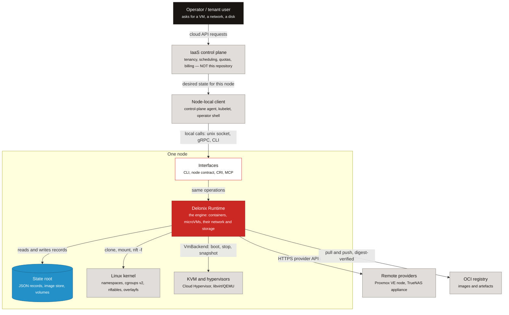

<!-- translated-from: iaas-and-cloud-native.md sha256:85933d280626e83ee934bf13ac9d4537374084eccdf6fdaca15e9682eec0ad31 -->
# IaaS 与云原生——引擎的定位

**阅读之前：**[从这里开始](start-here.md#what-delonix-is-5-minutes)（关于 Delonix 是什么的四句话）。这里还不需要任何内核或 Rust 知识。

你可能是一名 DevOps 工程师、SRE、平台工程师，或者是一名多年来一直在*使用*基础设施即服务
（IaaS）云、却从未构建过一个的云开发者。本页会在你阅读引擎代码之前，为你建立所需的心智模型：
一个 IaaS 由什么构成、本仓库实现了它的哪些层、又刻意把哪些层留给了别人，以及你已经知道的那些
云原生原则，在这里的具体文件中是如何体现的。读完之后，对于任何一项 IaaS 职责，你都能说出它是
由本仓库拥有，还是留给了控制平面，并指出每一条云原生原则落在哪个文件里。

关于引擎的每一项论断，都会指向一个文件、一个符号或一份 ADR。引用 ADR 时会给出它的状态，
因为一份**提议中**的 ADR 是一个方向，而不是关于代码的事实。像 `crates/adapters/delonix-linux`
这样的路径，指的是引擎的各个 crate；你现在还不需要认识它们——目前只需把一个路径读作
"这段代码就住在这里"。目录层级（`foundation`、`contexts`、`adapters`、`providers`、
`interfaces`）就是这个 crate 所在的层，稍后会在[项目结构](project-structure.md)和
[架构](architecture.md)中解释。

如果某个词对你来说是新的，去[术语表](glossary.md)里查一下。

## 什么是 IaaS

### 服务模型

权威定义来自 **NIST SP 800-145**，*《NIST 云计算定义》*
（[csrc.nist.gov/pubs/sp/800/145/final](https://csrc.nist.gov/pubs/sp/800/145/final)）。简而言之：

| 模型 | 消费者获得 | 消费者管理 | 供应商管理 |
|---|---|---|---|
| **IaaS**——基础设施即服务 | 计算、存储、网络等基础计算资源 | 操作系统、存储的使用、已部署的应用，以及对部分网络（例如主机防火墙）的有限控制 | 底层的物理与虚拟基础设施 |
| **PaaS**——平台即服务 | 一个用供应商提供的语言、库和工具构建应用的部署场所 | 应用及其配置 | 底下的一切，包括操作系统和运行时 |
| **SaaS**——软件即服务 | 一个正在运行的应用 | 至多是用户特定的设置 | 一切，包括应用本身 |

同一份 NIST 文档列出了五项基本特征——按需自助服务、广泛的网络接入、资源池化、快速弹性和
可计量的服务。记住最后三项：它们恰恰是位于单个节点**之上**、存在于控制平面里的那些属性。

### 每个 IaaS 都有的构建模块

无论供应商是谁，一个 IaaS 都是由相同的几个部分组装而成的：

- **区域与可用区（Regions and zones）**——区域是一个地理位置；可用区是其内部的一个故障域
  （拥有独立的电力、制冷和网络）。放置决策就是针对它们做出的。
- **计算（Compute）**——虚拟机，以及越来越多的容器和轻量级微虚拟机，被放置在物理主机上。
- **存储（Storage）**——*块*（挂载到单台机器上的磁盘）、*文件*（像 NFS 或 SMB 这样的共享
  文件系统），以及*对象*（架在 bucket 和 key 之上的 HTTP API）。
- **虚拟网络（Virtual networks）**——每个客户一个私有网络（通常称为 VPC）、其内部的子网、
  安全组或防火墙规则、出站流量用的 NAT、入站流量用的负载均衡器，以及内部 DNS。
- **身份与租户（Identity and tenancy）**——是谁在调用、他们属于哪个组织或账户、他们可以
  做什么，以及他们的资源如何与其他所有人的资源相隔离。
- **计量（Metering）**——统计每个租户消耗了什么，以便对其加以限制（配额）和计费（billing）。
- **控制平面与数据平面（A control plane and a data plane）**——*控制平面*接受 API 请求、
  存储期望状态、决定放置位置并驱动变更；*数据平面*则是工作负载真正运行、数据包真正流动的地方。
  一个健康的 IaaS，即使在控制平面短暂不可用时，也会继续为正在运行的工作负载提供服务。
- **每台主机上的节点代理或运行时（A node agent or runtime on each host）**——每台物理机上的
  那个软件，把"用这个网络和这个磁盘运行这台虚拟机"这样的指令，转化成对内核、hypervisor 和
  存储的调用，并把真实存在的状态汇报回去。

本仓库就是最后这一条。本页接下来会精确解释它到底做到了哪一步。

## IaaS 的各层

**图例**

| 形状 | 含义 |
|---|---|
| 方框，深色 | 人或外部行为者 |
| 方框，红色 | Delonix 引擎（本仓库） |
| 方框，浅色 | 引擎的一个构建模块 |
| 方框，灰色 | 一个外部系统——本仓库未实现的东西 |
| 方框，蓝色 | 磁盘上的状态 |

实线箭头表示调用或数据流，标签说明流动的是什么。

*图注：一个请求从操作者出发，经过一个不在本仓库中的多租户控制平面，到达一个节点本地的客户端，
进入某个节点上的引擎，再向下抵达引擎通过其 provider 端口所驱动的内核、hypervisor 和存储。*

每个元素在代码中的位置：

- **接口（Interfaces）**——CLI 二进制文件（`bins/delonix-runtime-bin`）、Kubernetes CRI
  服务器（`crates/interfaces/delonix-cri`、`delonix serve cri`）、本地管理套接字
  （`crates/interfaces/delonix-mgmt`）、MCP 服务器（`crates/interfaces/delonix-mcp`、
  `delonix mcp serve`），以及节点契约（`proto/delonix/node/v1/`）。见
  [一套操作，多个接口](architecture.md#one-set-of-operations-several-interfaces)。
- **状态根（State root）**——`crates/adapters/delonix-state`（受 `flock` 保护的 JSON 记录、
  原子写入、加密的密钥保管库），以及 `crates/adapters/delonix-oci` 中的镜像存储（`cas.rs`）。
- **内核（Kernel）**——`crates/adapters/delonix-linux`（进程、命名空间、cgroup、挂载）和
  `crates/adapters/delonix-sdn`（网桥、nftables、DNS）。
- **Hypervisor（Hypervisors）**——`crates/adapters/delonix-vm/src/lib.rs` 中的 `VmBackend` trait。
- **远程 provider（Remote providers）**——`crates/providers/delonix-proxmox`（ADR-0008，
  已接受并已实现）和 `crates/providers/delonix-truenas`（ADR-0009，已接受）。一个 OpenStack
  后端目前只是一份提案（ADR-0039，提议中，需先完成一次 spike 才能推进）。
- **镜像仓库（Registry）**——`crates/adapters/delonix-oci/src/registry.rs`。

控制平面和节点本地客户端被刻意画成灰色：它们不在本仓库里，`crates/`、`bins/` 或 `proto/`
中的任何东西都不允许提到它们的名字。`scripts/arch_fitness.py`（`CONSUMER_NAMES`、
`consumer_mentions`）一旦发现这样的名字，就会让 CI 失败。

## delonix-runtime 的位置，以及它刻意止步的地方

### 它是什么

Delonix Runtime 就是上图中的**节点执行层**。在单个节点上，它：

- 运行**容器和微虚拟机**——容器通过 `crates/adapters/delonix-linux`，虚拟机通过
  `crates/adapters/delonix-vm` 中可注册的 `VmBackend` 实现；
- 管理这些工作负载所需的**网络**——无根网桥、按工作负载划分的防火墙链、内部 DNS
  （`crates/adapters/delonix-sdn`）——以及它们的**存储**——具名卷、bind mount 和网络共享
  （`crates/adapters/delonix-volume`）；
- 是**声明式**的，拥有按 `apiVersion` 分组的自有 Kind（用 `delonix api-resources`
  列出它们；背后的那张表是 `crates/contexts/delonix-stack/src/kinds.rs` 中的 `KindFacts`）；
- 只通过**端口（ports）**与 provider 对话——例如 `crates/contexts/delonix-compute/src/ports.rs`
  中的 `NetworkProvider`、`ImageStore`、`StorageProvider` 这些 trait，以及 `VmBackend`——
  绝不通过 `if provider == …` 分支。这种分层是 ADR-0040（**提议中**）定下的，其规则已经由
  `scripts/arch_fitness.py`（`LAYERS`、`ALLOWED`）强制执行；
- 把**同一套操作通过多扇门**暴露出来：CLI、节点契约、CRI 和 MCP。

关于节点契约有一点要提醒，免得你去找一个并不存在的服务器：`proto/delonix/node/v1/node.proto`
被标记为*ADR-0040 的草案契约*。这份契约、由它生成的 `docs/api/openapi.yaml`，以及它的 CI
门禁（`scripts/contract_gate.py`）都已经存在；但目前还没有任何 crate 在提供 `NodeService`
服务。ADR-0042（**已接受**，A、B 两步已交付）确定了当服务器真正落地时，这份 API 该如何做
版本管理和文档化。

### 它刻意不做的事

权威规则是 [`AGENTS.md`](../../AGENTS.md) 顶部的 *«Identidade e fronteira do motor»* 一节：
引擎**不认识任何消费者**——没有平台、控制平面、控制台或代理——也没有**租户、账户、方案、
配额或计费**的概念。来自某个消费者的需求，只能以对任何客户端都说得通的通用引擎能力的形式进入。

ADR-0010（**已拒绝**，2026-08-10）是让管理 API 保持**本地化**的决定：一个 unix 套接字，
并要求对端 uid 必须与服务器相同（`SO_PEERCRED`）。一个远程的、多租户的管理 API 需要身份、
授权和审计，而这些都属于边界另一侧的事。ADR-0025（**已接受**）把同样的推理应用到了 MCP 上：
只用 stdio，只有一个本地主体，没有租户，没有 OAuth。

有两个词在这两个世界里发生了重叠，在评审中容易引起混淆：

- **namespace（命名空间）**——在引擎中，`metadata.namespace` 是单个节点上工作负载之间的
  一道*隔离*边界（处于不同命名空间的容器彼此无法互相访问）。它不是租户，也不是账户：
  引擎里没有任何东西知道一个命名空间归谁所有。
- **quota（配额）**——引擎强制执行的是别人告诉它的*按资源*限制（cgroup 的内存和 CPU
  限制、一个卷的配额）。按账户的配额（"这个客户最多可以有 20 个 vCPU"）是控制平面的决策。

### 各自归谁负责

| IaaS 职责 | 上方的控制平面 | 节点上的 Delonix 引擎 | 主机与内核 |
|---|---|---|---|
| 区域、可用区、跨节点的放置与调度 | 是 | 否 | — |
| 身份、租户、账户、IAM | 是 | 否（只有本地 uid——ADR-0010、ADR-0025） | — |
| 按账户的配额、用于计费的计量、计费本身 | 是 | 否；它只暴露按节点的指标（`delonix-mgmt` 和 `delonix-cri` 中的 `/metrics`） | — |
| 机群管理（远程新增/腾空节点） | 是 | 否——远程 API 已被否决（ADR-0010） | — |
| 运行一个容器 | 发出请求 | 是——`crates/adapters/delonix-linux` | 命名空间、cgroups v2、seccomp |
| 运行一个微虚拟机 | 发出请求 | 是——`VmBackend`（`crates/adapters/delonix-vm`） | KVM |
| 节点上的虚拟网络（网桥、防火墙、DNS、端口发布） | 定义意图 | 是——`crates/adapters/delonix-sdn` | nftables、netns |
| 挂载到工作负载上的块/文件存储 | 定义意图 | 是——`crates/adapters/delonix-volume`，通过 `delonix-truenas`（ADR-0009，已接受）实现 NAS 制备 | 文件系统、NFS/SMB 客户端 |
| 对象存储服务（架在 HTTP 上的 bucket） | 是，或是一个独立服务 | 未提供 | — |
| 镜像：拉取、验证、存储 | 选择镜像 | 是——`crates/adapters/delonix-oci` | overlayfs |
| 单个节点的期望状态：plan、apply、drift（偏差） | 发送清单 | 是——`crates/contexts/delonix-stack` | — |
| 挺过主机重启 | — | 写入 systemd unit（`bins/delonix-runtime-bin/src/cmd/boot.rs`、`delonix system boot enable`） | systemd |
| 硬件、固件、宿主机操作系统的补丁 | — | 否 | 操作者 |

## 云原生原则，及引擎如何应用它们中的每一条

云原生计算基金会（CNCF）的定义（v1.1，2024-02-26 批准）说，云原生实践让组织能够
"以一种可编程、可重复的方式开发、构建和部署工作负载……"，并且云原生的特征是"由松耦合的系统
组成，这些系统以安全、韧性、可管理、可持续和可观测的方式相互协作"。它把容器、服务网格、
多租户、微服务、不可变基础设施、serverless 和声明式 API 列为典型要素。完整文本见
[github.com/cncf/toc/blob/main/DEFINITION.md](https://github.com/cncf/toc/blob/main/DEFINITION.md)。
注意*多租户*也在这份清单里，而在本架构中它是由引擎**之上**的控制平面提供的，不是由引擎提供的。

下面，每条原则都分成三个简短的部分：它一般来说意味着什么、它在 Delonix 中位于何处，
以及它要求你养成的一个习惯。

### 声明式与收敛式

**一般而言。** 你描述你想要的状态；系统把它和已有的状态相比较，把差异展示给你，并且只改变
有差异的地方。同一份描述跑两遍，第二遍什么都不会改变。一个只会创建的工具，无论它的输入
长得多像 YAML，都算不上声明式。

**在 Delonix 中。** `delonix stack plan` 和 `delonix stack apply` 运行的是
`crates/contexts/delonix-stack/src/reconcile.rs` 中的协调器（`plan`、`Change`、`Action`）。
它是作用于一份已读取快照之上的**纯函数**，而且是一次**三路 diff**：最后一次应用的规格
保存在资源本身上（`encode_last_applied`、`delonix.io/last-applied` 注解），所以它能分清
"你删掉了这个字段"和"有人手动设置了这个字段"这两种情况。一个无法就地应用的变更会被拒绝，
除非 `--replace <Kind>/<name>` 明确授权这次破坏性操作；而 `--detailed-exitcode`
（0 = 无变更，2 = 有变更，1 = 出错）把一次 plan 变成了 CI 里的偏差门禁。ADR-0019
（**已接受**）加入了一份修订历史，它被明确定位为一份记录，而绝不是真相来源。

**它对你的要求。** 如果你新增或修改一个 Kind，它的 apply 就必须能够收敛：一个被改动的
字段，要么被就地更新，要么在 plan 中以一次替换的形式出现。`reconcile.rs` 的模块文档记录了
原因——`stack apply` 曾经在忽略用户所做改动的同时打印出 `already exists, nothing to do`
并返回 0。一个新的可收敛 Kind 还需要在 `KindFacts`（`kinds.rs`）中有它自己的一行；
该 crate 里的测试会检查这张表。

### API 优先

**一般而言。** 每一项操作都可以通过一个可编程接口获得，人类使用的接口和自动化使用的接口
是同一个。一项只存在于某一个按钮或某一条命令背后的能力，算不上平台能力。

**在 Delonix 中。** 同一套操作由 CLI、CRI（`delonix serve cri`、
`crates/interfaces/delonix-cri`）、本地管理套接字（`crates/interfaces/delonix-mgmt`）、
MCP 服务器（`delonix mcp serve`、`crates/interfaces/delonix-mcp`），以及节点契约
（`proto/delonix/node/v1/`，草案）共同暴露。这份契约是 gRPC 和 HTTP/JSON 这两种编码方式
共同的真相来源，`docs/api/openapi.yaml` 是从它生成出来的，绝不手工编辑
（`scripts/contract_gate.py`）。ADR-0040（**提议中**）诚实地记录了今天的差距：这几扇门里
有好几扇，至今仍是把 CLI 二进制文件当作子进程重新运行，而不是调用一个用例——
`scripts/arch_fitness.py` 把这个数字记作 `self_exec_sites` 棘轮。

**它对你的要求。** 不要只把一项能力加到一扇门上，也不要在一个库里新增一次对引擎自身
二进制文件的子进程调用——改为调用那个用例。如果 `self_exec_sites` 上升，棘轮就会失败。
细节见[架构](architecture.md#one-set-of-operations-several-interfaces)。

### 通过开放标准实现可观测

**一般而言。** 一个系统用每种工具都能理解的格式——结构化日志、trace 和指标——告诉你它在
做什么，而不是靠一个自定义仪表盘，或者一份要你用肉眼去解析的日志。

**在 Delonix 中。** `crates/adapters/delonix-telemetry` 里有结构化日志
（`DELONIX_LOG_FORMAT=json`）、通过 OTLP 导出的 OpenTelemetry span（`telemetry.rs`
会遵循 `DELONIX_OTLP_ENDPOINT`、`OTEL_SERVICE_NAME`），以及共享的 Prometheus 注册表
（`metrics.rs`），由 `delonix-mgmt` 和 `delonix-cri` 在 `/metrics` 上提供服务。引擎事件
可以通过 `delonix system events` 获取。

**它对你的要求。** 一个库 crate 不打印任何东西：它发出 `tracing` 事件，由接口层决定
展示什么。`scripts/arch_fitness.py` 把库 crate 里的 `println!`/`eprintln!` 统计为
`library_prints` 棘轮，数字一旦上升就会失败。

### 不可变制品

**一般而言。** 你部署的是一个带版本、按内容寻址的制品，构建一次，绝不就地修改。要改变
一次部署，你把它指向另一个不同的制品，并且你能证明正在运行的究竟是哪些字节。

**在 Delonix 中。** 镜像遵循 OCI 镜像和分发规范（`crates/adapters/delonix-oci`）。
blob 存放在一个按内容寻址的存储里（`cas.rs`）；按摘要拉取时，不仅会用清单去校验每一个
blob，还会用你要求的那个摘要去校验清单本身（`registry.rs` 中的 `verify_manifest_digest`）。
容器通过 overlayfs 共享只读的镜像层，只写入属于自己的那一层 upper。

**它对你的要求。** 绝不要在没有用摘要或已发布校验和去验证的情况下，接受下载来的字节；
也绝不要为了让一个又慢又怪的镜像仓库能用，而削弱某个检查——一个可以被跳过的检查，就不是
检查。见
[云原生入门](cloud-native-primer.md#44-oci-images-content-addressed-storage-and-overlayfs)。

### 松耦合：端口与适配器

**一般而言。** 组件依赖的是狭窄的接口，而不是彼此的内部实现，这样一个部分就能被替换，
而不必重写其余部分。对一个基础设施引擎来说，这主要意味着：一个新的 provider 应该是
一份新的实现，而不是到处都多出一个新分支。

**在 Delonix 中。** ADR-0040（**提议中**）把各个 crate 分成了 foundation、contexts、
adapters、providers、interfaces 和 binaries，目录本身就是这个层（`crates/foundation/`、
`crates/contexts/`、`crates/adapters/`、`crates/providers/`、`crates/interfaces/`、
`bins/`）。允许的依赖方向只写在一个地方，即 `scripts/arch_fitness.py` 里的 `ALLOWED`，
由 CI 强制执行。端口是 `crates/contexts/delonix-compute/src/ports.rs` 中的各个 trait，
以及 `delonix-vm` 中的 `VmBackend`；ADR-0008（**已接受**）让 VM 后端变得可注册，
这正是一个远程 Proxmox 节点得以成为又一个后端的方式。

**它对你的要求。** 一个新的 provider，要以一个端口的实现的形式进入。一个新 crate
要在同一个提交里同时进入 `LAYERS` 表和它所在那个层的目录，并且只能沿着允许的方向去依赖。
见[架构](architecture.md#layers-and-the-allowed-direction)。

### 可弃与幂等

**一般而言。** 任何进程都能被快速、安全地停止再启动，重复一次操作不会让情况变得更糟。
正是这一点，让一个调度器能够在没有人介入的情况下，移动、重启或替换工作负载。

**在 Delonix 中。** `delonix container stop` 会发送 SIGTERM，最多等待 `--time` 秒，
然后发送 SIGKILL（`crates/adapters/delonix-linux/src/lib.rs` 中的 `stop`）；对一个已经
停止的容器再执行一次停止也会成功（`bins/delonix-runtime-bin/src/cmd/container.rs` 中的
`cmd_stop`）。一次被请求的停止，会在发信号之前先被记录下来（`stopped_by_user`），这样
一个重启 supervisor 就不会把操作者停掉的东西又救活。在声明式的这一侧，对一份未改动的
清单执行 apply，得到的是一份没有任何变更的 plan。

**它对你的要求。** 每一条新命令都应该能安全地被跑两遍。明确决定"已经做过了"这种情况该
返回什么——是成功，还是冲突这一类（`Error::Conflict`，由
`crates/foundation/delonix-model/src/exitcode.rs` 中的 `for_error` 映射成一个退出码）——
并且，在你确认这个对象确实是你可以销毁的东西之前，绝不要销毁任何东西。

### 默认安全：无根优先、最小权限

**一般而言。** 正常路径只授予刚好够用的最小权限集合。额外的特权是操作者显式要求、并且
能看到的东西，绝不是一个悄无声息的默认值。

**在 Delonix 中。** 在正常路径上，容器运行在一个没有 root 权限的用户命名空间里，只保留
默认的 capability 集合 `KEPT_CAPS`（`crates/adapters/delonix-linux/src/capabilities.rs`，
由 `resolve_cap_keep` 解析得到）。在 CRI 路径上，节点可以给 capability 设一个上限，
任何 pod 的规格都不能超过它（`crates/interfaces/delonix-cri/src/cap_ceiling.rs`）。
安全相关的决策——策略、容器与虚拟机的准入、密钥的脱敏——都汇集在
`crates/contexts/delonix-security-runtime` 中（ADR-0026，**提议中**）。

**它对你的要求。** 不要靠在正常路径上要求 root 或 `--privileged` 来让一个功能跑起来。
如果确实需要特权，就把它做成一个明确的、会告诉操作者的可选项（opt-in）；在特权缺失时，
要用一条清晰的消息去拒绝，而不是悄悄地降级。

### 无守护进程

**一般而言。** 许多容器引擎会运行一个持有全部状态的驻留守护进程。一个无守护进程的引擎，
把状态保存在文件里，并在短生命周期的进程中完成工作，这样就不存在一个中心进程，一旦它
崩溃或升级就会把所有工作负载都拖下水。

**在 Delonix 中。** 每一条 CLI 命令都是一个完成工作后就退出的进程。必须持久化的东西，
要么属于 systemd，要么属于一个有明确归属者的按工作负载进程：`delonix system boot enable`
会为每个容器或虚拟机写入一个 systemd unit，其 `ExecStart` 是一条 `delonix … start`
（`bins/delonix-runtime-bin/src/cmd/boot.rs`）。这条规则——新增一个守护进程需要一份 ADR，
并附上证据说明替代方案为何解决不了问题——写在 `AGENTS.md` 里。ADR-0021（**提议中**）
展示了这条规则的应用：就连一个 pull 协调器，设计上也是从一个 systemd 定时器运行，
而不是作为一个驻留进程。

**它对你的要求。** 在新增一个长生命周期的进程之前，先检查一个 systemd unit、一个
定时器、socket 激活，或者一个按工作负载的 supervisor 能否解决问题。如果都不行，
先写 ADR。见[云原生入门](cloud-native-primer.md#410-daemonless-in-one-paragraph)。

## 十二要素这面透镜，从供应商的角度看

十二要素应用（[12factor.net](https://12factor.net/)）是写给应用开发者看的。而一个引擎
站在另一侧：它必须*提供*让一个工作负载能够遵循每一条要素的机制。有些要素根本不归引擎管，
下表会说明这一点。

| 要素 | 引擎必须提供什么 | Delonix 在何处做到这一点 |
|---|---|---|
| I. 代码库 | 无——一个应用一份代码库，是开发者自己的选择 | 不适用 |
| II. 依赖 | 一种把应用连同其依赖一起、以隔离的方式交付的办法 | OCI 镜像（`crates/adapters/delonix-oci`）；用 `delonix build` 从一份 Dockerfile 或 Delonixfile 构建它们（[Delonixfile 与 VMfile](delonixfile-and-vmfile.md)） |
| III. 配置 | 在启动时注入配置和密钥，而不是在构建时 | `delonix container run` 上的 `-e`、`--env-file`、`--secret`；`crates/contexts/delonix-compute/src/run.rs` 中的环境变量合并；`crates/foundation/delonix-model/src/secret.rs` 中的 `parse_env_file`；`delonix-state` 中静态加密的密钥 |
| IV. 后端服务 | 按名字挂接一个服务，不改代码也能替换 | 内部 DNS，标准名字 `<name>.<namespace>.svc.delonix.internal`，较旧的 `<name>.<namespace>.delonix.internal` 依然能解析（`crates/adapters/delonix-sdn/src/infra.rs` 中的 `service_fqdn`、`parse_internal_name`、`dns_resolve_for`）；一个可以解析到多个后端的 `Service` Kind（ADR-0032，**已接受**）；名字如何抵达宿主机的 `/etc/hosts`：[service-names-and-hosts.md](service-names-and-hosts.md) |
| V. 构建、发布、运行 | 把这三个阶段分开，并且发布是不可变的 | `delonix build` → 一个用摘要标识的镜像 → `container run` / `stack apply`；stack 的修订历史（ADR-0019，**已接受**） |
| VI. 进程 | 无状态的进程，状态放在挂载的存储中 | `--read-only` 根文件系统；具名卷与共享（`crates/adapters/delonix-volume`） |
| VII. 端口绑定 | 暴露一个由应用自己绑定的端口 | `-p [hostIp:]hostPort:containerPort`（`crates/adapters/delonix-sdn/src/lib.rs` 中的 `parse_publish_addr`、`slirp_add_hostfwd`） |
| VIII. 并发 | 运行更多份某种进程类型的副本 | 每个 compose 服务可以有多个容器（`bins/delonix-runtime-bin/src/cmd/compose.rs` 中的 `deploy.replicas`），以及通过 `Service` 实现的 DNS 轮询（ADR-0032）。**未提供：** 自动扩缩容，以及跨节点扩容（那是控制平面的决策） |
| IX. 可弃性 | 快速启动，收到信号时优雅停止 | `--time` 之后 SIGTERM 再 SIGKILL（`delonix-linux` 中的 `stop`）；用 `--restart` 设置的重启策略 |
| X. 开发/生产对等 | 每个环境都用同样的制品和运行时 | 笔记本电脑和节点上是同一个二进制文件和同一套 Kind，两边都是无根的。**部分做到：** 与*另一个*生产运行时（例如一个托管的 Kubernetes 集群）的对等程度，取决于那个运行时本身 |
| XI. 日志 | 把 stdout/stderr 当作事件流来采集，而不是由应用自己管理的文件 | 按容器划分的日志垫片（`crates/adapters/delonix-linux/src/lib.rs` 中的 `log_shim`）；`delonix container logs --follow`；用 `--log-cri` 打上时间戳的行 |
| XII. 管理进程 | 在与应用相同的环境中运行一次性任务 | `delonix container exec` |

## 接下来阅读

- **Linux 基础**（[linux-foundations.md](linux-foundations.md)）——这一切所依托的内核
  原语：进程与 `/proc`、命名空间、cgroups v2、文件描述符与信号。
- **云原生入门**（[cloud-native-primer.md](cloud-native-primer.md)）——引擎如何使用这些
  原语，以及在它们之上的各种规范（OCI、CRI、CNI、KVM/virtio、cloud-init），附带文件与符号。
- **架构**（[architecture.md](architecture.md)）——一旦你对上面这两页和
  [项目结构](project-structure.md)都熟悉了，再来看这个上下文背后的结构：详细的层、进程与 crate。

---

**下一步：** [Linux 基础](linux-foundations.md)——后面每一页都要依赖的内核原语，亲手操作：
进程、命名空间、cgroups v2、文件描述符与信号。
