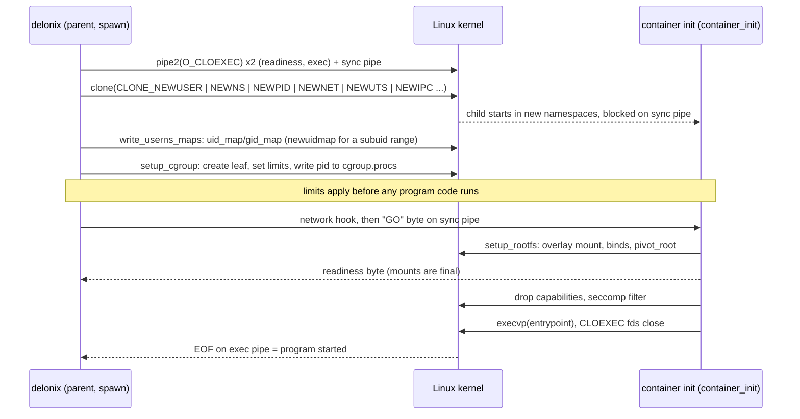

<!-- translated-from: linux-foundations.md sha256:939d3e706c124fa92db0bb6c46fdccd6dc62d6ab6cdf2df388654650357dab5a -->
# Linux 基础

**阅读之前：** [IaaS 与云原生](iaas-and-cloud-native.md)，说明为什么一个节点引擎需要这些原语。你只需要一个 Linux shell，别无其他。

此后的每一页都假设你能够用一条命令回答诸如"这个进程处于哪个网络命名空间？""为什么这个限制没有生效？"或者"这个管道还被谁占着？"这样的问题。本页从一个既要编写 Linux 系统代码、又要在凌晨三点亲自运维它的人的视角出发，手把手地讲解这些原语。读完之后，你将能够在 shell 中回答上述每一个问题，并能用引擎的术语预测后续页面所描述的故障（不生效的限制、永远收不到 EOF 的管道、名字指向另一个进程的 PID）。

本页不解释引擎如何使用这些原语——那份映射，连同具体的文件和符号，属于[云原生入门](cloud-native-primer.md)。这里的每一节末尾都会指向那边对应的部分。

**如何使用本页。** 打开一个终端，跟着敲命令。每一条标记为 *无特权* 的命令，都是在一台内核版本 7.0、util-linux 2.39、systemd 的 Ubuntu 主机上以普通用户身份执行的，展示的输出就是它实际打印的内容（有所裁剪，主机特有的路径已替换为占位符）。标记为 **需要 root——请在一次性虚拟机中运行** 的命令，在写作本页时*并未执行*：它们会改变整台主机的状态，绝不应该在一台你在意其上任何东西的机器上尝试。[Microvm setup](microvm-setup.md) 说明了如何从引擎本身获取一台可随时丢弃的虚拟机。

在一个临时目录中操作，这样你创建的任何东西都不会进到仓库里：

```bash
mkdir -p ~/scratch/linux-lab && cd ~/scratch/linux-lab
```

---

## 进程、内核与 /proc

**进程**是一个正在运行的程序，拥有自己的地址空间、一个数字型的 **PID**、一个父进程（其 **PPID**），以及一组由内核持有的属性：凭据、命名空间、cgroup 归属、打开的文件描述符、信号处置方式和资源限制。除 PID 1 之外的每个进程都有一个父进程；当父进程先于子进程死亡时，孤儿进程会被重新过继给最近的 *subreaper*（子进程收割者）或者 PID 1。

- **`fork`** 复制调用它的进程。子进程得到地址空间的一份拷贝（写时复制）和 **文件描述符表** 的一份拷贝——同样的已打开文件，是共享的，而不是重新打开的。只有发起调用的那个 *线程* 会被复制，这就是为什么对一个多线程程序执行 fork、然后在 `exec` 之前做任何不简单的事情都很危险（另一个线程持有的锁，在子进程里会永远锁着）。
- **`execve`** 替换一个进程中正在运行的程序：PID 不变、父进程不变、命名空间和 cgroup 不变，代码是新的。文件描述符会在 `exec` 之后继续存活，*除非*它们被标记为 close-on-exec——详见 [文件描述符](#file-descriptors)。
- **`clone`** 是 `fork` 和线程创建背后共同的通用形式。它的标志位决定了子进程与父进程共享什么，而这里最关键的是，子进程会从哪些**新命名空间**里启动（`CLONE_NEWUSER`、`CLONE_NEWNS`、`CLONE_NEWPID`、`CLONE_NEWNET` 等）。一个容器正是从带着这些标志位的一次 `clone` 中诞生的。

内核把每个进程都以 `/proc` 下的一个目录形式暴露出来。你最常用到的文件有：

| 路径 | 它告诉你什么 |
|---|---|
| `/proc/<pid>/status` | 名称、状态、PPid、uid/gid、`NSpid`（该进程在每一层嵌套 PID 命名空间中的 PID）、能力集、线程数 |
| `/proc/<pid>/cmdline` | argv，以 NUL 分隔 |
| `/proc/<pid>/ns/` | 每个命名空间一个符号链接；inode 编号就是该命名空间的身份标识 |
| `/proc/<pid>/cgroup` | cgroup v2 的路径（`0::/…`） |
| `/proc/<pid>/fd/`、`/proc/<pid>/fdinfo/` | 已打开的文件描述符及其偏移量/标志位 |
| `/proc/<pid>/stat` | 第 22 个字段是启动时间，用它来区分一个进程与之后重用了同一 PID 的另一个进程 |

在你自己的 shell 里试一下（*无特权*）：

```bash
grep -E '^(State|PPid|Threads|NSpid|CapEff)' /proc/$$/status
tr '\0' ' ' < /proc/$$/cmdline; echo
cat /proc/self/cgroup
```

```text
State:	S (sleeping)
PPid:	4033620
NSpid:	953496
Threads:	1
CapEff:	0000000000000000
0::/user.slice/user-1000.slice/user@1000.service/app.slice/app-….scope
```

注意 `$$` 指的是你的 shell，而 `self` 指的是打开这个文件的那个进程——对 `cat /proc/self/cgroup` 来说，那就是 `cat` 自己。还要注意，**PID 是一个数字，不是一个名字**：一个进程被收割之后，内核可能把同一个数字分配给一个毫不相干的进程。如果代码保存了一个 PID、打算稍后向它发信号，就必须先检查启动时间，或者更好的做法是持有一个 *pidfd*（见下文）。

**为什么引擎要读 `/proc`。** 它是对一个存活进程唯一权威、无锁的视图：一个运行中容器的真实 cgroup、一个记录下来的 PID 是否仍然指向同一个进程、`exec` 时该加入哪些命名空间。→ [Delonix 如何使用它：命名空间与 rootless 运作](cloud-native-primer.md#41-linux-namespaces-and-rootless-operation)。

**延伸阅读：** [`proc(5)`](https://man7.org/linux/man-pages/man5/proc.5.html)、[`fork(2)`](https://man7.org/linux/man-pages/man2/fork.2.html)、[`execve(2)`](https://man7.org/linux/man-pages/man2/execve.2.html)、[`clone(2)`](https://man7.org/linux/man-pages/man2/clone.2.html)。

---

## 命名空间

**命名空间**（namespace）把一种全局资源包裹起来，使得其中的进程看到的是各自独立的一份实例。Linux 一共有八种：

| 命名空间 | 标志位 | 隔离的内容 |
|---|---|---|
| mount | `CLONE_NEWNS` | 挂载表：什么被挂载在哪里 |
| UTS | `CLONE_NEWUTS` | 主机名和 NIS 域名 |
| IPC | `CLONE_NEWIPC` | System V IPC 对象和 POSIX 消息队列 |
| PID | `CLONE_NEWPID` | 进程编号；命名空间内的第一个进程是 PID 1 |
| network | `CLONE_NEWNET` | 网络接口、地址、路由、防火墙表、套接字、`/proc/sys/net` |
| user | `CLONE_NEWUSER` | uid/gid 和能力（capabilities）；是其他所有命名空间的所有者 |
| cgroup | `CLONE_NEWCGROUP` | cgroup 树的视图（进程把自己的 cgroup 看作 `/`） |
| time | `CLONE_NEWTIME` | `CLOCK_MONOTONIC` 和 `CLOCK_BOOTTIME` 的偏移量 |

### 身份标识：/proc/<pid>/ns 背后的 inode

`/proc/<pid>/ns` 里的每一项都是一个符号链接，它的目标编码了命名空间的类型和一个 inode 编号。**当且仅当这些 inode 相等时，两个进程才处于同一个命名空间**——这才是比较的方法，而不是靠名字（*无特权*）：

```bash
ls -l /proc/self/ns
```

```text
lrwxrwxrwx 1 you you 0 … cgroup -> cgroup:[4026531835]
lrwxrwxrwx 1 you you 0 … ipc -> ipc:[4026531839]
lrwxrwxrwx 1 you you 0 … mnt -> mnt:[4026531832]
lrwxrwxrwx 1 you you 0 … net -> net:[4026531833]
lrwxrwxrwx 1 you you 0 … pid -> pid:[4026531836]
lrwxrwxrwx 1 you you 0 … pid_for_children -> pid:[4026531836]
lrwxrwxrwx 1 you you 0 … time -> time:[4026531834]
lrwxrwxrwx 1 you you 0 … time_for_children -> time:[4026531834]
lrwxrwxrwx 1 you you 0 … user -> user:[4026531837]
lrwxrwxrwx 1 you you 0 … uts -> uts:[4026531838]
```

`pid_for_children` 和 `time_for_children` 之所以存在，是因为一个进程永远不会改变自己的 PID 或 time 命名空间：对它们执行 `unshare`/`setns`，影响的只是它接下来创建的子进程。

`lsns` 会列出整个系统范围内的命名空间。在写作本页所用的主机上，**内核版本 7.0 上的 util-linux 2.39.3 会失败**，报 `lsns: Unsupported ioctl NS_GET_USERNS` 且不打印任何内容。如果你的环境也是这样，就直接比较 inode：对你关心的进程执行 `readlink /proc/<pid>/ns/net`。

### 动手实践：不用 root 创建 user + mount + UTS + network 命名空间

一个无特权用户无法独自创建大多数命名空间……

```bash
unshare --net true
```

```text
unshare: unshare failed: Operation not permitted
```

……但可以创建一个 **user 命名空间**，并且在其中成为 root——*但仅限于该 user 命名空间所拥有的那些命名空间*。`--map-root-user`（`-r`）会把你的 uid 映射为里面的 0（*无特权*）：

```bash
unshare --user --map-root-user --mount --uts --net sh -c '
  hostname lab; hostname; id
  cat /proc/self/uid_map
  ip link
  readlink /proc/self/ns/net'
hostname; readlink /proc/self/ns/net     # back outside
```

```text
lab
uid=0(root) gid=0(root) groups=0(root),65534(nogroup)
         0       1000          1
1: lo: <LOOPBACK> mtu 65536 qdisc noop state DOWN mode DEFAULT group default qlen 1000
    link/loopback 00:00:00:00:00:00 brd 00:00:00:00:00:00
net:[4026534483]
<your-host>
net:[4026531833]
```

要留意三件事：主机名只在里面变了；全新的网络命名空间**只有 `lo`，而且是 down 的**；命名空间的 inode 和主机的不一样。`65534(nogroup)` 这个组是一个在里面没有映射的宿主机组——没有映射的 id 总是显示为溢出 id（overflow id）。

mount 命名空间的原理一样：在里面做的挂载，在外面是看不见的（*无特权*）：

```bash
mkdir -p mnt
unshare -r -m sh -c "mount -t tmpfs scratch $PWD/mnt && findmnt -n -o SOURCE,FSTYPE $PWD/mnt && touch $PWD/mnt/only-here && ls $PWD/mnt"
ls mnt; findmnt -n mnt; echo "findmnt rc=$?"
```

```text
scratch tmpfs
only-here
findmnt rc=1
```

PID 命名空间需要 `--fork`，因为调用者自身仍留在它原来的 PID 命名空间里；只有它的子进程才会成为 PID 1。`--mount-proc` 会重新挂载 `/proc`，这样 `ps` 之类的工具才能看到新的编号（*无特权*）：

```bash
unshare -r --pid --fork --mount-proc sh -c 'echo $$; ps -o pid,ppid,comm'
```

```text
1
    PID    PPID COMMAND
      1       0 sh
      2       1 ps
```

从外面看，同一个进程有两个 PID——`NSpid` 会把它们从最外层命名空间到最里层依次列出来（*无特权*）：

```bash
unshare -r -p -f sleep 3 & U=$!; sleep 0.4
grep -E '^(Name|NSpid)' /proc/$(pgrep -P $U)/status; wait
```

```text
Name:	sleep
NSpid:	953619	1
```

cgroup 和 time 命名空间可以用同样的方式试验（`unshare -r --cgroup cat /proc/self/cgroup` 会打印出 `0::/`）。

### User 命名空间与 uid 映射

映射保存在 `/proc/<pid>/uid_map` 和 `gid_map` 里，每个区间一行：`<里面的起始 id> <外面的起始 id> <数量>`。塑造出 rootless 容器形态的规则是：

- 映射**只写一次**，由对这个新命名空间拥有相应权限的进程来写——通常是父进程，此时子进程在等待。
- 一个无特权用户可以写一个**只映射自己 uid 的单行映射**（就是上面 `-r` 所做的：`0 1000 1`）。如果一个容器的镜像以 uid 101 运行，或者要把文件 chown 给服务用的 uid，就需要一个*区间*。
- 区间来自 `/etc/subuid` 和 `/etc/subgid`，由 setuid 辅助程序 **`newuidmap`/`newgidmap`** 写入，它们会检查这个区间确实属于你。

*无特权*（需要 `/etc/subuid`/`/etc/subgid` 里有你这个用户的条目）：

```bash
grep "^$(id -un):" /etc/subuid /etc/subgid
unshare --user --map-auto --map-root-user cat /proc/self/uid_map
```

```text
/etc/subgid:you:100000:65536
/etc/subuid:you:100000:65536
         0       1000          1
         1     100000      65536
```

里面的 uid 0 就是你；里面的 uid 1–65536 对应宿主机上的 uid 100000–165535，这些 uid 在宿主机上不属于任何人。正是最后这一点，导致一个容器以 uid 999 写入的文件，你没法从外面把它删掉——关于读取这类文件的说明，见[环境](environment.md)。

在 Ubuntu 23.10 及之后的版本上，`kernel.apparmor_restrict_unprivileged_userns=1` 可能会拒绝给没有 AppArmor 配置文件的二进制程序创建 user 命名空间。`/usr/bin/unshare` 有配置文件；一个刚构建出来、放在任意目录下的二进制程序可能没有。症状是第一次 `unshare` 就报 `EPERM`，看起来像是程序本身的 bug。[环境](environment.md) 讲了怎么修。

### 创建与加入；让命名空间保持存活

- **创建**：`unshare(2)`（当前进程移入新的命名空间）或者带 `CLONE_NEW*` 的 `clone(2)`（子进程从一开始就在里面）。
- **加入**：对一个从 `/proc/<pid>/ns/<type>` 打开的文件描述符执行 `setns(2)`。`nsenter(1)` 工具就是对它的封装。

**只要还有东西引用着它，一个命名空间就会一直存在**：可能是其中的一个进程、一个指向它 `/proc/<pid>/ns/*` 文件的已打开文件描述符，或者是那个文件的一个绑定挂载（这正是 `ip netns add` 在 `/run/netns` 下创建的东西）。最后一个引用消失时，一个网络命名空间连同它里面的每一个接口都会随之消失。

所以 rootless 的模式是一个 **holder（持有者）**：一个在命名空间内睡眠的小进程，靠它让命名空间存活下来，其他进程再加入进来。这不需要 root 就能做到，因为你拥有 holder 所创建的那个 user 命名空间（*无特权*）：

```bash
unshare --user --map-root-user --net sleep 60 &   # the holder; unshare execs sleep
H=$!; sleep 0.5
nsenter --target $H --user --net --preserve-credentials sh -c 'ip link add dummy0 type dummy; ip -br link'
nsenter --target $H --user --net --preserve-credentials ip -br link    # a second visitor sees it
```

```text
lo               DOWN           00:00:00:00:00:00 <LOOPBACK>
dummy0           DOWN           ae:1a:b3:4b:88:4c <BROADCAST,NOARP>
lo               DOWN           00:00:00:00:00:00 <LOOPBACK>
dummy0           DOWN           ae:1a:b3:4b:88:4c <BROADCAST,NOARP>
```

`sleep` 结束时，命名空间和 `dummy0` 也就随之消失了。

与之等价的、需要特权的做法，**需要 root——请在一次性虚拟机中运行**（本次审阅未执行）：

```bash
ip netns add lab                 # a named netns, pinned by a bind mount in /run/netns
ip netns exec lab ip link        # run a command in it
nsenter --target <pid> --net --mount ip addr   # join another user's process's namespaces
ip netns del lab
```

### 最佳实践

- **在 rootless 场景下，永远把网络命名空间和 user 命名空间配对使用。** 没有 user 命名空间，你在新命名空间里就没有 `CAP_NET_ADMIN`；有了它，你就有，而且什么都不会泄漏到宿主机。
- **先创建 user 命名空间**（或者在同一次 `clone` 里创建）：其他每一种命名空间都归创建它时所在的那个 user 命名空间所有，而这个归属关系决定了谁可以配置它。
- **为任何必须比一条命令活得更久的东西保留一个 holder**，并把这个 holder 当作一个有主人、有 pidfile 的正经进程来对待，而不是一个意外产物。
- **加入，不要重建。** 重建一个仍然有存活成员的命名空间，会把这些成员都切断。
- 要判断"是不是同一个命名空间"，**永远比较 inode，绝不比较名字或 PID**。
- **清理**你命名过的东西：`ip netns del`、卸载绑定挂载、让 holder 退出。

→ [Delonix 如何使用它：Linux 命名空间与 rootless 运作](cloud-native-primer.md#41-linux-namespaces-and-rootless-operation)以及[容器网络](cloud-native-primer.md#45-container-networking)。

**延伸阅读：** [`namespaces(7)`](https://man7.org/linux/man-pages/man7/namespaces.7.html)、[`user_namespaces(7)`](https://man7.org/linux/man-pages/man7/user_namespaces.7.html)、[`pid_namespaces(7)`](https://man7.org/linux/man-pages/man7/pid_namespaces.7.html)、[`network_namespaces(7)`](https://man7.org/linux/man-pages/man7/network_namespaces.7.html)、[`unshare(1)`](https://man7.org/linux/man-pages/man1/unshare.1.html)、[`nsenter(1)`](https://man7.org/linux/man-pages/man1/nsenter.1.html)、[`setns(2)`](https://man7.org/linux/man-pages/man2/setns.2.html)、[`newuidmap(1)`](https://man7.org/linux/man-pages/man1/newuidmap.1.html)、[`subuid(5)`](https://man7.org/linux/man-pages/man5/subuid.5.html)。

---

## cgroups v2

**控制组**（control group）是一组适用资源限制和统计核算的进程。cgroup v2 是挂载在 `/sys/fs/cgroup` 上的**一棵统一的树**：一个目录就是一个 cgroup，一个进程恰好属于一个 cgroup，目录里的文件就是接口。

- `cgroup.controllers` ——这个 cgroup 里**可用**的控制器（由父 cgroup 授予）。
- `cgroup.subtree_control` ——为这个 cgroup 的**子节点启用**的控制器。往里面写 `+memory`，会在每个子节点里创建 `memory.*` 文件。
- `cgroup.procs` ——这个 cgroup 里的 PID。写入一个 PID 会把该进程移动过来（只移动该进程本身；它已有的子进程留在原地）。
- 控制器文件：`memory.max`、`memory.high`、`memory.events`、`memory.peak`、`cpu.max`（以微秒为单位的 `<配额> <周期>`，或者 `max`）、`cpu.weight`、`cpu.stat`、`pids.max`，以及压力文件 `cpu.pressure`、`memory.pressure`、`io.pressure`（PSI）。

### "无内部进程"规则

一个**已经有进程**的 cgroup 不能为它的子节点启用控制器，而一个把资源分配给子节点的 cgroup，会把自己的进程都放在叶子节点里。实际上就是：进程活在**叶子节点**里，一个想为自己的进程创建子节点的管理者，必须先把自己挪进一个叶子节点。内核会把违反这条规则报告为 `EBUSY`。

### 委派给用户

默认情况下只有 root 能写 cgroup 树。systemd 通过 chown 把一棵子树**委派**给某个用户：在大多数主机上，`user@<uid>.service` 归你所有，并且委派了一些控制器。先看看你自己所处的位置（*无特权*）：

```bash
CG=/sys/fs/cgroup$(cut -d: -f3 /proc/self/cgroup); echo "$CG"
cat "$CG/cgroup.controllers"
U=/sys/fs/cgroup/user.slice/user-$(id -u).slice/user@$(id -u).service
stat -c '%U %n' "$U/cgroup.subtree_control"; cat "$U/cgroup.subtree_control"
```

```text
/sys/fs/cgroup/user.slice/user-1000.slice/user@1000.service/app.slice/app-….scope
memory pids
you /sys/fs/cgroup/user.slice/user-1000.slice/user@1000.service/cgroup.subtree_control
cpu memory pids
```

在这台主机上，有两个事实值得注意：shell 所在的 scope 没有 `cpu` 控制器（所以那里不存在 `cpu.max`），而 `cpuset`/`io` 根本没有被委派给用户——根 slice 没有把它们往下传递。

**为什么一个 SSH 会话无法设置限制。** 通过 SSH 登录落在 `session-<n>.scope` 里，它是 `user@<uid>.service` 的*兄弟节点*，而不是子节点。要在两个 cgroup 之间移动一个 PID，需要对它们**共同祖先**的 `cgroup.procs` 有写权限；这里那个共同祖先是 `user-<uid>.slice`，归 root 所有。所以从 SSH 启动的程序没法把自己放到被委派的子树下面，它想设置的限制也就无处安放。解决办法是向 systemd 要一个被委派的 scope。

### 动手实践：在用户 scope 中运行一条受限命令

`systemd-run --user --scope` 会在你的用户管理器下的一个全新临时 scope 里运行一条命令，并应用资源控制属性（*无特权*）：

```bash
systemd-run --user --scope -q -p MemoryMax=64M -p CPUQuota=20% sh -c '
  C=/sys/fs/cgroup$(cut -d: -f3 /proc/self/cgroup); echo "$C"
  cat "$C/memory.max" "$C/cpu.max"
  cat "$C/cpu.pressure"
  head -3 "$C/cpu.stat"'
```

```text
/sys/fs/cgroup/user.slice/user-1000.slice/user@1000.service/app.slice/run-r4b0….scope
67108864
20000 100000
some avg10=0.00 avg60=0.00 avg300=0.00 total=35
full avg10=0.00 avg60=0.00 avg300=0.00 total=35
usage_usec 6398
user_usec 1066
system_usec 5331
```

`CPUQuota=20%` 变成了 `cpu.max = 20000 100000`：每 100 毫秒周期里有 20 毫秒的 CPU 时间。

现在触发一次 OOM kill，并**在这个 cgroup 消失之前**读出证据。一个临时 scope 在它的最后一个进程退出的那一刻就会被移除，所以读取动作必须在它内部完成。有两个细节很关键：`MemorySwapMax=0`（否则那次分配只会去用交换空间），以及 `OOMPolicy=continue`（systemd 对一个 scope 的默认行为是，一个进程被 OOM 杀掉时就停掉*整个* scope——读取者自己也会跟着死；没有这个选项的话，这条命令就只会打印出 `Terminated`）（*无特权*）：

```bash
systemd-run --user --scope -q -p MemoryMax=32M -p MemorySwapMax=0 -p OOMPolicy=continue sh -c '
  python3 -c "b = bytearray(128 * 1024 * 1024)"; echo "python exit=$?"
  C=/sys/fs/cgroup$(cut -d: -f3 /proc/self/cgroup); cat "$C/memory.events"'
```

```text
Killed
python exit=137
low 0
high 0
max 51
oom 1
oom_kill 1
oom_group_kill 0
sock_throttled 0
```

退出码 137 就是 128 + 9（SIGKILL）。**唯一**能说明"这是一次 OOM kill，而不是一次 `kill -9`"的地方，就是 `memory.events` 里的 `oom_kill`——而这个 cgroup 一旦被移除，它就没了。

最后，在一个 systemd 委派给你的 scope（`Delegate=yes`）里，一次性看到"无内部进程"规则和委派机制的效果（*无特权*）：

```bash
systemd-run --user --scope -q -p Delegate=yes sh -c '
  C=/sys/fs/cgroup$(cut -d: -f3 /proc/self/cgroup)
  mkdir "$C/leaf"
  env printf "+memory" > "$C/cgroup.subtree_control" || echo "refused: this cgroup still has processes"
  echo $$ > "$C/leaf/cgroup.procs" && echo "moved self into leaf"
  echo "+memory +pids" > "$C/cgroup.subtree_control" && echo "controllers enabled for children"
  echo 16M > "$C/leaf/memory.max"; cat "$C/leaf/memory.max"'
```

```text
printf: write error: Device or resource busy
refused: this cgroup still has processes
moved self into leaf
controllers enabled for children
16777216
```

同样的步骤，不借助 systemd，**需要 root——请在一次性虚拟机中运行**（本次审阅未执行）：

```bash
mkdir /sys/fs/cgroup/lab
echo "+memory +pids" > /sys/fs/cgroup/cgroup.subtree_control   # usually already enabled at the root
mkdir /sys/fs/cgroup/lab/work
echo 64M > /sys/fs/cgroup/lab/work/memory.max
echo <pid> > /sys/fs/cgroup/lab/work/cgroup.procs
cat /sys/fs/cgroup/lab/work/memory.events
# cleanup: the cgroup must be empty before rmdir
echo <pid> > /sys/fs/cgroup/cgroup.procs; rmdir /sys/fs/cgroup/lab/work /sys/fs/cgroup/lab
```

### 最佳实践

- **一个工作负载一个叶子节点。** 这样限制、统计核算和 OOM 证据就恰好只属于一样东西。
- **在进程开始运行它的程序*之前*，先设置好限制并把它移进去。** 一次迁移只移动一个进程，永远不会移动它的后代；在迁移之前 fork 出来的任何东西，都会永远留在限制之外。
- 要了解 OOM 就**读 `memory.events`**，而且要在这个 cgroup 还存在的时候读——从等待这个工作负载的那个进程里读，而不是事后再读。
- **不要写入你不拥有的控制器或 cgroup。** 一个委派给你的 cgroup 是你的；它的父节点不是。在共享主机上，绝不要触碰你自己子树以外的 `/sys/fs/cgroup`。
- 要知道自己是不是真的拿到了委派，**检查的是 `cgroup.subtree_control` 的属主**，而不是某个控制器名字是否存在。
- **使用 PSI（`*.pressure`）**，在资源争用演变成 OOM 或延迟事故之前先看见它。

→ [Delonix 如何使用它：cgroups v2 与委派](cloud-native-primer.md#42-cgroups-v2-and-delegation)。

**延伸阅读：** [kernel.org — Control Group v2（`cgroup-v2.rst`）](https://www.kernel.org/doc/Documentation/admin-guide/cgroup-v2.rst)、[`cgroups(7)`](https://man7.org/linux/man-pages/man7/cgroups.7.html)、[`systemd.resource-control(5)`](https://man7.org/linux/man-pages/man5/systemd.resource-control.5.html)、[`systemd-run(1)`](https://man7.org/linux/man-pages/man1/systemd-run.1.html)、[systemd — Control Group APIs and Delegation](https://systemd.io/CGROUP_DELEGATION/)、[kernel — PSI](https://docs.kernel.org/accounting/psi.html)。

---

## 文件描述符

**文件描述符**是索引到一张**每进程一张的表**里的一个小整数。表里的每一项都指向内核中的一个**已打开文件描述**（open file description）——它保存着文件偏移量和状态标志位（`O_APPEND`、`O_NONBLOCK` 等）——这个描述再指向底层的对象：常规文件的 inode，或者是一个管道、一个套接字、一个事件计数器、一个进程。

```
process fd table          kernel                         object
  3 ─────────────┐
                 ├──► open file description ──────────► inode / pipe / socket / …
  7 (dup of 3) ──┘     (offset, O_APPEND, …)
```

在实际代码中会咬人的后果：

- **`dup`/`dup2` 和 `fork` 共享同一个已打开文件描述**：两个 fd（或者两个进程）移动的是同一个偏移量。把同一条路径打开两次，得到的是两个各自独立偏移量的描述。
- **close-on-exec** 标志（`FD_CLOEXEC`）是按*描述符*算的，不是按描述算的：它存在表项里，可以在 `open` 时用 `O_CLOEXEC`、在 `socket` 时用 `SOCK_CLOEXEC`、用 `pipe2(…, O_CLOEXEC)`，或者事后用 `fcntl(fd, F_SETFD, FD_CLOEXEC)` 来设置。在多线程程序里，`open` 和 `fcntl` 之间的窗口是一个竞态；请使用原子标志位。
- fd **0、1、2** 分别是 stdin、stdout 和 stderr，这只是一种约定；它们和其他任何 fd 一样会被继承。
- 一个进程与之打交道的一切都是 fd：文件、**管道**（`pipe2`）、**套接字**（包括 **unix 套接字**）、**pidfd**（指向一个进程的稳定句柄，`pidfd_open`）、**memfd**（带文件接口的匿名内存，`memfd_create`）、**eventfd**（用于唤醒的计数器）、epoll 实例、从 `/proc/<pid>/ns` 打开的命名空间句柄。
- **只有当一个管道写端的每一份拷贝、在每一个进程里都被关闭时，它才会到达 EOF**。哪怕只在一个长生命周期的子进程里忘了关一份拷贝，读端也会永远阻塞下去。

### 在 bash 中动手实践

打开、写入、检查并关闭一个描述符（*无特权*）：

```bash
bash -c '
exec 3<>notes.txt          # open read-write as fd 3
echo hello >&3
ls -l /proc/$$/fd | tail -n +2
cat /proc/$$/fdinfo/3
exec 3>&-                  # close fd 3
ls /proc/$$/fd
cat notes.txt'
```

```text
lrwx------ 1 you you 64 … 0 -> socket:[464860423]
l-wx------ 1 you you 64 … 1 -> …
l-wx------ 1 you you 64 … 2 -> …
lrwx------ 1 you you 64 … 3 -> /home/you/scratch/linux-lab/notes.txt
pos:	6
flags:	0100002
mnt_id:	34
ino:	21761577
0
1
2
hello
```

`flags` 是八进制的：`02` 是 `O_RDWR`，`0100000` 是 `O_LARGEFILE`。这里没有 `02000000`（`O_CLOEXEC`）：**shell 打开的 fd 会被它运行的每一条命令继承**。你可以亲眼看到这一点（*无特权*）：

```bash
bash -c 'exec 3>inherited.txt; ls -l /proc/self/fd | awk "NR>1{print \$9,\$10,\$11}"'
```

```text
0 -> socket:[464878621]
1 -> pipe:[464854925]
2 -> …
3 -> /home/you/scratch/linux-lab/inherited.txt
4 -> /proc/953134/fd
```

`ls` 从 shell 那里收到了 fd 3，它自己根本没要求过（fd 4 是 `ls` 自己打开的目录）。

**重定向的顺序很重要**，因为每一次重定向都是一次从左到右施加的 `dup2`（*无特权*）：

```bash
( echo out; echo err >&2 ) >both.log 2>&1      # stdout → file, then stderr → where stdout is now
cat both.log
( echo out; echo err >&2 ) 2>&1 >only-out.log  # stderr → where stdout is NOW (the terminal), then stdout → file
cat only-out.log
```

```text
out
err
err
out
```

第一种形式把两行都放进了文件。第二种形式里，`err` 去了终端（那行孤零零的 `err`），只有 `out` 到达了文件。

**把管道当作一个带编号的 fd**，用进程替换和一个自动选取的 fd 编号来实现（*无特权*）：

```bash
bash -c '
exec {fd}< <(printf "line1\nline2\n")
echo "fd=$fd"; readlink /proc/$$/fd/$fd
read -r first <&$fd; echo "$first"
exec {fd}<&-'
```

```text
fd=10
pipe:[464865935]
line1
```

从命令行使用**命名管道和 unix 套接字**（*无特权*；这里的 `nc` 是 OpenBSD 版 netcat，其中 `-U` 表示 unix 套接字，`-N` 表示在输入结束时关闭连接）：

```bash
mkfifo pipe.fifo
( echo "through the fifo" > pipe.fifo & ); cat pipe.fifo; rm pipe.fifo

nc -lU s.sock > got.txt & sleep 0.3
printf 'ping\n' | nc -NU s.sock; wait; cat got.txt; rm -f s.sock got.txt
```

```text
through the fifo
ping
```

`socat` 提供同样的能力，而且更多（`socat - UNIX-CONNECT:s.sock`）；写作本页所用的主机上没有装它，所以这种形式在这里没有验证过。

**其他几种 fd，以及默认的 close-on-exec。** 除非另外指定，Python 打开任何东西都会带上 `O_CLOEXEC`，这让它成了一个方便的实验场（*无特权*）：

```bash
python3 - <<'EOF'
import os, subprocess
a = os.open("cloexec.txt", os.O_WRONLY | os.O_CREAT | os.O_CLOEXEC, 0o600)
b = os.open("inherit.txt", os.O_WRONLY | os.O_CREAT, 0o600); os.set_inheritable(b, True)
print("parent:", a, "cloexec.txt |", b, "inherit.txt")
print(subprocess.run(["sh", "-c", "ls -l /proc/$$/fd | awk 'NR>1{print $9, $11}'"],
                     capture_output=True, text=True, close_fds=False).stdout)
for name, fd in [("pidfd", os.pidfd_open(os.getpid())), ("memfd", os.memfd_create("scratch")),
                 ("eventfd", os.eventfd(0))]:
    print(name, "->", os.readlink(f"/proc/self/fd/{fd}"))
EOF
```

```text
parent: 3 cloexec.txt | 4 inherit.txt
0 pipe:[464869577]
1 pipe:[464879797]
2 pipe:[464879798]
4 …/inherit.txt

pidfd -> anon_inode:[pidfd]
memfd -> /memfd:scratch (deleted)
eventfd -> anon_inode:[eventfd]
```

子 shell 得到了 fd 4，**没有**得到 fd 3：close-on-exec 在 `execve` 时发挥了作用。

要检查另一个进程的描述符，可以用 `/proc/<pid>/fd` 和 `/proc/<pid>/fdinfo/<fd>`，或者用 `lsof -p <pid>`（*无特权*，针对你自己的进程）：

```bash
lsof -p $$ | head -4
```

```text
COMMAND    PID   USER   FD   TYPE             DEVICE SIZE/OFF      NODE NAME
bash    953131   you     0u  unix 0x0000000000000000      0t0 464878621 type=STREAM (CONNECTED)
bash    953131   you     1w   REG              259,4      827  21672530 …
bash    953131   you     2w   REG              259,4      827  21672530 …
```

要追踪一个程序打开和关闭了哪些 fd，用的是 `strace -f -e trace=openat,close,dup2,pipe2,execve <cmd>`（本页没有实际操练过）。

### 限制

（*无特权*）

```bash
ulimit -n; ulimit -Hn
cat /proc/sys/fs/file-nr /proc/sys/fs/file-max /proc/sys/fs/nr_open
```

```text
1048576
1048576
66730	0	9223372036854775807
9223372036854775807
1048576
```

- `ulimit -n` 是*当前*进程的 `RLIMIT_NOFILE`：先是软限制，再是硬限制。它会跨 `fork`/`exec` 被继承；systemd 单元用 `LimitNOFILE=` 来设置它。很多主机的软限制默认是 1024——这台不是，所以不要假设你看到的数字和这里一样。
- `fs.nr_open` 是任何进程的硬限制可以被提升到的上限。
- `file-nr` 是系统范围内的*已分配句柄数、未使用数、最大值*。
- `EMFILE` 表示你的进程用完了；`ENFILE` 表示整个系统用完了。

### 引擎代码的最佳实践

- **处处使用 CLOEXEC。** 用 `O_CLOEXEC` 打开文件、用 `pipe2(…, O_CLOEXEC)` 创建管道、用 `SOCK_CLOEXEC` 创建套接字。Rust 标准库对它自己打开的东西已经这样做了；裸的 `libc` 调用则没有。在这个引擎里，可以看 `spawn`（`crates/adapters/delonix-linux/src/lib.rs`）里的就绪管道和 exec 管道，它的注释解释了写端上的 `O_CLOEXEC` 正是把"子进程死了，或者执行了 exec 却没有写入"这件事，转化成父进程可以据此行动的一个 EOF；同样的 `pipe2(…, O_CLOEXEC)` 出现在 `crates/adapters/delonix-sdn/src/pin_userns.rs` 的 `pipe` 里，以及 `delonix-linux` 里 `exec_with` 和 `open_container_ns` 中的 `OFlag::O_CLOEXEC`。
- **一个 fork 之后从不 exec 的子进程，必须自己关掉它继承来的东西。** CLOEXEC 只在 `execve` 时起作用。引擎的日志垫片（log shim）正是这样一个子进程：它在 fork 之后立刻用 `close_range` 关掉除了自己需要的 fd 之外的一切——见 `spawn`（`crates/adapters/delonix-linux/src/lib.rs`）里的 `close_range_raw` 及其调用点。`close_range_raw` 是按编号调用这个系统调用的，因为 `libc` 的封装只对 glibc 目标存在。
- **绝不要把一个管道或者调用者的 stdio 泄漏进一个长生命周期的子进程里。** [`AGENTS.md`](../../AGENTS.md) 里记录了两次真实的事故：日志垫片把一个长期运行的服务器的其他 HTTP 连接一直攥在手里没放（见章节 *«CLI (`delonix`)»* 中 `delonix serve docker-api` 那一条），以及网络 pin（引擎 rootless 网络命名空间的那个长生命周期 holder 进程——就是[命名空间](#creating-versus-joining-keeping-a-namespace-alive)一节里展示的 holder 模式）继承了调用者的 stderr，导致 `out=$(delonix …)` 永远等不到 EOF——修复方式是改为写入 `pin.log`（见章节 *«A classe «X não é Y» — varredura de 2026-08-05»*；代码见 `crates/adapters/delonix-sdn/src/infra.rs` 中的 `start_pin` 和 `pin_log_path`）。
- **通过 pidfd 而不是 PID 给一个进程发信号。** 一个被收割过的 PID 可能被重用；而一个 pidfd 在它整个生命周期内始终指向同一个进程。见 [ADR-0027](../adr/0027-pidfd-for-killing-exec-children.md) 以及 `crates/interfaces/delonix-cri/src/child_handle.rs` 中的 `ChildHandle`（`open`、`kill`）。在只有一个保存下来的 PID 可用的地方，先比较启动时间：见 `crates/contexts/delonix-node/src/host.rs` 中的 `safe_to_signal`。
- **在负载下限制 fd 的数量。** 一个每次请求都打开一个描述符的服务器，必须在每一条路径上都把它关掉，包括出错和超时的路径，并且必须把 `EMFILE` 当作背压（back-pressure）来处理，而不是当作崩溃。
- **在一个多线程进程里 `fork` 之后，只做异步信号安全（async-signal-safe）的工作**（关闭 fd、`dup2`、`execve`、`_exit`）——不分配内存，不加锁。

→ [Delonix 如何使用它：能力（Capabilities）、seccomp、AppArmor、屏蔽路径](cloud-native-primer.md#43-capabilities-seccomp-apparmor-masked-paths)（系统调用过滤器列表里有 `close_range`、`memfd_create` 和 `eventfd2`），以及[无守护进程（Daemonless），一段话讲清楚](cloud-native-primer.md#410-daemonless-in-one-paragraph)——说明为什么按工作负载划分的进程不能持有不属于自己的东西。

**延伸阅读：** [`open(2)`](https://man7.org/linux/man-pages/man2/open.2.html)、[`fcntl(2)`](https://man7.org/linux/man-pages/man2/fcntl.2.html)、[`dup(2)`](https://man7.org/linux/man-pages/man2/dup.2.html)、[`pipe(2)`](https://man7.org/linux/man-pages/man2/pipe.2.html)、[`close_range(2)`](https://man7.org/linux/man-pages/man2/close_range.2.html)、[`pidfd_open(2)`](https://man7.org/linux/man-pages/man2/pidfd_open.2.html)、[`memfd_create(2)`](https://man7.org/linux/man-pages/man2/memfd_create.2.html)、[`eventfd(2)`](https://man7.org/linux/man-pages/man2/eventfd.2.html)、[`unix(7)`](https://man7.org/linux/man-pages/man7/unix.7.html)、[`getrlimit(2)`](https://man7.org/linux/man-pages/man2/getrlimit.2.html)、[bash manual — Redirections](https://www.gnu.org/software/bash/manual/html_node/Redirections.html)。

---

## 信号与进程生命周期

- **`SIGTERM`** 请求一个进程退出；它可以被捕获，一个行为良好的服务会借此清理资源。**`SIGKILL`** 无法被捕获或忽略。一次优雅的停止是"先 `SIGTERM`，等待一段有限的时间，再 `SIGKILL`"——`crates/adapters/delonix-linux/src/lib.rs` 里的 `stop` 做的正是这件事。
- **PID 命名空间里的 PID 1 很特殊**：从它自己命名空间*内部*发给它的信号会被忽略，除非它安装了处理程序；即便是从内部发来的 `SIGKILL` 也不起作用（*无特权*）：

  ```bash
  unshare -r -p -f --mount-proc sh -c 'kill -TERM 1; kill -KILL 1; echo "pid $$ survived its own SIGTERM and SIGKILL"'
  sh -c 'kill -TERM $$; echo not reached'; echo "rc=$?"
  ```

  ```text
  pid 1 survived its own SIGTERM and SIGKILL
  Terminated
  rc=143
  ```

  所以一个 PID 1 没有安装 `SIGTERM` 处理程序的容器，不会因为 `SIGTERM` 而停止，最终这次停止会以 `SIGKILL` 收场。当一个命名空间的 PID 1 退出时，内核会杀掉其中的每一个其他进程。
- **僵尸进程。** 一个已经退出的子进程会一直以僵尸状态存在，直到它的父进程用 `wait`/`waitpid`/`waitid` 收取它的退出状态。一个从不 wait 的父进程会不断积累僵尸进程（*无特权*）：

  ```bash
  sh -c 'sleep 0.2 & exec sleep 2' & P=$!; sleep 1
  ps -o pid,ppid,stat,comm --ppid $P; wait
  ```

  ```text
      PID    PPID STAT COMMAND
   953503  953501 Z    sleep
  ```

  这个 shell fork 出了一个 `sleep`，然后 `exec` 成了另一个从不 wait 的 `sleep`：这个子进程会一直停在 `Z` 状态，直到它的父进程退出。
- **只有父进程才能 wait。** 这就是为什么一个没有守护进程的引擎，仍然需要为每一个分离运行的工作负载配一个小小的**supervisor（监督者）**：fork 出这个工作负载的那个进程，是唯一能够读到它真实退出状态的进程，对于 OOM 的情形，也是唯一能在 cgroup 被移除之前读到 `memory.events` 的进程。见 `crates/adapters/delonix-linux/src/supervise.rs` 中的 `run_supervised` 和 `crates/adapters/delonix-linux/src/lib.rs` 中的 `wait_and_record`。
- **一个长期运行的服务器必须收割自己的子进程**，但绝不能收割别人正在等待的子进程。正因如此，Docker API 垫片的收割者用 `WNOWAIT` 来"偷看"（`bins/delonix-runtime-bin/src/cmd/dockerapi.rs` 中的 `spawn_zombie_reaper`）；来龙去脉见 [`AGENTS.md`](../../AGENTS.md) 中的 *«CLI (`delonix`)»* 和 *«Auditoria de segurança #3 (2026-08-10)»* 两节。

**延伸阅读：** [`signal(7)`](https://man7.org/linux/man-pages/man7/signal.7.html)、[`pid_namespaces(7)`](https://man7.org/linux/man-pages/man7/pid_namespaces.7.html)、[`wait(2)`](https://man7.org/linux/man-pages/man2/wait.2.html)、[`pidfd_send_signal(2)`](https://man7.org/linux/man-pages/man2/pidfd_send_signal.2.html)。

---

## 融会贯通

一个 rootless 容器，就是把上面这些原语按照严格的顺序应用出来的结果。下面这个序列遵循的是 `crates/adapters/delonix-linux/src/lib.rs` 中 `spawn` 和 `container_init` 的实际顺序；这个顺序不是装饰性的，那里的注释解释了每一步都关闭了哪一个竞态。

> **图例**——参与者是各个进程（以及内核）；实线箭头是系统调用或写操作；虚线箭头是回应或管道事件；旁注标记的是在那个时间点变为真的状态。

这张图展示的是，父进程在配置身份、cgroup 和网络的**同时子进程处于阻塞状态**，而子进程只有在它的文件系统尘埃落定之后，才会报告"就绪"。



用本页的词汇，一步一步来看：

1. **文件描述符先行。** 用来协调父子进程的那些管道，创建时就带着 close-on-exec，所以子进程手里的那些拷贝会在 `execvp` 时消失，一个已经死掉的子进程读到的是 EOF，而不是卡死。
2. **User 命名空间**，和其他命名空间在同一次 `clone` 里创建，因此它拥有那些命名空间。
3. **uid/gid 映射**，由父进程在子进程等待期间写入（一个进程没法有效地映射自己）。
4. 带着限制的 **cgroup 叶子节点**，PID 会在程序运行*之前*被移进去——如果移动得晚了，早先产生的子进程就会留在限制之外。
5. **Mount 命名空间 → `pivot_root`**：子进程构建好自己的根文件系统并把它换上去，然后再发出就绪信号，这样就不会有谁能 `setns` 进一个建到一半的文件系统。
6. **先放弃权限，再 `exec`**，除了 stdio 之外不继承任何描述符。

→ 参见[架构——层级 2：可执行文件与进程](architecture.md#level-2-containers-executables-and-processes)、[架构——层级 4：两条流程，以时序方式呈现](architecture.md#level-4-two-flows-as-sequences)，以及 [`delonix-linux` crate](crates.md#delonix-linux)。

---

## 自查练习

以你的普通用户身份，在你的临时目录里做下面这些练习。

1. **相同还是不同？** 启动 `unshare -r -n sleep 30 &`，然后比较 `readlink /proc/$!/ns/net` 和 `readlink /proc/self/ns/net`，两边的 `…/ns/mnt` 也比较一下。*预期结果：* `net` 的 inode 不一样；`mnt` 的 inode 一样（你并没有要求一个 mount 命名空间）。
2. **加入 holder。** 在同一个 `sleep` 仍在运行的情况下，执行 `nsenter --target $! --user --net --preserve-credentials ip -br link`。*预期结果：* 只有 `lo`，状态是 `DOWN`。`sleep` 退出之后，同样的 `nsenter` 会失败，因为那个进程没了，连同它的命名空间也一起没了。
3. **限制去哪儿了？** 执行 `systemd-run --user --scope -q -p MemoryMax=48M sh -c 'cat
   /sys/fs/cgroup$(cut -d: -f3 /proc/self/cgroup)/memory.max'`，然后在你普通的 shell 里执行 `cat
   /sys/fs/cgroup$(cut -d: -f3 /proc/self/cgroup)/memory.max`。*预期结果：* 在 scope 内部是 `50331648`；在外面则是 `max`（如果你的 cgroup 没有 memory 控制器，就是"No such file"）。
4. **bash 中的继承。** 先执行 `bash -c 'exec 5>five.txt; ls /proc/self/fd'`，再执行 `bash -c
   'exec 5>five.txt; exec 5>&-; ls /proc/self/fd'`。*预期结果：* `5` 出现在第一次的列表里（被 `ls` 继承了，因为这个 shell 没有设置 close-on-exec），第二次则没有；两次里的 `3` 都是 `ls` 自己打开的那个目录。
5. **谁攥着写端？** 比较下面这两条命令和它们的时序：

   ```bash
   bash -c 'exec {w}> >(cat >/dev/null; echo "reader got EOF at ${SECONDS}s" >&2)
            sleep 3 & exec {w}>&-; echo "writer closed at ${SECONDS}s"; wait'
   bash -c 'exec {w}> >(cat >/dev/null; echo "reader got EOF at ${SECONDS}s" >&2)
            { exec {w}>&-; sleep 3; } & exec {w}>&-; echo "writer closed at ${SECONDS}s"; wait'
   ```

   *预期结果：* 第一条命令里，`writer closed at 0s`，而 `reader got EOF at 3s`——后台的 `sleep` 继承了一份管道写端的拷贝，所以 EOF 要等它退出才会到来；第二条命令里，子进程先关掉了自己的那份拷贝，读端在 `0s` 就拿到了 EOF。这和 pin/stderr 那次事故是同一种形状。（父进程里的 `exec {w}>&-` 不能省：`wait` 也会等待读端，一个永远等不到 EOF 的读端会让整条命令卡住。）

---

**下一篇：** [云原生入门](cloud-native-primer.md)——引擎在哪里用到了这些原语，以及在它们之上分层构建的开放规范（OCI、CNI、CRI、KVM）。
