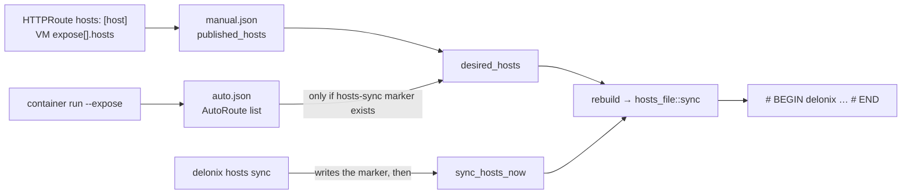

<!-- translated-from: service-names-and-hosts.md sha256:b9b856f54706cbe896f0eccfe8259eb95641bcd2979c1fbb6de35a57fa0b309a -->
# 名称是如何抵达 `/etc/hosts` 的

**阅读之前：**[架构 —— 磁盘上的状态](architecture.md#state-on-disk)（state root、`httproute/`）、
[环境变量](environment-variables.md)（`DELONIX_ROOT`、`DELONIX_HOSTS_FILE`）以及
[克隆、构建与测试 —— CI 会跑的那些门禁](build-and-test.md#the-gates-ci-runs)（隔离引擎的状态）。

SDN 上的一个工作负载，从宿主机通过它的 IP 是到达不了的；进去的路是 L7 代理，slirp 的 forward
会把它发布在 loopback 上。所以操作者机器上的浏览器，只有在名字 `app.example.pt` 解析到
`127.0.0.1`（或者路由所保留的那个地址）之后，才能打开 `http://app.example.pt:8080/`。引擎能够
替你写下这个映射。本页解释的是它背后的那一个机制、一个名字进入这个机制的两条路，以及每一条
路各自会拒绝做什么。下面所写的一切都是从它旁边点名的那些文件里读出来的；相关决策是
ADR-0046（`hosts: [host]`）和 ADR-0048（`hosts sync`），要理解*为什么*应该去读那两份文档。

## 每个 state root 一个块

这一切都活在 `bins/delonix-runtime-bin/src/cmd/hosts_file.rs` 里。引擎从不重写整个 hosts
文件：它只拥有**一个界定好的块**，其余每一个字节都不去碰。

```text
# BEGIN delonix 3fa2c1d0 (managed — do not edit)
127.0.0.1	app.example.pt
127.0.0.1	web.default.svc.delonix.internal
# END delonix 3fa2c1d0
```

- **id 用来指名 state root。** `root_id()` 是 `state_root()` 的一个 FNV-1a 哈希，截断到 32
  位，打印成八位十六进制数字。这是一个故意手写的哈希：`DefaultHasher` 并不承诺稳定，而一个
  因为哈希变化被留下的孤儿块，是一个再也不会消失的名字。同一台机器上的两个 root（一个隔离的
  root 挨着真正的那个；root 用户和一个 rootless 用户）各自拥有自己的块，因此谁重建自己的块
  都不会抹掉另一个的名字。
- **块是被整个重写的**（`block`、`render`）。条目会被转成小写、排序并去重，`render` 是一个
  纯函数：它接收已存在的文本和想要的条目，返回新的文本，所以真正要紧的那些情形都是单元测试。
  一个已经没有来源的名字，简单地就不会出现在下一次重写里；没有什么需要去清理的。一份空列表
  会移除整个块。
- **块是就地重写的**，写回它原本所在的位置。两个 root 的块不会在每次同步时互换位置。每一行
  保留自己的行结束符（CRLF，以及缺失的末尾换行符，都会被保留）。

### `render` 会拒绝什么

以下每一种情况都会在任何写入*之前*返回一个 `Error::Invalid`，所以文件不会被碰：

| 情况 | 为什么会被拒绝 |
|---|---|
| 一个想要的名字，在这个 root 的块**之外**已经有一条条目了（一行手写的行，或者另一个 root 的块） | 这一行是操作者、或者另一个 root 写下的。为同一个名字再给出第二个答案，会悄悄改变它指向的地方。只是提到这个名字的注释不算数。 |
| 同一次重写里，同一个名字有**两个不同的地址** | 两条路由都要认领它，来自不同的地址池：解析器会取它读到的第一行。 |
| 这个 root 的块有一行 `# BEGIN`，但**没有 `# END`** | 通常是一次手动编辑。如果把「一直到文件末尾」当成块，会抹掉手写的那些行，以及排在后面的其他 root 的块。这条消息会告诉你该恢复哪一行。 |

### 它是怎么写入的（`sync_at`）

1. 读取文件；`render`；如果结果和读到的一样，**直接返回、不写入**。这正是为什么一份不使用
   `hosts:` 的清单永远不需要 root。
2. 解析符号链接（`canonicalize`），这样一个被软链接指向的 hosts 文件会通过那个链接被编辑，
   链接本身也不会被一个普通文件取代。
3. 在目标旁边的 `.hosts.delonix.lock` 上取得一个独占的 `flock`，重新读取一遍，如果文件在
   这期间变化了就重新渲染一次。两个写入者绝不能交错进行一次读改写。
4. 在目标旁边写入一个临时文件 `.hosts.delonix.<pid>.<nanos>`，以 `create_new`（`O_EXCL`）
   打开：一个谁也猜不到的名字，没法预先创建成一个符号链接来劫持这次写入。拷贝目标文件的
   权限，`sync_all`（在 rename 和数据真正落盘之间崩溃，绝不能留下一份空的「名字→地址」
   映射），然后 `rename` 覆盖目标文件。

引擎不会去测试「我是 root 吗？」。它直接尝试写入，如果遇到 `PermissionDenied`，就返回一个
把那个确切的块打印出来、供你粘贴的错误。因此一次无特权的运行，会带着屏幕上的那个块停下来；
它不会悄悄跳过这个名字。（如果连锁文件都创建不了，那这次锁就干脆不持有；随后的写入会以同样
的消息失败。）

## 名字从哪里来

有两个输入，它们经由同一个函数（`hosts_file.rs` 里的 `sync`，从 `cmd/ingress_proxy.rs` 里
的 `rebuild` 调用）最终进入同一个块。



### 路径 A：一条路由上的 `hosts: [host]`（ADR-0046）

`HttpRouteSpec.hosts`（`cmd/httproute.rs`）目前只接受一个值，`host`（`HOSTS_TARGETS`）；
其他任何值都会在校验时被拒绝，消息会说 `containers` 需要 ADR-0047，`guest` 则是计划中的。
当一条路由列出了 `host`，`apply` 会为路由的每一个 rule host，在这条路由自己的手动配置里
（`published_hosts`，位于 `<root>/httproute/manual.json`，或者对于由 host-netns 代理服务的
路由，位于 `httproute-host/`——见 `ingress_proxy.rs` 里的 `Where`）记录一条
`PublishedHost { host, source, addr }`。`source` 就是提出这个要求的那份文档，所以协调器能
分辨出这是谁的名字，`remove_for_prune` 也能只删掉那一份文档的名字。

一个 `VirtualMachine` 通过 `spec.expose[]`（`cmd/vm_expose.rs`）走上同一条路：这一份语法糖
在 load 时会降解成一个合成的 `HTTPRoute`，命名为 `<vm>-expose`，而 `expose[].hosts` 会被
拷贝到它上面。这条路由为它所有的名字发布同一份列表，所以每一个 `expose` 条目都必须携带同样
的 `hosts`；不一致会是一个错误，由
`hosts_are_carried_to_the_route_and_must_agree_across_entries` 覆盖。

**地址**默认是 `127.0.0.1`，除非路由有 `spec.pool`。这时 `apply` 会从那个 `kind: IPPool`
（`cmd/ippool.rs`：`peek`、`claim_moving`、`address_present`）里预留一个地址，名字就指向它。
有两个条件值得了解：地址必须已经在宿主机的某个接口上（apply 会停下来，建议执行
`ip addr add … dev lo`；引擎自己去添加它，也就是 `announce: l2`，目前还没有实现），并且预留
动作是在真正拿走之前先去看一眼的，这样一次失败的 apply 就不会留下一份被占用的租约。**端口不
在 hosts 文件里**：hosts 文件没法携带端口，所以你打开的那个 URL，用的仍然是路由的
entrypoint 端口。

### 路径 B：`delonix hosts sync`（ADR-0048，第二阶段）

`cmd/hosts.rs`。一个用 `container run --expose` 注册的容器，其标准服务名是
`<name>.<ns>.svc.delonix.internal`（`AutoRoute::fqdn`，调用的是
`delonix_sdn::infra::service_fqdn`）。这些注册就是 `<root>/httproute/auto.json` 里的
`AutoRoute { name, namespace, ip, port }` 条目。`hosts sync` 是一个显式的 opt-in：

| 命令 | 它做什么 |
|---|---|
| `delonix hosts sync --print` | 打印出将会被写入的那个块（`hosts_block_now`），什么都不碰，所以不需要 root。 |
| `delonix hosts sync` | 写入标记文件 `<root>/hosts-sync`，然后重写那个块（`sync_hosts_now`）。如果写入被拒绝，标记会被再次移除，这样一次失败的首次运行，就不会让之后的 `--expose` 运行去警告一个谁也没接受过的块。 |
| `delonix hosts sync --off` | 移除标记，并重写那个块。 |

一旦标记存在，`desired_hosts` 就会包含各个自动路由的名字，`container run --expose`
（`auto_register`）和 `container rm`（`auto_deregister`）会自行重建那个块。自动生成的名字
总是指向 `127.0.0.1`；一个容器的 `--expose` 没有地址池。已声明路由的 `hosts:` 名字**不会**
被 `hosts sync` 发布（它们自己的 opt-in 优先），因此 `--off` 只会移除自动生成的名字：由一条
路由的 `hosts: [host]` 要求的名字会留在块里。命令自己的消息（「已移除服务名」）说的正是前者。

### 两种名字，两套失败策略

`desired_hosts` 返回一对：一份**文档要求的**名字（`strict`），和一份由 `hosts sync`
**发布的**名字。`rebuild` 会调用 `hosts_file::sync`，如果它失败了：

- 如果**完全没有** strict 名字，只会打印 `warning: ……`（一次无特权的
  `container run --expose` 绝不能因为 `/etc/hosts` 需要 root 而失败）；
- 只要**存在任何一个** strict 名字，就会返回那个错误，apply 也会失败。

仔细看这个条件：它看的是块里是否存在 strict 名字，而不是看是哪个名字导致了这次失败。所以，
即使一条声明了 `hosts: [host]` 的路由已经存在，一次只因为某个自动生成的名字而失败的写入，
也会让触发这次重建的那个操作一并失败。

## 以 root 身份运行它：`sudo`

`delonix hosts sync` 首先会调用 `cmd::vmbridge::adopt_invoking_user_root()`。在 `sudo` 之下，
state root 会变成 root 自己的（`/var/lib/delonix`），那里没有任何注册记录，命令就会发布出
零个名字，而不是调用者自己的那些。这个函数读取 `SUDO_USER`，用 `getent passwd` 查出它的
home 目录，然后把 `DELONIX_ROOT` 设为 `<home>/.local/share/delonix`。一个显式给出的
`DELONIX_ROOT` 会优先生效，在 `sudo` 之外则什么都不会改变。块的 id 是最终那个 root 的哈希，
所以 `sudo delonix hosts sync` 和用户自己的 `delonix container run --expose` 会认同同一个块。

## 不碰 `/etc/hosts` 就测试它

设置 `DELONIX_HOSTS_FILE`（由 `hosts_path()` 读取），并像
[克隆、构建与测试 —— CI 会跑的那些门禁](build-and-test.md#the-gates-ci-runs)描述的那样隔离
状态。路径 B 不需要代理，也不需要一个容器来*写*这个块——只需要那份注册文件，所以你可以自己
伪造一份：

```bash
S=$(mktemp -d)                                   # or your scratch directory
export DELONIX_ROOT=$S/root DELONIX_NET_RUNTIME_DIR=$S/run DELONIX_HOSTS_FILE=$S/hosts
mkdir -p "$DELONIX_ROOT/httproute" "$DELONIX_NET_RUNTIME_DIR"
printf '127.0.0.1\tlocalhost\n' > "$DELONIX_HOSTS_FILE"
printf '[{"name":"web","namespace":"default","ip":"10.210.0.5","port":80}]' \
  > "$DELONIX_ROOT/httproute/auto.json"

delonix hosts sync --print      # the block, nothing written
delonix hosts sync              # writes it into $DELONIX_HOSTS_FILE
delonix hosts sync --off        # removes it; the rest of the file is as it was
```

这样运行的话，引擎为 `--print` 打印出了那个块，却没有创建 `hosts-sync`；`hosts sync` 把这个
块写在了已存在的 `localhost` 那一行之后，并创建了标记；`--off` 移除了标记，文件的其余部分
保持原样；对同一个名字的一行手写的行，会让 `hosts sync` 带着那一行出错、什么都不写；而一个
位于只读目录里的 hosts 文件，会让它失败，附带那个可供粘贴的块，并且**再次移除标记**。
（`--off` 打印的是「removed from /etc/hosts」，不管 `DELONIX_HOSTS_FILE` 指向哪里；这条消息
是固定文字。）路径 A 只被检查到了校验这一步：`hosts: [guest]` 会带着上面那条消息被拒绝，
`stack apply --dry-run` 在渲染出来的文档里保留了 `hosts: [host]`。没有启动任何代理。

`hosts_file.rs` 里的单元测试直接对 `render` 和 `sync_at` 做了测试（`sync_at` 接收路径作为
参数，所以这些测试从不碰进程环境）。运行 `cargo test -p delonix-runtime-bin hosts_file`。

## 什么还没有被验证过

在评审里把这些说清楚，而不是假定它们成立：

- **真正的 `/etc/hosts`。** 上面每一次运行用的都是一个临时文件。以 root 身份写入真正的文件，
  本页没有观测过。
- **一个客户端从这个块里解析出一个名字、并到达后端。** ADR-0046 记录说这一步流量也没有被
  观测过（观测到的是块、拒绝，以及移除）。带 `hosts:` 的 `expose:` 语法糖被单元测试和
  `--dry-run` 覆盖过，但没有被流量覆盖过。
- **`hosts: guest`** 和 **`announce: l2`** 都还没有实现：`guest` 会在校验时被拒绝，而一个
  不在宿主机上的地址会被拒绝，而不是被添加。
- **自动维护需要一个能够写文件的进程。** 一次 `sudo delonix hosts sync` 之后的、无特权的
  `container run --expose`，在无法重写 `/etc/hosts` 时只会警告；那个块会一直保留旧的名字，
  直到某个有权限的东西重写它为止。
- 上面失败策略里**移除**的那一半（一次写不了文件的 `rm`）是在代码里读到的，没有在不用 root
  的情况下运行过。

## 接下来读什么

- 机制部分见 `cmd/hosts_file.rs`；两个输入部分见 `cmd/ingress_proxy.rs`（`desired_hosts`、
  `rebuild`、`hosts_block_now`、`sync_hosts_now`、`hosts_sync_flag`）。
- 相关决策以及每一份文档各自说测量过什么，见 `docs/adr/0046-vm-expose-ippool-hosts.md` 和
  `docs/adr/0048-service-names-and-credentials.md`。

---

**下一篇：**[编码约定](coding-conventions.md) —— 本仓库中的代码必须怎么写，每条规则都标注了
它背后的门禁或决定。
