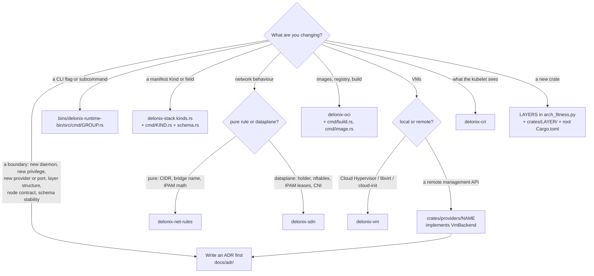

<!-- translated-from: start-here.md sha256:330654e7ab818b3b9bb88817dac83eae2f11aae1306174d0bf5b83c6c165de11 -->
# 从这里开始

这一页会带你从「我刚克隆了这个仓库」走到「我的第一个 pull request 正在被评审」，一步一步来。
读完之后，你会有一个能构建的 checkout、一个可以对着隔离状态运行的二进制文件，以及一张地图，
告诉你改动该放在哪里、必须遵守哪些规则。每一步都会说明要做什么、你应该看到什么、以及哪一页
解释了细节。这一页上的每条规则都会链接到它被写下来的地方——一条没有链接的规则，就不是规则。

如果这里有个词你没见过，去[术语表](glossary.md)里查一下。

## 第 0 天：30 分钟入门

第 0 天遵循手册的顺序，但每一部分只取你今天需要的那一小块：引擎的整体概念
（[IaaS 与云原生](iaas-and-cloud-native.md)），它需要的宿主机
（[准备你的环境](environment.md)，它依赖[Linux 基础](linux-foundations.md)里的那些原语），
一次构建和一次隔离运行
（[克隆、构建与测试](build-and-test.md)，以及[环境变量](environment-variables.md)里的每一个变量），
还有东西都在哪里（[项目结构](project-structure.md)）。当某一步把你指向完整的那一页时，再回去读。

### Delonix 是什么（5 分钟）

Delonix Runtime 是一个在**单个节点上运行容器和 microVM** 的引擎，连同它们所需要的网络和存储。它：

- **声明式（declarative）**——你用它自己的 Kind 描述资源（`delonix api-resources` 会列出它们），
  引擎负责规划（plan）并应用（apply）差异；
- **无守护进程（daemonless）**——不需要任何后台服务；每条命令都是一个完成工作后就退出的进程；
- **无根优先（rootless-first）**——正常路径以你自己这个无特权用户身份运行。

它**不**知道是谁在用它：代码里不存在平台、租户、账户或计费的概念。这个引擎在一朵云里处于
什么位置，见[IaaS 与云原生](iaas-and-cloud-native.md#where-delonix-runtime-fits-and-where-it-deliberately-stops)；
这条边界是怎么被强制执行的，见[架构](architecture.md#engine-identity-and-boundaries)——现在，
这四句话就够了。

### 你需要什么（10 分钟）

一台带 cgroup v2 和无特权 user namespace 的 Linux 宿主机，`rust-toolchain.toml` 里锁定的
Rust 工具链，以及 `PATH` 上的 `protoc`。完整清单，以及那些看起来像引擎 bug 实则是宿主机
陷阱的问题，都在[准备你的环境](environment.md)里。在下面第 5 步之前，至少读一下它的
[已知的宿主机陷阱](environment.md#known-host-traps)那一节。如果「user namespace」或
「cgroup 委派（delegation）」这些词对你还很陌生，动手实践的讲解在
[Linux 基础](linux-foundations.md)——完成第 0 天不需要它，但第一次遇到某个限制不适用时，
你会需要它。

### 五条证明你的环境已就绪的命令（15 分钟）

从你的 checkout 根目录运行下面这些命令。如果其中任何一条没有给出下面展示的形状，先停下来
修好它，再继续往下走——后面的每一步都依赖它。

**1. 克隆，带上 tag。**

```bash
git clone https://github.com/angolardevops/delonix-runtime.git
cd delonix-runtime
git fetch --tags origin
git describe --tags --abbrev=0        # prints the newest release, e.g. vX.Y.Z
```

tag 很重要：版本门禁（version gate）和契约门禁（contract gate）会把你的分支和它们做比较
（[克隆、构建与测试](build-and-test.md#clone)）。

**2. 构建 CLI。**

```bash
cargo build -p delonix-runtime-bin
```

预期结果：最后一行是 `Finished`，并且在 `target/debug/delonix` 处有一个二进制文件。如果它
因为 `protoc` 的一条消息而停下，把它装上（[准备你的环境](environment.md#protoc-required-to-build)）。

**3. 跑一个小的、纯粹的 crate 的测试。**

```bash
cargo test -p delonix-net-rules
```

`delonix-net-rules` 完全没有依赖（看它的 `Cargo.toml`），所以这只能证明你的工具链能编译、
能跑测试——跟宿主机本身没关系。预期结果：一行形如 `test result: ok. N passed; 0 failed` 的输出。

**4. 运行你刚构建的二进制文件。**

```bash
./target/debug/delonix --version
./target/debug/delonix --help
```

预期结果：`--version` 第一行打印 `delonix <version>`，第二行是引擎的一句话描述，然后是一行
形如 `commit: <sha> · built: <date> · <licence>` 的内容；在两次发布之间，`commit:` 部分还会
说明这个构建距离上一个 tag 有多远（`+N commits since vX.Y.Z`）。后面跟着一小段 `get started:`。
`--help` 会打印 `Usage: delonix [OPTIONS] <COMMAND>`、一个 `Commands:` 列表和一份 `COMMAND MAP`。

永远用 `./target/debug/delonix`，不要用 `PATH` 上找到的那个 `delonix`——那是一个已安装的
release，通常比较旧（[准备你的环境](environment.md#a-stale-delonix-on-your-path)）。

**5. 运行一条真正的命令，完全隔离地运行。**

除了 `--help` 之外的任何命令都会读写引擎状态。**两个**状态变量都要先指向临时目录——半吊子的
隔离比完全不隔离还糟
（[克隆、构建与测试](build-and-test.md#isolating-the-engines-state)；每个变量做什么，见
[环境变量](environment-variables.md#isolating-a-development-run)）：

```bash
export DELONIX_ROOT=$HOME/scratch/dlx/root
export DELONIX_NET_RUNTIME_DIR=/tmp/dlx-run      # keep it short: it holds unix sockets
mkdir -p "$DELONIX_ROOT" "$DELONIX_NET_RUNTIME_DIR"

./target/debug/delonix system info
./target/debug/delonix volume create hello
./target/debug/delonix volume ls
./target/debug/delonix volume inspect does-not-exist; echo "exit=$?"
./target/debug/delonix volume rm hello
```

预期的输出形状：

```text
$ delonix system info
Delonix Engine <version>
  state root:         <your $DELONIX_ROOT>
  mode:               rootless (daemonless)
  cgroup2 delegated:  yes | no
  network infra:      down (comes up on demand)
  containers:         0 (0 running)
  events:             0

$ delonix volume ls
NAME    DRIVER   MOUNTPOINT                              SIZE
hello   local    <your $DELONIX_ROOT>/volumes/hello/_data   0 B

$ delonix volume inspect does-not-exist; echo "exit=$?"
error no such volume does-not-exist
exit=4
```

这证明了什么：`state root:` 这一行是**你的临时目录**（所以你没有碰到真实状态），引擎以
rootless 方式运行，而且错误在退出码里带着一个类别（4 = 未找到——见
[给这个代码库的 Rust 入门](rust-primer.md#32-errors-one-error-and-exit-codes-derived-from-its-type)）。
如果 `cgroup2 delegated:` 显示 `no`，在这个会话里 `container run` 会拒绝 `-m`/`--cpus`/
`--cpu-weight`（退出码 69），而 `--cpuset`/`--io-weight` 不会生效；这是宿主机的一个设置，
解释在[准备你的环境](environment.md#cgroup-delegation-some-limits-are-refused-others-are-not-enforced)。

之后如果你要做完网络方面的实验，用同样这两个导出的变量把隔离的网络基础设施拆掉：
`./target/debug/delonix net netns down`。

## 从头到尾完成你的第一次贡献

### 1. 挑一件事做

- 在 GitHub 上看标了 **`good first issue`** 或 **`documentation`** 标签的 open issue。开始动手前先在
  issue 下面评论一下，免得两个人做了同一件事。
- 对于任何不算小的改动——一条新命令、一个新的清单（manifest）Kind、对 namespace 或 cgroup
  设置的改动、一个新的 backend——先开一个 issue，把方案谈妥
  （[`CONTRIBUTING.md`](../../../CONTRIBUTING.md)，[贡献流程](contributing-workflow.md)）。
- 查一下已打开的 pull request，别重复正在进行中的工作。

好的入门方向，因为它们是有单元测试、不需要宿主机特权的纯代码：CLI crate 里的一个解析器
（parser）或校验器（validator）、一条没说清楚该怎么做的错误消息、`bins/delonix-runtime-bin/data/pt.po`
里缺失的一条葡萄牙语条目，或者本手册里写错的某一页。

### 2. 从 `origin/main` 打开一个 worktree

一个任务、一个 worktree、一个分支——永远不要在共享的 checkout 里编辑，永远不要把 worktree
放在 `/tmp` 里
（[每个任务一个 worktree](contributing-workflow.md#one-worktree-per-task)）：

```bash
git fetch --tags origin
git worktree add -b <topic>/<task> ../.worktrees/delonix-runtime/<task> origin/main
cd ../.worktrees/delonix-runtime/<task>
git log --oneline -- <path you will touch>      # what was already decided or fixed there
```

先读一下这个区域的历史，是工作的一部分：这份代码里记录了很多已经被试过、量过、又被改动
过的东西（[从最新的 tag 出发](contributing-workflow.md#start-from-the-latest-tag-not-from-memory)）。

### 3. 找到改动该放在哪里

用下面[我的改动该放在哪里？](#where-does-my-change-go)里的决策树，然后去读
[各个 crate](crates.md)里对应那个 crate 的那一节。如果表格里的某条路径你现在还看不懂，
[项目结构](project-structure.md)解释了每一个顶层目录，以及为什么一个 crate 所在的目录就是
它所属的层（layer）。

### 4. 先写测试

- 一个新的纯函数（解析器、校验器、参数构造器、plan）要在同一个文件里、在
  `#[cfg(test)] mod tests` 下面有单元测试。测试永远不碰真实的 state root：给它传一个临时
  目录——见[测试](rust-primer.md#39-tests)。
- 一次 bug 修复要配一个**在没有这次修复时会失败**的测试。把你的修复回退一次，跑一下测试，
  看它失败，然后把修复恢复回来。一个不管怎样都能通过的测试什么都证明不了。
- 对 namespace、cgroup、网络 holder 或 VM 启动的改动，还需要一次**在隔离状态下的实机运行**，
  因为单元测试到不了那些路径（[跑测试](build-and-test.md#run-the-tests)）。

### 5. 跑本地门禁

每一个 CI 作业都有对应的本地命令，列在
[CI 会跑的那些门禁](build-and-test.md#the-gates-ci-runs)里。至少在请求评审之前跑一下：

```bash
cargo fmt --all --check
cargo clippy --workspace --all-targets --locked -- -D warnings
cargo test --workspace --locked --no-fail-fast
python3 scripts/lang_ratchet.py
python3 scripts/arch_fitness.py
python3 scripts/dev_docs.py --check
python3 scripts/version_gate.py
```

再加上跟你改动内容匹配的那些（如果你加了一条命令就跑 CLI 表面的门禁，如果你动了
`proto/` 就跑契约门禁，如果帮助文本变了就跑文档生成器）——具体哪个对应哪个，见
[CI 会跑的那些门禁](build-and-test.md#the-gates-ci-runs)里的表格。

### 6. 写 pull request

针对 `main` 打开它，并填好
[`.github/PULL_REQUEST_TEMPLATE.md`](../../../.github/PULL_REQUEST_TEMPLATE.md)的每一个部分。
这个模板有四个部分，评审者都会读：

- **这个改动做了什么，为什么？**——重点是*为什么*；diff 本身已经展示了*做了什么*。
- **是怎么测试的？**——你跑过的那些门禁，以及对于运行时/namespace/cgroup/网络方面的代码，
  你**实机**跑过的命令和它的输出。
- **清单（Checklist）**——build/clippy/fmt/test 干净；新增的、面向用户的英文字符串包在
  `po::t`/`po::tf` 里，并在 `pt.po` 里有对应的葡萄牙语条目；命令的每一个入口都接好了线；
  新的纯函数有单元测试；特权边界被明确指出。
- **这个改动跨越了特权或 namespace 边界吗？**——user namespace 映射、holder 的 netns、
  控制 socket、`setns`/`unshare`，或者由用户或清单输入驱动的路径处理。如果你不确定，就说
  你不确定。

说清楚什么被证明了、**以及**什么没有被验证，还有为什么
（[提交和 pull request](contributing-workflow.md#commits-and-pull-requests)）。

### 7. 评审者会检查什么

[`.github/CODEOWNERS`](../../../.github/CODEOWNERS)里的代码所有者会评审每一次改动。评审
清单在[编码约定](coding-conventions.md)里；一个改动会被拿来衡量的云原生标准在
[云原生标准](cloud-native-standards.md)里。在打开 PR **之前**把这两个都读一遍，而不是等
第一轮评论之后再读。

### 8. 合并之后

把 worktree **和** 分支都删掉——分支不会随着 `worktree remove` 一起消失：

```bash
cd ../../../delonix-runtime    # from the worktree of step 2 back to the clone
git worktree remove ../.worktrees/delonix-runtime/<task>
git branch -D <topic>/<task>
```

## 我的改动该放在哪里？



| 改动 | 该放在哪里（在代码树里确认过） | 读什么 | 规则及其出处 |
|---|---|---|---|
| **新的 CLI flag 或子命令** | `bins/delonix-runtime-bin/src/cmd/<group>.rs`（一个模块对应一个组）；字符串通过 `cmd/po.rs`，葡萄牙语放在 `data/pt.po` 里；手册文本在 `cmd/manual_entries.rs`；叶子命令列表在 `scripts/cli_baseline.tsv`（`scripts/cli-tree.sh --update`）。一次运行的纯校验属于 `crates/contexts/delonix-compute/src/preflight.rs` | [新增或修改一条 CLI 命令](contributing-workflow.md#adding-or-changing-a-cli-command)，[CLI](rust-primer.md#36-the-cli-clap-derive-and-translated-output) | LANG-01（`scripts/lang_ratchet.py`）；CLI 表面门禁（`scripts/cli-tree.sh --gate`、`scripts/docs_cli_gate.py`）；接好每一个入口（`CONTRIBUTING.md`） |
| **新的 Kind，或某个 Kind 上的一个字段** | 这个 Kind 的事实：`crates/contexts/delonix-stack/src/kinds.rs` 里的 `FACTS`。它的 spec 类型和 apply：`bins/delonix-runtime-bin/src/cmd/<kind>.rs`。可热更新的字段：`crates/contexts/delonix-stack/src/reconcile.rs` 里的 `hot_fields`。schema：`cmd/schema.rs` 里的 `TYPED_KINDS`，以及发布出去的 `docs/schema/v1/delonix.json`（`delonix manifest schema`） | [声明式协调](cloud-native-primer.md#48-declarative-reconciliation)，[`delonix-stack`](crates.md#delonix-stack) | 先开一个 issue（`CONTRIBUTING.md`）；schema 是从代码生成的（[ADR-0007](../../adr/0007-generated-manifest-schema.md)）；漏掉一张表会让 `kinds.rs` 和 `schema.rs` 里的测试失败 |
| **网络行为** | 没有 I/O 的纯规则：`crates/foundation/delonix-net-rules/src/lib.rs`。数据面（holder、控制 socket、nftables、IPAM、CNI）：`crates/adapters/delonix-sdn/src/`（`infra.rs`、`ipam.rs`、`cni.rs`）。`container run` 里的网络那一步：`crates/contexts/delonix-compute/src/network.rs`。CLI：`cmd/network.rs`、`cmd/net.rs`、`cmd/firewall.rs` | [容器网络](cloud-native-primer.md#45-container-networking)，[`delonix-sdn`](crates.md#delonix-sdn) | Rootless 优先且不允许静默失败（[架构规则](contributing-workflow.md#architecture-rules-the-gates-enforce)）；在 PR 里标出特权边界（`SECURITY.md`） |
| **镜像、registry、构建** | `crates/adapters/delonix-oci/src/`（`registry.rs`、`build.rs`、`cas.rs`、`overlay.rs`）；CLI 在 `cmd/build.rs`、`cmd/image.rs` | [Delonixfile 与 VMfile](delonixfile-and-vmfile.md)，[`delonix-oci`](crates.md#delonix-oci) | 下载都通过 digest 校验（`SECURITY.md`，供应链范围） |
| **持久化状态：一个记录字段、一个 store、文件锁、静态存储的密钥** | 记录类型（`Container`、`Vm`）：`crates/contexts/delonix-compute/src/record.rs`；纯数据部分（`Status`、`ContainerFw`）：`crates/foundation/delonix-model/src/records.rs`。它们怎么被存储和加锁（`Store`、`JsonStore`、`write_atomic*`、`SecretStore`、`CredVault`）：`crates/adapters/delonix-state/src/`（`store.rs`、`secret.rs`、`cred_vault.rs`） | [`delonix-state`](crates.md#delonix-state)，[磁盘上的状态](architecture.md#state-on-disk)，[并发](rust-primer.md#38-concurrency-and-shared-state) | 新的记录字段要带 `#[serde(default)]`；先读再改再写要走 `update`（[状态与并发](coding-conventions.md#8-state-and-concurrency)） |
| **这个节点上的 VM 行为** | `crates/adapters/delonix-vm/src/lib.rs`（`VmBackend` trait 和 backend 的注册表）、`cloudinit.rs`；CLI 在 `cmd/vm.rs`、`cmd/vmimage.rs`、`cmd/vmfile.rs` | [构建 microVM](microvm-setup.md)，[作为端口（port）的 trait](rust-primer.md#33-traits-as-ports-vmbackend-and-the-backend-registry) | [ADR-0008](../../adr/0008-proxmox-vm-backend.md)（backend 是可注册的） |
| **一个新的 VM backend 或存储 provider，在一个远端 API 之后** | `crates/providers/` 下的一个新 crate，实现一个端口（port）；在组合根（composition root）注册（`cmd/vmbackends.rs`） | [Provider](crates.md#providers)，[层（Layer）](architecture.md#layers-and-the-allowed-direction) | 先写 ADR（[什么时候要写 ADR](contributing-workflow.md#when-to-write-an-adr)）；[ADR-0040](../../adr/0040-engine-restructuring-layers-ports-node-contract.md) |
| **CRI（kubelet 看到的那个东西）** | `crates/interfaces/delonix-cri/src/`（`runtime_svc.rs`、`runtime_svc/lifecycle.rs`、`streaming.rs`） | [Kubernetes](cloud-native-primer.md#46-kubernetes-cri-kubelet-kubeadm-and-kind)，[`delonix-cri`](crates.md#delonix-cri) | [ADR-0038](../../adr/0038-cri-follows-kubelet-resource-model.md) |
| **一个新的 crate** | `scripts/arch_fitness.py` 里 `LAYERS` 的一条记录、`crates/<layer>/` 下的一个目录，以及根 `Cargo.toml` 的 `[workspace.dependencies]` 里对应的路径——都在同一个 commit 里 | [层（Layer）](architecture.md#layers-and-the-allowed-direction) | `scripts/arch_fitness.py`（目录就是层，版本号只放在根目录） |
| **一个会移动某条边界的决定** | `docs/adr/NNNN-title.md`，在写代码之前 | [什么时候要写 ADR](contributing-workflow.md#when-to-write-an-adr) | [`docs/adr/README.md`](../../adr/README.md)；被接受的 ADR 只会被后继者取代，永远不会被改写 |

如果你的改动跟哪一行都对不上，在写代码之前先在 issue 里问一下（见
[卡住了怎么办](#when-you-are-stuck)）。

## 不可打破的规则

每条规则都由一个门禁、一次评审，或者两者一起来强制执行。链接指向它被写下来的地方。

| 规则 | 出处 |
|---|---|
| **引擎不认识任何消费者。** 任何使用这个引擎的产品、平台、control plane、控制台或 agent，都不会在 `crates/`、`bins/`、`proto/` 或清单（manifest）里被点名，注释也不例外；也没有租户、账户、方案（plan）或计费的概念。 | [`AGENTS.md`](../../../AGENTS.md) 顶部的 *«Identidade e fronteira do motor»*（引擎的身份与边界）。被点名的消费者由 `scripts/arch_fitness.py` 里的 `CONSUMER_NAMES`（一份固定的名单，用正则匹配）强制检查；对租户、账户、方案和计费这几个概念的禁止，没有门禁去匹配，是在评审里检查的 |
| **无守护进程（Daemonless）。** 默认不驻留任何进程；新增一个需要一份 ADR，并附上 systemd 做不到的证据。 | [`AGENTS.md`](../../../AGENTS.md)（同一节）；[架构规则](contributing-workflow.md#architecture-rules-the-gates-enforce) |
| **无根优先（Rootless-first）。** 正常路径以无特权身份运行；特权是显式的、被宣告出来的可选项（opt-in）。一条新的特权边界需要一次 GO/NO-GO 的验证性实验（spike）和一份 ADR。 | [`AGENTS.md`](../../../AGENTS.md)；[什么时候要写 ADR](contributing-workflow.md#when-to-write-an-adr) |
| **依赖指向内层，目录即是层，版本号只活在根目录。** | [ADR-0040](../../adr/0040-engine-restructuring-layers-ports-node-contract.md)；`scripts/arch_fitness.py` |
| **LANG-01：代码是英文的。** 标识符、注释和消息用英文写；葡萄牙语只通过 `pt.po` 到达用户。 | [语言](contributing-workflow.md#language-english-in-the-code-lang-01)；`scripts/lang_ratchet.py` |
| **版本对齐。** 不要在一个功能 PR 里改动根 `Cargo.toml` 里的 `version`；你的分支必须包含最新的 tag。 | [版本对齐](contributing-workflow.md#version-alignment)；`scripts/version_gate.py` |
| **一个任务一个 worktree**，放在 `/tmp` 之外，按名字暂存文件，结束时把 worktree 和分支都删掉。 | [每个任务一个 worktree](contributing-workflow.md#one-worktree-per-task) |
| **永远不要拿真实状态去跑引擎、E2E 测试组或混沌测试组（chaos harness）。** 把 `DELONIX_ROOT` 和 `DELONIX_NET_RUNTIME_DIR` 都导出；除非你在诊断自己的宿主机，否则不要设置 `E2E_SHARED_STATE=1`。 | [隔离引擎的状态](build-and-test.md#isolating-the-engines-state)，[E2E](build-and-test.md#end-to-end-battery-scriptse2esh)，[混沌测试](build-and-test.md#chaos-harness-scriptschaossh) |
| **涉及安全的改动要被明确标出**，漏洞要私下报告，永远不要放在公开的 issue 或 PR 里。 | [`SECURITY.md`](../../../SECURITY.md)；[涉及安全的改动](contributing-workflow.md#security-sensitive-changes) |

## 卡住了怎么办

按这个顺序找——每一步都比下一步更省成本：

1. **本手册。** [README](README.md) 有页面列表；[术语表](glossary.md) 解释了词汇。
2. **[`AGENTS.md`](../../../AGENTS.md)**，按区域组织。它很长，部分内容偏历史性（也有一部分是
   葡萄牙语）：用它来知道该去*哪里*找，然后在代码里确认。
3. **ADR 索引**，[`docs/adr/README.md`](../../adr/README.md)——某个结构背后的决定，以及被
   否决过的方案。
4. **文件的历史**：`git log --oneline -- <path>` 和 `git log -p -S '<symbol>'`。这里的提交
   信息会解释为什么。

如果你还是卡住了，在 GitHub 上**问**：

- 在你正在做的那个 issue 下面评论，或者用
  [功能请求模板](../../../.github/ISSUE_TEMPLATE/feature_request.md)（问方案相关的问题）或
  [bug 报告模板](../../../.github/ISSUE_TEMPLATE/bug_report.md)开一个新的。
- 安全问题走[私下漏洞报告](../../../SECURITY.md)这条路，不要开 issue。

bug 报告模板会要你提供：

- `delonix --version` 的输出；
- 发行版和内核版本、rootless 还是 root、你是用 `install.sh` 安装的、下载的二进制文件，
  还是从源码构建的；
- 触发问题的确切命令或清单（manifest）；
- 你原本期望什么，以及实际发生的**完整、未删减**的输出；
- 它是每次都能复现，偶尔复现，还是只出现过一次；
- 其他任何可能相关的信息。

除了模板问的这些，本手册还额外推荐两件事，因为它们能省掉一个来回：

- 你运行的那个二进制文件**完整**的 `--version` 输出，包括 `commit:` 那一行（在两次发布之间，
  每个构建报告的版本号都一样，只有 commit 能把它们区分开）；
- `DELONIX_ROOT`/`DELONIX_NET_RUNTIME_DIR` 是否设置过，以及你已经读过、试过什么
  （哪一页、`AGENTS.md` 里的哪一节、哪个 ADR）。

## 进度清单

- [ ] 我读了 Delonix 是什么，以及那四条原则（[架构](architecture.md#engine-identity-and-boundaries)）。
- [ ] 我的宿主机满足[准备你的环境](environment.md)的要求，我也读了已知的宿主机陷阱。
- [ ] `cargo build -p delonix-runtime-bin` 完成了。
- [ ] `cargo test -p delonix-net-rules` 报告 `test result: ok`。
- [ ] `./target/debug/delonix --help` 能用，而且我不再用 `PATH` 上的那个 `delonix` 了。
- [ ] `delonix system info` 把我的临时 `DELONIX_ROOT` 显示为 state root。
- [ ] 我挑了一个 issue 并在下面评论了（或者为一个不算小的改动开了一个）。
- [ ] 我在自己从 `origin/main` 创建的 worktree 里工作。
- [ ] 我找到了改动该放在哪里，并读了[各个 crate](crates.md)里对应 crate 的那一节。
- [ ] 我写了一个在没有我的改动时会失败的测试。
- [ ] [克隆、构建与测试](build-and-test.md#the-gates-ci-runs)里的本地门禁都通过了。
- [ ] 我读了[编码约定](coding-conventions.md)和[云原生标准，逐层讲解](cloud-native-standards.md)。
- [ ] 我的 PR 填好了模板的每一个部分，包括*没有*被验证的地方。
- [ ] 合并之后，我删掉了自己的 worktree 和分支。

---

**下一步：** [IaaS 与云原生——这个引擎在哪里](iaas-and-cloud-native.md)——一个 IaaS 的心智模型、这个引擎是它的哪一层，以及云原生原则如何体现在它的文件里。
