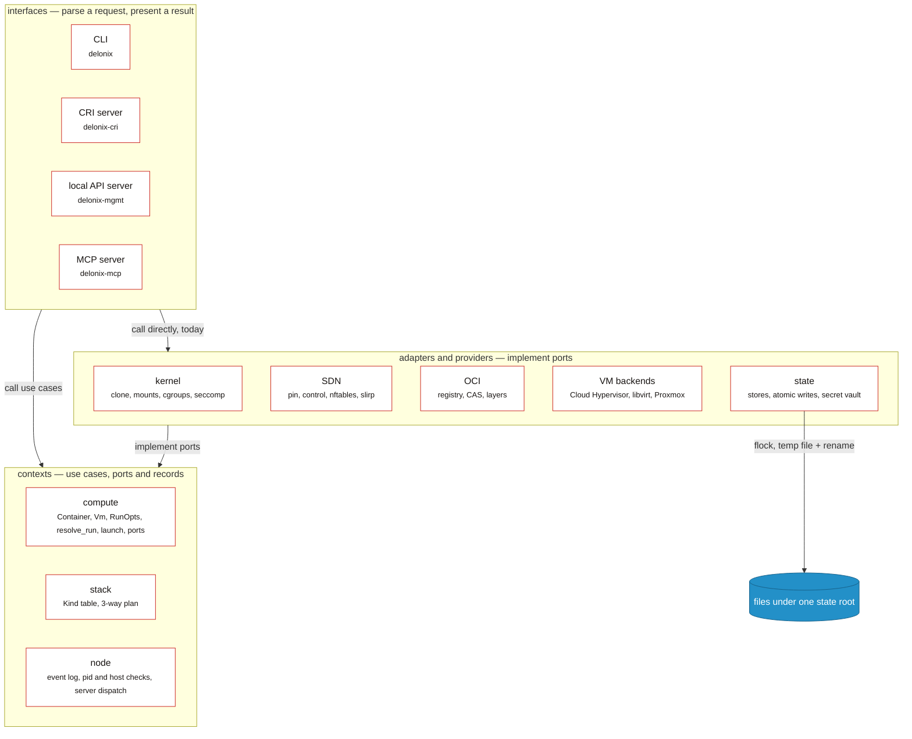
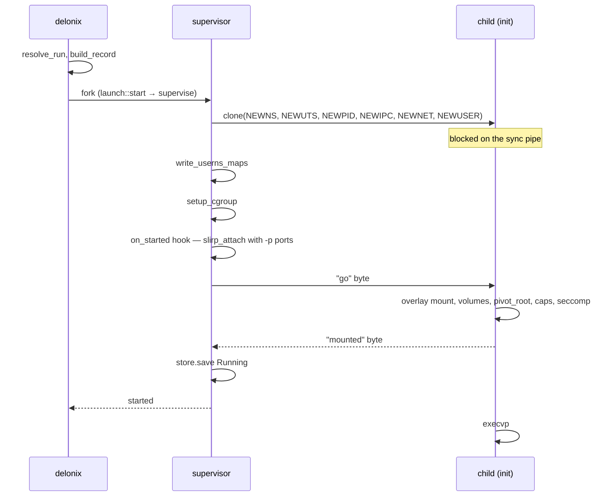
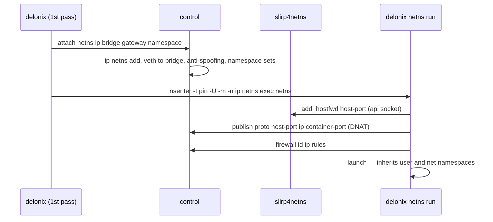
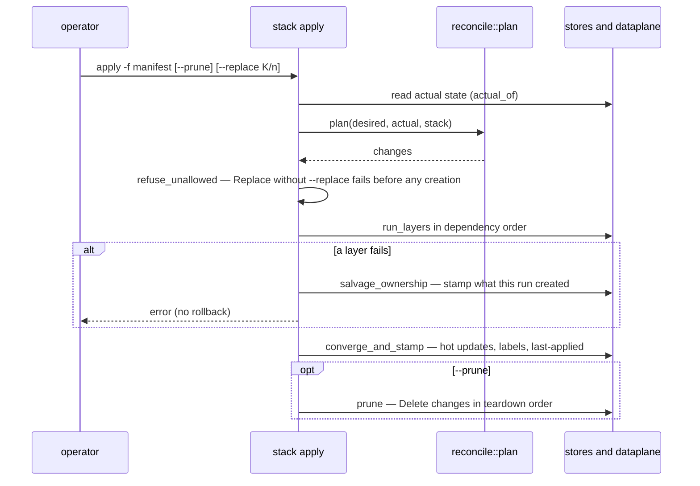

<!-- translated-from: system-design-interview.md sha256:521f8c297a328d828b08609f1c7800883ddc9f0b15dfe38970650e270ad31535 -->
# 系统设计面试 — Delonix 引擎

**阅读之前：**[架构](architecture.md)和[各个 crate](crates.md) —— 本页论证的是它们所描述的结构*为什么*是这个样子。

> **面试官：**为单个 Linux 节点设计一个容器与微虚拟机引擎。它默认必须无需 root 就能运行，
> 不能有常驻的守护进程，也不能知道是谁在调用它。

本页按照一个优秀候选人会给出的方式回答这个问题，然后把每一个回答都拿去对照 Delonix
引擎实际的做法进行核对。每一次深入探讨都以**它在代码中的位置**收尾，列出为本页读过的文件和符号。
若要了解结构性的地图（层、crate 依赖图、进程、状态路径），先读[架构](architecture.md)；本页讲的是
*为什么*这个设计是这个样子。读完之后，你就能够为——或者带着证据去挑战——引擎的几个主要设计选择辩护：
无根的进程创建、网络 holder、共享的镜像层、VM 端口，以及没有状态文件的协调器。

下面引用的数字都是**记录在仓库里、附带日期或版本号的测量结果**，不是一成不变的事实。在依赖某个
数字之前，先重新测量一次。

---

## 1. 需求

> **候选人：**在画框图之前，我想先钉死「完成」到底意味着什么。

### 功能性

- 从 OCI 镜像运行**容器**：拉取、解包、创建、启动、停止、exec、查看日志、删除。
- 从磁盘镜像运行**微虚拟机**，支持不止一种 hypervisor。
- 工作负载之间的**网络**：私有网桥、发布的端口、防火墙、DNS 名称、按命名空间隔离。
- **存储**：命名卷、bind mount、网络共享。
- **声明式**操作：一份包含多个 Kind 的清单、`plan`、`apply`、漂移检测、清理（prune）。
- 通过 CRI 为 **kubelet** 服务，使引擎能够成为 Kubernetes 节点的运行时。
- 把同样的操作暴露给**本地程序**（一个 API、一个 AI 工具协议），而不只是一个 shell。

### 非功能性

- **无根优先（Rootless-first）。** 正常路径以无特权用户身份运行；特权是可选启用（opt-in）的，
  且会被明确说明。
- **无守护进程（Daemonless）。** 没有进程会「以防万一」地常驻运行。持久化属于 systemd，
  或者属于一个有归属者的、按工作负载存在的进程。
- **不了解消费者。** 没有租户、账户、方案或计费；引擎校验自己的契约，而不是信任调用方去
  拒绝它自己做不到的事。
- 通过开放标准（OpenTelemetry、Prometheus）和一份事件日志实现**可观测**。
- **诚实的失败。** 一次被拒绝或做到一半的操作会如实报告，附带原因和一个稳定的退出类别——
  绝不会在失败之上返回 `0`。
- **能挺过自身控制进程的重启**，而不打扰正在运行的工作负载。

---

## 2. 背景约束：一个无特权的 Linux 用户能做什么

> **候选人：**无根这一点对设计的改变比任何其他需求都大，所以让我先列出我必须遵守的内核规则。

| 内核允许一个无特权用户…… | ……但不允许 | 对设计的影响 |
|---|---|---|
| 创建一个**用户命名空间（user namespace）**，并在其中成为 uid 0（`CLONE_NEWUSER`） | 映射任意的宿主机 uid | 只有一个单一 uid 的映射，除非 `newuidmap`/`newgidmap` 与 `/etc/subuid` 授予了一个范围；一个把文件 `chown` 给 uid 101 的镜像就需要这个范围 |
| 创建被**该用户命名空间拥有**的网络、mount、PID、IPC、UTS 命名空间，并在其中拥有 `CAP_NET_ADMIN`/`CAP_SYS_ADMIN` | 触碰宿主机的初始网络命名空间 | 网络是构建在引擎自己拥有的命名空间*内部*的；要到达宿主机，需要一个用户态的网桥（`slirp4netns`） |
| **在自己的 mount 命名空间内**挂载 overlayfs、tmpfs、bind | 在宿主机的视角下挂载 | 容器自己的 init 在 `clone` 之后执行 overlay 挂载 |
| 向一个被**委派（delegated）**的 cgroup v2 子树写入限制 | 写入未被委派给它的 cgroup | 限制只在 systemd 委派过的地方才会生效（`systemd-run --user --scope -p Delegate=yes`） |
| `setns` 进入一个由自己的用户命名空间拥有的命名空间 | `setns` 进入一个由*另一个*进程的用户命名空间拥有的命名空间 | 加入别处创建的网络，意味着**要先进入那个所有者的用户命名空间** |
| 在**单线程**进程中安全地运行 `clone` | 假定 `clone` 在多线程进程中同样安全（`clone` 不会运行 `pthread_atfork` 处理程序） | 建立在 `tokio` 之上的服务器必须把进程创建这件事交给一个全新的进程去做 |

有两条宿主机策略会不断冒出来，看起来像是引擎的 bug：Ubuntu 23.10+ 通过 AppArmor 限制无特权的
用户命名空间（一份 profile 是绑定到创建该命名空间的可执行文件的*路径*上的），而一个普通的 SSH
会话并不是一个被委派的 cgroup scope。表格里的每一行都是[Linux 基础](linux-foundations.md)里
手把手教过的一个原语；这两条宿主机策略在[准备你的环境 —— 已知的宿主机陷阱](environment.md#known-host-traps)里。

---

## 3. API

> **候选人：**一套操作，几扇门——其中一扇是其余几扇都收敛于其上的那份契约。

| 门 | 编码 | 谁使用它 |
|---|---|---|
| CLI `delonix` | argv，稳定的退出类别 | 操作者、脚本 |
| 节点契约 `delonix.node.v1` | 在**同一个**本地 unix socket 上同时提供 gRPC **与** HTTP/JSON | 任何本地客户端（已设计；尚未提供服务） |
| CRI `runtime.v1` | 在一个 unix socket 上的 gRPC | kubelet |
| MCP | 基于 stdio 的 JSON-RPC | 一个本地 AI 客户端，每个进程一个会话 |

节点契约的设计要点，全部写在 [ADR-0040](../adr/0040-engine-restructuring-layers-ports-node-contract.md) D4
和 [ADR-0042](../adr/0042-one-engine-api-maturity-and-docs.md) 里：

- **`.proto` 文件是唯一的真相来源**；REST 映射来自 `google.api.http` 注解，OpenAPI 文档从它们
  生成。一个 CI 门禁会检查格式、lint、相对于上一个版本的破坏性变更、除双向流（`Exec`、
  `Console`）之外的每一个 RPC 是否都有 HTTP 映射，以及已提交的 OpenAPI 是否就是生成出来的
  那一份。
- **面向资源**的服务（`ContainerService`、`PodService`、`VirtualMachineService`、
  `NetworkService`、`VolumeService`、`ImageService`、`StackService`、`NodeService`、
  `OperationService`），每个 RPC 一个请求消息，身份以显式的 `namespace`/`name` 表示。
- **长任务返回一个 `Operation`**，它在被确认之前就已经持久化，因此一个重启后的服务器能够说出
  `Interrupted`，而不是永远说 `RUNNING`。
- **仅限本地。** `SO_PEERCRED`、同一个 uid、没有 TCP、没有 TLS、引擎里没有身份这个概念——
  [ADR-0010](../adr/0010-remote-management-api.md) 否决了一个远程 API。任何节点之外的东西
  都要在自己前面放一个代理。

> **面试官：**为什么不直接做一个 REST 服务器？
>
> **候选人：**因为 gRPC 客户端和 shell 工具都应该得到一种一等公民级别的编码，而从同一个文件
> 生成两者，能让它们不至于走样。CLI 也不是二等公民：它的退出类别
> （`delonix-model/src/exitcode.rs`）就是 ADR-0040 D4 要求契约的错误必须携带的那些 `DX_*` 类别。

**它在代码中的位置：** `proto/delonix/node/v1/{node,compute,infra,operations,common}.proto`；
`scripts/contract_gate.py`；`docs/api/openapi.yaml`；`crates/interfaces/delonix-cri/src/lib.rs`
（`serve_blocking`）；`bins/delonix-mcp-bin/src/main.rs`；`crates/foundation/delonix-model/src/exitcode.rs`。
诚实的现状：目前还没有任何 crate 引用 `delonix.node.v1`；本地程序用的是管理 API
（`crates/interfaces/delonix-mgmt`），ADR-0042 计划把它迁移之后移除。

---

## 4. 高层设计

> **候选人：**我会这样分层：领域的规则永远不导入内核，并且让每一个长期存活的进程恰好只拥有
> 一样东西。

> **图例** —— 白底红边的方框：引擎的构建块 · 带外框的区域：一个层 · 蓝色圆柱体：磁盘上的状态 ·
> 带标注的实线箭头：调用或数据流。

领域的规则从不挂载、创建进程或配置网络，state root 下的每一个文件都由某一个适配器独占拥有。



- **层**（ADR-0040 D1）：基础层 → 上下文层 → 适配器/provider 层 → 接口层 → 二进制程序，
  由 `scripts/arch_fitness.py` 强制执行。
- **状态**是位于同一个 root 之下的 JSON 记录和按内容寻址的文件，写入是原子的，读改写周围加了
  `flock`——没有数据库，因为没有守护进程去拥有一个。记录的*类型*定义在别处
  （`delonix-compute` 上下文里的 `Container`/`Vm`；`delonix-model` 基础层 crate 里的 `Status`
  以及防火墙相关的记录）；*文件*只经由 `delonix-state` 适配器打开。
- **进程**按工作负载存在（一个作为容器父进程的 supervisor、init、一个日志 shim），在使用网络时
  还按节点存在（一个只持有命名空间的 *pin*、一个可重启的 *control* 进程、一个 `slirp4netns`
  上行链路）。除此之外没有别的东西会常驻。

**它在代码中的位置：** `scripts/arch_fitness.py`（`LAYERS`、`ALLOWED`）；
`crates/adapters/delonix-state/src/store.rs`（`Store::update`、`JsonStore::update`、
`write_atomic`）；`crates/contexts/delonix-compute/src/record.rs`（`Container`、`Vm`）；
`crates/foundation/delonix-model/src/records.rs`（`Status`、`ContainerFw`、`FwRule`）；
`crates/contexts/delonix-compute/src/{ports,launch}.rs`；
`crates/adapters/delonix-linux/src/supervise.rs`（`run_supervised`）。

---

## 5. 深入探讨

### 5.1 一次无根的 `container run`

> **面试官：**以一个无特权用户的身份，带我走一遍 `run -d -p 8080:80 nginx`。

> **候选人：**把一切可能失败的事情在创建进程*之前*先解决掉；然后创建一个停着的进程，从外部
> 配置它，只有当它准备好了才释放它。

1. **解析。** 每一个入口——CLI 参数、一份 Pod 清单、Docker API、CRI——都归约成同一份运行规格
   （`RunOpts`）。`resolve_run` 在镜像缺失时拉取它、准备根文件系统、依据它解析 `--user`、
   解析卷与设备、校验安全选项。所有的拒绝都发生在这里，并且一个 guard 会在任何提前返回时
   移除已准备好的目录。
2. **记录。** `build_record` 把这份规格变成一个 `Container` 记录（纯函数）。
3. **选择父进程。** 对于一次后台启动，CLI 会 fork 出一个 **supervisor**，由它成为容器的父进程
   （`launch::start` → `should_supervise`）。只有真正的父进程才能 `waitpid`，所以正是这一点，
   使得在没有守护进程的情况下也能拿到真实的退出码，也能实现 `--restart`。
4. **Clone。** `spawn` 调用 `clone`，带上新的 mount、UTS、PID、IPC 命名空间，以及——当容器要
   拥有自己的用户和网络命名空间时——再加上这两个。子进程阻塞在一个管道上。
5. **按固定顺序从外部配置。** 父进程写入 uid/gid 映射（`write_userns_maps`，当存在 subuid
   范围时经由 `newuidmap`）、设置 cgroup、运行 `on_started` 钩子（此处是：带上 `-p` 端口的
   `slirp_attach`，这样在 entrypoint 运行之前网络就已经存在），然后才写入那个「开始」字节。
6. **在子进程内部。** `container_init` 挂载 overlay（`mount_overlay_if_marked`）、绑定卷、
   设置 `/dev`、执行 `pivot_root`、屏蔽 `/proc` 路径、应用 capability、seccomp 和
   `no_new_privs`，并在 `execvp` 之前，在第二个管道上发出**「已挂载」**信号。
7. **最后才发布记录。** 父进程等待那个「已挂载」字节（`wait_for_mounts`），短暂等待 exec 的
   结果，然后才 `store.save` 为 `Running`。

> **图例** —— 参与者是各个进程；实线箭头是调用、socket 连线、fork 或 clone（标签会说明具体是
> 哪种）；虚线箭头是回复或送回的字节；自环箭头是那个进程内部的工作；注释标记状态或等待。

子进程被创建时是阻塞的，从外部被配置，只有在子进程报告挂载完成之后，记录才会被保存。



> **面试官：**为什么要在保存记录之前等待「已挂载」？
>
> **候选人：**因为记录正是*其他*进程读取来判断自己能否进入容器的依据。在 `pivot_root` 之前，
> `setns` 进入子进程的 mount 命名空间，落地的是宿主机的文件系统。2026-08-28 用一个能分辨这
> 两个文件系统的探针测量过：修复之前，紧跟在 `run -d` 之后发出的 54 次 `exec` 里有 5 次在
> 容器之外运行；修复之后，54 次里 0 次如此。这个等待有三种结果
> （`MountWait::{Ready, InitExited, Unknown}`）和一个上限，所以一个卡住的 mount 不会把 `run`
> 也一起卡住。

**它在代码中的位置：** `crates/contexts/delonix-compute/src/run.rs`（`resolve_run`、
`build_record`）；`crates/contexts/delonix-compute/src/launch.rs`（`start`、
`should_supervise`、`WorkloadRuntime`）；`crates/adapters/delonix-linux/src/workload.rs`
（`HostWorkload`）；`crates/adapters/delonix-linux/src/supervise.rs`（`run_supervised`）；
`crates/adapters/delonix-linux/src/lib.rs`（`spawn`、`write_userns_maps`、`setup_cgroup`、
`container_init`、`setup_rootfs`、`wait_for_mounts`、`MountWait`）；
`bins/delonix-runtime-bin/src/cmd/container.rs`（`cmd_run`）。

### 5.2 网络：pin、control、slirp、nftables

> **面试官：**容器之间需要互相通信、按命名空间隔离、还要能发布端口——但宿主机上没有
> `CAP_NET_ADMIN`。

> **候选人：**在一个用户拥有的命名空间内部构建一个私有的网络世界，在用户态把它桥接到宿主机，
> 所有的过滤都在那里完成。

**把「持有」和「服务」分开。** 一个既拥有命名空间*又*负责处理请求的单一「holder」进程，一旦
重启，就会带走每一个工作负载的网络。所以：

- **pin**（`delonix netns pin`）自己创建 user、network 和 mount 命名空间，然后只是睡眠
  （`pin_main`）。它的 pid 是每一个 `nsenter -t <pin>` 所瞄准的目标，并且永远不会改变；
- **control** 进程（`delonix netns control`，通过 `nsenter` 进入 pin 的命名空间来启动）服务
  一个受 `SO_PEERCRED` 限制的 `0600` unix socket，并运行 DNS、DHCP 和路由器通告（Router
  Advertisements）。它是可重启的：当 pin 还活着时，`ensure_up` 只重启它；
- **一个 `slirp4netns`** 把 `tap0` 接到 pin 的 netns 上，并暴露一个用于 `add_hostfwd` 的 API
  socket。

pin 是**在自己进程内**创建命名空间的（调用方通过两个管道写入 id 映射），而不是经由
`unshare(1)`，因为 AppArmor profile 是按创建用户命名空间的那个可执行文件的路径来绑定的，而
`/usr/bin/unshare` 不是引擎自己的可执行文件。

**加入一个自定义网络。** 一个使用 `--net web` 的容器没办法 `setns` 进入一个由 pin 的用户命名
空间拥有的 netns。因此 CLI 会请求 control 进程创建 netns 和 veth（`attach …`），然后**重新
执行自己**、落在 pin 的 user 和 mount 命名空间里
（`nsenter -t <pin> -U -m -n -- ip netns exec <netns> delonix netns run <spec>`）；第二遍
执行继承 user 和 network 命名空间，而不是重新创建它们。

**发布一个端口**是两个步骤，两者都是 dataplane 状态而不是进程状态（这正是为什么可以在一个
正在运行的容器上添加和移除端口）：在唯一的那个 slirp 上执行 `add_hostfwd`，以及在 pin 的
netns 内部加一条 DNAT 规则（在控制 socket 上执行 `publish …`）。

**用 verdict map 过滤。** ingress 表（`table ip dlxing`）的构建方式，使得每个容器的策略开销
不随容器数量增长而改变：

```text
forward priority -20  fwguard   drop 169.254.0.0/16 and 127.0.0.0/8
forward priority -10  fwdeny    established → accept; bridge pair in @netpair → verdict; bridge↔bridge → drop
forward priority  -5  fwcont    ip daddr vmap @fwmap ; ip saddr vmap @fwmap
forward priority   0  forward   policy drop; established; tap0; same-bridge; @netpair
```

`fwcont` 只有两条规则；每个容器的规则都活在它自己的 chain 里，通过按 IP 建索引的 `fwmap`
verdict map 到达。网络**之间**的流量是按（网络）对丢弃的，除非某个 `NetworkRoute` 把这一对
放进了 `@netpair`——一条路由说的是这个包*可以*跨越，而每个容器自己的 chain 仍然决定它是否
*被允许*。

**按命名空间隔离**存在于每个容器自己的 chain 里：`@dlxns<hash>`（同一命名空间）的成员被
接受，来自任何其他容器地址（`@dlxall`）的**新**连接则被丢弃；回复仍然能通过，因为这条 drop
规则只匹配 `ct state new`。一条显式的 ingress 策略会替换掉这个默认值。SDN 中的 IPv6 默认被
拒绝（`table ip6`，`policy drop`），因为以上所有规则都是 IPv4 的。

> **图例** —— 参与者是各个进程；实线箭头是调用、socket 连线、fork 或 clone（标签会说明具体是
> 哪种）；虚线箭头是回复或送回的字节；自环箭头是那个进程内部的工作；注释标记状态或等待。

加入一个自定义网络是控制 socket 上的一行，外加一次重新执行、落进 pin 的命名空间；发布一个
端口则是两次 dataplane 写入。



> **面试官：**control 进程一次只服务一个连接。这难道不是个瓶颈吗？
>
> **候选人：**这是故意为之的——它是 netns、veth 和 nftables 变更的串行化点，这些变更绝不能
> 交错发生。真正的风险是客户端在队列里放弃：在准备 v0.47.0 时，30 个并发的 attach、5 秒的
> 读取上限，丢了 15 个；把回复上限提高之后（`CONTROL_REPLY_TIMEOUT`，30 秒），30 个全部完成。
> 每连接的 I/O 上限（`CONTROL_IO_TIMEOUT`）之所以存在，是为了让一个卡住的客户端不至于冻结
> 整个节点的控制面。

**它在代码中的位置：** `crates/adapters/delonix-sdn/src/infra.rs`（`ensure_up`、
`start_pin`、`pin_main`、`start_control`、`control_main`、`control_loop`、`start_slirp`、
`attach_container`、`do_attach`、`publish_port`、`join_argv`、`ingress_table_ruleset`、
`fw_chain_body`、`dlxns_set`、`DLXALL_SET`、`ingress_v6_refusal_ruleset`、
`CONTROL_IO_TIMEOUT`、`CONTROL_REPLY_TIMEOUT`）；`crates/adapters/delonix-sdn/src/pin_userns.rs`；
`crates/adapters/delonix-sdn/src/run_network.rs`（`HostNetwork`）；
`crates/contexts/delonix-compute/src/network.rs`（`attach_custom_network`、`wire_network`）；
`bins/delonix-runtime-bin/src/cmd/container.rs`（`reexec_into_netns`、`run_from_spec`）。

### 5.3 镜像：CAS、共享层与多层挂载

> **面试官：**一个节点运行了二十个同一镜像的容器。磁盘上有什么？

> **候选人：**blob 只有一份，解包后的层只有一份，每个容器只有一个小小的可写目录。

- **CAS。** blob 在 `blobs/sha256/<hex>` 下以它们的 sha256 命名；写入一个已存在的 digest 是
  no-op。一次 pull 会校验每一个 blob 是否与 manifest 相符，**并且**校验 manifest 是否与用户
  钉住（pin）的 digest 相符（`verify_manifest_digest`）——否则一次 pin 就只是摆设。
- **可续传的下载。** 一次 blob 下载会带着 `Range:` 从已经拿到的字节数处重试
  （`BLOB_ATTEMPTS`），并区分请求偏移量处的 `206`（续传）、别处的 `206`，以及 `200`（重新
  开始）。末尾的 digest 校验使得拼接是安全的。
- **共享层。** `prepare_overlay` 为容器创建 `upper/`、`work/`、`merged/`，并把共享层目录的
  有序列表写进 `overlay-lowers`。挂载它的是**容器自己的 init**，在它自己的 mount 命名空间
  内部——一个无特权用户在那里是被允许这样做的。这份契约是磁盘上的一个文件，而不是内存里的
  一个字段，因为无根路径会重新执行这个二进制程序，而一个 struct 跨不过那道边界。

  粗略估算一下，据 v0.59.0 时的记录：此前的扁平拷贝方式，让每个容器都要付出一整棵镜像树的
  代价——在某台开发用主机上，`containers/` 占了 47 GiB，其中大部分是完全相同的拷贝，一个
  2.1 GiB 镜像的每一次 `run` 都要花大约 13 秒去拷贝。共享层之后，那个目录降到了 7.2 GiB。
- **多层。** 经典的 `mount(2)` 把 `lowerdir=a:b:c……` 作为一个字符串传入，内核最多只拷贝其中
  的一个页面，**并悄悄截断**。为 [ADR-0037](../adr/0037-overlay-mount-new-api.md) 测量过
  （2026-09-06 验证）：20 层（4084 字节）能挂载，30 层（5994 字节）就失败了，而一个 91 层的
  builder 镜像需要 9107 字节。现在的挂载改用 `fsopen`/`fsconfig`/`fsmount`/`move_mount`，
  每一层调用一次 `lowerdir+`，因此没有长度上限。

**它在代码中的位置：** `crates/adapters/delonix-oci/src/cas.rs`（`Cas::write`、`Cas::has`）；
`crates/adapters/delonix-oci/src/registry.rs`（`blob_with_progress_capped`、
`BLOB_ATTEMPTS`、`parse_content_range`、`verify_manifest_digest`）；
`crates/adapters/delonix-oci/src/overlay.rs`（`prepare_overlay`、`LOWERS_FILE`）；
`crates/adapters/delonix-oci/src/run_images.rs`（`HostImages`）；
`crates/adapters/delonix-linux/src/lib.rs`（`mount_overlay_if_marked`、`fsopen_overlay`）。

### 5.4 微虚拟机：一个端口、一个注册表与固件陷阱

> **面试官：**在不构建一个到处渗漏的 hypervisor 抽象层的前提下，加入对 VM 的支持。

> **候选人：**每个 provider 一个 trait，一个由组合根（composition root）填充的注册表，而那些
> 属于 provider 自己的古怪之处，就由 provider 自己来回答。

- **端口。** `VmBackend` 有 `id`、`available`、`boot`、`is_running`、`ip`、`stop`，以及一些
  可选操作（`pause`、`snapshot`、`restore`……），它们的默认回答是「不支持」。provider 的事实
  是一个个方法，而不是调用点上的字符串判断：`ip_is_predicted`（Cloud Hypervisor 的地址是从
  MAC 算出来的，不是观测到的）、`manages_own_storage`（一个远程节点拥有自己的磁盘）、
  `destroy` 与 `stop` 是有区别的（本地情况下磁盘是引擎自己的；远程情况下只有 destroy 才会
  释放它）。
- **注册表。** `builtin_backends` 按优先顺序预置了 Cloud Hypervisor 和 libvirt；
  `register_backend` 可以再加进来更多（Proxmox 后端，只有在配置好之后，才由 CLI 的组合根去
  注册）。一次注册携带一个工厂闭包和一个 `auto_selectable` 标志，因此自动检测永远不会去
  构造——因而也永远不会去认证——一个远程后端。注册本身不做任何 I/O。
- **给一个 VM 配网络。** Cloud Hypervisor 在 pin 的 netns 内部运行，通过 `VmNetwork` 端口在
  一个网桥上拿到一个 `tap`，这个端口由 SDN 实现（`HostVmNetwork`）；`delonix-vm` 并不依赖
  `delonix-sdn`。因为 DHCP 服务器是引擎自己的、而且是确定性的，所以在客户机启动之前，租约
  就已经是已知的了——正是这一点，使得命名空间隔离能够从第一个包开始就应用到一个 VM 的地址
  上，也正是这一点，解释了为什么「有一个 IP」并不能证明客户机已经启动完成
  （`sdn_reachable` 是从 netns 内部通过 ARP 去询问的）。
- **固件。** Cloud Hypervisor 查找固件时，优先选择 EDK2 的 `CLOUDHV.fd`，而不是
  `hypervisor-fw`（`DEFAULT_CH_FIRMWARES`，有一个测试固定了这个顺序）。
- **cloud-init。** `VmConfig` 携带意图（`hostname`、用户、SSH 密钥）；本地后端把它实现为
  一个 NoCloud ISO，其 `network-config` 按 **MAC** 地址匹配主网卡，而一个远程后端则可以
  原生地实现它。

**它在代码中的位置：** `crates/adapters/delonix-vm/src/lib.rs`（`VmBackend`、
`BackendRegistration`、`builtin_backends`、`register_backend`、`select_backend`、
`auto_detect`、`backend_for`、`CloudHypervisorBackend`、`LibvirtBackend`、`launch_vmm`、
`DEFAULT_CH_FIRMWARES`、`set_network`）；`crates/adapters/delonix-vm/src/cloudinit.rs`
（`generate_seed_iso`）；`crates/contexts/delonix-compute/src/ports.rs`（`VmNetwork`）；
`crates/adapters/delonix-sdn/src/vm_network.rs`（`HostVmNetwork`）；
`crates/adapters/delonix-sdn/src/infra.rs`（`sdn_reachable`、`dhcp_lease_ip`）；
`crates/providers/delonix-proxmox/src/lib.rs`（`ProxmoxBackend`）；
`bins/delonix-runtime-bin/src/cmd/vmbackends.rs`（`register_configured`）。

### 5.5 声明式协调器，没有状态文件

> **面试官：**`apply` 必须能收敛、检测漂移、清理——很像 Terraform——但你说过没有守护进程、
> 也没有数据库。

> **候选人：**把上一次 apply 的规格保留在资源本身上面，从一个标签推导出所有权，并让规划
> （planning）成为一个纯函数。

- **纯粹的 plan。** `reconcile::plan(desired, actual, stack)` 接收两份快照，返回
  `Vec<Change>`；它从不打开一个 store。这使得那些棘手的情形能够作为数据来测试。
- **三方 diff。** 上一次 apply 的字段映射保存在资源本身上（`delonix.io/last-applied`）。
  一个存在于机器上、但不存在于清单里的字段，**只有在我们自己设置过它的情况下**才会被还原；
  否则就不去动它——这是一个二方 diff 做不出来的区分。
- **通过标签确定所有权**（`delonix.io/stack`）。一个没有所有者的资源会被 `Adopt`（收养）；
  一个由另一个 stack 拥有的资源是一个 `Conflict`，永远不会被碰；`--prune` 和 `destroy` 只能
  看见带着这个标签的东西。
- **动作**有 `Create`、`Adopt`、`Update`（热更新，同一个 PID）、`Replace`（除非给出了
  `--replace <Kind>/<name>`，否则会被拒绝，且这一点会在创建任何东西之前就被检查）、`NoOp`、
  `Delete`、`Conflict`、`NotConverged`。`plan --detailed-exitcode` 会为一个 CI 漂移门禁
  回答 0/2/1。
- **一张 Kind 事实表**（domain、form、是否收敛、有没有 teardown、是否 namespaced、如何
  观测是否存在）统管规划器、apply 的顺序和 teardown 的顺序，而不是靠人手动去保持多份列表
  同步。

> **图例** —— 参与者是操作者、`stack apply` 命令、纯粹的规划器，以及它所作用的那些 store 和
> dataplane；实线箭头是调用；虚线箭头是回复；`alt` 和 `opt` 框分别是失败分支和可选的 prune。

在 plan 被检查完之前不会创建任何东西，而 apply 到一半的失败会被打上标记，而不是被回滚。



**它在代码中的位置：** `crates/contexts/delonix-stack/src/reconcile.rs`（`plan`、`Action`、
`Change`、`STACK_LABEL`、`LAST_APPLIED`、`hot_fields_for`、`encode_last_applied`）；
`crates/contexts/delonix-stack/src/kinds.rs`（`KindFacts`、`facts`、`stack_kinds`、
`converges`、`has_teardown`）；`bins/delonix-runtime-bin/src/cmd/stack.rs`（`apply`、
`apply_docs`、`refuse_unallowed`、`run_layers`、`salvage_ownership`、`converge_and_stamp`、
`prune`、`destroy_one`）。

---

## 6. 权衡

| 决策 | 换来了什么 | 付出了什么代价 |
|---|---|---|
| **没有守护进程**；每个后台容器一个 supervisor，系统启动持久化交给 systemd | 没有一个单点进程，它的死亡会带走每一个工作负载；每个进程都有一个明确的归属者 | 除非一个进程自己的 supervisor 看到，否则没有任何东西能看到它的死亡；一个无法 fork 的调用方会在无人监管的情况下启动，真实的退出码也就丢了；孤儿进程需要显式的清理者（reaper） |
| **JSON 文件 + `flock`**，而不是数据库 | 状态可检查、能扛崩溃、没有额外依赖，能在 CLI/CRI/supervisor 进程之间通用 | 没有事务，也没有查询；关于是否存活的真相要在读取时才协调出来（`reconcile_status`、`safe_to_signal`） |
| **用户态上行链路（`slirp4netns`）**，而不是宿主机里的 veth 对 | 零宿主机特权即可工作 | 用户态多了一跳和额外的 CPU 开销；一个 loopback 客户端呈现出来的是 slirp 的网关（`SLIRP_GW`），而不是它自己 |
| **pin/control 拆分** | 一次 control 重启不会挪动任何一根线 | 需要多推理两个进程，而原地升级仍然必须能识别出更老的 pin |
| **在服务器里用重新执行代替进程内的 `clone`** | `clone` 永远不会在一个多线程进程里运行 | 每次操作一个进程，错误文本要跨越进程边界——这正是 ADR-0040 打算用一个 launcher 去消除的循环 |
| **overlay 由容器自己的 init 挂载** | 磁盘上每一层只有一份拷贝；无特权挂载 | 一个已停止容器的合并视图，需要一个辅助进程去持有这个挂载（`reexec_mapped_hold`） |
| **verdict map 分发** | 随容器数量增长，单包的开销保持不变 | 规则是生成出来的文本；生成器和计数器读取方必须共享同一套格式化方式（`fw_rule_tail`） |
| **在资源上做三方 diff** | 没有状态文件会丢失或走样 | 只有一个 Kind 能读回来的字段才能被比较；`Secret` 的值在规划时不会被解密 |

---

## 7. 故障模式与单节点的限制

> **面试官：**告诉我它是怎么坏的。

- **control 进程死了。** `ensure_up` 发现 pin 还活着，就只在那些幸存下来的命名空间内部重启
  control plane；正在运行的工作负载保留自己的 PID 和网络。
- **pin 死了。** 命名空间跟着它一起消失，而且没办法重新进入，于是基础设施要被重建。
  `delonix net netns up` 会找出那些原本带着网络在运行的容器和 pod 成员，并重启它们
  （`reconcile_after_respawn`；`DELONIX_NO_AUTO_RECOVER=1` 只会汇报）。这是靠重启来恢复的，
  并且它只读取容器的 store——VM 不会以这种方式被恢复。
- **在一个更老的 holder 之上升级。** 一个服务于旧 socket 路径的、拆分之前版本的 holder 会
  被检测到，并附带两条路径一起报告出来；它故意**不会**被自动杀掉，因为那样会丢掉每一个
  工作负载的网络。
- **`apply` 中途死掉。** Apply 是快速失败、不回滚的。在创建任何东西之前，它会校验依赖图，
  并拒绝未经授权的替换；如果某一层失败了，这一轮运行已经创建出来的东西会被打上所有权标记
  （`salvage_ownership`），这样之后的 `destroy` 或 `--prune` 仍然能够找到它，失败的这一轮
  运行也会被记录成一个 revision。
- **没有守护进程带来的泄漏。** 每一份租约和引用都是靠一次正常的 detach 来释放的，所以任何
  以别的方式死掉的东西都会泄漏。2026-08-25 测量过：某个网络的 IPAM 文件里存了 391 份租约，
  其中 47 份属于一个仍然存在的容器。清理者（reaper）会遵守一个宽限窗口
  （`REF_MARKER_GRACE`），因为一个正在被创建的容器，在拥有自己的记录之前，就已经持有了一份
  租约和一个引用；IPAM 的 reaper 是两趟式的（一份租约只有在之后的某一轮运行里、过了这个
  窗口之后仍然是孤儿，才会被回收），并且**遇错即关**——一个读不了的 store 是一个错误，
  绝不会被当成「什么都不存在」。存活性会计入每一条容器记录、pod 成员的 pod netns 和挂着的
  引用标记，而不只是正在运行的容器 id（`cmd/prune.rs::lease_owners`、`live_ref_owners`）。
- **挂载等待竞争**（5.1）：通过只在 init 报告挂载完成之后才发布记录来关闭；一次后台启动，
  如果 init 在挂载之前就退出了，那是一个错误，而不是 `0`。
- **单节点的限制。** pin 的 netns 内部，每个网络都是一个 `/16`；每一次 netns/veth/nftables
  变更都要经过同一条串行化的控制连接；`slirp4netns` 的吞吐是用户态的；而把一个 VM 迁到另
  一台主机（`vm migrate`）要经历真实的停机——就目前的实现而言，热迁移是一个 NO-GO
  （[ADR-0031](../adr/0031-live-vm-migration-no-go.md)）。跨节点调度按设计就不在范围
  之内。

**它在代码中的位置：** `crates/adapters/delonix-sdn/src/infra.rs`（`ensure_up`、
`stale_holder_message`、`reap_orphan_refs`、`REF_MARKER_GRACE`）；
`crates/adapters/delonix-sdn/src/ipam.rs`（`reap_orphan_leases`）；
`crates/adapters/delonix-sdn/src/lib.rs`（`reap_orphan_slirp`）；
`bins/delonix-runtime-bin/src/cmd/netns.rs`（`reconcile_after_respawn`、
`is_reattach_candidate`）；`bins/delonix-runtime-bin/src/cmd/prune.rs`（`lease_owners`、
`live_ref_owners`）；`bins/delonix-runtime-bin/src/cmd/stack.rs`（`salvage_ownership`）；
`crates/adapters/delonix-linux/src/lib.rs`（`reconcile_status`、`MountWait`）。

---

## 8. 后续问题

**为什么不加一个小小的守护进程来处理事件和重启？**
因为每一个常驻进程都是一个故障域，也是一个攻击面。事件日志是一个只能追加写入的文件
（`delonix_node::events`），重启属于每个容器自己的 supervisor，启动持久化则是每个工作负载
一个 systemd unit（`delonix system boot`）。一个守护进程需要它自己的、带着「其他方案为什么
做不到」之证据的 ADR——这个问题被提出来过一次的例子见
[ADR-0034](../adr/0034-csi-daemon-conflict.md)，而在保持无守护进程的前提下做持续协调的例子
见 [ADR-0021](../adr/0021-gitops-pull-reconciler.md)（*Proposed*）。

**如果服务器不能 `clone`，CRI 是怎么启动一个容器的？**
`StartContainer` 构建一个带类型的 `RunOpts`，把它写进一个 `0600` 的文件，然后运行
`delonix __apirun <spec>`，后者调用的是和 CLI 一样的那个 `cmd_run`。ADR-0040 D5 会用一个
launcher 可执行程序取代这一跳 CLI。CRI 路径上的资源策略跟随 kubelet
（[ADR-0038](../adr/0038-cri-follows-kubelet-resource-model.md)）。

**为什么管理 API 只限本地？**
远程访问意味着身份、授权、证书，以及对调用方的审计——而这些概念，引擎里统统没有。
[ADR-0010](../adr/0010-remote-management-api.md) 否决了它；出于同样的理由，MCP 界面也只限
本地（[ADR-0025](../adr/0025-mcp-local-ai-control-surface.md)）。

**你会怎么加一个新的 VM provider？**
一个实现了 `VmBackend` 的新 crate，在组合根处注册——不需要改动任何调用点
（[ADR-0008](../adr/0008-proxmox-vm-backend.md)）。ADR-0040 D3 把 provider 自己的开关挪进了
带命名空间的扩展里，把古怪之处挪进了 capability 里；OpenStack 卡在了一次 spike 上
（[ADR-0039](../adr/0039-openstack-vm-backend.md)）。

**Service 在没有 VIP 的情况下是怎么做负载均衡的？**
一个 `Service` 按标签选中若干容器，内部 DNS 每次查询都返回若干条 `A` 记录，轮流转动——没有
新的 dataplane（[ADR-0032](../adr/0032-service-kind-dns-round-robin.md)）。

**为什么 state root 下面用的是 ext4，而不是 btrfs/zfs？**
在共享层缓存之上做 overlay，已经消除了重复；只有在有了经过测量的需求之后，才会重新考虑换
一种文件系统（[ADR-0016](../adr/0016-filesystem-under-the-state-root.md)）。

**macOS 和 Windows 怎么办？**
不是移植——这个引擎所用到的一切，都不存在于 Linux 内核之外。计划是做一个用来启动 Linux
客户机 VM 的 launcher（[ADR-0036](../adr/0036-macos-windows-support.md)，*Proposed*）。

**这场重构最终会走向哪里？**
四个层、一份运行规格、带 capability 的 provider 端口、一份在一个由 socket 激活的服务器上
提供服务的节点契约，以及一个拥有每一次创建命名空间的 spawn 的 launcher
（[ADR-0040](../adr/0040-engine-restructuring-layers-ports-node-contract.md)、
[ADR-0042](../adr/0042-one-engine-api-maturity-and-docs.md)）。

---

**下一篇：**[Delonixfile 与 VMfile](delonixfile-and-vmfile.md) —— 两种构建语法——用于 OCI
镜像的 Delonixfile，和用于可启动磁盘的 VMfile——就按解析器所接受的样子来讲。
