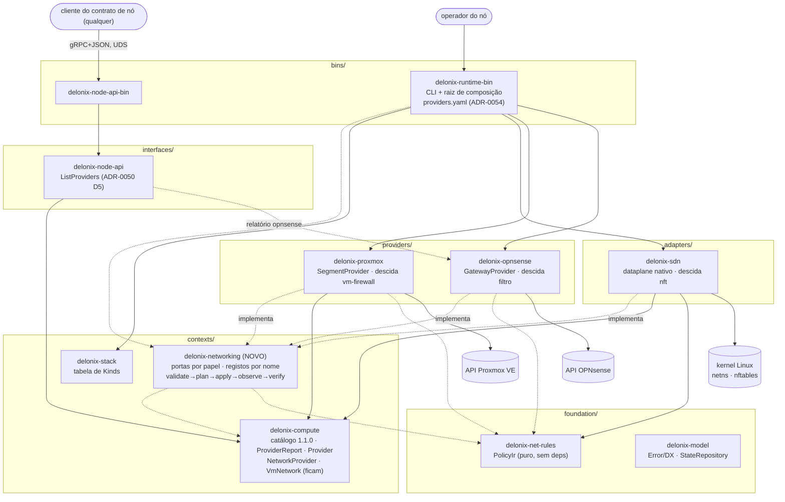
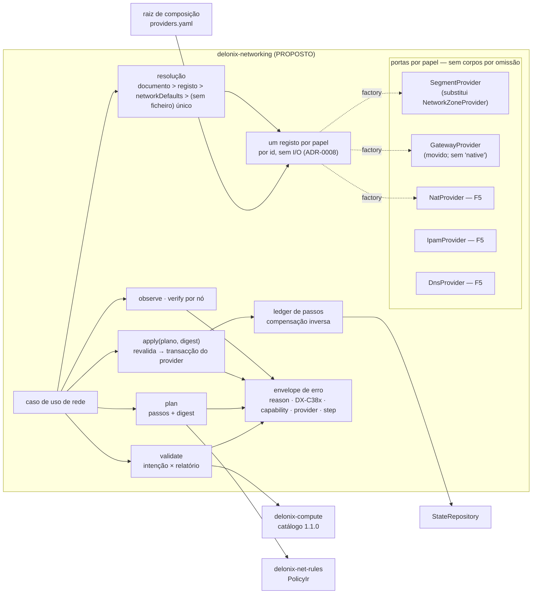

# 64 — Spike do ADR-0059: o que os providers de rede sabem dizer de si, medido

**Data:** 2026-09-27 · **Base:** medido em `origin/main` `d3d6f394` (v4.4.0 + 68); relido sobre `f46a73e9` (+ #544, #541, #545 e #542; as linhas citadas foram reconferidas) ·
**ADR:** [0059](../adr/0059-network-providers-by-role-lifecycle-and-policy-ir.md) (Proposed) ·
**Origem:** auditoria 62 (`docs/discovery/62_NAAS_FASE0_AUDITORIA.md`, #544), §7 sessão S5 e §10 pergunta 3.

Nada neste spike escreve num provider. Três fontes, cada uma com o que prova e o que não prova:

| Fonte | Como | Prova |
|---|---|---|
| O código e a matriz publicada | leitura em `origin/main` | o que o motor **declara** hoje |
| Nó de laboratório Proxmox `pve-lab-475` (PVE 9.2.2) | `GET`s só de leitura à API, e o `apidoc.js` do próprio nó | o que um provider **remoto responde**, e o que ele permite descobrir |
| Imagem OPNsense 26.1.2 do motor (`opnsense:26.1`) | `guestfish --ro` sobre a imagem, sem arrancar nada | que módulos de API o appliance **traz** — não que respondam |

## 1. A pergunta

O ADR-0059 decide um catálogo 1.1.0 com linhas `net.gateway.*`, `net.nat.*`, `net.lb.*`,
`net.dns.*`, `net.ipam.*`, `net.apply.*`, um `ProviderKind::Gateway` e portas por papel. O
spike responde: (a) o que o motor declara hoje para rede; (b) que factos um provider remoto
dá para preencher essas linhas por **descoberta** e não pelo nome; (c) se os nomes propostos
têm do outro lado uma API que os sirva, ou se ficam `not-implemented` / `unsupported`.

## 2. O que o motor declara hoje (código e matriz, `d3d6f394`)

- `docs/providers/capability-matrix.md` (gerada, igual a `delonix provider matrix` por teste):
  secção `network` com **20 linhas** — `linux` 7 supported, 10 partial, 2 unsupported,
  1 external; `proxmox` **0 supported**, 5 partial, 6 unsupported, 9 not-implemented.
  **Não existe linha `opnsense`**: o `GatewayProviderRegistration`
  (`crates/adapters/delonix-sdn/src/gateway.rs`) não tem `ReportFactory`, e a lista de
  relatórios é composta duas vezes sem ele (`cmd/provider.rs:117`,
  `delonix-node-api/src/providers.rs:18`).
- O relatório de rede do Proxmox (`delonix-proxmox/src/lib.rs:6300`) dá `net.ipam` e `net.dns`
  como `not-implemented`, embora o cliente SDN tenha rotas de IPAM e DNS testadas ao vivo
  (ADR-0049 fatia 2, #500). Está **certo**: nenhuma porta as alcança a partir de um Kind. É o
  intervalo que o F5 do ADR-0059 fecha.
- Quatro portas de rede, quatro formas diferentes (tabela do Context do ADR-0059). O
  `NetworkZoneRecord` não guarda o provider (`cmd/network_zone.rs:71`).

## 3. Proxmox SDN, ao vivo e só leitura

Alvo: `https://192.168.122.91:8006` (VM `pve-lab-475` no `qemu:///system`, já a correr),
autenticação por ticket com a credencial de teste documentada em
`crates/providers/delonix-proxmox/tests/live.rs`. Chamadas feitas, todas `GET`:

```
/version                         {"release":"9.2","version":"9.2.2"}
/cluster/status                  cluster lab: nós pve e pve2 online, quorate
/cluster/sdn                     vnets zones controllers ipams dns fabrics prefix-lists route-maps
/cluster/sdn/zones[?pending=1]   []            /cluster/sdn/vnets[?pending=1]  []
/cluster/sdn/controllers         []            /cluster/sdn/dns                []
/cluster/sdn/fabrics/all         {"fabrics":[],"nodes":[]}
/cluster/sdn/ipams               [{"type":"pve","ipam":"pve","digest":"1ccae0c2…"}]
/cluster/sdn/ipams/pve/status    [{"subnet":"10.250.7.0/24","zone":"prfz","vnet":"prfv",
                                   "ip":"10.250.7.1","gateway":1}]
/cluster/firewall/options        {"enable":1,"digest":"bb9ed914…"}
/nodes/pve/firewall/options      {"digest":"da39a3ee…"}          ← sem "nftables"
/nodes/pve/services              proxmox-firewall running · pve-firewall running
/nodes/pve/apt/versions          libpve-network-perl 1.6.5 · proxmox-firewall 1.2.3 ·
                                 pve-firewall 6.0.4 · dnsmasq 2.91 · ifupdown2 3.3.0
```

E do `apidoc.js` servido pelo próprio nó (`/pve-docs/api-viewer/apidoc.js`, 4,27 MB), os
parâmetros que decidem linhas do catálogo:

```
POST /cluster/sdn/zones            type ∈ {evpn, faucet, qinq, simple, vlan, vxlan}
                                   ipam, dns, dhcp ∈ {dnsmasq}, mtu, exitnodes, lock-token
POST /cluster/sdn/vnets/{v}/subnets  snat (masquerade), dhcp-range, gateway, lock-token
POST /cluster/sdn/ipams            type ∈ {netbox, phpipam, pve}
POST /cluster/sdn/dns              type ∈ {powerdns}
POST /cluster/sdn/lock             allow-pending (por omissão: recusa havendo pendentes)
DELETE /cluster/sdn/lock           lock-token, force
POST /cluster/sdn/rollback         lock-token, release-lock
PUT  /cluster/sdn                  lock-token, release-lock
POST /cluster/sdn/vnets/{v}/firewall/rules  type ∈ {in,out,forward,group}, action, proto,
                                   pos, log, icmp-type
```

### O que isto decide

1. **Há transacção nativa.** O lock global recusa por omissão enquanto houver alterações
   pendentes de outro, e aceita `rollback` com o token antes de aplicar. O #542 (fundido
   durante esta sessão) já o usa e mediu-o (`Client::sdn_transaction`,
   `sdn_lock.rs:452`, DX-5516/9525). Para o ADR-0059: `net.apply.staged` e
   `net.apply.rollback` podem nascer `supported` no Proxmox, com o teste ao vivo
   `sdn_routing_chain_vnet_firewall_and_the_lock_round_trip_through_the_node` como evidência; e «sem pendentes alheios» (S6) é uma pré-condição que o próprio nó
   impõe.
2. **Há digest por objecto** (IPAM, opções de firewall). Entra na impressão digital do
   `observe` do D4 — um plano fica obsoleto quando o digest de um objecto que usa muda, sem ter
   de comparar o corpo inteiro.
3. **Deriva observada, não suposta.** A IPAM `pve` guarda `10.250.7.0/24` da zona `prfz` /
   VNet `prfv`, que **já não existem** (zonas e VNets vazias, também no pendente). Uma corrida
   anterior apagou a zona e deixou a reserva. Não foi corrigido aqui (não é deste spike, e o
   nó é partilhado com a sessão do #542); fica como caso de teste do `observe` e da marca de
   posse: sem marca, ninguém sabe se `prfz` era do motor.
4. **Uma linha depende do host, não do provider.** Os dois serviços de firewall correm, mas a
   opção `nftables` do host não está posta: pelo #542, as regras de firewall de VNet ficam
   **guardadas e não aplicadas** nesse caso. No relatório descoberto, `firewall.*` da VNet é
   `unavailable-on-host` aqui — nunca `supported` por ser Proxmox.
5. **O veredicto de um apply cobre só o nó de entrada** (medido no #542 no mesmo laboratório:
   `reloadnetworkall` OK enquanto o `srvreload` do pve2 falhava). É a razão do `verify` por nó
   do D4.
6. **O que existe do outro lado para os papéis novos:** segmento (6 tipos de zona; o motor só
   cria `simple`), IPAM externa (3 plugins), DNS (só PowerDNS), DHCP (dnsmasq), NAT de origem
   (`snat` da subnet), gateway de saída EVPN (`exitnodes`). **Não há** balanceador de carga
   nem DNAT/port-forward na SDN.

### Relatório `proxmox`/`network` descoberto (rascunho nos nomes 1.1.0 — não é código)

| Linha | Estado proposto | Porquê |
|---|---|---|
| `net.segment.remote` | partial | `kind: NetworkZone` cria zona `simple` + VNets; sem teste ao vivo do Kind (addendum ADR-0049) |
| `net.ipam.provider` | not-implemented | cliente ao vivo (#500), sem porta — F5 |
| `net.ipam.reservation` | not-implemented | `PUT …/vnets/{v}/ips` ao vivo, sem porta |
| `net.ipam.dhcp` | not-implemented | `dhcp-range` ao vivo, sem porta |
| `net.dns.records` | requires-external-component | só PowerDNS, que o motor não traz |
| `net.nat.snat` | not-implemented | `snat` da subnet existe; sem porta |
| `net.nat.dnat`, `net.nat.one-to-one`, `net.lb.*` | unsupported-by-provider | a SDN não tem |
| `net.apply.staged`, `net.apply.rollback` | supported | live:`crates/providers/delonix-proxmox/tests/live.rs::sdn_routing_chain_vnet_firewall_and_the_lock_round_trip_through_the_node` (#542) |
| `net.observe` | partial | leitura de zonas/VNets/IPAM existe; sem comparação com o registo |
| `net.verify.dataplane` | not-implemented | nenhum probe de tráfego |
| `net.ownership-marker` | not-implemented | S6 |
| `firewall.*` (VNet) | unavailable-on-host neste nó | `nftables` do host desligado (ponto 4) |

## 4. OPNsense 26.1.2, pela imagem e sem arrancar

O appliance `opnsense-adr0051-spike` está **desligado** e esta sessão não tem a chave da API
(foi cunhada à mão na fase 0 do ADR-0051 e não ficou num sítio legível). Não se arrancou a VM:
o host é partilhado e o ADR-0051 trata isso como decisão do dono. Em vez disso, a imagem
publicada foi aberta só para leitura:

```bash
export SUPERMIN_KERNEL=/boot/vmlinuz-7.0.0-30-generic SUPERMIN_MODULES=/lib/modules/7.0.0-30-generic LIBGUESTFS_BACKEND=direct
guestfish --ro -a ~/.local/share/delonix/vm-images/opnsense_26.1.qcow2
# run; mount-vfs ro,ufstype=ufs2 ufs /dev/sda /   (UFS2 no disco inteiro, sem tabela de partições)
```

`/usr/local/opnsense/version/core`: `CORE_VERSION 26.1.2`, `CORE_PKGVERSION 26.1.2_5`,
`CORE_HASH 685ed6be1`. Controladores de API presentes
(`mvc/app/controllers/OPNsense/<Módulo>/Api/`):

| Módulo | Controladores | Linha do catálogo que pode servir |
|---|---|---|
| Firewall | `Alias`, `AliasUtil`, `Category`, `Filter`, `FilterBase`, `FilterUtil`, `Group`, `DNat`, `SourceNat`, `OneToOne`, `Npt`, `Migration` | `net.gateway.filter/alias/update-in-place/rule-order`, `net.nat.dnat/snat/one-to-one/npt`, `net.ownership-marker` (categorias) |
| Routes, Routing | `Gateway`, `Routes`, `Settings` | `net.gateway.multi-wan` (gateways e grupos) |
| Unbound | `Settings`, `Service`, `Overview`, `Diagnostics` | `net.dns.records` (overrides do resolvedor) |
| Kea, Dnsmasq | `Dhcpv4`, `Dhcpv6`, `Leases*`, `Settings` | `net.ipam.dhcp`, `net.ipam.reservation` |
| IPsec, OpenVPN, Wireguard | — | `net.gateway.vpn` |
| Interfaces | `Vlan`, `Vxlan`, `Bridge`, `Vip`, `Lagg`, … | fora de âmbito (administração do appliance) |
| **nenhum** HAProxy/relayd | — | `net.lb.*` = `requires-external-component` (plugin `os-haproxy`) |

Do `FilterBaseController.php` e do modelo `Filter.xml`:

- **Aplicar com recuo automático existe:** `savepointAction`, `applyAction($rollback_revision)`
  (arma um temporizador `filter rollback_timer`), `cancelRollbackAction`, `revertAction`. O
  cliente do motor (`delonix-opnsense`) chama só `apply` sem revisão. → `net.apply.rollback`
  `partial` (a API existe, nunca foi exercida).
- **Actualização e ordem existem na API, não no cliente:** `setRule`, `moveRuleBefore`,
  `toggleRuleLog`. → `net.gateway.update-in-place` e `net.gateway.rule-order` `not-implemented`
  (o ADR-0051 recusou adivinhar a forma do `set_rule`).
- **Uma regra tem** `sequence`, `log`, `statetype ∈ {keep, sloppy, modulate, synproxy, none}`,
  `categories`, `ipprotocol ∈ {inet, inet6, inet46}`, `direction ∈ {in, out, any}`,
  `action ∈ {pass, block, reject}`. Para o IR do D6: `stateful: false` desce para
  `statetype: none`; `log` para `log`; a ordem para `sequence`; um par por namespace/selector
  **não tem para onde descer** e é recusado.

### Relatório `opnsense`/`gateway` declarado (rascunho — não é código)

| Linha | Estado proposto | Evidência / porquê |
|---|---|---|
| `net.gateway.filter`, `net.gateway.alias` | supported | `crates/providers/delonix-opnsense/tests/live.rs` (fase 2 do ADR-0051) |
| `net.apply.staged` | supported | o mesmo teste: stage + `filter/apply` + `alias/reconfigure` |
| `net.gateway.update-in-place`, `net.gateway.rule-order` | not-implemented | API presente, cliente não |
| `net.apply.rollback` | partial | `savepoint`/`apply(rev)`/`cancelRollback` na imagem, nunca exercido |
| `net.nat.dnat/snat/one-to-one/npt` | not-implemented | controladores presentes, sem cliente |
| `net.gateway.multi-wan`, `net.gateway.vpn` | not-implemented | módulos presentes, fora do F1–F5 |
| `net.dns.records`, `net.ipam.dhcp/reservation` | not-implemented | Unbound/Kea presentes |
| `net.lb.*` | requires-external-component | nenhum controlador na imagem |
| `net.ownership-marker` | not-implemented | `categories` é a candidata — S6 decide |
| `net.namespace-isolation`, `firewall.workload-peer`, as restantes `net.*` locais | unsupported-by-provider | o appliance não conhece os namespaces do motor |

## 5. C4 do desenho proposto

Desenhado pelo agente `martin` a partir do código em `d3d6f394` (setas contínuas = existe;
tracejadas = proposto). Só vai para o `ARCHITECTURE.md` se o ADR for aceite.

### 5.1 Nível 2 — crates por camada



Desaparecem as excepções `("dep","delonix-opnsense","delonix-sdn")` e
`("dep","delonix-proxmox","delonix-sdn")` (`scripts/arch_fitness.py:140,147`). A seta
`net → comp` é a única entre os dois contextos; `comp → net` fica proibida (ADR-0059 D7).

### 5.2 Nível 3 — dentro de `delonix-networking`



### 5.3 Sequência — `stack apply` de um `kind: NetworkZone`

```mermaid
sequenceDiagram
  autonumber
  actor Op as operador do nó
  participant CLI as delonix-runtime-bin
  participant UC as delonix-networking
  participant Reg as registo segment
  participant Px as delonix-proxmox
  participant PVE as API Proxmox VE
  participant St as StateRepository
  Op->>CLI: stack apply -f zona.yaml
  CLI->>Reg: providers.yaml → register("proxmox") (sem I/O)
  CLI->>UC: validate(documento)
  UC->>St: registo da zona (provider que a serviu?)
  UC->>Reg: resolve: registo > networkDefaults.segment
  break sem nome, ou nome não registado para o papel
    UC-->>CLI: invalid_intent / unsupported_capability
  end
  UC->>Px: capabilities() → linhas requeridas
  break linha não utilizável
    UC-->>CLI: unsupported_capability (linha, estado, detalhe)
  end
  UC->>Px: observe(zona)
  Px->>PVE: GET zones, vnets, digests
  UC->>UC: plano + digest(intenção, observado, provider, catálogo)
  CLI->>UC: apply(plano, digest)
  UC->>Px: observe de novo
  break digest diferente
    UC-->>CLI: stale_plan — nada escrito
  end
  UC->>Px: transacção (POST /cluster/sdn/lock, recusa com pendentes alheios)
  loop cada passo (zona, depois VNets)
    UC->>St: ledger: passo pendente
    UC->>Px: ensure_* (com lock-token)
    UC->>St: ledger: passo feito
  end
  alt falha antes de activar
    UC->>Px: POST /cluster/sdn/rollback
    UC-->>CLI: o erro do passo (reason, DX, step) + ledger; nada activado
  else activa
    UC->>Px: PUT /cluster/sdn (token, release-lock=1)
    UC->>Px: verify em cada nó (pve, pve2)
    UC->>St: registo {vnets, provider: "proxmox"}
    UC-->>CLI: aplicado; verified: control-plane-only
  end
```

## 6. O que este spike NÃO validou

- Nenhuma escrita, lock ou rollback (o lock do Proxmox foi medido pelo #542, não aqui; o
  recuo automático do OPNsense nunca foi exercido).
- A API do OPNsense a responder: a imagem prova que os controladores existem, não que o
  appliance configurado responda nem a forma dos corpos (só `filter`/`alias` foram medidos, na
  fase 0 do ADR-0051).
- Os relatórios acima como código, e a tabela dourada de equivalência do D6.
- O segundo nó (`pve2`) por chamada própria: o estado por nó veio do #542.
- A origem da reserva órfã `prfz`/`prfv` — registada, não investigada.

## 7. Reproduzir

```bash
# Proxmox (só leitura): ticket com a credencial de tests/live.rs, depois
curl -sk -b "PVEAuthCookie=$TICKET" https://192.168.122.91:8006/api2/json/cluster/sdn/ipams/pve/status
curl -sk https://192.168.122.91:8006/pve-docs/api-viewer/apidoc.js -o apidoc.js   # parâmetros por rota
# OPNsense (offline): o guestfish da §4, depois
#   ls /usr/local/opnsense/mvc/app/controllers/OPNsense/Firewall/Api
#   cat /usr/local/opnsense/version/core
```
