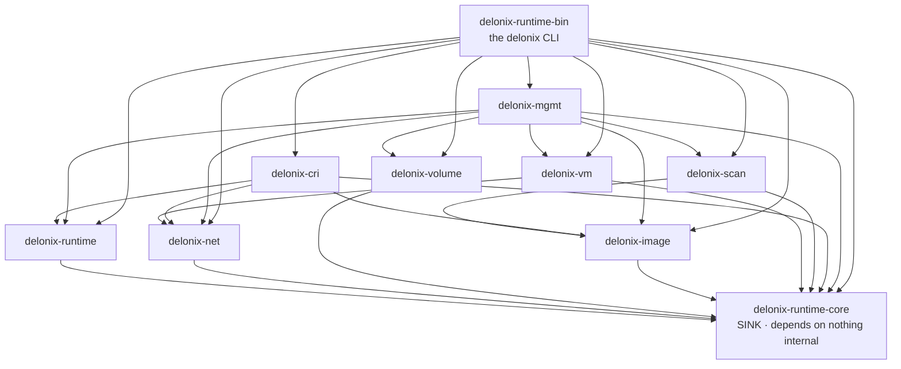

# Delonix Runtime — Dependency Map (Phase 1 discovery)

> **Method.** Internal edges extracted from each crate's `[dependencies]` on 2026-07-30.
> External-dependency invariants (`cargo tree -e normal`) should be re-run before any release;
> this document records the *internal* graph and the layering rules it must obey.

## 1. Internal dependency graph (confirmed edges)

## 2. Properties (verified)

- **Acyclic.** No cycles. `delonix-runtime-core` is the unique **sink** (imports nothing
  internal); `delonix-runtime-bin` is the unique **source** (the CLI wires everything).
- **Layered.**
  - **L0 — core:** `delonix-runtime-core` (types, stores, events, telemetry, metrics, secrets).
  - **L1 — engines:** `runtime`, `net`, `volume`, `image` (each → core only).
  - **L2 — composed engines:** `vm` (→ core, net), `scan` (→ core, image).
  - **L3 — servers:** `cri`, `mgmt` (fan-in over multiple engines).
  - **L4 — CLI:** `bin` (depends on all).
- **No private-repo edge.** Zero references to `delonix-core`/`delonix-api`/
  `delonix-orchestrator`/`delonix-overlay`. **Regra de ouro #1 holds.**

## 3. Invariants this graph must preserve

1. **Engine crates stay dependency-clean of UI/CLI libraries.** `ratatui`/`crossterm` (TUI),
   `hyper`/`hyper-util`/`tokio-rustls`/`rcgen` (L7 proxy), `serde_yaml` (manifests), `clap` are
   confined to `delonix-runtime-bin`. `cargo tree -e normal` of any L0–L2 crate must not surface
   them. (`ratatui` is the one documented UI exception — and it lives only in `-bin`.)
2. **`core` never grows an internal dependency.** It is the sink by design; anything it would
   need to import from an engine is a signal to move that type *down* into core, not to add an
   up-edge. (Precedent: `peer_uid` consolidated into `core::peer_cred`; `workload_net` constants
   pulled down so `net` and the tunnel guard can't drift.)
3. **New engine dependencies go through an ADR.** Adding an external crate to any L0–L2 engine
   widens the supply-chain surface of a container runtime — matter for `delonix-adr`, not a
   silent `Cargo.toml` edit.
4. **Fan-in servers (`cri`, `mgmt`) may depend on many engines, never on `bin`.** The CLI is the
   top; a server reaching *up* into `bin` would invert the graph.

## 4. Structural risks (for the architecture campaign)

- **`delonix-runtime-bin` is a 38 kLOC god-crate** — 54 % of all source, 44 `cmd/*` modules. It
  is where the product lives, but also where the most-duplicated logic sits (the triplicated
  `vm`/`image vm`/`image --vm` paths, the compose/pod/docker-api schema translators). The
  `Workload` unification (vision Phase 1) is largely a **`-bin` refactor**, and any move of a
  trait *down* into core (vision Phase 2) has to extract it out of here without dragging CLI deps.
- **`spawn()` (~405 lines, `delonix-runtime/lib.rs`)** — the single riskiest function; its
  correctness depends on an ordering only documented in comments ("CRITICAL ORDER"). Any engine
  refactor that reorders its blocks risks reintroducing a documented deadlock. Treat as a
  quarantined hotspot.
- **`vm → net` is the only cross-engine edge at L2.** If a second compute backend (Firecracker,
  Proxmox-node) is added under a *generic* driver trait (vision Phase 2), decide deliberately
  whether that trait lives in `core` (clean, but `core` must not learn about `net`) or in a new
  thin `delonix-compute` crate — this is an ADR, and it directly constrains this edge.
