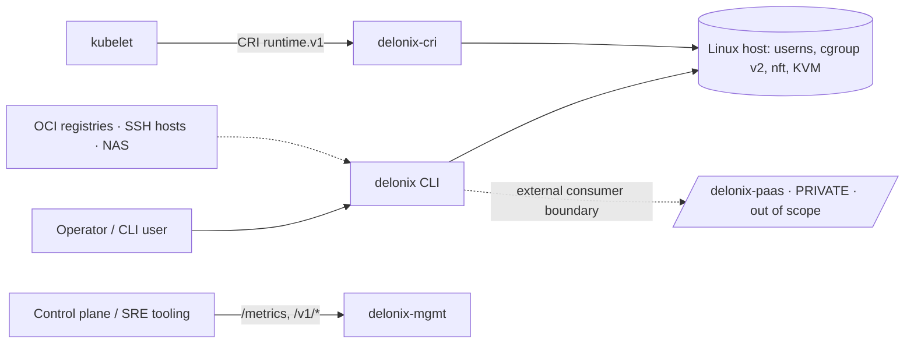

# Delonix Runtime — Architecture & Target Matrix (Phase 1 discovery)

> **Method.** C4-style view ground-truthed from code (2026-07-30). The value of this document is
> §4: an honest mapping of the "14-engine Cloud Runtime" target vision onto what exists, what
> fits the repo's constitution, and what needs an ADR or a GO/NO-GO spike before it is even a
> decision. Companion to [current-state.md](current-state.md) and
> [dependency-map.md](dependency-map.md). Diagrams and flows are `martin`'s domain
> (`ARCHITECTURE.md`); this doc decides direction, per the `delonix-adr` skill.

## 1. Context (C4 L1)

The runtime is a **node-level execution engine**. It does not know about tenants, billing, or a
fleet — those live across the boundary in `delonix-paas`. It is *consumed by* a control plane;
it is not one.

## 2. Containers / processes (C4 L2)

- **`delonix` CLI** — ephemeral, one process per command.
- **`delonix-cri` server** — long-running, serves a kubelet on a unix socket.
- **`delonix-mgmt` server** — long-running, serves `/metrics` + `/v1/*`.
- **network holder** — long-running, owns the SDN netns (`control_loop`), `SO_PEERCRED`-gated.
- **per-workload helpers** — slirp4netns (per container/ingress), the L7 `ingress-proxy`, the
  log shim, VM hypervisor processes. Spawned on demand, torn down with the workload.

No permanent product daemon. (§6 of current-state.md on the daemonless nuance.)

## 3. Components (C4 L3) — the *actual* engines today

The vision names 14 engines. Today the functional decomposition is **10 crates** (dependency-map
§1). The mapping is not 1:1 — several "engines" already exist as modules inside a crate, and
several are absent. §4 makes this precise.

Representative real flows (kept high-level; `martin` owns the sequence diagrams):
`container run` rootless (clone → userns → cgroup → pivot_root → seccomp → exec, via `spawn()`);
port publish (per-container slirp `hostfwd` + nft DNAT, or the single ingress slirp);
CRI pod (sandbox netns → member join via re-exec); cluster bootstrap (golden image → VM →
kubeadm over SSH).

## 4. Target vision → reality matrix (the honest part)

Legend: **✅ Exists** (real, wired) · **🟡 Partial** (seed present, not first-class) ·
**⛔ Absent** (no code) · **🚧 Out of bounds** (belongs to `delonix-paas`, per Regra de ouro) ·
**⚠️ Philosophy change** (needs its own ADR before it is a decision).

| Vision engine / goal | Status | Reality & verdict |
|---|---|---|
| **Runtime Core** (scheduling, lifecycle, event routing, capability validation, plugin loading) | 🟡 | `delonix-runtime-core` exists as *types + stores + foundations*, **not** as an orchestrating core. It has no task scheduler, no plugin loader, no capability validation. "Core coordinates engines" is an aspiration; today the **CLI** (`-bin`) is the coordinator. Building a coordinating core is real work — start with the `Workload` model (Phase 1), not a scheduler. |
| **VM Engine** (KVM/QEMU/libvirt/Firecracker; snapshot/clone/migrate/suspend/resume/resize/TPM/secure-boot) | 🟡 | `VmBackend` trait (CH + libvirt) covers **create/boot/stop/is_running/ip** only. Snapshot/clone/suspend/resume/**live-migrate** are **not** trait methods (some exist as thin CLI flags). Firecracker = new `VmBackend` impl behind a **GO/NO-GO spike**. Live migration is a large, separate ADR. |
| **Container Engine** (OCI/CRI/rootless/ns/cgroup v2/seccomp/caps) | ✅ | Real and mature (`delonix-runtime` + `delonix-cri`). AppArmor/SELinux are abstracted, not enforced — closing that is a scoped, in-bounds task. |
| **Network Engine** (bridge/VXLAN/WireGuard/DNS/DHCP/NAT/firewall) | ✅ / 🟡 | Rootless SDN, nft firewall, WireGuard overlay, internal DNS, L7 proxy — all real. **OVS/SR-IOV/macvlan-realized** are ⛔ (rootless can't take host-side `CAP_NET_ADMIN`; macvlan/ipvlan are registered-but-not-realized *by design*). |
| **Storage Engine** (local/Ceph/ZFS/LVM/NFS/SMB/Object/CSI; snapshot/clone/quota/encrypt/replicate) | 🟡 / ⛔ | Local volumes + network storage (NFS/CIFS/WebDAV) exist. **Ceph/ZFS/LVM/Object/CSI = ⛔ absent.** A `StorageDriver` trait is a reasonable Phase-2 target; CSI specifically edges toward orchestrator concerns — scope carefully in an ADR. |
| **Image Engine** | ✅ | `delonix-image` — pull/build/registry/CNB/CAS/**signature verification**. |
| **Event Engine / Event Bus** | ✅ | **Already exists, daemonless:** `core/events.rs` (`events.jsonl`, append-only, lock-free, wired). "Consumable by DKS/PaaS" = they tail the file. Do **not** replace this with a daemon bus (⚠️) without an ADR proving the file model is insufficient. |
| **Metrics Engine** | ✅ | `core/metrics.rs` Prometheus registry, exposed at `/metrics` by cri + mgmt. |
| **Observability** (OTel / tracing / structured logs) | ✅ | `core/telemetry.rs` — `tracing` + OTLP spans, working in both tokio and non-tokio processes. Present, not to-build. |
| **Plugin Engine** (dynamically discoverable) | ⛔ / ⚠️ | Today: one static `select_backend` match. **Dynamic plugin loading** (`dlopen`/ABI) is a large security & supply-chain surface for a container runtime — ⚠️ its own ADR + spike. A **compile-time trait-object registry** is the far cheaper, in-idiom alternative; prefer it. |
| **Security Engine / Zero-Trust / Capability model** (identity+capability+tenant+audit per request) | ⛔ / 🚧 | Today: `SO_PEERCRED` uid + Linux primitives, **no app-level RBAC**. A **capability model** (VM_CREATE, NETWORK_ATTACH…) *without tenancy* could fit and is worth an ADR. But **identity + tenant + audit-context on every request is 🚧 out of bounds** — that is `delonix-paas`. Do not import tenancy here. |
| **Recovery Engine** (checkpoint/restore/DR/cyber-recovery) | 🟡 / 🚧 | `checkpoint_container` is *declared* in the CRI surface (impl depth **unverified** — confirm before claiming CRIU). Container/VM checkpoint-restore could fit as an in-bounds engine. **Fleet DR / cyber-recovery orchestration is 🚧** (control-plane/PaaS). |
| **Migration Engine** (live migration) | ⛔ / ⚠️ | No code. Live migration is one of the hardest features in the list — its own multi-session ADR + spike, not an incremental step. |
| **Snapshot Engine** | 🟡 | Backing exists for VM overlays and CAS; not a unified first-class engine. |
| **Runtime API** (versioned/typed/idempotent/authz/observable) | 🟡 | `delonix-mgmt` `/v1/*` + the Docker-API slice exist and are `SO_PEERCRED`-authed and observable; they are **not** versioned/authorized in the RBAC sense the vision means. |
| **`kind: Workload` unified model** (`spec.type: container\|vm\|microvm`) | ⛔ | The stated product North Star. Absent today. **This is the correct Phase-1 target** — a thin declarative object + dispatcher over the existing container/vm paths, zero new backend. Needs a design ADR for the schema first. |
| **HA / survive control-plane loss** | ✅ (partial) | Already largely true *by architecture*: the runtime is daemonless and control-plane-independent — workloads keep running when the mgmt API is down. "Survive host restart" (auto-restore workloads) overlaps the Recovery Engine. |
| **Multi-Tenant / Cloud-Native platform / independent Control Plane / multi-node scheduler** | 🚧 | Explicitly **out of bounds**. This repo is a node runtime, not an orchestrator or a multi-tenant platform. These are `delonix-paas`. |
| **90 % coverage · fuzz · bench** | ⛔ (infra) | Only `proptest` (in `delonix-net`) exists. No criterion/cargo-fuzz. A coverage/fuzz/bench initiative is real, in-bounds work — see the `delonix-testing` skill and `qa-runtime`/`performance-engineer` agents. (90 % is a goal to *approach*, not a gate to assert.) |

## 5. Recommended sequencing (incremental, constitution-respecting)

1. **Confirm & publish this discovery** (these 3 docs) — done in Phase 1.
2. **ADR-0001: `kind: Workload` schema** — the North Star, and the cheapest high-value move: a
   declarative object + dispatcher over the *existing* container/vm code. No new backend, no daemon.
3. **ADR-0002: extract a generic compute driver trait** from `VmBackend` (Phase 2) — decide where
   it lives without giving `core` a `net` edge (dependency-map §4).
4. **ADR-0003: capability model (tenancy-free)** — VM_CREATE / NETWORK_ATTACH / VOLUME_CREATE as
   engine-level capabilities checked at the API boundary, *without* identity/tenant/audit context.
5. **Everything ⚠️/🚧 stays parked** behind its own ADR/spike: dynamic plugins, live migration,
   any daemon, any tenancy. None is an incremental step.
6. **In-bounds hardening in parallel** (no ADR needed): AppArmor/SELinux enforcement, VM
   snapshot/restore as trait methods, coverage/fuzz/bench infra, `checkpoint_container` verification.

## 6. Guardrails (restated — any decision violating one is wrong)

Daemonless by design · no tenant/licence/billing · no private-repo dependency · engine crates
dependency-clean · GO/NO-GO spike before any new privilege boundary · no silent failure
(fail-closed). See the `delonix-adr` skill for the full checklist. **"Never replace working
components without technical justification"** (the brief's own rule) applies with full force to
the ✅ rows above — Event/Metrics/Observability are *done*, in the daemonless idiom; a rewrite of
any of them must first prove the current design insufficient in an ADR.
